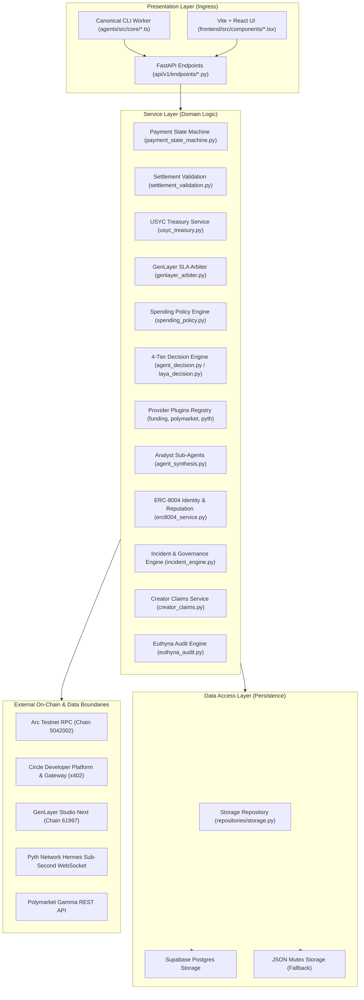
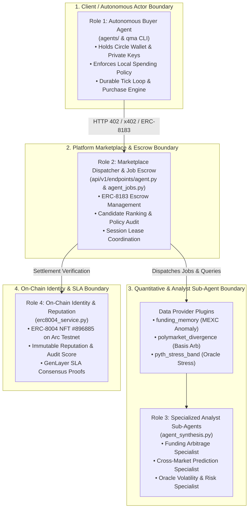
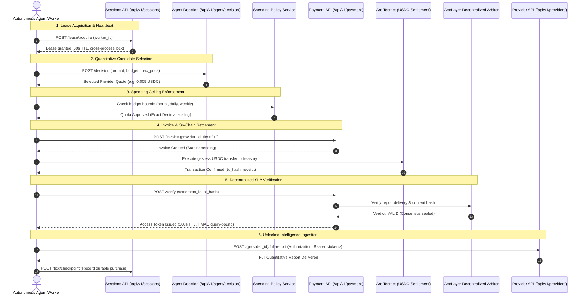
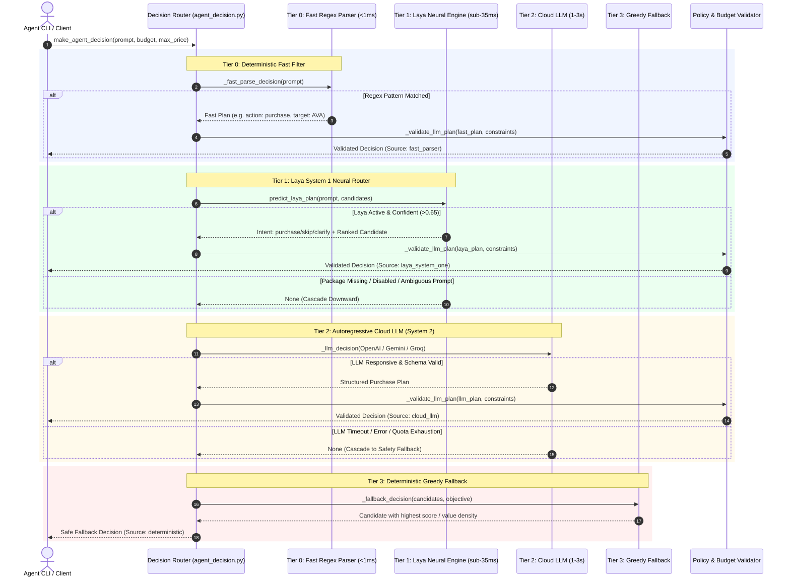
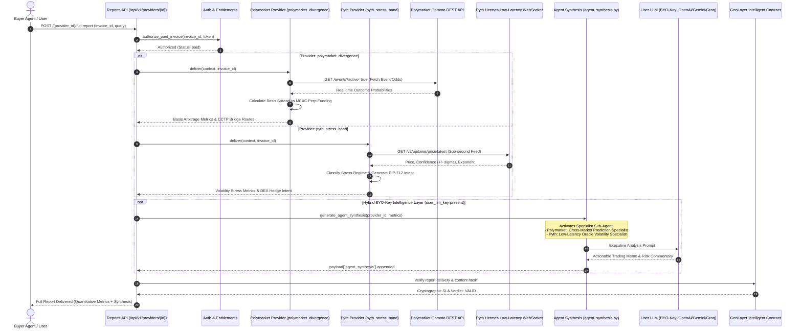
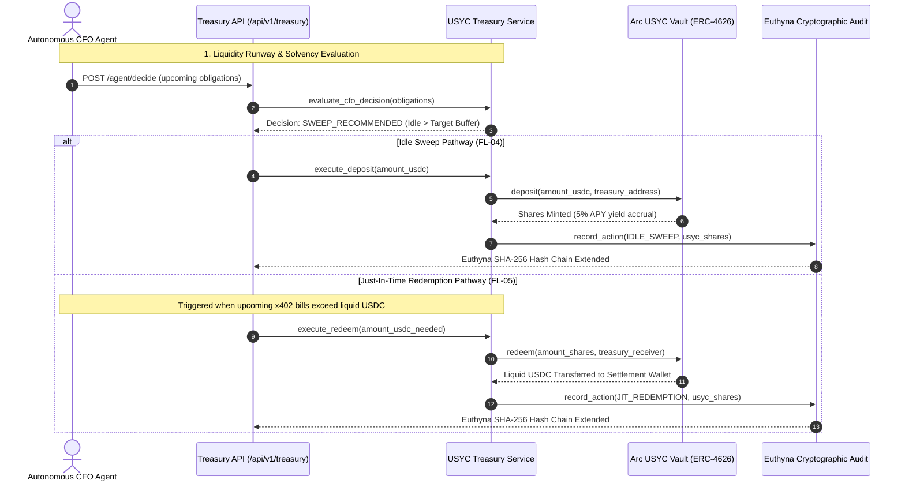
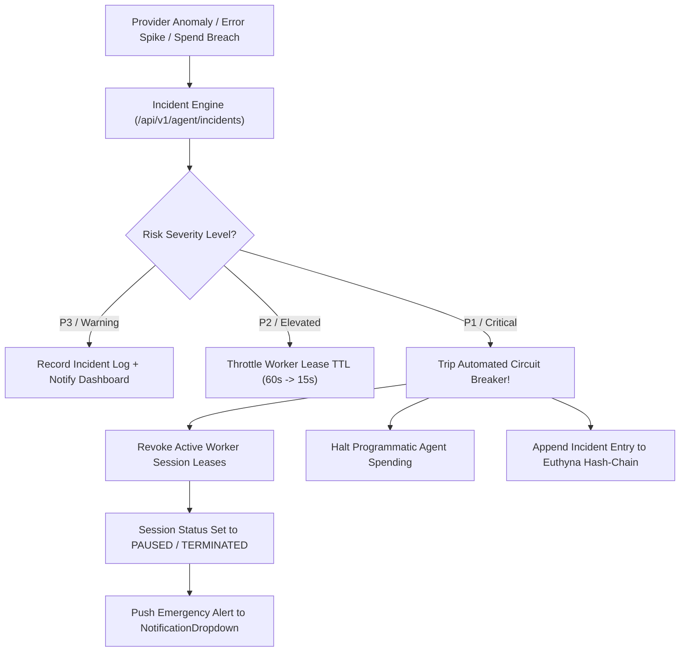

# QMA Definitive Architecture Specification (ARCHITECTURE.md)

**Version**: 2.1-Definitive  
**Protocol Alignment**: CRCIP Phase 8 (Architecture Specification — Single Doc)  
**Status**: Authoritative & Machine-Verified  
**Repository Target**: `main` (Production Autonomous Agent Wallet & Intelligence Platform)

---

## 1. Executive Overview & Architectural North Star

**QMA** (or **GenQMA**) is an autonomous quantitative intelligence and treasury management platform operating natively on the **Arc blockchain** (Chain ID `5042002` / `5042`) with USDC native gas settlement, augmented by decentralized intelligent contract consensus on **GenLayer** (Chain ID `61997`).

The platform provides a dual-interface architecture:
1. **Autonomous Machine-to-Machine Commerce**: AI agents running the canonical CLI (`@hoanlv214/qma-cli` / `$ qma agent run`) autonomously evaluate, acquire, and settle intelligence assets using programmable Circle agent wallets via HTTP 402 / x402 protocols.
2. **Autonomous Corporate CFO & Treasury Management**: Continuous automated optimization of platform and agent liquidity, autonomously sweeping idle USDC cash into tokenized USYC yielding vaults (ERC-4626) and executing Just-In-Time (JIT) redemptions for operational bill payment under Athenian Euthyna cryptographic audit logging.

---

## 2. Section 1: As-Is Architecture (Baseline & Refactoring History)

### 2.1 The Baseline State & Architectural Evolution

Prior to the Controlled Refactoring & Codebase Intelligence Protocol (CRCIP), the codebase exhibited classic monolithic growth patterns:
- **God-File Monolith (`main_ref.py`)**: A legacy 2,600+ line God-File contained competing implementations of routes, storage access, payment flows, and data scrapers. It is permanently retained as an unimported, read-only reference snapshot for regression testing.
- **Render Compatibility Shim (`main.py`)**: The repository root maintains `main.py` as a backward-compatible shim importing the FastAPI `app` from `backend.app.main:app`. This preserves Render deployment compatibility (`render.yaml`) without mutating external cloud start commands (**DEBT-01**).
- **Storage Dual-Write Evolution**: The platform historically operated on JSON flat-file storage (`paid_reports.json`, `payment_ledger.json`, `agent_sessions.json`). CRCIP successfully established `backend/app/repositories/storage.py` and Supabase PostgreSQL persistence as the primary storage layer, retaining the root `storage.py` wrapper for backward compatibility (**DEBT-02**).

### 2.2 Rebuild Decisions & Superseded Patterns

Per the official Decision Log (`docs/architecture/DECISIONS.md`), critical architectural pivots were formalized:
1. **D-06 (Single Settlement + GenLayer SLA Gate)**: Superseded legacy split settlement (`x402_direct_split`, **D-05**). Previously, two independent on-chain payment legs were required (one to creator, one to platform), creating race conditions and dual-signature friction. Under D-06, a single unified payment settles to the platform treasury; delivery is cryptographically held until the GenLayer intelligent contract verifies report delivery quality. Creator payouts are decoupled into an idempotent, on-demand claim mechanism (**FL-09**).
2. **D-04 (Intelligence Marketplace vs Scanners)**: Shifted framing from legacy crypto market data crawlers to an open, multi-provider intelligence marketplace where providers, creator earnings, agent buyers, and settlement modes are first-class domain models.

### 2.3 Refactoring Debt Extinguished (Phases 3–7)

During CRCIP execution, the following major code duplications and architectural debts were systematically eliminated and verified across 301 backend tests and 35 frontend tests:
- **DUP-01 (`normalize_address`)**: Consolidated disparate Ethereum address formatting functions across root `storage.py`, `repair_supabase_payments.py`, and endpoint modules into a single canonical helper in `backend/app/services/wallet_utils.py`.
- **DUP-02 (`has_fabricated_settlement`)**: Replaced dispersed synthetic bypass checkers with the canonical predicate in `backend/app/services/payment_state_machine.py`, eliminating unauthorized mock payment acceptance.
- **DUP-03 ~ DUP-08 (Service & Math Unification)**: Delegated Circle settlement and Arc batch lookups to pure `x402_gateway.py`; replaced inline raw USDC math with centralized `usdc_to_raw` / `raw_usdc_to_float`; consolidated settlement status branching into `_assert_accepted_settlement_status`.
- **Frontend Dead Code & Duplications**: Removed 9 obsolete modals and stores (`AgentBuyerModal`, `ModalShell`, `invoiceStore`, `reportStore`, etc.); centralized `shortAddress` in `frontend/src/utils/format.ts`; decoupled heavy 800-line hook invocation from `AppPage.tsx`.
- **Concurrency & State Locking (Phase 6)**: Hardened `JsonStorage.rpc` in `storage.py` with cross-process file locks (`agent_sessions_rpc`) and in-process mutexes, eliminating race conditions during worker session polling and heartbeat leases.

---

## 3. Section 2: Target Architecture (To-Be / Production State)

### 3.1 Monorepo Top-Level Topology

```text
genqma/
├── backend/app/                 # Authoritative Python/FastAPI Backend Service
│   ├── api/v1/endpoints/        # Public API Endpoints (APIRouter modules: agent, payments, reports, etc.)
│   ├── core/                    # System Configuration, Security Schemes, Constants, Registry
│   ├── models/                  # Internal Domain Models & Entity Definitions
│   ├── repositories/            # Storage Abstraction (JsonStorage / SupabaseStorage)
│   ├── schemas/                 # Pydantic v2 Request/Response Data Transfer Objects
│   └── services/                # Authoritative Domain Business Logic & Services
│       ├── plugins/             # Provider Plugins (funding_provider, polymarket_provider, pyth_provider)
│       ├── agent_decision.py    # 4-Tier Decision Engine Cascade (Regex -> Laya -> LLM -> Greedy)
│       ├── laya_decision.py     # Laya Non-Autoregressive System 1 Neural Router (<35ms)
│       ├── agent_synthesis.py   # Hybrid BYO-Key Domain Analyst Sub-Agents
│       ├── erc8004_service.py   # On-Chain ERC-8004 Agent Identity & Reputation Service
│       └── ...                  # Payment, Treasury, Spending Policy, and Settlement Engines
├── frontend/                    # Modern Vite + React 19 Frontend Application
│   ├── src/app/                 # Route Declarations & Global Context Providers
│   ├── src/components/          # Modular Presentation Components (Reports, Treasury, Swap)
│   ├── src/hooks/               # Custom React Hooks (usePayment, useAgentBuyer, etc.)
│   ├── src/services/            # Client SDK Adapters (Reown AppKit, Circle Onramp, Swap Kit)
│   └── src/utils/               # Pure Utilities, Formatting, & Math Helpers
├── agents/                      # Canonical Autonomous Agent CLI & SDK (@hoanlv214/qma-cli)
│   ├── bin/qma.js               # CLI Executable Entrypoint ($ qma agent run)
│   ├── src/core/                # Session Engine, Durable Tick Loop, Agent Planner
│   ├── src/payment/             # Arc Gasless Settlement Executor & Proof Guards
│   └── scripts/                 # Deterministic Concurrency & Smoke Test Harnesses
├── arc_gateway/                 # Independent Node/TypeScript Microservice (Deployed on Render)
├── docs/                        # Authoritative Architecture, Security, & API Specifications
└── tests/                       # Automated Regression Test Suite (301 backend, 35 frontend, 12 agent)
```

---

### 3.2 Layer Hierarchy & Dependency Boundaries

To guarantee testability, maintainability, and security, dependencies flow strictly downward:



---

### 3.3 Multi-Agent Role Taxonomy & Security Boundaries

In an Agent-to-Agent (A2A) economic platform, **roles must maintain strict cryptographic and execution isolation**. The system defines 4 distinct, decoupled Agent roles:



1. **Role 1: Autonomous Buyer Agent (`agents/`, `@hoanlv214/qma-cli`, Python SDK)**:
   - **Responsibility**: Represents the client/trader. Runs client-side or in an isolated container.
   - **Security Invariant**: Retains custody of its own Circle Developer-Controlled or User-Controlled Wallet. Private keys and spending OTPs **never pass through backend storage**.
2. **Role 2: Marketplace Dispatcher & Escrow Arbiter (`backend/app/api/v1/endpoints/agent.py`)**:
   - **Responsibility**: Coordinates task intake via **ERC-8183 (Escrow Task Standard)**, audits spending policies, verifies lease locks, and routes requests to appropriate data providers.
3. **Role 3: Specialized Analyst Sub-Agents (`backend/app/services/agent_synthesis.py`)**:
   - **Responsibility**: Translates raw quantitative mathematics into domain-specific executive trading strategy memos. Implements a **BYO-Key (Bring Your Own Key)** architecture:
     - *Scenario A (Default)*: Delivers pure quantitative metrics ($0 server inference cost).
     - *Scenario B (BYO-Key)*: Dispatches domain specialists (`Cross-Market Prediction Specialist` for Polymarket, `Low-Latency Oracle Volatility Specialist` for Pyth) using client-supplied keys without server retention.
4. **Role 4: On-Chain Agent Identity & Reputation (`backend/app/services/erc8004_service.py`)**:
   - **Responsibility**: Maintains the immutable on-chain passport of QMA on Arc Testnet (**ERC-8004 Token ID `#896885`**). Stores audit trails, execution proofs, and GenLayer SLA consensus verdicts.

---

### 3.4 Quantitative Intelligence Provider Catalog & Data Sourcing

The platform registers 3 primary quantitative intelligence plugins in `backend/app/core/provider_registry.py`:

| Provider ID | Plugin Class & Source | Data Sourcing Protocol | Primary Signal & Output Payload | Execution Mode |
|---|---|---|---|---|
| **`funding_memory`** | `FundingProviderV2`<br>([`funding_provider.py`](file:///c:/Users/Admin/Downloads/code/genqma/backend/app/services/plugins/funding_provider.py)) | MEXC Contract API (`/contract/funding_rate`) + historical analog clusters | Disparity between perp funding and spot trends; liquidation squeeze risk; historical win-rate analogs. | **Continuous Live Scanning** (`scan_live_anomalies` feeds the real-time sidebar & ticker). |
| **`polymarket_divergence`** | `PolymarketDivergenceProviderV2`<br>([`polymarket_provider.py`](file:///c:/Users/Admin/Downloads/code/genqma/backend/app/services/plugins/polymarket_provider.py)) | Polymarket Gamma API (`gamma-api.polymarket.com/events`) + MEXC Funding Rate | Event probability vs perpetual futures implied odds; **Basis Arbitrage** signals; Kelly capital sizing; **Circle CCTP** route parameters (Polygon $\leftrightarrow$ Arc). | **On-Demand Intelligence Oracle** (Triggered via `POST /full-report` or `/preview`). |
| **`pyth_stress_band`** | `PythStressBandProviderV2`<br>([`pyth_provider.py`](file:///c:/Users/Admin/Downloads/code/genqma/backend/app/services/plugins/pyth_provider.py)) | Pyth Network Hermes Protocol (`hermes.pyth.network/v2/updates/price/latest`) | Sub-second confidence interval spread ($\pm \sigma$); tail-risk regime classification (`CALM` $\rightarrow$ `CRITICAL_VOLATILITY`); cryptographic **EIP-712 Execution Intent** for automated DEX hedging on Arc. | **On-Demand Intelligence Oracle** (Triggered via `POST /full-report` or `/preview`). |

> [!NOTE]
> **Why Polymarket & Pyth are not on the Live Ticker:**
> The real-time sidebar ticker polls `GET /api/v1/providers/funding_memory/live-anomalies`. Polymarket and Pyth are designed as heavy, event-driven quantitative oracles queried per-asset on demand. They require targeted parameters (`symbol`, event slug, feed ID) and deliver high-value actionable execution payloads (Kelly sizing, EIP-712 trade intents) rather than superficial price tickers.

---

## 4. End-to-End System Diagrams

### 4.1 FL-01: Autonomous Buyer Intelligence Procurement

The primary machine-to-machine loop where an autonomous agent procures intelligence, settles on Arc, and receives cryptographically verified payloads:



---

### 4.2 FL-02: 4-Tier Decision Engine Cascade (Fast Parser $\rightarrow$ Laya $\rightarrow$ Cloud LLM $\rightarrow$ Greedy)

Implemented in [`backend/app/services/agent_decision.py`](file:///c:/Users/Admin/Downloads/code/genqma/backend/app/services/agent_decision.py), the `make_agent_decision(...)` pipeline routes agent prompts with extreme latency and cost efficiency:



---

### 4.3 FL-03: Cross-Market Provider Execution & Hybrid BYO-Key Synthesis

Shows how specialized quantitative providers (`polymarket_divergence`, `pyth_stress_band`) ingest real-time market feeds and synthesize actionable strategies:



---

### 4.4 FL-04 & FL-05: Autonomous Corporate Treasury & USYC Yield Engine

The continuous liquidity management engine optimizing idle corporate reserves:



---

### 4.5 FL-06: Incident Governance & Circuit Breakers

The automated safety mechanism preventing runaway spend or cascading provider anomalies:



---

## 5. Invariants, Error Handling & Idempotency Controls

### 5.1 Financial Invariants
1. **Strict 6-Decimal Currency Math**:
   - Arc native USDC and USYC shares operate on 6 decimals (`1 USDC = 1,000,000 raw micro-units`).
   - Float-to-integer conversions are strictly governed by `usdc_to_raw` and `raw_usdc_to_float`.
   - Policy evaluations utilize Python `Decimal` quantization to prevent fractional dust arbitrage.
2. **Anti-Double-Spend & Settlement Idempotency**:
   - Every on-chain `settlement_id` is registered in `payment_ledger.json` / Supabase.
   - Any attempt to reuse a historical settlement ID for a different invoice immediately halts verification with `409 Conflict` and transitions the invoice to `disputed`.
3. **Fail-Closed Decentralized SLA**:
   - Payment access tokens are granted only when the GenLayer oracle signs a finalized `VALID` consensus.
   - In case of network partitions, timeouts, or `INVALID` verdicts, the invoice remains locked or transitions to `verification_rejected`. Synthetic or mock overrides in production are strictly forbidden.

### 5.2 Concurrency & State Mutation Controls
1. **Invoice Mutation Serialization**:
   - All mutations to invoice status acquire a file-based cross-process lock (`cross_process_lock("invoices_mutation")`) combined with an in-process `threading.Lock`.
   - Direct mutations to `invoice["status"]` outside `payment_state_machine.py` violate AST lint rules and fail CI builds.
2. **Session Lease Atomicity**:
   - Worker lease acquisition, heartbeat renewal, and checkpoint commits are serialized through `cross_process_lock("agent_sessions_rpc")`.
   - Expired worker leases (>60s inactivity) are atomically reclaimed by standby workers without race conditions.

---

## 6. Single Source of Truth (SSOT) Matrix

To eliminate cross-module ambiguities, the authoritative source of truth for every platform domain is defined below:

| Business Domain | Authoritative Service Module | Primary Storage Entity | Verification Test Suite |
| :--- | :--- | :--- | :--- |
| **Payment Lifecycle & Invoices** | `backend/app/services/payment_state_machine.py` | `invoices` (`qma_invoices` in Supabase) | `tests/api_v1/test_api_payment_flows.py` |
| **Settlement Proofs & Ledger** | `backend/app/services/settlement_validation.py` | `payment_ledger` (`qma_payment_events`) | `tests/unit/test_settlement_validation.py` |
| **Corporate Treasury & USYC** | `backend/app/services/usyc_treasury.py` | Arc USYC Vault (`0x...`) + `euthyna_audit_trail.json` | `tests/unit/test_usyc_treasury.py` |
| **Agent Sessions & Leases** | `backend/app/repositories/storage.py` (`JsonStorage.rpc`) | `agent_sessions.json` (`agent_sessions`) | `tests/api_v1/test_api_v1_endpoints.py` |
| **Agent Spending Governance** | `backend/app/services/spending_policy.py` | `agent_wallets.json` (`agent_wallets`) | `tests/unit/test_spending_policy_and_delegation.py` |
| **4-Tier Decision Engine** | `backend/app/services/agent_decision.py` | Stateless Cascading Evaluator | `tests/unit/test_agent_decision.py` |
| **Laya System 1 Neural Router**| `backend/app/services/laya_decision.py` | Local Encoder Model (`~/.cache/laya_models/`) | `tests/unit/test_agent_decision.py` |
| **Polymarket Arbitrage Plugin**| `backend/app/services/plugins/polymarket_provider.py` | Memory Cache (`_POLY_CACHE`) | `tests/api_v1/test_api_v1_endpoints.py` |
| **Pyth Volatility Plugin** | `backend/app/services/plugins/pyth_provider.py` | Memory Cache (`_HERMES_CACHE`) | `tests/api_v1/test_api_v1_endpoints.py` |
| **Analyst Sub-Agents (BYO-Key)**| `backend/app/services/agent_synthesis.py` | Ephemeral / Non-retained Prompting | `tests/unit/test_agent_synthesis.py` |
| **ERC-8004 Identity & Passport**| `backend/app/services/erc8004_service.py` | Arc ERC-8004 Contract (Token `#896885`) | `tests/unit/test_erc8004_service.py` |
| **Decentralized SLA Oracle** | `backend/app/services/genlayer_arbiter.py` | GenLayer Intelligent Contract (`0x...`) | `tests/unit/test_genlayer_sla.py` |
| **Creator Revenue & Claims** | `backend/app/services/creator_claims.py` | `qma_creator_claims` | `tests/api_v1/test_api_platform_and_creators.py` |
| **Safety Incidents & Governance**| `backend/app/services/incident_engine.py` | `agent_incidents.json` | `tests/unit/test_agent_risk_and_incidents.py` |
| **Market Intelligence Providers**| `backend/app/services/provider_registry.py` | `provider_controls.json` | `tests/api_v1/test_api_v1_endpoints.py` |
| **Address Normalization** | `backend/app/services/wallet_utils.py` | Stateless Pure Function | `tests/unit/test_growth_pillars.py` |

---

## 7. Operational Guidelines & Deployment Boundary

1. **Active Branch**: `main` is the sole canonical production deployment branch. All agent wallet integrations, treasury workflows, and user interfaces are deployed directly from `main`.
2. **Render Production Compatibility**:
   - Render web service command points to `python main.py`.
   - Root `main.py` serves exclusively as a transparent gateway mounting `backend.app.main:app`. No business logic may be added to root `main.py`.
3. **Production Security Best Practices**:
   - `execute_onchain=True` in treasury endpoints requires access to `PLATFORM_TREASURY_KEY`. In multi-tenant environments, administrative routes must be protected behind an edge gateway reverse proxy with `X-QMA-Admin-Token` verification.
   - External provider webhooks must be protected against SSRF by validating remote IP addresses against loopback and RFC 1918 private subnets.
