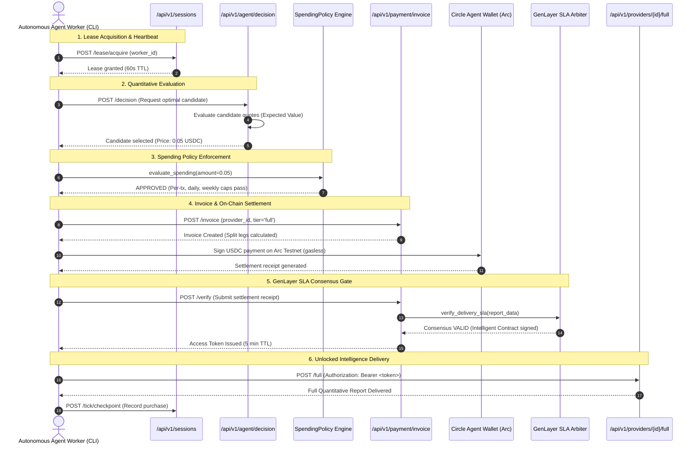
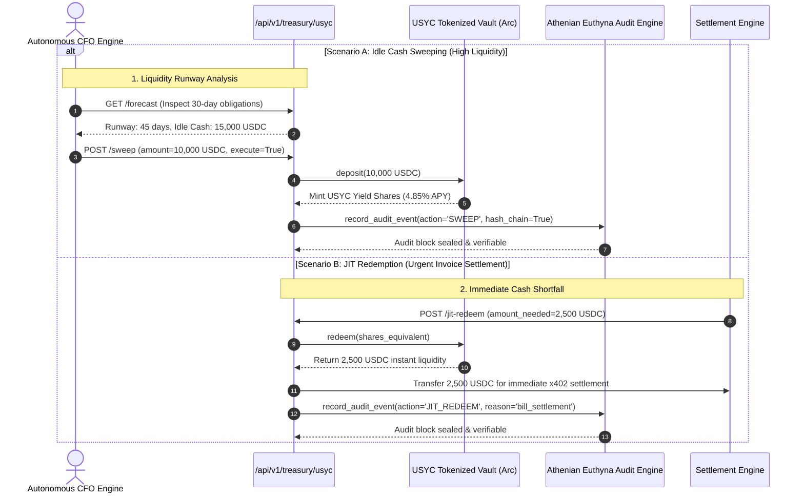
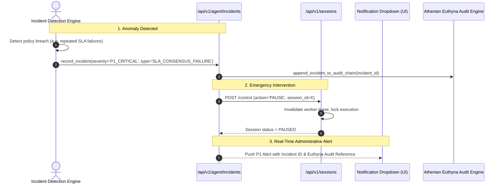
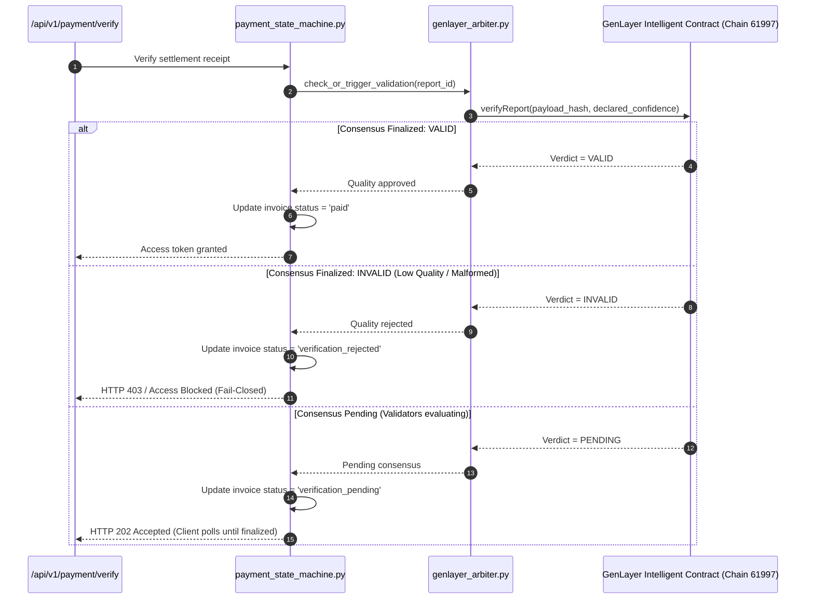

# System & Flow Architecture (FLOWS.md)

**Version**: 2.0-Definitive  
**Protocol Alignment**: CRCIP Phase 1 (System & Flow Discovery)  
**Status**: Machine-Verified & Complete  

---

## 1. Flow Inventory Matrix

| Flow ID | Flow Name | Primary Entry Point | Call Chain / Subsystems | Execution Model | Side Effects | Confidence |
| :--- | :--- | :--- | :--- | :--- | :--- | :--- |
| **FL-01** | Autonomous Buyer Intelligence Procurement | `POST /api/v1/sessions`, CLI `$ qma agent run` | CLI Worker → `sessions.py` → `agent_decision.py` → `spending_policy.py` → `payments.py` → Circle Arc Wallet → `genlayer_arbiter.py` → `reports.py` | Async Sequential + Polling | Balance deduction, session ledger append, invoice creation, report unlock | **HIGH** (Runtime Verified) |
| **FL-02** | HTTP 402 Paywall & Manual Report Checkout | `GET /api/v1/providers/{id}/preview`, `POST /api/v1/payment/invoice` | Browser UI → 402 Probe → `invoice_builder.py` → Arc x402 Settlement → `settlement_validation.py` → Token Minting → `reports.py` | Async Sequential | Invoice created, split legs allocated, short-lived JWT token minted | **HIGH** (Runtime Verified) |
| **FL-03** | Provider Onboarding & Webhook Execution | `POST /api/v1/market/apply`, `POST /api/v1/providers/{id}/...` | Provider Form → Admin Audit (`require_admin_token`) → `ProviderRegistryV2` → `WebhookProviderAdapter` → DNS & HMAC Guard → External API | Async I/O (Bounded Timeouts) | Provider registered, revenue allocated to provider wallet, opaque payload delivery | **HIGH** (Runtime Verified) |
| **FL-04** | Autonomous CFO Treasury Sweep into USYC | `POST /api/v1/treasury/usyc/sweep`, `POST /api/v1/treasury/cfo/decide` | CFO Engine → `usyc_treasury_service` → Arc Testnet USYC Vault (ERC-4626) → `euthyna_audit_engine` | Async Sequential | Idle USDC converted to USYC shares, on-chain state mutated, cryptographic hash chain extended | **HIGH** (Runtime Verified) |
| **FL-05** | Just-In-Time (JIT) Liquidity Redemption | `POST /api/v1/treasury/usyc/jit-redeem` | Payment Event / CFO → `usyc_treasury_service:redeem` → USYC Vault Contract → USDC Settlement Target → `euthyna_audit_engine` | Async Sequential (Atomic) | USYC burned, instant USDC liquidity minted to treasury target for bill payment | **HIGH** (Runtime Verified) |
| **FL-06** | Agent Risk Governance & Circuit Breaker | `GET /api/v1/agent/incidents`, `POST /api/v1/agent/sessions/{id}/control` | Health Monitor / Anomaly Trigger → `incident_engine.py` → Emergency Session Control → `euthyna_audit_engine` | Sync I/O + Event Append | Session paused/terminated, worker lease revoked, immutable audit record created | **HIGH** (Runtime Verified) |
| **FL-07** | Circle StableFX Institutional RFQ Desk | `GET /api/v1/stablefx/quote`, `POST /api/v1/stablefx/settle` | Trader / Agent → `stablefx_service:get_stablefx_quote` → 60s TTL Price Lock → `settle_stablefx_swap` → Circle Swap Kit | Async Sequential | Ephemeral quote minted, atomic cross-currency swap on Arc | **HIGH** (Runtime Verified) |
| **FL-08** | Fiat-to-USDC Direct On-Ramp Session | `POST /api/v1/onramp/session` | Client UI → `onramp.py:create_onramp_session` → Address Validation → Circle Onramp API → Signed Widget URL | Async HTTP Client | Ephemeral session token generated, iframe embedded in UI | **HIGH** (Runtime Verified) |
| **FL-09** | Creator Claim & Revenue Withdrawal | `POST /api/v1/platform/withdraw`, `POST /api/v1/sessions/wallet/withdraw` | Creator / Admin → `creator_claims.py` / `sessions.py` → Balance check → Arc Gateway Minter/Wallet → Destination Wallet | Async Sequential | Ledger balance decremented, withdrawal audit row inserted, on-chain transfer | **HIGH** (Runtime Verified) |
| **FL-10** | GenLayer Decentralized SLA Consensus | Internal Hook in `payments.py:verify` & `agent_buyer.js` | Payment Verification → `payment_state_machine.py` → `genlayer_arbiter.py` → Studio Next RPC (61997) → Intelligent Contract | Async Polling (Fail-Closed) | Invoice state set to `paid` (if VALID) or `verification_rejected` (if INVALID) | **HIGH** (Runtime Verified) |

---

## 2. In-Depth Flow Architecture Diagrams

### FL-01: Autonomous Buyer Intelligence Procurement (Buyer Side)

---

### FL-04 & FL-05: Autonomous CFO Treasury Sweeping & JIT Liquidity Redemption

---

### FL-06: Agent Risk Governance & Incident Circuit Breaker

---

### FL-10: GenLayer Decentralized SLA & Quality Consensus Validation

---

## 3. Runtime Contracts & Cross-Module Dependencies

### 3.1 Sensitive Core Invariants
1. **Invoice State Machine (`payment_state_machine.py`)**:
   - Status transitions: `pending` → `verification_pending` → `paid` OR `verification_rejected` OR `disputed` OR `refunded`.
   - Never bypass the state machine via direct table writes (enforced by AST rule `python-state-invoices-direct-write.yml`).
2. **GenLayer SLA Failure Handling**:
   - GenLayer verdict `INVALID` permanently blocks access and transitions invoice to `verification_rejected`.
   - Polling timeouts retain pending status without marking settlement as failed.
3. **Treasury Invariant (`usyc_treasury.py`)**:
   - Sweeps and redemptions must calculate share/asset conversions with 6-decimal USDC precision.
   - All state mutations must be cryptographically hashed into `euthyna_audit_trail.json`.
4. **Agent Lease Invariant (`sessions.py`)**:
   - Sessions are protected by 60s lease timeouts and run generation counters to prevent split-brain worker execution.
