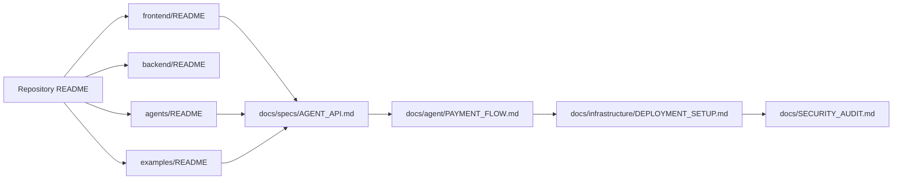

# QMA Documentation Map

Use this map to find the owner of a behavior. Not every directory needs a separate README: a README belongs at a reusable boundary, while cross-cutting contracts belong under `docs/`.

---

## 1. Canonical System Contracts

| Area | Primary Documentation | Purpose & Scope |
| --- | --- | --- |
| **System Architecture** | [`ARCHITECTURE.md`](ARCHITECTURE.md) | Authoritative definitive system architecture, component topology, module boundaries, SSOT matrix |
| **System & Flows** | [`FLOWS.md`](FLOWS.md) | Canonical end-to-end execution flows (FL-01 to FL-10), sequence diagrams, state invariants |
| **Security & Attack Surface** | [`SECURITY_AUDIT.md`](SECURITY_AUDIT.md) | 3-axis risk assessment, cryptographic gates, HMAC tokens, ingress perimeter defense |
| **Refactoring Protocol** | [`architecture/CONTROLLED_REFACTORING_PROTOCOL.md`](architecture/CONTROLLED_REFACTORING_PROTOCOL.md) | Controlled Refactoring & Codebase Intelligence Protocol (CRCIP, Phases 0–10) |
| **Audit & Cleanup Registry** | [`CLEANUP_LOG.md`](CLEANUP_LOG.md) | Historical dead code, docs, and duplication audit ledger |
| **Final Verification Gate** | [`AUDIT_FINAL.md`](AUDIT_FINAL.md) | Definitive closure report, quantitative Before vs After metrics, technical debt catalog |
| **Payment Lifecycle** | [`agent/PAYMENT_FLOW.md`](agent/PAYMENT_FLOW.md) | Source of truth for invoice creation, Circle Gateway x402 settlement, GenLayer verification |
| **API Inventory & Gate** | [`api/README.md`](api/README.md) | Complete OpenAPI endpoint inventory, access classes, documentation maintenance gate |
| **Autonomous Agent** | [`architecture/AUTONOMOUS_AGENT.md`](architecture/AUTONOMOUS_AGENT.md) | Bounded session policy, deterministic execution boundary, budget gates |
| **Agent API Contract** | [`specs/AGENT_API.md`](specs/AGENT_API.md) | `POST /api/v1/agent/decision` contract, request/response models |
| **Package Management** | [`package-managers.md`](package-managers.md) | Monorepo runtime tooling (`bun` for TypeScript/Node workspaces, `uv` for Python) |
| **Environment Tiers** | [`environments.md`](environments.md) | Parameter matrix across Local (`dev`), Staging, and Production tiers |
| **Database Architecture** | [`database.md`](database.md) | Schema definitions, table relationships, PostgreSQL/Supabase setup |
| **NPM CLI Packaging** | [`infrastructure/NPM_PUBLISHING.md`](infrastructure/NPM_PUBLISHING.md) | Packaging, testing, SemVer, and publishing flow for `@hoanlv214/qma-cli` |
| **Deployment Setup** | [`infrastructure/DEPLOYMENT_SETUP.md`](infrastructure/DEPLOYMENT_SETUP.md) | Render/Vercel branch configuration, environment secrets, and deploy steps |
| **CLI Deployment** | [`infrastructure/CLI_DEPLOYMENT.md`](infrastructure/CLI_DEPLOYMENT.md) | Zero-UI deployment via Supabase, Vercel, and Render CLIs |
| **MCP Server** | [`mcp/README.md`](mcp/README.md) | Hosted MCP endpoint, OAuth 2.1 PKCE connector, Claude/ChatGPT integration |
| **Marketplace Listing** | [`marketplace/CIRCLE_AGENT_MARKETPLACE_LISTING.md`](marketplace/CIRCLE_AGENT_MARKETPLACE_LISTING.md) | Official Circle Agent Services Marketplace listing package and service descriptors |

---

## 2. Component READMEs

| Component | Path | Responsibility |
| --- | --- | --- |
| **Repository Root** | [`../README.md`](../README.md) | Project story, system architecture, core capabilities |
| **Backend API** | [`../backend/README.md`](../backend/README.md) | FastAPI router composition, service layer, repository pattern |
| **React Frontend** | [`../frontend/README.md`](../frontend/README.md) | Vite + React rebuild, Tailwind/vanilla CSS tokens, state services |
| **Agent CLI & SDK** | [`../agents/README.md`](../agents/README.md) | TypeScript autonomous agent package (`qma-cli`), session loop |
| **Autonomous Examples** | [`../examples/README.md`](../examples/README.md) | Standalone agent runner examples and CLI smoke invocation |

---

## 3. Runtime Flow Diagram



---

## 4. Documentation Invariants

- **Single Source of Truth**: All API endpoints must match [`api/README.md`](api/README.md) and pass `pytest tests/api_v1/test_api_openapi_docs.py`.
- **Payment Invariants**: Before altering any payment state machine or invoice logic, [`agent/PAYMENT_FLOW.md`](agent/PAYMENT_FLOW.md) must be consulted.
- **Independence Rule**: All documentation adheres strictly to `AGENTS.md` Rule 144 (independent production identity, zero mention of hackathons or competitions).
- **Historical Archives**: Superseded audit logs and early architectural reviews are preserved in `docs/archive/` to keep the active documentation directory clean and authoritative.

---

## 5. Verification Commands

```powershell
# Verify OpenAPI documentation gate
python -m pytest tests/api_v1/test_api_openapi_docs.py -q

# Verify Frontend build
cd frontend; bun run typecheck; bun run build

# Verify Agent CLI & SDK
cd ..\agents; bun run test
```
