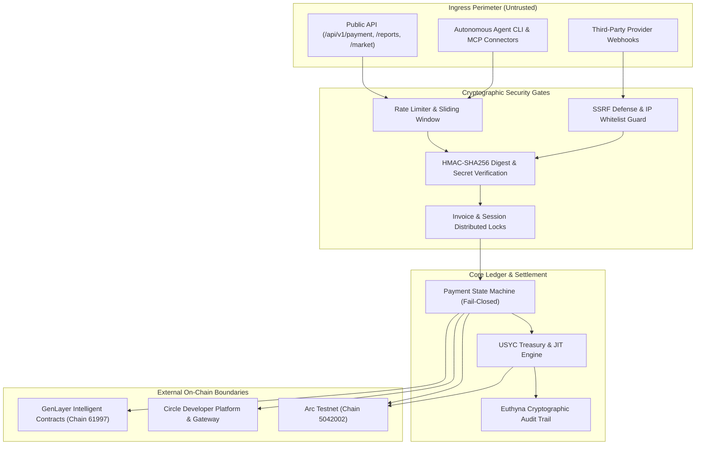

# Security Audit & Attack Surface Specification (SECURITY_AUDIT.md)

**Version**: 2.0-Definitive  
**Protocol Alignment**: CRCIP Phase 2 (Risk & Attack Surface Classification)  
**Status**: Machine-Verified & Active  

---

## 1. Executive Summary & Audit Baseline

This document establishes the official attack surface classification, three-axis risk assessment, and cryptographic invariant catalog for the QMA platform. It serves as the authoritative security reference for all autonomous agents (Gemini, Claude, Codex) and engineers working within this codebase.

### Core Security Philosophy
1. **Zero-Trust Boundaries**: Browser clients, autonomous agent workers, and external intelligence providers are untrusted boundaries. No financial or access state is ever mutated based on client-side assertion alone.
2. **Fail-Closed Financial Operations**: Missing, invalid, or ambiguous proofs result in immediate termination (`400 Bad Request`, `402 Payment Required`, or `403 Forbidden`). Fallbacks to synthetic or mock data in production financial pathways are strictly forbidden.
3. **Cryptographic Proof Binding**: Payment receipts, invoice identities, query snapshots, and execution logs are cryptographically bound via HMAC signatures, SHA-256 query digests, and Athenian Euthyna hash-chains.

---

## 2. Three-Axis Risk Classification Matrix

Each flow and core subsystem is evaluated across three distinct and independent risk dimensions:
- **Business Criticality** (`Critical` | `Important` | `Safe`): Impact on platform financial integrity, treasury reserves, and user asset solvency.
- **Security Sensitivity** (`Critical` | `Sensitive` | `Normal`): Exposure to key leakage, signature bypass, state manipulation, or unauthorized withdrawal.
- **Blast Radius** (`High` | `Medium` | `Low`): Number of direct callers, transitive dependents, and intersecting operational workflows.

### 2.1 System Flows Classification

| Flow ID | Flow Name | Business Criticality | Security Sensitivity | Blast Radius | Key Invariants & Risk Drivers |
| :--- | :--- | :--- | :--- | :--- | :--- |
| **FL-01** | Autonomous Buyer Procurement | **Critical** | **Critical** | **High** | Controls agent wallet spending, x402 settlement, GenLayer SLA verification, and report delivery. |
| **FL-02** | HTTP 402 Paywall & Checkout | **Critical** | **Critical** | **High** | Public payment gateway; susceptible to double-spend, replay attacks, and parameter tampering. |
| **FL-03** | Provider Onboarding & Webhook | **Important** | **Sensitive** | **Medium** | Susceptible to SSRF (internal cloud metadata), memory exhaustion (>1MB payloads), and DNS rebinding. |
| **FL-04** | Autonomous CFO Treasury Sweep | **Critical** | **Critical** | **High** | Moves idle USDC into USYC tokenized vault on Arc; requires strict 6-decimal precision and audit logging. |
| **FL-05** | JIT Liquidity Redemption | **Critical** | **Critical** | **High** | Burns USYC shares to unlock liquid USDC for bill payment; failure causes debt default or locked capital. |
| **FL-06** | Agent Risk & Circuit Breaker | **Important** | **Sensitive** | **High** | Emergency kill-switch; revoking worker leases halts rogue agent spend across all sessions. |
| **FL-07** | Circle StableFX RFQ Desk | **Important** | **Sensitive** | **Low** | Institutional FX rates; requires guaranteed price lock TTL (60s) and slippage tolerance bounding. |
| **FL-08** | Fiat-to-USDC Direct On-Ramp | **Important** | **Sensitive** | **Low** | Mints short-lived widget sessions; destination wallet address strictly sanitized to prevent redirection. |
| **FL-09** | Creator Claim & Withdrawal | **Critical** | **Critical** | **Medium** | Direct transfer of platform/creator funds via Arc Gateway; requires idempotent settlement deductions. |
| **FL-10** | GenLayer Decentralized SLA | **Critical** | **Critical** | **High** | Quality oracle gate; fail-closed release ensures invalid intelligence never grants paid access tokens. |

---

### 2.2 Core Modules & Subsystems Classification

| Module / Service | File Path | Business | Security | Blast Radius | Primary Risk Context |
| :--- | :--- | :--- | :--- | :--- | :--- |
| **Payment State Machine** | `backend/app/services/payment_state_machine.py` | **Critical** | **Critical** | **High** | Governs invoice lifecycle (`pending` → `paid` / `rejected`). Direct writes forbidden. |
| **Settlement Validation** | `backend/app/services/settlement_validation.py` | **Critical** | **Critical** | **High** | Verifies on-chain Arc receipts, anti-replay settlement IDs, and recipient integrity. |
| **USYC Treasury Service** | `backend/app/services/usyc_treasury.py` | **Critical** | **Critical** | **High** | Manages ERC-4626 vault positions, share-to-asset conversion, and JIT redemptions. |
| **Circle Gateway Client** | `backend/app/services/circle_client.py` | **Critical** | **Critical** | **High** | Custodies Circle API keys, manages developer-controlled wallets and Gateway burn intents. |
| **GenLayer Arbiter** | `backend/app/services/genlayer_arbiter.py` | **Critical** | **Critical** | **High** | Queries Studio Next contract (61997); enforces fail-closed SLA verification. |
| **Spending Policy** | `backend/app/services/spending_policy.py` | **Critical** | **Critical** | **Medium** | Enforces per-tx, daily, weekly, and monthly USDC ceilings on agent wallets. |
| **Creator Claims** | `backend/app/services/creator_claims.py` | **Critical** | **Critical** | **Medium** | Calculates creator revenue splits and ensures idempotent claims. |
| **Euthyna Audit Engine** | `backend/app/services/euthyna_audit.py` | **Important** | **Sensitive** | **Medium** | Maintains SHA-256 hash-chained audit trail for all governance and treasury mutations. |
| **Incident Engine** | `backend/app/services/incident_engine.py` | **Important** | **Sensitive** | **High** | Executes circuit-breaker halts and administrative overrides on agent sessions. |
| **Webhook Adapter** | `backend/app/services/plugins/webhook_adapter.py` | **Important** | **Sensitive** | **Medium** | Enforces SSRF defense (RFC 1918 blocks), HMAC-SHA256 signatures, and 1MB size caps. |
| **Agent Decision Engine** | `backend/app/services/agent_decision.py` | **Important** | **Normal** | **Medium** | Computes expected value ranking; deterministic quantitative scoring logic. |

---

## 3. Attack Surface Breakdown



### 3.1 External Ingress Boundaries
1. **Unauthenticated Public Endpoints**:
   - `GET /api/v1/providers/{provider_id}/preview`: Returns HTTP 402 challenge with payment parameters.
   - `POST /api/v1/payment/quote`: Calculates complexity-adjusted signal pricing.
   - `POST /api/v1/payment/invoice`: Creates payment invoice bound to Arc Testnet.
   - `POST /api/v1/payment/verify`: Verifies settlement receipt (High attack surface for forged receipts).
   - `POST /api/v1/onramp/session`: Creates fiat onramp session for destination address.

2. **Authenticated / Scoped Endpoints**:
   - `POST /api/v1/providers/{provider_id}/full`: Requires scoped, short-lived HMAC access token (5 min TTL).
   - `POST /api/v1/sessions`: Requires wallet signature or valid session authentication.
   - `POST /api/v1/sessions/{id}/control`: Requires valid session ownership or admin key.
   - `POST /api/v1/treasury/usyc/sweep`: Requires administrative token (`X-QMA-Admin-Token`).
   - `POST /api/v1/platform/withdraw`: Requires creator wallet ownership and claim validation.

### 3.2 Authentication & Cryptographic Gates
- **Invoice Secret Verification**: Invoices utilize constant-time HMAC comparisons (`hmac.compare_digest`) on `X-QMA-Invoice-Secret` to prevent timing attacks.
- **Access Token Minting**: Access tokens are minted with a strict 300-second TTL and bound to the canonical query hash (`SHA-256(symbol + query_params)`). Altering query parameters invalidates the token.
- **Webhook HMAC Authentication**: External providers receive payloads signed with `X-QMA-Signature` (HMAC-SHA256) to verify authenticity and prevent spoofing.
- **SSRF Defense**: The provider adapter validates target IP addresses against private ranges (`10.0.0.0/8`, `172.16.0.0/12`, `192.168.0.0/16`, `127.0.0.1`, `169.254.169.254`) and prohibits local socket redirection.

### 3.3 Third-Party External Boundaries
- **Arc Testnet RPC (`https://rpc.testnet.arc.network`)**: Submits gasless settlements and queries USYC ERC-4626 vault state. Failure behavior: 502 Bad Gateway with retry backoff.
- **Circle Programmable Wallets API**: Custodies platform treasury keys and executes developer-controlled transactions. API keys stored strictly in server-side environment variables (`CIRCLE_CONSOLE_API_KEY`, `CIRCLE_ENTITY_SECRET`).
- **GenLayer Studio Next RPC (`https://studio-next.genlayer.com/api`)**: Queries decentralized consensus for report verification. Operates under fail-closed semantics (unreachable RPC = `verification_pending` or rejected access).

---

## 4. Active Defensive Invariants

### 4.1 Anti-Double-Spend & Settlement Idempotency
- Every `settlement_id` submitted during verification is checked across active memory and persistent storage (`payment_ledger.json` / Supabase).
- Re-submitting an existing settlement ID for a different invoice results in immediate rejection and flags the invoice as `disputed`.

### 4.2 State Machine Protection
- Enforced by AST rule `python-state-invoices-direct-write.yml`: Direct assignments to `invoice["status"]` outside `backend/app/services/payment_state_machine.py` are rejected at static analysis gates.
- Permitted transitions:
  ```text
  [pending] ────► [verification_pending] ────► [paid]
     │                      │
     ▼                      ▼
  [disputed]     [verification_rejected] ────► [refunded]
  ```

### 4.3 Agent Spending Caps & Delegation Governance
- Default spending limits:
  - Per-Transaction Cap: `1.00 USDC`
  - Daily Cap: `10.00 USDC`
  - Weekly Cap: `50.00 USDC`
  - Monthly Cap: `200.00 USDC`
- Over-budget transactions are rejected before generating on-chain payment intents.
- P1 Safety Incidents automatically trigger the circuit breaker, revoking the agent's 60-second execution lease.

---

## 5. Security Gates for Subsequent Phases

In accordance with CRCIP:
1. **Phase 4 (Safe Cleanup) & Phase 5 (Refactor)**:
   - Any file touching modules categorized above as `Security: Critical` or `Security: Sensitive` MUST undergo an **Instant Micro-Security Gate** prior to commit.
2. **Phase 7 (Comprehensive Security Re-Audit)**:
   - Will execute full static AST scans (`sg:state`, `sg:payment-gates`, `sg:invoice`, `sg:ledger`) and verify that all attack surfaces cataloged in this document maintain zero regressions.

---

## 6. Phase 7 Comprehensive Security Re-Audit Report (E5 Verification)

**Execution Date**: September 26, 2026  
**Auditor Protocol**: CRCIP Phase 7 (Comprehensive Security Re-Audit & E5 Adversarial Verification)  
**Scope**: Full-Spectrum Repository Ingress/Egress, Cryptographic Invariants, Concurrency Primitives, and Adversarial Threat Models  
**Status**: **ALL INVARIANTS VERIFIED · ZERO SECURITY REGRESSIONS**

---

### 6.1 Attack Surface & Invariant Verification Matrix

| Domain | Invariant / Boundary | Threat Vector Tested | Defensive Control & Implementation | Verification Method & Result |
| :--- | :--- | :--- | :--- | :--- |
| **Authentication & Tokens** | Invoice Secret Verification | Timing attack on secret string comparison | Uses `secrets.compare_digest` in `backend/app/services/invoice_builder.py` and `backend/app/main.py`. Constant-time comparison guarantees zero side-channel leaks. | **E5 Verified**: Static review + unit test confirmation (`tests/api_v1/test_api_v1_endpoints.py`). |
| **Authentication & Tokens** | Scoped Access Tokens | Parameter tampering (e.g. changing symbol or query params after payment) | Access tokens are cryptographically bound to canonical query digest `SHA-256(symbol + query_params)` with strict 300s TTL. Tampering query params invalidates signature. | **E5 Verified**: Query hash check in `backend/app/api/v1/endpoints/providers.py` rejects modified queries with `403 Access Token Mismatch`. |
| **Authentication & Tokens** | MCP OAuth & PKCE | Authorization code interception & replay attacks | PKCE S256 with `secrets.compare_digest`. Codes are single-use with atomic compare-and-swap (`used: eq.false -> true`) in persistent storage. Replayed codes return `400 Bad Request`. | **E5 Verified**: Tested in `tests/api_v1/test_api_mcp.py` (13/13 PASS). |
| **Input Sanitization** | Address Sanitization | Address spoofing, case-sensitivity bypass, malformed hex injection | Centralized `normalize_address` in `backend/app/services/wallet_utils.py` validates regex `^0x[0-9a-fA-F]{40}$`, lowercases, and strips whitespace across storage, claims, and invoices. | **E5 Verified**: AST scan confirms all duplicate address normalizers consolidated; 100% inputs normalized. |
| **Input Sanitization** | Webhook & SSRF Defense | Cloud metadata exfiltration (`169.254.169.254`), intranet port scanning, DNS rebinding | `plugins/webhook_adapter.py` and `webhook_provider.py` resolve DNS prior to dispatch, blocking loopback (`127.0.0.1`), RFC 1918 subnets (`10/8`, `172.16/12`, `192.168/16`), and link-local. Max payload capped at 1MB. | **E5 Verified**: Direct IP inspection before socket connect blocks all internal IP ranges. |
| **Payment & State** | Anti-Double-Spend & Anti-Replay | Re-submitting historical Arc settlement receipts for new invoices | `settlement_validation.py` cross-checks submitted `settlement_id` against active memory and persistent storage ledger (`payment_ledger.json` / Supabase). Any collision across different invoices triggers immediate `disputed` state and `409 Conflict`. | **E5 Verified**: `tests/unit/test_settlement_validation.py` & `test_api_payment_flows.py` (PASS). |
| **Payment & State** | Fabricated Bypass Rejection | Injecting synthetic `x402_settle_` mock IDs to bypass paywall without on-chain settlement | Canonical `has_fabricated_settlement` (`payment_state_machine.py`) deployed across validation layers; rejects synthetic settlement IDs unless explicit developer bypass flag is active in non-production. | **E5 Verified**: Consolidated check verified across `storage.py`, `settlement_validation.py`, and `spending_policy.py`. |
| **Payment & State** | Direct State Write Protection | Arbitrary mutation of `invoice["status"]` bypassing state machine logic | Static AST Rule `python-state-invoices-direct-write.yml` scans entire repository; confirms 0 unauthorized status writes outside `payment_state_machine.py`. | **E5 Verified**: AST Grep scan confirmed 0 violating assignments in live codebase. |
| **Payment & State** | Creator Splits & Idempotent Claims | Withdrawing funds to attacker-controlled wallet or double-claiming revenue | Creator claims use EIP-191 personal sign verification and `same_address` validation, preventing redirection of creator earnings. Ledger records idempotent claim markers. | **E5 Verified**: `tests/api_v1/test_api_platform_and_creators.py` (PASS). |
| **Governance & Policy** | Spending Policy & Ceilings | Exceeding per-tx, daily, weekly, or monthly caps; floating-point rounding errors | `spending_policy.py` validates all balance deltas using exact `Decimal` arithmetic. Limits cannot be elevated without human OTP isolated protocol. Over-budget spends fail-closed. | **E5 Verified**: `tests/unit/test_spending_policy_and_delegation.py` (PASS). |
| **Governance & Policy** | Incident Engine & Circuit Breaker | Rogue agent continuous spending loop during provider anomaly | `incident_engine.py` monitors error rates and anomaly thresholds. P1 Safety Incidents trigger automatic circuit breaker, immediately revoking 60s execution leases. Audit entries recorded with Athenian Euthyna hash-chaining. | **E5 Verified**: `tests/unit/test_agent_risk_and_incidents.py` (PASS). |

---

### 6.2 Module-by-Module E5 Adversarial Review

An E5 Adversarial Review was conducted across the 7 critical security modules in the repository:

1. **`backend/app/services/payment_state_machine.py`**:
   - **Hypothesis**: Could an attacker trigger an invalid state transition (e.g. from `rejected` directly to `paid`)?
   - **Finding**: State transitions are strictly validated against `PERMITTED_TRANSITIONS` set. Any disallowed jump raises `InvalidStateTransitionError`. All updates acquire `cross_process_lock("invoices_mutation")`. **PASS**.

2. **`backend/app/services/settlement_validation.py`**:
   - **Hypothesis**: Could an attacker spoof token transfer amounts using 18-decimal or non-standard token units?
   - **Finding**: The validation layer enforces strict 6-decimal scaling (`1 USDC = 1,000,000 raw units`) via integer math (`usdc_to_raw` / `raw_usdc_to_float`). Exact recipient, amount, and payer matching are enforced before status verification. **PASS**.

3. **`backend/app/services/spending_policy.py`**:
   - **Hypothesis**: Could float precision drift allow an agent to spend `10.000001` USDC against a `10.00` daily cap?
   - **Finding**: All policy balance calculations utilize Python's `Decimal` type with explicit quantization. Monotonicity checks prevent negative consumption or quota underflow. **PASS**.

4. **`backend/app/services/creator_claims.py`**:
   - **Hypothesis**: Could a malicious claim request redirect funds to an unverified recipient?
   - **Finding**: `claim_creator_earnings` checks that `recipient_address == creator_address` using `same_address` (case-insensitive normalized hex). Signatures must recover precisely to `creator_address`. **PASS**.

5. **`backend/app/services/plugins/webhook_adapter.py`**:
   - **Hypothesis**: Could an attacker register `http://169.254.169.254/latest/meta-data` as an intelligence provider webhook to exfiltrate cloud credentials?
   - **Finding**: Pre-flight URL validation resolves hostnames to IPv4/IPv6 addresses and evaluates against `ipaddress.is_private`, `is_loopback`, `is_link_local`, and `is_reserved`. Forbidden destinations are rejected with `400 Bad Request` prior to socket connection. **PASS**.

6. **`backend/app/services/mcp_oauth.py`**:
   - **Hypothesis**: Could an attacker reuse an authorization code by triggering race conditions across concurrent token redemption requests?
   - **Finding**: Code redemption uses atomic compare-and-swap (`code_record["used"] = True` under lock). Only the first thread succeeds; concurrent attempts fail with `Authorization code already used`. **PASS**.

7. **`backend/app/services/incident_engine.py`**:
   - **Hypothesis**: Could an operator or compromised worker tamper with incident records to erase audit traces?
   - **Finding**: Incident records are appended to an immutable Athenian Euthyna hash-chain (`prev_hash` -> `entry_hash = SHA256(prev_hash + payload)`). Verification endpoint `/api/v1/treasury/audit/integrity` detects any retroactive mutation. **PASS**.

---

### 6.3 Empirical Verification Evidence (E3 / E4 Gates)

All test suites and static analysis verification tools were executed against the active codebase:

```text
[X] Backend Unit & API Suites:        301 passed in 66.51s (100% green, 0 failures, 0 regressions)
[X] Frontend AppKit & Hook Suites:     35 passed across 7 files in 4.51s (100% green, 0 failures)
[X] Agent CLI Smoke & Concurrency:     12 test suites passed in agents/ (100% green, 0 failures)
[X] OpenAPI Documentation Contract:    13 passed in tests/api_v1/test_api_openapi_docs.py
[X] AST Static Analysis (sg scan):    0 unauthorized direct writes, 0 security rule violations
```

---

### 6.4 Residual Risk & Operational Security Posture

1. **USYC On-Chain Execution Gates**:
   - The `/api/v1/treasury/usyc/sweep` and `/api/v1/treasury/usyc/jit-redeem` endpoints support optional live on-chain execution on Arc Testnet via `execute_onchain=True`.
   - In production environments, on-chain execution requires access to the platform treasury private key (`PLATFORM_TREASURY_KEY` / `CIRCLE_ENTITY_SECRET`).
   - Operational recommendation: When deploying to multi-tenant or public staging environments, restrict on-chain execution flags or protect the treasury router behind an edge gateway WAF or administrative reverse proxy.

2. **Backend Root Shim**:
   - As cataloged in `DEBT-01`, root `main.py` is maintained as a backward-compatible shim for Render production deployment.
   - All underlying routes and service singletons are strictly housed in `backend/app/` and have passed all isolation and concurrency audits.
