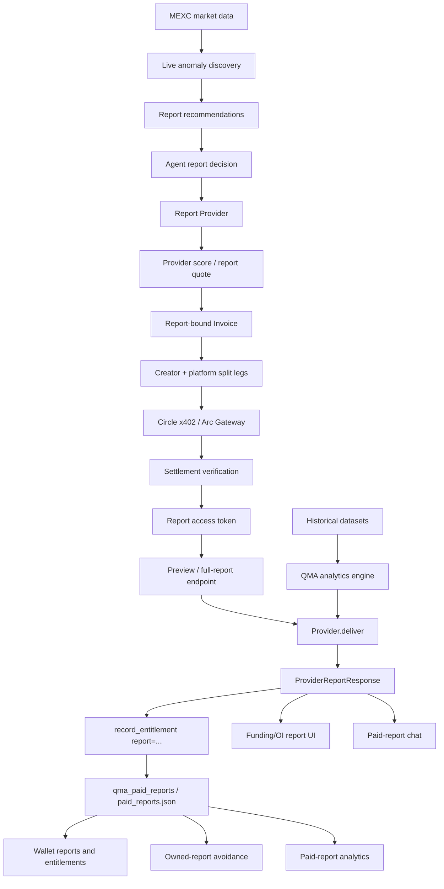
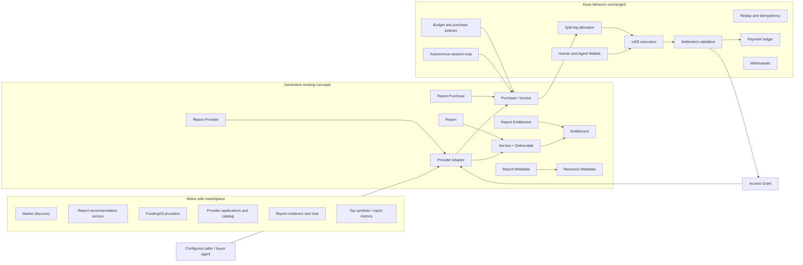

# QMA Architecture Assessment

**Assessment date:** 2026-07-29  
**Assessed branch:** `main`  
**Assessment type:** source-based reverse engineering of the current repository  
**Scope:** deployed Python API, Node agent runtime/SDK/CLI, Arc Gateway sidecar, React frontend, persistence adapters, migrations, examples, tests, deployment configuration, and active architecture documentation  
**Excluded from capability claims:** external production state, secrets, Circle/Supabase account configuration, and behavior not represented in this repository

## 1. Executive conclusion: what QMA is today

QMA is currently best positioned as:

> **A vertically integrated, Arc-based paid intelligence marketplace with a bounded buyer-agent runtime and reusable agent-commerce infrastructure.**

It is not only a funding analytics dashboard. The repository contains a real commerce pipeline: provider discovery, price quotes, invoices, x402 payment execution, two-leg revenue splitting, settlement validation, access tokens, report delivery, entitlements, wallet views, creator earnings, and payment analytics.

It is also not yet a general-purpose agent platform. Autonomous execution exists in an npm SDK, CLI, persistent session loop, hosted worker, Supabase session queue, and Circle Developer-Controlled Agent Wallet integration. However, the hosted path has material completion and durability gaps:

- the hosted SDK pays and receives an access token but does not fetch the report, so it does not materialize the paid report or backend entitlement;
- the backend session budget guard depends on a `run_source` convention that the hosted SDK does not currently send;
- a claimed session has no worker lease, heartbeat, timeout, or automatic recovery after worker failure;
- the worker handles one session at a time and keeps active state primarily inside one process;
- provider onboarding approval does not install or register a provider implementation.

The most mature reusable subsystem is the **commerce and settlement layer**. The next most reusable subsystem is the **bounded autonomous session loop**. The marketplace layer is real but still tightly coupled to the initial funding/open-interest intelligence product.

### Positioning by capability maturity

| Position | Current fit | Evidence-based verdict |
|---|---:|---|
| Quant/funding intelligence product | Strong | Two implemented providers, historical analog engine, live MEXC anomaly scan, specialized report UI |
| Intelligence marketplace | Strong but curated | Provider catalog, applications, review, controls, revenue split, earnings, reports, buyer flows; only two manually registered providers |
| Agent commerce runtime | Emerging | Policy loop, planning, wallet signer, payment executor, sessions and worker exist; hosted correctness/durability gaps remain |
| Agent payment SDK | Internal/embedded | Reusable payment executor and signer interfaces exist, but contracts and routes are QMA-specific |
| Plugin-based service platform | Scaffolded | Provider interface and webhook adapter exist; no dynamic installation, persistent plugin registry, or generic service/deliverable model |

### Recommended near-term product statement

The most accurate claim the current code can support is:

> **QMA is an agent-assisted marketplace for paid quantitative intelligence, with autonomous USDC purchasing and settlement infrastructure on Arc.**

Calling it a generic “agent economy”, “agent operating system”, or open plugin platform would currently overstate the implementation. Calling it only a report marketplace would understate the payment, wallet, policy, and runtime assets already present.

---

## 2. Assessment method and source-of-truth boundaries

### 2.1 Runtime source of truth

- `main` is the live deployment branch described by repository instructions.
- Root `main.py` is a compatibility/deployment shim. Render starts `uvicorn main:app`, but the actual application is created in `backend/app/main.py`.
- `backend/app/` is the source of truth for API composition and business behavior.
- `main_ref.py` is a non-running legacy snapshot and is excluded from current capability claims.
- `arc_gateway/` is an independently deployed Node service. It is part of the end-to-end product architecture but has a separate runtime boundary.
- `agents/` is both a publishable npm CLI/SDK and the hosted background worker.
- `frontend/` is a Vite/React application deployed independently through Vercel.

### 2.2 Persistence source of truth

The active backend is selected at process startup:

- Supabase is used when a Supabase URL and service-role key are configured.
- Otherwise, root JSON files are used through `JsonStorage`.
- Hosted agent sessions explicitly require `SupabaseStorage`; they do not fall back to JSON.
- Session endpoints access `agent_sessions` and `agent_session_events` through the Supabase adapter's low-level `_request`/`_upsert` methods.

Therefore, JSON and Supabase are not two simultaneously authoritative stores in the code. They are alternative runtime backends selected by environment. The repository alone cannot prove which contains the complete live production history.

### 2.3 Capability status vocabulary

- **Implemented:** end-to-end behavior exists and is used by at least one active caller.
- **Implemented with limitations:** behavior exists, but an architectural or operational gap prevents treating it as a complete platform capability.
- **Scaffolded:** an interface or adapter exists, but it is not connected to an active end-to-end flow.
- **Absent:** no implementation was found.

### 2.4 Verification baseline

The Python suite passes when forced to use isolated JSON storage:

```text
98 passed in 1.69s
```

With the developer machine's ambient Supabase environment loaded, three payment tests attempted real Supabase access and failed under network sandboxing. This is a test-isolation observation, not evidence of a payment assertion failure. It also confirms that application import selects persistence eagerly from environment.

`ast-grep` is configured in the repository but was not installed in the assessment environment, so route and call-site inspection used `rg` plus direct source reading.

---

## 3. Deployed system architecture

```text
Browser / Human Wallet
        |
        | HTTPS
        v
React Frontend (Vercel)
        |
        | REST
        v
QMA FastAPI (Render, root main.py shim -> backend.app.main)
        |                 |                    |
        |                 |                    +--> Supabase or JSON storage
        |                 +--> MEXC + local historical datasets
        |
        | internal authenticated callbacks
        v
Arc Gateway Sidecar (Render, Node/Express)
        |
        +--> Circle Gateway/x402 batching
        +--> Circle Developer-Controlled Wallets
        +--> Arc Testnet

Hosted Agent UI
        |
        v
FastAPI session queue (Supabase RPC)
        |
        v
Node Agent Worker (Render)
        |
        +--> QMA npm runtime/SDK
        +--> Agent Wallet signing through Arc Gateway
        +--> QMA invoice/payment APIs
```

### 3.1 Deployable units

| Unit | Entrypoint | Responsibility |
|---|---|---|
| QMA API | `uvicorn main:app` | Product API, orchestration, persistence selection, provider registry, report delivery, commerce, session API |
| Arc Gateway | `arc_gateway/server.ts` | x402 challenge/settlement sidecar, authoritative split-leg callback, Circle Gateway operations, wallet custody operations |
| Agent worker | `agents/src/worker.ts` compiled to `dist/worker.js` | Poll and claim hosted sessions, provision/use Agent Wallet, fund Gateway balance, execute session loop |
| Frontend | `frontend/src/main.tsx` | Marketplace, reports, wallets, human and autonomous buyer experiences, traction, API docs |
| npm package | `agents/src/index.ts`, `agents/bin/qma.js` | Bounded agent SDK and CLI for external Node consumers |

### 3.2 Important composition characteristic

`backend/app/main.py` is both composition root and a substantial application service. Routers are cleanly separated into endpoint modules, but they receive large `SimpleNamespace` dependency bags containing functions and state from `main.py`. Invoice creation, payment verification, paid authorization, report execution, storage initialization, provider registration, middleware, and OpenAPI generation still converge there.

This is not a duplicate implementation problem: root `main.py` delegates to it. It is a concentration-of-responsibility problem inside the canonical implementation.

---

## 4. Current capabilities

## 4.1 Intelligence and provider capabilities

| Capability | Status | Actual behavior |
|---|---|---|
| Historical quantitative analysis | Implemented | Loads funding and trading datasets; transforms features; computes covariance, clusters, nearest historical analogs, empirical OOD, outcome distributions, confidence intervals, and risk flags |
| Live market ingestion | Implemented | MEXC futures adapter fetches contracts/tickers/details, normalizes contract-size-adjusted open interest, caches responses, and scans negative-funding anomalies |
| Funding intelligence provider | Implemented | Quotes and delivers preview/full historical funding-memory reports and live anomaly context |
| Open-interest provider | Implemented with limitations | Reuses the same engine and live anomaly inputs with OI-oriented context/scoring; it is not an independently discovered data source |
| Provider manifest | Implemented | Providers expose name, category, description, price tiers, input schema, and UI schema |
| Provider score/quote | Implemented | Provider-specific score returns tier, final amount, confidence, complexity, and cache key |
| Provider delivery idempotency | Implemented with limitations | `ProviderPlugin.deliver()` locks and caches by invoice in one process for seven days; it is not durable across restart or multiple API workers |
| Outcome verification | Scaffolded | Interface and webhook call exist; built-in providers return a pending/not-implemented result and no scheduler invokes the pipeline |
| Provider enable/disable | Implemented | Persistent runtime controls plus environment-disabled provider list |

### Behavioral qualification

The platform describes itself as provider-agnostic at the interface boundary, but discovery is still domain-specific. `agent_recommendations.py` begins with the funding provider's live anomaly scan, then sends each anomaly to every enabled provider. It does not ask each provider to discover its own purchasable opportunities. This works for funding and OI variants over the same market event, but it is not generic service discovery.

The provider manifest also carries static `0.05/0.20` example prices while runtime price calculation comes from the paid kit and environment defaults. A manifest can therefore advertise a different price from the invoice unless configuration is synchronized.

## 4.2 Marketplace capabilities

| Capability | Status | Actual behavior |
|---|---|---|
| Provider catalog | Implemented | Public list/detail endpoints expose manifest, ownership, status, controls, and provider statistics |
| Creator application | Implemented | Wallet submits provider proposal, schemas, endpoint, description, and revenue-share request |
| Admin review | Implemented | Admin can approve, reject, or request changes |
| Provider activation from approval | Not implemented | Approval marks `approved_needs_plugin` and leaves `provider_enabled=false`; it does not construct or register a provider |
| Runtime provider registry | Implemented but static | In-memory registry manually registers `funding_memory` and `oi_memory` at process startup |
| Cross-language provider adapter | Scaffolded | HMAC webhook adapter supports manifest/score/deliver/verify, timeouts, response-size limit, and basic SSRF checks; no approved application is wired into it |
| Provider earnings | Implemented | Calculates payments, direct split revenue, final versus pending batch revenue, tier/buyer mix, top symbols, and recent payments |
| Creator payout/claim | Implemented for supported modes | Direct split pays creator leg to provider wallet; legacy ledger-backed claim path signs ownership and calls sidecar payout executor |
| Buyer marketplace UI | Implemented | Provider discovery, report selection, paywall, provider-specific report rendering |
| Creator/admin marketplace UI | Implemented | Application, review, provider toggle, earnings, and claim surfaces |

The marketplace is therefore **curated and code-installed**, not an open self-service marketplace.

## 4.3 Agent decisioning and planning

| Capability | Status | Actual behavior |
|---|---|---|
| Candidate preparation | Implemented | Normalizes candidates, provider prices, tiers, canonical query, scores, ownership, and upgrade eligibility |
| Deterministic decision policy | Implemented | Enforces provider/tier allowlists, entitlement ownership, minimum score, budget, max price, and highest-score selection |
| Fast command parser | Implemented | Recognizes explicit purchase intent, symbol, tier, and budget without an LLM |
| LLM-assisted planning | Implemented | Supports OpenAI-compatible providers configured server-side or an injected npm `LlmDecisionGenerator` |
| LLM plan validation | Implemented | Accepts only a minimal action/candidate/tier/budget schema, rejects extra fields, and revalidates the plan against fresh deterministic context |
| General task planning | Absent | The plan is a bounded buy/skip/clarify decision, not multi-step tool planning or arbitrary workflow decomposition |
| Provider comparison | Implemented | Returns evaluated candidates, rejection reason codes, provider comparison, selection basis, and resolved candidate |
| Entitlement-aware selection | Implemented | Avoids already-owned provider/symbol/tier reports and supports preview-to-full upgrade rules |

The “planner” is correctly constrained for a purchasing agent. It should not be presented as a general autonomous reasoning engine.

## 4.4 Autonomous execution

| Capability | Status | Actual behavior |
|---|---|---|
| Stateful autonomous loop | Implemented | Observe → filter → choose → purchase/wait → record → sleep until stop condition |
| Dry-run execution | Implemented | Simulates purchase accounting without sending payment |
| Live payment execution | Implemented | Creates invoice, validates amount and legs, signs x402 legs, verifies payment, and reconciles ambiguous outcomes |
| Session policies | Implemented | Budget, per-report price, max purchases, max attempts, duration, poll interval, provider/tier allowlists, score, ownership, cooldowns, retries, upgrade, stop rules |
| Runtime state | Implemented | Spend, remaining budget, attempts, purchases, cooldowns, observations, actions, failures, and stop reason |
| Resume input | Implemented | `initialState` can be supplied to the session loop |
| CLI autonomous buyer | Implemented | CLI runs dry/live sessions and delegates live purchase to a buyer process that pays and fetches the report |
| Publishable SDK | Implemented | Typed npm exports for runtime, policy, decision validation, payment executor, signer, client, planner, and agent |
| Hosted autonomous sessions | Implemented with limitations | Supabase queue + worker + Agent Wallet + UI are active code paths, but durability and delivery gaps remain |
| Multi-agent coordination | Absent | Sessions are independent; there is no hierarchy, delegation, shared plan, or inter-agent protocol |
| Arbitrary tool execution | Absent | Agent action space is purchase/skip/wait/clarify; it does not execute general tools or MCP calls |

### Hosted execution gaps that affect product claims

1. **Payment is not the same as delivery in the SDK path.**  
   `QmaAgent` returns `access_token_received: true` and `report_unlocked: false`. It does not call the provider report endpoint. Backend entitlements are created when a paid report is delivered and persisted, not merely when the invoice becomes paid. The CLI child buyer completes delivery, but the hosted worker uses `QmaAgent`, not that child flow.

2. **Defense-in-depth session budget enforcement is not connected.**  
   Backend invoice creation can sum paid and pending invoices for a Supabase session only when `run_source` is `agent_session_<UUID>`. `QmaAgent.createAgentInvoice()` does not include `run_source`. The worker also passes stored runtime state as `initialState` without explicitly binding the database session UUID to `SessionState.sessionId`.

3. **Queue claim is atomic; execution ownership is not durable.**  
   Supabase RPC uses `FOR UPDATE SKIP LOCKED` and changes queued to running. There is no `locked_by`, lease expiration, heartbeat, retry count, or recovery job. A process crash can leave a session running indefinitely.

4. **Resume semantics are permissive.**  
   Owner lifecycle endpoints can queue/stop/resume without a strict transition table. Worker/runtime status vocabularies are also different: database statuses include draft/queued/stopped, while npm runtime uses created/running/paused/stopping/completed/failed.

5. **Funding policy is not consistently honored.**  
   `autoDepositGateway` exists in the policy, while the hosted worker always calls `ensureAgentGatewayBalance(session.budget_usdc)` before execution for provisioned wallets.

## 4.5 Policies and budget enforcement

| Policy | Enforcement location | Strength |
|---|---|---|
| Session total budget | npm session state | Implemented in-process |
| Per-report max price | decision validation + payment invoice validation | Strong |
| Provider allowlist | decision/runtime filter | Strong |
| Tier allowlist | decision/runtime filter | Strong |
| Minimum score | runtime filter | Strong |
| Max purchases/attempts/duration | session loop | Strong while state is intact |
| Owned-report avoidance | wallet entitlements + runtime state | Implemented |
| Symbol cooldown | runtime state | Implemented |
| Failed candidate retry/backoff | runtime state | Implemented |
| Self-payment prevention | payment executor | Implemented |
| Backend session budget reservation | invoice creation by `run_source` | Implemented but not wired to hosted SDK |
| Creator claim min/daily policy | backend process state/config | Implemented with process-local limitations |
| API rate limits | FastAPI middleware | Implemented in memory, not distributed |

The policy model is a valuable platform asset. Its current trust boundary is mixed: some controls are enforced by the buyer process, while payment amount and invoice binding are enforced server-side.

## 4.6 Commerce and payment capabilities

| Capability | Status | Actual behavior |
|---|---|---|
| Quote generation | Implemented | Provider-bound, tier-aware, complexity-adjusted USDC quote |
| Invoice creation | Implemented | Binds provider, normalized query hash, resource type, tier, amount, buyer provenance, TTL, nonce, and secret |
| Single buyer payment | Implemented | New invoices require one x402 authorization to the platform treasury |
| Creator/platform distribution | Pending settlement executor | No payout is considered complete without an Arc transaction receipt |
| x402 challenge and settlement | Implemented | Arc Gateway returns challenges, verifies authorization, settles through Circle batching, and records authoritative receipt |
| Legacy split-leg compatibility | Retained | Existing split invoices can still be reconciled; new invoices do not create split legs |
| Settlement verification | Implemented | Checks accepted status, exact amount, exact recipient, payer consistency, signed sidecar receipt, and authoritative Circle data |
| Replay protection | Implemented | Settlement ID claim check plus per-leg/invoice idempotency |
| Verification retry | Implemented | A settled invoice can resume pending GenLayer verification without another signature or payment |
| Ambiguous outcome reconciliation | Implemented | SDK queries invoice status and stops rather than retrying an uncertain payment |
| Access token issuance | Implemented | HMAC token bound to invoice, provider, query, tier, and settlement |
| Settlement reconciliation | Implemented | Refreshes Circle status/batch transactions and can mark later terminal failures disputed |
| Entitlement materialization | Implemented at delivery | Paid delivery persists report and entitlement-like ownership record |
| Generic withdrawal relay | Implemented | Validates Gateway BurnIntent and uses direct or relayed Circle flow |
| Agent Wallet funding/withdrawal | Implemented | Create, balance, typed-data signing, deposit, and withdraw through Circle Developer-Controlled Wallets |
| Creator settlement tracking | Implemented | Final versus received/batched accounting, claimable versus pending, transaction/explorer references |

### Payment state model

```text
pending
  |
  +-- x402 settlement accepted --> verification_pending
                                     |
                                     +-- GenLayer VALID --> paid + access token
                                     +-- GenLayer INVALID --> verification_rejected (locked)
                                     +-- RPC/timeout --> verification_pending (locked/retryable)
  |
  +-- TTL exceeded before completion --> expired
```

By default, accepted Circle statuses include pre-final states such as `received` and `batched`; `QMA_REQUIRE_COMPLETED_SETTLEMENT` can require final completion. The default favors fast access and reconciles later. This is a product risk decision, not merely a technical detail.

## 4.7 Wallets, identity, and entitlements

| Capability | Status | Actual behavior |
|---|---|---|
| Browser EIP-1193 wallet | Implemented | Connects injected wallet and switches/adds Arc Testnet |
| Wallet profile proof | Implemented | Nonce/message signature creates short-lived HMAC wallet profile token |
| Wallet-private reports | Implemented | Token-protected report detail by entitlement ID |
| Wallet summary/payments | Implemented | Payment history, provider/tier mix, metrics, report summaries |
| Public entitlement lookup | Implemented | Wallet endpoint exposes entitlement summaries used by agents |
| Logical buyer versus payer | Implemented | Tracks `buyer_wallet_address` separately from settlement payer/Agent Wallet |
| User-funded Agent Wallet | Implemented | One reusable Circle Developer-Controlled wallet is associated with sessions for an owner wallet |
| Agent Wallet withdrawal ownership | Implemented | Destination is forced to verified owner; active queued/running sessions block withdrawal |

There is no separate persisted `User`, `Agent`, or `Wallet` aggregate. Wallet address is the primary external identity. A deterministic UUID derived from the owner wallet is stored as `user_id` for sessions.

## 4.8 Session management

| Capability | Status | Actual behavior |
|---|---|---|
| Create/list/read/delete session | Implemented | Wallet-owned CRUD over Supabase |
| Start/stop/resume | Implemented | Owner-authorized lifecycle endpoints |
| Atomic worker pick | Implemented | Supabase RPC claims oldest queued session |
| Worker state update | Implemented | Internal-secret-authenticated runtime state/status patch |
| Session event append | Implemented | Worker appends progress events |
| Event read/stream | Absent | No public event-list endpoint, SSE, WebSocket, or subscription layer |
| Wallet reuse across sessions | Implemented | Existing owner Agent Wallet is reused |
| Worker cancellation | Implemented with polling delay | Worker polls session status every three seconds and aborts locally |
| Durable scheduling | Incomplete | No lease/heartbeat/retry/reaper; one worker processes serially |

## 4.9 Observability and operational capabilities

| Capability | Status | Actual behavior |
|---|---|---|
| API/worker health | Implemented | FastAPI health/config and worker HTTP health endpoint |
| Domain analytics | Implemented | Platform metrics, traction, payments, payer ranking, provider earnings, human/agent provenance |
| Payment audit trail | Implemented | Payment events, invoices, settlement IDs, gateway status, transaction hashes, explorer URLs |
| Session event log | Implemented for writes | Worker can append typed event and payload records |
| Structured logs | Partial | Python/Node logging exists, but no shared correlation/trace model |
| Metrics backend | Absent | No Prometheus/OpenTelemetry/APM integration |
| Distributed tracing | Absent | No trace propagation across frontend, API, gateway, Circle, and worker |
| Alerting/SLOs | Absent | No repository implementation |
| Distributed rate limiting/cache | Absent | Rate and several caches are process-local |

QMA has business observability, not yet platform-grade operational observability.

## 4.10 API and developer experience

- Audience-filtered OpenAPI documents are implemented for public, agent, provider, admin, and internal use.
- Scalar documentation routes are implemented.
- API operations carry access and audience metadata and have contract tests.
- Legacy preview/analyze and wallet aliases remain documented as deprecated.
- The npm package exposes typed SDK contracts, example signers, event hooks, and CLI smoke tests.
- Examples demonstrate direct buyer, session, split balance, and swarm/provenance flows.

---

## 5. True domain model

The model below distinguishes persisted aggregates from ephemeral value objects. Several concepts named “entity” in product language are not independent persisted entities in the current implementation.

## 5.1 Runtime domain

### Buyer Agent

- **Nature:** process/runtime object, not a persisted entity.
- **Purpose:** observe purchase candidates and execute bounded purchases.
- **Responsibilities:** obtain context, optionally invoke an LLM planner, revalidate decisions, create invoices, execute payment, reconcile uncertain outcomes, update state, emit events.
- **Dependencies:** `QmaClient`, `AgentPaymentSigner`, payment executor, `SessionPolicy`, recommendation and entitlement APIs.
- **Current identity:** wallet address plus optional labels and runtime `sessionId`; there is no durable Agent record.

### Agent Session

- **Nature:** persisted aggregate in Supabase plus npm runtime state.
- **Purpose:** represent a wallet-owned autonomous buying run.
- **Responsibilities:** store task, total budget, lifecycle status, owner/Agent Wallet binding, and serialized runtime state.
- **Dependencies:** owner wallet proof, Agent Wallet, worker queue, session policy derived by worker, session events, invoices indirectly.
- **Key weakness:** the database session ID, npm session ID, invoice `run_source`, and spend ledger are not consistently bound.

### Session Policy

- **Nature:** versioned value object in npm runtime; not independently persisted as a first-class database column.
- **Purpose:** bound the autonomous agent.
- **Responsibilities:** execution mode, budget, max price, provider/tier allowlists, score threshold, attempt/purchase/duration limits, ownership avoidance, retry/cooldown, upgrade and stop conditions.
- **Dependencies:** candidates, entitlements, session state.

### Session State

- **Nature:** mutable runtime value persisted wholesale as JSON in `runtime_state`.
- **Purpose:** make loop decisions stateful and resumable.
- **Responsibilities:** spend and remaining budget, counters, purchased candidates/entitlements, cooldowns, observations, actions, failures, stop reason.
- **Dependencies:** Session Policy, purchase results, observation results.

### Session Event

- **Nature:** persisted append-only row.
- **Purpose:** record worker progress and lifecycle events.
- **Responsibilities:** bind event type and arbitrary payload to a session and timestamp.
- **Dependencies:** Agent Session and internal worker authentication.
- **Limitation:** write path exists; consumer read/stream path does not.

### Agent Decision / Plan

- **Nature:** ephemeral validated value object.
- **Purpose:** select purchase, skip, or request clarification.
- **Responsibilities:** selected candidate, requested tier, budget/max-price bounds, reason and rejected candidates.
- **Dependencies:** recommendation candidates, entitlements, deterministic policy, optional LLM.

### Recommendation Candidate

- **Nature:** ephemeral discovery/read model.
- **Purpose:** represent a possible provider report purchase.
- **Responsibilities:** provider/symbol/query identity, score, suggested tier/price, reasons, value and ownership/upgrade flags.
- **Dependencies:** live market anomaly, provider score/manifest, pricing, buyer entitlements.

## 5.2 Marketplace domain

### Provider

- **Nature:** runtime plugin object with some controls persisted separately.
- **Purpose:** advertise, price, produce, and eventually evaluate intelligence.
- **Responsibilities:** manifest, score, idempotent delivery, outcome verification, owner/revenue wallet.
- **Dependencies:** provider-specific data and compute, paid invoice authorization, Provider Registry.
- **Current implementations:** Funding Memory, Open Interest Memory; webhook adapter is not registered.

### Provider Manifest

- **Nature:** provider-supplied value object.
- **Purpose:** marketplace discovery and pre-purchase contract.
- **Responsibilities:** name, category, description, tiers, input schema, UI schema.
- **Dependencies:** Provider.
- **Limitation:** runtime price is not guaranteed to equal manifest price.

### Provider Control

- **Nature:** persisted operational record plus environment override.
- **Purpose:** enable or disable a registered provider without removing code.
- **Responsibilities:** enabled state, admin note, timestamp.
- **Dependencies:** Provider ID, admin authorization, runtime registry.

### Creator Application

- **Nature:** persisted workflow aggregate.
- **Purpose:** collect a proposed provider listing and endpoint from a creator.
- **Responsibilities:** applicant wallet, provider ID/name/category, description, schemas, endpoint, revenue-share request, review status/note.
- **Dependencies:** wallet/applicant input, admin review.
- **Critical distinction:** approval does not create a Provider.

### Service

- **Nature:** no independent generic entity exists.
- **Current substitute:** a registered Provider plus its preview/full report tiers.
- **Consequence:** reports are the only purchasable service shape. APIs, compute jobs, datasets, streams, MCP tools, and external agents do not have a neutral service model.

### Report / Deliverable

- **Nature:** provider output plus a persisted paid report.
- **Purpose:** the concrete intelligence asset purchased by a buyer.
- **Responsibilities:** provider/tier/query result, delivery metadata, paid invoice binding, owner/payer identities, settlement references.
- **Dependencies:** Provider, paid Invoice, access token, storage.
- **Current coupling:** top-level report schemas and UI include funding/OI-specific fields.

## 5.3 Commerce domain

### Invoice

- **Nature:** central persisted aggregate.
- **Purpose:** reserve an exact purchasable deliverable at an exact price.
- **Responsibilities:** bind provider, query hash, tier, resource, amount, buyer provenance, expiry, secret, split legs, settlement state, payer and access status.
- **Dependencies:** Provider score, paid kit, settlement configuration, storage.

### Payment Leg

- **Nature:** child entity inside a split Invoice.
- **Purpose:** represent one exact recipient share.
- **Responsibilities:** role, recipient, raw amount, signed resource URL, processing/paid status, settlement ID, payer, receipt, batch/transaction data.
- **Dependencies:** Invoice, Arc Gateway, Circle settlement.

### Settlement

- **Nature:** external Circle transaction represented locally by identifiers and status.
- **Purpose:** prove transfer of the exact payment leg.
- **Responsibilities:** status, source/destination, amount, transaction/batch reference.
- **Dependencies:** Circle Gateway API and/or signed authoritative sidecar receipt.

### Payment Event

- **Nature:** persisted accounting/audit projection.
- **Purpose:** provide immutable-ish transaction views for wallets, providers, creators, and platform analytics.
- **Responsibilities:** invoice/leg identity, provider, buyer type, payer/logical buyer, amount, settlement and chain metadata.
- **Dependencies:** paid invoice/payment leg.

### Access Grant

- **Nature:** signed short-lived token, not a database entity.
- **Purpose:** authorize delivery of a paid report.
- **Responsibilities:** bind invoice, provider, query, tier, settlement, expiry.
- **Dependencies:** paid non-disputed Invoice and access-token secret.

### Entitlement

- **Nature:** derived/materialized ownership projection from paid reports.
- **Purpose:** let a wallet or agent discover already-owned intelligence and reopen it.
- **Responsibilities:** provider/symbol/tier ownership, entitlement ID, paid/delivery metadata.
- **Dependencies:** delivered Paid Report, buyer wallet and/or settlement payer.
- **Important semantic:** payment alone does not necessarily materialize it.

### Creator Claim

- **Nature:** persisted payout workflow record.
- **Purpose:** pay creator earnings in non-direct-split settlement mode.
- **Responsibilities:** wallet signature proof, available/reserved calculation, request status, gateway payout response.
- **Dependencies:** Provider ownership, payment ledger, Circle treasury wallet, Arc Gateway.

### Wallet Profile Session

- **Nature:** signed short-lived token.
- **Purpose:** authenticate wallet-private views and session ownership without a conventional account login.
- **Responsibilities:** nonce/message verification, address binding, expiry.
- **Dependencies:** browser wallet signature and HMAC secret.

### Agent Wallet

- **Nature:** externally managed Circle Developer-Controlled EOA referenced inside session runtime state.
- **Purpose:** hold user-funded USDC and autonomously sign/pay.
- **Responsibilities:** address/ID binding, on-chain balance, Gateway deposit, x402 typed-data signing, owner-bound withdrawal.
- **Dependencies:** Circle Developer-Controlled Wallets, Arc Gateway, owner Agent Sessions.

## 5.4 Intelligence domain

### Market Signal / Anomaly

- **Nature:** ephemeral normalized market snapshot.
- **Purpose:** seed candidate discovery and provider queries.
- **Responsibilities:** symbol, funding, liquidity, valuation, supply, drawdown, volume, open-interest context.
- **Dependencies:** MEXC adapter.

### Query Snapshot

- **Nature:** canonical provider input embedded in invoice/report.
- **Purpose:** make pricing, payment, access, and delivery refer to the same immutable request.
- **Responsibilities:** normalized data and deterministic hash.
- **Dependencies:** provider normalization and paid kit canonicalization.

### Historical Analog Model

- **Nature:** in-process analytical engine.
- **Purpose:** compare a current signal with historical regimes and outcomes.
- **Responsibilities:** clustering, nearest neighbors, OOD, weighting, outcome summaries, risk flags.
- **Dependencies:** local datasets, pandas, NumPy, SciPy and scikit-learn.

---

## 6. Marketplace coupling analysis

## 6.1 Classification rules

- **A. Core Runtime:** execution, planning, policy, sessions, shared API composition and infrastructure that can operate with non-marketplace services.
- **B. Commerce Layer:** pricing, invoices, payments, settlement, access, entitlement, wallet, accounting, withdrawal.
- **C. Marketplace Layer:** provider catalog/onboarding/control, recommendations, reports, creator economics, and current intelligence product.
- **D. UI Only:** browser presentation, browser state, hooks, styles, and client adapters used only by the frontend.

Some modules span layers. The classification below assigns the primary architectural responsibility and notes important secondary roles.

## 6.2 A — Core Runtime

| Module/group | Why it belongs here |
|---|---|
| root `main.py` | Deployment/compatibility shim to canonical application |
| `backend/app/main.py` | Application composition and cross-layer orchestration; also contains commerce service logic that should be extracted |
| `backend/app/api/v1/router.py` | Router composition |
| `backend/app/core/config.py` | Runtime configuration and deployment constants |
| `backend/app/core/state.py` | Process state, caches, locks, persistence reload |
| `backend/app/core/rate_limit.py` | Shared request policy |
| `backend/app/core/openapi_responses.py`, `security_schemes.py` | Shared API contract/security metadata |
| `backend/app/api/v1/endpoints/health.py` | Health and public runtime configuration |
| `backend/app/api/v1/endpoints/agent.py` | Bounded planner API |
| `backend/app/api/v1/endpoints/sessions.py` | Hosted runtime lifecycle and worker queue API; wallet subroutes have a B secondary role |
| `backend/app/services/agent_decision.py` | Validated decision/planning engine |
| `backend/app/services/security.py` | Shared admin/internal checks |
| `backend/app/services/wallet_utils.py` | Shared address utility; commerce-oriented but infrastructure-level |
| `backend/app/schemas/agent.py`, `sessions.py`, `errors.py`, `response_base.py`, `health_responses.py` | Runtime contracts, health contracts and shared response envelopes |
| `agents/src/contracts/` | Agent plan/candidate/entitlement contracts |
| `agents/src/executor/dryRunExecutor.ts` | Side-effect-free execution adapter for runtime simulation |
| `agents/src/planner/`, `agents/src/policy/` | Planner abstraction and deterministic validation |
| `agents/src/session/` | Reusable stateful policy loop |
| `agents/src/providers/openai.ts` | LLM decision-provider adapter |
| `agents/src/sdk/QmaAgent.ts` | Agent orchestrator; B secondary role for payment |
| `agents/src/qma/client.ts` | QMA-specific runtime client |
| `agents/src/worker.ts` | Hosted execution worker; also coordinates Agent Wallet payment |
| `agents/bin/qma.js` | CLI runtime |
| `agents/src/index.ts` | Public npm surface |
| `scripts/migrations/20260722_agent_sessions.sql` | Runtime session persistence schema and atomic queue claim |

## 6.3 B — Commerce Layer

| Module/group | Why it belongs here |
|---|---|
| `paid_intelligence_kit/__init__.py`, `paid_intelligence_kit/core.py` | Generic-ish tier pricing, invoice, canonical query, payment requirement, access token, entitlement helpers |
| root `storage.py` | Persistence for invoices, payment events, reports/entitlements, creator applications and controls; primarily commerce data authority |
| `backend/app/repositories/storage.py` | Storage facade and wallet/report/payment projections |
| `backend/app/api/v1/endpoints/payments.py` | Quote, invoice, status, verify, withdrawal |
| `backend/app/api/v1/endpoints/internal.py` | Trusted split-leg coordination between API and gateway |
| `backend/app/api/v1/endpoints/wallets.py` | Wallet payment, report ownership, entitlement and profile-session views |
| `backend/app/api/v1/endpoints/platform.py` | Commerce analytics and payment ledger views |
| `backend/app/services/invoice_builder.py` | Split allocation, invoice schema, HMAC resources, replay checks, access response |
| `backend/app/services/payment_state_machine.py` | Invoice and access state |
| `backend/app/services/settlement_validation.py` | Exact amount/recipient/status validation |
| `backend/app/services/payment_signing.py` | Raw USDC conversion, signed URLs/receipts/access tokens |
| `backend/app/services/x402_gateway.py` | Payment requirement and gateway interaction helpers |
| `backend/app/services/circle_client.py` | Circle settlement, balances, batch transactions and reconciliation |
| `backend/app/services/payment_events_service.py` | Payment audit event construction |
| `backend/app/services/payment_ledger.py` | Payment projections and pagination |
| `backend/app/services/wallet_profiles.py` | Wallet proof session and private profile access |
| `backend/app/services/creator_claims.py` | Commerce payout policy; marketplace owner lookup is a C secondary role |
| `backend/app/schemas/payments.py`, `payment_responses.py`, `internal.py`, `wallets.py`, `wallet_responses.py`, `platform.py` | Commerce contracts |
| `agents/src/executor/paymentExecutor.ts` | Invoice validation and safe sequential payment execution |
| `agents/src/wallets/` | Wallet signer SPI and Circle CLI adapter |
| `agents/bin/agent_buyer.js` | Full invoice → pay → verify → deliver transaction client |
| `arc_gateway/server.ts` | x402/Circle settlement and wallet service; QMA callback paths are adapter coupling |
| `arc_gateway/decode-batch.ts` | Settlement batch decoding |
| `arc_gateway/create_wallet.ts`, `register_entity_secret.ts` | Commerce provisioning tools |
| `arc_gateway/measure-latency.mjs` | Commerce-path latency and live payment measurement tool |

## 6.4 C — Marketplace Layer

| Module/group | Why it belongs here |
|---|---|
| `qma_engine.py` | Current intelligence product implementation, not generic runtime |
| `market_data.py` | Current marketplace supply discovery and market data source |
| `backend/app/core/provider_registry.py` | Provider marketplace contract and registry; its interface could later move toward A |
| `backend/app/api/v1/endpoints/providers.py` | Catalog, controls, applications, reviews, creator claims |
| `backend/app/api/v1/endpoints/market.py` | Live anomalies and purchasable recommendations |
| `backend/app/api/v1/endpoints/reports.py` | Preview/full marketplace deliverables |
| `backend/app/api/v1/endpoints/chat.py` | Paid-report-specific post-purchase interaction |
| `backend/app/services/agent_recommendations.py` | Funding/OI-specific candidate generation |
| `backend/app/services/providers_meta.py` | Provider ownership, controls, stats and marketplace economics |
| `backend/app/services/reports.py` | Paid report construction/storage behavior |
| `backend/app/services/plugins/funding_provider.py` | Funding intelligence supply |
| `backend/app/services/plugins/oi_provider.py` | OI intelligence supply |
| `backend/app/services/plugins/webhook_provider.py` | Marketplace provider adapter, currently scaffolded |
| `backend/app/schemas/providers.py`, `query.py`, `chat.py`, `phase3_responses.py` | Provider/report/recommendation/application contracts; many are market-specific |
| provider and report seed/config JSON files | Marketplace catalog, controls and purchased products |

## 6.5 D — UI Only

All modules under `frontend/src/` are classified D as deployable browser-only code, even when they present A/B/C capabilities:

- `app/`: routing and application shell.
- `components/agent/` and agent modals: browser-assisted and hosted-agent UI.
- `components/marketplace/`: provider listing, application and review UI.
- `components/paywall/`, `components/reports/`: purchasing and provider-specific delivery UI.
- `components/profile/`: wallet orders and entitlement UI.
- `components/traction/`: commerce analytics UI.
- `components/wallet/` and deposit/withdraw modals: wallet and Gateway UX.
- `components/api-docs/`: Scalar documentation UI.
- `hooks/`: agent decision, quote, payment, invoice recovery, providers, creator earnings, metrics, wallet connection/profile.
- `services/`: browser API, invoices, reports, providers, traction, wallet, Agent Wallet, wallet profile, Gateway crypto, and x402 adapters.
- `state/`: wallet, Agent Wallet, invoice and report browser state.
- `styles/`, `types/`, `utils/`: presentation contracts and utilities.

The frontend contains meaningful payment recovery behavior, especially the pending invoice cache and partial-leg reconciliation. It is still D because this behavior is available only to the browser client and does not form an independent platform service.

## 6.6 Supporting code outside the A–D deployable taxonomy

- Empty/package-only `__init__.py` modules inherit the classification of their parent package; they contain no competing behavior.
- `tests/` verifies API contracts, payment state, settlement replay, report ownership, sessions, OpenAPI and response models.
- `agents/scripts/` contains npm smoke tests.
- `examples/` and `agents/examples/` are consumer demonstrations, not runtime services.
- `scripts/migrate_*.py`, `repair_supabase_payments.py`, and Supabase SQL files are migration/operations tooling. They support B unless explicitly session-related.
- `scripts/qma_agent_swarm.mjs` is demonstration/traction tooling spanning A and B.
- `docs/` is documentation and contains historical audits; some predate the current hosted session implementation.
- `main_ref.py` is inactive legacy reference code.
- static assets under `public/` and `frontend/public/` are D.

---

## 7. Genuine marketplace-specific behavior versus generic infrastructure

## 7.1 Genuinely marketplace-specific

- provider catalog and provider detail pages;
- creator applications, admin review, provider enable/disable;
- provider ownership and revenue-share configuration;
- provider earnings, creator claim UX, top symbols, provider-level sales statistics;
- report tiers and report delivery endpoints;
- funding/OI query schemas, anomaly scan and recommendation formulas;
- provider-specific report renderers and paid-report chat;
- recommendation feed built from market anomalies;
- manifest fields designed for listing and presentation;
- application status such as `approved_needs_plugin`.

## 7.2 Generic infrastructure already present

- deterministic and LLM-assisted bounded decision validation;
- stateful observe/choose/act/sleep session loop;
- session budgets, price limits, allowlists, cooldowns and stop conditions;
- wallet signer interface;
- invoice validation and safe payment execution;
- exact split allocation and multi-recipient payment;
- x402 challenge/settlement sidecar;
- settlement status/replay/idempotency handling;
- short-lived access grants;
- ownership/entitlement lookup pattern;
- wallet authentication by signed message;
- logical buyer versus funding wallet attribution;
- Agent Wallet creation, balance, deposit, signing and owner-bound withdrawal;
- ledger projections and settlement analytics;
- storage backend selection;
- atomic queue claim and runtime-state persistence;
- OpenAPI audience filtering and client SDK packaging.

## 7.3 Hybrid areas that need separation

| Area | Generic kernel | Marketplace coupling |
|---|---|---|
| Invoice | amount, resource, expiry, recipient, buyer, payment state | provider ID, preview/full tier, report resource, query fields |
| Entitlement | principal owns access to resource | implemented as a paid report keyed heavily by provider/symbol/tier |
| Agent candidate | ID, service, price, utility, constraints | symbol, live market payload, report tier |
| Provider plugin | manifest/quote/execute/verify pattern | named intelligence provider and requires marketplace UI fields |
| Worker | queue, policy, signer, executor, state | QMA recommendation/invoice routes and report semantics |
| Gateway | generic x402, wallets, withdrawal | `/qma-access`, QMA internal split-leg callback and QMA HMAC contracts |
| Analytics | transactions, payers, settlements | provider revenue, report counts, top symbols |

---

## 8. Reusable platform if the report marketplace disappears

If all provider listings, funding/OI analysis, reports, and marketplace UI were removed, the following code would remain valuable.

### 8.1 Payment orchestration

The invoice/split/payment state machinery can sell any resource that can be represented by a resource identifier, exact amount, recipient split, and access grant. Reports are one resource type, not a requirement of Circle/x402 settlement.

### 8.2 Multi-recipient settlement

Exact raw-unit allocation, creator/platform legs, partial completion, missing-leg resume, reservation, idempotent recording, and reconciliation apply to API calls, compute jobs, datasets, external agents, and other paid services.

### 8.3 Agent payment safety

The npm payment executor validates invoice totals, split legs, recipient addresses, maximum spend, self-payment, settled legs, and uncertain outcomes. These controls survive any marketplace removal.

### 8.4 Wallet and custody integration

The Circle Developer-Controlled Wallet flow can provision an autonomous wallet, query balances, deposit to Gateway, sign typed data, and withdraw back to an owner. This is independent of report content.

### 8.5 Bounded autonomous execution

The pure session loop and state model accept injected observation and purchase functions. Replacing QMA recommendations and report purchase with another candidate source/executor would preserve most loop code.

### 8.6 Policy enforcement

Budgets, max unit price, allowlists, cooldowns, retries, ownership avoidance, purchase/attempt limits and time limits are generic procurement policy.

### 8.7 Planning safety

The pattern “LLM proposes a minimal plan; deterministic code resolves and revalidates it” is reusable for any bounded purchasing or service-selection agent.

### 8.8 Session lifecycle and queueing

Wallet-owned sessions, atomic queue acquisition, runtime-state snapshots, internal worker updates and event append are reusable. They require durability upgrades, but the basic model survives.

### 8.9 Access and entitlement pattern

An invoice-bound signed access grant plus materialized ownership record is reusable if “report” is renamed to “deliverable/resource”.

### 8.10 Commerce observability

Payer, logical buyer, human/agent provenance, payment status, provider/seller revenue, pending versus final settlement, and transaction references remain relevant to any agent commerce product.

### 8.11 API productization

Audience-filtered OpenAPI, typed response models, error envelopes, npm SDK exports, examples and smoke tests remain useful for an external developer platform.

What would not survive without replacement is the source of purchasable candidates and deliverable production: MEXC scanning, QMA historical analysis, Funding/OI providers, report schemas/renderers, paid chat, provider marketplace workflow and creator-facing marketplace UI.

---

## 9. Natural plugin opportunities

Difficulty estimates assume incremental migration while preserving current public APIs.

## 9.1 Intelligence/report provider plugin

- **Current implementation:** `ProviderPlugin` with `manifest`, `score`, idempotent `deliver`, and `verify_outcome`; two Python providers; one HMAC webhook adapter.
- **Required abstraction:** persistent provider descriptor plus runtime factory; versioned opaque input/output envelopes; platform-owned pricing contract; durable delivery idempotency; health/capability state separate from listing state.
- **Migration difficulty:** **Medium** for a better intelligence-provider system; **High** for an open installable plugin marketplace.
- **Reason:** the interface exists, but registration, onboarding, discovery and report schemas are still coupled.

## 9.2 API provider

- **Current implementation:** webhook adapter already performs signed HTTP calls with timeouts, schema checks and response limits.
- **Required abstraction:** replace report-only `score/deliver` vocabulary with `quote/invoke`; define method, request schema, response media type, SLA, metering unit, retries and idempotency key; wire approved endpoint and secret storage to registry.
- **Migration difficulty:** **Medium**.

## 9.3 MCP tool provider

- **Current implementation:** none. QMA does not host or consume MCP tools.
- **Required abstraction:** an MCP adapter that maps tool metadata to a service manifest, tool input schema to quote context, invocation to delivery, and result to a generic deliverable; define whether payment occurs per tool call or per session.
- **Migration difficulty:** **Medium–High**.
- **Reusable base:** provider manifest, agent candidate selection, invoice/payment, opaque webhook payload and entitlement/access patterns.

## 9.4 Dataset provider

- **Current implementation:** historical CSV paths are loaded directly by `QMAEngine`; paid output is a report, not dataset access.
- **Required abstraction:** `DataSource`/`DatasetService` descriptor, dataset version/fingerprint, query or download operation, content type, size, freshness, access duration, and delivery URL/blob abstraction.
- **Migration difficulty:** **High** because data loading, report calculation, storage and UI currently assume in-process analytics.

## 9.5 Compute service

- **Current implementation:** provider delivery performs synchronous in-process or webhook computation.
- **Required abstraction:** asynchronous job contract (`submit`, `status`, `result`, `cancel`), quote validity, compute constraints, completion/failure settlement policy, result retention and idempotency.
- **Migration difficulty:** **High**.
- **Reusable base:** session queue concepts, invoice, access, payment, and provider webhook adapter.

## 9.6 External agent as a service provider

- **Current implementation:** QMA has buyer agents but no seller-agent protocol. A webhook provider could technically call an agent, but the platform would see only a report provider.
- **Required abstraction:** agent capability manifest, task envelope, deadline, budget/sub-budget, callback or polling, execution proof, result envelope and cancellation.
- **Migration difficulty:** **High**.

## 9.7 External buyer-agent integration

- **Current implementation:** public REST APIs, audience-specific OpenAPI, npm SDK/CLI, wallet signer SPI and x402 invoice flow.
- **Required abstraction:** stabilize a provider-neutral service/purchase contract and publish compatibility/version policy.
- **Migration difficulty:** **Low–Medium**.
- **This is the closest plugin boundary to production readiness.**

## 9.8 Planner/LLM provider

- **Current implementation:** injected `LlmDecisionGenerator` and OpenAI-compatible adapter supporting several providers.
- **Required abstraction:** formal provider configuration, telemetry, timeout/fallback policy, and model capability metadata.
- **Migration difficulty:** **Low**.

## 9.9 Wallet signer and payment rail

- **Current implementation:** `AgentPaymentSigner` abstracts leg signing; the gateway and invoice contract are fixed to Circle Gateway, x402, USDC and Arc Testnet.
- **Required abstraction:** separate `WalletSigner`, `PaymentRail`, `SettlementVerifier` and `FundingSource`; add network/asset capability negotiation.
- **Migration difficulty:** **Medium–High**.
- **Warning:** abstracting before a second rail exists may add complexity without product value.

## 9.10 Candidate discovery source

- **Current implementation:** one hardcoded live funding anomaly source feeds all providers.
- **Required abstraction:** `DiscoverySource.discover(context) -> CandidateSeed[]`, optionally implemented by each provider; platform ranking should operate only on normalized candidate metadata.
- **Migration difficulty:** **Medium**.
- **This is the highest-leverage plugin extraction for moving beyond crypto reports.**

## 9.11 Deliverable renderer

- **Current implementation:** React switches between Funding and OI renderers; generic report envelope still exposes provider-specific fields.
- **Required abstraction:** renderer registry by provider/service and media type, with a safe generic JSON/Markdown fallback.
- **Migration difficulty:** **Medium**.

---

## 10. Capability map

```text
Platform
├── Runtime
│   ├── Stateless purchase decision
│   │   ├── Fast command parser
│   │   ├── Deterministic highest-score selection
│   │   ├── Optional LLM plan generation
│   │   └── Deterministic plan validation
│   ├── Autonomous session loop
│   │   ├── Observe/filter/select
│   │   ├── Dry-run/live execution
│   │   ├── Retry and cooldown
│   │   ├── Resume from state
│   │   └── Stop conditions
│   ├── npm SDK and CLI
│   ├── Hosted worker
│   └── Health and public configuration
├── Commerce
│   ├── Quote and complexity pricing
│   ├── Provider/query/tier-bound invoice
│   ├── Buyer and payer provenance
│   ├── Safe payment executor
│   ├── Access grant
│   ├── Paid deliverable persistence
│   ├── Entitlement lookup
│   └── Wallet/platform/provider ledger projections
├── Marketplace
│   ├── Provider manifest and registry
│   ├── Provider list/detail/stats
│   ├── Creator application and admin review
│   ├── Provider enable/disable
│   ├── Creator earnings and claims
│   ├── Funding Memory provider
│   ├── Open Interest Memory provider
│   ├── Webhook provider adapter (not wired)
│   ├── Live anomaly discovery
│   ├── Recommendation ranking
│   ├── Preview/full reports
│   ├── Paid report chat
│   └── Provider outcome interface (not operational)
├── Payments
│   ├── Circle x402 batching on Arc
│   ├── Direct creator/platform split
│   ├── Split-leg reserve/release/record
│   ├── Exact amount/recipient validation
│   ├── Signed sidecar receipts
│   ├── Replay/idempotency protection
│   ├── Partial-payment resume
│   ├── Batch/final status reconciliation
│   ├── Dispute state
│   ├── Generic BurnIntent withdrawal
│   └── Creator treasury payout
├── Policies
│   ├── Session budget
│   ├── Max price per purchase
│   ├── Provider/tier allowlists
│   ├── Minimum score
│   ├── Ownership avoidance
│   ├── Purchase/attempt/duration limits
│   ├── Symbol/failure cooldown
│   ├── Upgrade rules
│   ├── Self-payment rejection
│   ├── API rate limiting
│   └── Claim min/daily limits
├── Sessions
│   ├── Wallet-owned CRUD
│   ├── Draft/queue/run/stop/resume lifecycle
│   ├── Atomic Supabase queue claim
│   ├── Runtime state snapshot
│   ├── Worker-authenticated event append
│   ├── Owner Agent Wallet reuse
│   ├── Wallet withdrawal guard
│   └── Missing: lease, heartbeat, recovery, event read/stream
└── UI
    ├── Landing and app shell
    ├── Signal/anomaly browser
    ├── Marketplace catalog and admin review
    ├── Human wallet payment
    ├── Browser-assisted agent buyer
    ├── Hosted autonomous session modal
    ├── Pending/partial invoice recovery
    ├── Funding/OI report renderers
    ├── Wallet profile/orders/entitlements
    ├── Provider earnings and claims
    ├── Unified deposit and withdrawal
    ├── Platform traction dashboard
    └── Scalar API documentation
```

---

## 11. Product repositioning options

Reuse percentages are architectural estimates of active deployable product code, not exact line counts. Generated assets, lockfiles, tests, legacy reference and documentation are excluded. A range is used because shared frontend and composition code spans multiple positions.

## Option A — Keep as Marketplace

**Position:** paid quantitative intelligence marketplace for humans and agents.

**Estimated reusable code:** **85–90%**

**What stays**

- all intelligence engines and providers;
- provider catalog/application/review/control;
- reports and provider-specific UI;
- full commerce/payment/wallet stack;
- agent buyer, sessions and worker as a differentiated buyer channel;
- creator and platform analytics.

**Major gaps**

- convert approved applications into operational providers;
- make runtime price and manifest price consistent;
- complete provider outcome verification/reputation or remove claims around it;
- finish hosted report delivery/entitlement;
- harden session queue durability and budget binding;
- add operational observability and production storage discipline;
- decide whether early access on `received/batched` settlement is acceptable.

**Migration complexity:** **Low–Medium**

**Commercial interpretation:** This option matches the largest amount of existing code and requires the least narrative change. The strongest differentiation is “agents can autonomously purchase intelligence”, not merely “another research marketplace”.

## Option B — Agent Commerce Runtime

**Position:** infrastructure for agents to discover, evaluate, pay for, and consume paid services under policy.

**Estimated reusable code:** **65–75%**

**What stays**

- autonomous session loop and policy;
- decision validation and LLM proposal pattern;
- invoice, x402, settlement, access, entitlement and ledger;
- Agent Wallet and signer;
- session API/worker;
- provider interface as the first service adapter;
- most developer-facing API/SDK work.

**What becomes an adapter/example**

- QMAEngine, MEXC and funding/OI providers;
- report-specific schemas/renderers/chat;
- current recommendation source;
- marketplace application/admin UI.

**Major gaps**

- neutral `Service`, `Offer`, `Invocation`, and `Deliverable` contracts;
- service-owned discovery instead of hardcoded funding anomalies;
- complete paid invocation/delivery in SDK;
- durable budget reservation tied to session and invoice;
- leases, heartbeats, retry/recovery and scalable workers;
- generic artifact consumption and outcome contract;
- security model for third-party service endpoints.

**Migration complexity:** **Medium–High**

**Verdict:** This is the most credible strategic expansion from current code, but only after the hosted correctness gaps are fixed. It should be an extraction from the marketplace, not a rewrite.

## Option C — Agent Payment SDK

**Position:** SDK and sidecar for policy-bound x402 USDC payments by autonomous agents.

**Estimated reusable code:** **35–45%**

**What stays**

- payment executor and signer interface;
- split invoice/state/settlement validation;
- Circle x402 gateway integration;
- Agent Wallet create/deposit/sign/withdraw;
- access grant and payment event patterns;
- npm packaging/examples.

**What is removed or made sample code**

- analytics engine and providers;
- marketplace and most report UI;
- recommendation/planning/session product;
- creator application workflow;
- QMA-specific wallet/profile and report projections.

**Major gaps**

- provider-neutral invoice protocol and stable versioned SDK types;
- decouple API client from QMA paths and report fields;
- extract sidecar callbacks from `/qma-access` and QMA internal routes;
- support merchant integration and webhook lifecycle;
- package/test the server verification library independently;
- clarify custody, network and Circle configuration model;
- add production-grade idempotency storage and conformance tests.

**Migration complexity:** **Medium**

**Verdict:** Technically viable, but it discards much of QMA's product differentiation. It is better as an extracted SDK/product line than as the sole repositioning.

## Option D — Plugin-based Service Platform

**Position:** marketplace/runtime where APIs, MCP tools, datasets, compute and external agents are installable paid services.

**Estimated reusable code:** **55–65%**

**What stays**

- provider/plugin concept and webhook adapter;
- commerce/payment/wallet infrastructure;
- policy-bound buyer runtime;
- provider discovery UI shell and admin workflow;
- session infrastructure and developer APIs.

**Major gaps**

- generic service and invocation model;
- plugin installation/configuration/secret lifecycle;
- persistent registry and runtime activation;
- service health, versioning and capability negotiation;
- synchronous and asynchronous execution contracts;
- media-type-neutral deliverables and UI renderer registry;
- MCP adapter and external-agent protocol;
- provider-specific discovery;
- sandboxing, quotas, metering and third-party isolation;
- outcome/reputation pipeline.

**Migration complexity:** **High**

**Verdict:** The code contains the beginnings of this architecture, but the current “plugin” is an internal Python class, not a platform plugin unit. This option should be treated as a staged destination, not current positioning.

### Strategic comparison

| Option | Fit with code now | Reuse | Time to credible product | Primary risk |
|---|---:|---:|---:|---|
| A. Marketplace | Highest | 85–90% | Shortest | Marketplace remains narrow/curated |
| B. Agent Commerce Runtime | High potential | 65–75% | Medium | Overclaiming runtime durability before hardening |
| C. Agent Payment SDK | Technically focused | 35–45% | Medium | Becomes infrastructure commodity and loses product layer |
| D. Plugin Service Platform | Long-term platform | 55–65% | Longest | Generic abstractions built before real second service category |

### Recommended positioning path

1. **Position the current product as Option A with agent-commerce differentiation.**
2. **Harden and extract Option B as the reusable internal platform.**
3. **Publish Option C components selectively as the integration surface.**
4. **Only claim Option D after a non-report service is installed and operated through the same contracts.**

---

## 12. Refactoring recommendations

No refactor is required to produce this assessment. The following is a prioritized future plan.

## Level 0 — Correctness and product-claim gates

These are not broad architectural rewrites. They should precede repositioning.

| Priority | Change | Effort | Risk | Why first |
|---:|---|---:|---:|---|
| P0 | Complete hosted purchase by fetching/delivering the paid resource and persisting entitlement | 2–4 days | Medium | Hosted UI currently can report a purchase without a materialized report |
| P0 | Bind database session UUID → npm `sessionId` → invoice `run_source`; enforce budget using reserved/pending/paid amounts | 3–5 days | High | Prevents autonomous overspend and makes accounting trustworthy |
| P0 | Add worker lease, heartbeat, lease expiry/requeue and attempt limit | 4–8 days | High | Prevents permanently stuck `running` sessions |
| P0 | Define strict session transition table and align DB/runtime statuses | 2–3 days | Medium | Removes ambiguous start/resume/stop behavior |
| P0 | Make test storage selection explicit and isolated | 1–2 days | Low | Prevents local tests from using ambient production-like Supabase config |

## Level 1 — Pure renaming and vocabulary containment

**Estimated effort:** **1–2 weeks**  
**Risk:** **Low** if internal aliases and API compatibility are preserved.

Recommended changes:

1. Adopt a layered vocabulary in documentation and internal types:
   - `BuyerAgent` for the executing purchaser;
   - `AgentSession` for a persisted run;
   - `ServiceProvider` or `IntelligenceProvider` for current plugins;
   - `Deliverable` for the neutral paid result;
   - `Report` only for the current intelligence product;
   - `AccessGrant` for the token;
   - `Entitlement` for durable ownership.
2. Rename misleading internal concepts without changing public paths:
   - “market recommendations” → “purchase candidates” in the runtime boundary;
   - “provider plugin” → “provider adapter” until dynamic installation exists;
   - distinguish `settlement_accepted` from `settlement_final`.
3. Label capability maturity explicitly in docs/UI:
   - hosted runtime: beta;
   - webhook provider: adapter preview/not activated;
   - outcome verification: not operational.
4. Remove or synchronize static manifest pricing claims with runtime quote sources.

Do not rename public route paths or response keys during this level. Compatibility is a known deployment constraint.

## Level 2 — Module extraction

**Estimated effort:** **4–8 weeks**  
**Risk:** **Medium**, concentrated around payment orchestration and persistence.

### 2.1 Extract application services from `backend/app/main.py`

Create explicit services with narrow dependencies:

- `InvoiceService`
- `PaymentVerificationService`
- `PaidDeliveryService`
- `EntitlementService`
- `SessionBudgetService`
- `ProviderCatalogService`

Routers should receive typed service objects rather than a broad `SimpleNamespace`.

### 2.2 Separate catalog from runtime registry

- persistent catalog/application data;
- operational provider configuration;
- runtime adapter factory;
- provider health/version;
- explicit activation after approval.

This makes “approved” and “executable” separate states.

### 2.3 Extract a generic commerce kernel

Move provider/report-neutral code from `paid_intelligence_kit`, payment services and npm payment executor into a versioned package:

- money/raw amount;
- invoice and leg contracts;
- settlement proof;
- access grant;
- idempotency/replay interfaces;
- payment rail and signer ports.

Keep QMA report fields in an adapter layer.

### 2.4 Introduce typed repositories

Replace direct `storage_backend._request` usage in sessions and business services with:

- `InvoiceRepository`
- `PaymentEventRepository`
- `DeliverableRepository`
- `ProviderRepository`
- `AgentSessionRepository`
- `SessionEventRepository`

This also makes JSON versus Supabase behavior explicit and testable.

### 2.5 Separate discovery from ranking

- provider/domain discovery emits normalized seeds;
- platform quote/score normalizes offers;
- policy ranking selects candidates;
- delivery remains provider-specific.

This is required before introducing providers that do not consume MEXC anomalies.

### 2.6 Unify client purchase flows

Human frontend, npm SDK, CLI child buyer and hosted worker should use one stateful transaction algorithm:

```text
quote/select
  -> create/resume invoice
  -> pay missing legs
  -> verify/reconcile
  -> deliver resource
  -> confirm entitlement
```

Today these flows overlap but differ in sequential/concurrent leg submission and whether delivery occurs.

## Level 3 — Architectural changes

**Estimated effort:** **10–18+ weeks**, depending on whether the target is Option B or D.  
**Risk:** **High** because these changes alter operational guarantees and core contracts.

### 3.1 Durable execution control plane

- lease-based worker ownership;
- heartbeat and reaper;
- retry/dead-letter policy;
- transactional budget reservations;
- idempotent action execution;
- append-only session events;
- event read/stream API;
- horizontal worker concurrency;
- graceful deployment/restart recovery.

### 3.2 Generic service commerce model

Introduce separate entities:

- `Service`
- `Offer`
- `Invocation`
- `Deliverable`
- `Entitlement`
- `Settlement`

Keep report/provider APIs as compatibility adapters until consumers migrate.

### 3.3 Plugin activation system

- persistent versioned plugin descriptor;
- approved configuration and encrypted secrets;
- runtime adapter factory;
- health checks and circuit breaker;
- schema/version negotiation;
- safe disable/rollback;
- provider-owned discovery;
- installation audit trail.

### 3.4 Asynchronous service execution

Required for compute, datasets prepared on demand, and external agents:

- submit/status/result/cancel;
- delivery deadline;
- failure/refund rules;
- result retention;
- payment timing policy;
- webhook and polling support.

### 3.5 Platform-grade observability

- correlation IDs across API/gateway/worker;
- OpenTelemetry traces;
- metrics for invoice creation, leg settlement, reconciliation, session queue age, leases, spend rejection and delivery completion;
- structured event schema;
- SLOs and alerts.

### 3.6 Optional payment-rail abstraction

Only after a concrete second rail/network requirement:

- `PaymentRail`
- `SettlementVerifier`
- `WalletProvider`
- `Asset`
- network capability discovery.

Premature multi-rail abstraction should not block hardening the existing Circle/Arc path.

---

## 13. Priority architecture risks

| Severity | Risk | Impact |
|---|---|---|
| Critical for autonomous-product claims | Hosted payment does not complete resource delivery/entitlement | User/session may spend without receiving the product in the expected ownership model |
| Critical for budget claims | Hosted invoices are not bound to backend session budget guard | Buyer-process state is the main cumulative budget control |
| High | No worker lease/heartbeat/recovery | Sessions can remain running forever after crash |
| High | Process-local locks/caches/rate limits | Multi-worker behavior can diverge; provider delivery idempotency is not durable |
| High | Storage selection happens at import from ambient environment | Tests/tools can accidentally target external persistence |
| High | Provider approval is disconnected from runtime activation | Marketplace onboarding can imply a capability that does not become usable |
| Medium–High | Access may be issued before final Circle completion | Later failure creates disputed access/revenue state |
| Medium | Report/entitlement semantics are coupled | Payment and access do not guarantee a durable ownership record until delivery |
| Medium | Manifest price and runtime quote can diverge | Discovery and checkout may disagree |
| Medium | One discovery source feeds all providers | Platform cannot naturally support unrelated services |
| Medium | No event read/stream API | Hosted-session UX depends on polling aggregate runtime state |
| Medium | QMA API, gateway and worker have no distributed trace | Payment/session failures are difficult to diagnose end-to-end |
| Medium | Main application service remains concentrated | Changes to payment, reports, sessions and providers share a large composition module |

---

## 14. Final assessment

QMA already contains three products layered together:

1. **A quantitative intelligence product** built from MEXC data and historical analog analysis.
2. **A curated intelligence marketplace** with provider economics, paid access, creator workflows and buyer experiences.
3. **An emerging agent-commerce runtime** with bounded planning, policy, autonomous execution, wallets and x402 payments.

The repository's strongest defensible platform asset is not a generic plugin marketplace yet. It is:

> **A policy-bound, wallet-aware purchase and settlement pipeline that lets humans or agents buy provider-delivered intelligence with USDC.**

The best immediate positioning is therefore marketplace-first, agent-commerce differentiated. The best architectural direction is to harden the hosted transaction/session guarantees, then extract a provider-neutral commerce runtime behind compatibility adapters. A plugin-based service platform becomes credible only when a second service shape—such as a paid API or MCP tool—runs end to end without report-specific code.

This path preserves the highest percentage of current code, avoids inventing a new system, and turns existing implementation boundaries into product boundaries in the correct order.


# Second-pass conclusion

If the marketplace is deprecated, a minimal refactor does not require rewriting the payment stack. Requirements:

1. Remove discovery, catalog, creator onboarding, Funding/OI providers, and report UI.
2. Generalize the identity of purchased items from `provider + symbol + tier + report` to `service + input + offer`.
3. Generalize output from `report` to `deliverable`.
4. Decouple entitlements from the `paid report` structure.
5. Retain invoice, split payment, settlement, wallet, policy, and session runtime.

The outcome would be a **headless Agent Commerce Runtime**, rather than a marketplace or plugin platform.

---

## A. Current Dependency Graph



### Where the hard coupling lives

The payment path from `Invoice → Split → x402 → Settlement` is largely generic.

The hard marketplace coupling is concentrated around:

```text
Discovery
→ report-specific product identity
→ provider delivery
→ report response
→ entitlement materialization
→ report rendering
```

---

# Marketplace concept analysis

## 1. `report`

### Where it appears

Primary implementation points:

- Paid delivery orchestration: [backend/app/main.py](C:/Users/Admin/Downloads/code/buy/qma/backend/app/main.py:1383)
- Preview/full-report routes: [reports.py](C:/Users/Admin/Downloads/code/buy/qma/backend/app/api/v1/endpoints/reports.py:18)
- Report response envelope: [phase3_responses.py](C:/Users/Admin/Downloads/code/buy/qma/backend/app/schemas/phase3_responses.py:60)
- Report persistence: [storage.py](C:/Users/Admin/Downloads/code/buy/qma/storage.py:205)
- Wallet-owned report retrieval: [wallets.py](C:/Users/Admin/Downloads/code/buy/qma/backend/app/api/v1/endpoints/wallets.py:293)
- Entitlement construction: [paid_intelligence_kit/core.py](C:/Users/Admin/Downloads/code/buy/qma/paid_intelligence_kit/core.py:331)
- CLI delivery after payment: `agents/bin/agent_buyer.js`
- Frontend report client: [reports.ts](C:/Users/Admin/Downloads/code/buy/qma/frontend/src/services/reports.ts:4)
- Frontend report contract: [qma.ts](C:/Users/Admin/Downloads/code/buy/qma/frontend/src/types/qma.ts:196)
- Provider-specific renderers:
  - `FundingReportRenderer.tsx`
  - `OIReportRenderer.tsx`
  - `ReportWorkspace.tsx`
- Paid report chat: `backend/app/api/v1/endpoints/chat.py`

The semantic search found approximately 30 active runtime files directly tied to paid-report behavior.

### Coupling classification

| Area | Coupling |
|---|---|
| Names such as `ProviderReportResponse`, `run_paid_provider_report`, `PaidReport` | Naming-only |
| `/full-report`, `/reports/{entitlement_id}` routes | Public contract coupling |
| `preview` and `full` as the only allowed product levels | Behavioral |
| Required `symbol` in every report query | Behavioral |
| Funding/OI fields in report response | Behavioral |
| Entitlement created only when report delivery runs | Behavioral |
| Frontend switches renderer by provider | Behavioral |
| Chat assumes the owned artifact is a quantitative report | Behavioral |

### Can it become a service abstraction?

Yes, but `report → service` alone is not precise enough.

A report currently represents two different concepts:

- what is being purchased: **Service**
- what is returned: **Deliverable**

Minimum mapping:

```text
report product       → Service
generated report     → Deliverable
report payload       → Deliverable.payload
report query         → Service input
preview/full         → Offer ID
```

### Minimum disposition

- Replace the internal `run_paid_provider_report()` contract with a provider-neutral delivery operation.
- Replace `ProviderReportResponse` internally with `Deliverable`.
- Remove Funding/OI fields from the core envelope.
- Retain old report routes only as compatibility adapters while callers migrate.
- Remove report renderers and paid-report chat rather than attempting to generalize them.

**Estimated files:** 12–16 modified, 8–12 marketplace-only files retired.  
**Risk:** High around API response and persistence; low around payment.

---

## 2. `report provider`

### Where it appears

Core provider contract:

- [provider_registry.py](C:/Users/Admin/Downloads/code/buy/qma/backend/app/core/provider_registry.py:23)
- Runtime registry: [provider_registry.py](C:/Users/Admin/Downloads/code/buy/qma/backend/app/core/provider_registry.py:157)
- Funding provider: `backend/app/services/plugins/funding_provider.py`
- OI provider: `backend/app/services/plugins/oi_provider.py`
- Webhook adapter: `backend/app/services/plugins/webhook_provider.py`
- Provider registration: `backend/app/main.py`
- Report recommendations: `backend/app/services/agent_recommendations.py`
- Marketplace metadata/stats: `backend/app/services/providers_meta.py`
- Catalog/application/review endpoints: `backend/app/api/v1/endpoints/providers.py`
- Provider marketplace frontend: `MarketplaceReview.tsx`, `useProviders.ts`, `providers.ts`

### Coupling classification

| Provider behavior | Coupling |
|---|---|
| `provider_id`, owner wallet, revenue wallet | Already generic |
| In-memory registry | Already generic infrastructure |
| `deliver(context, invoice_id)` | Mostly generic |
| Delivery idempotency wrapper | Generic commerce behavior |
| `manifest()` | Partly generic, partly marketplace presentation |
| `score()` | Generic quote-like behavior but currently mixes price and intelligence confidence |
| `verify_outcome()` | Intelligence-marketplace behavior |
| Funding/OI implementations | Fully marketplace-specific |
| Provider application and admin review | Fully marketplace-specific |
| Discovery starts from funding anomalies | Fully marketplace-specific |
| Provider earnings by top symbol/report tier | Marketplace-specific analytics |

### Can it become a provider abstraction?

Mostly yes. The existing interface is already close.

Minimum mapping:

```text
ProviderPlugin.manifest  → ProviderAdapter.descriptor
ProviderPlugin.score     → ProviderAdapter.quote
ProviderPlugin.deliver   → ProviderAdapter.deliver
provider_id              → provider_id
owner_wallet             → payee configuration
```

No plugin installation system is needed. Providers can remain statically configured adapters.

`verify_outcome()` is not required by a generic commerce runtime and can be removed from the required provider interface.

### Minimum disposition

Keep:

- runtime registry;
- provider identifier;
- revenue/payee configuration;
- quote and delivery operations;
- webhook adapter;
- delivery idempotency.

Remove:

- creator application and review workflow;
- public marketplace listing controls;
- Funding/OI providers;
- anomaly-driven discovery;
- outcome/reputation scaffolding;
- provider marketplace frontend.

**Estimated files:** 5–8 core files modified, 8–12 marketplace files retired.  
**Risk:** Medium. The interface is reusable; the discovery and catalog consumers are not.

---

## 3. `report purchase`

### Where it appears

- Report-bound request schema: [payments.py](C:/Users/Admin/Downloads/code/buy/qma/backend/app/schemas/payments.py:10)
- Market-specific request base: [query.py](C:/Users/Admin/Downloads/code/buy/qma/backend/app/schemas/query.py:8)
- Invoice creation: [backend/app/main.py](C:/Users/Admin/Downloads/code/buy/qma/backend/app/main.py:810)
- Paid kit invoice creation: [paid_intelligence_kit/core.py](C:/Users/Admin/Downloads/code/buy/qma/paid_intelligence_kit/core.py:205)
- Access grant generation: [invoice_builder.py](C:/Users/Admin/Downloads/code/buy/qma/backend/app/services/invoice_builder.py:200)
- npm candidate/purchase contracts:
  - [contracts/index.ts](C:/Users/Admin/Downloads/code/buy/qma/agents/src/contracts/index.ts:5)
  - [session/state.ts](C:/Users/Admin/Downloads/code/buy/qma/agents/src/session/state.ts:20)
- Agent purchase execution: `agents/src/sdk/QmaAgent.ts`
- Session policies: [session/policy.ts](C:/Users/Admin/Downloads/code/buy/qma/agents/src/session/policy.ts:17)
- Human payment and report retrieval: `frontend/src/hooks/usePayment.ts`
- Arc resource endpoint: [arc_gateway/server.ts](C:/Users/Admin/Downloads/code/buy/qma/arc_gateway/server.ts:425)

### Coupling classification

The underlying invoice is generic, but product identity is not.

| Existing element | Coupling |
|---|---|
| Invoice amount, currency, expiry, buyer and settlement | Generic |
| Split legs and recipients | Generic |
| `buyer_type`, `run_source` | Generic |
| `resource_type` | Generic field with report-specific default |
| `provider_id` | Generic enough |
| Required `symbol` | Behavioral report coupling |
| `tier ∈ {preview, full}` | Behavioral report coupling |
| `query_hash` | Generic mechanism, marketplace naming |
| Candidate identity `provider:symbol:tier` | Behavioral |
| `maxPricePerReportUsdc` | Naming-only |
| `avoidOwnedReports` | Naming-only plus report-specific identity behavior |
| Gateway `/qma-access` response product `qma-report` | Wire-level naming and behavior |

### Can it become a purchase abstraction?

Yes. The repository already uses invoice as the purchase aggregate.

Minimum mapping:

```text
report purchase       → Purchase
provider_id           → provider_id
resource_type         → service_id or resource_type
tier                   → offer_id
query                  → input
query_hash             → input_hash
symbol                 → optional subject_id
invoice_id             → purchase_id externally, invoice_id internally
```

The invoice and settlement state machine do not need replacement.

### Minimum disposition

- Make invoice input opaque instead of inheriting from the crypto `QueryModel`.
- Stop requiring `symbol`.
- Treat `preview/full` as legacy offer IDs, not globally valid commerce tiers.
- Rename policy fields:
  - `maxPricePerReportUsdc → maxPricePerPurchaseUsdc`
  - `avoidOwnedReports → avoidOwnedResources`
- Key candidates and cooldowns by service/resource identity rather than symbol.
- Keep `invoice_id` as the persisted/payment identifier; renaming it is unnecessary.

**Estimated files:** 8–12 runtime files.  
**Risk:** Medium–High because SDK types, request validation, token binding and agent state all consume these fields.

---

## 4. `report entitlement`

### Where it appears

- Entitlement creation: [paid_intelligence_kit/core.py](C:/Users/Admin/Downloads/code/buy/qma/paid_intelligence_kit/core.py:331)
- Wallet entitlement listing: [paid_intelligence_kit/core.py](C:/Users/Admin/Downloads/code/buy/qma/paid_intelligence_kit/core.py:368)
- Entitlement schema: [wallet_responses.py](C:/Users/Admin/Downloads/code/buy/qma/backend/app/schemas/wallet_responses.py:33)
- Physical persistence:
  - `paid_reports.json`
  - `qma_paid_reports`
  - [storage.py](C:/Users/Admin/Downloads/code/buy/qma/storage.py:442)
- Repository methods: [repositories/storage.py](C:/Users/Admin/Downloads/code/buy/qma/backend/app/repositories/storage.py:77)
- Wallet/private report endpoints: `backend/app/api/v1/endpoints/wallets.py`
- Agent ownership checks:
  - `backend/app/services/agent_decision.py`
  - [agents/src/contracts/index.ts](C:/Users/Admin/Downloads/code/buy/qma/agents/src/contracts/index.ts:16)
  - `agents/src/qma/client.ts`
  - `agents/src/session/loop.ts`
- Frontend profile and agent-session UI.

Approximately 33 active runtime files reference entitlement behavior or its report-backed representation.

### Coupling classification

| Element | Coupling |
|---|---|
| `entitlement_id` | Generic |
| Payer and logical buyer ownership | Generic |
| Invoice and settlement references | Generic |
| Provider/resource ownership | Generic |
| Table/file name `paid_reports` | Naming-only physical coupling |
| Nested field `"report": report` | Behavioral |
| `has_report` | Behavioral |
| Key `provider:payer:query_hash:tier` | Behavioral product identity coupling |
| Filtering by symbol/provider/tier | Behavioral |
| Ownership recognized only after delivery | Behavioral lifecycle coupling |
| Agent maps entitlement from `raw.report.query_symbol` | Behavioral |

### Can it become a generic entitlement?

Yes. Entitlement is already the correct abstraction; only its payload and identity are report-specific.

Minimum mapping:

```text
report entitlement       → Entitlement
entitlement.report       → entitlement.deliverable
has_report               → has_deliverable
symbol                    → subject_id
tier                      → offer_id
query_hash                → input_hash
provider_id               → provider_id or service provider
```

### Minimum disposition

- Keep the entitlement lifecycle and wallet ownership behavior.
- Change `record_entitlement()` to accept a `deliverable`.
- Stop requiring the deliverable to be a report-shaped dictionary.
- Rename repository methods logically to `load_entitlements`, `save_entitlements`, and `load_entitlement_by_id`.
- Initially retain the physical `qma_paid_reports` table and JSON filename to avoid a database migration.
- Preserve the current entitlement ID algorithm during the first migration.

**Estimated files:** 12–16 runtime files.  
**Risk:** High because this affects persistence, ownership lookup and agent duplicate-purchase prevention.

---

## 5. `report metadata`

### Where it appears

- Report envelope: [phase3_responses.py](C:/Users/Admin/Downloads/code/buy/qma/backend/app/schemas/phase3_responses.py:60)
- Invoice metadata embedded in report: [backend/app/main.py](C:/Users/Admin/Downloads/code/buy/qma/backend/app/main.py:1360)
- Entitlement summary projections: [storage.py](C:/Users/Admin/Downloads/code/buy/qma/storage.py:31)
- Wallet response fields: [wallet_responses.py](C:/Users/Admin/Downloads/code/buy/qma/backend/app/schemas/wallet_responses.py:33)
- Payment-to-report enrichment: `payment_ledger.py`
- Platform report metrics: `payment_events_service.py`
- Frontend `PaidReport`, formatters and renderers.
- Provider manifest metadata in `provider_registry.py` and `providers_meta.py`.

### Coupling classification

| Metadata | Coupling |
|---|---|
| Invoice ID, amount, settlement and paid timestamp | Generic |
| Provider ID and owner wallet | Generic |
| Input/query hash | Generic |
| `query_symbol` | Report/market-specific |
| Funding context, regimes, OOD, win rates and analogs | Fully behavioral |
| `tier` as preview/full | Behavioral |
| `top_symbols`, `current_paid_reports`, average report price | Marketplace analytics |
| `provider_specific_data` and `payload` | Already suitable as opaque data |
| Function/field names such as `invoice_report_meta` | Naming-only |

### Can it become generic metadata?

Yes.

Minimum mapping:

```text
report metadata       → ResourceMetadata
query_symbol          → subject_id
query                 → input
query_hash            → input_hash
tier                  → offer_id
provider payload      → payload
invoice metadata      → purchase
```

Funding/OI analytics fields should not be migrated into the generic envelope. They belong to discontinued adapters and should be removed with them.

**Estimated files:** 8–12 runtime files.  
**Risk:** Medium–High because response schemas and analytics consumers depend on these names.

---

# B. Refactor graph



### Resulting runtime dependency

```text
Caller-supplied service input
    ↓
ProviderAdapter.quote()
    ↓
Purchase / Invoice
    ↓
Existing payment and settlement core
    ↓
AccessGrant
    ↓
ProviderAdapter.deliver()
    ↓
Deliverable
    ↓
Entitlement
```

There is deliberately no replacement for marketplace discovery. A generic commerce runtime can execute a configured service purchase; it does not need to discover or list services.

---

# C. Candidate abstractions

These abstractions describe existing behavior. They do not add capabilities.

## 1. `ServiceRef`

Represents the thing being purchased.

```text
service_id
provider_id
resource_type
```

Derived from the current `provider_id + resource_type`.

No persistent Service catalog is required for the minimum refactor.

## 2. `OfferRef`

Replaces globally hardcoded report tiers.

```text
offer_id
```

Current compatibility mappings:

```text
preview → offer_id "preview"
full    → offer_id "full"
```

The runtime should treat the value as opaque instead of validating all services against the report tier enum.

## 3. `PurchaseRequest`

```text
service_id
provider_id
offer_id
input
buyer_type
buyer_wallet_address
run_source
```

This is the existing `InvoiceRequest` without inheritance from the crypto `QueryModel`.

## 4. `Purchase`

The existing Invoice already fulfills this role:

```text
invoice_id
service_id
provider_id
offer_id
input_hash
amount
currency
buyer
recipients / split legs
status
settlement
expiry
```

A separate Purchase database entity is unnecessary.

## 5. `ProviderAdapter`

Minimum interface:

```text
descriptor()
quote(input, offer_id)
deliver(input, purchase_id)
```

Existing mapping:

```text
manifest() → descriptor()
score()    → quote()
deliver()  → deliver()
```

`verify_outcome()` should not remain mandatory because it is marketplace intelligence behavior, not commerce settlement behavior.

## 6. `Deliverable`

```text
service_id
provider_id
purchase_id
offer_id
input_hash
payload
metadata
```

It is the generic replacement for `ProviderReportResponse`.

The current opaque `payload` field can be reused.

## 7. `Entitlement`

```text
entitlement_id
service_id
provider_id
offer_id
input_hash
payer_address
buyer_wallet_address
purchase_id
settlement_id
deliverable
created_at
```

This is almost identical to the current entitlement record, except that `report` becomes `deliverable`.

## 8. `ResourceMetadata`

```text
subject_id
input
input_hash
offer_id
provider_id
purchase metadata
```

`subject_id` may contain the current symbol but should not be mandatory.

---

# Minimum refactor sequence

## Step 1 — Draw the runtime boundary

Retain as core:

- `paid_intelligence_kit`
- invoice and payment services;
- settlement state machine;
- payment signing and replay protection;
- Arc Gateway;
- wallet profiles and Agent Wallet;
- session loop and policies;
- payment/settlement analytics;
- entitlement ownership.

Retire as marketplace product:

- `qma_engine.py`;
- `market_data.py`;
- Funding and OI providers;
- anomaly and recommendation endpoints;
- provider application/review/catalog UI;
- report endpoints after compatibility period;
- report chat;
- provider-specific frontend renderers;
- creator marketplace metrics that depend on reports and symbols.

## Step 2 — Generalize the backend contract

Modify the invoice boundary first:

```text
symbol          → optional subject_id
query           → input
query_hash      → input_hash
tier            → offer_id
resource_type   → service_id/resource_type
```

Leave stored aliases available so old invoices can still be read.

## Step 3 — Generalize delivery and entitlement

Change:

```text
run_paid_provider_report()
    ↓
deliver_paid_service()

record_entitlement(report=...)
    ↓
record_entitlement(deliverable=...)
```

This is the only necessary behavioral seam between the payment core and the discontinued report product.

## Step 4 — Generalize the npm runtime vocabulary

Change:

```text
QmaCandidate.symbol            → subjectId/resourceId
AgentTier                      → OfferId/string
maxPricePerReportUsdc          → maxPricePerPurchaseUsdc
avoidOwnedReports              → avoidOwnedResources
report_unlocked                → deliverable_received
report_summary                 → deliverable_summary
purchasedEntitlements symbol   → resource identity
```

The pure session loop already injects `observe()` and `purchase()`, so no new runtime mechanism is needed.

## Step 5 — Keep wire and storage compatibility temporarily

For the minimum-risk refactor:

- keep `invoice_id`;
- keep the `qma_paid_reports` physical table initially;
- keep reading `report`, `symbol`, `tier`, and `query_hash`;
- write generic aliases alongside them where necessary;
- keep old HMAC serialization for in-flight invoice legs;
- keep old report routes as thin adapters only while consumers remain.

## Step 6 — Remove marketplace-only callers

After backend and npm consumers use the generic contract, remove the old report UI, report chat, market discovery and built-in provider registrations.

No generic marketplace UI is required.

---

# Files affected

A semantic scan found 63 active runtime files across the five concepts before including the QMA-named Arc Gateway routes:

| Area | Directly coupled files |
|---|---:|
| Backend | 27 |
| npm agent runtime/CLI | 12 |
| Frontend | 19 |
| Paid kit | 2 |
| Root composition/storage/engine | 3 |
| Arc Gateway | 2 additional |
| Tests and smoke tests | At least 12 |

These sets overlap heavily.

## Minimum practical change estimate

| Change type | Estimated files |
|---|---:|
| Core runtime files modified | 27–35 |
| Marketplace-only runtime files retired/removed | 20–28 |
| Tests, smoke tests and API inventory updated | 12–18 |
| Total unique files touched | Approximately 55–70 |

This is not a rewrite. Most files are affected because report terminology appears at API, TypeScript and persistence boundaries, not because payment logic must change.

### Files that should remain largely untouched

- `payment_state_machine.py`
- `settlement_validation.py`
- most of `circle_client.py`
- raw USDC conversion and signed receipt logic;
- replay and split-leg reservation logic;
- Agent Wallet creation/signing/deposit/withdrawal;
- Supabase session queue schema;
- session stop conditions and accounting;
- generic wallet-signature authentication.

---

# Migration risk

| Area | Risk | Reason |
|---|---|---|
| Settlement state machine | Low | Does not depend materially on report content |
| Invoice schema | High | Required symbol and preview/full are present across API, SDK and storage |
| Access tokens | High | Signed payload binds provider, tier and query hash |
| Split-leg HMAC URLs | High | Provider/tier are included in signature payload |
| Entitlement persistence | High | Physical store and record shape assume paid report |
| Provider interface | Medium | Core methods are reusable; discovery and manifest consumers are not |
| npm SDK | Medium–High | Public TypeScript names and candidate identity change |
| Frontend | High but intentional | The current UI is substantially the marketplace product |
| Analytics | Medium | Report counts, symbols and tiers must become purchase/resource projections |
| Arc Gateway | Medium | Core payment is generic, but URLs and non-split response are QMA-report-specific |

---

# Backwards compatibility impact

## API

A flag-day rename would be highly breaking:

- `/api/v1/providers/{id}/full-report`
- `/api/v1/providers/{id}/preview`
- `ProviderReportResponse`
- `symbol`, `tier`, `query`
- wallet report detail routes
- report-oriented OpenAPI descriptions.

Minimum-risk approach:

- genericize internally first;
- accept both old and generic request fields;
- preserve current payment routes;
- expose old report delivery routes as compatibility adapters;
- update the API documentation gate when the public schema changes.

## Persistence

Renaming `qma_paid_reports` immediately is unnecessary and risky.

The minimum refactor should treat it as a legacy physical table behind a logically named `EntitlementRepository`. A physical table migration can be deferred indefinitely without preventing a generic runtime.

Existing entitlement IDs should remain valid.

## Cryptographic compatibility

This is the most sensitive compatibility boundary.

`provider_id` and `tier` currently participate in split-leg HMAC signatures. Changing field names or serialization order would invalidate every in-flight split URL.

Therefore:

- keep the signed value order unchanged;
- translate `service_id/offer_id` into the legacy signed positions;
- do not change signature encoding while old invoices can still be active.

Access tokens are shorter-lived but should also accept both legacy and generic claim names during transition.

## npm SDK

Renaming exported types is source-breaking for consumers.

Compatibility aliases can preserve existing imports:

```text
QmaCandidate       → alias of ServiceCandidate
QmaEntitlement     → alias of Entitlement
AgentTier          → legacy alias for OfferId
QmaAgent           → legacy alias for CommerceAgent
```

## Frontend

Marketplace and report UI removal is intentionally breaking. No compatibility layer is necessary if the product is discontinued. Wallet/payment diagnostic UI can remain independently if desired, but it is not required for the runtime.

---

# What is not required

To reach a generic commerce runtime, QMA does not need:

- a new marketplace;
- service discovery;
- dynamic plugin installation;
- MCP support;
- dataset or compute job models;
- another payment rail;
- asynchronous service execution;
- new agent planning capabilities;
- a generic frontend;
- provider reputation or outcome verification.

Those would be new product capabilities and are outside the minimum refactor.

---

# Final answer

> **If the marketplace vanished tomorrow, QMA would remain a headless, policy-bound Agent Commerce Runtime for executing USDC purchases.**

It would still provide:

- buyer and Agent Wallet integration;
- bounded autonomous purchase policies;
- invoice creation and validation;
- multi-recipient split payments;
- Circle x402 execution on Arc;
- settlement verification and reconciliation;
- replay/idempotency protection;
- signed access grants;
- generic deliverable ownership through entitlements;
- session state and budget accounting;
- payment ledger and settlement analytics;
- deposits and withdrawals.

It would no longer provide:

- market intelligence discovery;
- Funding/OI analytics;
- provider marketplace listings;
- creator applications and review;
- report recommendations;
- quantitative report rendering;
- paid-report chat;
- an open plugin ecosystem.

The remaining product would not be “QMA Marketplace without providers.” It would be:

> **A commerce execution layer that lets a human or bounded agent purchase a configured service, pay safely in USDC, verify settlement, receive a deliverable, and retain an entitlement.**

No source files were modified during this second-pass analysis.
