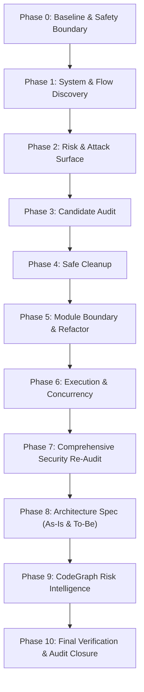

# Controlled Refactoring & Codebase Intelligence Protocol (CRCIP)

**Version**: 2.0-Definitive  
**Target**: Autonomous Coding Agents (Gemini, Claude Code, Codex, IDE Agents) & Engineering Teams  
**Scope**: Codebase Auditing, Safe Cleanup, Architecture Consolidation, Concurrency & Living Risk Intelligence

---

## 1. Core Invariants & Guardrails

### 1.1 Scope Control (Strict Isolation)
> **Agents MUST NOT automatically expand the task scope.**
- If codebase analysis exposes architectural debt, dead code, poor abstractions, or potential bugs outside the assigned task:
  - Record them explicitly as findings (`FOLLOW-UP` / `NON-BLOCKING`).
  - **Do NOT execute modifications** unless strictly required to safely fulfill the current assignment.
  - Explicit approval must be obtained before executing any change that materially broadens the work boundary.

### 1.2 Evidence-Based Verification Hierarchy
No assertion is accepted without empirical verification ("I think", "Should work", or "Seems safe" are forbidden).

| Level | Classification | Method / Tooling |
| :--- | :--- | :--- |
| **E0** | Unverified AI Assertion | Single-turn reasoning without tool proof. **Automatically rejected**. |
| **E1** | Static Text Search | `grep`, `ripgrep`, regex search across workspace files. |
| **E2** | Structural AST & Call Graph | `CodeGraph`, `ast-grep (sg)`, deterministic AST traversal. |
| **E3** | Automated Verification | Test suites pass (`pytest`, `vitest`), clean compiler builds, typecheck (`tsc`, `mypy`). |
| **E4** | Runtime / Contract Verification | Integration tests, smoke tests, active ENV/CLI contract verification, live endpoint checks. |
| **E5** | Independent Adversarial Review | Clean-context review where the reviewer evaluates code diffs and domain invariants independently without being guided by the implementer's conclusions. |

> **Operational Gate Rules**:
> - Deleting dead code requires minimum **E2 + E3** (and **E4** if dynamic runtime contracts are touched).
> - Modifying security-sensitive / financial flows requires **E3 + E4** (and **E5** for critical state transitions and fund invariants).
> - If a codebase lacks tests for a target component, write regression tests first (TDD) to establish an **E3** gate before refactoring.

### 1.3 Living CodeGraph Instrumentation
`codegraph.db` is an active, machine-readable source of truth throughout the entire engineering lifecycle, not a static report compiled at the end.

### 1.4 Independent Three-Axis Risk Classification
Every module and flow is evaluated across three independent dimensions:
- **Business Criticality**: `Critical` | `Important` | `Safe` (Impact on core operations and user assets).
- **Security Sensitivity**: `Critical` | `Sensitive` | `Normal` (Secrets, key custody, payment state machines, auth gates).
- **Blast Radius**: `High` | `Medium` | `Low` (Calculated from fan-in, transitive callers, and intersecting flows).

### 1.5 Canonical Documentation Standard (Strict 5 Docs)
To prevent documentation entropy, exactly 5 canonical files are maintained:
```text
docs/
├── ARCHITECTURE.md     # Single architecture spec: [As-Is Baseline] + [To-Be Target]
├── FLOWS.md            # Business flows, entry points & runtime contracts
├── SECURITY_AUDIT.md   # Attack surface, invariants & vulnerability status
├── CLEANUP_LOG.md      # Itemized cleanup ledger with E2-E4 proof
└── AUDIT_FINAL.md      # Created ONLY at Phase 10: Final closure & Known Uncertainties
```

---

## 2. Scale Adaptation

- **Full Protocol (Phases 0–10)**: Mandatory for financial services, payment gateways, agent wallets, smart contract interactions, and multi-developer production repositories.
- **Lightweight Subset**: For localized developer tooling, standalone scripts, or experimental prototypes:
  - **Phase 0**: Safety check & baseline test/build run.
  - **Phase 1**: Entry point & core flow mapping.
  - **Phase 4**: Safe cleanup with atomic commits.
  - **Phase 10**: Final verification confirming no new regressions.

---

## 3. Pre-Flight Protocol (Mandatory Before Any Code Edit)

Before modifying any symbol or file, every agent must execute this pre-flight verification:

```text
[ ] 1. Query CodeGraph: Identify callers, dependents, and last_verified_commit.
[ ] 2. Check Graph Freshness: Does current HEAD match last_verified_commit? (Re-index if desynchronized).
[ ] 3. Identify Affected Flows: Cross-reference docs/FLOWS.md for intersecting business flows.
[ ] 4. Assess 3-Axis Risk: Business Criticality | Security Sensitivity | Blast Radius.
[ ] 5. Check Runtime Contracts: Verify if symbol is bound to ENV, CLI, route paths, queues, or webhooks.
[ ] 6. Check Test Coverage: Confirm existing test coverage. If untested, author baseline tests first.
[ ] 7. Invariant Alignment: Review matching architectural rules in docs/ARCHITECTURE.md.
[ ] 8. Determine Required Evidence Level: Establish target evidence tier (E2 / E3 / E4 / E5).
```

---

## 4. Execution Phases (Phase 0 to Phase 10)



### Phase 0 — Baseline & Safety Boundary
1. **Working Tree Inspection**:
   - Inspect `git status` thoroughly.
   - **NEVER overwrite, clean, or hard-reset existing uncommitted user work**.
   - If dirty: Isolate user changes, establish a safe working boundary, and record dirty state in agent task memory.
2. **Snapshot Baseline**: Create a snapshot tag or record the baseline commit hash (`BASELINE-SNAPSHOT`).
3. **Capture Baseline Metrics**:
   - Execute production build.
   - Execute test suite (Catalog total tests, passing tests, and existing pre-change failures).
   - Execute linter and static typecheckers.
   - Store baseline metrics in task state (**Do NOT create `AUDIT_FINAL.md` in Phase 0**).
4. **Runtime Contract Inventory**: Catalog external contracts:
   - Environment variables (`.env`, `.env.example`).
   - CLI flags and commands, HTTP routes, webhook endpoints.
   - Message queues, cron schedules, DB migrations, dynamic imports, framework decorators.
5. **CodeGraph Baseline**: Initialize or synchronize `codegraph.db` with the baseline commit.

---

### Phase 1 — System & Flow Discovery
1. **Entry Point Inventory**: Identify all external ingestion points (API endpoints, CLI commands, background workers, event subscribers).
2. **End-to-End Flow Mapping**: Trace execution paths from entry points through controllers, services, repositories, to external boundaries.
3. **Update `docs/FLOWS.md`**:
   | Flow ID | Flow Name | Entry Point | Call Chain | Execution Model | Side Effects | Confidence |
   | :--- | :--- | :--- | :--- | :--- | :--- | :--- |
   | FL-01 | Agent Purchase | POST `/api/v1/buy` | Ctrler → Decision → Gateway | Async Sequential | Balance deduction, ledger write | HIGH |
   *(Confidence: `HIGH` = runtime verified, `MEDIUM` = static AST path, `LOW` = dynamic dispatch/reflection)*.

---

### Phase 2 — Risk & Attack Surface Classification
1. **Assign Three-Axis Risk**: Label every module and flow with Business Criticality, Security Sensitivity, and Blast Radius.
2. **Map Attack Surfaces**:
   - Unauthenticated or user-supplied input boundaries.
   - Authorization gates and signature verification checkpoints.
   - Third-party boundaries (APIs, RPC nodes, external services).
3. **Initialize `docs/SECURITY_AUDIT.md`**: Document existing invariants, authentication mechanisms, and boundary guarantees.

---

### Phase 3 — Candidate Audit (Dead Code, Duplication, Debt)
1. **Dead Code / Dead Doc Candidates**:
   - Scan for symbols with 0 references in CodeGraph.
   - **Cross-Check Runtime Contracts**: If a candidate symbol matches an ENV toggle, CLI command, webhook path, or event name, **it is NOT dead**.
2. **Semantic Duplication Analysis**:
   - Reject raw text similarity thresholds (e.g. "≥80% textual match").
   - Flag duplication only when two implementations enforce the **same business invariant or semantic contract**.
3. **Log Candidates**: Append candidates to `docs/CLEANUP_LOG.md` under `PENDING_VERIFICATION`.

---

### Phase 4 — Safe Cleanup
1. **Checkpoint**: Record commit snapshot `PRE-CLEANUP`.
2. **Atomic Deletion Protocol**:
   - Remove dead items in small, logically coherent batches.
   - **NEVER comment out code**: Remove clean code directly; Git preserves historical state.
   - Run compilation and tests after every batch to achieve **E3**.
3. **Instant Micro-Security Gate**:
   - If a deletion touches any file marked `Security: Critical` or `Security: Sensitive`, execute an immediate security sanity check before continuing.
4. **Update `docs/CLEANUP_LOG.md`**: Record removed targets, reasons, verification level achieved (E2/E3/E4), and commit hashes.
5. **Update CodeGraph**: Run incremental updates (or full rebuilds if file structures changed) to purge stale references.

---

### Phase 5 — Module Boundary & Reuse Refactor
1. **Domain-Centric Boundaries**:
   - Group duplicate code sharing identical business invariants into cohesive domain primitives.
   - Avoid forcing rigid OOP hierarchies where idiomatic modules, dependency injection, small services, and pure functions are better suited (e.g., Python/FastAPI).
2. **Change Budget (One Change = One Reason)**:
   - Isolate refactoring steps into atomic commits with descriptive semantic commit messages.
3. **Instant Micro-Security Gate**:
   - Re-verify critical paths immediately if refactoring touches auth, state machines, or payment logic.
4. **Update CodeGraph**: Perform incremental graph update or structural rebuild.

---

### Phase 6 — Execution & Concurrency Audit
1. **Disambiguate Execution Models**:
   - Distinguish synchronous execution from **Async with Sequential Dependencies** (`await step_one(); await step_two()`).
   - Eliminate blocking I/O or heavy synchronous CPU operations within async event loops.
2. **Failure & Concurrency Semantics**:
   - For concurrent executions (`asyncio.gather`, `Promise.all`), define explicit failure behavior:
     - Is there an automatic rollback?
     - Are sub-tasks idempotent upon partial retry?
     - Is partial success permitted or rejected?
3. **State Locking**: Ensure state mutations (e.g. balance updates, invoice state transitions) are guarded against race conditions.

---

### Phase 7 — Comprehensive Security Re-Audit
1. **Full-Spectrum Surface Review**: Validate authentication, token handling, input sanitization, injection vectors, and webhook signature verification.
2. **Payment & State Machine Integrity**:
   - Audit invoice status transitions and settlement verification.
   - Enforce that invoice and ledger tables are NEVER updated via direct database writes outside the domain state machine.
3. **E5 Independent Adversarial Review**:
   - Conduct an independent review of all `Security: Critical` modules.
   - The reviewer evaluates the code against domain threat models without inheriting prior assumptions.
4. **Update `docs/SECURITY_AUDIT.md`**: Record verified protections, resolved vulnerabilities, and residual risk posture.

---

### Phase 8 — Architecture Specification (Single Doc)
1. **Consolidate into `docs/ARCHITECTURE.md`**:
   - **Section 1: As-Is Architecture (Baseline)**: Documents the system state prior to refactoring.
   - **Section 2: Target Architecture (To-Be)**:
     - Module boundaries and dependency hierarchy.
     - End-to-end data flow and event flow diagrams (Mermaid).
     - Error handling, idempotency, and state machine invariants.
     - Definitive Single Source of Truth for each business domain.
2. **Archive Stale Documentation**: Move obsolete specifications to `docs/archive/` or delete them with entries in `CLEANUP_LOG.md`.

---

### Phase 9 — CodeGraph Risk Intelligence
Enrich `codegraph.db` with contextual metadata to empower subsequent agent sessions:
```text
Node Properties:
├── business_criticality     : CRITICAL | IMPORTANT | SAFE
├── security_sensitivity     : CRITICAL | SENSITIVE | NORMAL
├── fan_in                   : [Direct caller count]
├── transitive_dependents    : [Transitive caller count]
├── critical_flow_count      : [Number of Critical flows intersecting node]
├── affected_entrypoints     : [List of exposed endpoints / ingress routes]
├── affected_flows           : [List of flow IDs traversing this node]
├── runtime_contracts        : [Associated ENV keys, CLI arguments, Route patterns]
├── test_coverage_status     : COVERED | PARTIAL | UNTESTED
├── known_gotchas            : [Runtime quirks, subtle dependencies, invariant reminders]
└── last_verified_commit     : [Git commit hash at verification]
```
*(When a future agent queries a node, if `last_verified_commit != HEAD`, it immediately detects that graph metadata may be stale).*

---

### Phase 10 — Final Verification & Audit Closure
1. **Zero New Regressions Gate**:
   - **No NEW build failures**: Compiles cleanly.
   - **No NEW test failures**: Every test that passed at baseline must pass. Pre-existing failures must be explicitly cataloged without being obscured.
   - **Critical-path tests MUST PASS 100%**: Zero failures permitted on business-critical routes.
   - Linters and typecheckers introduce zero new warnings or errors.
   - CodeGraph graph consistency check succeeds.
2. **Generate `docs/AUDIT_FINAL.md`**:
   - Quantitative comparison: Before vs. After (files, LOC, dependencies, test count).
   - Summary of removed dead code, consolidated abstractions, and architectural changes.
   - **Mandatory Section — `KNOWN_UNCERTAINTIES & TECHNICAL DEBT`**:
     - Explicit disclosure of unverified edge cases (e.g. live production webhooks, network latency constraints).
     - Deferred technical debt cataloged during Scope Control enforcement.
3. **Closure Commit**: Create final checkpoint commit:
   `chore(audit): complete controlled refactor protocol [AUDIT-FINAL]`.
