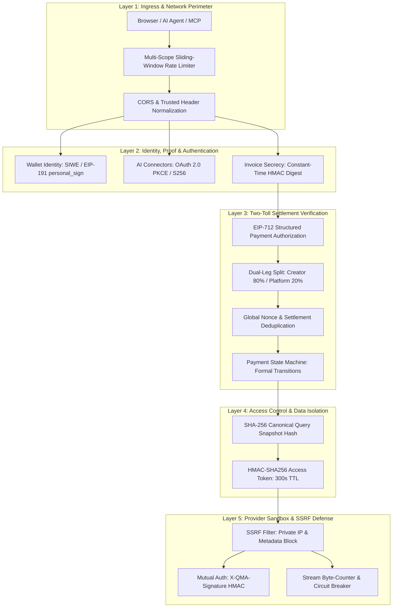

# QMA Production Security Architecture & Engineering Deep-Dive

> **Purpose:** This specification provides a comprehensive, rigorous architectural breakdown of the defense-in-depth security model implemented in the QMA (Quantitative Market Anomalies) platform. It serves as the authoritative production reference for operations, security audits, and engineering practices for Web3 and autonomous AI Agent micropayment systems.

---

## 1. Threat Model & Security Philosophy

The QMA platform bridges **Web3 Micropayments (Circle x402 / Arc Testnet / USDC)**, **Web2 REST APIs (FastAPI)**, and **Autonomous AI Agents (Model Context Protocol / OAuth 2.0 / Agent Sessions)**.

Unlike conventional Web2 architectures, QMA’s threat model directly involves immediate financial risks:

1. **Front-running & Parameter Tampering:** Purchasing an invoice bound to an inexpensive asset or low-cost query snapshot, then attempting to redeem that invoice/token to extract proprietary reports for expensive tokens or altered anomaly conditions.
2. **Double-Spending & Replay Attacks:** Re-submitting an already processed Arc Gateway `settlement_id` or sidecar receipt to authenticate and unlock additional invoices.
3. **Partial-Payment Exploitation (Split-Leg Asymmetry):** Paying only the platform commission leg while withholding payment from the Creator (or vice versa) and attempting to bypass gating logic.
4. **Client-Side Asynchronous Race Conditions:** Out-of-order UI state propagation (e.g., React asynchronous state transitions) causing invoices to be minted for stale symbols while the viewport displays a newer snapshot.
5. **SSRF & Malicious Intelligence Providers:** Third-party provider webhooks attempting to scan internal cloud infrastructure (e.g., AWS/GCP/Render instance metadata at `169.254.169.254`) or returning memory bombs (>1 MB payloads) to crash host workers.
6. **AI Agent Wallet Drainage:** Autonomous agents looping uncontrollably or malicious prompts coercing agents into depleting their allocated USDC budgets.

### Core Architectural Invariants
* **Zero-Trust Frontend & Zero-Trust Provider:** The browser client and third-party data providers are treated as untrusted boundaries. Access control is strictly enforced through server-side cryptographic proofs.
* **Fail-Closed Financial Invariants:** Financial state transitions never fall back to mock data or permissive defaults. Any missing or malformed proof results in an immediate failure (`400 Bad Request`, `402 Payment Required`, or `403 Forbidden`).
* **Cryptographic Decoupling:** Settlement verification is decoupled from data distribution using short-lived, cryptographically signed access tokens.

---

## 2. Multi-Layer Security Architecture



---

## 3. Deep Technical Analysis of Implemented Controls

### 3.1. Two-Toll Direct Split Verification & Anti-Double-Spend (`settlement_validation.py`)

QMA operates a **Two-Toll Direct Split Settlement** model on Arc Testnet via Circle Gateway. Each purchase generates two distinct settlement legs:
- **Creator Leg:** Typically 80% (8000 bps) directed to the Creator's revenue wallet.
- **Platform Leg:** Typically 20% (2000 bps) directed to the Platform Treasury.

#### A. Multi-Point Split Leg Validation
During `POST /api/v1/payment/verify`, the backend processes `split_settlements`:
1. **Leg Completeness:** Verifies that proofs are submitted for all mandatory legs defined in `invoice.split.legs`.
2. **Recipient Pinning (`pay_to`):** Ensures `settlement.pay_to` strictly equals the pre-calculated revenue address for that leg.
3. **Amount Verification (`amount_raw`):** Confirms that the settled atomic micro-USDC (6 decimals) meets or exceeds the required threshold.
4. **Sidecar Receipt Verification (`sidecar_receipt`):** Validates the cryptographic receipt string issued by Arc Gateway.

#### B. Idempotency & Global Deduplication
To defeat replay attacks across different invoices:
* The backend inspects both active memory states (`state.invoices_db`) and persistent records (`payment_ledger.json` / Supabase).
* If a submitted `settlement_id` has already been recorded for any other invoice, verification fails immediately:
  ```python
  for existing_id, inv in invoices_db.items():
      if existing_id != current_invoice_id and settlement_id in inv.get("split_settlement_ids", []):
          raise HTTPException(status_code=409, detail="Settlement ID already used for another invoice.")
  ```

#### C. Resumable Split Legs (Fault-Tolerant Partial Payments)
* **Problem:** In a multi-leg settlement, if leg 1 succeeds onchain but leg 2 fails due to network drop or user cancellation, a naive system either rejects the whole transaction (causing user fund loss) or opens the report (causing economic leakage).
* **Solution:** Invoices transition into `partial_paid`. Leg 1 is persisted with its `sidecar_receipt`. When the user returns to retry, both client and backend detect the cached invoice and **only demand settlement for the remaining missing leg**, guaranteeing zero loss of funds and zero double-charging.

---

### 3.2. Query Snapshot Fingerprinting (Anti-Parameter Tampering)

#### A. The Attack Vector
If access tokens only reference an `invoice_id` without pinning the underlying payload parameters, an adversary could:
1. Generate an invoice for an inexpensive or low-tier asset (e.g., `symbol: "BTC"`).
2. Complete onchain settlement.
3. Call `/full-report` with the paid access token while swapping the request payload to an expensive, high-alpha asset (e.g., `symbol: "HYPE"` or complex volatility filters).

#### B. Canonical JSON Hashing Algorithm
QMA neutralizes this vector by calculating an immutable **Query Snapshot Fingerprint**:
```python
def canonical_query_payload(query: dict) -> dict:
    """Normalizes query keys, types, and strips volatile parameters."""
    return {
        "symbol": str(query.get("symbol", "")).strip().upper(),
        "market_cap": float(query.get("marketCap", 0)),
        "funding_rate": float(query.get("fundingRate", 0)),
        # ... anomaly parameters sorted canonically
    }

def query_fingerprint(query: dict) -> str:
    """Produces a deterministic SHA-256 digest of the canonical JSON."""
    canonical = canonical_query_payload(query)
    encoded = json.dumps(canonical, sort_keys=True, separators=(",", ":"))
    return hashlib.sha256(encoded.encode("utf-8")).hexdigest()
```

#### C. Invariant Enforcement at Data Delivery (`authorize_paid_invoice`)
Whenever `/preview` or `/full-report` is invoked:
```python
# 1. Symbol Level Check
if invoice["symbol"].upper() != str(query.get("symbol", "")).upper():
    raise HTTPException(status_code=400, detail="Invoice symbol does not match query symbol.")

# 2. Cryptographic Digest Check
current_query_hash = query_fingerprint(query)
if invoice.get("query_hash") != current_query_hash:
    raise HTTPException(status_code=403, detail="Paid invoice is bound to a different query snapshot. Create a fresh invoice for changed signal data.")
```

> **Production Note:** This invariant proved essential in identifying client-side state drift. When a user selected a new signal on the UI, React asynchronous re-rendering could cause a race condition where the invoice was created with a previous symbol. The backend immediately blocked report delivery with `400 Bad Request`, preventing cross-report data leakage.

---

### 3.3. Token Architecture & Constant-Time Secrets

#### A. Cryptographic Decoupling via Short-Lived Access Tokens
Upon successful settlement verification, the backend issues an ephemeral access token:
* **Lifetime:** $300\text{ seconds}$ ($5\text{ minutes}$).
* **Signature:** HMAC-SHA256 signed with `QMA_ACCESS_TOKEN_SECRET`.
* **Payload Structure:** Cryptographically binds `invoice_id`, `tier`, `provider_id`, `payer_address`, `iat`, and `exp`.
* **Throughput Benefit:** High-volume delivery endpoints verify the access token in $\approx 0.1\text{ ms}$ without contacting RPC nodes or the Arc Gateway facilitator, isolating core databases from read-heavy load spikes.

#### B. Invoice Secrets & Timing-Attack Mitigation
* Each invoice is initialized with a cryptographically secure 128-bit hex secret (`invoice_secret`).
* Polling status via `/api/v1/payment/invoices/{id}/status` requires the `X-QMA-Invoice-Secret` header, preventing ID enumeration attacks against invoice UUIDs.
* Verification uses constant-time string comparison to prevent timing side-channel leakage:
  ```python
  import hmac
  if not hmac.compare_digest(str(invoice_secret), str(invoice.get("invoice_secret"))):
      raise HTTPException(status_code=403, detail="Invoice secret mismatch.")
  ```

---

### 3.4. Multi-Scope Sliding-Window Rate Limiting

The ingress layer features a fine-grained, IP-based rate limiter tailored to route sensitivity:

| Scope | Protected Paths | Default Quota | Security Objective |
| :--- | :--- | :---: | :--- |
| **`payment_verify`** | `/api/v1/payment/verify` | **8 req/min/IP** | Prevents brute-forcing settlement receipts & protects Arc Gateway RPC |
| **`creator_apply`** | `/api/v1/creators/apply` | **6 req/min/IP** | Mitigates Sybil registrations and onboarding spam |
| **`payment_invoice`** | `/api/v1/payment/invoice` | **20 req/min/IP** | Prevents invoice storage table exhaustion |
| **`paid_report`** | `/api/v1/providers/*/full-report` | **30 req/min/IP** | Balances normal report consumption against automated scraping |
| **`public_market`** | `/api/v1/providers/*/live-anomalies` | **120 req/min/IP** | Permits high-frequency UI polling of live signal feeds |
| **`api_default`** | All other `/api/v1/*` routes | **240 req/min/IP** | General platform denial-of-service protection |

When a limit is reached, the server responds with RFC 6585 compliant headers:
```http
HTTP/1.1 429 Too Many Requests
Retry-After: 42
X-RateLimit-Limit: 8
X-RateLimit-Remaining: 0
X-RateLimit-Reset: 1725441240
```

---

### 3.5. AI Agent Security: OAuth 2.0 PKCE for Model Context Protocol (MCP)

To enable autonomous assistants (Claude Desktop, ChatGPT Connectors) to consume QMA APIs without exposing root private keys or static credentials, QMA implements **RFC 7636 (Proof Key for Code Exchange)**:

1. **Cryptographic Challenge (`S256`):** The AI client creates a high-entropy random `code_verifier`, computes `code_challenge = BASE64URL(SHA256(code_verifier))`, and passes it to `/oauth/authorize`.
2. **CSRF State Verification:** A unique `state` parameter is validated through the user authorization approval workflow.
3. **Secure Code Exchange (`/oauth/token`):** The server verifies `SHA256(received_code_verifier) == stored_code_challenge`. Interception of the transient authorization code is useless without the verifier.
4. **Scoped Capabilities:** Issued tokens are strictly scoped (`qma:read`, `qma:buy`), preventing agents from executing administrative or fund withdrawal operations (`/payment/withdraw`).

---

### 3.6. Zero-Trust Intelligence Provider Sandbox

External providers delivering custom alpha feeds operate under strict defensive constraints:

1. **SSRF Filter:** URLs registered by creators are screened against:
   * Loopback interfaces (`127.0.0.1`, `localhost`).
   * RFC 1918 private subnets (`10.0.0.0/8`, `172.16.0.0/12`, `192.168.0.0/16`).
   * Cloud instance metadata endpoints (`169.254.169.254`).
2. **Mutual HMAC Authentication:** Server-to-provider dispatch includes `X-QMA-Signature` (HMAC-SHA256 of the payload) and `X-QMA-Timestamp` with a $\pm 300\text{ s}$ validity window to defeat replay attacks.
3. **Stream Byte-Counter & Memory Bomb Protection:** Provider HTTP responses are read via chunked streams. If incoming data exceeds $1\text{ MB}$, the socket is abruptly closed to safeguard worker memory.
4. **Circuit Breakers:** A provider returning 3 consecutive 5xx responses or timeouts is automatically placed in `temporarily_disabled` status for 10 minutes to protect autonomous agent execution loops.

---

## 4. Production Operational Playbook & Lessons Learned

| Incident / Scenario | System Risk | Operational Resolution |
| :--- | :--- | :--- |
| **React Async State Drift** | Stale closure creates invoice for token A while UI displays token B | Explicitly pass snapshot data (`targetQuery`, `targetProviderId`) into payment trigger handlers; bind `query` and `symbol` directly to invoice models. |
| **Packet Loss Post-Signature** | Buyer balance deducted onchain but client drops before receiving access token | Implement resumable state machines; write intermediate split leg receipts to persistent storage (`localStorage` / Supabase). |
| **Double-Spend Settlement** | Adversary re-submits previous settlement transaction hashes | Enforce unique indexes and cross-invoice settlement deduplication before issuing access tokens. |
| **RPC Gateway Saturation** | Aggressive client polling overwhelms blockchain RPC endpoints | Restrict `payment_verify` rate limits to 8 req/min/IP and apply exponential backoff on receipt polling. |
| **Timing Side-Channels** | Microsecond differences in string matching leak invoice secrets | Utilize `hmac.compare_digest` across all secret and token validations. |
| **Agent Budget Runaway** | Recursive autonomous agent loops exhaust USDC reserves | Enforce strict session budget ceilings (`budget_usdc`) checked at the invoice generation pre-condition. |

---

## 5. Pre-Production Security Verification Checklist

- [x] **Rate Limiting:** Confirm HTTP 429 response when exceeding 8 requests/minute on `/api/v1/payment/verify`.
- [x] **Symbol Integrity:** Confirm HTTP 400 rejection when request query symbol diverges from invoice symbol.
- [x] **Snapshot Fingerprint:** Confirm HTTP 403 rejection when any parameter in the query snapshot is altered post-invoice creation.
- [x] **Timing-Safe Secrecy:** Confirm HTTP 403 rejection on invalid `X-QMA-Invoice-Secret` headers using constant-time comparison.
- [x] **Anti-Replay:** Confirm HTTP 409 rejection when re-submitting an identical `settlement_id`.
- [x] **SSRF Defense:** Confirm outbound provider client blocks `http://169.254.169.254` and internal IP ranges.
- [x] **OAuth PKCE (S256):** Confirm `/oauth/token` exchange fails if `code_verifier` does not match the hashed challenge.
- [x] **Gas Abstraction Safety:** Confirm transactions settle via USDC allowances without requiring native network gas tokens from end-user wallets.
