# QMA System Flow Architecture

Detailed sequence diagrams for the two core workflows in the QMA system, reflecting the source code implementation and four-layer security model.

---

## 1. Flow 1: Provider Onboarding & Webhook Execution (Data Provider Side)

Describes the provider lifecycle: from registering an external API on QMA to secure execution by QMA Marketplace Core.

```mermaid
sequenceDiagram
    autonumber
    actor Provider as 3rd Party Provider
    participant UI as Marketplace UI
    participant Admin as QMA Admin (Review)
    participant Core as QMA Core (ProviderRegistryV2)
    participant Adapter as WebhookProviderAdapter (Layer 2)
    participant Webhook as Provider's Server (API)

    %% Registration and Approval
    rect rgb(30, 40, 50)
    Note over Provider, Core: Phase 1: Onboarding & Registration (Layer 1 Security)
    Provider->>UI: Submit Form (Name, Webhook URL, USDC Wallet, Schema)
    UI->>Core: POST /api/v1/market/apply (Save draft)
    Admin->>Core: Audit URL (Block 127.0.0.1, Private IPs)
    Admin->>Core: Approve & Register to ProviderRegistryV2
    end

    %% Secure API Execution
    rect rgb(20, 50, 40)
    Note over Core, Webhook: Phase 2: Runtime Execution (Layer 2 Security)
    Core->>Adapter: GET /manifest
    Adapter-->>Core: Return dynamic UI Schema for form rendering

    Note over Core, Adapter: When Agent requests quote / signal score
    Core->>Adapter: score(context)
    
    Adapter->>Adapter: Sign HMAC-SHA256 (X-QMA-Signature)
    Adapter->>Adapter: Resolve DNS (Anti-DNS Rebinding)
    Adapter->>Webhook: HTTP POST /score (3s Timeout)
    Webhook-->>Adapter: JSON (amount_usdc, confidence)
    
    Note over Adapter: Enforce 1MB Response Bomb Limit
    Adapter-->>Core: Return normalized quote
    end

    %% Data Delivery
    rect rgb(50, 30, 40)
    Note over Core, Webhook: Phase 3: Data Delivery (Opaque Payload)
    Core->>Adapter: deliver(context)
    Adapter->>Webhook: HTTP POST /deliver (15s Timeout)
    Webhook-->>Adapter: Raw Data Payload
    Note over Adapter: Wrap in 'payload' (Prevent status/price overwrite)
    Adapter-->>Core: Return sanitized data
    end
```

### Detailed Flow 1 Explanation:
- **Steps 1–4 (Onboarding):** Providers register external endpoints. QMA Admin audits and adds approved providers to `ProviderRegistryV2`.
- **Steps 7–12 (Runtime Security):** Quotes route through `WebhookProviderAdapter`, enforcing **HMAC signatures, DNS rebinding mitigation, hard timeouts, and 1MB response size limits**.
- **Steps 13–17 (Opaque Payload):** Data returned by `deliver` is encapsulated within an opaque payload object, preventing third-party endpoints from manipulating system metadata like `status: "paid"`.

---

## 2. Flow 2: Autonomous Agent & Payment Flow (Buyer Side)

Describes how an autonomous AI Agent decides to buy, settles payment via x402 / Circle Gateway, and unlocks reports without manual intervention.

```mermaid
sequenceDiagram
    autonumber
    actor Agent as Autonomous Agent (CLI)
    participant Decision as /api/v1/agent/decision
    participant Invoice as /api/v1/payment/invoice
    participant Circle as Circle Agent Wallet (Arc Testnet)
    participant Gateway as x402 Settlement
    participant Verify as /api/v1/payment/verify
    participant Report as /api/v1/reports

    %% Decision Phase
    rect rgb(30, 40, 50)
    Note over Agent, Decision: Phase 1: Evaluation & Decision
    Agent->>Agent: Check Policy (Budget, Max Price, Allowlist)
    Agent->>Decision: POST /decision (Request optimal candidate)
    Decision-->>Agent: Return Candidate (Provider X, Price 0.05 USDC)
    Agent->>Agent: Policy checks pass -> Approve purchase
    end

    %% Invoice Phase
    rect rgb(50, 40, 20)
    Note over Agent, Invoice: Phase 2: Create x402 Invoice
    Agent->>Invoice: POST /invoice (provider_id=X)
    Invoice->>Invoice: Calculate Split Legs (Payment breakdown)
    Invoice-->>Agent: Return Invoice_ID + Payment requirements
    Note right of Invoice: Creator Leg: 0.04 USDC<br/>Platform Leg: 0.01 USDC
    end

    %% Blockchain Settlement & Unlock
    rect rgb(20, 50, 40)
    Note over Agent, Gateway: Phase 3: Blockchain Settlement
    Agent->>Circle: Sign USDC transfer (Gasless)
    Circle->>Gateway: Record settlement on Arc Testnet
    Gateway-->>Agent: Return receipt / transaction reference

    Note over Agent, Report: Phase 4: Verification & Unlock
    Agent->>Verify: POST /verify (Submit receipt)
    Verify->>Gateway: Cross-check receipt on-chain
    Verify-->>Agent: Validated! Issue short-lived Access Token (5 min TTL)
    
    Agent->>Report: GET /full-report (With Access Token)
    Report-->>Agent: Full Report content unlocked
    end
```

### Detailed Flow 2 Explanation:
- **Steps 1–4 (Policy & Decision):** The AI Agent evaluates deterministic constraints (budget, maximum price ceiling) before selecting candidate intelligence.
- **Steps 5–7 (Split Legs):** Invoices define two distinct legs: Creator Leg (provider wallet) and Platform Leg (treasury wallet).
- **Steps 8–10 (On-Chain Settlement):** The agent signs transactions using Circle Agent Wallet on Arc Testnet (gasless).
- **Steps 11–15 (Verification & Unlock):** QMA independently validates on-chain settlement receipts before generating a scoped, short-lived access token, preventing forged receipt exploits.
