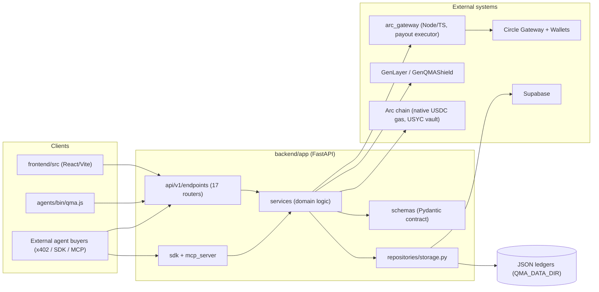
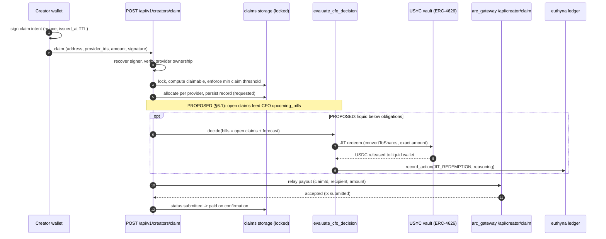
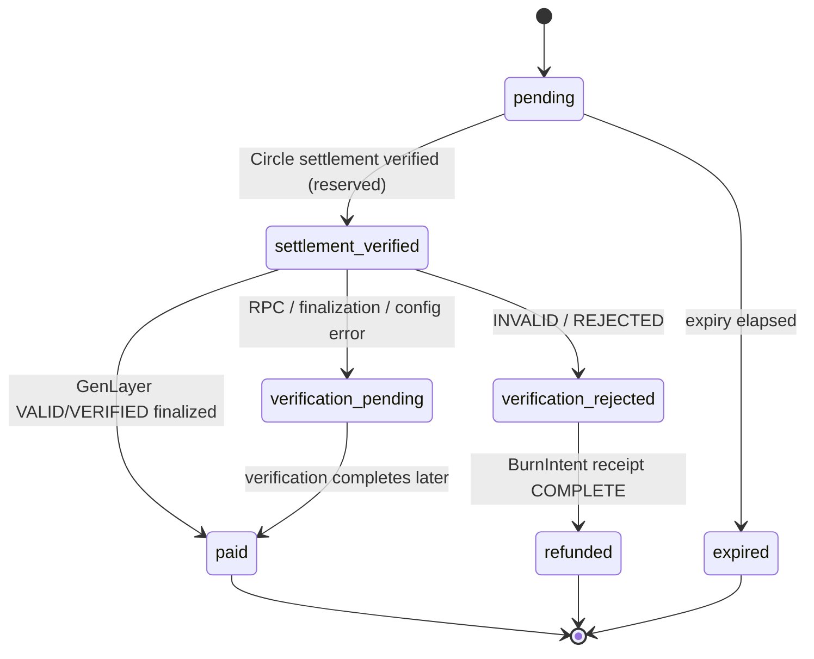
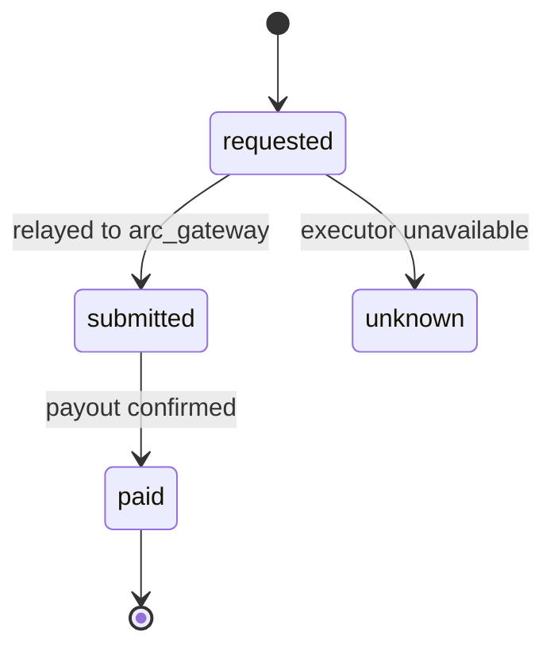
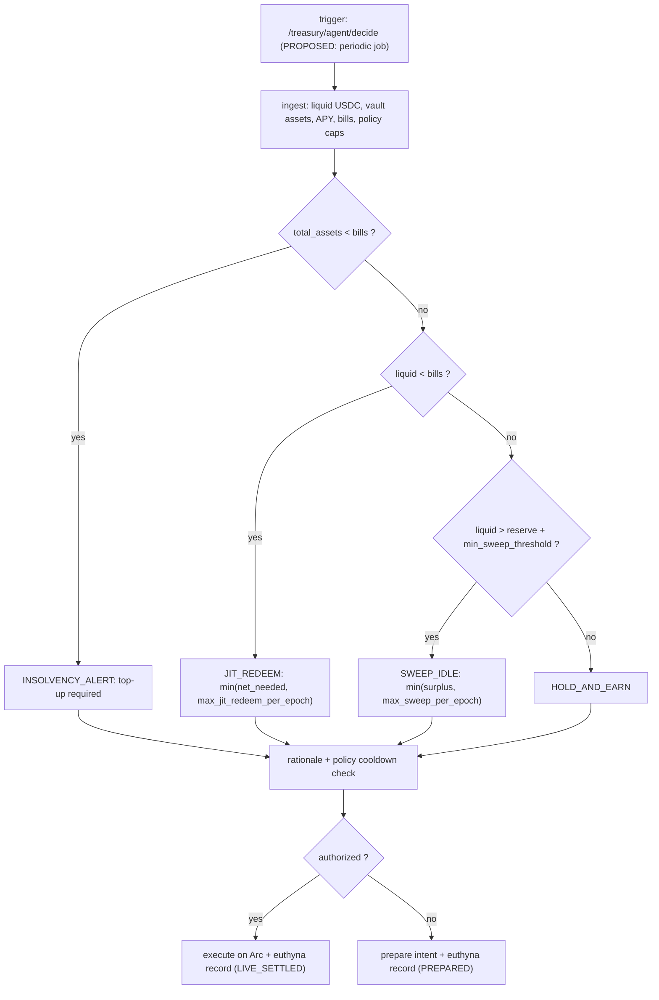

# GenQMA System Architecture — Source Zoning, Domain Types, and Flow Diagrams

Status: living document. Keep synchronized with code per CRCIP
(`CONTROLLED_REFACTORING_PROTOCOL.md`). Payment-flow behavior is specified by
[`docs/agent/PAYMENT_FLOW.md`](../agent/PAYMENT_FLOW.md), which remains the
source of truth for the purchase/settlement/verification lifecycle; this
document maps it into the codebase structure and never overrides it.

Sections:

1. [Source code zoning](#1-source-code-zoning)
2. [Runtime component map](#2-runtime-component-map)
3. [Canonical domain types](#3-canonical-domain-types)
4. [Sequence diagrams](#4-sequence-diagrams)
5. [State / activity diagrams](#5-state--activity-diagrams)
6. [Planned integrations (proposed, not built)](#6-planned-integrations-proposed-not-built)
7. [Maintenance rules](#7-maintenance-rules)

---

## 1. Source code zoning

Bounded contexts and their owning directories. "Sensitive" marks areas where
edits require reading `docs/agent/PAYMENT_FLOW.md` first and going through
review (see root `AGENTS.md`).

| Zone | Path | Responsibility |
| --- | --- | --- |
| HTTP entry shim | `main.py` (root) | Render-compatible wrapper delegating to `backend.app`. Never delete; verify `render.yaml` before any change. |
| API surface | `backend/app/api/v1/endpoints/` | 17 `APIRouter` modules (`agent`, `chat`, `health`, `incidents`, `internal`, `market`, `oauth`, `onramp`, `payments`, `platform`, `providers`, `reports`, `sessions`, `stablefx`, `treasury`, `wallets`). Public routes are registered here only. |
| Payment domain (**sensitive**) | `backend/app/services/`: `payment_state_machine.py`, `x402_gateway.py`, `settlement_validation.py`, `payment_signing.py`, `payment_ledger.py`, `invoice_builder.py`, `payment_events_service.py` | Invoice lifecycle, Gateway settlement verification, ledger events. Never write invoice state directly (ast-grep rule `python-state-invoices-direct-write.yml`). |
| Creator economy (**sensitive**) | `backend/app/services/creator_claims.py` + claim endpoint in `endpoints/providers.py` | Claim signature recovery, min-claim threshold, allocation, relay to Arc Gateway payout. |
| Treasury / yield | `backend/app/services/`: `usyc_treasury.py`, `earn_kit.py`, `stablefx_service.py` | ERC-4626 USYC vault on Arc, CFO decision engine, JIT redemption, forecast, spend rails. |
| Agent intelligence | `backend/app/services/`: `agent_decision.py`, `laya_decision.py`, `agent_synthesis.py`, `agent_recommendations.py`, `reports.py`, `market_data/` | 4-tier purchase decision cascade, report generation/scoring, BYO-key narrative synthesis. |
| Verification | `backend/app/services/genlayer_arbiter.py`, `GenQMAShield` contract (GenLayer) | Fail-closed SLA attestation of paid reports via GenLayer consensus. |
| Safety & audit | `backend/app/services/`: `spend_guard.py`, `spending_policy.py`, `incident_engine.py`, `agent_security.py`, `euthyna_audit.py`, `security.py` | Deterministic spend limits, circuit breakers, incident records, hash-chained audit ledger. Deterministic by design — never move these decisions behind an LLM. |
| Platform integrations | `backend/app/services/`: `circle_client.py`, `erc8004_service.py`, `arc_verdict_settlement.py`, `mcp_oauth.py`, `wallet_profiles.py`, `wallet_utils.py`, `providers_meta.py`, `agent_jobs.py`, `plugins/` | Circle client, ERC-8004 identity/reputation, MCP OAuth, wallets, provider metadata, delivery jobs. |
| Schemas | `backend/app/schemas/` | Pydantic request/response models (public contract; changes trigger the API documentation gate). |
| Storage | `backend/app/repositories/storage.py` | Persistence. Supabase is authoritative when URL + service-role key are configured; otherwise local JSON ledgers (`QMA_DATA_DIR`), atomic replacement (per `PAYMENT_FLOW.md`). |
| Agent-facing surfaces | `backend/app/sdk/qma_agent_sdk.py`, `backend/app/mcp_server/server.py` | SDK and MCP entry points for external agent clients. |
| Settlement executor | `arc_gateway/` (Node/TS, independently deployed) | Executes creator payouts, Gateway BurnIntent/mint, x402 resources. Out of scope for backend refactors; appears as an external boundary in all diagrams. |
| Frontend | `frontend/src/` | Pages: `Home` (landing), `Intelligence` (signal cards + `DecisionReceipt`), `Traction` (provenance ledger + CFO radar), `Swap` (CCTP / StableFX), `Marketplace`, `ApiDocs`, `Connect`, `Profile`. |
| CLI | `agents/bin/qma.js` | Canonical agent CLI (`qma agent run`). |
| Ops / scripts | `scripts/`, `supabase/`, `exports/`, `tests/` | Migrations, repair tools, backups, tests. |

Reference snapshot `main_ref.py` (root) is legacy-only: never run, import,
modify, or delete.

### Zone boundary rules

1. Endpoint modules never call repositories directly for payment state; they go
   through services.
2. Services in the Safety & audit zone are the only writers of
   `euthyna_audit` records; every treasury action records exactly one entry.
3. `arc_gateway/` is reached only via authenticated internal relay (secret
   header), never by external clients.
4. Frontend never composes payment state itself; it renders endpoints.

---

## 2. Runtime component map



---

## 3. Canonical domain types

Rule going forward: **no new free-floating string literals** for values in
this section. Values already match production strings exactly, so adopting
the enums is non-breaking. Existing Pydantic schemas
(`backend/app/schemas/treasury.py`, `schemas/agent.py`,
`schemas/payments.py`) stay the public contract; enums back them via
`Literal`-compatible string values.

### 3.1 Already typed (Pydantic — source of record)

| Type | Location | Notes |
| --- | --- | --- |
| `EuthynaAuditRecordResponse` | `schemas/treasury.py` | Hash-chained audit record: `record_id`, `action`, `actor`, `amount_usdc`, `treasury_liquid_before/after`, `usyc_vault_shares`, `tx_hash`, `policy_rule_applied`, `cfo_reasoning`, `previous_hash`, `integrity_hash`, `status`. |
| `USYCPositionResponse`, `USYCSweepResponse`, `USYCJITRedeemResponse`, `USYCForecastResponse`, `EuthynaIntegrityResponse`, `CorporateTreasuryPolicy`, `CFODecisionResult` | `schemas/treasury.py` | Treasury read/execute contract. |
| `AgentDecisionRequest` | `schemas/agent.py` | Prompt, `budget_usdc`, `max_price_usdc`, `allowed_tiers: Literal["preview","full"]`, `use_llm`, `use_laya`. |
| `AgentIdentityResponse`, `AgentReputationResponse` (ERC-8004), `ERC8183JobRequest/Response` | `schemas/agent.py` | Agent identity/reputation; escrowed job lifecycle (`ready, funded, in_progress, completed, settled`). |

### 3.2 Proposed enums (string values = current production literals)

Target home: `backend/app/core/enums.py` (single import point). Adoption is a
mechanical refactor scheduled through the normal fix loop — **not** a silent
rename; every listed site keeps its exact value.

```python
from enum import Enum


class DecisionSource(str, Enum):
    """Who authored an agent decision. Surfaced as `decision_source`."""

    FAST_PARSER = "fast_parser"            # agent_decision.py tier 0
    LAYA_SYSTEM_ONE = "laya_system_one"     # agent_decision.py tier 1
    LLM = "llm"                             # agent_decision.py tier 2 (_llm_decision)
    SECURITY_SANITIZER = "security_sanitizer"  # agent_decision.py:744
    DETERMINISTIC_FALLBACK = "deterministic_fallback"  # agent_decision.py tier 3
    HEURISTIC = "heuristic"                 # evaluate_cfo_decision ladder (reserved)
    MODEL = "model"                         # reserved: proposed CFO LLM proposal tier (§6)


class CFODecisionAction(str, Enum):
    """Allowed CFO engine outcomes. LLM proposals are clamped to this set."""

    SWEEP_IDLE = "SWEEP_IDLE"
    JIT_REDEEM = "JIT_REDEEM"
    HOLD_AND_EARN = "HOLD_AND_EARN"
    INSOLVENCY_ALERT = "INSOLVENCY_ALERT"


class TreasuryExecutionStatus(str, Enum):
    PREPARED = "PREPARED"
    CONFIRMED_ONCHAIN = "CONFIRMED_ONCHAIN"
    LEDGER_ONLY_SIMULATED = "LEDGER_ONLY_SIMULATED"  # earn_kit Morpho simulated mode
    NO_ACTION_REQUIRED = "NO_ACTION_REQUIRED"
    ALERT_EMITTED = "ALERT_EMITTED"


class CreatorClaimStatus(str, Enum):
    """Creator claim lifecycle (CLAIM_RESERVED_STATUSES in creator_claims.py)."""

    REQUESTED = "requested"
    SUBMITTED = "submitted"
    PAID = "paid"
    FAILED = "failed"     # relay returned upstream 4xx (providers.py:380)
    UNKNOWN = "unknown"


class EuthynaRecordStatus(str, Enum):
    VERIFIED_AUDITABLE = "VERIFIED_AUDITABLE"
    LIVE_SETTLED = "LIVE_SETTLED"
    DRY_RUN_SIMULATED = "DRY_RUN_SIMULATED"


class EuthynaAction(str, Enum):
    """Audit action tags. Values are hash-chain payload inputs: normalizing a
    historical literal would break `verify_integrity()` for records already
    written with it. Both spellings below exist in production records
    (verified 2026-10-02); consolidation is future debt, not a rename."""

    IDLE_SWEEP = "IDLE_SWEEP"               # euthyna_audit / treasury sweep
    SWEEP_IDLE = "SWEEP_IDLE"               # earn_kit.py:652 (Morpho rail)
    JIT_REDEMPTION = "JIT_REDEMPTION"       # treasury JIT redeem
    JIT_REDEEM = "JIT_REDEEM"               # earn_kit.py:810 (Morpho rail)
    X402_PAYMENT = "X402_PAYMENT"
    CREATOR_PAYOUT = "creator_payout"       # arc_verdict_settlement op name
    BUYER_REFUND = "buyer_refund"           # arc_verdict_settlement op name
    VENDOR_PAYOUT = "VENDOR_PAYOUT"         # backend/app/main.py:2231
    STABLEFX_SWAP = "STABLEFX_SWAP"
    RECONCILIATION_AUDIT = "RECONCILIATION_AUDIT"
    INCIDENT_RESOLVED = "INCIDENT_RESOLVED"
    # dynamic family: f"AGENT_INCIDENT_{severity}" (incident_engine.py:129) —
    # model as a prefix check, not an enum member


class InvoiceStatus(str, Enum):
    """Invoice lifecycle per payment_state_machine.py + PAYMENT_FLOW.md."""

    PENDING = "pending"
    SETTLEMENT_VERIFIED = "settlement_verified"
    VERIFICATION_PENDING = "verification_pending"
    PAID = "paid"
    PARTIAL_PAID = "partial_paid"       # payment_state_machine.py:50 area
    DISPUTED = "disputed"               # payment_state_machine.py:43-50
    VERIFICATION_REJECTED = "verification_rejected"
    REFUNDED = "refunded"
    EXPIRED = "expired"


class GatewayStatus(str, Enum):
    """Circle Gateway settlement statuses (payment_state_machine.py:8–12)."""

    RECEIVED = "received"
    BATCHED = "batched"
    COMPLETED = "completed"
    CONFIRMED = "confirmed"
    FAILED = "failed"
    REJECTED = "rejected"
    CANCELLED = "cancelled"
    CANCELED = "canceled"            # spelling variant accepted by env config
    REVERTED = "reverted"
    EXPIRED_UNSETTLED = "expired_unsettled"


class YieldRail(str, Enum):
    USYC = "USYC"
    EARN_KIT_MORPHO = "EARN_KIT_MORPHO"


class ReportTier(str, Enum):
    PREVIEW = "preview"
    FULL = "full"
    AUTO = "auto"   # internal planning tier (recommendations engine)
```

### 3.3 String-literal sites to migrate (inventory)

| Value set | Current sites (verified) | Target |
| --- | --- | --- |
| CFO actions + execution status | `usyc_treasury.py:797–847`, `:826`, `:832` | `CFODecisionAction`, `TreasuryExecutionStatus` |
| Claim statuses | `creator_claims.py:158` (`CLAIM_RESERVED_STATUSES`), `providers.py` claim endpoint | `CreatorClaimStatus` |
| Euthyna status | `euthyna_audit.py:160` (`LIVE_SETTLED` / `DRY_RUN_SIMULATED`), schema default `VERIFIED_AUDITABLE` | `EuthynaRecordStatus` |
| Invoice statuses | `payment_state_machine.py:66,96,100,102`, `PAYMENT_FLOW.md` | `InvoiceStatus` |
| Gateway statuses | `payment_state_machine.py:8–12` | `GatewayStatus` |
| Decision sources | `agent_decision.py:346,744,780,805` | `DecisionSource` |
| Yield rail | `usyc_treasury.py:760–763` | `YieldRail` |

Migration rule: replace only literals, never response keys or serialized
values; `x-qma-access`, OpenAPI summaries, and `docs/api/README.md` are
untouched because no public contract changes. Run
`python -m pytest tests/api_v1/test_api_openapi_docs.py -q` after adoption as
the standard gate.

### 3.4 Additional sets (full context scan, 2026-10-02)

The exhaustive preflight scan
(`scratch/reports/be_context_scan_2026-10-02.md`, §C.2 — every site
file:line-cited and independently spot-verified) identified 8 more recurring
stringly-typed sets to include in `core/enums.py` at adoption time:
`OperationType` (`creator_payout` / `buyer_refund` / `VENDOR_PAYOUT`),
`IncidentSeverity`, `IncidentKind`, `ERC8183JobStatus`, `SplitLegStatus`,
`ProviderId`, `SessionLeaseStatus`, `GenLayerVerdict`. Their member values in
the scan report are canonical; the report also flags god-classes
(`USYCTreasuryService`, `EarnKitService`), the untested critical module
(`creator_claims.py` — CRCIP E-gate requires baseline tests before any
refactor touching it), and 10 findings (F-01…F-10) that seed the CLEANUP_LOG
at Phase 3.

---

## 4. Sequence diagrams

### 4.1 Report purchase (source of truth: `PAYMENT_FLOW.md`)

```mermaid
sequenceDiagram
    autonumber
    participant B as Buyer (Human / SDK / MCP)
    participant API as backend endpoints
    participant SM as payment_state_machine
    participant GW as Circle Gateway (x402 USDC)
    participant GL as GenQMAShield (GenLayer)
    participant SC as Arc sidecar
    participant LED as payment_ledger + euthyna

    B->>API: create invoice (provider, tier, query_hash)
    API->>API: bind amount, platform treasury, expiry (no split legs)
    API-->>B: invoice_id + 402 payment resource
    B->>GW: authorize one x402 settlement (integer micro-USDC)
    GW-->>API: settlement_id (received / batched / completed)
    API->>SM: verify settlement id, recipient, payer, amount
    SM-->>API: invoice = settlement_verified (settlement reserved)
    API->>API: generate report once, store SHA-256 report_hash (report stays inaccessible)
    API->>GL: GenQMAShield.submit_and_verify(invoice_id, query_hash, report_hash)
    alt finalized VALID / VERIFIED
        GL-->>API: verdict
        API->>SM: invoice = paid, issue X-QMA-Access-Token
        API->>LED: persist creator_payout operation (UUID-v4 idempotency key)
        API->>SC: transfer creator share; platform share stays in treasury
        API-->>B: cached report bound to access token
    else finalized INVALID / REJECTED
        GL-->>API: verdict
        API->>SM: invoice = verification_rejected (no report, no earnings entry)
        API->>LED: persist buyer_refund operation (full raw USDC, bound to payer)
        API->>SC: Gateway BurnIntent -> attestation -> gatewayMint
        API->>SM: receipt COMPLETE -> invoice = refunded
    else RPC / finalization / config error
        GL--xAPI: failure
        API->>SM: invoice = verification_pending (no token, retryable)
    end
```

### 4.2 Creator claim (current + proposed liquidity link)



### 4.3 Autonomous CFO decision

```mermaid
sequenceDiagram
    autonumber
    participant T as Trigger (/treasury/agent/decide; PROPOSED: periodic job)
    participant CFO as evaluate_cfo_decision
    participant POL as CorporateTreasuryPolicy rails
    participant ON as Arc on-chain (RPC)
    participant EX as executor (key holder)
    participant EU as euthyna ledger

    T->>CFO: decide(account, bills, horizon, execute_if_authorized)
    CFO->>ON: read liquid USDC + vault position (+ APY via yield rail)
    CFO->>POL: load min_sweep_threshold, max_sweep_per_epoch, max_jit_redeem_per_epoch, min_operating_reserve
    Note over CFO: PROPOSED (§6.2): optional LLM proposal {action, amount, reasoning, confidence}, clamped to policy before anything executes
    CFO->>CFO: solvency -> deficit -> surplus -> hold ladder produces action + rationale
    CFO->>POL: cooldown check (per-epoch caps)
    alt authorized
        CFO->>EX: execute deposit / redeem (approve + tx on Arc)
        EX-->>CFO: tx_hash
        CFO->>EU: record_action(action, balances, tx_hash, policy_rule, reasoning) -> LIVE_SETTLED
    else not authorized
        CFO->>EU: record_action(prepared intent) -> DRY_RUN_SIMULATED / PREPARED
    end
    CFO-->>T: CFODecisionResult (action, rationale, amount, tx, audit_record_id)
```

### 4.4 Agent purchase decision cascade

```mermaid
sequenceDiagram
    autonumber
    participant C as Client (SDK / UI)
    participant AD as agent_decision plan()
    participant V as _validate_llm_plan
    participant SG as _guard_check (spending_policy + spend_guard)
    participant L as decision_source on payload

    C->>AD: prompt + budget + max_price + entitlements
    AD->>AD: Tier 0 regex fast parser (<1ms)
    AD->>V: validate plan (source=fast_parser)
    alt valid
        V->>SG: guarded decision
    else no plan
        AD->>AD: Tier 1 Laya local neural router (<35ms)
        AD->>V: validate (source=laya_system_one)
        alt valid
            V->>SG: guarded decision
        else no plan
            AD->>AD: Tier 2 cloud LLM (OpenAI/Gemini/Groq)
            AD->>V: validate (source=llm)
            alt valid
                V->>SG: guarded decision
            else invalid / timeout
                AD->>AD: deterministic fallback
                AD->>SG: guarded decision
            end
        end
    end
    SG->>C: decision; spend veto -> action=skip, reason=Spend Guard
    SG->>L: decision_source recorded on payload
```

---

## 5. State / activity diagrams

### 5.1 Invoice lifecycle



`refunded` is terminal and survives every invoice save (`PAYMENT_FLOW.md`).

### 5.2 Creator claim lifecycle



### 5.3 CFO decision activity



---

## 6. Planned integrations (proposed, not built)

Both changes live in the payment-sensitive zone: read `PAYMENT_FLOW.md`,
present the spec, and go through review before implementation. Neither
modifies the claim endpoint or the invoice state machine.

### 6.1 Claim-driven liquidity awareness

Feed open creator claims (`requested` / `submitted`) into
`evaluate_cfo_decision(upcoming_bills_usdc=...)` plus a periodic caller of
`/treasury/agent/decide`. Effect: the CFO engine redeems JIT *before* a claim
relay can fail for lack of liquid funds. No change to claim validation logic.

### 6.2 LLM proposal tier for the CFO engine

Insert an optional proposal stage before the deterministic ladder, reusing the
`agent_decision` pattern: an LLM returns
`{action, amount, reasoning, confidence}`; the action is clamped to
`CFODecisionAction`, the amount is clamped by policy caps, all safety rails
and cooldowns still run, and any failure falls back to the existing ladder.
`DecisionSource.MODEL` vs `DecisionSource.HEURISTIC` is recorded in the
euthyna ledger and surfaced by `DecisionReceipt` ("reasoned by model, enforced
by policy" vs "deterministic rule"). Deterministic rails (spend limits,
breakers, policy caps) are never delegated to an LLM.

---

## 7. Maintenance rules

1. Any change to invoice status, settlement verification, split legs, claim
   lifecycle, or treasury execution updates this document and
   `PAYMENT_FLOW.md` in the same change.
2. New enum members are added here first, adopted in code second (exact string
   values, non-breaking).
3. Diagrams must match executed behavior; a diagram drift discovered during a
   refactor is a CRCIP finding, not a doc bug.
4. Public API contract changes additionally follow the API documentation gate
   in root `AGENTS.md` (`docs/api/README.md` inventory + OpenAPI test).
