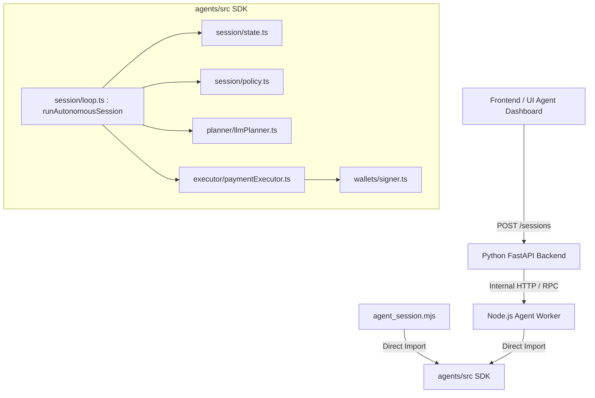

# QMA Agent SDK Audit

## 1. Is `agent_session.mjs` only a thin wrapper?

**Yes.** `examples/agent_session.mjs` is simply a CLI entry point. It parses environment variables and command-line arguments (like `--budget`, `--max-purchases`), initializes the wallet signer string, and delegates the entire execution to `runAutonomousSession()` imported from `../agents/dist/index.js`. 

## 2. Which runtime components already exist inside `agents/src`?

The `agents/src/` directory contains a fully functional, reusable **TypeScript Autonomous Runtime SDK**. 

- **Session Management (`session/`)**: 
  - `loop.ts`: Implements the `runAutonomousSession` while loop, sleep intervals, and stop condition evaluation.
  - `state.ts`: Tracks cumulative `spentUsdc`, `purchaseCount`, `pollCount`, `stopReason`, and cooldowns.
  - `policy.ts`: Normalizes and validates session policies.
- **Executor (`executor/`)**:
  - `paymentExecutor.ts`: Executes x402 payments (calls Gateway, verify, report endpoints) and integrates with the wallet signer.
  - `dryRunExecutor.ts`: Simulates execution without spending USDC.
- **Planner (`planner/`)**:
  - `llmPlanner.ts`: Makes the OpenAI call to parse natural language into a strict JSON bounds policy.
  - `schema.ts`: Defines the Zod schemas for the plan.
- **Policy (`policy/`)**:
  - `validateDecision.ts`: Validates backend decisions against the active session constraints.
- **Wallets (`wallets/`)**:
  - `signer.ts`: Handles private key signatures (e.g. via `viem`).

## 3. Can `agents/src` be imported directly into a backend worker?

**No, not natively.** 
The core backend is written in Python (`FastAPI`), whereas `agents/src` is a TypeScript (`Node.js`) package heavily reliant on TS ecosystem libraries (like `viem` for robust blockchain signing). You cannot natively `import` these TS modules into a Python Celery/AsyncIO worker.

## 4. Can `agents/src` be exposed through APIs instead of rewritten?

**Yes, highly recommended.**
Instead of rewriting this robust, tested TypeScript runtime into Python, the `agents` package can be wrapped in a lightweight Node.js microservice (e.g., using Express, Fastify, or standard Node `http`). 

The Python FastAPI backend would simply act as an orchestrator:
1. UI sends `POST /api/v1/agent/sessions/start` to Python Backend.
2. Python Backend proxies the configuration to the Node.js Agent Microservice (`POST /internal/agents/start`).
3. Node.js Microservice runs `runAutonomousSession()`.
4. The Microservice streams state changes and event logs to a Redis pub/sub or webhook back to the Python API, which the UI can poll.

## 5. Dependency Graph

