# QMA Current System Map

**Mission:** Visualizing the CURRENT IMPLEMENTATION of QMA based strictly on the source code.
**Rule:** No future specs. No migrations. Reality only.

---

## Part 1: System Overview

*Source Files: `backend/app/main.py`, `backend/app/api/v1/endpoints/`, `providers.py`*

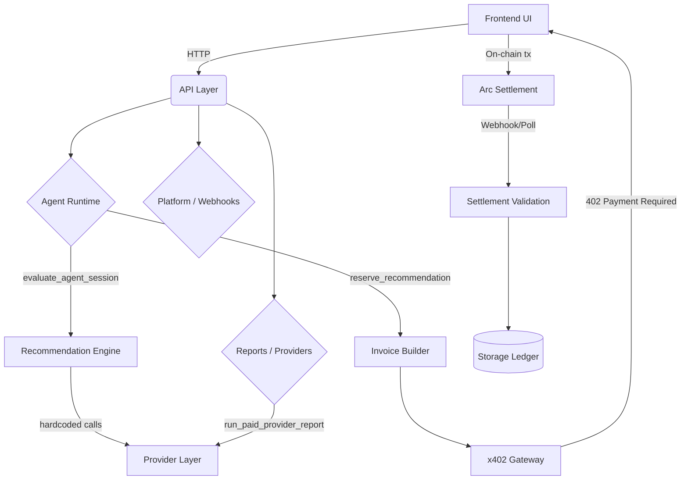

---

## Part 2: Frontend → Backend Flow

*Source Files: `frontend/src/components/reports/AppPage.tsx`, `frontend/src/components/paywall/PaywallPanel.tsx`, `backend/app/api/v1/endpoints/reports.py`*

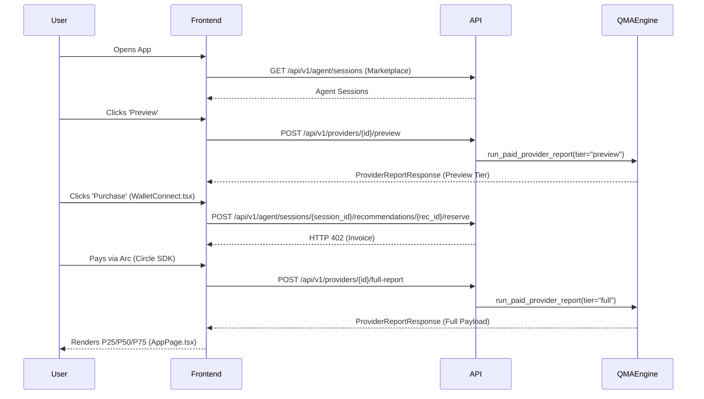

---

## Part 3: Agent Runtime Flow

*Source Files: `backend/app/services/agent_decision.py`, `backend/app/services/agent_recommendations.py`*

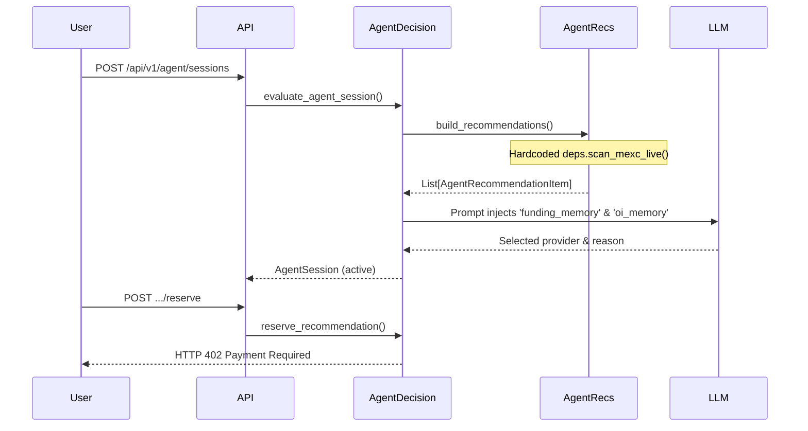

---

## Part 4: Provider Flow

*Source Files: `backend/app/main.py`, `providers.py`, `qma_engine.py`*

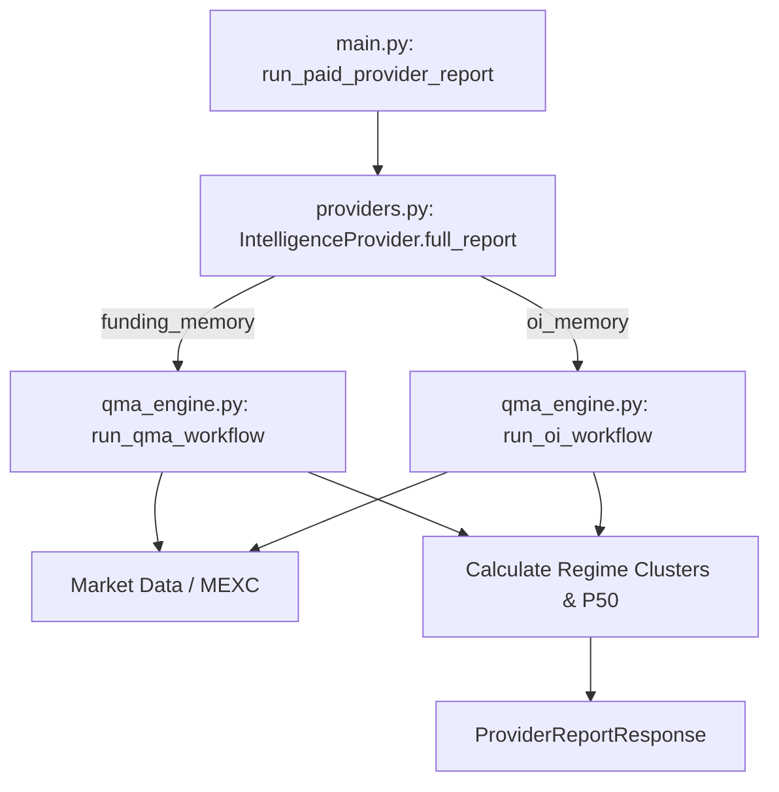

---

## Part 5: Payment Flow

*Source Files: `backend/app/services/invoice_builder.py`, `backend/app/services/settlement_validation.py`, `backend/app/services/x402_gateway.py`*

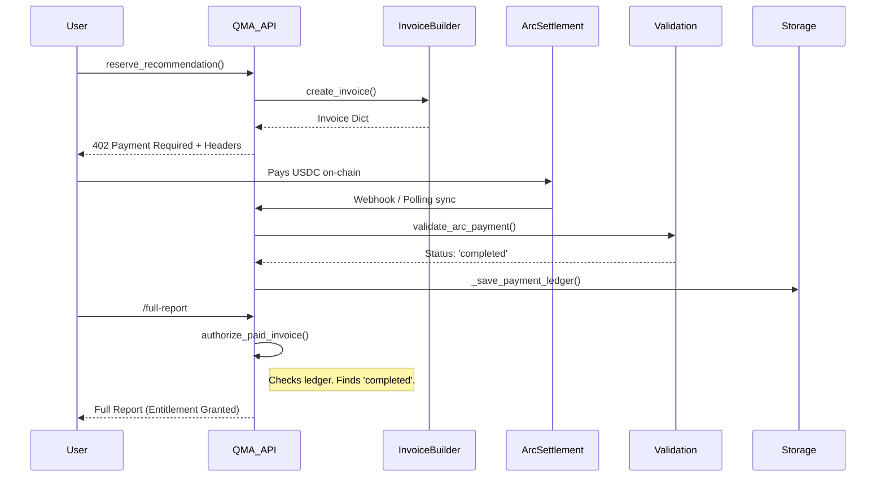

---

## Part 6: Data Flow Map

*Source Files: `market_data.py`, `backend/app/main.py`*

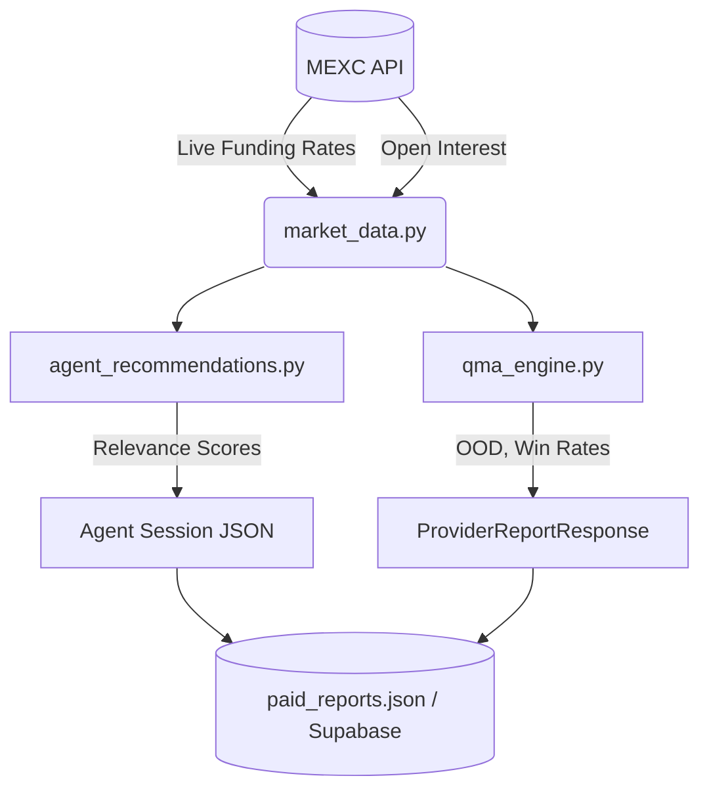

---

## Part 7: Domain Model

*Source Files: `backend/app/schemas/phase3_responses.py`, `backend/app/schemas/providers.py`*

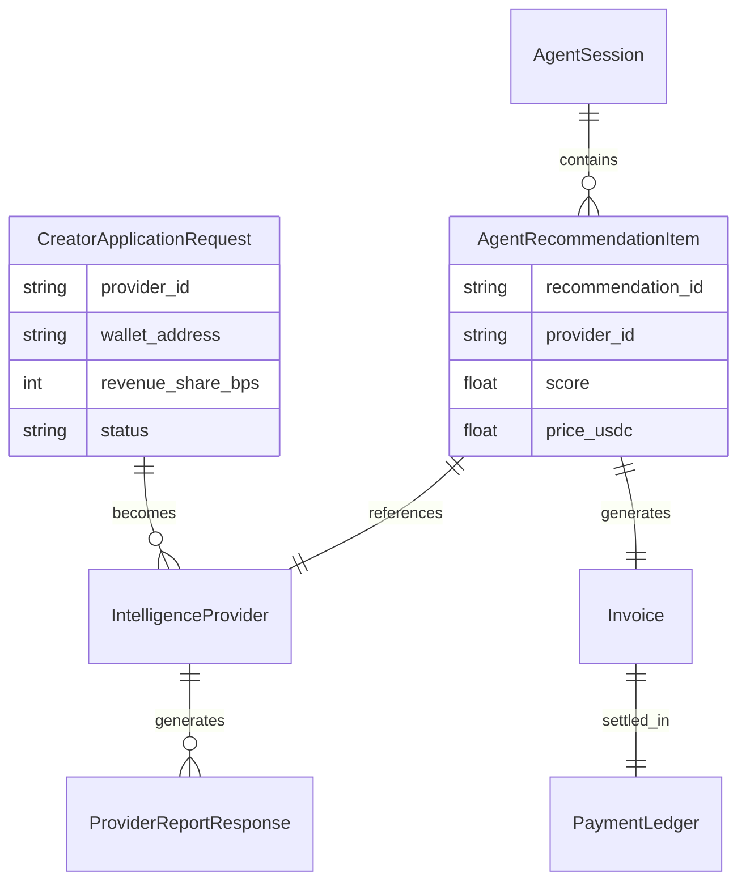

---

## Part 8: State Machines

*Source Files: `backend/app/schemas/providers.py`, `backend/app/services/settlement_validation.py`*

### Creator Application State
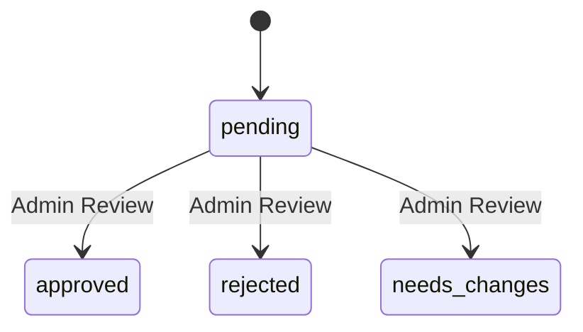

### Settlement Status (from `settlement_validation.py:31`)
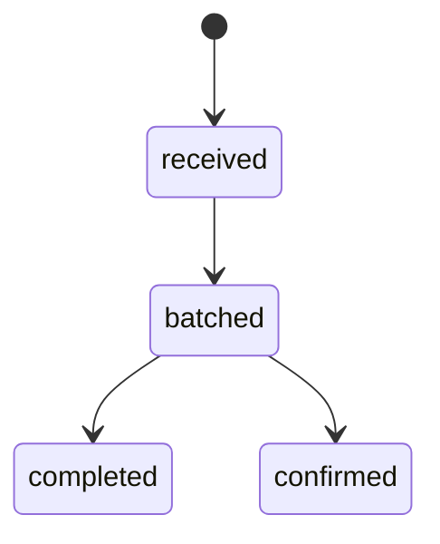

---

## Part 9: Dependency Graph

*Source Files: `backend/app/main.py`, `backend/app/services/`*

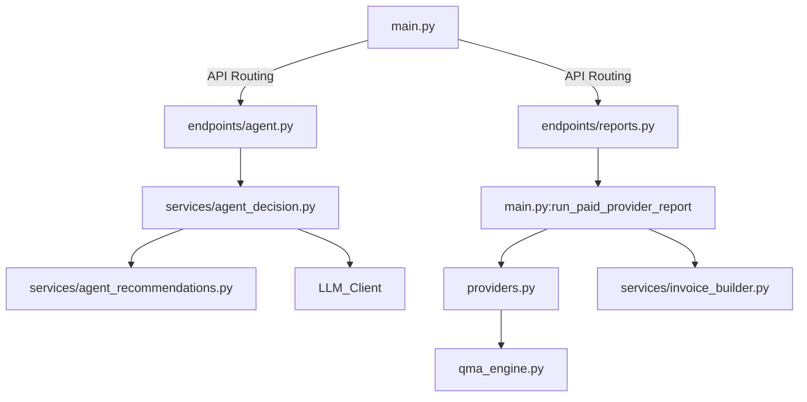
*Observation: Circular/Tightly coupled loop exists between `endpoints/reports.py` calling `main.py` functions, and `agent_decision.py` heavily depending on `agent_recommendations.py` which hardcodes `deps.scan_mexc_live()`.*

---

## Part 10: Coupling Heatmap

*Source Files: Analyzed across `frontend/src/`, `backend/app/services/`*

| Area | Funding Coupling | OI Coupling | Platform Coupling | Evidence (File) |
| ---- | ---------------- | ----------- | ----------------- | --------------- |
| `agent_decision.py` | HIGH | MEDIUM | LOW | Line 48: Hardcodes `"funding_memory" in lowered` |
| `agent_recommendations.py` | HIGH | HIGH | MEDIUM | Line 43-69: Hardcodes `funding_score` math |
| `settlement_validation.py`| LOW | LOW | HIGH | Line 13-56: Only checks `amount`, `status`, `USDC` |
| `AppPage.tsx` | HIGH | LOW | LOW | Line 458: Hardcodes `P25`/`P50`/`P75` table headers |
| `invoice_builder.py` | LOW | LOW | HIGH | Line 50: Strict USCD/Pricing schemas |

---

## Part 11: Architecture Snapshot

*Question answered: "What is QMA today?"*

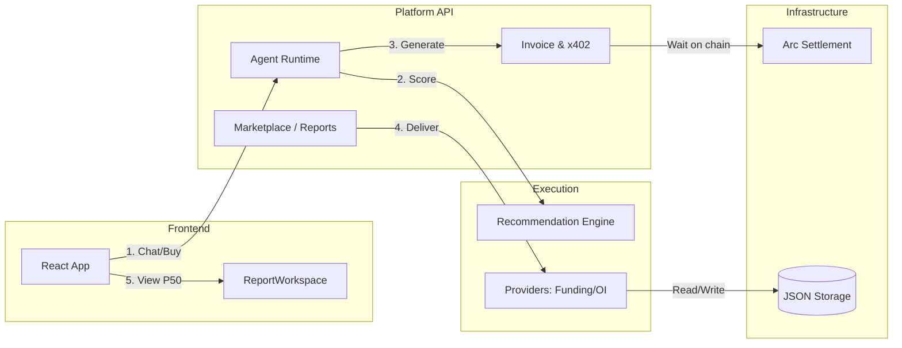
