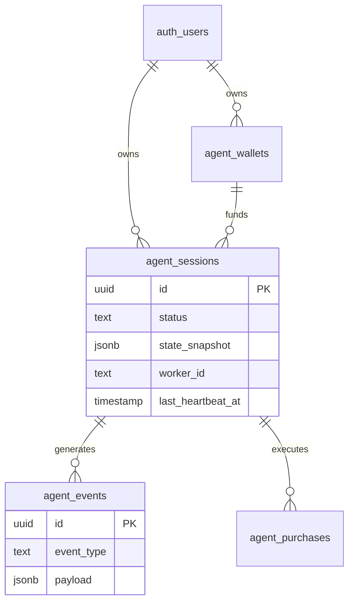

# Deep Database Architecture Review

Assuming Supabase Postgres is the source of truth and `agents/src` requires `initialState` hydration, here is the robust database schema designed for the Queue-based Worker execution model.

---

## A vs B: State Normalization Evaluation

**Approach A: Store full `SessionState` snapshot as JSONB**
- **Pros:** Trivially serializes directly into the TS runtime. Extensible without DB migrations if the SDK adds new tracking keys.
- **Cons:** You cannot easily JOIN or aggregate nested cooldown maps across thousands of sessions via SQL (though Postgres JSONB operators make this feasible).

**Approach B: Normalize state into relational columns**
- **Pros:** Strict integrity. You can easily query "which sessions have bought candidate X?".
- **Cons:** The TS `SessionState` contains arbitrary nested records (`failedCandidateAttempts`, `symbolCooldowns`). Normalizing these into junction tables requires massive `JOIN`s just to reconstruct the state on worker boot, drastically slowing down resumption.

**Recommendation:** **Hybrid Approach (Lean towards A).** 
Normalize the fields we need to query at the DB level (status, budget, metrics) but store the complex memory (cooldowns, attempt arrays) as a `state_snapshot` JSONB blob. The worker pulls the blob, injects it into `runAutonomousSession`, and flushes it back on `onStateChange`.

---

## 1. Schema Definitions

### `agent_wallets`
Stores the configuration for the Circle Agent Wallet or funding wallet used by the session.

- **Columns:**
  - `id` (UUID, PK)
  - `user_id` (UUID, FK to `auth.users`)
  - `wallet_address` (Text)
  - `wallet_mode` (Text) — `circle-agent-wallet`, `browser`, etc.
  - `circle_entity_secret_ciphertext` (Text, Nullable) — External KMS reference or encrypted secret.
  - `created_at`, `updated_at` (Timestamptz)
- **Indexes:** `idx_wallets_user_id`
- **RLS:** Users can only view/manage their own wallets.

### `agent_sessions`
The primary queue table. Functions both as the orchestrator queue and the state persistence layer.

- **Columns:**
  - `id` (UUID, PK)
  - `user_id` (UUID, FK)
  - `wallet_id` (UUID, FK)
  - `status` (Text) — `queued`, `running`, `paused`, `stopping`, `completed`, `failed`
  - `task` (Text) — Original user prompt
  - `policy` (JSONB) — Immutable configuration bounds
  - `state_snapshot` (JSONB) — Mutable TS `SessionState` flushed periodically by worker.
  - `initial_budget_usdc` (Numeric)
  - `spent_usdc` (Numeric)
  - `worker_id` (Text, Nullable) — Unique ID of the Node worker currently running this.
  - `claimed_at` (Timestamptz, Nullable)
  - `last_heartbeat_at` (Timestamptz, Nullable)
  - `created_at`, `updated_at`, `ended_at` (Timestamptz)
- **Indexes:** 
  - `idx_sessions_queue` on `(status, last_heartbeat_at)` (Critical for worker polling)
  - `idx_sessions_user_id`
- **Constraints:** 
  - `check_budget`: `spent_usdc <= initial_budget_usdc`
- **Worker Claiming (SQL):**
  ```sql
  UPDATE agent_sessions SET status = 'running', worker_id = $1, claimed_at = NOW(), last_heartbeat_at = NOW()
  WHERE id = (
    SELECT id FROM agent_sessions 
    WHERE status = 'queued' OR (status = 'running' AND last_heartbeat_at < NOW() - INTERVAL '5 minutes')
    FOR UPDATE SKIP LOCKED LIMIT 1
  ) RETURNING *;
  ```

### `agent_events`
Append-only log for UI streaming and auditing.

- **Columns:**
  - `id` (UUID, PK)
  - `session_id` (UUID, FK)
  - `event_type` (Text) — `decision`, `wait`, `purchase_completed`, `purchase_failed`
  - `payload` (JSONB) — The full observation or error.
  - `created_at` (Timestamptz)
- **Indexes:** `idx_events_session_id_created_at`
- **Retention Policy:** Delete rows where `created_at < NOW() - INTERVAL '30 days'`. Event streaming isn't needed permanently.
- **Event Streaming:** Enable Supabase Realtime on this table so the UI can subscribe to `INSERT` where `session_id = X`.

### `agent_purchases`
Normalized ledger for successful transactions executed by the agent, enabling analytics without parsing JSONB.

- **Columns:**
  - `id` (UUID, PK)
  - `session_id` (UUID, FK)
  - `candidate_id` (Text)
  - `provider_id` (Text)
  - `symbol` (Text)
  - `tier` (Text)
  - `amount_usdc` (Numeric)
  - `settlement_id` (Text)
  - `sidecar_receipt` (Text)
  - `created_at` (Timestamptz)
- **Indexes:** `idx_purchases_session_id`, `idx_purchases_symbol`
- **Constraints:** Unique `(session_id, candidate_id)`

---

## 2. Entity Relationship Diagram (ERD)



---

## 3. Worker Interactions (Failure Recovery & Pausing)

1. **Heartbeat:** The Node worker sends an `UPDATE agent_sessions SET last_heartbeat_at = NOW()` every 30 seconds.
2. **Worker Crash (Resume):** If a worker dies, `last_heartbeat_at` goes stale. Another worker's poll picks it up (`last_heartbeat_at < NOW() - 5 min`). It pulls `state_snapshot`, passes it as `initialState` to `runAutonomousSession()`, and resumes execution seamlessly.
3. **Stop/Pause Session:** The API issues `UPDATE agent_sessions SET status = 'stopping'`. The Node worker checks this on its next heartbeat, issues the `AbortSignal` to the local loop, and flushes the final state.

---

## 4. Scaling Limits
- **Postgres Connections:** High frequency heartbeats from many workers could stress Postgres connections. Use Supabase PgBouncer or reduce heartbeat frequency if workers scale > 10.
- **JSONB Size:** The `state_snapshot` includes `observations` and `failures` arrays. Over a 10-hour session, this JSON blob could grow to 1MB+. Ensure the worker limits the size of arrays in the snapshot (e.g., keeping only the last 100 observations).
- **Concurrency:** `FOR UPDATE SKIP LOCKED` safely supports hundreds of concurrent Node worker processes pulling from the same queue without deadlocks.
