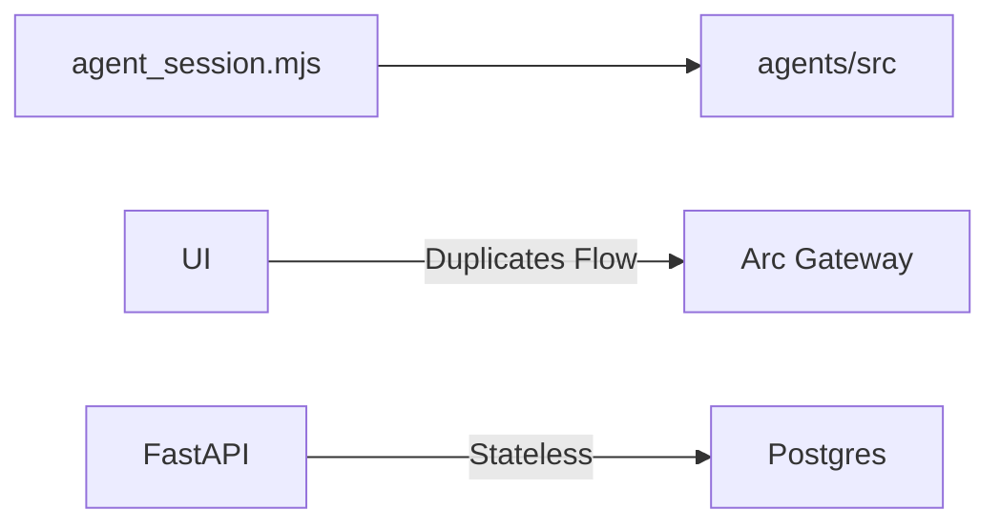

# QMA Agent SDK: NPM Package Audit & Strategy

## A. PRODUCT READINESS

**READINESS SCORE: 65 / 100**

The `agents/` directory contains a robust, highly modular, and production-ready runtime logic. However, its *packaging* is completely unready for public distribution.

**Blocks to Publication:**
- `package.json` is marked `"private": true`.
- Missing `main`, `module`, `exports`, and `types` fields.
- Missing `README.md`, `LICENSE`, and `CHANGELOG.md` at the package root.
- Name is `qma-agents` rather than scoped `@qma/agents`.
- No `.d.ts` declaration files are actively exported/referenced in `package.json`.

**API Boundaries:**
- **Public Exports**: `runAutonomousSession`, `createSessionState`, `QmaClient`, `createPaymentExecutor`, `createCircleAgentWalletSigner`.
- **Internal Details (to hide)**: Low-level state mutators (`recordObservation`, `recordFailure`) should probably be hidden from the public SDK surface so consumers cannot accidentally corrupt the state machine.

---

## B. PACKAGE DESIGN

**Recommendation: `@qma/agents` (Core) + `@qma/agent-cli` (CLI/Daemon)**

Separating the SDK from the CLI is the industry standard (similar to `eslint` vs `eslint-cli` or `vite` vs `create-vite`).
- **`@qma/agents`**: Pure TypeScript SDK. Isomorphic where possible. Exposes the planner, executor, and session loop. Used by third-party developers, future Node workers, and QMA Backend.
- **`@qma/agent-cli`**: Global CLI tool (`npm install -g @qma/agent-cli`). Wraps the core SDK with terminal logging, argument parsing (`commander`/`yargs`), and environment variable loading (`dotenv`).

---

## C. PUBLIC API REVIEW

| Export | Current Location | Keep/Hide | Purpose | Risk |
| :--- | :--- | :--- | :--- | :--- |
| `runAutonomousSession` | `session/loop.ts` | **Keep** | Main entry point for the runtime loop | Low |
| `SessionState` | `session/state.ts` | **Keep** | Public interface for state tracking | Low |
| `createSessionState` | `session/state.ts` | **Keep** | Factory for state | Low |
| `recordObservation` | `session/state.ts` | **Hide** | Internal mutator | Med (could corrupt state) |
| `QmaClient` | `qma/client.ts` | **Keep** | Backend API wrapper | Low |
| `createPaymentExecutor` | `executor/paymentExecutor.ts` | **Keep** | Wires up x402 payments | Low |
| `AgentPaymentSigner` | `wallets/signer.ts` | **Keep** | Wallet abstraction interface | Low |
| `parseAgentDecision` | `planner/schema.ts` | **Keep** | Zod parsers for decisions | Low |

---

## D. CLI DESIGN

`examples/agent_session.mjs` is currently a raw script parsing `process.argv` manually. It needs to be upgraded to a real CLI.

**Proposed CLI UX (`qma-agent`):**

```bash
# Start an autonomous background session
qma-agent start --prompt "Find momentum plays" --budget 10 --executor circle-agent-wallet

# Dry-run the LLM policy extraction to see what bounds it sets
qma-agent plan --prompt "Buy 5 reports under 2 USDC"

# Check the status of a running daemon session
qma-agent status --session-id agent_session_123

# Stop a session
qma-agent stop --session-id agent_session_123
```

---

## E. SDK UX REVIEW

Currently, calling `runAutonomousSession` requires a lot of wiring:
```typescript
const report = await runAutonomousSession(policy, {
  observe: async () => { ... },
  purchase: async () => { ... },
  onEvent: () => { ... }
});
```
**Friction Point:** The developer has to manually instantiate `QmaClient`, `PaymentExecutor`, wire up the decision API, and map the inputs to the `SessionDeps` interface.

**Ideal SDK Usage (Facade Pattern):**
```typescript
import { QmaAgent } from "@qma/agents";

const agent = new QmaAgent({
  apiKey: "qma_...",
  walletPrivateKey: "0x..." 
});

const report = await agent.run({
  prompt: "Buy undervalued AI tokens",
  budgetUsdc: 10
});

agent.on("purchase_completed", (event) => console.log(event));
```

---

## F. PACKAGE STRUCTURE

**Recommendation: Monorepo using NPM Workspaces**

```text
packages/
  ├─ core/             # @qma/agents (SDK)
  ├─ cli/              # @qma/agent-cli (CLI + Daemon worker)
  └─ shared/           # shared types (optional)
```
*Justification:* A monorepo ensures that when the core SDK updates its interfaces, the CLI immediately catches type errors. It simplifies publishing aligned versions.

---

## G. VERSIONING STRATEGY

- **Policy**: Strict Semantic Versioning (SemVer).
- **Tooling**: Use `changesets` to manage PR version bumps.
- **Release Workflow**: GitHub Actions triggers on push to `main` when a `.changeset` is present, automatically publishing to NPM and creating a GitHub Release with generated release notes.

---

## H. NPM PUBLISH CHECKLIST

| Item | Current State | Action Required |
| :--- | :--- | :--- |
| `package.json` | Present, but private | Remove `"private": true`, set scoped name |
| `exports` | Missing | Add `"exports": { ".": "./dist/index.js" }` |
| `types` | Missing | Configure `tsc` to emit `.d.ts` and set `"types": "./dist/index.d.ts"` |
| `README` | Missing in `agents/` | Write comprehensive documentation and SDK examples |
| `LICENSE` | Missing in `agents/` | Add MIT or Apache 2.0 license file |
| `CHANGELOG` | Missing | Initialize via `changesets` |
| `CI/CD` | Unknown | Add GitHub Action for `npm run test` and `npm publish` |

---

## I. ARCHITECTURE FIT

**Verdict:** The current TS runtime *should* become the single source of truth.

Instead of writing a redundant Python polling loop for the QMA Backend, we should use the `@qma/agent-cli` (or a dedicated `@qma/agent-worker` package) as a background daemon microservice. The FastAPI backend orchestrates sessions, but the actual execution engine is universally `@qma/agents` across CLI, Backend Workers, and Third-Party integrations.

---

## J. FINAL VERDICT

**1. Current Architecture**


**2. Recommended Architecture**
```mermaid
flowchart LR
    CLI[@qma/agent-cli] --> Core[@qma/agents]
    Worker[Node.js Sidecar] --> Core
    ThirdParty[External Devs] --> Core
    
    React[UI] --> |POST /start| Backend[FastAPI]
    Backend --> |RPC| Worker
```

**3. Migration Plan**
1. Refactor `agents/` into a workspace (`packages/core`, `packages/cli`).
2. Add `AgentBuilder` facade to smooth out the SDK UX.
3. Configure `package.json` exports, types, and publish to NPM.
4. Integrate the CLI as a Sidecar worker in the QMA Backend.
5. Strip local agent logic from React UI.

**4. Estimated Engineering Effort:** ~2-3 weeks for a Senior Engineer.
**5. Recommended Order of Execution:** NPM Packaging/Monorepo → SDK Facade Refactor → CLI Refactor → Backend Worker Integration.
