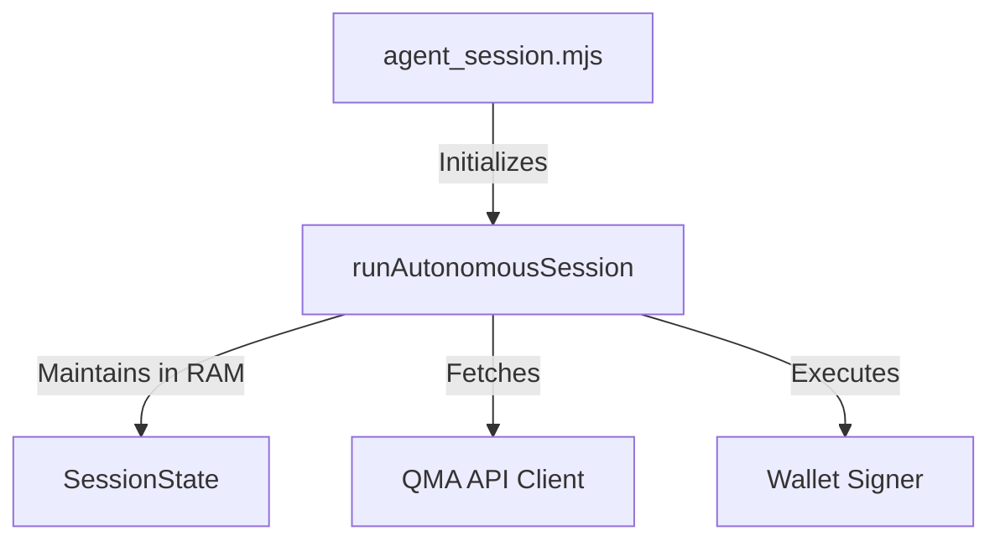
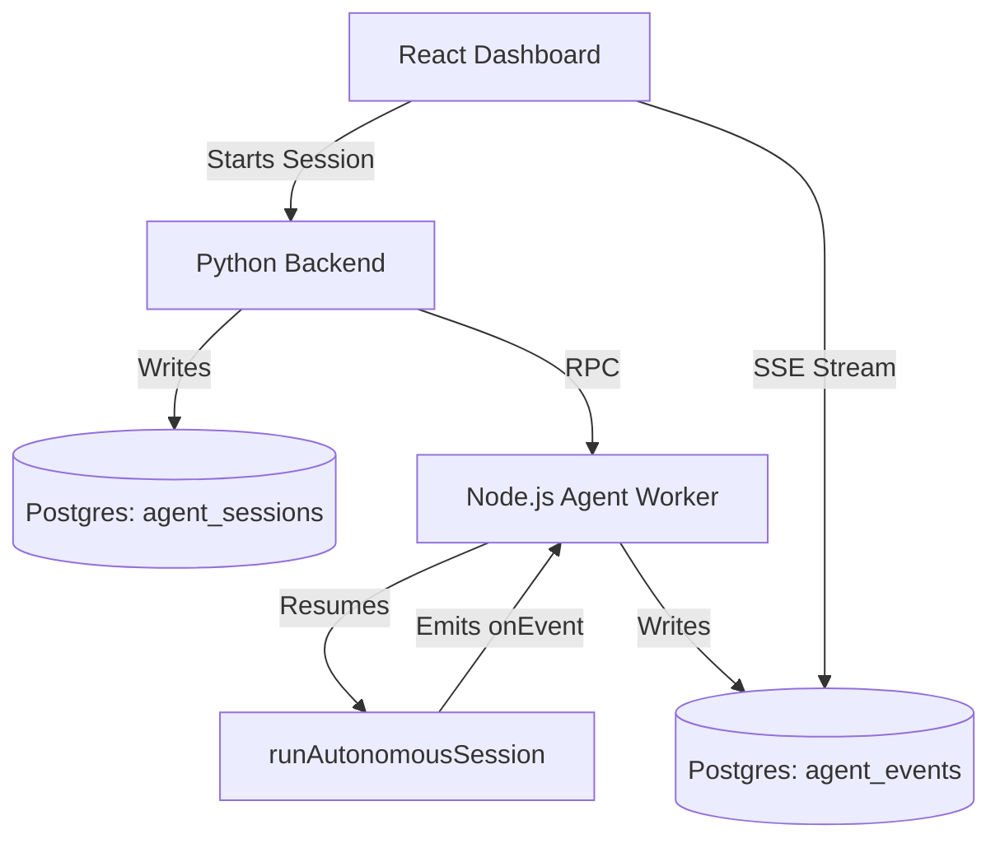

# Autonomous Runtime Deep Audit

## A. Runtime Boundaries

- **Pure Runtime Logic:** The modules in `session/` (`loop.ts`, `state.ts`, `policy.ts`) are pure, dependency-free state machines. They rely entirely on injected interfaces (`SessionDeps`) for I/O.
- **Coupled to CLI:** `executor/paymentExecutor.ts` uses Node.js `child_process.spawn` to execute `circle` CLI commands for the Circle Agent Wallet adapter. This couples that specific adapter to a Node.js/Desktop environment (it will crash if imported in a Browser).
- **Coupled to QMA APIs:** `qma/client.ts` hardcodes routes like `/api/v1/agent/decision`. It is closely coupled to the QMA backend, but separated from the generic `loop.ts`.
- **Coupled to Wallets:** The `AgentPaymentSigner` interface (`wallets/signer.ts`) cleanly abstracts the wallet.

## B. Reusability

Can `runAutonomousSession()` be reused unchanged?
- **CLI:** Yes, it already is.
- **Node Worker Service:** Yes, the worker just needs to implement the `SessionDeps` (fetching from DB instead of CLI flags).
- **Backend Executor:** Yes, provided the backend uses a Node.js worker. It cannot be used directly in Python.

**Assumptions Preventing Reuse (The "Resume" Problem):**
Currently, `runAutonomousSession` hardcodes the state initialization:
```typescript
const state = createSessionState(policy);
```
This forces every session to start from zero. To support long-running, resilient sessions in a backend database (where a worker might restart and need to resume a session), `runAutonomousSession` must be refactored to accept an optional `initialState`.

## C. State Management

- **In-Memory Only:** Currently, the entire `SessionState` (including `spentUsdc`, `cooldowns`, and arrays of `observations` and `failures`) lives exclusively in memory during the `runAutonomousSession` loop.
- **Requires Persistence:** For long-running backend sessions, the `spentUsdc`, `purchaseCount`, `cooldowns`, and `status` must be persisted to a database (e.g., `agent_sessions`).
- **Can Remain Ephemeral:** Transient network errors or the current sleep timer don't need persistence.

## D. Session Orchestration

If the QMA Backend manages these sessions, the following is required:

**APIs:**
- `POST /sessions` (Create config)
- `POST /sessions/{id}/start` (Dispatches to Node Worker)
- `POST /sessions/{id}/stop` (Sends AbortSignal to Worker)
- `GET /sessions/{id}/events` (Streams DB events to UI)

**Changes required in `agents/src`:**
1. Export the internal `chooseCandidate` logic or expose a `tick()` function so workers can step through the loop synchronously if they don't want the `while(running)` hold.
2. Allow passing `initialState` into `runAutonomousSession`.

## E. Wallet Abstraction

- **Injectability:** Wallet signing is completely injectable via `AgentPaymentSigner.signLeg` and `payLeg`.
- **Circle Agent Wallet:** It is already implemented via `createCircleAgentWalletSigner()`, which uses the CLI. No core modifications are needed.

## F. Event Streaming

The `onEvent?: (event: Record<string, unknown>) => void` callback in `SessionDeps` is perfectly designed. 
Without modifying any runtime logic, a backend worker can simply pass an `onEvent` handler that pushes events directly to a Redis Pub/Sub channel, a Postgres `agent_events` table, or an SSE stream for the frontend UI.

## G. Architecture Score

- **Runtime Quality:** 90/100 (Strictly typed, excellent separation of concerns).
- **Reusability:** 85/100 (Needs `initialState` injection for pausing/resuming).
- **Coupling:** 80/100 (Circle executor is coupled to Node `child_process`).
- **Backend Suitability:** 95/100 (If deployed as a Node worker).
- **UI Suitability:** 100/100 (The `onEvent` hook is perfect for live dashboard streaming).

---

## Output 

### 1. Current Architecture


### 2. Recommended Architecture


### 3. Refactor Plan
1. **Agent SDK:** Add `initialState?: SessionState` parameter to `runAutonomousSession` so workers can resume paused sessions from the DB.
2. **Agent SDK:** Ensure `CircleAgentWalletExecutor` dynamically checks for the CLI binary before crashing, gracefully failing if imported in a wrong environment.
3. **Backend:** Build the Python CRUD API for `agent_sessions`.
4. **Worker:** Build a tiny Express/Fastify Node worker that receives session IDs, fetches the state from the DB, and runs the `runAutonomousSession` loop, piping `onEvent` back to the DB.

### 4. Estimated Effort
- SDK Refactoring: **1 Day** (Add resume capabilities, harden exports).
- Backend APIs & Schema: **3 Days** (Sessions, Events, Wallets DB integration).
- Node.js Worker Service: **3 Days** (Worker harness, DB connection, graceful shutdown via AbortSignal).
- UI Dashboard: **4 Days** (List sessions, view event streams).
**Total: ~2 Weeks**
