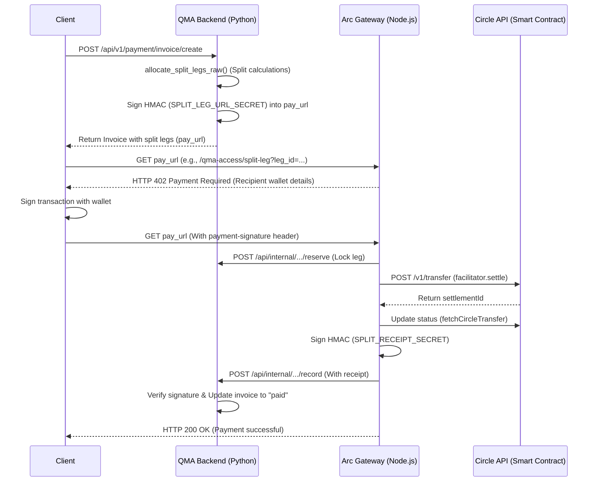
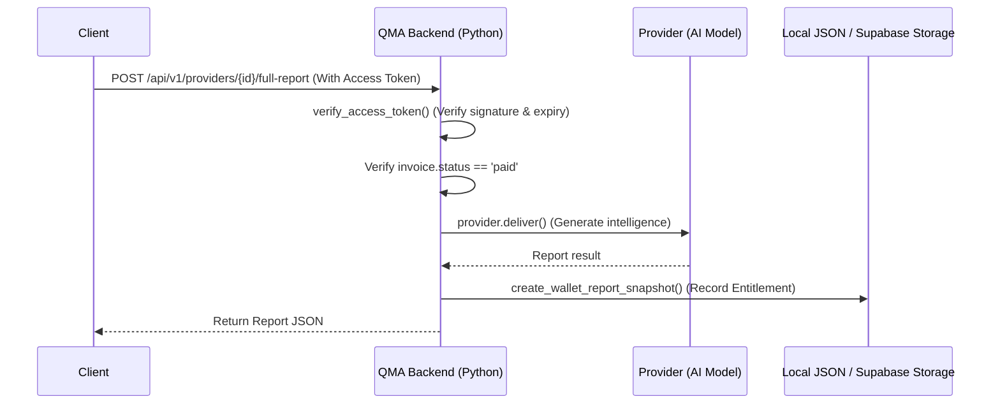
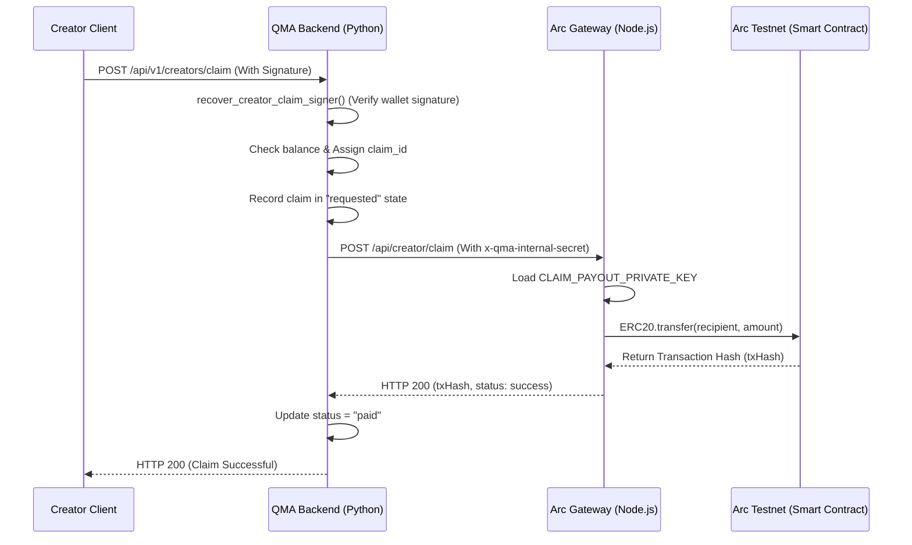

# 04. Data Flow Review

This report models the three core workflows in QMA (Report Purchase, Report Unlock, and Provider Payout), based on direct source code inspection of the Python backend and `arc_gateway/server.ts`.

## 1. Report Purchase Flow
**Description:** The purchase flow utilizes two-leg revenue splitting via HTTP 402 protocols.

**Risk & Security Analysis:**
- Communication between `arc_gateway` and the backend is authenticated via HMAC signatures (`SPLIT_RECEIPT_SECRET`), preventing malicious mock settlement injections into `/api/internal/.../record`.
- USDC flows directly into creator wallets via Circle Gateway settlement, removing custodial treasury risks on the primary sales path.

## 2. Report Unlock Flow
**Description:** Once an invoice is paid, clients redeem short-lived access tokens to unlock reports.

**Risk Analysis:**
- All primary delivery endpoints (`full-report`, `preview`) enforce strict token verification, returning HTTP 403 on missing or invalid tokens.

## 3. Provider Payout Flow (Creator Claims)
**Description:** Secondary payout mechanism for creators claiming earnings accumulated outside direct-split transactions.

### Data Flow Architecture
1. **Entry Point:** Frontend client submits signed claim request.
2. **API Endpoint:** `POST /api/v1/creators/claim` (in `providers.py`).
3. **Service Layer:** `deps.recover_creator_claim_signer` (verification), `deps.allocate_creator_claim` (ledger deduction), and internal dispatch to `arc_gateway/server.ts` (`POST /api/creator/claim`).
4. **Repository Layer:** `deps.get_creator_claims_db()` and `deps.save_creator_claim_record()`.
5. **Database Entities:** Records tracking `claim_id`, `claimant_address`, `amount_usdc`, and `status`.
6. **State Transitions:** `requested` → `paid` (success) or `failed` (failure).
7. **Validation Points:**
   - Cryptographic signature matches `claimant_address`.
   - `requested_amount <= total_available` (`earned_final` minus `paid` and `pending` claims).
   - Internal communication secured via `x-qma-internal-secret`.

**Resilience Analysis:**
- Network timeout handling between backend dispatch and gateway transfers requires transactional idempotency keys to prevent accidental double-submission or state drift.
