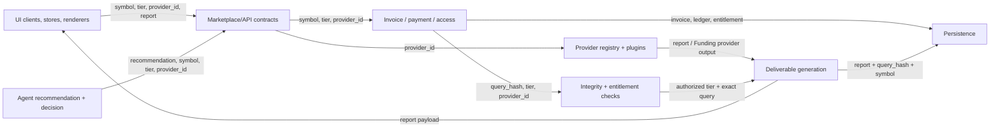
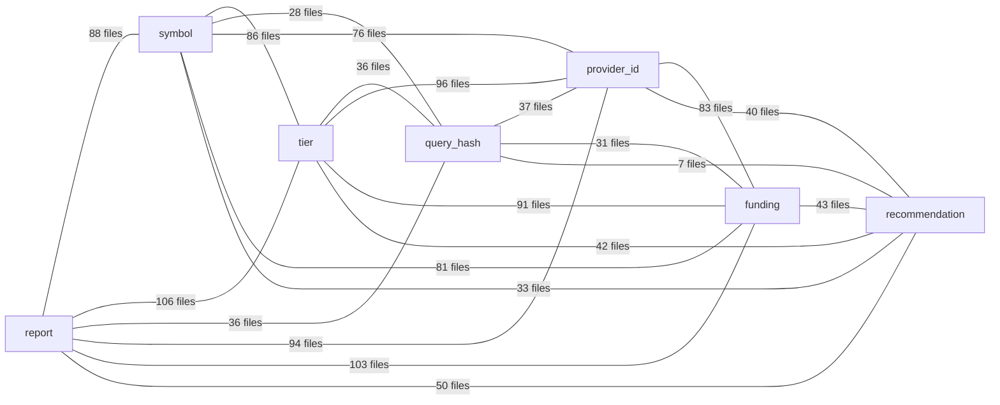

# QMA Runtime Coupling Inventory

> Inventory snapshot: branch `main`, commit `4d0b3c3`, generated 2026-07-30 (Asia/Saigon).
> Scope: inventory only. No production source, file location, symbol, or abstraction was changed.

## Executive summary

The scan found **8,710 lexical concept occurrences** on **5,809 source lines** across **226 files**. The coupling is not a single marketplace seam: it crosses public contracts, agent decisions, provider dispatch, commerce identity, persistence, UI state, tests, and documentation.

The most important distinction is behavioral rather than lexical. `tier`, `query_hash`, and `provider_id` participate in invoice, entitlement, access, and/or integrity checks; they cannot be treated as cosmetic renames. `report` and `symbol` are broad product-language couplings spread across API, provider output, client state, and storage. `funding` is overloaded: some uses mean the Funding Memory marketplace provider/report, while others mean wallet deposit/top-up behavior that already belongs to generic commerce.

### Confidence

- **Occurrence completeness: High within the declared scan scope.** Every matched token is listed in the appendices, including repeated tokens on the same line.
- **Layer/role classification: Medium-high.** Classification is deterministic from module ownership plus local line context. Mixed legacy/composition files and cross-domain architecture documents necessarily receive occurrence-level heuristic classification.
- **Migration estimates: Medium.** Counts are exact lexical blast-radius indicators; estimates do not imply that every documentation or generated-client occurrence must change in the same PR.

## Scan method and boundaries

Scanned **311 repository-maintained textual files**: Python, TypeScript/JavaScript, Markdown, YAML, TOML, INI, JSON configuration, HTML, CSS, SQL, PowerShell, and text. The scan includes active backend/frontend/agent code, the current Phase A runtime files, legacy `main_ref.py`, tests, examples, configuration, ast-grep rules, and documentation.

Excluded as non-source or unsafe inventory input: `.git`, dependencies, build output, caches, binary assets, coverage files, package lockfiles, runtime data/exports (`paid_reports.json`, `payment_ledger.json`, `data/`, `exports/`), wallet recovery data, logs, and environment/credential files. The generated output file is excluded from its own scan to prevent recursive self-counting.

An occurrence is a semantic identifier/prose token, not an arbitrary substring. Snake case, kebab case, camel case, Pascal case, plural `report(s)`/`symbol(s)`/`tier(s)`/`recommendation(s)`, `query_hash`/`queryHash`, and `provider_id`/`providerId` are recognized. Each appendix row is one token occurrence. Context is the full source line when short, or a centered 280-character window when the line is unusually long.

Classification rules:

- **runtime** — agent planning/execution/policy/session code, runtime compatibility contracts, application composition.
- **commerce** — invoices, payments, access/entitlements, settlement, wallet/payment infrastructure, commerce persistence.
- **provider** — provider registry, provider metadata/endpoints, plugins/adapters, upstream data adapters.
- **marketplace** — discovery/product/report domain code and remaining product-specific backend or documentation.
- **ui** — frontend contracts, API clients, state, hooks, components, styles, and static UI.
- **test** — automated tests, fixtures, examples, and dedicated verification harnesses.

## 1. Coupling counts

| Concept | Token occurrences | Matching lines | Affected files | runtime | commerce | provider | marketplace | ui | test |
| --- | --- | --- | --- | --- | --- | --- | --- | --- | --- |
| <code>report</code> | 2,916 | 2,352 | 181 | 320 | 591 | 299 | 795 | 715 | 196 |
| <code>symbol</code> | 1,173 | 778 | 107 | 229 | 197 | 125 | 240 | 221 | 161 |
| <code>tier</code> | 1,656 | 1,114 | 127 | 389 | 339 | 180 | 257 | 301 | 190 |
| <code>query_hash</code> | 183 | 123 | 37 | 19 | 81 | 13 | 48 | 4 | 18 |
| <code>provider_id</code> | 1,247 | 949 | 119 | 189 | 227 | 183 | 267 | 276 | 105 |
| <code>funding</code> | 1,200 | 1,072 | 120 | 62 | 91 | 168 | 242 | 571 | 66 |
| <code>recommendation</code> | 335 | 276 | 58 | 67 | 41 | 19 | 85 | 65 | 58 |

The six layer columns count token occurrences, not files. File-level distribution follows.
Because classification is occurrence-level, one mixed-responsibility file can appear in more than one layer column; layer file counts therefore need not sum to the affected-file total.

| Concept | runtime files | commerce files | provider files | marketplace files | ui files | test files |
| --- | --- | --- | --- | --- | --- | --- |
| <code>report</code> | 41 | 56 | 32 | 61 | 53 | 21 |
| <code>symbol</code> | 21 | 17 | 14 | 23 | 27 | 16 |
| <code>tier</code> | 22 | 33 | 28 | 33 | 26 | 16 |
| <code>query_hash</code> | 2 | 15 | 6 | 8 | 4 | 5 |
| <code>provider_id</code> | 17 | 25 | 23 | 32 | 29 | 16 |
| <code>funding</code> | 18 | 30 | 23 | 34 | 33 | 15 |
| <code>recommendation</code> | 23 | 12 | 8 | 23 | 13 | 6 |

### Coupling interpretation

- `report` is the broadest product noun: route names, response models, renderer/state names, provider delivery, entitlements, persistence, tests, and product copy.
- `symbol` is both a market-query subject and an identity key propagated through decisions, invoices, reports, entitlements, and filters.
- `tier` is an offer/access-level key. Preview/full behavior, price selection, access checks, agent policy, and invoice data make it behavioral.
- `query_hash` is a request fingerprint. Its smaller file count understates risk because it binds invoices, access tokens, entitlement identity, and exact-query validation.
- `provider_id` is already generic vocabulary, but it is a high-connectivity identity key across registry, routing, invoice/access payloads, storage, UI, and tests.
- `funding` combines two different meanings: Funding Memory provider/report semantics and generic wallet funding/deposit UI/commerce semantics. A blanket rename would be incorrect.
- `recommendation` links marketplace discovery signals to agent selection and UI presentation. It is behaviorally coupled to ranking/decision payloads, not only naming.

## 2. Hotspots

| Rank | File | Occurrences | Lines | Concept mix | Dominant class |
| --- | --- | --- | --- | --- | --- |
| 1 | <code>main_ref.py</code> | 869 | 535 | report=249, provider_id=201, tier=181, symbol=129, funding=63, query_hash=42, recommendation=4 | marketplace |
| 2 | <code>docs/runtime-extraction-refactor.md</code> | 471 | 319 | report=267, tier=71, symbol=49, funding=33, provider_id=21, recommendation=19, query_hash=11 | marketplace |
| 3 | <code>docs/architecture-assessment.md</code> | 425 | 324 | report=239, tier=52, funding=44, symbol=36, recommendation=23, provider_id=20, query_hash=11 | marketplace |
| 4 | <code>backend/app/main.py</code> | 256 | 146 | report=116, tier=44, provider_id=42, symbol=20, funding=14, query_hash=13, recommendation=7 | runtime |
| 5 | <code>frontend/src/hooks/useAgentBuyer.ts</code> | 249 | 128 | tier=82, symbol=53, provider_id=53, report=42, recommendation=12, funding=7 | ui |
| 6 | <code>frontend/src/components/reports/AppPage.tsx</code> | 238 | 134 | report=134, provider_id=34, symbol=29, tier=19, funding=15, recommendation=7 | ui |
| 7 | <code>frontend/src/styles/app.css</code> | 222 | 204 | funding=185, report=18, tier=15, symbol=3, provider_id=1 | ui |
| 8 | <code>agents/bin/agent_buyer.js</code> | 193 | 97 | tier=78, symbol=55, report=25, provider_id=23, recommendation=10, funding=2 | runtime |
| 9 | <code>backend/app/services/agent_decision.py</code> | 193 | 106 | tier=85, symbol=49, provider_id=33, report=16, funding=6, recommendation=4 | runtime |
| 10 | <code>examples/agent_buyer.mjs</code> | 193 | 97 | tier=78, symbol=55, report=25, provider_id=23, recommendation=10, funding=2 | test |
| 11 | <code>storage.py</code> | 184 | 101 | provider_id=51, report=45, symbol=40, tier=22, query_hash=16, funding=10 | commerce |
| 12 | <code>tests/api_v1/test_api_agent.py</code> | 164 | 87 | recommendation=37, symbol=35, tier=29, provider_id=25, funding=25, report=13 | test |
| 13 | <code>frontend/src/hooks/usePayment.ts</code> | 148 | 80 | report=67, tier=43, provider_id=30, recommendation=4, symbol=3, funding=1 | ui |
| 14 | <code>docs/legacy_v1/providers.py.txt</code> | 128 | 89 | funding=40, report=30, symbol=21, tier=18, provider_id=17, query_hash=2 | provider |
| 15 | <code>paid_intelligence_kit/core.py</code> | 123 | 65 | tier=60, provider_id=23, symbol=18, funding=9, query_hash=8, report=5 | commerce |
| 16 | <code>backend/app/api/v1/endpoints/wallets.py</code> | 121 | 63 | report=43, symbol=24, provider_id=22, tier=22, funding=5, query_hash=5 | commerce |
| 17 | <code>backend/app/services/payment_events_service.py</code> | 110 | 69 | report=42, tier=32, symbol=19, provider_id=13, funding=2, query_hash=2 | commerce |
| 18 | <code>backend/app/services/plugins/funding_provider.py</code> | 99 | 67 | report=36, funding=26, tier=16, symbol=15, provider_id=4, query_hash=2 | provider |
| 19 | <code>frontend/src/components/modals/UnifiedDepositModal.tsx</code> | 96 | 95 | funding=94, report=2 | ui |
| 20 | <code>docs/legacy_v1/docs.md</code> | 95 | 74 | funding=55, report=25, symbol=9, tier=3, provider_id=2, recommendation=1 | marketplace |
| 21 | <code>docs/audit/03-authorization-review.md</code> | 92 | 59 | report=62, symbol=9, provider_id=7, tier=6, recommendation=5, funding=3 | marketplace |
| 22 | <code>tests/api_v1/test_api_reports_and_wallets.py</code> | 92 | 67 | report=42, tier=21, symbol=12, funding=7, query_hash=5, provider_id=5 | test |
| 23 | <code>frontend/src/components/modals/UnifiedWithdrawModal.tsx</code> | 89 | 88 | funding=83, provider_id=5, report=1 | ui |
| 24 | <code>frontend/src/hooks/usePendingInvoiceCache.ts</code> | 87 | 40 | provider_id=30, tier=24, symbol=18, report=10, funding=4, query_hash=1 | ui |
| 25 | <code>backend/app/repositories/storage.py</code> | 84 | 56 | report=38, symbol=17, provider_id=17, funding=4, tier=4, query_hash=4 | commerce |
| 26 | <code>backend/app/services/providers_meta.py</code> | 83 | 53 | provider_id=39, tier=17, symbol=15, report=6, funding=4, query_hash=2 | provider |
| 27 | <code>frontend/src/components/profile/ProfileOrdersPage.tsx</code> | 80 | 55 | report=36, symbol=17, tier=17, funding=5, provider_id=4, query_hash=1 | ui |
| 28 | <code>agents/bin/qma.js</code> | 79 | 43 | report=35, tier=21, symbol=12, provider_id=9, funding=2 | runtime |
| 29 | <code>scripts/repair_supabase_payments.py</code> | 78 | 36 | report=43, tier=12, symbol=7, provider_id=7, query_hash=7, funding=2 | commerce |
| 30 | <code>backend/app/services/plugins/oi_provider.py</code> | 77 | 50 | report=28, symbol=15, funding=15, tier=14, provider_id=3, query_hash=2 | provider |

### Per-concept hotspots

#### report

| File | Occurrences | Matching lines |
| --- | --- | --- |
| <code>docs/runtime-extraction-refactor.md</code> | 267 | 212 |
| <code>main_ref.py</code> | 249 | 204 |
| <code>docs/architecture-assessment.md</code> | 239 | 214 |
| <code>frontend/src/components/reports/AppPage.tsx</code> | 134 | 85 |
| <code>backend/app/main.py</code> | 116 | 89 |
| <code>frontend/src/hooks/usePayment.ts</code> | 67 | 51 |
| <code>docs/audit/03-authorization-review.md</code> | 62 | 45 |
| <code>frontend/src/components/reports/OIReportRenderer.tsx</code> | 52 | 43 |
| <code>frontend/src/components/reports/FundingReportRenderer.tsx</code> | 51 | 43 |
| <code>storage.py</code> | 45 | 38 |
| <code>backend/app/api/v1/endpoints/chat.py</code> | 44 | 32 |
| <code>frontend/src/components/reports/ReportWorkspace.tsx</code> | 44 | 27 |

#### symbol

| File | Occurrences | Matching lines |
| --- | --- | --- |
| <code>main_ref.py</code> | 129 | 69 |
| <code>agents/bin/agent_buyer.js</code> | 55 | 31 |
| <code>examples/agent_buyer.mjs</code> | 55 | 31 |
| <code>frontend/src/hooks/useAgentBuyer.ts</code> | 53 | 36 |
| <code>backend/app/services/agent_decision.py</code> | 49 | 28 |
| <code>docs/runtime-extraction-refactor.md</code> | 49 | 47 |
| <code>storage.py</code> | 40 | 21 |
| <code>docs/architecture-assessment.md</code> | 36 | 36 |
| <code>tests/api_v1/test_api_agent.py</code> | 35 | 24 |
| <code>frontend/src/components/reports/AppPage.tsx</code> | 29 | 20 |
| <code>market_data.py</code> | 28 | 17 |
| <code>backend/app/api/v1/endpoints/wallets.py</code> | 24 | 12 |

#### tier

| File | Occurrences | Matching lines |
| --- | --- | --- |
| <code>main_ref.py</code> | 181 | 102 |
| <code>backend/app/services/agent_decision.py</code> | 85 | 58 |
| <code>frontend/src/hooks/useAgentBuyer.ts</code> | 82 | 54 |
| <code>agents/bin/agent_buyer.js</code> | 78 | 38 |
| <code>examples/agent_buyer.mjs</code> | 78 | 38 |
| <code>docs/runtime-extraction-refactor.md</code> | 71 | 66 |
| <code>paid_intelligence_kit/core.py</code> | 60 | 35 |
| <code>docs/architecture-assessment.md</code> | 52 | 52 |
| <code>backend/app/main.py</code> | 44 | 24 |
| <code>frontend/src/hooks/usePayment.ts</code> | 43 | 29 |
| <code>agents/src/planner/llmPlanner.ts</code> | 32 | 19 |
| <code>backend/app/services/payment_events_service.py</code> | 32 | 19 |

#### query_hash

| File | Occurrences | Matching lines |
| --- | --- | --- |
| <code>main_ref.py</code> | 42 | 24 |
| <code>storage.py</code> | 16 | 8 |
| <code>backend/app/main.py</code> | 13 | 7 |
| <code>docs/architecture-assessment.md</code> | 11 | 11 |
| <code>docs/runtime-extraction-refactor.md</code> | 11 | 11 |
| <code>backend/app/services/payment_ledger.py</code> | 8 | 5 |
| <code>paid_intelligence_kit/core.py</code> | 8 | 6 |
| <code>tests/unit/test_runtime_legacy_mapping.py</code> | 8 | 5 |
| <code>scripts/repair_supabase_payments.py</code> | 7 | 2 |
| <code>backend/app/runtime/compat/legacy_qma.py</code> | 6 | 6 |
| <code>backend/app/api/v1/endpoints/wallets.py</code> | 5 | 3 |
| <code>tests/api_v1/test_api_reports_and_wallets.py</code> | 5 | 4 |

#### provider_id

| File | Occurrences | Matching lines |
| --- | --- | --- |
| <code>main_ref.py</code> | 201 | 142 |
| <code>frontend/src/hooks/useAgentBuyer.ts</code> | 53 | 42 |
| <code>storage.py</code> | 51 | 31 |
| <code>backend/app/main.py</code> | 42 | 26 |
| <code>backend/app/services/providers_meta.py</code> | 39 | 31 |
| <code>frontend/src/components/reports/AppPage.tsx</code> | 34 | 20 |
| <code>backend/app/services/agent_decision.py</code> | 33 | 24 |
| <code>frontend/src/components/marketplace/MarketplaceReview.tsx</code> | 33 | 28 |
| <code>frontend/src/hooks/usePayment.ts</code> | 30 | 22 |
| <code>frontend/src/hooks/usePendingInvoiceCache.ts</code> | 30 | 20 |
| <code>tests/api_v1/test_api_agent.py</code> | 25 | 25 |
| <code>agents/bin/agent_buyer.js</code> | 23 | 17 |

#### funding

| File | Occurrences | Matching lines |
| --- | --- | --- |
| <code>frontend/src/styles/app.css</code> | 185 | 169 |
| <code>frontend/src/components/modals/UnifiedDepositModal.tsx</code> | 94 | 94 |
| <code>frontend/src/components/modals/UnifiedWithdrawModal.tsx</code> | 83 | 83 |
| <code>main_ref.py</code> | 63 | 58 |
| <code>docs/legacy_v1/docs.md</code> | 55 | 45 |
| <code>frontend/src/components/wallet/FundArcWalletModalContent.tsx</code> | 48 | 41 |
| <code>docs/architecture-assessment.md</code> | 44 | 40 |
| <code>docs/legacy_v1/providers.py.txt</code> | 40 | 25 |
| <code>docs/runtime-extraction-refactor.md</code> | 33 | 29 |
| <code>docs/architecture/intelligence-marketplace-audit.md</code> | 31 | 27 |
| <code>backend/app/services/plugins/funding_provider.py</code> | 26 | 18 |
| <code>frontend/src/components/modals/AutonomousAgentModal.tsx</code> | 25 | 25 |

#### recommendation

| File | Occurrences | Matching lines |
| --- | --- | --- |
| <code>tests/api_v1/test_api_agent.py</code> | 37 | 23 |
| <code>frontend/src/components/reports/SignalSidebar.tsx</code> | 26 | 18 |
| <code>docs/architecture-assessment.md</code> | 23 | 22 |
| <code>docs/runtime-extraction-refactor.md</code> | 19 | 17 |
| <code>docs/architecture/current-system-map.md</code> | 18 | 18 |
| <code>arc_gateway/measure-latency.mjs</code> | 17 | 9 |
| <code>agents/src/qma/client.ts</code> | 12 | 8 |
| <code>frontend/src/hooks/useAgentBuyer.ts</code> | 12 | 12 |
| <code>agents/bin/agent_buyer.js</code> | 10 | 10 |
| <code>examples/agent_buyer.mjs</code> | 10 | 10 |
| <code>docs/audit/02-payment-review.md</code> | 9 | 9 |
| <code>docs/legacy_v1/LEGACY_APP_INVENTORY.md</code> | 9 | 7 |

### Hotspot conclusions

- `main_ref.py` is a legacy reference hotspot, not a runtime source of truth; its count predicts compatibility/documentation work but not active deployment edits.
- `backend/app/main.py` remains a composition hotspot because it wires migrated services and exposes compatibility dependencies even though root `main.py` is the Render shim.
- `paid_intelligence_kit/core.py` is a commerce hotspot where marketplace nouns are embedded in invoice, access, entitlement, and receipt behavior.
- `backend/app/services/agent_decision.py` and agent/frontend buyer clients jointly carry `symbol`, `tier`, `provider_id`, and `recommendation` through selection and purchase planning.
- Frontend report components/hooks/stores are a separate UI migration surface; changing backend vocabulary without compatibility response fields would break them.

## 3. Dependency graph

### Observed behavioral flow

This is a behavioral data-flow graph, not a claim that every node is already a separate module. It reflects active route/service/client behavior visible in the occurrence inventory: recommendations select a symbol/provider/tier; invoice and access logic preserve those identifiers plus `query_hash`; provider dispatch produces a report; persistence records invoice/entitlement/report data; UI consumes the legacy response vocabulary.

### Concept co-occurrence graph

The following graph is empirical: an undirected edge means both concepts occur in the same scanned file. The label is the number of co-occurring files. Direction is intentionally omitted because lexical co-occurrence alone does not prove call direction.

| Concept A | Concept B | Co-occurring files |
| --- | --- | --- |
| <code>report</code> | <code>tier</code> | 106 |
| <code>report</code> | <code>funding</code> | 103 |
| <code>tier</code> | <code>provider_id</code> | 96 |
| <code>report</code> | <code>provider_id</code> | 94 |
| <code>tier</code> | <code>funding</code> | 91 |
| <code>report</code> | <code>symbol</code> | 88 |
| <code>symbol</code> | <code>tier</code> | 86 |
| <code>provider_id</code> | <code>funding</code> | 83 |
| <code>symbol</code> | <code>funding</code> | 81 |
| <code>symbol</code> | <code>provider_id</code> | 76 |
| <code>report</code> | <code>recommendation</code> | 50 |
| <code>funding</code> | <code>recommendation</code> | 43 |
| <code>tier</code> | <code>recommendation</code> | 42 |
| <code>provider_id</code> | <code>recommendation</code> | 40 |
| <code>query_hash</code> | <code>provider_id</code> | 37 |
| <code>report</code> | <code>query_hash</code> | 36 |
| <code>tier</code> | <code>query_hash</code> | 36 |
| <code>symbol</code> | <code>recommendation</code> | 33 |
| <code>query_hash</code> | <code>funding</code> | 31 |
| <code>symbol</code> | <code>query_hash</code> | 28 |
| <code>query_hash</code> | <code>recommendation</code> | 7 |

### Dependency implications

- `provider_id`, `tier`, `symbol`, and `query_hash` form the commerce identity tuple around invoices/access/entitlements. They must retain legacy serialized keys during any vocabulary migration.
- `report` sits downstream of both provider dispatch and commerce authorization, so it cannot be generalized solely in the UI or solely in the provider registry.
- `recommendation` is upstream of purchase planning; changing its payload first would cascade into agent decisions and buyer clients.
- `funding` has two disconnected dependency clusters. Wallet funding survives marketplace removal; Funding Memory provider/report terminology belongs to the marketplace/provider path.

## 4. Suggested migration order

This is ordering advice only; no migration is performed by this inventory. The order minimizes simultaneous contract, integrity, persistence, and UI changes.

1. **Freeze compatibility invariants.** Treat existing serialized `provider_id`, `tier`, `query_hash`, `symbol`, and report response keys as immutable wire/storage/signing vocabulary until aliases and golden vectors explicitly protect them.
2. **Separate the two meanings of `funding` in the inventory and tests.** Keep wallet funding/deposit terminology unchanged. Isolate only Funding Memory provider/report usages as marketplace coupling. This is semantic triage, not a blanket rename.
3. **Handle `recommendation` at the discovery boundary.** Its main consumers are agent decision payloads and UI signal presentation. Preserve the existing response shape while internal consumers are enumerated.
4. **Generalize leaf report presentation/metadata first, behind compatibility output.** UI renderers, report metadata, provider output envelopes, and docs can consume dual vocabulary before commerce identity changes.
5. **Generalize `symbol` only at internal query/domain boundaries.** Continue accepting/emitting `symbol` publicly because it is embedded in requests, invoice resources, entitlement filters, agent plans, and UI stores.
6. **Treat `tier` as offer/access behavior, not a noun replacement.** Introduce any internal offer vocabulary only after price lookup, agent policy, required-access checks, entitlement rank, and provider capability tests are protected.
7. **Keep `provider_id` as the canonical external identity unless there is a concrete incompatibility.** It is already generic. Renaming it would create cost without removing marketplace behavior.
8. **Move `query_hash` last, or never rename the serialized key.** It is the smallest lexical surface but the most integrity-sensitive. Internal aliases may be possible, while legacy canonicalization/signing/access-token/persistence bytes must remain stable.
9. **Migrate tests and documentation alongside each compatibility slice.** Do not bulk-update the appendices or legacy reference as proof of runtime migration; active contract and golden-vector tests are the gate.

## 5. Estimated blast radius by concept

File counts below are measured. Risk and compatibility impact are architectural estimates based on where those files sit. “Active code” excludes documentation, tests/examples, and `main_ref.py` but includes maintained backend/frontend/agent/SDK/gateway source.

| Concept | All files | Active code | API/contract | Persistence | Security | UI | Tests | Docs | Risk | Compatibility impact |
| --- | --- | --- | --- | --- | --- | --- | --- | --- | --- | --- |
| <code>report</code> | 181 | 90 | 38 | 13 | 20 | 53 | 21 | 63 | Very high | Breaking unless dual fields/routes/types remain |
| <code>symbol</code> | 107 | 60 | 25 | 6 | 10 | 27 | 16 | 25 | High | Breaking request, query, invoice, entitlement, agent, and UI contracts |
| <code>tier</code> | 127 | 67 | 32 | 5 | 12 | 26 | 16 | 40 | Critical | Breaking pricing/access semantics and legacy serialized payloads |
| <code>query_hash</code> | 37 | 21 | 15 | 3 | 4 | 4 | 5 | 10 | Critical | Can invalidate access/integrity checks and persisted entitlement identity |
| <code>provider_id</code> | 119 | 67 | 32 | 7 | 14 | 29 | 16 | 31 | Critical / avoid | Breaking routing, registry, invoice/access identity, persistence, clients, and tests |
| <code>funding</code> | 120 | 60 | 33 | 9 | 8 | 33 | 15 | 41 | High if blanket; medium when split | Blanket rename would damage generic wallet funding UX and provider-specific compatibility |
| <code>recommendation</code> | 58 | 19 | 13 | 1 | 2 | 13 | 6 | 33 | Medium-high | Breaking discovery/agent decision response and UI signal consumers |

### report

- **Measured surface:** 2,916 occurrences, 2,352 lines, 181 files, including 90 active code files.
- **Estimated rename risk:** Very high.
- **Why:** Broad product noun across API routes/models, provider output, entitlements, persistence, UI stores/renderers, and tests.
- **Backward compatibility:** Breaking unless dual fields/routes/types remain.

### symbol

- **Measured surface:** 1,173 occurrences, 778 lines, 107 files, including 60 active code files.
- **Estimated rename risk:** High.
- **Why:** Behavioral subject key propagated end-to-end; also appears in URLs/resources and filters.
- **Backward compatibility:** Breaking request, query, invoice, entitlement, agent, and UI contracts.

### tier

- **Measured surface:** 1,656 occurrences, 1,114 lines, 127 files, including 67 active code files.
- **Estimated rename risk:** Critical.
- **Why:** Controls preview/full pricing, agent policy, provider support, required access, and entitlement rank.
- **Backward compatibility:** Breaking pricing/access semantics and legacy serialized payloads.

### query_hash

- **Measured surface:** 183 occurrences, 123 lines, 37 files, including 21 active code files.
- **Estimated rename risk:** Critical.
- **Why:** Small but security-sensitive fingerprint surface; exact legacy serialization must survive.
- **Backward compatibility:** Can invalidate access/integrity checks and persisted entitlement identity.

### provider_id

- **Measured surface:** 1,247 occurrences, 949 lines, 119 files, including 67 active code files.
- **Estimated rename risk:** Critical / avoid.
- **Why:** Already generic and highly connected; a rename has little product-decoupling value.
- **Backward compatibility:** Breaking routing, registry, invoice/access identity, persistence, clients, and tests.

### funding

- **Measured surface:** 1,200 occurrences, 1,072 lines, 120 files, including 60 active code files.
- **Estimated rename risk:** High if blanket; medium when split.
- **Why:** Overloaded between Funding Memory marketplace identity and wallet deposit/top-up behavior.
- **Backward compatibility:** Blanket rename would damage generic wallet funding UX and provider-specific compatibility.

### recommendation

- **Measured surface:** 335 occurrences, 276 lines, 58 files, including 19 active code files.
- **Estimated rename risk:** Medium-high.
- **Why:** Concentrated compared with report, but behaviorally consumed by ranking and purchase planning.
- **Backward compatibility:** Breaking discovery/agent decision response and UI signal consumers.

## 6. Complete occurrence inventory

Every row below is one matched concept token. Repeated occurrences on one source line are intentionally repeated with their own column and matched spelling. The role describes how that occurrence participates locally; the classification identifies its predominant architectural layer.

### report (2,916 occurrences)

| # | Class | File:line | Column | Match | Role | Context |
| --- | --- | --- | --- | --- | --- | --- |
| 1 | marketplace | [.gitignore:15](../.gitignore#L15) | 6 | <code>reports</code> | identifier/reference | <code>paid_reports.json</code> |
| 2 | marketplace | [.vercelignore:38](../.vercelignore#L38) | 6 | <code>reports</code> | identifier/reference | <code>paid_reports.json</code> |
| 3 | marketplace | [AGENTS.md:37](../AGENTS.md#L37) | 32 | <code>reports</code> | documentation | <code>- Data source of truth: `paid_reports.json` / `payment_ledger.json` (JSON</code> |
| 4 | marketplace | [AGENTS.md:146](../AGENTS.md#L146) | 8 | <code>report</code> | documentation | <code>Do not report an API contract change complete while this documentation gate is</code> |
| 5 | runtime | [agents/bin/agent_buyer.js:248](../agents/bin/agent_buyer.js#L248) | 44 | <code>report</code> | report generation/delivery | <code>  return normalizeTier(entry.tier &#124;&#124; entry.report?.tier &#124;&#124; entry.report?.invoice?.tier &#124;&#124; "full");</code> |
| 6 | runtime | [agents/bin/agent_buyer.js:248](../agents/bin/agent_buyer.js#L248) | 66 | <code>report</code> | report generation/delivery | <code>  return normalizeTier(entry.tier &#124;&#124; entry.report?.tier &#124;&#124; entry.report?.invoice?.tier &#124;&#124; "full");</code> |
| 7 | runtime | [agents/bin/agent_buyer.js:252](../agents/bin/agent_buyer.js#L252) | 62 | <code>report</code> | business logic | <code>  return String(entry.symbol &#124;&#124; entry.query?.symbol &#124;&#124; entry.report?.query_symbol &#124;&#124; entry.report?.query?.symbol &#124;&#124; "").trim().toUpperCase();</code> |
| 8 | runtime | [agents/bin/agent_buyer.js:252](../agents/bin/agent_buyer.js#L252) | 92 | <code>report</code> | business logic | <code>  return String(entry.symbol &#124;&#124; entry.query?.symbol &#124;&#124; entry.report?.query_symbol &#124;&#124; entry.report?.query?.symbol &#124;&#124; "").trim().toUpperCase();</code> |
| 9 | runtime | [agents/bin/agent_buyer.js:418](../agents/bin/agent_buyer.js#L418) | 28 | <code>Report</code> | report generation/delivery | <code>        skipReason = "Full Report already purchased";</code> |
| 10 | runtime | [agents/bin/agent_buyer.js:426](../agents/bin/agent_buyer.js#L426) | 32 | <code>report</code> | identifier/reference | <code>        skipReason = `over max/report (${Number(agentPrice).toFixed(3)} &gt; ${maxPrice.toFixed(3)})`;</code> |
| 11 | runtime | [agents/bin/agent_buyer.js:472](../agents/bin/agent_buyer.js#L472) | 34 | <code>report</code> | integrity/security binding | <code>      resource_type: "qma_signal_report",</code> |
| 12 | runtime | [agents/bin/agent_buyer.js:612](../agents/bin/agent_buyer.js#L612) | 21 | <code>Report</code> | integrity/security binding | <code>async function fetchReport(invoice, verifyData, pick) {</code> |
| 13 | runtime | [agents/bin/agent_buyer.js:615](../agents/bin/agent_buyer.js#L615) | 74 | <code>report</code> | API route | <code>    : `/api/v1/providers/${encodeURIComponent(invoice.provider_id)}/full-report`;</code> |
| 14 | runtime | [agents/bin/agent_buyer.js:715](../agents/bin/agent_buyer.js#L715) | 59 | <code>report</code> | identifier/reference | <code>    console.log("\nDry run complete. The agent selected a report and created an invoice without spending USDC.");</code> |
| 15 | runtime | [agents/bin/agent_buyer.js:716](../agents/bin/agent_buyer.js#L716) | 99 | <code>report</code> | integrity/security binding | <code>    console.log("Run with --live and AGENT_PRIVATE_KEY=0x... to sign x402 and fetch the paid JSON report.");</code> |
| 16 | runtime | [agents/bin/agent_buyer.js:731](../agents/bin/agent_buyer.js#L731) | 9 | <code>report</code> | integrity/security binding | <code>  const report = await fetchReport(invoice, verifyData, pick);</code> |
| 17 | runtime | [agents/bin/agent_buyer.js:731](../agents/bin/agent_buyer.js#L731) | 29 | <code>Report</code> | integrity/security binding | <code>  const report = await fetchReport(invoice, verifyData, pick);</code> |
| 18 | runtime | [agents/bin/agent_buyer.js:732](../agents/bin/agent_buyer.js#L732) | 28 | <code>report</code> | identifier/reference | <code>  console.log("\nPaid JSON report:");</code> |
| 19 | runtime | [agents/bin/agent_buyer.js:734](../agents/bin/agent_buyer.js#L734) | 13 | <code>report</code> | identifier/reference | <code>    symbol: report.query_symbol &#124;&#124; report.symbol &#124;&#124; pick.symbol,</code> |
| 20 | runtime | [agents/bin/agent_buyer.js:734](../agents/bin/agent_buyer.js#L734) | 36 | <code>report</code> | identifier/reference | <code>    symbol: report.query_symbol &#124;&#124; report.symbol &#124;&#124; pick.symbol,</code> |
| 21 | runtime | [agents/bin/agent_buyer.js:735](../agents/bin/agent_buyer.js#L735) | 11 | <code>report</code> | identifier/reference | <code>    tier: report.tier &#124;&#124; pick.agent_tier,</code> |
| 22 | runtime | [agents/bin/agent_buyer.js:736](../agents/bin/agent_buyer.js#L736) | 15 | <code>report</code> | identifier/reference | <code>    provider: report.provider_id,</code> |
| 23 | runtime | [agents/bin/agent_buyer.js:737](../agents/bin/agent_buyer.js#L737) | 13 | <code>report</code> | identifier/reference | <code>    regime: report.regime_cluster,</code> |
| 24 | runtime | [agents/bin/agent_buyer.js:738](../agents/bin/agent_buyer.js#L738) | 21 | <code>report</code> | identifier/reference | <code>    rough_win_rate: report.rough_win_rate,</code> |
| 25 | runtime | [agents/bin/agent_buyer.js:739](../agents/bin/agent_buyer.js#L739) | 17 | <code>report</code> | identifier/reference | <code>    avg_profit: report.avg_profit,</code> |
| 26 | runtime | [agents/bin/agent_buyer.js:740](../agents/bin/agent_buyer.js#L740) | 18 | <code>report</code> | identifier/reference | <code>    top_analogs: report.top_analogs &#124;&#124; report.analog_symbols,</code> |
| 27 | runtime | [agents/bin/agent_buyer.js:740](../agents/bin/agent_buyer.js#L740) | 40 | <code>report</code> | identifier/reference | <code>    top_analogs: report.top_analogs &#124;&#124; report.analog_symbols,</code> |
| 28 | runtime | [agents/bin/agent_buyer.js:741](../agents/bin/agent_buyer.js#L741) | 14 | <code>report</code> | identifier/reference | <code>    invoice: report.invoice,</code> |
| 29 | runtime | [agents/bin/agent_buyer.js:829](../agents/bin/agent_buyer.js#L829) | 91 | <code>report</code> | configuration | <code>  const prompt = argValue("prompt", process.env.AGENT_PROMPT &#124;&#124; "Find the best affordable report opportunity.");</code> |
| 30 | runtime | [agents/bin/qma.js:27](../agents/bin/qma.js#L27) | 42 | <code>report</code> | identifier/reference | <code>  "max-failures", "executor", "wallet", "report-file", "event-log",</code> |
| 31 | runtime | [agents/bin/qma.js:95](../agents/bin/qma.js#L95) | 57 | <code>report</code> | identifier/reference | <code>QMA CLI ${packageMetadata.version} - bounded autonomous report buyer</code> |
| 32 | runtime | [agents/bin/qma.js:105](../agents/bin/qma.js#L105) | 52 | <code>report</code> | configuration | <code>  --max-price &lt;USDC&gt;             Maximum price per report. Default: 0.005.</code> |
| 33 | runtime | [agents/bin/qma.js:137](../agents/bin/qma.js#L137) | 68 | <code>report</code> | identifier/reference | <code>  --json                         Print only the final JSON session report.</code> |
| 34 | runtime | [agents/bin/qma.js:140](../agents/bin/qma.js#L140) | 5 | <code>report</code> | persistence/storage | <code>  --report-file &lt;path&gt;           Save purchased report JSON.</code> |
| 35 | runtime | [agents/bin/qma.js:140](../agents/bin/qma.js#L140) | 49 | <code>report</code> | persistence/storage | <code>  --report-file &lt;path&gt;           Save purchased report JSON.</code> |
| 36 | runtime | [agents/bin/qma.js:190](../agents/bin/qma.js#L190) | 92 | <code>report</code> | configuration | <code>const task = argValue("task", process.env.AGENT_PROMPT &#124;&#124; "Monitor the best affordable QMA report opportunity.");</code> |
| 37 | runtime | [agents/bin/qma.js:229](../agents/bin/qma.js#L229) | 21 | <code>report</code> | schema/contract | <code>      max_price_per_report_usdc: { type: "number", minimum: 0 },</code> |
| 38 | runtime | [agents/bin/qma.js:235](../agents/bin/qma.js#L235) | 19 | <code>reports</code> | schema/contract | <code>      avoid_owned_reports: { type: "boolean" },</code> |
| 39 | runtime | [agents/bin/qma.js:238](../agents/bin/qma.js#L238) | 54 | <code>report</code> | identifier/reference | <code>    required: ["session_budget_usdc", "max_price_per_report_usdc", "duration_seconds", "max_purchases", "allowed_providers", "allowed_tiers", "minimum_score", "avoid_owned_reports", "upgrade_enabled"],</code> |
| 40 | runtime | [agents/bin/qma.js:238](../agents/bin/qma.js#L238) | 173 | <code>reports</code> | identifier/reference | <code>    required: ["session_budget_usdc", "max_price_per_report_usdc", "duration_seconds", "max_purchases", "allowed_providers", "allowed_tiers", "minimum_score", "avoid_owned_reports", "upgrade_enabled"],</code> |
| 41 | runtime | [agents/bin/qma.js:283](../agents/bin/qma.js#L283) | 14 | <code>Report</code> | identifier/reference | <code>  maxPricePerReportUsdc: Math.min(hardMaxPrice, Number(llmPolicy.max_price_per_report_usdc ?? hardMaxPrice)),</code> |
| 42 | runtime | [agents/bin/qma.js:283](../agents/bin/qma.js#L283) | 80 | <code>report</code> | identifier/reference | <code>  maxPricePerReportUsdc: Math.min(hardMaxPrice, Number(llmPolicy.max_price_per_report_usdc ?? hardMaxPrice)),</code> |
| 43 | runtime | [agents/bin/qma.js:292](../agents/bin/qma.js#L292) | 13 | <code>Reports</code> | identifier/reference | <code>  avoidOwnedReports: hasFlag("allow-owned") ? false : (llmPolicy.avoid_owned_reports ?? true),</code> |
| 44 | runtime | [agents/bin/qma.js:292](../agents/bin/qma.js#L292) | 78 | <code>reports</code> | identifier/reference | <code>  avoidOwnedReports: hasFlag("allow-owned") ? false : (llmPolicy.avoid_owned_reports ?? true),</code> |
| 45 | runtime | [agents/bin/qma.js:318](../agents/bin/qma.js#L318) | 41 | <code>Report</code> | identifier/reference | <code>      max_price_usdc: policy.maxPricePerReportUsdc,</code> |
| 46 | runtime | [agents/bin/qma.js:349](../agents/bin/qma.js#L349) | 7 | <code>report</code> | identifier/reference | <code>      report_unlocked: false,</code> |
| 47 | runtime | [agents/bin/qma.js:358](../agents/bin/qma.js#L358) | 56 | <code>Report</code> | identifier/reference | <code>      "--max-price", String(Math.min(policy.maxPricePerReportUsdc, state.remainingBudgetUsdc)),</code> |
| 48 | runtime | [agents/bin/qma.js:377](../agents/bin/qma.js#L377) | 170 | <code>report</code> | recommendation/decision logic | <code>      ? { status: "completed", provider_id: candidate.provider_id, symbol: candidate.symbol, tier: candidate.tier, amount_usdc: amountUsdc, access_token_received: true, report_unlocked: true, error: null }</code> |
| 49 | runtime | [agents/bin/qma.js:387](../agents/bin/qma.js#L387) | 7 | <code>report</code> | business logic | <code>const reportFile = argValue("report-file");</code> |
| 50 | runtime | [agents/bin/qma.js:387](../agents/bin/qma.js#L387) | 30 | <code>report</code> | business logic | <code>const reportFile = argValue("report-file");</code> |
| 51 | runtime | [agents/bin/qma.js:389](../agents/bin/qma.js#L389) | 7 | <code>report</code> | business logic | <code>const report = await runAutonomousSession(policy, {</code> |
| 52 | runtime | [agents/bin/qma.js:429](../agents/bin/qma.js#L429) | 29 | <code>report</code> | identifier/reference | <code>        ? "Payment settled; report unlocked"</code> |
| 53 | runtime | [agents/bin/qma.js:430](../agents/bin/qma.js#L430) | 63 | <code>report</code> | identifier/reference | <code>        : "Dry-run purchase simulated; no payment sent and no report unlocked";</code> |
| 54 | runtime | [agents/bin/qma.js:437](../agents/bin/qma.js#L437) | 1 | <code>report</code> | identifier/reference | <code>report.events = events;</code> |
| 55 | runtime | [agents/bin/qma.js:438](../agents/bin/qma.js#L438) | 49 | <code>report</code> | business logic | <code>if (hasFlag("json")) console.log(JSON.stringify(report));</code> |
| 56 | runtime | [agents/bin/qma.js:441](../agents/bin/qma.js#L441) | 27 | <code>report</code> | identifier/reference | <code>  console.log(`Session: ${report.session_id}`);</code> |
| 57 | runtime | [agents/bin/qma.js:443](../agents/bin/qma.js#L443) | 33 | <code>report</code> | identifier/reference | <code>  console.log(`Budget: ${Number(report.spent_usdc &#124;&#124; 0).toFixed(6)} spent / ${Number(report.remaining_budget_usdc &#124;&#124; 0).toFixed(6)} remaining`);</code> |
| 58 | runtime | [agents/bin/qma.js:443](../agents/bin/qma.js#L443) | 86 | <code>report</code> | identifier/reference | <code>  console.log(`Budget: ${Number(report.spent_usdc &#124;&#124; 0).toFixed(6)} spent / ${Number(report.remaining_budget_usdc &#124;&#124; 0).toFixed(6)} remaining`);</code> |
| 59 | runtime | [agents/bin/qma.js:444](../agents/bin/qma.js#L444) | 25 | <code>report</code> | identifier/reference | <code>  console.log(`Polls: ${report.poll_count} &#124; Purchases: ${report.purchase_count}`);</code> |
| 60 | runtime | [agents/bin/qma.js:444](../agents/bin/qma.js#L444) | 59 | <code>report</code> | identifier/reference | <code>  console.log(`Polls: ${report.poll_count} &#124; Purchases: ${report.purchase_count}`);</code> |
| 61 | runtime | [agents/bin/qma.js:445](../agents/bin/qma.js#L445) | 31 | <code>report</code> | identifier/reference | <code>  console.log(`Stop reason: ${report.stop_reason}`);</code> |
| 62 | runtime | [agents/bin/qma.js:447](../agents/bin/qma.js#L447) | 5 | <code>report</code> | business logic | <code>if (reportFile) fs.writeFileSync(path.resolve(reportFile), `${JSON.stringify(report, null, 2)}\n`);</code> |
| 63 | runtime | [agents/bin/qma.js:447](../agents/bin/qma.js#L447) | 47 | <code>report</code> | business logic | <code>if (reportFile) fs.writeFileSync(path.resolve(reportFile), `${JSON.stringify(report, null, 2)}\n`);</code> |
| 64 | runtime | [agents/bin/qma.js:447](../agents/bin/qma.js#L447) | 78 | <code>report</code> | business logic | <code>if (reportFile) fs.writeFileSync(path.resolve(reportFile), `${JSON.stringify(report, null, 2)}\n`);</code> |
| 65 | runtime | [agents/examples/basic.ts:13](../agents/examples/basic.ts#L13) | 9 | <code>report</code> | business logic | <code>  const report = await agent.run({</code> |
| 66 | runtime | [agents/examples/basic.ts:16](../agents/examples/basic.ts#L16) | 16 | <code>Report</code> | identifier/reference | <code>    maxPricePerReportUsdc: 5,</code> |
| 67 | runtime | [agents/examples/basic.ts:21](../agents/examples/basic.ts#L21) | 32 | <code>Report</code> | identifier/reference | <code>  console.log("\nFinal Session Report:");</code> |
| 68 | runtime | [agents/examples/basic.ts:22](../agents/examples/basic.ts#L22) | 30 | <code>report</code> | identifier/reference | <code>  console.log(JSON.stringify(report, null, 2));</code> |
| 69 | runtime | [agents/examples/circle-wallet.ts:16](../agents/examples/circle-wallet.ts#L16) | 46 | <code>report</code> | identifier/reference | <code>    console.log(`✅ Purchased ${event.symbol} report! Paid ${event.amount_usdc} USDC.`);</code> |
| 70 | runtime | [agents/examples/circle-wallet.ts:25](../agents/examples/circle-wallet.ts#L25) | 18 | <code>reports</code> | identifier/reference | <code>    task: "Buy 3 reports on trending layer-2 networks",</code> |
| 71 | runtime | [agents/examples/circle-wallet.ts:27](../agents/examples/circle-wallet.ts#L27) | 16 | <code>Report</code> | identifier/reference | <code>    maxPricePerReportUsdc: 5,</code> |
| 72 | runtime | [agents/examples/custom-signer.ts:19](../agents/examples/custom-signer.ts#L19) | 25 | <code>report</code> | identifier/reference | <code>    task: "Buy 1 random report",</code> |
| 73 | runtime | [agents/examples/custom-signer.ts:21](../agents/examples/custom-signer.ts#L21) | 16 | <code>Report</code> | identifier/reference | <code>    maxPricePerReportUsdc: 5,</code> |
| 74 | runtime | [agents/examples/event-stream.ts:18](../agents/examples/event-stream.ts#L18) | 16 | <code>Report</code> | identifier/reference | <code>    maxPricePerReportUsdc: 5,</code> |
| 75 | runtime | [agents/examples/persistent-cli.ts:7](../agents/examples/persistent-cli.ts#L7) | 42 | <code>reports</code> | business logic | <code>  const task = process.argv[2] &#124;&#124; "Buy 3 reports on trending layer-2 networks";</code> |
| 76 | runtime | [agents/examples/persistent-cli.ts:86](../agents/examples/persistent-cli.ts#L86) | 46 | <code>report</code> | identifier/reference | <code>    console.log(`✅ Purchased ${event.symbol} report! Paid ${event.amount_usdc} USDC.`);</code> |
| 77 | runtime | [agents/examples/persistent-cli.ts:101](../agents/examples/persistent-cli.ts#L101) | 16 | <code>Report</code> | identifier/reference | <code>    maxPricePerReportUsdc: 5,</code> |
| 78 | runtime | [agents/package.json:5](../agents/package.json#L5) | 88 | <code>reports</code> | schema/contract | <code>  "description": "Bounded autonomous buyer-agent CLI and SDK for QMA x402 intelligence reports.",</code> |
| 79 | runtime | [agents/README.md:47](../agents/README.md#L47) | 39 | <code>report</code> | documentation | <code>  --task "buy the best affordable BTC report" \</code> |
| 80 | runtime | [agents/README.md:57](../agents/README.md#L57) | 56 | <code>reports</code> | documentation | <code>  --task "monitor affordable funding and open-interest reports" \</code> |
| 81 | runtime | [agents/README.md:135](../agents/README.md#L135) | 44 | <code>report</code> | documentation | <code>&#124; `--max-price &lt;USDC&gt;` &#124; Maximum price per report &#124;</code> |
| 82 | runtime | [agents/README.md:165](../agents/README.md#L165) | 40 | <code>report</code> | documentation | <code>&#124; `--json` &#124; Print only the final JSON report &#124;</code> |
| 83 | runtime | [agents/README.md:168](../agents/README.md#L168) | 6 | <code>report</code> | documentation | <code>&#124; `--report-file &lt;path&gt;` &#124; Write purchased report JSON &#124;</code> |
| 84 | runtime | [agents/README.md:168](../agents/README.md#L168) | 44 | <code>report</code> | documentation | <code>&#124; `--report-file &lt;path&gt;` &#124; Write purchased report JSON &#124;</code> |
| 85 | runtime | [agents/README.md:230](../agents/README.md#L230) | 7 | <code>report</code> | documentation | <code>const report = await agent.run({</code> |
| 86 | runtime | [agents/README.md:234](../agents/README.md#L234) | 14 | <code>Report</code> | documentation | <code>  maxPricePerReportUsdc: 0.005,</code> |
| 87 | runtime | [agents/README.md:238](../agents/README.md#L238) | 13 | <code>report</code> | documentation | <code>console.log(report);</code> |
| 88 | runtime | [agents/README.md:281](../agents/README.md#L281) | 37 | <code>report</code> | documentation | <code>- invoice total does not exceed per-report or remaining-session limits;</code> |
| 89 | runtime | [agents/README.md:290](../agents/README.md#L290) | 27 | <code>report</code> | documentation | <code>The SDK does not download report content automatically; consumers can use the</code> |
| 90 | runtime | [agents/README.md:291](../agents/README.md#L291) | 9 | <code>report</code> | documentation | <code>invoice/report APIs for that step.</code> |
| 91 | runtime | [agents/README.md:304](../agents/README.md#L304) | 14 | <code>Report</code> | documentation | <code>  maxPricePerReportUsdc: 0.005,</code> |
| 92 | runtime | [agents/README.md:324](../agents/README.md#L324) | 14 | <code>Report</code> | documentation | <code>  maxPricePerReportUsdc: 0.005,</code> |
| 93 | test | [agents/scripts/fast_parser_smoke.mjs:5](../agents/scripts/fast_parser_smoke.mjs#L5) | 20 | <code>report</code> | test/example support | <code>  prompt: "buy BTC report budget 0.1",</code> |
| 94 | test | [agents/scripts/fast_parser_smoke.mjs:48](../agents/scripts/fast_parser_smoke.mjs#L48) | 31 | <code>reports</code> | test/example support | <code>  prompt: "I want to buy some reports on BTC but don't spend more than 0.1 USDC",</code> |
| 95 | test | [agents/scripts/fast_parser_smoke.mjs:56](../agents/scripts/fast_parser_smoke.mjs#L56) | 20 | <code>report</code> | test/example support | <code>  prompt: "buy SOL report budget 0.1 from provider oi_memory",</code> |
| 96 | test | [agents/scripts/fast_parser_smoke.mjs:66](../agents/scripts/fast_parser_smoke.mjs#L66) | 20 | <code>report</code> | test/example support | <code>  prompt: "buy ETH report budget 0.1",</code> |
| 97 | test | [agents/scripts/fast_parser_smoke.mjs:82](../agents/scripts/fast_parser_smoke.mjs#L82) | 23 | <code>report</code> | test/example support | <code>  prompt: "forget BTC report",</code> |
| 98 | test | [agents/scripts/qma_agent_payment_smoke.mjs:96](../agents/scripts/qma_agent_payment_smoke.mjs#L96) | 16 | <code>Report</code> | test/example support | <code>    maxPricePerReportUsdc: 0.005,</code> |
| 99 | test | [agents/scripts/qma_agent_payment_smoke.mjs:109](../agents/scripts/qma_agent_payment_smoke.mjs#L109) | 16 | <code>Report</code> | test/example support | <code>    maxPricePerReportUsdc: 0.005,</code> |
| 100 | test | [agents/scripts/qma_agent_planner_smoke.mjs:49](../agents/scripts/qma_agent_planner_smoke.mjs#L49) | 9 | <code>report</code> | test/example support | <code>  const report = await agent.run({</code> |
| 101 | test | [agents/scripts/qma_agent_planner_smoke.mjs:50](../agents/scripts/qma_agent_planner_smoke.mjs#L50) | 32 | <code>report</code> | test/example support | <code>    task: "I want a useful BTC report",</code> |
| 102 | test | [agents/scripts/qma_agent_planner_smoke.mjs:52](../agents/scripts/qma_agent_planner_smoke.mjs#L52) | 16 | <code>Report</code> | test/example support | <code>    maxPricePerReportUsdc: 0.005,</code> |
| 103 | test | [agents/scripts/qma_agent_planner_smoke.mjs:59](../agents/scripts/qma_agent_planner_smoke.mjs#L59) | 16 | <code>report</code> | test assertion/fixture | <code>  assert.equal(report.purchase_count, 1);</code> |
| 104 | test | [agents/scripts/session_smoke.mjs:7](../agents/scripts/session_smoke.mjs#L7) | 14 | <code>Report</code> | test/example support | <code>  maxPricePerReportUsdc: 0.005,</code> |
| 105 | test | [agents/scripts/session_smoke.mjs:14](../agents/scripts/session_smoke.mjs#L14) | 7 | <code>report</code> | test/example support | <code>const report = await runAutonomousSession(policy, {</code> |
| 106 | test | [agents/scripts/session_smoke.mjs:29](../agents/scripts/session_smoke.mjs#L29) | 93 | <code>report</code> | test/example support | <code>  purchase: async (candidate) =&gt; ({ status: "completed", amount_usdc: candidate.price_usdc, report_unlocked: true }),</code> |
| 107 | test | [agents/scripts/session_smoke.mjs:33](../agents/scripts/session_smoke.mjs#L33) | 14 | <code>report</code> | test assertion/fixture | <code>assert.equal(report.status, "completed");</code> |
| 108 | test | [agents/scripts/session_smoke.mjs:34](../agents/scripts/session_smoke.mjs#L34) | 14 | <code>report</code> | test assertion/fixture | <code>assert.equal(report.stop_reason, "max_purchases_reached");</code> |
| 109 | test | [agents/scripts/session_smoke.mjs:35](../agents/scripts/session_smoke.mjs#L35) | 14 | <code>report</code> | test assertion/fixture | <code>assert.equal(report.purchase_count, 1);</code> |
| 110 | test | [agents/scripts/session_smoke.mjs:36](../agents/scripts/session_smoke.mjs#L36) | 14 | <code>report</code> | test assertion/fixture | <code>assert.equal(report.candidates_evaluated, 4);</code> |
| 111 | test | [agents/scripts/session_smoke.mjs:37](../agents/scripts/session_smoke.mjs#L37) | 14 | <code>report</code> | test assertion/fixture | <code>assert.equal(report.spent_usdc, 0.001);</code> |
| 112 | test | [agents/scripts/session_smoke.mjs:38](../agents/scripts/session_smoke.mjs#L38) | 14 | <code>report</code> | test assertion/fixture | <code>assert.equal(report.remaining_budget_usdc, 0.009);</code> |
| 113 | test | [agents/scripts/session_smoke.mjs:44](../agents/scripts/session_smoke.mjs#L44) | 14 | <code>Report</code> | test/example support | <code>  maxPricePerReportUsdc: 0.005,</code> |
| 114 | test | [agents/scripts/session_smoke.mjs:54](../agents/scripts/session_smoke.mjs#L54) | 15 | <code>Report</code> | test/example support | <code>const fallbackReport = await runAutonomousSession(fallbackPolicy, {</code> |
| 115 | test | [agents/scripts/session_smoke.mjs:83](../agents/scripts/session_smoke.mjs#L83) | 70 | <code>report</code> | test/example support | <code>    return { status: "completed", amount_usdc: candidate.price_usdc, report_unlocked: true };</code> |
| 116 | test | [agents/scripts/session_smoke.mjs:90](../agents/scripts/session_smoke.mjs#L90) | 22 | <code>Report</code> | test assertion/fixture | <code>assert.equal(fallbackReport.purchase_count, 1);</code> |
| 117 | test | [agents/scripts/session_smoke.mjs:91](../agents/scripts/session_smoke.mjs#L91) | 22 | <code>Report</code> | test assertion/fixture | <code>assert.equal(fallbackReport.failed_candidate_attempts["funding_memory:SXT:preview"], 1);</code> |
| 118 | runtime | [agents/src/planner/llmPlanner.ts:10](../agents/src/planner/llmPlanner.ts#L10) | 20 | <code>report</code> | identifier/reference | <code>  "You are the QMA report purchase planner.",</code> |
| 119 | runtime | [agents/src/qma/client.ts:79](../agents/src/qma/client.ts#L79) | 9 | <code>report</code> | business logic | <code>  const report = record(raw.report);</code> |
| 120 | runtime | [agents/src/qma/client.ts:79](../agents/src/qma/client.ts#L79) | 29 | <code>report</code> | business logic | <code>  const report = record(raw.report);</code> |
| 121 | runtime | [agents/src/qma/client.ts:82](../agents/src/qma/client.ts#L82) | 61 | <code>report</code> | identifier/reference | <code>    symbol: (text(raw.symbol) &#124;&#124; text(query.symbol) &#124;&#124; text(report.query_symbol)).toUpperCase(),</code> |
| 122 | runtime | [agents/src/qma/client.ts:83](../agents/src/qma/client.ts#L83) | 37 | <code>report</code> | report generation/delivery | <code>    tier: normalizeTier(raw.tier &#124;&#124; report.tier &#124;&#124; "full"),</code> |
| 123 | runtime | [agents/src/qma/client.ts:84](../agents/src/qma/client.ts#L84) | 47 | <code>report</code> | identifier/reference | <code>    providerId: text(raw.provider_id) &#124;&#124; text(report.provider_id) &#124;&#124; undefined,</code> |
| 124 | runtime | [agents/src/sdk/QmaAgent.ts:75](../agents/src/sdk/QmaAgent.ts#L75) | 47 | <code>Report</code> | identifier/reference | <code>              maxPriceUsdc: policy.maxPricePerReportUsdc,</code> |
| 125 | runtime | [agents/src/sdk/QmaAgent.ts:129](../agents/src/sdk/QmaAgent.ts#L129) | 45 | <code>Report</code> | identifier/reference | <code>          max_price_usdc: policy.maxPricePerReportUsdc,</code> |
| 126 | runtime | [agents/src/sdk/QmaAgent.ts:201](../agents/src/sdk/QmaAgent.ts#L201) | 55 | <code>Report</code> | identifier/reference | <code>            maxAmountUsdc: Math.min(policy.maxPricePerReportUsdc, state.remainingBudgetUsdc),</code> |
| 127 | runtime | [agents/src/sdk/QmaAgent.ts:209](../agents/src/sdk/QmaAgent.ts#L209) | 57 | <code>Report</code> | identifier/reference | <code>              maxAmountUsdc: Math.min(policy.maxPricePerReportUsdc, state.remainingBudgetUsdc),</code> |
| 128 | runtime | [agents/src/sdk/QmaAgent.ts:230](../agents/src/sdk/QmaAgent.ts#L230) | 13 | <code>report</code> | identifier/reference | <code>            report_unlocked: false,</code> |
| 129 | runtime | [agents/src/sdk/QmaAgent.ts:246](../agents/src/sdk/QmaAgent.ts#L246) | 19 | <code>report</code> | identifier/reference | <code>                  report_unlocked: false,</code> |
| 130 | runtime | [agents/src/session/loop.ts:10](../agents/src/session/loop.ts#L10) | 10 | <code>Report</code> | identifier/reference | <code>  sessionReport,</code> |
| 131 | runtime | [agents/src/session/loop.ts:46](../agents/src/session/loop.ts#L46) | 79 | <code>Report</code> | recommendation/decision logic | <code>    if (candidate.price_usdc &lt;= 0 &#124;&#124; candidate.price_usdc &gt; policy.maxPricePerReportUsdc &#124;&#124; candidate.price_usdc &gt; state.remainingBudgetUsdc) return false;</code> |
| 132 | runtime | [agents/src/session/loop.ts:52](../agents/src/session/loop.ts#L52) | 26 | <code>Reports</code> | recommendation/decision logic | <code>    if (policy.avoidOwnedReports &amp;&amp; (candidate.owned &#124;&#124; hasFull &#124;&#124; (hasPreview &amp;&amp; !candidate.upgrade))) return false;</code> |
| 133 | runtime | [agents/src/session/loop.ts:167](../agents/src/session/loop.ts#L167) | 17 | <code>Report</code> | business logic | <code>  return sessionReport(state, policy);</code> |
| 134 | runtime | [agents/src/session/policy.ts:22](../agents/src/session/policy.ts#L22) | 14 | <code>Report</code> | identifier/reference | <code>  maxPricePerReportUsdc: number;</code> |
| 135 | runtime | [agents/src/session/policy.ts:31](../agents/src/session/policy.ts#L31) | 13 | <code>Reports</code> | identifier/reference | <code>  avoidOwnedReports: boolean;</code> |
| 136 | runtime | [agents/src/session/policy.ts:44](../agents/src/session/policy.ts#L44) | 14 | <code>Report</code> | identifier/reference | <code>  maxPricePerReportUsdc: number;</code> |
| 137 | runtime | [agents/src/session/policy.ts:53](../agents/src/session/policy.ts#L53) | 13 | <code>Reports</code> | identifier/reference | <code>  avoidOwnedReports?: boolean;</code> |
| 138 | runtime | [agents/src/session/policy.ts:76](../agents/src/session/policy.ts#L76) | 42 | <code>Report</code> | business logic | <code>  if (!Number.isFinite(policy.maxPricePerReportUsdc) &#124;&#124; policy.maxPricePerReportUsdc &lt; 0) errors.push("max price must be non-negative");</code> |
| 139 | runtime | [agents/src/session/policy.ts:76](../agents/src/session/policy.ts#L76) | 75 | <code>Report</code> | business logic | <code>  if (!Number.isFinite(policy.maxPricePerReportUsdc) &#124;&#124; policy.maxPricePerReportUsdc &lt; 0) errors.push("max price must be non-negative");</code> |
| 140 | runtime | [agents/src/session/policy.ts:77](../agents/src/session/policy.ts#L77) | 25 | <code>Report</code> | business logic | <code>  if (policy.maxPricePerReportUsdc &gt; policy.sessionBudgetUsdc) errors.push("max price cannot exceed session budget");</code> |
| 141 | runtime | [agents/src/session/policy.ts:98](../agents/src/session/policy.ts#L98) | 16 | <code>Report</code> | identifier/reference | <code>    maxPricePerReportUsdc: Number(input.maxPricePerReportUsdc),</code> |
| 142 | runtime | [agents/src/session/policy.ts:98](../agents/src/session/policy.ts#L98) | 52 | <code>Report</code> | identifier/reference | <code>    maxPricePerReportUsdc: Number(input.maxPricePerReportUsdc),</code> |
| 143 | runtime | [agents/src/session/policy.ts:107](../agents/src/session/policy.ts#L107) | 15 | <code>Reports</code> | identifier/reference | <code>    avoidOwnedReports: input.avoidOwnedReports ?? true,</code> |
| 144 | runtime | [agents/src/session/policy.ts:107](../agents/src/session/policy.ts#L107) | 40 | <code>Reports</code> | identifier/reference | <code>    avoidOwnedReports: input.avoidOwnedReports ?? true,</code> |
| 145 | runtime | [agents/src/session/policy.ts:115](../agents/src/session/policy.ts#L115) | 90 | <code>Report</code> | identifier/reference | <code>      maxFullPriceUsdc: input.upgradePolicy?.maxFullPriceUsdc ?? Number(input.maxPricePerReportUsdc),</code> |
| 146 | runtime | [agents/src/session/state.ts:29](../agents/src/session/state.ts#L29) | 3 | <code>report</code> | identifier/reference | <code>  report_unlocked?: boolean;</code> |
| 147 | runtime | [agents/src/session/state.ts:30](../agents/src/session/state.ts#L30) | 3 | <code>report</code> | identifier/reference | <code>  report_summary?: Record&lt;string, unknown&gt;;</code> |
| 148 | runtime | [agents/src/session/state.ts:161](../agents/src/session/state.ts#L161) | 24 | <code>Report</code> | business logic | <code>export function sessionReport(state: SessionState, policy: SessionPolicy): Record&lt;string, unknown&gt; {</code> |
| 149 | runtime | [agents/src/session/state.ts:169](../agents/src/session/state.ts#L169) | 19 | <code>report</code> | identifier/reference | <code>    max_price_per_report_usdc: policy.maxPricePerReportUsdc,</code> |
| 150 | runtime | [agents/src/session/state.ts:169](../agents/src/session/state.ts#L169) | 50 | <code>Report</code> | identifier/reference | <code>    max_price_per_report_usdc: policy.maxPricePerReportUsdc,</code> |
| 151 | runtime | [agents/src/session/state.ts:178](../agents/src/session/state.ts#L178) | 17 | <code>reports</code> | identifier/reference | <code>    avoid_owned_reports: policy.avoidOwnedReports,</code> |
| 152 | runtime | [agents/src/session/state.ts:178](../agents/src/session/state.ts#L178) | 43 | <code>Reports</code> | identifier/reference | <code>    avoid_owned_reports: policy.avoidOwnedReports,</code> |
| 153 | runtime | [agents/src/worker.ts:470](../agents/src/worker.ts#L470) | 26 | <code>Report</code> | identifier/reference | <code>              maxPricePerReportUsdc: Math.min(5, session.budget_usdc), // prevent policy error</code> |
| 154 | commerce | [arc_gateway/measure-latency.mjs:271](../arc_gateway/measure-latency.mjs#L271) | 34 | <code>report</code> | integrity/security binding | <code>      resource_type: "qma_signal_report",</code> |
| 155 | commerce | [arc_gateway/server.ts:602](../arc_gateway/server.ts#L602) | 19 | <code>report</code> | identifier/reference | <code>    product: "qma-report",</code> |
| 156 | commerce | [backend/AGENTS.md:19](../backend/AGENTS.md#L19) | 104 | <code>report</code> | documentation | <code>5. If the task touches invoices, payment status, settlement, x402, signing, ledger, creator claims, or report access, read `docs/agent/PAYMENT_FLOW.md` when present.</code> |
| 157 | commerce | [backend/AGENTS.md:61](../backend/AGENTS.md#L61) | 24 | <code>report</code> | documentation | <code>- duplicate payment or report logic across endpoint modules</code> |
| 158 | marketplace | [backend/AGENTS.md:78](../backend/AGENTS.md#L78) | 3 | <code>report</code> | documentation | <code>- report tier behavior</code> |
| 159 | commerce | [backend/AGENTS.md:101](../backend/AGENTS.md#L101) | 38 | <code>reports</code> | documentation | <code>- payment-related paths in `services/reports.py`</code> |
| 160 | marketplace | [backend/AGENTS.md:146](../backend/AGENTS.md#L146) | 4 | <code>Report</code> | documentation | <code>7. Report the actual active persistence route.</code> |
| 161 | marketplace | [backend/AGENTS.md:255](../backend/AGENTS.md#L255) | 29 | <code>report</code> | documentation | <code>If verification cannot run, report:</code> |
| 162 | marketplace | [backend/app/api/v1/endpoints/chat.py:1](../backend/app/api/v1/endpoints/chat.py#L1) | 9 | <code>report</code> | identifier/reference | <code>"""Paid report chat endpoints."""</code> |
| 163 | marketplace | [backend/app/api/v1/endpoints/chat.py:14](../backend/app/api/v1/endpoints/chat.py#L14) | 27 | <code>Report</code> | identifier/reference | <code>router = APIRouter(tags=["Report chat"])</code> |
| 164 | marketplace | [backend/app/api/v1/endpoints/chat.py:18](../backend/app/api/v1/endpoints/chat.py#L18) | 33 | <code>Report</code> | identifier/reference | <code>    migrated = APIRouter(tags=["Report chat"])</code> |
| 165 | marketplace | [backend/app/api/v1/endpoints/chat.py:30](../backend/app/api/v1/endpoints/chat.py#L30) | 62 | <code>report</code> | identifier/reference | <code>        """Answers interactive user queries regarding a paid report."""</code> |
| 166 | marketplace | [backend/app/api/v1/endpoints/chat.py:41](../backend/app/api/v1/endpoints/chat.py#L41) | 14 | <code>reports</code> | identifier/reference | <code>        paid_reports = deps.get_paid_reports()</code> |
| 167 | marketplace | [backend/app/api/v1/endpoints/chat.py:41](../backend/app/api/v1/endpoints/chat.py#L41) | 38 | <code>reports</code> | identifier/reference | <code>        paid_reports = deps.get_paid_reports()</code> |
| 168 | marketplace | [backend/app/api/v1/endpoints/chat.py:43](../backend/app/api/v1/endpoints/chat.py#L43) | 9 | <code>report</code> | identifier/reference | <code>        report_record = None</code> |
| 169 | marketplace | [backend/app/api/v1/endpoints/chat.py:47](../backend/app/api/v1/endpoints/chat.py#L47) | 32 | <code>reports</code> | business logic | <code>            for record in paid_reports.values():</code> |
| 170 | marketplace | [backend/app/api/v1/endpoints/chat.py:48](../backend/app/api/v1/endpoints/chat.py#L48) | 21 | <code>report</code> | identifier/reference | <code>                rec_report = record.get("report") or {}</code> |
| 171 | marketplace | [backend/app/api/v1/endpoints/chat.py:48](../backend/app/api/v1/endpoints/chat.py#L48) | 42 | <code>report</code> | identifier/reference | <code>                rec_report = record.get("report") or {}</code> |
| 172 | marketplace | [backend/app/api/v1/endpoints/chat.py:49](../backend/app/api/v1/endpoints/chat.py#L49) | 31 | <code>report</code> | identifier/reference | <code>                rec_inv = rec_report.get("invoice") or {}</code> |
| 173 | marketplace | [backend/app/api/v1/endpoints/chat.py:51](../backend/app/api/v1/endpoints/chat.py#L51) | 21 | <code>report</code> | identifier/reference | <code>                    report_record = record</code> |
| 174 | marketplace | [backend/app/api/v1/endpoints/chat.py:54](../backend/app/api/v1/endpoints/chat.py#L54) | 32 | <code>reports</code> | business logic | <code>            for record in paid_reports.values():</code> |
| 175 | marketplace | [backend/app/api/v1/endpoints/chat.py:55](../backend/app/api/v1/endpoints/chat.py#L55) | 21 | <code>report</code> | identifier/reference | <code>                rec_report = record.get("report") or {}</code> |
| 176 | marketplace | [backend/app/api/v1/endpoints/chat.py:55](../backend/app/api/v1/endpoints/chat.py#L55) | 42 | <code>report</code> | identifier/reference | <code>                rec_report = record.get("report") or {}</code> |
| 177 | marketplace | [backend/app/api/v1/endpoints/chat.py:56](../backend/app/api/v1/endpoints/chat.py#L56) | 31 | <code>report</code> | identifier/reference | <code>                rec_inv = rec_report.get("invoice") or {}</code> |
| 178 | marketplace | [backend/app/api/v1/endpoints/chat.py:58](../backend/app/api/v1/endpoints/chat.py#L58) | 21 | <code>report</code> | identifier/reference | <code>                    report_record = record</code> |
| 179 | marketplace | [backend/app/api/v1/endpoints/chat.py:68](../backend/app/api/v1/endpoints/chat.py#L68) | 16 | <code>report</code> | business logic | <code>        if not report_record or not report_record.get("report"):</code> |
| 180 | marketplace | [backend/app/api/v1/endpoints/chat.py:68](../backend/app/api/v1/endpoints/chat.py#L68) | 37 | <code>report</code> | business logic | <code>        if not report_record or not report_record.get("report"):</code> |
| 181 | marketplace | [backend/app/api/v1/endpoints/chat.py:68](../backend/app/api/v1/endpoints/chat.py#L68) | 56 | <code>report</code> | business logic | <code>        if not report_record or not report_record.get("report"):</code> |
| 182 | marketplace | [backend/app/api/v1/endpoints/chat.py:71](../backend/app/api/v1/endpoints/chat.py#L71) | 25 | <code>Report</code> | business logic | <code>                detail="Report data not found for this invoice. Settle and retrieve the report first.",</code> |
| 183 | marketplace | [backend/app/api/v1/endpoints/chat.py:71](../backend/app/api/v1/endpoints/chat.py#L71) | 89 | <code>report</code> | business logic | <code>                detail="Report data not found for this invoice. Settle and retrieve the report first.",</code> |
| 184 | marketplace | [backend/app/api/v1/endpoints/chat.py:74](../backend/app/api/v1/endpoints/chat.py#L74) | 9 | <code>report</code> | identifier/reference | <code>        report = report_record["report"]</code> |
| 185 | marketplace | [backend/app/api/v1/endpoints/chat.py:74](../backend/app/api/v1/endpoints/chat.py#L74) | 18 | <code>report</code> | identifier/reference | <code>        report = report_record["report"]</code> |
| 186 | marketplace | [backend/app/api/v1/endpoints/chat.py:74](../backend/app/api/v1/endpoints/chat.py#L74) | 33 | <code>report</code> | identifier/reference | <code>        report = report_record["report"]</code> |
| 187 | marketplace | [backend/app/api/v1/endpoints/chat.py:75](../backend/app/api/v1/endpoints/chat.py#L75) | 18 | <code>report</code> | identifier/reference | <code>        symbol = report.get("query_symbol") or report.get("query", {}).get("symbol") or "this asset"</code> |
| 188 | marketplace | [backend/app/api/v1/endpoints/chat.py:75](../backend/app/api/v1/endpoints/chat.py#L75) | 48 | <code>report</code> | identifier/reference | <code>        symbol = report.get("query_symbol") or report.get("query", {}).get("symbol") or "this asset"</code> |
| 189 | marketplace | [backend/app/api/v1/endpoints/chat.py:76](../backend/app/api/v1/endpoints/chat.py#L76) | 26 | <code>report</code> | identifier/reference | <code>        regime_cluster = report.get("regime_cluster", "Unknown")</code> |
| 190 | marketplace | [backend/app/api/v1/endpoints/chat.py:77](../backend/app/api/v1/endpoints/chat.py#L77) | 30 | <code>report</code> | identifier/reference | <code>        regime_description = report.get("regime_description", "No description available.")</code> |
| 191 | marketplace | [backend/app/api/v1/endpoints/chat.py:79](../backend/app/api/v1/endpoints/chat.py#L79) | 20 | <code>report</code> | identifier/reference | <code>        win_rate = report.get("weighted_win_rate") or report.get("rough_win_rate") or 0.0</code> |
| 192 | marketplace | [backend/app/api/v1/endpoints/chat.py:79](../backend/app/api/v1/endpoints/chat.py#L79) | 55 | <code>report</code> | identifier/reference | <code>        win_rate = report.get("weighted_win_rate") or report.get("rough_win_rate") or 0.0</code> |
| 193 | marketplace | [backend/app/api/v1/endpoints/chat.py:80](../backend/app/api/v1/endpoints/chat.py#L80) | 22 | <code>report</code> | identifier/reference | <code>        avg_profit = report.get("weighted_avg_profit") or report.get("rough_avg_profit") or 0.0</code> |
| 194 | marketplace | [backend/app/api/v1/endpoints/chat.py:80](../backend/app/api/v1/endpoints/chat.py#L80) | 59 | <code>report</code> | identifier/reference | <code>        avg_profit = report.get("weighted_avg_profit") or report.get("rough_avg_profit") or 0.0</code> |
| 195 | marketplace | [backend/app/api/v1/endpoints/chat.py:82](../backend/app/api/v1/endpoints/chat.py#L82) | 18 | <code>report</code> | identifier/reference | <code>        ci_win = report.get("ci_win_rate_95") or [0.0, 0.0]</code> |
| 196 | marketplace | [backend/app/api/v1/endpoints/chat.py:83](../backend/app/api/v1/endpoints/chat.py#L83) | 21 | <code>report</code> | identifier/reference | <code>        ci_profit = report.get("ci_avg_profit_95") or [0.0, 0.0]</code> |
| 197 | marketplace | [backend/app/api/v1/endpoints/chat.py:88](../backend/app/api/v1/endpoints/chat.py#L88) | 16 | <code>report</code> | identifier/reference | <code>        perc = report.get("percentiles") or {}</code> |
| 198 | marketplace | [backend/app/api/v1/endpoints/chat.py:91](../backend/app/api/v1/endpoints/chat.py#L91) | 52 | <code>report</code> | identifier/reference | <code>        worst = perc.get("worst_case_max_loss") or report.get("worst_case_max_loss") or 0.0</code> |
| 199 | marketplace | [backend/app/api/v1/endpoints/chat.py:93](../backend/app/api/v1/endpoints/chat.py#L93) | 18 | <code>report</code> | identifier/reference | <code>        is_ood = report.get("is_ood", False)</code> |
| 200 | marketplace | [backend/app/api/v1/endpoints/chat.py:94](../backend/app/api/v1/endpoints/chat.py#L94) | 17 | <code>report</code> | identifier/reference | <code>        ood_p = report.get("ood_p_value", 1.0)</code> |
| 201 | marketplace | [backend/app/api/v1/endpoints/chat.py:97](../backend/app/api/v1/endpoints/chat.py#L97) | 19 | <code>report</code> | identifier/reference | <code>        analogs = report.get("analogs") or report.get("top_analogs") or []</code> |
| 202 | marketplace | [backend/app/api/v1/endpoints/chat.py:97](../backend/app/api/v1/endpoints/chat.py#L97) | 44 | <code>report</code> | identifier/reference | <code>        analogs = report.get("analogs") or report.get("top_analogs") or []</code> |
| 203 | marketplace | [backend/app/api/v1/endpoints/chat.py:102](../backend/app/api/v1/endpoints/chat.py#L102) | 20 | <code>report</code> | identifier/reference | <code>        warnings = report.get("validation_warnings") or []</code> |
| 204 | marketplace | [backend/app/api/v1/endpoints/chat.py:103](../backend/app/api/v1/endpoints/chat.py#L103) | 22 | <code>report</code> | identifier/reference | <code>        risk_flags = report.get("risk_flags") or []</code> |
| 205 | marketplace | [backend/app/api/v1/endpoints/chat.py:129](../backend/app/api/v1/endpoints/chat.py#L129) | 92 | <code>report</code> | business logic | <code>            answer = f"""Here is a quantitative executive summary for the {symbol} anomaly report:</code> |
| 206 | marketplace | [backend/app/api/v1/endpoints/market.py:86](../backend/app/api/v1/endpoints/market.py#L86) | 56 | <code>report</code> | identifier/reference | <code>        """Ranks live anomalies as user-confirmed paid report candidates."""</code> |
| 207 | commerce | [backend/app/api/v1/endpoints/payments.py:29](../backend/app/api/v1/endpoints/payments.py#L29) | 181 | <code>report</code> | API route | <code>    @migrated.post("/api/v1/payment/quote", response_model=PaymentQuoteResponse, response_model_exclude_unset=True, tags=["Payments &amp; settlement"], summary="Quote a provider-bound report", responses=documented_errors(400, 404, 429, 500))</code> |
| 208 | commerce | [backend/app/api/v1/endpoints/payments.py:72](../backend/app/api/v1/endpoints/payments.py#L72) | 171 | <code>report</code> | API route | <code>    @migrated.post("/api/v1/payment/invoice", response_model=PaymentInvoiceResponse, response_model_exclude_unset=True, tags=["Payments &amp; settlement"], summary="Create a report invoice", responses=documented_errors(400, 404, 429, 500))</code> |
| 209 | provider | [backend/app/api/v1/endpoints/providers.py:105](../backend/app/api/v1/endpoints/providers.py#L105) | 85 | <code>report</code> | provider metadata/reference | <code>        """Returns provider metadata, pricing, schemas, owner wallet, and supported report types."""</code> |
| 210 | provider | [backend/app/api/v1/endpoints/providers.py:227](../backend/app/api/v1/endpoints/providers.py#L227) | 46 | <code>reports</code> | provider metadata/reference | <code>        deps.reload_persistent_state(include_reports=False)</code> |
| 211 | provider | [backend/app/api/v1/endpoints/providers.py:300](../backend/app/api/v1/endpoints/providers.py#L300) | 50 | <code>reports</code> | provider metadata/reference | <code>            deps.reload_persistent_state(include_reports=False)</code> |
| 212 | provider | [backend/app/api/v1/endpoints/providers.py:374](../backend/app/api/v1/endpoints/providers.py#L374) | 50 | <code>reports</code> | provider metadata/reference | <code>            deps.reload_persistent_state(include_reports=False)</code> |
| 213 | provider | [backend/app/api/v1/endpoints/providers.py:387](../backend/app/api/v1/endpoints/providers.py#L387) | 50 | <code>reports</code> | provider metadata/reference | <code>            deps.reload_persistent_state(include_reports=False)</code> |
| 214 | provider | [backend/app/api/v1/endpoints/providers.py:396](../backend/app/api/v1/endpoints/providers.py#L396) | 50 | <code>reports</code> | provider metadata/reference | <code>            deps.reload_persistent_state(include_reports=False)</code> |
| 215 | marketplace | [backend/app/api/v1/endpoints/reports.py:1](../backend/app/api/v1/endpoints/reports.py#L1) | 9 | <code>report</code> | identifier/reference | <code>"""Paid report endpoints."""</code> |
| 216 | marketplace | [backend/app/api/v1/endpoints/reports.py:8](../backend/app/api/v1/endpoints/reports.py#L8) | 41 | <code>Report</code> | dependency/import | <code>from backend.app.schemas import ProviderReportResponse, QueryModel</code> |
| 217 | marketplace | [backend/app/api/v1/endpoints/reports.py:12](../backend/app/api/v1/endpoints/reports.py#L12) | 27 | <code>Reports</code> | identifier/reference | <code>router = APIRouter(tags=["Reports"])</code> |
| 218 | marketplace | [backend/app/api/v1/endpoints/reports.py:15](../backend/app/api/v1/endpoints/reports.py#L15) | 12 | <code>reports</code> | business logic | <code>def create_reports_router(deps: SimpleNamespace) -&gt; APIRouter:</code> |
| 219 | marketplace | [backend/app/api/v1/endpoints/reports.py:20](../backend/app/api/v1/endpoints/reports.py#L20) | 16 | <code>Reports</code> | identifier/reference | <code>        tags=["Reports"],</code> |
| 220 | marketplace | [backend/app/api/v1/endpoints/reports.py:21](../backend/app/api/v1/endpoints/reports.py#L21) | 32 | <code>Report</code> | schema/contract | <code>        response_model=ProviderReportResponse,</code> |
| 221 | marketplace | [backend/app/api/v1/endpoints/reports.py:34](../backend/app/api/v1/endpoints/reports.py#L34) | 43 | <code>report</code> | business logic | <code>            return deps.run_paid_provider_report(</code> |
| 222 | marketplace | [backend/app/api/v1/endpoints/reports.py:48](../backend/app/api/v1/endpoints/reports.py#L48) | 47 | <code>report</code> | API route | <code>        "/api/v1/providers/{provider_id}/full-report",</code> |
| 223 | marketplace | [backend/app/api/v1/endpoints/reports.py:49](../backend/app/api/v1/endpoints/reports.py#L49) | 16 | <code>Reports</code> | identifier/reference | <code>        tags=["Reports"],</code> |
| 224 | marketplace | [backend/app/api/v1/endpoints/reports.py:50](../backend/app/api/v1/endpoints/reports.py#L50) | 32 | <code>Report</code> | schema/contract | <code>        response_model=ProviderReportResponse,</code> |
| 225 | marketplace | [backend/app/api/v1/endpoints/reports.py:54](../backend/app/api/v1/endpoints/reports.py#L54) | 23 | <code>report</code> | business logic | <code>    def provider_full_report(</code> |
| 226 | marketplace | [backend/app/api/v1/endpoints/reports.py:61](../backend/app/api/v1/endpoints/reports.py#L61) | 41 | <code>report</code> | report generation/delivery | <code>        """Returns a paid provider full report for the exact query snapshot bound to the invoice."""</code> |
| 227 | marketplace | [backend/app/api/v1/endpoints/reports.py:63](../backend/app/api/v1/endpoints/reports.py#L63) | 43 | <code>report</code> | business logic | <code>            return deps.run_paid_provider_report(</code> |
| 228 | marketplace | [backend/app/api/v1/endpoints/reports.py:73](../backend/app/api/v1/endpoints/reports.py#L73) | 61 | <code>report</code> | report generation/delivery | <code>            deps.logger.error(f"Error running provider full report: {e}")</code> |
| 229 | marketplace | [backend/app/api/v1/endpoints/reports.py:74](../backend/app/api/v1/endpoints/reports.py#L74) | 73 | <code>report</code> | report generation/delivery | <code>            raise HTTPException(status_code=500, detail=f"Provider full report failure: {str(e)}")</code> |
| 230 | marketplace | [backend/app/api/v1/endpoints/reports.py:80](../backend/app/api/v1/endpoints/reports.py#L80) | 32 | <code>Report</code> | schema/contract | <code>        response_model=ProviderReportResponse,</code> |
| 231 | marketplace | [backend/app/api/v1/endpoints/reports.py:103](../backend/app/api/v1/endpoints/reports.py#L103) | 32 | <code>Report</code> | schema/contract | <code>        response_model=ProviderReportResponse,</code> |
| 232 | marketplace | [backend/app/api/v1/endpoints/reports.py:113](../backend/app/api/v1/endpoints/reports.py#L113) | 52 | <code>report</code> | report generation/delivery | <code>        """Backward-compatible Funding Memory full report endpoint."""</code> |
| 233 | marketplace | [backend/app/api/v1/endpoints/reports.py:114](../backend/app/api/v1/endpoints/reports.py#L114) | 30 | <code>report</code> | business logic | <code>        return provider_full_report(</code> |
| 234 | commerce | [backend/app/api/v1/endpoints/wallets.py:1](../backend/app/api/v1/endpoints/wallets.py#L1) | 38 | <code>report</code> | identifier/reference | <code>"""Wallet profile, entitlements, and report history endpoints."""</code> |
| 235 | commerce | [backend/app/api/v1/endpoints/wallets.py:14](../backend/app/api/v1/endpoints/wallets.py#L14) | 11 | <code>Report</code> | identifier/reference | <code>    WalletReportDetailResponse,</code> |
| 236 | commerce | [backend/app/api/v1/endpoints/wallets.py:78](../backend/app/api/v1/endpoints/wallets.py#L78) | 9 | <code>report</code> | business logic | <code>    for report in deps.load_paid_report_summaries_for_wallet(address):</code> |
| 237 | commerce | [backend/app/api/v1/endpoints/wallets.py:78](../backend/app/api/v1/endpoints/wallets.py#L78) | 34 | <code>report</code> | business logic | <code>    for report in deps.load_paid_report_summaries_for_wallet(address):</code> |
| 238 | commerce | [backend/app/api/v1/endpoints/wallets.py:79](../backend/app/api/v1/endpoints/wallets.py#L79) | 19 | <code>report</code> | identifier/reference | <code>        key = str(report.get("settlement_id") or report.get("entitlement_id") or report.get("query_hash") or "")</code> |
| 239 | commerce | [backend/app/api/v1/endpoints/wallets.py:79](../backend/app/api/v1/endpoints/wallets.py#L79) | 50 | <code>report</code> | identifier/reference | <code>        key = str(report.get("settlement_id") or report.get("entitlement_id") or report.get("query_hash") or "")</code> |
| 240 | commerce | [backend/app/api/v1/endpoints/wallets.py:79](../backend/app/api/v1/endpoints/wallets.py#L79) | 82 | <code>report</code> | identifier/reference | <code>        key = str(report.get("settlement_id") or report.get("entitlement_id") or report.get("query_hash") or "")</code> |
| 241 | commerce | [backend/app/api/v1/endpoints/wallets.py:82](../backend/app/api/v1/endpoints/wallets.py#L82) | 29 | <code>report</code> | schema/contract | <code>                "event_id": report.get("entitlement_id"),</code> |
| 242 | commerce | [backend/app/api/v1/endpoints/wallets.py:83](../backend/app/api/v1/endpoints/wallets.py#L83) | 34 | <code>report</code> | schema/contract | <code>                "settlement_id": report.get("settlement_id"),</code> |
| 243 | commerce | [backend/app/api/v1/endpoints/wallets.py:84](../backend/app/api/v1/endpoints/wallets.py#L84) | 34 | <code>report</code> | schema/contract | <code>                "payer_address": report.get("payer_address"),</code> |
| 244 | commerce | [backend/app/api/v1/endpoints/wallets.py:85](../backend/app/api/v1/endpoints/wallets.py#L85) | 27 | <code>report</code> | schema/contract | <code>                "symbol": report.get("symbol"),</code> |
| 245 | commerce | [backend/app/api/v1/endpoints/wallets.py:86](../backend/app/api/v1/endpoints/wallets.py#L86) | 25 | <code>report</code> | schema/contract | <code>                "tier": report.get("tier"),</code> |
| 246 | commerce | [backend/app/api/v1/endpoints/wallets.py:87](../backend/app/api/v1/endpoints/wallets.py#L87) | 32 | <code>report</code> | schema/contract | <code>                "provider_id": report.get("provider_id", "funding_memory"),</code> |
| 247 | commerce | [backend/app/api/v1/endpoints/wallets.py:88](../backend/app/api/v1/endpoints/wallets.py#L88) | 31 | <code>report</code> | schema/contract | <code>                "buyer_type": report.get("buyer_type", "human"),</code> |
| 248 | commerce | [backend/app/api/v1/endpoints/wallets.py:89](../backend/app/api/v1/endpoints/wallets.py#L89) | 32 | <code>report</code> | schema/contract | <code>                "amount_usdc": report.get("amount_usdc"),</code> |
| 249 | commerce | [backend/app/api/v1/endpoints/wallets.py:90](../backend/app/api/v1/endpoints/wallets.py#L90) | 35 | <code>report</code> | schema/contract | <code>                "gateway_status": report.get("gateway_status") or "confirmed",</code> |
| 250 | commerce | [backend/app/api/v1/endpoints/wallets.py:91](../backend/app/api/v1/endpoints/wallets.py#L91) | 37 | <code>report</code> | schema/contract | <code>                "transaction_hash": report.get("transaction_hash"),</code> |
| 251 | commerce | [backend/app/api/v1/endpoints/wallets.py:92](../backend/app/api/v1/endpoints/wallets.py#L92) | 33 | <code>report</code> | schema/contract | <code>                "explorer_url": report.get("explorer_url"),</code> |
| 252 | commerce | [backend/app/api/v1/endpoints/wallets.py:93](../backend/app/api/v1/endpoints/wallets.py#L93) | 28 | <code>report</code> | schema/contract | <code>                "paid_at": report.get("paid_at") or report.get("saved_at"),</code> |
| 253 | commerce | [backend/app/api/v1/endpoints/wallets.py:93](../backend/app/api/v1/endpoints/wallets.py#L93) | 53 | <code>report</code> | schema/contract | <code>                "paid_at": report.get("paid_at") or report.get("saved_at"),</code> |
| 254 | commerce | [backend/app/api/v1/endpoints/wallets.py:94](../backend/app/api/v1/endpoints/wallets.py#L94) | 31 | <code>report</code> | schema/contract | <code>                "query_hash": report.get("query_hash"),</code> |
| 255 | commerce | [backend/app/api/v1/endpoints/wallets.py:165](../backend/app/api/v1/endpoints/wallets.py#L165) | 16 | <code>reports</code> | identifier/reference | <code>        wallet_reports = deps.load_paid_reports_for_wallet(address)</code> |
| 256 | commerce | [backend/app/api/v1/endpoints/wallets.py:165](../backend/app/api/v1/endpoints/wallets.py#L165) | 41 | <code>reports</code> | identifier/reference | <code>        wallet_reports = deps.load_paid_reports_for_wallet(address)</code> |
| 257 | commerce | [backend/app/api/v1/endpoints/wallets.py:166](../backend/app/api/v1/endpoints/wallets.py#L166) | 61 | <code>reports</code> | identifier/reference | <code>        entitlements = deps.list_wallet_entitlements(wallet_reports, address)</code> |
| 258 | commerce | [backend/app/api/v1/endpoints/wallets.py:241](../backend/app/api/v1/endpoints/wallets.py#L241) | 133 | <code>report</code> | comment | <code>**Authentication:** Optional `X-QMA-Wallet-Token` or `wallet_token`. When authenticated, returns full payment details with attached report summaries. When unauthenticated, returns `public_payment_row` (sensitive data redacted).</code> |
| 259 | commerce | [backend/app/api/v1/endpoints/wallets.py:256](../backend/app/api/v1/endpoints/wallets.py#L256) | 13 | <code>report</code> | identifier/reference | <code>            report_summaries = deps.load_paid_report_summaries_for_wallet(address)</code> |
| 260 | commerce | [backend/app/api/v1/endpoints/wallets.py:256](../backend/app/api/v1/endpoints/wallets.py#L256) | 47 | <code>report</code> | identifier/reference | <code>            report_summaries = deps.load_paid_report_summaries_for_wallet(address)</code> |
| 261 | commerce | [backend/app/api/v1/endpoints/wallets.py:257](../backend/app/api/v1/endpoints/wallets.py#L257) | 32 | <code>report</code> | identifier/reference | <code>            rows = deps.attach_report_summaries(events, report_summaries)</code> |
| 262 | commerce | [backend/app/api/v1/endpoints/wallets.py:257](../backend/app/api/v1/endpoints/wallets.py#L257) | 57 | <code>report</code> | identifier/reference | <code>            rows = deps.attach_report_summaries(events, report_summaries)</code> |
| 263 | commerce | [backend/app/api/v1/endpoints/wallets.py:277](../backend/app/api/v1/endpoints/wallets.py#L277) | 140 | <code>reports</code> | comment | <code>**Behavior &amp; Edge Cases:** Validates the signature against the requested `address`. The resulting JWT is required for viewing full private reports and detailed payment histories.""",</code> |
| 264 | commerce | [backend/app/api/v1/endpoints/wallets.py:294](../backend/app/api/v1/endpoints/wallets.py#L294) | 36 | <code>reports</code> | API route | <code>        "/api/v1/wallets/{address}/reports/{entitlement_id}",</code> |
| 265 | commerce | [backend/app/api/v1/endpoints/wallets.py:295](../backend/app/api/v1/endpoints/wallets.py#L295) | 30 | <code>Report</code> | schema/contract | <code>        response_model=WalletReportDetailResponse,</code> |
| 266 | commerce | [backend/app/api/v1/endpoints/wallets.py:298](../backend/app/api/v1/endpoints/wallets.py#L298) | 32 | <code>report</code> | identifier/reference | <code>        summary="Read an owned report snapshot",</code> |
| 267 | commerce | [backend/app/api/v1/endpoints/wallets.py:299](../backend/app/api/v1/endpoints/wallets.py#L299) | 74 | <code>report</code> | report generation/delivery | <code>        description="""Fetch the complete private content of a purchased report. Called by buyers to view their unlocked data.</code> |
| 268 | commerce | [backend/app/api/v1/endpoints/wallets.py:302](../backend/app/api/v1/endpoints/wallets.py#L302) | 144 | <code>report</code> | comment | <code>**Behavior &amp; Edge Cases:** Validates that the requested `entitlement_id` actually belongs to the authenticated `address`. Returns a 404 if the report does not exist or ownership validation fails.""",</code> |
| 269 | commerce | [backend/app/api/v1/endpoints/wallets.py:303](../backend/app/api/v1/endpoints/wallets.py#L303) | 79 | <code>report</code> | business logic | <code>        responses={**WALLET_TOKEN_RESPONSES, 404: documented_error(404, "Paid report snapshot not found for this wallet.")},</code> |
| 270 | commerce | [backend/app/api/v1/endpoints/wallets.py:305](../backend/app/api/v1/endpoints/wallets.py#L305) | 20 | <code>report</code> | business logic | <code>    def get_wallet_report_detail(</code> |
| 271 | commerce | [backend/app/api/v1/endpoints/wallets.py:312](../backend/app/api/v1/endpoints/wallets.py#L312) | 33 | <code>report</code> | identifier/reference | <code>        record = deps.load_paid_report_by_id(address, entitlement_id)</code> |
| 272 | commerce | [backend/app/api/v1/endpoints/wallets.py:314](../backend/app/api/v1/endpoints/wallets.py#L314) | 63 | <code>report</code> | business logic | <code>            raise HTTPException(status_code=404, detail="Paid report snapshot not found for this wallet.")</code> |
| 273 | commerce | [backend/app/api/v1/endpoints/wallets.py:326](../backend/app/api/v1/endpoints/wallets.py#L326) | 62 | <code>reports</code> | business logic | <code>        description="""List purchased entitlements (unlocked reports) for a wallet. Called by wallet UI and API consumers.</code> |
| 274 | commerce | [backend/app/api/v1/endpoints/wallets.py:339](../backend/app/api/v1/endpoints/wallets.py#L339) | 16 | <code>reports</code> | identifier/reference | <code>        wallet_reports = deps.load_paid_reports_for_wallet(address, symbol=symbol, provider_id=provider_id)</code> |
| 275 | commerce | [backend/app/api/v1/endpoints/wallets.py:339](../backend/app/api/v1/endpoints/wallets.py#L339) | 41 | <code>reports</code> | identifier/reference | <code>        wallet_reports = deps.load_paid_reports_for_wallet(address, symbol=symbol, provider_id=provider_id)</code> |
| 276 | commerce | [backend/app/api/v1/endpoints/wallets.py:340](../backend/app/api/v1/endpoints/wallets.py#L340) | 56 | <code>reports</code> | identifier/reference | <code>        records = deps.list_wallet_entitlements(wallet_reports, address, symbol=symbol, provider_id=provider_id)</code> |
| 277 | marketplace | [backend/app/api/v1/router.py:17](../backend/app/api/v1/router.py#L17) | 5 | <code>reports</code> | identifier/reference | <code>    reports,</code> |
| 278 | marketplace | [backend/app/api/v1/router.py:31](../backend/app/api/v1/router.py#L31) | 5 | <code>reports</code> | identifier/reference | <code>    reports.router,</code> |
| 279 | marketplace | [backend/app/core/config.py:34](../backend/app/core/config.py#L34) | 10 | <code>reports</code> | identifier/reference | <code>    paid_reports_path: Path = ROOT_DIR / "paid_reports.json"</code> |
| 280 | marketplace | [backend/app/core/config.py:34](../backend/app/core/config.py#L34) | 48 | <code>reports</code> | identifier/reference | <code>    paid_reports_path: Path = ROOT_DIR / "paid_reports.json"</code> |
| 281 | marketplace | [backend/app/core/config.py:69](../backend/app/core/config.py#L69) | 76 | <code>report</code> | integrity/security binding | <code>PAYMENT_RESOURCE_TYPE = os.getenv("QMA_PAYMENT_RESOURCE_TYPE", "qma_signal_report")</code> |
| 282 | provider | [backend/app/core/provider_registry.py:149](../backend/app/core/provider_registry.py#L149) | 54 | <code>report</code> | provider metadata/reference | <code>            delivered_at: Unix timestamp of when the report was delivered.</code> |
| 283 | provider | [backend/app/core/provider_registry.py:167](../backend/app/core/provider_registry.py#L167) | 110 | <code>report</code> | provider metadata/reference | <code>        is_v1 = all(hasattr(provider, attr) for attr in ("provider_id", "owner_wallet", "quote_price", "full_report"))</code> |
| 284 | marketplace | [backend/app/core/rate_limit.py:23](../backend/app/core/rate_limit.py#L23) | 101 | <code>report</code> | API route | <code>    if path.startswith("/api/v1/providers/") and (path.endswith("/preview") or path.endswith("/full-report")):</code> |
| 285 | marketplace | [backend/app/core/rate_limit.py:24](../backend/app/core/rate_limit.py#L24) | 22 | <code>report</code> | configuration | <code>        return "paid_report", int(os.getenv("QMA_RATE_LIMIT_REPORT_PER_MIN", "30"))</code> |
| 286 | marketplace | [backend/app/core/rate_limit.py:24](../backend/app/core/rate_limit.py#L24) | 61 | <code>REPORT</code> | configuration | <code>        return "paid_report", int(os.getenv("QMA_RATE_LIMIT_REPORT_PER_MIN", "30"))</code> |
| 287 | marketplace | [backend/app/core/rate_limit.py:26](../backend/app/core/rate_limit.py#L26) | 22 | <code>report</code> | configuration | <code>        return "paid_report", int(os.getenv("QMA_RATE_LIMIT_REPORT_PER_MIN", "30"))</code> |
| 288 | marketplace | [backend/app/core/rate_limit.py:26](../backend/app/core/rate_limit.py#L26) | 61 | <code>REPORT</code> | configuration | <code>        return "paid_report", int(os.getenv("QMA_RATE_LIMIT_REPORT_PER_MIN", "30"))</code> |
| 289 | marketplace | [backend/app/core/security_schemes.py:15](../backend/app/core/security_schemes.py#L15) | 103 | <code>report</code> | identifier/reference | <code>    description="""Short-lived JWT granted after a successful invoice settlement. Used to unlock paid report endpoints.</code> |
| 290 | marketplace | [backend/app/core/security_schemes.py:19](../backend/app/core/security_schemes.py#L19) | 44 | <code>report</code> | comment | <code>**Enforcement:** Required on the four paid report endpoints and `POST /api/v1/chat`. Missing, invalid, expired, or invoice-mismatched tokens trigger `403 Forbidden`.""",</code> |
| 291 | marketplace | [backend/app/core/security_schemes.py:30](../backend/app/core/security_schemes.py#L30) | 25 | <code>report</code> | identifier/reference | <code>- **Required:** private report retrieval and wallet-owner Agent Session operations.</code> |
| 292 | marketplace | [backend/app/core/security_schemes.py:65](../backend/app/core/security_schemes.py#L65) | 70 | <code>report</code> | identifier/reference | <code>The secret is scoped to one invoice and is not a wallet, admin, paid-report, or worker credential.""",</code> |
| 293 | marketplace | [backend/app/core/state.py:24](../backend/app/core/state.py#L24) | 6 | <code>reports</code> | identifier/reference | <code>paid_reports: dict = {}</code> |
| 294 | marketplace | [backend/app/core/state.py:121](../backend/app/core/state.py#L121) | 15 | <code>reports</code> | identifier/reference | <code>    load_paid_reports,</code> |
| 295 | marketplace | [backend/app/core/state.py:133](../backend/app/core/state.py#L133) | 33 | <code>reports</code> | identifier/reference | <code>    global payment_events, paid_reports, invoices_db, creator_claims_db</code> |
| 296 | marketplace | [backend/app/core/state.py:136](../backend/app/core/state.py#L136) | 10 | <code>reports</code> | identifier/reference | <code>    paid_reports = load_paid_reports()</code> |
| 297 | marketplace | [backend/app/core/state.py:136](../backend/app/core/state.py#L136) | 30 | <code>reports</code> | identifier/reference | <code>    paid_reports = load_paid_reports()</code> |
| 298 | marketplace | [backend/app/core/state.py:147](../backend/app/core/state.py#L147) | 15 | <code>reports</code> | identifier/reference | <code>    load_paid_reports,</code> |
| 299 | marketplace | [backend/app/core/state.py:152](../backend/app/core/state.py#L152) | 13 | <code>reports</code> | identifier/reference | <code>    include_reports: bool = True,</code> |
| 300 | marketplace | [backend/app/core/state.py:156](../backend/app/core/state.py#L156) | 33 | <code>reports</code> | identifier/reference | <code>    global payment_events, paid_reports, invoices_db, creator_claims_db</code> |
| 301 | marketplace | [backend/app/core/state.py:159](../backend/app/core/state.py#L159) | 16 | <code>reports</code> | business logic | <code>    if include_reports:</code> |
| 302 | marketplace | [backend/app/core/state.py:160](../backend/app/core/state.py#L160) | 14 | <code>reports</code> | identifier/reference | <code>        paid_reports = load_paid_reports()</code> |
| 303 | marketplace | [backend/app/core/state.py:160](../backend/app/core/state.py#L160) | 34 | <code>reports</code> | identifier/reference | <code>        paid_reports = load_paid_reports()</code> |
| 304 | runtime | [backend/app/main.py:103](../backend/app/main.py#L103) | 10 | <code>report</code> | identifier/reference | <code>    paid_report_key,</code> |
| 305 | runtime | [backend/app/main.py:122](../backend/app/main.py#L122) | 12 | <code>report</code> | identifier/reference | <code>    attach_report_summaries,</code> |
| 306 | runtime | [backend/app/main.py:205](../backend/app/main.py#L205) | 35 | <code>reports</code> | dependency/import | <code>from backend.app.api.v1.endpoints.reports import create_reports_router</code> |
| 307 | runtime | [backend/app/main.py:205](../backend/app/main.py#L205) | 57 | <code>reports</code> | dependency/import | <code>from backend.app.api.v1.endpoints.reports import create_reports_router</code> |
| 308 | runtime | [backend/app/main.py:227](../backend/app/main.py#L227) | 63 | <code>report</code> | schema/contract | <code>        "description": "Discover provider identity, supported report types, pricing metadata, and provider statistics.",</code> |
| 309 | runtime | [backend/app/main.py:246](../backend/app/main.py#L246) | 18 | <code>Reports</code> | schema/contract | <code>        "name": "Reports",</code> |
| 310 | runtime | [backend/app/main.py:247](../backend/app/main.py#L247) | 66 | <code>reports</code> | schema/contract | <code>        "description": "Retrieve paid provider previews and full reports after entitlement verification.",</code> |
| 311 | runtime | [backend/app/main.py:251](../backend/app/main.py#L251) | 95 | <code>report</code> | schema/contract | <code>        "description": "Read wallet history, private sessions, entitlements, and wallet-bound report snapshots.",</code> |
| 312 | runtime | [backend/app/main.py:266](../backend/app/main.py#L266) | 18 | <code>Report</code> | schema/contract | <code>        "name": "Report chat",</code> |
| 313 | runtime | [backend/app/main.py:267](../backend/app/main.py#L267) | 47 | <code>report</code> | schema/contract | <code>        "description": "Ask questions about a report after presenting a valid paid invoice.",</code> |
| 314 | runtime | [backend/app/main.py:271](../backend/app/main.py#L271) | 121 | <code>report</code> | schema/contract | <code>        "description": "Deprecated aliases retained for existing clients. New integrations should use provider-specific report routes.",</code> |
| 315 | runtime | [backend/app/main.py:280](../backend/app/main.py#L280) | 65 | <code>report</code> | integrity/security binding | <code>        "Clients discover live signals, select a provider-bound report, create a "</code> |
| 316 | runtime | [backend/app/main.py:282](../backend/app/main.py#L282) | 40 | <code>report</code> | report generation/delivery | <code>        "the resulting preview or full report.\n\n"</code> |
| 317 | runtime | [backend/app/main.py:289](../backend/app/main.py#L289) | 40 | <code>report</code> | identifier/reference | <code>        "6. Retrieve the paid provider report from the provider-specific Reports route.\n\n"</code> |
| 318 | runtime | [backend/app/main.py:289](../backend/app/main.py#L289) | 74 | <code>Reports</code> | identifier/reference | <code>        "6. Retrieve the paid provider report from the provider-specific Reports route.\n\n"</code> |
| 319 | runtime | [backend/app/main.py:300](../backend/app/main.py#L300) | 55 | <code>Report</code> | report generation/delivery | <code>        "All monetary values are denominated in USDC. Report access is granted only after the invoice and required settlement legs pass server-side verification."</code> |
| 320 | runtime | [backend/app/main.py:394](../backend/app/main.py#L394) | 117 | <code>Reports</code> | schema/contract | <code>    "agent": {"Agent decisioning", "Agent sessions", "Market data", "Provider discovery", "Payments &amp; settlement", "Reports", "System"},</code> |
| 321 | runtime | [backend/app/main.py:395](../backend/app/main.py#L395) | 141 | <code>Report</code> | schema/contract | <code>    "wallet": {"Agent sessions", "Wallet &amp; entitlements", "Traction &amp; analytics", "System", "Payments &amp; settlement", "Creator operations", "Report chat", "Reports"},</code> |
| 322 | runtime | [backend/app/main.py:395](../backend/app/main.py#L395) | 156 | <code>Reports</code> | schema/contract | <code>    "wallet": {"Agent sessions", "Wallet &amp; entitlements", "Traction &amp; analytics", "System", "Payments &amp; settlement", "Creator operations", "Report chat", "Reports"},</code> |
| 323 | runtime | [backend/app/main.py:579](../backend/app/main.py#L579) | 5 | <code>reports</code> | identifier/reference | <code>    reports_path=str(settings.paid_reports_path),</code> |
| 324 | runtime | [backend/app/main.py:579](../backend/app/main.py#L579) | 36 | <code>reports</code> | identifier/reference | <code>    reports_path=str(settings.paid_reports_path),</code> |
| 325 | runtime | [backend/app/main.py:611](../backend/app/main.py#L611) | 16 | <code>reports</code> | business logic | <code>def _load_paid_reports():</code> |
| 326 | runtime | [backend/app/main.py:612](../backend/app/main.py#L612) | 27 | <code>reports</code> | business logic | <code>    return repo.load_paid_reports(storage_backend)</code> |
| 327 | runtime | [backend/app/main.py:614](../backend/app/main.py#L614) | 16 | <code>reports</code> | business logic | <code>def _load_paid_reports_for_wallet(address, *, symbol=None, provider_id=None):</code> |
| 328 | runtime | [backend/app/main.py:615](../backend/app/main.py#L615) | 27 | <code>reports</code> | business logic | <code>    return repo.load_paid_reports_for_wallet(storage_backend, address, normalize_address, symbol=symbol, provider_id=provider_id)</code> |
| 329 | runtime | [backend/app/main.py:618](../backend/app/main.py#L618) | 57 | <code>reports</code> | business logic | <code>    return paid_kit.list_wallet_entitlements(_load_paid_reports_for_wallet(address), address)</code> |
| 330 | runtime | [backend/app/main.py:620](../backend/app/main.py#L620) | 16 | <code>report</code> | business logic | <code>def _load_paid_report_summaries_for_wallet(address, *, symbol=None, provider_id=None):</code> |
| 331 | runtime | [backend/app/main.py:621](../backend/app/main.py#L621) | 27 | <code>report</code> | business logic | <code>    return repo.load_paid_report_summaries_for_wallet(storage_backend, address, normalize_address, symbol=symbol, provider_id=provider_id)</code> |
| 332 | runtime | [backend/app/main.py:623](../backend/app/main.py#L623) | 16 | <code>report</code> | business logic | <code>def _load_paid_report_summaries(limit=5000):</code> |
| 333 | runtime | [backend/app/main.py:624](../backend/app/main.py#L624) | 27 | <code>report</code> | business logic | <code>    return repo.load_paid_report_summaries(storage_backend, limit=limit)</code> |
| 334 | runtime | [backend/app/main.py:626](../backend/app/main.py#L626) | 16 | <code>report</code> | business logic | <code>def _load_paid_report_by_id(address, entitlement_id):</code> |
| 335 | runtime | [backend/app/main.py:627](../backend/app/main.py#L627) | 27 | <code>report</code> | business logic | <code>    return repo.load_paid_report_by_id(storage_backend, address, entitlement_id, normalize_address)</code> |
| 336 | runtime | [backend/app/main.py:629](../backend/app/main.py#L629) | 16 | <code>reports</code> | business logic | <code>def _save_paid_reports(reports):</code> |
| 337 | runtime | [backend/app/main.py:629](../backend/app/main.py#L629) | 24 | <code>reports</code> | business logic | <code>def _save_paid_reports(reports):</code> |
| 338 | runtime | [backend/app/main.py:630](../backend/app/main.py#L630) | 20 | <code>reports</code> | identifier/reference | <code>    repo.save_paid_reports(storage_backend, reports)</code> |
| 339 | runtime | [backend/app/main.py:630](../backend/app/main.py#L630) | 45 | <code>reports</code> | identifier/reference | <code>    repo.save_paid_reports(storage_backend, reports)</code> |
| 340 | runtime | [backend/app/main.py:665](../backend/app/main.py#L665) | 15 | <code>reports</code> | identifier/reference | <code>    load_paid_reports=_load_paid_reports,</code> |
| 341 | runtime | [backend/app/main.py:665](../backend/app/main.py#L665) | 34 | <code>reports</code> | identifier/reference | <code>    load_paid_reports=_load_paid_reports,</code> |
| 342 | runtime | [backend/app/main.py:673](../backend/app/main.py#L673) | 37 | <code>reports</code> | business logic | <code>def reload_persistent_state(include_reports=True, include_invoices=False):</code> |
| 343 | runtime | [backend/app/main.py:676](../backend/app/main.py#L676) | 19 | <code>reports</code> | identifier/reference | <code>        load_paid_reports=_load_paid_reports,</code> |
| 344 | runtime | [backend/app/main.py:676](../backend/app/main.py#L676) | 38 | <code>reports</code> | identifier/reference | <code>        load_paid_reports=_load_paid_reports,</code> |
| 345 | runtime | [backend/app/main.py:681](../backend/app/main.py#L681) | 17 | <code>reports</code> | identifier/reference | <code>        include_reports=include_reports,</code> |
| 346 | runtime | [backend/app/main.py:681](../backend/app/main.py#L681) | 33 | <code>reports</code> | identifier/reference | <code>        include_reports=include_reports,</code> |
| 347 | runtime | [backend/app/main.py:1118](../backend/app/main.py#L1118) | 37 | <code>reports</code> | identifier/reference | <code>    reload_persistent_state(include_reports=False)</code> |
| 348 | runtime | [backend/app/main.py:1177](../backend/app/main.py#L1177) | 37 | <code>reports</code> | identifier/reference | <code>    reload_persistent_state(include_reports=False)</code> |
| 349 | runtime | [backend/app/main.py:1325](../backend/app/main.py#L1325) | 19 | <code>report</code> | business logic | <code>def build_preview_report(full_report, invoice):</code> |
| 350 | runtime | [backend/app/main.py:1325](../backend/app/main.py#L1325) | 31 | <code>report</code> | business logic | <code>def build_preview_report(full_report, invoice):</code> |
| 351 | runtime | [backend/app/main.py:1326](../backend/app/main.py#L1326) | 20 | <code>report</code> | identifier/reference | <code>    analogs = full_report.get("analogs", [])[:3]</code> |
| 352 | runtime | [backend/app/main.py:1327](../backend/app/main.py#L1327) | 27 | <code>report</code> | identifier/reference | <code>    win_rate = float(full_report.get("weighted_win_rate") or 0)</code> |
| 353 | runtime | [backend/app/main.py:1330](../backend/app/main.py#L1330) | 30 | <code>report</code> | schema/contract | <code>        "query_symbol": full_report.get("query_symbol"),</code> |
| 354 | runtime | [backend/app/main.py:1331](../backend/app/main.py#L1331) | 23 | <code>report</code> | schema/contract | <code>        "query": full_report.get("query"),</code> |
| 355 | runtime | [backend/app/main.py:1332](../backend/app/main.py#L1332) | 28 | <code>report</code> | schema/contract | <code>        "query_hash": full_report.get("query_hash"),</code> |
| 356 | runtime | [backend/app/main.py:1335](../backend/app/main.py#L1335) | 33 | <code>report</code> | schema/contract | <code>            "fundingRate": full_report.get("query", {}).get("fundingRate"),</code> |
| 357 | runtime | [backend/app/main.py:1336](../backend/app/main.py#L1336) | 31 | <code>report</code> | schema/contract | <code>            "marketCap": full_report.get("query", {}).get("marketCap"),</code> |
| 358 | runtime | [backend/app/main.py:1337](../backend/app/main.py#L1337) | 31 | <code>report</code> | schema/contract | <code>            "circRatio": full_report.get("query", {}).get("circRatio"),</code> |
| 359 | runtime | [backend/app/main.py:1338](../backend/app/main.py#L1338) | 29 | <code>report</code> | schema/contract | <code>            "fromATH": full_report.get("query", {}).get("fromATH"),</code> |
| 360 | runtime | [backend/app/main.py:1339](../backend/app/main.py#L1339) | 31 | <code>report</code> | schema/contract | <code>            "volume24h": full_report.get("query", {}).get("volume24h"),</code> |
| 361 | runtime | [backend/app/main.py:1341](../backend/app/main.py#L1341) | 32 | <code>report</code> | schema/contract | <code>        "regime_cluster": full_report.get("regime_cluster"),</code> |
| 362 | runtime | [backend/app/main.py:1342](../backend/app/main.py#L1342) | 36 | <code>report</code> | schema/contract | <code>        "regime_description": full_report.get("regime_description"),</code> |
| 363 | runtime | [backend/app/main.py:1343](../backend/app/main.py#L1343) | 24 | <code>report</code> | schema/contract | <code>        "is_ood": full_report.get("is_ood"),</code> |
| 364 | runtime | [backend/app/main.py:1344](../backend/app/main.py#L1344) | 29 | <code>report</code> | schema/contract | <code>        "ood_p_value": full_report.get("ood_p_value"),</code> |
| 365 | runtime | [backend/app/main.py:1351](../backend/app/main.py#L1351) | 45 | <code>report</code> | schema/contract | <code>        "upgrade_cta": "Upgrade to the full report for all analogs, weighted percentiles, confidence intervals, and evidence diagnostics.",</code> |
| 366 | runtime | [backend/app/main.py:1352](../backend/app/main.py#L1352) | 25 | <code>report</code> | schema/contract | <code>        "invoice": full_report.get("invoice"),</code> |
| 367 | runtime | [backend/app/main.py:1353](../backend/app/main.py#L1353) | 31 | <code>report</code> | schema/contract | <code>        "provider_note": full_report.get("provider_note"),</code> |
| 368 | runtime | [backend/app/main.py:1354](../backend/app/main.py#L1354) | 32 | <code>report</code> | schema/contract | <code>        "analysis_focus": full_report.get("analysis_focus"),</code> |
| 369 | runtime | [backend/app/main.py:1355](../backend/app/main.py#L1355) | 34 | <code>report</code> | schema/contract | <code>        "turnover_context": full_report.get("turnover_context"),</code> |
| 370 | runtime | [backend/app/main.py:1356](../backend/app/main.py#L1356) | 38 | <code>report</code> | schema/contract | <code>        "provider_diagnostics": full_report.get("provider_diagnostics"),</code> |
| 371 | runtime | [backend/app/main.py:1360](../backend/app/main.py#L1360) | 13 | <code>report</code> | business logic | <code>def invoice_report_meta(invoice_id, invoice):</code> |
| 372 | runtime | [backend/app/main.py:1383](../backend/app/main.py#L1383) | 23 | <code>report</code> | business logic | <code>def run_paid_provider_report(*, provider_id, query, invoice_id, token, required_tier):</code> |
| 373 | runtime | [backend/app/main.py:1414](../backend/app/main.py#L1414) | 49 | <code>Report</code> | dependency/import | <code>        from backend.app.schemas import ProviderReportResponse</code> |
| 374 | runtime | [backend/app/main.py:1417](../backend/app/main.py#L1417) | 9 | <code>report</code> | identifier/reference | <code>        report_kwargs = {</code> |
| 375 | runtime | [backend/app/main.py:1422](../backend/app/main.py#L1422) | 32 | <code>report</code> | schema/contract | <code>            "invoice": invoice_report_meta(invoice_id, invoice),</code> |
| 376 | runtime | [backend/app/main.py:1430](../backend/app/main.py#L1430) | 13 | <code>report</code> | identifier/reference | <code>            report_kwargs["upgrade_cta"] = payload_data["upgrade_cta"]</code> |
| 377 | runtime | [backend/app/main.py:1432](../backend/app/main.py#L1432) | 9 | <code>report</code> | identifier/reference | <code>        report_obj = ProviderReportResponse(**report_kwargs)</code> |
| 378 | runtime | [backend/app/main.py:1432](../backend/app/main.py#L1432) | 30 | <code>Report</code> | identifier/reference | <code>        report_obj = ProviderReportResponse(**report_kwargs)</code> |
| 379 | runtime | [backend/app/main.py:1432](../backend/app/main.py#L1432) | 47 | <code>report</code> | identifier/reference | <code>        report_obj = ProviderReportResponse(**report_kwargs)</code> |
| 380 | runtime | [backend/app/main.py:1433](../backend/app/main.py#L1433) | 9 | <code>report</code> | identifier/reference | <code>        report = report_obj.model_dump(exclude_unset=True, by_alias=True)</code> |
| 381 | runtime | [backend/app/main.py:1433](../backend/app/main.py#L1433) | 18 | <code>report</code> | identifier/reference | <code>        report = report_obj.model_dump(exclude_unset=True, by_alias=True)</code> |
| 382 | runtime | [backend/app/main.py:1436](../backend/app/main.py#L1436) | 14 | <code>report</code> | identifier/reference | <code>        full_report = provider.full_report(normalized_query)</code> |
| 383 | runtime | [backend/app/main.py:1436](../backend/app/main.py#L1436) | 37 | <code>report</code> | identifier/reference | <code>        full_report = provider.full_report(normalized_query)</code> |
| 384 | runtime | [backend/app/main.py:1437](../backend/app/main.py#L1437) | 14 | <code>report</code> | integrity/security binding | <code>        full_report["query"] = invoice.get("query") or canonical_query_payload(normalized_query)</code> |
| 385 | runtime | [backend/app/main.py:1438](../backend/app/main.py#L1438) | 14 | <code>report</code> | identifier/reference | <code>        full_report["query_hash"] = invoice.get("query_hash")</code> |
| 386 | runtime | [backend/app/main.py:1439](../backend/app/main.py#L1439) | 14 | <code>report</code> | identifier/reference | <code>        full_report["provider_id"] = provider.provider_id</code> |
| 387 | runtime | [backend/app/main.py:1440](../backend/app/main.py#L1440) | 14 | <code>report</code> | identifier/reference | <code>        full_report["provider_name"] = provider.provider_name</code> |
| 388 | runtime | [backend/app/main.py:1441](../backend/app/main.py#L1441) | 14 | <code>report</code> | identifier/reference | <code>        full_report["provider_owner_wallet"] = provider.owner_wallet</code> |
| 389 | runtime | [backend/app/main.py:1442](../backend/app/main.py#L1442) | 14 | <code>report</code> | identifier/reference | <code>        full_report["invoice"] = invoice_report_meta(invoice_id, invoice)</code> |
| 390 | runtime | [backend/app/main.py:1442](../backend/app/main.py#L1442) | 42 | <code>report</code> | identifier/reference | <code>        full_report["invoice"] = invoice_report_meta(invoice_id, invoice)</code> |
| 391 | runtime | [backend/app/main.py:1444](../backend/app/main.py#L1444) | 13 | <code>report</code> | identifier/reference | <code>            report = build_preview_report(full_report, invoice)</code> |
| 392 | runtime | [backend/app/main.py:1444](../backend/app/main.py#L1444) | 36 | <code>report</code> | identifier/reference | <code>            report = build_preview_report(full_report, invoice)</code> |
| 393 | runtime | [backend/app/main.py:1444](../backend/app/main.py#L1444) | 48 | <code>report</code> | identifier/reference | <code>            report = build_preview_report(full_report, invoice)</code> |
| 394 | runtime | [backend/app/main.py:1445](../backend/app/main.py#L1445) | 13 | <code>report</code> | identifier/reference | <code>            report["provider_id"] = provider.provider_id</code> |
| 395 | runtime | [backend/app/main.py:1446](../backend/app/main.py#L1446) | 13 | <code>report</code> | identifier/reference | <code>            report["provider_name"] = provider.provider_name</code> |
| 396 | runtime | [backend/app/main.py:1448](../backend/app/main.py#L1448) | 18 | <code>report</code> | report generation/delivery | <code>            full_report["tier"] = "full"</code> |
| 397 | runtime | [backend/app/main.py:1449](../backend/app/main.py#L1449) | 18 | <code>report</code> | identifier/reference | <code>            full_report["paid_at"] = invoice.get("paid_at")</code> |
| 398 | runtime | [backend/app/main.py:1450](../backend/app/main.py#L1450) | 13 | <code>report</code> | identifier/reference | <code>            report = full_report</code> |
| 399 | runtime | [backend/app/main.py:1450](../backend/app/main.py#L1450) | 27 | <code>report</code> | identifier/reference | <code>            report = full_report</code> |
| 400 | runtime | [backend/app/main.py:1454](../backend/app/main.py#L1454) | 44 | <code>reports</code> | identifier/reference | <code>    paid_kit.record_entitlement(state.paid_reports, invoice=invoice, report=jsonable_encoder(report))</code> |
| 401 | runtime | [backend/app/main.py:1454](../backend/app/main.py#L1454) | 70 | <code>report</code> | identifier/reference | <code>    paid_kit.record_entitlement(state.paid_reports, invoice=invoice, report=jsonable_encoder(report))</code> |
| 402 | runtime | [backend/app/main.py:1454](../backend/app/main.py#L1454) | 94 | <code>report</code> | identifier/reference | <code>    paid_kit.record_entitlement(state.paid_reports, invoice=invoice, report=jsonable_encoder(report))</code> |
| 403 | runtime | [backend/app/main.py:1455](../backend/app/main.py#L1455) | 16 | <code>reports</code> | identifier/reference | <code>    _save_paid_reports(state.paid_reports)</code> |
| 404 | runtime | [backend/app/main.py:1455](../backend/app/main.py#L1455) | 35 | <code>reports</code> | identifier/reference | <code>    _save_paid_reports(state.paid_reports)</code> |
| 405 | runtime | [backend/app/main.py:1456](../backend/app/main.py#L1456) | 12 | <code>report</code> | business logic | <code>    return report</code> |
| 406 | runtime | [backend/app/main.py:1469](../backend/app/main.py#L1469) | 20 | <code>report</code> | identifier/reference | <code>        _load_paid_report_summaries,</code> |
| 407 | runtime | [backend/app/main.py:1609](../backend/app/main.py#L1609) | 14 | <code>reports</code> | identifier/reference | <code>    get_paid_reports=lambda: state.paid_reports,</code> |
| 408 | runtime | [backend/app/main.py:1609](../backend/app/main.py#L1609) | 41 | <code>reports</code> | identifier/reference | <code>    get_paid_reports=lambda: state.paid_reports,</code> |
| 409 | runtime | [backend/app/main.py:1630](../backend/app/main.py#L1630) | 12 | <code>report</code> | identifier/reference | <code>    attach_report_summaries=attach_report_summaries,</code> |
| 410 | runtime | [backend/app/main.py:1630](../backend/app/main.py#L1630) | 36 | <code>report</code> | identifier/reference | <code>    attach_report_summaries=attach_report_summaries,</code> |
| 411 | runtime | [backend/app/main.py:1639](../backend/app/main.py#L1639) | 15 | <code>report</code> | identifier/reference | <code>    load_paid_report_by_id=_load_paid_report_by_id,</code> |
| 412 | runtime | [backend/app/main.py:1639](../backend/app/main.py#L1639) | 39 | <code>report</code> | identifier/reference | <code>    load_paid_report_by_id=_load_paid_report_by_id,</code> |
| 413 | runtime | [backend/app/main.py:1640](../backend/app/main.py#L1640) | 15 | <code>report</code> | identifier/reference | <code>    load_paid_report_summaries_for_wallet=_load_paid_report_summaries_for_wallet,</code> |
| 414 | runtime | [backend/app/main.py:1640](../backend/app/main.py#L1640) | 54 | <code>report</code> | identifier/reference | <code>    load_paid_report_summaries_for_wallet=_load_paid_report_summaries_for_wallet,</code> |
| 415 | runtime | [backend/app/main.py:1641](../backend/app/main.py#L1641) | 15 | <code>reports</code> | identifier/reference | <code>    load_paid_reports_for_wallet=_load_paid_reports_for_wallet,</code> |
| 416 | runtime | [backend/app/main.py:1641](../backend/app/main.py#L1641) | 45 | <code>reports</code> | identifier/reference | <code>    load_paid_reports_for_wallet=_load_paid_reports_for_wallet,</code> |
| 417 | runtime | [backend/app/main.py:1676](../backend/app/main.py#L1676) | 27 | <code>reports</code> | identifier/reference | <code>app.include_router(create_reports_router(SimpleNamespace(</code> |
| 418 | runtime | [backend/app/main.py:1678](../backend/app/main.py#L1678) | 23 | <code>report</code> | identifier/reference | <code>    run_paid_provider_report=run_paid_provider_report,</code> |
| 419 | runtime | [backend/app/main.py:1678](../backend/app/main.py#L1678) | 48 | <code>report</code> | identifier/reference | <code>    run_paid_provider_report=run_paid_provider_report,</code> |
| 420 | commerce | [backend/app/repositories/storage.py:74](../backend/app/repositories/storage.py#L74) | 8 | <code>reports</code> | comment | <code># Paid reports</code> |
| 421 | commerce | [backend/app/repositories/storage.py:77](../backend/app/repositories/storage.py#L77) | 15 | <code>reports</code> | persistence/storage | <code>def load_paid_reports(storage_backend) -&gt; dict:</code> |
| 422 | commerce | [backend/app/repositories/storage.py:79](../backend/app/repositories/storage.py#L79) | 42 | <code>reports</code> | persistence/storage | <code>        return storage_backend.load_paid_reports()</code> |
| 423 | commerce | [backend/app/repositories/storage.py:81](../backend/app/repositories/storage.py#L81) | 46 | <code>reports</code> | persistence/storage | <code>        logger.warning(f"Could not load paid reports: {exc}")</code> |
| 424 | commerce | [backend/app/repositories/storage.py:85](../backend/app/repositories/storage.py#L85) | 15 | <code>reports</code> | persistence/storage | <code>def load_paid_reports_for_wallet(</code> |
| 425 | commerce | [backend/app/repositories/storage.py:94](../backend/app/repositories/storage.py#L94) | 48 | <code>reports</code> | persistence/storage | <code>        if hasattr(storage_backend, "load_paid_reports_for_wallet"):</code> |
| 426 | commerce | [backend/app/repositories/storage.py:95](../backend/app/repositories/storage.py#L95) | 46 | <code>reports</code> | persistence/storage | <code>            return storage_backend.load_paid_reports_for_wallet(</code> |
| 427 | commerce | [backend/app/repositories/storage.py:101](../backend/app/repositories/storage.py#L101) | 53 | <code>reports</code> | persistence/storage | <code>        logger.warning(f"Could not load wallet paid reports: {exc}")</code> |
| 428 | commerce | [backend/app/repositories/storage.py:106](../backend/app/repositories/storage.py#L106) | 49 | <code>reports</code> | persistence/storage | <code>        for entitlement_id, record in load_paid_reports(storage_backend).items()</code> |
| 429 | commerce | [backend/app/repositories/storage.py:114](../backend/app/repositories/storage.py#L114) | 15 | <code>report</code> | persistence/storage | <code>def load_paid_report_summaries_for_wallet(</code> |
| 430 | commerce | [backend/app/repositories/storage.py:123](../backend/app/repositories/storage.py#L123) | 48 | <code>report</code> | persistence/storage | <code>        if hasattr(storage_backend, "load_paid_report_summaries_for_wallet"):</code> |
| 431 | commerce | [backend/app/repositories/storage.py:124](../backend/app/repositories/storage.py#L124) | 46 | <code>report</code> | persistence/storage | <code>            return storage_backend.load_paid_report_summaries_for_wallet(</code> |
| 432 | commerce | [backend/app/repositories/storage.py:130](../backend/app/repositories/storage.py#L130) | 48 | <code>report</code> | persistence/storage | <code>        logger.warning(f"Could not load wallet report summaries: {exc}")</code> |
| 433 | commerce | [backend/app/repositories/storage.py:143](../backend/app/repositories/storage.py#L143) | 18 | <code>report</code> | persistence/storage | <code>            "has_report": isinstance(record.get("report"), dict),</code> |
| 434 | commerce | [backend/app/repositories/storage.py:143](../backend/app/repositories/storage.py#L143) | 50 | <code>report</code> | persistence/storage | <code>            "has_report": isinstance(record.get("report"), dict),</code> |
| 435 | commerce | [backend/app/repositories/storage.py:145](../backend/app/repositories/storage.py#L145) | 49 | <code>reports</code> | persistence/storage | <code>        for entitlement_id, record in load_paid_reports_for_wallet(</code> |
| 436 | commerce | [backend/app/repositories/storage.py:155](../backend/app/repositories/storage.py#L155) | 15 | <code>report</code> | persistence/storage | <code>def load_paid_report_summaries(storage_backend, limit: int = 5000) -&gt; list:</code> |
| 437 | commerce | [backend/app/repositories/storage.py:157](../backend/app/repositories/storage.py#L157) | 48 | <code>report</code> | persistence/storage | <code>        if hasattr(storage_backend, "load_paid_report_summaries"):</code> |
| 438 | commerce | [backend/app/repositories/storage.py:158](../backend/app/repositories/storage.py#L158) | 46 | <code>report</code> | persistence/storage | <code>            return storage_backend.load_paid_report_summaries(limit=limit)</code> |
| 439 | commerce | [backend/app/repositories/storage.py:160](../backend/app/repositories/storage.py#L160) | 46 | <code>report</code> | persistence/storage | <code>        logger.warning(f"Could not load paid report summaries: {exc}")</code> |
| 440 | commerce | [backend/app/repositories/storage.py:177](../backend/app/repositories/storage.py#L177) | 18 | <code>report</code> | persistence/storage | <code>            "has_report": isinstance(record.get("report"), dict),</code> |
| 441 | commerce | [backend/app/repositories/storage.py:177](../backend/app/repositories/storage.py#L177) | 50 | <code>report</code> | persistence/storage | <code>            "has_report": isinstance(record.get("report"), dict),</code> |
| 442 | commerce | [backend/app/repositories/storage.py:179](../backend/app/repositories/storage.py#L179) | 54 | <code>reports</code> | persistence/storage | <code>        for entitlement_id, record in list(load_paid_reports(storage_backend).items())[:limit]</code> |
| 443 | commerce | [backend/app/repositories/storage.py:183](../backend/app/repositories/storage.py#L183) | 15 | <code>report</code> | persistence/storage | <code>def load_paid_report_by_id(</code> |
| 444 | commerce | [backend/app/repositories/storage.py:200](../backend/app/repositories/storage.py#L200) | 48 | <code>report</code> | persistence/storage | <code>        if hasattr(storage_backend, "load_paid_report_by_id"):</code> |
| 445 | commerce | [backend/app/repositories/storage.py:201](../backend/app/repositories/storage.py#L201) | 48 | <code>report</code> | persistence/storage | <code>            record = storage_backend.load_paid_report_by_id(address, entitlement_id)</code> |
| 446 | commerce | [backend/app/repositories/storage.py:205](../backend/app/repositories/storage.py#L205) | 52 | <code>report</code> | persistence/storage | <code>                record = storage_backend.load_paid_report_by_id(address, target_clean)</code> |
| 447 | commerce | [backend/app/repositories/storage.py:209](../backend/app/repositories/storage.py#L209) | 52 | <code>report</code> | persistence/storage | <code>                record = storage_backend.load_paid_report_by_id(address, f"funding_memory:{entitlement_id}")</code> |
| 448 | commerce | [backend/app/repositories/storage.py:212](../backend/app/repositories/storage.py#L212) | 52 | <code>report</code> | persistence/storage | <code>                record = storage_backend.load_paid_report_by_id(address, f"oi_memory:{entitlement_id}")</code> |
| 449 | commerce | [backend/app/repositories/storage.py:216](../backend/app/repositories/storage.py#L216) | 46 | <code>report</code> | persistence/storage | <code>        logger.warning(f"Could not load paid report from backend: {exc}")</code> |
| 450 | commerce | [backend/app/repositories/storage.py:219](../backend/app/repositories/storage.py#L219) | 9 | <code>reports</code> | persistence/storage | <code>        reports = load_paid_reports(storage_backend)</code> |
| 451 | commerce | [backend/app/repositories/storage.py:219](../backend/app/repositories/storage.py#L219) | 29 | <code>reports</code> | persistence/storage | <code>        reports = load_paid_reports(storage_backend)</code> |
| 452 | commerce | [backend/app/repositories/storage.py:220](../backend/app/repositories/storage.py#L220) | 25 | <code>reports</code> | persistence/storage | <code>        for kid, rec in reports.items():</code> |
| 453 | commerce | [backend/app/repositories/storage.py:230](../backend/app/repositories/storage.py#L230) | 15 | <code>reports</code> | persistence/storage | <code>def save_paid_reports(storage_backend, reports: dict) -&gt; None:</code> |
| 454 | commerce | [backend/app/repositories/storage.py:230](../backend/app/repositories/storage.py#L230) | 40 | <code>reports</code> | persistence/storage | <code>def save_paid_reports(storage_backend, reports: dict) -&gt; None:</code> |
| 455 | commerce | [backend/app/repositories/storage.py:232](../backend/app/repositories/storage.py#L232) | 35 | <code>reports</code> | persistence/storage | <code>        storage_backend.save_paid_reports(reports)</code> |
| 456 | commerce | [backend/app/repositories/storage.py:232](../backend/app/repositories/storage.py#L232) | 43 | <code>reports</code> | persistence/storage | <code>        storage_backend.save_paid_reports(reports)</code> |
| 457 | commerce | [backend/app/repositories/storage.py:234](../backend/app/repositories/storage.py#L234) | 46 | <code>reports</code> | persistence/storage | <code>        logger.warning(f"Could not save paid reports: {exc}")</code> |
| 458 | runtime | [backend/app/runtime/compat/__init__.py:4](../backend/app/runtime/compat/__init__.py#L4) | 27 | <code>report</code> | identifier/reference | <code>    deliverable_to_legacy_report,</code> |
| 459 | runtime | [backend/app/runtime/compat/__init__.py:8](../backend/app/runtime/compat/__init__.py#L8) | 12 | <code>report</code> | identifier/reference | <code>    legacy_report_to_deliverable,</code> |
| 460 | runtime | [backend/app/runtime/compat/__init__.py:13](../backend/app/runtime/compat/__init__.py#L13) | 28 | <code>report</code> | identifier/reference | <code>    "deliverable_to_legacy_report",</code> |
| 461 | runtime | [backend/app/runtime/compat/__init__.py:17](../backend/app/runtime/compat/__init__.py#L17) | 13 | <code>report</code> | identifier/reference | <code>    "legacy_report_to_deliverable",</code> |
| 462 | runtime | [backend/app/runtime/compat/legacy_qma.py:1](../backend/app/runtime/compat/legacy_qma.py#L1) | 45 | <code>report</code> | report generation/delivery | <code>"""Lossless views over current QMA invoice, report, and entitlement records.</code> |
| 463 | runtime | [backend/app/runtime/compat/legacy_qma.py:83](../backend/app/runtime/compat/legacy_qma.py#L83) | 12 | <code>report</code> | business logic | <code>def legacy_report_to_deliverable(legacy: dict[str, Any]) -&gt; Deliverable:</code> |
| 464 | runtime | [backend/app/runtime/compat/legacy_qma.py:99](../backend/app/runtime/compat/legacy_qma.py#L99) | 27 | <code>report</code> | business logic | <code>def deliverable_to_legacy_report(view: Deliverable) -&gt; dict[str, Any]:</code> |
| 465 | runtime | [backend/app/runtime/compat/legacy_qma.py:118](../backend/app/runtime/compat/legacy_qma.py#L118) | 26 | <code>report</code> | identifier/reference | <code>    deliverable = legacy_report_to_deliverable(_dict_copy(legacy.get("report")))</code> |
| 466 | runtime | [backend/app/runtime/compat/legacy_qma.py:118](../backend/app/runtime/compat/legacy_qma.py#L118) | 71 | <code>report</code> | identifier/reference | <code>    deliverable = legacy_report_to_deliverable(_dict_copy(legacy.get("report")))</code> |
| 467 | runtime | [backend/app/runtime/compat/legacy_qma.py:149](../backend/app/runtime/compat/legacy_qma.py#L149) | 9 | <code>report</code> | business logic | <code>    if "report" in legacy:</code> |
| 468 | runtime | [backend/app/runtime/compat/legacy_qma.py:150](../backend/app/runtime/compat/legacy_qma.py#L150) | 17 | <code>report</code> | identifier/reference | <code>        legacy["report"] = deliverable_to_legacy_report(view.deliverable)</code> |
| 469 | runtime | [backend/app/runtime/compat/legacy_qma.py:150](../backend/app/runtime/compat/legacy_qma.py#L150) | 50 | <code>report</code> | identifier/reference | <code>        legacy["report"] = deliverable_to_legacy_report(view.deliverable)</code> |
| 470 | marketplace | [backend/app/schemas/__init__.py:42](../backend/app/schemas/__init__.py#L42) | 11 | <code>Report</code> | identifier/reference | <code>    WalletReportDetailResponse,</code> |
| 471 | marketplace | [backend/app/schemas/__init__.py:60](../backend/app/schemas/__init__.py#L60) | 13 | <code>Report</code> | identifier/reference | <code>    ProviderReportResponse,</code> |
| 472 | marketplace | [backend/app/schemas/__init__.py:90](../backend/app/schemas/__init__.py#L90) | 12 | <code>Report</code> | identifier/reference | <code>    "WalletReportDetailResponse",</code> |
| 473 | marketplace | [backend/app/schemas/__init__.py:113](../backend/app/schemas/__init__.py#L113) | 14 | <code>Report</code> | identifier/reference | <code>    "ProviderReportResponse",</code> |
| 474 | runtime | [backend/app/schemas/agent.py:10](../backend/app/schemas/agent.py#L10) | 94 | <code>report</code> | schema/contract | <code>    prompt: str = Field(..., min_length=1, max_length=2000, examples=["Find the best preview report under 0.01 USDC."])</code> |
| 475 | marketplace | [backend/app/schemas/chat.py:15](../backend/app/schemas/chat.py#L15) | 74 | <code>report</code> | schema/contract | <code>    message: str = Field(..., examples=["What are the main risks in this report?"])</code> |
| 476 | commerce | [backend/app/schemas/payments.py:13](../backend/app/schemas/payments.py#L13) | 52 | <code>report</code> | integrity/security binding | <code>    resource_type: str = Field(default="qma_signal_report", max_length=64, examples=["qma_signal_report"])</code> |
| 477 | commerce | [backend/app/schemas/payments.py:13](../backend/app/schemas/payments.py#L13) | 98 | <code>report</code> | integrity/security binding | <code>    resource_type: str = Field(default="qma_signal_report", max_length=64, examples=["qma_signal_report"])</code> |
| 478 | marketplace | [backend/app/schemas/phase3_responses.py:3](../backend/app/schemas/phase3_responses.py#L3) | 10 | <code>report</code> | identifier/reference | <code>Provider report payloads, provider metadata, and analytics rows intentionally</code> |
| 479 | marketplace | [backend/app/schemas/phase3_responses.py:60](../backend/app/schemas/phase3_responses.py#L60) | 15 | <code>Report</code> | schema/contract | <code>class ProviderReportResponse(ResponseModel):</code> |
| 480 | marketplace | [backend/app/schemas/phase3_responses.py:61](../backend/app/schemas/phase3_responses.py#L61) | 13 | <code>report</code> | identifier/reference | <code>    """Paid report envelope with extensible provider-specific report fields."""</code> |
| 481 | marketplace | [backend/app/schemas/phase3_responses.py:61](../backend/app/schemas/phase3_responses.py#L61) | 63 | <code>report</code> | identifier/reference | <code>    """Paid report envelope with extensible provider-specific report fields."""</code> |
| 482 | marketplace | [backend/app/schemas/phase3_responses.py:93](../backend/app/schemas/phase3_responses.py#L93) | 40 | <code>report</code> | identifier/reference | <code>        description="Provider-specific report data (Legacy)."</code> |
| 483 | marketplace | [backend/app/schemas/phase3_responses.py:97](../backend/app/schemas/phase3_responses.py#L97) | 40 | <code>Report</code> | business logic | <code>    def sync_payload(self) -&gt; "ProviderReportResponse":</code> |
| 484 | marketplace | [backend/app/schemas/platform.py:9](../backend/app/schemas/platform.py#L9) | 5 | <code>reports</code> | identifier/reference | <code>    reports: int</code> |
| 485 | marketplace | [backend/app/schemas/platform.py:15](../backend/app/schemas/platform.py#L15) | 5 | <code>reports</code> | identifier/reference | <code>    reports: int</code> |
| 486 | marketplace | [backend/app/schemas/platform.py:20](../backend/app/schemas/platform.py#L20) | 18 | <code>reports</code> | identifier/reference | <code>    current_paid_reports: int</code> |
| 487 | marketplace | [backend/app/schemas/platform.py:21](../backend/app/schemas/platform.py#L21) | 13 | <code>reports</code> | identifier/reference | <code>    settled_reports: int</code> |
| 488 | marketplace | [backend/app/schemas/platform.py:25](../backend/app/schemas/platform.py#L25) | 18 | <code>report</code> | identifier/reference | <code>    average_paid_report_usdc: float</code> |
| 489 | marketplace | [backend/app/schemas/platform.py:26](../backend/app/schemas/platform.py#L26) | 21 | <code>report</code> | identifier/reference | <code>    average_settled_report_usdc: float</code> |
| 490 | commerce | [backend/app/schemas/wallet_responses.py:60](../backend/app/schemas/wallet_responses.py#L60) | 5 | <code>report</code> | identifier/reference | <code>    report: Optional[Dict[str, Any]] = None</code> |
| 491 | commerce | [backend/app/schemas/wallet_responses.py:61](../backend/app/schemas/wallet_responses.py#L61) | 9 | <code>report</code> | identifier/reference | <code>    has_report: Optional[bool] = None</code> |
| 492 | commerce | [backend/app/schemas/wallet_responses.py:86](../backend/app/schemas/wallet_responses.py#L86) | 9 | <code>report</code> | identifier/reference | <code>    has_report: Optional[bool] = None</code> |
| 493 | commerce | [backend/app/schemas/wallet_responses.py:149](../backend/app/schemas/wallet_responses.py#L149) | 13 | <code>Report</code> | schema/contract | <code>class WalletReportDetailResponse(ResponseModel):</code> |
| 494 | runtime | [backend/app/services/agent_decision.py:67](../backend/app/services/agent_decision.py#L67) | 5 | <code>report</code> | business logic | <code>    report = item.get("report") if isinstance(item.get("report"), dict) else {}</code> |
| 495 | runtime | [backend/app/services/agent_decision.py:67](../backend/app/services/agent_decision.py#L67) | 24 | <code>report</code> | business logic | <code>    report = item.get("report") if isinstance(item.get("report"), dict) else {}</code> |
| 496 | runtime | [backend/app/services/agent_decision.py:67](../backend/app/services/agent_decision.py#L67) | 57 | <code>report</code> | business logic | <code>    report = item.get("report") if isinstance(item.get("report"), dict) else {}</code> |
| 497 | runtime | [backend/app/services/agent_decision.py:69](../backend/app/services/agent_decision.py#L69) | 78 | <code>report</code> | business logic | <code>    return (_text(item.get("symbol")) or _text(query.get("symbol")) or _text(report.get("query_symbol"))).upper()</code> |
| 498 | runtime | [backend/app/services/agent_decision.py:73](../backend/app/services/agent_decision.py#L73) | 5 | <code>report</code> | business logic | <code>    report = item.get("report") if isinstance(item.get("report"), dict) else {}</code> |
| 499 | runtime | [backend/app/services/agent_decision.py:73](../backend/app/services/agent_decision.py#L73) | 24 | <code>report</code> | business logic | <code>    report = item.get("report") if isinstance(item.get("report"), dict) else {}</code> |
| 500 | runtime | [backend/app/services/agent_decision.py:73](../backend/app/services/agent_decision.py#L73) | 57 | <code>report</code> | business logic | <code>    report = item.get("report") if isinstance(item.get("report"), dict) else {}</code> |
| 501 | runtime | [backend/app/services/agent_decision.py:74](../backend/app/services/agent_decision.py#L74) | 56 | <code>report</code> | report generation/delivery | <code>    return "full" if (_text(item.get("tier")) or _text(report.get("tier"))).lower() == "full" else "preview"</code> |
| 502 | runtime | [backend/app/services/agent_decision.py:78](../backend/app/services/agent_decision.py#L78) | 5 | <code>report</code> | business logic | <code>    report = item.get("report") if isinstance(item.get("report"), dict) else {}</code> |
| 503 | runtime | [backend/app/services/agent_decision.py:78](../backend/app/services/agent_decision.py#L78) | 24 | <code>report</code> | business logic | <code>    report = item.get("report") if isinstance(item.get("report"), dict) else {}</code> |
| 504 | runtime | [backend/app/services/agent_decision.py:78](../backend/app/services/agent_decision.py#L78) | 57 | <code>report</code> | business logic | <code>    report = item.get("report") if isinstance(item.get("report"), dict) else {}</code> |
| 505 | runtime | [backend/app/services/agent_decision.py:79](../backend/app/services/agent_decision.py#L79) | 15 | <code>report</code> | business logic | <code>    invoice = report.get("invoice") if isinstance(report.get("invoice"), dict) else {}</code> |
| 506 | runtime | [backend/app/services/agent_decision.py:79](../backend/app/services/agent_decision.py#L79) | 51 | <code>report</code> | business logic | <code>    invoice = report.get("invoice") if isinstance(report.get("invoice"), dict) else {}</code> |
| 507 | runtime | [backend/app/services/agent_decision.py:80](../backend/app/services/agent_decision.py#L80) | 45 | <code>report</code> | business logic | <code>    return _text(item.get("provider_id") or report.get("provider_id") or invoice.get("provider_id") or "funding_memory")</code> |
| 508 | runtime | [backend/app/services/agent_decision.py:148](../backend/app/services/agent_decision.py#L148) | 74 | <code>Report</code> | report generation/delivery | <code>            rejection = {"reason_code": "ALREADY_OWNED", "reason": "Full Report already purchased."}</code> |
| 509 | runtime | [backend/app/services/agent_decision.py:150](../backend/app/services/agent_decision.py#L150) | 85 | <code>report</code> | identifier/reference | <code>            rejection = {"reason_code": "ALREADY_OWNED", "reason": f"{tier.title()} report already purchased."}</code> |
| 510 | commerce | [backend/app/services/circle_client.py:340](../backend/app/services/circle_client.py#L340) | 12 | <code>reports</code> | report generation/delivery | <code>    Circle reports a terminal failure after access was already granted."""</code> |
| 511 | commerce | [backend/app/services/invoice_builder.py:278](../backend/app/services/invoice_builder.py#L278) | 36 | <code>report</code> | report generation/delivery | <code>            "Settlement confirmed; report access remains valid."</code> |
| 512 | commerce | [backend/app/services/invoice_builder.py:280](../backend/app/services/invoice_builder.py#L280) | 32 | <code>report</code> | report generation/delivery | <code>            "Payment accepted; report access is issued while Circle batch settlement is pending."</code> |
| 513 | commerce | [backend/app/services/invoice_builder.py:369](../backend/app/services/invoice_builder.py#L369) | 85 | <code>report</code> | schema/contract | <code>                "message": "Create and settle a USDC invoice before requesting this report.",</code> |
| 514 | commerce | [backend/app/services/payment_events_service.py:31](../backend/app/services/payment_events_service.py#L31) | 10 | <code>report</code> | identifier/reference | <code>    seen_report_keys = set()</code> |
| 515 | commerce | [backend/app/services/payment_events_service.py:41](../backend/app/services/payment_events_service.py#L41) | 9 | <code>report</code> | identifier/reference | <code>        report_key = event.get("invoice_id") or payment_event_key(event)</code> |
| 516 | commerce | [backend/app/services/payment_events_service.py:42](../backend/app/services/payment_events_service.py#L42) | 15 | <code>report</code> | identifier/reference | <code>        first_report_event = report_key not in seen_report_keys</code> |
| 517 | commerce | [backend/app/services/payment_events_service.py:42](../backend/app/services/payment_events_service.py#L42) | 30 | <code>report</code> | identifier/reference | <code>        first_report_event = report_key not in seen_report_keys</code> |
| 518 | commerce | [backend/app/services/payment_events_service.py:42](../backend/app/services/payment_events_service.py#L42) | 53 | <code>report</code> | identifier/reference | <code>        first_report_event = report_key not in seen_report_keys</code> |
| 519 | commerce | [backend/app/services/payment_events_service.py:43](../backend/app/services/payment_events_service.py#L43) | 18 | <code>report</code> | business logic | <code>        if first_report_event:</code> |
| 520 | commerce | [backend/app/services/payment_events_service.py:44](../backend/app/services/payment_events_service.py#L44) | 18 | <code>report</code> | identifier/reference | <code>            seen_report_keys.add(report_key)</code> |
| 521 | commerce | [backend/app/services/payment_events_service.py:44](../backend/app/services/payment_events_service.py#L44) | 34 | <code>report</code> | identifier/reference | <code>            seen_report_keys.add(report_key)</code> |
| 522 | commerce | [backend/app/services/payment_events_service.py:73](../backend/app/services/payment_events_service.py#L73) | 32 | <code>report</code> | identifier/reference | <code>        ps["_invoice_ids"].add(report_key)</code> |
| 523 | commerce | [backend/app/services/payment_events_service.py:109](../backend/app/services/payment_events_service.py#L109) | 18 | <code>report</code> | business logic | <code>        if first_report_event and event.get("symbol"):</code> |
| 524 | commerce | [backend/app/services/payment_events_service.py:124](../backend/app/services/payment_events_service.py#L124) | 18 | <code>report</code> | business logic | <code>        if first_report_event:</code> |
| 525 | commerce | [backend/app/services/payment_events_service.py:127](../backend/app/services/payment_events_service.py#L127) | 18 | <code>report</code> | report generation/delivery | <code>        if first_report_event and tier == "preview":</code> |
| 526 | commerce | [backend/app/services/payment_events_service.py:129](../backend/app/services/payment_events_service.py#L129) | 20 | <code>report</code> | report generation/delivery | <code>        elif first_report_event and tier == "full":</code> |
| 527 | commerce | [backend/app/services/payment_events_service.py:169](../backend/app/services/payment_events_service.py#L169) | 32 | <code>report</code> | schema/contract | <code>        "paid_count": len(seen_report_keys),</code> |
| 528 | commerce | [backend/app/services/payment_events_service.py:213](../backend/app/services/payment_events_service.py#L213) | 53 | <code>Report</code> | identifier/reference | <code>    Split invoices can produce multiple leg events. Report-level counts and</code> |
| 529 | commerce | [backend/app/services/payment_events_service.py:224](../backend/app/services/payment_events_service.py#L224) | 5 | <code>report</code> | identifier/reference | <code>    report_groups = {}</code> |
| 530 | commerce | [backend/app/services/payment_events_service.py:226](../backend/app/services/payment_events_service.py#L226) | 9 | <code>report</code> | identifier/reference | <code>        report_key = str(event.get("invoice_id") or payment_event_key(event) or "")</code> |
| 531 | commerce | [backend/app/services/payment_events_service.py:227](../backend/app/services/payment_events_service.py#L227) | 12 | <code>report</code> | business logic | <code>        if report_key:</code> |
| 532 | commerce | [backend/app/services/payment_events_service.py:228](../backend/app/services/payment_events_service.py#L228) | 13 | <code>report</code> | identifier/reference | <code>            report_groups.setdefault(report_key, []).append(event)</code> |
| 533 | commerce | [backend/app/services/payment_events_service.py:228](../backend/app/services/payment_events_service.py#L228) | 38 | <code>report</code> | identifier/reference | <code>            report_groups.setdefault(report_key, []).append(event)</code> |
| 534 | commerce | [backend/app/services/payment_events_service.py:233](../backend/app/services/payment_events_service.py#L233) | 14 | <code>reports</code> | schema/contract | <code>            "reports": 0,</code> |
| 535 | commerce | [backend/app/services/payment_events_service.py:239](../backend/app/services/payment_events_service.py#L239) | 20 | <code>reports</code> | schema/contract | <code>        "human": {"reports": 0, "volume_usdc": 0.0},</code> |
| 536 | commerce | [backend/app/services/payment_events_service.py:240](../backend/app/services/payment_events_service.py#L240) | 20 | <code>reports</code> | schema/contract | <code>        "agent": {"reports": 0, "volume_usdc": 0.0},</code> |
| 537 | commerce | [backend/app/services/payment_events_service.py:245](../backend/app/services/payment_events_service.py#L245) | 18 | <code>report</code> | business logic | <code>    for group in report_groups.values():</code> |
| 538 | commerce | [backend/app/services/payment_events_service.py:256](../backend/app/services/payment_events_service.py#L256) | 33 | <code>reports</code> | identifier/reference | <code>        provenance[buyer_type]["reports"] += 1</code> |
| 539 | commerce | [backend/app/services/payment_events_service.py:261](../backend/app/services/payment_events_service.py#L261) | 25 | <code>reports</code> | identifier/reference | <code>            daily[day]["reports"] += 1</code> |
| 540 | commerce | [backend/app/services/payment_events_service.py:267](../backend/app/services/payment_events_service.py#L267) | 18 | <code>reports</code> | identifier/reference | <code>    current_paid_reports = int(summary.get("current_paid_count") or 0)</code> |
| 541 | commerce | [backend/app/services/payment_events_service.py:287](../backend/app/services/payment_events_service.py#L287) | 27 | <code>reports</code> | schema/contract | <code>            "current_paid_reports": current_paid_reports,</code> |
| 542 | commerce | [backend/app/services/payment_events_service.py:287](../backend/app/services/payment_events_service.py#L287) | 50 | <code>reports</code> | schema/contract | <code>            "current_paid_reports": current_paid_reports,</code> |
| 543 | commerce | [backend/app/services/payment_events_service.py:288](../backend/app/services/payment_events_service.py#L288) | 22 | <code>reports</code> | schema/contract | <code>            "settled_reports": len(settled_groups),</code> |
| 544 | commerce | [backend/app/services/payment_events_service.py:292](../backend/app/services/payment_events_service.py#L292) | 27 | <code>report</code> | schema/contract | <code>            "average_paid_report_usdc": round(current_revenue / current_paid_reports, 6) if current_paid_reports else 0.0,</code> |
| 545 | commerce | [backend/app/services/payment_events_service.py:292](../backend/app/services/payment_events_service.py#L292) | 78 | <code>reports</code> | schema/contract | <code>            "average_paid_report_usdc": round(current_revenue / current_paid_reports, 6) if current_paid_reports else 0.0,</code> |
| 546 | commerce | [backend/app/services/payment_events_service.py:292](../backend/app/services/payment_events_service.py#L292) | 106 | <code>reports</code> | schema/contract | <code>            "average_paid_report_usdc": round(current_revenue / current_paid_reports, 6) if current_paid_reports else 0.0,</code> |
| 547 | commerce | [backend/app/services/payment_events_service.py:293](../backend/app/services/payment_events_service.py#L293) | 30 | <code>report</code> | schema/contract | <code>            "average_settled_report_usdc": round(settled_volume / len(settled_groups), 6) if settled_groups else 0.0,</code> |
| 548 | commerce | [backend/app/services/payment_events_service.py:297](../backend/app/services/payment_events_service.py#L297) | 18 | <code>reports</code> | schema/contract | <code>                "reports": value["reports"],</code> |
| 549 | commerce | [backend/app/services/payment_events_service.py:297](../backend/app/services/payment_events_service.py#L297) | 35 | <code>reports</code> | schema/contract | <code>                "reports": value["reports"],</code> |
| 550 | commerce | [backend/app/services/payment_events_service.py:305](../backend/app/services/payment_events_service.py#L305) | 18 | <code>reports</code> | schema/contract | <code>                "reports": item["reports"],</code> |
| 551 | commerce | [backend/app/services/payment_events_service.py:305](../backend/app/services/payment_events_service.py#L305) | 34 | <code>reports</code> | schema/contract | <code>                "reports": item["reports"],</code> |
| 552 | commerce | [backend/app/services/payment_events_service.py:336](../backend/app/services/payment_events_service.py#L336) | 15 | <code>report</code> | identifier/reference | <code>    load_paid_report_summaries_fn,</code> |
| 553 | commerce | [backend/app/services/payment_events_service.py:344](../backend/app/services/payment_events_service.py#L344) | 5 | <code>report</code> | identifier/reference | <code>    report_events = [</code> |
| 554 | commerce | [backend/app/services/payment_events_service.py:360](../backend/app/services/payment_events_service.py#L360) | 31 | <code>report</code> | business logic | <code>        for item in load_paid_report_summaries_fn(limit=limit)</code> |
| 555 | commerce | [backend/app/services/payment_events_service.py:362](../backend/app/services/payment_events_service.py#L362) | 34 | <code>report</code> | business logic | <code>    return merge_payment_sources(report_events)</code> |
| 556 | commerce | [backend/app/services/payment_ledger.py:56](../backend/app/services/payment_ledger.py#L56) | 12 | <code>report</code> | business logic | <code>def attach_report_summaries(events: list, report_summaries: list) -&gt; list:</code> |
| 557 | commerce | [backend/app/services/payment_ledger.py:56](../backend/app/services/payment_ledger.py#L56) | 43 | <code>report</code> | business logic | <code>def attach_report_summaries(events: list, report_summaries: list) -&gt; list:</code> |
| 558 | commerce | [backend/app/services/payment_ledger.py:59](../backend/app/services/payment_ledger.py#L59) | 21 | <code>report</code> | business logic | <code>        for item in report_summaries</code> |
| 559 | commerce | [backend/app/services/payment_ledger.py:64](../backend/app/services/payment_ledger.py#L64) | 21 | <code>report</code> | business logic | <code>        for item in report_summaries</code> |
| 560 | commerce | [backend/app/services/payment_ledger.py:79](../backend/app/services/payment_ledger.py#L79) | 22 | <code>report</code> | identifier/reference | <code>            row["has_report"] = bool(summary.get("has_report", True))</code> |
| 561 | commerce | [backend/app/services/payment_ledger.py:79](../backend/app/services/payment_ledger.py#L79) | 55 | <code>report</code> | identifier/reference | <code>            row["has_report"] = bool(summary.get("has_report", True))</code> |
| 562 | commerce | [backend/app/services/payment_ledger.py:82](../backend/app/services/payment_ledger.py#L82) | 22 | <code>report</code> | identifier/reference | <code>            row["has_report"] = False</code> |
| 563 | provider | [backend/app/services/plugins/funding_provider.py:85](../backend/app/services/plugins/funding_provider.py#L85) | 26 | <code>report</code> | provider metadata/reference | <code>    def _confidence_from_report(self, report_data: dict) -&gt; float:</code> |
| 564 | provider | [backend/app/services/plugins/funding_provider.py:85](../backend/app/services/plugins/funding_provider.py#L85) | 39 | <code>report</code> | provider metadata/reference | <code>    def _confidence_from_report(self, report_data: dict) -&gt; float:</code> |
| 565 | provider | [backend/app/services/plugins/funding_provider.py:86](../backend/app/services/plugins/funding_provider.py#L86) | 18 | <code>report</code> | provider metadata/reference | <code>        is_ood = report_data.get("is_ood", False)</code> |
| 566 | provider | [backend/app/services/plugins/funding_provider.py:89](../backend/app/services/plugins/funding_provider.py#L89) | 26 | <code>report</code> | provider metadata/reference | <code>        win_rate = float(report_data.get("weighted_win_rate") or 0.0)</code> |
| 567 | provider | [backend/app/services/plugins/funding_provider.py:98](../backend/app/services/plugins/funding_provider.py#L98) | 13 | <code>report</code> | provider metadata/reference | <code>            report_data = cached["report_data"]</code> |
| 568 | provider | [backend/app/services/plugins/funding_provider.py:98](../backend/app/services/plugins/funding_provider.py#L98) | 35 | <code>report</code> | provider metadata/reference | <code>            report_data = cached["report_data"]</code> |
| 569 | provider | [backend/app/services/plugins/funding_provider.py:102](../backend/app/services/plugins/funding_provider.py#L102) | 13 | <code>report</code> | integrity/security binding | <code>            report_data = self.engine.analyze_signal(normalized_query)</code> |
| 570 | provider | [backend/app/services/plugins/funding_provider.py:105](../backend/app/services/plugins/funding_provider.py#L105) | 42 | <code>report</code> | provider metadata/reference | <code>            self._set_cache(cache_key, {"report_data": report_data}, ttl_seconds=INVOICE_TTL_SECONDS)</code> |
| 571 | provider | [backend/app/services/plugins/funding_provider.py:105](../backend/app/services/plugins/funding_provider.py#L105) | 56 | <code>report</code> | provider metadata/reference | <code>            self._set_cache(cache_key, {"report_data": report_data}, ttl_seconds=INVOICE_TTL_SECONDS)</code> |
| 572 | provider | [backend/app/services/plugins/funding_provider.py:126](../backend/app/services/plugins/funding_provider.py#L126) | 53 | <code>report</code> | provider metadata/reference | <code>        declared_confidence = self._confidence_from_report(report_data)</code> |
| 573 | provider | [backend/app/services/plugins/funding_provider.py:126](../backend/app/services/plugins/funding_provider.py#L126) | 60 | <code>report</code> | provider metadata/reference | <code>        declared_confidence = self._confidence_from_report(report_data)</code> |
| 574 | provider | [backend/app/services/plugins/funding_provider.py:138](../backend/app/services/plugins/funding_provider.py#L138) | 27 | <code>report</code> | provider metadata/reference | <code>        Produce the final report, reusing the cached computation from score() if possible.</code> |
| 575 | provider | [backend/app/services/plugins/funding_provider.py:145](../backend/app/services/plugins/funding_provider.py#L145) | 13 | <code>report</code> | provider metadata/reference | <code>            report_data = cached["report_data"]</code> |
| 576 | provider | [backend/app/services/plugins/funding_provider.py:145](../backend/app/services/plugins/funding_provider.py#L145) | 35 | <code>report</code> | provider metadata/reference | <code>            report_data = cached["report_data"]</code> |
| 577 | provider | [backend/app/services/plugins/funding_provider.py:149](../backend/app/services/plugins/funding_provider.py#L149) | 13 | <code>report</code> | integrity/security binding | <code>            report_data = self.engine.analyze_signal(normalized_query)</code> |
| 578 | provider | [backend/app/services/plugins/funding_provider.py:152](../backend/app/services/plugins/funding_provider.py#L152) | 42 | <code>report</code> | provider metadata/reference | <code>            self._set_cache(cache_key, {"report_data": report_data}, ttl_seconds=INVOICE_TTL_SECONDS)</code> |
| 579 | provider | [backend/app/services/plugins/funding_provider.py:152](../backend/app/services/plugins/funding_provider.py#L152) | 56 | <code>report</code> | provider metadata/reference | <code>            self._set_cache(cache_key, {"report_data": report_data}, ttl_seconds=INVOICE_TTL_SECONDS)</code> |
| 580 | provider | [backend/app/services/plugins/funding_provider.py:159](../backend/app/services/plugins/funding_provider.py#L159) | 58 | <code>report</code> | provider metadata/reference | <code>            payload_data = self._build_preview_from_full(report_data)</code> |
| 581 | provider | [backend/app/services/plugins/funding_provider.py:161](../backend/app/services/plugins/funding_provider.py#L161) | 28 | <code>report</code> | provider metadata/reference | <code>            payload_data = report_data</code> |
| 582 | provider | [backend/app/services/plugins/funding_provider.py:171](../backend/app/services/plugins/funding_provider.py#L171) | 45 | <code>report</code> | provider metadata/reference | <code>    def _build_preview_from_full(self, full_report: dict) -&gt; dict:</code> |
| 583 | provider | [backend/app/services/plugins/funding_provider.py:172](../backend/app/services/plugins/funding_provider.py#L172) | 24 | <code>report</code> | provider metadata/reference | <code>        analogs = full_report.get("analogs", [])[:3]</code> |
| 584 | provider | [backend/app/services/plugins/funding_provider.py:173](../backend/app/services/plugins/funding_provider.py#L173) | 31 | <code>report</code> | provider metadata/reference | <code>        win_rate = float(full_report.get("weighted_win_rate") or 0)</code> |
| 585 | provider | [backend/app/services/plugins/funding_provider.py:181](../backend/app/services/plugins/funding_provider.py#L181) | 34 | <code>report</code> | schema/contract | <code>            "query_symbol": full_report.get("query_symbol"),</code> |
| 586 | provider | [backend/app/services/plugins/funding_provider.py:182](../backend/app/services/plugins/funding_provider.py#L182) | 27 | <code>report</code> | schema/contract | <code>            "query": full_report.get("query"),</code> |
| 587 | provider | [backend/app/services/plugins/funding_provider.py:183](../backend/app/services/plugins/funding_provider.py#L183) | 32 | <code>report</code> | schema/contract | <code>            "query_hash": full_report.get("query_hash"),</code> |
| 588 | provider | [backend/app/services/plugins/funding_provider.py:186](../backend/app/services/plugins/funding_provider.py#L186) | 37 | <code>report</code> | schema/contract | <code>                "fundingRate": full_report.get("query", {}).get("fundingRate"),</code> |
| 589 | provider | [backend/app/services/plugins/funding_provider.py:187](../backend/app/services/plugins/funding_provider.py#L187) | 35 | <code>report</code> | schema/contract | <code>                "marketCap": full_report.get("query", {}).get("marketCap"),</code> |
| 590 | provider | [backend/app/services/plugins/funding_provider.py:188](../backend/app/services/plugins/funding_provider.py#L188) | 35 | <code>report</code> | schema/contract | <code>                "circRatio": full_report.get("query", {}).get("circRatio"),</code> |
| 591 | provider | [backend/app/services/plugins/funding_provider.py:189](../backend/app/services/plugins/funding_provider.py#L189) | 33 | <code>report</code> | schema/contract | <code>                "fromATH": full_report.get("query", {}).get("fromATH"),</code> |
| 592 | provider | [backend/app/services/plugins/funding_provider.py:190](../backend/app/services/plugins/funding_provider.py#L190) | 35 | <code>report</code> | schema/contract | <code>                "volume24h": full_report.get("query", {}).get("volume24h"),</code> |
| 593 | provider | [backend/app/services/plugins/funding_provider.py:192](../backend/app/services/plugins/funding_provider.py#L192) | 36 | <code>report</code> | schema/contract | <code>            "regime_cluster": full_report.get("regime_cluster"),</code> |
| 594 | provider | [backend/app/services/plugins/funding_provider.py:193](../backend/app/services/plugins/funding_provider.py#L193) | 40 | <code>report</code> | schema/contract | <code>            "regime_description": full_report.get("regime_description"),</code> |
| 595 | provider | [backend/app/services/plugins/funding_provider.py:194](../backend/app/services/plugins/funding_provider.py#L194) | 28 | <code>report</code> | schema/contract | <code>            "is_ood": full_report.get("is_ood"),</code> |
| 596 | provider | [backend/app/services/plugins/funding_provider.py:195](../backend/app/services/plugins/funding_provider.py#L195) | 33 | <code>report</code> | schema/contract | <code>            "ood_p_value": full_report.get("ood_p_value"),</code> |
| 597 | provider | [backend/app/services/plugins/funding_provider.py:207](../backend/app/services/plugins/funding_provider.py#L207) | 49 | <code>report</code> | schema/contract | <code>            "upgrade_cta": "Upgrade to the full report for all analogs, weighted percentiles, confidence intervals, and evidence diagnostics.",</code> |
| 598 | provider | [backend/app/services/plugins/funding_provider.py:208](../backend/app/services/plugins/funding_provider.py#L208) | 29 | <code>report</code> | schema/contract | <code>            "invoice": full_report.get("invoice"),</code> |
| 599 | provider | [backend/app/services/plugins/oi_provider.py:87](../backend/app/services/plugins/oi_provider.py#L87) | 26 | <code>report</code> | provider metadata/reference | <code>    def _confidence_from_report(self, report_data: dict) -&gt; float:</code> |
| 600 | provider | [backend/app/services/plugins/oi_provider.py:87](../backend/app/services/plugins/oi_provider.py#L87) | 39 | <code>report</code> | provider metadata/reference | <code>    def _confidence_from_report(self, report_data: dict) -&gt; float:</code> |
| 601 | provider | [backend/app/services/plugins/oi_provider.py:88](../backend/app/services/plugins/oi_provider.py#L88) | 18 | <code>report</code> | provider metadata/reference | <code>        is_ood = report_data.get("is_ood", False)</code> |
| 602 | provider | [backend/app/services/plugins/oi_provider.py:91](../backend/app/services/plugins/oi_provider.py#L91) | 26 | <code>report</code> | provider metadata/reference | <code>        win_rate = float(report_data.get("weighted_win_rate") or 0.0)</code> |
| 603 | provider | [backend/app/services/plugins/oi_provider.py:113](../backend/app/services/plugins/oi_provider.py#L113) | 13 | <code>report</code> | provider metadata/reference | <code>            report_data = cached["report_data"]</code> |
| 604 | provider | [backend/app/services/plugins/oi_provider.py:113](../backend/app/services/plugins/oi_provider.py#L113) | 35 | <code>report</code> | provider metadata/reference | <code>            report_data = cached["report_data"]</code> |
| 605 | provider | [backend/app/services/plugins/oi_provider.py:117](../backend/app/services/plugins/oi_provider.py#L117) | 13 | <code>report</code> | integrity/security binding | <code>            report_data = self.engine.analyze_signal(normalized_query)</code> |
| 606 | provider | [backend/app/services/plugins/oi_provider.py:120](../backend/app/services/plugins/oi_provider.py#L120) | 42 | <code>report</code> | provider metadata/reference | <code>            self._set_cache(cache_key, {"report_data": report_data}, ttl_seconds=INVOICE_TTL_SECONDS)</code> |
| 607 | provider | [backend/app/services/plugins/oi_provider.py:120](../backend/app/services/plugins/oi_provider.py#L120) | 56 | <code>report</code> | provider metadata/reference | <code>            self._set_cache(cache_key, {"report_data": report_data}, ttl_seconds=INVOICE_TTL_SECONDS)</code> |
| 608 | provider | [backend/app/services/plugins/oi_provider.py:133](../backend/app/services/plugins/oi_provider.py#L133) | 53 | <code>report</code> | provider metadata/reference | <code>        declared_confidence = self._confidence_from_report(report_data)</code> |
| 609 | provider | [backend/app/services/plugins/oi_provider.py:133](../backend/app/services/plugins/oi_provider.py#L133) | 60 | <code>report</code> | provider metadata/reference | <code>        declared_confidence = self._confidence_from_report(report_data)</code> |
| 610 | provider | [backend/app/services/plugins/oi_provider.py:149](../backend/app/services/plugins/oi_provider.py#L149) | 13 | <code>report</code> | provider metadata/reference | <code>            report_data = cached["report_data"]</code> |
| 611 | provider | [backend/app/services/plugins/oi_provider.py:149](../backend/app/services/plugins/oi_provider.py#L149) | 35 | <code>report</code> | provider metadata/reference | <code>            report_data = cached["report_data"]</code> |
| 612 | provider | [backend/app/services/plugins/oi_provider.py:153](../backend/app/services/plugins/oi_provider.py#L153) | 13 | <code>report</code> | integrity/security binding | <code>            report_data = self.engine.analyze_signal(normalized_query)</code> |
| 613 | provider | [backend/app/services/plugins/oi_provider.py:156](../backend/app/services/plugins/oi_provider.py#L156) | 42 | <code>report</code> | provider metadata/reference | <code>            self._set_cache(cache_key, {"report_data": report_data}, ttl_seconds=INVOICE_TTL_SECONDS)</code> |
| 614 | provider | [backend/app/services/plugins/oi_provider.py:156](../backend/app/services/plugins/oi_provider.py#L156) | 56 | <code>report</code> | provider metadata/reference | <code>            self._set_cache(cache_key, {"report_data": report_data}, ttl_seconds=INVOICE_TTL_SECONDS)</code> |
| 615 | provider | [backend/app/services/plugins/oi_provider.py:190](../backend/app/services/plugins/oi_provider.py#L190) | 58 | <code>report</code> | provider metadata/reference | <code>            payload_data = self._build_preview_from_full(report_data, turnover_context)</code> |
| 616 | provider | [backend/app/services/plugins/oi_provider.py:192](../backend/app/services/plugins/oi_provider.py#L192) | 28 | <code>report</code> | provider metadata/reference | <code>            payload_data = report_data</code> |
| 617 | provider | [backend/app/services/plugins/oi_provider.py:213](../backend/app/services/plugins/oi_provider.py#L213) | 45 | <code>report</code> | provider metadata/reference | <code>    def _build_preview_from_full(self, full_report: dict, turnover_context: dict) -&gt; dict:</code> |
| 618 | provider | [backend/app/services/plugins/oi_provider.py:214](../backend/app/services/plugins/oi_provider.py#L214) | 24 | <code>report</code> | provider metadata/reference | <code>        analogs = full_report.get("analogs", [])[:3]</code> |
| 619 | provider | [backend/app/services/plugins/oi_provider.py:215](../backend/app/services/plugins/oi_provider.py#L215) | 31 | <code>report</code> | provider metadata/reference | <code>        win_rate = float(full_report.get("weighted_win_rate") or 0)</code> |
| 620 | provider | [backend/app/services/plugins/oi_provider.py:224](../backend/app/services/plugins/oi_provider.py#L224) | 34 | <code>report</code> | schema/contract | <code>            "query_symbol": full_report.get("query_symbol"),</code> |
| 621 | provider | [backend/app/services/plugins/oi_provider.py:225](../backend/app/services/plugins/oi_provider.py#L225) | 27 | <code>report</code> | schema/contract | <code>            "query": full_report.get("query"),</code> |
| 622 | provider | [backend/app/services/plugins/oi_provider.py:226](../backend/app/services/plugins/oi_provider.py#L226) | 32 | <code>report</code> | schema/contract | <code>            "query_hash": full_report.get("query_hash"),</code> |
| 623 | provider | [backend/app/services/plugins/oi_provider.py:231](../backend/app/services/plugins/oi_provider.py#L231) | 36 | <code>report</code> | schema/contract | <code>            "regime_cluster": full_report.get("regime_cluster"),</code> |
| 624 | provider | [backend/app/services/plugins/oi_provider.py:232](../backend/app/services/plugins/oi_provider.py#L232) | 28 | <code>report</code> | schema/contract | <code>            "is_ood": full_report.get("is_ood"),</code> |
| 625 | provider | [backend/app/services/plugins/oi_provider.py:242](../backend/app/services/plugins/oi_provider.py#L242) | 49 | <code>report</code> | schema/contract | <code>            "upgrade_cta": "Upgrade to the full report for all analogs, percentiles, and OI diagnostics.",</code> |
| 626 | provider | [backend/app/services/plugins/oi_provider.py:243](../backend/app/services/plugins/oi_provider.py#L243) | 29 | <code>report</code> | schema/contract | <code>            "invoice": full_report.get("invoice"),</code> |
| 627 | provider | [backend/app/services/plugins/webhook_provider.py:95](../backend/app/services/plugins/webhook_provider.py#L95) | 102 | <code>report</code> | comment | <code>        # Note: FastAPI automatically dispatches synchronous 'def' endpoints (like run_paid_provider_report)</code> |
| 628 | provider | [backend/app/services/plugins/webhook_provider.py:173](../backend/app/services/plugins/webhook_provider.py#L173) | 33 | <code>report</code> | provider metadata/reference | <code>        Fetches the actual data report.</code> |
| 629 | provider | [backend/app/services/plugins/webhook_provider.py:183](../backend/app/services/plugins/webhook_provider.py#L183) | 68 | <code>reports</code> | comment | <code>        # Use a longer timeout for delivery (15s) since generating reports takes time</code> |
| 630 | provider | [backend/app/services/providers_meta.py:192](../backend/app/services/providers_meta.py#L192) | 40 | <code>reports</code> | provider metadata/reference | <code>    reload_persistent_state_fn(include_reports=False)</code> |
| 631 | provider | [backend/app/services/providers_meta.py:257](../backend/app/services/providers_meta.py#L257) | 5 | <code>report</code> | provider metadata/reference | <code>    report_count = len({event.get("invoice_id") or payment_event_key(event) for event in events})</code> |
| 632 | provider | [backend/app/services/providers_meta.py:269](../backend/app/services/providers_meta.py#L269) | 9 | <code>report</code> | provider metadata/reference | <code>        report_key = event.get("invoice_id") or payment_event_key(event)</code> |
| 633 | provider | [backend/app/services/providers_meta.py:270](../backend/app/services/providers_meta.py#L270) | 12 | <code>report</code> | provider metadata/reference | <code>        if report_key not in tier_counts.setdefault("_seen", set()):</code> |
| 634 | provider | [backend/app/services/providers_meta.py:271](../backend/app/services/providers_meta.py#L271) | 38 | <code>report</code> | provider metadata/reference | <code>            tier_counts["_seen"].add(report_key)</code> |
| 635 | provider | [backend/app/services/providers_meta.py:285](../backend/app/services/providers_meta.py#L285) | 21 | <code>report</code> | schema/contract | <code>        "payments": report_count,</code> |
| 636 | marketplace | [backend/app/services/reports.py:1](../backend/app/services/reports.py#L1) | 9 | <code>report</code> | identifier/reference | <code>"""Paid report authorization/building service migration target."""</code> |
| 637 | commerce | [backend/app/services/security.py:46](../backend/app/services/security.py#L46) | 10 | <code>report</code> | business logic | <code>def paid_report_key(</code> |
| 638 | commerce | [backend/app/services/settlement_validation.py:28](../backend/app/services/settlement_validation.py#L28) | 73 | <code>report</code> | integrity/security binding | <code>            "wait for Circle to complete the on-chain batch before this report is unlocked."</code> |
| 639 | commerce | [backend/app/services/wallet_profiles.py:24](../backend/app/services/wallet_profiles.py#L24) | 31 | <code>report</code> | identifier/reference | <code>        "Purpose: unlock-paid-report-snapshots"</code> |
| 640 | commerce | [backend/app/services/wallet_profiles.py:59](../backend/app/services/wallet_profiles.py#L59) | 33 | <code>report</code> | schema/contract | <code>        "purpose": "unlock-paid-report-snapshots",</code> |
| 641 | commerce | [backend/app/services/wallet_profiles.py:64](../backend/app/services/wallet_profiles.py#L64) | 39 | <code>report</code> | identifier/reference | <code>    blocked = {"entitlement_id", "has_report"}</code> |
| 642 | commerce | [backend/app/services/wallet_profiles.py:80](../backend/app/services/wallet_profiles.py#L80) | 71 | <code>report</code> | schema/contract | <code>        "gateway_status": record.get("gateway_status") or record.get("report", {}).get("invoice", {}).get("gateway_status"),</code> |
| 643 | commerce | [backend/app/services/wallet_profiles.py:81](../backend/app/services/wallet_profiles.py#L81) | 75 | <code>report</code> | schema/contract | <code>        "transaction_hash": record.get("transaction_hash") or record.get("report", {}).get("invoice", {}).get("transaction_hash"),</code> |
| 644 | commerce | [backend/app/services/wallet_profiles.py:82](../backend/app/services/wallet_profiles.py#L82) | 67 | <code>report</code> | schema/contract | <code>        "explorer_url": record.get("explorer_url") or record.get("report", {}).get("invoice", {}).get("explorer_url"),</code> |
| 645 | commerce | [backend/app/services/wallet_profiles.py:83](../backend/app/services/wallet_profiles.py#L83) | 14 | <code>report</code> | schema/contract | <code>        "has_report": isinstance(record.get("report"), dict),</code> |
| 646 | commerce | [backend/app/services/wallet_profiles.py:83](../backend/app/services/wallet_profiles.py#L83) | 46 | <code>report</code> | schema/contract | <code>        "has_report": isinstance(record.get("report"), dict),</code> |
| 647 | provider | [backend/README.md:44](../backend/README.md#L44) | 3 | <code>Reports</code> | documentation | <code>&#124; Reports &#124; `endpoints/reports.py` &#124; provider-bound preview/full report access &#124;</code> |
| 648 | provider | [backend/README.md:44](../backend/README.md#L44) | 24 | <code>reports</code> | documentation | <code>&#124; Reports &#124; `endpoints/reports.py` &#124; provider-bound preview/full report access &#124;</code> |
| 649 | provider | [backend/README.md:44](../backend/README.md#L44) | 66 | <code>report</code> | documentation | <code>&#124; Reports &#124; `endpoints/reports.py` &#124; provider-bound preview/full report access &#124;</code> |
| 650 | provider | [backend/README.md:75](../backend/README.md#L75) | 21 | <code>Report</code> | documentation | <code>    Entitlement --&gt; Report[Provider preview/full report endpoint]</code> |
| 651 | provider | [backend/README.md:75](../backend/README.md#L75) | 50 | <code>report</code> | documentation | <code>    Entitlement --&gt; Report[Provider preview/full report endpoint]</code> |
| 652 | marketplace | [backend/README.md:80](../backend/README.md#L80) | 11 | <code>report</code> | documentation | <code>token, or report content.</code> |
| 653 | provider | [backend/README.md:92](../backend/README.md#L92) | 17 | <code>Report</code> | documentation | <code>    participant Report as Provider report service</code> |
| 654 | provider | [backend/README.md:92](../backend/README.md#L92) | 36 | <code>report</code> | documentation | <code>    participant Report as Provider report service</code> |
| 655 | marketplace | [backend/README.md:109](../backend/README.md#L109) | 13 | <code>Report</code> | documentation | <code>    Buyer-&gt;&gt;Report: POST preview/full report + token</code> |
| 656 | marketplace | [backend/README.md:109](../backend/README.md#L109) | 39 | <code>report</code> | documentation | <code>    Buyer-&gt;&gt;Report: POST preview/full report + token</code> |
| 657 | provider | [backend/README.md:110](../backend/README.md#L110) | 5 | <code>Report</code> | documentation | <code>    Report-&gt;&gt;Store: Verify invoice, token, wallet, provider, tier, query</code> |
| 658 | marketplace | [backend/README.md:111](../backend/README.md#L111) | 5 | <code>Report</code> | documentation | <code>    Report--&gt;&gt;Buyer: Paid report JSON</code> |
| 659 | marketplace | [backend/README.md:111](../backend/README.md#L111) | 27 | <code>report</code> | documentation | <code>    Report--&gt;&gt;Buyer: Paid report JSON</code> |
| 660 | marketplace | [backend/README.md:120](../backend/README.md#L120) | 55 | <code>reports</code> | documentation | <code>- expired, failed, or disputed invoices do not unlock reports;</code> |
| 661 | commerce | [backend/README.md:122](../backend/README.md#L122) | 3 | <code>report</code> | documentation | <code>- report access is wallet-bound and token expiry is enforced server-side.</code> |
| 662 | commerce | [CHANGELOG.md:11](../CHANGELOG.md#L11) | 88 | <code>reports</code> | documentation | <code>- **IDOR Vulnerability:** Fixed an IDOR in `/api/v1/chat` where users could query paid reports without a valid Access Token by passing an unpaid `invoice_id`. Now explicitly requires and verifies `qma_access_token`.</code> |
| 663 | marketplace | [CHANGELOG.md:16](../CHANGELOG.md#L16) | 73 | <code>Report</code> | documentation | <code>- **Strict V2 API Typings:** Enforced strict Pydantic parsing (`ProviderReportResponse`) in `main.py` instead of dictionary manipulation. Segregated all domain-specific payload data into the `payload` block, preventing payload schema collisions with the platform envelope.</code> |
| 664 | ui | [CHANGELOG.md:17](../CHANGELOG.md#L17) | 194 | <code>reports</code> | documentation | <code>- **Frontend Query State Sync:** Stripped UI-specific metadata (`synthetic`, `tier`, `provider_id`) from queries before hashing, fixing a bug where frontend caches failed to retrieve purchased reports due to differing `query_hash` states.</code> |
| 665 | commerce | [docs/api/README.md:13](../docs/api/README.md#L13) | 77 | <code>report</code> | documentation | <code>&#124; Agent &#124; `/docs/agent` &#124; `/openapi/agent.json` &#124; Agent decision, purchase, report, and session integrations &#124;</code> |
| 666 | commerce | [docs/api/README.md:33](../docs/api/README.md#L33) | 75 | <code>report</code> | documentation | <code>&#124; `paid-access` &#124; Requires `X-QMA-Access-Token` issued for a paid invoice/report &#124;</code> |
| 667 | marketplace | [docs/api/README.md:45](../docs/api/README.md#L45) | 10 | <code>report</code> | documentation | <code>### Paid report token</code> |
| 668 | runtime | [docs/api/README.md:59](../docs/api/README.md#L59) | 4 | <code>reports</code> | documentation | <code>   reports and owner-facing Agent Session operations.</code> |
| 669 | marketplace | [docs/api/README.md:79](../docs/api/README.md#L79) | 67 | <code>report</code> | documentation | <code>&#124; POST &#124; `/api/v1/analyze` &#124; `paid-access` &#124; Deprecated paid full-report alias &#124;</code> |
| 670 | marketplace | [docs/api/README.md:80](../docs/api/README.md#L80) | 71 | <code>report</code> | documentation | <code>&#124; POST &#124; `/api/v1/chat` &#124; `paid-access` &#124; Ask a question about a paid report &#124;</code> |
| 671 | provider | [docs/api/README.md:93](../docs/api/README.md#L93) | 70 | <code>report</code> | documentation | <code>&#124; POST &#124; `/api/v1/payment/quote` &#124; `public` &#124; Quote a provider-bound report &#124;</code> |
| 672 | provider | [docs/api/README.md:103](../docs/api/README.md#L103) | 48 | <code>report</code> | documentation | <code>&#124; POST &#124; `/api/v1/providers/{provider_id}/full-report` &#124; `paid-access` &#124; Retrieve a paid provider full report &#124;</code> |
| 673 | provider | [docs/api/README.md:103](../docs/api/README.md#L103) | 104 | <code>report</code> | documentation | <code>&#124; POST &#124; `/api/v1/providers/{provider_id}/full-report` &#124; `paid-access` &#124; Retrieve a paid provider full report &#124;</code> |
| 674 | commerce | [docs/api/README.md:123](../docs/api/README.md#L123) | 36 | <code>reports</code> | documentation | <code>&#124; GET &#124; `/api/v1/wallets/{address}/reports/{entitlement_id}` &#124; `wallet-owner` &#124; Read an owned private report snapshot &#124;</code> |
| 675 | commerce | [docs/api/README.md:123](../docs/api/README.md#L123) | 103 | <code>report</code> | documentation | <code>&#124; GET &#124; `/api/v1/wallets/{address}/reports/{entitlement_id}` &#124; `wallet-owner` &#124; Read an owned private report snapshot &#124;</code> |
| 676 | provider | [docs/architecture-assessment.md:15](../docs/architecture-assessment.md#L15) | 230 | <code>report</code> | documentation | <code>… dashboard. The repository contains a real commerce pipeline: provider discovery, price quotes, invoices, x402 payment execution, two-leg revenue splitting, settlement validation, access tokens, report delivery, entitlements, wallet views, creator earnings, and payment analytics.</code> |
| 677 | commerce | [docs/architecture-assessment.md:19](../docs/architecture-assessment.md#L19) | 75 | <code>report</code> | documentation | <code>- the hosted SDK pays and receives an access token but does not fetch the report, so it does not materialize the paid report or backend entitlement;</code> |
| 678 | commerce | [docs/architecture-assessment.md:19](../docs/architecture-assessment.md#L19) | 119 | <code>report</code> | documentation | <code>- the hosted SDK pays and receives an access token but does not fetch the report, so it does not materialize the paid report or backend entitlement;</code> |
| 679 | ui | [docs/architecture-assessment.md:31](../docs/architecture-assessment.md#L31) | 138 | <code>report</code> | documentation | <code>&#124; Quant/funding intelligence product &#124; Strong &#124; Two implemented providers, historical analog engine, live MEXC anomaly scan, specialized report UI &#124;</code> |
| 680 | provider | [docs/architecture-assessment.md:32](../docs/architecture-assessment.md#L32) | 126 | <code>reports</code> | documentation | <code>&#124; Intelligence marketplace &#124; Strong but curated &#124; Provider catalog, applications, review, controls, revenue split, earnings, reports, buyer flows; only two manually registered providers &#124;</code> |
| 681 | provider | [docs/architecture-assessment.md:43](../docs/architecture-assessment.md#L43) | 153 | <code>report</code> | documentation | <code>Calling it a generic “agent economy”, “agent operating system”, or open plugin platform would currently overstate the implementation. Calling it only a report marketplace would understate the payment, wallet, policy, and runtime assets already present.</code> |
| 682 | provider | [docs/architecture-assessment.md:132](../docs/architecture-assessment.md#L132) | 104 | <code>report</code> | documentation | <code>&#124; QMA API &#124; `uvicorn main:app` &#124; Product API, orchestration, persistence selection, provider registry, report delivery, commerce, session API &#124;</code> |
| 683 | runtime | [docs/architecture-assessment.md:135](../docs/architecture-assessment.md#L135) | 53 | <code>reports</code> | documentation | <code>&#124; Frontend &#124; `frontend/src/main.tsx` &#124; Marketplace, reports, wallets, human and autonomous buyer experiences, traction, API docs &#124;</code> |
| 684 | provider | [docs/architecture-assessment.md:140](../docs/architecture-assessment.md#L140) | 304 | <code>report</code> | documentation | <code>…hey receive large `SimpleNamespace` dependency bags containing functions and state from `main.py`. Invoice creation, payment verification, paid authorization, report execution, storage initialization, provider registration, middleware, and OpenAPI generation still converge there.</code> |
| 685 | provider | [docs/architecture-assessment.md:154](../docs/architecture-assessment.md#L154) | 108 | <code>reports</code> | documentation | <code>&#124; Funding intelligence provider &#124; Implemented &#124; Quotes and delivers preview/full historical funding-memory reports and live anomaly context &#124;</code> |
| 686 | provider | [docs/architecture-assessment.md:180](../docs/architecture-assessment.md#L180) | 60 | <code>report</code> | documentation | <code>&#124; Buyer marketplace UI &#124; Implemented &#124; Provider discovery, report selection, paywall, provider-specific report rendering &#124;</code> |
| 687 | provider | [docs/architecture-assessment.md:180](../docs/architecture-assessment.md#L180) | 105 | <code>report</code> | documentation | <code>&#124; Buyer marketplace UI &#124; Implemented &#124; Provider discovery, report selection, paywall, provider-specific report rendering &#124;</code> |
| 688 | provider | [docs/architecture-assessment.md:196](../docs/architecture-assessment.md#L196) | 89 | <code>reports</code> | documentation | <code>&#124; Entitlement-aware selection &#124; Implemented &#124; Avoids already-owned provider/symbol/tier reports and supports preview-to-full upgrade rules &#124;</code> |
| 689 | provider | [docs/architecture-assessment.md:207](../docs/architecture-assessment.md#L207) | 48 | <code>report</code> | documentation | <code>&#124; Session policies &#124; Implemented &#124; Budget, per-report price, max purchases, max attempts, duration, poll interval, provider/tier allowlists, score, ownership, cooldowns, retries, upgrade, stop rules &#124;</code> |
| 690 | commerce | [docs/architecture-assessment.md:210](../docs/architecture-assessment.md#L210) | 140 | <code>report</code> | documentation | <code>&#124; CLI autonomous buyer &#124; Implemented &#124; CLI runs dry/live sessions and delegates live purchase to a buyer process that pays and fetches the report &#124;</code> |
| 691 | provider | [docs/architecture-assessment.md:219](../docs/architecture-assessment.md#L219) | 58 | <code>report</code> | documentation | <code>   `QmaAgent` returns `access_token_received: true` and `report_unlocked: false`. It does not call the provider report endpoint. Backend entitlements are created when a paid report is delivered and persisted, not merely when the invoice becomes paid. The CLI child buyer completes…</code> |
| 692 | provider | [docs/architecture-assessment.md:219](../docs/architecture-assessment.md#L219) | 113 | <code>report</code> | documentation | <code>   `QmaAgent` returns `access_token_received: true` and `report_unlocked: false`. It does not call the provider report endpoint. Backend entitlements are created when a paid report is delivered and persisted, not merely when the invoice becomes paid. The CLI child buyer completes…</code> |
| 693 | provider | [docs/architecture-assessment.md:219](../docs/architecture-assessment.md#L219) | 175 | <code>report</code> | documentation | <code>…e` and `report_unlocked: false`. It does not call the provider report endpoint. Backend entitlements are created when a paid report is delivered and persisted, not merely when the invoice becomes paid. The CLI child buyer completes delivery, but the hosted…</code> |
| 694 | commerce | [docs/architecture-assessment.md:238](../docs/architecture-assessment.md#L238) | 7 | <code>report</code> | documentation | <code>&#124; Per-report max price &#124; decision validation + payment invoice validation &#124; Strong &#124;</code> |
| 695 | commerce | [docs/architecture-assessment.md:243](../docs/architecture-assessment.md#L243) | 9 | <code>report</code> | documentation | <code>&#124; Owned-report avoidance &#124; wallet entitlements + runtime state &#124; Implemented &#124;</code> |
| 696 | commerce | [docs/architecture-assessment.md:268](../docs/architecture-assessment.md#L268) | 82 | <code>report</code> | documentation | <code>&#124; Entitlement materialization &#124; Implemented at delivery &#124; Paid delivery persists report and entitlement-like ownership record &#124;</code> |
| 697 | commerce | [docs/architecture-assessment.md:297](../docs/architecture-assessment.md#L297) | 18 | <code>reports</code> | documentation | <code>&#124; Wallet-private reports &#124; Implemented &#124; Token-protected report detail by entitlement ID &#124;</code> |
| 698 | commerce | [docs/architecture-assessment.md:297](../docs/architecture-assessment.md#L297) | 58 | <code>report</code> | documentation | <code>&#124; Wallet-private reports &#124; Implemented &#124; Token-protected report detail by entitlement ID &#124;</code> |
| 699 | provider | [docs/architecture-assessment.md:298](../docs/architecture-assessment.md#L298) | 88 | <code>report</code> | documentation | <code>&#124; Wallet summary/payments &#124; Implemented &#124; Payment history, provider/tier mix, metrics, report summaries &#124;</code> |
| 700 | provider | [docs/architecture-assessment.md:401](../docs/architecture-assessment.md#L401) | 46 | <code>report</code> | documentation | <code>- **Purpose:** represent a possible provider report purchase.</code> |
| 701 | provider | [docs/architecture-assessment.md:441](../docs/architecture-assessment.md#L441) | 71 | <code>report</code> | documentation | <code>- **Current substitute:** a registered Provider plus its preview/full report tiers.</code> |
| 702 | marketplace | [docs/architecture-assessment.md:442](../docs/architecture-assessment.md#L442) | 20 | <code>reports</code> | documentation | <code>- **Consequence:** reports are the only purchasable service shape. APIs, compute jobs, datasets, streams, MCP tools, and external agents do not have a neutral service model.</code> |
| 703 | marketplace | [docs/architecture-assessment.md:444](../docs/architecture-assessment.md#L444) | 5 | <code>Report</code> | documentation | <code>### Report / Deliverable</code> |
| 704 | provider | [docs/architecture-assessment.md:446](../docs/architecture-assessment.md#L446) | 53 | <code>report</code> | documentation | <code>- **Nature:** provider output plus a persisted paid report.</code> |
| 705 | ui | [docs/architecture-assessment.md:450](../docs/architecture-assessment.md#L450) | 35 | <code>report</code> | documentation | <code>- **Current coupling:** top-level report schemas and UI include funding/OI-specific fields.</code> |
| 706 | marketplace | [docs/architecture-assessment.md:485](../docs/architecture-assessment.md#L485) | 45 | <code>report</code> | documentation | <code>- **Purpose:** authorize delivery of a paid report.</code> |
| 707 | marketplace | [docs/architecture-assessment.md:491](../docs/architecture-assessment.md#L491) | 67 | <code>reports</code> | documentation | <code>- **Nature:** derived/materialized ownership projection from paid reports.</code> |
| 708 | commerce | [docs/architecture-assessment.md:494](../docs/architecture-assessment.md#L494) | 36 | <code>Report</code> | documentation | <code>- **Dependencies:** delivered Paid Report, buyer wallet and/or settlement payer.</code> |
| 709 | provider | [docs/architecture-assessment.md:529](../docs/architecture-assessment.md#L529) | 60 | <code>report</code> | documentation | <code>- **Nature:** canonical provider input embedded in invoice/report.</code> |
| 710 | provider | [docs/architecture-assessment.md:549](../docs/architecture-assessment.md#L549) | 83 | <code>reports</code> | documentation | <code>- **C. Marketplace Layer:** provider catalog/onboarding/control, recommendations, reports, creator economics, and current intelligence product.</code> |
| 711 | commerce | [docs/architecture-assessment.md:589](../docs/architecture-assessment.md#L589) | 65 | <code>reports</code> | documentation | <code>&#124; root `storage.py` &#124; Persistence for invoices, payment events, reports/entitlements, creator applications and controls; primarily commerce data authority &#124;</code> |
| 712 | commerce | [docs/architecture-assessment.md:590](../docs/architecture-assessment.md#L590) | 69 | <code>report</code> | documentation | <code>&#124; `backend/app/repositories/storage.py` &#124; Storage facade and wallet/report/payment projections &#124;</code> |
| 713 | commerce | [docs/architecture-assessment.md:593](../docs/architecture-assessment.md#L593) | 63 | <code>report</code> | documentation | <code>&#124; `backend/app/api/v1/endpoints/wallets.py` &#124; Wallet payment, report ownership, entitlement and profile-session views &#124;</code> |
| 714 | marketplace | [docs/architecture-assessment.md:623](../docs/architecture-assessment.md#L623) | 33 | <code>reports</code> | documentation | <code>&#124; `backend/app/api/v1/endpoints/reports.py` &#124; Preview/full marketplace deliverables &#124;</code> |
| 715 | commerce | [docs/architecture-assessment.md:624](../docs/architecture-assessment.md#L624) | 49 | <code>report</code> | documentation | <code>&#124; `backend/app/api/v1/endpoints/chat.py` &#124; Paid-report-specific post-purchase interaction &#124;</code> |
| 716 | marketplace | [docs/architecture-assessment.md:627](../docs/architecture-assessment.md#L627) | 25 | <code>reports</code> | documentation | <code>&#124; `backend/app/services/reports.py` &#124; Paid report construction/storage behavior &#124;</code> |
| 717 | marketplace | [docs/architecture-assessment.md:627](../docs/architecture-assessment.md#L627) | 44 | <code>report</code> | documentation | <code>&#124; `backend/app/services/reports.py` &#124; Paid report construction/storage behavior &#124;</code> |
| 718 | provider | [docs/architecture-assessment.md:631](../docs/architecture-assessment.md#L631) | 95 | <code>report</code> | documentation | <code>&#124; `backend/app/schemas/providers.py`, `query.py`, `chat.py`, `phase3_responses.py` &#124; Provider/report/recommendation/application contracts; many are market-specific &#124;</code> |
| 719 | provider | [docs/architecture-assessment.md:632](../docs/architecture-assessment.md#L632) | 16 | <code>report</code> | documentation | <code>&#124; provider and report seed/config JSON files &#124; Marketplace catalog, controls and purchased products &#124;</code> |
| 720 | provider | [docs/architecture-assessment.md:641](../docs/architecture-assessment.md#L641) | 38 | <code>reports</code> | documentation | <code>- `components/paywall/`, `components/reports/`: purchasing and provider-specific delivery UI.</code> |
| 721 | commerce | [docs/architecture-assessment.md:647](../docs/architecture-assessment.md#L647) | 39 | <code>reports</code> | documentation | <code>- `services/`: browser API, invoices, reports, providers, traction, wallet, Agent Wallet, wallet profile, Gateway crypto, and x402 adapters.</code> |
| 722 | commerce | [docs/architecture-assessment.md:648](../docs/architecture-assessment.md#L648) | 47 | <code>report</code> | documentation | <code>- `state/`: wallet, Agent Wallet, invoice and report browser state.</code> |
| 723 | commerce | [docs/architecture-assessment.md:656](../docs/architecture-assessment.md#L656) | 70 | <code>report</code> | documentation | <code>- `tests/` verifies API contracts, payment state, settlement replay, report ownership, sessions, OpenAPI and response models.</code> |
| 724 | marketplace | [docs/architecture-assessment.md:675](../docs/architecture-assessment.md#L675) | 3 | <code>report</code> | documentation | <code>- report tiers and report delivery endpoints;</code> |
| 725 | marketplace | [docs/architecture-assessment.md:675](../docs/architecture-assessment.md#L675) | 20 | <code>report</code> | documentation | <code>- report tiers and report delivery endpoints;</code> |
| 726 | provider | [docs/architecture-assessment.md:677](../docs/architecture-assessment.md#L677) | 21 | <code>report</code> | documentation | <code>- provider-specific report renderers and paid-report chat;</code> |
| 727 | provider | [docs/architecture-assessment.md:677](../docs/architecture-assessment.md#L677) | 47 | <code>report</code> | documentation | <code>- provider-specific report renderers and paid-report chat;</code> |
| 728 | provider | [docs/architecture-assessment.md:706](../docs/architecture-assessment.md#L706) | 105 | <code>report</code> | documentation | <code>&#124; Invoice &#124; amount, resource, expiry, recipient, buyer, payment state &#124; provider ID, preview/full tier, report resource, query fields &#124;</code> |
| 729 | provider | [docs/architecture-assessment.md:707](../docs/architecture-assessment.md#L707) | 75 | <code>report</code> | documentation | <code>&#124; Entitlement &#124; principal owns access to resource &#124; implemented as a paid report keyed heavily by provider/symbol/tier &#124;</code> |
| 730 | commerce | [docs/architecture-assessment.md:708](../docs/architecture-assessment.md#L708) | 93 | <code>report</code> | documentation | <code>&#124; Agent candidate &#124; ID, service, price, utility, constraints &#124; symbol, live market payload, report tier &#124;</code> |
| 731 | commerce | [docs/architecture-assessment.md:710](../docs/architecture-assessment.md#L710) | 91 | <code>report</code> | documentation | <code>&#124; Worker &#124; queue, policy, signer, executor, state &#124; QMA recommendation/invoice routes and report semantics &#124;</code> |
| 732 | provider | [docs/architecture-assessment.md:712](../docs/architecture-assessment.md#L712) | 69 | <code>report</code> | documentation | <code>&#124; Analytics &#124; transactions, payers, settlements &#124; provider revenue, report counts, top symbols &#124;</code> |
| 733 | marketplace | [docs/architecture-assessment.md:716](../docs/architecture-assessment.md#L716) | 32 | <code>report</code> | documentation | <code>## 8. Reusable platform if the report marketplace disappears</code> |
| 734 | provider | [docs/architecture-assessment.md:718](../docs/architecture-assessment.md#L718) | 48 | <code>reports</code> | documentation | <code>If all provider listings, funding/OI analysis, reports, and marketplace UI were removed, the following code would remain valuable.</code> |
| 735 | commerce | [docs/architecture-assessment.md:722](../docs/architecture-assessment.md#L722) | 164 | <code>Reports</code> | documentation | <code>The invoice/split/payment state machinery can sell any resource that can be represented by a resource identifier, exact amount, recipient split, and access grant. Reports are one resource type, not a requirement of Circle/x402 settlement.</code> |
| 736 | commerce | [docs/architecture-assessment.md:734](../docs/architecture-assessment.md#L734) | 188 | <code>report</code> | documentation | <code>The Circle Developer-Controlled Wallet flow can provision an autonomous wallet, query balances, deposit to Gateway, sign typed data, and withdraw back to an owner. This is independent of report content.</code> |
| 737 | commerce | [docs/architecture-assessment.md:738](../docs/architecture-assessment.md#L738) | 125 | <code>report</code> | documentation | <code>The pure session loop and state model accept injected observation and purchase functions. Replacing QMA recommendations and report purchase with another candidate source/executor would preserve most loop code.</code> |
| 738 | commerce | [docs/architecture-assessment.md:754](../docs/architecture-assessment.md#L754) | 89 | <code>report</code> | documentation | <code>An invoice-bound signed access grant plus materialized ownership record is reusable if “report” is renamed to “deliverable/resource”.</code> |
| 739 | provider | [docs/architecture-assessment.md:764](../docs/architecture-assessment.md#L764) | 174 | <code>report</code> | documentation | <code>What would not survive without replacement is the source of purchasable candidates and deliverable production: MEXC scanning, QMA historical analysis, Funding/OI providers, report schemas/renderers, paid chat, provider marketplace workflow and creator-facing marketplace UI.</code> |
| 740 | provider | [docs/architecture-assessment.md:772](../docs/architecture-assessment.md#L772) | 21 | <code>report</code> | documentation | <code>## 9.1 Intelligence/report provider plugin</code> |
| 741 | marketplace | [docs/architecture-assessment.md:777](../docs/architecture-assessment.md#L777) | 81 | <code>report</code> | documentation | <code>- **Reason:** the interface exists, but registration, onboarding, discovery and report schemas are still coupled.</code> |
| 742 | provider | [docs/architecture-assessment.md:782](../docs/architecture-assessment.md#L782) | 37 | <code>report</code> | documentation | <code>- **Required abstraction:** replace report-only `score/deliver` vocabulary with `quote/invoke`; define method, request schema, response media type, SLA, metering unit, retries and idempotency key; wire approved endpoint and secret storage to registry.</code> |
| 743 | marketplace | [docs/architecture-assessment.md:794](../docs/architecture-assessment.md#L794) | 105 | <code>report</code> | documentation | <code>- **Current implementation:** historical CSV paths are loaded directly by `QMAEngine`; paid output is a report, not dataset access.</code> |
| 744 | ui | [docs/architecture-assessment.md:796](../docs/architecture-assessment.md#L796) | 60 | <code>report</code> | documentation | <code>- **Migration difficulty:** **High** because data loading, report calculation, storage and UI currently assume in-process analytics.</code> |
| 745 | provider | [docs/architecture-assessment.md:807](../docs/architecture-assessment.md#L807) | 168 | <code>report</code> | documentation | <code>- **Current implementation:** QMA has buyer agents but no seller-agent protocol. A webhook provider could technically call an agent, but the platform would see only a report provider.</code> |
| 746 | provider | [docs/architecture-assessment.md:836](../docs/architecture-assessment.md#L836) | 77 | <code>reports</code> | documentation | <code>- **This is the highest-leverage plugin extraction for moving beyond crypto reports.**</code> |
| 747 | provider | [docs/architecture-assessment.md:840](../docs/architecture-assessment.md#L840) | 88 | <code>report</code> | documentation | <code>- **Current implementation:** React switches between Funding and OI renderers; generic report envelope still exposes provider-specific fields.</code> |
| 748 | marketplace | [docs/architecture-assessment.md:885](../docs/architecture-assessment.md#L885) | 22 | <code>reports</code> | documentation | <code>│   ├── Preview/full reports</code> |
| 749 | marketplace | [docs/architecture-assessment.md:886](../docs/architecture-assessment.md#L886) | 14 | <code>report</code> | documentation | <code>│   ├── Paid report chat</code> |
| 750 | marketplace | [docs/architecture-assessment.md:929](../docs/architecture-assessment.md#L929) | 20 | <code>report</code> | documentation | <code>    ├── Funding/OI report renderers</code> |
| 751 | provider | [docs/architecture-assessment.md:953](../docs/architecture-assessment.md#L953) | 3 | <code>reports</code> | documentation | <code>- reports and provider-specific UI;</code> |
| 752 | commerce | [docs/architecture-assessment.md:963](../docs/architecture-assessment.md#L963) | 17 | <code>report</code> | documentation | <code>- finish hosted report delivery/entitlement;</code> |
| 753 | marketplace | [docs/architecture-assessment.md:991](../docs/architecture-assessment.md#L991) | 3 | <code>report</code> | documentation | <code>- report-specific schemas/renderers/chat;</code> |
| 754 | ui | [docs/architecture-assessment.md:1027](../docs/architecture-assessment.md#L1027) | 24 | <code>report</code> | documentation | <code>- marketplace and most report UI;</code> |
| 755 | commerce | [docs/architecture-assessment.md:1030](../docs/architecture-assessment.md#L1030) | 35 | <code>report</code> | documentation | <code>- QMA-specific wallet/profile and report projections.</code> |
| 756 | marketplace | [docs/architecture-assessment.md:1035](../docs/architecture-assessment.md#L1035) | 42 | <code>report</code> | documentation | <code>- decouple API client from QMA paths and report fields;</code> |
| 757 | commerce | [docs/architecture-assessment.md:1091](../docs/architecture-assessment.md#L1091) | 38 | <code>report</code> | documentation | <code>4. **Only claim Option D after a non-report service is installed and operated through the same contracts.**</code> |
| 758 | commerce | [docs/architecture-assessment.md:1105](../docs/architecture-assessment.md#L1105) | 147 | <code>report</code> | documentation | <code>&#124; P0 &#124; Complete hosted purchase by fetching/delivering the paid resource and persisting entitlement &#124; 2–4 days &#124; Medium &#124; Hosted UI currently can report a purchase without a materialized report &#124;</code> |
| 759 | commerce | [docs/architecture-assessment.md:1105](../docs/architecture-assessment.md#L1105) | 188 | <code>report</code> | documentation | <code>&#124; P0 &#124; Complete hosted purchase by fetching/delivering the paid resource and persisting entitlement &#124; 2–4 days &#124; Medium &#124; Hosted UI currently can report a purchase without a materialized report &#124;</code> |
| 760 | marketplace | [docs/architecture-assessment.md:1123](../docs/architecture-assessment.md#L1123) | 7 | <code>Report</code> | documentation | <code>   - `Report` only for the current intelligence product;</code> |
| 761 | provider | [docs/architecture-assessment.md:1168](../docs/architecture-assessment.md#L1168) | 15 | <code>report</code> | documentation | <code>Move provider/report-neutral code from `paid_intelligence_kit`, payment services and npm payment executor into a versioned package:</code> |
| 762 | provider | [docs/architecture-assessment.md:1177](../docs/architecture-assessment.md#L1177) | 10 | <code>report</code> | documentation | <code>Keep QMA report fields in an adapter layer.</code> |
| 763 | provider | [docs/architecture-assessment.md:1244](../docs/architecture-assessment.md#L1244) | 6 | <code>report</code> | documentation | <code>Keep report/provider APIs as compatibility adapters until consumers migrate.</code> |
| 764 | commerce | [docs/architecture-assessment.md:1301](../docs/architecture-assessment.md#L1301) | 12 | <code>Report</code> | documentation | <code>&#124; Medium &#124; Report/entitlement semantics are coupled &#124; Payment and access do not guarantee a durable ownership record until delivery &#124;</code> |
| 765 | commerce | [docs/architecture-assessment.md:1306](../docs/architecture-assessment.md#L1306) | 80 | <code>reports</code> | documentation | <code>&#124; Medium &#124; Main application service remains concentrated &#124; Changes to payment, reports, sessions and providers share a large composition module &#124;</code> |
| 766 | provider | [docs/architecture-assessment.md:1322](../docs/architecture-assessment.md#L1322) | 401 | <code>report</code> | documentation | <code>…he hosted transaction/session guarantees, then extract a provider-neutral commerce runtime behind compatibility adapters. A plugin-based service platform becomes credible only when a second service shape—such as a paid API or MCP tool—runs end to end without report-specific code.</code> |
| 767 | ui | [docs/architecture-assessment.md:1331](../docs/architecture-assessment.md#L1331) | 76 | <code>report</code> | documentation | <code>1. Remove discovery, catalog, creator onboarding, Funding/OI providers and report UI.</code> |
| 768 | provider | [docs/architecture-assessment.md:1332](../docs/architecture-assessment.md#L1332) | 75 | <code>report</code> | documentation | <code>2. Generalize identity of purchased items from `provider + symbol + tier + report` to `service + input + offer`.</code> |
| 769 | marketplace | [docs/architecture-assessment.md:1333](../docs/architecture-assessment.md#L1333) | 29 | <code>report</code> | documentation | <code>3. Generalize output from `report` to `deliverable`.</code> |
| 770 | commerce | [docs/architecture-assessment.md:1334](../docs/architecture-assessment.md#L1334) | 41 | <code>report</code> | documentation | <code>4. Decouple entitlement from `paid report` structure.</code> |
| 771 | marketplace | [docs/architecture-assessment.md:1348](../docs/architecture-assessment.md#L1348) | 18 | <code>Report</code> | documentation | <code>    DISC --&gt; REC[Report recommendations]</code> |
| 772 | runtime | [docs/architecture-assessment.md:1349](../docs/architecture-assessment.md#L1349) | 26 | <code>report</code> | documentation | <code>    REC --&gt; DECIDE[Agent report decision]</code> |
| 773 | provider | [docs/architecture-assessment.md:1350](../docs/architecture-assessment.md#L1350) | 19 | <code>Report</code> | documentation | <code>    DECIDE --&gt; RP[Report Provider]</code> |
| 774 | provider | [docs/architecture-assessment.md:1352](../docs/architecture-assessment.md#L1352) | 35 | <code>report</code> | documentation | <code>    RP --&gt; QUOTE[Provider score / report quote]</code> |
| 775 | commerce | [docs/architecture-assessment.md:1353](../docs/architecture-assessment.md#L1353) | 19 | <code>Report</code> | documentation | <code>    QUOTE --&gt; INV[Report-bound Invoice]</code> |
| 776 | commerce | [docs/architecture-assessment.md:1358](../docs/architecture-assessment.md#L1358) | 23 | <code>Report</code> | documentation | <code>    VERIFY --&gt; ACCESS[Report access token]</code> |
| 777 | marketplace | [docs/architecture-assessment.md:1360](../docs/architecture-assessment.md#L1360) | 16 | <code>REPORT</code> | documentation | <code>    ACCESS --&gt; REPORT_API[Preview / full-report endpoint]</code> |
| 778 | marketplace | [docs/architecture-assessment.md:1360](../docs/architecture-assessment.md#L1360) | 42 | <code>report</code> | documentation | <code>    ACCESS --&gt; REPORT_API[Preview / full-report endpoint]</code> |
| 779 | provider | [docs/architecture-assessment.md:1361](../docs/architecture-assessment.md#L1361) | 5 | <code>REPORT</code> | documentation | <code>    REPORT_API --&gt; DELIVER[Provider.deliver]</code> |
| 780 | marketplace | [docs/architecture-assessment.md:1364](../docs/architecture-assessment.md#L1364) | 34 | <code>Report</code> | documentation | <code>    DELIVER --&gt; RESPONSE[ProviderReportResponse]</code> |
| 781 | marketplace | [docs/architecture-assessment.md:1365](../docs/architecture-assessment.md#L1365) | 44 | <code>report</code> | documentation | <code>    RESPONSE --&gt; RECORD[record_entitlement report=...]</code> |
| 782 | marketplace | [docs/architecture-assessment.md:1366](../docs/architecture-assessment.md#L1366) | 31 | <code>reports</code> | documentation | <code>    RECORD --&gt; STORE[qma_paid_reports / paid_reports.json]</code> |
| 783 | marketplace | [docs/architecture-assessment.md:1366](../docs/architecture-assessment.md#L1366) | 46 | <code>reports</code> | documentation | <code>    RECORD --&gt; STORE[qma_paid_reports / paid_reports.json]</code> |
| 784 | commerce | [docs/architecture-assessment.md:1368](../docs/architecture-assessment.md#L1368) | 29 | <code>reports</code> | documentation | <code>    STORE --&gt; WALLET[Wallet reports and entitlements]</code> |
| 785 | runtime | [docs/architecture-assessment.md:1369](../docs/architecture-assessment.md#L1369) | 27 | <code>report</code> | documentation | <code>    STORE --&gt; AGENT[Owned-report avoidance]</code> |
| 786 | marketplace | [docs/architecture-assessment.md:1370](../docs/architecture-assessment.md#L1370) | 30 | <code>report</code> | documentation | <code>    STORE --&gt; ANALYTICS[Paid-report analytics]</code> |
| 787 | ui | [docs/architecture-assessment.md:1371](../docs/architecture-assessment.md#L1371) | 32 | <code>report</code> | documentation | <code>    RESPONSE --&gt; UI[Funding/OI report UI]</code> |
| 788 | marketplace | [docs/architecture-assessment.md:1372](../docs/architecture-assessment.md#L1372) | 28 | <code>report</code> | documentation | <code>    RESPONSE --&gt; CHAT[Paid-report chat]</code> |
| 789 | marketplace | [docs/architecture-assessment.md:1383](../docs/architecture-assessment.md#L1383) | 3 | <code>report</code> | documentation | <code>→ report-specific product identity</code> |
| 790 | marketplace | [docs/architecture-assessment.md:1385](../docs/architecture-assessment.md#L1385) | 3 | <code>report</code> | documentation | <code>→ report response</code> |
| 791 | marketplace | [docs/architecture-assessment.md:1387](../docs/architecture-assessment.md#L1387) | 3 | <code>report</code> | documentation | <code>→ report rendering</code> |
| 792 | marketplace | [docs/architecture-assessment.md:1394](../docs/architecture-assessment.md#L1394) | 8 | <code>report</code> | documentation | <code>## 1. `report`</code> |
| 793 | marketplace | [docs/architecture-assessment.md:1401](../docs/architecture-assessment.md#L1401) | 16 | <code>report</code> | documentation | <code>- Preview/full-report routes: [reports.py](C:/Users/Admin/Downloads/code/buy/qma/backend/app/api/v1/endpoints/reports.py:18)</code> |
| 794 | marketplace | [docs/architecture-assessment.md:1401](../docs/architecture-assessment.md#L1401) | 32 | <code>reports</code> | documentation | <code>- Preview/full-report routes: [reports.py](C:/Users/Admin/Downloads/code/buy/qma/backend/app/api/v1/endpoints/reports.py:18)</code> |
| 795 | marketplace | [docs/architecture-assessment.md:1401](../docs/architecture-assessment.md#L1401) | 111 | <code>reports</code> | documentation | <code>- Preview/full-report routes: [reports.py](C:/Users/Admin/Downloads/code/buy/qma/backend/app/api/v1/endpoints/reports.py:18)</code> |
| 796 | marketplace | [docs/architecture-assessment.md:1402](../docs/architecture-assessment.md#L1402) | 3 | <code>Report</code> | documentation | <code>- Report response envelope: [phase3_responses.py](C:/Users/Admin/Downloads/code/buy/qma/backend/app/schemas/phase3_responses.py:60)</code> |
| 797 | marketplace | [docs/architecture-assessment.md:1403](../docs/architecture-assessment.md#L1403) | 3 | <code>Report</code> | documentation | <code>- Report persistence: [storage.py](C:/Users/Admin/Downloads/code/buy/qma/storage.py:205)</code> |
| 798 | commerce | [docs/architecture-assessment.md:1404](../docs/architecture-assessment.md#L1404) | 16 | <code>report</code> | documentation | <code>- Wallet-owned report retrieval: [wallets.py](C:/Users/Admin/Downloads/code/buy/qma/backend/app/api/v1/endpoints/wallets.py:293)</code> |
| 799 | ui | [docs/architecture-assessment.md:1407](../docs/architecture-assessment.md#L1407) | 12 | <code>report</code> | documentation | <code>- Frontend report client: [reports.ts](C:/Users/Admin/Downloads/code/buy/qma/frontend/src/services/reports.ts:4)</code> |
| 800 | ui | [docs/architecture-assessment.md:1407](../docs/architecture-assessment.md#L1407) | 28 | <code>reports</code> | documentation | <code>- Frontend report client: [reports.ts](C:/Users/Admin/Downloads/code/buy/qma/frontend/src/services/reports.ts:4)</code> |
| 801 | ui | [docs/architecture-assessment.md:1407](../docs/architecture-assessment.md#L1407) | 100 | <code>reports</code> | documentation | <code>- Frontend report client: [reports.ts](C:/Users/Admin/Downloads/code/buy/qma/frontend/src/services/reports.ts:4)</code> |
| 802 | ui | [docs/architecture-assessment.md:1408](../docs/architecture-assessment.md#L1408) | 12 | <code>report</code> | documentation | <code>- Frontend report contract: [qma.ts](C:/Users/Admin/Downloads/code/buy/qma/frontend/src/types/qma.ts:196)</code> |
| 803 | ui | [docs/architecture-assessment.md:1410](../docs/architecture-assessment.md#L1410) | 13 | <code>Report</code> | documentation | <code>  - `FundingReportRenderer.tsx`</code> |
| 804 | ui | [docs/architecture-assessment.md:1411](../docs/architecture-assessment.md#L1411) | 8 | <code>Report</code> | documentation | <code>  - `OIReportRenderer.tsx`</code> |
| 805 | ui | [docs/architecture-assessment.md:1412](../docs/architecture-assessment.md#L1412) | 6 | <code>Report</code> | documentation | <code>  - `ReportWorkspace.tsx`</code> |
| 806 | marketplace | [docs/architecture-assessment.md:1413](../docs/architecture-assessment.md#L1413) | 8 | <code>report</code> | documentation | <code>- Paid report chat: `backend/app/api/v1/endpoints/chat.py`</code> |
| 807 | runtime | [docs/architecture-assessment.md:1415](../docs/architecture-assessment.md#L1415) | 87 | <code>report</code> | documentation | <code>The semantic search found approximately 30 active runtime files directly tied to paid-report behavior.</code> |
| 808 | marketplace | [docs/architecture-assessment.md:1421](../docs/architecture-assessment.md#L1421) | 26 | <code>Report</code> | documentation | <code>&#124; Names such as `ProviderReportResponse`, `run_paid_provider_report`, `PaidReport` &#124; Naming-only &#124;</code> |
| 809 | marketplace | [docs/architecture-assessment.md:1421](../docs/architecture-assessment.md#L1421) | 62 | <code>report</code> | documentation | <code>&#124; Names such as `ProviderReportResponse`, `run_paid_provider_report`, `PaidReport` &#124; Naming-only &#124;</code> |
| 810 | marketplace | [docs/architecture-assessment.md:1421](../docs/architecture-assessment.md#L1421) | 76 | <code>Report</code> | documentation | <code>&#124; Names such as `ProviderReportResponse`, `run_paid_provider_report`, `PaidReport` &#124; Naming-only &#124;</code> |
| 811 | marketplace | [docs/architecture-assessment.md:1422](../docs/architecture-assessment.md#L1422) | 10 | <code>report</code> | documentation | <code>&#124; `/full-report`, `/reports/{entitlement_id}` routes &#124; Public contract coupling &#124;</code> |
| 812 | marketplace | [docs/architecture-assessment.md:1422](../docs/architecture-assessment.md#L1422) | 21 | <code>reports</code> | documentation | <code>&#124; `/full-report`, `/reports/{entitlement_id}` routes &#124; Public contract coupling &#124;</code> |
| 813 | marketplace | [docs/architecture-assessment.md:1424](../docs/architecture-assessment.md#L1424) | 30 | <code>report</code> | documentation | <code>&#124; Required `symbol` in every report query &#124; Behavioral &#124;</code> |
| 814 | marketplace | [docs/architecture-assessment.md:1425](../docs/architecture-assessment.md#L1425) | 24 | <code>report</code> | documentation | <code>&#124; Funding/OI fields in report response &#124; Behavioral &#124;</code> |
| 815 | commerce | [docs/architecture-assessment.md:1426](../docs/architecture-assessment.md#L1426) | 33 | <code>report</code> | documentation | <code>&#124; Entitlement created only when report delivery runs &#124; Behavioral &#124;</code> |
| 816 | marketplace | [docs/architecture-assessment.md:1428](../docs/architecture-assessment.md#L1428) | 53 | <code>report</code> | documentation | <code>&#124; Chat assumes the owned artifact is a quantitative report &#124; Behavioral &#124;</code> |
| 817 | marketplace | [docs/architecture-assessment.md:1432](../docs/architecture-assessment.md#L1432) | 11 | <code>report</code> | documentation | <code>Yes, but `report → service` alone is not precise enough.</code> |
| 818 | marketplace | [docs/architecture-assessment.md:1434](../docs/architecture-assessment.md#L1434) | 3 | <code>report</code> | documentation | <code>A report currently represents two different concepts:</code> |
| 819 | marketplace | [docs/architecture-assessment.md:1442](../docs/architecture-assessment.md#L1442) | 1 | <code>report</code> | documentation | <code>report product       → Service</code> |
| 820 | marketplace | [docs/architecture-assessment.md:1443](../docs/architecture-assessment.md#L1443) | 11 | <code>report</code> | documentation | <code>generated report     → Deliverable</code> |
| 821 | marketplace | [docs/architecture-assessment.md:1444](../docs/architecture-assessment.md#L1444) | 1 | <code>report</code> | documentation | <code>report payload       → Deliverable.payload</code> |
| 822 | marketplace | [docs/architecture-assessment.md:1445](../docs/architecture-assessment.md#L1445) | 1 | <code>report</code> | documentation | <code>report query         → Service input</code> |
| 823 | provider | [docs/architecture-assessment.md:1451](../docs/architecture-assessment.md#L1451) | 43 | <code>report</code> | documentation | <code>- Replace the internal `run_paid_provider_report()` contract with a provider-neutral delivery operation.</code> |
| 824 | marketplace | [docs/architecture-assessment.md:1452](../docs/architecture-assessment.md#L1452) | 20 | <code>Report</code> | documentation | <code>- Replace `ProviderReportResponse` internally with `Deliverable`.</code> |
| 825 | marketplace | [docs/architecture-assessment.md:1454](../docs/architecture-assessment.md#L1454) | 14 | <code>report</code> | documentation | <code>- Retain old report routes only as compatibility adapters while callers migrate.</code> |
| 826 | marketplace | [docs/architecture-assessment.md:1455](../docs/architecture-assessment.md#L1455) | 10 | <code>report</code> | documentation | <code>- Remove report renderers and paid-report chat rather than attempting to generalize them.</code> |
| 827 | marketplace | [docs/architecture-assessment.md:1455](../docs/architecture-assessment.md#L1455) | 36 | <code>report</code> | documentation | <code>- Remove report renderers and paid-report chat rather than attempting to generalize them.</code> |
| 828 | provider | [docs/architecture-assessment.md:1462](../docs/architecture-assessment.md#L1462) | 8 | <code>report</code> | documentation | <code>## 2. `report provider`</code> |
| 829 | marketplace | [docs/architecture-assessment.md:1474](../docs/architecture-assessment.md#L1474) | 3 | <code>Report</code> | documentation | <code>- Report recommendations: `backend/app/services/agent_recommendations.py`</code> |
| 830 | provider | [docs/architecture-assessment.md:1493](../docs/architecture-assessment.md#L1493) | 35 | <code>report</code> | documentation | <code>&#124; Provider earnings by top symbol/report tier &#124; Marketplace-specific analytics &#124;</code> |
| 831 | commerce | [docs/architecture-assessment.md:1538](../docs/architecture-assessment.md#L1538) | 8 | <code>report</code> | documentation | <code>## 3. `report purchase`</code> |
| 832 | marketplace | [docs/architecture-assessment.md:1542](../docs/architecture-assessment.md#L1542) | 3 | <code>Report</code> | documentation | <code>- Report-bound request schema: [payments.py](C:/Users/Admin/Downloads/code/buy/qma/backend/app/schemas/payments.py:10)</code> |
| 833 | commerce | [docs/architecture-assessment.md:1552](../docs/architecture-assessment.md#L1552) | 21 | <code>report</code> | documentation | <code>- Human payment and report retrieval: `frontend/src/hooks/usePayment.ts`</code> |
| 834 | marketplace | [docs/architecture-assessment.md:1564](../docs/architecture-assessment.md#L1564) | 40 | <code>report</code> | documentation | <code>&#124; `resource_type` &#124; Generic field with report-specific default &#124;</code> |
| 835 | marketplace | [docs/architecture-assessment.md:1566](../docs/architecture-assessment.md#L1566) | 34 | <code>report</code> | documentation | <code>&#124; Required `symbol` &#124; Behavioral report coupling &#124;</code> |
| 836 | marketplace | [docs/architecture-assessment.md:1567](../docs/architecture-assessment.md#L1567) | 41 | <code>report</code> | documentation | <code>&#124; `tier ∈ {preview, full}` &#124; Behavioral report coupling &#124;</code> |
| 837 | marketplace | [docs/architecture-assessment.md:1570](../docs/architecture-assessment.md#L1570) | 15 | <code>Report</code> | documentation | <code>&#124; `maxPricePerReportUsdc` &#124; Naming-only &#124;</code> |
| 838 | marketplace | [docs/architecture-assessment.md:1571](../docs/architecture-assessment.md#L1571) | 14 | <code>Reports</code> | documentation | <code>&#124; `avoidOwnedReports` &#124; Naming-only plus report-specific identity behavior &#124;</code> |
| 839 | marketplace | [docs/architecture-assessment.md:1571](../docs/architecture-assessment.md#L1571) | 42 | <code>report</code> | documentation | <code>&#124; `avoidOwnedReports` &#124; Naming-only plus report-specific identity behavior &#124;</code> |
| 840 | marketplace | [docs/architecture-assessment.md:1572](../docs/architecture-assessment.md#L1572) | 47 | <code>report</code> | documentation | <code>&#124; Gateway `/qma-access` response product `qma-report` &#124; Wire-level naming and behavior &#124;</code> |
| 841 | commerce | [docs/architecture-assessment.md:1581](../docs/architecture-assessment.md#L1581) | 1 | <code>report</code> | documentation | <code>report purchase       → Purchase</code> |
| 842 | marketplace | [docs/architecture-assessment.md:1599](../docs/architecture-assessment.md#L1599) | 17 | <code>Report</code> | documentation | <code>  - `maxPricePerReportUsdc → maxPricePerPurchaseUsdc`</code> |
| 843 | marketplace | [docs/architecture-assessment.md:1600](../docs/architecture-assessment.md#L1600) | 16 | <code>Reports</code> | documentation | <code>  - `avoidOwnedReports → avoidOwnedResources`</code> |
| 844 | commerce | [docs/architecture-assessment.md:1609](../docs/architecture-assessment.md#L1609) | 8 | <code>report</code> | documentation | <code>## 4. `report entitlement`</code> |
| 845 | marketplace | [docs/architecture-assessment.md:1617](../docs/architecture-assessment.md#L1617) | 11 | <code>reports</code> | documentation | <code>  - `paid_reports.json`</code> |
| 846 | marketplace | [docs/architecture-assessment.md:1618](../docs/architecture-assessment.md#L1618) | 15 | <code>reports</code> | documentation | <code>  - `qma_paid_reports`</code> |
| 847 | commerce | [docs/architecture-assessment.md:1621](../docs/architecture-assessment.md#L1621) | 18 | <code>report</code> | documentation | <code>- Wallet/private report endpoints: `backend/app/api/v1/endpoints/wallets.py`</code> |
| 848 | commerce | [docs/architecture-assessment.md:1629](../docs/architecture-assessment.md#L1629) | 77 | <code>report</code> | documentation | <code>Approximately 33 active runtime files reference entitlement behavior or its report-backed representation.</code> |
| 849 | marketplace | [docs/architecture-assessment.md:1639](../docs/architecture-assessment.md#L1639) | 25 | <code>reports</code> | documentation | <code>&#124; Table/file name `paid_reports` &#124; Naming-only physical coupling &#124;</code> |
| 850 | marketplace | [docs/architecture-assessment.md:1640](../docs/architecture-assessment.md#L1640) | 18 | <code>report</code> | documentation | <code>&#124; Nested field `"report": report` &#124; Behavioral &#124;</code> |
| 851 | marketplace | [docs/architecture-assessment.md:1640](../docs/architecture-assessment.md#L1640) | 27 | <code>report</code> | documentation | <code>&#124; Nested field `"report": report` &#124; Behavioral &#124;</code> |
| 852 | marketplace | [docs/architecture-assessment.md:1641](../docs/architecture-assessment.md#L1641) | 8 | <code>report</code> | documentation | <code>&#124; `has_report` &#124; Behavioral &#124;</code> |
| 853 | commerce | [docs/architecture-assessment.md:1645](../docs/architecture-assessment.md#L1645) | 36 | <code>report</code> | documentation | <code>&#124; Agent maps entitlement from `raw.report.query_symbol` &#124; Behavioral &#124;</code> |
| 854 | commerce | [docs/architecture-assessment.md:1649](../docs/architecture-assessment.md#L1649) | 88 | <code>report</code> | documentation | <code>Yes. Entitlement is already the correct abstraction; only its payload and identity are report-specific.</code> |
| 855 | commerce | [docs/architecture-assessment.md:1654](../docs/architecture-assessment.md#L1654) | 1 | <code>report</code> | documentation | <code>report entitlement       → Entitlement</code> |
| 856 | commerce | [docs/architecture-assessment.md:1655](../docs/architecture-assessment.md#L1655) | 13 | <code>report</code> | documentation | <code>entitlement.report       → entitlement.deliverable</code> |
| 857 | marketplace | [docs/architecture-assessment.md:1656](../docs/architecture-assessment.md#L1656) | 5 | <code>report</code> | documentation | <code>has_report               → has_deliverable</code> |
| 858 | marketplace | [docs/architecture-assessment.md:1667](../docs/architecture-assessment.md#L1667) | 42 | <code>report</code> | documentation | <code>- Stop requiring the deliverable to be a report-shaped dictionary.</code> |
| 859 | marketplace | [docs/architecture-assessment.md:1669](../docs/architecture-assessment.md#L1669) | 43 | <code>reports</code> | documentation | <code>- Initially retain the physical `qma_paid_reports` table and JSON filename to avoid a database migration.</code> |
| 860 | marketplace | [docs/architecture-assessment.md:1677](../docs/architecture-assessment.md#L1677) | 8 | <code>report</code> | documentation | <code>## 5. `report metadata`</code> |
| 861 | marketplace | [docs/architecture-assessment.md:1681](../docs/architecture-assessment.md#L1681) | 3 | <code>Report</code> | documentation | <code>- Report envelope: [phase3_responses.py](C:/Users/Admin/Downloads/code/buy/qma/backend/app/schemas/phase3_responses.py:60)</code> |
| 862 | commerce | [docs/architecture-assessment.md:1682](../docs/architecture-assessment.md#L1682) | 32 | <code>report</code> | documentation | <code>- Invoice metadata embedded in report: [backend/app/main.py](C:/Users/Admin/Downloads/code/buy/qma/backend/app/main.py:1360)</code> |
| 863 | commerce | [docs/architecture-assessment.md:1685](../docs/architecture-assessment.md#L1685) | 14 | <code>report</code> | documentation | <code>- Payment-to-report enrichment: `payment_ledger.py`</code> |
| 864 | marketplace | [docs/architecture-assessment.md:1686](../docs/architecture-assessment.md#L1686) | 12 | <code>report</code> | documentation | <code>- Platform report metrics: `payment_events_service.py`</code> |
| 865 | ui | [docs/architecture-assessment.md:1687](../docs/architecture-assessment.md#L1687) | 17 | <code>Report</code> | documentation | <code>- Frontend `PaidReport`, formatters and renderers.</code> |
| 866 | marketplace | [docs/architecture-assessment.md:1697](../docs/architecture-assessment.md#L1697) | 20 | <code>Report</code> | documentation | <code>&#124; `query_symbol` &#124; Report/market-specific &#124;</code> |
| 867 | commerce | [docs/architecture-assessment.md:1700](../docs/architecture-assessment.md#L1700) | 32 | <code>reports</code> | documentation | <code>&#124; `top_symbols`, `current_paid_reports`, average report price &#124; Marketplace analytics &#124;</code> |
| 868 | commerce | [docs/architecture-assessment.md:1700](../docs/architecture-assessment.md#L1700) | 50 | <code>report</code> | documentation | <code>&#124; `top_symbols`, `current_paid_reports`, average report price &#124; Marketplace analytics &#124;</code> |
| 869 | marketplace | [docs/architecture-assessment.md:1702](../docs/architecture-assessment.md#L1702) | 41 | <code>report</code> | documentation | <code>&#124; Function/field names such as `invoice_report_meta` &#124; Naming-only &#124;</code> |
| 870 | marketplace | [docs/architecture-assessment.md:1711](../docs/architecture-assessment.md#L1711) | 1 | <code>report</code> | documentation | <code>report metadata       → ResourceMetadata</code> |
| 871 | marketplace | [docs/architecture-assessment.md:1733](../docs/architecture-assessment.md#L1733) | 13 | <code>Report</code> | documentation | <code>        REC[Report recommendation service]</code> |
| 872 | marketplace | [docs/architecture-assessment.md:1736](../docs/architecture-assessment.md#L1736) | 9 | <code>REPORT</code> | documentation | <code>        REPORT_UI[Report renderers and chat]</code> |
| 873 | marketplace | [docs/architecture-assessment.md:1736](../docs/architecture-assessment.md#L1736) | 19 | <code>Report</code> | documentation | <code>        REPORT_UI[Report renderers and chat]</code> |
| 874 | marketplace | [docs/architecture-assessment.md:1737](../docs/architecture-assessment.md#L1737) | 38 | <code>report</code> | documentation | <code>        MARKET_METRICS[Top symbols / report metrics]</code> |
| 875 | marketplace | [docs/architecture-assessment.md:1741](../docs/architecture-assessment.md#L1741) | 9 | <code>REPORT</code> | documentation | <code>        REPORT[Report] --&gt; SERVICE[Service + Deliverable]</code> |
| 876 | marketplace | [docs/architecture-assessment.md:1741](../docs/architecture-assessment.md#L1741) | 16 | <code>Report</code> | documentation | <code>        REPORT[Report] --&gt; SERVICE[Service + Deliverable]</code> |
| 877 | provider | [docs/architecture-assessment.md:1742](../docs/architecture-assessment.md#L1742) | 12 | <code>Report</code> | documentation | <code>        RP[Report Provider] --&gt; PROVIDER[Provider Adapter]</code> |
| 878 | commerce | [docs/architecture-assessment.md:1743](../docs/architecture-assessment.md#L1743) | 14 | <code>Report</code> | documentation | <code>        RBUY[Report Purchase] --&gt; PURCHASE[Purchase / Invoice]</code> |
| 879 | commerce | [docs/architecture-assessment.md:1744](../docs/architecture-assessment.md#L1744) | 14 | <code>Report</code> | documentation | <code>        RENT[Report Entitlement] --&gt; ENT[Entitlement]</code> |
| 880 | marketplace | [docs/architecture-assessment.md:1745](../docs/architecture-assessment.md#L1745) | 15 | <code>Report</code> | documentation | <code>        RMETA[Report Metadata] --&gt; META[Resource Metadata]</code> |
| 881 | marketplace | [docs/architecture-assessment.md:1820](../docs/architecture-assessment.md#L1820) | 29 | <code>report</code> | documentation | <code>Replaces globally hardcoded report tiers.</code> |
| 882 | runtime | [docs/architecture-assessment.md:1833](../docs/architecture-assessment.md#L1833) | 93 | <code>report</code> | documentation | <code>The runtime should treat the value as opaque instead of validating all services against the report tier enum.</code> |
| 883 | marketplace | [docs/architecture-assessment.md:1902](../docs/architecture-assessment.md#L1902) | 44 | <code>Report</code> | documentation | <code>It is the generic replacement for `ProviderReportResponse`.</code> |
| 884 | commerce | [docs/architecture-assessment.md:1922](../docs/architecture-assessment.md#L1922) | 74 | <code>report</code> | documentation | <code>This is almost identical to the current entitlement record, except that `report` becomes `deliverable`.</code> |
| 885 | marketplace | [docs/architecture-assessment.md:1962](../docs/architecture-assessment.md#L1962) | 3 | <code>report</code> | documentation | <code>- report endpoints after compatibility period;</code> |
| 886 | marketplace | [docs/architecture-assessment.md:1963](../docs/architecture-assessment.md#L1963) | 3 | <code>report</code> | documentation | <code>- report chat;</code> |
| 887 | marketplace | [docs/architecture-assessment.md:1965](../docs/architecture-assessment.md#L1965) | 46 | <code>reports</code> | documentation | <code>- creator marketplace metrics that depend on reports and symbols.</code> |
| 888 | marketplace | [docs/architecture-assessment.md:1986](../docs/architecture-assessment.md#L1986) | 19 | <code>report</code> | documentation | <code>run_paid_provider_report()</code> |
| 889 | marketplace | [docs/architecture-assessment.md:1990](../docs/architecture-assessment.md#L1990) | 20 | <code>report</code> | documentation | <code>record_entitlement(report=...)</code> |
| 890 | commerce | [docs/architecture-assessment.md:1995](../docs/architecture-assessment.md#L1995) | 90 | <code>report</code> | documentation | <code>This is the only necessary behavioral seam between the payment core and the discontinued report product.</code> |
| 891 | marketplace | [docs/architecture-assessment.md:2004](../docs/architecture-assessment.md#L2004) | 12 | <code>Report</code> | documentation | <code>maxPricePerReportUsdc          → maxPricePerPurchaseUsdc</code> |
| 892 | marketplace | [docs/architecture-assessment.md:2005](../docs/architecture-assessment.md#L2005) | 11 | <code>Reports</code> | documentation | <code>avoidOwnedReports              → avoidOwnedResources</code> |
| 893 | marketplace | [docs/architecture-assessment.md:2006](../docs/architecture-assessment.md#L2006) | 1 | <code>report</code> | documentation | <code>report_unlocked                → deliverable_received</code> |
| 894 | marketplace | [docs/architecture-assessment.md:2007](../docs/architecture-assessment.md#L2007) | 1 | <code>report</code> | documentation | <code>report_summary                 → deliverable_summary</code> |
| 895 | marketplace | [docs/architecture-assessment.md:2018](../docs/architecture-assessment.md#L2018) | 22 | <code>reports</code> | documentation | <code>- keep the `qma_paid_reports` physical table initially;</code> |
| 896 | marketplace | [docs/architecture-assessment.md:2019](../docs/architecture-assessment.md#L2019) | 17 | <code>report</code> | documentation | <code>- keep reading `report`, `symbol`, `tier`, and `query_hash`;</code> |
| 897 | marketplace | [docs/architecture-assessment.md:2022](../docs/architecture-assessment.md#L2022) | 12 | <code>report</code> | documentation | <code>- keep old report routes as thin adapters only while consumers remain.</code> |
| 898 | provider | [docs/architecture-assessment.md:2026](../docs/architecture-assessment.md#L2026) | 74 | <code>report</code> | documentation | <code>After backend and npm consumers use the generic contract, remove the old report UI, report chat, market discovery and built-in provider registrations.</code> |
| 899 | provider | [docs/architecture-assessment.md:2026](../docs/architecture-assessment.md#L2026) | 85 | <code>report</code> | documentation | <code>After backend and npm consumers use the generic contract, remove the old report UI, report chat, market discovery and built-in provider registrations.</code> |
| 900 | commerce | [docs/architecture-assessment.md:2057](../docs/architecture-assessment.md#L2057) | 56 | <code>report</code> | documentation | <code>This is not a rewrite. Most files are affected because report terminology appears at API, TypeScript and persistence boundaries, not because payment logic must change.</code> |
| 901 | commerce | [docs/architecture-assessment.md:2077](../docs/architecture-assessment.md#L2077) | 66 | <code>report</code> | documentation | <code>&#124; Settlement state machine &#124; Low &#124; Does not depend materially on report content &#124;</code> |
| 902 | commerce | [docs/architecture-assessment.md:2081](../docs/architecture-assessment.md#L2081) | 80 | <code>report</code> | documentation | <code>&#124; Entitlement persistence &#124; High &#124; Physical store and record shape assume paid report &#124;</code> |
| 903 | commerce | [docs/architecture-assessment.md:2085](../docs/architecture-assessment.md#L2085) | 24 | <code>Report</code> | documentation | <code>&#124; Analytics &#124; Medium &#124; Report counts, symbols and tiers must become purchase/resource projections &#124;</code> |
| 904 | commerce | [docs/architecture-assessment.md:2086](../docs/architecture-assessment.md#L2086) | 91 | <code>report</code> | documentation | <code>&#124; Arc Gateway &#124; Medium &#124; Core payment is generic, but URLs and non-split response are QMA-report-specific &#124;</code> |
| 905 | marketplace | [docs/architecture-assessment.md:2096](../docs/architecture-assessment.md#L2096) | 32 | <code>report</code> | documentation | <code>- `/api/v1/providers/{id}/full-report`</code> |
| 906 | marketplace | [docs/architecture-assessment.md:2098](../docs/architecture-assessment.md#L2098) | 12 | <code>Report</code> | documentation | <code>- `ProviderReportResponse`</code> |
| 907 | commerce | [docs/architecture-assessment.md:2100](../docs/architecture-assessment.md#L2100) | 10 | <code>report</code> | documentation | <code>- wallet report detail routes</code> |
| 908 | marketplace | [docs/architecture-assessment.md:2101](../docs/architecture-assessment.md#L2101) | 3 | <code>report</code> | documentation | <code>- report-oriented OpenAPI descriptions.</code> |
| 909 | marketplace | [docs/architecture-assessment.md:2108](../docs/architecture-assessment.md#L2108) | 14 | <code>report</code> | documentation | <code>- expose old report delivery routes as compatibility adapters;</code> |
| 910 | marketplace | [docs/architecture-assessment.md:2113](../docs/architecture-assessment.md#L2113) | 20 | <code>reports</code> | documentation | <code>Renaming `qma_paid_reports` immediately is unnecessary and risky.</code> |
| 911 | commerce | [docs/architecture-assessment.md:2148](../docs/architecture-assessment.md#L2148) | 17 | <code>report</code> | documentation | <code>Marketplace and report UI removal is intentionally breaking. No compatibility layer is necessary if the product is discontinued. Wallet/payment diagnostic UI can remain independently if desired, but it is not required for the runtime.</code> |
| 912 | marketplace | [docs/architecture-assessment.md:2196](../docs/architecture-assessment.md#L2196) | 3 | <code>report</code> | documentation | <code>- report recommendations;</code> |
| 913 | marketplace | [docs/architecture-assessment.md:2197](../docs/architecture-assessment.md#L2197) | 16 | <code>report</code> | documentation | <code>- quantitative report rendering;</code> |
| 914 | marketplace | [docs/architecture-assessment.md:2198](../docs/architecture-assessment.md#L2198) | 8 | <code>report</code> | documentation | <code>- paid-report chat;</code> |
| 915 | commerce | [docs/architecture/agent-runtime-inventory.md:34](../docs/architecture/agent-runtime-inventory.md#L34) | 118 | <code>reports</code> | documentation | <code>- **Payment Execution Flow**: The actual execution of payments (calling Arc Gateway, verifying settlements, fetching reports) is heavily duplicated between the CLI (`examples/agent_buyer.mjs`) and the UI (`frontend/src/hooks/useAgentBuyer.ts`).</code> |
| 916 | commerce | [docs/architecture/agent-sdk-audit.md:16](../docs/architecture/agent-sdk-audit.md#L16) | 74 | <code>report</code> | documentation | <code>  - `paymentExecutor.ts`: Executes x402 payments (calls Gateway, verify, report endpoints) and integrates with the wallet signer.</code> |
| 917 | marketplace | [docs/architecture/agent-session-schema.md:34](../docs/architecture/agent-session-schema.md#L34) | 59 | <code>reports</code> | documentation | <code>&#124; `purchase_count` &#124; Integer &#124; Total number of successful reports bought. &#124;</code> |
| 918 | marketplace | [docs/architecture/agent-session-schema.md:51](../docs/architecture/agent-session-schema.md#L51) | 60 | <code>report</code> | documentation | <code>&#124; `candidate_id` &#124; String (Null) &#124; The ID of the evaluated report, if applicable. &#124;</code> |
| 919 | commerce | [docs/architecture/agent-session-schema.md:65](../docs/architecture/agent-session-schema.md#L65) | 42 | <code>report</code> | documentation | <code>- `purchase_completed` (x402 settled and report unlocked)</code> |
| 920 | marketplace | [docs/architecture/API_DESIGN_STANDARDS.md:67](../docs/architecture/API_DESIGN_STANDARDS.md#L67) | 53 | <code>report</code> | documentation | <code>&#124; 402 &#124; Payment required before accessing content (report/full-report) &#124; &#124;</code> |
| 921 | marketplace | [docs/architecture/API_DESIGN_STANDARDS.md:67](../docs/architecture/API_DESIGN_STANDARDS.md#L67) | 65 | <code>report</code> | documentation | <code>&#124; 402 &#124; Payment required before accessing content (report/full-report) &#124; &#124;</code> |
| 922 | provider | [docs/architecture/API_SECURITY.md:23](../docs/architecture/API_SECURITY.md#L23) | 49 | <code>reports</code> | documentation | <code>&#124; Paid access &#124; `X-QMA-Access-Token` &#124; provider reports, legacy report aliases, paid report chat &#124;</code> |
| 923 | provider | [docs/architecture/API_SECURITY.md:23](../docs/architecture/API_SECURITY.md#L23) | 65 | <code>report</code> | documentation | <code>&#124; Paid access &#124; `X-QMA-Access-Token` &#124; provider reports, legacy report aliases, paid report chat &#124;</code> |
| 924 | provider | [docs/architecture/API_SECURITY.md:23](../docs/architecture/API_SECURITY.md#L23) | 86 | <code>report</code> | documentation | <code>&#124; Paid access &#124; `X-QMA-Access-Token` &#124; provider reports, legacy report aliases, paid report chat &#124;</code> |
| 925 | marketplace | [docs/architecture/API_SECURITY.md:57](../docs/architecture/API_SECURITY.md#L57) | 9 | <code>report</code> | documentation | <code>&#124; `paid_report` &#124; `/api/v1/preview`, `/api/v1/analyze`, `/api/v1/providers/{id}/preview`, `/api/v1/providers/{id}/full-report` &#124; 30/min/IP &#124;</code> |
| 926 | marketplace | [docs/architecture/API_SECURITY.md:57](../docs/architecture/API_SECURITY.md#L57) | 120 | <code>report</code> | documentation | <code>&#124; `paid_report` &#124; `/api/v1/preview`, `/api/v1/analyze`, `/api/v1/providers/{id}/preview`, `/api/v1/providers/{id}/full-report` &#124; 30/min/IP &#124;</code> |
| 927 | marketplace | [docs/architecture/API_SECURITY.md:69](../docs/architecture/API_SECURITY.md#L69) | 16 | <code>REPORT</code> | documentation | <code>QMA_RATE_LIMIT_REPORT_PER_MIN=30</code> |
| 928 | marketplace | [docs/architecture/API_SECURITY.md:178](../docs/architecture/API_SECURITY.md#L178) | 32 | <code>report</code> | documentation | <code>  "resource_type": "qma_signal_report",</code> |
| 929 | marketplace | [docs/architecture/API_SECURITY.md:197](../docs/architecture/API_SECURITY.md#L197) | 43 | <code>report</code> | documentation | <code>POST /api/v1/providers/{provider_id}/full-report?invoice_id=...</code> |
| 930 | commerce | [docs/architecture/ARC_PAYMENT.md:63](../docs/architecture/ARC_PAYMENT.md#L63) | 49 | <code>Report</code> | documentation | <code>2. Submit a QMA query as either Preview or Full Report to create a tier-bound invoice.</code> |
| 931 | commerce | [docs/architecture/ARC_PAYMENT.md:68](../docs/architecture/ARC_PAYMENT.md#L68) | 8 | <code>report</code> | documentation | <code>7. The report unlocks only after the backend settlement policy accepts all</code> |
| 932 | commerce | [docs/architecture/ARC_PAYMENT.md:72](../docs/architecture/ARC_PAYMENT.md#L72) | 57 | <code>report</code> | documentation | <code>If your Circle Gateway balance on Arc is lower than the report price, the UI now asks wallet to send two real transactions first:</code> |
| 933 | marketplace | [docs/architecture/ARC_PAYMENT.md:79](../docs/architecture/ARC_PAYMENT.md#L79) | 72 | <code>report</code> | documentation | <code>For UX, QMA preloads Gateway balance instead of depositing exactly one report at a time:</code> |
| 934 | commerce | [docs/architecture/ARC_PAYMENT.md:84](../docs/architecture/ARC_PAYMENT.md#L84) | 8 | <code>report</code> | documentation | <code>- Full report price: `0.005 USDC`</code> |
| 935 | commerce | [docs/architecture/ARC_PAYMENT.md:86](../docs/architecture/ARC_PAYMENT.md#L86) | 35 | <code>reports</code> | documentation | <code>After the first preload, the next reports only need the final x402 signature until the buyer's Gateway balance drops below the report price.</code> |
| 936 | commerce | [docs/architecture/ARC_PAYMENT.md:86](../docs/architecture/ARC_PAYMENT.md#L86) | 128 | <code>report</code> | documentation | <code>After the first preload, the next reports only need the final x402 signature until the buyer's Gateway balance drops below the report price.</code> |
| 937 | marketplace | [docs/architecture/AUTONOMOUS_AGENT.md:21](../docs/architecture/AUTONOMOUS_AGENT.md#L21) | 16 | <code>Report</code> | documentation | <code>    Access --&gt; Report[Fetch paid report]</code> |
| 938 | marketplace | [docs/architecture/AUTONOMOUS_AGENT.md:21](../docs/architecture/AUTONOMOUS_AGENT.md#L21) | 34 | <code>report</code> | documentation | <code>    Access --&gt; Report[Fetch paid report]</code> |
| 939 | marketplace | [docs/architecture/AUTONOMOUS_AGENT.md:23](../docs/architecture/AUTONOMOUS_AGENT.md#L23) | 5 | <code>Report</code> | documentation | <code>    Report --&gt; Account</code> |
| 940 | marketplace | [docs/architecture/AUTONOMOUS_AGENT.md:27](../docs/architecture/AUTONOMOUS_AGENT.md#L27) | 36 | <code>report</code> | documentation | <code>    Stop --&gt;&#124;yes&#124; Final[Final JSON/report/event log]</code> |
| 941 | commerce | [docs/architecture/AUTONOMOUS_AGENT.md:43](../docs/architecture/AUTONOMOUS_AGENT.md#L43) | 36 | <code>report</code> | documentation | <code>  "prompt": "Find the best preview report under 0.01 USDC",</code> |
| 942 | marketplace | [docs/architecture/AUTONOMOUS_AGENT.md:63](../docs/architecture/AUTONOMOUS_AGENT.md#L63) | 19 | <code>report</code> | documentation | <code>access tokens, or report data.</code> |
| 943 | marketplace | [docs/architecture/AUTONOMOUS_AGENT.md:89](../docs/architecture/AUTONOMOUS_AGENT.md#L89) | 39 | <code>report</code> | documentation | <code>        Buyer-&gt;&gt;API: Verify and fetch report</code> |
| 944 | marketplace | [docs/architecture/AUTONOMOUS_AGENT.md:90](../docs/architecture/AUTONOMOUS_AGENT.md#L90) | 29 | <code>report</code> | documentation | <code>        API--&gt;&gt;Buyer: Token/report or explicit failure</code> |
| 945 | runtime | [docs/architecture/AUTONOMOUS_AGENT.md:94](../docs/architecture/AUTONOMOUS_AGENT.md#L94) | 40 | <code>report</code> | documentation | <code>    Loop--&gt;&gt;CLI: Stop reason and final report</code> |
| 946 | marketplace | [docs/architecture/AUTONOMOUS_AGENT.md:115](../docs/architecture/AUTONOMOUS_AGENT.md#L115) | 43 | <code>report</code> | documentation | <code>Optional output controls are `--json`, `--report-file`, `--event-log`, and</code> |
| 947 | runtime | [docs/architecture/AUTONOMOUS_AGENT.md:131](../docs/architecture/AUTONOMOUS_AGENT.md#L131) | 73 | <code>report</code> | documentation | <code>The next CLI UX layer should ask once for mode, session budget, maximum report</code> |
| 948 | marketplace | [docs/architecture/contract-compliance-audit.md:16](../docs/architecture/contract-compliance-audit.md#L16) | 37 | <code>Report</code> | documentation | <code>### 1. IntelligenceAsset vs ProviderReportResponse</code> |
| 949 | marketplace | [docs/architecture/contract-compliance-audit.md:36](../docs/architecture/contract-compliance-audit.md#L36) | 129 | <code>Report</code> | documentation | <code>- **Hien trang:** He thong khong co schema `IntelligencePreview` rieng biet. Thay vao do, API tai su dung full khoi `ProviderReportResponse` khong lo va ep `tier="preview"` thong qua ham `run_paid_provider_report` de che di (mask) cac truong du lieu bi khoa.</code> |
| 950 | marketplace | [docs/architecture/contract-compliance-audit.md:36](../docs/architecture/contract-compliance-audit.md#L36) | 210 | <code>report</code> | documentation | <code>- **Hien trang:** He thong khong co schema `IntelligencePreview` rieng biet. Thay vao do, API tai su dung full khoi `ProviderReportResponse` khong lo va ep `tier="preview"` thong qua ham `run_paid_provider_report` de che di (mask) cac truong du lieu bi khoa.</code> |
| 951 | marketplace | [docs/architecture/contract-compliance-audit.md:40](../docs/architecture/contract-compliance-audit.md#L40) | 84 | <code>reports</code> | documentation | <code>&#124; `provider_id` &#124; ❌ No (Embedded in general object) &#124; `backend/app/api/v1/endpoints/reports.py:39` (Where `required_tier="preview"` is passed) &#124;</code> |
| 952 | ui | [docs/architecture/contract-compliance-audit.md:114](../docs/architecture/contract-compliance-audit.md#L114) | 33 | <code>reports</code> | documentation | <code>     - `frontend/src/components/reports/AppPage.tsx:458-461`: Hardcodes columns for "P90 Best", "P75", "P50 Med", and "P25".</code> |
| 953 | ui | [docs/architecture/contract-compliance-audit.md:115](../docs/architecture/contract-compliance-audit.md#L115) | 33 | <code>reports</code> | documentation | <code>     - `frontend/src/components/reports/ReportWorkspace.tsx:75-76`: Directly accesses `unlockedReport.percentiles.P50_median`.</code> |
| 954 | ui | [docs/architecture/contract-compliance-audit.md:115](../docs/architecture/contract-compliance-audit.md#L115) | 41 | <code>Report</code> | documentation | <code>     - `frontend/src/components/reports/ReportWorkspace.tsx:75-76`: Directly accesses `unlockedReport.percentiles.P50_median`.</code> |
| 955 | ui | [docs/architecture/contract-compliance-audit.md:115](../docs/architecture/contract-compliance-audit.md#L115) | 96 | <code>Report</code> | documentation | <code>     - `frontend/src/components/reports/ReportWorkspace.tsx:75-76`: Directly accesses `unlockedReport.percentiles.P50_median`.</code> |
| 956 | runtime | [docs/architecture/contract-compliance-audit.md:118](../docs/architecture/contract-compliance-audit.md#L118) | 33 | <code>reports</code> | documentation | <code>     - `frontend/src/components/reports/MarketplaceReview.tsx` (Handles agent scoring).</code> |
| 957 | ui | [docs/architecture/contract-compliance-audit.md:119](../docs/architecture/contract-compliance-audit.md#L119) | 33 | <code>reports</code> | documentation | <code>     - `frontend/src/components/reports/WalletConnect.tsx` (Handles payments).</code> |
| 958 | marketplace | [docs/architecture/contract-compliance-audit.md:131](../docs/architecture/contract-compliance-audit.md#L131) | 140 | <code>reports</code> | documentation | <code>&#124; `preview(context)` [Assumed HTTP method POST] &#124; ❌ Khong (Uses `/api/v1/providers/{id}/preview` to enforce tier) &#124; `backend/app/api/v1/endpoints/reports.py:18` &#124;</code> |
| 959 | marketplace | [docs/architecture/contract-compliance-audit.md:132](../docs/architecture/contract-compliance-audit.md#L132) | 107 | <code>report</code> | documentation | <code>&#124; `deliver(context, invoice_id)` [Assumed HTTP method POST] &#124; ❌ Khong (Uses `/api/v1/providers/{id}/full-report`) &#124; `backend/app/api/v1/endpoints/reports.py:47` &#124;</code> |
| 960 | marketplace | [docs/architecture/contract-compliance-audit.md:132](../docs/architecture/contract-compliance-audit.md#L132) | 148 | <code>reports</code> | documentation | <code>&#124; `deliver(context, invoice_id)` [Assumed HTTP method POST] &#124; ❌ Khong (Uses `/api/v1/providers/{id}/full-report`) &#124; `backend/app/api/v1/endpoints/reports.py:47` &#124;</code> |
| 961 | provider | [docs/architecture/contract-compliance-audit.md:134](../docs/architecture/contract-compliance-audit.md#L134) | 61 | <code>report</code> | documentation | <code>*Note: The platform currently exposes `/preview` and `/full-report` on behalf of the provider, rather than calling out to a provider SDK webhook to generate the assets. The `score` and `discover` endpoints are entirely absent from the provider interface.*</code> |
| 962 | marketplace | [docs/architecture/contract-compliance-audit.md:143](../docs/architecture/contract-compliance-audit.md#L143) | 53 | <code>report</code> | documentation | <code>  3. `backend/app/main.py:1249`: `run_paid_provider_report` passes `provider_id` to route funds, decoupled from the intelligence generation.</code> |
| 963 | marketplace | [docs/architecture/contract-compliance-audit.md:158](../docs/architecture/contract-compliance-audit.md#L158) | 89 | <code>report</code> | documentation | <code>- **Missing Infrastructure:** There is no generic HTTP dispatcher in `run_paid_provider_report` that forwards the `context` to an external URL. Providers must currently submit code directly into the QMA repository.</code> |
| 964 | marketplace | [docs/architecture/contract-compliance-audit.md:165](../docs/architecture/contract-compliance-audit.md#L165) | 50 | <code>Report</code> | documentation | <code>   - Move all crypto-specific fields in `ProviderReportResponse` (`regime_cluster`, `win_rate_band`, etc.) into a nested `payload` dictionary.</code> |
| 965 | ui | [docs/architecture/contract-compliance-audit.md:168](../docs/architecture/contract-compliance-audit.md#L168) | 34 | <code>reports</code> | documentation | <code>   - In `frontend/src/components/reports/`, create a `ProviderRegistry` that maps `provider_id` to isolated React renderers (e.g., `FundingReportRenderer`), preventing `AppPage.tsx` from hardcoding `P25`/`P50`.</code> |
| 966 | ui | [docs/architecture/contract-compliance-audit.md:168](../docs/architecture/contract-compliance-audit.md#L168) | 140 | <code>Report</code> | documentation | <code>   - In `frontend/src/components/reports/`, create a `ProviderRegistry` that maps `provider_id` to isolated React renderers (e.g., `FundingReportRenderer`), preventing `AppPage.tsx` from hardcoding `P25`/`P50`.</code> |
| 967 | marketplace | [docs/architecture/current-system-map.md:16](../docs/architecture/current-system-map.md#L16) | 13 | <code>Reports</code> | documentation | <code>    B --&gt; D{Reports / Providers}</code> |
| 968 | marketplace | [docs/architecture/current-system-map.md:23](../docs/architecture/current-system-map.md#L23) | 29 | <code>report</code> | documentation | <code>    D --&gt;&#124;run_paid_provider_report&#124; H</code> |
| 969 | commerce | [docs/architecture/current-system-map.md:37](../docs/architecture/current-system-map.md#L37) | 41 | <code>reports</code> | documentation | <code>*Source Files: `frontend/src/components/reports/AppPage.tsx`, `frontend/src/components/paywall/PaywallPanel.tsx`, `backend/app/api/v1/endpoints/reports.py`*</code> |
| 970 | commerce | [docs/architecture/current-system-map.md:37](../docs/architecture/current-system-map.md#L37) | 145 | <code>reports</code> | documentation | <code>*Source Files: `frontend/src/components/reports/AppPage.tsx`, `frontend/src/components/paywall/PaywallPanel.tsx`, `backend/app/api/v1/endpoints/reports.py`*</code> |
| 971 | marketplace | [docs/architecture/current-system-map.md:52](../docs/architecture/current-system-map.md#L52) | 40 | <code>report</code> | documentation | <code>    API-&gt;&gt;QMAEngine: run_paid_provider_report(tier="preview")</code> |
| 972 | ui | [docs/architecture/current-system-map.md:53](../docs/architecture/current-system-map.md#L53) | 36 | <code>Report</code> | documentation | <code>    QMAEngine--&gt;&gt;Frontend: ProviderReportResponse (Preview Tier)</code> |
| 973 | ui | [docs/architecture/current-system-map.md:60](../docs/architecture/current-system-map.md#L60) | 54 | <code>report</code> | documentation | <code>    Frontend-&gt;&gt;API: POST /api/v1/providers/{id}/full-report</code> |
| 974 | marketplace | [docs/architecture/current-system-map.md:61](../docs/architecture/current-system-map.md#L61) | 40 | <code>report</code> | documentation | <code>    API-&gt;&gt;QMAEngine: run_paid_provider_report(tier="full")</code> |
| 975 | ui | [docs/architecture/current-system-map.md:62](../docs/architecture/current-system-map.md#L62) | 36 | <code>Report</code> | documentation | <code>    QMAEngine--&gt;&gt;Frontend: ProviderReportResponse (Full Payload)</code> |
| 976 | marketplace | [docs/architecture/current-system-map.md:104](../docs/architecture/current-system-map.md#L104) | 34 | <code>report</code> | documentation | <code>    A[main.py: run_paid_provider_report] --&gt; B[providers.py: IntelligenceProvider.full_report]</code> |
| 977 | marketplace | [docs/architecture/current-system-map.md:104](../docs/architecture/current-system-map.md#L104) | 88 | <code>report</code> | documentation | <code>    A[main.py: run_paid_provider_report] --&gt; B[providers.py: IntelligenceProvider.full_report]</code> |
| 978 | marketplace | [docs/architecture/current-system-map.md:114](../docs/architecture/current-system-map.md#L114) | 21 | <code>Report</code> | documentation | <code>    F --&gt; G[ProviderReportResponse]</code> |
| 979 | marketplace | [docs/architecture/current-system-map.md:143](../docs/architecture/current-system-map.md#L143) | 27 | <code>report</code> | documentation | <code>    User-&gt;&gt;QMA_API: /full-report</code> |
| 980 | commerce | [docs/architecture/current-system-map.md:146](../docs/architecture/current-system-map.md#L146) | 27 | <code>Report</code> | documentation | <code>    QMA_API--&gt;&gt;User: Full Report (Entitlement Granted)</code> |
| 981 | marketplace | [docs/architecture/current-system-map.md:164](../docs/architecture/current-system-map.md#L164) | 37 | <code>Report</code> | documentation | <code>    D --&gt;&#124;OOD, Win Rates&#124; F[ProviderReportResponse]</code> |
| 982 | marketplace | [docs/architecture/current-system-map.md:166](../docs/architecture/current-system-map.md#L166) | 19 | <code>reports</code> | documentation | <code>    E --&gt; G[(paid_reports.json / Supabase)]</code> |
| 983 | marketplace | [docs/architecture/current-system-map.md:179](../docs/architecture/current-system-map.md#L179) | 41 | <code>Report</code> | documentation | <code>    IntelligenceProvider &#124;&#124;--o{ ProviderReportResponse : "generates"</code> |
| 984 | marketplace | [docs/architecture/current-system-map.md:232](../docs/architecture/current-system-map.md#L232) | 40 | <code>reports</code> | documentation | <code>    main.py --&gt;&#124;API Routing&#124; endpoints/reports.py</code> |
| 985 | marketplace | [docs/architecture/current-system-map.md:236](../docs/architecture/current-system-map.md#L236) | 15 | <code>reports</code> | documentation | <code>    endpoints/reports.py --&gt; main.py:run_paid_provider_report</code> |
| 986 | marketplace | [docs/architecture/current-system-map.md:236](../docs/architecture/current-system-map.md#L236) | 56 | <code>report</code> | documentation | <code>    endpoints/reports.py --&gt; main.py:run_paid_provider_report</code> |
| 987 | marketplace | [docs/architecture/current-system-map.md:241](../docs/architecture/current-system-map.md#L241) | 31 | <code>report</code> | documentation | <code>    main.py:run_paid_provider_report --&gt; providers.py</code> |
| 988 | marketplace | [docs/architecture/current-system-map.md:242](../docs/architecture/current-system-map.md#L242) | 31 | <code>report</code> | documentation | <code>    main.py:run_paid_provider_report --&gt; services/invoice_builder.py</code> |
| 989 | runtime | [docs/architecture/current-system-map.md:246](../docs/architecture/current-system-map.md#L246) | 71 | <code>reports</code> | documentation | <code>*Observation: Circular/Tightly coupled loop exists between `endpoints/reports.py` calling `main.py` functions, and `agent_decision.py` heavily depending on `agent_recommendations.py` which hardcodes `deps.scan_mexc_live()`.*</code> |
| 990 | marketplace | [docs/architecture/current-system-map.md:272](../docs/architecture/current-system-map.md#L272) | 11 | <code>Report</code> | documentation | <code>        B[ReportWorkspace]</code> |
| 991 | marketplace | [docs/architecture/current-system-map.md:277](../docs/architecture/current-system-map.md#L277) | 25 | <code>Reports</code> | documentation | <code>        D[Marketplace / Reports]</code> |
| 992 | provider | [docs/architecture/DECISIONS.md:43](../docs/architecture/DECISIONS.md#L43) | 19 | <code>report</code> | documentation | <code>Provider schemas, report pricing, creator claims, and agent traces should all be designed around paid intelligence products.</code> |
| 993 | marketplace | [docs/architecture/intelligence-marketplace-audit.md:21](../docs/architecture/intelligence-marketplace-audit.md#L21) | 8 | <code>Report</code> | documentation | <code>### 1. Report (`ProviderReportResponse`)</code> |
| 994 | marketplace | [docs/architecture/intelligence-marketplace-audit.md:21](../docs/architecture/intelligence-marketplace-audit.md#L21) | 25 | <code>Report</code> | documentation | <code>### 1. Report (`ProviderReportResponse`)</code> |
| 995 | provider | [docs/architecture/intelligence-marketplace-audit.md:53](../docs/architecture/intelligence-marketplace-audit.md#L53) | 6 | <code>Report</code> | documentation | <code>- **`ReportWorkspace.tsx`:** Hardcoded table headers ("Historical Funding", "Market Cap"), hardcoded widget labels ("Analog Win Rate", "OOD Status"). This is pure Funding Provider Logic baked into the Platform UI.</code> |
| 996 | marketplace | [docs/architecture/intelligence-marketplace-audit.md:58](../docs/architecture/intelligence-marketplace-audit.md#L58) | 37 | <code>Report</code> | documentation | <code>- **`phase3_responses.py` (`ProviderReportResponse`):** The generic response envelope defines `regime_cluster`, `win_rate_band`, `top_analogs`.</code> |
| 997 | marketplace | [docs/architecture/intelligence-marketplace-audit.md:61](../docs/architecture/intelligence-marketplace-audit.md#L61) | 30 | <code>reports</code> | documentation | <code>- **`storage.py` (`load_paid_reports_for_wallet`):** Filters queries specifically by `symbol`.</code> |
| 998 | provider | [docs/architecture/intelligence-marketplace-audit.md:64](../docs/architecture/intelligence-marketplace-audit.md#L64) | 108 | <code>reports</code> | documentation | <code>The financial layer (payments, invoices, agent limits) is beautifully abstracted. The data layer (queries, reports, frontend rendering) is tightly coupled to the `funding_memory` provider.</code> |
| 999 | marketplace | [docs/architecture/intelligence-marketplace-audit.md:71](../docs/architecture/intelligence-marketplace-audit.md#L71) | 31 | <code>Reports</code> | documentation | <code>Currently, users are buying **Reports**—specifically, JSON blobs containing statistical analytics and analog comparisons. The platform treats these as static, point-in-time documents.</code> |
| 1000 | marketplace | [docs/architecture/intelligence-marketplace-audit.md:76](../docs/architecture/intelligence-marketplace-audit.md#L76) | 13 | <code>report</code> | documentation | <code>1. A static report (e.g., funding analog breakdown).</code> |
| 1001 | ui | [docs/architecture/intelligence-marketplace-audit.md:156](../docs/architecture/intelligence-marketplace-audit.md#L156) | 2 | <code>Report</code> | documentation | <code>`ReportWorkspace.tsx` and `SignalSidebar.tsx` currently render P25/P50/P90 distributions, funding charts, and expected return widgets directly in the platform code.</code> |
| 1002 | marketplace | [docs/architecture/intelligence-marketplace-audit.md:169](../docs/architecture/intelligence-marketplace-audit.md#L169) | 62 | <code>Report</code> | documentation | <code>- If `providerId === "funding_memory"`, it loads the `FundingReportViewer` (containing the histograms and win rates).</code> |
| 1003 | marketplace | [docs/architecture/intelligence-marketplace-audit.md:170](../docs/architecture/intelligence-marketplace-audit.md#L170) | 71 | <code>Report</code> | documentation | <code>- If `providerId === "smart_contract_auditor"`, it loads the `SecurityReportViewer` (containing risk severity tables).</code> |
| 1004 | marketplace | [docs/architecture/intelligence-marketplace-audit.md:179](../docs/architecture/intelligence-marketplace-audit.md#L179) | 19 | <code>Report</code> | documentation | <code>- Modify `ProviderReportResponse` in the backend. Keep the legacy fields for now, but duplicate them inside the `provider_specific_data` dictionary.</code> |
| 1005 | ui | [docs/architecture/intelligence-marketplace-audit.md:180](../docs/architecture/intelligence-marketplace-audit.md#L180) | 11 | <code>Report</code> | documentation | <code>- Update `ReportWorkspace.tsx` to read from `provider_specific_data` instead of the root envelope.</code> |
| 1006 | ui | [docs/architecture/intelligence-marketplace-audit.md:189](../docs/architecture/intelligence-marketplace-audit.md#L189) | 50 | <code>Report</code> | documentation | <code>- Extract the specific HTML/React elements from `ReportWorkspace.tsx` into a dedicated `FundingReportPlugin.tsx`.</code> |
| 1007 | ui | [docs/architecture/intelligence-marketplace-audit.md:189](../docs/architecture/intelligence-marketplace-audit.md#L189) | 96 | <code>Report</code> | documentation | <code>- Extract the specific HTML/React elements from `ReportWorkspace.tsx` into a dedicated `FundingReportPlugin.tsx`.</code> |
| 1008 | commerce | [docs/architecture/npm-package-audit.md:58](../docs/architecture/npm-package-audit.md#L58) | 32 | <code>reports</code> | documentation | <code>qma-agent plan --prompt "Buy 5 reports under 2 USDC"</code> |
| 1009 | runtime | [docs/architecture/npm-package-audit.md:73](../docs/architecture/npm-package-audit.md#L73) | 7 | <code>report</code> | documentation | <code>const report = await runAutonomousSession(policy, {</code> |
| 1010 | runtime | [docs/architecture/npm-package-audit.md:90](../docs/architecture/npm-package-audit.md#L90) | 7 | <code>report</code> | documentation | <code>const report = await agent.run({</code> |
| 1011 | runtime | [docs/architecture/npm-publication-final-review.md:26](../docs/architecture/npm-publication-final-review.md#L26) | 41 | <code>reports</code> | documentation | <code>await agent.run({ prompt: "buy AI token reports", budgetUsdc: 10 });</code> |
| 1012 | runtime | [docs/architecture/npm-publication-readiness.md:1](../docs/architecture/npm-publication-readiness.md#L1) | 44 | <code>Report</code> | documentation | <code># QMA Agent SDK: NPM Publication Readiness Report</code> |
| 1013 | marketplace | [docs/architecture/npm-publication-readiness.md:63](../docs/architecture/npm-publication-readiness.md#L63) | 72 | <code>report</code> | documentation | <code>9. **No High-Level Output:** `runAutonomousSession` returns a raw JSON report. There is no helper to easily extract just the purchased report data.</code> |
| 1014 | marketplace | [docs/architecture/npm-publication-readiness.md:63](../docs/architecture/npm-publication-readiness.md#L63) | 136 | <code>report</code> | documentation | <code>9. **No High-Level Output:** `runAutonomousSession` returns a raw JSON report. There is no helper to easily extract just the purchased report data.</code> |
| 1015 | runtime | [docs/architecture/npm-publication-readiness.md:109](../docs/architecture/npm-publication-readiness.md#L109) | 36 | <code>reports</code> | documentation | <code>$ qma-agent start --prompt "Buy AI reports" --budget 10 --interval 60</code> |
| 1016 | runtime | [docs/architecture/npm-publication-readiness.md:112](../docs/architecture/npm-publication-readiness.md#L112) | 35 | <code>reports</code> | documentation | <code>$ qma-agent plan --prompt "Buy AI reports"</code> |
| 1017 | commerce | [docs/architecture/PLATFORM_SECURITY.md:38](../docs/architecture/PLATFORM_SECURITY.md#L38) | 112 | <code>reports</code> | documentation | <code>- **Sybil Detection:** Detecting and penalizing Providers who create fake buyer accounts to purchase their own reports, artificially inflating their volume/reputation.</code> |
| 1018 | marketplace | [docs/architecture/platform-architecture-review.md:13](../docs/architecture/platform-architecture-review.md#L13) | 48 | <code>reports</code> | documentation | <code>- **Coupling:** High. The platform expects all reports to match a monolithic `ProviderReportResponse` schema filled with funding-specific fields.</code> |
| 1019 | marketplace | [docs/architecture/platform-architecture-review.md:13](../docs/architecture/platform-architecture-review.md#L13) | 87 | <code>Report</code> | documentation | <code>- **Coupling:** High. The platform expects all reports to match a monolithic `ProviderReportResponse` schema filled with funding-specific fields.</code> |
| 1020 | provider | [docs/architecture/platform-architecture-review.md:44](../docs/architecture/platform-architecture-review.md#L44) | 135 | <code>Report</code> | documentation | <code>* **Provider D (News Intelligence):** **Breaks.** News requires unstructured text queries (`topic="SEC vs Binance"`). The frontend's `ReportWorkspace.tsx` will crash trying to map news articles to P25/P50 percentiles.</code> |
| 1021 | ui | [docs/architecture/platform-architecture-review.md:132](../docs/architecture/platform-architecture-review.md#L132) | 2 | <code>Report</code> | documentation | <code>`ReportWorkspace.tsx` and `SignalSidebar.tsx` directly implement:</code> |
| 1022 | marketplace | [docs/architecture/platform-architecture-review.md:150](../docs/architecture/platform-architecture-review.md#L150) | 28 | <code>Report</code> | documentation | <code>  "funding_memory": FundingReportRenderer,</code> |
| 1023 | marketplace | [docs/architecture/platform-architecture-review.md:175](../docs/architecture/platform-architecture-review.md#L175) | 12 | <code>Report</code> | documentation | <code>- `ProviderReportResponse`: The current monolithic envelope. Replaced by `IntelligenceAsset`.</code> |
| 1024 | ui | [docs/architecture/platform-architecture-review.md:183](../docs/architecture/platform-architecture-review.md#L183) | 60 | <code>Report</code> | documentation | <code>- **Phase 1: Encapsulation (Non-breaking).** Keep `ProviderReportResponse` identical, but copy all funding fields (`win_rate_band`, `top_analogs`) into the `provider_specific_data` dictionary. Update the frontend `ReportWorkspace.tsx` to read from this dictionary.</code> |
| 1025 | ui | [docs/architecture/platform-architecture-review.md:183](../docs/architecture/platform-architecture-review.md#L183) | 215 | <code>Report</code> | documentation | <code>- **Phase 1: Encapsulation (Non-breaking).** Keep `ProviderReportResponse` identical, but copy all funding fields (`win_rate_band`, `top_analogs`) into the `provider_specific_data` dictionary. Update the frontend `ReportWorkspace.tsx` to read from this dictionary.</code> |
| 1026 | provider | [docs/architecture/platform-architecture-review.md:184](../docs/architecture/platform-architecture-review.md#L184) | 80 | <code>Report</code> | documentation | <code>- **Phase 2: Component Registry (UI Isolation).** Extract the funding UI from `ReportWorkspace.tsx` into a `FundingRenderer` component. Implement the `ProviderRegistry` pattern in the frontend.</code> |
| 1027 | provider | [docs/architecture/platform-architecture-review.md:214](../docs/architecture/platform-architecture-review.md#L214) | 90 | <code>Report</code> | documentation | <code>The root cause of all current coupling is the lack of a generic asset contract. `ProviderReportResponse` and `QueryModel` are currently functioning as both the platform envelope *and* the provider payload. By formally defining the `IntelligenceAsset` (envelope) vs `payload` (opaq…</code> |
| 1028 | marketplace | [docs/architecture/QMA_SYSTEM_FLOWS.md:79](../docs/architecture/QMA_SYSTEM_FLOWS.md#L79) | 17 | <code>Report</code> | documentation | <code>    participant Report as /api/v1/reports</code> |
| 1029 | marketplace | [docs/architecture/QMA_SYSTEM_FLOWS.md:79](../docs/architecture/QMA_SYSTEM_FLOWS.md#L79) | 35 | <code>reports</code> | documentation | <code>    participant Report as /api/v1/reports</code> |
| 1030 | runtime | [docs/architecture/QMA_SYSTEM_FLOWS.md:106](../docs/architecture/QMA_SYSTEM_FLOWS.md#L106) | 22 | <code>Report</code> | documentation | <code>    Note over Agent, Report: Phase 4: Verification & Unlock</code> |
| 1031 | commerce | [docs/architecture/QMA_SYSTEM_FLOWS.md:111](../docs/architecture/QMA_SYSTEM_FLOWS.md#L111) | 13 | <code>Report</code> | documentation | <code>    Agent-&gt;&gt;Report: GET /full-report (With Access Token)</code> |
| 1032 | commerce | [docs/architecture/QMA_SYSTEM_FLOWS.md:111](../docs/architecture/QMA_SYSTEM_FLOWS.md#L111) | 31 | <code>report</code> | documentation | <code>    Agent-&gt;&gt;Report: GET /full-report (With Access Token)</code> |
| 1033 | runtime | [docs/architecture/QMA_SYSTEM_FLOWS.md:112](../docs/architecture/QMA_SYSTEM_FLOWS.md#L112) | 5 | <code>Report</code> | documentation | <code>    Report--&gt;&gt;Agent: Full Report content unlocked!</code> |
| 1034 | runtime | [docs/architecture/QMA_SYSTEM_FLOWS.md:112](../docs/architecture/QMA_SYSTEM_FLOWS.md#L112) | 31 | <code>Report</code> | documentation | <code>    Report--&gt;&gt;Agent: Full Report content unlocked!</code> |
| 1035 | ui | [docs/architecture/ui-agent-parity-review.md:22](../docs/architecture/ui-agent-parity-review.md#L22) | 63 | <code>report</code> | documentation | <code>&#124; **Event Logging** &#124; Appends JSON events to `event-log` and `report-file` &#124; Ephemeral chat UI trace; lost on close &#124;</code> |
| 1036 | runtime | [docs/architecture/ui-agent-parity-review.md:53](../docs/architecture/ui-agent-parity-review.md#L53) | 160 | <code>reports</code> | documentation | <code>7. **Monitoring**: When the user returns to the UI, it fetches the session state (`GET /api/v1/agent/sessions/{id}`) and displays the live event log, acquired reports, and remaining budget.</code> |
| 1037 | runtime | [docs/architecture/ui-agent-parity-review.md:61](../docs/architecture/ui-agent-parity-review.md#L61) | 73 | <code>reports</code> | documentation | <code>  - `GET /api/v1/agent/sessions/{id}` (Fetch status, logs, and acquired reports).</code> |
| 1038 | runtime | [docs/architecture/ui-agent-parity-review.md:69](../docs/architecture/ui-agent-parity-review.md#L69) | 154 | <code>reports</code> | documentation | <code>- **Build Dashboard**: Create a new dashboard view that polls the backend `GET /api/v1/agent/sessions/{id}` to stream logs (events) and display acquired reports in real-time.</code> |
| 1039 | runtime | [docs/architecture/ui-agent-parity-review.md:75](../docs/architecture/ui-agent-parity-review.md#L75) | 76 | <code>reports</code> | documentation | <code>2. `RUNNING`: Backend polling loop is active. Evaluates decisions and buys reports.</code> |
| 1040 | commerce | [docs/architecture/ui-agent-parity-review.md:85](../docs/architecture/ui-agent-parity-review.md#L85) | 111 | <code>reports</code> | documentation | <code>- **Authentication**: Only the user who created the session can view its logs, stop it, or claim its acquired reports.</code> |
| 1041 | provider | [docs/architecture/v2-migration-blueprint.md:36](../docs/architecture/v2-migration-blueprint.md#L36) | 197 | <code>Report</code> | documentation | <code>…end Switcher:** The platform UI acts as an agnostic shell (payment controls, headers), delegating content presentation to a `UIRegistry` that mounts provider-specific renderers.</code> |
| 1042 | provider | [docs/architecture/v2-migration-blueprint.md:41](../docs/architecture/v2-migration-blueprint.md#L41) | 326 | <code>report</code> | documentation | <code>… `invoice_id` -&gt; partner server must return cached response identical to initial call (khong chi bo qua xu ly dup - neu khong QMA retry ma van khong lay duoc report du giao dich goc da xong). *Luu y: Webhook that se duoc giau sau Feature-Flag cho den khi hoan thanh he thong Hoan tien.*</code> |
| 1043 | provider | [docs/architecture/v2-migration-blueprint.md:63](../docs/architecture/v2-migration-blueprint.md#L63) | 58 | <code>Report</code> | documentation | <code>- **Giai doan 1 (Tach vo va ruot):** Sua schema `ProviderReportResponse` boc Funding data vao `payload`. Boc code ve bang Funding o Frontend sang thu muc Plugin rieng.</code> |
| 1044 | marketplace | [docs/audit/01-api-surface.md:32](../docs/audit/01-api-surface.md#L32) | 57 | <code>reports</code> | documentation | <code>&#124; `/api/v1/providers/{provider_id}/preview` &#124; `POST` &#124; `reports.py / provider_preview_signal` &#124; `services/reports.ts:13` &#124;</code> |
| 1045 | marketplace | [docs/audit/01-api-surface.md:32](../docs/audit/01-api-surface.md#L32) | 107 | <code>reports</code> | documentation | <code>&#124; `/api/v1/providers/{provider_id}/preview` &#124; `POST` &#124; `reports.py / provider_preview_signal` &#124; `services/reports.ts:13` &#124;</code> |
| 1046 | marketplace | [docs/audit/01-api-surface.md:33](../docs/audit/01-api-surface.md#L33) | 41 | <code>report</code> | documentation | <code>&#124; `/api/v1/providers/{provider_id}/full-report` &#124; `POST` &#124; `reports.py / provider_full_report` &#124; `services/reports.ts:14` &#124;</code> |
| 1047 | marketplace | [docs/audit/01-api-surface.md:33](../docs/audit/01-api-surface.md#L33) | 61 | <code>reports</code> | documentation | <code>&#124; `/api/v1/providers/{provider_id}/full-report` &#124; `POST` &#124; `reports.py / provider_full_report` &#124; `services/reports.ts:14` &#124;</code> |
| 1048 | marketplace | [docs/audit/01-api-surface.md:33](../docs/audit/01-api-surface.md#L33) | 88 | <code>report</code> | documentation | <code>&#124; `/api/v1/providers/{provider_id}/full-report` &#124; `POST` &#124; `reports.py / provider_full_report` &#124; `services/reports.ts:14` &#124;</code> |
| 1049 | marketplace | [docs/audit/01-api-surface.md:33](../docs/audit/01-api-surface.md#L33) | 108 | <code>reports</code> | documentation | <code>&#124; `/api/v1/providers/{provider_id}/full-report` &#124; `POST` &#124; `reports.py / provider_full_report` &#124; `services/reports.ts:14` &#124;</code> |
| 1050 | ui | [docs/audit/01-api-surface.md:37](../docs/audit/01-api-surface.md#L37) | 30 | <code>reports</code> | documentation | <code>&#124; `/api/v1/wallets/{address}/reports/{entitlement_id}` &#124; `GET` &#124; `wallets.py / get_wallet_report_detail` &#124; `services/reports.ts:26`, `ProfileOrdersPage.tsx:503` &#124;</code> |
| 1051 | ui | [docs/audit/01-api-surface.md:37](../docs/audit/01-api-surface.md#L37) | 91 | <code>report</code> | documentation | <code>&#124; `/api/v1/wallets/{address}/reports/{entitlement_id}` &#124; `GET` &#124; `wallets.py / get_wallet_report_detail` &#124; `services/reports.ts:26`, `ProfileOrdersPage.tsx:503` &#124;</code> |
| 1052 | ui | [docs/audit/01-api-surface.md:37](../docs/audit/01-api-surface.md#L37) | 118 | <code>reports</code> | documentation | <code>&#124; `/api/v1/wallets/{address}/reports/{entitlement_id}` &#124; `GET` &#124; `wallets.py / get_wallet_report_detail` &#124; `services/reports.ts:26`, `ProfileOrdersPage.tsx:503` &#124;</code> |
| 1053 | marketplace | [docs/audit/01-api-surface.md:58](../docs/audit/01-api-surface.md#L58) | 33 | <code>reports</code> | documentation | <code>&#124; `/api/v1/preview` &#124; `POST` &#124; `reports.py / preview_signal` &#124; Legacy `funding_memory` endpoint. &#124;</code> |
| 1054 | marketplace | [docs/audit/01-api-surface.md:59](../docs/audit/01-api-surface.md#L59) | 33 | <code>reports</code> | documentation | <code>&#124; `/api/v1/analyze` &#124; `POST` &#124; `reports.py / analyze_signal` &#124; Legacy `funding_memory` endpoint. &#124;</code> |
| 1055 | marketplace | [docs/audit/02-payment-review.md:199](../docs/audit/02-payment-review.md#L199) | 169 | <code>report</code> | documentation | <code>- **Rationale:** Issued only when `invoice_access_status` is valid. Token cryptographically binds `invoice_id`, `provider_id`, and `payer_address`.</code> |
| 1056 | marketplace | [docs/audit/03-authorization-review.md:26](../docs/audit/03-authorization-review.md#L26) | 62 | <code>report</code> | documentation | <code>        """Answers interactive user queries regarding a paid report."""</code> |
| 1057 | marketplace | [docs/audit/03-authorization-review.md:33](../docs/audit/03-authorization-review.md#L33) | 14 | <code>reports</code> | documentation | <code>        paid_reports = deps.get_paid_reports()</code> |
| 1058 | marketplace | [docs/audit/03-authorization-review.md:33](../docs/audit/03-authorization-review.md#L33) | 38 | <code>reports</code> | documentation | <code>        paid_reports = deps.get_paid_reports()</code> |
| 1059 | marketplace | [docs/audit/03-authorization-review.md:35](../docs/audit/03-authorization-review.md#L35) | 9 | <code>report</code> | documentation | <code>        report_record = None</code> |
| 1060 | marketplace | [docs/audit/03-authorization-review.md:39](../docs/audit/03-authorization-review.md#L39) | 32 | <code>reports</code> | documentation | <code>            for record in paid_reports.values():</code> |
| 1061 | marketplace | [docs/audit/03-authorization-review.md:40](../docs/audit/03-authorization-review.md#L40) | 21 | <code>report</code> | documentation | <code>                rec_report = record.get("report") or {}</code> |
| 1062 | marketplace | [docs/audit/03-authorization-review.md:40](../docs/audit/03-authorization-review.md#L40) | 42 | <code>report</code> | documentation | <code>                rec_report = record.get("report") or {}</code> |
| 1063 | commerce | [docs/audit/03-authorization-review.md:41](../docs/audit/03-authorization-review.md#L41) | 31 | <code>report</code> | documentation | <code>                rec_inv = rec_report.get("invoice") or {}</code> |
| 1064 | marketplace | [docs/audit/03-authorization-review.md:43](../docs/audit/03-authorization-review.md#L43) | 21 | <code>report</code> | documentation | <code>                    report_record = record</code> |
| 1065 | marketplace | [docs/audit/03-authorization-review.md:46](../docs/audit/03-authorization-review.md#L46) | 32 | <code>reports</code> | documentation | <code>            for record in paid_reports.values():</code> |
| 1066 | marketplace | [docs/audit/03-authorization-review.md:47](../docs/audit/03-authorization-review.md#L47) | 21 | <code>report</code> | documentation | <code>                rec_report = record.get("report") or {}</code> |
| 1067 | marketplace | [docs/audit/03-authorization-review.md:47](../docs/audit/03-authorization-review.md#L47) | 42 | <code>report</code> | documentation | <code>                rec_report = record.get("report") or {}</code> |
| 1068 | commerce | [docs/audit/03-authorization-review.md:48](../docs/audit/03-authorization-review.md#L48) | 31 | <code>report</code> | documentation | <code>                rec_inv = rec_report.get("invoice") or {}</code> |
| 1069 | marketplace | [docs/audit/03-authorization-review.md:50](../docs/audit/03-authorization-review.md#L50) | 21 | <code>report</code> | documentation | <code>                    report_record = record</code> |
| 1070 | marketplace | [docs/audit/03-authorization-review.md:60](../docs/audit/03-authorization-review.md#L60) | 16 | <code>report</code> | documentation | <code>        if not report_record or not report_record.get("report"):</code> |
| 1071 | marketplace | [docs/audit/03-authorization-review.md:60](../docs/audit/03-authorization-review.md#L60) | 37 | <code>report</code> | documentation | <code>        if not report_record or not report_record.get("report"):</code> |
| 1072 | marketplace | [docs/audit/03-authorization-review.md:60](../docs/audit/03-authorization-review.md#L60) | 56 | <code>report</code> | documentation | <code>        if not report_record or not report_record.get("report"):</code> |
| 1073 | commerce | [docs/audit/03-authorization-review.md:63](../docs/audit/03-authorization-review.md#L63) | 25 | <code>Report</code> | documentation | <code>                detail="Report data not found for this invoice. Settle and retrieve the report first.",</code> |
| 1074 | commerce | [docs/audit/03-authorization-review.md:63](../docs/audit/03-authorization-review.md#L63) | 89 | <code>report</code> | documentation | <code>                detail="Report data not found for this invoice. Settle and retrieve the report first.",</code> |
| 1075 | marketplace | [docs/audit/03-authorization-review.md:66](../docs/audit/03-authorization-review.md#L66) | 9 | <code>report</code> | documentation | <code>        report = report_record["report"]</code> |
| 1076 | marketplace | [docs/audit/03-authorization-review.md:66](../docs/audit/03-authorization-review.md#L66) | 18 | <code>report</code> | documentation | <code>        report = report_record["report"]</code> |
| 1077 | marketplace | [docs/audit/03-authorization-review.md:66](../docs/audit/03-authorization-review.md#L66) | 33 | <code>report</code> | documentation | <code>        report = report_record["report"]</code> |
| 1078 | marketplace | [docs/audit/03-authorization-review.md:67](../docs/audit/03-authorization-review.md#L67) | 18 | <code>report</code> | documentation | <code>        symbol = report.get("query_symbol") or report.get("query", {}).get("symbol") or "this asset"</code> |
| 1079 | marketplace | [docs/audit/03-authorization-review.md:67](../docs/audit/03-authorization-review.md#L67) | 48 | <code>report</code> | documentation | <code>        symbol = report.get("query_symbol") or report.get("query", {}).get("symbol") or "this asset"</code> |
| 1080 | marketplace | [docs/audit/03-authorization-review.md:68](../docs/audit/03-authorization-review.md#L68) | 26 | <code>report</code> | documentation | <code>        regime_cluster = report.get("regime_cluster", "Unknown")</code> |
| 1081 | marketplace | [docs/audit/03-authorization-review.md:69](../docs/audit/03-authorization-review.md#L69) | 30 | <code>report</code> | documentation | <code>        regime_description = report.get("regime_description", "No description available.")</code> |
| 1082 | marketplace | [docs/audit/03-authorization-review.md:71](../docs/audit/03-authorization-review.md#L71) | 20 | <code>report</code> | documentation | <code>        win_rate = report.get("weighted_win_rate") or report.get("rough_win_rate") or 0.0</code> |
| 1083 | marketplace | [docs/audit/03-authorization-review.md:71](../docs/audit/03-authorization-review.md#L71) | 55 | <code>report</code> | documentation | <code>        win_rate = report.get("weighted_win_rate") or report.get("rough_win_rate") or 0.0</code> |
| 1084 | marketplace | [docs/audit/03-authorization-review.md:72](../docs/audit/03-authorization-review.md#L72) | 22 | <code>report</code> | documentation | <code>        avg_profit = report.get("weighted_avg_profit") or report.get("rough_avg_profit") or 0.0</code> |
| 1085 | marketplace | [docs/audit/03-authorization-review.md:72](../docs/audit/03-authorization-review.md#L72) | 59 | <code>report</code> | documentation | <code>        avg_profit = report.get("weighted_avg_profit") or report.get("rough_avg_profit") or 0.0</code> |
| 1086 | marketplace | [docs/audit/03-authorization-review.md:74](../docs/audit/03-authorization-review.md#L74) | 18 | <code>report</code> | documentation | <code>        ci_win = report.get("ci_win_rate_95") or [0.0, 0.0]</code> |
| 1087 | marketplace | [docs/audit/03-authorization-review.md:75](../docs/audit/03-authorization-review.md#L75) | 21 | <code>report</code> | documentation | <code>        ci_profit = report.get("ci_avg_profit_95") or [0.0, 0.0]</code> |
| 1088 | marketplace | [docs/audit/03-authorization-review.md:80](../docs/audit/03-authorization-review.md#L80) | 16 | <code>report</code> | documentation | <code>        perc = report.get("percentiles") or {}</code> |
| 1089 | marketplace | [docs/audit/03-authorization-review.md:83](../docs/audit/03-authorization-review.md#L83) | 52 | <code>report</code> | documentation | <code>        worst = perc.get("worst_case_max_loss") or report.get("worst_case_max_loss") or 0.0</code> |
| 1090 | marketplace | [docs/audit/03-authorization-review.md:85](../docs/audit/03-authorization-review.md#L85) | 18 | <code>report</code> | documentation | <code>        is_ood = report.get("is_ood", False)</code> |
| 1091 | marketplace | [docs/audit/03-authorization-review.md:86](../docs/audit/03-authorization-review.md#L86) | 17 | <code>report</code> | documentation | <code>        ood_p = report.get("ood_p_value", 1.0)</code> |
| 1092 | marketplace | [docs/audit/03-authorization-review.md:89](../docs/audit/03-authorization-review.md#L89) | 19 | <code>report</code> | documentation | <code>        analogs = report.get("analogs") or report.get("top_analogs") or []</code> |
| 1093 | marketplace | [docs/audit/03-authorization-review.md:89](../docs/audit/03-authorization-review.md#L89) | 44 | <code>report</code> | documentation | <code>        analogs = report.get("analogs") or report.get("top_analogs") or []</code> |
| 1094 | marketplace | [docs/audit/03-authorization-review.md:94](../docs/audit/03-authorization-review.md#L94) | 20 | <code>report</code> | documentation | <code>        warnings = report.get("validation_warnings") or []</code> |
| 1095 | marketplace | [docs/audit/03-authorization-review.md:95](../docs/audit/03-authorization-review.md#L95) | 22 | <code>report</code> | documentation | <code>        risk_flags = report.get("risk_flags") or []</code> |
| 1096 | marketplace | [docs/audit/03-authorization-review.md:121](../docs/audit/03-authorization-review.md#L121) | 92 | <code>report</code> | documentation | <code>            answer = f"""Here is a quantitative executive summary for the {symbol} anomaly report:</code> |
| 1097 | commerce | [docs/audit/03-authorization-review.md:136](../docs/audit/03-authorization-review.md#L136) | 74 | <code>reports</code> | documentation | <code>- **Rationale:** While all report retrieval endpoints inject `qma_access_token: Optional[str] = Security(...)`, `chat.py` did not check access token.…</code> |
| 1098 | commerce | [docs/audit/03-authorization-review.md:136](../docs/audit/03-authorization-review.md#L136) | 97 | <code>reports</code> | documentation | <code>- **Rationale:** While all report retrieval endpoints inject `qma_access_token: Optional[str] = Security(...)`, `chat.py` did not check access token.…</code> |
| 1099 | commerce | [docs/audit/03-authorization-review.md:140](../docs/audit/03-authorization-review.md#L140) | 49 | <code>Reports</code> | documentation | <code>### 1.2 Access Token Protection Verification on Reports Routes</code> |
| 1100 | marketplace | [docs/audit/03-authorization-review.md:141](../docs/audit/03-authorization-review.md#L141) | 14 | <code>reports</code> | documentation | <code>**Evidence (`reports.py:47-60`):**</code> |
| 1101 | marketplace | [docs/audit/03-authorization-review.md:144](../docs/audit/03-authorization-review.md#L144) | 47 | <code>report</code> | documentation | <code>        "/api/v1/providers/{provider_id}/full-report",</code> |
| 1102 | marketplace | [docs/audit/03-authorization-review.md:145](../docs/audit/03-authorization-review.md#L145) | 16 | <code>Reports</code> | documentation | <code>        tags=["Reports"],</code> |
| 1103 | marketplace | [docs/audit/03-authorization-review.md:146](../docs/audit/03-authorization-review.md#L146) | 32 | <code>Report</code> | documentation | <code>        response_model=ProviderReportResponse,</code> |
| 1104 | marketplace | [docs/audit/03-authorization-review.md:150](../docs/audit/03-authorization-review.md#L150) | 23 | <code>report</code> | documentation | <code>    def provider_full_report(</code> |
| 1105 | marketplace | [docs/audit/03-authorization-review.md:158](../docs/audit/03-authorization-review.md#L158) | 35 | <code>reports</code> | documentation | <code>- **Rationale:** Routes in `reports.py` take `qma_access_token` from HTTP Header via `Security(qma_access_token_header)`. This token is passed to `deps.run_paid_provider_report`.…</code> |
| 1106 | marketplace | [docs/audit/03-authorization-review.md:158](../docs/audit/03-authorization-review.md#L158) | 216 | <code>report</code> | documentation | <code>…te trong `reports.py` deu co tham so `qma_access_token` duoc lay tu HTTP Header thong qua `Security(qma_access_token_header)`. Bien token nay sau do duoc truyen xuong `deps.run_paid_provider_report`. De chung minh token nay bi bat buoc (enforced), chung ta trace xuong core logic:</code> |
| 1107 | marketplace | [docs/audit/03-authorization-review.md:162](../docs/audit/03-authorization-review.md#L162) | 23 | <code>report</code> | documentation | <code>def run_paid_provider_report(*, provider_id, query, invoice_id, token, required_tier):</code> |
| 1108 | commerce | [docs/audit/03-authorization-review.md:191](../docs/audit/03-authorization-review.md#L191) | 312 | <code>reports</code> | documentation | <code>… `ValueError` va lap tuc `raise HTTPException(status_code=status.HTTP_403_FORBIDDEN)`. Do do, khac hoan toan voi `chat.py`, `reports.py` **bat buoc** phai co Access Token hop le. Bang chung nay xac nhan thiet ke cua `reports.py` hoan toan an toan truoc loi …</code> |
| 1109 | commerce | [docs/audit/03-authorization-review.md:191](../docs/audit/03-authorization-review.md#L191) | 404 | <code>reports</code> | documentation | <code>…, it raises `HTTPException(403)`. Unlike `chat.py`, `reports.py` strictly requires a valid Access Token.IDOR.</code> |
| 1110 | commerce | [docs/audit/03-authorization-review.md:192](../docs/audit/03-authorization-review.md#L192) | 83 | <code>reports</code> | documentation | <code>- **Regarding legacy routes (`/api/v1/preview`, `/api/v1/analyze`):** Theo ma nguon `reports.py`, 2 route legacy nay (duoc danh dau `deprecated=True`) cung co signature khai bao `qma_access_token: Optional[str] = Security(qma_access_token_header)` va truyen truc tiep xuong `provider…</code> |
| 1111 | commerce | [docs/audit/03-authorization-review.md:192](../docs/audit/03-authorization-review.md#L192) | 315 | <code>report</code> | documentation | <code>…ken: Optional[str] = Security(qma_access_token_header)` va truyen truc tiep xuong `provider_preview_signal` / `provider_full_report`. Vi moi logic deu hoi tu ve `run_paid_provider_report` va bi `verify_access_token` chan dung neu token sai/rong, 2 route cu…</code> |
| 1112 | commerce | [docs/audit/03-authorization-review.md:192](../docs/audit/03-authorization-review.md#L192) | 370 | <code>report</code> | documentation | <code>… va truyen truc tiep xuong `provider_preview_signal` / `provider_full_report`. Vi moi logic deu hoi tu ve `run_paid_provider_report` va bi `verify_access_token` chan dung neu token sai/rong, 2 route cu nay hoan toan an toan va duoc thua huong bao mat giong…</code> |
| 1113 | marketplace | [docs/audit/03-authorization-review.md:199](../docs/audit/03-authorization-review.md#L199) | 36 | <code>reports</code> | documentation | <code>        "/api/v1/wallets/{address}/reports/{entitlement_id}",</code> |
| 1114 | marketplace | [docs/audit/03-authorization-review.md:201](../docs/audit/03-authorization-review.md#L201) | 20 | <code>report</code> | documentation | <code>    def get_wallet_report_detail(</code> |
| 1115 | marketplace | [docs/audit/03-authorization-review.md:208](../docs/audit/03-authorization-review.md#L208) | 33 | <code>report</code> | documentation | <code>        record = deps.load_paid_report_by_id(address, entitlement_id)</code> |
| 1116 | commerce | [docs/audit/03-authorization-review.md:210](../docs/audit/03-authorization-review.md#L210) | 63 | <code>report</code> | documentation | <code>            raise HTTPException(status_code=404, detail="Paid report snapshot not found for this wallet.")</code> |
| 1117 | commerce | [docs/audit/03-authorization-review.md:212](../docs/audit/03-authorization-review.md#L212) | 227 | <code>report</code> | documentation | <code>…oken(address, token)`. Ham nay se vang loi 403 neu token khong hop le hoac khong thuoc ve `address`. Tiep do, ham `load_paid_report_by_id(address, entitlement_id)` tiep tuc dung bien `address` (da duoc uy quyen bang token) de query trong database. Do do, u…</code> |
| 1118 | provider | [docs/audit/04-data-flow.md:3](../docs/audit/04-data-flow.md#L3) | 54 | <code>Report</code> | documentation | <code>This report models the three core workflows in QMA (Report Purchase, Report Unlock, and Provider Payout), based on direct source code inspection of backend Python and `arc_gateway/server.ts`.</code> |
| 1119 | provider | [docs/audit/04-data-flow.md:3](../docs/audit/04-data-flow.md#L3) | 71 | <code>Report</code> | documentation | <code>This report models the three core workflows in QMA (Report Purchase, Report Unlock, and Provider Payout), based on direct source code inspection of backend Python and `arc_gateway/server.ts`.</code> |
| 1120 | commerce | [docs/audit/04-data-flow.md:5](../docs/audit/04-data-flow.md#L5) | 7 | <code>Report</code> | documentation | <code>## 1. Report Purchase Flow</code> |
| 1121 | marketplace | [docs/audit/04-data-flow.md:41](../docs/audit/04-data-flow.md#L41) | 7 | <code>Report</code> | documentation | <code>## 2. Report Unlock Flow</code> |
| 1122 | commerce | [docs/audit/04-data-flow.md:51](../docs/audit/04-data-flow.md#L51) | 56 | <code>report</code> | documentation | <code>    Client-&gt;&gt;Backend: POST /api/v1/providers/{id}/full-report (with Access Token)</code> |
| 1123 | provider | [docs/audit/04-data-flow.md:56](../docs/audit/04-data-flow.md#L56) | 34 | <code>Report</code> | documentation | <code>    Provider--&gt;&gt;Backend: Report result</code> |
| 1124 | commerce | [docs/audit/04-data-flow.md:58](../docs/audit/04-data-flow.md#L58) | 39 | <code>report</code> | documentation | <code>    Backend-&gt;&gt;Database: create_wallet_report_snapshot() (Save Entitlement)</code> |
| 1125 | marketplace | [docs/audit/04-data-flow.md:59](../docs/audit/04-data-flow.md#L59) | 31 | <code>Report</code> | documentation | <code>    Backend--&gt;&gt;Client: Return Report JSON</code> |
| 1126 | marketplace | [docs/audit/04-data-flow.md:63](../docs/audit/04-data-flow.md#L63) | 128 | <code>report</code> | documentation | <code>- Qua trinh nay da duoc phan tich ky o Phase 3. Loi IDOR tren `chat.py` la ngoai le duy nhat; cac luong tra bao cao goc (`full-report`, `preview`) deu chan dung yeu cau neu token khong hop le (raise HTTP 403).</code> |
| 1127 | commerce | [docs/audit/04-data-flow.md:64](../docs/audit/04-data-flow.md#L64) | 65 | <code>report</code> | documentation | <code>- **Diem yeu kien truc:** File JSON Storage. Ham `create_wallet_report_snapshot` luu full Entitlement vao file JSON cuc bo (`paid_reports.json`). O moi truong phan tan (Multi-node), viec ghi de file co the dan toi mat mat du lieu hoac User A khong thay bao cao da mua o Node B.</code> |
| 1128 | commerce | [docs/audit/04-data-flow.md:64](../docs/audit/04-data-flow.md#L64) | 134 | <code>reports</code> | documentation | <code>- **Diem yeu kien truc:** File JSON Storage. Ham `create_wallet_report_snapshot` luu full Entitlement vao file JSON cuc bo (`paid_reports.json`). O moi truong phan tan (Multi-node), viec ghi de file co the dan toi mat mat du lieu hoac User A khong thay bao cao da mua o Node B.</code> |
| 1129 | marketplace | [docs/audit/05-architecture.md:52](../docs/audit/05-architecture.md#L52) | 115 | <code>reports</code> | documentation | <code>&#124; `backend/app/services/{agent_decision,agent_recommendations,circle_client,payment_events_service,payment_ledger,reports,wallet_profiles,wallet_utils}.py` &#124; NOT read &#124; These files reside in `services/` partially inspected in Phase 2 — theo dung nghia den cua luat Phase 5…</code> |
| 1130 | ui | [docs/audit/05-architecture.md:60](../docs/audit/05-architecture.md#L60) | 55 | <code>report</code> | documentation | <code>- `frontend/src/state/` (inspected): `invoiceStore.ts`, `reportStore.ts`, `walletStore.tsx` — Confirmed React state saving `qma_connected_wallet` to localStorage without secret leakage.</code> |
| 1131 | commerce | [docs/audit/05-architecture.md:92](../docs/audit/05-architecture.md#L92) | 95 | <code>report</code> | documentation | <code>- **Observation:** Phase 3 chi xac minh route `get_wallet_report_detail` (route `reports/{entitlement_id}`) — route nay bat buoc token. Nhung docstring tren khai bao 3 route khac (`payments`, `metrics/wallet`, `entitlements/wallet`) co hanh vi …</code> |
| 1132 | commerce | [docs/audit/05-architecture.md:92](../docs/audit/05-architecture.md#L92) | 118 | <code>reports</code> | documentation | <code>- **Observation:** Phase 3 chi xac minh route `get_wallet_report_detail` (route `reports/{entitlement_id}`) — route nay bat buoc token. Nhung docstring tren khai bao 3 route khac (`payments`, `metrics/wallet`, `entitlements/wallet`) co hanh vi …</code> |
| 1133 | marketplace | [docs/audit/05-architecture.md:98](../docs/audit/05-architecture.md#L98) | 8 | <code>reports</code> | documentation | <code>("paid_reports.json", O(N) scan in `invoice_builder.py` and recommended migration</code> |
| 1134 | marketplace | [docs/audit/05-architecture.md:104](../docs/audit/05-architecture.md#L104) | 44 | <code>reports</code> | documentation | <code>def create_storage_backend(*, ledger_path, reports_path, invoices_path, creators_path, provider_controls_path):</code> |
| 1135 | marketplace | [docs/audit/05-architecture.md:110](../docs/audit/05-architecture.md#L110) | 49 | <code>reports</code> | documentation | <code>    return JsonStorage(ledger_path=ledger_path, reports_path=reports_path, invoices_path=invoices_path,</code> |
| 1136 | marketplace | [docs/audit/05-architecture.md:110](../docs/audit/05-architecture.md#L110) | 62 | <code>reports</code> | documentation | <code>    return JsonStorage(ledger_path=ledger_path, reports_path=reports_path, invoices_path=invoices_path,</code> |
| 1137 | marketplace | [docs/audit/05-architecture.md:277](../docs/audit/05-architecture.md#L277) | 65 | <code>reports</code> | documentation | <code>  analogs) powering analytics returned by `reports.py` and `chat.py`</code> |
| 1138 | marketplace | [docs/audit/06-summary.md:21](../docs/audit/06-summary.md#L21) | 70 | <code>report</code> | documentation | <code>- **Van de:** Moi endpoint lay bao cao (`/api/v1/providers/{id}/full-report`) deu ep buoc kiem tra `qma_access_token`. Nhung endpoint `/api/v1/chat` lai **HOAN TOAN KHONG CO** tham so kiem tra token nay. No chi check xem `invoice_id` truyen len da duoc thanh toan chua.</code> |
| 1139 | marketplace | [docs/audit/06-summary.md:50](../docs/audit/06-summary.md#L50) | 71 | <code>reports</code> | documentation | <code>5. **IDOR thuong nam o nhung tinh nang "ve tinh":** Endpoint chinh (`/reports`) duoc bao ve cuc ky can than voi `Security(...)` tiem vao moi noi, nhung endpoint ve tinh (`/chat`) lai bi bo quen vi lap trinh vien nghi rang "chi can check invoice_id la du". Luon phai review auth tr…</code> |
| 1140 | runtime | [docs/audit/logs/01-process-log.md:5](../docs/audit/logs/01-process-log.md#L5) | 186 | <code>reports</code> | documentation | <code>- Ket qua: Xac dinh app load 10 router tu `backend/app/api/v1/endpoints`: `agent.py`, `chat.py`, `health.py`, `internal.py`, `market.py`, `payments.py`, `platform.py`, `providers.py`, `reports.py`, `wallets.py`.</code> |
| 1141 | marketplace | [docs/audit/logs/01-process-log.md:21](../docs/audit/logs/01-process-log.md#L21) | 4 | <code>reports</code> | documentation | <code>- `reports.py`: `POST /api/v1/providers/{provider_id}/preview`, `POST /api/v1/providers/{provider_id}/full-report`, `POST /api/v1/preview` (legacy), `POST /api/v1/analyze` (legacy)</code> |
| 1142 | marketplace | [docs/audit/logs/01-process-log.md:21](../docs/audit/logs/01-process-log.md#L21) | 108 | <code>report</code> | documentation | <code>- `reports.py`: `POST /api/v1/providers/{provider_id}/preview`, `POST /api/v1/providers/{provider_id}/full-report`, `POST /api/v1/preview` (legacy), `POST /api/v1/analyze` (legacy)</code> |
| 1143 | commerce | [docs/audit/logs/01-process-log.md:22](../docs/audit/logs/01-process-log.md#L22) | 264 | <code>reports</code> | documentation | <code>…` (legacy), `GET /api/v1/wallets/{address}/summary`, `GET /api/v1/wallets/{address}` (legacy), `GET /api/v1/wallets/{address}/payments`, `POST /api/v1/wallets/{address}/session`, `GET /api/v1/wallets/{address}/reports/{entitlement_id}`, `GET /api/v1/entitlements/wallet/{address}`</code> |
| 1144 | commerce | [docs/audit/logs/01-process-log.md:25](../docs/audit/logs/01-process-log.md#L25) | 96 | <code>reports</code> | documentation | <code>- Da liet ke va doc: `agent.ts`, `api.ts`, `gatewayCrypto.ts`, `invoices.ts`, `providers.ts`, `reports.ts`, `traction.ts`, `wallet.ts`, `walletProfileSession.ts`, `x402.ts`.</code> |
| 1145 | marketplace | [docs/audit/logs/01-process-log.md:51](../docs/audit/logs/01-process-log.md#L51) | 34 | <code>Report</code> | documentation | <code>      const endpoint = invoiceForReport?.tier === "preview"</code> |
| 1146 | marketplace | [docs/audit/logs/01-process-log.md:52](../docs/audit/logs/01-process-log.md#L52) | 62 | <code>Report</code> | documentation | <code>        ? `/api/v1/providers/${encodeURIComponent(providerForReport)}/preview`</code> |
| 1147 | marketplace | [docs/audit/logs/01-process-log.md:53](../docs/audit/logs/01-process-log.md#L53) | 62 | <code>Report</code> | documentation | <code>        : `/api/v1/providers/${encodeURIComponent(providerForReport)}/full-report`;</code> |
| 1148 | marketplace | [docs/audit/logs/01-process-log.md:53](../docs/audit/logs/01-process-log.md#L53) | 76 | <code>report</code> | documentation | <code>        : `/api/v1/providers/${encodeURIComponent(providerForReport)}/full-report`;</code> |
| 1149 | marketplace | [docs/audit/logs/01-process-log.md:55](../docs/audit/logs/01-process-log.md#L55) | 77 | <code>report</code> | documentation | <code>  =&gt; Route `/api/v1/providers/{id}/preview` va `/api/v1/providers/{id}/full-report` da co mat trong bang Inventory.</code> |
| 1150 | marketplace | [docs/audit/logs/01-process-log.md:105](../docs/audit/logs/01-process-log.md#L105) | 13 | <code>reports</code> | documentation | <code>- `services/reports.ts:13`</code> |
| 1151 | marketplace | [docs/audit/logs/01-process-log.md:109](../docs/audit/logs/01-process-log.md#L109) | 13 | <code>reports</code> | documentation | <code>- `services/reports.ts:14`</code> |
| 1152 | marketplace | [docs/audit/logs/01-process-log.md:111](../docs/audit/logs/01-process-log.md#L111) | 81 | <code>report</code> | documentation | <code>  14:       : `/api/v1/providers/${encodeURIComponent(options.providerId)}/full-report`;</code> |
| 1153 | marketplace | [docs/audit/logs/01-process-log.md:113](../docs/audit/logs/01-process-log.md#L113) | 13 | <code>reports</code> | documentation | <code>- `services/reports.ts:26`</code> |
| 1154 | marketplace | [docs/audit/logs/01-process-log.md:115](../docs/audit/logs/01-process-log.md#L115) | 59 | <code>reports</code> | documentation | <code>  26:     `/api/v1/wallets/${encodeURIComponent(address)}/reports/${encodeURIComponent(entitlementId)}`,</code> |
| 1155 | ui | [docs/audit/logs/01-process-log.md:176](../docs/audit/logs/01-process-log.md#L176) | 15 | <code>reports</code> | documentation | <code>- `components/reports/AppPage.tsx:115`</code> |
| 1156 | commerce | [docs/audit/logs/01-process-log.md:194](../docs/audit/logs/01-process-log.md#L194) | 81 | <code>reports</code> | documentation | <code>  503:       const resp = await fetch(`${API_BASE_URL}/api/v1/wallets/${wallet}/reports/${encodeURIComponent(entitlementId)}`, {</code> |
| 1157 | ui | [docs/audit/logs/01-process-log.md:240](../docs/audit/logs/01-process-log.md#L240) | 15 | <code>reports</code> | documentation | <code>- `components/reports/SignalSidebar.tsx:28`</code> |
| 1158 | ui | [docs/audit/logs/01-process-log.md:244](../docs/audit/logs/01-process-log.md#L244) | 15 | <code>reports</code> | documentation | <code>- `components/reports/SignalSidebar.tsx:48`</code> |
| 1159 | marketplace | [docs/audit/logs/03-process-log.md:10](../docs/audit/logs/03-process-log.md#L10) | 33 | <code>reports</code> | documentation | <code>- `backend/app/api/v1/endpoints/reports.py`</code> |
| 1160 | marketplace | [docs/audit/logs/03-process-log.md:25](../docs/audit/logs/03-process-log.md#L25) | 189 | <code>reports</code> | documentation | <code>- Ket qua: Da lap danh sach chinh xac cac endpoint cong khai khong yeu cau token HTTP. Dac biet phat hien ra **lo hong nghiem trong o `chat.py`**: route nay tra ve data phan tich tu `paid_reports` nhung hoan toan khong kiem tra `access_token`!</code> |
| 1161 | marketplace | [docs/audit/logs/03-process-log.md:44](../docs/audit/logs/03-process-log.md#L44) | 33 | <code>reports</code> | documentation | <code>- `backend/app/api/v1/endpoints/reports.py` (full)</code> |
| 1162 | commerce | [docs/audit/logs/04-process-log.md:21](../docs/audit/logs/04-process-log.md#L21) | 58 | <code>Report</code> | documentation | <code>### Buoc 2: Truy vet luong Khoi tao va Xac nhan Hoa Don (Report Purchase)</code> |
| 1163 | marketplace | [docs/audit/logs/04-process-log.md:26](../docs/audit/logs/04-process-log.md#L26) | 49 | <code>Report</code> | documentation | <code>### Buoc 3: Truy vet luong Tra ket qua bao cao (Report Unlock)</code> |
| 1164 | marketplace | [docs/audit/logs/04-process-log.md:27](../docs/audit/logs/04-process-log.md#L27) | 37 | <code>reports</code> | documentation | <code>- Tool dung: Da co tu Phase 3 (doc `reports.py`).</code> |
| 1165 | marketplace | [docs/audit/logs/04-process-log.md:28](../docs/audit/logs/04-process-log.md#L28) | 40 | <code>reports</code> | documentation | <code>- Input: `backend/app/api/v1/endpoints/reports.py` (`provider_full_report`), `backend/app/main.py` (`run_paid_provider_report`).</code> |
| 1166 | marketplace | [docs/audit/logs/04-process-log.md:28](../docs/audit/logs/04-process-log.md#L28) | 68 | <code>report</code> | documentation | <code>- Input: `backend/app/api/v1/endpoints/reports.py` (`provider_full_report`), `backend/app/main.py` (`run_paid_provider_report`).</code> |
| 1167 | marketplace | [docs/audit/logs/04-process-log.md:28](../docs/audit/logs/04-process-log.md#L28) | 120 | <code>report</code> | documentation | <code>- Input: `backend/app/api/v1/endpoints/reports.py` (`provider_full_report`), `backend/app/main.py` (`run_paid_provider_report`).</code> |
| 1168 | provider | [docs/audit/logs/04-process-log.md:29](../docs/audit/logs/04-process-log.md#L29) | 75 | <code>report</code> | documentation | <code>- Ket qua: Xac nhan luong Unlock chay qua check token -&gt; goi Provider tao report -&gt; tao Entitlement Snapshot -&gt; tra ve Client.</code> |
| 1169 | ui | [docs/audit/logs/04-process-log.md:53](../docs/audit/logs/04-process-log.md#L53) | 50 | <code>reports</code> | documentation | <code>- Cac file `invoice_builder.py`, `payments.py`, `reports.py` (su dung kien thuc va trich dan da duoc review/view o Phase 1, 2, 3).</code> |
| 1170 | marketplace | [docs/audit/logs/05-process-log.md:4](../docs/audit/logs/05-process-log.md#L4) | 134 | <code>report</code> | documentation | <code>Thuc hien yeu cau "lam tiep tuc phase 5 that ki cang, ra soat full lien quan den no". Dac biet dong cac gap "⚠️ CHUA DOC" da duoc report cu liet ke.</code> |
| 1171 | marketplace | [docs/audit/logs/05-process-log.md:17](../docs/audit/logs/05-process-log.md#L17) | 49 | <code>reports</code> | documentation | <code>  - **Phat hien:** File chi tao index `qma_paid_reports_settlement_idx`, hoan toan KHONG CO `UNIQUE constraint` tren `settlement_id` trong database.</code> |
| 1172 | ui | [docs/audit/logs/05-process-log.md:21](../docs/audit/logs/05-process-log.md#L21) | 61 | <code>report</code> | documentation | <code>- `frontend/src/state/walletStore.tsx`, `invoiceStore.ts`, `reportStore.ts`: Doc full.</code> |
| 1173 | commerce | [docs/business/FUNDING_READINESS.md:3](../docs/business/FUNDING_READINESS.md#L3) | 214 | <code>report</code> | documentation | <code>Funding Readiness is a diagnostic layer before QMA's payment engine. It does not add a new payment method and it does not change invoice creation, Circle Gateway settlement, x402 signing, backend verification, or report unlock.</code> |
| 1174 | commerce | [docs/business/FUNDING_READINESS.md:13](../docs/business/FUNDING_READINESS.md#L13) | 28 | <code>Report</code> | documentation | <code>  -&gt; Wallet-bound QMA Paid Report</code> |
| 1175 | commerce | [docs/business/FUNDING_READINESS.md:40](../docs/business/FUNDING_READINESS.md#L40) | 136 | <code>report</code> | documentation | <code>Browser Judge Mode intentionally keeps private keys inside the connected wallet. QMA can rank live opportunities, choose an affordable report, and create an agent invoice, but the judge wallet confirms x402 signing.</code> |
| 1176 | commerce | [docs/business/FUNDING_READINESS.md:51](../docs/business/FUNDING_READINESS.md#L51) | 24 | <code>Report</code> | documentation | <code>  -&gt; Wallet-bound Paid Report</code> |
| 1177 | commerce | [docs/business/PRODUCTIZATION.md:7](../docs/business/PRODUCTIZATION.md#L7) | 79 | <code>report</code> | documentation | <code>QMA lets humans and autonomous agents buy high-signal market intelligence one report at a time. Providers publish intelligence products, buyers pay through Circle Gateway/x402, and creators earn a visible claimable balance.</code> |
| 1178 | commerce | [docs/business/PRODUCTIZATION.md:51](../docs/business/PRODUCTIZATION.md#L51) | 19 | <code>report</code> | documentation | <code>QMA entitlement + report unlock</code> |
| 1179 | marketplace | [docs/business/PRODUCTIZATION.md:66](../docs/business/PRODUCTIZATION.md#L66) | 3 | <code>Report</code> | documentation | <code>- Report unlocks only after every required leg settles.</code> |
| 1180 | commerce | [docs/business/PRODUCTIZATION.md:99](../docs/business/PRODUCTIZATION.md#L99) | 3 | <code>report</code> | documentation | <code>- report tier and exact price</code> |
| 1181 | commerce | [docs/business/PRODUCTIZATION.md:102](../docs/business/PRODUCTIZATION.md#L102) | 23 | <code>report</code> | documentation | <code>- current entitlement/report history</code> |
| 1182 | marketplace | [docs/business/PRODUCTIZATION.md:112](../docs/business/PRODUCTIZATION.md#L112) | 23 | <code>reports</code> | documentation | <code>- candidate providers/reports</code> |
| 1183 | marketplace | [docs/business/PRODUCTIZATION.md:115](../docs/business/PRODUCTIZATION.md#L115) | 19 | <code>report</code> | documentation | <code>- final purchased report</code> |
| 1184 | marketplace | [docs/business/PRODUCTIZATION.md:152](../docs/business/PRODUCTIZATION.md#L152) | 8 | <code>reports</code> | documentation | <code>- paid reports count</code> |
| 1185 | marketplace | [docs/business/PRODUCTIZATION.md:164](../docs/business/PRODUCTIZATION.md#L164) | 27 | <code>report</code> | documentation | <code>  "product_type": "market_report",</code> |
| 1186 | provider | [docs/business/PRODUCTIZATION.md:261](../docs/business/PRODUCTIZATION.md#L261) | 41 | <code>reports</code> | documentation | <code>Agents and humans buy structured market reports from provider-creators.</code> |
| 1187 | provider | [docs/business/PRODUCTIZATION.md:262](../docs/business/PRODUCTIZATION.md#L262) | 7 | <code>report</code> | documentation | <code>Every report is provider-bound, query-bound, wallet-bound, and paid through</code> |
| 1188 | commerce | [docs/business/TRACTION.md:18](../docs/business/TRACTION.md#L18) | 8 | <code>report</code> | documentation | <code>&#124; Paid report unlocks &#124; entitlements &#124; Count wallet-bound reports unlocked after verification. &#124;</code> |
| 1189 | commerce | [docs/business/TRACTION.md:18](../docs/business/TRACTION.md#L18) | 59 | <code>reports</code> | documentation | <code>&#124; Paid report unlocks &#124; entitlements &#124; Count wallet-bound reports unlocked after verification. &#124;</code> |
| 1190 | marketplace | [docs/business/TRACTION.md:28](../docs/business/TRACTION.md#L28) | 11 | <code>report</code> | documentation | <code>Each paid report should be traceable through:</code> |
| 1191 | marketplace | [docs/business/TRACTION.md:37](../docs/business/TRACTION.md#L37) | 1 | <code>report</code> | documentation | <code>report_id/query_hash</code> |
| 1192 | marketplace | [docs/business/TRACTION.md:60](../docs/business/TRACTION.md#L60) | 15 | <code>reports</code> | documentation | <code>- Recent paid reports</code> |
| 1193 | commerce | [docs/hackathon/arc_hackathon_audit.md:15](../docs/hackathon/arc_hackathon_audit.md#L15) | 182 | <code>reports</code> | documentation | <code>… can make bounded decisions, create invoices, pay split x402 legs through Circle Agent Wallet, verify settlement, and unlock reports. The browser path still requires a human wallet signature, and the autonomous worker is process-local rather than a durable …</code> |
| 1194 | provider | [docs/hackathon/arc_hackathon_audit.md:17](../docs/hackathon/arc_hackathon_audit.md#L17) | 135 | <code>report</code> | documentation | <code>…gest demonstrated product is an agent-facing, pay-per-call market-intelligence marketplace: a policy-bounded buyer selects a report, QMA creates a provider-bound invoice, Circle Gateway/x402 settles creator and platform legs on Arc Testnet, and the backend…</code> |
| 1195 | marketplace | [docs/hackathon/arc_hackathon_audit.md:36](../docs/hackathon/arc_hackathon_audit.md#L36) | 62 | <code>reports</code> | documentation | <code>Description: QMA turns live market conditions into candidate reports rather than selling a generic static dataset.</code> |
| 1196 | provider | [docs/hackathon/arc_hackathon_audit.md:51](../docs/hackathon/arc_hackathon_audit.md#L51) | 28 | <code>report</code> | documentation | <code>### Provider-bound dynamic report pricing</code> |
| 1197 | commerce | [docs/hackathon/arc_hackathon_audit.md:116](../docs/hackathon/arc_hackathon_audit.md#L116) | 226 | <code>report</code> | documentation | <code>…s to Arc Testnet, requests `eth_signTypedData_v4`, submits `payment-signature`, calls payment verification, then fetches the report. The UI explicitly displays “Wallet signature requested. Confirm in your wallet” in `frontend/src/components/modals/AgentBuy…</code> |
| 1198 | commerce | [docs/hackathon/arc_hackathon_audit.md:147](../docs/hackathon/arc_hackathon_audit.md#L147) | 40 | <code>report</code> | documentation | <code>### Wallet-bound entitlements and paid-report access</code> |
| 1199 | marketplace | [docs/hackathon/arc_hackathon_audit.md:154](../docs/hackathon/arc_hackathon_audit.md#L154) | 33 | <code>reports</code> | documentation | <code>- `backend/app/api/v1/endpoints/reports.py`.</code> |
| 1200 | commerce | [docs/hackathon/arc_hackathon_audit.md:159](../docs/hackathon/arc_hackathon_audit.md#L159) | 179 | <code>reports</code> | documentation | <code>Evidence: payment verification issues a short-lived access token only after invoice/settlement validation; wallet profile access uses a signed wallet message and a wallet token; reports and entitlements are bound to wallet/invoice data.</code> |
| 1201 | provider | [docs/hackathon/arc_hackathon_audit.md:185](../docs/hackathon/arc_hackathon_audit.md#L185) | 56 | <code>reports</code> | documentation | <code>Evidence: the public traction endpoint derives settled reports, volume, payer/buyer-type provenance, daily settlement activity, providers and recent settlements from persisted payment events. The analytics panel exposes paginated payment, wallet and provider activity.</code> |
| 1202 | commerce | [docs/hackathon/arc_hackathon_audit.md:236](../docs/hackathon/arc_hackathon_audit.md#L236) | 121 | <code>reports</code> | documentation | <code>&#124; Agent-to-service payments &#124; Implemented &#124; `examples/agent_session.mjs:130-252`; `arc_gateway/server.ts:404-566` &#124; QMA reports are the paid service and the agent buys them through x402. &#124;</code> |
| 1203 | commerce | [docs/hackathon/arc_hackathon_audit.md:281](../docs/hackathon/arc_hackathon_audit.md#L281) | 41 | <code>report</code> | documentation | <code>**Implemented.** QMA itself is the paid report service. The agent obtains a report invoice, pays x402 split legs and receives the report/access token. The CLI and browser both call the same backend decision/payment contracts, although their executors differ.</code> |
| 1204 | commerce | [docs/hackathon/arc_hackathon_audit.md:281](../docs/hackathon/arc_hackathon_audit.md#L281) | 77 | <code>report</code> | documentation | <code>**Implemented.** QMA itself is the paid report service. The agent obtains a report invoice, pays x402 split legs and receives the report/access token. The CLI and browser both call the same backend decision/payment contracts, although their executors differ.</code> |
| 1205 | commerce | [docs/hackathon/arc_hackathon_audit.md:281](../docs/hackathon/arc_hackathon_audit.md#L281) | 131 | <code>report</code> | documentation | <code>**Implemented.** QMA itself is the paid report service. The agent obtains a report invoice, pays x402 split legs and receives the report/access token. The CLI and browser both call the same backend decision/payment contracts, although their executors differ.</code> |
| 1206 | commerce | [docs/hackathon/arc_hackathon_audit.md:332](../docs/hackathon/arc_hackathon_audit.md#L332) | 338 | <code>report</code> | documentation | <code>…es the operational shape after one-time setup: an agent process has a wallet address, applies a policy to live signals, creates a QMA invoice, pays USDC through Circle Gateway/x402, settles split legs, verifies receipts and unlocks a report without a per-purchase human signature.</code> |
| 1207 | runtime | [docs/hackathon/arc_hackathon_audit.md:351](../docs/hackathon/arc_hackathon_audit.md#L351) | 42 | <code>report</code> | documentation | <code>- Submit verification, retrieve the paid report and stop/wait/retry according to the session policy.</code> |
| 1208 | ui | [docs/hackathon/arc_hackathon_audit.md:436](../docs/hackathon/arc_hackathon_audit.md#L436) | 303 | <code>report</code> | documentation | <code>…attempted to resolve `frontend/vite.config.ts` and reported `Cannot read directory "../../../../..": Access is denied.` This report does not treat that environment-specific result as proof that the source build is invalid; it remains an operational verific…</code> |
| 1209 | marketplace | [docs/hackathon/arc_hackathon_audit.md:439](../docs/hackathon/arc_hackathon_audit.md#L439) | 60 | <code>report</code> | documentation | <code>- Secrets and environment values were not copied into this report.</code> |
| 1210 | provider | [docs/hackathon/arc_hackathon_audit.md:443](../docs/hackathon/arc_hackathon_audit.md#L443) | 268 | <code>report</code> | documentation | <code>…d signal selection → provider-bound price/invoice → USDC x402 Gateway split settlement → receipt verification → wallet-bound report access. The main qualification is scope: autonomous execution is currently strongest in the CLI path, while the browser assi…</code> |
| 1211 | marketplace | [docs/infrastructure/CLOUDFLARE.md:109](../docs/infrastructure/CLOUDFLARE.md#L109) | 29 | <code>report</code> | documentation | <code>&#124; `/api/v1/providers/*/full-report` &#124; 30 requests / minute / IP &#124; Block &#124;</code> |
| 1212 | marketplace | [docs/infrastructure/CLOUDFLARE.md:120](../docs/infrastructure/CLOUDFLARE.md#L120) | 16 | <code>REPORT</code> | documentation | <code>QMA_RATE_LIMIT_REPORT_PER_MIN=30</code> |
| 1213 | marketplace | [docs/infrastructure/DEPLOYMENT_SETUP.md:170](../docs/infrastructure/DEPLOYMENT_SETUP.md#L170) | 38 | <code>report</code> | documentation | <code>QMA_PAYMENT_RESOURCE_TYPE=qma_signal_report</code> |
| 1214 | provider | [docs/infrastructure/DEPLOYMENT_SETUP.md:344](../docs/infrastructure/DEPLOYMENT_SETUP.md#L344) | 27 | <code>report</code> | documentation | <code>404. Test wallet session, report preview/full unlock, profile history, provider</code> |
| 1215 | runtime | [docs/infrastructure/DEPLOYMENT_SETUP.md:359](../docs/infrastructure/DEPLOYMENT_SETUP.md#L359) | 17 | <code>report</code> | documentation | <code>   session, and report unlock. Only then retire the preview services and legacy</code> |
| 1216 | commerce | [docs/infrastructure/LEPTON_DEMO.md:5](../docs/infrastructure/LEPTON_DEMO.md#L5) | 149 | <code>reports</code> | documentation | <code>QMA is a pay-per-call market intelligence agent on Arc: it scans live funding anomalies, recommends what is worth buying, sells preview/full analog reports with USDC micropayments, and tracks paid entitlements per wallet.</code> |
| 1217 | commerce | [docs/infrastructure/LEPTON_DEMO.md:19](../docs/infrastructure/LEPTON_DEMO.md#L19) | 14 | <code>report</code> | documentation | <code>9. Show full report: analog table, percentiles, confidence intervals, diagnostics, Arcscan settlement evidence.</code> |
| 1218 | commerce | [docs/infrastructure/LEPTON_DEMO.md:26](../docs/infrastructure/LEPTON_DEMO.md#L26) | 64 | <code>report</code> | documentation | <code>- Query-bound invoices prevent reusing one payment for changed report inputs.</code> |
| 1219 | marketplace | [docs/infrastructure/LEPTON_DEMO.md:28](../docs/infrastructure/LEPTON_DEMO.md#L28) | 61 | <code>reports</code> | documentation | <code>- Entitlements survive refresh/server restart through `paid_reports.json`.</code> |
| 1220 | ui | [docs/infrastructure/LEPTON_DEMO.md:30](../docs/infrastructure/LEPTON_DEMO.md#L30) | 66 | <code>report</code> | documentation | <code>- `/api/v1/providers` and `/api/v1/providers/funding_memory/full-report` make the product usable by external AI agents, not only humans in the UI.</code> |
| 1221 | provider | [docs/infrastructure/LEPTON.md:29](../docs/infrastructure/LEPTON.md#L29) | 126 | <code>reports</code> | documentation | <code>&#124; Innovation &#124; 20% &#124; Novel approach, research insight, emergent behavior, not just a polished clone. &#124; Strong. Market-memory reports plus a creator/provider marketplace for paid data APIs is a differentiated use case. &#124;</code> |
| 1222 | commerce | [docs/infrastructure/LEPTON.md:49](../docs/infrastructure/LEPTON.md#L49) | 24 | <code>report</code> | documentation | <code>  -&gt; wallet-bound paid report</code> |
| 1223 | commerce | [docs/infrastructure/LEPTON.md:50](../docs/infrastructure/LEPTON.md#L50) | 14 | <code>report</code> | documentation | <code>  -&gt; payment/report history</code> |
| 1224 | commerce | [docs/infrastructure/LEPTON.md:66](../docs/infrastructure/LEPTON.md#L66) | 19 | <code>report</code> | documentation | <code>  - max price per report</code> |
| 1225 | marketplace | [docs/infrastructure/LEPTON.md:74](../docs/infrastructure/LEPTON.md#L74) | 26 | <code>reports</code> | documentation | <code>  - avoids rebuying full reports</code> |
| 1226 | marketplace | [docs/infrastructure/LEPTON.md:80](../docs/infrastructure/LEPTON.md#L80) | 27 | <code>report</code> | documentation | <code>  - fetches the paid JSON report</code> |
| 1227 | marketplace | [docs/infrastructure/LEPTON.md:103](../docs/infrastructure/LEPTON.md#L103) | 13 | <code>report</code> | documentation | <code>  - Preview report</code> |
| 1228 | marketplace | [docs/infrastructure/LEPTON.md:104](../docs/infrastructure/LEPTON.md#L104) | 10 | <code>report</code> | documentation | <code>  - Full report</code> |
| 1229 | marketplace | [docs/infrastructure/LEPTON.md:105](../docs/infrastructure/LEPTON.md#L105) | 8 | <code>report</code> | documentation | <code>- Each report is paid independently; there is no subscription.</code> |
| 1230 | provider | [docs/infrastructure/LEPTON.md:148](../docs/infrastructure/LEPTON.md#L148) | 21 | <code>report</code> | documentation | <code>QMA is not only one report product; it is a paid intelligence marketplace. A data creator can apply as a provider, define a schema and revenue wallet, and sell preview/full reports to both humans and agents.</code> |
| 1231 | provider | [docs/infrastructure/LEPTON.md:148](../docs/infrastructure/LEPTON.md#L148) | 174 | <code>reports</code> | documentation | <code>QMA is not only one report product; it is a paid intelligence marketplace. A data creator can apply as a provider, define a schema and revenue wallet, and sell preview/full reports to both humans and agents.</code> |
| 1232 | commerce | [docs/infrastructure/LEPTON.md:203](../docs/infrastructure/LEPTON.md#L203) | 74 | <code>report</code> | documentation | <code>- Live Signals refresh every 30 seconds, but the payment unit is still a report call.</code> |
| 1233 | commerce | [docs/infrastructure/LEPTON.md:214](../docs/infrastructure/LEPTON.md#L214) | 81 | <code>report</code> | documentation | <code>QMA intentionally uses discrete pay-per-call settlement because a market-memory report is a bounded data product. Continuous payments would apply to a future real-time data feed mode, not the current report product.</code> |
| 1234 | commerce | [docs/infrastructure/LEPTON.md:214](../docs/infrastructure/LEPTON.md#L214) | 201 | <code>report</code> | documentation | <code>QMA intentionally uses discrete pay-per-call settlement because a market-memory report is a bounded data product. Continuous payments would apply to a future real-time data feed mode, not the current report product.</code> |
| 1235 | marketplace | [docs/infrastructure/LEPTON.md:223](../docs/infrastructure/LEPTON.md#L223) | 3 | <code>report</code> | documentation | <code>  report snapshots become metered events</code> |
| 1236 | marketplace | [docs/infrastructure/LEPTON.md:272](../docs/infrastructure/LEPTON.md#L272) | 32 | <code>report</code> | documentation | <code>- It monetizes individual data/report pieces.</code> |
| 1237 | marketplace | [docs/infrastructure/LEPTON.md:273](../docs/infrastructure/LEPTON.md#L273) | 43 | <code>report</code> | documentation | <code>- Intelligence providers can publish paid report APIs.</code> |
| 1238 | provider | [docs/infrastructure/LEPTON.md:302](../docs/infrastructure/LEPTON.md#L302) | 116 | <code>report</code> | documentation | <code>QMA applies the creator monetization idea to data creators and market-intelligence providers. A provider sells one report at a time instead of charging a subscription, and the marketplace tracks provider pricing, owner wallet, sales, and revenue share.</code> |
| 1239 | marketplace | [docs/infrastructure/LEPTON.md:305](../docs/infrastructure/LEPTON.md#L305) | 105 | <code>report</code> | documentation | <code>Do lead with RFB06 when talking about the marketplace, but be precise: QMA monetizes paid data/backtest/report providers, not general media creators.</code> |
| 1240 | marketplace | [docs/infrastructure/LEPTON.md:320](../docs/infrastructure/LEPTON.md#L320) | 39 | <code>report</code> | documentation | <code>RFB 06: Creator monetization for data/report providers</code> |
| 1241 | marketplace | [docs/infrastructure/LEPTON.md:347](../docs/infrastructure/LEPTON.md#L347) | 13 | <code>report</code> | documentation | <code>   - unlock report</code> |
| 1242 | marketplace | [docs/infrastructure/LEPTON.md:350](../docs/infrastructure/LEPTON.md#L350) | 17 | <code>report</code> | documentation | <code>   - show saved report snapshot</code> |
| 1243 | commerce | [docs/infrastructure/LEPTON.md:355](../docs/infrastructure/LEPTON.md#L355) | 44 | <code>report</code> | documentation | <code>   - show autonomous payment and paid JSON report</code> |
| 1244 | marketplace | [docs/infrastructure/LEPTON.md:357](../docs/infrastructure/LEPTON.md#L357) | 24 | <code>Report</code> | documentation | <code>## Traction Metrics To Report</code> |
| 1245 | marketplace | [docs/infrastructure/LEPTON.md:362](../docs/infrastructure/LEPTON.md#L362) | 3 | <code>reports</code> | documentation | <code>- reports unlocked</code> |
| 1246 | marketplace | [docs/infrastructure/LEPTON.md:364](../docs/infrastructure/LEPTON.md#L364) | 8 | <code>report</code> | documentation | <code>- full report count</code> |
| 1247 | commerce | [docs/infrastructure/LEPTON.md:374](../docs/infrastructure/LEPTON.md#L374) | 37 | <code>reports</code> | documentation | <code>During Lepton, QMA processed X paid reports across Y wallets, including Z autonomous CLI-agent purchases. Total testnet USDC volume was A USDC with an average payment size of B USDC.</code> |
| 1248 | runtime | [docs/infrastructure/LEPTON.md:384](../docs/infrastructure/LEPTON.md#L384) | 40 | <code>report</code> | documentation | <code>&#124; Budget policy &#124; Strong &#124; Budget, max/report, skip/upgrade policy. &#124;</code> |
| 1249 | marketplace | [docs/infrastructure/LEPTON.md:385](../docs/infrastructure/LEPTON.md#L385) | 48 | <code>report</code> | documentation | <code>&#124; Pay-per-call service &#124; Strong &#124; Preview/full report endpoints. &#124;</code> |
| 1250 | marketplace | [docs/infrastructure/LEPTON.md:390](../docs/infrastructure/LEPTON.md#L390) | 52 | <code>report</code> | documentation | <code>&#124; Creator monetization &#124; Partial &#124; Applies to data/report providers, not media creators. &#124;</code> |
| 1251 | marketplace | [docs/infrastructure/LEPTON.md:395](../docs/infrastructure/LEPTON.md#L395) | 41 | <code>reports</code> | documentation | <code>2. Get several real test wallets to buy reports and increase traction metrics.</code> |
| 1252 | commerce | [docs/infrastructure/LEPTON.md:415](../docs/infrastructure/LEPTON.md#L415) | 134 | <code>report</code> | documentation | <code>QMA is an Arc-native paid intelligence marketplace where humans and autonomous agents discover live market signals, decide whether a report is worth its price, pay per call through Circle Gateway/x402 in USDC, and receive wallet-bound historical market-memory reports.</code> |
| 1253 | commerce | [docs/infrastructure/LEPTON.md:415](../docs/infrastructure/LEPTON.md#L415) | 261 | <code>reports</code> | documentation | <code>QMA is an Arc-native paid intelligence marketplace where humans and autonomous agents discover live market signals, decide whether a report is worth its price, pay per call through Circle Gateway/x402 in USDC, and receive wallet-bound historical market-memory reports.</code> |
| 1254 | marketplace | [docs/infrastructure/SUPABASE.md:6](../docs/infrastructure/SUPABASE.md#L6) | 8 | <code>report</code> | documentation | <code>- paid report entitlements</code> |
| 1255 | marketplace | [docs/infrastructure/SUPABASE.md:56](../docs/infrastructure/SUPABASE.md#L56) | 44 | <code>reports</code> | documentation | <code>create table if not exists public.qma_paid_reports (</code> |
| 1256 | marketplace | [docs/infrastructure/SUPABASE.md:71](../docs/infrastructure/SUPABASE.md#L71) | 37 | <code>reports</code> | documentation | <code>create index if not exists qma_paid_reports_wallet_idx</code> |
| 1257 | marketplace | [docs/infrastructure/SUPABASE.md:72](../docs/infrastructure/SUPABASE.md#L72) | 22 | <code>reports</code> | documentation | <code>  on public.qma_paid_reports (payer_address, saved_at desc);</code> |
| 1258 | marketplace | [docs/infrastructure/SUPABASE.md:74](../docs/infrastructure/SUPABASE.md#L74) | 37 | <code>reports</code> | documentation | <code>create index if not exists qma_paid_reports_query_idx</code> |
| 1259 | marketplace | [docs/infrastructure/SUPABASE.md:75](../docs/infrastructure/SUPABASE.md#L75) | 22 | <code>reports</code> | documentation | <code>  on public.qma_paid_reports (provider_id, query_hash, tier);</code> |
| 1260 | marketplace | [docs/infrastructure/SUPABASE.md:77](../docs/infrastructure/SUPABASE.md#L77) | 37 | <code>reports</code> | documentation | <code>create index if not exists qma_paid_reports_settlement_idx</code> |
| 1261 | marketplace | [docs/infrastructure/SUPABASE.md:78](../docs/infrastructure/SUPABASE.md#L78) | 22 | <code>reports</code> | documentation | <code>  on public.qma_paid_reports (settlement_id);</code> |
| 1262 | marketplace | [docs/infrastructure/SUPABASE.md:132](../docs/infrastructure/SUPABASE.md#L132) | 29 | <code>reports</code> | documentation | <code>alter table public.qma_paid_reports enable row level security;</code> |
| 1263 | marketplace | [docs/infrastructure/SUPABASE.md:158](../docs/infrastructure/SUPABASE.md#L158) | 6 | <code>reports</code> | documentation | <code>paid_reports.json</code> |
| 1264 | commerce | [docs/infrastructure/SUPABASE.md:196](../docs/infrastructure/SUPABASE.md#L196) | 72 | <code>reports</code> | documentation | <code>By default this migrates the three core payment tables: invoices, paid reports, and payment events. If you later use creator applications, create that table and add `--include-optional`.</code> |
| 1265 | marketplace | [docs/infrastructure/SUPABASE.md:224](../docs/infrastructure/SUPABASE.md#L224) | 56 | <code>reports</code> | documentation | <code>- backfill missing `qma_payment_events` from `qma_paid_reports`</code> |
| 1266 | commerce | [docs/infrastructure/SUPABASE.md:225](../docs/infrastructure/SUPABASE.md#L225) | 54 | <code>report</code> | documentation | <code>- update invoice scalar fields from matching payment/report data</code> |
| 1267 | commerce | [docs/infrastructure/SUPABASE.md:229](../docs/infrastructure/SUPABASE.md#L229) | 91 | <code>report</code> | documentation | <code>It cannot recover a truly unpaid invoice that has no `settlement_id` and no matching paid report/payment event. Those rows should remain `expired`.</code> |
| 1268 | marketplace | [docs/infrastructure/SUPABASE.md:271](../docs/infrastructure/SUPABASE.md#L271) | 8 | <code>report</code> | documentation | <code>- paid report entitlements are saved after preview/full report unlock.</code> |
| 1269 | marketplace | [docs/infrastructure/SUPABASE.md:271](../docs/infrastructure/SUPABASE.md#L271) | 57 | <code>report</code> | documentation | <code>- paid report entitlements are saved after preview/full report unlock.</code> |
| 1270 | commerce | [docs/infrastructure/SUPABASE.md:295](../docs/infrastructure/SUPABASE.md#L295) | 8 | <code>report</code> | documentation | <code>- Keep report snapshots in `qma_paid_reports.entitlement` so old paid reports survive live market changes.</code> |
| 1271 | commerce | [docs/infrastructure/SUPABASE.md:295](../docs/infrastructure/SUPABASE.md#L295) | 38 | <code>reports</code> | documentation | <code>- Keep report snapshots in `qma_paid_reports.entitlement` so old paid reports survive live market changes.</code> |
| 1272 | commerce | [docs/infrastructure/SUPABASE.md:295](../docs/infrastructure/SUPABASE.md#L295) | 71 | <code>reports</code> | documentation | <code>- Keep report snapshots in `qma_paid_reports.entitlement` so old paid reports survive live market changes.</code> |
| 1273 | marketplace | [docs/infrastructure/SUPABASE.md:296](../docs/infrastructure/SUPABASE.md#L296) | 85 | <code>report</code> | documentation | <code>- Keep full private CSV data outside the public repo. Supabase stores purchases and report snapshots, not necessarily the full market dataset.</code> |
| 1274 | runtime | [docs/legacy_v1/CUTOVER_REPORT.md:5](../docs/legacy_v1/CUTOVER_REPORT.md#L5) | 85 | <code>report</code> | documentation | <code>Scope: permanent removal of `app.html`, `public/app.js`, and `public/app.css`. This report is static/read-only audit evidence; no runtime migration or legacy-file edit was performed.</code> |
| 1275 | commerce | [docs/legacy_v1/CUTOVER_REPORT.md:13](../docs/legacy_v1/CUTOVER_REPORT.md#L13) | 22 | <code>report</code> | documentation | <code>&#124; L-15–L-16 &#124; Active report/profile owners and backend report/wallet owners are present. &#124; `ReportWorkspace.tsx`, `ProfileOrdersPage.tsx`, `services/reports.ts`, `wallets.py`, `reports.py`. &#124;</code> |
| 1276 | commerce | [docs/legacy_v1/CUTOVER_REPORT.md:13](../docs/legacy_v1/CUTOVER_REPORT.md#L13) | 56 | <code>report</code> | documentation | <code>&#124; L-15–L-16 &#124; Active report/profile owners and backend report/wallet owners are present. &#124; `ReportWorkspace.tsx`, `ProfileOrdersPage.tsx`, `services/reports.ts`, `wallets.py`, `reports.py`. &#124;</code> |
| 1277 | commerce | [docs/legacy_v1/CUTOVER_REPORT.md:13](../docs/legacy_v1/CUTOVER_REPORT.md#L13) | 93 | <code>Report</code> | documentation | <code>&#124; L-15–L-16 &#124; Active report/profile owners and backend report/wallet owners are present. &#124; `ReportWorkspace.tsx`, `ProfileOrdersPage.tsx`, `services/reports.ts`, `wallets.py`, `reports.py`. &#124;</code> |
| 1278 | commerce | [docs/legacy_v1/CUTOVER_REPORT.md:13](../docs/legacy_v1/CUTOVER_REPORT.md#L13) | 150 | <code>reports</code> | documentation | <code>&#124; L-15–L-16 &#124; Active report/profile owners and backend report/wallet owners are present. &#124; `ReportWorkspace.tsx`, `ProfileOrdersPage.tsx`, `services/reports.ts`, `wallets.py`, `reports.py`. &#124;</code> |
| 1279 | commerce | [docs/legacy_v1/CUTOVER_REPORT.md:13](../docs/legacy_v1/CUTOVER_REPORT.md#L13) | 178 | <code>reports</code> | documentation | <code>&#124; L-15–L-16 &#124; Active report/profile owners and backend report/wallet owners are present. &#124; `ReportWorkspace.tsx`, `ProfileOrdersPage.tsx`, `services/reports.ts`, `wallets.py`, `reports.py`. &#124;</code> |
| 1280 | commerce | [docs/legacy_v1/CUTOVER_REPORT.md:21](../docs/legacy_v1/CUTOVER_REPORT.md#L21) | 182 | <code>report</code> | documentation | <code>… comparisons. The active schemas include `InvoiceRequest`, `PaymentVerifyRequest`, `QueryModel`, wallet session schemas, and report endpoint signatures. The React batch added the invoice `resource_type` default, wallet-report token header requirement, and …</code> |
| 1281 | commerce | [docs/legacy_v1/CUTOVER_REPORT.md:21](../docs/legacy_v1/CUTOVER_REPORT.md#L21) | 276 | <code>report</code> | documentation | <code>… The active schemas include `InvoiceRequest`, `PaymentVerifyRequest`, `QueryModel`, wallet session schemas, and report endpoint signatures. The React batch added the invoice `resource_type` default, wallet-report token header requirement, and precise payment/access status unions.</code> |
| 1282 | commerce | [docs/legacy_v1/CUTOVER_REPORT.md:62](../docs/legacy_v1/CUTOVER_REPORT.md#L62) | 47 | <code>reports</code> | documentation | <code>- missing wallet-token rejection in `services/reports.ts`;</code> |
| 1283 | commerce | [docs/legacy_v1/CUTOVER_REPORT.md:82](../docs/legacy_v1/CUTOVER_REPORT.md#L82) | 115 | <code>report</code> | documentation | <code>7. Legacy browser storage remains behaviorally relevant in the legacy implementation, including pending invoices, report cache, wallet events, profile tokens, access tokens, and view mode.</code> |
| 1284 | provider | [docs/legacy_v1/CUTOVER_REPORT.md:104](../docs/legacy_v1/CUTOVER_REPORT.md#L104) | 83 | <code>report</code> | documentation | <code>- `public/app.js` contains its own local storage, polling, timeout, wallet, x402, report, profile, agent, and provider flows.</code> |
| 1285 | commerce | [docs/legacy_v1/CUTOVER_REPORT.md:130](../docs/legacy_v1/CUTOVER_REPORT.md#L130) | 46 | <code>report</code> | documentation | <code>4. Preserve browser storage keys and invoice/report state during rollback; do not clear payment or entitlement storage as part of route rollback.</code> |
| 1286 | commerce | [docs/legacy_v1/CUTOVER_REPORT.md:131](../docs/legacy_v1/CUTOVER_REPORT.md#L131) | 45 | <code>report</code> | documentation | <code>5. Re-run Critical payment, wallet-session, report-access, and agent smoke tests after rollback.</code> |
| 1287 | commerce | [docs/legacy_v1/docs.md:11](../docs/legacy_v1/docs.md#L11) | 133 | <code>reports</code> | documentation | <code>&gt; QMA scans live crypto funding anomalies, ranks which signals are worth buying, sells historical analog intelligence as USDC micro-reports, verifies Circle Gateway/x402 settlement on Arc Testnet, and tracks paid signal entitlements per wallet.</code> |
| 1288 | commerce | [docs/legacy_v1/docs.md:29](../docs/legacy_v1/docs.md#L29) | 30 | <code>reports</code> | documentation | <code>- Commerce layer: paid micro-reports through Circle x402 batching.</code> |
| 1289 | commerce | [docs/legacy_v1/docs.md:33](../docs/legacy_v1/docs.md#L33) | 10 | <code>report</code> | documentation | <code>The core report is a paid "regime analog" view. A buyer pays a small USDC fee, QMA verifies the Circle Gateway settlement, then unlocks a report containing matched historical analogs, weighted outcome distribution, OOD diagnostics, and evidence-quality warnings.</code> |
| 1290 | commerce | [docs/legacy_v1/docs.md:33](../docs/legacy_v1/docs.md#L33) | 139 | <code>report</code> | documentation | <code>The core report is a paid "regime analog" view. A buyer pays a small USDC fee, QMA verifies the Circle Gateway settlement, then unlocks a report containing matched historical analogs, weighted outcome distribution, OOD diagnostics, and evidence-quality warnings.</code> |
| 1291 | commerce | [docs/legacy_v1/docs.md:38](../docs/legacy_v1/docs.md#L38) | 34 | <code>report</code> | documentation | <code>- `full`: `0.005 USDC`, complete report with analog table, percentiles, confidence intervals, diagnostics, and payment evidence.</code> |
| 1292 | provider | [docs/legacy_v1/docs.md:46](../docs/legacy_v1/docs.md#L46) | 95 | <code>report</code> | documentation | <code>Each provider declares metadata, owner wallet, pricing, input schema, output schema, and paid report types. The current payment settlement still routes to the configured Arc/Circle treasury wallet for MVP simplicity, but invoices, ledgers, metrics, and entitlements already carry …</code> |
| 1293 | marketplace | [docs/legacy_v1/docs.md:63](../docs/legacy_v1/docs.md#L63) | 44 | <code>report</code> | documentation | <code>POST /api/v1/providers/funding_memory/full-report</code> |
| 1294 | marketplace | [docs/legacy_v1/docs.md:73](../docs/legacy_v1/docs.md#L73) | 32 | <code>report</code> | documentation | <code>  "resource_type": "qma_signal_report",</code> |
| 1295 | commerce | [docs/legacy_v1/docs.md:90](../docs/legacy_v1/docs.md#L90) | 71 | <code>report</code> | documentation | <code>  main.py                 FastAPI app, payment verification, metrics, report API</code> |
| 1296 | commerce | [docs/legacy_v1/docs.md:99](../docs/legacy_v1/docs.md#L99) | 69 | <code>report</code> | documentation | <code>    app.js                Frontend state, wallet, payment, profile, report rendering</code> |
| 1297 | commerce | [docs/legacy_v1/docs.md:123](../docs/legacy_v1/docs.md#L123) | 8 | <code>reports</code> | documentation | <code>  paid_reports.json       Local paid entitlement/report store</code> |
| 1298 | commerce | [docs/legacy_v1/docs.md:123](../docs/legacy_v1/docs.md#L123) | 50 | <code>report</code> | documentation | <code>  paid_reports.json       Local paid entitlement/report store</code> |
| 1299 | commerce | [docs/legacy_v1/docs.md:426](../docs/legacy_v1/docs.md#L426) | 13 | <code>report</code> | documentation | <code>5. For each report, user signs an EIP-712 x402 authorization.</code> |
| 1300 | marketplace | [docs/legacy_v1/docs.md:429](../docs/legacy_v1/docs.md#L429) | 8 | <code>report</code> | documentation | <code>8. The report unlocks.</code> |
| 1301 | commerce | [docs/legacy_v1/docs.md:439](../docs/legacy_v1/docs.md#L439) | 37 | <code>report</code> | documentation | <code>This is why a user may sign several report purchases without seeing wallet USDC change every time. The wallet was charged during deposit; later report purchases spend down Gateway balance.</code> |
| 1302 | commerce | [docs/legacy_v1/docs.md:439](../docs/legacy_v1/docs.md#L439) | 145 | <code>report</code> | documentation | <code>This is why a user may sign several report purchases without seeing wallet USDC change every time. The wallet was charged during deposit; later report purchases spend down Gateway balance.</code> |
| 1303 | commerce | [docs/legacy_v1/docs.md:459](../docs/legacy_v1/docs.md#L459) | 28 | <code>report</code> | documentation | <code>In strict mode, QMA blocks report access until Circle settlement is `completed` or `confirmed`. This makes accounting stricter but can make demos feel slow because Arc Testnet batch submission may take minutes.</code> |
| 1304 | commerce | [docs/legacy_v1/docs.md:473](../docs/legacy_v1/docs.md#L473) | 58 | <code>Report</code> | documentation | <code>&#124; `received` &#124; Circle accepted the x402 authorization. &#124; Report can unlock in default mode; Arcscan tx pending. &#124;</code> |
| 1305 | marketplace | [docs/legacy_v1/docs.md:496](../docs/legacy_v1/docs.md#L496) | 19 | <code>report</code> | documentation | <code>- submit paid QMA report query,</code> |
| 1306 | marketplace | [docs/legacy_v1/docs.md:592](../docs/legacy_v1/docs.md#L592) | 20 | <code>reports</code> | documentation | <code>Returns total paid reports, revenue, seller Gateway balance, pending batch balance, payer breakdown, and recent payments.</code> |
| 1307 | marketplace | [docs/legacy_v1/docs.md:678](../docs/legacy_v1/docs.md#L678) | 1 | <code>Report</code> | documentation | <code>Report output includes:</code> |
| 1308 | marketplace | [docs/legacy_v1/docs.md:692](../docs/legacy_v1/docs.md#L692) | 5 | <code>reports</code> | documentation | <code>QMA reports are retrieval evidence, not trade guarantees. The current sample is small and outcome labels are based on peak-profit backtests. Treat confidence intervals as evidence-quality diagnostics until walk-forward validation and calibration tests are added.</code> |
| 1309 | marketplace | [docs/legacy_v1/docs.md:731](../docs/legacy_v1/docs.md#L731) | 10 | <code>report</code> | documentation | <code>10. Show report unlock.</code> |
| 1310 | commerce | [docs/legacy_v1/docs.md:768](../docs/legacy_v1/docs.md#L768) | 25 | <code>report</code> | documentation | <code>### Browser shows stale report/payment state</code> |
| 1311 | commerce | [docs/legacy_v1/docs.md:770](../docs/legacy_v1/docs.md#L770) | 1 | <code>Reports</code> | documentation | <code>Reports and wallet events are cached in `localStorage`. Refresh or clear site data if testing many payment iterations.</code> |
| 1312 | marketplace | [docs/legacy_v1/LEGACY_APP_INVENTORY.md:29](../docs/legacy_v1/LEGACY_APP_INVENTORY.md#L29) | 8 | <code>Report</code> | documentation | <code>### 3. Report query, quote, preview, full report, and local cache</code> |
| 1313 | marketplace | [docs/legacy_v1/LEGACY_APP_INVENTORY.md:29](../docs/legacy_v1/LEGACY_APP_INVENTORY.md#L29) | 43 | <code>report</code> | documentation | <code>### 3. Report query, quote, preview, full report, and local cache</code> |
| 1314 | provider | [docs/legacy_v1/LEGACY_APP_INVENTORY.md:31](../docs/legacy_v1/LEGACY_APP_INVENTORY.md#L31) | 88 | <code>report</code> | documentation | <code>- Trigger: signal selection, provider/form changes, preview/full submit, reopen cached report.</code> |
| 1315 | provider | [docs/legacy_v1/LEGACY_APP_INVENTORY.md:32](../docs/legacy_v1/LEGACY_APP_INVENTORY.md#L32) | 129 | <code>report</code> | documentation | <code>…egacy evidence: `getFormQuery`, `resolveActiveQuery`, `applySignalToState`, `refreshQuotedPrices` → `/api/v1/payment/quote`; report calls at `public/app.js` around lines 4639, 5123, 5319; output endpoint is selected by tier/provider; local report cache hel…</code> |
| 1316 | provider | [docs/legacy_v1/LEGACY_APP_INVENTORY.md:32](../docs/legacy_v1/LEGACY_APP_INVENTORY.md#L32) | 244 | <code>report</code> | documentation | <code>…ery`, `applySignalToState`, `refreshQuotedPrices` → `/api/v1/payment/quote`; report calls at `public/app.js` around lines 4639, 5123, 5319; output endpoint is selected by tier/provider; local report cache helpers `getCachedReport`, `saveCachedReport`, `getCachedReportsForSymbol`.</code> |
| 1317 | provider | [docs/legacy_v1/LEGACY_APP_INVENTORY.md:32](../docs/legacy_v1/LEGACY_APP_INVENTORY.md#L32) | 275 | <code>Report</code> | documentation | <code>…ery`, `applySignalToState`, `refreshQuotedPrices` → `/api/v1/payment/quote`; report calls at `public/app.js` around lines 4639, 5123, 5319; output endpoint is selected by tier/provider; local report cache helpers `getCachedReport`, `saveCachedReport`, `getCachedReportsForSymbol`.</code> |
| 1318 | provider | [docs/legacy_v1/LEGACY_APP_INVENTORY.md:32](../docs/legacy_v1/LEGACY_APP_INVENTORY.md#L32) | 295 | <code>Report</code> | documentation | <code>…ery`, `applySignalToState`, `refreshQuotedPrices` → `/api/v1/payment/quote`; report calls at `public/app.js` around lines 4639, 5123, 5319; output endpoint is selected by tier/provider; local report cache helpers `getCachedReport`, `saveCachedReport`, `getCachedReportsForSymbol`.</code> |
| 1319 | provider | [docs/legacy_v1/LEGACY_APP_INVENTORY.md:32](../docs/legacy_v1/LEGACY_APP_INVENTORY.md#L32) | 314 | <code>Reports</code> | documentation | <code>…ery`, `applySignalToState`, `refreshQuotedPrices` → `/api/v1/payment/quote`; report calls at `public/app.js` around lines 4639, 5123, 5319; output endpoint is selected by tier/provider; local report cache helpers `getCachedReport`, `saveCachedReport`, `getCachedReportsForSymbol`.</code> |
| 1320 | provider | [docs/legacy_v1/LEGACY_APP_INVENTORY.md:33](../docs/legacy_v1/LEGACY_APP_INVENTORY.md#L33) | 76 | <code>report</code> | documentation | <code>- State/persistence: active query/provider/tier, current invoice, unlocked report, `localStorage` report keys and `qma_accessToken_&lt;invoice_id&gt;` session key.</code> |
| 1321 | provider | [docs/legacy_v1/LEGACY_APP_INVENTORY.md:33](../docs/legacy_v1/LEGACY_APP_INVENTORY.md#L33) | 99 | <code>report</code> | documentation | <code>- State/persistence: active query/provider/tier, current invoice, unlocked report, `localStorage` report keys and `qma_accessToken_&lt;invoice_id&gt;` session key.</code> |
| 1322 | provider | [docs/legacy_v1/LEGACY_APP_INVENTORY.md:35](../docs/legacy_v1/LEGACY_APP_INVENTORY.md#L35) | 18 | <code>Report</code> | documentation | <code>- Active trace: `ReportWorkspace.tsx`, `AppPage.tsx`, `reportStore.ts`, `services/reports.ts`; backend reports endpoint and provider report service, entitlement repository. Risk: High.</code> |
| 1323 | provider | [docs/legacy_v1/LEGACY_APP_INVENTORY.md:35](../docs/legacy_v1/LEGACY_APP_INVENTORY.md#L35) | 56 | <code>report</code> | documentation | <code>- Active trace: `ReportWorkspace.tsx`, `AppPage.tsx`, `reportStore.ts`, `services/reports.ts`; backend reports endpoint and provider report service, entitlement repository. Risk: High.</code> |
| 1324 | provider | [docs/legacy_v1/LEGACY_APP_INVENTORY.md:35](../docs/legacy_v1/LEGACY_APP_INVENTORY.md#L35) | 83 | <code>reports</code> | documentation | <code>- Active trace: `ReportWorkspace.tsx`, `AppPage.tsx`, `reportStore.ts`, `services/reports.ts`; backend reports endpoint and provider report service, entitlement repository. Risk: High.</code> |
| 1325 | provider | [docs/legacy_v1/LEGACY_APP_INVENTORY.md:35](../docs/legacy_v1/LEGACY_APP_INVENTORY.md#L35) | 104 | <code>reports</code> | documentation | <code>- Active trace: `ReportWorkspace.tsx`, `AppPage.tsx`, `reportStore.ts`, `services/reports.ts`; backend reports endpoint and provider report service, entitlement repository. Risk: High.</code> |
| 1326 | provider | [docs/legacy_v1/LEGACY_APP_INVENTORY.md:35](../docs/legacy_v1/LEGACY_APP_INVENTORY.md#L35) | 134 | <code>report</code> | documentation | <code>- Active trace: `ReportWorkspace.tsx`, `AppPage.tsx`, `reportStore.ts`, `services/reports.ts`; backend reports endpoint and provider report service, entitlement repository. Risk: High.</code> |
| 1327 | commerce | [docs/legacy_v1/LEGACY_APP_INVENTORY.md:40](../docs/legacy_v1/LEGACY_APP_INVENTORY.md#L40) | 423 | <code>report</code> | documentation | <code>…ent/invoices/:id/status`; `/api/v1/payment/settlement/:id`; payment timeline functions `updatePaymentTimeline`, `showPaymentUnlockingState`, `showPaymentSuccessState`; split-leg display selectors `#payment-flow-panel`, `data-payment-step`, `#pf-settlement`, `#pf-report-unlocked`.</code> |
| 1328 | provider | [docs/legacy_v1/LEGACY_APP_INVENTORY.md:41](../docs/legacy_v1/LEGACY_APP_INVENTORY.md#L41) | 158 | <code>report</code> | documentation | <code>- State/persistence: pending invoice store keyed by wallet/query/provider/tier in localStorage; invoice/payment globals; backend invoice/payment ledger/paid-report entitlement writes through service/repository layers.</code> |
| 1329 | commerce | [docs/legacy_v1/LEGACY_APP_INVENTORY.md:43](../docs/legacy_v1/LEGACY_APP_INVENTORY.md#L43) | 82 | <code>report</code> | documentation | <code>- Active trace: `PaywallPanel.tsx`, `invoices.ts`, `x402.ts`, `invoiceStore.ts`, report payment logic; backend payment endpoints, invoice builder/state machine/x402/settlement/ledger/report services and storage repository. Risk: Critical. `PAYMENT_FLOW.md` exists at repository ro…</code> |
| 1330 | commerce | [docs/legacy_v1/LEGACY_APP_INVENTORY.md:43](../docs/legacy_v1/LEGACY_APP_INVENTORY.md#L43) | 184 | <code>report</code> | documentation | <code>…s`, `invoiceStore.ts`, report payment logic; backend payment endpoints, invoice builder/state machine/x402/settlement/ledger/report services and storage repository. Risk: Critical. `PAYMENT_FLOW.md` exists at repository root, while the instructed `docs/age…</code> |
| 1331 | provider | [docs/legacy_v1/LEGACY_APP_INVENTORY.md:51](../docs/legacy_v1/LEGACY_APP_INVENTORY.md#L51) | 183 | <code>report</code> | documentation | <code>…f `AppPage.tsx`; provider/recommendation service plus invoice/payment services; backend chat/agent-related endpoint path and report/payment services. Risk: Medium/Critical where automated payment is involved. Endpoint parity needs direct runtime verificati…</code> |
| 1332 | commerce | [docs/legacy_v1/LEGACY_APP_INVENTORY.md:53](../docs/legacy_v1/LEGACY_APP_INVENTORY.md#L53) | 50 | <code>report</code> | documentation | <code>### 6. Profile, history, entitlement, and wallet report access</code> |
| 1333 | commerce | [docs/legacy_v1/LEGACY_APP_INVENTORY.md:55](../docs/legacy_v1/LEGACY_APP_INVENTORY.md#L55) | 67 | <code>report</code> | documentation | <code>- Trigger: wallet profile menu, quick profile unlock, payment-row/report click, pagination.</code> |
| 1334 | commerce | [docs/legacy_v1/LEGACY_APP_INVENTORY.md:56](../docs/legacy_v1/LEGACY_APP_INVENTORY.md#L56) | 257 | <code>report</code> | documentation | <code>- Legacy evidence: `openWalletProfile`, `unlockQuickWalletProfile`, `loadWalletProfileSummary`, `loadProfilePaymentsPage`; `/api/v1/wallets/:account/summary`, `/api/v1/wallets/:account/payments`; session token headers; clickable `.profile-payment-row` and report-open actions.</code> |
| 1335 | commerce | [docs/legacy_v1/LEGACY_APP_INVENTORY.md:57](../docs/legacy_v1/LEGACY_APP_INVENTORY.md#L57) | 102 | <code>reports</code> | documentation | <code>- State/persistence: sessionStorage wallet profile token; local wallet events; backend paid invoices/reports/entitlements and payment events.</code> |
| 1336 | commerce | [docs/legacy_v1/LEGACY_APP_INVENTORY.md:58](../docs/legacy_v1/LEGACY_APP_INVENTORY.md#L58) | 96 | <code>report</code> | documentation | <code>- Visible outcomes: summary metrics, verified payments, empty/error/loading table, pagination, report reopening, explorer/settlement references.</code> |
| 1337 | commerce | [docs/legacy_v1/LEGACY_APP_INVENTORY.md:59](../docs/legacy_v1/LEGACY_APP_INVENTORY.md#L59) | 116 | <code>report</code> | documentation | <code>- Active trace: `ProfileOrdersPage.tsx` and profile modal in `AppPage.tsx`; wallet profile session service, wallet/report services; backend wallets endpoint and entitlement/payment repositories. Risk: High.</code> |
| 1338 | marketplace | [docs/legacy_v1/LEGACY_CUTOVER_GAPS.md:14](../docs/legacy_v1/LEGACY_CUTOVER_GAPS.md#L14) | 22 | <code>report</code> | documentation | <code>- Exact preview/full report fields, cached-report key compatibility, and access-token reuse need fixture-level comparison.</code> |
| 1339 | marketplace | [docs/legacy_v1/LEGACY_CUTOVER_GAPS.md:14](../docs/legacy_v1/LEGACY_CUTOVER_GAPS.md#L14) | 44 | <code>report</code> | documentation | <code>- Exact preview/full report fields, cached-report key compatibility, and access-token reuse need fixture-level comparison.</code> |
| 1340 | commerce | [docs/legacy_v1/LEGACY_CUTOVER_GAPS.md:32](../docs/legacy_v1/LEGACY_CUTOVER_GAPS.md#L32) | 146 | <code>report</code> | documentation | <code>- Enumerate the live FastAPI app routes from `backend.app.main.app` and compare every legacy endpoint used by `public/app.js`, especially agent, report output, payment status/verify, settlement, wallet profile, platform, and creator routes.</code> |
| 1341 | commerce | [docs/legacy_v1/LEGACY_CUTOVER_GAPS.md:33](../docs/legacy_v1/LEGACY_CUTOVER_GAPS.md#L33) | 95 | <code>report</code> | documentation | <code>- Add contract fixtures for quote, invoice, payment status, verify, settlement, preview, full report, wallet session, wallet summary/payments, providers, and agent recommendation response keys.</code> |
| 1342 | commerce | [docs/legacy_v1/LEGACY_CUTOVER_GAPS.md:34](../docs/legacy_v1/LEGACY_CUTOVER_GAPS.md#L34) | 92 | <code>report</code> | documentation | <code>- Run payment state-machine, settlement validation, x402, ledger/idempotency, invoice, and report-access tests with split-leg and retry cases.</code> |
| 1343 | provider | [docs/legacy_v1/LEGACY_CUTOVER_GAPS.md:35](../docs/legacy_v1/LEGACY_CUTOVER_GAPS.md#L35) | 194 | <code>report</code> | documentation | <code>- Browser-test wrong-chain wallet, rejected signature, insufficient wallet/gateway balance, receipt timeout, duplicate submit, expired profile token, empty history, provider authorization, and report reopen.</code> |
| 1344 | marketplace | [docs/legacy_v1/LEGACY_CUTOVER_GAPS.md:36](../docs/legacy_v1/LEGACY_CUTOVER_GAPS.md#L36) | 126 | <code>reports</code> | documentation | <code>- Verify persistence selection in the deployed-like environment and test restart/reload behavior for invoices, ledgers, paid reports, and entitlements.</code> |
| 1345 | commerce | [docs/legacy_v1/LEGACY_CUTOVER_GAPS.md:47](../docs/legacy_v1/LEGACY_CUTOVER_GAPS.md#L47) | 75 | <code>report</code> | documentation | <code>- L-11 is now `Contract verified`: isolated HTTP tests cover preview/full report responses, mocked entitlement persistence/reload, wallet ownership, private retrieval, and missing-token rejection.</code> |
| 1346 | commerce | [docs/legacy_v1/LEGACY_CUTOVER_GAPS.md:51](../docs/legacy_v1/LEGACY_CUTOVER_GAPS.md#L51) | 24 | <code>report</code> | documentation | <code>- L-16: private wallet-report helper now requires a wallet token and sends it in `X-QMA-Wallet-Token`; missing tokens fail before fetch. Existing profile-row loading clears the session on backend 403 and requests a new unlock. Runtime expiry behavior remains unverified.</code> |
| 1347 | commerce | [docs/legacy_v1/LEGACY_CUTOVER_GAPS.md:52](../docs/legacy_v1/LEGACY_CUTOVER_GAPS.md#L52) | 122 | <code>report</code> | documentation | <code>- L-06: React invoice creation is centralized through `services/invoices.ts`, which supplies `resource_type: "qma_signal_report"` unless an explicit payload value is provided. Direct human and agent AppPage invoice calls now use that helper.</code> |
| 1348 | commerce | [docs/legacy_v1/LEGACY_CUTOVER_GAPS.md:68](../docs/legacy_v1/LEGACY_CUTOVER_GAPS.md#L68) | 4 | <code>Report</code> | documentation | <code>4. Report/profile parity: compare preview/full fields, cache/entitlement reopen, history pagination, and empty/error states.</code> |
| 1349 | marketplace | [docs/legacy_v1/LEGACY_CUTOVER_GAPS.md:77](../docs/legacy_v1/LEGACY_CUTOVER_GAPS.md#L77) | 7 | <code>Report</code> | documentation | <code>- [ ] Report preview/full/cache/history behavior is verified against representative legacy fixtures.</code> |
| 1350 | runtime | [docs/legacy_v1/LEGACY_CUTOVER_GAPS.md:87](../docs/legacy_v1/LEGACY_CUTOVER_GAPS.md#L87) | 29 | <code>report</code> | documentation | <code>2. Complete browser/runtime report unlock and reopen verification after the L-11 HTTP contract proof.</code> |
| 1351 | commerce | [docs/legacy_v1/LEGACY_CUTOVER_GAPS.md:93](../docs/legacy_v1/LEGACY_CUTOVER_GAPS.md#L93) | 100 | <code>reports</code> | documentation | <code>8. Confirm JSON versus Supabase persistence authority and restart durability for invoices, ledger, reports, and entitlements.</code> |
| 1352 | commerce | [docs/legacy_v1/LEGACY_CUTOVER_GAPS.md:95](../docs/legacy_v1/LEGACY_CUTOVER_GAPS.md#L95) | 50 | <code>report</code> | documentation | <code>10. Decide migration policy for pending-invoice, report-cache, wallet-event, profile-token, and access-token browser storage keys.</code> |
| 1353 | provider | [docs/legacy_v1/LEGACY_PARITY_MATRIX.md:7](../docs/legacy_v1/LEGACY_PARITY_MATRIX.md#L7) | 194 | <code>reports</code> | documentation | <code>…public/app.js:2770-2848` `loadLiveAnomalies`; `:2787` endpoint &#124; anomalies, active query/provider &#124; `frontend/src/components/reports/AppPage.tsx:113-123,299-319` &#124; market router/service &#124; Implemented &#124; Static only &#124; Medium &#124; Preserve exactly &#124; Compare caden…</code> |
| 1354 | commerce | [docs/legacy_v1/LEGACY_PARITY_MATRIX.md:17](../docs/legacy_v1/LEGACY_PARITY_MATRIX.md#L17) | 49 | <code>report</code> | documentation | <code>&#124; L-11 &#124; entitlement issuance &#124; successful paid report &#124; `public/app.js:4639-4701`, `:5121-5162`, `:5317-5354` &#124; paid report cache/entitlement &#124; `ReportWorkspace.tsx`; `reportStore.ts`; `services/reports.ts` &#124; reports service; paid-report repository &#124; Implemented &#124; Contract verif…</code> |
| 1355 | commerce | [docs/legacy_v1/LEGACY_PARITY_MATRIX.md:17](../docs/legacy_v1/LEGACY_PARITY_MATRIX.md#L17) | 119 | <code>report</code> | documentation | <code>&#124; L-11 &#124; entitlement issuance &#124; successful paid report &#124; `public/app.js:4639-4701`, `:5121-5162`, `:5317-5354` &#124; paid report cache/entitlement &#124; `ReportWorkspace.tsx`; `reportStore.ts`; `services/reports.ts` &#124; reports service; paid-report repository &#124; Implemented &#124; Contract verif…</code> |
| 1356 | commerce | [docs/legacy_v1/LEGACY_PARITY_MATRIX.md:17](../docs/legacy_v1/LEGACY_PARITY_MATRIX.md#L17) | 147 | <code>Report</code> | documentation | <code>…issuance &#124; successful paid report &#124; `public/app.js:4639-4701`, `:5121-5162`, `:5317-5354` &#124; paid report cache/entitlement &#124; `ReportWorkspace.tsx`; `reportStore.ts`; `services/reports.ts` &#124; reports service; paid-report repository &#124; Implemented &#124; Contract ve…</code> |
| 1357 | commerce | [docs/legacy_v1/LEGACY_PARITY_MATRIX.md:17](../docs/legacy_v1/LEGACY_PARITY_MATRIX.md#L17) | 170 | <code>report</code> | documentation | <code>…aid report &#124; `public/app.js:4639-4701`, `:5121-5162`, `:5317-5354` &#124; paid report cache/entitlement &#124; `ReportWorkspace.tsx`; `reportStore.ts`; `services/reports.ts` &#124; reports service; paid-report repository &#124; Implemented &#124; Contract verified &#124; Critical &#124; Pre…</code> |
| 1358 | commerce | [docs/legacy_v1/LEGACY_PARITY_MATRIX.md:17](../docs/legacy_v1/LEGACY_PARITY_MATRIX.md#L17) | 197 | <code>reports</code> | documentation | <code>…:4639-4701`, `:5121-5162`, `:5317-5354` &#124; paid report cache/entitlement &#124; `ReportWorkspace.tsx`; `reportStore.ts`; `services/reports.ts` &#124; reports service; paid-report repository &#124; Implemented &#124; Contract verified &#124; Critical &#124; Preserve exactly &#124; Isolated HTT…</code> |
| 1359 | commerce | [docs/legacy_v1/LEGACY_PARITY_MATRIX.md:17](../docs/legacy_v1/LEGACY_PARITY_MATRIX.md#L17) | 211 | <code>reports</code> | documentation | <code>…:5121-5162`, `:5317-5354` &#124; paid report cache/entitlement &#124; `ReportWorkspace.tsx`; `reportStore.ts`; `services/reports.ts` &#124; reports service; paid-report repository &#124; Implemented &#124; Contract verified &#124; Critical &#124; Preserve exactly &#124; Isolated HTTP tests verify…</code> |
| 1360 | commerce | [docs/legacy_v1/LEGACY_PARITY_MATRIX.md:17](../docs/legacy_v1/LEGACY_PARITY_MATRIX.md#L17) | 233 | <code>report</code> | documentation | <code>…54` &#124; paid report cache/entitlement &#124; `ReportWorkspace.tsx`; `reportStore.ts`; `services/reports.ts` &#124; reports service; paid-report repository &#124; Implemented &#124; Contract verified &#124; Critical &#124; Preserve exactly &#124; Isolated HTTP tests verify preview/full report …</code> |
| 1361 | commerce | [docs/legacy_v1/LEGACY_PARITY_MATRIX.md:17](../docs/legacy_v1/LEGACY_PARITY_MATRIX.md#L17) | 357 | <code>report</code> | documentation | <code>…s`; `services/reports.ts` &#124; reports service; paid-report repository &#124; Implemented &#124; Contract verified &#124; Critical &#124; Preserve exactly &#124; Isolated HTTP tests verify preview/full report responses, mocked entitlement persistence/reload, wallet ownership, and private report retrieval. &#124;</code> |
| 1362 | commerce | [docs/legacy_v1/LEGACY_PARITY_MATRIX.md:17](../docs/legacy_v1/LEGACY_PARITY_MATRIX.md#L17) | 444 | <code>report</code> | documentation | <code>…s`; `services/reports.ts` &#124; reports service; paid-report repository &#124; Implemented &#124; Contract verified &#124; Critical &#124; Preserve exactly &#124; Isolated HTTP tests verify preview/full report responses, mocked entitlement persistence/reload, wallet ownership, and private report retrieval. &#124;</code> |
| 1363 | provider | [docs/legacy_v1/LEGACY_PARITY_MATRIX.md:21](../docs/legacy_v1/LEGACY_PARITY_MATRIX.md#L21) | 23 | <code>report</code> | documentation | <code>&#124; L-15 &#124; preview/full report &#124; submit/unlock/open &#124; `public/app.js:4637-4639`, `:5121-5123`, `:5317-5319` &#124; report payload, cache, tier &#124; `ReportWorkspace.tsx`; `services/reports.ts` &#124; reports endpoint/provider report service &#124; Implemented &#124; Static only &#124; High &#124; Preserve exactly …</code> |
| 1364 | provider | [docs/legacy_v1/LEGACY_PARITY_MATRIX.md:21](../docs/legacy_v1/LEGACY_PARITY_MATRIX.md#L21) | 109 | <code>report</code> | documentation | <code>&#124; L-15 &#124; preview/full report &#124; submit/unlock/open &#124; `public/app.js:4637-4639`, `:5121-5123`, `:5317-5319` &#124; report payload, cache, tier &#124; `ReportWorkspace.tsx`; `services/reports.ts` &#124; reports endpoint/provider report service &#124; Implemented &#124; Static only &#124; High &#124; Preserve exactly …</code> |
| 1365 | provider | [docs/legacy_v1/LEGACY_PARITY_MATRIX.md:21](../docs/legacy_v1/LEGACY_PARITY_MATRIX.md#L21) | 140 | <code>Report</code> | documentation | <code>…ew/full report &#124; submit/unlock/open &#124; `public/app.js:4637-4639`, `:5121-5123`, `:5317-5319` &#124; report payload, cache, tier &#124; `ReportWorkspace.tsx`; `services/reports.ts` &#124; reports endpoint/provider report service &#124; Implemented &#124; Static only &#124; High &#124; Preserv…</code> |
| 1366 | provider | [docs/legacy_v1/LEGACY_PARITY_MATRIX.md:21](../docs/legacy_v1/LEGACY_PARITY_MATRIX.md#L21) | 172 | <code>reports</code> | documentation | <code>…pen &#124; `public/app.js:4637-4639`, `:5121-5123`, `:5317-5319` &#124; report payload, cache, tier &#124; `ReportWorkspace.tsx`; `services/reports.ts` &#124; reports endpoint/provider report service &#124; Implemented &#124; Static only &#124; High &#124; Preserve exactly &#124; Field-level fixture c…</code> |
| 1367 | provider | [docs/legacy_v1/LEGACY_PARITY_MATRIX.md:21](../docs/legacy_v1/LEGACY_PARITY_MATRIX.md#L21) | 186 | <code>reports</code> | documentation | <code>…app.js:4637-4639`, `:5121-5123`, `:5317-5319` &#124; report payload, cache, tier &#124; `ReportWorkspace.tsx`; `services/reports.ts` &#124; reports endpoint/provider report service &#124; Implemented &#124; Static only &#124; High &#124; Preserve exactly &#124; Field-level fixture comparison requ…</code> |
| 1368 | provider | [docs/legacy_v1/LEGACY_PARITY_MATRIX.md:21](../docs/legacy_v1/LEGACY_PARITY_MATRIX.md#L21) | 212 | <code>report</code> | documentation | <code>…/open &#124; `public/app.js:4637-4639`, `:5121-5123`, `:5317-5319` &#124; report payload, cache, tier &#124; `ReportWorkspace.tsx`; `services/reports.ts` &#124; reports endpoint/provider report service &#124; Implemented &#124; Static only &#124; High &#124; Preserve exactly &#124; Field-level fixture comparison required. &#124;</code> |
| 1369 | commerce | [docs/legacy_v1/LEGACY_PARITY_MATRIX.md:22](../docs/legacy_v1/LEGACY_PARITY_MATRIX.md#L22) | 136 | <code>report</code> | documentation | <code>…rofile/history/pagination &#124; profile/payment row/page &#124; `public/app.js:2656-2739`; `:2585-2596` &#124; wallet summary/payments and report reopen &#124; `ProfileOrdersPage.tsx:190-260,492-505`; `services/reports.ts:23-30` now requires and sends `X-QMA-Wallet-Token` &#124; …</code> |
| 1370 | commerce | [docs/legacy_v1/LEGACY_PARITY_MATRIX.md:22](../docs/legacy_v1/LEGACY_PARITY_MATRIX.md#L22) | 203 | <code>reports</code> | documentation | <code>…js:2656-2739`; `:2585-2596` &#124; wallet summary/payments and report reopen &#124; `ProfileOrdersPage.tsx:190-260,492-505`; `services/reports.ts:23-30` now requires and sends `X-QMA-Wallet-Token` &#124; `wallets.py:158-180,188-210,212-224,226-240`; wallets/session servic…</code> |
| 1371 | commerce | [docs/legacy_v1/LEGACY_PARITY_MATRIX.md:35](../docs/legacy_v1/LEGACY_PARITY_MATRIX.md#L35) | 116 | <code>report</code> | documentation | <code>&#124; `localStorage.qma_connected_wallet` &#124; `public/app.js:2034-2041` &#124; `public/app.js:193,2034`; React wallet/profile/report components &#124; Medium: wallet identifier &#124; `walletStore.tsx:13-28`, `WalletDropdown.tsx`, `AppPage.tsx:81` &#124; Preserve key during cutover; test clear/restore. &#124;</code> |
| 1372 | commerce | [docs/legacy_v1/LEGACY_PARITY_MATRIX.md:38](../docs/legacy_v1/LEGACY_PARITY_MATRIX.md#L38) | 18 | <code>report</code> | documentation | <code>&#124; `localStorage` report cache generated by `signalCacheKey` &#124; `public/app.js:1801-2006` &#124; `public/app.js:1854-1908` &#124; High: paid report/access metadata &#124; `reportStore.ts` is in-memory; no equivalent persistent writer identified &#124; Needs decision; do not delete until entitlement re…</code> |
| 1373 | commerce | [docs/legacy_v1/LEGACY_PARITY_MATRIX.md:38](../docs/legacy_v1/LEGACY_PARITY_MATRIX.md#L38) | 130 | <code>report</code> | documentation | <code>…ocalStorage` report cache generated by `signalCacheKey` &#124; `public/app.js:1801-2006` &#124; `public/app.js:1854-1908` &#124; High: paid report/access metadata &#124; `reportStore.ts` is in-memory; no equivalent persistent writer identified &#124; Needs decision; do not delete …</code> |
| 1374 | commerce | [docs/legacy_v1/LEGACY_PARITY_MATRIX.md:38](../docs/legacy_v1/LEGACY_PARITY_MATRIX.md#L38) | 156 | <code>report</code> | documentation | <code>…generated by `signalCacheKey` &#124; `public/app.js:1801-2006` &#124; `public/app.js:1854-1908` &#124; High: paid report/access metadata &#124; `reportStore.ts` is in-memory; no equivalent persistent writer identified &#124; Needs decision; do not delete until entitlement reopen t…</code> |
| 1375 | commerce | [docs/legacy_v1/LEGACY_PARITY_MATRIX.md:41](../docs/legacy_v1/LEGACY_PARITY_MATRIX.md#L41) | 74 | <code>report</code> | documentation | <code>&#124; `sessionStorage.qma_accessToken_&lt;invoice_id&gt;` &#124; `public/app.js:4634` &#124; report request paths `:4639-4701` and later paid paths &#124; Critical: report access token &#124; `invoiceStore.ts`/`AppPage.tsx` state; no explicit equivalent key found &#124; Needs decision; preserve until React access-…</code> |
| 1376 | commerce | [docs/legacy_v1/LEGACY_PARITY_MATRIX.md:41](../docs/legacy_v1/LEGACY_PARITY_MATRIX.md#L41) | 141 | <code>report</code> | documentation | <code>…ge.qma_accessToken_&lt;invoice_id&gt;` &#124; `public/app.js:4634` &#124; report request paths `:4639-4701` and later paid paths &#124; Critical: report access token &#124; `invoiceStore.ts`/`AppPage.tsx` state; no explicit equivalent key found &#124; Needs decision; preserve until Reac…</code> |
| 1377 | provider | [docs/legacy_v1/LEGACY_PARITY_MATRIX.md:52](../docs/legacy_v1/LEGACY_PARITY_MATRIX.md#L52) | 40 | <code>report</code> | documentation | <code>&#124; `/api/v1/providers/:id/{preview,full-report}` &#124; `public/app.js:4637`, `5121`, `5317` &#124; `services/reports.ts`; ReportWorkspace &#124; examples/tests to verify &#124; reports/provider services &#124; Keep &#124; Needs verification &#124;</code> |
| 1378 | provider | [docs/legacy_v1/LEGACY_PARITY_MATRIX.md:52](../docs/legacy_v1/LEGACY_PARITY_MATRIX.md#L52) | 100 | <code>reports</code> | documentation | <code>&#124; `/api/v1/providers/:id/{preview,full-report}` &#124; `public/app.js:4637`, `5121`, `5317` &#124; `services/reports.ts`; ReportWorkspace &#124; examples/tests to verify &#124; reports/provider services &#124; Keep &#124; Needs verification &#124;</code> |
| 1379 | provider | [docs/legacy_v1/LEGACY_PARITY_MATRIX.md:52](../docs/legacy_v1/LEGACY_PARITY_MATRIX.md#L52) | 113 | <code>Report</code> | documentation | <code>&#124; `/api/v1/providers/:id/{preview,full-report}` &#124; `public/app.js:4637`, `5121`, `5317` &#124; `services/reports.ts`; ReportWorkspace &#124; examples/tests to verify &#124; reports/provider services &#124; Keep &#124; Needs verification &#124;</code> |
| 1380 | provider | [docs/legacy_v1/LEGACY_PARITY_MATRIX.md:52](../docs/legacy_v1/LEGACY_PARITY_MATRIX.md#L52) | 158 | <code>reports</code> | documentation | <code>&#124; `/api/v1/providers/:id/{preview,full-report}` &#124; `public/app.js:4637`, `5121`, `5317` &#124; `services/reports.ts`; ReportWorkspace &#124; examples/tests to verify &#124; reports/provider services &#124; Keep &#124; Needs verification &#124;</code> |
| 1381 | provider | [docs/legacy_v1/LEGACY_PARITY_MATRIX.md:84](../docs/legacy_v1/LEGACY_PARITY_MATRIX.md#L84) | 17 | <code>report</code> | documentation | <code>&#124; L-15 &#124; Legacy report calls `POST /api/v1/providers/{provider_id}/preview&#124;full-report?invoice_id=...` at `public/app.js:4637-4639`, `:5121-5123`, `:5317-5319`; query JSON body; access token header set in payment paths &#124; `services/reports.ts:4-20`; AppPage direct calls at `:2063-…</code> |
| 1382 | provider | [docs/legacy_v1/LEGACY_PARITY_MATRIX.md:84](../docs/legacy_v1/LEGACY_PARITY_MATRIX.md#L84) | 81 | <code>report</code> | documentation | <code>&#124; L-15 &#124; Legacy report calls `POST /api/v1/providers/{provider_id}/preview&#124;full-report?invoice_id=...` at `public/app.js:4637-4639`, `:5121-5123`, `:5317-5319`; query JSON body; access token header set in payment paths &#124; `services/reports.ts:4-20`; AppPage direct calls at `:2063-…</code> |
| 1383 | provider | [docs/legacy_v1/LEGACY_PARITY_MATRIX.md:84](../docs/legacy_v1/LEGACY_PARITY_MATRIX.md#L84) | 232 | <code>reports</code> | documentation | <code>…`public/app.js:4637-4639`, `:5121-5123`, `:5317-5319`; query JSON body; access token header set in payment paths &#124; `services/reports.ts:4-20`; AppPage direct calls at `:2063-2069` and payment flows &#124; `reports.py:16-60`, registered by `main.py:1174` &#124; POST; …</code> |
| 1384 | provider | [docs/legacy_v1/LEGACY_PARITY_MATRIX.md:84](../docs/legacy_v1/LEGACY_PARITY_MATRIX.md#L84) | 308 | <code>reports</code> | documentation | <code>…ss token header set in payment paths &#124; `services/reports.ts:4-20`; AppPage direct calls at `:2063-2069` and payment flows &#124; `reports.py:16-60`, registered by `main.py:1174` &#124; POST; required `invoice_id`; optional query `access_token`; JSON `QueryModel`; opt…</code> |
| 1385 | provider | [docs/legacy_v1/LEGACY_PARITY_MATRIX.md:84](../docs/legacy_v1/LEGACY_PARITY_MATRIX.md#L84) | 501 | <code>report</code> | documentation | <code>…voice_id`; optional query `access_token`; JSON `QueryModel`; optional `X-QMA-Access-Token` header &#124; Backend returns provider report; preview/full shape differs by tier. React expects `PaidReport`; nullable report fields and 402/403/404/500 behavior are not…</code> |
| 1386 | provider | [docs/legacy_v1/LEGACY_PARITY_MATRIX.md:84](../docs/legacy_v1/LEGACY_PARITY_MATRIX.md#L84) | 564 | <code>Report</code> | documentation | <code>…tional `X-QMA-Access-Token` header &#124; Backend returns provider report; preview/full shape differs by tier. React expects `PaidReport`; nullable report fields and 402/403/404/500 behavior are not fixture-tested. &#124; `examples/agent_buyer.mjs:533-544`; no tests…</code> |
| 1387 | provider | [docs/legacy_v1/LEGACY_PARITY_MATRIX.md:84](../docs/legacy_v1/LEGACY_PARITY_MATRIX.md#L84) | 582 | <code>report</code> | documentation | <code>…ss-Token` header &#124; Backend returns provider report; preview/full shape differs by tier. React expects `PaidReport`; nullable report fields and 402/403/404/500 behavior are not fixture-tested. &#124; `examples/agent_buyer.mjs:533-544`; no tests found. &#124; Path/met…</code> |
| 1388 | commerce | [docs/legacy_v1/LEGACY_PARITY_MATRIX.md:85](../docs/legacy_v1/LEGACY_PARITY_MATRIX.md#L85) | 629 | <code>report</code> | documentation | <code>…equirement. &#124; Summary returns address/balances/counts/totals; payments returns address/access/recent payments/page metadata; report detail returns address/entitlement. Nullable transaction/settlement/report fields are not fixture-tested. &#124; No examples/test…</code> |
| 1389 | commerce | [docs/legacy_v1/LEGACY_PARITY_MATRIX.md:85](../docs/legacy_v1/LEGACY_PARITY_MATRIX.md#L85) | 704 | <code>report</code> | documentation | <code>…rns address/access/recent payments/page metadata; report detail returns address/entitlement. Nullable transaction/settlement/report fields are not fixture-tested. &#124; No examples/tests found. &#124; Routes and query/header names statically match; response and aut…</code> |
| 1390 | provider | [docs/legacy_v1/providers.py.txt:103](../docs/legacy_v1/providers.py.txt#L103) | 14 | <code>report</code> | documentation | <code>    def full_report(self, query: dict) -&gt; dict:</code> |
| 1391 | provider | [docs/legacy_v1/providers.py.txt:121](../docs/legacy_v1/providers.py.txt#L121) | 24 | <code>report</code> | documentation | <code>            "supported_report_types": ["preview", "full"],</code> |
| 1392 | provider | [docs/legacy_v1/providers.py.txt:122](../docs/legacy_v1/providers.py.txt#L122) | 44 | <code>report</code> | documentation | <code>            "resource_types": ["qma_signal_report"],</code> |
| 1393 | provider | [docs/legacy_v1/providers.py.txt:130](../docs/legacy_v1/providers.py.txt#L130) | 34 | <code>report</code> | documentation | <code>def build_preview_from_full(full_report: dict) -&gt; dict:</code> |
| 1394 | provider | [docs/legacy_v1/providers.py.txt:131](../docs/legacy_v1/providers.py.txt#L131) | 20 | <code>report</code> | documentation | <code>    analogs = full_report.get("analogs", [])[:3]</code> |
| 1395 | provider | [docs/legacy_v1/providers.py.txt:132](../docs/legacy_v1/providers.py.txt#L132) | 27 | <code>report</code> | documentation | <code>    win_rate = float(full_report.get("weighted_win_rate") or 0)</code> |
| 1396 | provider | [docs/legacy_v1/providers.py.txt:140](../docs/legacy_v1/providers.py.txt#L140) | 30 | <code>report</code> | documentation | <code>        "query_symbol": full_report.get("query_symbol"),</code> |
| 1397 | provider | [docs/legacy_v1/providers.py.txt:141](../docs/legacy_v1/providers.py.txt#L141) | 23 | <code>report</code> | documentation | <code>        "query": full_report.get("query"),</code> |
| 1398 | provider | [docs/legacy_v1/providers.py.txt:142](../docs/legacy_v1/providers.py.txt#L142) | 28 | <code>report</code> | documentation | <code>        "query_hash": full_report.get("query_hash"),</code> |
| 1399 | provider | [docs/legacy_v1/providers.py.txt:145](../docs/legacy_v1/providers.py.txt#L145) | 33 | <code>report</code> | documentation | <code>            "fundingRate": full_report.get("query", {}).get("fundingRate"),</code> |
| 1400 | provider | [docs/legacy_v1/providers.py.txt:146](../docs/legacy_v1/providers.py.txt#L146) | 31 | <code>report</code> | documentation | <code>            "marketCap": full_report.get("query", {}).get("marketCap"),</code> |
| 1401 | provider | [docs/legacy_v1/providers.py.txt:147](../docs/legacy_v1/providers.py.txt#L147) | 31 | <code>report</code> | documentation | <code>            "circRatio": full_report.get("query", {}).get("circRatio"),</code> |
| 1402 | provider | [docs/legacy_v1/providers.py.txt:148](../docs/legacy_v1/providers.py.txt#L148) | 29 | <code>report</code> | documentation | <code>            "fromATH": full_report.get("query", {}).get("fromATH"),</code> |
| 1403 | provider | [docs/legacy_v1/providers.py.txt:149](../docs/legacy_v1/providers.py.txt#L149) | 31 | <code>report</code> | documentation | <code>            "volume24h": full_report.get("query", {}).get("volume24h"),</code> |
| 1404 | provider | [docs/legacy_v1/providers.py.txt:151](../docs/legacy_v1/providers.py.txt#L151) | 32 | <code>report</code> | documentation | <code>        "regime_cluster": full_report.get("regime_cluster"),</code> |
| 1405 | provider | [docs/legacy_v1/providers.py.txt:152](../docs/legacy_v1/providers.py.txt#L152) | 36 | <code>report</code> | documentation | <code>        "regime_description": full_report.get("regime_description"),</code> |
| 1406 | provider | [docs/legacy_v1/providers.py.txt:153](../docs/legacy_v1/providers.py.txt#L153) | 24 | <code>report</code> | documentation | <code>        "is_ood": full_report.get("is_ood"),</code> |
| 1407 | provider | [docs/legacy_v1/providers.py.txt:154](../docs/legacy_v1/providers.py.txt#L154) | 29 | <code>report</code> | documentation | <code>        "ood_p_value": full_report.get("ood_p_value"),</code> |
| 1408 | provider | [docs/legacy_v1/providers.py.txt:166](../docs/legacy_v1/providers.py.txt#L166) | 45 | <code>report</code> | documentation | <code>        "upgrade_cta": "Upgrade to the full report for all analogs, weighted percentiles, confidence intervals, and evidence diagnostics.",</code> |
| 1409 | provider | [docs/legacy_v1/providers.py.txt:167](../docs/legacy_v1/providers.py.txt#L167) | 25 | <code>report</code> | documentation | <code>        "invoice": full_report.get("invoice"),</code> |
| 1410 | provider | [docs/legacy_v1/providers.py.txt:212](../docs/legacy_v1/providers.py.txt#L212) | 14 | <code>report</code> | documentation | <code>    def full_report(self, query: dict) -&gt; dict:</code> |
| 1411 | provider | [docs/legacy_v1/providers.py.txt:216](../docs/legacy_v1/providers.py.txt#L216) | 50 | <code>report</code> | documentation | <code>        return build_preview_from_full(self.full_report(query))</code> |
| 1412 | provider | [docs/legacy_v1/providers.py.txt:308](../docs/legacy_v1/providers.py.txt#L308) | 14 | <code>report</code> | documentation | <code>    def full_report(self, query: dict) -&gt; dict:</code> |
| 1413 | provider | [docs/legacy_v1/providers.py.txt:310](../docs/legacy_v1/providers.py.txt#L310) | 9 | <code>report</code> | documentation | <code>        report = self.engine.analyze_signal(query)</code> |
| 1414 | provider | [docs/legacy_v1/providers.py.txt:325](../docs/legacy_v1/providers.py.txt#L325) | 9 | <code>report</code> | documentation | <code>        report["provider_note"] = (</code> |
| 1415 | provider | [docs/legacy_v1/providers.py.txt:330](../docs/legacy_v1/providers.py.txt#L330) | 9 | <code>report</code> | documentation | <code>        report["analysis_focus"] = "turnover_open_interest_proxy"</code> |
| 1416 | provider | [docs/legacy_v1/providers.py.txt:331](../docs/legacy_v1/providers.py.txt#L331) | 9 | <code>report</code> | documentation | <code>        report["turnover_context"] = {</code> |
| 1417 | provider | [docs/legacy_v1/providers.py.txt:339](../docs/legacy_v1/providers.py.txt#L339) | 9 | <code>report</code> | documentation | <code>        report["provider_diagnostics"] = {</code> |
| 1418 | provider | [docs/legacy_v1/providers.py.txt:344](../docs/legacy_v1/providers.py.txt#L344) | 16 | <code>report</code> | documentation | <code>        return report</code> |
| 1419 | provider | [docs/legacy_v1/providers.py.txt:347](../docs/legacy_v1/providers.py.txt#L347) | 26 | <code>report</code> | documentation | <code>        full = self.full_report(query)</code> |
| 1420 | marketplace | [docs/README.md:52](../docs/README.md#L52) | 42 | <code>REPORT</code> | documentation | <code>- `docs/legacy_v1/LEGACY_*` and `CUTOVER_REPORT.md` are audit evidence. Update them</code> |
| 1421 | commerce | [docs/runtime-extraction-refactor.md:35](../docs/runtime-extraction-refactor.md#L35) | 5 | <code>report</code> | documentation | <code>  → report-specific purchase identity</code> |
| 1422 | marketplace | [docs/runtime-extraction-refactor.md:37](../docs/runtime-extraction-refactor.md#L37) | 5 | <code>report</code> | documentation | <code>  → report rendering/chat/catalog/creator analytics</code> |
| 1423 | marketplace | [docs/runtime-extraction-refactor.md:44](../docs/runtime-extraction-refactor.md#L44) | 50 | <code>report</code> | documentation | <code>   `symbol`, `tier`, `query`, `query_hash`, and `report` fields.</code> |
| 1424 | marketplace | [docs/runtime-extraction-refactor.md:46](../docs/runtime-extraction-refactor.md#L46) | 23 | <code>report</code> | documentation | <code>   `run_paid_provider_report()`.</code> |
| 1425 | marketplace | [docs/runtime-extraction-refactor.md:89](../docs/runtime-extraction-refactor.md#L89) | 40 | <code>report</code> | documentation | <code>    API --&gt; DELIVERY[run_paid_provider_report]</code> |
| 1426 | commerce | [docs/runtime-extraction-refactor.md:91](../docs/runtime-extraction-refactor.md#L91) | 27 | <code>report</code> | documentation | <code>    DELIVERY --&gt; ENT[paid report entitlement]</code> |
| 1427 | commerce | [docs/runtime-extraction-refactor.md:112](../docs/runtime-extraction-refactor.md#L112) | 147 | <code>report</code> | documentation | <code>&#124; Invoice creation &#124; `backend.app.main.create_invoice()` and `paid_kit.create_invoice()` &#124; Commerce behavior is generic; request and identity are report-bound &#124;</code> |
| 1428 | commerce | [docs/runtime-extraction-refactor.md:120](../docs/runtime-extraction-refactor.md#L120) | 88 | <code>report</code> | documentation | <code>&#124; Access grant &#124; HMAC access token issued by `invoice_builder.py` &#124; Generic mechanism; report identity claims remain &#124;</code> |
| 1429 | commerce | [docs/runtime-extraction-refactor.md:121](../docs/runtime-extraction-refactor.md#L121) | 135 | <code>report</code> | documentation | <code>&#124; Entitlement ownership &#124; `paid_kit.record_entitlement()` and wallet repositories &#124; Generic ownership concept; persisted payload is a report &#124;</code> |
| 1430 | runtime | [docs/runtime-extraction-refactor.md:126](../docs/runtime-extraction-refactor.md#L126) | 143 | <code>report</code> | documentation | <code>&#124; Budget and stop policy &#124; npm `SessionPolicy` and backend session budget check &#124; Mechanism is generic; field names and resource identity are report-bound &#124;</code> |
| 1431 | commerce | [docs/runtime-extraction-refactor.md:127](../docs/runtime-extraction-refactor.md#L127) | 102 | <code>report</code> | documentation | <code>&#124; Payment ledger &#124; payment events, split-leg events, platform/wallet summaries &#124; Generic events with report-specific projections &#124;</code> |
| 1432 | marketplace | [docs/runtime-extraction-refactor.md:131](../docs/runtime-extraction-refactor.md#L131) | 48 | <code>report</code> | documentation | <code>These behaviors exist to make QMA a Funding/OI report marketplace:</code> |
| 1433 | marketplace | [docs/runtime-extraction-refactor.md:138](../docs/runtime-extraction-refactor.md#L138) | 73 | <code>report</code> | documentation | <code>&#124; Recommendation engine &#124; `agent_recommendations.py` &#124; Ranks Funding/OI report opportunities &#124;</code> |
| 1434 | provider | [docs/runtime-extraction-refactor.md:139](../docs/runtime-extraction-refactor.md#L139) | 3 | <code>Report</code> | documentation | <code>&#124; Report decisioning &#124; `agent_decision.py`, planner prompts &#124; Selects provider/symbol/tier reports &#124;</code> |
| 1435 | provider | [docs/runtime-extraction-refactor.md:139](../docs/runtime-extraction-refactor.md#L139) | 92 | <code>reports</code> | documentation | <code>&#124; Report decisioning &#124; `agent_decision.py`, planner prompts &#124; Selects provider/symbol/tier reports &#124;</code> |
| 1436 | provider | [docs/runtime-extraction-refactor.md:140](../docs/runtime-extraction-refactor.md#L140) | 97 | <code>report</code> | documentation | <code>&#124; Built-in products &#124; Funding and OI provider plugins &#124; Domain-specific query, price score, and report payload &#124;</code> |
| 1437 | provider | [docs/runtime-extraction-refactor.md:141](../docs/runtime-extraction-refactor.md#L141) | 3 | <code>Report</code> | documentation | <code>&#124; Report catalog &#124; provider manifest and provider endpoints &#124; Marketplace browsing and listing metadata &#124;</code> |
| 1438 | marketplace | [docs/runtime-extraction-refactor.md:143](../docs/runtime-extraction-refactor.md#L143) | 3 | <code>Report</code> | documentation | <code>&#124; Report delivery routes &#124; `/preview`, `/full-report`, legacy `/analyze` &#124; Report product API &#124;</code> |
| 1439 | marketplace | [docs/runtime-extraction-refactor.md:143](../docs/runtime-extraction-refactor.md#L143) | 47 | <code>report</code> | documentation | <code>&#124; Report delivery routes &#124; `/preview`, `/full-report`, legacy `/analyze` &#124; Report product API &#124;</code> |
| 1440 | marketplace | [docs/runtime-extraction-refactor.md:143](../docs/runtime-extraction-refactor.md#L143) | 76 | <code>Report</code> | documentation | <code>&#124; Report delivery routes &#124; `/preview`, `/full-report`, legacy `/analyze` &#124; Report product API &#124;</code> |
| 1441 | marketplace | [docs/runtime-extraction-refactor.md:144](../docs/runtime-extraction-refactor.md#L144) | 3 | <code>Report</code> | documentation | <code>&#124; Report chat &#124; `chat.py` &#124; Answers against persisted report content &#124;</code> |
| 1442 | marketplace | [docs/runtime-extraction-refactor.md:144](../docs/runtime-extraction-refactor.md#L144) | 55 | <code>report</code> | documentation | <code>&#124; Report chat &#124; `chat.py` &#124; Answers against persisted report content &#124;</code> |
| 1443 | marketplace | [docs/runtime-extraction-refactor.md:145](../docs/runtime-extraction-refactor.md#L145) | 3 | <code>Report</code> | documentation | <code>&#124; Report analytics &#124; top symbols, tier counts, current/legacy paid reports &#124; Marketplace merchandising metrics &#124;</code> |
| 1444 | marketplace | [docs/runtime-extraction-refactor.md:145](../docs/runtime-extraction-refactor.md#L145) | 68 | <code>reports</code> | documentation | <code>&#124; Report analytics &#124; top symbols, tier counts, current/legacy paid reports &#124; Marketplace merchandising metrics &#124;</code> |
| 1445 | ui | [docs/runtime-extraction-refactor.md:146](../docs/runtime-extraction-refactor.md#L146) | 20 | <code>report</code> | documentation | <code>&#124; Marketplace UI &#124; report workspace, catalog review, signal sidebar, renderers &#124; Funding/OI report presentation &#124;</code> |
| 1446 | ui | [docs/runtime-extraction-refactor.md:146](../docs/runtime-extraction-refactor.md#L146) | 93 | <code>report</code> | documentation | <code>&#124; Marketplace UI &#124; report workspace, catalog review, signal sidebar, renderers &#124; Funding/OI report presentation &#124;</code> |
| 1447 | marketplace | [docs/runtime-extraction-refactor.md:180](../docs/runtime-extraction-refactor.md#L180) | 17 | <code>report</code> | documentation | <code>### Finding C — report means two different things</code> |
| 1448 | marketplace | [docs/runtime-extraction-refactor.md:182](../docs/runtime-extraction-refactor.md#L182) | 19 | <code>report</code> | documentation | <code>The current word `report` conflates:</code> |
| 1449 | marketplace | [docs/runtime-extraction-refactor.md:190](../docs/runtime-extraction-refactor.md#L190) | 1 | <code>Report</code> | documentation | <code>Report product → Service + Offer</code> |
| 1450 | marketplace | [docs/runtime-extraction-refactor.md:191](../docs/runtime-extraction-refactor.md#L191) | 1 | <code>Report</code> | documentation | <code>Report output  → Deliverable</code> |
| 1451 | commerce | [docs/runtime-extraction-refactor.md:204](../docs/runtime-extraction-refactor.md#L204) | 57 | <code>report</code> | documentation | <code>The entitlement is created only after the buyer calls a report delivery route:</code> |
| 1452 | marketplace | [docs/runtime-extraction-refactor.md:209](../docs/runtime-extraction-refactor.md#L209) | 5 | <code>report</code> | documentation | <code>  → report endpoint invoked</code> |
| 1453 | marketplace | [docs/runtime-extraction-refactor.md:211](../docs/runtime-extraction-refactor.md#L211) | 24 | <code>report</code> | documentation | <code>  → record_entitlement(report=...)</code> |
| 1454 | marketplace | [docs/runtime-extraction-refactor.md:240](../docs/runtime-extraction-refactor.md#L240) | 36 | <code>report</code> | documentation | <code>`access_token_received: true` and `report_unlocked: false`. It does not call</code> |
| 1455 | marketplace | [docs/runtime-extraction-refactor.md:241](../docs/runtime-extraction-refactor.md#L241) | 22 | <code>report</code> | documentation | <code>`/preview` or `/full-report`.</code> |
| 1456 | marketplace | [docs/runtime-extraction-refactor.md:252](../docs/runtime-extraction-refactor.md#L252) | 3 | <code>report</code> | documentation | <code>  report-specific.</code> |
| 1457 | commerce | [docs/runtime-extraction-refactor.md:266](../docs/runtime-extraction-refactor.md#L266) | 186 | <code>report</code> | documentation | <code>&#124; `paid_intelligence_kit/core.py` &#124; Invoice primitives, pricing, access tokens, entitlement records &#124; stdlib, environment &#124; YES, after aliasing &#124; Closest existing runtime kernel; tiers/report payload are coupled &#124;</code> |
| 1458 | commerce | [docs/runtime-extraction-refactor.md:268](../docs/runtime-extraction-refactor.md#L268) | 140 | <code>report</code> | documentation | <code>&#124; `storage.py` &#124; JSON and Supabase backend implementations &#124; filesystem/Supabase HTTP &#124; YES, after aliasing &#124; Generic invoices/events plus report-named entitlement storage &#124;</code> |
| 1459 | commerce | [docs/runtime-extraction-refactor.md:279](../docs/runtime-extraction-refactor.md#L279) | 169 | <code>report</code> | documentation | <code>&#124; `endpoints/payments.py` &#124; Quote, invoice, settlement, verify, withdrawal HTTP API &#124; schemas and injected commerce functions &#124; YES, after aliasing &#124; Generic flow with report descriptions and request fields &#124;</code> |
| 1460 | commerce | [docs/runtime-extraction-refactor.md:281](../docs/runtime-extraction-refactor.md#L281) | 70 | <code>report</code> | documentation | <code>&#124; `endpoints/wallets.py` &#124; Wallet summaries, payments, wallet token, report entitlements &#124; payment ledger, entitlement repository, wallet profiles &#124; YES, after aliasing &#124; Mixed generic wallet APIs and report detail/filter naming &#124;</code> |
| 1461 | commerce | [docs/runtime-extraction-refactor.md:281](../docs/runtime-extraction-refactor.md#L281) | 202 | <code>report</code> | documentation | <code>&#124; `endpoints/wallets.py` &#124; Wallet summaries, payments, wallet token, report entitlements &#124; payment ledger, entitlement repository, wallet profiles &#124; YES, after aliasing &#124; Mixed generic wallet APIs and report detail/filter naming &#124;</code> |
| 1462 | provider | [docs/runtime-extraction-refactor.md:282](../docs/runtime-extraction-refactor.md#L282) | 175 | <code>report</code> | documentation | <code>&#124; `endpoints/platform.py` &#124; Platform metrics, payer/payment pages, traction &#124; payment events and provider summaries &#124; YES, after aliasing &#124; Commerce observability mixed with report metrics &#124;</code> |
| 1463 | provider | [docs/runtime-extraction-refactor.md:283](../docs/runtime-extraction-refactor.md#L283) | 14 | <code>reports</code> | documentation | <code>&#124; `endpoints/reports.py` &#124; Paid preview/full report routes and legacy aliases &#124; `run_paid_provider_report`, access token &#124; NO &#124; Marketplace compatibility adapter after extraction &#124;</code> |
| 1464 | provider | [docs/runtime-extraction-refactor.md:283](../docs/runtime-extraction-refactor.md#L283) | 46 | <code>report</code> | documentation | <code>&#124; `endpoints/reports.py` &#124; Paid preview/full report routes and legacy aliases &#124; `run_paid_provider_report`, access token &#124; NO &#124; Marketplace compatibility adapter after extraction &#124;</code> |
| 1465 | provider | [docs/runtime-extraction-refactor.md:283](../docs/runtime-extraction-refactor.md#L283) | 100 | <code>report</code> | documentation | <code>&#124; `endpoints/reports.py` &#124; Paid preview/full report routes and legacy aliases &#124; `run_paid_provider_report`, access token &#124; NO &#124; Marketplace compatibility adapter after extraction &#124;</code> |
| 1466 | provider | [docs/runtime-extraction-refactor.md:286](../docs/runtime-extraction-refactor.md#L286) | 36 | <code>report</code> | documentation | <code>&#124; `endpoints/agent.py` &#124; Prompt-to-report decision endpoint &#124; recommendations, provider pricing, entitlements &#124; NO &#124; Marketplace decisioning &#124;</code> |
| 1467 | commerce | [docs/runtime-extraction-refactor.md:287](../docs/runtime-extraction-refactor.md#L287) | 48 | <code>report</code> | documentation | <code>&#124; `endpoints/chat.py` &#124; Chat against purchased report &#124; paid report store, access token &#124; NO &#124; Report product feature &#124;</code> |
| 1468 | commerce | [docs/runtime-extraction-refactor.md:287](../docs/runtime-extraction-refactor.md#L287) | 62 | <code>report</code> | documentation | <code>&#124; `endpoints/chat.py` &#124; Chat against purchased report &#124; paid report store, access token &#124; NO &#124; Report product feature &#124;</code> |
| 1469 | commerce | [docs/runtime-extraction-refactor.md:287](../docs/runtime-extraction-refactor.md#L287) | 96 | <code>Report</code> | documentation | <code>&#124; `endpoints/chat.py` &#124; Chat against purchased report &#124; paid report store, access token &#124; NO &#124; Report product feature &#124;</code> |
| 1470 | runtime | [docs/runtime-extraction-refactor.md:294](../docs/runtime-extraction-refactor.md#L294) | 54 | <code>reports</code> | documentation | <code>&#124; `core/state.py` &#124; In-memory invoices, events, paid reports, locks and caches &#124; threading/process locks &#124; YES, after aliasing &#124; Runtime state mixed with marketplace caches &#124;</code> |
| 1471 | provider | [docs/runtime-extraction-refactor.md:303](../docs/runtime-extraction-refactor.md#L303) | 174 | <code>report</code> | documentation | <code>&#124; `schemas/payment_responses.py` &#124; Quote, invoice, payment state, settlement, withdraw responses &#124; response base &#124; YES, after aliasing &#124; Generic envelope with provider/tier/report messages &#124;</code> |
| 1472 | commerce | [docs/runtime-extraction-refactor.md:306](../docs/runtime-extraction-refactor.md#L306) | 130 | <code>report</code> | documentation | <code>&#124; `schemas/wallet_responses.py` &#124; Wallet payment and entitlement projections &#124; response base &#124; YES, after aliasing &#124; Entitlement/report/symbol/tier fields require dual vocabulary &#124;</code> |
| 1473 | provider | [docs/runtime-extraction-refactor.md:308](../docs/runtime-extraction-refactor.md#L308) | 35 | <code>Report</code> | documentation | <code>&#124; `schemas/phase3_responses.py` &#124; Report, discovery, provider catalog, creator, analytics, chat responses &#124; multiple schema groups &#124; NO &#124; Mixed marketplace schema file; extract only generic payment projections &#124;</code> |
| 1474 | marketplace | [docs/runtime-extraction-refactor.md:310](../docs/runtime-extraction-refactor.md#L310) | 102 | <code>report</code> | documentation | <code>&#124; `schemas/platform.py` &#124; Traction summaries &#124; Pydantic &#124; YES, after aliasing &#124; Commerce metrics use report terminology &#124;</code> |
| 1475 | runtime | [docs/runtime-extraction-refactor.md:311](../docs/runtime-extraction-refactor.md#L311) | 24 | <code>Report</code> | documentation | <code>&#124; `schemas/agent.py` &#124; Report decision prompt and policy inputs &#124; Pydantic &#124; NO &#124; Marketplace agent decision contract &#124;</code> |
| 1476 | marketplace | [docs/runtime-extraction-refactor.md:312](../docs/runtime-extraction-refactor.md#L312) | 28 | <code>report</code> | documentation | <code>&#124; `schemas/chat.py` &#124; Paid report chat request &#124; Pydantic &#124; NO &#124; Marketplace report feature &#124;</code> |
| 1477 | marketplace | [docs/runtime-extraction-refactor.md:312](../docs/runtime-extraction-refactor.md#L312) | 78 | <code>report</code> | documentation | <code>&#124; `schemas/chat.py` &#124; Paid report chat request &#124; Pydantic &#124; NO &#124; Marketplace report feature &#124;</code> |
| 1478 | commerce | [docs/runtime-extraction-refactor.md:326](../docs/runtime-extraction-refactor.md#L326) | 199 | <code>report</code> | documentation | <code>&#124; `services/invoice_builder.py` &#124; Split allocation, replay guard, access token, payment responses &#124; config, paid kit, signing, state machine &#124; YES, after aliasing &#124; Core commerce aggregate builder; report messages and tier normalization remain &#124;</code> |
| 1479 | commerce | [docs/runtime-extraction-refactor.md:327](../docs/runtime-extraction-refactor.md#L327) | 69 | <code>report</code> | documentation | <code>&#124; `services/payment_ledger.py` &#124; Compact events, pagination, attach report summaries &#124; event dictionaries &#124; YES, after aliasing &#124; Ledger is generic; report enrichment must become deliverable enrichment &#124;</code> |
| 1480 | commerce | [docs/runtime-extraction-refactor.md:327](../docs/runtime-extraction-refactor.md#L327) | 150 | <code>report</code> | documentation | <code>&#124; `services/payment_ledger.py` &#124; Compact events, pagination, attach report summaries &#124; event dictionaries &#124; YES, after aliasing &#124; Ledger is generic; report enrichment must become deliverable enrichment &#124;</code> |
| 1481 | provider | [docs/runtime-extraction-refactor.md:328](../docs/runtime-extraction-refactor.md#L328) | 185 | <code>report</code> | documentation | <code>&#124; `services/payment_events_service.py` &#124; Platform/wallet/provider payment analytics &#124; ledger, state, creator claims &#124; YES, after aliasing &#124; Generic accounting mixed with tiers/symbols/report counts &#124;</code> |
| 1482 | commerce | [docs/runtime-extraction-refactor.md:330](../docs/runtime-extraction-refactor.md#L330) | 189 | <code>report</code> | documentation | <code>&#124; `services/wallet_profiles.py` &#124; Wallet session token and public/private projections &#124; signing and wallet utils &#124; YES, after aliasing &#124; Generic authorization; entitlement projection says report &#124;</code> |
| 1483 | marketplace | [docs/runtime-extraction-refactor.md:331](../docs/runtime-extraction-refactor.md#L331) | 91 | <code>report</code> | documentation | <code>&#124; `services/security.py` &#124; Admin auth, model conversion, query normalization/fingerprint, report key &#124; paid kit, Pydantic &#124; YES, partially &#124; Split generic input fingerprinting from marketplace admin/report helpers &#124;</code> |
| 1484 | marketplace | [docs/runtime-extraction-refactor.md:331](../docs/runtime-extraction-refactor.md#L331) | 200 | <code>report</code> | documentation | <code>&#124; `services/security.py` &#124; Admin auth, model conversion, query normalization/fingerprint, report key &#124; paid kit, Pydantic &#124; YES, partially &#124; Split generic input fingerprinting from marketplace admin/report helpers &#124;</code> |
| 1485 | marketplace | [docs/runtime-extraction-refactor.md:333](../docs/runtime-extraction-refactor.md#L333) | 13 | <code>reports</code> | documentation | <code>&#124; `services/reports.py` &#124; Empty migration placeholder &#124; none &#124; NO &#124; No implemented behavior to extract &#124;</code> |
| 1486 | provider | [docs/runtime-extraction-refactor.md:335](../docs/runtime-extraction-refactor.md#L335) | 56 | <code>report</code> | documentation | <code>&#124; `services/agent_decision.py` &#124; Validates and selects report candidates &#124; recommendations, entitlements, provider quote &#124; NO &#124; Marketplace planning &#124;</code> |
| 1487 | provider | [docs/runtime-extraction-refactor.md:336](../docs/runtime-extraction-refactor.md#L336) | 52 | <code>report</code> | documentation | <code>&#124; `services/plugins/funding_provider.py` &#124; Funding report quote/delivery/discovery/outcome adapter &#124; market data, QMA engine, paid kit &#124; NO &#124; Marketplace provider implementation; later consumes runtime &#124;</code> |
| 1488 | provider | [docs/runtime-extraction-refactor.md:337](../docs/runtime-extraction-refactor.md#L337) | 42 | <code>report</code> | documentation | <code>&#124; `services/plugins/oi_provider.py` &#124; OI report quote/delivery/outcome adapter &#124; QMA engine, paid kit &#124; NO &#124; Marketplace provider implementation; later consumes runtime &#124;</code> |
| 1489 | provider | [docs/runtime-extraction-refactor.md:339](../docs/runtime-extraction-refactor.md#L339) | 76 | <code>reports</code> | documentation | <code>&#124; `repositories/storage.py` &#124; Repository facade for invoices, events, paid reports, provider controls/claims &#124; root storage backend &#124; YES, after aliasing &#124; Core persistence boundary with report-named entitlement methods &#124;</code> |
| 1490 | provider | [docs/runtime-extraction-refactor.md:339](../docs/runtime-extraction-refactor.md#L339) | 188 | <code>report</code> | documentation | <code>&#124; `repositories/storage.py` &#124; Repository facade for invoices, events, paid reports, provider controls/claims &#124; root storage backend &#124; YES, after aliasing &#124; Core persistence boundary with report-named entitlement methods &#124;</code> |
| 1491 | commerce | [docs/runtime-extraction-refactor.md:345](../docs/runtime-extraction-refactor.md#L345) | 153 | <code>report</code> | documentation | <code>&#124; `src/executor/paymentExecutor.ts` &#124; Validates invoices and executes one or multiple x402 legs &#124; signer interface, `fetch` &#124; YES &#124; Resource-driven; no report behavior &#124;</code> |
| 1492 | commerce | [docs/runtime-extraction-refactor.md:349](../docs/runtime-extraction-refactor.md#L349) | 118 | <code>Report</code> | documentation | <code>&#124; `src/session/state.ts` &#124; Session accounting, cooldowns, purchase outcomes &#124; session policy &#124; YES, after aliasing &#124; Report fields and symbol-based cooldown are coupled &#124;</code> |
| 1493 | provider | [docs/runtime-extraction-refactor.md:350](../docs/runtime-extraction-refactor.md#L350) | 147 | <code>report</code> | documentation | <code>&#124; `src/session/policy.ts` &#124; Budget, provider/tier allowlists, stop/upgrade policy &#124; agent tier &#124; YES, after aliasing &#124; Policy mechanism survives; report/preview/full vocabulary does not &#124;</code> |
| 1494 | runtime | [docs/runtime-extraction-refactor.md:354](../docs/runtime-extraction-refactor.md#L354) | 74 | <code>report</code> | documentation | <code>&#124; `src/planner/llmPlanner.ts` &#124; Prompt and deterministic fast parser for report purchases &#124; contracts &#124; NO &#124; Prompt grammar assumes report, symbol, tier &#124;</code> |
| 1495 | runtime | [docs/runtime-extraction-refactor.md:354](../docs/runtime-extraction-refactor.md#L354) | 133 | <code>report</code> | documentation | <code>&#124; `src/planner/llmPlanner.ts` &#124; Prompt and deterministic fast parser for report purchases &#124; contracts &#124; NO &#124; Prompt grammar assumes report, symbol, tier &#124;</code> |
| 1496 | runtime | [docs/runtime-extraction-refactor.md:355](../docs/runtime-extraction-refactor.md#L355) | 149 | <code>report</code> | documentation | <code>&#124; `src/policy/validateDecision.ts` &#124; Validates candidate, budget, ownership, tier &#124; contracts &#124; YES, after aliasing &#124; Generic policy algorithm with report identity &#124;</code> |
| 1497 | commerce | [docs/runtime-extraction-refactor.md:359](../docs/runtime-extraction-refactor.md#L359) | 182 | <code>report</code> | documentation | <code>&#124; `src/worker.ts` &#124; Polls QMA sessions, manages agent wallets, runs `QmaAgent` &#124; backend/Gateway routes, wallet signing &#124; YES, partially &#124; Generic worker mechanics with QMA API and report policy defaults &#124;</code> |
| 1498 | commerce | [docs/runtime-extraction-refactor.md:387](../docs/runtime-extraction-refactor.md#L387) | 15 | <code>reports</code> | documentation | <code>&#124; `components/reports/AppPage.tsx` &#124; Full marketplace workflow &#124; all report/payment hooks and stores &#124; NO &#124; Marketplace page &#124;</code> |
| 1499 | commerce | [docs/runtime-extraction-refactor.md:387](../docs/runtime-extraction-refactor.md#L387) | 70 | <code>report</code> | documentation | <code>&#124; `components/reports/AppPage.tsx` &#124; Full marketplace workflow &#124; all report/payment hooks and stores &#124; NO &#124; Marketplace page &#124;</code> |
| 1500 | ui | [docs/runtime-extraction-refactor.md:388](../docs/runtime-extraction-refactor.md#L388) | 15 | <code>reports</code> | documentation | <code>&#124; `components/reports/SignalSidebar.tsx` &#124; Discovery/recommendation selection &#124; anomalies, entitlements &#124; NO &#124; Marketplace discovery UI &#124;</code> |
| 1501 | commerce | [docs/runtime-extraction-refactor.md:389](../docs/runtime-extraction-refactor.md#L389) | 15 | <code>reports</code> | documentation | <code>&#124; `components/reports/ReportWorkspace.tsx` &#124; Report/paywall workspace &#124; report state and renderers &#124; NO &#124; Marketplace presentation &#124;</code> |
| 1502 | commerce | [docs/runtime-extraction-refactor.md:389](../docs/runtime-extraction-refactor.md#L389) | 23 | <code>Report</code> | documentation | <code>&#124; `components/reports/ReportWorkspace.tsx` &#124; Report/paywall workspace &#124; report state and renderers &#124; NO &#124; Marketplace presentation &#124;</code> |
| 1503 | commerce | [docs/runtime-extraction-refactor.md:389](../docs/runtime-extraction-refactor.md#L389) | 46 | <code>Report</code> | documentation | <code>&#124; `components/reports/ReportWorkspace.tsx` &#124; Report/paywall workspace &#124; report state and renderers &#124; NO &#124; Marketplace presentation &#124;</code> |
| 1504 | commerce | [docs/runtime-extraction-refactor.md:389](../docs/runtime-extraction-refactor.md#L389) | 73 | <code>report</code> | documentation | <code>&#124; `components/reports/ReportWorkspace.tsx` &#124; Report/paywall workspace &#124; report state and renderers &#124; NO &#124; Marketplace presentation &#124;</code> |
| 1505 | ui | [docs/runtime-extraction-refactor.md:390](../docs/runtime-extraction-refactor.md#L390) | 15 | <code>reports</code> | documentation | <code>&#124; `components/reports/FundingReportRenderer.tsx` &#124; Funding report rendering &#124; `PaidReport` &#124; NO &#124; Domain-specific UI &#124;</code> |
| 1506 | ui | [docs/runtime-extraction-refactor.md:390](../docs/runtime-extraction-refactor.md#L390) | 30 | <code>Report</code> | documentation | <code>&#124; `components/reports/FundingReportRenderer.tsx` &#124; Funding report rendering &#124; `PaidReport` &#124; NO &#124; Domain-specific UI &#124;</code> |
| 1507 | ui | [docs/runtime-extraction-refactor.md:390](../docs/runtime-extraction-refactor.md#L390) | 60 | <code>report</code> | documentation | <code>&#124; `components/reports/FundingReportRenderer.tsx` &#124; Funding report rendering &#124; `PaidReport` &#124; NO &#124; Domain-specific UI &#124;</code> |
| 1508 | ui | [docs/runtime-extraction-refactor.md:390](../docs/runtime-extraction-refactor.md#L390) | 84 | <code>Report</code> | documentation | <code>&#124; `components/reports/FundingReportRenderer.tsx` &#124; Funding report rendering &#124; `PaidReport` &#124; NO &#124; Domain-specific UI &#124;</code> |
| 1509 | ui | [docs/runtime-extraction-refactor.md:391](../docs/runtime-extraction-refactor.md#L391) | 15 | <code>reports</code> | documentation | <code>&#124; `components/reports/OIReportRenderer.tsx` &#124; OI report rendering &#124; `PaidReport` &#124; NO &#124; Domain-specific UI &#124;</code> |
| 1510 | ui | [docs/runtime-extraction-refactor.md:391](../docs/runtime-extraction-refactor.md#L391) | 25 | <code>Report</code> | documentation | <code>&#124; `components/reports/OIReportRenderer.tsx` &#124; OI report rendering &#124; `PaidReport` &#124; NO &#124; Domain-specific UI &#124;</code> |
| 1511 | ui | [docs/runtime-extraction-refactor.md:391](../docs/runtime-extraction-refactor.md#L391) | 50 | <code>report</code> | documentation | <code>&#124; `components/reports/OIReportRenderer.tsx` &#124; OI report rendering &#124; `PaidReport` &#124; NO &#124; Domain-specific UI &#124;</code> |
| 1512 | ui | [docs/runtime-extraction-refactor.md:391](../docs/runtime-extraction-refactor.md#L391) | 74 | <code>Report</code> | documentation | <code>&#124; `components/reports/OIReportRenderer.tsx` &#124; OI report rendering &#124; `PaidReport` &#124; NO &#124; Domain-specific UI &#124;</code> |
| 1513 | commerce | [docs/runtime-extraction-refactor.md:392](../docs/runtime-extraction-refactor.md#L392) | 15 | <code>reports</code> | documentation | <code>&#124; `components/reports/AppHeader.tsx` &#124; Marketplace header and wallet actions &#124; app state &#124; NO &#124; UI only &#124;</code> |
| 1514 | commerce | [docs/runtime-extraction-refactor.md:394](../docs/runtime-extraction-refactor.md#L394) | 56 | <code>report</code> | documentation | <code>&#124; `components/paywall/PaywallPanel.tsx` &#124; Preview/full report paywall &#124; tier/report copy &#124; NO &#124; Marketplace UI &#124;</code> |
| 1515 | commerce | [docs/runtime-extraction-refactor.md:394](../docs/runtime-extraction-refactor.md#L394) | 78 | <code>report</code> | documentation | <code>&#124; `components/paywall/PaywallPanel.tsx` &#124; Preview/full report paywall &#124; tier/report copy &#124; NO &#124; Marketplace UI &#124;</code> |
| 1516 | commerce | [docs/runtime-extraction-refactor.md:395](../docs/runtime-extraction-refactor.md#L395) | 58 | <code>report</code> | documentation | <code>&#124; `components/modals/AgentBuyerModal*.tsx` &#124; Interactive report buyer flow &#124; agent/invoice/report services &#124; NO &#124; Marketplace UI &#124;</code> |
| 1517 | commerce | [docs/runtime-extraction-refactor.md:395](../docs/runtime-extraction-refactor.md#L395) | 92 | <code>report</code> | documentation | <code>&#124; `components/modals/AgentBuyerModal*.tsx` &#124; Interactive report buyer flow &#124; agent/invoice/report services &#124; NO &#124; Marketplace UI &#124;</code> |
| 1518 | commerce | [docs/runtime-extraction-refactor.md:396](../docs/runtime-extraction-refactor.md#L396) | 73 | <code>report</code> | documentation | <code>&#124; `components/modals/AutonomousAgentModal.tsx` &#124; Session monitoring and report purchase events &#124; session APIs &#124; NO &#124; UI; session concepts are reusable elsewhere &#124;</code> |
| 1519 | commerce | [docs/runtime-extraction-refactor.md:398](../docs/runtime-extraction-refactor.md#L398) | 69 | <code>reports</code> | documentation | <code>&#124; `components/profile/ProfileOrdersPage.tsx` &#124; Wallet purchases and reports &#124; wallet/payment services &#124; NO &#124; UI; commerce order view is reusable conceptually &#124;</code> |
| 1520 | commerce | [docs/runtime-extraction-refactor.md:399](../docs/runtime-extraction-refactor.md#L399) | 42 | <code>report</code> | documentation | <code>&#124; `components/traction/*.tsx` &#124; Platform report/payment analytics &#124; traction services &#124; NO &#124; UI with report metrics &#124;</code> |
| 1521 | commerce | [docs/runtime-extraction-refactor.md:399](../docs/runtime-extraction-refactor.md#L399) | 102 | <code>report</code> | documentation | <code>&#124; `components/traction/*.tsx` &#124; Platform report/payment analytics &#124; traction services &#124; NO &#124; UI with report metrics &#124;</code> |
| 1522 | commerce | [docs/runtime-extraction-refactor.md:406](../docs/runtime-extraction-refactor.md#L406) | 48 | <code>report</code> | documentation | <code>&#124; `hooks/usePayment.ts` &#124; Invoice payment plus report unlock coordination &#124; invoices, x402, reports &#124; YES, client after split &#124; Payment half is generic; unlock call is report-specific &#124;</code> |
| 1523 | commerce | [docs/runtime-extraction-refactor.md:406](../docs/runtime-extraction-refactor.md#L406) | 93 | <code>reports</code> | documentation | <code>&#124; `hooks/usePayment.ts` &#124; Invoice payment plus report unlock coordination &#124; invoices, x402, reports &#124; YES, client after split &#124; Payment half is generic; unlock call is report-specific &#124;</code> |
| 1524 | commerce | [docs/runtime-extraction-refactor.md:406](../docs/runtime-extraction-refactor.md#L406) | 169 | <code>report</code> | documentation | <code>&#124; `hooks/usePayment.ts` &#124; Invoice payment plus report unlock coordination &#124; invoices, x402, reports &#124; YES, client after split &#124; Payment half is generic; unlock call is report-specific &#124;</code> |
| 1525 | provider | [docs/runtime-extraction-refactor.md:407](../docs/runtime-extraction-refactor.md#L407) | 124 | <code>report</code> | documentation | <code>&#124; `hooks/useQuote.ts` &#124; Provider/tier/query quote &#124; invoice service &#124; YES, client after aliasing &#124; Generic quote hook with report input &#124;</code> |
| 1526 | provider | [docs/runtime-extraction-refactor.md:408](../docs/runtime-extraction-refactor.md#L408) | 82 | <code>report</code> | documentation | <code>&#124; `hooks/usePendingInvoiceCache.ts` &#124; Resumable invoice cache &#124; browser storage, report identity &#124; YES, client after aliasing &#124; Generic mechanism; cache key is provider/symbol/tier &#124;</code> |
| 1527 | commerce | [docs/runtime-extraction-refactor.md:409](../docs/runtime-extraction-refactor.md#L409) | 30 | <code>Report</code> | documentation | <code>&#124; `hooks/useAgentBuyer.ts` &#124; Report recommendation and purchase state &#124; agent services &#124; NO &#124; Marketplace workflow &#124;</code> |
| 1528 | marketplace | [docs/runtime-extraction-refactor.md:412](../docs/runtime-extraction-refactor.md#L412) | 140 | <code>report</code> | documentation | <code>&#124; `hooks/usePlatformMetrics.ts` &#124; Platform analytics loading &#124; traction service &#124; YES, client after aliasing &#124; Commerce observability with report projections &#124;</code> |
| 1529 | provider | [docs/runtime-extraction-refactor.md:417](../docs/runtime-extraction-refactor.md#L417) | 162 | <code>Report</code> | documentation | <code>&#124; `services/wallet.ts`, `walletProfileSession.ts`, `agentWallet.ts` &#124; Wallet/session/funding operations &#124; API and wallet provider &#124; YES, client after aliasing &#124; Report detail method must be split from wallet profile &#124;</code> |
| 1530 | provider | [docs/runtime-extraction-refactor.md:418](../docs/runtime-extraction-refactor.md#L418) | 13 | <code>reports</code> | documentation | <code>&#124; `services/reports.ts` &#124; Preview/full report delivery &#124; API client &#124; NO &#124; Marketplace adapter &#124;</code> |
| 1531 | provider | [docs/runtime-extraction-refactor.md:418](../docs/runtime-extraction-refactor.md#L418) | 40 | <code>report</code> | documentation | <code>&#124; `services/reports.ts` &#124; Preview/full report delivery &#124; API client &#124; NO &#124; Marketplace adapter &#124;</code> |
| 1532 | marketplace | [docs/runtime-extraction-refactor.md:421](../docs/runtime-extraction-refactor.md#L421) | 41 | <code>report</code> | documentation | <code>&#124; `services/traction.ts` &#124; Commerce and report metrics &#124; API client &#124; YES, client after aliasing &#124; Generic transaction metrics with report names &#124;</code> |
| 1533 | marketplace | [docs/runtime-extraction-refactor.md:421](../docs/runtime-extraction-refactor.md#L421) | 133 | <code>report</code> | documentation | <code>&#124; `services/traction.ts` &#124; Commerce and report metrics &#124; API client &#124; YES, client after aliasing &#124; Generic transaction metrics with report names &#124;</code> |
| 1534 | commerce | [docs/runtime-extraction-refactor.md:423](../docs/runtime-extraction-refactor.md#L423) | 130 | <code>report</code> | documentation | <code>&#124; `state/invoiceStore.ts` &#124; Query/tier/invoice/verification state &#124; QMA types &#124; YES, client after aliasing &#124; Commerce state with report identity &#124;</code> |
| 1535 | marketplace | [docs/runtime-extraction-refactor.md:424](../docs/runtime-extraction-refactor.md#L424) | 10 | <code>report</code> | documentation | <code>&#124; `state/reportStore.ts` &#124; Active paid report state &#124; QMA report type &#124; NO &#124; Marketplace state &#124;</code> |
| 1536 | marketplace | [docs/runtime-extraction-refactor.md:424](../docs/runtime-extraction-refactor.md#L424) | 40 | <code>report</code> | documentation | <code>&#124; `state/reportStore.ts` &#124; Active paid report state &#124; QMA report type &#124; NO &#124; Marketplace state &#124;</code> |
| 1537 | marketplace | [docs/runtime-extraction-refactor.md:424](../docs/runtime-extraction-refactor.md#L424) | 59 | <code>report</code> | documentation | <code>&#124; `state/reportStore.ts` &#124; Active paid report state &#124; QMA report type &#124; NO &#124; Marketplace state &#124;</code> |
| 1538 | commerce | [docs/runtime-extraction-refactor.md:426](../docs/runtime-extraction-refactor.md#L426) | 122 | <code>report</code> | documentation | <code>&#124; `types/qma.ts` &#124; All frontend marketplace/payment types &#124; none &#124; YES, partially &#124; Extract payment/wallet types; retain report types for adapters &#124;</code> |
| 1539 | ui | [docs/runtime-extraction-refactor.md:427](../docs/runtime-extraction-refactor.md#L427) | 58 | <code>report</code> | documentation | <code>&#124; `utils/format.ts` &#124; Formatting including tiers/symbols/report states &#124; QMA types &#124; NO &#124; UI utility with product vocabulary &#124;</code> |
| 1540 | marketplace | [docs/runtime-extraction-refactor.md:437](../docs/runtime-extraction-refactor.md#L437) | 43 | <code>Report</code> | documentation | <code>&#124; `tests/unit/test_phase3_responses.py` &#124; Report payload legacy synchronization &#124; Marketplace compatibility test &#124;</code> |
| 1541 | commerce | [docs/runtime-extraction-refactor.md:440](../docs/runtime-extraction-refactor.md#L440) | 26 | <code>reports</code> | documentation | <code>&#124; `tests/api_v1/test_api_reports_and_wallets.py` &#124; Paid delivery, persisted report, wallet ownership &#124; Main strangler compatibility suite &#124;</code> |
| 1542 | commerce | [docs/runtime-extraction-refactor.md:440](../docs/runtime-extraction-refactor.md#L440) | 77 | <code>report</code> | documentation | <code>&#124; `tests/api_v1/test_api_reports_and_wallets.py` &#124; Paid delivery, persisted report, wallet ownership &#124; Main strangler compatibility suite &#124;</code> |
| 1543 | marketplace | [docs/runtime-extraction-refactor.md:443](../docs/runtime-extraction-refactor.md#L443) | 38 | <code>Report</code> | documentation | <code>&#124; `tests/api_v1/test_api_agent.py` &#124; Report decisioning and ownership checks &#124; Marketplace compatibility suite &#124;</code> |
| 1544 | marketplace | [docs/runtime-extraction-refactor.md:444](../docs/runtime-extraction-refactor.md#L444) | 42 | <code>report</code> | documentation | <code>&#124; `tests/api_v1/test_api_chat.py` &#124; Paid report chat access &#124; Marketplace compatibility suite &#124;</code> |
| 1545 | marketplace | [docs/runtime-extraction-refactor.md:485](../docs/runtime-extraction-refactor.md#L485) | 3 | <code>report</code> | documentation | <code>- report routes or renderers;</code> |
| 1546 | provider | [docs/runtime-extraction-refactor.md:528](../docs/runtime-extraction-refactor.md#L528) | 22 | <code>report</code> | documentation | <code>    Provider--&gt;&gt;API: report payload</code> |
| 1547 | marketplace | [docs/runtime-extraction-refactor.md:529](../docs/runtime-extraction-refactor.md#L529) | 35 | <code>report</code> | documentation | <code>    API-&gt;&gt;Kit: record_entitlement(report)</code> |
| 1548 | marketplace | [docs/runtime-extraction-refactor.md:530](../docs/runtime-extraction-refactor.md#L530) | 28 | <code>report</code> | documentation | <code>    Kit-&gt;&gt;Store: save paid report</code> |
| 1549 | marketplace | [docs/runtime-extraction-refactor.md:531](../docs/runtime-extraction-refactor.md#L531) | 27 | <code>Report</code> | documentation | <code>    API--&gt;&gt;Buyer: ProviderReportResponse</code> |
| 1550 | marketplace | [docs/runtime-extraction-refactor.md:584](../docs/runtime-extraction-refactor.md#L584) | 3 | <code>Report</code> | documentation | <code>&#124; Report product &#124; Service &#124; Behavioral &#124; Keep `resource_type="qma_signal_report"` as a valid service ID &#124;</code> |
| 1551 | marketplace | [docs/runtime-extraction-refactor.md:584](../docs/runtime-extraction-refactor.md#L584) | 75 | <code>report</code> | documentation | <code>&#124; Report product &#124; Service &#124; Behavioral &#124; Keep `resource_type="qma_signal_report"` as a valid service ID &#124;</code> |
| 1552 | provider | [docs/runtime-extraction-refactor.md:585](../docs/runtime-extraction-refactor.md#L585) | 3 | <code>Report</code> | documentation | <code>&#124; Report output &#124; Deliverable &#124; Behavioral &#124; Read/write `report` and `deliverable` through one adapter &#124;</code> |
| 1553 | provider | [docs/runtime-extraction-refactor.md:585](../docs/runtime-extraction-refactor.md#L585) | 58 | <code>report</code> | documentation | <code>&#124; Report output &#124; Deliverable &#124; Behavioral &#124; Read/write `report` and `deliverable` through one adapter &#124;</code> |
| 1554 | provider | [docs/runtime-extraction-refactor.md:586](../docs/runtime-extraction-refactor.md#L586) | 3 | <code>Report</code> | documentation | <code>&#124; Report Provider &#124; Provider / ProviderAdapter &#124; Mostly naming &#124; Keep `provider_id` unchanged &#124;</code> |
| 1555 | marketplace | [docs/runtime-extraction-refactor.md:588](../docs/runtime-extraction-refactor.md#L588) | 93 | <code>report</code> | documentation | <code>&#124; Symbol &#124; Subject &#124; Behavioral &#124; Make `subject_id` optional; preserve required `symbol` on report routes &#124;</code> |
| 1556 | commerce | [docs/runtime-extraction-refactor.md:591](../docs/runtime-extraction-refactor.md#L591) | 3 | <code>Report</code> | documentation | <code>&#124; Report Purchase &#124; Purchase / Invoice &#124; Naming &#124; Invoice remains the purchase aggregate &#124;</code> |
| 1557 | commerce | [docs/runtime-extraction-refactor.md:592](../docs/runtime-extraction-refactor.md#L592) | 3 | <code>Report</code> | documentation | <code>&#124; Report Ownership &#124; Entitlement &#124; Naming plus payload coupling &#124; Keep entitlement IDs and physical storage &#124;</code> |
| 1558 | commerce | [docs/runtime-extraction-refactor.md:593](../docs/runtime-extraction-refactor.md#L593) | 3 | <code>Report</code> | documentation | <code>&#124; Report Access &#124; Access Grant &#124; Naming plus claim coupling &#124; Keep access-token legacy claims and validation &#124;</code> |
| 1559 | marketplace | [docs/runtime-extraction-refactor.md:602](../docs/runtime-extraction-refactor.md#L602) | 5 | <code>Report</code> | documentation | <code>### Report → Service + Deliverable</code> |
| 1560 | provider | [docs/runtime-extraction-refactor.md:606](../docs/runtime-extraction-refactor.md#L606) | 57 | <code>report</code> | documentation | <code>&#124; `paid_intelligence_kit/core.py` &#124; `record_entitlement(report=...)`, nested `report` &#124; `Deliverable`, entitlement adapter &#124;</code> |
| 1561 | provider | [docs/runtime-extraction-refactor.md:606](../docs/runtime-extraction-refactor.md#L606) | 79 | <code>report</code> | documentation | <code>&#124; `paid_intelligence_kit/core.py` &#124; `record_entitlement(report=...)`, nested `report` &#124; `Deliverable`, entitlement adapter &#124;</code> |
| 1562 | marketplace | [docs/runtime-extraction-refactor.md:607](../docs/runtime-extraction-refactor.md#L607) | 42 | <code>report</code> | documentation | <code>&#124; `backend/app/main.py` &#124; `build_preview_report`, `invoice_report_meta`, `run_paid_provider_report` &#124; `DeliveryService.deliver_purchase()` &#124;</code> |
| 1563 | marketplace | [docs/runtime-extraction-refactor.md:607](../docs/runtime-extraction-refactor.md#L607) | 60 | <code>report</code> | documentation | <code>&#124; `backend/app/main.py` &#124; `build_preview_report`, `invoice_report_meta`, `run_paid_provider_report` &#124; `DeliveryService.deliver_purchase()` &#124;</code> |
| 1564 | marketplace | [docs/runtime-extraction-refactor.md:607](../docs/runtime-extraction-refactor.md#L607) | 93 | <code>report</code> | documentation | <code>&#124; `backend/app/main.py` &#124; `build_preview_report`, `invoice_report_meta`, `run_paid_provider_report` &#124; `DeliveryService.deliver_purchase()` &#124;</code> |
| 1565 | provider | [docs/runtime-extraction-refactor.md:608](../docs/runtime-extraction-refactor.md#L608) | 44 | <code>Report</code> | documentation | <code>&#124; `schemas/phase3_responses.py` &#124; `ProviderReportResponse`, legacy payload synchronization &#124; Marketplace response adapter over `Deliverable` &#124;</code> |
| 1566 | marketplace | [docs/runtime-extraction-refactor.md:609](../docs/runtime-extraction-refactor.md#L609) | 36 | <code>report</code> | documentation | <code>&#124; `schemas/wallet_responses.py` &#124; `report`, `has_report`, report detail response &#124; `deliverable`, `has_deliverable` aliases &#124;</code> |
| 1567 | marketplace | [docs/runtime-extraction-refactor.md:609](../docs/runtime-extraction-refactor.md#L609) | 50 | <code>report</code> | documentation | <code>&#124; `schemas/wallet_responses.py` &#124; `report`, `has_report`, report detail response &#124; `deliverable`, `has_deliverable` aliases &#124;</code> |
| 1568 | marketplace | [docs/runtime-extraction-refactor.md:609](../docs/runtime-extraction-refactor.md#L609) | 59 | <code>report</code> | documentation | <code>&#124; `schemas/wallet_responses.py` &#124; `report`, `has_report`, report detail response &#124; `deliverable`, `has_deliverable` aliases &#124;</code> |
| 1569 | provider | [docs/runtime-extraction-refactor.md:610](../docs/runtime-extraction-refactor.md#L610) | 14 | <code>reports</code> | documentation | <code>&#124; `endpoints/reports.py` &#124; preview/full report delivery routes &#124; Marketplace adapter &#124;</code> |
| 1570 | provider | [docs/runtime-extraction-refactor.md:610](../docs/runtime-extraction-refactor.md#L610) | 41 | <code>report</code> | documentation | <code>&#124; `endpoints/reports.py` &#124; preview/full report delivery routes &#124; Marketplace adapter &#124;</code> |
| 1571 | provider | [docs/runtime-extraction-refactor.md:611](../docs/runtime-extraction-refactor.md#L611) | 28 | <code>report</code> | documentation | <code>&#124; `endpoints/wallets.py` &#124; report snapshot route and entitlement list &#124; Generic entitlement route plus legacy adapter &#124;</code> |
| 1572 | marketplace | [docs/runtime-extraction-refactor.md:612](../docs/runtime-extraction-refactor.md#L612) | 55 | <code>report</code> | documentation | <code>&#124; `repositories/storage.py`, root `storage.py` &#124; paid-report repository/table/file methods &#124; `EntitlementRepository` logical facade &#124;</code> |
| 1573 | marketplace | [docs/runtime-extraction-refactor.md:613](../docs/runtime-extraction-refactor.md#L613) | 34 | <code>report</code> | documentation | <code>&#124; `payment_ledger.py` &#124; attaches report summaries to payments &#124; attach deliverable summaries &#124;</code> |
| 1574 | commerce | [docs/runtime-extraction-refactor.md:614](../docs/runtime-extraction-refactor.md#L614) | 33 | <code>report</code> | documentation | <code>&#124; `payment_events_service.py` &#124; report counts and symbol/tier analytics &#124; purchase/deliverable metrics &#124;</code> |
| 1575 | provider | [docs/runtime-extraction-refactor.md:615](../docs/runtime-extraction-refactor.md#L615) | 31 | <code>report</code> | documentation | <code>&#124; provider plugins &#124; generate report-shaped dictionaries &#124; provider-specific `Deliverable.payload` &#124;</code> |
| 1576 | marketplace | [docs/runtime-extraction-refactor.md:616](../docs/runtime-extraction-refactor.md#L616) | 43 | <code>report</code> | documentation | <code>&#124; `agents/src/qma/client.ts` &#124; reads `raw.report` &#124; read `deliverable ?? report` &#124;</code> |
| 1577 | marketplace | [docs/runtime-extraction-refactor.md:616](../docs/runtime-extraction-refactor.md#L616) | 74 | <code>report</code> | documentation | <code>&#124; `agents/src/qma/client.ts` &#124; reads `raw.report` &#124; read `deliverable ?? report` &#124;</code> |
| 1578 | runtime | [docs/runtime-extraction-refactor.md:617](../docs/runtime-extraction-refactor.md#L617) | 36 | <code>report</code> | documentation | <code>&#124; `agents/src/session/state.ts` &#124; `report_unlocked`, `report_summary` &#124; `deliverable_received`, `deliverable_summary` aliases &#124;</code> |
| 1579 | runtime | [docs/runtime-extraction-refactor.md:617](../docs/runtime-extraction-refactor.md#L617) | 55 | <code>report</code> | documentation | <code>&#124; `agents/src/session/state.ts` &#124; `report_unlocked`, `report_summary` &#124; `deliverable_received`, `deliverable_summary` aliases &#124;</code> |
| 1580 | ui | [docs/runtime-extraction-refactor.md:618](../docs/runtime-extraction-refactor.md#L618) | 38 | <code>Report</code> | documentation | <code>&#124; `frontend/src/types/qma.ts` &#124; `PaidReport` &#124; marketplace view over `Deliverable` &#124;</code> |
| 1581 | marketplace | [docs/runtime-extraction-refactor.md:619](../docs/runtime-extraction-refactor.md#L619) | 3 | <code>report</code> | documentation | <code>&#124; report services/store/renderers &#124; fetch/store/render reports &#124; marketplace consumer only &#124;</code> |
| 1582 | marketplace | [docs/runtime-extraction-refactor.md:619](../docs/runtime-extraction-refactor.md#L619) | 56 | <code>reports</code> | documentation | <code>&#124; report services/store/renderers &#124; fetch/store/render reports &#124; marketplace consumer only &#124;</code> |
| 1583 | marketplace | [docs/runtime-extraction-refactor.md:620](../docs/runtime-extraction-refactor.md#L620) | 44 | <code>report</code> | documentation | <code>&#124; `arc_gateway/server.ts` &#124; `product: "qma-report"` on legacy non-split route &#124; compatibility response &#124;</code> |
| 1584 | provider | [docs/runtime-extraction-refactor.md:622](../docs/runtime-extraction-refactor.md#L622) | 5 | <code>Report</code> | documentation | <code>### Report Provider → Provider</code> |
| 1585 | provider | [docs/runtime-extraction-refactor.md:654](../docs/runtime-extraction-refactor.md#L654) | 104 | <code>report</code> | documentation | <code>&#124; `main.py` &#124; symbol equality check before delivery &#124; generic input-hash check; retain symbol check in report adapter &#124;</code> |
| 1586 | commerce | [docs/runtime-extraction-refactor.md:661](../docs/runtime-extraction-refactor.md#L661) | 5 | <code>Report</code> | documentation | <code>### Report Purchase → Purchase/Invoice</code> |
| 1587 | commerce | [docs/runtime-extraction-refactor.md:671](../docs/runtime-extraction-refactor.md#L671) | 5 | <code>Report</code> | documentation | <code>### Report Ownership → Entitlement</code> |
| 1588 | marketplace | [docs/runtime-extraction-refactor.md:676](../docs/runtime-extraction-refactor.md#L676) | 35 | <code>reports</code> | documentation | <code>&#124; root/repository storage &#124; `paid_reports` stores and lookups &#124; logical `EntitlementRepository`, legacy physical names &#124;</code> |
| 1589 | commerce | [docs/runtime-extraction-refactor.md:678](../docs/runtime-extraction-refactor.md#L678) | 53 | <code>report</code> | documentation | <code>&#124; payment ledger/events &#124; entitlement link and `has_report` &#124; `has_deliverable` alias &#124;</code> |
| 1590 | ui | [docs/runtime-extraction-refactor.md:680](../docs/runtime-extraction-refactor.md#L680) | 36 | <code>report</code> | documentation | <code>&#124; frontend profile/sidebar &#124; owned report UI &#124; marketplace view &#124;</code> |
| 1591 | marketplace | [docs/runtime-extraction-refactor.md:682](../docs/runtime-extraction-refactor.md#L682) | 5 | <code>Report</code> | documentation | <code>### Report Access → Access Grant</code> |
| 1592 | provider | [docs/runtime-extraction-refactor.md:688](../docs/runtime-extraction-refactor.md#L688) | 105 | <code>report</code> | documentation | <code>&#124; `main.py` &#124; authorizes provider/query/tier before delivery &#124; generic access authorization plus legacy report checks &#124;</code> |
| 1593 | marketplace | [docs/runtime-extraction-refactor.md:689](../docs/runtime-extraction-refactor.md#L689) | 3 | <code>report</code> | documentation | <code>&#124; report/chat endpoints &#124; consume token &#124; marketplace consumers &#124;</code> |
| 1594 | marketplace | [docs/runtime-extraction-refactor.md:756](../docs/runtime-extraction-refactor.md#L756) | 61 | <code>report</code> | documentation | <code>Current `score()` also returns confidence and precomputes a report. Those remain</code> |
| 1595 | marketplace | [docs/runtime-extraction-refactor.md:799](../docs/runtime-extraction-refactor.md#L799) | 16 | <code>report</code> | documentation | <code>│   └── legacy_report_adapter.py</code> |
| 1596 | marketplace | [docs/runtime-extraction-refactor.md:859](../docs/runtime-extraction-refactor.md#L859) | 33 | <code>reports</code> | documentation | <code>- Preserve the legacy `qma_paid_reports`/`paid_reports.json` physical stores</code> |
| 1597 | marketplace | [docs/runtime-extraction-refactor.md:859](../docs/runtime-extraction-refactor.md#L859) | 48 | <code>reports</code> | documentation | <code>- Preserve the legacy `qma_paid_reports`/`paid_reports.json` physical stores</code> |
| 1598 | runtime | [docs/runtime-extraction-refactor.md:881](../docs/runtime-extraction-refactor.md#L881) | 14 | <code>report</code> | documentation | <code>- Retain old report policy fields as aliases in the npm public API.</code> |
| 1599 | marketplace | [docs/runtime-extraction-refactor.md:892](../docs/runtime-extraction-refactor.md#L892) | 19 | <code>report</code> | documentation | <code>Legacy qma_signal_report              ↔ service_id</code> |
| 1600 | marketplace | [docs/runtime-extraction-refactor.md:893](../docs/runtime-extraction-refactor.md#L893) | 16 | <code>Report</code> | documentation | <code>Legacy ProviderReportResponse         ↔ Deliverable</code> |
| 1601 | commerce | [docs/runtime-extraction-refactor.md:894](../docs/runtime-extraction-refactor.md#L894) | 20 | <code>report</code> | documentation | <code>Legacy entitlement.report             ↔ Entitlement.deliverable</code> |
| 1602 | marketplace | [docs/runtime-extraction-refactor.md:895](../docs/runtime-extraction-refactor.md#L895) | 12 | <code>report</code> | documentation | <code>Legacy has_report                     ↔ has_deliverable</code> |
| 1603 | provider | [docs/runtime-extraction-refactor.md:920](../docs/runtime-extraction-refactor.md#L920) | 41 | <code>report</code> | documentation | <code>&#124; `_deliver_impl()` &#124; Provider-specific report generation &#124; Provider implementation &#124;</code> |
| 1604 | provider | [docs/runtime-extraction-refactor.md:922](../docs/runtime-extraction-refactor.md#L922) | 27 | <code>report</code> | documentation | <code>&#124; `quote_price()` / `full_report()` &#124; V1 duck-typed fallback &#124; Legacy report adapter only &#124;</code> |
| 1605 | provider | [docs/runtime-extraction-refactor.md:922](../docs/runtime-extraction-refactor.md#L922) | 71 | <code>report</code> | documentation | <code>&#124; `quote_price()` / `full_report()` &#124; V1 duck-typed fallback &#124; Legacy report adapter only &#124;</code> |
| 1606 | marketplace | [docs/runtime-extraction-refactor.md:974](../docs/runtime-extraction-refactor.md#L974) | 103 | <code>report</code> | documentation | <code>&#124; Funding Memory &#124; `FundingProviderV2`; normalizes crypto query, runs QMA engine, builds preview/full report &#124; Map manifest to descriptor, score to quote, report dict to deliverable payload &#124; Medium &#124;</code> |
| 1607 | marketplace | [docs/runtime-extraction-refactor.md:974](../docs/runtime-extraction-refactor.md#L974) | 156 | <code>report</code> | documentation | <code>&#124; Funding Memory &#124; `FundingProviderV2`; normalizes crypto query, runs QMA engine, builds preview/full report &#124; Map manifest to descriptor, score to quote, report dict to deliverable payload &#124; Medium &#124;</code> |
| 1608 | provider | [docs/runtime-extraction-refactor.md:975](../docs/runtime-extraction-refactor.md#L975) | 69 | <code>report</code> | documentation | <code>&#124; OI Memory &#124; `OpenInterestMemoryProviderV2`; OI-specific query and report &#124; Same adapter; keep OI input/payload outside runtime &#124; Medium &#124;</code> |
| 1609 | marketplace | [docs/runtime-extraction-refactor.md:977](../docs/runtime-extraction-refactor.md#L977) | 65 | <code>report</code> | documentation | <code>&#124; Legacy V1 providers &#124; Duck typing via `quote_price` and `full_report` &#124; `LegacyReportProviderAdapter` &#124; Medium–High &#124;</code> |
| 1610 | marketplace | [docs/runtime-extraction-refactor.md:977](../docs/runtime-extraction-refactor.md#L977) | 82 | <code>Report</code> | documentation | <code>&#124; Legacy V1 providers &#124; Duck typing via `quote_price` and `full_report` &#124; `LegacyReportProviderAdapter` &#124; Medium–High &#124;</code> |
| 1611 | marketplace | [docs/runtime-extraction-refactor.md:984](../docs/runtime-extraction-refactor.md#L984) | 27 | <code>report</code> | documentation | <code>- delivery assumes a JSON report;</code> |
| 1612 | marketplace | [docs/runtime-extraction-refactor.md:991](../docs/runtime-extraction-refactor.md#L991) | 16 | <code>report</code> | documentation | <code>## 6.1 Current report envelope</code> |
| 1613 | marketplace | [docs/runtime-extraction-refactor.md:993](../docs/runtime-extraction-refactor.md#L993) | 10 | <code>Report</code> | documentation | <code>`ProviderReportResponse` already contains the beginning of a generic envelope:</code> |
| 1614 | marketplace | [docs/runtime-extraction-refactor.md:1033](../docs/runtime-extraction-refactor.md#L1033) | 3 | <code>Report</code> | documentation | <code>&#124; Report &#124; `{sections, metrics, evidence}` or the current Funding/OI payload &#124;</code> |
| 1615 | marketplace | [docs/runtime-extraction-refactor.md:1049](../docs/runtime-extraction-refactor.md#L1049) | 9 | <code>Report</code> | documentation | <code>ProviderReportResponse.query          → Deliverable metadata.input</code> |
| 1616 | marketplace | [docs/runtime-extraction-refactor.md:1050](../docs/runtime-extraction-refactor.md#L1050) | 9 | <code>Report</code> | documentation | <code>ProviderReportResponse.query_hash     → input_hash</code> |
| 1617 | marketplace | [docs/runtime-extraction-refactor.md:1051](../docs/runtime-extraction-refactor.md#L1051) | 9 | <code>Report</code> | documentation | <code>ProviderReportResponse.tier           → offer_id</code> |
| 1618 | commerce | [docs/runtime-extraction-refactor.md:1052](../docs/runtime-extraction-refactor.md#L1052) | 9 | <code>Report</code> | documentation | <code>ProviderReportResponse.invoice.id     → purchase_id</code> |
| 1619 | marketplace | [docs/runtime-extraction-refactor.md:1053](../docs/runtime-extraction-refactor.md#L1053) | 9 | <code>Report</code> | documentation | <code>ProviderReportResponse.provider_id    → provider_id</code> |
| 1620 | marketplace | [docs/runtime-extraction-refactor.md:1054](../docs/runtime-extraction-refactor.md#L1054) | 9 | <code>Report</code> | documentation | <code>ProviderReportResponse.payload        → payload</code> |
| 1621 | marketplace | [docs/runtime-extraction-refactor.md:1055](../docs/runtime-extraction-refactor.md#L1055) | 18 | <code>report</code> | documentation | <code>legacy top-level report fields        → marketplace projection of payload</code> |
| 1622 | marketplace | [docs/runtime-extraction-refactor.md:1059](../docs/runtime-extraction-refactor.md#L1059) | 12 | <code>report</code> | documentation | <code>The legacy report response can be produced from a deliverable without changing</code> |
| 1623 | commerce | [docs/runtime-extraction-refactor.md:1076](../docs/runtime-extraction-refactor.md#L1076) | 59 | <code>report</code> | documentation | <code>resource type, settlement/payment metadata and the nested report.</code> |
| 1624 | provider | [docs/runtime-extraction-refactor.md:1108](../docs/runtime-extraction-refactor.md#L1108) | 4 | <code>report</code> | documentation | <code>5. report adapter symbol matches;</code> |
| 1625 | marketplace | [docs/runtime-extraction-refactor.md:1112](../docs/runtime-extraction-refactor.md#L1112) | 36 | <code>report</code> | documentation | <code>9. tier rank unlocks the requested report tier.</code> |
| 1626 | marketplace | [docs/runtime-extraction-refactor.md:1124](../docs/runtime-extraction-refactor.md#L1124) | 34 | <code>Report</code> | documentation | <code>    DELIVER --&gt; RESPONSE[ProviderReportResponse]</code> |
| 1627 | marketplace | [docs/runtime-extraction-refactor.md:1126](../docs/runtime-extraction-refactor.md#L1126) | 34 | <code>reports</code> | documentation | <code>    RECORD --&gt; MEMORY[state.paid_reports]</code> |
| 1628 | marketplace | [docs/runtime-extraction-refactor.md:1127](../docs/runtime-extraction-refactor.md#L1127) | 42 | <code>reports</code> | documentation | <code>    MEMORY --&gt; REPO[repository.save_paid_reports]</code> |
| 1629 | marketplace | [docs/runtime-extraction-refactor.md:1128](../docs/runtime-extraction-refactor.md#L1128) | 24 | <code>reports</code> | documentation | <code>    REPO --&gt; JSON[paid_reports.json]</code> |
| 1630 | marketplace | [docs/runtime-extraction-refactor.md:1129](../docs/runtime-extraction-refactor.md#L1129) | 28 | <code>reports</code> | documentation | <code>    REPO --&gt; SUPA[qma_paid_reports]</code> |
| 1631 | marketplace | [docs/runtime-extraction-refactor.md:1131](../docs/runtime-extraction-refactor.md#L1131) | 29 | <code>reports</code> | documentation | <code>    JSON --&gt; LOAD[load_paid_reports_for_wallet]</code> |
| 1632 | marketplace | [docs/runtime-extraction-refactor.md:1135](../docs/runtime-extraction-refactor.md#L1135) | 38 | <code>reports</code> | documentation | <code>    LOAD --&gt; DETAIL[/wallets/address/reports/id]</code> |
| 1633 | commerce | [docs/runtime-extraction-refactor.md:1139](../docs/runtime-extraction-refactor.md#L1139) | 46 | <code>report</code> | documentation | <code>    EVENTS[payment ledger] --&gt; ATTACH[attach_report_summaries]</code> |
| 1634 | marketplace | [docs/runtime-extraction-refactor.md:1158](../docs/runtime-extraction-refactor.md#L1158) | 11 | <code>reports</code> | documentation | <code>load_paid_reports</code> |
| 1635 | marketplace | [docs/runtime-extraction-refactor.md:1159](../docs/runtime-extraction-refactor.md#L1159) | 11 | <code>reports</code> | documentation | <code>load_paid_reports_for_wallet</code> |
| 1636 | marketplace | [docs/runtime-extraction-refactor.md:1160](../docs/runtime-extraction-refactor.md#L1160) | 11 | <code>report</code> | documentation | <code>load_paid_report_by_id</code> |
| 1637 | marketplace | [docs/runtime-extraction-refactor.md:1161](../docs/runtime-extraction-refactor.md#L1161) | 11 | <code>reports</code> | documentation | <code>save_paid_reports</code> |
| 1638 | commerce | [docs/runtime-extraction-refactor.md:1164](../docs/runtime-extraction-refactor.md#L1164) | 25 | <code>reports</code> | documentation | <code>Do not rename `qma_paid_reports`, `paid_reports.json`, or existing entitlement</code> |
| 1639 | commerce | [docs/runtime-extraction-refactor.md:1164](../docs/runtime-extraction-refactor.md#L1164) | 41 | <code>reports</code> | documentation | <code>Do not rename `qma_paid_reports`, `paid_reports.json`, or existing entitlement</code> |
| 1640 | provider | [docs/runtime-extraction-refactor.md:1177](../docs/runtime-extraction-refactor.md#L1177) | 90 | <code>report</code> | documentation | <code>&#124; Quote &#124; provider `score()` or `quote_price()` &#124; provider engine/cache &#124; Confidence and report tier &#124;</code> |
| 1641 | commerce | [docs/runtime-extraction-refactor.md:1179](../docs/runtime-extraction-refactor.md#L1179) | 101 | <code>report</code> | documentation | <code>&#124; Invoice construction &#124; `paid_intelligence_kit/core.py` &#124; canonical query and tier &#124; Symbol, tier, report resource &#124;</code> |
| 1642 | commerce | [docs/runtime-extraction-refactor.md:1181](../docs/runtime-extraction-refactor.md#L1181) | 85 | <code>report</code> | documentation | <code>&#124; Persistence &#124; repository + root storage &#124; JSON/Supabase &#124; Invoice schema includes report identity &#124;</code> |
| 1643 | commerce | [docs/runtime-extraction-refactor.md:1183](../docs/runtime-extraction-refactor.md#L1183) | 86 | <code>report</code> | documentation | <code>&#124; Split recording &#124; internal endpoints &#124; locks, receipts, settlement validation &#124; No report payload assumption &#124;</code> |
| 1644 | commerce | [docs/runtime-extraction-refactor.md:1184](../docs/runtime-extraction-refactor.md#L1184) | 61 | <code>report</code> | documentation | <code>&#124; State transition &#124; payment state machine &#124; both legs &#124; No report payload assumption &#124;</code> |
| 1645 | provider | [docs/runtime-extraction-refactor.md:1188](../docs/runtime-extraction-refactor.md#L1188) | 33 | <code>report</code> | documentation | <code>&#124; Delivery &#124; `run_paid_provider_report` &#124; provider registry &#124; Report response envelope &#124;</code> |
| 1646 | provider | [docs/runtime-extraction-refactor.md:1188](../docs/runtime-extraction-refactor.md#L1188) | 63 | <code>Report</code> | documentation | <code>&#124; Delivery &#124; `run_paid_provider_report` &#124; provider registry &#124; Report response envelope &#124;</code> |
| 1647 | commerce | [docs/runtime-extraction-refactor.md:1189](../docs/runtime-extraction-refactor.md#L1189) | 55 | <code>report</code> | documentation | <code>&#124; Entitlement creation &#124; paid kit/storage &#124; delivered report &#124; Report-named persistence &#124;</code> |
| 1648 | commerce | [docs/runtime-extraction-refactor.md:1189](../docs/runtime-extraction-refactor.md#L1189) | 64 | <code>Report</code> | documentation | <code>&#124; Entitlement creation &#124; paid kit/storage &#124; delivered report &#124; Report-named persistence &#124;</code> |
| 1649 | marketplace | [docs/runtime-extraction-refactor.md:1222](../docs/runtime-extraction-refactor.md#L1222) | 18 | <code>report</code> | documentation | <code>&#124; Output is JSON report &#124; Marketplace &#124; Replace with deliverable envelope &#124;</code> |
| 1650 | commerce | [docs/runtime-extraction-refactor.md:1232](../docs/runtime-extraction-refactor.md#L1232) | 49 | <code>report</code> | documentation | <code>&#124; Settlement validation &#124; 10/10 &#124; No Funding/OI/report payload dependency &#124;</code> |
| 1651 | commerce | [docs/runtime-extraction-refactor.md:1238](../docs/runtime-extraction-refactor.md#L1238) | 79 | <code>report</code> | documentation | <code>&#124; Wallet profile authentication &#124; 9/10 &#124; Generic; shares token signer but not report semantics &#124;</code> |
| 1652 | commerce | [docs/runtime-extraction-refactor.md:1240](../docs/runtime-extraction-refactor.md#L1240) | 49 | <code>report</code> | documentation | <code>&#124; Payment ledger &#124; 8/10 &#124; Core events reusable; report-summary enrichment is coupled &#124;</code> |
| 1653 | marketplace | [docs/runtime-extraction-refactor.md:1242](../docs/runtime-extraction-refactor.md#L1242) | 48 | <code>report</code> | documentation | <code>&#124; Access grant &#124; 7/10 &#124; Generic mechanism with report-bound claims and rank access &#124;</code> |
| 1654 | runtime | [docs/runtime-extraction-refactor.md:1245](../docs/runtime-extraction-refactor.md#L1245) | 57 | <code>report</code> | documentation | <code>&#124; Policy engine &#124; 7/10 &#124; Generic caps/allowlists/stops; report/upgrades are coupled &#124;</code> |
| 1655 | commerce | [docs/runtime-extraction-refactor.md:1246](../docs/runtime-extraction-refactor.md#L1246) | 87 | <code>report</code> | documentation | <code>&#124; Entitlement &#124; 6/10 &#124; Ownership is generic; identity, payload and physical names are report-specific &#124;</code> |
| 1656 | provider | [docs/runtime-extraction-refactor.md:1248](../docs/runtime-extraction-refactor.md#L1248) | 82 | <code>report</code> | documentation | <code>&#124; Webhook adapter &#124; 6/10 &#124; Strong generic transport/security; fixed intelligence/report schema &#124;</code> |
| 1657 | marketplace | [docs/runtime-extraction-refactor.md:1249](../docs/runtime-extraction-refactor.md#L1249) | 70 | <code>report</code> | documentation | <code>&#124; Platform analytics &#124; 6/10 &#124; Payments/revenue generic; symbols/tier/report counts are not &#124;</code> |
| 1658 | commerce | [docs/runtime-extraction-refactor.md:1250](../docs/runtime-extraction-refactor.md#L1250) | 79 | <code>report</code> | documentation | <code>&#124; React payment client &#124; 7/10 &#124; x402/invoice flow reusable; hook also unlocks report &#124;</code> |
| 1659 | runtime | [docs/runtime-extraction-refactor.md:1254](../docs/runtime-extraction-refactor.md#L1254) | 65 | <code>report</code> | documentation | <code>&#124; Agent decision endpoint &#124; 2/10 &#124; Generic budget checks inside report-specific recommendation flow &#124;</code> |
| 1660 | marketplace | [docs/runtime-extraction-refactor.md:1256](../docs/runtime-extraction-refactor.md#L1256) | 3 | <code>Report</code> | documentation | <code>&#124; Report chat/rendering &#124; 0/10 &#124; Consumes report domain content &#124;</code> |
| 1661 | marketplace | [docs/runtime-extraction-refactor.md:1256](../docs/runtime-extraction-refactor.md#L1256) | 43 | <code>report</code> | documentation | <code>&#124; Report chat/rendering &#124; 0/10 &#124; Consumes report domain content &#124;</code> |
| 1662 | commerce | [docs/runtime-extraction-refactor.md:1275](../docs/runtime-extraction-refactor.md#L1275) | 60 | <code>report</code> | documentation | <code>2. Add lossless compatibility mappers from current invoice/report/entitlement</code> |
| 1663 | marketplace | [docs/runtime-extraction-refactor.md:1279](../docs/runtime-extraction-refactor.md#L1279) | 13 | <code>report</code> | documentation | <code>   - legacy report response can be viewed as a deliverable;</code> |
| 1664 | marketplace | [docs/runtime-extraction-refactor.md:1302](../docs/runtime-extraction-refactor.md#L1302) | 45 | <code>report</code> | documentation | <code>   deliverable= record.deliverable?? record.report</code> |
| 1665 | marketplace | [docs/runtime-extraction-refactor.md:1309](../docs/runtime-extraction-refactor.md#L1309) | 61 | <code>report</code> | documentation | <code>3. Extract `deliver_paid_service()` from `run_paid_provider_report()`.</code> |
| 1666 | marketplace | [docs/runtime-extraction-refactor.md:1310](../docs/runtime-extraction-refactor.md#L1310) | 9 | <code>report</code> | documentation | <code>4. Make report route project `Deliverable` back to</code> |
| 1667 | marketplace | [docs/runtime-extraction-refactor.md:1311](../docs/runtime-extraction-refactor.md#L1311) | 13 | <code>Report</code> | documentation | <code>   `ProviderReportResponse`.</code> |
| 1668 | marketplace | [docs/runtime-extraction-refactor.md:1371](../docs/runtime-extraction-refactor.md#L1371) | 40 | <code>Report</code> | documentation | <code>- returned deliverable is not `ProviderReportResponse` internally;</code> |
| 1669 | marketplace | [docs/runtime-extraction-refactor.md:1415](../docs/runtime-extraction-refactor.md#L1415) | 10 | <code>report</code> | documentation | <code>&#124; Public report routes &#124; Thin adapters over generic delivery &#124; No removal required &#124;</code> |
| 1670 | marketplace | [docs/runtime-extraction-refactor.md:1417](../docs/runtime-extraction-refactor.md#L1417) | 13 | <code>report</code> | documentation | <code>&#124; Response `report/tier/symbol` &#124; Dual projection from generic model &#124; No removal until consumers migrate &#124;</code> |
| 1671 | provider | [docs/runtime-extraction-refactor.md:1419](../docs/runtime-extraction-refactor.md#L1419) | 9 | <code>reports</code> | documentation | <code>&#124; `paid_reports.json` &#124; Legacy repository adapter &#124; No migration required &#124;</code> |
| 1672 | marketplace | [docs/runtime-extraction-refactor.md:1420](../docs/runtime-extraction-refactor.md#L1420) | 13 | <code>reports</code> | documentation | <code>&#124; `qma_paid_reports` table &#124; Legacy physical store &#124; No migration required &#124;</code> |
| 1673 | commerce | [docs/runtime-extraction-refactor.md:1447](../docs/runtime-extraction-refactor.md#L1447) | 64 | <code>report</code> | documentation | <code>&#124; Frontend mixed hook behavior &#124; Medium &#124; Payment succeeds but report does not unlock &#124; Split payment and delivery only after backend adapters exist &#124;</code> |
| 1674 | marketplace | [docs/runtime-extraction-refactor.md:1448](../docs/runtime-extraction-refactor.md#L1448) | 39 | <code>Report</code> | documentation | <code>&#124; Analytics semantic drift &#124; Medium &#124; Report metrics change meaning &#124; Keep existing projections; add generic metrics separately only if required &#124;</code> |
| 1675 | marketplace | [docs/runtime-extraction-refactor.md:1459](../docs/runtime-extraction-refactor.md#L1459) | 40 | <code>reports</code> | documentation | <code>python -m pytest tests/api_v1/test_api_reports_and_wallets.py -q</code> |
| 1676 | marketplace | [docs/runtime-extraction-refactor.md:1526](../docs/runtime-extraction-refactor.md#L1526) | 25 | <code>Report</code> | documentation | <code>   - a current `ProviderReportResponse`;</code> |
| 1677 | commerce | [docs/runtime-extraction-refactor.md:1527](../docs/runtime-extraction-refactor.md#L1527) | 21 | <code>report</code> | documentation | <code>   - a current paid-report entitlement.</code> |
| 1678 | marketplace | [docs/runtime-extraction-refactor.md:1563](../docs/runtime-extraction-refactor.md#L1563) | 24 | <code>report</code> | documentation | <code>- No change to current report response JSON.</code> |
| 1679 | marketplace | [docs/runtime-extraction-refactor.md:1568](../docs/runtime-extraction-refactor.md#L1568) | 14 | <code>report</code> | documentation | <code>  providers, report schemas or marketplace endpoints.</code> |
| 1680 | commerce | [docs/runtime-extraction-refactor.md:1674](../docs/runtime-extraction-refactor.md#L1674) | 57 | <code>report</code> | documentation | <code>Reason: depends on stable invoice/event contracts. Keep report analytics in the</code> |
| 1681 | marketplace | [docs/runtime-extraction-refactor.md:1682](../docs/runtime-extraction-refactor.md#L1682) | 22 | <code>report</code> | documentation | <code>root storage.py paid-report implementations</code> |
| 1682 | marketplace | [docs/runtime-extraction-refactor.md:1725](../docs/runtime-extraction-refactor.md#L1725) | 9 | <code>report</code> | documentation | <code>invoice_report_meta generic portion</code> |
| 1683 | marketplace | [docs/runtime-extraction-refactor.md:1726](../docs/runtime-extraction-refactor.md#L1726) | 19 | <code>report</code> | documentation | <code>run_paid_provider_report generic portion</code> |
| 1684 | marketplace | [docs/runtime-extraction-refactor.md:1739](../docs/runtime-extraction-refactor.md#L1739) | 15 | <code>report</code> | documentation | <code>build_preview_report</code> |
| 1685 | marketplace | [docs/runtime-extraction-refactor.md:1740](../docs/runtime-extraction-refactor.md#L1740) | 9 | <code>Report</code> | documentation | <code>ProviderReportResponse projection</code> |
| 1686 | marketplace | [docs/runtime-extraction-refactor.md:1741](../docs/runtime-extraction-refactor.md#L1741) | 1 | <code>report</code> | documentation | <code>report route wiring</code> |
| 1687 | provider | [docs/runtime-extraction-refactor.md:1769](../docs/runtime-extraction-refactor.md#L1769) | 3 | <code>report</code> | documentation | <code>- report/provider/market/agent/chat endpoints;</code> |
| 1688 | commerce | [docs/specs/AGENT_API.md:17](../docs/specs/AGENT_API.md#L17) | 36 | <code>report</code> | documentation | <code>  "prompt": "Find the best preview report under 0.01 USDC",</code> |
| 1689 | commerce | [docs/specs/AGENT_API.md:51](../docs/specs/AGENT_API.md#L51) | 26 | <code>report</code> | documentation | <code>token, settlement id, or report content.</code> |
| 1690 | provider | [docs/specs/AGENT_API.md:91](../docs/specs/AGENT_API.md#L91) | 17 | <code>Report</code> | documentation | <code>    participant Report as provider report endpoint</code> |
| 1691 | provider | [docs/specs/AGENT_API.md:91](../docs/specs/AGENT_API.md#L91) | 36 | <code>report</code> | documentation | <code>    participant Report as provider report endpoint</code> |
| 1692 | runtime | [docs/specs/AGENT_API.md:103](../docs/specs/AGENT_API.md#L103) | 13 | <code>Report</code> | documentation | <code>    Agent-&gt;&gt;Report: Paid report request with token</code> |
| 1693 | runtime | [docs/specs/AGENT_API.md:103](../docs/specs/AGENT_API.md#L103) | 26 | <code>report</code> | documentation | <code>    Agent-&gt;&gt;Report: Paid report request with token</code> |
| 1694 | runtime | [docs/specs/AGENT_API.md:104](../docs/specs/AGENT_API.md#L104) | 5 | <code>Report</code> | documentation | <code>    Report--&gt;&gt;Agent: Preview/full report JSON</code> |
| 1695 | runtime | [docs/specs/AGENT_API.md:104](../docs/specs/AGENT_API.md#L104) | 35 | <code>report</code> | documentation | <code>    Report--&gt;&gt;Agent: Preview/full report JSON</code> |
| 1696 | marketplace | [docs/specs/provider-onboarding-spec.md:10](../docs/specs/provider-onboarding-spec.md#L10) | 6 | <code>Report</code> | documentation | <code>4. **Report Publication Flow:** Hardcoded. When an endpoint is hit, `qma_engine` runs logic, outputs a report, and maps it directly to a monolithic `ProviderReportResponse`.</code> |
| 1697 | marketplace | [docs/specs/provider-onboarding-spec.md:10](../docs/specs/provider-onboarding-spec.md#L10) | 104 | <code>report</code> | documentation | <code>4. **Report Publication Flow:** Hardcoded. When an endpoint is hit, `qma_engine` runs logic, outputs a report, and maps it directly to a monolithic `ProviderReportResponse`.</code> |
| 1698 | marketplace | [docs/specs/provider-onboarding-spec.md:10](../docs/specs/provider-onboarding-spec.md#L10) | 158 | <code>Report</code> | documentation | <code>4. **Report Publication Flow:** Hardcoded. When an endpoint is hit, `qma_engine` runs logic, outputs a report, and maps it directly to a monolithic `ProviderReportResponse`.</code> |
| 1699 | commerce | [docs/specs/provider-onboarding-spec.md:12](../docs/specs/provider-onboarding-spec.md#L12) | 111 | <code>report</code> | documentation | <code>6. **Entitlement Flow:** The backend verifies payment via `get_payment_invoice_status` and grants access. The report endpoint checks payment status and returns the full `ProviderReportResponse` instead of a 402.</code> |
| 1700 | commerce | [docs/specs/provider-onboarding-spec.md:12](../docs/specs/provider-onboarding-spec.md#L12) | 179 | <code>Report</code> | documentation | <code>6. **Entitlement Flow:** The backend verifies payment via `get_payment_invoice_status` and grants access. The report endpoint checks payment status and returns the full `ProviderReportResponse` instead of a 402.</code> |
| 1701 | marketplace | [docs/specs/provider-onboarding-spec.md:30](../docs/specs/provider-onboarding-spec.md#L30) | 34 | <code>report</code> | documentation | <code>- The structure of the generated report payload.</code> |
| 1702 | marketplace | [docs/specs/provider-onboarding-spec.md:67](../docs/specs/provider-onboarding-spec.md#L67) | 48 | <code>Report</code> | documentation | <code>- Move funding-specific fields inside `ProviderReportResponse` into a nested, opaque `payload` dictionary.</code> |
| 1703 | test | [examples/agent_buyer.mjs:248](../examples/agent_buyer.mjs#L248) | 44 | <code>report</code> | test/example support | <code>  return normalizeTier(entry.tier &#124;&#124; entry.report?.tier &#124;&#124; entry.report?.invoice?.tier &#124;&#124; "full");</code> |
| 1704 | test | [examples/agent_buyer.mjs:248](../examples/agent_buyer.mjs#L248) | 66 | <code>report</code> | test/example support | <code>  return normalizeTier(entry.tier &#124;&#124; entry.report?.tier &#124;&#124; entry.report?.invoice?.tier &#124;&#124; "full");</code> |
| 1705 | test | [examples/agent_buyer.mjs:252](../examples/agent_buyer.mjs#L252) | 62 | <code>report</code> | test/example support | <code>  return String(entry.symbol &#124;&#124; entry.query?.symbol &#124;&#124; entry.report?.query_symbol &#124;&#124; entry.report?.query?.symbol &#124;&#124; "").trim().toUpperCase();</code> |
| 1706 | test | [examples/agent_buyer.mjs:252](../examples/agent_buyer.mjs#L252) | 92 | <code>report</code> | test/example support | <code>  return String(entry.symbol &#124;&#124; entry.query?.symbol &#124;&#124; entry.report?.query_symbol &#124;&#124; entry.report?.query?.symbol &#124;&#124; "").trim().toUpperCase();</code> |
| 1707 | test | [examples/agent_buyer.mjs:418](../examples/agent_buyer.mjs#L418) | 28 | <code>Report</code> | test/example support | <code>        skipReason = "Full Report already purchased";</code> |
| 1708 | test | [examples/agent_buyer.mjs:426](../examples/agent_buyer.mjs#L426) | 32 | <code>report</code> | test/example support | <code>        skipReason = `over max/report (${Number(agentPrice).toFixed(3)} &gt; ${maxPrice.toFixed(3)})`;</code> |
| 1709 | test | [examples/agent_buyer.mjs:472](../examples/agent_buyer.mjs#L472) | 34 | <code>report</code> | test/example support | <code>      resource_type: "qma_signal_report",</code> |
| 1710 | test | [examples/agent_buyer.mjs:620](../examples/agent_buyer.mjs#L620) | 21 | <code>Report</code> | test/example support | <code>async function fetchReport(invoice, verifyData, pick) {</code> |
| 1711 | test | [examples/agent_buyer.mjs:623](../examples/agent_buyer.mjs#L623) | 74 | <code>report</code> | test/example support | <code>    : `/api/v1/providers/${encodeURIComponent(invoice.provider_id)}/full-report`;</code> |
| 1712 | test | [examples/agent_buyer.mjs:723](../examples/agent_buyer.mjs#L723) | 59 | <code>report</code> | test/example support | <code>    console.log("\nDry run complete. The agent selected a report and created an invoice without spending USDC.");</code> |
| 1713 | test | [examples/agent_buyer.mjs:724](../examples/agent_buyer.mjs#L724) | 99 | <code>report</code> | test/example support | <code>    console.log("Run with --live and AGENT_PRIVATE_KEY=0x... to sign x402 and fetch the paid JSON report.");</code> |
| 1714 | test | [examples/agent_buyer.mjs:739](../examples/agent_buyer.mjs#L739) | 9 | <code>report</code> | test/example support | <code>  const report = await fetchReport(invoice, verifyData, pick);</code> |
| 1715 | test | [examples/agent_buyer.mjs:739](../examples/agent_buyer.mjs#L739) | 29 | <code>Report</code> | test/example support | <code>  const report = await fetchReport(invoice, verifyData, pick);</code> |
| 1716 | test | [examples/agent_buyer.mjs:740](../examples/agent_buyer.mjs#L740) | 28 | <code>report</code> | test/example support | <code>  console.log("\nPaid JSON report:");</code> |
| 1717 | test | [examples/agent_buyer.mjs:742](../examples/agent_buyer.mjs#L742) | 13 | <code>report</code> | test/example support | <code>    symbol: report.query_symbol &#124;&#124; report.symbol &#124;&#124; pick.symbol,</code> |
| 1718 | test | [examples/agent_buyer.mjs:742](../examples/agent_buyer.mjs#L742) | 36 | <code>report</code> | test/example support | <code>    symbol: report.query_symbol &#124;&#124; report.symbol &#124;&#124; pick.symbol,</code> |
| 1719 | test | [examples/agent_buyer.mjs:743](../examples/agent_buyer.mjs#L743) | 11 | <code>report</code> | test/example support | <code>    tier: report.tier &#124;&#124; pick.agent_tier,</code> |
| 1720 | test | [examples/agent_buyer.mjs:744](../examples/agent_buyer.mjs#L744) | 15 | <code>report</code> | test/example support | <code>    provider: report.provider_id,</code> |
| 1721 | test | [examples/agent_buyer.mjs:745](../examples/agent_buyer.mjs#L745) | 13 | <code>report</code> | test/example support | <code>    regime: report.regime_cluster,</code> |
| 1722 | test | [examples/agent_buyer.mjs:746](../examples/agent_buyer.mjs#L746) | 21 | <code>report</code> | test/example support | <code>    rough_win_rate: report.rough_win_rate,</code> |
| 1723 | test | [examples/agent_buyer.mjs:747](../examples/agent_buyer.mjs#L747) | 17 | <code>report</code> | test/example support | <code>    avg_profit: report.avg_profit,</code> |
| 1724 | test | [examples/agent_buyer.mjs:748](../examples/agent_buyer.mjs#L748) | 18 | <code>report</code> | test/example support | <code>    top_analogs: report.top_analogs &#124;&#124; report.analog_symbols,</code> |
| 1725 | test | [examples/agent_buyer.mjs:748](../examples/agent_buyer.mjs#L748) | 40 | <code>report</code> | test/example support | <code>    top_analogs: report.top_analogs &#124;&#124; report.analog_symbols,</code> |
| 1726 | test | [examples/agent_buyer.mjs:749](../examples/agent_buyer.mjs#L749) | 14 | <code>report</code> | test/example support | <code>    invoice: report.invoice,</code> |
| 1727 | test | [examples/agent_buyer.mjs:837](../examples/agent_buyer.mjs#L837) | 91 | <code>report</code> | test/example support | <code>  const prompt = argValue("prompt", process.env.AGENT_PROMPT &#124;&#124; "Find the best affordable report opportunity.");</code> |
| 1728 | test | [examples/agent_session.mjs:51](../examples/agent_session.mjs#L51) | 92 | <code>report</code> | test/example support | <code>const task = argValue("task", process.env.AGENT_PROMPT &#124;&#124; "Monitor the best affordable QMA report opportunity.");</code> |
| 1729 | test | [examples/agent_session.mjs:63](../examples/agent_session.mjs#L63) | 21 | <code>report</code> | test/example support | <code>      max_price_per_report_usdc: { type: "number", minimum: 0 },</code> |
| 1730 | test | [examples/agent_session.mjs:69](../examples/agent_session.mjs#L69) | 19 | <code>reports</code> | test/example support | <code>      avoid_owned_reports: { type: "boolean" },</code> |
| 1731 | test | [examples/agent_session.mjs:72](../examples/agent_session.mjs#L72) | 54 | <code>report</code> | test/example support | <code>    required: ["session_budget_usdc", "max_price_per_report_usdc", "duration_seconds", "max_purchases", "allowed_providers", "allowed_tiers", "minimum_score", "avoid_owned_reports", "upgrade_enabled"],</code> |
| 1732 | test | [examples/agent_session.mjs:72](../examples/agent_session.mjs#L72) | 173 | <code>reports</code> | test/example support | <code>    required: ["session_budget_usdc", "max_price_per_report_usdc", "duration_seconds", "max_purchases", "allowed_providers", "allowed_tiers", "minimum_score", "avoid_owned_reports", "upgrade_enabled"],</code> |
| 1733 | test | [examples/agent_session.mjs:104](../examples/agent_session.mjs#L104) | 14 | <code>Report</code> | test/example support | <code>  maxPricePerReportUsdc: Math.min(hardMaxPrice, Number(llmPolicy.max_price_per_report_usdc ?? hardMaxPrice)),</code> |
| 1734 | test | [examples/agent_session.mjs:104](../examples/agent_session.mjs#L104) | 80 | <code>report</code> | test/example support | <code>  maxPricePerReportUsdc: Math.min(hardMaxPrice, Number(llmPolicy.max_price_per_report_usdc ?? hardMaxPrice)),</code> |
| 1735 | test | [examples/agent_session.mjs:113](../examples/agent_session.mjs#L113) | 13 | <code>Reports</code> | test/example support | <code>  avoidOwnedReports: hasFlag("allow-owned") ? false : (llmPolicy.avoid_owned_reports ?? true),</code> |
| 1736 | test | [examples/agent_session.mjs:113](../examples/agent_session.mjs#L113) | 78 | <code>reports</code> | test/example support | <code>  avoidOwnedReports: hasFlag("allow-owned") ? false : (llmPolicy.avoid_owned_reports ?? true),</code> |
| 1737 | test | [examples/agent_session.mjs:138](../examples/agent_session.mjs#L138) | 41 | <code>Report</code> | test/example support | <code>      max_price_usdc: policy.maxPricePerReportUsdc,</code> |
| 1738 | test | [examples/agent_session.mjs:169](../examples/agent_session.mjs#L169) | 7 | <code>report</code> | test/example support | <code>      report_unlocked: false,</code> |
| 1739 | test | [examples/agent_session.mjs:178](../examples/agent_session.mjs#L178) | 56 | <code>Report</code> | test/example support | <code>      "--max-price", String(Math.min(policy.maxPricePerReportUsdc, state.remainingBudgetUsdc)),</code> |
| 1740 | test | [examples/agent_session.mjs:197](../examples/agent_session.mjs#L197) | 170 | <code>report</code> | test/example support | <code>      ? { status: "completed", provider_id: candidate.provider_id, symbol: candidate.symbol, tier: candidate.tier, amount_usdc: amountUsdc, access_token_received: true, report_unlocked: true, error: null }</code> |
| 1741 | test | [examples/agent_session.mjs:207](../examples/agent_session.mjs#L207) | 7 | <code>report</code> | test/example support | <code>const reportFile = argValue("report-file");</code> |
| 1742 | test | [examples/agent_session.mjs:207](../examples/agent_session.mjs#L207) | 30 | <code>report</code> | test/example support | <code>const reportFile = argValue("report-file");</code> |
| 1743 | test | [examples/agent_session.mjs:208](../examples/agent_session.mjs#L208) | 7 | <code>report</code> | test/example support | <code>const report = await runAutonomousSession(policy, {</code> |
| 1744 | test | [examples/agent_session.mjs:248](../examples/agent_session.mjs#L248) | 29 | <code>report</code> | test/example support | <code>        ? "Payment settled; report unlocked"</code> |
| 1745 | test | [examples/agent_session.mjs:249](../examples/agent_session.mjs#L249) | 63 | <code>report</code> | test/example support | <code>        : "Dry-run purchase simulated; no payment sent and no report unlocked";</code> |
| 1746 | test | [examples/agent_session.mjs:256](../examples/agent_session.mjs#L256) | 1 | <code>report</code> | test/example support | <code>report.events = events;</code> |
| 1747 | test | [examples/agent_session.mjs:257](../examples/agent_session.mjs#L257) | 49 | <code>report</code> | test/example support | <code>if (hasFlag("json")) console.log(JSON.stringify(report));</code> |
| 1748 | test | [examples/agent_session.mjs:260](../examples/agent_session.mjs#L260) | 27 | <code>report</code> | test/example support | <code>  console.log(`Session: ${report.session_id}`);</code> |
| 1749 | test | [examples/agent_session.mjs:262](../examples/agent_session.mjs#L262) | 33 | <code>report</code> | test/example support | <code>  console.log(`Budget: ${Number(report.spent_usdc &#124;&#124; 0).toFixed(6)} spent / ${Number(report.remaining_budget_usdc &#124;&#124; 0).toFixed(6)} remaining`);</code> |
| 1750 | test | [examples/agent_session.mjs:262](../examples/agent_session.mjs#L262) | 86 | <code>report</code> | test/example support | <code>  console.log(`Budget: ${Number(report.spent_usdc &#124;&#124; 0).toFixed(6)} spent / ${Number(report.remaining_budget_usdc &#124;&#124; 0).toFixed(6)} remaining`);</code> |
| 1751 | test | [examples/agent_session.mjs:263](../examples/agent_session.mjs#L263) | 25 | <code>report</code> | test/example support | <code>  console.log(`Polls: ${report.poll_count} &#124; Purchases: ${report.purchase_count}`);</code> |
| 1752 | test | [examples/agent_session.mjs:263](../examples/agent_session.mjs#L263) | 59 | <code>report</code> | test/example support | <code>  console.log(`Polls: ${report.poll_count} &#124; Purchases: ${report.purchase_count}`);</code> |
| 1753 | test | [examples/agent_session.mjs:264](../examples/agent_session.mjs#L264) | 31 | <code>report</code> | test/example support | <code>  console.log(`Stop reason: ${report.stop_reason}`);</code> |
| 1754 | test | [examples/agent_session.mjs:266](../examples/agent_session.mjs#L266) | 5 | <code>report</code> | test/example support | <code>if (reportFile) fs.writeFileSync(path.resolve(reportFile), `${JSON.stringify(report, null, 2)}\n`);</code> |
| 1755 | test | [examples/agent_session.mjs:266](../examples/agent_session.mjs#L266) | 47 | <code>report</code> | test/example support | <code>if (reportFile) fs.writeFileSync(path.resolve(reportFile), `${JSON.stringify(report, null, 2)}\n`);</code> |
| 1756 | test | [examples/agent_session.mjs:266](../examples/agent_session.mjs#L266) | 78 | <code>report</code> | test/example support | <code>if (reportFile) fs.writeFileSync(path.resolve(reportFile), `${JSON.stringify(report, null, 2)}\n`);</code> |
| 1757 | test | [examples/README.md:19](../examples/README.md#L19) | 24 | <code>report</code> | test/example support | <code>  -&gt; paid preview/full report</code> |
| 1758 | test | [examples/README.md:50](../examples/README.md#L50) | 56 | <code>report</code> | test/example support | <code>session performs one safe poll and stops. `--json`, `--report-file`,</code> |
| 1759 | test | [examples/README.md:67](../examples/README.md#L67) | 19 | <code>report</code> | test/example support | <code>Maximum price per report</code> |
| 1760 | test | [examples/README.md:84](../examples/README.md#L84) | 68 | <code>reports</code> | test/example support | <code>secrets, recipients, split legs, settlement ids, access tokens, or reports.</code> |
| 1761 | test | [examples/README.md:109](../examples/README.md#L109) | 5 | <code>report</code> | test/example support | <code>- A report unlocks only after all required split legs and invoice bindings are</code> |
| 1762 | test | [examples/test_split_balance.mjs:7](../examples/test_split_balance.mjs#L7) | 24 | <code>report</code> | test/example support | <code> *  2. Creating a full-report invoice (POST /api/v1/payment/invoice)</code> |
| 1763 | test | [examples/test_split_balance.mjs:249](../examples/test_split_balance.mjs#L249) | 32 | <code>report</code> | test/example support | <code>    resource_type: "qma_signal_report",</code> |
| 1764 | ui | [frontend/AGENTS.md:20](../frontend/AGENTS.md#L20) | 89 | <code>report</code> | documentation | <code>5. If the task touches invoices, wallet signing, x402, payment status, settlement, paid-report unlocking, or wallet-bound sessions, also read `docs/agent/PAYMENT_FLOW.md` when present.</code> |
| 1765 | ui | [frontend/AGENTS.md:30](../frontend/AGENTS.md#L30) | 43 | <code>report</code> | documentation | <code>- `src/services/` — API, wallet, invoice, report, provider, profile-session, and x402 integration</code> |
| 1766 | ui | [frontend/AGENTS.md:66](../frontend/AGENTS.md#L66) | 55 | <code>report</code> | documentation | <code>Do not duplicate API, wallet, invoice, session, x402, report-access, or payment logic inside visual components when an existing service or store already owns that behavior.</code> |
| 1767 | ui | [frontend/AGENTS.md:78](../frontend/AGENTS.md#L78) | 42 | <code>reports</code> | documentation | <code>- payment-related logic in `src/services/reports.ts`</code> |
| 1768 | ui | [frontend/AGENTS.md:79](../frontend/AGENTS.md#L79) | 8 | <code>report</code> | documentation | <code>- paid-report unlock logic in report and paywall components</code> |
| 1769 | ui | [frontend/AGENTS.md:79](../frontend/AGENTS.md#L79) | 31 | <code>report</code> | documentation | <code>- paid-report unlock logic in report and paywall components</code> |
| 1770 | ui | [frontend/AGENTS.md:210](../frontend/AGENTS.md#L210) | 6 | <code>report</code> | documentation | <code>   - report: what was moved, what state stayed in the parent vs moved</code> |
| 1771 | ui | [frontend/AGENTS.md:270](../frontend/AGENTS.md#L270) | 75 | <code>report</code> | documentation | <code>If a command is unavailable or fails for an unrelated environment reason, report the exact command and what remains unverified.</code> |
| 1772 | ui | [frontend/MIGRATION_CHECKLIST.md:20](../frontend/MIGRATION_CHECKLIST.md#L20) | 78 | <code>reports</code> | documentation | <code>&#124; `app.html#anomalies-container`, `#agent-picks-container` &#124; `src/components/reports/LiveSignalsSidebar.tsx` &#124;</code> |
| 1773 | ui | [frontend/MIGRATION_CHECKLIST.md:21](../frontend/MIGRATION_CHECKLIST.md#L21) | 78 | <code>reports</code> | documentation | <code>&#124; `app.html#query-form`, provider selector, dynamic fields &#124; `src/components/reports/SignalForm.tsx`, `src/services/providers.ts` &#124;</code> |
| 1774 | ui | [frontend/MIGRATION_CHECKLIST.md:25](../frontend/MIGRATION_CHECKLIST.md#L25) | 33 | <code>Report</code> | documentation | <code>&#124; `public/app.js` `renderPreviewReport` / `renderReport` &#124; `src/components/reports/PreviewReport.tsx`, `src/components/reports/FullReport.tsx` &#124;</code> |
| 1775 | ui | [frontend/MIGRATION_CHECKLIST.md:25](../frontend/MIGRATION_CHECKLIST.md#L25) | 50 | <code>Report</code> | documentation | <code>&#124; `public/app.js` `renderPreviewReport` / `renderReport` &#124; `src/components/reports/PreviewReport.tsx`, `src/components/reports/FullReport.tsx` &#124;</code> |
| 1776 | ui | [frontend/MIGRATION_CHECKLIST.md:25](../frontend/MIGRATION_CHECKLIST.md#L25) | 76 | <code>reports</code> | documentation | <code>&#124; `public/app.js` `renderPreviewReport` / `renderReport` &#124; `src/components/reports/PreviewReport.tsx`, `src/components/reports/FullReport.tsx` &#124;</code> |
| 1777 | ui | [frontend/MIGRATION_CHECKLIST.md:25](../frontend/MIGRATION_CHECKLIST.md#L25) | 91 | <code>Report</code> | documentation | <code>&#124; `public/app.js` `renderPreviewReport` / `renderReport` &#124; `src/components/reports/PreviewReport.tsx`, `src/components/reports/FullReport.tsx` &#124;</code> |
| 1778 | ui | [frontend/MIGRATION_CHECKLIST.md:25](../frontend/MIGRATION_CHECKLIST.md#L25) | 120 | <code>reports</code> | documentation | <code>&#124; `public/app.js` `renderPreviewReport` / `renderReport` &#124; `src/components/reports/PreviewReport.tsx`, `src/components/reports/FullReport.tsx` &#124;</code> |
| 1779 | ui | [frontend/MIGRATION_CHECKLIST.md:25](../frontend/MIGRATION_CHECKLIST.md#L25) | 132 | <code>Report</code> | documentation | <code>&#124; `public/app.js` `renderPreviewReport` / `renderReport` &#124; `src/components/reports/PreviewReport.tsx`, `src/components/reports/FullReport.tsx` &#124;</code> |
| 1780 | ui | [frontend/MIGRATION_CHECKLIST.md:26](../frontend/MIGRATION_CHECKLIST.md#L26) | 56 | <code>reports</code> | documentation | <code>&#124; `app.html` platform summary tables &#124; `src/components/reports/SettlementPanel.tsx` &#124;</code> |
| 1781 | ui | [frontend/MIGRATION_CHECKLIST.md:28](../frontend/MIGRATION_CHECKLIST.md#L28) | 98 | <code>reports</code> | documentation | <code>&#124; `user.html` + `public/user.js` &#124; `src/components/profile/ProfileOrdersPage.tsx`, `src/services/reports.ts`, wallet history service &#124;</code> |
| 1782 | ui | [frontend/MIGRATION_CHECKLIST.md:44](../frontend/MIGRATION_CHECKLIST.md#L44) | 46 | <code>report</code> | documentation | <code>- `POST /api/v1/providers/{provider_id}/full-report?invoice_id=...`</code> |
| 1783 | ui | [frontend/MIGRATION_CHECKLIST.md:49](../frontend/MIGRATION_CHECKLIST.md#L49) | 34 | <code>reports</code> | documentation | <code>- `GET /api/v1/wallets/{address}/reports/{entitlement_id}`</code> |
| 1784 | ui | [frontend/MIGRATION_CHECKLIST.md:64](../frontend/MIGRATION_CHECKLIST.md#L64) | 9 | <code>report</code> | documentation | <code>5. Port report preview/full rendering.</code> |
| 1785 | ui | [frontend/MIGRATION_CHECKLIST.md:90](../frontend/MIGRATION_CHECKLIST.md#L90) | 71 | <code>report</code> | documentation | <code>&#124; Quick profile &#124; Not run &#124; Summary, payment history, pagination, and report reopen &#124;</code> |
| 1786 | ui | [frontend/README.md:43](../frontend/README.md#L43) | 24 | <code>reports</code> | documentation | <code>&#124; `/app` &#124; `components/reports/AppPage.tsx` &#124; live signals, query, payment, report workspace, agent UI &#124;</code> |
| 1787 | ui | [frontend/README.md:43](../frontend/README.md#L43) | 77 | <code>report</code> | documentation | <code>&#124; `/app` &#124; `components/reports/AppPage.tsx` &#124; live signals, query, payment, report workspace, agent UI &#124;</code> |
| 1788 | ui | [frontend/README.md:44](../frontend/README.md#L44) | 93 | <code>reports</code> | documentation | <code>&#124; `/profile` &#124; `components/profile/ProfileOrdersPage.tsx` &#124; wallet-bound profile, purchased reports, payment history &#124;</code> |
| 1789 | ui | [frontend/README.md:90](../frontend/README.md#L90) | 17 | <code>Report</code> | documentation | <code>    participant Report as Report service</code> |
| 1790 | ui | [frontend/README.md:90](../frontend/README.md#L90) | 27 | <code>Report</code> | documentation | <code>    participant Report as Report service</code> |
| 1791 | ui | [frontend/README.md:104](../frontend/README.md#L104) | 10 | <code>Report</code> | documentation | <code>    UI-&gt;&gt;Report: fetch paid preview/full report</code> |
| 1792 | ui | [frontend/README.md:104](../frontend/README.md#L104) | 42 | <code>report</code> | documentation | <code>    UI-&gt;&gt;Report: fetch paid preview/full report</code> |
| 1793 | ui | [frontend/README.md:105](../frontend/README.md#L105) | 5 | <code>Report</code> | documentation | <code>    Report--&gt;&gt;UI: unlocked report workspace</code> |
| 1794 | ui | [frontend/README.md:105](../frontend/README.md#L105) | 28 | <code>report</code> | documentation | <code>    Report--&gt;&gt;UI: unlocked report workspace</code> |
| 1795 | ui | [frontend/README.md:117](../frontend/README.md#L117) | 10 | <code>report</code> | documentation | <code>- `state/reportStore.ts`: report display state when used by a feature owner.</code> |
| 1796 | ui | [frontend/README.md:117](../frontend/README.md#L117) | 27 | <code>report</code> | documentation | <code>- `state/reportStore.ts`: report display state when used by a feature owner.</code> |
| 1797 | ui | [frontend/README.md:122](../frontend/README.md#L122) | 56 | <code>report</code> | documentation | <code>- `hooks/usePendingInvoiceCache.ts`: resumable invoice/report cache helpers.</code> |
| 1798 | ui | [frontend/README.md:126](../frontend/README.md#L126) | 28 | <code>reports</code> | documentation | <code>- `services/invoices.ts`, `reports.ts`, `agent.ts`, and `x402.ts`: network and</code> |
| 1799 | ui | [frontend/REFACTOR_INVENTORY.md:3](../frontend/REFACTOR_INVENTORY.md#L3) | 24 | <code>reports</code> | documentation | <code>Scope: `src/components/reports/AppPage.tsx` on `frontend/vite-react-rebuild`.</code> |
| 1800 | ui | [frontend/REFACTOR_INVENTORY.md:17](../frontend/REFACTOR_INVENTORY.md#L17) | 87 | <code>report</code> | documentation | <code>&#124; Provider/query data &#124; `AppPage.tsx`, `src/services/providers.ts` &#124; `SignalSidebar`, report workspace, quote and agent flows &#124;</code> |
| 1801 | ui | [frontend/REFACTOR_INVENTORY.md:18](../frontend/REFACTOR_INVENTORY.md#L18) | 120 | <code>report</code> | documentation | <code>&#124; Payment/unlock &#124; `AppPage.tsx`, `src/services/invoices.ts`, `src/services/x402.ts` &#124; `PaywallPanel`, `DepositModal`, report workspace &#124;</code> |
| 1802 | ui | [frontend/REFACTOR_INVENTORY.md:23](../frontend/REFACTOR_INVENTORY.md#L23) | 14 | <code>report</code> | documentation | <code>&#124; Formatting/report display &#124; `AppPage.tsx` &#124; `ReportWorkspace`, payment tables &#124;</code> |
| 1803 | ui | [frontend/REFACTOR_INVENTORY.md:23](../frontend/REFACTOR_INVENTORY.md#L23) | 48 | <code>Report</code> | documentation | <code>&#124; Formatting/report display &#124; `AppPage.tsx` &#124; `ReportWorkspace`, payment tables &#124;</code> |
| 1804 | ui | [frontend/REFACTOR_INVENTORY.md:32](../frontend/REFACTOR_INVENTORY.md#L32) | 44 | <code>report</code> | documentation | <code>&#124; 97 &#124; `mobileActiveView` &#124; mobile sidebar/report tab &#124;</code> |
| 1805 | ui | [frontend/REFACTOR_INVENTORY.md:45](../frontend/REFACTOR_INVENTORY.md#L45) | 46 | <code>report</code> | documentation | <code>&#124; 117 &#124; `cacheRevision` &#124; invalidates cached report-derived UI &#124;</code> |
| 1806 | ui | [frontend/REFACTOR_INVENTORY.md:52](../frontend/REFACTOR_INVENTORY.md#L52) | 26 | <code>report</code> | documentation | <code>### Payment, paywall and report</code> |
| 1807 | ui | [frontend/REFACTOR_INVENTORY.md:58](../frontend/REFACTOR_INVENTORY.md#L58) | 51 | <code>report</code> | documentation | <code>&#124; 141 &#124; `paymentStep` &#124; wallet/gateway/settlement/report step &#124;</code> |
| 1808 | ui | [frontend/REFACTOR_INVENTORY.md:65](../frontend/REFACTOR_INVENTORY.md#L65) | 10 | <code>report</code> | documentation | <code>&#124; 160 &#124; `reportDetailsOpen` &#124; advanced report details toggle &#124;</code> |
| 1809 | ui | [frontend/REFACTOR_INVENTORY.md:65](../frontend/REFACTOR_INVENTORY.md#L65) | 40 | <code>report</code> | documentation | <code>&#124; 160 &#124; `reportDetailsOpen` &#124; advanced report details toggle &#124;</code> |
| 1810 | ui | [frontend/REFACTOR_INVENTORY.md:68](../frontend/REFACTOR_INVENTORY.md#L68) | 18 | <code>Report</code> | documentation | <code>&#124; 167 &#124; `unlockedReport` &#124; unlocked report payload &#124;</code> |
| 1811 | ui | [frontend/REFACTOR_INVENTORY.md:68](../frontend/REFACTOR_INVENTORY.md#L68) | 37 | <code>report</code> | documentation | <code>&#124; 167 &#124; `unlockedReport` &#124; unlocked report payload &#124;</code> |
| 1812 | ui | [frontend/REFACTOR_INVENTORY.md:69](../frontend/REFACTOR_INVENTORY.md#L69) | 10 | <code>report</code> | documentation | <code>&#124; 168 &#124; `reportCollapsed` &#124; report collapsed/expanded state &#124;</code> |
| 1813 | ui | [frontend/REFACTOR_INVENTORY.md:69](../frontend/REFACTOR_INVENTORY.md#L69) | 29 | <code>report</code> | documentation | <code>&#124; 168 &#124; `reportCollapsed` &#124; report collapsed/expanded state &#124;</code> |
| 1814 | ui | [frontend/REFACTOR_INVENTORY.md:122](../frontend/REFACTOR_INVENTORY.md#L122) | 17 | <code>Reports</code> | documentation | <code>&#124; 222 &#124; `profileReportsCount` &#124; purchased report count &#124;</code> |
| 1815 | ui | [frontend/REFACTOR_INVENTORY.md:122](../frontend/REFACTOR_INVENTORY.md#L122) | 43 | <code>report</code> | documentation | <code>&#124; 222 &#124; `profileReportsCount` &#124; purchased report count &#124;</code> |
| 1816 | ui | [frontend/REFACTOR_INVENTORY.md:187](../frontend/REFACTOR_INVENTORY.md#L187) | 11 | <code>Report</code> | documentation | <code>`getCachedReport` (705), `getCachedReportsForSymbol` (725),</code> |
| 1817 | ui | [frontend/REFACTOR_INVENTORY.md:187](../frontend/REFACTOR_INVENTORY.md#L187) | 36 | <code>Reports</code> | documentation | <code>`getCachedReport` (705), `getCachedReportsForSymbol` (725),</code> |
| 1818 | ui | [frontend/REFACTOR_INVENTORY.md:189](../frontend/REFACTOR_INVENTORY.md#L189) | 12 | <code>Report</code> | documentation | <code>`openCachedReportEntry` (783), `loadAnomalyIntoQuery` (801),</code> |
| 1819 | ui | [frontend/REFACTOR_INVENTORY.md:194](../frontend/REFACTOR_INVENTORY.md#L194) | 33 | <code>report</code> | documentation | <code>### Payment, gateway crypto and report access</code> |
| 1820 | ui | [frontend/REFACTOR_INVENTORY.md:197](../frontend/REFACTOR_INVENTORY.md#L197) | 50 | <code>Report</code> | documentation | <code>`agentPendingInvoiceFor` (1066), `getLatestCachedReportForSymbolTier` (1073),</code> |
| 1821 | ui | [frontend/REFACTOR_INVENTORY.md:204](../frontend/REFACTOR_INVENTORY.md#L204) | 40 | <code>Report</code> | documentation | <code>`b64encode` (1950), `handleOpenUnlockedReport` (1954).</code> |
| 1822 | ui | [frontend/REFACTOR_INVENTORY.md:218](../frontend/REFACTOR_INVENTORY.md#L218) | 20 | <code>report</code> | documentation | <code>### Formatting and report rendering helpers</code> |
| 1823 | ui | [frontend/REFACTOR_INVENTORY.md:222](../frontend/REFACTOR_INVENTORY.md#L222) | 26 | <code>report</code> | documentation | <code>`formatCiRange` (2313), `reportAnalogs` (2324), `isPreviewReport` (2333),</code> |
| 1824 | ui | [frontend/REFACTOR_INVENTORY.md:222](../frontend/REFACTOR_INVENTORY.md#L222) | 59 | <code>Report</code> | documentation | <code>`formatCiRange` (2313), `reportAnalogs` (2324), `isPreviewReport` (2333),</code> |
| 1825 | ui | [frontend/REFACTOR_INVENTORY.md:223](../frontend/REFACTOR_INVENTORY.md#L223) | 2 | <code>report</code> | documentation | <code>`reportWinRateValue` (2335), `reportWinRateCiLabel` (2340),</code> |
| 1826 | ui | [frontend/REFACTOR_INVENTORY.md:223](../frontend/REFACTOR_INVENTORY.md#L223) | 31 | <code>report</code> | documentation | <code>`reportWinRateValue` (2335), `reportWinRateCiLabel` (2340),</code> |
| 1827 | ui | [frontend/REFACTOR_INVENTORY.md:224](../frontend/REFACTOR_INVENTORY.md#L224) | 2 | <code>report</code> | documentation | <code>`reportAvgProfitLabel` (2346), `reportAvgProfitCiLabel` (2351),</code> |
| 1828 | ui | [frontend/REFACTOR_INVENTORY.md:224](../frontend/REFACTOR_INVENTORY.md#L224) | 33 | <code>report</code> | documentation | <code>`reportAvgProfitLabel` (2346), `reportAvgProfitCiLabel` (2351),</code> |
| 1829 | ui | [frontend/REFACTOR_INVENTORY.md:225](../frontend/REFACTOR_INVENTORY.md#L225) | 2 | <code>report</code> | documentation | <code>`reportPercentileRows` (2357), `formatDateTime` (2377), `formatUsdc` (2389),</code> |
| 1830 | ui | [frontend/REFACTOR_INVENTORY.md:234](../frontend/REFACTOR_INVENTORY.md#L234) | 57 | <code>report</code> | documentation | <code>&#124; 1 &#124; pure format helpers &#124; `normalizeTierForCache` and report data shapes need care &#124;</code> |
| 1831 | ui | [frontend/REFACTOR_INVENTORY.md:237](../frontend/REFACTOR_INVENTORY.md#L237) | 86 | <code>report</code> | documentation | <code>&#124; 4 &#124; pending invoice/local cache hook &#124; wallet, selected provider, active query and report state &#124;</code> |
| 1832 | ui | [frontend/REFACTOR_INVENTORY.md:239](../frontend/REFACTOR_INVENTORY.md#L239) | 52 | <code>report</code> | documentation | <code>&#124; 6 &#124; platform metrics hook &#124; API base, paging and report/payment refresh coupling &#124;</code> |
| 1833 | ui | [frontend/REFACTOR_INVENTORY.md:243](../frontend/REFACTOR_INVENTORY.md#L243) | 66 | <code>report</code> | documentation | <code>&#124; 10 &#124; quick profile hook &#124; wallet, profile modal/page state and report reopen callback &#124;</code> |
| 1834 | ui | [frontend/REFACTOR_INVENTORY.md:245](../frontend/REFACTOR_INVENTORY.md#L245) | 59 | <code>report</code> | documentation | <code>&#124; 12 &#124; payment hook &#124; cache hook, gateway crypto, wallet, report unlock and paywall &#124;</code> |
| 1835 | ui | [frontend/src/app/App.tsx:3](../frontend/src/app/App.tsx#L3) | 40 | <code>reports</code> | dependency/import | <code>import { AppPage } from "../components/reports/AppPage";</code> |
| 1836 | ui | [frontend/src/components/api-docs/ApiDocsPage.tsx:20](../frontend/src/components/api-docs/ApiDocsPage.tsx#L20) | 33 | <code>report</code> | UI state/presentation | <code>    agent: "Decision, purchase, report, and autonomous-session APIs for agents.",</code> |
| 1837 | ui | [frontend/src/components/api-docs/ApiDocsPage.tsx:21](../frontend/src/components/api-docs/ApiDocsPage.tsx#L21) | 44 | <code>reports</code> | UI state/presentation | <code>    wallet: "Wallet history, entitlements, reports, payments, and owner session APIs.",</code> |
| 1838 | ui | [frontend/src/components/landing/LandingPage.tsx:121](../frontend/src/components/landing/LandingPage.tsx#L121) | 65 | <code>reports</code> | UI state/presentation | <code>    { value: compactNumber(metrics.current_paid_count), label: "reports unlocked" },</code> |
| 1839 | ui | [frontend/src/components/landing/LandingPage.tsx:126](../frontend/src/components/landing/LandingPage.tsx#L126) | 62 | <code>reports</code> | UI state/presentation | <code>    { value: compactNumber(metrics.full_count), label: "full reports delivered" },</code> |
| 1840 | ui | [frontend/src/components/landing/LandingPage.tsx:142](../frontend/src/components/landing/LandingPage.tsx#L142) | 92 | <code>reports</code> | UI state/presentation | <code>          QMA retrieves similar historical market situations and generates evidence-backed reports instead of</code> |
| 1841 | ui | [frontend/src/components/landing/LandingPage.tsx:144](../frontend/src/components/landing/LandingPage.tsx#L144) | 18 | <code>reports</code> | UI state/presentation | <code>          memory reports instantly using friction-free, pay-per-query payments.</code> |
| 1842 | ui | [frontend/src/components/landing/LandingPage.tsx:217](../frontend/src/components/landing/LandingPage.tsx#L217) | 31 | <code>Reports</code> | UI state/presentation | <code>          &lt;h2&gt;Evidence-Backed Reports&lt;/h2&gt;</code> |
| 1843 | ui | [frontend/src/components/landing/LandingPage.tsx:230](../frontend/src/components/landing/LandingPage.tsx#L230) | 87 | <code>Reports</code> | UI state/presentation | <code>          &lt;p className="landing-feature-desc"&gt;No monthly plans or hidden commitments. Reports are bound securely to your wallet credentials,</code> |
| 1844 | ui | [frontend/src/components/landing/LandingPage.tsx:249](../frontend/src/components/landing/LandingPage.tsx#L249) | 156 | <code>report</code> | UI state/presentation | <code>          &lt;div className="landing-proof-item"&gt;&lt;span className="landing-proof-label"&gt;Pricing&lt;/span&gt;&lt;strong className="landing-proof-value"&gt;Pay only for the report you want&lt;/strong&gt;&lt;/div&gt;</code> |
| 1845 | ui | [frontend/src/components/landing/LandingPage.tsx:250](../frontend/src/components/landing/LandingPage.tsx#L250) | 170 | <code>reports</code> | UI state/presentation | <code>          &lt;div className="landing-proof-item"&gt;&lt;span className="landing-proof-label"&gt;Access&lt;/span&gt;&lt;strong className="landing-proof-value"&gt;Connect wallet to view unlocked reports&lt;/strong&gt;&lt;/div&gt;</code> |
| 1846 | ui | [frontend/src/components/landing/LandingPage.tsx:266](../frontend/src/components/landing/LandingPage.tsx#L266) | 60 | <code>Report</code> | UI state/presentation | <code>            &lt;span className="flow-step-title"&gt;Pay for This Report&lt;/span&gt;</code> |
| 1847 | ui | [frontend/src/components/landing/LandingPage.tsx:267](../frontend/src/components/landing/LandingPage.tsx#L267) | 83 | <code>report</code> | UI state/presentation | <code>            &lt;p className="flow-step-desc"&gt;Pay a small USDC amount for exactly the report you want - no subscription, settled instantly on Arc.&lt;/p&gt;</code> |
| 1848 | ui | [frontend/src/components/landing/LandingPage.tsx:272](../frontend/src/components/landing/LandingPage.tsx#L272) | 70 | <code>report</code> | UI state/presentation | <code>            &lt;p className="flow-step-desc"&gt;View the historical analog report showing past outcomes and statistical context, linked permanently to your wallet.&lt;/p&gt;</code> |
| 1849 | ui | [frontend/src/components/landing/LandingPage.tsx:298](../frontend/src/components/landing/LandingPage.tsx#L298) | 39 | <code>reports</code> | UI state/presentation | <code>          &lt;h2&gt;External agents can buy reports without using the dashboard&lt;/h2&gt;</code> |
| 1850 | ui | [frontend/src/components/landing/LandingPage.tsx:301](../frontend/src/components/landing/LandingPage.tsx#L301) | 43 | <code>report</code> | UI state/presentation | <code>            and receive a structured JSON report within its budget.</code> |
| 1851 | ui | [frontend/src/components/landing/LandingPage.tsx:333](../frontend/src/components/landing/LandingPage.tsx#L333) | 35 | <code>report</code> | UI state/presentation | <code>                  &lt;span&gt;Purchased report &lt;span className="t-dim"&gt;(e.g. 0.001 USDC)&lt;/span&gt;&lt;/span&gt;</code> |
| 1852 | ui | [frontend/src/components/landing/LandingPage.tsx:345](../frontend/src/components/landing/LandingPage.tsx#L345) | 30 | <code>report</code> | UI state/presentation | <code>                  &lt;span&gt;JSON report unlocked&lt;/span&gt;</code> |
| 1853 | ui | [frontend/src/components/landing/LandingPage.tsx:361](../frontend/src/components/landing/LandingPage.tsx#L361) | 87 | <code>report</code> | UI API client | <code>            Package your intelligence into a query-based API, define preview and full report pricing, and let</code> |
| 1854 | ui | [frontend/src/components/landing/LandingPage.tsx:390](../frontend/src/components/landing/LandingPage.tsx#L390) | 94 | <code>reports</code> | UI state/presentation | <code>            &lt;p className="footer-brand-desc"&gt;Historical market intelligence. Evidence-backed reports from past analog events, not predictions.&lt;/p&gt;</code> |
| 1855 | ui | [frontend/src/components/landing/LandingPage.tsx:412](../frontend/src/components/landing/LandingPage.tsx#L412) | 114 | <code>Reports</code> | schema/contract | <code>            &lt;button type="button" className="text-btn footer-link-btn" onClick={() =&gt; onNavigate("app")}&gt;Preview Reports&lt;/button&gt;</code> |
| 1856 | ui | [frontend/src/components/landing/LandingPage.tsx:413](../frontend/src/components/landing/LandingPage.tsx#L413) | 111 | <code>Reports</code> | schema/contract | <code>            &lt;button type="button" className="text-btn footer-link-btn" onClick={() =&gt; onNavigate("app")}&gt;Full Reports&lt;/button&gt;</code> |
| 1857 | ui | [frontend/src/components/marketplace/MarketplaceReview.tsx:404](../frontend/src/components/marketplace/MarketplaceReview.tsx#L404) | 110 | <code>reports</code> | UI state/presentation | <code>              QMA users and agents choose a provider, pay a tiered Arc USDC invoice, and unlock wallet-bound reports.</code> |
| 1858 | ui | [frontend/src/components/marketplace/MarketplaceReview.tsx:467](../frontend/src/components/marketplace/MarketplaceReview.tsx#L467) | 21 | <code>Reports</code> | UI state/presentation | <code>                Buy Reports</code> |
| 1859 | ui | [frontend/src/components/modals/AgentBuyerModal.tsx:30](../frontend/src/components/modals/AgentBuyerModal.tsx#L30) | 76 | <code>report</code> | UI state/presentation | <code>            &lt;div className="agent-buyer-title" id="agent-buyer-title"&gt;Live report purchase session&lt;/div&gt;</code> |
| 1860 | ui | [frontend/src/components/modals/AgentBuyerModal.tsx:32](../frontend/src/components/modals/AgentBuyerModal.tsx#L32) | 72 | <code>report</code> | UI state/presentation | <code>              The agent evaluates live opportunities, selects the best report under your policy, creates a provider-bound invoice, and requests wallet authorization for x402 payment.</code> |
| 1861 | ui | [frontend/src/components/modals/AgentBuyerModalContent.tsx:40](../frontend/src/components/modals/AgentBuyerModalContent.tsx#L40) | 21 | <code>Report</code> | UI state/presentation | <code>  handleOpenUnlockedReport: () =&gt; void;</code> |
| 1862 | ui | [frontend/src/components/modals/AgentBuyerModalContent.tsx:48](../frontend/src/components/modals/AgentBuyerModalContent.tsx#L48) | 400 | <code>Report</code> | integrity/security binding | <code>…ionInvoice, formatUsdc, agentVerifyResult, agentRunning, handleAgentRetry, handleAgentCancelSession, setShowAgentBuyerModal, firstDotRef, lastDotRef, wallet, shortAddress, agentChatLogRef, handleOpenUnlockedReport, handleAgentRun, agentPrompt, setAgentPrompt, tierLabel } = props;</code> |
| 1863 | ui | [frontend/src/components/modals/AgentBuyerModalContent.tsx:133](../frontend/src/components/modals/AgentBuyerModalContent.tsx#L133) | 25 | <code>Report</code> | UI state/presentation | <code>                  &lt;span&gt;Report unlocked successfully! Access token issued.&lt;/span&gt;</code> |
| 1864 | ui | [frontend/src/components/modals/AgentBuyerModalContent.tsx:141](../frontend/src/components/modals/AgentBuyerModalContent.tsx#L141) | 41 | <code>Report</code> | UI state/presentation | <code>                      handleOpenUnlockedReport();</code> |
| 1865 | ui | [frontend/src/components/modals/AgentBuyerModalContent.tsx:144](../frontend/src/components/modals/AgentBuyerModalContent.tsx#L144) | 69 | <code>Report</code> | UI state/presentation | <code>                    &lt;i className="ti ti-book-open" /&gt; Open Unlocked Report</code> |
| 1866 | ui | [frontend/src/components/modals/AgentBuyerModalContent.tsx:200](../frontend/src/components/modals/AgentBuyerModalContent.tsx#L200) | 65 | <code>report</code> | UI state/presentation | <code>                  &lt;span&gt;{recommendationTier(agentSelectedPick)} report&lt;/span&gt;</code> |
| 1867 | ui | [frontend/src/components/modals/AgentBuyerModalContent.tsx:223](../frontend/src/components/modals/AgentBuyerModalContent.tsx#L223) | 81 | <code>report</code> | UI state/presentation | <code>              &lt;div className="agent-empty-card"&gt;Waiting for the agent to pick a report.&lt;/div&gt;</code> |
| 1868 | ui | [frontend/src/components/modals/AgentBuyerModalContent.tsx:256](../frontend/src/components/modals/AgentBuyerModalContent.tsx#L256) | 108 | <code>report</code> | UI state/presentation | <code>                    &lt;span className="agent-split-sub"&gt;Creator leg + platform leg · Both must settle before report unlock&lt;/span&gt;</code> |
| 1869 | ui | [frontend/src/components/modals/AgentBuyerModalContent.tsx:273](../frontend/src/components/modals/AgentBuyerModalContent.tsx#L273) | 50 | <code>report</code> | integrity/security binding | <code>                  ? "Payment accepted. Verifying report access."</code> |
| 1870 | ui | [frontend/src/components/modals/AgentBuyerModalContent.tsx:275](../frontend/src/components/modals/AgentBuyerModalContent.tsx#L275) | 24 | <code>Report</code> | UI state/presentation | <code>                    ? "Report unlocked and analytics refreshed."</code> |
| 1871 | ui | [frontend/src/components/modals/AgentBuyerModalContent.tsx:277](../frontend/src/components/modals/AgentBuyerModalContent.tsx#L277) | 77 | <code>report</code> | integrity/security binding | <code>                      ? "Signature was rejected. No funds were spent and no report was unlocked."</code> |
| 1872 | ui | [frontend/src/components/modals/AutonomousAgentModal.tsx:104](../frontend/src/components/modals/AutonomousAgentModal.tsx#L104) | 113 | <code>reports</code> | UI state/presentation | <code>            { id: "sys-start", role: "agent", content: "Hi! I'm your Autonomous Background Runner. Tell me what reports you'd like me to purchase, and specify a budget (e.g. 'Buy 3 trending reports under $1.50 USDC')." }</code> |
| 1873 | ui | [frontend/src/components/modals/AutonomousAgentModal.tsx:104](../frontend/src/components/modals/AutonomousAgentModal.tsx#L104) | 191 | <code>reports</code> | UI state/presentation | <code>            { id: "sys-start", role: "agent", content: "Hi! I'm your Autonomous Background Runner. Tell me what reports you'd like me to purchase, and specify a budget (e.g. 'Buy 3 trending reports under $1.50 USDC')." }</code> |
| 1874 | ui | [frontend/src/components/modals/AutonomousAgentModal.tsx:176](../frontend/src/components/modals/AutonomousAgentModal.tsx#L176) | 61 | <code>report</code> | UI state/presentation | <code>                        ⏳ Analyzing and purchasing{tierStr} report on &lt;span className="agent-runner-purchase-symbol"&gt;{a.symbol}&lt;/span&gt;{provStr}{costStr}...</code> |
| 1875 | ui | [frontend/src/components/modals/AutonomousAgentModal.tsx:184](../frontend/src/components/modals/AutonomousAgentModal.tsx#L184) | 46 | <code>report</code> | UI state/presentation | <code>                        ✅ Purchased{tierStr} report on &lt;span className="agent-runner-purchase-symbol"&gt;{a.symbol}&lt;/span&gt;{provStr}{costStr}</code> |
| 1876 | ui | [frontend/src/components/modals/AutonomousAgentModal.tsx:232](../frontend/src/components/modals/AutonomousAgentModal.tsx#L232) | 118 | <code>Reports</code> | UI state/presentation | <code>                        &lt;span style={{ fontSize: '11px', color: 'var(--t3)', textTransform: 'uppercase' }}&gt;Purchased Reports&lt;/span&gt;</code> |
| 1877 | ui | [frontend/src/components/modals/AutonomousAgentModal.tsx:244](../frontend/src/components/modals/AutonomousAgentModal.tsx#L244) | 132 | <code>reports</code> | UI state/presentation | <code>                          &lt;span style={{ fontSize: '12px', color: 'var(--t2)' }}&gt;Analyzed {data.runtime_state.candidatesEvaluated} reports before making decisions.&lt;/span&gt;</code> |
| 1878 | ui | [frontend/src/components/modals/AutonomousAgentModal.tsx:873](../frontend/src/components/modals/AutonomousAgentModal.tsx#L873) | 171 | <code>reports</code> | UI API client | <code>                placeholder={status === "queued" &#124;&#124; status === "running" &#124;&#124; status === "creating" ? "Modify your request (e.g. 'edit budget under x$')" : "Buy 3 trending reports under $15..."}</code> |
| 1879 | ui | [frontend/src/components/modals/AutonomousAgentModal.tsx:917](../frontend/src/components/modals/AutonomousAgentModal.tsx#L917) | 95 | <code>report</code> | UI state/presentation | <code>                &lt;div className="agent-empty-card"&gt;No purchases yet — the agent will list each report here as it buys.&lt;/div&gt;</code> |
| 1880 | ui | [frontend/src/components/modals/AutonomousAgentModal.tsx:949](../frontend/src/components/modals/AutonomousAgentModal.tsx#L949) | 138 | <code>reports</code> | UI state/presentation | <code>                        setMessages([{ id: "sys-start", role: "agent", content: "Hi! I'm your Autonomous Background Runner. Tell me what reports you'd like me to purchase, and specify a budget (e.g. 'Buy 3 trending reports under $1.50 USDC')." }]);</code> |
| 1881 | ui | [frontend/src/components/modals/AutonomousAgentModal.tsx:949](../frontend/src/components/modals/AutonomousAgentModal.tsx#L949) | 216 | <code>reports</code> | UI state/presentation | <code>                        setMessages([{ id: "sys-start", role: "agent", content: "Hi! I'm your Autonomous Background Runner. Tell me what reports you'd like me to purchase, and specify a budget (e.g. 'Buy 3 trending reports under $1.50 USDC')." }]);</code> |
| 1882 | ui | [frontend/src/components/modals/ProfileModal.tsx:9](../frontend/src/components/modals/ProfileModal.tsx#L9) | 10 | <code>Reports</code> | UI state/presentation | <code>  profileReportsCount: number;</code> |
| 1883 | ui | [frontend/src/components/modals/ProfileModal.tsx:19](../frontend/src/components/modals/ProfileModal.tsx#L19) | 9 | <code>Report</code> | UI state/presentation | <code>  onOpenReport: (payment: any) =&gt; void;</code> |
| 1884 | ui | [frontend/src/components/modals/ProfileModal.tsx:28](../frontend/src/components/modals/ProfileModal.tsx#L28) | 10 | <code>Reports</code> | UI state/presentation | <code>  profileReportsCount,</code> |
| 1885 | ui | [frontend/src/components/modals/ProfileModal.tsx:38](../frontend/src/components/modals/ProfileModal.tsx#L38) | 9 | <code>Report</code> | UI state/presentation | <code>  onOpenReport,</code> |
| 1886 | ui | [frontend/src/components/modals/ProfileModal.tsx:60](../frontend/src/components/modals/ProfileModal.tsx#L60) | 73 | <code>Reports</code> | UI state/presentation | <code>          &lt;div className="profile-tile"&gt;&lt;span className="profile-label"&gt;Reports Bought&lt;/span&gt;&lt;span className="profile-value"&gt;{profileReportsCount}&lt;/span&gt;&lt;/div&gt;</code> |
| 1887 | ui | [frontend/src/components/modals/ProfileModal.tsx:60](../frontend/src/components/modals/ProfileModal.tsx#L60) | 134 | <code>Reports</code> | UI state/presentation | <code>          &lt;div className="profile-tile"&gt;&lt;span className="profile-label"&gt;Reports Bought&lt;/span&gt;&lt;span className="profile-value"&gt;{profileReportsCount}&lt;/span&gt;&lt;/div&gt;</code> |
| 1888 | ui | [frontend/src/components/modals/ProfileModal.tsx:70](../frontend/src/components/modals/ProfileModal.tsx#L70) | 97 | <code>Report</code> | integrity/security binding | <code>            &lt;thead&gt;&lt;tr&gt;&lt;th&gt;Signal&lt;/th&gt;&lt;th&gt;Amount&lt;/th&gt;&lt;th&gt;Status&lt;/th&gt;&lt;th&gt;Settlement / Tx&lt;/th&gt;&lt;th&gt;Report&lt;/th&gt;&lt;/tr&gt;&lt;/thead&gt;</code> |
| 1889 | ui | [frontend/src/components/modals/ProfileModal.tsx:82](../frontend/src/components/modals/ProfileModal.tsx#L82) | 36 | <code>report</code> | schema/contract | <code>                  &lt;td&gt;{payment.has_report &#124;&#124; status === "completed" &#124;&#124; status === "received" ? &lt;button type="button" className="refresh-btn" onClick={() =&gt; onOpenReport(payment)}&gt;Open&lt;/button&gt; : "n/a"}&lt;/td&gt;</code> |
| 1890 | ui | [frontend/src/components/modals/ProfileModal.tsx:82](../frontend/src/components/modals/ProfileModal.tsx#L82) | 163 | <code>Report</code> | schema/contract | <code>                  &lt;td&gt;{payment.has_report &#124;&#124; status === "completed" &#124;&#124; status === "received" ? &lt;button type="button" className="refresh-btn" onClick={() =&gt; onOpenReport(payment)}&gt;Open&lt;/button&gt; : "n/a"}&lt;/td&gt;</code> |
| 1891 | ui | [frontend/src/components/modals/UnifiedDepositModal.tsx:134](../frontend/src/components/modals/UnifiedDepositModal.tsx#L134) | 115 | <code>reports</code> | UI state/presentation | <code>                  &lt;span className="funding-sidebar-wallet-desc"&gt;This is the wallet used by your agent to purchase reports.&lt;/span&gt;</code> |
| 1892 | ui | [frontend/src/components/modals/UnifiedDepositModal.tsx:199](../frontend/src/components/modals/UnifiedDepositModal.tsx#L199) | 79 | <code>reports</code> | UI state/presentation | <code>                  ? "Pre-fund the Circle Gateway contract directly to pay for reports using your MetaMask address."</code> |
| 1893 | ui | [frontend/src/components/modals/UnifiedWithdrawModal.tsx:151](../frontend/src/components/modals/UnifiedWithdrawModal.tsx#L151) | 115 | <code>reports</code> | UI state/presentation | <code>                  &lt;span className="funding-sidebar-wallet-desc"&gt;This is the wallet used by your agent to purchase reports.&lt;/span&gt;</code> |
| 1894 | ui | [frontend/src/components/paywall/PaywallPanel.tsx:21](../frontend/src/components/paywall/PaywallPanel.tsx#L21) | 21 | <code>Report</code> | UI state/presentation | <code>  handleOpenUnlockedReport: () =&gt; void;</code> |
| 1895 | ui | [frontend/src/components/paywall/PaywallPanel.tsx:28](../frontend/src/components/paywall/PaywallPanel.tsx#L28) | 293 | <code>Report</code> | integrity/security binding | <code>…, paymentDetails, paymentSuccess, paySubmitting, payStatusText, payErrorText, wallet, gatewayContractAddress, sellerAddress, showFundArcModal, setShowFundArcModal, refreshFundingReadiness, handleOpenUnlockedReport, signAndSettleX402, handleDepositToGateway, activeQuery } = props;</code> |
| 1896 | ui | [frontend/src/components/paywall/PaywallPanel.tsx:42](../frontend/src/components/paywall/PaywallPanel.tsx#L42) | 72 | <code>report</code> | UI state/presentation | <code>                  {paymentSuccess ? "Payment Confirmed" : "Unlock this report"}</code> |
| 1897 | ui | [frontend/src/components/paywall/PaywallPanel.tsx:46](../frontend/src/components/paywall/PaywallPanel.tsx#L46) | 50 | <code>report</code> | UI state/presentation | <code>                    ? "Settlement complete. Your report is ready."</code> |
| 1898 | ui | [frontend/src/components/paywall/PaywallPanel.tsx:61](../frontend/src/components/paywall/PaywallPanel.tsx#L61) | 97 | <code>Report</code> | UI state/presentation | <code>                    &lt;span className="invoice-val"&gt;{currentInvoice.tier === "preview" ? "Preview Report" : "Full Report"}&lt;/span&gt;</code> |
| 1899 | ui | [frontend/src/components/paywall/PaywallPanel.tsx:61](../frontend/src/components/paywall/PaywallPanel.tsx#L61) | 113 | <code>Report</code> | UI state/presentation | <code>                    &lt;span className="invoice-val"&gt;{currentInvoice.tier === "preview" ? "Preview Report" : "Full Report"}&lt;/span&gt;</code> |
| 1900 | ui | [frontend/src/components/paywall/PaywallPanel.tsx:122](../frontend/src/components/paywall/PaywallPanel.tsx#L122) | 78 | <code>report</code> | UI state/presentation | <code>                    &lt;div className={`pf-row ${paymentClass(paymentStepStatus.report.status)} ${paymentStep === "report" ? "is-current" : ""}`} data-payment-step="report"&gt;</code> |
| 1901 | ui | [frontend/src/components/paywall/PaywallPanel.tsx:122](../frontend/src/components/paywall/PaywallPanel.tsx#L122) | 113 | <code>report</code> | UI state/presentation | <code>                    &lt;div className={`pf-row ${paymentClass(paymentStepStatus.report.status)} ${paymentStep === "report" ? "is-current" : ""}`} data-payment-step="report"&gt;</code> |
| 1902 | ui | [frontend/src/components/paywall/PaywallPanel.tsx:122](../frontend/src/components/paywall/PaywallPanel.tsx#L122) | 163 | <code>report</code> | UI state/presentation | <code>                    &lt;div className={`pf-row ${paymentClass(paymentStepStatus.report.status)} ${paymentStep === "report" ? "is-current" : ""}`} data-payment-step="report"&gt;</code> |
| 1903 | ui | [frontend/src/components/paywall/PaywallPanel.tsx:126](../frontend/src/components/paywall/PaywallPanel.tsx#L126) | 53 | <code>Report</code> | UI state/presentation | <code>                          &lt;div className="pf-label"&gt;Report Unlocked&lt;/div&gt;</code> |
| 1904 | ui | [frontend/src/components/paywall/PaywallPanel.tsx:127](../frontend/src/components/paywall/PaywallPanel.tsx#L127) | 87 | <code>report</code> | UI state/presentation | <code>                          &lt;span className={`pf-badge ${paymentClass(paymentStepStatus.report.status)}`}&gt;</code> |
| 1905 | ui | [frontend/src/components/paywall/PaywallPanel.tsx:128](../frontend/src/components/paywall/PaywallPanel.tsx#L128) | 48 | <code>report</code> | UI state/presentation | <code>                            {paymentStepStatus.report.label}</code> |
| 1906 | ui | [frontend/src/components/paywall/PaywallPanel.tsx:132](../frontend/src/components/paywall/PaywallPanel.tsx#L132) | 59 | <code>report</code> | UI state/presentation | <code>                          {paymentSuccess ? "Wallet-bound report access issued." : "Report opens after QMA verifies the settlement."}</code> |
| 1907 | ui | [frontend/src/components/paywall/PaywallPanel.tsx:132](../frontend/src/components/paywall/PaywallPanel.tsx#L132) | 85 | <code>Report</code> | UI state/presentation | <code>                          {paymentSuccess ? "Wallet-bound report access issued." : "Report opens after QMA verifies the settlement."}</code> |
| 1908 | ui | [frontend/src/components/paywall/PaywallPanel.tsx:211](../frontend/src/components/paywall/PaywallPanel.tsx#L211) | 79 | <code>Report</code> | UI state/presentation | <code>              &lt;button className="simulate-pay-btn" onClick={handleOpenUnlockedReport}&gt;</code> |
| 1909 | ui | [frontend/src/components/paywall/PaywallPanel.tsx:212](../frontend/src/components/paywall/PaywallPanel.tsx#L212) | 28 | <code>Report</code> | UI state/presentation | <code>                &lt;span&gt;Open Report&lt;/span&gt;</code> |
| 1910 | ui | [frontend/src/components/paywall/PaywallPanel.tsx:221](../frontend/src/components/paywall/PaywallPanel.tsx#L221) | 37 | <code>report</code> | UI state/presentation | <code>                  paymentStepStatus.report.status === "active"</code> |
| 1911 | ui | [frontend/src/components/paywall/PaywallPanel.tsx:225](../frontend/src/components/paywall/PaywallPanel.tsx#L225) | 55 | <code>report</code> | UI state/presentation | <code>                  {paySubmitting &#124;&#124; paymentStepStatus.report.status === "active" ? (</code> |
| 1912 | ui | [frontend/src/components/profile/ProfileOrdersPage.tsx:10](../frontend/src/components/profile/ProfileOrdersPage.tsx#L10) | 19 | <code>Report</code> | dependency/import | <code>import { getWalletReport } from "../../services/reports";</code> |
| 1913 | ui | [frontend/src/components/profile/ProfileOrdersPage.tsx:10](../frontend/src/components/profile/ProfileOrdersPage.tsx#L10) | 49 | <code>reports</code> | dependency/import | <code>import { getWalletReport } from "../../services/reports";</code> |
| 1914 | ui | [frontend/src/components/profile/ProfileOrdersPage.tsx:40](../frontend/src/components/profile/ProfileOrdersPage.tsx#L40) | 7 | <code>report</code> | UI state/presentation | <code>  has_report?: boolean;</code> |
| 1915 | ui | [frontend/src/components/profile/ProfileOrdersPage.tsx:310](../frontend/src/components/profile/ProfileOrdersPage.tsx#L310) | 108 | <code>reports</code> | UI state/presentation | <code>        setPrivacyNotice("Public metadata loaded. Unlock private snapshots only when you need to open paid reports.");</code> |
| 1916 | ui | [frontend/src/components/profile/ProfileOrdersPage.tsx:431](../frontend/src/components/profile/ProfileOrdersPage.tsx#L431) | 15 | <code>report</code> | UI state/presentation | <code>          has_report: event.has_report,</code> |
| 1917 | ui | [frontend/src/components/profile/ProfileOrdersPage.tsx:431](../frontend/src/components/profile/ProfileOrdersPage.tsx#L431) | 33 | <code>report</code> | UI state/presentation | <code>          has_report: event.has_report,</code> |
| 1918 | ui | [frontend/src/components/profile/ProfileOrdersPage.tsx:443](../frontend/src/components/profile/ProfileOrdersPage.tsx#L443) | 19 | <code>report</code> | UI state/presentation | <code>        group.has_report = group.has_report &#124;&#124; event.has_report;</code> |
| 1919 | ui | [frontend/src/components/profile/ProfileOrdersPage.tsx:443](../frontend/src/components/profile/ProfileOrdersPage.tsx#L443) | 38 | <code>report</code> | UI state/presentation | <code>        group.has_report = group.has_report &#124;&#124; event.has_report;</code> |
| 1920 | ui | [frontend/src/components/profile/ProfileOrdersPage.tsx:443](../frontend/src/components/profile/ProfileOrdersPage.tsx#L443) | 58 | <code>report</code> | UI state/presentation | <code>        group.has_report = group.has_report &#124;&#124; event.has_report;</code> |
| 1921 | ui | [frontend/src/components/profile/ProfileOrdersPage.tsx:452](../frontend/src/components/profile/ProfileOrdersPage.tsx#L452) | 19 | <code>report</code> | UI state/presentation | <code>        group.has_report = group.has_report &#124;&#124; event.has_report;</code> |
| 1922 | ui | [frontend/src/components/profile/ProfileOrdersPage.tsx:452](../frontend/src/components/profile/ProfileOrdersPage.tsx#L452) | 38 | <code>report</code> | UI state/presentation | <code>        group.has_report = group.has_report &#124;&#124; event.has_report;</code> |
| 1923 | ui | [frontend/src/components/profile/ProfileOrdersPage.tsx:452](../frontend/src/components/profile/ProfileOrdersPage.tsx#L452) | 58 | <code>report</code> | UI state/presentation | <code>        group.has_report = group.has_report &#124;&#124; event.has_report;</code> |
| 1924 | ui | [frontend/src/components/profile/ProfileOrdersPage.tsx:509](../frontend/src/components/profile/ProfileOrdersPage.tsx#L509) | 40 | <code>Report</code> | UI state/presentation | <code>      const data: any = await getWalletReport(wallet, entitlementId, token);</code> |
| 1925 | ui | [frontend/src/components/profile/ProfileOrdersPage.tsx:515](../frontend/src/components/profile/ProfileOrdersPage.tsx#L515) | 36 | <code>report</code> | persistence/storage | <code>      console.warn("Could not load report snapshot", err);</code> |
| 1926 | ui | [frontend/src/components/profile/ProfileOrdersPage.tsx:516](../frontend/src/components/profile/ProfileOrdersPage.tsx#L516) | 56 | <code>report</code> | persistence/storage | <code>      setPrivacyNotice(err?.message &#124;&#124; "Could not load report snapshot.");</code> |
| 1927 | ui | [frontend/src/components/profile/ProfileOrdersPage.tsx:537](../frontend/src/components/profile/ProfileOrdersPage.tsx#L537) | 8 | <code>Report</code> | UI state/presentation | <code>    hasReport: boolean,</code> |
| 1928 | ui | [frontend/src/components/profile/ProfileOrdersPage.tsx:544](../frontend/src/components/profile/ProfileOrdersPage.tsx#L544) | 12 | <code>Report</code> | UI state/presentation | <code>    if (hasReport) {</code> |
| 1929 | ui | [frontend/src/components/profile/ProfileOrdersPage.tsx:569](../frontend/src/components/profile/ProfileOrdersPage.tsx#L569) | 15 | <code>Report</code> | UI state/presentation | <code>  const formatReportPercent = (value?: number) =&gt; {</code> |
| 1930 | ui | [frontend/src/components/profile/ProfileOrdersPage.tsx:610](../frontend/src/components/profile/ProfileOrdersPage.tsx#L610) | 95 | <code>Reports</code> | UI state/presentation | <code>          &lt;h1 className="profile-hero-title"&gt;{isPublicProfile ? "Public User Profile" : "Paid Reports Profile"}&lt;/h1&gt;</code> |
| 1931 | ui | [frontend/src/components/profile/ProfileOrdersPage.tsx:613](../frontend/src/components/profile/ProfileOrdersPage.tsx#L613) | 68 | <code>report</code> | UI state/presentation | <code>              ? "Read-only purchase metadata for this wallet. Paid report snapshots stay locked to the wallet owner."</code> |
| 1932 | ui | [frontend/src/components/profile/ProfileOrdersPage.tsx:614](../frontend/src/components/profile/ProfileOrdersPage.tsx#L614) | 54 | <code>reports</code> | UI state/presentation | <code>              : "Review purchased QMA previews, full reports, Arc settlement references, and local wallet actions."}</code> |
| 1933 | ui | [frontend/src/components/profile/ProfileOrdersPage.tsx:659](../frontend/src/components/profile/ProfileOrdersPage.tsx#L659) | 45 | <code>Reports</code> | UI state/presentation | <code>            &lt;span className="profile-label"&gt;Reports Bought&lt;/span&gt;</code> |
| 1934 | ui | [frontend/src/components/profile/ProfileOrdersPage.tsx:715](../frontend/src/components/profile/ProfileOrdersPage.tsx#L715) | 23 | <code>Report</code> | UI state/presentation | <code>                  &lt;th&gt;Report Type&lt;/th&gt;</code> |
| 1935 | ui | [frontend/src/components/profile/ProfileOrdersPage.tsx:742](../frontend/src/components/profile/ProfileOrdersPage.tsx#L742) | 30 | <code>Report</code> | UI state/presentation | <code>                    const hasReport = !isPublicProfile &amp;&amp; !!entitlementIdVal;</code> |
| 1936 | ui | [frontend/src/components/profile/ProfileOrdersPage.tsx:772](../frontend/src/components/profile/ProfileOrdersPage.tsx#L772) | 61 | <code>Report</code> | UI state/presentation | <code>                          className={`user-payment-row ${hasReport &#124;&#124; hasLegs ? "is-clickable" : ""} ${isExpanded ? "is-expanded" : ""}`}</code> |
| 1937 | ui | [frontend/src/components/profile/ProfileOrdersPage.tsx:773](../frontend/src/components/profile/ProfileOrdersPage.tsx#L773) | 96 | <code>Report</code> | UI state/presentation | <code>                          onClick={(e) =&gt; handlePaymentRowClick(e, rowId, Boolean(hasLegs), hasReport, entitlementIdVal)}</code> |
| 1938 | ui | [frontend/src/components/profile/ProfileOrdersPage.tsx:780](../frontend/src/components/profile/ProfileOrdersPage.tsx#L780) | 46 | <code>report</code> | UI state/presentation | <code>                            &lt;span className="report-tier-pill"&gt;</code> |
| 1939 | ui | [frontend/src/components/profile/ProfileOrdersPage.tsx:796](../frontend/src/components/profile/ProfileOrdersPage.tsx#L796) | 34 | <code>Report</code> | UI state/presentation | <code>                            {!hasReport &amp;&amp; &lt;div className="row-subtitle"&gt;{isPublicProfile ? "Owner only" : "No saved report"}&lt;/div&gt;}</code> |
| 1940 | ui | [frontend/src/components/profile/ProfileOrdersPage.tsx:796](../frontend/src/components/profile/ProfileOrdersPage.tsx#L796) | 118 | <code>report</code> | UI state/presentation | <code>                            {!hasReport &amp;&amp; &lt;div className="row-subtitle"&gt;{isPublicProfile ? "Owner only" : "No saved report"}&lt;/div&gt;}</code> |
| 1941 | ui | [frontend/src/components/profile/ProfileOrdersPage.tsx:871](../frontend/src/components/profile/ProfileOrdersPage.tsx#L871) | 57 | <code>Report</code> | UI state/presentation | <code>                                      {event.symbol &#124;&#124; "Report"} paid snapshot</code> |
| 1942 | ui | [frontend/src/components/profile/ProfileOrdersPage.tsx:874](../frontend/src/components/profile/ProfileOrdersPage.tsx#L874) | 57 | <code>report</code> | UI state/presentation | <code>                                      This is the exact report data saved when the receipt was bought.</code> |
| 1943 | ui | [frontend/src/components/profile/ProfileOrdersPage.tsx:890](../frontend/src/components/profile/ProfileOrdersPage.tsx#L890) | 58 | <code>report</code> | UI state/presentation | <code>                                  &lt;Loader label="Loading report snapshot..." compact size="sm" /&gt;</code> |
| 1944 | ui | [frontend/src/components/profile/ProfileOrdersPage.tsx:892](../frontend/src/components/profile/ProfileOrdersPage.tsx#L892) | 88 | <code>report</code> | persistence/storage | <code>                                  &lt;div className="receipt-detail-empty"&gt;Could not load report snapshot.&lt;/div&gt;</code> |
| 1945 | ui | [frontend/src/components/profile/ProfileOrdersPage.tsx:924](../frontend/src/components/profile/ProfileOrdersPage.tsx#L924) | 43 | <code>Report</code> | UI state/presentation | <code>                                      &lt;h3&gt;Report summary&lt;/h3&gt;</code> |
| 1946 | ui | [frontend/src/components/profile/ProfileOrdersPage.tsx:935](../frontend/src/components/profile/ProfileOrdersPage.tsx#L935) | 85 | <code>Report</code> | UI state/presentation | <code>                                        &lt;strong className="receipt-kv-value"&gt;{formatReportPercent(detailData.weighted_avg_profit)}&lt;/strong&gt;</code> |
| 1947 | ui | [frontend/src/components/profile/ProfileOrdersPage.tsx:939](../frontend/src/components/profile/ProfileOrdersPage.tsx#L939) | 85 | <code>Report</code> | UI state/presentation | <code>                                        &lt;strong className="receipt-kv-value"&gt;{formatReportPercent(detailData.percentiles?.P50_median)}&lt;/strong&gt;</code> |
| 1948 | ui | [frontend/src/components/reports/AppPage.tsx:9](../frontend/src/components/reports/AppPage.tsx#L9) | 10 | <code>Report</code> | dependency/import | <code>import { ReportWorkspace } from "./ReportWorkspace";</code> |
| 1949 | ui | [frontend/src/components/reports/AppPage.tsx:9](../frontend/src/components/reports/AppPage.tsx#L9) | 36 | <code>Report</code> | dependency/import | <code>import { ReportWorkspace } from "./ReportWorkspace";</code> |
| 1950 | ui | [frontend/src/components/reports/AppPage.tsx:378](../frontend/src/components/reports/AppPage.tsx#L378) | 12 | <code>Reports</code> | UI state/presentation | <code>    profileReportsCount,</code> |
| 1951 | ui | [frontend/src/components/reports/AppPage.tsx:399](../frontend/src/components/reports/AppPage.tsx#L399) | 14 | <code>Report</code> | UI state/presentation | <code>    getCachedReport,</code> |
| 1952 | ui | [frontend/src/components/reports/AppPage.tsx:400](../frontend/src/components/reports/AppPage.tsx#L400) | 14 | <code>Reports</code> | UI state/presentation | <code>    getCachedReportsForSymbol,</code> |
| 1953 | ui | [frontend/src/components/reports/AppPage.tsx:415](../frontend/src/components/reports/AppPage.tsx#L415) | 5 | <code>report</code> | UI state/presentation | <code>    reportDetailsOpen,</code> |
| 1954 | ui | [frontend/src/components/reports/AppPage.tsx:416](../frontend/src/components/reports/AppPage.tsx#L416) | 8 | <code>Report</code> | UI state/presentation | <code>    setReportDetailsOpen,</code> |
| 1955 | ui | [frontend/src/components/reports/AppPage.tsx:424](../frontend/src/components/reports/AppPage.tsx#L424) | 13 | <code>Report</code> | UI state/presentation | <code>    unlockedReport,</code> |
| 1956 | ui | [frontend/src/components/reports/AppPage.tsx:425](../frontend/src/components/reports/AppPage.tsx#L425) | 16 | <code>Report</code> | UI state/presentation | <code>    setUnlockedReport,</code> |
| 1957 | ui | [frontend/src/components/reports/AppPage.tsx:426](../frontend/src/components/reports/AppPage.tsx#L426) | 5 | <code>report</code> | UI state/presentation | <code>    reportCollapsed,</code> |
| 1958 | ui | [frontend/src/components/reports/AppPage.tsx:427](../frontend/src/components/reports/AppPage.tsx#L427) | 8 | <code>Report</code> | UI state/presentation | <code>    setReportCollapsed,</code> |
| 1959 | ui | [frontend/src/components/reports/AppPage.tsx:432](../frontend/src/components/reports/AppPage.tsx#L432) | 10 | <code>Report</code> | UI state/presentation | <code>    fetchReportContent,</code> |
| 1960 | ui | [frontend/src/components/reports/AppPage.tsx:433](../frontend/src/components/reports/AppPage.tsx#L433) | 23 | <code>Report</code> | UI state/presentation | <code>    handleOpenUnlockedReport,</code> |
| 1961 | ui | [frontend/src/components/reports/AppPage.tsx:494](../frontend/src/components/reports/AppPage.tsx#L494) | 18 | <code>Report</code> | UI state/presentation | <code>    clearUnlockedReport: () =&gt; setUnlockedReport(null),</code> |
| 1962 | ui | [frontend/src/components/reports/AppPage.tsx:494](../frontend/src/components/reports/AppPage.tsx#L494) | 43 | <code>Report</code> | UI state/presentation | <code>    clearUnlockedReport: () =&gt; setUnlockedReport(null),</code> |
| 1963 | ui | [frontend/src/components/reports/AppPage.tsx:495](../frontend/src/components/reports/AppPage.tsx#L495) | 8 | <code>Report</code> | UI state/presentation | <code>    setReportCollapsed,</code> |
| 1964 | ui | [frontend/src/components/reports/AppPage.tsx:496](../frontend/src/components/reports/AppPage.tsx#L496) | 10 | <code>Report</code> | UI state/presentation | <code>    fetchReportContent,</code> |
| 1965 | ui | [frontend/src/components/reports/AppPage.tsx:502](../frontend/src/components/reports/AppPage.tsx#L502) | 14 | <code>Report</code> | UI state/presentation | <code>    getCachedReport,</code> |
| 1966 | ui | [frontend/src/components/reports/AppPage.tsx:503](../frontend/src/components/reports/AppPage.tsx#L503) | 14 | <code>Reports</code> | UI state/presentation | <code>    getCachedReportsForSymbol,</code> |
| 1967 | ui | [frontend/src/components/reports/AppPage.tsx:543](../frontend/src/components/reports/AppPage.tsx#L543) | 34 | <code>Report</code> | UI state/presentation | <code>    const cachedEntry = getCachedReport(normalized, "full", providerId) &#124;&#124; getCachedReport(normalized, "preview", providerId);</code> |
| 1968 | ui | [frontend/src/components/reports/AppPage.tsx:543](../frontend/src/components/reports/AppPage.tsx#L543) | 85 | <code>Report</code> | UI state/presentation | <code>    const cachedEntry = getCachedReport(normalized, "full", providerId) &#124;&#124; getCachedReport(normalized, "preview", providerId);</code> |
| 1969 | ui | [frontend/src/components/reports/AppPage.tsx:544](../frontend/src/components/reports/AppPage.tsx#L544) | 54 | <code>Reports</code> | UI state/presentation | <code>    let historyEntries = cachedEntry ? [] : getCachedReportsForSymbol(normalized.symbol, providerId);</code> |
| 1970 | ui | [frontend/src/components/reports/AppPage.tsx:548](../frontend/src/components/reports/AppPage.tsx#L548) | 22 | <code>report</code> | UI state/presentation | <code>    if (cachedEntry?.report) {</code> |
| 1971 | ui | [frontend/src/components/reports/AppPage.tsx:567](../frontend/src/components/reports/AppPage.tsx#L567) | 19 | <code>Report</code> | integrity/security binding | <code>  const openCachedReportEntry = (entry: any, fallbackSignal: Record&lt;string, any&gt;, providerId = selectedProviderId) =&gt; {</code> |
| 1972 | ui | [frontend/src/components/reports/AppPage.tsx:568](../frontend/src/components/reports/AppPage.tsx#L568) | 17 | <code>report</code> | UI state/presentation | <code>    if (!entry?.report) return false;</code> |
| 1973 | ui | [frontend/src/components/reports/AppPage.tsx:569](../frontend/src/components/reports/AppPage.tsx#L569) | 11 | <code>report</code> | integrity/security binding | <code>    const reportSignal = normalizeSignalPayload(entry.signal &#124;&#124; entry.report?.query &#124;&#124; fallbackSignal &#124;&#124; { symbol: entry.report?.query_symbol });</code> |
| 1974 | ui | [frontend/src/components/reports/AppPage.tsx:569](../frontend/src/components/reports/AppPage.tsx#L569) | 71 | <code>report</code> | integrity/security binding | <code>    const reportSignal = normalizeSignalPayload(entry.signal &#124;&#124; entry.report?.query &#124;&#124; fallbackSignal &#124;&#124; { symbol: entry.report?.query_symbol });</code> |
| 1975 | ui | [frontend/src/components/reports/AppPage.tsx:569](../frontend/src/components/reports/AppPage.tsx#L569) | 122 | <code>report</code> | integrity/security binding | <code>    const reportSignal = normalizeSignalPayload(entry.signal &#124;&#124; entry.report?.query &#124;&#124; fallbackSignal &#124;&#124; { symbol: entry.report?.query_symbol });</code> |
| 1976 | ui | [frontend/src/components/reports/AppPage.tsx:570](../frontend/src/components/reports/AppPage.tsx#L570) | 54 | <code>report</code> | UI state/presentation | <code>    setSelectedProviderId(entry.provider_id &#124;&#124; entry.report?.provider_id &#124;&#124; entry.report?.invoice?.provider_id &#124;&#124; providerId);</code> |
| 1977 | ui | [frontend/src/components/reports/AppPage.tsx:570](../frontend/src/components/reports/AppPage.tsx#L570) | 83 | <code>report</code> | UI state/presentation | <code>    setSelectedProviderId(entry.provider_id &#124;&#124; entry.report?.provider_id &#124;&#124; entry.report?.invoice?.provider_id &#124;&#124; providerId);</code> |
| 1978 | ui | [frontend/src/components/reports/AppPage.tsx:571](../frontend/src/components/reports/AppPage.tsx#L571) | 20 | <code>report</code> | integrity/security binding | <code>    setActiveQuery(reportSignal);</code> |
| 1979 | ui | [frontend/src/components/reports/AppPage.tsx:572](../frontend/src/components/reports/AppPage.tsx#L572) | 16 | <code>Report</code> | UI state/presentation | <code>    setUnlockedReport({</code> |
| 1980 | ui | [frontend/src/components/reports/AppPage.tsx:573](../frontend/src/components/reports/AppPage.tsx#L573) | 16 | <code>report</code> | UI state/presentation | <code>      ...entry.report,</code> |
| 1981 | ui | [frontend/src/components/reports/AppPage.tsx:574](../frontend/src/components/reports/AppPage.tsx#L574) | 20 | <code>report</code> | integrity/security binding | <code>      query: entry.report?.query &#124;&#124; reportSignal,</code> |
| 1982 | ui | [frontend/src/components/reports/AppPage.tsx:574](../frontend/src/components/reports/AppPage.tsx#L574) | 37 | <code>report</code> | integrity/security binding | <code>      query: entry.report?.query &#124;&#124; reportSignal,</code> |
| 1983 | ui | [frontend/src/components/reports/AppPage.tsx:575](../frontend/src/components/reports/AppPage.tsx#L575) | 19 | <code>report</code> | UI state/presentation | <code>      tier: entry.report?.tier &#124;&#124; entry.tier,</code> |
| 1984 | ui | [frontend/src/components/reports/AppPage.tsx:576](../frontend/src/components/reports/AppPage.tsx#L576) | 26 | <code>report</code> | UI state/presentation | <code>      provider_id: entry.report?.provider_id &#124;&#124; entry.provider_id &#124;&#124; providerId,</code> |
| 1985 | ui | [frontend/src/components/reports/AppPage.tsx:578](../frontend/src/components/reports/AppPage.tsx#L578) | 29 | <code>report</code> | UI state/presentation | <code>    setCurrentInvoice(entry.report?.invoice &#124;&#124; entry.invoice &#124;&#124; null);</code> |
| 1986 | ui | [frontend/src/components/reports/AppPage.tsx:580](../frontend/src/components/reports/AppPage.tsx#L580) | 8 | <code>Report</code> | UI state/presentation | <code>    setReportCollapsed(false);</code> |
| 1987 | ui | [frontend/src/components/reports/AppPage.tsx:601](../frontend/src/components/reports/AppPage.tsx#L601) | 33 | <code>Report</code> | integrity/security binding | <code>    const cachedFull = getCachedReport(signal, "full");</code> |
| 1988 | ui | [frontend/src/components/reports/AppPage.tsx:602](../frontend/src/components/reports/AppPage.tsx#L602) | 19 | <code>Report</code> | integrity/security binding | <code>    if (openCachedReportEntry(cachedFull, signal)) return;</code> |
| 1989 | ui | [frontend/src/components/reports/AppPage.tsx:604](../frontend/src/components/reports/AppPage.tsx#L604) | 36 | <code>Report</code> | integrity/security binding | <code>    const cachedPreview = getCachedReport(signal, "preview");</code> |
| 1990 | ui | [frontend/src/components/reports/AppPage.tsx:605](../frontend/src/components/reports/AppPage.tsx#L605) | 19 | <code>Report</code> | integrity/security binding | <code>    if (openCachedReportEntry(cachedPreview, signal)) return;</code> |
| 1991 | ui | [frontend/src/components/reports/AppPage.tsx:607](../frontend/src/components/reports/AppPage.tsx#L607) | 19 | <code>Reports</code> | integrity/security binding | <code>    const previousReports = getCachedReportsForSymbol(signal.symbol);</code> |
| 1992 | ui | [frontend/src/components/reports/AppPage.tsx:607](../frontend/src/components/reports/AppPage.tsx#L607) | 38 | <code>Reports</code> | integrity/security binding | <code>    const previousReports = getCachedReportsForSymbol(signal.symbol);</code> |
| 1993 | ui | [frontend/src/components/reports/AppPage.tsx:608](../frontend/src/components/reports/AppPage.tsx#L608) | 17 | <code>Reports</code> | UI state/presentation | <code>    if (previousReports.length) {</code> |
| 1994 | ui | [frontend/src/components/reports/AppPage.tsx:609](../frontend/src/components/reports/AppPage.tsx#L609) | 28 | <code>Reports</code> | UI state/presentation | <code>      const prev = previousReports[0];</code> |
| 1995 | ui | [frontend/src/components/reports/AppPage.tsx:610](../frontend/src/components/reports/AppPage.tsx#L610) | 17 | <code>Report</code> | integrity/security binding | <code>      openCachedReportEntry(prev, signal);</code> |
| 1996 | ui | [frontend/src/components/reports/AppPage.tsx:611](../frontend/src/components/reports/AppPage.tsx#L611) | 57 | <code>report</code> | integrity/security binding | <code>      showToast(`Showing previous paid ${signal.symbol} report from ${new Date(prev.saved_at).toLocaleString()}. The current live snapshot still needs a new purchase.`, "info");</code> |
| 1997 | ui | [frontend/src/components/reports/AppPage.tsx:613](../frontend/src/components/reports/AppPage.tsx#L613) | 18 | <code>Report</code> | UI state/presentation | <code>      setUnlockedReport(null);</code> |
| 1998 | ui | [frontend/src/components/reports/AppPage.tsx:614](../frontend/src/components/reports/AppPage.tsx#L614) | 10 | <code>Report</code> | UI state/presentation | <code>      setReportCollapsed(true);</code> |
| 1999 | ui | [frontend/src/components/reports/AppPage.tsx:622](../frontend/src/components/reports/AppPage.tsx#L622) | 9 | <code>report</code> | UI state/presentation | <code>  const reportAnalogs = (report: any) =&gt; {</code> |
| 2000 | ui | [frontend/src/components/reports/AppPage.tsx:622](../frontend/src/components/reports/AppPage.tsx#L622) | 26 | <code>report</code> | UI state/presentation | <code>  const reportAnalogs = (report: any) =&gt; {</code> |
| 2001 | ui | [frontend/src/components/reports/AppPage.tsx:623](../frontend/src/components/reports/AppPage.tsx#L623) | 32 | <code>report</code> | UI state/presentation | <code>    const rows = Array.isArray(report?.analogs) &amp;&amp; report.analogs.length</code> |
| 2002 | ui | [frontend/src/components/reports/AppPage.tsx:623](../frontend/src/components/reports/AppPage.tsx#L623) | 52 | <code>report</code> | UI state/presentation | <code>    const rows = Array.isArray(report?.analogs) &amp;&amp; report.analogs.length</code> |
| 2003 | ui | [frontend/src/components/reports/AppPage.tsx:624](../frontend/src/components/reports/AppPage.tsx#L624) | 9 | <code>report</code> | UI state/presentation | <code>      ? report.analogs</code> |
| 2004 | ui | [frontend/src/components/reports/AppPage.tsx:625](../frontend/src/components/reports/AppPage.tsx#L625) | 23 | <code>report</code> | UI state/presentation | <code>      : Array.isArray(report?.top_analogs)</code> |
| 2005 | ui | [frontend/src/components/reports/AppPage.tsx:626](../frontend/src/components/reports/AppPage.tsx#L626) | 11 | <code>report</code> | UI state/presentation | <code>        ? report.top_analogs</code> |
| 2006 | ui | [frontend/src/components/reports/AppPage.tsx:631](../frontend/src/components/reports/AppPage.tsx#L631) | 18 | <code>Report</code> | UI state/presentation | <code>  const isPreviewReport = (report: any) =&gt; normalizeTierForCache(report?.tier &#124;&#124; report?.invoice?.tier) === "preview";</code> |
| 2007 | ui | [frontend/src/components/reports/AppPage.tsx:631](../frontend/src/components/reports/AppPage.tsx#L631) | 28 | <code>report</code> | UI state/presentation | <code>  const isPreviewReport = (report: any) =&gt; normalizeTierForCache(report?.tier &#124;&#124; report?.invoice?.tier) === "preview";</code> |
| 2008 | ui | [frontend/src/components/reports/AppPage.tsx:631](../frontend/src/components/reports/AppPage.tsx#L631) | 66 | <code>report</code> | UI state/presentation | <code>  const isPreviewReport = (report: any) =&gt; normalizeTierForCache(report?.tier &#124;&#124; report?.invoice?.tier) === "preview";</code> |
| 2009 | ui | [frontend/src/components/reports/AppPage.tsx:631](../frontend/src/components/reports/AppPage.tsx#L631) | 82 | <code>report</code> | UI state/presentation | <code>  const isPreviewReport = (report: any) =&gt; normalizeTierForCache(report?.tier &#124;&#124; report?.invoice?.tier) === "preview";</code> |
| 2010 | ui | [frontend/src/components/reports/AppPage.tsx:633](../frontend/src/components/reports/AppPage.tsx#L633) | 9 | <code>report</code> | UI state/presentation | <code>  const reportWinRateValue = (report: any) =&gt; {</code> |
| 2011 | ui | [frontend/src/components/reports/AppPage.tsx:633](../frontend/src/components/reports/AppPage.tsx#L633) | 31 | <code>report</code> | UI state/presentation | <code>  const reportWinRateValue = (report: any) =&gt; {</code> |
| 2012 | ui | [frontend/src/components/reports/AppPage.tsx:634](../frontend/src/components/reports/AppPage.tsx#L634) | 29 | <code>Report</code> | UI state/presentation | <code>    const source = isPreviewReport(report) ? report?.rough_win_rate : (report?.weighted_win_rate ?? report?.rough_win_rate);</code> |
| 2013 | ui | [frontend/src/components/reports/AppPage.tsx:634](../frontend/src/components/reports/AppPage.tsx#L634) | 36 | <code>report</code> | UI state/presentation | <code>    const source = isPreviewReport(report) ? report?.rough_win_rate : (report?.weighted_win_rate ?? report?.rough_win_rate);</code> |
| 2014 | ui | [frontend/src/components/reports/AppPage.tsx:634](../frontend/src/components/reports/AppPage.tsx#L634) | 46 | <code>report</code> | UI state/presentation | <code>    const source = isPreviewReport(report) ? report?.rough_win_rate : (report?.weighted_win_rate ?? report?.rough_win_rate);</code> |
| 2015 | ui | [frontend/src/components/reports/AppPage.tsx:634](../frontend/src/components/reports/AppPage.tsx#L634) | 72 | <code>report</code> | UI state/presentation | <code>    const source = isPreviewReport(report) ? report?.rough_win_rate : (report?.weighted_win_rate ?? report?.rough_win_rate);</code> |
| 2016 | ui | [frontend/src/components/reports/AppPage.tsx:634](../frontend/src/components/reports/AppPage.tsx#L634) | 101 | <code>report</code> | UI state/presentation | <code>    const source = isPreviewReport(report) ? report?.rough_win_rate : (report?.weighted_win_rate ?? report?.rough_win_rate);</code> |
| 2017 | ui | [frontend/src/components/reports/AppPage.tsx:638](../frontend/src/components/reports/AppPage.tsx#L638) | 9 | <code>report</code> | UI state/presentation | <code>  const reportWinRateCiLabel = (report: any) =&gt; {</code> |
| 2018 | ui | [frontend/src/components/reports/AppPage.tsx:638](../frontend/src/components/reports/AppPage.tsx#L638) | 33 | <code>report</code> | UI state/presentation | <code>  const reportWinRateCiLabel = (report: any) =&gt; {</code> |
| 2019 | ui | [frontend/src/components/reports/AppPage.tsx:639](../frontend/src/components/reports/AppPage.tsx#L639) | 18 | <code>Report</code> | UI state/presentation | <code>    if (isPreviewReport(report)) return `Preview band: ${report?.win_rate_band &#124;&#124; "n/a"}`;</code> |
| 2020 | ui | [frontend/src/components/reports/AppPage.tsx:639](../frontend/src/components/reports/AppPage.tsx#L639) | 25 | <code>report</code> | UI state/presentation | <code>    if (isPreviewReport(report)) return `Preview band: ${report?.win_rate_band &#124;&#124; "n/a"}`;</code> |
| 2021 | ui | [frontend/src/components/reports/AppPage.tsx:639](../frontend/src/components/reports/AppPage.tsx#L639) | 58 | <code>report</code> | UI state/presentation | <code>    if (isPreviewReport(report)) return `Preview band: ${report?.win_rate_band &#124;&#124; "n/a"}`;</code> |
| 2022 | ui | [frontend/src/components/reports/AppPage.tsx:640](../frontend/src/components/reports/AppPage.tsx#L640) | 16 | <code>report</code> | UI state/presentation | <code>    const ci = report?.ci_win_rate_95 &#124;&#124; report?.win_rate_confidence_interval;</code> |
| 2023 | ui | [frontend/src/components/reports/AppPage.tsx:640](../frontend/src/components/reports/AppPage.tsx#L640) | 42 | <code>report</code> | UI state/presentation | <code>    const ci = report?.ci_win_rate_95 &#124;&#124; report?.win_rate_confidence_interval;</code> |
| 2024 | ui | [frontend/src/components/reports/AppPage.tsx:641](../frontend/src/components/reports/AppPage.tsx#L641) | 60 | <code>report</code> | UI state/presentation | <code>    return `95% CI: [${formatCiRange(ci, 1, false, Boolean(report?.win_rate_confidence_interval &amp;&amp; !report?.ci_win_rate_95))}]`;</code> |
| 2025 | ui | [frontend/src/components/reports/AppPage.tsx:641](../frontend/src/components/reports/AppPage.tsx#L641) | 101 | <code>report</code> | UI state/presentation | <code>    return `95% CI: [${formatCiRange(ci, 1, false, Boolean(report?.win_rate_confidence_interval &amp;&amp; !report?.ci_win_rate_95))}]`;</code> |
| 2026 | ui | [frontend/src/components/reports/AppPage.tsx:644](../frontend/src/components/reports/AppPage.tsx#L644) | 9 | <code>report</code> | UI state/presentation | <code>  const reportAvgProfitLabel = (report: any) =&gt; {</code> |
| 2027 | ui | [frontend/src/components/reports/AppPage.tsx:644](../frontend/src/components/reports/AppPage.tsx#L644) | 33 | <code>report</code> | UI state/presentation | <code>  const reportAvgProfitLabel = (report: any) =&gt; {</code> |
| 2028 | ui | [frontend/src/components/reports/AppPage.tsx:645](../frontend/src/components/reports/AppPage.tsx#L645) | 18 | <code>Report</code> | UI state/presentation | <code>    if (isPreviewReport(report)) return "Upgrade";</code> |
| 2029 | ui | [frontend/src/components/reports/AppPage.tsx:645](../frontend/src/components/reports/AppPage.tsx#L645) | 25 | <code>report</code> | UI state/presentation | <code>    if (isPreviewReport(report)) return "Upgrade";</code> |
| 2030 | ui | [frontend/src/components/reports/AppPage.tsx:646](../frontend/src/components/reports/AppPage.tsx#L646) | 29 | <code>report</code> | UI state/presentation | <code>    return formatRawPercent(report?.weighted_avg_profit ?? report?.rough_avg_profit);</code> |
| 2031 | ui | [frontend/src/components/reports/AppPage.tsx:646](../frontend/src/components/reports/AppPage.tsx#L646) | 60 | <code>report</code> | UI state/presentation | <code>    return formatRawPercent(report?.weighted_avg_profit ?? report?.rough_avg_profit);</code> |
| 2032 | ui | [frontend/src/components/reports/AppPage.tsx:649](../frontend/src/components/reports/AppPage.tsx#L649) | 9 | <code>report</code> | UI state/presentation | <code>  const reportAvgProfitCiLabel = (report: any) =&gt; {</code> |
| 2033 | ui | [frontend/src/components/reports/AppPage.tsx:649](../frontend/src/components/reports/AppPage.tsx#L649) | 35 | <code>report</code> | UI state/presentation | <code>  const reportAvgProfitCiLabel = (report: any) =&gt; {</code> |
| 2034 | ui | [frontend/src/components/reports/AppPage.tsx:650](../frontend/src/components/reports/AppPage.tsx#L650) | 18 | <code>Report</code> | UI state/presentation | <code>    if (isPreviewReport(report)) return "Full report unlocks weighted PnL and confidence intervals";</code> |
| 2035 | ui | [frontend/src/components/reports/AppPage.tsx:650](../frontend/src/components/reports/AppPage.tsx#L650) | 25 | <code>report</code> | UI state/presentation | <code>    if (isPreviewReport(report)) return "Full report unlocks weighted PnL and confidence intervals";</code> |
| 2036 | ui | [frontend/src/components/reports/AppPage.tsx:650](../frontend/src/components/reports/AppPage.tsx#L650) | 47 | <code>report</code> | UI state/presentation | <code>    if (isPreviewReport(report)) return "Full report unlocks weighted PnL and confidence intervals";</code> |
| 2037 | ui | [frontend/src/components/reports/AppPage.tsx:651](../frontend/src/components/reports/AppPage.tsx#L651) | 16 | <code>report</code> | UI state/presentation | <code>    const ci = report?.ci_avg_profit_95 &#124;&#124; report?.avg_profit_confidence_interval;</code> |
| 2038 | ui | [frontend/src/components/reports/AppPage.tsx:651](../frontend/src/components/reports/AppPage.tsx#L651) | 44 | <code>report</code> | UI state/presentation | <code>    const ci = report?.ci_avg_profit_95 &#124;&#124; report?.avg_profit_confidence_interval;</code> |
| 2039 | ui | [frontend/src/components/reports/AppPage.tsx:655](../frontend/src/components/reports/AppPage.tsx#L655) | 9 | <code>report</code> | UI state/presentation | <code>  const reportPercentileRows = (report: any) =&gt; {</code> |
| 2040 | ui | [frontend/src/components/reports/AppPage.tsx:655](../frontend/src/components/reports/AppPage.tsx#L655) | 33 | <code>report</code> | UI state/presentation | <code>  const reportPercentileRows = (report: any) =&gt; {</code> |
| 2041 | ui | [frontend/src/components/reports/AppPage.tsx:656](../frontend/src/components/reports/AppPage.tsx#L656) | 30 | <code>Report</code> | UI state/presentation | <code>    const preview = isPreviewReport(report);</code> |
| 2042 | ui | [frontend/src/components/reports/AppPage.tsx:656](../frontend/src/components/reports/AppPage.tsx#L656) | 37 | <code>report</code> | UI state/presentation | <code>    const preview = isPreviewReport(report);</code> |
| 2043 | ui | [frontend/src/components/reports/AppPage.tsx:657](../frontend/src/components/reports/AppPage.tsx#L657) | 25 | <code>report</code> | UI state/presentation | <code>    const percentiles = report?.percentiles &#124;&#124; {};</code> |
| 2044 | ui | [frontend/src/components/reports/AppPage.tsx:705](../frontend/src/components/reports/AppPage.tsx#L705) | 36 | <code>Report</code> | UI state/presentation | <code>          ["main-panel", "Analysis Report"],</code> |
| 2045 | ui | [frontend/src/components/reports/AppPage.tsx:771](../frontend/src/components/reports/AppPage.tsx#L771) | 121 | <code>report</code> | UI state/presentation | <code>                  Summary cost: {quotedPrices.preview ? `${quotedPrices.preview.toFixed(3)} USDC` : "0.001 USDC"}. Full report cost:{" "}</code> |
| 2046 | ui | [frontend/src/components/reports/AppPage.tsx:880](../frontend/src/components/reports/AppPage.tsx#L880) | 24 | <code>reports</code> | UI state/presentation | <code>          {/* Viewport reports */}</code> |
| 2047 | ui | [frontend/src/components/reports/AppPage.tsx:882](../frontend/src/components/reports/AppPage.tsx#L882) | 25 | <code>report</code> | UI state/presentation | <code>            className={`report-viewport report-shell ${unlockedReport &amp;&amp; !reportCollapsed ? "unlocked" : ""}`}</code> |
| 2048 | ui | [frontend/src/components/reports/AppPage.tsx:882](../frontend/src/components/reports/AppPage.tsx#L882) | 41 | <code>report</code> | UI state/presentation | <code>            className={`report-viewport report-shell ${unlockedReport &amp;&amp; !reportCollapsed ? "unlocked" : ""}`}</code> |
| 2049 | ui | [frontend/src/components/reports/AppPage.tsx:882](../frontend/src/components/reports/AppPage.tsx#L882) | 64 | <code>Report</code> | UI state/presentation | <code>            className={`report-viewport report-shell ${unlockedReport &amp;&amp; !reportCollapsed ? "unlocked" : ""}`}</code> |
| 2050 | ui | [frontend/src/components/reports/AppPage.tsx:882](../frontend/src/components/reports/AppPage.tsx#L882) | 75 | <code>report</code> | UI state/presentation | <code>            className={`report-viewport report-shell ${unlockedReport &amp;&amp; !reportCollapsed ? "unlocked" : ""}`}</code> |
| 2051 | ui | [frontend/src/components/reports/AppPage.tsx:902](../frontend/src/components/reports/AppPage.tsx#L902) | 33 | <code>Report</code> | UI state/presentation | <code>              handleOpenUnlockedReport={handleOpenUnlockedReport}</code> |
| 2052 | ui | [frontend/src/components/reports/AppPage.tsx:902](../frontend/src/components/reports/AppPage.tsx#L902) | 59 | <code>Report</code> | UI state/presentation | <code>              handleOpenUnlockedReport={handleOpenUnlockedReport}</code> |
| 2053 | ui | [frontend/src/components/reports/AppPage.tsx:917](../frontend/src/components/reports/AppPage.tsx#L917) | 14 | <code>Report</code> | UI state/presentation | <code>            &lt;ReportWorkspace</code> |
| 2054 | ui | [frontend/src/components/reports/AppPage.tsx:919](../frontend/src/components/reports/AppPage.tsx#L919) | 23 | <code>Report</code> | UI state/presentation | <code>              unlockedReport={unlockedReport}</code> |
| 2055 | ui | [frontend/src/components/reports/AppPage.tsx:919](../frontend/src/components/reports/AppPage.tsx#L919) | 39 | <code>Report</code> | UI state/presentation | <code>              unlockedReport={unlockedReport}</code> |
| 2056 | ui | [frontend/src/components/reports/AppPage.tsx:920](../frontend/src/components/reports/AppPage.tsx#L920) | 15 | <code>report</code> | UI state/presentation | <code>              reportCollapsed={reportCollapsed}</code> |
| 2057 | ui | [frontend/src/components/reports/AppPage.tsx:920](../frontend/src/components/reports/AppPage.tsx#L920) | 32 | <code>report</code> | UI state/presentation | <code>              reportCollapsed={reportCollapsed}</code> |
| 2058 | ui | [frontend/src/components/reports/AppPage.tsx:921](../frontend/src/components/reports/AppPage.tsx#L921) | 15 | <code>report</code> | UI state/presentation | <code>              reportDetailsOpen={reportDetailsOpen}</code> |
| 2059 | ui | [frontend/src/components/reports/AppPage.tsx:921](../frontend/src/components/reports/AppPage.tsx#L921) | 34 | <code>report</code> | UI state/presentation | <code>              reportDetailsOpen={reportDetailsOpen}</code> |
| 2060 | ui | [frontend/src/components/reports/AppPage.tsx:922](../frontend/src/components/reports/AppPage.tsx#L922) | 18 | <code>Report</code> | UI state/presentation | <code>              setReportDetailsOpen={setReportDetailsOpen}</code> |
| 2061 | ui | [frontend/src/components/reports/AppPage.tsx:922](../frontend/src/components/reports/AppPage.tsx#L922) | 40 | <code>Report</code> | UI state/presentation | <code>              setReportDetailsOpen={setReportDetailsOpen}</code> |
| 2062 | ui | [frontend/src/components/reports/AppPage.tsx:923](../frontend/src/components/reports/AppPage.tsx#L923) | 15 | <code>report</code> | UI state/presentation | <code>              reportAnalogs={reportAnalogs}</code> |
| 2063 | ui | [frontend/src/components/reports/AppPage.tsx:923](../frontend/src/components/reports/AppPage.tsx#L923) | 30 | <code>report</code> | UI state/presentation | <code>              reportAnalogs={reportAnalogs}</code> |
| 2064 | ui | [frontend/src/components/reports/AppPage.tsx:924](../frontend/src/components/reports/AppPage.tsx#L924) | 24 | <code>Report</code> | UI state/presentation | <code>              isPreviewReport={isPreviewReport}</code> |
| 2065 | ui | [frontend/src/components/reports/AppPage.tsx:924](../frontend/src/components/reports/AppPage.tsx#L924) | 41 | <code>Report</code> | UI state/presentation | <code>              isPreviewReport={isPreviewReport}</code> |
| 2066 | ui | [frontend/src/components/reports/AppPage.tsx:929](../frontend/src/components/reports/AppPage.tsx#L929) | 15 | <code>report</code> | UI state/presentation | <code>              reportWinRateValue={reportWinRateValue}</code> |
| 2067 | ui | [frontend/src/components/reports/AppPage.tsx:929](../frontend/src/components/reports/AppPage.tsx#L929) | 35 | <code>report</code> | UI state/presentation | <code>              reportWinRateValue={reportWinRateValue}</code> |
| 2068 | ui | [frontend/src/components/reports/AppPage.tsx:930](../frontend/src/components/reports/AppPage.tsx#L930) | 15 | <code>report</code> | UI state/presentation | <code>              reportWinRateCiLabel={reportWinRateCiLabel}</code> |
| 2069 | ui | [frontend/src/components/reports/AppPage.tsx:930](../frontend/src/components/reports/AppPage.tsx#L930) | 37 | <code>report</code> | UI state/presentation | <code>              reportWinRateCiLabel={reportWinRateCiLabel}</code> |
| 2070 | ui | [frontend/src/components/reports/AppPage.tsx:931](../frontend/src/components/reports/AppPage.tsx#L931) | 15 | <code>report</code> | UI state/presentation | <code>              reportAvgProfitLabel={reportAvgProfitLabel}</code> |
| 2071 | ui | [frontend/src/components/reports/AppPage.tsx:931](../frontend/src/components/reports/AppPage.tsx#L931) | 37 | <code>report</code> | UI state/presentation | <code>              reportAvgProfitLabel={reportAvgProfitLabel}</code> |
| 2072 | ui | [frontend/src/components/reports/AppPage.tsx:932](../frontend/src/components/reports/AppPage.tsx#L932) | 15 | <code>report</code> | UI state/presentation | <code>              reportAvgProfitCiLabel={reportAvgProfitCiLabel}</code> |
| 2073 | ui | [frontend/src/components/reports/AppPage.tsx:932](../frontend/src/components/reports/AppPage.tsx#L932) | 39 | <code>report</code> | UI state/presentation | <code>              reportAvgProfitCiLabel={reportAvgProfitCiLabel}</code> |
| 2074 | ui | [frontend/src/components/reports/AppPage.tsx:933](../frontend/src/components/reports/AppPage.tsx#L933) | 15 | <code>report</code> | UI state/presentation | <code>              reportPercentileRows={reportPercentileRows}</code> |
| 2075 | ui | [frontend/src/components/reports/AppPage.tsx:933](../frontend/src/components/reports/AppPage.tsx#L933) | 37 | <code>report</code> | UI state/presentation | <code>              reportPercentileRows={reportPercentileRows}</code> |
| 2076 | ui | [frontend/src/components/reports/AppPage.tsx:953](../frontend/src/components/reports/AppPage.tsx#L953) | 16 | <code>Reports</code> | UI state/presentation | <code>        profileReportsCount={profileReportsCount}</code> |
| 2077 | ui | [frontend/src/components/reports/AppPage.tsx:953](../frontend/src/components/reports/AppPage.tsx#L953) | 37 | <code>Reports</code> | UI state/presentation | <code>        profileReportsCount={profileReportsCount}</code> |
| 2078 | ui | [frontend/src/components/reports/AppPage.tsx:963](../frontend/src/components/reports/AppPage.tsx#L963) | 15 | <code>Report</code> | UI state/presentation | <code>        onOpenReport={(payment) =&gt; {</code> |
| 2079 | ui | [frontend/src/components/reports/AppPage.tsx:967](../frontend/src/components/reports/AppPage.tsx#L967) | 22 | <code>Report</code> | UI state/presentation | <code>          setUnlockedReport(payment.report &#124;&#124; payment);</code> |
| 2080 | ui | [frontend/src/components/reports/AppPage.tsx:967](../frontend/src/components/reports/AppPage.tsx#L967) | 37 | <code>report</code> | UI state/presentation | <code>          setUnlockedReport(payment.report &#124;&#124; payment);</code> |
| 2081 | ui | [frontend/src/components/reports/AppPage.tsx:968](../frontend/src/components/reports/AppPage.tsx#L968) | 14 | <code>Report</code> | UI state/presentation | <code>          setReportCollapsed(false);</code> |
| 2082 | ui | [frontend/src/components/reports/FundingReportRenderer.tsx:1](../frontend/src/components/reports/FundingReportRenderer.tsx#L1) | 19 | <code>Report</code> | dependency/import | <code>import type { PaidReport, QmaQuery } from "../../types/qma";</code> |
| 2083 | ui | [frontend/src/components/reports/FundingReportRenderer.tsx:5](../frontend/src/components/reports/FundingReportRenderer.tsx#L5) | 25 | <code>Report</code> | schema/contract | <code>export interface FundingReportRendererProps {</code> |
| 2084 | ui | [frontend/src/components/reports/FundingReportRenderer.tsx:6](../frontend/src/components/reports/FundingReportRenderer.tsx#L6) | 3 | <code>report</code> | UI state/presentation | <code>  report: PaidReport;</code> |
| 2085 | ui | [frontend/src/components/reports/FundingReportRenderer.tsx:6](../frontend/src/components/reports/FundingReportRenderer.tsx#L6) | 15 | <code>Report</code> | UI state/presentation | <code>  report: PaidReport;</code> |
| 2086 | ui | [frontend/src/components/reports/FundingReportRenderer.tsx:38](../frontend/src/components/reports/FundingReportRenderer.tsx#L38) | 15 | <code>report</code> | UI state/presentation | <code>function read(report: PaidReport, payload: RecordValue, key: string): unknown {</code> |
| 2087 | ui | [frontend/src/components/reports/FundingReportRenderer.tsx:38](../frontend/src/components/reports/FundingReportRenderer.tsx#L38) | 27 | <code>Report</code> | UI state/presentation | <code>function read(report: PaidReport, payload: RecordValue, key: string): unknown {</code> |
| 2088 | ui | [frontend/src/components/reports/FundingReportRenderer.tsx:39](../frontend/src/components/reports/FundingReportRenderer.tsx#L39) | 26 | <code>report</code> | UI state/presentation | <code>  return payload[key] ?? report[key];</code> |
| 2089 | ui | [frontend/src/components/reports/FundingReportRenderer.tsx:42](../frontend/src/components/reports/FundingReportRenderer.tsx#L42) | 21 | <code>report</code> | UI state/presentation | <code>function analogRows(report: PaidReport, payload: RecordValue): RecordValue[] {</code> |
| 2090 | ui | [frontend/src/components/reports/FundingReportRenderer.tsx:42](../frontend/src/components/reports/FundingReportRenderer.tsx#L42) | 33 | <code>Report</code> | UI state/presentation | <code>function analogRows(report: PaidReport, payload: RecordValue): RecordValue[] {</code> |
| 2091 | ui | [frontend/src/components/reports/FundingReportRenderer.tsx:43](../frontend/src/components/reports/FundingReportRenderer.tsx#L43) | 66 | <code>report</code> | UI state/presentation | <code>  const rows = asArray(payload.analogs ?? payload.top_analogs ?? report.analogs ?? report.top_analogs);</code> |
| 2092 | ui | [frontend/src/components/reports/FundingReportRenderer.tsx:43](../frontend/src/components/reports/FundingReportRenderer.tsx#L43) | 84 | <code>report</code> | UI state/presentation | <code>  const rows = asArray(payload.analogs ?? payload.top_analogs ?? report.analogs ?? report.top_analogs);</code> |
| 2093 | ui | [frontend/src/components/reports/FundingReportRenderer.tsx:48](../frontend/src/components/reports/FundingReportRenderer.tsx#L48) | 53 | <code>report</code> | comment | <code> * Presentational renderer for the funding-provider report payload.</code> |
| 2094 | ui | [frontend/src/components/reports/FundingReportRenderer.tsx:51](../frontend/src/components/reports/FundingReportRenderer.tsx#L51) | 10 | <code>reports</code> | comment | <code> * older reports still expose the same values at the top level. Reading both</code> |
| 2095 | ui | [frontend/src/components/reports/FundingReportRenderer.tsx:53](../frontend/src/components/reports/FundingReportRenderer.tsx#L53) | 4 | <code>report</code> | comment | <code> * report workspace switches to it.</code> |
| 2096 | ui | [frontend/src/components/reports/FundingReportRenderer.tsx:55](../frontend/src/components/reports/FundingReportRenderer.tsx#L55) | 24 | <code>Report</code> | UI state/presentation | <code>export function FundingReportRenderer({ report, activeQuery }: FundingReportRendererProps) {</code> |
| 2097 | ui | [frontend/src/components/reports/FundingReportRenderer.tsx:55](../frontend/src/components/reports/FundingReportRenderer.tsx#L55) | 41 | <code>report</code> | UI state/presentation | <code>export function FundingReportRenderer({ report, activeQuery }: FundingReportRendererProps) {</code> |
| 2098 | ui | [frontend/src/components/reports/FundingReportRenderer.tsx:55](../frontend/src/components/reports/FundingReportRenderer.tsx#L55) | 71 | <code>Report</code> | UI state/presentation | <code>export function FundingReportRenderer({ report, activeQuery }: FundingReportRendererProps) {</code> |
| 2099 | ui | [frontend/src/components/reports/FundingReportRenderer.tsx:56](../frontend/src/components/reports/FundingReportRenderer.tsx#L56) | 28 | <code>report</code> | UI state/presentation | <code>  const payload = asRecord(report.payload) &#124;&#124; {};</code> |
| 2100 | ui | [frontend/src/components/reports/FundingReportRenderer.tsx:57](../frontend/src/components/reports/FundingReportRenderer.tsx#L57) | 36 | <code>report</code> | UI state/presentation | <code>  const symbol = displayValue(read(report, payload, "query_symbol") ?? activeQuery?.symbol);</code> |
| 2101 | ui | [frontend/src/components/reports/FundingReportRenderer.tsx:58](../frontend/src/components/reports/FundingReportRenderer.tsx#L58) | 36 | <code>report</code> | UI state/presentation | <code>  const regime = displayValue(read(report, payload, "regime_cluster"));</code> |
| 2102 | ui | [frontend/src/components/reports/FundingReportRenderer.tsx:59](../frontend/src/components/reports/FundingReportRenderer.tsx#L59) | 47 | <code>report</code> | UI state/presentation | <code>  const regimeDescription = displayValue(read(report, payload, "regime_description"), "Regime details loaded from matching catalogs.");</code> |
| 2103 | ui | [frontend/src/components/reports/FundingReportRenderer.tsx:60](../frontend/src/components/reports/FundingReportRenderer.tsx#L60) | 29 | <code>report</code> | UI state/presentation | <code>  const roughWinRate = read(report, payload, "rough_win_rate");</code> |
| 2104 | ui | [frontend/src/components/reports/FundingReportRenderer.tsx:61](../frontend/src/components/reports/FundingReportRenderer.tsx#L61) | 32 | <code>report</code> | UI state/presentation | <code>  const weightedWinRate = read(report, payload, "weighted_win_rate");</code> |
| 2105 | ui | [frontend/src/components/reports/FundingReportRenderer.tsx:63](../frontend/src/components/reports/FundingReportRenderer.tsx#L63) | 30 | <code>report</code> | UI state/presentation | <code>  const isOod = Boolean(read(report, payload, "is_ood"));</code> |
| 2106 | ui | [frontend/src/components/reports/FundingReportRenderer.tsx:64](../frontend/src/components/reports/FundingReportRenderer.tsx#L64) | 25 | <code>report</code> | UI state/presentation | <code>  const matchedK = read(report, payload, "matched_k");</code> |
| 2107 | ui | [frontend/src/components/reports/FundingReportRenderer.tsx:65](../frontend/src/components/reports/FundingReportRenderer.tsx#L65) | 30 | <code>report</code> | UI state/presentation | <code>  const analogs = analogRows(report, payload);</code> |
| 2108 | ui | [frontend/src/components/reports/FundingReportRenderer.tsx:66](../frontend/src/components/reports/FundingReportRenderer.tsx#L66) | 40 | <code>report</code> | UI state/presentation | <code>  const fundingContext = asRecord(read(report, payload, "funding_context"));</code> |
| 2109 | ui | [frontend/src/components/reports/FundingReportRenderer.tsx:67](../frontend/src/components/reports/FundingReportRenderer.tsx#L67) | 41 | <code>report</code> | UI state/presentation | <code>  const turnoverContext = asRecord(read(report, payload, "turnover_context"));</code> |
| 2110 | ui | [frontend/src/components/reports/FundingReportRenderer.tsx:68](../frontend/src/components/reports/FundingReportRenderer.tsx#L68) | 37 | <code>report</code> | UI state/presentation | <code>  const diagnostics = asRecord(read(report, payload, "provider_diagnostics"))</code> |
| 2111 | ui | [frontend/src/components/reports/FundingReportRenderer.tsx:69](../frontend/src/components/reports/FundingReportRenderer.tsx#L69) | 22 | <code>report</code> | UI state/presentation | <code>    &#124;&#124; asRecord(read(report, payload, "data_quality"));</code> |
| 2112 | ui | [frontend/src/components/reports/FundingReportRenderer.tsx:70](../frontend/src/components/reports/FundingReportRenderer.tsx#L70) | 42 | <code>report</code> | UI state/presentation | <code>  const providerNote = displayValue(read(report, payload, "provider_note"), "");</code> |
| 2113 | ui | [frontend/src/components/reports/FundingReportRenderer.tsx:71](../frontend/src/components/reports/FundingReportRenderer.tsx#L71) | 43 | <code>report</code> | UI state/presentation | <code>  const analysisFocus = displayValue(read(report, payload, "analysis_focus"), "");</code> |
| 2114 | ui | [frontend/src/components/reports/FundingReportRenderer.tsx:74](../frontend/src/components/reports/FundingReportRenderer.tsx#L74) | 26 | <code>report</code> | UI state/presentation | <code>  const avgProfit = read(report, payload, "weighted_avg_profit");</code> |
| 2115 | ui | [frontend/src/components/reports/FundingReportRenderer.tsx:75](../frontend/src/components/reports/FundingReportRenderer.tsx#L75) | 37 | <code>report</code> | UI state/presentation | <code>  const percentiles = asRecord(read(report, payload, "percentiles")) &#124;&#124; {};</code> |
| 2116 | ui | [frontend/src/components/reports/FundingReportRenderer.tsx:76](../frontend/src/components/reports/FundingReportRenderer.tsx#L76) | 26 | <code>report</code> | UI state/presentation | <code>  const isPreview = read(report, payload, "tier") === "preview";</code> |
| 2117 | ui | [frontend/src/components/reports/FundingReportRenderer.tsx:97](../frontend/src/components/reports/FundingReportRenderer.tsx#L97) | 37 | <code>report</code> | UI state/presentation | <code>  const dataQuality = asRecord(read(report, payload, "data_quality")) &#124;&#124; {};</code> |
| 2118 | ui | [frontend/src/components/reports/FundingReportRenderer.tsx:98](../frontend/src/components/reports/FundingReportRenderer.tsx#L98) | 36 | <code>report</code> | UI state/presentation | <code>  const effectiveSampleSize = read(report, payload, "effective_sample_size");</code> |
| 2119 | ui | [frontend/src/components/reports/FundingReportRenderer.tsx:99](../frontend/src/components/reports/FundingReportRenderer.tsx#L99) | 33 | <code>report</code> | UI state/presentation | <code>  const nearest = asRecord(read(report, payload, "distance_summary"))?.nearest;</code> |
| 2120 | ui | [frontend/src/components/reports/FundingReportRenderer.tsx:100](../frontend/src/components/reports/FundingReportRenderer.tsx#L100) | 30 | <code>report</code> | UI state/presentation | <code>  const oodPercentile = read(report, payload, "ood_empirical_percentile");</code> |
| 2121 | ui | [frontend/src/components/reports/FundingReportRenderer.tsx:109](../frontend/src/components/reports/FundingReportRenderer.tsx#L109) | 26 | <code>report</code> | UI state/presentation | <code>  const ciWinRate = read(report, payload, "ci_win_rate_95");</code> |
| 2122 | ui | [frontend/src/components/reports/FundingReportRenderer.tsx:110](../frontend/src/components/reports/FundingReportRenderer.tsx#L110) | 28 | <code>report</code> | UI state/presentation | <code>  const ciAvgProfit = read(report, payload, "ci_avg_profit_95");</code> |
| 2123 | ui | [frontend/src/components/reports/FundingReportRenderer.tsx:118](../frontend/src/components/reports/FundingReportRenderer.tsx#L118) | 25 | <code>report</code> | UI state/presentation | <code>    &lt;section className="report-container funding-report-renderer" aria-label="Funding report"&gt;</code> |
| 2124 | ui | [frontend/src/components/reports/FundingReportRenderer.tsx:118](../frontend/src/components/reports/FundingReportRenderer.tsx#L118) | 50 | <code>report</code> | UI state/presentation | <code>    &lt;section className="report-container funding-report-renderer" aria-label="Funding report"&gt;</code> |
| 2125 | ui | [frontend/src/components/reports/FundingReportRenderer.tsx:118](../frontend/src/components/reports/FundingReportRenderer.tsx#L118) | 87 | <code>report</code> | UI state/presentation | <code>    &lt;section className="report-container funding-report-renderer" aria-label="Funding report"&gt;</code> |
| 2126 | ui | [frontend/src/components/reports/FundingReportRenderer.tsx:119](../frontend/src/components/reports/FundingReportRenderer.tsx#L119) | 23 | <code>report</code> | UI state/presentation | <code>      &lt;div className="report-section section-span-all basic-summary-section"&gt;</code> |
| 2127 | ui | [frontend/src/components/reports/FundingReportRenderer.tsx:159](../frontend/src/components/reports/FundingReportRenderer.tsx#L159) | 23 | <code>report</code> | UI state/presentation | <code>      &lt;div className="report-section section-span-2 advanced-control"&gt;</code> |
| 2128 | ui | [frontend/src/components/reports/FundingReportRenderer.tsx:177](../frontend/src/components/reports/FundingReportRenderer.tsx#L177) | 23 | <code>report</code> | UI state/presentation | <code>      &lt;div className="report-section advanced-control"&gt;</code> |
| 2129 | ui | [frontend/src/components/reports/FundingReportRenderer.tsx:199](../frontend/src/components/reports/FundingReportRenderer.tsx#L199) | 23 | <code>report</code> | UI state/presentation | <code>      &lt;div className="report-section advanced-control"&gt;</code> |
| 2130 | ui | [frontend/src/components/reports/FundingReportRenderer.tsx:214](../frontend/src/components/reports/FundingReportRenderer.tsx#L214) | 23 | <code>report</code> | UI state/presentation | <code>      &lt;div className="report-section section-span-2 advanced-control"&gt;</code> |
| 2131 | ui | [frontend/src/components/reports/FundingReportRenderer.tsx:241](../frontend/src/components/reports/FundingReportRenderer.tsx#L241) | 99 | <code>report</code> | UI state/presentation | <code>                  &lt;td className="mono-td" colSpan={4}&gt;No historical analog rows returned for this report.&lt;/td&gt;</code> |
| 2132 | ui | [frontend/src/components/reports/FundingReportRenderer.tsx:250](../frontend/src/components/reports/FundingReportRenderer.tsx#L250) | 25 | <code>report</code> | UI state/presentation | <code>        &lt;div className="report-section section-span-all"&gt;</code> |
| 2133 | ui | [frontend/src/components/reports/OIReportRenderer.tsx:1](../frontend/src/components/reports/OIReportRenderer.tsx#L1) | 19 | <code>Report</code> | dependency/import | <code>import type { PaidReport, QmaQuery } from "../../types/qma";</code> |
| 2134 | ui | [frontend/src/components/reports/OIReportRenderer.tsx:5](../frontend/src/components/reports/OIReportRenderer.tsx#L5) | 25 | <code>Report</code> | schema/contract | <code>export interface FundingReportRendererProps {</code> |
| 2135 | ui | [frontend/src/components/reports/OIReportRenderer.tsx:6](../frontend/src/components/reports/OIReportRenderer.tsx#L6) | 3 | <code>report</code> | UI state/presentation | <code>  report: PaidReport;</code> |
| 2136 | ui | [frontend/src/components/reports/OIReportRenderer.tsx:6](../frontend/src/components/reports/OIReportRenderer.tsx#L6) | 15 | <code>Report</code> | UI state/presentation | <code>  report: PaidReport;</code> |
| 2137 | ui | [frontend/src/components/reports/OIReportRenderer.tsx:38](../frontend/src/components/reports/OIReportRenderer.tsx#L38) | 15 | <code>report</code> | UI state/presentation | <code>function read(report: PaidReport, payload: RecordValue, key: string): unknown {</code> |
| 2138 | ui | [frontend/src/components/reports/OIReportRenderer.tsx:38](../frontend/src/components/reports/OIReportRenderer.tsx#L38) | 27 | <code>Report</code> | UI state/presentation | <code>function read(report: PaidReport, payload: RecordValue, key: string): unknown {</code> |
| 2139 | ui | [frontend/src/components/reports/OIReportRenderer.tsx:39](../frontend/src/components/reports/OIReportRenderer.tsx#L39) | 26 | <code>report</code> | UI state/presentation | <code>  return payload[key] ?? report[key];</code> |
| 2140 | ui | [frontend/src/components/reports/OIReportRenderer.tsx:42](../frontend/src/components/reports/OIReportRenderer.tsx#L42) | 21 | <code>report</code> | UI state/presentation | <code>function analogRows(report: PaidReport, payload: RecordValue): RecordValue[] {</code> |
| 2141 | ui | [frontend/src/components/reports/OIReportRenderer.tsx:42](../frontend/src/components/reports/OIReportRenderer.tsx#L42) | 33 | <code>Report</code> | UI state/presentation | <code>function analogRows(report: PaidReport, payload: RecordValue): RecordValue[] {</code> |
| 2142 | ui | [frontend/src/components/reports/OIReportRenderer.tsx:43](../frontend/src/components/reports/OIReportRenderer.tsx#L43) | 66 | <code>report</code> | UI state/presentation | <code>  const rows = asArray(payload.analogs ?? payload.top_analogs ?? report.analogs ?? report.top_analogs);</code> |
| 2143 | ui | [frontend/src/components/reports/OIReportRenderer.tsx:43](../frontend/src/components/reports/OIReportRenderer.tsx#L43) | 84 | <code>report</code> | UI state/presentation | <code>  const rows = asArray(payload.analogs ?? payload.top_analogs ?? report.analogs ?? report.top_analogs);</code> |
| 2144 | ui | [frontend/src/components/reports/OIReportRenderer.tsx:48](../frontend/src/components/reports/OIReportRenderer.tsx#L48) | 53 | <code>report</code> | comment | <code> * Presentational renderer for the funding-provider report payload.</code> |
| 2145 | ui | [frontend/src/components/reports/OIReportRenderer.tsx:51](../frontend/src/components/reports/OIReportRenderer.tsx#L51) | 10 | <code>reports</code> | comment | <code> * older reports still expose the same values at the top level. Reading both</code> |
| 2146 | ui | [frontend/src/components/reports/OIReportRenderer.tsx:53](../frontend/src/components/reports/OIReportRenderer.tsx#L53) | 4 | <code>report</code> | comment | <code> * report workspace switches to it.</code> |
| 2147 | ui | [frontend/src/components/reports/OIReportRenderer.tsx:55](../frontend/src/components/reports/OIReportRenderer.tsx#L55) | 19 | <code>Report</code> | UI state/presentation | <code>export function OIReportRenderer({ report, activeQuery }: FundingReportRendererProps) {</code> |
| 2148 | ui | [frontend/src/components/reports/OIReportRenderer.tsx:55](../frontend/src/components/reports/OIReportRenderer.tsx#L55) | 36 | <code>report</code> | UI state/presentation | <code>export function OIReportRenderer({ report, activeQuery }: FundingReportRendererProps) {</code> |
| 2149 | ui | [frontend/src/components/reports/OIReportRenderer.tsx:55](../frontend/src/components/reports/OIReportRenderer.tsx#L55) | 66 | <code>Report</code> | UI state/presentation | <code>export function OIReportRenderer({ report, activeQuery }: FundingReportRendererProps) {</code> |
| 2150 | ui | [frontend/src/components/reports/OIReportRenderer.tsx:56](../frontend/src/components/reports/OIReportRenderer.tsx#L56) | 28 | <code>report</code> | UI state/presentation | <code>  const payload = asRecord(report.payload) &#124;&#124; {};</code> |
| 2151 | ui | [frontend/src/components/reports/OIReportRenderer.tsx:57](../frontend/src/components/reports/OIReportRenderer.tsx#L57) | 36 | <code>report</code> | UI state/presentation | <code>  const symbol = displayValue(read(report, payload, "query_symbol") ?? activeQuery?.symbol);</code> |
| 2152 | ui | [frontend/src/components/reports/OIReportRenderer.tsx:58](../frontend/src/components/reports/OIReportRenderer.tsx#L58) | 36 | <code>report</code> | UI state/presentation | <code>  const regime = displayValue(read(report, payload, "regime_cluster"));</code> |
| 2153 | ui | [frontend/src/components/reports/OIReportRenderer.tsx:59](../frontend/src/components/reports/OIReportRenderer.tsx#L59) | 47 | <code>report</code> | UI state/presentation | <code>  const regimeDescription = displayValue(read(report, payload, "regime_description"), "Regime details loaded from matching catalogs.");</code> |
| 2154 | ui | [frontend/src/components/reports/OIReportRenderer.tsx:60](../frontend/src/components/reports/OIReportRenderer.tsx#L60) | 29 | <code>report</code> | UI state/presentation | <code>  const roughWinRate = read(report, payload, "rough_win_rate");</code> |
| 2155 | ui | [frontend/src/components/reports/OIReportRenderer.tsx:61](../frontend/src/components/reports/OIReportRenderer.tsx#L61) | 32 | <code>report</code> | UI state/presentation | <code>  const weightedWinRate = read(report, payload, "weighted_win_rate");</code> |
| 2156 | ui | [frontend/src/components/reports/OIReportRenderer.tsx:63](../frontend/src/components/reports/OIReportRenderer.tsx#L63) | 30 | <code>report</code> | UI state/presentation | <code>  const isOod = Boolean(read(report, payload, "is_ood"));</code> |
| 2157 | ui | [frontend/src/components/reports/OIReportRenderer.tsx:64](../frontend/src/components/reports/OIReportRenderer.tsx#L64) | 25 | <code>report</code> | UI state/presentation | <code>  const matchedK = read(report, payload, "matched_k");</code> |
| 2158 | ui | [frontend/src/components/reports/OIReportRenderer.tsx:65](../frontend/src/components/reports/OIReportRenderer.tsx#L65) | 30 | <code>report</code> | UI state/presentation | <code>  const analogs = analogRows(report, payload);</code> |
| 2159 | ui | [frontend/src/components/reports/OIReportRenderer.tsx:66](../frontend/src/components/reports/OIReportRenderer.tsx#L66) | 35 | <code>report</code> | UI state/presentation | <code>  const oiContext = asRecord(read(report, payload, "oi_context")) &#124;&#124; asRecord(read(report, payload, "funding_context"));</code> |
| 2160 | ui | [frontend/src/components/reports/OIReportRenderer.tsx:66](../frontend/src/components/reports/OIReportRenderer.tsx#L66) | 84 | <code>report</code> | UI state/presentation | <code>  const oiContext = asRecord(read(report, payload, "oi_context")) &#124;&#124; asRecord(read(report, payload, "funding_context"));</code> |
| 2161 | ui | [frontend/src/components/reports/OIReportRenderer.tsx:67](../frontend/src/components/reports/OIReportRenderer.tsx#L67) | 41 | <code>report</code> | UI state/presentation | <code>  const turnoverContext = asRecord(read(report, payload, "turnover_context"));</code> |
| 2162 | ui | [frontend/src/components/reports/OIReportRenderer.tsx:68](../frontend/src/components/reports/OIReportRenderer.tsx#L68) | 37 | <code>report</code> | UI state/presentation | <code>  const diagnostics = asRecord(read(report, payload, "provider_diagnostics"))</code> |
| 2163 | ui | [frontend/src/components/reports/OIReportRenderer.tsx:69](../frontend/src/components/reports/OIReportRenderer.tsx#L69) | 22 | <code>report</code> | UI state/presentation | <code>    &#124;&#124; asRecord(read(report, payload, "data_quality"));</code> |
| 2164 | ui | [frontend/src/components/reports/OIReportRenderer.tsx:70](../frontend/src/components/reports/OIReportRenderer.tsx#L70) | 42 | <code>report</code> | UI state/presentation | <code>  const providerNote = displayValue(read(report, payload, "provider_note"), "");</code> |
| 2165 | ui | [frontend/src/components/reports/OIReportRenderer.tsx:71](../frontend/src/components/reports/OIReportRenderer.tsx#L71) | 43 | <code>report</code> | UI state/presentation | <code>  const analysisFocus = displayValue(read(report, payload, "analysis_focus"), "");</code> |
| 2166 | ui | [frontend/src/components/reports/OIReportRenderer.tsx:74](../frontend/src/components/reports/OIReportRenderer.tsx#L74) | 26 | <code>report</code> | UI state/presentation | <code>  const avgProfit = read(report, payload, "weighted_avg_profit");</code> |
| 2167 | ui | [frontend/src/components/reports/OIReportRenderer.tsx:75](../frontend/src/components/reports/OIReportRenderer.tsx#L75) | 37 | <code>report</code> | UI state/presentation | <code>  const percentiles = asRecord(read(report, payload, "percentiles")) &#124;&#124; {};</code> |
| 2168 | ui | [frontend/src/components/reports/OIReportRenderer.tsx:76](../frontend/src/components/reports/OIReportRenderer.tsx#L76) | 26 | <code>report</code> | UI state/presentation | <code>  const isPreview = read(report, payload, "tier") === "preview";</code> |
| 2169 | ui | [frontend/src/components/reports/OIReportRenderer.tsx:97](../frontend/src/components/reports/OIReportRenderer.tsx#L97) | 37 | <code>report</code> | UI state/presentation | <code>  const dataQuality = asRecord(read(report, payload, "data_quality")) &#124;&#124; {};</code> |
| 2170 | ui | [frontend/src/components/reports/OIReportRenderer.tsx:98](../frontend/src/components/reports/OIReportRenderer.tsx#L98) | 36 | <code>report</code> | UI state/presentation | <code>  const effectiveSampleSize = read(report, payload, "effective_sample_size");</code> |
| 2171 | ui | [frontend/src/components/reports/OIReportRenderer.tsx:99](../frontend/src/components/reports/OIReportRenderer.tsx#L99) | 33 | <code>report</code> | UI state/presentation | <code>  const nearest = asRecord(read(report, payload, "distance_summary"))?.nearest;</code> |
| 2172 | ui | [frontend/src/components/reports/OIReportRenderer.tsx:100](../frontend/src/components/reports/OIReportRenderer.tsx#L100) | 30 | <code>report</code> | UI state/presentation | <code>  const oodPercentile = read(report, payload, "ood_empirical_percentile");</code> |
| 2173 | ui | [frontend/src/components/reports/OIReportRenderer.tsx:109](../frontend/src/components/reports/OIReportRenderer.tsx#L109) | 26 | <code>report</code> | UI state/presentation | <code>  const ciWinRate = read(report, payload, "ci_win_rate_95");</code> |
| 2174 | ui | [frontend/src/components/reports/OIReportRenderer.tsx:110](../frontend/src/components/reports/OIReportRenderer.tsx#L110) | 28 | <code>report</code> | UI state/presentation | <code>  const ciAvgProfit = read(report, payload, "ci_avg_profit_95");</code> |
| 2175 | ui | [frontend/src/components/reports/OIReportRenderer.tsx:118](../frontend/src/components/reports/OIReportRenderer.tsx#L118) | 25 | <code>report</code> | UI state/presentation | <code>    &lt;section className="report-container funding-report-renderer" aria-label="Funding report"&gt;</code> |
| 2176 | ui | [frontend/src/components/reports/OIReportRenderer.tsx:118](../frontend/src/components/reports/OIReportRenderer.tsx#L118) | 50 | <code>report</code> | UI state/presentation | <code>    &lt;section className="report-container funding-report-renderer" aria-label="Funding report"&gt;</code> |
| 2177 | ui | [frontend/src/components/reports/OIReportRenderer.tsx:118](../frontend/src/components/reports/OIReportRenderer.tsx#L118) | 87 | <code>report</code> | UI state/presentation | <code>    &lt;section className="report-container funding-report-renderer" aria-label="Funding report"&gt;</code> |
| 2178 | ui | [frontend/src/components/reports/OIReportRenderer.tsx:119](../frontend/src/components/reports/OIReportRenderer.tsx#L119) | 23 | <code>report</code> | UI state/presentation | <code>      &lt;div className="report-section section-span-all basic-summary-section"&gt;</code> |
| 2179 | ui | [frontend/src/components/reports/OIReportRenderer.tsx:159](../frontend/src/components/reports/OIReportRenderer.tsx#L159) | 23 | <code>report</code> | UI state/presentation | <code>      &lt;div className="report-section section-span-2 advanced-control"&gt;</code> |
| 2180 | ui | [frontend/src/components/reports/OIReportRenderer.tsx:177](../frontend/src/components/reports/OIReportRenderer.tsx#L177) | 23 | <code>report</code> | UI state/presentation | <code>      &lt;div className="report-section advanced-control"&gt;</code> |
| 2181 | ui | [frontend/src/components/reports/OIReportRenderer.tsx:199](../frontend/src/components/reports/OIReportRenderer.tsx#L199) | 23 | <code>report</code> | UI state/presentation | <code>      &lt;div className="report-section advanced-control"&gt;</code> |
| 2182 | ui | [frontend/src/components/reports/OIReportRenderer.tsx:214](../frontend/src/components/reports/OIReportRenderer.tsx#L214) | 23 | <code>report</code> | UI state/presentation | <code>      &lt;div className="report-section section-span-2 advanced-control"&gt;</code> |
| 2183 | ui | [frontend/src/components/reports/OIReportRenderer.tsx:241](../frontend/src/components/reports/OIReportRenderer.tsx#L241) | 99 | <code>report</code> | UI state/presentation | <code>                  &lt;td className="mono-td" colSpan={4}&gt;No historical analog rows returned for this report.&lt;/td&gt;</code> |
| 2184 | ui | [frontend/src/components/reports/OIReportRenderer.tsx:250](../frontend/src/components/reports/OIReportRenderer.tsx#L250) | 25 | <code>report</code> | UI state/presentation | <code>        &lt;div className="report-section section-span-all"&gt;</code> |
| 2185 | ui | [frontend/src/components/reports/ReportWorkspace.tsx:1](../frontend/src/components/reports/ReportWorkspace.tsx#L1) | 17 | <code>Report</code> | dependency/import | <code>import { FundingReportRenderer } from "./FundingReportRenderer";</code> |
| 2186 | ui | [frontend/src/components/reports/ReportWorkspace.tsx:1](../frontend/src/components/reports/ReportWorkspace.tsx#L1) | 49 | <code>Report</code> | dependency/import | <code>import { FundingReportRenderer } from "./FundingReportRenderer";</code> |
| 2187 | ui | [frontend/src/components/reports/ReportWorkspace.tsx:3](../frontend/src/components/reports/ReportWorkspace.tsx#L3) | 11 | <code>Report</code> | schema/contract | <code>interface ReportWorkspaceProps {</code> |
| 2188 | ui | [frontend/src/components/reports/ReportWorkspace.tsx:5](../frontend/src/components/reports/ReportWorkspace.tsx#L5) | 11 | <code>Report</code> | UI state/presentation | <code>  unlockedReport: any;</code> |
| 2189 | ui | [frontend/src/components/reports/ReportWorkspace.tsx:6](../frontend/src/components/reports/ReportWorkspace.tsx#L6) | 3 | <code>report</code> | UI state/presentation | <code>  reportCollapsed: any;</code> |
| 2190 | ui | [frontend/src/components/reports/ReportWorkspace.tsx:7](../frontend/src/components/reports/ReportWorkspace.tsx#L7) | 3 | <code>report</code> | UI state/presentation | <code>  reportDetailsOpen: any;</code> |
| 2191 | ui | [frontend/src/components/reports/ReportWorkspace.tsx:8](../frontend/src/components/reports/ReportWorkspace.tsx#L8) | 6 | <code>Report</code> | UI state/presentation | <code>  setReportDetailsOpen: any;</code> |
| 2192 | ui | [frontend/src/components/reports/ReportWorkspace.tsx:9](../frontend/src/components/reports/ReportWorkspace.tsx#L9) | 3 | <code>report</code> | UI state/presentation | <code>  reportAnalogs: any;</code> |
| 2193 | ui | [frontend/src/components/reports/ReportWorkspace.tsx:10](../frontend/src/components/reports/ReportWorkspace.tsx#L10) | 12 | <code>Report</code> | UI state/presentation | <code>  isPreviewReport: any;</code> |
| 2194 | ui | [frontend/src/components/reports/ReportWorkspace.tsx:15](../frontend/src/components/reports/ReportWorkspace.tsx#L15) | 3 | <code>report</code> | UI state/presentation | <code>  reportWinRateValue: any;</code> |
| 2195 | ui | [frontend/src/components/reports/ReportWorkspace.tsx:16](../frontend/src/components/reports/ReportWorkspace.tsx#L16) | 3 | <code>report</code> | UI state/presentation | <code>  reportWinRateCiLabel: any;</code> |
| 2196 | ui | [frontend/src/components/reports/ReportWorkspace.tsx:17](../frontend/src/components/reports/ReportWorkspace.tsx#L17) | 3 | <code>report</code> | UI state/presentation | <code>  reportAvgProfitLabel: any;</code> |
| 2197 | ui | [frontend/src/components/reports/ReportWorkspace.tsx:18](../frontend/src/components/reports/ReportWorkspace.tsx#L18) | 3 | <code>report</code> | UI state/presentation | <code>  reportAvgProfitCiLabel: any;</code> |
| 2198 | ui | [frontend/src/components/reports/ReportWorkspace.tsx:19](../frontend/src/components/reports/ReportWorkspace.tsx#L19) | 3 | <code>report</code> | UI state/presentation | <code>  reportPercentileRows: any;</code> |
| 2199 | ui | [frontend/src/components/reports/ReportWorkspace.tsx:22](../frontend/src/components/reports/ReportWorkspace.tsx#L22) | 17 | <code>Report</code> | UI state/presentation | <code>export function ReportWorkspace(props: ReportWorkspaceProps) {</code> |
| 2200 | ui | [frontend/src/components/reports/ReportWorkspace.tsx:22](../frontend/src/components/reports/ReportWorkspace.tsx#L22) | 40 | <code>Report</code> | UI state/presentation | <code>export function ReportWorkspace(props: ReportWorkspaceProps) {</code> |
| 2201 | ui | [frontend/src/components/reports/ReportWorkspace.tsx:23](../frontend/src/components/reports/ReportWorkspace.tsx#L23) | 32 | <code>Report</code> | UI state/presentation | <code>  const { activeQuery, unlockedReport, reportCollapsed, reportDetailsOpen, setReportDetailsOpen, reportAnalogs, isPreviewReport, formatCompactMoney, formatDateTime, formatRawPercent, shortAddress, reportWinRateValue, reportWinRateCiLabel, reportAvgProfitLabel, reportAvgProfitCiLa…</code> |
| 2202 | ui | [frontend/src/components/reports/ReportWorkspace.tsx:23](../frontend/src/components/reports/ReportWorkspace.tsx#L23) | 40 | <code>report</code> | UI state/presentation | <code>  const { activeQuery, unlockedReport, reportCollapsed, reportDetailsOpen, setReportDetailsOpen, reportAnalogs, isPreviewReport, formatCompactMoney, formatDateTime, formatRawPercent, shortAddress, reportWinRateValue, reportWinRateCiLabel, reportAvgProfitLabel, reportAvgProfitCiLa…</code> |
| 2203 | ui | [frontend/src/components/reports/ReportWorkspace.tsx:23](../frontend/src/components/reports/ReportWorkspace.tsx#L23) | 57 | <code>report</code> | UI state/presentation | <code>  const { activeQuery, unlockedReport, reportCollapsed, reportDetailsOpen, setReportDetailsOpen, reportAnalogs, isPreviewReport, formatCompactMoney, formatDateTime, formatRawPercent, shortAddress, reportWinRateValue, reportWinRateCiLabel, reportAvgProfitLabel, reportAvgProfitCiLa…</code> |
| 2204 | ui | [frontend/src/components/reports/ReportWorkspace.tsx:23](../frontend/src/components/reports/ReportWorkspace.tsx#L23) | 79 | <code>Report</code> | UI state/presentation | <code>  const { activeQuery, unlockedReport, reportCollapsed, reportDetailsOpen, setReportDetailsOpen, reportAnalogs, isPreviewReport, formatCompactMoney, formatDateTime, formatRawPercent, shortAddress, reportWinRateValue, reportWinRateCiLabel, reportAvgProfitLabel, reportAvgProfitCiLa…</code> |
| 2205 | ui | [frontend/src/components/reports/ReportWorkspace.tsx:23](../frontend/src/components/reports/ReportWorkspace.tsx#L23) | 98 | <code>report</code> | UI state/presentation | <code>  const { activeQuery, unlockedReport, reportCollapsed, reportDetailsOpen, setReportDetailsOpen, reportAnalogs, isPreviewReport, formatCompactMoney, formatDateTime, formatRawPercent, shortAddress, reportWinRateValue, reportWinRateCiLabel, reportAvgProfitLabel, reportAvgProfitCiLa…</code> |
| 2206 | ui | [frontend/src/components/reports/ReportWorkspace.tsx:23](../frontend/src/components/reports/ReportWorkspace.tsx#L23) | 122 | <code>Report</code> | UI state/presentation | <code>  const { activeQuery, unlockedReport, reportCollapsed, reportDetailsOpen, setReportDetailsOpen, reportAnalogs, isPreviewReport, formatCompactMoney, formatDateTime, formatRawPercent, shortAddress, reportWinRateValue, reportWinRateCiLabel, reportAvgProfitLabel, reportAvgProfitCiLa…</code> |
| 2207 | ui | [frontend/src/components/reports/ReportWorkspace.tsx:23](../frontend/src/components/reports/ReportWorkspace.tsx#L23) | 198 | <code>report</code> | UI state/presentation | <code>…t, reportCollapsed, reportDetailsOpen, setReportDetailsOpen, reportAnalogs, isPreviewReport, formatCompactMoney, formatDateTime, formatRawPercent, shortAddress, reportWinRateValue, reportWinRateCiLabel, reportAvgProfitLabel, reportAvgProfitCiLabel, reportPercentileRows } = props;</code> |
| 2208 | ui | [frontend/src/components/reports/ReportWorkspace.tsx:23](../frontend/src/components/reports/ReportWorkspace.tsx#L23) | 218 | <code>report</code> | UI state/presentation | <code>…t, reportCollapsed, reportDetailsOpen, setReportDetailsOpen, reportAnalogs, isPreviewReport, formatCompactMoney, formatDateTime, formatRawPercent, shortAddress, reportWinRateValue, reportWinRateCiLabel, reportAvgProfitLabel, reportAvgProfitCiLabel, reportPercentileRows } = props;</code> |
| 2209 | ui | [frontend/src/components/reports/ReportWorkspace.tsx:23](../frontend/src/components/reports/ReportWorkspace.tsx#L23) | 240 | <code>report</code> | UI state/presentation | <code>…t, reportCollapsed, reportDetailsOpen, setReportDetailsOpen, reportAnalogs, isPreviewReport, formatCompactMoney, formatDateTime, formatRawPercent, shortAddress, reportWinRateValue, reportWinRateCiLabel, reportAvgProfitLabel, reportAvgProfitCiLabel, reportPercentileRows } = props;</code> |
| 2210 | ui | [frontend/src/components/reports/ReportWorkspace.tsx:23](../frontend/src/components/reports/ReportWorkspace.tsx#L23) | 262 | <code>report</code> | UI state/presentation | <code>…t, reportCollapsed, reportDetailsOpen, setReportDetailsOpen, reportAnalogs, isPreviewReport, formatCompactMoney, formatDateTime, formatRawPercent, shortAddress, reportWinRateValue, reportWinRateCiLabel, reportAvgProfitLabel, reportAvgProfitCiLabel, reportPercentileRows } = props;</code> |
| 2211 | ui | [frontend/src/components/reports/ReportWorkspace.tsx:23](../frontend/src/components/reports/ReportWorkspace.tsx#L23) | 286 | <code>report</code> | UI state/presentation | <code>…t, reportCollapsed, reportDetailsOpen, setReportDetailsOpen, reportAnalogs, isPreviewReport, formatCompactMoney, formatDateTime, formatRawPercent, shortAddress, reportWinRateValue, reportWinRateCiLabel, reportAvgProfitLabel, reportAvgProfitCiLabel, reportPercentileRows } = props;</code> |
| 2212 | ui | [frontend/src/components/reports/ReportWorkspace.tsx:26](../frontend/src/components/reports/ReportWorkspace.tsx#L26) | 11 | <code>REPORT</code> | UI state/presentation | <code>      {/* REPORT VIEW */}</code> |
| 2213 | ui | [frontend/src/components/reports/ReportWorkspace.tsx:27](../frontend/src/components/reports/ReportWorkspace.tsx#L27) | 16 | <code>Report</code> | UI state/presentation | <code>      {unlockedReport &amp;&amp; !reportCollapsed ? (</code> |
| 2214 | ui | [frontend/src/components/reports/ReportWorkspace.tsx:27](../frontend/src/components/reports/ReportWorkspace.tsx#L27) | 27 | <code>report</code> | UI state/presentation | <code>      {unlockedReport &amp;&amp; !reportCollapsed ? (</code> |
| 2215 | ui | [frontend/src/components/reports/ReportWorkspace.tsx:28](../frontend/src/components/reports/ReportWorkspace.tsx#L28) | 25 | <code>report</code> | persistence/storage | <code>        &lt;div className="report-workspace-content" id="report-view-element" style={{ display: 'flex', flexDirection: 'column', gap: '1rem' }}&gt;</code> |
| 2216 | ui | [frontend/src/components/reports/ReportWorkspace.tsx:28](../frontend/src/components/reports/ReportWorkspace.tsx#L28) | 55 | <code>report</code> | persistence/storage | <code>        &lt;div className="report-workspace-content" id="report-view-element" style={{ display: 'flex', flexDirection: 'column', gap: '1rem' }}&gt;</code> |
| 2217 | ui | [frontend/src/components/reports/ReportWorkspace.tsx:30](../frontend/src/components/reports/ReportWorkspace.tsx#L30) | 19 | <code>Report</code> | UI state/presentation | <code>          &lt;FundingReportRenderer report={unlockedReport} activeQuery={activeQuery} /&gt;</code> |
| 2218 | ui | [frontend/src/components/reports/ReportWorkspace.tsx:30](../frontend/src/components/reports/ReportWorkspace.tsx#L30) | 34 | <code>report</code> | UI state/presentation | <code>          &lt;FundingReportRenderer report={unlockedReport} activeQuery={activeQuery} /&gt;</code> |
| 2219 | ui | [frontend/src/components/reports/ReportWorkspace.tsx:30](../frontend/src/components/reports/ReportWorkspace.tsx#L30) | 50 | <code>Report</code> | UI state/presentation | <code>          &lt;FundingReportRenderer report={unlockedReport} activeQuery={activeQuery} /&gt;</code> |
| 2220 | ui | [frontend/src/components/reports/ReportWorkspace.tsx:33](../frontend/src/components/reports/ReportWorkspace.tsx#L33) | 20 | <code>Report</code> | UI state/presentation | <code>          {unlockedReport.invoice &amp;&amp; (</code> |
| 2221 | ui | [frontend/src/components/reports/ReportWorkspace.tsx:34](../frontend/src/components/reports/ReportWorkspace.tsx#L34) | 29 | <code>report</code> | UI state/presentation | <code>            &lt;div className="report-container"&gt;</code> |
| 2222 | ui | [frontend/src/components/reports/ReportWorkspace.tsx:35](../frontend/src/components/reports/ReportWorkspace.tsx#L35) | 31 | <code>report</code> | UI state/presentation | <code>              &lt;div className="report-section section-span-all"&gt;</code> |
| 2223 | ui | [frontend/src/components/reports/ReportWorkspace.tsx:38](../frontend/src/components/reports/ReportWorkspace.tsx#L38) | 28 | <code>Report</code> | UI state/presentation | <code>                  {unlockedReport.invoice?.explorer_url &amp;&amp; unlockedReport.invoice?.transaction_hash ? (</code> |
| 2224 | ui | [frontend/src/components/reports/ReportWorkspace.tsx:38](../frontend/src/components/reports/ReportWorkspace.tsx#L38) | 68 | <code>Report</code> | UI state/presentation | <code>                  {unlockedReport.invoice?.explorer_url &amp;&amp; unlockedReport.invoice?.transaction_hash ? (</code> |
| 2225 | ui | [frontend/src/components/reports/ReportWorkspace.tsx:41](../frontend/src/components/reports/ReportWorkspace.tsx#L41) | 60 | <code>Report</code> | UI state/presentation | <code>                      &lt;a className="tx-link" href={unlockedReport.invoice.explorer_url} target="_blank" rel="noreferrer"&gt;</code> |
| 2226 | ui | [frontend/src/components/reports/ReportWorkspace.tsx:42](../frontend/src/components/reports/ReportWorkspace.tsx#L42) | 47 | <code>Report</code> | UI state/presentation | <code>                        {shortAddress(unlockedReport.invoice.transaction_hash)}</code> |
| 2227 | ui | [frontend/src/components/reports/ReportWorkspace.tsx:45](../frontend/src/components/reports/ReportWorkspace.tsx#L45) | 31 | <code>Report</code> | UI state/presentation | <code>                  ) : unlockedReport.invoice?.settlement_id ? (</code> |
| 2228 | ui | [frontend/src/components/reports/ReportWorkspace.tsx:48](../frontend/src/components/reports/ReportWorkspace.tsx#L48) | 71 | <code>Report</code> | UI state/presentation | <code>                      &lt;span className="mono-td"&gt;{shortAddress(unlockedReport.invoice.settlement_id)}&lt;/span&gt;</code> |
| 2229 | ui | [frontend/src/components/traction/PlatformAnalyticsPanel.tsx:127](../frontend/src/components/traction/PlatformAnalyticsPanel.tsx#L127) | 18 | <code>report</code> | UI state/presentation | <code>      className="report-section section-span-all platform-stats-section platform-stats-section-compact"</code> |
| 2230 | ui | [frontend/src/components/traction/TractionPage.tsx:84](../frontend/src/components/traction/TractionPage.tsx#L84) | 18 | <code>report</code> | UI state/presentation | <code>            Real report purchases and final settlement evidence from QMA&amp;apos;s market-intelligence network.</code> |
| 2231 | ui | [frontend/src/components/traction/TractionPage.tsx:100](../frontend/src/components/traction/TractionPage.tsx#L100) | 22 | <code>reports</code> | UI state/presentation | <code>              ["Paid reports", summary ? compactNumber(summary.current_paid_reports) : "—", "preview + full"],</code> |
| 2232 | ui | [frontend/src/components/traction/TractionPage.tsx:100](../frontend/src/components/traction/TractionPage.tsx#L100) | 77 | <code>reports</code> | UI state/presentation | <code>              ["Paid reports", summary ? compactNumber(summary.current_paid_reports) : "—", "preview + full"],</code> |
| 2233 | ui | [frontend/src/components/traction/TractionPage.tsx:101](../frontend/src/components/traction/TractionPage.tsx#L101) | 25 | <code>reports</code> | UI state/presentation | <code>              ["Settled reports", summary ? compactNumber(summary.settled_reports) : "—", "final gateway state"],</code> |
| 2234 | ui | [frontend/src/components/traction/TractionPage.tsx:101](../frontend/src/components/traction/TractionPage.tsx#L101) | 75 | <code>reports</code> | UI state/presentation | <code>              ["Settled reports", summary ? compactNumber(summary.settled_reports) : "—", "final gateway state"],</code> |
| 2235 | ui | [frontend/src/components/traction/TractionPage.tsx:102](../frontend/src/components/traction/TractionPage.tsx#L102) | 96 | <code>report</code> | UI state/presentation | <code>              ["Current volume", summary ? usdc(summary.current_revenue_usdc) : "—", "recorded report value"],</code> |
| 2236 | ui | [frontend/src/components/traction/TractionPage.tsx:104](../frontend/src/components/traction/TractionPage.tsx#L104) | 96 | <code>reports</code> | UI state/presentation | <code>              ["Unique payers", summary ? compactNumber(summary.unique_payers) : "—", "current reports"],</code> |
| 2237 | ui | [frontend/src/components/traction/TractionPage.tsx:105](../frontend/src/components/traction/TractionPage.tsx#L105) | 25 | <code>report</code> | UI state/presentation | <code>              ["Average report", summary ? usdc(summary.average_paid_report_usdc) : "—", "current paid average"],</code> |
| 2238 | ui | [frontend/src/components/traction/TractionPage.tsx:105](../frontend/src/components/traction/TractionPage.tsx#L105) | 70 | <code>report</code> | UI state/presentation | <code>              ["Average report", summary ? usdc(summary.average_paid_report_usdc) : "—", "current paid average"],</code> |
| 2239 | ui | [frontend/src/components/traction/TractionPage.tsx:123](../frontend/src/components/traction/TractionPage.tsx#L123) | 77 | <code>reports</code> | UI state/presentation | <code>                &lt;strong&gt;{snapshot ? compactNumber(snapshot.provenance[kind].reports) : "—"}&lt;/strong&gt;</code> |
| 2240 | ui | [frontend/src/components/traction/TractionPage.tsx:138](../frontend/src/components/traction/TractionPage.tsx#L138) | 109 | <code>reports</code> | UI state/presentation | <code>              {(snapshot?.daily_settled &#124;&#124; Array.from({ length: 14 }, (_, index) =&gt; ({ date: String(index), reports: 0, volume_usdc: 0 }))).map((day) =&gt; (</code> |
| 2241 | ui | [frontend/src/components/traction/TractionPage.tsx:150](../frontend/src/components/traction/TractionPage.tsx#L150) | 50 | <code>report</code> | UI state/presentation | <code>            Current paid totals include recorded report payments. Settled totals are intentionally stricter and only include complete final settlement evidence; Gateway settlement references are not automatically individual explorer transaction hashes.</code> |
| 2242 | ui | [frontend/src/components/ui/NotFoundPage.tsx:161](../frontend/src/components/ui/NotFoundPage.tsx#L161) | 28 | <code>report</code> | persistence/storage | <code>          The quantitative report or terminal address you are looking for has been liquidated, expired, or does not exist in our index database.</code> |
| 2243 | ui | [frontend/src/components/wallet/FundArcWalletModalContent.tsx:31](../frontend/src/components/wallet/FundArcWalletModalContent.tsx#L31) | 75 | <code>report</code> | UI state/presentation | <code>            {fundReadinessTone === "ready" ? "Gateway balance covers this report." : "Top up your Gateway balance to unlock this report."}</code> |
| 2244 | ui | [frontend/src/components/wallet/FundArcWalletModalContent.tsx:31](../frontend/src/components/wallet/FundArcWalletModalContent.tsx#L31) | 130 | <code>report</code> | UI state/presentation | <code>            {fundReadinessTone === "ready" ? "Gateway balance covers this report." : "Top up your Gateway balance to unlock this report."}</code> |
| 2245 | ui | [frontend/src/hooks/useAgentBuyer.ts:35](../frontend/src/hooks/useAgentBuyer.ts#L35) | 16 | <code>Report</code> | UI state/presentation | <code>  clearUnlockedReport: () =&gt; void;</code> |
| 2246 | ui | [frontend/src/hooks/useAgentBuyer.ts:36](../frontend/src/hooks/useAgentBuyer.ts#L36) | 6 | <code>Report</code> | UI state/presentation | <code>  setReportCollapsed: (collapsed: boolean) =&gt; void;</code> |
| 2247 | ui | [frontend/src/hooks/useAgentBuyer.ts:37](../frontend/src/hooks/useAgentBuyer.ts#L37) | 8 | <code>Report</code> | integrity/security binding | <code>  fetchReportContent: (invoiceId: string, accessToken: string, invoiceOverride?: any, queryOverride?: Signal, providerOverride?: string) =&gt; Promise&lt;void&gt;;</code> |
| 2248 | ui | [frontend/src/hooks/useAgentBuyer.ts:43](../frontend/src/hooks/useAgentBuyer.ts#L43) | 12 | <code>Report</code> | integrity/security binding | <code>  getCachedReport: (signal: Signal, tier: "preview" &#124; "full", providerId?: string) =&gt; any;</code> |
| 2249 | ui | [frontend/src/hooks/useAgentBuyer.ts:44](../frontend/src/hooks/useAgentBuyer.ts#L44) | 12 | <code>Reports</code> | UI state/presentation | <code>  getCachedReportsForSymbol: (symbol: string, providerId?: string) =&gt; any[];</code> |
| 2250 | ui | [frontend/src/hooks/useAgentBuyer.ts:54](../frontend/src/hooks/useAgentBuyer.ts#L54) | 16 | <code>Report</code> | UI state/presentation | <code>  clearUnlockedReport,</code> |
| 2251 | ui | [frontend/src/hooks/useAgentBuyer.ts:55](../frontend/src/hooks/useAgentBuyer.ts#L55) | 6 | <code>Report</code> | UI state/presentation | <code>  setReportCollapsed,</code> |
| 2252 | ui | [frontend/src/hooks/useAgentBuyer.ts:56](../frontend/src/hooks/useAgentBuyer.ts#L56) | 8 | <code>Report</code> | UI state/presentation | <code>  fetchReportContent,</code> |
| 2253 | ui | [frontend/src/hooks/useAgentBuyer.ts:62](../frontend/src/hooks/useAgentBuyer.ts#L62) | 12 | <code>Report</code> | UI state/presentation | <code>  getCachedReport,</code> |
| 2254 | ui | [frontend/src/hooks/useAgentBuyer.ts:63](../frontend/src/hooks/useAgentBuyer.ts#L63) | 12 | <code>Reports</code> | UI state/presentation | <code>  getCachedReportsForSymbol,</code> |
| 2255 | ui | [frontend/src/hooks/useAgentBuyer.ts:135](../frontend/src/hooks/useAgentBuyer.ts#L135) | 24 | <code>Report</code> | UI state/presentation | <code>  const getLatestCachedReportForSymbolTier = (symbol: string, tier: "preview" &#124; "full", providerId: string) =&gt; {</code> |
| 2256 | ui | [frontend/src/hooks/useAgentBuyer.ts:136](../frontend/src/hooks/useAgentBuyer.ts#L136) | 27 | <code>Reports</code> | UI state/presentation | <code>    const list = getCachedReportsForSymbol(symbol, providerId);</code> |
| 2257 | ui | [frontend/src/hooks/useAgentBuyer.ts:137](../frontend/src/hooks/useAgentBuyer.ts#L137) | 75 | <code>report</code> | UI state/presentation | <code>    return list.find((entry) =&gt; normalizeTierForCache(entry.tier &#124;&#124; entry.report?.tier &#124;&#124; entry.report?.invoice?.tier) === tier) &#124;&#124; null;</code> |
| 2258 | ui | [frontend/src/hooks/useAgentBuyer.ts:137](../frontend/src/hooks/useAgentBuyer.ts#L137) | 97 | <code>report</code> | UI state/presentation | <code>    return list.find((entry) =&gt; normalizeTierForCache(entry.tier &#124;&#124; entry.report?.tier &#124;&#124; entry.report?.invoice?.tier) === tier) &#124;&#124; null;</code> |
| 2259 | ui | [frontend/src/hooks/useAgentBuyer.ts:143](../frontend/src/hooks/useAgentBuyer.ts#L143) | 17 | <code>report</code> | UI state/presentation | <code>      &#124;&#124; entry?.report?.query_symbol</code> |
| 2260 | ui | [frontend/src/hooks/useAgentBuyer.ts:144](../frontend/src/hooks/useAgentBuyer.ts#L144) | 17 | <code>report</code> | UI state/presentation | <code>      &#124;&#124; entry?.report?.query?.symbol</code> |
| 2261 | ui | [frontend/src/hooks/useAgentBuyer.ts:152](../frontend/src/hooks/useAgentBuyer.ts#L152) | 54 | <code>report</code> | UI state/presentation | <code>      &amp;&amp; normalizeTierForCache(entry?.tier &#124;&#124; entry?.report?.tier &#124;&#124; entry?.report?.invoice?.tier) === tier</code> |
| 2262 | ui | [frontend/src/hooks/useAgentBuyer.ts:152](../frontend/src/hooks/useAgentBuyer.ts#L152) | 77 | <code>report</code> | UI state/presentation | <code>      &amp;&amp; normalizeTierForCache(entry?.tier &#124;&#124; entry?.report?.tier &#124;&#124; entry?.report?.invoice?.tier) === tier</code> |
| 2263 | ui | [frontend/src/hooks/useAgentBuyer.ts:182](../frontend/src/hooks/useAgentBuyer.ts#L182) | 34 | <code>Report</code> | integrity/security binding | <code>      const fullEntry = getCachedReport(signal, "full", providerId);</code> |
| 2264 | ui | [frontend/src/hooks/useAgentBuyer.ts:183](../frontend/src/hooks/useAgentBuyer.ts#L183) | 46 | <code>Report</code> | integrity/security binding | <code>      const symbolFullEntry = getLatestCachedReportForSymbolTier(signal.symbol, "full", providerId);</code> |
| 2265 | ui | [frontend/src/hooks/useAgentBuyer.ts:186](../frontend/src/hooks/useAgentBuyer.ts#L186) | 67 | <code>Report</code> | integrity/security binding | <code>      const exactPreviewEntry = fullEntitlement ? null : getCachedReport(signal, "preview", providerId);</code> |
| 2266 | ui | [frontend/src/hooks/useAgentBuyer.ts:188](../frontend/src/hooks/useAgentBuyer.ts#L188) | 27 | <code>Report</code> | integrity/security binding | <code>        &#124;&#124; getLatestCachedReportForSymbolTier(signal.symbol, "preview", providerId)</code> |
| 2267 | ui | [frontend/src/hooks/useAgentBuyer.ts:203](../frontend/src/hooks/useAgentBuyer.ts#L203) | 31 | <code>Report</code> | UI state/presentation | <code>        skippedReason = "Full Report already purchased";</code> |
| 2268 | ui | [frontend/src/hooks/useAgentBuyer.ts:206](../frontend/src/hooks/useAgentBuyer.ts#L206) | 27 | <code>Report</code> | integrity/security binding | <code>        &#124;&#124; getLatestCachedReportForSymbolTier(signal.symbol, tier, providerId)</code> |
| 2269 | ui | [frontend/src/hooks/useAgentBuyer.ts:214](../frontend/src/hooks/useAgentBuyer.ts#L214) | 35 | <code>report</code> | UI state/presentation | <code>        skippedReason = `over max/report (${price.toFixed(3)} &gt; ${maxPrice.toFixed(3)})`;</code> |
| 2270 | ui | [frontend/src/hooks/useAgentBuyer.ts:223](../frontend/src/hooks/useAgentBuyer.ts#L223) | 49 | <code>report</code> | UI state/presentation | <code>        agent_upgrade_match: exactPreviewEntry?.report ? "exact Preview snapshot" : "previous Preview for same symbol",</code> |
| 2271 | ui | [frontend/src/hooks/useAgentBuyer.ts:234](../frontend/src/hooks/useAgentBuyer.ts#L234) | 102 | <code>Report</code> | UI state/presentation | <code>          text: `Candidate ${pick.symbol}: ${pick.agent_upgrade_match} already paid, evaluating Full Report upgrade at ${pick.agent_price.toFixed(3)} USDC.`,</code> |
| 2272 | ui | [frontend/src/hooks/useAgentBuyer.ts:261](../frontend/src/hooks/useAgentBuyer.ts#L261) | 18 | <code>Report</code> | UI state/presentation | <code>    clearUnlockedReport();</code> |
| 2273 | ui | [frontend/src/hooks/useAgentBuyer.ts:262](../frontend/src/hooks/useAgentBuyer.ts#L262) | 8 | <code>Report</code> | UI state/presentation | <code>    setReportCollapsed(true);</code> |
| 2274 | ui | [frontend/src/hooks/useAgentBuyer.ts:354](../frontend/src/hooks/useAgentBuyer.ts#L354) | 66 | <code>report</code> | UI state/presentation | <code>        setAgentTrace((prev) =&gt; [...prev, { text: "result:  JSON report unlocked ok", tone: "t-accent" }]);</code> |
| 2275 | ui | [frontend/src/hooks/useAgentBuyer.ts:358](../frontend/src/hooks/useAgentBuyer.ts#L358) | 20 | <code>Report</code> | integrity/security binding | <code>        await fetchReportContent(invData.invoice_id, verifyData.access_token &#124;&#124; "", invData, pickQuery, pickProviderId);</code> |
| 2276 | ui | [frontend/src/hooks/useAgentBuyer.ts:360](../frontend/src/hooks/useAgentBuyer.ts#L360) | 12 | <code>Report</code> | UI state/presentation | <code>        setReportCollapsed(false);</code> |
| 2277 | ui | [frontend/src/hooks/useAgentBuyer.ts:394](../frontend/src/hooks/useAgentBuyer.ts#L394) | 18 | <code>Report</code> | UI state/presentation | <code>    clearUnlockedReport();</code> |
| 2278 | ui | [frontend/src/hooks/useAgentBuyer.ts:395](../frontend/src/hooks/useAgentBuyer.ts#L395) | 8 | <code>Report</code> | UI state/presentation | <code>    setReportCollapsed(true);</code> |
| 2279 | ui | [frontend/src/hooks/useAgentBuyer.ts:506](../frontend/src/hooks/useAgentBuyer.ts#L506) | 41 | <code>reports</code> | UI state/presentation | <code>          { text: "Copilot: No eligible reports matched the budget and maximum per-report price.", tone: "t-error" },</code> |
| 2280 | ui | [frontend/src/hooks/useAgentBuyer.ts:506](../frontend/src/hooks/useAgentBuyer.ts#L506) | 84 | <code>report</code> | UI state/presentation | <code>          { text: "Copilot: No eligible reports matched the budget and maximum per-report price.", tone: "t-error" },</code> |
| 2281 | ui | [frontend/src/hooks/useAgentBuyer.ts:575](../frontend/src/hooks/useAgentBuyer.ts#L575) | 20 | <code>Report</code> | UI state/presentation | <code>        await fetchReportContent(invData.invoice_id, invData.access_token, invData, pickQuery, pickProviderId);</code> |
| 2282 | ui | [frontend/src/hooks/useAgentBuyer.ts:577](../frontend/src/hooks/useAgentBuyer.ts#L577) | 76 | <code>report</code> | UI state/presentation | <code>        setAgentTrace((prev) =&gt; [...prev, { text: "result:  recovered paid report ok", tone: "t-accent" }]);</code> |
| 2283 | ui | [frontend/src/hooks/useAgentBuyer.ts:691](../frontend/src/hooks/useAgentBuyer.ts#L691) | 32 | <code>report</code> | UI state/presentation | <code>        { text: "result:  JSON report unlocked ok", tone: "t-accent" },</code> |
| 2284 | ui | [frontend/src/hooks/useAgentBuyer.ts:694](../frontend/src/hooks/useAgentBuyer.ts#L694) | 15 | <code>report</code> | comment | <code>      // Load report</code> |
| 2285 | ui | [frontend/src/hooks/useAgentBuyer.ts:698](../frontend/src/hooks/useAgentBuyer.ts#L698) | 18 | <code>Report</code> | integrity/security binding | <code>      await fetchReportContent(invData.invoice_id, verifyData.access_token &#124;&#124; "", invData, pickQuery, pickProviderId);</code> |
| 2286 | ui | [frontend/src/hooks/useAgentBuyer.ts:700](../frontend/src/hooks/useAgentBuyer.ts#L700) | 10 | <code>Report</code> | UI state/presentation | <code>      setReportCollapsed(false);</code> |
| 2287 | ui | [frontend/src/hooks/useFundArcWallet.ts:115](../frontend/src/hooks/useFundArcWallet.ts#L115) | 68 | <code>report</code> | UI state/presentation | <code>        setFundNextStep("Gateway balance is ready for the selected report.");</code> |
| 2288 | ui | [frontend/src/hooks/usePayment.ts:6](../frontend/src/hooks/usePayment.ts#L6) | 21 | <code>Report</code> | dependency/import | <code>import { getProviderReport } from "../services/reports";</code> |
| 2289 | ui | [frontend/src/hooks/usePayment.ts:6](../frontend/src/hooks/usePayment.ts#L6) | 48 | <code>reports</code> | dependency/import | <code>import { getProviderReport } from "../services/reports";</code> |
| 2290 | ui | [frontend/src/hooks/usePayment.ts:54](../frontend/src/hooks/usePayment.ts#L54) | 5 | <code>report</code> | UI state/presentation | <code>    report: { status: "waiting", label: "Waiting" },</code> |
| 2291 | ui | [frontend/src/hooks/usePayment.ts:68](../frontend/src/hooks/usePayment.ts#L68) | 10 | <code>report</code> | UI state/presentation | <code>  const [reportDetailsOpen, setReportDetailsOpen] = useState(true);</code> |
| 2292 | ui | [frontend/src/hooks/usePayment.ts:68](../frontend/src/hooks/usePayment.ts#L68) | 32 | <code>Report</code> | UI state/presentation | <code>  const [reportDetailsOpen, setReportDetailsOpen] = useState(true);</code> |
| 2293 | ui | [frontend/src/hooks/usePayment.ts:73](../frontend/src/hooks/usePayment.ts#L73) | 18 | <code>Report</code> | UI state/presentation | <code>  const [unlockedReport, setUnlockedReport] = useState&lt;any&gt;(null);</code> |
| 2294 | ui | [frontend/src/hooks/usePayment.ts:73](../frontend/src/hooks/usePayment.ts#L73) | 37 | <code>Report</code> | UI state/presentation | <code>  const [unlockedReport, setUnlockedReport] = useState&lt;any&gt;(null);</code> |
| 2295 | ui | [frontend/src/hooks/usePayment.ts:74](../frontend/src/hooks/usePayment.ts#L74) | 10 | <code>report</code> | UI state/presentation | <code>  const [reportCollapsed, setReportCollapsed] = useState(true);</code> |
| 2296 | ui | [frontend/src/hooks/usePayment.ts:74](../frontend/src/hooks/usePayment.ts#L74) | 30 | <code>Report</code> | UI state/presentation | <code>  const [reportCollapsed, setReportCollapsed] = useState(true);</code> |
| 2297 | ui | [frontend/src/hooks/usePayment.ts:97](../frontend/src/hooks/usePayment.ts#L97) | 16 | <code>Report</code> | UI state/presentation | <code>    setUnlockedReport(null);</code> |
| 2298 | ui | [frontend/src/hooks/usePayment.ts:111](../frontend/src/hooks/usePayment.ts#L111) | 7 | <code>report</code> | UI state/presentation | <code>      report: { status: "waiting", label: "Waiting" },</code> |
| 2299 | ui | [frontend/src/hooks/usePayment.ts:167](../frontend/src/hooks/usePayment.ts#L167) | 11 | <code>report</code> | UI state/presentation | <code>          report: { status: "active", label: "Opening" },</code> |
| 2300 | ui | [frontend/src/hooks/usePayment.ts:169](../frontend/src/hooks/usePayment.ts#L169) | 59 | <code>report</code> | UI state/presentation | <code>        setPayStatusText("Recovered paid invoice. Opening report...");</code> |
| 2301 | ui | [frontend/src/hooks/usePayment.ts:170](../frontend/src/hooks/usePayment.ts#L170) | 20 | <code>Report</code> | UI state/presentation | <code>        await fetchReportContent(invoiceData.invoice_id, invoiceData.access_token, invoiceData, activeQuery, selectedProviderId);</code> |
| 2302 | ui | [frontend/src/hooks/usePayment.ts:392](../frontend/src/hooks/usePayment.ts#L392) | 116 | <code>report</code> | UI state/presentation | <code>        throw new Error(`Connected wallet is the seller wallet (${sellerAddress}). Use a separate buyer wallet for report purchases.`);</code> |
| 2303 | ui | [frontend/src/hooks/usePayment.ts:493](../frontend/src/hooks/usePayment.ts#L493) | 23 | <code>report</code> | UI state/presentation | <code>      setPaymentStep("report");</code> |
| 2304 | ui | [frontend/src/hooks/usePayment.ts:494](../frontend/src/hooks/usePayment.ts#L494) | 105 | <code>report</code> | integrity/security binding | <code>      setPaymentStepStatus((prev) =&gt; ({ ...prev, settlement: { status: "completed", label: "Settled" }, report: { status: "active", label: "Verifying" } }));</code> |
| 2305 | ui | [frontend/src/hooks/usePayment.ts:504](../frontend/src/hooks/usePayment.ts#L504) | 50 | <code>report</code> | UI state/presentation | <code>      setPaymentStepStatus((prev) =&gt; ({ ...prev, report: { status: "completed", label: "Unlocked" } }));</code> |
| 2306 | ui | [frontend/src/hooks/usePayment.ts:513](../frontend/src/hooks/usePayment.ts#L513) | 25 | <code>Report</code> | UI state/presentation | <code>      setPayStatusText("Report unlocked successfully.");</code> |
| 2307 | ui | [frontend/src/hooks/usePayment.ts:516](../frontend/src/hooks/usePayment.ts#L516) | 18 | <code>Report</code> | integrity/security binding | <code>      await fetchReportContent(currentInvoice.invoice_id, verifyData.access_token, currentInvoice);</code> |
| 2308 | ui | [frontend/src/hooks/usePayment.ts:526](../frontend/src/hooks/usePayment.ts#L526) | 14 | <code>Report</code> | UI state/presentation | <code>  const fetchReportContent = async (</code> |
| 2309 | ui | [frontend/src/hooks/usePayment.ts:534](../frontend/src/hooks/usePayment.ts#L534) | 23 | <code>Report</code> | UI state/presentation | <code>      const invoiceForReport = invoiceOverride &#124;&#124; currentInvoice;</code> |
| 2310 | ui | [frontend/src/hooks/usePayment.ts:535](../frontend/src/hooks/usePayment.ts#L535) | 13 | <code>report</code> | UI state/presentation | <code>      const reportQuery = queryOverride &#124;&#124; activeQuery;</code> |
| 2311 | ui | [frontend/src/hooks/usePayment.ts:536](../frontend/src/hooks/usePayment.ts#L536) | 24 | <code>Report</code> | UI state/presentation | <code>      const providerForReport = invoiceForReport?.provider_id &#124;&#124; providerOverride &#124;&#124; selectedProviderId;</code> |
| 2312 | ui | [frontend/src/hooks/usePayment.ts:536](../frontend/src/hooks/usePayment.ts#L536) | 43 | <code>Report</code> | UI state/presentation | <code>      const providerForReport = invoiceForReport?.provider_id &#124;&#124; providerOverride &#124;&#124; selectedProviderId;</code> |
| 2313 | ui | [frontend/src/hooks/usePayment.ts:537](../frontend/src/hooks/usePayment.ts#L537) | 13 | <code>report</code> | UI state/presentation | <code>      const reportData = await getProviderReport({</code> |
| 2314 | ui | [frontend/src/hooks/usePayment.ts:537](../frontend/src/hooks/usePayment.ts#L537) | 43 | <code>Report</code> | UI state/presentation | <code>      const reportData = await getProviderReport({</code> |
| 2315 | ui | [frontend/src/hooks/usePayment.ts:538](../frontend/src/hooks/usePayment.ts#L538) | 32 | <code>Report</code> | UI state/presentation | <code>        providerId: providerForReport,</code> |
| 2316 | ui | [frontend/src/hooks/usePayment.ts:539](../frontend/src/hooks/usePayment.ts#L539) | 25 | <code>Report</code> | UI state/presentation | <code>        tier: invoiceForReport?.tier === "preview" ? "preview" : "full",</code> |
| 2317 | ui | [frontend/src/hooks/usePayment.ts:542](../frontend/src/hooks/usePayment.ts#L542) | 16 | <code>report</code> | UI state/presentation | <code>        query: reportQuery as any,</code> |
| 2318 | ui | [frontend/src/hooks/usePayment.ts:545](../frontend/src/hooks/usePayment.ts#L545) | 23 | <code>Report</code> | integrity/security binding | <code>      const normalizedReportQuery = normalizeSignalPayload(reportQuery);</code> |
| 2319 | ui | [frontend/src/hooks/usePayment.ts:545](../frontend/src/hooks/usePayment.ts#L545) | 60 | <code>report</code> | integrity/security binding | <code>      const normalizedReportQuery = normalizeSignalPayload(reportQuery);</code> |
| 2320 | ui | [frontend/src/hooks/usePayment.ts:546](../frontend/src/hooks/usePayment.ts#L546) | 13 | <code>report</code> | UI state/presentation | <code>      const reportTier = normalizeTierForCache(invoiceForReport.tier);</code> |
| 2321 | ui | [frontend/src/hooks/usePayment.ts:546](../frontend/src/hooks/usePayment.ts#L546) | 58 | <code>Report</code> | UI state/presentation | <code>      const reportTier = normalizeTierForCache(invoiceForReport.tier);</code> |
| 2322 | ui | [frontend/src/hooks/usePayment.ts:547](../frontend/src/hooks/usePayment.ts#L547) | 19 | <code>Report</code> | UI state/presentation | <code>      const cachedReportData = {</code> |
| 2323 | ui | [frontend/src/hooks/usePayment.ts:548](../frontend/src/hooks/usePayment.ts#L548) | 12 | <code>report</code> | UI state/presentation | <code>        ...reportData,</code> |
| 2324 | ui | [frontend/src/hooks/usePayment.ts:549](../frontend/src/hooks/usePayment.ts#L549) | 18 | <code>report</code> | UI state/presentation | <code>        invoice: reportData.invoice &#124;&#124; invoiceForReport,</code> |
| 2325 | ui | [frontend/src/hooks/usePayment.ts:549](../frontend/src/hooks/usePayment.ts#L549) | 50 | <code>Report</code> | UI state/presentation | <code>        invoice: reportData.invoice &#124;&#124; invoiceForReport,</code> |
| 2326 | ui | [frontend/src/hooks/usePayment.ts:550](../frontend/src/hooks/usePayment.ts#L550) | 22 | <code>report</code> | UI state/presentation | <code>        provider_id: reportData.provider_id &#124;&#124; providerForReport,</code> |
| 2327 | ui | [frontend/src/hooks/usePayment.ts:550](../frontend/src/hooks/usePayment.ts#L550) | 59 | <code>Report</code> | UI state/presentation | <code>        provider_id: reportData.provider_id &#124;&#124; providerForReport,</code> |
| 2328 | ui | [frontend/src/hooks/usePayment.ts:551](../frontend/src/hooks/usePayment.ts#L551) | 15 | <code>report</code> | UI state/presentation | <code>        tier: reportData.tier &#124;&#124; reportTier,</code> |
| 2329 | ui | [frontend/src/hooks/usePayment.ts:551](../frontend/src/hooks/usePayment.ts#L551) | 34 | <code>report</code> | UI state/presentation | <code>        tier: reportData.tier &#124;&#124; reportTier,</code> |
| 2330 | ui | [frontend/src/hooks/usePayment.ts:552](../frontend/src/hooks/usePayment.ts#L552) | 16 | <code>report</code> | UI state/presentation | <code>        query: reportData.query &#124;&#124; normalizedReportQuery,</code> |
| 2331 | ui | [frontend/src/hooks/usePayment.ts:552](../frontend/src/hooks/usePayment.ts#L552) | 46 | <code>Report</code> | UI state/presentation | <code>        query: reportData.query &#124;&#124; normalizedReportQuery,</code> |
| 2332 | ui | [frontend/src/hooks/usePayment.ts:554](../frontend/src/hooks/usePayment.ts#L554) | 18 | <code>Report</code> | UI state/presentation | <code>      setUnlockedReport(cachedReportData);</code> |
| 2333 | ui | [frontend/src/hooks/usePayment.ts:554](../frontend/src/hooks/usePayment.ts#L554) | 31 | <code>Report</code> | UI state/presentation | <code>      setUnlockedReport(cachedReportData);</code> |
| 2334 | ui | [frontend/src/hooks/usePayment.ts:556](../frontend/src/hooks/usePayment.ts#L556) | 10 | <code>Report</code> | UI state/presentation | <code>      setReportCollapsed(false);</code> |
| 2335 | ui | [frontend/src/hooks/usePayment.ts:557](../frontend/src/hooks/usePayment.ts#L557) | 44 | <code>Report</code> | integrity/security binding | <code>      const key = signalCacheKey(normalizedReportQuery, reportTier, providerForReport);</code> |
| 2336 | ui | [frontend/src/hooks/usePayment.ts:557](../frontend/src/hooks/usePayment.ts#L557) | 57 | <code>report</code> | integrity/security binding | <code>      const key = signalCacheKey(normalizedReportQuery, reportTier, providerForReport);</code> |
| 2337 | ui | [frontend/src/hooks/usePayment.ts:557](../frontend/src/hooks/usePayment.ts#L557) | 80 | <code>Report</code> | integrity/security binding | <code>      const key = signalCacheKey(normalizedReportQuery, reportTier, providerForReport);</code> |
| 2338 | ui | [frontend/src/hooks/usePayment.ts:560](../frontend/src/hooks/usePayment.ts#L560) | 27 | <code>Report</code> | integrity/security binding | <code>        signal: normalizedReportQuery,</code> |
| 2339 | ui | [frontend/src/hooks/usePayment.ts:561](../frontend/src/hooks/usePayment.ts#L561) | 15 | <code>report</code> | UI state/presentation | <code>        tier: reportTier,</code> |
| 2340 | ui | [frontend/src/hooks/usePayment.ts:562](../frontend/src/hooks/usePayment.ts#L562) | 33 | <code>Report</code> | UI state/presentation | <code>        provider_id: providerForReport,</code> |
| 2341 | ui | [frontend/src/hooks/usePayment.ts:564](../frontend/src/hooks/usePayment.ts#L564) | 28 | <code>Report</code> | UI state/presentation | <code>        invoice: invoiceForReport,</code> |
| 2342 | ui | [frontend/src/hooks/usePayment.ts:565](../frontend/src/hooks/usePayment.ts#L565) | 9 | <code>report</code> | UI state/presentation | <code>        report: cachedReportData,</code> |
| 2343 | ui | [frontend/src/hooks/usePayment.ts:565](../frontend/src/hooks/usePayment.ts#L565) | 23 | <code>Report</code> | UI state/presentation | <code>        report: cachedReportData,</code> |
| 2344 | ui | [frontend/src/hooks/usePayment.ts:569](../frontend/src/hooks/usePayment.ts#L569) | 33 | <code>report</code> | persistence/storage | <code>      showToast("Failed to load report contents: " + err.message, "error");</code> |
| 2345 | ui | [frontend/src/hooks/usePayment.ts:573](../frontend/src/hooks/usePayment.ts#L573) | 27 | <code>Report</code> | UI state/presentation | <code>  const handleOpenUnlockedReport = () =&gt; {</code> |
| 2346 | ui | [frontend/src/hooks/usePayment.ts:575](../frontend/src/hooks/usePayment.ts#L575) | 8 | <code>Report</code> | UI state/presentation | <code>    setReportCollapsed(false);</code> |
| 2347 | ui | [frontend/src/hooks/usePayment.ts:590](../frontend/src/hooks/usePayment.ts#L590) | 5 | <code>report</code> | UI state/presentation | <code>    reportDetailsOpen,</code> |
| 2348 | ui | [frontend/src/hooks/usePayment.ts:591](../frontend/src/hooks/usePayment.ts#L591) | 8 | <code>Report</code> | UI state/presentation | <code>    setReportDetailsOpen,</code> |
| 2349 | ui | [frontend/src/hooks/usePayment.ts:599](../frontend/src/hooks/usePayment.ts#L599) | 13 | <code>Report</code> | UI state/presentation | <code>    unlockedReport,</code> |
| 2350 | ui | [frontend/src/hooks/usePayment.ts:600](../frontend/src/hooks/usePayment.ts#L600) | 16 | <code>Report</code> | UI state/presentation | <code>    setUnlockedReport,</code> |
| 2351 | ui | [frontend/src/hooks/usePayment.ts:601](../frontend/src/hooks/usePayment.ts#L601) | 5 | <code>report</code> | UI state/presentation | <code>    reportCollapsed,</code> |
| 2352 | ui | [frontend/src/hooks/usePayment.ts:602](../frontend/src/hooks/usePayment.ts#L602) | 8 | <code>Report</code> | UI state/presentation | <code>    setReportCollapsed,</code> |
| 2353 | ui | [frontend/src/hooks/usePayment.ts:607](../frontend/src/hooks/usePayment.ts#L607) | 10 | <code>Report</code> | UI state/presentation | <code>    fetchReportContent,</code> |
| 2354 | ui | [frontend/src/hooks/usePayment.ts:608](../frontend/src/hooks/usePayment.ts#L608) | 23 | <code>Report</code> | UI state/presentation | <code>    handleOpenUnlockedReport,</code> |
| 2355 | ui | [frontend/src/hooks/usePendingInvoiceCache.ts:156](../frontend/src/hooks/usePendingInvoiceCache.ts#L156) | 18 | <code>Report</code> | integrity/security binding | <code>  const getCachedReport = (signal: any, tier: CacheTier = "full", providerId: string = selectedProviderId) =&gt; {</code> |
| 2356 | ui | [frontend/src/hooks/usePendingInvoiceCache.ts:176](../frontend/src/hooks/usePendingInvoiceCache.ts#L176) | 18 | <code>Reports</code> | UI state/presentation | <code>  const getCachedReportsForSymbol = (symbol: string, providerId?: string) =&gt; {</code> |
| 2357 | ui | [frontend/src/hooks/usePendingInvoiceCache.ts:187](../frontend/src/hooks/usePendingInvoiceCache.ts#L187) | 60 | <code>report</code> | UI state/presentation | <code>          const entryProvider = entry.provider_id &#124;&#124; entry.report?.provider_id &#124;&#124; entry.report?.invoice?.provider_id;</code> |
| 2358 | ui | [frontend/src/hooks/usePendingInvoiceCache.ts:187](../frontend/src/hooks/usePendingInvoiceCache.ts#L187) | 89 | <code>report</code> | UI state/presentation | <code>          const entryProvider = entry.provider_id &#124;&#124; entry.report?.provider_id &#124;&#124; entry.report?.invoice?.provider_id;</code> |
| 2359 | ui | [frontend/src/hooks/usePendingInvoiceCache.ts:188](../frontend/src/hooks/usePendingInvoiceCache.ts#L188) | 68 | <code>report</code> | integrity/security binding | <code>          const entrySymbol = String(entry.signal?.symbol &#124;&#124; entry.report?.query_symbol &#124;&#124; "").toUpperCase();</code> |
| 2360 | ui | [frontend/src/hooks/usePendingInvoiceCache.ts:189](../frontend/src/hooks/usePendingInvoiceCache.ts#L189) | 33 | <code>report</code> | UI state/presentation | <code>          const cacheId = entry.report?.query_hash &#124;&#124; entry.report?.invoice?.settlement_id &#124;&#124; key;</code> |
| 2361 | ui | [frontend/src/hooks/usePendingInvoiceCache.ts:189](../frontend/src/hooks/usePendingInvoiceCache.ts#L189) | 61 | <code>report</code> | UI state/presentation | <code>          const cacheId = entry.report?.query_hash &#124;&#124; entry.report?.invoice?.settlement_id &#124;&#124; key;</code> |
| 2362 | ui | [frontend/src/hooks/usePendingInvoiceCache.ts:191](../frontend/src/hooks/usePendingInvoiceCache.ts#L191) | 20 | <code>report</code> | UI state/presentation | <code>            entry?.report &amp;&amp;</code> |
| 2363 | ui | [frontend/src/hooks/usePendingInvoiceCache.ts:218](../frontend/src/hooks/usePendingInvoiceCache.ts#L218) | 14 | <code>Report</code> | UI state/presentation | <code>    getCachedReport,</code> |
| 2364 | ui | [frontend/src/hooks/usePendingInvoiceCache.ts:219](../frontend/src/hooks/usePendingInvoiceCache.ts#L219) | 14 | <code>Reports</code> | UI state/presentation | <code>    getCachedReportsForSymbol,</code> |
| 2365 | ui | [frontend/src/hooks/useQuickProfile.ts:20](../frontend/src/hooks/useQuickProfile.ts#L20) | 17 | <code>Reports</code> | UI state/presentation | <code>  const [profileReportsCount, setProfileReportsCount] = useState(0);</code> |
| 2366 | ui | [frontend/src/hooks/useQuickProfile.ts:20](../frontend/src/hooks/useQuickProfile.ts#L20) | 41 | <code>Reports</code> | UI state/presentation | <code>  const [profileReportsCount, setProfileReportsCount] = useState(0);</code> |
| 2367 | ui | [frontend/src/hooks/useQuickProfile.ts:33](../frontend/src/hooks/useQuickProfile.ts#L33) | 15 | <code>Reports</code> | UI state/presentation | <code>    setProfileReportsCount(0);</code> |
| 2368 | ui | [frontend/src/hooks/useQuickProfile.ts:84](../frontend/src/hooks/useQuickProfile.ts#L84) | 17 | <code>Reports</code> | UI state/presentation | <code>      setProfileReportsCount(summaryData.current_payments ?? summaryData.payments ?? 0);</code> |
| 2369 | ui | [frontend/src/hooks/useQuickProfile.ts:115](../frontend/src/hooks/useQuickProfile.ts#L115) | 12 | <code>Reports</code> | UI state/presentation | <code>    profileReportsCount,</code> |
| 2370 | ui | [frontend/src/services/invoices.ts:15](../frontend/src/services/invoices.ts#L15) | 34 | <code>report</code> | integrity/security binding | <code>      resource_type: "qma_signal_report",</code> |
| 2371 | ui | [frontend/src/services/reports.ts:2](../frontend/src/services/reports.ts#L2) | 19 | <code>Report</code> | dependency/import | <code>import type { PaidReport, QmaQuery, Tier } from "../types/qma";</code> |
| 2372 | ui | [frontend/src/services/reports.ts:4](../frontend/src/services/reports.ts#L4) | 28 | <code>Report</code> | UI state/presentation | <code>export function getProviderReport(options: {</code> |
| 2373 | ui | [frontend/src/services/reports.ts:14](../frontend/src/services/reports.ts#L14) | 75 | <code>report</code> | API route | <code>      : `/api/v1/providers/${encodeURIComponent(options.providerId)}/full-report`;</code> |
| 2374 | ui | [frontend/src/services/reports.ts:16](../frontend/src/services/reports.ts#L16) | 26 | <code>Report</code> | UI API client | <code>  return requestJson&lt;PaidReport&gt;(`${endpoint}?invoice_id=${encodeURIComponent(options.invoiceId)}`, {</code> |
| 2375 | ui | [frontend/src/services/reports.ts:23](../frontend/src/services/reports.ts#L23) | 26 | <code>Report</code> | UI state/presentation | <code>export function getWalletReport(address: string, entitlementId: string, walletToken: string) {</code> |
| 2376 | ui | [frontend/src/services/reports.ts:24](../frontend/src/services/reports.ts#L24) | 88 | <code>report</code> | UI state/presentation | <code>  if (!walletToken) throw new Error("Wallet profile session required to open a private report.");</code> |
| 2377 | ui | [frontend/src/services/reports.ts:25](../frontend/src/services/reports.ts#L25) | 26 | <code>Report</code> | UI state/presentation | <code>  return requestJson&lt;PaidReport&gt;(</code> |
| 2378 | ui | [frontend/src/services/reports.ts:26](../frontend/src/services/reports.ts#L26) | 53 | <code>reports</code> | API route | <code>    `/api/v1/wallets/${encodeURIComponent(address)}/reports/${encodeURIComponent(entitlementId)}`,</code> |
| 2379 | ui | [frontend/src/services/traction.ts:4](../frontend/src/services/traction.ts#L4) | 3 | <code>reports</code> | UI state/presentation | <code>  reports: number;</code> |
| 2380 | ui | [frontend/src/services/traction.ts:10](../frontend/src/services/traction.ts#L10) | 3 | <code>reports</code> | UI state/presentation | <code>  reports: number;</code> |
| 2381 | ui | [frontend/src/services/traction.ts:15](../frontend/src/services/traction.ts#L15) | 16 | <code>reports</code> | UI state/presentation | <code>  current_paid_reports: number;</code> |
| 2382 | ui | [frontend/src/services/traction.ts:16](../frontend/src/services/traction.ts#L16) | 11 | <code>reports</code> | UI state/presentation | <code>  settled_reports: number;</code> |
| 2383 | ui | [frontend/src/services/traction.ts:20](../frontend/src/services/traction.ts#L20) | 16 | <code>report</code> | UI state/presentation | <code>  average_paid_report_usdc: number;</code> |
| 2384 | ui | [frontend/src/services/traction.ts:21](../frontend/src/services/traction.ts#L21) | 19 | <code>report</code> | UI state/presentation | <code>  average_settled_report_usdc: number;</code> |
| 2385 | ui | [frontend/src/services/walletProfileSession.ts:50](../frontend/src/services/walletProfileSession.ts#L50) | 27 | <code>report</code> | UI state/presentation | <code>    "Purpose: unlock-paid-report-snapshots",</code> |
| 2386 | ui | [frontend/src/services/walletProfileSession.ts:60](../frontend/src/services/walletProfileSession.ts#L60) | 78 | <code>report</code> | UI state/presentation | <code>  if (!provider) throw new Error("Connect the wallet owner to unlock private report snapshots.");</code> |
| 2387 | ui | [frontend/src/state/reportStore.ts:2](../frontend/src/state/reportStore.ts#L2) | 19 | <code>Report</code> | dependency/import | <code>import type { PaidReport } from "../types/qma";</code> |
| 2388 | ui | [frontend/src/state/reportStore.ts:4](../frontend/src/state/reportStore.ts#L4) | 20 | <code>Report</code> | UI state/presentation | <code>export function useReportStore() {</code> |
| 2389 | ui | [frontend/src/state/reportStore.ts:5](../frontend/src/state/reportStore.ts#L5) | 10 | <code>report</code> | UI state/presentation | <code>  const [report, setReport] = useState&lt;PaidReport &#124; null&gt;(null);</code> |
| 2390 | ui | [frontend/src/state/reportStore.ts:5](../frontend/src/state/reportStore.ts#L5) | 21 | <code>Report</code> | UI state/presentation | <code>  const [report, setReport] = useState&lt;PaidReport &#124; null&gt;(null);</code> |
| 2391 | ui | [frontend/src/state/reportStore.ts:5](../frontend/src/state/reportStore.ts#L5) | 44 | <code>Report</code> | UI state/presentation | <code>  const [report, setReport] = useState&lt;PaidReport &#124; null&gt;(null);</code> |
| 2392 | ui | [frontend/src/state/reportStore.ts:9](../frontend/src/state/reportStore.ts#L9) | 5 | <code>report</code> | UI state/presentation | <code>    report,</code> |
| 2393 | ui | [frontend/src/state/reportStore.ts:10](../frontend/src/state/reportStore.ts#L10) | 8 | <code>Report</code> | UI state/presentation | <code>    setReport,</code> |
| 2394 | ui | [frontend/src/state/reportStore.ts:13](../frontend/src/state/reportStore.ts#L13) | 10 | <code>Report</code> | UI state/presentation | <code>    clearReport() {</code> |
| 2395 | ui | [frontend/src/state/reportStore.ts:14](../frontend/src/state/reportStore.ts#L14) | 10 | <code>Report</code> | UI state/presentation | <code>      setReport(null);</code> |
| 2396 | ui | [frontend/src/state/reportStore.ts:16](../frontend/src/state/reportStore.ts#L16) | 17 | <code>report</code> | UI state/presentation | <code>  }), [loading, report]);</code> |
| 2397 | ui | [frontend/src/styles/app.css:556](../frontend/src/styles/app.css#L556) | 10 | <code>REPORT</code> | comment | <code>/* ===== REPORT VIEWPORT ===== */</code> |
| 2398 | ui | [frontend/src/styles/app.css:557](../frontend/src/styles/app.css#L557) | 2 | <code>report</code> | UI state/presentation | <code>.report-viewport {</code> |
| 2399 | ui | [frontend/src/styles/app.css:1961](../frontend/src/styles/app.css#L1961) | 10 | <code>REPORT</code> | comment | <code>/* ===== REPORT CONTAINER ===== */</code> |
| 2400 | ui | [frontend/src/styles/app.css:1962](../frontend/src/styles/app.css#L1962) | 2 | <code>report</code> | UI state/presentation | <code>.report-container {</code> |
| 2401 | ui | [frontend/src/styles/app.css:1970](../frontend/src/styles/app.css#L1970) | 2 | <code>report</code> | UI state/presentation | <code>.report-container&gt;* {</code> |
| 2402 | ui | [frontend/src/styles/app.css:1974](../frontend/src/styles/app.css#L1974) | 12 | <code>report</code> | UI state/presentation | <code>.unlocked .report-container {</code> |
| 2403 | ui | [frontend/src/styles/app.css:1978](../frontend/src/styles/app.css#L1978) | 10 | <code>REPORT</code> | comment | <code>/* ===== REPORT SECTIONS ===== */</code> |
| 2404 | ui | [frontend/src/styles/app.css:1979](../frontend/src/styles/app.css#L1979) | 2 | <code>report</code> | UI state/presentation | <code>.report-section {</code> |
| 2405 | ui | [frontend/src/styles/app.css:1987](../frontend/src/styles/app.css#L1987) | 2 | <code>report</code> | UI state/presentation | <code>.report-section:hover {</code> |
| 2406 | ui | [frontend/src/styles/app.css:3659](../frontend/src/styles/app.css#L3659) | 33 | <code>report</code> | UI state/presentation | <code>    .advanced-dropdown-content .report-section.section-span-2,</code> |
| 2407 | ui | [frontend/src/styles/app.css:3660](../frontend/src/styles/app.css#L3660) | 33 | <code>report</code> | UI state/presentation | <code>    .advanced-dropdown-content .report-section.section-span-all {</code> |
| 2408 | ui | [frontend/src/styles/app.css:3997](../frontend/src/styles/app.css#L3997) | 6 | <code>report</code> | UI state/presentation | <code>    .report-viewport {</code> |
| 2409 | ui | [frontend/src/styles/app.css:4152](../frontend/src/styles/app.css#L4152) | 6 | <code>report</code> | UI state/presentation | <code>    .report-container {</code> |
| 2410 | ui | [frontend/src/styles/app.css:4275](../frontend/src/styles/app.css#L4275) | 15 | <code>report</code> | UI state/presentation | <code>.profile-open-report-btn {</code> |
| 2411 | ui | [frontend/src/styles/app.css:5784](../frontend/src/styles/app.css#L5784) | 6 | <code>report</code> | UI state/presentation | <code>    .report-viewport,</code> |
| 2412 | ui | [frontend/src/styles/app.css:5785](../frontend/src/styles/app.css#L5785) | 6 | <code>report</code> | UI state/presentation | <code>    .report-container {</code> |
| 2413 | ui | [frontend/src/styles/app.css:6098](../frontend/src/styles/app.css#L6098) | 2 | <code>report</code> | UI state/presentation | <code>.report-shell {</code> |
| 2414 | ui | [frontend/src/styles/app.css:6121](../frontend/src/styles/app.css#L6121) | 2 | <code>report</code> | UI state/presentation | <code>.report-container {</code> |
| 2415 | ui | [frontend/src/styles/user.css:439](../frontend/src/styles/user.css#L439) | 16 | <code>report</code> | UI state/presentation | <code>.profile-body .report-tier-pill {</code> |
| 2416 | ui | [frontend/src/types/qma.ts:5](../frontend/src/types/qma.ts#L5) | 69 | <code>report</code> | schema/contract | <code>export type PaymentStepKey = "wallet" &#124; "gateway" &#124; "settlement" &#124; "report";</code> |
| 2417 | ui | [frontend/src/types/qma.ts:133](../frontend/src/types/qma.ts#L133) | 31 | <code>report</code> | integrity/security binding | <code>  resource_type?: "qma_signal_report" &#124; string;</code> |
| 2418 | ui | [frontend/src/types/qma.ts:196](../frontend/src/types/qma.ts#L196) | 22 | <code>Report</code> | schema/contract | <code>export interface PaidReport {</code> |
| 2419 | ui | [frontend/src/utils/format.ts:63](../frontend/src/utils/format.ts#L63) | 60 | <code>report</code> | UI state/presentation | <code>  const tier = normalizeTierForCache(entry?.tier &#124;&#124; entry?.report?.tier &#124;&#124; entry?.report?.invoice?.tier &#124;&#124; "full");</code> |
| 2420 | ui | [frontend/src/utils/format.ts:63](../frontend/src/utils/format.ts#L63) | 83 | <code>report</code> | UI state/presentation | <code>  const tier = normalizeTierForCache(entry?.tier &#124;&#124; entry?.report?.tier &#124;&#124; entry?.report?.invoice?.tier &#124;&#124; "full");</code> |
| 2421 | commerce | [main_ref.py:56](../main_ref.py#L56) | 102 | <code>report</code> | integrity/security binding | <code>        "List providers, create query-bound invoices, verify settlement, then call paid preview/full report endpoints."</code> |
| 2422 | marketplace | [main_ref.py:76](../main_ref.py#L76) | 6 | <code>REPORTS</code> | identifier/reference | <code>PAID_REPORTS_PATH = os.path.join(os.path.dirname(__file__), "paid_reports.json")</code> |
| 2423 | marketplace | [main_ref.py:76](../main_ref.py#L76) | 67 | <code>reports</code> | identifier/reference | <code>PAID_REPORTS_PATH = os.path.join(os.path.dirname(__file__), "paid_reports.json")</code> |
| 2424 | marketplace | [main_ref.py:82](../main_ref.py#L82) | 76 | <code>report</code> | integrity/security binding | <code>PAYMENT_RESOURCE_TYPE = os.getenv("QMA_PAYMENT_RESOURCE_TYPE", "qma_signal_report")</code> |
| 2425 | marketplace | [main_ref.py:125](../main_ref.py#L125) | 5 | <code>reports</code> | identifier/reference | <code>    reports_path=PAID_REPORTS_PATH,</code> |
| 2426 | marketplace | [main_ref.py:125](../main_ref.py#L125) | 23 | <code>REPORTS</code> | identifier/reference | <code>    reports_path=PAID_REPORTS_PATH,</code> |
| 2427 | marketplace | [main_ref.py:148](../main_ref.py#L148) | 101 | <code>report</code> | API route | <code>    if path.startswith("/api/v1/providers/") and (path.endswith("/preview") or path.endswith("/full-report")):</code> |
| 2428 | marketplace | [main_ref.py:149](../main_ref.py#L149) | 22 | <code>report</code> | configuration | <code>        return "paid_report", int(os.getenv("QMA_RATE_LIMIT_REPORT_PER_MIN", "30"))</code> |
| 2429 | marketplace | [main_ref.py:149](../main_ref.py#L149) | 61 | <code>REPORT</code> | configuration | <code>        return "paid_report", int(os.getenv("QMA_RATE_LIMIT_REPORT_PER_MIN", "30"))</code> |
| 2430 | marketplace | [main_ref.py:151](../main_ref.py#L151) | 22 | <code>report</code> | configuration | <code>        return "paid_report", int(os.getenv("QMA_RATE_LIMIT_REPORT_PER_MIN", "30"))</code> |
| 2431 | marketplace | [main_ref.py:151](../main_ref.py#L151) | 61 | <code>REPORT</code> | configuration | <code>        return "paid_report", int(os.getenv("QMA_RATE_LIMIT_REPORT_PER_MIN", "30"))</code> |
| 2432 | marketplace | [main_ref.py:223](../main_ref.py#L223) | 15 | <code>reports</code> | business logic | <code>def load_paid_reports() -&gt; dict:</code> |
| 2433 | marketplace | [main_ref.py:225](../main_ref.py#L225) | 42 | <code>reports</code> | business logic | <code>        return storage_backend.load_paid_reports()</code> |
| 2434 | marketplace | [main_ref.py:227](../main_ref.py#L227) | 46 | <code>reports</code> | persistence/storage | <code>        logger.warning(f"Could not load paid reports: {exc}")</code> |
| 2435 | marketplace | [main_ref.py:230](../main_ref.py#L230) | 15 | <code>reports</code> | business logic | <code>def load_paid_reports_for_wallet(</code> |
| 2436 | marketplace | [main_ref.py:237](../main_ref.py#L237) | 48 | <code>reports</code> | business logic | <code>        if hasattr(storage_backend, "load_paid_reports_for_wallet"):</code> |
| 2437 | marketplace | [main_ref.py:238](../main_ref.py#L238) | 46 | <code>reports</code> | business logic | <code>            return storage_backend.load_paid_reports_for_wallet(</code> |
| 2438 | commerce | [main_ref.py:244](../main_ref.py#L244) | 53 | <code>reports</code> | persistence/storage | <code>        logger.warning(f"Could not load wallet paid reports: {exc}")</code> |
| 2439 | marketplace | [main_ref.py:248](../main_ref.py#L248) | 72 | <code>reports</code> | business logic | <code>        entitlement_id: record for entitlement_id, record in load_paid_reports().items()</code> |
| 2440 | marketplace | [main_ref.py:255](../main_ref.py#L255) | 15 | <code>report</code> | business logic | <code>def load_paid_report_summaries_for_wallet(</code> |
| 2441 | marketplace | [main_ref.py:262](../main_ref.py#L262) | 48 | <code>report</code> | business logic | <code>        if hasattr(storage_backend, "load_paid_report_summaries_for_wallet"):</code> |
| 2442 | marketplace | [main_ref.py:263](../main_ref.py#L263) | 46 | <code>report</code> | business logic | <code>            return storage_backend.load_paid_report_summaries_for_wallet(</code> |
| 2443 | commerce | [main_ref.py:269](../main_ref.py#L269) | 48 | <code>report</code> | persistence/storage | <code>        logger.warning(f"Could not load wallet report summaries: {exc}")</code> |
| 2444 | marketplace | [main_ref.py:281](../main_ref.py#L281) | 18 | <code>report</code> | schema/contract | <code>            "has_report": isinstance(record.get("report"), dict),</code> |
| 2445 | marketplace | [main_ref.py:281](../main_ref.py#L281) | 50 | <code>report</code> | schema/contract | <code>            "has_report": isinstance(record.get("report"), dict),</code> |
| 2446 | marketplace | [main_ref.py:283](../main_ref.py#L283) | 49 | <code>reports</code> | business logic | <code>        for entitlement_id, record in load_paid_reports_for_wallet(</code> |
| 2447 | marketplace | [main_ref.py:290](../main_ref.py#L290) | 15 | <code>report</code> | business logic | <code>def load_paid_report_summaries(limit: int = 5000) -&gt; list:</code> |
| 2448 | marketplace | [main_ref.py:292](../main_ref.py#L292) | 48 | <code>report</code> | business logic | <code>        if hasattr(storage_backend, "load_paid_report_summaries"):</code> |
| 2449 | marketplace | [main_ref.py:293](../main_ref.py#L293) | 46 | <code>report</code> | business logic | <code>            return storage_backend.load_paid_report_summaries(limit=limit)</code> |
| 2450 | marketplace | [main_ref.py:295](../main_ref.py#L295) | 46 | <code>report</code> | persistence/storage | <code>        logger.warning(f"Could not load paid report summaries: {exc}")</code> |
| 2451 | marketplace | [main_ref.py:312](../main_ref.py#L312) | 18 | <code>report</code> | schema/contract | <code>            "has_report": isinstance(record.get("report"), dict),</code> |
| 2452 | marketplace | [main_ref.py:312](../main_ref.py#L312) | 50 | <code>report</code> | schema/contract | <code>            "has_report": isinstance(record.get("report"), dict),</code> |
| 2453 | marketplace | [main_ref.py:314](../main_ref.py#L314) | 54 | <code>reports</code> | business logic | <code>        for entitlement_id, record in list(load_paid_reports().items())[:limit]</code> |
| 2454 | marketplace | [main_ref.py:317](../main_ref.py#L317) | 15 | <code>report</code> | business logic | <code>def load_paid_report_by_id(address: str, entitlement_id: str) -&gt; Optional[dict]:</code> |
| 2455 | marketplace | [main_ref.py:332](../main_ref.py#L332) | 48 | <code>report</code> | business logic | <code>        if hasattr(storage_backend, "load_paid_report_by_id"):</code> |
| 2456 | marketplace | [main_ref.py:333](../main_ref.py#L333) | 48 | <code>report</code> | identifier/reference | <code>            record = storage_backend.load_paid_report_by_id(address, entitlement_id)</code> |
| 2457 | marketplace | [main_ref.py:339](../main_ref.py#L339) | 52 | <code>report</code> | identifier/reference | <code>                record = storage_backend.load_paid_report_by_id(address, target_clean)</code> |
| 2458 | marketplace | [main_ref.py:344](../main_ref.py#L344) | 52 | <code>report</code> | identifier/reference | <code>                record = storage_backend.load_paid_report_by_id(address, f"funding_memory:{entitlement_id}")</code> |
| 2459 | marketplace | [main_ref.py:347](../main_ref.py#L347) | 52 | <code>report</code> | identifier/reference | <code>                record = storage_backend.load_paid_report_by_id(address, f"oi_memory:{entitlement_id}")</code> |
| 2460 | marketplace | [main_ref.py:351](../main_ref.py#L351) | 46 | <code>report</code> | persistence/storage | <code>        logger.warning(f"Could not load paid report from backend: {exc}")</code> |
| 2461 | marketplace | [main_ref.py:353](../main_ref.py#L353) | 32 | <code>reports</code> | comment | <code>    # Fallback to scanning all reports loaded from the file/backend</code> |
| 2462 | marketplace | [main_ref.py:355](../main_ref.py#L355) | 9 | <code>reports</code> | identifier/reference | <code>        reports = load_paid_reports()</code> |
| 2463 | marketplace | [main_ref.py:355](../main_ref.py#L355) | 29 | <code>reports</code> | identifier/reference | <code>        reports = load_paid_reports()</code> |
| 2464 | marketplace | [main_ref.py:356](../main_ref.py#L356) | 25 | <code>reports</code> | business logic | <code>        for kid, rec in reports.items():</code> |
| 2465 | marketplace | [main_ref.py:365](../main_ref.py#L365) | 15 | <code>reports</code> | business logic | <code>def save_paid_reports(reports: dict) -&gt; None:</code> |
| 2466 | marketplace | [main_ref.py:365](../main_ref.py#L365) | 23 | <code>reports</code> | business logic | <code>def save_paid_reports(reports: dict) -&gt; None:</code> |
| 2467 | marketplace | [main_ref.py:367](../main_ref.py#L367) | 35 | <code>reports</code> | identifier/reference | <code>        storage_backend.save_paid_reports(reports)</code> |
| 2468 | marketplace | [main_ref.py:367](../main_ref.py#L367) | 43 | <code>reports</code> | identifier/reference | <code>        storage_backend.save_paid_reports(reports)</code> |
| 2469 | marketplace | [main_ref.py:369](../main_ref.py#L369) | 46 | <code>reports</code> | persistence/storage | <code>        logger.warning(f"Could not save paid reports: {exc}")</code> |
| 2470 | marketplace | [main_ref.py:371](../main_ref.py#L371) | 6 | <code>reports</code> | identifier/reference | <code>paid_reports = load_paid_reports()</code> |
| 2471 | marketplace | [main_ref.py:371](../main_ref.py#L371) | 26 | <code>reports</code> | identifier/reference | <code>paid_reports = load_paid_reports()</code> |
| 2472 | marketplace | [main_ref.py:568](../main_ref.py#L568) | 20 | <code>report</code> | comment | <code># must be handled: report access may already have been granted before this</code> |
| 2473 | commerce | [main_ref.py:622](../main_ref.py#L622) | 18 | <code>report</code> | report generation/delivery | <code>    """True once report access was already granted (invoice paid / legs paid)</code> |
| 2474 | commerce | [main_ref.py:623](../main_ref.py#L623) | 22 | <code>reports</code> | identifier/reference | <code>    but Circle later reports a terminal failure on the settlement. This is</code> |
| 2475 | marketplace | [main_ref.py:624](../main_ref.py#L624) | 71 | <code>report</code> | identifier/reference | <code>    the rare "accepted then finally failed" case. We never revoke the report</code> |
| 2476 | commerce | [main_ref.py:741](../main_ref.py#L741) | 36 | <code>report</code> | report generation/delivery | <code>            "Settlement confirmed; report access remains valid."</code> |
| 2477 | commerce | [main_ref.py:743](../main_ref.py#L743) | 32 | <code>report</code> | report generation/delivery | <code>            "Payment accepted; report access is issued while Circle batch settlement is pending."</code> |
| 2478 | marketplace | [main_ref.py:911](../main_ref.py#L911) | 37 | <code>reports</code> | business logic | <code>def reload_persistent_state(include_reports: bool = True, include_invoices: bool = False) -&gt; None:</code> |
| 2479 | marketplace | [main_ref.py:912](../main_ref.py#L912) | 33 | <code>reports</code> | identifier/reference | <code>    global payment_events, paid_reports, invoices_db, creator_claims_db</code> |
| 2480 | marketplace | [main_ref.py:914](../main_ref.py#L914) | 16 | <code>reports</code> | business logic | <code>    if include_reports:</code> |
| 2481 | marketplace | [main_ref.py:915](../main_ref.py#L915) | 14 | <code>reports</code> | identifier/reference | <code>        paid_reports = load_paid_reports()</code> |
| 2482 | marketplace | [main_ref.py:915](../main_ref.py#L915) | 34 | <code>reports</code> | identifier/reference | <code>        paid_reports = load_paid_reports()</code> |
| 2483 | marketplace | [main_ref.py:1031](../main_ref.py#L1031) | 52 | <code>report</code> | integrity/security binding | <code>    resource_type: str = Field(default="qma_signal_report", max_length=64)</code> |
| 2484 | marketplace | [main_ref.py:1126](../main_ref.py#L1126) | 31 | <code>report</code> | identifier/reference | <code>        "Purpose: unlock-paid-report-snapshots"</code> |
| 2485 | marketplace | [main_ref.py:1156](../main_ref.py#L1156) | 33 | <code>report</code> | schema/contract | <code>        "purpose": "unlock-paid-report-snapshots",</code> |
| 2486 | marketplace | [main_ref.py:1160](../main_ref.py#L1160) | 39 | <code>report</code> | identifier/reference | <code>    blocked = {"entitlement_id", "has_report"}</code> |
| 2487 | commerce | [main_ref.py:1174](../main_ref.py#L1174) | 71 | <code>report</code> | schema/contract | <code>        "gateway_status": record.get("gateway_status") or record.get("report", {}).get("invoice", {}).get("gateway_status"),</code> |
| 2488 | commerce | [main_ref.py:1175](../main_ref.py#L1175) | 75 | <code>report</code> | schema/contract | <code>        "transaction_hash": record.get("transaction_hash") or record.get("report", {}).get("invoice", {}).get("transaction_hash"),</code> |
| 2489 | commerce | [main_ref.py:1176](../main_ref.py#L1176) | 67 | <code>report</code> | schema/contract | <code>        "explorer_url": record.get("explorer_url") or record.get("report", {}).get("invoice", {}).get("explorer_url"),</code> |
| 2490 | marketplace | [main_ref.py:1177](../main_ref.py#L1177) | 14 | <code>report</code> | schema/contract | <code>        "has_report": isinstance(record.get("report"), dict),</code> |
| 2491 | marketplace | [main_ref.py:1177](../main_ref.py#L1177) | 46 | <code>report</code> | schema/contract | <code>        "has_report": isinstance(record.get("report"), dict),</code> |
| 2492 | commerce | [main_ref.py:1215](../main_ref.py#L1215) | 85 | <code>report</code> | schema/contract | <code>                "message": "Create and settle a USDC invoice before requesting this report.",</code> |
| 2493 | marketplace | [main_ref.py:1383](../main_ref.py#L1383) | 10 | <code>report</code> | business logic | <code>def paid_report_key(</code> |
| 2494 | marketplace | [main_ref.py:1581](../main_ref.py#L1581) | 12 | <code>report</code> | business logic | <code>def attach_report_summaries(events: list, report_summaries: list) -&gt; list:</code> |
| 2495 | marketplace | [main_ref.py:1581](../main_ref.py#L1581) | 43 | <code>report</code> | business logic | <code>def attach_report_summaries(events: list, report_summaries: list) -&gt; list:</code> |
| 2496 | marketplace | [main_ref.py:1584](../main_ref.py#L1584) | 21 | <code>report</code> | business logic | <code>        for item in report_summaries</code> |
| 2497 | marketplace | [main_ref.py:1589](../main_ref.py#L1589) | 21 | <code>report</code> | business logic | <code>        for item in report_summaries</code> |
| 2498 | marketplace | [main_ref.py:1604](../main_ref.py#L1604) | 22 | <code>report</code> | identifier/reference | <code>            row["has_report"] = bool(summary.get("has_report", True))</code> |
| 2499 | marketplace | [main_ref.py:1604](../main_ref.py#L1604) | 55 | <code>report</code> | identifier/reference | <code>            row["has_report"] = bool(summary.get("has_report", True))</code> |
| 2500 | marketplace | [main_ref.py:1607](../main_ref.py#L1607) | 22 | <code>report</code> | identifier/reference | <code>            row["has_report"] = False</code> |
| 2501 | marketplace | [main_ref.py:1674](../main_ref.py#L1674) | 10 | <code>report</code> | identifier/reference | <code>    seen_report_keys = set()</code> |
| 2502 | marketplace | [main_ref.py:1683](../main_ref.py#L1683) | 9 | <code>report</code> | identifier/reference | <code>        report_key = event.get("invoice_id") or payment_event_key(event)</code> |
| 2503 | marketplace | [main_ref.py:1684](../main_ref.py#L1684) | 15 | <code>report</code> | identifier/reference | <code>        first_report_event = report_key not in seen_report_keys</code> |
| 2504 | marketplace | [main_ref.py:1684](../main_ref.py#L1684) | 30 | <code>report</code> | identifier/reference | <code>        first_report_event = report_key not in seen_report_keys</code> |
| 2505 | marketplace | [main_ref.py:1684](../main_ref.py#L1684) | 53 | <code>report</code> | identifier/reference | <code>        first_report_event = report_key not in seen_report_keys</code> |
| 2506 | marketplace | [main_ref.py:1685](../main_ref.py#L1685) | 18 | <code>report</code> | business logic | <code>        if first_report_event:</code> |
| 2507 | marketplace | [main_ref.py:1686](../main_ref.py#L1686) | 18 | <code>report</code> | identifier/reference | <code>            seen_report_keys.add(report_key)</code> |
| 2508 | marketplace | [main_ref.py:1686](../main_ref.py#L1686) | 34 | <code>report</code> | identifier/reference | <code>            seen_report_keys.add(report_key)</code> |
| 2509 | marketplace | [main_ref.py:1713](../main_ref.py#L1713) | 44 | <code>report</code> | identifier/reference | <code>        provider_stats["_invoice_ids"].add(report_key)</code> |
| 2510 | marketplace | [main_ref.py:1747](../main_ref.py#L1747) | 18 | <code>report</code> | business logic | <code>        if first_report_event and event.get("symbol"):</code> |
| 2511 | marketplace | [main_ref.py:1762](../main_ref.py#L1762) | 18 | <code>report</code> | business logic | <code>        if first_report_event:</code> |
| 2512 | marketplace | [main_ref.py:1765](../main_ref.py#L1765) | 18 | <code>report</code> | report generation/delivery | <code>        if first_report_event and tier == "preview":</code> |
| 2513 | marketplace | [main_ref.py:1767](../main_ref.py#L1767) | 20 | <code>report</code> | report generation/delivery | <code>        elif first_report_event and tier == "full":</code> |
| 2514 | marketplace | [main_ref.py:1806](../main_ref.py#L1806) | 32 | <code>report</code> | schema/contract | <code>        "paid_count": len(seen_report_keys),</code> |
| 2515 | marketplace | [main_ref.py:1853](../main_ref.py#L1853) | 5 | <code>report</code> | identifier/reference | <code>    report_events = [</code> |
| 2516 | marketplace | [main_ref.py:1869](../main_ref.py#L1869) | 31 | <code>report</code> | business logic | <code>        for item in load_paid_report_summaries(limit=limit)</code> |
| 2517 | marketplace | [main_ref.py:1871](../main_ref.py#L1871) | 34 | <code>report</code> | business logic | <code>    return merge_payment_sources(report_events)</code> |
| 2518 | commerce | [main_ref.py:2010](../main_ref.py#L2010) | 63 | <code>reports</code> | business logic | <code>    final state, and flip the invoice to `disputed` if Circle reports a</code> |
| 2519 | marketplace | [main_ref.py:2011](../main_ref.py#L2011) | 47 | <code>report</code> | report generation/delivery | <code>    terminal failure after we already granted report access. We never revoke</code> |
| 2520 | marketplace | [main_ref.py:2097](../main_ref.py#L2097) | 86 | <code>report</code> | business logic | <code>                        f"wait for Circle to complete the on-chain batch before this report is unlocked.")</code> |
| 2521 | marketplace | [main_ref.py:2372](../main_ref.py#L2372) | 37 | <code>reports</code> | identifier/reference | <code>    reload_persistent_state(include_reports=False)</code> |
| 2522 | marketplace | [main_ref.py:2428](../main_ref.py#L2428) | 5 | <code>report</code> | business logic | <code>    report_count = len({event.get("invoice_id") or payment_event_key(event) for event in events})</code> |
| 2523 | marketplace | [main_ref.py:2440](../main_ref.py#L2440) | 9 | <code>report</code> | identifier/reference | <code>        report_key = event.get("invoice_id") or payment_event_key(event)</code> |
| 2524 | marketplace | [main_ref.py:2441](../main_ref.py#L2441) | 12 | <code>report</code> | business logic | <code>        if report_key not in tier_counts.setdefault("_seen", set()):</code> |
| 2525 | marketplace | [main_ref.py:2442](../main_ref.py#L2442) | 38 | <code>report</code> | identifier/reference | <code>            tier_counts["_seen"].add(report_key)</code> |
| 2526 | marketplace | [main_ref.py:2455](../main_ref.py#L2455) | 21 | <code>report</code> | schema/contract | <code>        "payments": report_count,</code> |
| 2527 | marketplace | [main_ref.py:2566](../main_ref.py#L2566) | 41 | <code>reports</code> | identifier/reference | <code>        reload_persistent_state(include_reports=False)</code> |
| 2528 | marketplace | [main_ref.py:2638](../main_ref.py#L2638) | 41 | <code>reports</code> | identifier/reference | <code>        reload_persistent_state(include_reports=False)</code> |
| 2529 | marketplace | [main_ref.py:2651](../main_ref.py#L2651) | 41 | <code>reports</code> | identifier/reference | <code>        reload_persistent_state(include_reports=False)</code> |
| 2530 | marketplace | [main_ref.py:2660](../main_ref.py#L2660) | 41 | <code>reports</code> | identifier/reference | <code>        reload_persistent_state(include_reports=False)</code> |
| 2531 | provider | [main_ref.py:2696](../main_ref.py#L2696) | 81 | <code>report</code> | provider metadata/reference | <code>    """Returns provider metadata, pricing, schemas, owner wallet, and supported report types."""</code> |
| 2532 | marketplace | [main_ref.py:2790](../main_ref.py#L2790) | 37 | <code>reports</code> | identifier/reference | <code>    reload_persistent_state(include_reports=False)</code> |
| 2533 | marketplace | [main_ref.py:2969](../main_ref.py#L2969) | 12 | <code>reports</code> | identifier/reference | <code>    wallet_reports = load_paid_reports_for_wallet(address)</code> |
| 2534 | marketplace | [main_ref.py:2969](../main_ref.py#L2969) | 32 | <code>reports</code> | identifier/reference | <code>    wallet_reports = load_paid_reports_for_wallet(address)</code> |
| 2535 | marketplace | [main_ref.py:2970](../main_ref.py#L2970) | 61 | <code>reports</code> | identifier/reference | <code>    entitlements = paid_kit.list_wallet_entitlements(wallet_reports, address)</code> |
| 2536 | marketplace | [main_ref.py:3039](../main_ref.py#L3039) | 9 | <code>report</code> | business logic | <code>    for report in load_paid_report_summaries_for_wallet(address):</code> |
| 2537 | marketplace | [main_ref.py:3039](../main_ref.py#L3039) | 29 | <code>report</code> | business logic | <code>    for report in load_paid_report_summaries_for_wallet(address):</code> |
| 2538 | marketplace | [main_ref.py:3040](../main_ref.py#L3040) | 19 | <code>report</code> | identifier/reference | <code>        key = str(report.get("settlement_id") or report.get("entitlement_id") or report.get("query_hash") or "")</code> |
| 2539 | marketplace | [main_ref.py:3040](../main_ref.py#L3040) | 50 | <code>report</code> | identifier/reference | <code>        key = str(report.get("settlement_id") or report.get("entitlement_id") or report.get("query_hash") or "")</code> |
| 2540 | marketplace | [main_ref.py:3040](../main_ref.py#L3040) | 82 | <code>report</code> | identifier/reference | <code>        key = str(report.get("settlement_id") or report.get("entitlement_id") or report.get("query_hash") or "")</code> |
| 2541 | marketplace | [main_ref.py:3043](../main_ref.py#L3043) | 29 | <code>report</code> | schema/contract | <code>                "event_id": report.get("entitlement_id"),</code> |
| 2542 | marketplace | [main_ref.py:3044](../main_ref.py#L3044) | 34 | <code>report</code> | schema/contract | <code>                "settlement_id": report.get("settlement_id"),</code> |
| 2543 | marketplace | [main_ref.py:3045](../main_ref.py#L3045) | 34 | <code>report</code> | schema/contract | <code>                "payer_address": report.get("payer_address"),</code> |
| 2544 | marketplace | [main_ref.py:3046](../main_ref.py#L3046) | 27 | <code>report</code> | schema/contract | <code>                "symbol": report.get("symbol"),</code> |
| 2545 | marketplace | [main_ref.py:3047](../main_ref.py#L3047) | 25 | <code>report</code> | schema/contract | <code>                "tier": report.get("tier"),</code> |
| 2546 | marketplace | [main_ref.py:3048](../main_ref.py#L3048) | 32 | <code>report</code> | schema/contract | <code>                "provider_id": report.get("provider_id", "funding_memory"),</code> |
| 2547 | marketplace | [main_ref.py:3049](../main_ref.py#L3049) | 31 | <code>report</code> | schema/contract | <code>                "buyer_type": report.get("buyer_type", "human"),</code> |
| 2548 | marketplace | [main_ref.py:3050](../main_ref.py#L3050) | 32 | <code>report</code> | schema/contract | <code>                "amount_usdc": report.get("amount_usdc"),</code> |
| 2549 | marketplace | [main_ref.py:3051](../main_ref.py#L3051) | 35 | <code>report</code> | schema/contract | <code>                "gateway_status": report.get("gateway_status") or "confirmed",</code> |
| 2550 | marketplace | [main_ref.py:3052](../main_ref.py#L3052) | 37 | <code>report</code> | schema/contract | <code>                "transaction_hash": report.get("transaction_hash"),</code> |
| 2551 | marketplace | [main_ref.py:3053](../main_ref.py#L3053) | 33 | <code>report</code> | schema/contract | <code>                "explorer_url": report.get("explorer_url"),</code> |
| 2552 | marketplace | [main_ref.py:3054](../main_ref.py#L3054) | 28 | <code>report</code> | schema/contract | <code>                "paid_at": report.get("paid_at") or report.get("saved_at"),</code> |
| 2553 | marketplace | [main_ref.py:3054](../main_ref.py#L3054) | 53 | <code>report</code> | schema/contract | <code>                "paid_at": report.get("paid_at") or report.get("saved_at"),</code> |
| 2554 | marketplace | [main_ref.py:3055](../main_ref.py#L3055) | 31 | <code>report</code> | schema/contract | <code>                "query_hash": report.get("query_hash"),</code> |
| 2555 | marketplace | [main_ref.py:3102](../main_ref.py#L3102) | 9 | <code>report</code> | identifier/reference | <code>        report_summaries = load_paid_report_summaries_for_wallet(address)</code> |
| 2556 | marketplace | [main_ref.py:3102](../main_ref.py#L3102) | 38 | <code>report</code> | identifier/reference | <code>        report_summaries = load_paid_report_summaries_for_wallet(address)</code> |
| 2557 | marketplace | [main_ref.py:3103](../main_ref.py#L3103) | 23 | <code>report</code> | identifier/reference | <code>        rows = attach_report_summaries(events, report_summaries)</code> |
| 2558 | marketplace | [main_ref.py:3103](../main_ref.py#L3103) | 48 | <code>report</code> | identifier/reference | <code>        rows = attach_report_summaries(events, report_summaries)</code> |
| 2559 | marketplace | [main_ref.py:3128](../main_ref.py#L3128) | 37 | <code>reports</code> | API route | <code>@app.get("/api/v1/wallets/{address}/reports/{entitlement_id}")</code> |
| 2560 | marketplace | [main_ref.py:3129](../main_ref.py#L3129) | 16 | <code>report</code> | business logic | <code>def get_wallet_report_detail(</code> |
| 2561 | marketplace | [main_ref.py:3136](../main_ref.py#L3136) | 24 | <code>report</code> | identifier/reference | <code>    record = load_paid_report_by_id(address, entitlement_id)</code> |
| 2562 | commerce | [main_ref.py:3138](../main_ref.py#L3138) | 59 | <code>report</code> | business logic | <code>        raise HTTPException(status_code=404, detail="Paid report snapshot not found for this wallet.")</code> |
| 2563 | marketplace | [main_ref.py:3152](../main_ref.py#L3152) | 12 | <code>reports</code> | identifier/reference | <code>    wallet_reports = load_paid_reports_for_wallet(address, symbol=symbol, provider_id=provider_id)</code> |
| 2564 | marketplace | [main_ref.py:3152](../main_ref.py#L3152) | 32 | <code>reports</code> | identifier/reference | <code>    wallet_reports = load_paid_reports_for_wallet(address, symbol=symbol, provider_id=provider_id)</code> |
| 2565 | marketplace | [main_ref.py:3153](../main_ref.py#L3153) | 56 | <code>reports</code> | identifier/reference | <code>    records = paid_kit.list_wallet_entitlements(wallet_reports, address, symbol=symbol, provider_id=provider_id)</code> |
| 2566 | marketplace | [main_ref.py:3207](../main_ref.py#L3207) | 52 | <code>report</code> | identifier/reference | <code>    """Ranks live anomalies as user-confirmed paid report candidates."""</code> |
| 2567 | marketplace | [main_ref.py:3671](../main_ref.py#L3671) | 37 | <code>reports</code> | identifier/reference | <code>    reload_persistent_state(include_reports=False)</code> |
| 2568 | marketplace | [main_ref.py:3734](../main_ref.py#L3734) | 37 | <code>reports</code> | identifier/reference | <code>    reload_persistent_state(include_reports=False)</code> |
| 2569 | commerce | [main_ref.py:3822](../main_ref.py#L3822) | 97 | <code>report</code> | report generation/delivery | <code>            else "Circle accepted payment authorization. On-chain batch settlement is pending — report access is already granted."</code> |
| 2570 | marketplace | [main_ref.py:3846](../main_ref.py#L3846) | 58 | <code>report</code> | business logic | <code>    """Answers interactive user queries regarding a paid report, using OpenAI if available or fallback heuristic."""</code> |
| 2571 | marketplace | [main_ref.py:3854](../main_ref.py#L3854) | 5 | <code>report</code> | identifier/reference | <code>    report_record = None</code> |
| 2572 | marketplace | [main_ref.py:3858](../main_ref.py#L3858) | 28 | <code>reports</code> | business logic | <code>        for record in paid_reports.values():</code> |
| 2573 | marketplace | [main_ref.py:3859](../main_ref.py#L3859) | 17 | <code>report</code> | identifier/reference | <code>            rec_report = record.get("report") or {}</code> |
| 2574 | marketplace | [main_ref.py:3859](../main_ref.py#L3859) | 38 | <code>report</code> | identifier/reference | <code>            rec_report = record.get("report") or {}</code> |
| 2575 | commerce | [main_ref.py:3860](../main_ref.py#L3860) | 27 | <code>report</code> | identifier/reference | <code>            rec_inv = rec_report.get("invoice") or {}</code> |
| 2576 | marketplace | [main_ref.py:3862](../main_ref.py#L3862) | 17 | <code>report</code> | identifier/reference | <code>                report_record = record</code> |
| 2577 | marketplace | [main_ref.py:3865](../main_ref.py#L3865) | 28 | <code>reports</code> | business logic | <code>        for record in paid_reports.values():</code> |
| 2578 | marketplace | [main_ref.py:3866](../main_ref.py#L3866) | 17 | <code>report</code> | identifier/reference | <code>            rec_report = record.get("report") or {}</code> |
| 2579 | marketplace | [main_ref.py:3866](../main_ref.py#L3866) | 38 | <code>report</code> | identifier/reference | <code>            rec_report = record.get("report") or {}</code> |
| 2580 | commerce | [main_ref.py:3867](../main_ref.py#L3867) | 27 | <code>report</code> | identifier/reference | <code>            rec_inv = rec_report.get("invoice") or {}</code> |
| 2581 | marketplace | [main_ref.py:3869](../main_ref.py#L3869) | 17 | <code>report</code> | identifier/reference | <code>                report_record = record</code> |
| 2582 | marketplace | [main_ref.py:3879](../main_ref.py#L3879) | 12 | <code>report</code> | business logic | <code>    if not report_record or not report_record.get("report"):</code> |
| 2583 | marketplace | [main_ref.py:3879](../main_ref.py#L3879) | 33 | <code>report</code> | business logic | <code>    if not report_record or not report_record.get("report"):</code> |
| 2584 | marketplace | [main_ref.py:3879](../main_ref.py#L3879) | 52 | <code>report</code> | business logic | <code>    if not report_record or not report_record.get("report"):</code> |
| 2585 | commerce | [main_ref.py:3882](../main_ref.py#L3882) | 21 | <code>Report</code> | business logic | <code>            detail="Report data not found for this invoice. Settle and retrieve the report first."</code> |
| 2586 | commerce | [main_ref.py:3882](../main_ref.py#L3882) | 85 | <code>report</code> | business logic | <code>            detail="Report data not found for this invoice. Settle and retrieve the report first."</code> |
| 2587 | marketplace | [main_ref.py:3885](../main_ref.py#L3885) | 5 | <code>report</code> | identifier/reference | <code>    report = report_record["report"]</code> |
| 2588 | marketplace | [main_ref.py:3885](../main_ref.py#L3885) | 14 | <code>report</code> | identifier/reference | <code>    report = report_record["report"]</code> |
| 2589 | marketplace | [main_ref.py:3885](../main_ref.py#L3885) | 29 | <code>report</code> | identifier/reference | <code>    report = report_record["report"]</code> |
| 2590 | marketplace | [main_ref.py:3886](../main_ref.py#L3886) | 14 | <code>report</code> | identifier/reference | <code>    symbol = report.get("query_symbol") or report.get("query", {}).get("symbol") or "this asset"</code> |
| 2591 | marketplace | [main_ref.py:3886](../main_ref.py#L3886) | 44 | <code>report</code> | identifier/reference | <code>    symbol = report.get("query_symbol") or report.get("query", {}).get("symbol") or "this asset"</code> |
| 2592 | marketplace | [main_ref.py:3887](../main_ref.py#L3887) | 12 | <code>report</code> | report generation/delivery | <code>    tier = report.get("tier", "full")</code> |
| 2593 | marketplace | [main_ref.py:3888](../main_ref.py#L3888) | 22 | <code>report</code> | identifier/reference | <code>    regime_cluster = report.get("regime_cluster", "Unknown")</code> |
| 2594 | marketplace | [main_ref.py:3889](../main_ref.py#L3889) | 26 | <code>report</code> | identifier/reference | <code>    regime_description = report.get("regime_description", "No description available.")</code> |
| 2595 | marketplace | [main_ref.py:3891](../main_ref.py#L3891) | 16 | <code>report</code> | identifier/reference | <code>    win_rate = report.get("weighted_win_rate") or report.get("rough_win_rate") or 0.0</code> |
| 2596 | marketplace | [main_ref.py:3891](../main_ref.py#L3891) | 51 | <code>report</code> | identifier/reference | <code>    win_rate = report.get("weighted_win_rate") or report.get("rough_win_rate") or 0.0</code> |
| 2597 | marketplace | [main_ref.py:3892](../main_ref.py#L3892) | 18 | <code>report</code> | identifier/reference | <code>    avg_profit = report.get("weighted_avg_profit") or report.get("rough_avg_profit") or 0.0</code> |
| 2598 | marketplace | [main_ref.py:3892](../main_ref.py#L3892) | 55 | <code>report</code> | identifier/reference | <code>    avg_profit = report.get("weighted_avg_profit") or report.get("rough_avg_profit") or 0.0</code> |
| 2599 | marketplace | [main_ref.py:3894](../main_ref.py#L3894) | 14 | <code>report</code> | identifier/reference | <code>    ci_win = report.get("ci_win_rate_95") or [0.0, 0.0]</code> |
| 2600 | marketplace | [main_ref.py:3895](../main_ref.py#L3895) | 17 | <code>report</code> | identifier/reference | <code>    ci_profit = report.get("ci_avg_profit_95") or [0.0, 0.0]</code> |
| 2601 | marketplace | [main_ref.py:3900](../main_ref.py#L3900) | 12 | <code>report</code> | identifier/reference | <code>    perc = report.get("percentiles") or {}</code> |
| 2602 | marketplace | [main_ref.py:3906](../main_ref.py#L3906) | 48 | <code>report</code> | identifier/reference | <code>    worst = perc.get("worst_case_max_loss") or report.get("worst_case_max_loss") or 0.0</code> |
| 2603 | marketplace | [main_ref.py:3908](../main_ref.py#L3908) | 14 | <code>report</code> | identifier/reference | <code>    is_ood = report.get("is_ood", False)</code> |
| 2604 | marketplace | [main_ref.py:3909](../main_ref.py#L3909) | 13 | <code>report</code> | identifier/reference | <code>    ood_p = report.get("ood_p_value", 1.0)</code> |
| 2605 | marketplace | [main_ref.py:3912](../main_ref.py#L3912) | 15 | <code>report</code> | identifier/reference | <code>    analogs = report.get("analogs") or report.get("top_analogs") or []</code> |
| 2606 | marketplace | [main_ref.py:3912](../main_ref.py#L3912) | 40 | <code>report</code> | identifier/reference | <code>    analogs = report.get("analogs") or report.get("top_analogs") or []</code> |
| 2607 | marketplace | [main_ref.py:3917](../main_ref.py#L3917) | 16 | <code>report</code> | identifier/reference | <code>    warnings = report.get("validation_warnings") or []</code> |
| 2608 | marketplace | [main_ref.py:3918](../main_ref.py#L3918) | 18 | <code>report</code> | identifier/reference | <code>    risk_flags = report.get("risk_flags") or []</code> |
| 2609 | marketplace | [main_ref.py:3920](../main_ref.py#L3920) | 17 | <code>report</code> | comment | <code>    # Heuristic report explainer</code> |
| 2610 | marketplace | [main_ref.py:3945](../main_ref.py#L3945) | 88 | <code>report</code> | business logic | <code>        answer = f"""Here is a quantitative executive summary for the {symbol} anomaly report:</code> |
| 2611 | marketplace | [main_ref.py:4061](../main_ref.py#L4061) | 11 | <code>Report</code> | comment | <code>        # Report may already have been delivered once (we cannot revoke a copy</code> |
| 2612 | commerce | [main_ref.py:4063](../main_ref.py#L4063) | 37 | <code>reports</code> | comment | <code>        # or otherwise, once Circle reports a terminal settlement failure.</code> |
| 2613 | commerce | [main_ref.py:4105](../main_ref.py#L4105) | 19 | <code>report</code> | business logic | <code>def build_preview_report(full_report: dict, invoice: dict) -&gt; dict:</code> |
| 2614 | commerce | [main_ref.py:4105](../main_ref.py#L4105) | 31 | <code>report</code> | business logic | <code>def build_preview_report(full_report: dict, invoice: dict) -&gt; dict:</code> |
| 2615 | marketplace | [main_ref.py:4106](../main_ref.py#L4106) | 20 | <code>report</code> | identifier/reference | <code>    analogs = full_report.get("analogs", [])[:3]</code> |
| 2616 | marketplace | [main_ref.py:4107](../main_ref.py#L4107) | 27 | <code>report</code> | identifier/reference | <code>    win_rate = float(full_report.get("weighted_win_rate") or 0)</code> |
| 2617 | marketplace | [main_ref.py:4115](../main_ref.py#L4115) | 30 | <code>report</code> | schema/contract | <code>        "query_symbol": full_report.get("query_symbol"),</code> |
| 2618 | marketplace | [main_ref.py:4116](../main_ref.py#L4116) | 23 | <code>report</code> | schema/contract | <code>        "query": full_report.get("query"),</code> |
| 2619 | marketplace | [main_ref.py:4117](../main_ref.py#L4117) | 28 | <code>report</code> | schema/contract | <code>        "query_hash": full_report.get("query_hash"),</code> |
| 2620 | marketplace | [main_ref.py:4120](../main_ref.py#L4120) | 33 | <code>report</code> | schema/contract | <code>            "fundingRate": full_report.get("query", {}).get("fundingRate"),</code> |
| 2621 | marketplace | [main_ref.py:4121](../main_ref.py#L4121) | 31 | <code>report</code> | schema/contract | <code>            "marketCap": full_report.get("query", {}).get("marketCap"),</code> |
| 2622 | marketplace | [main_ref.py:4122](../main_ref.py#L4122) | 31 | <code>report</code> | schema/contract | <code>            "circRatio": full_report.get("query", {}).get("circRatio"),</code> |
| 2623 | marketplace | [main_ref.py:4123](../main_ref.py#L4123) | 29 | <code>report</code> | schema/contract | <code>            "fromATH": full_report.get("query", {}).get("fromATH"),</code> |
| 2624 | marketplace | [main_ref.py:4124](../main_ref.py#L4124) | 31 | <code>report</code> | schema/contract | <code>            "volume24h": full_report.get("query", {}).get("volume24h"),</code> |
| 2625 | marketplace | [main_ref.py:4126](../main_ref.py#L4126) | 32 | <code>report</code> | schema/contract | <code>        "regime_cluster": full_report.get("regime_cluster"),</code> |
| 2626 | marketplace | [main_ref.py:4127](../main_ref.py#L4127) | 36 | <code>report</code> | schema/contract | <code>        "regime_description": full_report.get("regime_description"),</code> |
| 2627 | marketplace | [main_ref.py:4128](../main_ref.py#L4128) | 24 | <code>report</code> | schema/contract | <code>        "is_ood": full_report.get("is_ood"),</code> |
| 2628 | marketplace | [main_ref.py:4129](../main_ref.py#L4129) | 29 | <code>report</code> | schema/contract | <code>        "ood_p_value": full_report.get("ood_p_value"),</code> |
| 2629 | marketplace | [main_ref.py:4141](../main_ref.py#L4141) | 45 | <code>report</code> | schema/contract | <code>        "upgrade_cta": "Upgrade to the full report for all analogs, weighted percentiles, confidence intervals, and evidence diagnostics.",</code> |
| 2630 | commerce | [main_ref.py:4142](../main_ref.py#L4142) | 25 | <code>report</code> | schema/contract | <code>        "invoice": full_report.get("invoice"),</code> |
| 2631 | marketplace | [main_ref.py:4143](../main_ref.py#L4143) | 31 | <code>report</code> | schema/contract | <code>        "provider_note": full_report.get("provider_note"),</code> |
| 2632 | marketplace | [main_ref.py:4144](../main_ref.py#L4144) | 32 | <code>report</code> | schema/contract | <code>        "analysis_focus": full_report.get("analysis_focus"),</code> |
| 2633 | marketplace | [main_ref.py:4145](../main_ref.py#L4145) | 34 | <code>report</code> | schema/contract | <code>        "turnover_context": full_report.get("turnover_context"),</code> |
| 2634 | marketplace | [main_ref.py:4146](../main_ref.py#L4146) | 38 | <code>report</code> | schema/contract | <code>        "provider_diagnostics": full_report.get("provider_diagnostics"),</code> |
| 2635 | commerce | [main_ref.py:4149](../main_ref.py#L4149) | 13 | <code>report</code> | business logic | <code>def invoice_report_meta(invoice_id: str, invoice: dict) -&gt; dict:</code> |
| 2636 | marketplace | [main_ref.py:4171](../main_ref.py#L4171) | 23 | <code>report</code> | business logic | <code>def run_paid_provider_report(</code> |
| 2637 | provider | [main_ref.py:4189](../main_ref.py#L4189) | 10 | <code>report</code> | provider metadata/reference | <code>    full_report = provider.full_report(normalized_query)</code> |
| 2638 | provider | [main_ref.py:4189](../main_ref.py#L4189) | 33 | <code>report</code> | provider metadata/reference | <code>    full_report = provider.full_report(normalized_query)</code> |
| 2639 | commerce | [main_ref.py:4190](../main_ref.py#L4190) | 10 | <code>report</code> | integrity/security binding | <code>    full_report["query"] = invoice.get("query") or canonical_query_payload(normalized_query)</code> |
| 2640 | commerce | [main_ref.py:4191](../main_ref.py#L4191) | 10 | <code>report</code> | identifier/reference | <code>    full_report["query_hash"] = invoice.get("query_hash")</code> |
| 2641 | provider | [main_ref.py:4192](../main_ref.py#L4192) | 10 | <code>report</code> | provider metadata/reference | <code>    full_report["provider_id"] = provider.provider_id</code> |
| 2642 | provider | [main_ref.py:4193](../main_ref.py#L4193) | 10 | <code>report</code> | provider metadata/reference | <code>    full_report["provider_name"] = provider.provider_name</code> |
| 2643 | provider | [main_ref.py:4194](../main_ref.py#L4194) | 10 | <code>report</code> | provider metadata/reference | <code>    full_report["provider_owner_wallet"] = provider.owner_wallet</code> |
| 2644 | commerce | [main_ref.py:4195](../main_ref.py#L4195) | 10 | <code>report</code> | identifier/reference | <code>    full_report["invoice"] = invoice_report_meta(invoice_id, invoice)</code> |
| 2645 | commerce | [main_ref.py:4195](../main_ref.py#L4195) | 38 | <code>report</code> | identifier/reference | <code>    full_report["invoice"] = invoice_report_meta(invoice_id, invoice)</code> |
| 2646 | commerce | [main_ref.py:4198](../main_ref.py#L4198) | 9 | <code>report</code> | identifier/reference | <code>        report = build_preview_report(full_report, invoice)</code> |
| 2647 | commerce | [main_ref.py:4198](../main_ref.py#L4198) | 32 | <code>report</code> | identifier/reference | <code>        report = build_preview_report(full_report, invoice)</code> |
| 2648 | commerce | [main_ref.py:4198](../main_ref.py#L4198) | 44 | <code>report</code> | identifier/reference | <code>        report = build_preview_report(full_report, invoice)</code> |
| 2649 | provider | [main_ref.py:4199](../main_ref.py#L4199) | 9 | <code>report</code> | provider metadata/reference | <code>        report["provider_id"] = provider.provider_id</code> |
| 2650 | provider | [main_ref.py:4200](../main_ref.py#L4200) | 9 | <code>report</code> | provider metadata/reference | <code>        report["provider_name"] = provider.provider_name</code> |
| 2651 | marketplace | [main_ref.py:4202](../main_ref.py#L4202) | 14 | <code>report</code> | report generation/delivery | <code>        full_report["tier"] = "full"</code> |
| 2652 | commerce | [main_ref.py:4203](../main_ref.py#L4203) | 14 | <code>report</code> | identifier/reference | <code>        full_report["paid_at"] = invoice.get("paid_at")</code> |
| 2653 | marketplace | [main_ref.py:4204](../main_ref.py#L4204) | 9 | <code>report</code> | identifier/reference | <code>        report = full_report</code> |
| 2654 | marketplace | [main_ref.py:4204](../main_ref.py#L4204) | 23 | <code>report</code> | identifier/reference | <code>        report = full_report</code> |
| 2655 | commerce | [main_ref.py:4208](../main_ref.py#L4208) | 38 | <code>reports</code> | identifier/reference | <code>    paid_kit.record_entitlement(paid_reports, invoice=invoice, report=jsonable_encoder(report))</code> |
| 2656 | commerce | [main_ref.py:4208](../main_ref.py#L4208) | 64 | <code>report</code> | identifier/reference | <code>    paid_kit.record_entitlement(paid_reports, invoice=invoice, report=jsonable_encoder(report))</code> |
| 2657 | commerce | [main_ref.py:4208](../main_ref.py#L4208) | 88 | <code>report</code> | identifier/reference | <code>    paid_kit.record_entitlement(paid_reports, invoice=invoice, report=jsonable_encoder(report))</code> |
| 2658 | marketplace | [main_ref.py:4209](../main_ref.py#L4209) | 15 | <code>reports</code> | identifier/reference | <code>    save_paid_reports(paid_reports)</code> |
| 2659 | marketplace | [main_ref.py:4209](../main_ref.py#L4209) | 28 | <code>reports</code> | identifier/reference | <code>    save_paid_reports(paid_reports)</code> |
| 2660 | marketplace | [main_ref.py:4210](../main_ref.py#L4210) | 12 | <code>report</code> | business logic | <code>    return report</code> |
| 2661 | marketplace | [main_ref.py:4222](../main_ref.py#L4222) | 34 | <code>report</code> | business logic | <code>        return run_paid_provider_report(</code> |
| 2662 | marketplace | [main_ref.py:4235](../main_ref.py#L4235) | 49 | <code>report</code> | API route | <code>@app.post("/api/v1/providers/{provider_id}/full-report")</code> |
| 2663 | marketplace | [main_ref.py:4236](../main_ref.py#L4236) | 19 | <code>report</code> | business logic | <code>def provider_full_report(</code> |
| 2664 | provider | [main_ref.py:4243](../main_ref.py#L4243) | 37 | <code>report</code> | provider metadata/reference | <code>    """Returns a paid provider full report for the exact query snapshot bound to the invoice."""</code> |
| 2665 | marketplace | [main_ref.py:4245](../main_ref.py#L4245) | 34 | <code>report</code> | business logic | <code>        return run_paid_provider_report(</code> |
| 2666 | provider | [main_ref.py:4255](../main_ref.py#L4255) | 52 | <code>report</code> | provider metadata/reference | <code>        logger.error(f"Error running provider full report: {e}")</code> |
| 2667 | provider | [main_ref.py:4256](../main_ref.py#L4256) | 69 | <code>report</code> | provider metadata/reference | <code>        raise HTTPException(status_code=500, detail=f"Provider full report failure: {str(e)}")</code> |
| 2668 | marketplace | [main_ref.py:4281](../main_ref.py#L4281) | 48 | <code>report</code> | report generation/delivery | <code>    """Backward-compatible Funding Memory full report endpoint."""</code> |
| 2669 | marketplace | [main_ref.py:4282](../main_ref.py#L4282) | 26 | <code>report</code> | business logic | <code>    return provider_full_report(</code> |
| 2670 | runtime | [main.py:43](../main.py#L43) | 11 | <code>reports</code> | identifier/reference | <code>save_paid_reports = getattr(_backend, "save_paid_reports", lambda *args, **kwargs: None)</code> |
| 2671 | runtime | [main.py:43](../main.py#L43) | 50 | <code>reports</code> | identifier/reference | <code>save_paid_reports = getattr(_backend, "save_paid_reports", lambda *args, **kwargs: None)</code> |
| 2672 | runtime | [main.py:44](../main.py#L44) | 11 | <code>reports</code> | identifier/reference | <code>load_paid_reports = getattr(_backend, "load_paid_reports", lambda *args, **kwargs: {})</code> |
| 2673 | runtime | [main.py:44](../main.py#L44) | 50 | <code>reports</code> | identifier/reference | <code>load_paid_reports = getattr(_backend, "load_paid_reports", lambda *args, **kwargs: {})</code> |
| 2674 | runtime | [main.py:45](../main.py#L45) | 11 | <code>reports</code> | identifier/reference | <code>load_paid_reports_for_wallet = getattr(_backend, "load_paid_reports_for_wallet", lambda *args, **kwargs: {})</code> |
| 2675 | runtime | [main.py:45](../main.py#L45) | 61 | <code>reports</code> | identifier/reference | <code>load_paid_reports_for_wallet = getattr(_backend, "load_paid_reports_for_wallet", lambda *args, **kwargs: {})</code> |
| 2676 | commerce | [paid_intelligence_kit/core.py:20](../paid_intelligence_kit/core.py#L20) | 24 | <code>Report</code> | schema/contract | <code>        "label": "Full Report",</code> |
| 2677 | commerce | [paid_intelligence_kit/core.py:331](../paid_intelligence_kit/core.py#L331) | 55 | <code>report</code> | business logic | <code>def record_entitlement(store: dict, *, invoice: dict, report: dict, saved_at: Optional[float] = None) -&gt; dict:</code> |
| 2678 | commerce | [paid_intelligence_kit/core.py:349](../paid_intelligence_kit/core.py#L349) | 67 | <code>report</code> | integrity/security binding | <code>        "resource_type": invoice.get("resource_type", "qma_signal_report"),</code> |
| 2679 | commerce | [paid_intelligence_kit/core.py:362](../paid_intelligence_kit/core.py#L362) | 10 | <code>report</code> | schema/contract | <code>        "report": report,</code> |
| 2680 | commerce | [paid_intelligence_kit/core.py:362](../paid_intelligence_kit/core.py#L362) | 19 | <code>report</code> | schema/contract | <code>        "report": report,</code> |
| 2681 | commerce | [paid_intelligence_kit/README.md:23](../paid_intelligence_kit/README.md#L23) | 83 | <code>report</code> | documentation | <code>Full tier access can satisfy preview checks, but preview does not unlock the full report.</code> |
| 2682 | commerce | [paid_intelligence_kit/README.md:34](../paid_intelligence_kit/README.md#L34) | 32 | <code>report</code> | documentation | <code>  "resource_type": "qma_signal_report"</code> |
| 2683 | commerce | [paid_intelligence_kit/README.md:48](../paid_intelligence_kit/README.md#L48) | 53 | <code>report</code> | documentation | <code>paid_kit.record_entitlement(store, invoice=invoice, report=report)</code> |
| 2684 | commerce | [paid_intelligence_kit/README.md:48](../paid_intelligence_kit/README.md#L48) | 60 | <code>report</code> | documentation | <code>paid_kit.record_entitlement(store, invoice=invoice, report=report)</code> |
| 2685 | provider | [plan.md:151](../plan.md#L151) | 42 | <code>Report</code> | documentation | <code>**Yeu cau rieng:** Moi sequence diagram (Report Purchase / Report Unlock / Provider Payout)</code> |
| 2686 | provider | [plan.md:151](../plan.md#L151) | 60 | <code>Report</code> | documentation | <code>**Yeu cau rieng:** Moi sequence diagram (Report Purchase / Report Unlock / Provider Payout)</code> |
| 2687 | commerce | [README.md:7](../README.md#L7) | 5 | <code>report</code> | documentation | <code>and report tier, pay a small USDC invoice, and unlock the exact historical</code> |
| 2688 | commerce | [README.md:8](../README.md#L8) | 1 | <code>report</code> | documentation | <code>report bound to that purchase.</code> |
| 2689 | marketplace | [README.md:70](../README.md#L70) | 67 | <code>report</code> | documentation | <code>surface, while a conventional subscription hides the cost of each report.</code> |
| 2690 | runtime | [README.md:76](../README.md#L76) | 24 | <code>report</code> | documentation | <code>  -&gt; buy only when the report fits the task and budget</code> |
| 2691 | marketplace | [README.md:92](../README.md#L92) | 30 | <code>report</code> | documentation | <code>6. The exact preview or full report is returned to the buyer.</code> |
| 2692 | commerce | [README.md:94](../README.md#L94) | 4 | <code>report</code> | documentation | <code>No report is unlocked merely because an invoice was created or one split leg</code> |
| 2693 | commerce | [README.md:101](../README.md#L101) | 40 | <code>report</code> | documentation | <code>- session budget and maximum price per report;</code> |
| 2694 | commerce | [README.md:112](../README.md#L112) | 71 | <code>report</code> | documentation | <code>recipient, invoice secret, split leg, settlement id, access token, or report</code> |
| 2695 | commerce | [README.md:130](../README.md#L130) | 18 | <code>report</code> | documentation | <code>Payment settled; report unlocked</code> |
| 2696 | marketplace | [README.md:147](../README.md#L147) | 6 | <code>report</code> | documentation | <code>  -&gt; report unlock</code> |
| 2697 | commerce | [README.md:162](../README.md#L162) | 22 | <code>report</code> | documentation | <code>  -&gt; entitlement and report</code> |
| 2698 | provider | [README.md:187](../README.md#L187) | 5 | <code>reports</code> | documentation | <code>and reports buyer type, provider, tier, payer, and revenue breakdowns:</code> |
| 2699 | marketplace | [README.md:217](../README.md#L217) | 38 | <code>reports</code> | documentation | <code>- short-lived access tokens for paid reports.</code> |
| 2700 | commerce | [README.md:249](../README.md#L249) | 37 | <code>report</code> | documentation | <code>       Entitlement + access token + report API</code> |
| 2701 | marketplace | [README.md:320](../README.md#L320) | 37 | <code>report</code> | documentation | <code>text, and LLM output cannot grant a report. Never commit or expose private</code> |
| 2702 | commerce | [scripts/migrate_json_to_supabase.py:46](../scripts/migrate_json_to_supabase.py#L46) | 10 | <code>reports</code> | persistence/storage | <code>    paid_reports = load_json(ROOT / "paid_reports.json", {})</code> |
| 2703 | commerce | [scripts/migrate_json_to_supabase.py:46](../scripts/migrate_json_to_supabase.py#L46) | 43 | <code>reports</code> | persistence/storage | <code>    paid_reports = load_json(ROOT / "paid_reports.json", {})</code> |
| 2704 | commerce | [scripts/migrate_json_to_supabase.py:51](../scripts/migrate_json_to_supabase.py#L51) | 33 | <code>reports</code> | persistence/storage | <code>    print(f"Uploading {len(paid_reports)} paid report entitlements...")</code> |
| 2705 | commerce | [scripts/migrate_json_to_supabase.py:51](../scripts/migrate_json_to_supabase.py#L51) | 48 | <code>report</code> | persistence/storage | <code>    print(f"Uploading {len(paid_reports)} paid report entitlements...")</code> |
| 2706 | commerce | [scripts/migrate_json_to_supabase.py:52](../scripts/migrate_json_to_supabase.py#L52) | 23 | <code>reports</code> | persistence/storage | <code>    storage.save_paid_reports(paid_reports)</code> |
| 2707 | commerce | [scripts/migrate_json_to_supabase.py:52](../scripts/migrate_json_to_supabase.py#L52) | 36 | <code>reports</code> | persistence/storage | <code>    storage.save_paid_reports(paid_reports)</code> |
| 2708 | marketplace | [scripts/migrate_supabase_to_supabase.py:15](../scripts/migrate_supabase_to_supabase.py#L15) | 15 | <code>reports</code> | persistence/storage | <code>    "qma_paid_reports": "entitlement_id",</code> |
| 2709 | commerce | [scripts/repair_supabase_payments.py:26](../scripts/repair_supabase_payments.py#L26) | 37 | <code>report</code> | integrity/security binding | <code>PAYMENT_RESOURCE_TYPE = "qma_signal_report"</code> |
| 2710 | commerce | [scripts/repair_supabase_payments.py:321](../scripts/repair_supabase_payments.py#L321) | 5 | <code>report</code> | persistence/storage | <code>def report_invoice(report_row: dict) -&gt; dict:</code> |
| 2711 | commerce | [scripts/repair_supabase_payments.py:321](../scripts/repair_supabase_payments.py#L321) | 20 | <code>report</code> | persistence/storage | <code>def report_invoice(report_row: dict) -&gt; dict:</code> |
| 2712 | commerce | [scripts/repair_supabase_payments.py:322](../scripts/repair_supabase_payments.py#L322) | 31 | <code>report</code> | persistence/storage | <code>    entitlement = parse_jsonb(report_row.get("entitlement"))</code> |
| 2713 | commerce | [scripts/repair_supabase_payments.py:323](../scripts/repair_supabase_payments.py#L323) | 5 | <code>report</code> | persistence/storage | <code>    report = parse_jsonb(entitlement.get("report"))</code> |
| 2714 | commerce | [scripts/repair_supabase_payments.py:323](../scripts/repair_supabase_payments.py#L323) | 43 | <code>report</code> | persistence/storage | <code>    report = parse_jsonb(entitlement.get("report"))</code> |
| 2715 | commerce | [scripts/repair_supabase_payments.py:324](../scripts/repair_supabase_payments.py#L324) | 27 | <code>report</code> | persistence/storage | <code>    invoice = parse_jsonb(report.get("invoice"))</code> |
| 2716 | commerce | [scripts/repair_supabase_payments.py:330](../scripts/repair_supabase_payments.py#L330) | 5 | <code>report</code> | persistence/storage | <code>def report_to_event(report_row: dict, settlement_cache: dict[str, dict], refresh_settlements: bool) -&gt; dict &#124; None:</code> |
| 2717 | commerce | [scripts/repair_supabase_payments.py:330](../scripts/repair_supabase_payments.py#L330) | 21 | <code>report</code> | persistence/storage | <code>def report_to_event(report_row: dict, settlement_cache: dict[str, dict], refresh_settlements: bool) -&gt; dict &#124; None:</code> |
| 2718 | commerce | [scripts/repair_supabase_payments.py:331](../scripts/repair_supabase_payments.py#L331) | 21 | <code>report</code> | persistence/storage | <code>    settlement_id = report_row.get("settlement_id")</code> |
| 2719 | commerce | [scripts/repair_supabase_payments.py:334](../scripts/repair_supabase_payments.py#L334) | 15 | <code>report</code> | persistence/storage | <code>    invoice = report_invoice(report_row)</code> |
| 2720 | commerce | [scripts/repair_supabase_payments.py:334](../scripts/repair_supabase_payments.py#L334) | 30 | <code>report</code> | persistence/storage | <code>    invoice = report_invoice(report_row)</code> |
| 2721 | commerce | [scripts/repair_supabase_payments.py:335](../scripts/repair_supabase_payments.py#L335) | 26 | <code>report</code> | persistence/storage | <code>    tier = first_present(report_row.get("tier"), invoice.get("tier"), "full")</code> |
| 2722 | commerce | [scripts/repair_supabase_payments.py:349](../scripts/repair_supabase_payments.py#L349) | 58 | <code>report</code> | persistence/storage | <code>        "payer_address": normalize_address(first_present(report_row.get("payer_address"), invoice.get("payer_address"))),</code> |
| 2723 | commerce | [scripts/repair_supabase_payments.py:350](../scripts/repair_supabase_payments.py#L350) | 33 | <code>report</code> | persistence/storage | <code>        "symbol": first_present(report_row.get("symbol"), invoice.get("symbol")),</code> |
| 2724 | commerce | [scripts/repair_supabase_payments.py:352](../scripts/repair_supabase_payments.py#L352) | 38 | <code>report</code> | persistence/storage | <code>        "provider_id": first_present(report_row.get("provider_id"), invoice.get("provider_id"), "funding_memory"),</code> |
| 2725 | commerce | [scripts/repair_supabase_payments.py:357](../scripts/repair_supabase_payments.py#L357) | 34 | <code>report</code> | persistence/storage | <code>        "paid_at": first_present(report_row.get("paid_at"), invoice.get("paid_at"), paid_at_from_settlement(settlement), report_row.get("saved_at")),</code> |
| 2726 | commerce | [scripts/repair_supabase_payments.py:357](../scripts/repair_supabase_payments.py#L357) | 122 | <code>report</code> | persistence/storage | <code>        "paid_at": first_present(report_row.get("paid_at"), invoice.get("paid_at"), paid_at_from_settlement(settlement), report_row.get("saved_at")),</code> |
| 2727 | commerce | [scripts/repair_supabase_payments.py:366](../scripts/repair_supabase_payments.py#L366) | 37 | <code>report</code> | persistence/storage | <code>        "query_hash": first_present(report_row.get("query_hash"), invoice.get("query_hash")),</code> |
| 2728 | commerce | [scripts/repair_supabase_payments.py:493](../scripts/repair_supabase_payments.py#L493) | 65 | <code>reports</code> | persistence/storage | <code>        description="Repair QMA Supabase payment rows from paid reports, invoices, and optional Circle settlement lookup."</code> |
| 2729 | commerce | [scripts/repair_supabase_payments.py:512](../scripts/repair_supabase_payments.py#L512) | 5 | <code>reports</code> | persistence/storage | <code>    reports = supabase.fetch_all("qma_paid_reports", batch_size=args.batch_size)</code> |
| 2730 | commerce | [scripts/repair_supabase_payments.py:512](../scripts/repair_supabase_payments.py#L512) | 44 | <code>reports</code> | persistence/storage | <code>    reports = supabase.fetch_all("qma_paid_reports", batch_size=args.batch_size)</code> |
| 2731 | commerce | [scripts/repair_supabase_payments.py:521](../scripts/repair_supabase_payments.py#L521) | 19 | <code>reports</code> | persistence/storage | <code>        summarize(reports, "qma_paid_reports"),</code> |
| 2732 | commerce | [scripts/repair_supabase_payments.py:521](../scripts/repair_supabase_payments.py#L521) | 38 | <code>reports</code> | persistence/storage | <code>        summarize(reports, "qma_paid_reports"),</code> |
| 2733 | commerce | [scripts/repair_supabase_payments.py:535](../scripts/repair_supabase_payments.py#L535) | 5 | <code>reports</code> | persistence/storage | <code>    reports_by_invoice = {}</code> |
| 2734 | commerce | [scripts/repair_supabase_payments.py:536](../scripts/repair_supabase_payments.py#L536) | 9 | <code>report</code> | persistence/storage | <code>    for report in reports:</code> |
| 2735 | commerce | [scripts/repair_supabase_payments.py:536](../scripts/repair_supabase_payments.py#L536) | 19 | <code>reports</code> | persistence/storage | <code>    for report in reports:</code> |
| 2736 | commerce | [scripts/repair_supabase_payments.py:537](../scripts/repair_supabase_payments.py#L537) | 19 | <code>report</code> | persistence/storage | <code>        invoice = report_invoice(report)</code> |
| 2737 | commerce | [scripts/repair_supabase_payments.py:537](../scripts/repair_supabase_payments.py#L537) | 34 | <code>report</code> | persistence/storage | <code>        invoice = report_invoice(report)</code> |
| 2738 | commerce | [scripts/repair_supabase_payments.py:540](../scripts/repair_supabase_payments.py#L540) | 13 | <code>reports</code> | persistence/storage | <code>            reports_by_invoice[invoice_id] = report</code> |
| 2739 | commerce | [scripts/repair_supabase_payments.py:540](../scripts/repair_supabase_payments.py#L540) | 46 | <code>report</code> | persistence/storage | <code>            reports_by_invoice[invoice_id] = report</code> |
| 2740 | commerce | [scripts/repair_supabase_payments.py:554](../scripts/repair_supabase_payments.py#L554) | 20 | <code>reports</code> | persistence/storage | <code>        for row in reports</code> |
| 2741 | commerce | [scripts/repair_supabase_payments.py:597](../scripts/repair_supabase_payments.py#L597) | 9 | <code>report</code> | persistence/storage | <code>    for report in reports:</code> |
| 2742 | commerce | [scripts/repair_supabase_payments.py:597](../scripts/repair_supabase_payments.py#L597) | 19 | <code>reports</code> | persistence/storage | <code>    for report in reports:</code> |
| 2743 | commerce | [scripts/repair_supabase_payments.py:598](../scripts/repair_supabase_payments.py#L598) | 25 | <code>report</code> | persistence/storage | <code>        settlement_id = report.get("settlement_id")</code> |
| 2744 | commerce | [scripts/repair_supabase_payments.py:600](../scripts/repair_supabase_payments.py#L600) | 21 | <code>report</code> | persistence/storage | <code>            event = report_to_event(report, settlement_cache, args.refresh_settlements)</code> |
| 2745 | commerce | [scripts/repair_supabase_payments.py:600](../scripts/repair_supabase_payments.py#L600) | 37 | <code>report</code> | persistence/storage | <code>            event = report_to_event(report, settlement_cache, args.refresh_settlements)</code> |
| 2746 | commerce | [scripts/repair_supabase_payments.py:608](../scripts/repair_supabase_payments.py#L608) | 9 | <code>report</code> | persistence/storage | <code>        report = reports_by_invoice.get(invoice_id)</code> |
| 2747 | commerce | [scripts/repair_supabase_payments.py:608](../scripts/repair_supabase_payments.py#L608) | 18 | <code>reports</code> | persistence/storage | <code>        report = reports_by_invoice.get(invoice_id)</code> |
| 2748 | commerce | [scripts/repair_supabase_payments.py:609](../scripts/repair_supabase_payments.py#L609) | 12 | <code>report</code> | persistence/storage | <code>        if report and not source:</code> |
| 2749 | commerce | [scripts/repair_supabase_payments.py:610](../scripts/repair_supabase_payments.py#L610) | 22 | <code>report</code> | persistence/storage | <code>            source = report_to_event(report, settlement_cache, args.refresh_settlements) or {}</code> |
| 2750 | commerce | [scripts/repair_supabase_payments.py:610](../scripts/repair_supabase_payments.py#L610) | 38 | <code>report</code> | persistence/storage | <code>            source = report_to_event(report, settlement_cache, args.refresh_settlements) or {}</code> |
| 2751 | commerce | [scripts/repair_supabase_payments.py:625](../scripts/repair_supabase_payments.py#L625) | 64 | <code>reports</code> | persistence/storage | <code>    print(f"- insert/backfill qma_payment_events from qma_paid_reports: {len(backfilled_events)}")</code> |
| 2752 | marketplace | [scripts/supabase_cleanup.sql:4](../scripts/supabase_cleanup.sql#L4) | 53 | <code>reports</code> | persistence/storage | <code>-- single-price ledger rows as current Preview/Full reports.</code> |
| 2753 | marketplace | [scripts/supabase_cleanup.sql:28](../scripts/supabase_cleanup.sql#L28) | 13 | <code>reports</code> | persistence/storage | <code>  'qma_paid_reports',</code> |
| 2754 | marketplace | [scripts/supabase_cleanup.sql:35](../scripts/supabase_cleanup.sql#L35) | 22 | <code>reports</code> | persistence/storage | <code>from public.qma_paid_reports;</code> |
| 2755 | marketplace | [scripts/supabase_cleanup.sql:68](../scripts/supabase_cleanup.sql#L68) | 44 | <code>report</code> | persistence/storage | <code>-- 5) Backfill missing payment events from report entitlements.</code> |
| 2756 | marketplace | [scripts/supabase_cleanup.sql:69](../scripts/supabase_cleanup.sql#L69) | 41 | <code>report</code> | persistence/storage | <code>-- This preserves one-off cases where a report snapshot exists but the event row</code> |
| 2757 | marketplace | [scripts/supabase_cleanup.sql:115](../scripts/supabase_cleanup.sql#L115) | 37 | <code>report</code> | persistence/storage | <code>    'source', 'backfilled_from_paid_report'</code> |
| 2758 | marketplace | [scripts/supabase_cleanup.sql:117](../scripts/supabase_cleanup.sql#L117) | 22 | <code>reports</code> | persistence/storage | <code>from public.qma_paid_reports r</code> |
| 2759 | marketplace | [scripts/supabase_perf_indexes.sql:6](../scripts/supabase_perf_indexes.sql#L6) | 15 | <code>reports</code> | persistence/storage | <code>-- - qma_paid_reports_wallet_idx on (payer_address, saved_at desc)</code> |
| 2760 | marketplace | [scripts/supabase_perf_indexes.sql:15](../scripts/supabase_perf_indexes.sql#L15) | 37 | <code>reports</code> | persistence/storage | <code>create index if not exists qma_paid_reports_settlement_idx</code> |
| 2761 | marketplace | [scripts/supabase_perf_indexes.sql:16](../scripts/supabase_perf_indexes.sql#L16) | 22 | <code>reports</code> | persistence/storage | <code>  on public.qma_paid_reports (settlement_id);</code> |
| 2762 | commerce | [storage.py:31](../storage.py#L31) | 6 | <code>REPORT</code> | persistence/storage | <code>PAID_REPORT_SUMMARY_SELECT = (</code> |
| 2763 | commerce | [storage.py:62](../storage.py#L62) | 10 | <code>report</code> | persistence/storage | <code>def paid_report_summary_from_row(row: dict) -&gt; dict:</code> |
| 2764 | commerce | [storage.py:64](../storage.py#L64) | 9 | <code>report</code> | persistence/storage | <code>    has_report = isinstance(entitlement.get("report"), dict) if "entitlement" in row else True</code> |
| 2765 | commerce | [storage.py:64](../storage.py#L64) | 46 | <code>report</code> | persistence/storage | <code>    has_report = isinstance(entitlement.get("report"), dict) if "entitlement" in row else True</code> |
| 2766 | commerce | [storage.py:82](../storage.py#L82) | 14 | <code>report</code> | persistence/storage | <code>        "has_report": has_report,</code> |
| 2767 | commerce | [storage.py:82](../storage.py#L82) | 27 | <code>report</code> | persistence/storage | <code>        "has_report": has_report,</code> |
| 2768 | commerce | [storage.py:161](../storage.py#L161) | 9 | <code>reports</code> | persistence/storage | <code>        reports_path: str,</code> |
| 2769 | commerce | [storage.py:167](../storage.py#L167) | 14 | <code>reports</code> | persistence/storage | <code>        self.reports_path = reports_path</code> |
| 2770 | commerce | [storage.py:167](../storage.py#L167) | 29 | <code>reports</code> | persistence/storage | <code>        self.reports_path = reports_path</code> |
| 2771 | commerce | [storage.py:205](../storage.py#L205) | 19 | <code>reports</code> | persistence/storage | <code>    def load_paid_reports(self) -&gt; dict:</code> |
| 2772 | commerce | [storage.py:206](../storage.py#L206) | 37 | <code>reports</code> | persistence/storage | <code>        data = self._load_json(self.reports_path, {})</code> |
| 2773 | commerce | [storage.py:209](../storage.py#L209) | 19 | <code>reports</code> | persistence/storage | <code>    def load_paid_reports_for_wallet(</code> |
| 2774 | commerce | [storage.py:220](../storage.py#L220) | 81 | <code>reports</code> | persistence/storage | <code>            entitlement_id: record for entitlement_id, record in self.load_paid_reports().items()</code> |
| 2775 | commerce | [storage.py:233](../storage.py#L233) | 19 | <code>report</code> | persistence/storage | <code>    def load_paid_report_summaries(self, *, limit: int = 5000) -&gt; list:</code> |
| 2776 | commerce | [storage.py:234](../storage.py#L234) | 34 | <code>reports</code> | persistence/storage | <code>        records = self.load_paid_reports()</code> |
| 2777 | commerce | [storage.py:241](../storage.py#L241) | 18 | <code>report</code> | persistence/storage | <code>            paid_report_summary_from_row({</code> |
| 2778 | commerce | [storage.py:248](../storage.py#L248) | 19 | <code>report</code> | persistence/storage | <code>    def load_paid_report_summaries_for_wallet(</code> |
| 2779 | commerce | [storage.py:257](../storage.py#L257) | 18 | <code>report</code> | persistence/storage | <code>            paid_report_summary_from_row({</code> |
| 2780 | commerce | [storage.py:261](../storage.py#L261) | 58 | <code>reports</code> | persistence/storage | <code>            for entitlement_id, record in self.load_paid_reports_for_wallet(</code> |
| 2781 | commerce | [storage.py:269](../storage.py#L269) | 19 | <code>report</code> | persistence/storage | <code>    def load_paid_report_by_id(self, address: str, entitlement_id: str) -&gt; Optional[dict]:</code> |
| 2782 | commerce | [storage.py:271](../storage.py#L271) | 33 | <code>reports</code> | persistence/storage | <code>        record = self.load_paid_reports().get(entitlement_id)</code> |
| 2783 | commerce | [storage.py:289](../storage.py#L289) | 19 | <code>reports</code> | persistence/storage | <code>    def save_paid_reports(self, reports: dict) -&gt; None:</code> |
| 2784 | commerce | [storage.py:289](../storage.py#L289) | 33 | <code>reports</code> | persistence/storage | <code>    def save_paid_reports(self, reports: dict) -&gt; None:</code> |
| 2785 | commerce | [storage.py:290](../storage.py#L290) | 30 | <code>reports</code> | persistence/storage | <code>        self._save_json(self.reports_path, reports)</code> |
| 2786 | commerce | [storage.py:290](../storage.py#L290) | 44 | <code>reports</code> | persistence/storage | <code>        self._save_json(self.reports_path, reports)</code> |
| 2787 | commerce | [storage.py:442](../storage.py#L442) | 19 | <code>reports</code> | persistence/storage | <code>    def load_paid_reports(self) -&gt; dict:</code> |
| 2788 | commerce | [storage.py:445](../storage.py#L445) | 23 | <code>reports</code> | persistence/storage | <code>            "qma_paid_reports",</code> |
| 2789 | commerce | [storage.py:456](../storage.py#L456) | 19 | <code>reports</code> | persistence/storage | <code>    def load_paid_reports_for_wallet(</code> |
| 2790 | commerce | [storage.py:467](../storage.py#L467) | 58 | <code>reports</code> | persistence/storage | <code>            for entitlement_id, record in self.load_paid_reports().items()</code> |
| 2791 | commerce | [storage.py:480](../storage.py#L480) | 19 | <code>report</code> | persistence/storage | <code>    def load_paid_report_summaries(self, *, limit: int = 5000) -&gt; list:</code> |
| 2792 | commerce | [storage.py:483](../storage.py#L483) | 23 | <code>reports</code> | persistence/storage | <code>            "qma_paid_reports",</code> |
| 2793 | commerce | [storage.py:485](../storage.py#L485) | 32 | <code>REPORT</code> | persistence/storage | <code>                "select": PAID_REPORT_SUMMARY_SELECT,</code> |
| 2794 | commerce | [storage.py:490](../storage.py#L490) | 22 | <code>report</code> | persistence/storage | <code>        return [paid_report_summary_from_row(row) for row in rows]</code> |
| 2795 | commerce | [storage.py:492](../storage.py#L492) | 19 | <code>report</code> | persistence/storage | <code>    def load_paid_report_summaries_for_wallet(</code> |
| 2796 | commerce | [storage.py:501](../storage.py#L501) | 18 | <code>report</code> | persistence/storage | <code>            paid_report_summary_from_row({</code> |
| 2797 | commerce | [storage.py:505](../storage.py#L505) | 58 | <code>reports</code> | persistence/storage | <code>            for entitlement_id, record in self.load_paid_reports_for_wallet(</code> |
| 2798 | commerce | [storage.py:513](../storage.py#L513) | 19 | <code>report</code> | persistence/storage | <code>    def load_paid_report_by_id(self, address: str, entitlement_id: str) -&gt; Optional[dict]:</code> |
| 2799 | commerce | [storage.py:514](../storage.py#L514) | 33 | <code>reports</code> | persistence/storage | <code>        record = self.load_paid_reports().get(entitlement_id)</code> |
| 2800 | commerce | [storage.py:537](../storage.py#L537) | 19 | <code>reports</code> | persistence/storage | <code>    def save_paid_reports(self, reports: dict) -&gt; None:</code> |
| 2801 | commerce | [storage.py:537](../storage.py#L537) | 33 | <code>reports</code> | persistence/storage | <code>    def save_paid_reports(self, reports: dict) -&gt; None:</code> |
| 2802 | commerce | [storage.py:539](../storage.py#L539) | 39 | <code>reports</code> | persistence/storage | <code>        for entitlement_id, record in reports.items():</code> |
| 2803 | commerce | [storage.py:554](../storage.py#L554) | 32 | <code>reports</code> | persistence/storage | <code>        self._upsert("qma_paid_reports", rows, "entitlement_id")</code> |
| 2804 | commerce | [storage.py:693](../storage.py#L693) | 5 | <code>reports</code> | persistence/storage | <code>    reports_path: str,</code> |
| 2805 | commerce | [storage.py:705](../storage.py#L705) | 9 | <code>reports</code> | persistence/storage | <code>        reports_path=reports_path,</code> |
| 2806 | commerce | [storage.py:705](../storage.py#L705) | 22 | <code>reports</code> | persistence/storage | <code>        reports_path=reports_path,</code> |
| 2807 | test | [tests/api_v1/test_api_agent.py:57](../tests/api_v1/test_api_agent.py#L57) | 45 | <code>report</code> | test/example support | <code>            json={"prompt": "Find a preview report under 0.002 USDC", "wallet": "0x1111111111111111111111111111111111111111"},</code> |
| 2808 | test | [tests/api_v1/test_api_agent.py:71](../tests/api_v1/test_api_agent.py#L71) | 44 | <code>report</code> | test/example support | <code>            json={"prompt": "Find the best report under 0.01 USDC", "wallet": "0x1111111111111111111111111111111111111111"},</code> |
| 2809 | test | [tests/api_v1/test_api_agent.py:99](../tests/api_v1/test_api_agent.py#L99) | 52 | <code>report</code> | test/example support | <code>            json={"prompt": "Find the best preview report under 0.01 USDC"},</code> |
| 2810 | test | [tests/api_v1/test_api_agent.py:143](../tests/api_v1/test_api_agent.py#L143) | 52 | <code>report</code> | test/example support | <code>            json={"prompt": "Find the best preview report under 0.01 USDC"},</code> |
| 2811 | test | [tests/api_v1/test_api_agent.py:172](../tests/api_v1/test_api_agent.py#L172) | 56 | <code>report</code> | test/example support | <code>                json={"prompt": "Find the best preview report under 0.01 USDC"},</code> |
| 2812 | test | [tests/api_v1/test_api_agent.py:193](../tests/api_v1/test_api_agent.py#L193) | 82 | <code>report</code> | test/example support | <code>                "/api/v1/agent/decision", json={"prompt": "Find the best preview report under 0.01 USDC"}</code> |
| 2813 | test | [tests/api_v1/test_api_agent.py:202](../tests/api_v1/test_api_agent.py#L202) | 75 | <code>report</code> | test/example support | <code>            "/api/v1/agent/decision", json={"prompt": "Find the best full report under 0.002 USDC"}</code> |
| 2814 | test | [tests/api_v1/test_api_agent.py:236](../tests/api_v1/test_api_agent.py#L236) | 78 | <code>report</code> | test/example support | <code>            "/api/v1/agent/decision", json={"prompt": "Find the best preview report under 0.01 USDC"}</code> |
| 2815 | test | [tests/api_v1/test_api_agent.py:244](../tests/api_v1/test_api_agent.py#L244) | 38 | <code>reports</code> | test/example support | <code>            json={"prompt": "monitor reports", "allowed_tiers": ["intraday"]},</code> |
| 2816 | test | [tests/api_v1/test_api_agent.py:256](../tests/api_v1/test_api_agent.py#L256) | 55 | <code>reports</code> | test/example support | <code>                        content=f'{{"prompt":"monitor reports","{field_name}":{invalid_value}}}',</code> |
| 2817 | test | [tests/api_v1/test_api_agent.py:267](../tests/api_v1/test_api_agent.py#L267) | 43 | <code>report</code> | test/example support | <code>            json={"prompt": "buy APDSTOCK report budget 0.1", "wallet": "0x1111111111111111111111111111111111111111"},</code> |
| 2818 | test | [tests/api_v1/test_api_agent.py:281](../tests/api_v1/test_api_agent.py#L281) | 61 | <code>report</code> | test/example support | <code>        for prompt in ("APDSTOCK outlook", "forget APDSTOCK report"):</code> |
| 2819 | test | [tests/api_v1/test_api_agent.py:296](../tests/api_v1/test_api_agent.py#L296) | 43 | <code>report</code> | test/example support | <code>            json={"prompt": "buy best ETH report budget 0.1", "use_llm": False},</code> |
| 2820 | test | [tests/api_v1/test_api_chat.py:12](../tests/api_v1/test_api_chat.py#L12) | 19 | <code>reports</code> | test/example support | <code>        self.paid_reports = {}</code> |
| 2821 | test | [tests/api_v1/test_api_chat.py:20](../tests/api_v1/test_api_chat.py#L20) | 18 | <code>reports</code> | test/example support | <code>    def get_paid_reports(self):</code> |
| 2822 | test | [tests/api_v1/test_api_chat.py:21](../tests/api_v1/test_api_chat.py#L21) | 26 | <code>reports</code> | test/example support | <code>        return self.paid_reports</code> |
| 2823 | test | [tests/api_v1/test_api_chat.py:56](../tests/api_v1/test_api_chat.py#L56) | 24 | <code>reports</code> | test/example support | <code>        self.deps.paid_reports = {</code> |
| 2824 | test | [tests/api_v1/test_api_chat.py:59](../tests/api_v1/test_api_chat.py#L59) | 18 | <code>report</code> | test/example support | <code>                "report": {</code> |
| 2825 | test | [tests/api_v1/test_api_health_market_providers.py:64](../tests/api_v1/test_api_health_market_providers.py#L64) | 38 | <code>report</code> | test/example support | <code>        "resource_type": "qma_signal_report",</code> |
| 2826 | test | [tests/api_v1/test_api_health_market_providers.py:148](../tests/api_v1/test_api_health_market_providers.py#L148) | 42 | <code>report</code> | test/example support | <code>            "resource_type": "qma_signal_report",</code> |
| 2827 | test | [tests/api_v1/test_api_health_market_providers.py:162](../tests/api_v1/test_api_health_market_providers.py#L162) | 64 | <code>report</code> | test/example support | <code>        self.assertEqual(payload["resource_type"], "qma_signal_report")</code> |
| 2828 | test | [tests/api_v1/test_api_health_market_providers.py:174](../tests/api_v1/test_api_health_market_providers.py#L174) | 42 | <code>report</code> | test/example support | <code>            "resource_type": "qma_signal_report",</code> |
| 2829 | test | [tests/api_v1/test_api_openapi_docs.py:151](../tests/api_v1/test_api_openapi_docs.py#L151) | 75 | <code>Report</code> | test/example support | <code>            ("/api/v1/providers/{provider_id}/preview", "post"): "ProviderReportResponse",</code> |
| 2830 | test | [tests/api_v1/test_api_openapi_docs.py:152](../tests/api_v1/test_api_openapi_docs.py#L152) | 52 | <code>report</code> | test/example support | <code>            ("/api/v1/providers/{provider_id}/full-report", "post"): "ProviderReportResponse",</code> |
| 2831 | test | [tests/api_v1/test_api_openapi_docs.py:152](../tests/api_v1/test_api_openapi_docs.py#L152) | 79 | <code>Report</code> | test/example support | <code>            ("/api/v1/providers/{provider_id}/full-report", "post"): "ProviderReportResponse",</code> |
| 2832 | test | [tests/api_v1/test_api_openapi_docs.py:153](../tests/api_v1/test_api_openapi_docs.py#L153) | 51 | <code>Report</code> | test/example support | <code>            ("/api/v1/preview", "post"): "ProviderReportResponse",</code> |
| 2833 | test | [tests/api_v1/test_api_openapi_docs.py:154](../tests/api_v1/test_api_openapi_docs.py#L154) | 51 | <code>Report</code> | test/example support | <code>            ("/api/v1/analyze", "post"): "ProviderReportResponse",</code> |
| 2834 | test | [tests/api_v1/test_api_openapi_docs.py:190](../tests/api_v1/test_api_openapi_docs.py#L190) | 41 | <code>reports</code> | test/example support | <code>            ("/api/v1/wallets/{address}/reports/{entitlement_id}", "get"): {"403", "404"},</code> |
| 2835 | test | [tests/api_v1/test_api_platform_and_creators.py:61](../tests/api_v1/test_api_platform_and_creators.py#L61) | 47 | <code>reports</code> | test/example support | <code>    def reload_persistent_state(self, include_reports=True):</code> |
| 2836 | test | [tests/api_v1/test_api_platform_and_creators.py:135](../tests/api_v1/test_api_platform_and_creators.py#L135) | 59 | <code>reports</code> | test/example support | <code>        self.assertEqual(payload["summary"]["current_paid_reports"], 2)</code> |
| 2837 | test | [tests/api_v1/test_api_platform_and_creators.py:136](../tests/api_v1/test_api_platform_and_creators.py#L136) | 54 | <code>reports</code> | test/example support | <code>        self.assertEqual(payload["summary"]["settled_reports"], 1)</code> |
| 2838 | test | [tests/api_v1/test_api_platform_and_creators.py:138](../tests/api_v1/test_api_platform_and_creators.py#L138) | 58 | <code>reports</code> | test/example support | <code>        self.assertEqual(payload["provenance"]["agent"]["reports"], 1)</code> |
| 2839 | test | [tests/api_v1/test_api_reports_and_wallets.py:1](../tests/api_v1/test_api_reports_and_wallets.py#L1) | 41 | <code>Reports</code> | test/example support | <code>"""HTTP and identity contract tests for Reports and Wallets endpoints."""</code> |
| 2840 | test | [tests/api_v1/test_api_reports_and_wallets.py:18](../tests/api_v1/test_api_reports_and_wallets.py#L18) | 14 | <code>reports</code> | test/example support | <code>        self.reports = {}</code> |
| 2841 | test | [tests/api_v1/test_api_reports_and_wallets.py:20](../tests/api_v1/test_api_reports_and_wallets.py#L20) | 19 | <code>reports</code> | test/example support | <code>    def save_paid_reports(self, reports):</code> |
| 2842 | test | [tests/api_v1/test_api_reports_and_wallets.py:20](../tests/api_v1/test_api_reports_and_wallets.py#L20) | 33 | <code>reports</code> | test/example support | <code>    def save_paid_reports(self, reports):</code> |
| 2843 | test | [tests/api_v1/test_api_reports_and_wallets.py:21](../tests/api_v1/test_api_reports_and_wallets.py#L21) | 14 | <code>reports</code> | test/example support | <code>        self.reports.update(reports)</code> |
| 2844 | test | [tests/api_v1/test_api_reports_and_wallets.py:21](../tests/api_v1/test_api_reports_and_wallets.py#L21) | 29 | <code>reports</code> | test/example support | <code>        self.reports.update(reports)</code> |
| 2845 | test | [tests/api_v1/test_api_reports_and_wallets.py:23](../tests/api_v1/test_api_reports_and_wallets.py#L23) | 19 | <code>reports</code> | test/example support | <code>    def load_paid_reports(self):</code> |
| 2846 | test | [tests/api_v1/test_api_reports_and_wallets.py:24](../tests/api_v1/test_api_reports_and_wallets.py#L24) | 21 | <code>reports</code> | test/example support | <code>        return self.reports</code> |
| 2847 | test | [tests/api_v1/test_api_reports_and_wallets.py:26](../tests/api_v1/test_api_reports_and_wallets.py#L26) | 19 | <code>reports</code> | test/example support | <code>    def load_paid_reports_for_wallet(self, wallet, **kwargs):</code> |
| 2848 | test | [tests/api_v1/test_api_reports_and_wallets.py:27](../tests/api_v1/test_api_reports_and_wallets.py#L27) | 39 | <code>reports</code> | test/example support | <code>        return {k: v for k, v in self.reports.items() if wallet_matches(v, wallet)}</code> |
| 2849 | test | [tests/api_v1/test_api_reports_and_wallets.py:73](../tests/api_v1/test_api_reports_and_wallets.py#L73) | 10 | <code>Reports</code> | test/example support | <code>class ApiReportsAndWalletsTests(unittest.TestCase):</code> |
| 2850 | test | [tests/api_v1/test_api_reports_and_wallets.py:80](../tests/api_v1/test_api_reports_and_wallets.py#L80) | 23 | <code>reports</code> | test/example support | <code>        self.previous_reports = app_module.state.paid_reports</code> |
| 2851 | test | [tests/api_v1/test_api_reports_and_wallets.py:80](../tests/api_v1/test_api_reports_and_wallets.py#L80) | 55 | <code>reports</code> | test/example support | <code>        self.previous_reports = app_module.state.paid_reports</code> |
| 2852 | test | [tests/api_v1/test_api_reports_and_wallets.py:83](../tests/api_v1/test_api_reports_and_wallets.py#L83) | 31 | <code>reports</code> | test/example support | <code>        app_module.state.paid_reports = {}</code> |
| 2853 | test | [tests/api_v1/test_api_reports_and_wallets.py:87](../tests/api_v1/test_api_reports_and_wallets.py#L87) | 31 | <code>reports</code> | test/example support | <code>        app_module.state.paid_reports = self.previous_reports</code> |
| 2854 | test | [tests/api_v1/test_api_reports_and_wallets.py:87](../tests/api_v1/test_api_reports_and_wallets.py#L87) | 55 | <code>reports</code> | test/example support | <code>        app_module.state.paid_reports = self.previous_reports</code> |
| 2855 | test | [tests/api_v1/test_api_reports_and_wallets.py:89](../tests/api_v1/test_api_reports_and_wallets.py#L89) | 9 | <code>report</code> | test/example support | <code>    def report_patches(self):</code> |
| 2856 | test | [tests/api_v1/test_api_reports_and_wallets.py:95](../tests/api_v1/test_api_reports_and_wallets.py#L95) | 31 | <code>report</code> | test/example support | <code>    def test_preview_and_full_report_persist_and_reopen_by_owner(self):</code> |
| 2857 | test | [tests/api_v1/test_api_reports_and_wallets.py:101](../tests/api_v1/test_api_reports_and_wallets.py#L101) | 97 | <code>report</code> | test/example support | <code>            endpoint = f"/api/v1/providers/funding_memory/{tier if tier == 'preview' else 'full-report'}"</code> |
| 2858 | test | [tests/api_v1/test_api_reports_and_wallets.py:102](../tests/api_v1/test_api_reports_and_wallets.py#L102) | 23 | <code>report</code> | test/example support | <code>            with self.report_patches():</code> |
| 2859 | test | [tests/api_v1/test_api_reports_and_wallets.py:122](../tests/api_v1/test_api_reports_and_wallets.py#L122) | 52 | <code>reports</code> | test/example support | <code>                persisted = self.storage.load_paid_reports()</code> |
| 2860 | test | [tests/api_v1/test_api_reports_and_wallets.py:129](../tests/api_v1/test_api_reports_and_wallets.py#L129) | 32 | <code>report</code> | test/example support | <code>                self.assertIn("report", record)</code> |
| 2861 | test | [tests/api_v1/test_api_reports_and_wallets.py:131](../tests/api_v1/test_api_reports_and_wallets.py#L131) | 39 | <code>reports</code> | test/example support | <code>                app_module.state.paid_reports = {}</code> |
| 2862 | test | [tests/api_v1/test_api_reports_and_wallets.py:132](../tests/api_v1/test_api_reports_and_wallets.py#L132) | 39 | <code>reports</code> | test/example support | <code>                app_module.state.paid_reports.update(self.storage.load_paid_reports())</code> |
| 2863 | test | [tests/api_v1/test_api_reports_and_wallets.py:132](../tests/api_v1/test_api_reports_and_wallets.py#L132) | 77 | <code>reports</code> | test/example support | <code>                app_module.state.paid_reports.update(self.storage.load_paid_reports())</code> |
| 2864 | test | [tests/api_v1/test_api_reports_and_wallets.py:135](../tests/api_v1/test_api_reports_and_wallets.py#L135) | 51 | <code>reports</code> | test/example support | <code>                        f"/api/v1/wallets/{PAYER}/reports/{entitlement_id}",</code> |
| 2865 | test | [tests/api_v1/test_api_reports_and_wallets.py:147](../tests/api_v1/test_api_reports_and_wallets.py#L147) | 58 | <code>reports</code> | test/example support | <code>                        f"/api/v1/wallets/{OTHER_WALLET}/reports/{entitlement_id}",</code> |
| 2866 | test | [tests/api_v1/test_api_reports_and_wallets.py:152](../tests/api_v1/test_api_reports_and_wallets.py#L152) | 14 | <code>report</code> | test/example support | <code>    def test_report_requires_access_token_and_preserves_response_contract(self):</code> |
| 2867 | test | [tests/api_v1/test_api_reports_and_wallets.py:164](../tests/api_v1/test_api_reports_and_wallets.py#L164) | 77 | <code>reports</code> | test/example support | <code>                "/api/v1/wallets/0x1111111111111111111111111111111111111111/reports/missing",</code> |
| 2868 | test | [tests/api_v1/test_api_reports_and_wallets.py:168](../tests/api_v1/test_api_reports_and_wallets.py#L168) | 14 | <code>report</code> | test/example support | <code>    def test_report_routes_preserve_full_json_key_sets(self):</code> |
| 2869 | test | [tests/api_v1/test_api_reports_and_wallets.py:184](../tests/api_v1/test_api_reports_and_wallets.py#L184) | 53 | <code>report</code> | test/example support | <code>            ("/api/v1/providers/funding_memory/full-report", "full", full_keys),</code> |
| 2870 | test | [tests/api_v1/test_api_reports_and_wallets.py:192](../tests/api_v1/test_api_reports_and_wallets.py#L192) | 35 | <code>reports</code> | test/example support | <code>            app_module.state.paid_reports = {}</code> |
| 2871 | test | [tests/api_v1/test_api_reports_and_wallets.py:194](../tests/api_v1/test_api_reports_and_wallets.py#L194) | 23 | <code>report</code> | test/example support | <code>            with self.report_patches():</code> |
| 2872 | test | [tests/api_v1/test_api_reports_and_wallets.py:219](../tests/api_v1/test_api_reports_and_wallets.py#L219) | 52 | <code>report</code> | test/example support | <code>        record_entitlement(store, invoice=invoice, report={"symbol": "APDSTOCK"}, saved_at=1)</code> |
| 2873 | test | [tests/api_v1/test_api_reports_and_wallets.py:229](../tests/api_v1/test_api_reports_and_wallets.py#L229) | 17 | <code>reports</code> | test/example support | <code>                reports_path=str(root / "reports.json"),</code> |
| 2874 | test | [tests/api_v1/test_api_reports_and_wallets.py:229](../tests/api_v1/test_api_reports_and_wallets.py#L229) | 42 | <code>reports</code> | test/example support | <code>                reports_path=str(root / "reports.json"),</code> |
| 2875 | test | [tests/api_v1/test_api_reports_and_wallets.py:242](../tests/api_v1/test_api_reports_and_wallets.py#L242) | 18 | <code>report</code> | test/example support | <code>                "report": {"symbol": "APDSTOCK"},</code> |
| 2876 | test | [tests/api_v1/test_api_reports_and_wallets.py:244](../tests/api_v1/test_api_reports_and_wallets.py#L244) | 31 | <code>reports</code> | test/example support | <code>            storage.save_paid_reports({"entitlement-id": record})</code> |
| 2877 | test | [tests/api_v1/test_api_reports_and_wallets.py:247](../tests/api_v1/test_api_reports_and_wallets.py#L247) | 17 | <code>reports</code> | test/example support | <code>                reports_path=str(root / "reports.json"),</code> |
| 2878 | test | [tests/api_v1/test_api_reports_and_wallets.py:247](../tests/api_v1/test_api_reports_and_wallets.py#L247) | 42 | <code>reports</code> | test/example support | <code>                reports_path=str(root / "reports.json"),</code> |
| 2879 | test | [tests/api_v1/test_api_reports_and_wallets.py:253](../tests/api_v1/test_api_reports_and_wallets.py#L253) | 53 | <code>reports</code> | test/example support | <code>            self.assertEqual(len(reloaded.load_paid_reports_for_wallet(AGENT_WALLET)), 1)</code> |
| 2880 | test | [tests/api_v1/test_api_reports_and_wallets.py:254](../tests/api_v1/test_api_reports_and_wallets.py#L254) | 53 | <code>reports</code> | test/example support | <code>            self.assertEqual(len(reloaded.load_paid_reports_for_wallet(BACKING_EOA)), 1)</code> |
| 2881 | test | [tests/api_v1/test_api_sessions.py:151](../tests/api_v1/test_api_sessions.py#L151) | 31 | <code>report</code> | test/example support | <code>        "task": "Buy APDSTOCK report",</code> |
| 2882 | test | [tests/api_v1/test_api_sessions.py:221](../tests/api_v1/test_api_sessions.py#L221) | 32 | <code>report</code> | test/example support | <code>        json={"task": "Buy BTC report", "budget_usdc": 4.0},</code> |
| 2883 | test | [tests/api_v1/test_api_sessions.py:225](../tests/api_v1/test_api_sessions.py#L225) | 46 | <code>report</code> | test assertion/fixture | <code>    assert edited.json()["task"] == "Buy BTC report"</code> |
| 2884 | test | [tests/conftest.py:17](../tests/conftest.py#L17) | 60 | <code>reports</code> | test assertion/fixture | <code>    """Resets memory state (invoices, payment_events, paid_reports) before each test."""</code> |
| 2885 | test | [tests/conftest.py:20](../tests/conftest.py#L20) | 9 | <code>reports</code> | test/example support | <code>    old_reports = app_module.state.paid_reports</code> |
| 2886 | test | [tests/conftest.py:20](../tests/conftest.py#L20) | 41 | <code>reports</code> | test/example support | <code>    old_reports = app_module.state.paid_reports</code> |
| 2887 | test | [tests/conftest.py:24](../tests/conftest.py#L24) | 27 | <code>reports</code> | test/example support | <code>    app_module.state.paid_reports = {}</code> |
| 2888 | test | [tests/conftest.py:30](../tests/conftest.py#L30) | 27 | <code>reports</code> | test/example support | <code>    app_module.state.paid_reports = old_reports</code> |
| 2889 | test | [tests/conftest.py:30](../tests/conftest.py#L30) | 41 | <code>reports</code> | test/example support | <code>    app_module.state.paid_reports = old_reports</code> |
| 2890 | test | [tests/unit/test_payment_signing_golden_vectors.py:113](../tests/unit/test_payment_signing_golden_vectors.py#L113) | 38 | <code>report</code> | test/example support | <code>        "resource_type": "qma_signal_report",</code> |
| 2891 | test | [tests/unit/test_payment_state_machine.py:44](../tests/unit/test_payment_state_machine.py#L44) | 38 | <code>report</code> | test/example support | <code>        "resource_type": "qma_signal_report",</code> |
| 2892 | test | [tests/unit/test_payment_state_machine.py:100](../tests/unit/test_payment_state_machine.py#L100) | 30 | <code>reports</code> | test/example support | <code>    def test_status_endpoint_reports_partial_paid_and_missing_leg(self):</code> |
| 2893 | test | [tests/unit/test_phase3_responses.py:1](../tests/unit/test_phase3_responses.py#L1) | 58 | <code>Report</code> | test/example support | <code>from backend.app.schemas.phase3_responses import ProviderReportResponse</code> |
| 2894 | test | [tests/unit/test_phase3_responses.py:5](../tests/unit/test_phase3_responses.py#L5) | 20 | <code>Report</code> | test/example support | <code>    resp = ProviderReportResponse(</code> |
| 2895 | test | [tests/unit/test_phase3_responses.py:17](../tests/unit/test_phase3_responses.py#L17) | 20 | <code>Report</code> | test/example support | <code>    resp = ProviderReportResponse(</code> |
| 2896 | test | [tests/unit/test_phase3_responses.py:30](../tests/unit/test_phase3_responses.py#L30) | 20 | <code>Report</code> | test/example support | <code>    resp = ProviderReportResponse(</code> |
| 2897 | test | [tests/unit/test_phase3_responses.py:43](../tests/unit/test_phase3_responses.py#L43) | 20 | <code>Report</code> | test/example support | <code>    resp = ProviderReportResponse(</code> |
| 2898 | test | [tests/unit/test_phase3_responses.py:51](../tests/unit/test_phase3_responses.py#L51) | 21 | <code>Report</code> | test/example support | <code>    resp2 = ProviderReportResponse(**resp_dict)</code> |
| 2899 | test | [tests/unit/test_phase3_responses.py:58](../tests/unit/test_phase3_responses.py#L58) | 20 | <code>Report</code> | test/example support | <code>    resp = ProviderReportResponse(</code> |
| 2900 | test | [tests/unit/test_runtime_legacy_mapping.py:6](../tests/unit/test_runtime_legacy_mapping.py#L6) | 27 | <code>report</code> | test/example support | <code>    deliverable_to_legacy_report,</code> |
| 2901 | test | [tests/unit/test_runtime_legacy_mapping.py:10](../tests/unit/test_runtime_legacy_mapping.py#L10) | 12 | <code>report</code> | test/example support | <code>    legacy_report_to_deliverable,</code> |
| 2902 | test | [tests/unit/test_runtime_legacy_mapping.py:44](../tests/unit/test_runtime_legacy_mapping.py#L44) | 38 | <code>report</code> | test/example support | <code>        "resource_type": "qma_signal_report",</code> |
| 2903 | test | [tests/unit/test_runtime_legacy_mapping.py:107](../tests/unit/test_runtime_legacy_mapping.py#L107) | 12 | <code>report</code> | test/example support | <code>def legacy_report(invoice: dict) -&gt; dict:</code> |
| 2904 | test | [tests/unit/test_runtime_legacy_mapping.py:158](../tests/unit/test_runtime_legacy_mapping.py#L158) | 39 | <code>report</code> | test/example support | <code>def legacy_entitlement(invoice: dict, report: dict) -&gt; dict:</code> |
| 2905 | test | [tests/unit/test_runtime_legacy_mapping.py:188](../tests/unit/test_runtime_legacy_mapping.py#L188) | 10 | <code>report</code> | test/example support | <code>        "report": report,</code> |
| 2906 | test | [tests/unit/test_runtime_legacy_mapping.py:188](../tests/unit/test_runtime_legacy_mapping.py#L188) | 19 | <code>report</code> | test/example support | <code>        "report": report,</code> |
| 2907 | test | [tests/unit/test_runtime_legacy_mapping.py:211](../tests/unit/test_runtime_legacy_mapping.py#L211) | 10 | <code>report</code> | test/example support | <code>def test_report_round_trip_is_lossless() -&gt; None:</code> |
| 2908 | test | [tests/unit/test_runtime_legacy_mapping.py:213](../tests/unit/test_runtime_legacy_mapping.py#L213) | 23 | <code>report</code> | test/example support | <code>    original = legacy_report(invoice)</code> |
| 2909 | test | [tests/unit/test_runtime_legacy_mapping.py:215](../tests/unit/test_runtime_legacy_mapping.py#L215) | 19 | <code>report</code> | test/example support | <code>    view = legacy_report_to_deliverable(original)</code> |
| 2910 | test | [tests/unit/test_runtime_legacy_mapping.py:216](../tests/unit/test_runtime_legacy_mapping.py#L216) | 38 | <code>report</code> | test/example support | <code>    restored = deliverable_to_legacy_report(view)</code> |
| 2911 | test | [tests/unit/test_runtime_legacy_mapping.py:226](../tests/unit/test_runtime_legacy_mapping.py#L226) | 5 | <code>report</code> | test/example support | <code>    report = legacy_report(invoice)</code> |
| 2912 | test | [tests/unit/test_runtime_legacy_mapping.py:226](../tests/unit/test_runtime_legacy_mapping.py#L226) | 21 | <code>report</code> | test/example support | <code>    report = legacy_report(invoice)</code> |
| 2913 | test | [tests/unit/test_runtime_legacy_mapping.py:227](../tests/unit/test_runtime_legacy_mapping.py#L227) | 44 | <code>report</code> | test/example support | <code>    original = legacy_entitlement(invoice, report)</code> |
| 2914 | test | [tests/unit/test_runtime_legacy_mapping.py:238](../tests/unit/test_runtime_legacy_mapping.py#L238) | 22 | <code>report</code> | test assertion/fixture | <code>    assert restored["report"]["invoice"]["invoice_id"] == invoice["invoice_id"]</code> |
| 2915 | test | [tests/unit/test_storage_double_claim.py:40](../tests/unit/test_storage_double_claim.py#L40) | 13 | <code>reports</code> | test/example support | <code>            reports_path=os.path.join(self.app_dir, "reports.json"),</code> |
| 2916 | test | [tests/unit/test_storage_double_claim.py:40](../tests/unit/test_storage_double_claim.py#L40) | 54 | <code>reports</code> | test/example support | <code>            reports_path=os.path.join(self.app_dir, "reports.json"),</code> |

### symbol (1,173 occurrences)

| # | Class | File:line | Column | Match | Role | Context |
| --- | --- | --- | --- | --- | --- | --- |
| 1 | marketplace | [AGENTS.md:113](../AGENTS.md#L113) | 11 | <code>symbol</code> | documentation | <code>- doi ten symbol tren pham vi toan repo</code> |
| 2 | runtime | [agents/bin/agent_buyer.js:25](../agents/bin/agent_buyer.js#L25) | 35 | <code>symbol</code> | identifier/reference | <code>  nativeCurrency: { name: "USDC", symbol: "USDC", decimals: 18 },</code> |
| 3 | runtime | [agents/bin/agent_buyer.js:251](../agents/bin/agent_buyer.js#L251) | 21 | <code>Symbol</code> | business logic | <code>function entitlementSymbol(entry = {}) {</code> |
| 4 | runtime | [agents/bin/agent_buyer.js:252](../agents/bin/agent_buyer.js#L252) | 23 | <code>symbol</code> | business logic | <code>  return String(entry.symbol &#124;&#124; entry.query?.symbol &#124;&#124; entry.report?.query_symbol &#124;&#124; entry.report?.query?.symbol &#124;&#124; "").trim().toUpperCase();</code> |
| 5 | runtime | [agents/bin/agent_buyer.js:252](../agents/bin/agent_buyer.js#L252) | 46 | <code>symbol</code> | business logic | <code>  return String(entry.symbol &#124;&#124; entry.query?.symbol &#124;&#124; entry.report?.query_symbol &#124;&#124; entry.report?.query?.symbol &#124;&#124; "").trim().toUpperCase();</code> |
| 6 | runtime | [agents/bin/agent_buyer.js:252](../agents/bin/agent_buyer.js#L252) | 76 | <code>symbol</code> | business logic | <code>  return String(entry.symbol &#124;&#124; entry.query?.symbol &#124;&#124; entry.report?.query_symbol &#124;&#124; entry.report?.query?.symbol &#124;&#124; "").trim().toUpperCase();</code> |
| 7 | runtime | [agents/bin/agent_buyer.js:252](../agents/bin/agent_buyer.js#L252) | 107 | <code>symbol</code> | business logic | <code>  return String(entry.symbol &#124;&#124; entry.query?.symbol &#124;&#124; entry.report?.query_symbol &#124;&#124; entry.report?.query?.symbol &#124;&#124; "").trim().toUpperCase();</code> |
| 8 | runtime | [agents/bin/agent_buyer.js:255](../agents/bin/agent_buyer.js#L255) | 14 | <code>Symbol</code> | business logic | <code>function findSymbolEntitlement(entitlements = [], symbol, tier) {</code> |
| 9 | runtime | [agents/bin/agent_buyer.js:255](../agents/bin/agent_buyer.js#L255) | 51 | <code>symbol</code> | business logic | <code>function findSymbolEntitlement(entitlements = [], symbol, tier) {</code> |
| 10 | runtime | [agents/bin/agent_buyer.js:256](../agents/bin/agent_buyer.js#L256) | 19 | <code>Symbol</code> | business logic | <code>  const normalizedSymbol = String(symbol &#124;&#124; "").trim().toUpperCase();</code> |
| 11 | runtime | [agents/bin/agent_buyer.js:256](../agents/bin/agent_buyer.js#L256) | 35 | <code>symbol</code> | business logic | <code>  const normalizedSymbol = String(symbol &#124;&#124; "").trim().toUpperCase();</code> |
| 12 | runtime | [agents/bin/agent_buyer.js:259](../agents/bin/agent_buyer.js#L259) | 16 | <code>Symbol</code> | identifier/reference | <code>    entitlementSymbol(entry) === normalizedSymbol</code> |
| 13 | runtime | [agents/bin/agent_buyer.js:259](../agents/bin/agent_buyer.js#L259) | 44 | <code>Symbol</code> | identifier/reference | <code>    entitlementSymbol(entry) === normalizedSymbol</code> |
| 14 | runtime | [agents/bin/agent_buyer.js:364](../agents/bin/agent_buyer.js#L364) | 11 | <code>symbol</code> | integrity/security binding | <code>    const symbol = String(CONFIG.symbol &#124;&#124; canonicalQuery.symbol &#124;&#124; "").trim().toUpperCase();</code> |
| 15 | runtime | [agents/bin/agent_buyer.js:364](../agents/bin/agent_buyer.js#L364) | 34 | <code>symbol</code> | integrity/security binding | <code>    const symbol = String(CONFIG.symbol &#124;&#124; canonicalQuery.symbol &#124;&#124; "").trim().toUpperCase();</code> |
| 16 | runtime | [agents/bin/agent_buyer.js:364](../agents/bin/agent_buyer.js#L364) | 59 | <code>symbol</code> | integrity/security binding | <code>    const symbol = String(CONFIG.symbol &#124;&#124; canonicalQuery.symbol &#124;&#124; "").trim().toUpperCase();</code> |
| 17 | runtime | [agents/bin/agent_buyer.js:368](../agents/bin/agent_buyer.js#L368) | 10 | <code>symbol</code> | business logic | <code>    if (!symbol &#124;&#124; !providerId &#124;&#124; !Number.isFinite(agentPrice) &#124;&#124; agentPrice &lt;= 0) {</code> |
| 18 | runtime | [agents/bin/agent_buyer.js:374](../agents/bin/agent_buyer.js#L374) | 27 | <code>Symbol</code> | business logic | <code>    const fullEntry = findSymbolEntitlement(entitlements, symbol, "full");</code> |
| 19 | runtime | [agents/bin/agent_buyer.js:374](../agents/bin/agent_buyer.js#L374) | 59 | <code>symbol</code> | business logic | <code>    const fullEntry = findSymbolEntitlement(entitlements, symbol, "full");</code> |
| 20 | runtime | [agents/bin/agent_buyer.js:375](../agents/bin/agent_buyer.js#L375) | 27 | <code>Symbol</code> | business logic | <code>    const tierEntry = findSymbolEntitlement(entitlements, symbol, agentTier);</code> |
| 21 | runtime | [agents/bin/agent_buyer.js:375](../agents/bin/agent_buyer.js#L375) | 59 | <code>symbol</code> | business logic | <code>    const tierEntry = findSymbolEntitlement(entitlements, symbol, agentTier);</code> |
| 22 | runtime | [agents/bin/agent_buyer.js:377](../agents/bin/agent_buyer.js#L377) | 60 | <code>symbol</code> | integrity/security binding | <code>      throw new Error(`Canonical candidate ${providerId}:${symbol}:${agentTier} is already owned; refusing to repurchase it.`);</code> |
| 23 | runtime | [agents/bin/agent_buyer.js:383](../agents/bin/agent_buyer.js#L383) | 9 | <code>symbol</code> | identifier/reference | <code>        symbol,</code> |
| 24 | runtime | [agents/bin/agent_buyer.js:399](../agents/bin/agent_buyer.js#L399) | 18 | <code>Symbol</code> | configuration | <code>  const requestedSymbol = CONFIG.symbol?.trim().toUpperCase();</code> |
| 25 | runtime | [agents/bin/agent_buyer.js:399](../agents/bin/agent_buyer.js#L399) | 34 | <code>symbol</code> | configuration | <code>  const requestedSymbol = CONFIG.symbol?.trim().toUpperCase();</code> |
| 26 | runtime | [agents/bin/agent_buyer.js:406](../agents/bin/agent_buyer.js#L406) | 33 | <code>Symbol</code> | identifier/reference | <code>    .filter((pick) =&gt; !requestedSymbol &#124;&#124; String(pick.symbol &#124;&#124; "").toUpperCase() === requestedSymbol)</code> |
| 27 | runtime | [agents/bin/agent_buyer.js:406](../agents/bin/agent_buyer.js#L406) | 55 | <code>symbol</code> | identifier/reference | <code>    .filter((pick) =&gt; !requestedSymbol &#124;&#124; String(pick.symbol &#124;&#124; "").toUpperCase() === requestedSymbol)</code> |
| 28 | runtime | [agents/bin/agent_buyer.js:406](../agents/bin/agent_buyer.js#L406) | 96 | <code>Symbol</code> | identifier/reference | <code>    .filter((pick) =&gt; !requestedSymbol &#124;&#124; String(pick.symbol &#124;&#124; "").toUpperCase() === requestedSymbol)</code> |
| 29 | runtime | [agents/bin/agent_buyer.js:409](../agents/bin/agent_buyer.js#L409) | 13 | <code>symbol</code> | business logic | <code>      const symbol = String(pick.symbol &#124;&#124; pick.query?.symbol &#124;&#124; "").toUpperCase();</code> |
| 30 | runtime | [agents/bin/agent_buyer.js:409](../agents/bin/agent_buyer.js#L409) | 34 | <code>symbol</code> | business logic | <code>      const symbol = String(pick.symbol &#124;&#124; pick.query?.symbol &#124;&#124; "").toUpperCase();</code> |
| 31 | runtime | [agents/bin/agent_buyer.js:409](../agents/bin/agent_buyer.js#L409) | 56 | <code>symbol</code> | business logic | <code>      const symbol = String(pick.symbol &#124;&#124; pick.query?.symbol &#124;&#124; "").toUpperCase();</code> |
| 32 | runtime | [agents/bin/agent_buyer.js:410](../agents/bin/agent_buyer.js#L410) | 29 | <code>Symbol</code> | business logic | <code>      const fullEntry = findSymbolEntitlement(entitlements, symbol, "full");</code> |
| 33 | runtime | [agents/bin/agent_buyer.js:410](../agents/bin/agent_buyer.js#L410) | 61 | <code>symbol</code> | business logic | <code>      const fullEntry = findSymbolEntitlement(entitlements, symbol, "full");</code> |
| 34 | runtime | [agents/bin/agent_buyer.js:411](../agents/bin/agent_buyer.js#L411) | 32 | <code>Symbol</code> | business logic | <code>      const previewEntry = findSymbolEntitlement(entitlements, symbol, "preview");</code> |
| 35 | runtime | [agents/bin/agent_buyer.js:411](../agents/bin/agent_buyer.js#L411) | 64 | <code>symbol</code> | business logic | <code>      const previewEntry = findSymbolEntitlement(entitlements, symbol, "preview");</code> |
| 36 | runtime | [agents/bin/agent_buyer.js:419](../agents/bin/agent_buyer.js#L419) | 36 | <code>Symbol</code> | business logic | <code>      } else if (forcedTier &amp;&amp; findSymbolEntitlement(entitlements, symbol, forcedTier)) {</code> |
| 37 | runtime | [agents/bin/agent_buyer.js:419](../agents/bin/agent_buyer.js#L419) | 68 | <code>symbol</code> | business logic | <code>      } else if (forcedTier &amp;&amp; findSymbolEntitlement(entitlements, symbol, forcedTier)) {</code> |
| 38 | runtime | [agents/bin/agent_buyer.js:440](../agents/bin/agent_buyer.js#L440) | 32 | <code>symbol</code> | identifier/reference | <code>      console.log(`Skip ${pick.symbol}: ${pick.agent_skip_reason}`);</code> |
| 39 | runtime | [agents/bin/agent_buyer.js:442](../agents/bin/agent_buyer.js#L442) | 37 | <code>symbol</code> | recommendation/decision logic | <code>      console.log(`Candidate ${pick.symbol}: preview already paid, evaluating full upgrade at ${pick.agent_price.toFixed(3)} USDC`);</code> |
| 40 | runtime | [agents/bin/agent_buyer.js:444](../agents/bin/agent_buyer.js#L444) | 37 | <code>symbol</code> | recommendation/decision logic | <code>      console.log(`Candidate ${pick.symbol}: score=${pick.score} tier=${pick.agent_tier} price=${pick.agent_price.toFixed(3)} USDC`);</code> |
| 41 | runtime | [agents/bin/agent_buyer.js:637](../agents/bin/agent_buyer.js#L637) | 3 | <code>symbol</code> | identifier/reference | <code>  symbol: argValue("symbol"),</code> |
| 42 | runtime | [agents/bin/agent_buyer.js:637](../agents/bin/agent_buyer.js#L637) | 21 | <code>symbol</code> | identifier/reference | <code>  symbol: argValue("symbol"),</code> |
| 43 | runtime | [agents/bin/agent_buyer.js:689](../agents/bin/agent_buyer.js#L689) | 37 | <code>symbol</code> | recommendation/decision logic | <code>  console.log(`\nAgent pick: ${pick.symbol} score=${pick.score} tier=${pick.agent_tier} price=${pick.agent_price} USDC`);</code> |
| 44 | runtime | [agents/bin/agent_buyer.js:734](../agents/bin/agent_buyer.js#L734) | 5 | <code>symbol</code> | identifier/reference | <code>    symbol: report.query_symbol &#124;&#124; report.symbol &#124;&#124; pick.symbol,</code> |
| 45 | runtime | [agents/bin/agent_buyer.js:734](../agents/bin/agent_buyer.js#L734) | 26 | <code>symbol</code> | identifier/reference | <code>    symbol: report.query_symbol &#124;&#124; report.symbol &#124;&#124; pick.symbol,</code> |
| 46 | runtime | [agents/bin/agent_buyer.js:734](../agents/bin/agent_buyer.js#L734) | 43 | <code>symbol</code> | identifier/reference | <code>    symbol: report.query_symbol &#124;&#124; report.symbol &#124;&#124; pick.symbol,</code> |
| 47 | runtime | [agents/bin/agent_buyer.js:734](../agents/bin/agent_buyer.js#L734) | 58 | <code>symbol</code> | identifier/reference | <code>    symbol: report.query_symbol &#124;&#124; report.symbol &#124;&#124; pick.symbol,</code> |
| 48 | runtime | [agents/bin/agent_buyer.js:740](../agents/bin/agent_buyer.js#L740) | 54 | <code>symbols</code> | identifier/reference | <code>    top_analogs: report.top_analogs &#124;&#124; report.analog_symbols,</code> |
| 49 | runtime | [agents/bin/agent_buyer.js:775](../agents/bin/agent_buyer.js#L775) | 30 | <code>symbol</code> | identifier/reference | <code>      ? `Selected ${resolved.symbol} at ${cliUsdc(resolved.price_usdc)} USDC\nDry run complete`</code> |
| 50 | runtime | [agents/bin/agent_buyer.js:784](../agents/bin/agent_buyer.js#L784) | 41 | <code>symbol</code> | identifier/reference | <code>    console.log(`\nSelected: ${resolved.symbol}`);</code> |
| 51 | runtime | [agents/bin/agent_buyer.js:799](../agents/bin/agent_buyer.js#L799) | 42 | <code>symbol</code> | integrity/security binding | <code>        console.log(`- ${label} / ${item.symbol &#124;&#124; "signal"}: score=${Number(item.score &#124;&#124; 0).toFixed(1)} price=${cliUsdc(item.price_usdc)} USDC status=${reason}`);</code> |
| 52 | runtime | [agents/bin/agent_buyer.js:817](../agents/bin/agent_buyer.js#L817) | 41 | <code>symbol</code> | recommendation/decision logic | <code>      console.log(`${index + 1}. ${item.symbol} &#124; ${item.provider_id} &#124; ${item.tier} &#124; score=${Number(item.score).toFixed(1)} &#124; price=${cliUsdc(item.price_usdc)} &#124; ${item.status}`);</code> |
| 53 | runtime | [agents/bin/agent_buyer.js:864](../agents/bin/agent_buyer.js#L864) | 9 | <code>symbol</code> | recommendation/decision logic | <code>        symbol: dryRun.validation.candidate.symbol,</code> |
| 54 | runtime | [agents/bin/agent_buyer.js:864](../agents/bin/agent_buyer.js#L864) | 45 | <code>symbol</code> | recommendation/decision logic | <code>        symbol: dryRun.validation.candidate.symbol,</code> |
| 55 | runtime | [agents/bin/agent_buyer.js:909](../agents/bin/agent_buyer.js#L909) | 8 | <code>symbol</code> | identifier/reference | <code>    "--symbol", resolved.symbol,</code> |
| 56 | runtime | [agents/bin/agent_buyer.js:909](../agents/bin/agent_buyer.js#L909) | 26 | <code>symbol</code> | identifier/reference | <code>    "--symbol", resolved.symbol,</code> |
| 57 | runtime | [agents/bin/qma.js:120](../agents/bin/qma.js#L120) | 34 | <code>Symbol</code> | configuration | <code>  --cooldown &lt;seconds&gt;           Symbol cooldown. Default: 600.</code> |
| 58 | runtime | [agents/bin/qma.js:293](../agents/bin/qma.js#L293) | 3 | <code>symbol</code> | identifier/reference | <code>  symbolCooldownSeconds: numberArg("cooldown", "600"),</code> |
| 59 | runtime | [agents/bin/qma.js:345](../agents/bin/qma.js#L345) | 7 | <code>symbol</code> | recommendation/decision logic | <code>      symbol: candidate.symbol,</code> |
| 60 | runtime | [agents/bin/qma.js:345](../agents/bin/qma.js#L345) | 25 | <code>symbol</code> | recommendation/decision logic | <code>      symbol: candidate.symbol,</code> |
| 61 | runtime | [agents/bin/qma.js:356](../agents/bin/qma.js#L356) | 10 | <code>symbol</code> | recommendation/decision logic | <code>      "--symbol", candidate.symbol, "--provider", candidate.provider_id,</code> |
| 62 | runtime | [agents/bin/qma.js:356](../agents/bin/qma.js#L356) | 29 | <code>symbol</code> | recommendation/decision logic | <code>      "--symbol", candidate.symbol, "--provider", candidate.provider_id,</code> |
| 63 | runtime | [agents/bin/qma.js:377](../agents/bin/qma.js#L377) | 68 | <code>symbol</code> | recommendation/decision logic | <code>      ? { status: "completed", provider_id: candidate.provider_id, symbol: candidate.symbol, tier: candidate.tier, amount_usdc: amountUsdc, access_token_received: true, report_unlocked: true, error: null }</code> |
| 64 | runtime | [agents/bin/qma.js:377](../agents/bin/qma.js#L377) | 86 | <code>symbol</code> | recommendation/decision logic | <code>      ? { status: "completed", provider_id: candidate.provider_id, symbol: candidate.symbol, tier: candidate.tier, amount_usdc: amountUsdc, access_token_received: true, report_unlocked: true, error: null }</code> |
| 65 | runtime | [agents/bin/qma.js:378](../agents/bin/qma.js#L378) | 65 | <code>symbol</code> | recommendation/decision logic | <code>      : { status: "failed", provider_id: candidate.provider_id, symbol: candidate.symbol, tier: candidate.tier, error: output.slice(-800) &#124;&#124; `payment executor exited with ${code}` });</code> |
| 66 | runtime | [agents/bin/qma.js:378](../agents/bin/qma.js#L378) | 83 | <code>symbol</code> | recommendation/decision logic | <code>      : { status: "failed", provider_id: candidate.provider_id, symbol: candidate.symbol, tier: candidate.tier, error: output.slice(-800) &#124;&#124; `payment executor exited with ${code}` });</code> |
| 67 | runtime | [agents/bin/qma.js:398](../agents/bin/qma.js#L398) | 9 | <code>symbol</code> | identifier/reference | <code>        symbol: item.symbol,</code> |
| 68 | runtime | [agents/bin/qma.js:398](../agents/bin/qma.js#L398) | 22 | <code>symbol</code> | identifier/reference | <code>        symbol: item.symbol,</code> |
| 69 | runtime | [agents/examples/circle-wallet.ts:16](../agents/examples/circle-wallet.ts#L16) | 38 | <code>symbol</code> | identifier/reference | <code>    console.log(`✅ Purchased ${event.symbol} report! Paid ${event.amount_usdc} USDC.`);</code> |
| 70 | runtime | [agents/examples/persistent-cli.ts:86](../agents/examples/persistent-cli.ts#L86) | 38 | <code>symbol</code> | identifier/reference | <code>    console.log(`✅ Purchased ${event.symbol} report! Paid ${event.amount_usdc} USDC.`);</code> |
| 71 | runtime | [agents/README.md:153](../agents/README.md#L153) | 28 | <code>Symbol</code> | documentation | <code>&#124; `--cooldown &lt;seconds&gt;` &#124; Symbol cooldown &#124;</code> |
| 72 | test | [agents/scripts/fast_parser_smoke.mjs:12](../agents/scripts/fast_parser_smoke.mjs#L12) | 7 | <code>symbol</code> | test/example support | <code>      symbol: "BTC",</code> |
| 73 | test | [agents/scripts/fast_parser_smoke.mjs:15](../agents/scripts/fast_parser_smoke.mjs#L15) | 16 | <code>symbol</code> | test/example support | <code>      query: { symbol: "BTC" },</code> |
| 74 | test | [agents/scripts/fast_parser_smoke.mjs:22](../agents/scripts/fast_parser_smoke.mjs#L22) | 7 | <code>symbol</code> | test/example support | <code>      symbol: "SOL",</code> |
| 75 | test | [agents/scripts/fast_parser_smoke.mjs:25](../agents/scripts/fast_parser_smoke.mjs#L25) | 16 | <code>symbol</code> | test/example support | <code>      query: { symbol: "SOL" },</code> |
| 76 | test | [agents/scripts/fast_parser_smoke.mjs:72](../agents/scripts/fast_parser_smoke.mjs#L72) | 20 | <code>symbol</code> | test/example support | <code>// 5. Mentioning a symbol without an explicit purchase verb must defer</code> |
| 77 | test | [agents/scripts/qma_agent_payment_smoke.mjs:13](../agents/scripts/qma_agent_payment_smoke.mjs#L13) | 5 | <code>symbol</code> | test/example support | <code>    symbol: "BTC",</code> |
| 78 | test | [agents/scripts/qma_agent_payment_smoke.mjs:17](../agents/scripts/qma_agent_payment_smoke.mjs#L17) | 24 | <code>symbol</code> | test/example support | <code>    canonical_query: { symbol: "BTC" },</code> |
| 79 | test | [agents/scripts/qma_agent_payment_smoke.mjs:22](../agents/scripts/qma_agent_payment_smoke.mjs#L22) | 5 | <code>symbol</code> | test/example support | <code>    symbol: "BTC",</code> |
| 80 | test | [agents/scripts/qma_agent_planner_smoke.mjs:18](../agents/scripts/qma_agent_planner_smoke.mjs#L18) | 9 | <code>symbol</code> | test/example support | <code>        symbol: "BTC",</code> |
| 81 | test | [agents/scripts/qma_agent_planner_smoke.mjs:21](../agents/scripts/qma_agent_planner_smoke.mjs#L21) | 18 | <code>symbol</code> | test/example support | <code>        query: { symbol: "BTC" },</code> |
| 82 | test | [agents/scripts/session_smoke.mjs:22](../agents/scripts/session_smoke.mjs#L22) | 9 | <code>symbol</code> | test/example support | <code>        symbol: "SXT",</code> |
| 83 | test | [agents/scripts/session_smoke.mjs:63](../agents/scripts/session_smoke.mjs#L63) | 11 | <code>symbol</code> | test/example support | <code>          symbol: "SXT",</code> |
| 84 | test | [agents/scripts/session_smoke.mjs:72](../agents/scripts/session_smoke.mjs#L72) | 11 | <code>symbol</code> | test/example support | <code>          symbol: "SXT",</code> |
| 85 | runtime | [agents/src/contracts/index.ts:8](../agents/src/contracts/index.ts#L8) | 3 | <code>symbol</code> | identifier/reference | <code>  symbol: string;</code> |
| 86 | runtime | [agents/src/contracts/index.ts:17](../agents/src/contracts/index.ts#L17) | 3 | <code>symbol</code> | identifier/reference | <code>  symbol: string;</code> |
| 87 | runtime | [agents/src/planner/llmPlanner.ts:13](../agents/src/planner/llmPlanner.ts#L13) | 36 | <code>symbol</code> | recommendation/decision logic | <code>  "Never return provider metadata, symbol, score, price, query, invoice, payment, settlement, or access-token fields.",</code> |
| 88 | runtime | [agents/src/planner/llmPlanner.ts:24](../agents/src/planner/llmPlanner.ts#L24) | 7 | <code>symbol</code> | recommendation/decision logic | <code>      symbol: candidate.symbol,</code> |
| 89 | runtime | [agents/src/planner/llmPlanner.ts:24](../agents/src/planner/llmPlanner.ts#L24) | 25 | <code>symbol</code> | recommendation/decision logic | <code>      symbol: candidate.symbol,</code> |
| 90 | runtime | [agents/src/planner/llmPlanner.ts:29](../agents/src/planner/llmPlanner.ts#L29) | 58 | <code>symbol</code> | identifier/reference | <code>    entitlements: context.entitlements.map((entry) =&gt; ({ symbol: entry.symbol, tier: entry.tier, provider_id: entry.providerId })),</code> |
| 91 | runtime | [agents/src/planner/llmPlanner.ts:29](../agents/src/planner/llmPlanner.ts#L29) | 72 | <code>symbol</code> | identifier/reference | <code>    entitlements: context.entitlements.map((entry) =&gt; ({ symbol: entry.symbol, tier: entry.tier, provider_id: entry.providerId })),</code> |
| 92 | runtime | [agents/src/planner/llmPlanner.ts:85](../agents/src/planner/llmPlanner.ts#L85) | 14 | <code>symbol</code> | comment | <code>  // Extract symbol by looking for exact candidate symbol match</code> |
| 93 | runtime | [agents/src/planner/llmPlanner.ts:85](../agents/src/planner/llmPlanner.ts#L85) | 52 | <code>symbol</code> | comment | <code>  // Extract symbol by looking for exact candidate symbol match</code> |
| 94 | runtime | [agents/src/planner/llmPlanner.ts:86](../agents/src/planner/llmPlanner.ts#L86) | 13 | <code>Symbol</code> | business logic | <code>  let targetSymbol: string &#124; null = null;</code> |
| 95 | runtime | [agents/src/planner/llmPlanner.ts:88](../agents/src/planner/llmPlanner.ts#L88) | 11 | <code>symbol</code> | recommendation/decision logic | <code>    const symbol = candidate.symbol.toUpperCase();</code> |
| 96 | runtime | [agents/src/planner/llmPlanner.ts:88](../agents/src/planner/llmPlanner.ts#L88) | 30 | <code>symbol</code> | recommendation/decision logic | <code>    const symbol = candidate.symbol.toUpperCase();</code> |
| 97 | runtime | [agents/src/planner/llmPlanner.ts:89](../agents/src/planner/llmPlanner.ts#L89) | 36 | <code>symbol</code> | business logic | <code>    const regex = new RegExp(`\\b${symbol.toLowerCase()}\\b`);</code> |
| 98 | runtime | [agents/src/planner/llmPlanner.ts:91](../agents/src/planner/llmPlanner.ts#L91) | 13 | <code>Symbol</code> | identifier/reference | <code>      targetSymbol = symbol;</code> |
| 99 | runtime | [agents/src/planner/llmPlanner.ts:91](../agents/src/planner/llmPlanner.ts#L91) | 22 | <code>symbol</code> | identifier/reference | <code>      targetSymbol = symbol;</code> |
| 100 | runtime | [agents/src/planner/llmPlanner.ts:96](../agents/src/planner/llmPlanner.ts#L96) | 14 | <code>Symbol</code> | business logic | <code>  if (!targetSymbol) {</code> |
| 101 | runtime | [agents/src/planner/llmPlanner.ts:103](../agents/src/planner/llmPlanner.ts#L103) | 42 | <code>symbol</code> | recommendation/decision logic | <code>      reason: "Fast parser: No candidate symbol matched the explicit purchase command.",</code> |
| 102 | runtime | [agents/src/planner/llmPlanner.ts:109](../agents/src/planner/llmPlanner.ts#L109) | 42 | <code>symbol</code> | business logic | <code>  let matched = candidates.filter(c =&gt; c.symbol.toUpperCase() === targetSymbol);</code> |
| 103 | runtime | [agents/src/planner/llmPlanner.ts:109](../agents/src/planner/llmPlanner.ts#L109) | 73 | <code>Symbol</code> | business logic | <code>  let matched = candidates.filter(c =&gt; c.symbol.toUpperCase() === targetSymbol);</code> |
| 104 | runtime | [agents/src/planner/llmPlanner.ts:121](../agents/src/planner/llmPlanner.ts#L121) | 60 | <code>Symbol</code> | identifier/reference | <code>      reason: `Fast parser: No candidates matched filters (Symbol: ${targetSymbol}, Provider: ${providerFilter}).`,</code> |
| 105 | runtime | [agents/src/planner/llmPlanner.ts:121](../agents/src/planner/llmPlanner.ts#L121) | 76 | <code>Symbol</code> | identifier/reference | <code>      reason: `Fast parser: No candidates matched filters (Symbol: ${targetSymbol}, Provider: ${providerFilter}).`,</code> |
| 106 | runtime | [agents/src/planner/llmPlanner.ts:188](../agents/src/planner/llmPlanner.ts#L188) | 51 | <code>Symbol</code> | identifier/reference | <code>    reason: `Fast parser: Matched simple command (Symbol: ${selected.symbol.toUpperCase()}, Provider: ${selected.providerId}).`,</code> |
| 107 | runtime | [agents/src/planner/llmPlanner.ts:188](../agents/src/planner/llmPlanner.ts#L188) | 70 | <code>symbol</code> | identifier/reference | <code>    reason: `Fast parser: Matched simple command (Symbol: ${selected.symbol.toUpperCase()}, Provider: ${selected.providerId}).`,</code> |
| 108 | runtime | [agents/src/policy/validateDecision.ts:11](../agents/src/policy/validateDecision.ts#L11) | 53 | <code>symbol</code> | recommendation/decision logic | <code>  return context.entitlements.some((entry) =&gt; entry.symbol === candidate.symbol &amp;&amp; entry.tier === tier &amp;&amp; (!entry.providerId &#124;&#124; entry.providerId === candidate.providerId));</code> |
| 109 | runtime | [agents/src/policy/validateDecision.ts:11](../agents/src/policy/validateDecision.ts#L11) | 74 | <code>symbol</code> | recommendation/decision logic | <code>  return context.entitlements.some((entry) =&gt; entry.symbol === candidate.symbol &amp;&amp; entry.tier === tier &amp;&amp; (!entry.providerId &#124;&#124; entry.providerId === candidate.providerId));</code> |
| 110 | runtime | [agents/src/policy/validateDecision.ts:30](../agents/src/policy/validateDecision.ts#L30) | 115 | <code>symbol</code> | recommendation/decision logic | <code>  if (hasEntitlement(context, candidate, "full")) errors.push("Full entitlement already exists for this candidate symbol.");</code> |
| 111 | runtime | [agents/src/qma/client.ts:48](../agents/src/qma/client.ts#L48) | 9 | <code>symbol</code> | business logic | <code>  const symbol = text(raw.symbol) &#124;&#124; text(query.symbol);</code> |
| 112 | runtime | [agents/src/qma/client.ts:48](../agents/src/qma/client.ts#L48) | 27 | <code>symbol</code> | business logic | <code>  const symbol = text(raw.symbol) &#124;&#124; text(query.symbol);</code> |
| 113 | runtime | [agents/src/qma/client.ts:48](../agents/src/qma/client.ts#L48) | 49 | <code>symbol</code> | business logic | <code>  const symbol = text(raw.symbol) &#124;&#124; text(query.symbol);</code> |
| 114 | runtime | [agents/src/qma/client.ts:50](../agents/src/qma/client.ts#L50) | 38 | <code>symbol</code> | persistence/storage | <code>    .update(stableJson({ providerId, symbol, query }))</code> |
| 115 | runtime | [agents/src/qma/client.ts:53](../agents/src/qma/client.ts#L53) | 31 | <code>symbol</code> | integrity/security binding | <code>  return `qma:${providerId}:${symbol &#124;&#124; index}:${fingerprint}`;</code> |
| 116 | runtime | [agents/src/qma/client.ts:60](../agents/src/qma/client.ts#L60) | 9 | <code>symbol</code> | business logic | <code>  const symbol = (text(raw.symbol) &#124;&#124; text(query.symbol)).toUpperCase();</code> |
| 117 | runtime | [agents/src/qma/client.ts:60](../agents/src/qma/client.ts#L60) | 28 | <code>symbol</code> | business logic | <code>  const symbol = (text(raw.symbol) &#124;&#124; text(query.symbol)).toUpperCase();</code> |
| 118 | runtime | [agents/src/qma/client.ts:60](../agents/src/qma/client.ts#L60) | 50 | <code>symbol</code> | business logic | <code>  const symbol = (text(raw.symbol) &#124;&#124; text(query.symbol)).toUpperCase();</code> |
| 119 | runtime | [agents/src/qma/client.ts:68](../agents/src/qma/client.ts#L68) | 5 | <code>symbol</code> | identifier/reference | <code>    symbol,</code> |
| 120 | runtime | [agents/src/qma/client.ts:82](../agents/src/qma/client.ts#L82) | 5 | <code>symbol</code> | identifier/reference | <code>    symbol: (text(raw.symbol) &#124;&#124; text(query.symbol) &#124;&#124; text(report.query_symbol)).toUpperCase(),</code> |
| 121 | runtime | [agents/src/qma/client.ts:82](../agents/src/qma/client.ts#L82) | 23 | <code>symbol</code> | identifier/reference | <code>    symbol: (text(raw.symbol) &#124;&#124; text(query.symbol) &#124;&#124; text(report.query_symbol)).toUpperCase(),</code> |
| 122 | runtime | [agents/src/qma/client.ts:82](../agents/src/qma/client.ts#L82) | 45 | <code>symbol</code> | identifier/reference | <code>    symbol: (text(raw.symbol) &#124;&#124; text(query.symbol) &#124;&#124; text(report.query_symbol)).toUpperCase(),</code> |
| 123 | runtime | [agents/src/qma/client.ts:82](../agents/src/qma/client.ts#L82) | 74 | <code>symbol</code> | identifier/reference | <code>    symbol: (text(raw.symbol) &#124;&#124; text(query.symbol) &#124;&#124; text(report.query_symbol)).toUpperCase(),</code> |
| 124 | runtime | [agents/src/sdk/QmaAgent.ts:91](../agents/src/sdk/QmaAgent.ts#L91) | 15 | <code>symbol</code> | identifier/reference | <code>              symbol: selected.symbol,</code> |
| 125 | runtime | [agents/src/sdk/QmaAgent.ts:91](../agents/src/sdk/QmaAgent.ts#L91) | 32 | <code>symbol</code> | identifier/reference | <code>              symbol: selected.symbol,</code> |
| 126 | runtime | [agents/src/sdk/QmaAgent.ts:141](../agents/src/sdk/QmaAgent.ts#L141) | 13 | <code>symbol</code> | identifier/reference | <code>            symbol: item.symbol,</code> |
| 127 | runtime | [agents/src/sdk/QmaAgent.ts:141](../agents/src/sdk/QmaAgent.ts#L141) | 26 | <code>symbol</code> | identifier/reference | <code>            symbol: item.symbol,</code> |
| 128 | runtime | [agents/src/sdk/QmaAgent.ts:171](../agents/src/sdk/QmaAgent.ts#L171) | 13 | <code>symbol</code> | recommendation/decision logic | <code>            symbol: candidate.symbol,</code> |
| 129 | runtime | [agents/src/sdk/QmaAgent.ts:171](../agents/src/sdk/QmaAgent.ts#L171) | 31 | <code>symbol</code> | recommendation/decision logic | <code>            symbol: candidate.symbol,</code> |
| 130 | runtime | [agents/src/sdk/QmaAgent.ts:189](../agents/src/sdk/QmaAgent.ts#L189) | 13 | <code>symbol</code> | recommendation/decision logic | <code>            symbol: candidate.symbol,</code> |
| 131 | runtime | [agents/src/sdk/QmaAgent.ts:189](../agents/src/sdk/QmaAgent.ts#L189) | 31 | <code>symbol</code> | recommendation/decision logic | <code>            symbol: candidate.symbol,</code> |
| 132 | runtime | [agents/src/sdk/QmaAgent.ts:225](../agents/src/sdk/QmaAgent.ts#L225) | 13 | <code>symbol</code> | recommendation/decision logic | <code>            symbol: candidate.symbol,</code> |
| 133 | runtime | [agents/src/sdk/QmaAgent.ts:225](../agents/src/sdk/QmaAgent.ts#L225) | 31 | <code>symbol</code> | recommendation/decision logic | <code>            symbol: candidate.symbol,</code> |
| 134 | runtime | [agents/src/sdk/QmaAgent.ts:241](../agents/src/sdk/QmaAgent.ts#L241) | 19 | <code>symbol</code> | recommendation/decision logic | <code>                  symbol: candidate.symbol,</code> |
| 135 | runtime | [agents/src/sdk/QmaAgent.ts:241](../agents/src/sdk/QmaAgent.ts#L241) | 37 | <code>symbol</code> | recommendation/decision logic | <code>                  symbol: candidate.symbol,</code> |
| 136 | runtime | [agents/src/session/loop.ts:41](../agents/src/session/loop.ts#L41) | 107 | <code>symbol</code> | business logic | <code>  const ownedEntitlements = new Set(state.purchasedEntitlements.map((item) =&gt; `${item.provider_id}:${item.symbol.toUpperCase()}:${item.tier}`));</code> |
| 137 | runtime | [agents/src/session/loop.ts:48](../agents/src/session/loop.ts#L48) | 66 | <code>symbol</code> | recommendation/decision logic | <code>    const entitlementKey = `${candidate.provider_id}:${candidate.symbol.toUpperCase()}`;</code> |
| 138 | runtime | [agents/src/session/loop.ts:56](../agents/src/session/loop.ts#L56) | 16 | <code>symbol</code> | recommendation/decision logic | <code>    if ((state.symbolCooldowns[candidate.symbol.toUpperCase()] &#124;&#124; 0) &gt; now) return false;</code> |
| 139 | runtime | [agents/src/session/loop.ts:56](../agents/src/session/loop.ts#L56) | 42 | <code>symbol</code> | recommendation/decision logic | <code>    if ((state.symbolCooldowns[candidate.symbol.toUpperCase()] &#124;&#124; 0) &gt; now) return false;</code> |
| 140 | runtime | [agents/src/session/loop.ts:111](../agents/src/session/loop.ts#L111) | 18 | <code>symbol</code> | recommendation/decision logic | <code>        selected_symbol: decision.candidate?.symbol &#124;&#124; null,</code> |
| 141 | runtime | [agents/src/session/loop.ts:111](../agents/src/session/loop.ts#L111) | 46 | <code>symbol</code> | recommendation/decision logic | <code>        selected_symbol: decision.candidate?.symbol &#124;&#124; null,</code> |
| 142 | runtime | [agents/src/session/loop.ts:130](../agents/src/session/loop.ts#L130) | 11 | <code>symbol</code> | recommendation/decision logic | <code>          symbol: decision.candidate.symbol,</code> |
| 143 | runtime | [agents/src/session/loop.ts:130](../agents/src/session/loop.ts#L130) | 38 | <code>symbol</code> | recommendation/decision logic | <code>          symbol: decision.candidate.symbol,</code> |
| 144 | runtime | [agents/src/session/loop.ts:142](../agents/src/session/loop.ts#L142) | 13 | <code>symbol</code> | recommendation/decision logic | <code>            symbol: decision.candidate.symbol,</code> |
| 145 | runtime | [agents/src/session/loop.ts:142](../agents/src/session/loop.ts#L142) | 40 | <code>symbol</code> | recommendation/decision logic | <code>            symbol: decision.candidate.symbol,</code> |
| 146 | runtime | [agents/src/session/policy.ts:32](../agents/src/session/policy.ts#L32) | 3 | <code>symbol</code> | identifier/reference | <code>  symbolCooldownSeconds: number;</code> |
| 147 | runtime | [agents/src/session/policy.ts:54](../agents/src/session/policy.ts#L54) | 3 | <code>symbol</code> | identifier/reference | <code>  symbolCooldownSeconds?: number;</code> |
| 148 | runtime | [agents/src/session/policy.ts:108](../agents/src/session/policy.ts#L108) | 5 | <code>symbol</code> | identifier/reference | <code>    symbolCooldownSeconds: input.symbolCooldownSeconds ?? 600,</code> |
| 149 | runtime | [agents/src/session/policy.ts:108](../agents/src/session/policy.ts#L108) | 34 | <code>symbol</code> | identifier/reference | <code>    symbolCooldownSeconds: input.symbolCooldownSeconds ?? 600,</code> |
| 150 | runtime | [agents/src/session/state.ts:8](../agents/src/session/state.ts#L8) | 3 | <code>symbol</code> | identifier/reference | <code>  symbol: string;</code> |
| 151 | runtime | [agents/src/session/state.ts:24](../agents/src/session/state.ts#L24) | 3 | <code>symbol</code> | identifier/reference | <code>  symbol?: string;</code> |
| 152 | runtime | [agents/src/session/state.ts:50](../agents/src/session/state.ts#L50) | 55 | <code>symbol</code> | identifier/reference | <code>  purchasedEntitlements: Array&lt;{ provider_id: string; symbol: string; tier: string }&gt;;</code> |
| 153 | runtime | [agents/src/session/state.ts:51](../agents/src/session/state.ts#L51) | 3 | <code>symbol</code> | identifier/reference | <code>  symbolCooldowns: Record&lt;string, number&gt;;</code> |
| 154 | runtime | [agents/src/session/state.ts:82](../agents/src/session/state.ts#L82) | 5 | <code>symbol</code> | identifier/reference | <code>    symbolCooldowns: {},</code> |
| 155 | runtime | [agents/src/session/state.ts:117](../agents/src/session/state.ts#L117) | 88 | <code>symbol</code> | recommendation/decision logic | <code>export function candidateAttemptKey(candidate: Pick&lt;SessionCandidate, "provider_id" &#124; "symbol" &#124; "tier"&gt;): string {</code> |
| 156 | runtime | [agents/src/session/state.ts:118](../agents/src/session/state.ts#L118) | 48 | <code>symbol</code> | recommendation/decision logic | <code>  return `${candidate.provider_id}:${candidate.symbol.toUpperCase()}:${candidate.tier}`;</code> |
| 157 | runtime | [agents/src/session/state.ts:135](../agents/src/session/state.ts#L135) | 5 | <code>symbol</code> | recommendation/decision logic | <code>    symbol: candidate.symbol,</code> |
| 158 | runtime | [agents/src/session/state.ts:135](../agents/src/session/state.ts#L135) | 23 | <code>symbol</code> | recommendation/decision logic | <code>    symbol: candidate.symbol,</code> |
| 159 | runtime | [agents/src/session/state.ts:149](../agents/src/session/state.ts#L149) | 74 | <code>symbol</code> | recommendation/decision logic | <code>  state.purchasedEntitlements.push({ provider_id: candidate.provider_id, symbol: candidate.symbol, tier: candidate.tier });</code> |
| 160 | runtime | [agents/src/session/state.ts:149](../agents/src/session/state.ts#L149) | 92 | <code>symbol</code> | recommendation/decision logic | <code>  state.purchasedEntitlements.push({ provider_id: candidate.provider_id, symbol: candidate.symbol, tier: candidate.tier });</code> |
| 161 | runtime | [agents/src/session/state.ts:152](../agents/src/session/state.ts#L152) | 9 | <code>symbol</code> | recommendation/decision logic | <code>  state.symbolCooldowns[candidate.symbol.toUpperCase()] = Date.now() / 1000 + policy.symbolCooldownSeconds;</code> |
| 162 | runtime | [agents/src/session/state.ts:152](../agents/src/session/state.ts#L152) | 35 | <code>symbol</code> | recommendation/decision logic | <code>  state.symbolCooldowns[candidate.symbol.toUpperCase()] = Date.now() / 1000 + policy.symbolCooldownSeconds;</code> |
| 163 | runtime | [agents/src/session/state.ts:152](../agents/src/session/state.ts#L152) | 86 | <code>symbol</code> | recommendation/decision logic | <code>  state.symbolCooldowns[candidate.symbol.toUpperCase()] = Date.now() / 1000 + policy.symbolCooldownSeconds;</code> |
| 164 | runtime | [agents/src/session/state.ts:179](../agents/src/session/state.ts#L179) | 5 | <code>symbol</code> | identifier/reference | <code>    symbol_cooldown_seconds: policy.symbolCooldownSeconds,</code> |
| 165 | runtime | [agents/src/session/state.ts:179](../agents/src/session/state.ts#L179) | 37 | <code>symbol</code> | identifier/reference | <code>    symbol_cooldown_seconds: policy.symbolCooldownSeconds,</code> |
| 166 | runtime | [agents/src/worker.ts:340](../agents/src/worker.ts#L340) | 32 | <code>symbol</code> | business logic | <code>                if (tb?.token?.symbol === "USDC") {</code> |
| 167 | runtime | [agents/src/worker.ts:429](../agents/src/worker.ts#L429) | 73 | <code>symbol</code> | business logic | <code>          console.log(`[Worker] Session ${session.id} purchased ${event.symbol} for ${event.amount_usdc} USDC.`);</code> |
| 168 | commerce | [arc_gateway/measure-latency.mjs:55](../arc_gateway/measure-latency.mjs#L55) | 35 | <code>symbol</code> | identifier/reference | <code>  nativeCurrency: { name: "USDC", symbol: "USDC", decimals: 18 },</code> |
| 169 | commerce | [arc_gateway/measure-latency.mjs:261](../arc_gateway/measure-latency.mjs#L261) | 49 | <code>symbol</code> | business logic | <code>  if (!recommendation?.query &#124;&#124; !recommendation.symbol) throw new Error("No usable recommendation returned by QMA.");</code> |
| 170 | commerce | [arc_gateway/measure-latency.mjs:294](../arc_gateway/measure-latency.mjs#L294) | 5 | <code>symbol</code> | identifier/reference | <code>    symbol: recommendation.symbol,</code> |
| 171 | commerce | [arc_gateway/measure-latency.mjs:294](../arc_gateway/measure-latency.mjs#L294) | 28 | <code>symbol</code> | identifier/reference | <code>    symbol: recommendation.symbol,</code> |
| 172 | commerce | [arc_gateway/server.ts:595](../arc_gateway/server.ts#L595) | 9 | <code>symbol</code> | business logic | <code>  const symbol = String(req.query.symbol ?? "UNKNOWN").toUpperCase();</code> |
| 173 | commerce | [arc_gateway/server.ts:595](../arc_gateway/server.ts#L595) | 35 | <code>symbol</code> | business logic | <code>  const symbol = String(req.query.symbol ?? "UNKNOWN").toUpperCase();</code> |
| 174 | commerce | [arc_gateway/server.ts:603](../arc_gateway/server.ts#L603) | 5 | <code>symbol</code> | identifier/reference | <code>    symbol,</code> |
| 175 | marketplace | [backend/AGENTS.md:222](../backend/AGENTS.md#L222) | 10 | <code>symbols</code> | documentation | <code>- rename symbols across the entire backend</code> |
| 176 | marketplace | [backend/app/api/v1/endpoints/chat.py:75](../backend/app/api/v1/endpoints/chat.py#L75) | 9 | <code>symbol</code> | identifier/reference | <code>        symbol = report.get("query_symbol") or report.get("query", {}).get("symbol") or "this asset"</code> |
| 177 | marketplace | [backend/app/api/v1/endpoints/chat.py:75](../backend/app/api/v1/endpoints/chat.py#L75) | 36 | <code>symbol</code> | identifier/reference | <code>        symbol = report.get("query_symbol") or report.get("query", {}).get("symbol") or "this asset"</code> |
| 178 | marketplace | [backend/app/api/v1/endpoints/chat.py:75](../backend/app/api/v1/endpoints/chat.py#L75) | 77 | <code>symbol</code> | identifier/reference | <code>        symbol = report.get("query_symbol") or report.get("query", {}).get("symbol") or "this asset"</code> |
| 179 | marketplace | [backend/app/api/v1/endpoints/chat.py:98](../backend/app/api/v1/endpoints/chat.py#L98) | 42 | <code>symbol</code> | business logic | <code>        analogs_list = ", ".join([a.get("symbol", "") for a in analogs[:4] if a.get("symbol")])</code> |
| 180 | marketplace | [backend/app/api/v1/endpoints/chat.py:98](../backend/app/api/v1/endpoints/chat.py#L98) | 86 | <code>symbol</code> | business logic | <code>        analogs_list = ", ".join([a.get("symbol", "") for a in analogs[:4] if a.get("symbol")])</code> |
| 181 | marketplace | [backend/app/api/v1/endpoints/chat.py:111](../backend/app/api/v1/endpoints/chat.py#L111) | 58 | <code>symbol</code> | business logic | <code>            answer = f"""Regarding the risk profile for {symbol}, our backtest of the **{regime_cluster}** shows a historical worst-case maximum loss of **{worst * 100:.1f}%** (or P10 outcome of **{p10:.1f}%**) among the closest historical analogs.</code> |
| 182 | marketplace | [backend/app/api/v1/endpoints/chat.py:119](../backend/app/api/v1/endpoints/chat.py#L119) | 226 | <code>symbol</code> | recommendation/decision logic | <code>…analogs)}** similar historical events, weighted by similarity score and time-decay. This indicates that situations matching {symbol}'s current parameters (funding rate, market cap, and volume) had a high frequency of positive outcomes in our backtest windo…</code> |
| 183 | marketplace | [backend/app/api/v1/endpoints/chat.py:124](../backend/app/api/v1/endpoints/chat.py#L124) | 37 | <code>symbol</code> | identifier/reference | <code>            answer = f"""The asset {symbol} currently falls under the **{regime_cluster}** cluster. This regime is described as: *{regime_description}*.</code> |
| 184 | marketplace | [backend/app/api/v1/endpoints/chat.py:129](../backend/app/api/v1/endpoints/chat.py#L129) | 76 | <code>symbol</code> | business logic | <code>            answer = f"""Here is a quantitative executive summary for the {symbol} anomaly report:</code> |
| 185 | marketplace | [backend/app/api/v1/endpoints/platform.py:62](../backend/app/api/v1/endpoints/platform.py#L62) | 18 | <code>symbols</code> | schema/contract | <code>            "top_symbols": summary["top_symbols"],</code> |
| 186 | marketplace | [backend/app/api/v1/endpoints/platform.py:62](../backend/app/api/v1/endpoints/platform.py#L62) | 41 | <code>symbols</code> | schema/contract | <code>            "top_symbols": summary["top_symbols"],</code> |
| 187 | marketplace | [backend/app/api/v1/endpoints/platform.py:104](../backend/app/api/v1/endpoints/platform.py#L104) | 18 | <code>symbols</code> | schema/contract | <code>            "top_symbols": summary["top_symbols"],</code> |
| 188 | marketplace | [backend/app/api/v1/endpoints/platform.py:104](../backend/app/api/v1/endpoints/platform.py#L104) | 41 | <code>symbols</code> | schema/contract | <code>            "top_symbols": summary["top_symbols"],</code> |
| 189 | runtime | [backend/app/api/v1/endpoints/sessions.py:584](../backend/app/api/v1/endpoints/sessions.py#L584) | 53 | <code>symbol</code> | business logic | <code>                    if (tb.get("token") or {}).get("symbol") == "USDC":</code> |
| 190 | commerce | [backend/app/api/v1/endpoints/wallets.py:57](../backend/app/api/v1/endpoints/wallets.py#L57) | 18 | <code>symbol</code> | schema/contract | <code>                "symbol": invoice.get("symbol"),</code> |
| 191 | commerce | [backend/app/api/v1/endpoints/wallets.py:57](../backend/app/api/v1/endpoints/wallets.py#L57) | 40 | <code>symbol</code> | schema/contract | <code>                "symbol": invoice.get("symbol"),</code> |
| 192 | commerce | [backend/app/api/v1/endpoints/wallets.py:85](../backend/app/api/v1/endpoints/wallets.py#L85) | 18 | <code>symbol</code> | schema/contract | <code>                "symbol": report.get("symbol"),</code> |
| 193 | commerce | [backend/app/api/v1/endpoints/wallets.py:85](../backend/app/api/v1/endpoints/wallets.py#L85) | 39 | <code>symbol</code> | schema/contract | <code>                "symbol": report.get("symbol"),</code> |
| 194 | commerce | [backend/app/api/v1/endpoints/wallets.py:132](../backend/app/api/v1/endpoints/wallets.py#L132) | 22 | <code>symbol</code> | schema/contract | <code>                    "symbol": invoice.get("symbol"),</code> |
| 195 | commerce | [backend/app/api/v1/endpoints/wallets.py:132](../backend/app/api/v1/endpoints/wallets.py#L132) | 44 | <code>symbol</code> | schema/contract | <code>                    "symbol": invoice.get("symbol"),</code> |
| 196 | commerce | [backend/app/api/v1/endpoints/wallets.py:153](../backend/app/api/v1/endpoints/wallets.py#L153) | 19 | <code>symbols</code> | business logic | <code>        purchased_symbols = sorted({event.get("symbol") for event in events if event.get("symbol")})</code> |
| 197 | commerce | [backend/app/api/v1/endpoints/wallets.py:153](../backend/app/api/v1/endpoints/wallets.py#L153) | 48 | <code>symbol</code> | business logic | <code>        purchased_symbols = sorted({event.get("symbol") for event in events if event.get("symbol")})</code> |
| 198 | commerce | [backend/app/api/v1/endpoints/wallets.py:153](../backend/app/api/v1/endpoints/wallets.py#L153) | 91 | <code>symbol</code> | business logic | <code>        purchased_symbols = sorted({event.get("symbol") for event in events if event.get("symbol")})</code> |
| 199 | commerce | [backend/app/api/v1/endpoints/wallets.py:185](../backend/app/api/v1/endpoints/wallets.py#L185) | 24 | <code>symbols</code> | schema/contract | <code>            "purchased_symbols": purchased_symbols,</code> |
| 200 | commerce | [backend/app/api/v1/endpoints/wallets.py:185](../backend/app/api/v1/endpoints/wallets.py#L185) | 44 | <code>symbols</code> | schema/contract | <code>            "purchased_symbols": purchased_symbols,</code> |
| 201 | commerce | [backend/app/api/v1/endpoints/wallets.py:208](../backend/app/api/v1/endpoints/wallets.py#L208) | 19 | <code>symbols</code> | business logic | <code>        purchased_symbols = sorted({event.get("symbol") for event in events if event.get("symbol")})</code> |
| 202 | commerce | [backend/app/api/v1/endpoints/wallets.py:208](../backend/app/api/v1/endpoints/wallets.py#L208) | 48 | <code>symbol</code> | business logic | <code>        purchased_symbols = sorted({event.get("symbol") for event in events if event.get("symbol")})</code> |
| 203 | commerce | [backend/app/api/v1/endpoints/wallets.py:208](../backend/app/api/v1/endpoints/wallets.py#L208) | 91 | <code>symbol</code> | business logic | <code>        purchased_symbols = sorted({event.get("symbol") for event in events if event.get("symbol")})</code> |
| 204 | commerce | [backend/app/api/v1/endpoints/wallets.py:223](../backend/app/api/v1/endpoints/wallets.py#L223) | 24 | <code>symbols</code> | schema/contract | <code>            "purchased_symbols": purchased_symbols,</code> |
| 205 | commerce | [backend/app/api/v1/endpoints/wallets.py:223](../backend/app/api/v1/endpoints/wallets.py#L223) | 44 | <code>symbols</code> | schema/contract | <code>            "purchased_symbols": purchased_symbols,</code> |
| 206 | commerce | [backend/app/api/v1/endpoints/wallets.py:329](../backend/app/api/v1/endpoints/wallets.py#L329) | 57 | <code>symbol</code> | comment | <code>**Behavior &amp; Edge Cases:** Supports query filtering by `symbol` and `provider_id`. Hard-limits the returned array strictly to the first 100 items (no native pagination on this endpoint).""",</code> |
| 207 | commerce | [backend/app/api/v1/endpoints/wallets.py:334](../backend/app/api/v1/endpoints/wallets.py#L334) | 9 | <code>symbol</code> | configuration | <code>        symbol: Optional[str] = Query(default=None),</code> |
| 208 | commerce | [backend/app/api/v1/endpoints/wallets.py:339](../backend/app/api/v1/endpoints/wallets.py#L339) | 69 | <code>symbol</code> | identifier/reference | <code>        wallet_reports = deps.load_paid_reports_for_wallet(address, symbol=symbol, provider_id=provider_id)</code> |
| 209 | commerce | [backend/app/api/v1/endpoints/wallets.py:339](../backend/app/api/v1/endpoints/wallets.py#L339) | 76 | <code>symbol</code> | identifier/reference | <code>        wallet_reports = deps.load_paid_reports_for_wallet(address, symbol=symbol, provider_id=provider_id)</code> |
| 210 | commerce | [backend/app/api/v1/endpoints/wallets.py:340](../backend/app/api/v1/endpoints/wallets.py#L340) | 74 | <code>symbol</code> | identifier/reference | <code>        records = deps.list_wallet_entitlements(wallet_reports, address, symbol=symbol, provider_id=provider_id)</code> |
| 211 | commerce | [backend/app/api/v1/endpoints/wallets.py:340](../backend/app/api/v1/endpoints/wallets.py#L340) | 81 | <code>symbol</code> | identifier/reference | <code>        records = deps.list_wallet_entitlements(wallet_reports, address, symbol=symbol, provider_id=provider_id)</code> |
| 212 | commerce | [backend/app/api/v1/endpoints/wallets.py:348](../backend/app/api/v1/endpoints/wallets.py#L348) | 14 | <code>symbol</code> | schema/contract | <code>            "symbol": symbol,</code> |
| 213 | commerce | [backend/app/api/v1/endpoints/wallets.py:348](../backend/app/api/v1/endpoints/wallets.py#L348) | 23 | <code>symbol</code> | schema/contract | <code>            "symbol": symbol,</code> |
| 214 | runtime | [backend/app/main.py:614](../backend/app/main.py#L614) | 47 | <code>symbol</code> | business logic | <code>def _load_paid_reports_for_wallet(address, *, symbol=None, provider_id=None):</code> |
| 215 | runtime | [backend/app/main.py:615](../backend/app/main.py#L615) | 91 | <code>symbol</code> | business logic | <code>    return repo.load_paid_reports_for_wallet(storage_backend, address, normalize_address, symbol=symbol, provider_id=provider_id)</code> |
| 216 | runtime | [backend/app/main.py:615](../backend/app/main.py#L615) | 98 | <code>symbol</code> | business logic | <code>    return repo.load_paid_reports_for_wallet(storage_backend, address, normalize_address, symbol=symbol, provider_id=provider_id)</code> |
| 217 | runtime | [backend/app/main.py:620](../backend/app/main.py#L620) | 56 | <code>symbol</code> | business logic | <code>def _load_paid_report_summaries_for_wallet(address, *, symbol=None, provider_id=None):</code> |
| 218 | runtime | [backend/app/main.py:621](../backend/app/main.py#L621) | 100 | <code>symbol</code> | business logic | <code>    return repo.load_paid_report_summaries_for_wallet(storage_backend, address, normalize_address, symbol=symbol, provider_id=provider_id)</code> |
| 219 | runtime | [backend/app/main.py:621](../backend/app/main.py#L621) | 107 | <code>symbol</code> | business logic | <code>    return repo.load_paid_report_summaries_for_wallet(storage_backend, address, normalize_address, symbol=symbol, provider_id=provider_id)</code> |
| 220 | runtime | [backend/app/main.py:1181](../backend/app/main.py#L1181) | 14 | <code>symbol</code> | schema/contract | <code>            "symbol": invoice.get("symbol"),</code> |
| 221 | runtime | [backend/app/main.py:1181](../backend/app/main.py#L1181) | 36 | <code>symbol</code> | schema/contract | <code>            "symbol": invoice.get("symbol"),</code> |
| 222 | runtime | [backend/app/main.py:1304](../backend/app/main.py#L1304) | 44 | <code>symbol</code> | identifier/reference | <code>                    invoice_id=invoice_id, symbol=invoice["symbol"],</code> |
| 223 | runtime | [backend/app/main.py:1304](../backend/app/main.py#L1304) | 60 | <code>symbol</code> | identifier/reference | <code>                    invoice_id=invoice_id, symbol=invoice["symbol"],</code> |
| 224 | runtime | [backend/app/main.py:1312](../backend/app/main.py#L1312) | 17 | <code>symbol</code> | business logic | <code>    if invoice["symbol"].upper() != str(query.get("symbol", "")).upper():</code> |
| 225 | runtime | [backend/app/main.py:1312](../backend/app/main.py#L1312) | 52 | <code>symbol</code> | business logic | <code>    if invoice["symbol"].upper() != str(query.get("symbol", "")).upper():</code> |
| 226 | runtime | [backend/app/main.py:1313](../backend/app/main.py#L1313) | 62 | <code>symbol</code> | identifier/reference | <code>        raise HTTPException(status_code=400, detail="Invoice symbol does not match query symbol.")</code> |
| 227 | runtime | [backend/app/main.py:1313](../backend/app/main.py#L1313) | 90 | <code>symbol</code> | identifier/reference | <code>        raise HTTPException(status_code=400, detail="Invoice symbol does not match query symbol.")</code> |
| 228 | runtime | [backend/app/main.py:1330](../backend/app/main.py#L1330) | 16 | <code>symbol</code> | schema/contract | <code>        "query_symbol": full_report.get("query_symbol"),</code> |
| 229 | runtime | [backend/app/main.py:1330](../backend/app/main.py#L1330) | 48 | <code>symbol</code> | schema/contract | <code>        "query_symbol": full_report.get("query_symbol"),</code> |
| 230 | runtime | [backend/app/main.py:1348](../backend/app/main.py#L1348) | 15 | <code>symbol</code> | identifier/reference | <code>            {"symbol": item.get("symbol"), "fundingRate": item.get("fundingRate"), "similarity": item.get("similarity"), "profit_pct": item.get("profit_pct")}</code> |
| 231 | runtime | [backend/app/main.py:1348](../backend/app/main.py#L1348) | 34 | <code>symbol</code> | identifier/reference | <code>            {"symbol": item.get("symbol"), "fundingRate": item.get("fundingRate"), "similarity": item.get("similarity"), "profit_pct": item.get("profit_pct")}</code> |
| 232 | runtime | [backend/app/main.py:1418](../backend/app/main.py#L1418) | 20 | <code>symbol</code> | schema/contract | <code>            "query_symbol": payload_data.get("query_symbol"),</code> |
| 233 | runtime | [backend/app/main.py:1418](../backend/app/main.py#L1418) | 53 | <code>symbol</code> | schema/contract | <code>            "query_symbol": payload_data.get("query_symbol"),</code> |
| 234 | commerce | [backend/app/repositories/storage.py:90](../backend/app/repositories/storage.py#L90) | 5 | <code>symbol</code> | persistence/storage | <code>    symbol: Optional[str] = None,</code> |
| 235 | commerce | [backend/app/repositories/storage.py:97](../backend/app/repositories/storage.py#L97) | 17 | <code>symbol</code> | persistence/storage | <code>                symbol=symbol,</code> |
| 236 | commerce | [backend/app/repositories/storage.py:97](../backend/app/repositories/storage.py#L97) | 24 | <code>symbol</code> | persistence/storage | <code>                symbol=symbol,</code> |
| 237 | commerce | [backend/app/repositories/storage.py:103](../backend/app/repositories/storage.py#L103) | 5 | <code>symbol</code> | persistence/storage | <code>    symbol_filter = str(symbol or "").strip().upper()</code> |
| 238 | commerce | [backend/app/repositories/storage.py:103](../backend/app/repositories/storage.py#L103) | 25 | <code>symbol</code> | persistence/storage | <code>    symbol_filter = str(symbol or "").strip().upper()</code> |
| 239 | commerce | [backend/app/repositories/storage.py:109](../backend/app/repositories/storage.py#L109) | 18 | <code>symbol</code> | persistence/storage | <code>        and (not symbol_filter or str(record.get("symbol", "")).upper() == symbol_filter)</code> |
| 240 | commerce | [backend/app/repositories/storage.py:109](../backend/app/repositories/storage.py#L109) | 51 | <code>symbol</code> | persistence/storage | <code>        and (not symbol_filter or str(record.get("symbol", "")).upper() == symbol_filter)</code> |
| 241 | commerce | [backend/app/repositories/storage.py:109](../backend/app/repositories/storage.py#L109) | 76 | <code>symbol</code> | persistence/storage | <code>        and (not symbol_filter or str(record.get("symbol", "")).upper() == symbol_filter)</code> |
| 242 | commerce | [backend/app/repositories/storage.py:119](../backend/app/repositories/storage.py#L119) | 5 | <code>symbol</code> | persistence/storage | <code>    symbol: Optional[str] = None,</code> |
| 243 | commerce | [backend/app/repositories/storage.py:126](../backend/app/repositories/storage.py#L126) | 17 | <code>symbol</code> | persistence/storage | <code>                symbol=symbol,</code> |
| 244 | commerce | [backend/app/repositories/storage.py:126](../backend/app/repositories/storage.py#L126) | 24 | <code>symbol</code> | persistence/storage | <code>                symbol=symbol,</code> |
| 245 | commerce | [backend/app/repositories/storage.py:136](../backend/app/repositories/storage.py#L136) | 14 | <code>symbol</code> | persistence/storage | <code>            "symbol": record.get("symbol"),</code> |
| 246 | commerce | [backend/app/repositories/storage.py:136](../backend/app/repositories/storage.py#L136) | 35 | <code>symbol</code> | persistence/storage | <code>            "symbol": record.get("symbol"),</code> |
| 247 | commerce | [backend/app/repositories/storage.py:149](../backend/app/repositories/storage.py#L149) | 13 | <code>symbol</code> | persistence/storage | <code>            symbol=symbol,</code> |
| 248 | commerce | [backend/app/repositories/storage.py:149](../backend/app/repositories/storage.py#L149) | 20 | <code>symbol</code> | persistence/storage | <code>            symbol=symbol,</code> |
| 249 | commerce | [backend/app/repositories/storage.py:165](../backend/app/repositories/storage.py#L165) | 14 | <code>symbol</code> | persistence/storage | <code>            "symbol": record.get("symbol"),</code> |
| 250 | commerce | [backend/app/repositories/storage.py:165](../backend/app/repositories/storage.py#L165) | 35 | <code>symbol</code> | persistence/storage | <code>            "symbol": record.get("symbol"),</code> |
| 251 | marketplace | [backend/app/schemas/phase3_responses.py:41](../backend/app/schemas/phase3_responses.py#L41) | 5 | <code>symbol</code> | identifier/reference | <code>    symbol: str</code> |
| 252 | marketplace | [backend/app/schemas/phase3_responses.py:64](../backend/app/schemas/phase3_responses.py#L64) | 11 | <code>symbol</code> | identifier/reference | <code>    query_symbol: Optional[str] = None  # TODO(Phase2): Rename to query_subject</code> |
| 253 | marketplace | [backend/app/schemas/phase3_responses.py:162](../backend/app/schemas/phase3_responses.py#L162) | 9 | <code>symbols</code> | identifier/reference | <code>    top_symbols: List[Dict[str, Any]]</code> |
| 254 | provider | [backend/app/schemas/providers.py:19](../backend/app/schemas/providers.py#L19) | 86 | <code>symbol</code> | schema/contract | <code>    sample_schema: Optional[str] = Field(default=None, max_length=1200, examples=['{"symbol":"BTC_USDT","fundingRate":-0.0004}'])</code> |
| 255 | marketplace | [backend/app/schemas/query.py:11](../backend/app/schemas/query.py#L11) | 5 | <code>symbol</code> | schema/contract | <code>    symbol: str = Field(..., min_length=1, max_length=32, examples=["BTC_USDT"])</code> |
| 256 | commerce | [backend/app/schemas/wallet_responses.py:45](../backend/app/schemas/wallet_responses.py#L45) | 5 | <code>symbol</code> | identifier/reference | <code>    symbol: Optional[str] = None</code> |
| 257 | commerce | [backend/app/schemas/wallet_responses.py:72](../backend/app/schemas/wallet_responses.py#L72) | 5 | <code>symbol</code> | identifier/reference | <code>    symbol: Optional[str] = None</code> |
| 258 | commerce | [backend/app/schemas/wallet_responses.py:95](../backend/app/schemas/wallet_responses.py#L95) | 5 | <code>symbols</code> | identifier/reference | <code>    symbols: List[str]</code> |
| 259 | commerce | [backend/app/schemas/wallet_responses.py:113](../backend/app/schemas/wallet_responses.py#L113) | 15 | <code>symbols</code> | identifier/reference | <code>    purchased_symbols: List[str]</code> |
| 260 | commerce | [backend/app/schemas/wallet_responses.py:130](../backend/app/schemas/wallet_responses.py#L130) | 15 | <code>symbols</code> | identifier/reference | <code>    purchased_symbols: List[str]</code> |
| 261 | commerce | [backend/app/schemas/wallet_responses.py:156](../backend/app/schemas/wallet_responses.py#L156) | 5 | <code>symbol</code> | identifier/reference | <code>    symbol: Optional[str] = None</code> |
| 262 | runtime | [backend/app/services/agent_decision.py:62](../backend/app/services/agent_decision.py#L62) | 5 | <code>symbol</code> | identifier/reference | <code>    symbol = _text(item.get("symbol")) or _text((item.get("query") or {}).get("symbol"))</code> |
| 263 | runtime | [backend/app/services/agent_decision.py:62](../backend/app/services/agent_decision.py#L62) | 30 | <code>symbol</code> | identifier/reference | <code>    symbol = _text(item.get("symbol")) or _text((item.get("query") or {}).get("symbol"))</code> |
| 264 | runtime | [backend/app/services/agent_decision.py:62](../backend/app/services/agent_decision.py#L62) | 80 | <code>symbol</code> | identifier/reference | <code>    symbol = _text(item.get("symbol")) or _text((item.get("query") or {}).get("symbol"))</code> |
| 265 | runtime | [backend/app/services/agent_decision.py:63](../backend/app/services/agent_decision.py#L63) | 30 | <code>symbol</code> | business logic | <code>    return f"qma:{provider}:{symbol.upper() or index}:{index}"</code> |
| 266 | runtime | [backend/app/services/agent_decision.py:66](../backend/app/services/agent_decision.py#L66) | 18 | <code>symbol</code> | business logic | <code>def _entitlement_symbol(item: dict) -&gt; str:</code> |
| 267 | runtime | [backend/app/services/agent_decision.py:69](../backend/app/services/agent_decision.py#L69) | 29 | <code>symbol</code> | business logic | <code>    return (_text(item.get("symbol")) or _text(query.get("symbol")) or _text(report.get("query_symbol"))).upper()</code> |
| 268 | runtime | [backend/app/services/agent_decision.py:69](../backend/app/services/agent_decision.py#L69) | 59 | <code>symbol</code> | business logic | <code>    return (_text(item.get("symbol")) or _text(query.get("symbol")) or _text(report.get("query_symbol"))).upper()</code> |
| 269 | runtime | [backend/app/services/agent_decision.py:69](../backend/app/services/agent_decision.py#L69) | 96 | <code>symbol</code> | business logic | <code>    return (_text(item.get("symbol")) or _text(query.get("symbol")) or _text(report.get("query_symbol"))).upper()</code> |
| 270 | runtime | [backend/app/services/agent_decision.py:83](../backend/app/services/agent_decision.py#L83) | 42 | <code>symbol</code> | business logic | <code>def _has_entitlement(entitlements: list, symbol: str, tier: str, provider_id: Optional[str]) -&gt; bool:</code> |
| 271 | runtime | [backend/app/services/agent_decision.py:86](../backend/app/services/agent_decision.py#L86) | 22 | <code>symbol</code> | identifier/reference | <code>        _entitlement_symbol(item) == symbol.upper()</code> |
| 272 | runtime | [backend/app/services/agent_decision.py:86](../backend/app/services/agent_decision.py#L86) | 38 | <code>symbol</code> | identifier/reference | <code>        _entitlement_symbol(item) == symbol.upper()</code> |
| 273 | runtime | [backend/app/services/agent_decision.py:116](../backend/app/services/agent_decision.py#L116) | 9 | <code>symbol</code> | identifier/reference | <code>        symbol = (_text(item.get("symbol")) or _text((item.get("query") or {}).get("symbol"))).upper()</code> |
| 274 | runtime | [backend/app/services/agent_decision.py:116](../backend/app/services/agent_decision.py#L116) | 35 | <code>symbol</code> | identifier/reference | <code>        symbol = (_text(item.get("symbol")) or _text((item.get("query") or {}).get("symbol"))).upper()</code> |
| 275 | runtime | [backend/app/services/agent_decision.py:116](../backend/app/services/agent_decision.py#L116) | 85 | <code>symbol</code> | identifier/reference | <code>        symbol = (_text(item.get("symbol")) or _text((item.get("query") or {}).get("symbol"))).upper()</code> |
| 276 | runtime | [backend/app/services/agent_decision.py:130](../backend/app/services/agent_decision.py#L130) | 58 | <code>symbol</code> | identifier/reference | <code>            item["agent_query"] = item.get("query") or {"symbol": symbol}</code> |
| 277 | runtime | [backend/app/services/agent_decision.py:130](../backend/app/services/agent_decision.py#L130) | 67 | <code>symbol</code> | identifier/reference | <code>            item["agent_query"] = item.get("query") or {"symbol": symbol}</code> |
| 278 | runtime | [backend/app/services/agent_decision.py:134](../backend/app/services/agent_decision.py#L134) | 55 | <code>symbol</code> | identifier/reference | <code>        preview_paid = _has_entitlement(entitlements, symbol, "preview", provider_id)</code> |
| 279 | runtime | [backend/app/services/agent_decision.py:135](../backend/app/services/agent_decision.py#L135) | 52 | <code>symbol</code> | identifier/reference | <code>        full_paid = _has_entitlement(entitlements, symbol, "full", provider_id)</code> |
| 280 | runtime | [backend/app/services/agent_decision.py:149](../backend/app/services/agent_decision.py#L149) | 67 | <code>symbol</code> | identifier/reference | <code>        elif rejection is None and _has_entitlement(entitlements, symbol, tier, provider_id):</code> |
| 281 | runtime | [backend/app/services/agent_decision.py:172](../backend/app/services/agent_decision.py#L172) | 51 | <code>symbol</code> | schema/contract | <code>            "agent_query": item.get("query") or {"symbol": symbol},</code> |
| 282 | runtime | [backend/app/services/agent_decision.py:172](../backend/app/services/agent_decision.py#L172) | 60 | <code>symbol</code> | schema/contract | <code>            "agent_query": item.get("query") or {"symbol": symbol},</code> |
| 283 | runtime | [backend/app/services/agent_decision.py:207](../backend/app/services/agent_decision.py#L207) | 10 | <code>symbol</code> | schema/contract | <code>        "symbol": selected.get("symbol"),</code> |
| 284 | runtime | [backend/app/services/agent_decision.py:207](../backend/app/services/agent_decision.py#L207) | 33 | <code>symbol</code> | schema/contract | <code>        "symbol": selected.get("symbol"),</code> |
| 285 | runtime | [backend/app/services/agent_decision.py:224](../backend/app/services/agent_decision.py#L224) | 14 | <code>symbol</code> | schema/contract | <code>            "symbol": item.get("symbol"),</code> |
| 286 | runtime | [backend/app/services/agent_decision.py:224](../backend/app/services/agent_decision.py#L224) | 33 | <code>symbol</code> | schema/contract | <code>            "symbol": item.get("symbol"),</code> |
| 287 | runtime | [backend/app/services/agent_decision.py:265](../backend/app/services/agent_decision.py#L265) | 5 | <code>symbol</code> | identifier/reference | <code>    symbol = _text(selected.get("symbol"))</code> |
| 288 | runtime | [backend/app/services/agent_decision.py:265](../backend/app/services/agent_decision.py#L265) | 34 | <code>symbol</code> | identifier/reference | <code>    symbol = _text(selected.get("symbol"))</code> |
| 289 | runtime | [backend/app/services/agent_decision.py:279](../backend/app/services/agent_decision.py#L279) | 67 | <code>symbol</code> | schema/contract | <code>        "entitlement_allowed": not _has_entitlement(entitlements, symbol, "full", selected.get("provider_id")) and not _has_entitlement(entitlements, symbol, tier, selected.get("provider_id")),</code> |
| 290 | runtime | [backend/app/services/agent_decision.py:279](../backend/app/services/agent_decision.py#L279) | 151 | <code>symbol</code> | schema/contract | <code>        "entitlement_allowed": not _has_entitlement(entitlements, symbol, "full", selected.get("provider_id")) and not _has_entitlement(entitlements, symbol, tier, selected.get("provider_id")),</code> |
| 291 | runtime | [backend/app/services/agent_decision.py:448](../backend/app/services/agent_decision.py#L448) | 18 | <code>symbol</code> | schema/contract | <code>                "symbol": item.get("symbol"),</code> |
| 292 | runtime | [backend/app/services/agent_decision.py:448](../backend/app/services/agent_decision.py#L448) | 37 | <code>symbol</code> | schema/contract | <code>                "symbol": item.get("symbol"),</code> |
| 293 | runtime | [backend/app/services/agent_decision.py:458](../backend/app/services/agent_decision.py#L458) | 28 | <code>symbol</code> | schema/contract | <code>        "entitlements": [{"symbol": _entitlement_symbol(item), "tier": _entitlement_tier(item)} for item in entitlements],</code> |
| 294 | runtime | [backend/app/services/agent_decision.py:458](../backend/app/services/agent_decision.py#L458) | 50 | <code>symbol</code> | schema/contract | <code>        "entitlements": [{"symbol": _entitlement_symbol(item), "tier": _entitlement_tier(item)} for item in entitlements],</code> |
| 295 | runtime | [backend/app/services/agent_decision.py:584](../backend/app/services/agent_decision.py#L584) | 30 | <code>symbols</code> | comment | <code>    # Try matching candidate symbols from prompt</code> |
| 296 | runtime | [backend/app/services/agent_decision.py:585](../backend/app/services/agent_decision.py#L585) | 12 | <code>symbol</code> | identifier/reference | <code>    target_symbol = None</code> |
| 297 | runtime | [backend/app/services/agent_decision.py:587](../backend/app/services/agent_decision.py#L587) | 9 | <code>symbol</code> | recommendation/decision logic | <code>        symbol = candidate.get("symbol", "").upper()</code> |
| 298 | runtime | [backend/app/services/agent_decision.py:587](../backend/app/services/agent_decision.py#L587) | 33 | <code>symbol</code> | recommendation/decision logic | <code>        symbol = candidate.get("symbol", "").upper()</code> |
| 299 | runtime | [backend/app/services/agent_decision.py:588](../backend/app/services/agent_decision.py#L588) | 12 | <code>symbol</code> | business logic | <code>        if symbol and re.search(rf"\b{re.escape(symbol.lower())}\b", lowered):</code> |
| 300 | runtime | [backend/app/services/agent_decision.py:588](../backend/app/services/agent_decision.py#L588) | 49 | <code>symbol</code> | business logic | <code>        if symbol and re.search(rf"\b{re.escape(symbol.lower())}\b", lowered):</code> |
| 301 | runtime | [backend/app/services/agent_decision.py:589](../backend/app/services/agent_decision.py#L589) | 20 | <code>symbol</code> | identifier/reference | <code>            target_symbol = symbol</code> |
| 302 | runtime | [backend/app/services/agent_decision.py:589](../backend/app/services/agent_decision.py#L589) | 29 | <code>symbol</code> | identifier/reference | <code>            target_symbol = symbol</code> |
| 303 | runtime | [backend/app/services/agent_decision.py:604](../backend/app/services/agent_decision.py#L604) | 19 | <code>symbol</code> | business logic | <code>    if not target_symbol:</code> |
| 304 | runtime | [backend/app/services/agent_decision.py:611](../backend/app/services/agent_decision.py#L611) | 50 | <code>symbol</code> | schema/contract | <code>            "reason": "Fast parser: No candidate symbol matched the explicit purchase command.",</code> |
| 305 | runtime | [backend/app/services/agent_decision.py:616](../backend/app/services/agent_decision.py#L616) | 45 | <code>symbol</code> | business logic | <code>    matched = [c for c in matched if c.get("symbol", "").upper() == target_symbol]</code> |
| 306 | runtime | [backend/app/services/agent_decision.py:616](../backend/app/services/agent_decision.py#L616) | 76 | <code>symbol</code> | business logic | <code>    matched = [c for c in matched if c.get("symbol", "").upper() == target_symbol]</code> |
| 307 | runtime | [backend/app/services/agent_decision.py:627](../backend/app/services/agent_decision.py#L627) | 78 | <code>Symbol</code> | schema/contract | <code>            "reason": f"Fast parser: No eligible candidates matched filter. (Symbol: {target_symbol}, Provider: {provider_filter})",</code> |
| 308 | runtime | [backend/app/services/agent_decision.py:627](../backend/app/services/agent_decision.py#L627) | 94 | <code>symbol</code> | schema/contract | <code>            "reason": f"Fast parser: No eligible candidates matched filter. (Symbol: {target_symbol}, Provider: {provider_filter})",</code> |
| 309 | runtime | [backend/app/services/agent_decision.py:643](../backend/app/services/agent_decision.py#L643) | 58 | <code>Symbol</code> | schema/contract | <code>        "reason": f"Fast parser: Matched simple command (Symbol: {selected.get('symbol')}, Provider: {selected.get('provider_id')}).",</code> |
| 310 | runtime | [backend/app/services/agent_decision.py:643](../backend/app/services/agent_decision.py#L643) | 81 | <code>symbol</code> | schema/contract | <code>        "reason": f"Fast parser: Matched simple command (Symbol: {selected.get('symbol')}, Provider: {selected.get('provider_id')}).",</code> |
| 311 | runtime | [backend/app/services/agent_recommendations.py:116](../backend/app/services/agent_recommendations.py#L116) | 18 | <code>symbol</code> | schema/contract | <code>                "symbol": item.get("symbol"),</code> |
| 312 | runtime | [backend/app/services/agent_recommendations.py:116](../backend/app/services/agent_recommendations.py#L116) | 37 | <code>symbol</code> | schema/contract | <code>                "symbol": item.get("symbol"),</code> |
| 313 | commerce | [backend/app/services/invoice_builder.py:205](../backend/app/services/invoice_builder.py#L205) | 10 | <code>symbol</code> | schema/contract | <code>        "symbol": invoice.get("symbol"),</code> |
| 314 | commerce | [backend/app/services/invoice_builder.py:205](../backend/app/services/invoice_builder.py#L205) | 32 | <code>symbol</code> | schema/contract | <code>        "symbol": invoice.get("symbol"),</code> |
| 315 | commerce | [backend/app/services/invoice_builder.py:300](../backend/app/services/invoice_builder.py#L300) | 5 | <code>symbol</code> | identifier/reference | <code>    symbol: Optional[str] = None,</code> |
| 316 | commerce | [backend/app/services/invoice_builder.py:308](../backend/app/services/invoice_builder.py#L308) | 9 | <code>symbol</code> | identifier/reference | <code>        symbol=symbol,</code> |
| 317 | commerce | [backend/app/services/invoice_builder.py:308](../backend/app/services/invoice_builder.py#L308) | 16 | <code>symbol</code> | identifier/reference | <code>        symbol=symbol,</code> |
| 318 | commerce | [backend/app/services/invoice_builder.py:335](../backend/app/services/invoice_builder.py#L335) | 10 | <code>symbol</code> | schema/contract | <code>        "symbol": invoice.get("symbol"),</code> |
| 319 | commerce | [backend/app/services/invoice_builder.py:335](../backend/app/services/invoice_builder.py#L335) | 32 | <code>symbol</code> | schema/contract | <code>        "symbol": invoice.get("symbol"),</code> |
| 320 | commerce | [backend/app/services/invoice_builder.py:382](../backend/app/services/invoice_builder.py#L382) | 21 | <code>symbol</code> | identifier/reference | <code>                    symbol=invoice["symbol"],</code> |
| 321 | commerce | [backend/app/services/invoice_builder.py:382](../backend/app/services/invoice_builder.py#L382) | 37 | <code>symbol</code> | identifier/reference | <code>                    symbol=invoice["symbol"],</code> |
| 322 | commerce | [backend/app/services/payment_events_service.py:32](../backend/app/services/payment_events_service.py#L32) | 9 | <code>symbols</code> | identifier/reference | <code>    top_symbols = {}</code> |
| 323 | commerce | [backend/app/services/payment_events_service.py:109](../backend/app/services/payment_events_service.py#L109) | 46 | <code>symbol</code> | business logic | <code>        if first_report_event and event.get("symbol"):</code> |
| 324 | commerce | [backend/app/services/payment_events_service.py:110](../backend/app/services/payment_events_service.py#L110) | 17 | <code>symbols</code> | identifier/reference | <code>            top_symbols[event["symbol"]] = top_symbols.get(event["symbol"], 0) + 1</code> |
| 325 | commerce | [backend/app/services/payment_events_service.py:110](../backend/app/services/payment_events_service.py#L110) | 32 | <code>symbol</code> | identifier/reference | <code>            top_symbols[event["symbol"]] = top_symbols.get(event["symbol"], 0) + 1</code> |
| 326 | commerce | [backend/app/services/payment_events_service.py:110](../backend/app/services/payment_events_service.py#L110) | 48 | <code>symbols</code> | identifier/reference | <code>            top_symbols[event["symbol"]] = top_symbols.get(event["symbol"], 0) + 1</code> |
| 327 | commerce | [backend/app/services/payment_events_service.py:110](../backend/app/services/payment_events_service.py#L110) | 67 | <code>symbol</code> | identifier/reference | <code>            top_symbols[event["symbol"]] = top_symbols.get(event["symbol"], 0) + 1</code> |
| 328 | commerce | [backend/app/services/payment_events_service.py:118](../backend/app/services/payment_events_service.py#L118) | 14 | <code>symbols</code> | schema/contract | <code>            "symbols": set(),</code> |
| 329 | commerce | [backend/app/services/payment_events_service.py:131](../backend/app/services/payment_events_service.py#L131) | 23 | <code>symbol</code> | business logic | <code>        if event.get("symbol"):</code> |
| 330 | commerce | [backend/app/services/payment_events_service.py:132](../backend/app/services/payment_events_service.py#L132) | 20 | <code>symbols</code> | identifier/reference | <code>            stats["symbols"].add(event.get("symbol"))</code> |
| 331 | commerce | [backend/app/services/payment_events_service.py:132](../backend/app/services/payment_events_service.py#L132) | 45 | <code>symbol</code> | identifier/reference | <code>            stats["symbols"].add(event.get("symbol"))</code> |
| 332 | commerce | [backend/app/services/payment_events_service.py:139](../backend/app/services/payment_events_service.py#L139) | 16 | <code>symbols</code> | identifier/reference | <code>        stats["symbols"] = sorted(stats["symbols"])</code> |
| 333 | commerce | [backend/app/services/payment_events_service.py:139](../backend/app/services/payment_events_service.py#L139) | 42 | <code>symbols</code> | identifier/reference | <code>        stats["symbols"] = sorted(stats["symbols"])</code> |
| 334 | commerce | [backend/app/services/payment_events_service.py:191](../backend/app/services/payment_events_service.py#L191) | 14 | <code>symbols</code> | schema/contract | <code>        "top_symbols": sorted(</code> |
| 335 | commerce | [backend/app/services/payment_events_service.py:192](../backend/app/services/payment_events_service.py#L192) | 16 | <code>symbol</code> | business logic | <code>            [{"symbol": symbol, "payments": count} for symbol, count in top_symbols.items()],</code> |
| 336 | commerce | [backend/app/services/payment_events_service.py:192](../backend/app/services/payment_events_service.py#L192) | 25 | <code>symbol</code> | business logic | <code>            [{"symbol": symbol, "payments": count} for symbol, count in top_symbols.items()],</code> |
| 337 | commerce | [backend/app/services/payment_events_service.py:192](../backend/app/services/payment_events_service.py#L192) | 56 | <code>symbol</code> | business logic | <code>            [{"symbol": symbol, "payments": count} for symbol, count in top_symbols.items()],</code> |
| 338 | commerce | [backend/app/services/payment_events_service.py:192](../backend/app/services/payment_events_service.py#L192) | 77 | <code>symbols</code> | business logic | <code>            [{"symbol": symbol, "payments": count} for symbol, count in top_symbols.items()],</code> |
| 339 | commerce | [backend/app/services/payment_events_service.py:349](../backend/app/services/payment_events_service.py#L349) | 14 | <code>symbol</code> | schema/contract | <code>            "symbol": item.get("symbol"),</code> |
| 340 | commerce | [backend/app/services/payment_events_service.py:349](../backend/app/services/payment_events_service.py#L349) | 33 | <code>symbol</code> | schema/contract | <code>            "symbol": item.get("symbol"),</code> |
| 341 | commerce | [backend/app/services/payment_ledger.py:40](../backend/app/services/payment_ledger.py#L40) | 10 | <code>symbol</code> | schema/contract | <code>        "symbol": event.get("symbol"),</code> |
| 342 | commerce | [backend/app/services/payment_ledger.py:40](../backend/app/services/payment_ledger.py#L40) | 30 | <code>symbol</code> | schema/contract | <code>        "symbol": event.get("symbol"),</code> |
| 343 | commerce | [backend/app/services/payment_ledger.py:63](../backend/app/services/payment_ledger.py#L63) | 74 | <code>symbol</code> | identifier/reference | <code>        (item.get("query_hash"), payment_event_tier(item), str(item.get("symbol") or "").upper()): item</code> |
| 344 | commerce | [backend/app/services/payment_ledger.py:75](../backend/app/services/payment_ledger.py#L75) | 30 | <code>symbol</code> | identifier/reference | <code>                str(row.get("symbol") or "").upper(),</code> |
| 345 | provider | [backend/app/services/plugins/funding_provider.py:46](../backend/app/services/plugins/funding_provider.py#L46) | 31 | <code>symbol</code> | schema/contract | <code>                "required": ["symbol", "fundingRate", "marketCap", "FDV", "circRatio", "fromATH", "volume24h"],</code> |
| 346 | provider | [backend/app/services/plugins/funding_provider.py:48](../backend/app/services/plugins/funding_provider.py#L48) | 22 | <code>symbol</code> | schema/contract | <code>                    "symbol": {"type": "string"},</code> |
| 347 | provider | [backend/app/services/plugins/funding_provider.py:59](../backend/app/services/plugins/funding_provider.py#L59) | 30 | <code>symbol</code> | schema/contract | <code>                    {"key": "symbol", "label": "Token Symbol", "type": "string", "default": "HYPE"},</code> |
| 348 | provider | [backend/app/services/plugins/funding_provider.py:59](../backend/app/services/plugins/funding_provider.py#L59) | 55 | <code>Symbol</code> | schema/contract | <code>                    {"key": "symbol", "label": "Token Symbol", "type": "string", "default": "HYPE"},</code> |
| 349 | provider | [backend/app/services/plugins/funding_provider.py:71](../backend/app/services/plugins/funding_provider.py#L71) | 9 | <code>symbol</code> | provider metadata/reference | <code>        symbol = str(query.get("symbol") or "").strip().upper()</code> |
| 350 | provider | [backend/app/services/plugins/funding_provider.py:71](../backend/app/services/plugins/funding_provider.py#L71) | 33 | <code>symbol</code> | provider metadata/reference | <code>        symbol = str(query.get("symbol") or "").strip().upper()</code> |
| 351 | provider | [backend/app/services/plugins/funding_provider.py:76](../backend/app/services/plugins/funding_provider.py#L76) | 14 | <code>symbol</code> | schema/contract | <code>            "symbol": symbol,</code> |
| 352 | provider | [backend/app/services/plugins/funding_provider.py:76](../backend/app/services/plugins/funding_provider.py#L76) | 23 | <code>symbol</code> | schema/contract | <code>            "symbol": symbol,</code> |
| 353 | provider | [backend/app/services/plugins/funding_provider.py:181](../backend/app/services/plugins/funding_provider.py#L181) | 20 | <code>symbol</code> | schema/contract | <code>            "query_symbol": full_report.get("query_symbol"),</code> |
| 354 | provider | [backend/app/services/plugins/funding_provider.py:181](../backend/app/services/plugins/funding_provider.py#L181) | 52 | <code>symbol</code> | schema/contract | <code>            "query_symbol": full_report.get("query_symbol"),</code> |
| 355 | provider | [backend/app/services/plugins/funding_provider.py:200](../backend/app/services/plugins/funding_provider.py#L200) | 22 | <code>symbol</code> | schema/contract | <code>                    "symbol": item.get("symbol"),</code> |
| 356 | provider | [backend/app/services/plugins/funding_provider.py:200](../backend/app/services/plugins/funding_provider.py#L200) | 41 | <code>symbol</code> | schema/contract | <code>                    "symbol": item.get("symbol"),</code> |
| 357 | provider | [backend/app/services/plugins/funding_provider.py:216](../backend/app/services/plugins/funding_provider.py#L216) | 9 | <code>symbol</code> | provider metadata/reference | <code>        symbol = context.get("symbol", "")</code> |
| 358 | provider | [backend/app/services/plugins/funding_provider.py:216](../backend/app/services/plugins/funding_provider.py#L216) | 31 | <code>symbol</code> | provider metadata/reference | <code>        symbol = context.get("symbol", "")</code> |
| 359 | provider | [backend/app/services/plugins/funding_provider.py:219](../backend/app/services/plugins/funding_provider.py#L219) | 50 | <code>symbol</code> | schema/contract | <code>            "message": f"Verification logic for {symbol} to be built."</code> |
| 360 | provider | [backend/app/services/plugins/oi_provider.py:37](../backend/app/services/plugins/oi_provider.py#L37) | 31 | <code>symbol</code> | schema/contract | <code>                "required": ["symbol", "marketCap", "volume24h", "amount"],</code> |
| 361 | provider | [backend/app/services/plugins/oi_provider.py:39](../backend/app/services/plugins/oi_provider.py#L39) | 22 | <code>symbol</code> | schema/contract | <code>                    "symbol": {"type": "string"},</code> |
| 362 | provider | [backend/app/services/plugins/oi_provider.py:51](../backend/app/services/plugins/oi_provider.py#L51) | 30 | <code>symbol</code> | schema/contract | <code>                    {"key": "symbol", "label": "Symbol", "type": "string", "required": True, "default": "HYPE"},</code> |
| 363 | provider | [backend/app/services/plugins/oi_provider.py:51](../backend/app/services/plugins/oi_provider.py#L51) | 49 | <code>Symbol</code> | schema/contract | <code>                    {"key": "symbol", "label": "Symbol", "type": "string", "required": True, "default": "HYPE"},</code> |
| 364 | provider | [backend/app/services/plugins/oi_provider.py:63](../backend/app/services/plugins/oi_provider.py#L63) | 9 | <code>symbol</code> | provider metadata/reference | <code>        symbol = str(query.get("symbol") or "").strip().upper()</code> |
| 365 | provider | [backend/app/services/plugins/oi_provider.py:63](../backend/app/services/plugins/oi_provider.py#L63) | 33 | <code>symbol</code> | provider metadata/reference | <code>        symbol = str(query.get("symbol") or "").strip().upper()</code> |
| 366 | provider | [backend/app/services/plugins/oi_provider.py:70](../backend/app/services/plugins/oi_provider.py#L70) | 14 | <code>symbol</code> | schema/contract | <code>            "symbol": symbol,</code> |
| 367 | provider | [backend/app/services/plugins/oi_provider.py:70](../backend/app/services/plugins/oi_provider.py#L70) | 23 | <code>symbol</code> | schema/contract | <code>            "symbol": symbol,</code> |
| 368 | provider | [backend/app/services/plugins/oi_provider.py:224](../backend/app/services/plugins/oi_provider.py#L224) | 20 | <code>symbol</code> | schema/contract | <code>            "query_symbol": full_report.get("query_symbol"),</code> |
| 369 | provider | [backend/app/services/plugins/oi_provider.py:224](../backend/app/services/plugins/oi_provider.py#L224) | 52 | <code>symbol</code> | schema/contract | <code>            "query_symbol": full_report.get("query_symbol"),</code> |
| 370 | provider | [backend/app/services/plugins/oi_provider.py:236](../backend/app/services/plugins/oi_provider.py#L236) | 22 | <code>symbol</code> | schema/contract | <code>                    "symbol": item.get("symbol"),</code> |
| 371 | provider | [backend/app/services/plugins/oi_provider.py:236](../backend/app/services/plugins/oi_provider.py#L236) | 41 | <code>symbol</code> | schema/contract | <code>                    "symbol": item.get("symbol"),</code> |
| 372 | provider | [backend/app/services/plugins/oi_provider.py:247](../backend/app/services/plugins/oi_provider.py#L247) | 9 | <code>symbol</code> | provider metadata/reference | <code>        symbol = context.get("symbol", "")</code> |
| 373 | provider | [backend/app/services/plugins/oi_provider.py:247](../backend/app/services/plugins/oi_provider.py#L247) | 31 | <code>symbol</code> | provider metadata/reference | <code>        symbol = context.get("symbol", "")</code> |
| 374 | provider | [backend/app/services/plugins/oi_provider.py:250](../backend/app/services/plugins/oi_provider.py#L250) | 50 | <code>symbol</code> | schema/contract | <code>            "message": f"Verification logic for {symbol} to be built."</code> |
| 375 | provider | [backend/app/services/providers_meta.py:134](../backend/app/services/providers_meta.py#L134) | 10 | <code>symbol</code> | schema/contract | <code>        "symbol": invoice.get("symbol"),</code> |
| 376 | provider | [backend/app/services/providers_meta.py:134](../backend/app/services/providers_meta.py#L134) | 32 | <code>symbol</code> | schema/contract | <code>        "symbol": invoice.get("symbol"),</code> |
| 377 | provider | [backend/app/services/providers_meta.py:213](../backend/app/services/providers_meta.py#L213) | 18 | <code>symbol</code> | schema/contract | <code>                "symbol": invoice.get("symbol"),</code> |
| 378 | provider | [backend/app/services/providers_meta.py:213](../backend/app/services/providers_meta.py#L213) | 40 | <code>symbol</code> | schema/contract | <code>                "symbol": invoice.get("symbol"),</code> |
| 379 | provider | [backend/app/services/providers_meta.py:266](../backend/app/services/providers_meta.py#L266) | 9 | <code>symbols</code> | provider metadata/reference | <code>    top_symbols = {}</code> |
| 380 | provider | [backend/app/services/providers_meta.py:275](../backend/app/services/providers_meta.py#L275) | 23 | <code>symbol</code> | provider metadata/reference | <code>        if event.get("symbol"):</code> |
| 381 | provider | [backend/app/services/providers_meta.py:276](../backend/app/services/providers_meta.py#L276) | 17 | <code>symbols</code> | provider metadata/reference | <code>            top_symbols[event["symbol"]] = top_symbols.get(event["symbol"], 0) + 1</code> |
| 382 | provider | [backend/app/services/providers_meta.py:276](../backend/app/services/providers_meta.py#L276) | 32 | <code>symbol</code> | provider metadata/reference | <code>            top_symbols[event["symbol"]] = top_symbols.get(event["symbol"], 0) + 1</code> |
| 383 | provider | [backend/app/services/providers_meta.py:276](../backend/app/services/providers_meta.py#L276) | 48 | <code>symbols</code> | provider metadata/reference | <code>            top_symbols[event["symbol"]] = top_symbols.get(event["symbol"], 0) + 1</code> |
| 384 | provider | [backend/app/services/providers_meta.py:276](../backend/app/services/providers_meta.py#L276) | 67 | <code>symbol</code> | provider metadata/reference | <code>            top_symbols[event["symbol"]] = top_symbols.get(event["symbol"], 0) + 1</code> |
| 385 | provider | [backend/app/services/providers_meta.py:313](../backend/app/services/providers_meta.py#L313) | 14 | <code>symbols</code> | schema/contract | <code>        "top_symbols": sorted(</code> |
| 386 | provider | [backend/app/services/providers_meta.py:314](../backend/app/services/providers_meta.py#L314) | 16 | <code>symbol</code> | provider metadata/reference | <code>            [{"symbol": symbol, "payments": count} for symbol, count in top_symbols.items()],</code> |
| 387 | provider | [backend/app/services/providers_meta.py:314](../backend/app/services/providers_meta.py#L314) | 25 | <code>symbol</code> | provider metadata/reference | <code>            [{"symbol": symbol, "payments": count} for symbol, count in top_symbols.items()],</code> |
| 388 | provider | [backend/app/services/providers_meta.py:314](../backend/app/services/providers_meta.py#L314) | 56 | <code>symbol</code> | provider metadata/reference | <code>            [{"symbol": symbol, "payments": count} for symbol, count in top_symbols.items()],</code> |
| 389 | provider | [backend/app/services/providers_meta.py:314](../backend/app/services/providers_meta.py#L314) | 77 | <code>symbols</code> | provider metadata/reference | <code>            [{"symbol": symbol, "payments": count} for symbol, count in top_symbols.items()],</code> |
| 390 | commerce | [backend/app/services/wallet_profiles.py:73](../backend/app/services/wallet_profiles.py#L73) | 10 | <code>symbol</code> | schema/contract | <code>        "symbol": record.get("symbol"),</code> |
| 391 | commerce | [backend/app/services/wallet_profiles.py:73](../backend/app/services/wallet_profiles.py#L73) | 31 | <code>symbol</code> | schema/contract | <code>        "symbol": record.get("symbol"),</code> |
| 392 | provider | [docs/architecture-assessment.md:178](../docs/architecture-assessment.md#L178) | 136 | <code>symbols</code> | documentation | <code>&#124; Provider earnings &#124; Implemented &#124; Calculates payments, direct split revenue, final versus pending batch revenue, tier/buyer mix, top symbols, and recent payments &#124;</code> |
| 393 | commerce | [docs/architecture-assessment.md:191](../docs/architecture-assessment.md#L191) | 76 | <code>symbol</code> | documentation | <code>&#124; Fast command parser &#124; Implemented &#124; Recognizes explicit purchase intent, symbol, tier, and budget without an LLM &#124;</code> |
| 394 | provider | [docs/architecture-assessment.md:196](../docs/architecture-assessment.md#L196) | 77 | <code>symbol</code> | documentation | <code>&#124; Entitlement-aware selection &#124; Implemented &#124; Avoids already-owned provider/symbol/tier reports and supports preview-to-full upgrade rules &#124;</code> |
| 395 | runtime | [docs/architecture-assessment.md:244](../docs/architecture-assessment.md#L244) | 3 | <code>Symbol</code> | documentation | <code>&#124; Symbol cooldown &#124; runtime state &#124; Implemented &#124;</code> |
| 396 | provider | [docs/architecture-assessment.md:402](../docs/architecture-assessment.md#L402) | 34 | <code>symbol</code> | documentation | <code>- **Responsibilities:** provider/symbol/query identity, score, suggested tier/price, reasons, value and ownership/upgrade flags.</code> |
| 397 | provider | [docs/architecture-assessment.md:493](../docs/architecture-assessment.md#L493) | 34 | <code>symbol</code> | documentation | <code>- **Responsibilities:** provider/symbol/tier ownership, entitlement ID, paid/delivery metadata.</code> |
| 398 | marketplace | [docs/architecture-assessment.md:524](../docs/architecture-assessment.md#L524) | 25 | <code>symbol</code> | documentation | <code>- **Responsibilities:** symbol, funding, liquidity, valuation, supply, drawdown, volume, open-interest context.</code> |
| 399 | provider | [docs/architecture-assessment.md:674](../docs/architecture-assessment.md#L674) | 44 | <code>symbols</code> | documentation | <code>- provider earnings, creator claim UX, top symbols, provider-level sales statistics;</code> |
| 400 | provider | [docs/architecture-assessment.md:707](../docs/architecture-assessment.md#L707) | 108 | <code>symbol</code> | documentation | <code>&#124; Entitlement &#124; principal owns access to resource &#124; implemented as a paid report keyed heavily by provider/symbol/tier &#124;</code> |
| 401 | commerce | [docs/architecture-assessment.md:708](../docs/architecture-assessment.md#L708) | 64 | <code>symbol</code> | documentation | <code>&#124; Agent candidate &#124; ID, service, price, utility, constraints &#124; symbol, live market payload, report tier &#124;</code> |
| 402 | provider | [docs/architecture-assessment.md:712](../docs/architecture-assessment.md#L712) | 88 | <code>symbols</code> | documentation | <code>&#124; Analytics &#124; transactions, payers, settlements &#124; provider revenue, report counts, top symbols &#124;</code> |
| 403 | marketplace | [docs/architecture-assessment.md:907](../docs/architecture-assessment.md#L907) | 9 | <code>Symbol</code> | documentation | <code>│   ├── Symbol/failure cooldown</code> |
| 404 | provider | [docs/architecture-assessment.md:1332](../docs/architecture-assessment.md#L1332) | 59 | <code>symbol</code> | documentation | <code>2. Generalize identity of purchased items from `provider + symbol + tier + report` to `service + input + offer`.</code> |
| 405 | marketplace | [docs/architecture-assessment.md:1424](../docs/architecture-assessment.md#L1424) | 13 | <code>symbol</code> | documentation | <code>&#124; Required `symbol` in every report query &#124; Behavioral &#124;</code> |
| 406 | provider | [docs/architecture-assessment.md:1493](../docs/architecture-assessment.md#L1493) | 28 | <code>symbol</code> | documentation | <code>&#124; Provider earnings by top symbol/report tier &#124; Marketplace-specific analytics &#124;</code> |
| 407 | marketplace | [docs/architecture-assessment.md:1566](../docs/architecture-assessment.md#L1566) | 13 | <code>symbol</code> | documentation | <code>&#124; Required `symbol` &#124; Behavioral report coupling &#124;</code> |
| 408 | provider | [docs/architecture-assessment.md:1569](../docs/architecture-assessment.md#L1569) | 32 | <code>symbol</code> | documentation | <code>&#124; Candidate identity `provider:symbol:tier` &#124; Behavioral &#124;</code> |
| 409 | marketplace | [docs/architecture-assessment.md:1587](../docs/architecture-assessment.md#L1587) | 1 | <code>symbol</code> | documentation | <code>symbol                 → optional subject_id</code> |
| 410 | marketplace | [docs/architecture-assessment.md:1596](../docs/architecture-assessment.md#L1596) | 19 | <code>symbol</code> | documentation | <code>- Stop requiring `symbol`.</code> |
| 411 | marketplace | [docs/architecture-assessment.md:1601](../docs/architecture-assessment.md#L1601) | 73 | <code>symbol</code> | documentation | <code>- Key candidates and cooldowns by service/resource identity rather than symbol.</code> |
| 412 | provider | [docs/architecture-assessment.md:1643](../docs/architecture-assessment.md#L1643) | 16 | <code>symbol</code> | documentation | <code>&#124; Filtering by symbol/provider/tier &#124; Behavioral &#124;</code> |
| 413 | commerce | [docs/architecture-assessment.md:1645](../docs/architecture-assessment.md#L1645) | 49 | <code>symbol</code> | documentation | <code>&#124; Agent maps entitlement from `raw.report.query_symbol` &#124; Behavioral &#124;</code> |
| 414 | marketplace | [docs/architecture-assessment.md:1657](../docs/architecture-assessment.md#L1657) | 1 | <code>symbol</code> | documentation | <code>symbol                    → subject_id</code> |
| 415 | marketplace | [docs/architecture-assessment.md:1697](../docs/architecture-assessment.md#L1697) | 10 | <code>symbol</code> | documentation | <code>&#124; `query_symbol` &#124; Report/market-specific &#124;</code> |
| 416 | commerce | [docs/architecture-assessment.md:1700](../docs/architecture-assessment.md#L1700) | 8 | <code>symbols</code> | documentation | <code>&#124; `top_symbols`, `current_paid_reports`, average report price &#124; Marketplace analytics &#124;</code> |
| 417 | marketplace | [docs/architecture-assessment.md:1712](../docs/architecture-assessment.md#L1712) | 7 | <code>symbol</code> | documentation | <code>query_symbol          → subject_id</code> |
| 418 | marketplace | [docs/architecture-assessment.md:1737](../docs/architecture-assessment.md#L1737) | 28 | <code>symbols</code> | documentation | <code>        MARKET_METRICS[Top symbols / report metrics]</code> |
| 419 | marketplace | [docs/architecture-assessment.md:1935](../docs/architecture-assessment.md#L1935) | 38 | <code>symbol</code> | documentation | <code>`subject_id` may contain the current symbol but should not be mandatory.</code> |
| 420 | marketplace | [docs/architecture-assessment.md:1965](../docs/architecture-assessment.md#L1965) | 58 | <code>symbols</code> | documentation | <code>- creator marketplace metrics that depend on reports and symbols.</code> |
| 421 | marketplace | [docs/architecture-assessment.md:1972](../docs/architecture-assessment.md#L1972) | 1 | <code>symbol</code> | documentation | <code>symbol          → optional subject_id</code> |
| 422 | marketplace | [docs/architecture-assessment.md:2002](../docs/architecture-assessment.md#L2002) | 14 | <code>symbol</code> | documentation | <code>QmaCandidate.symbol            → subjectId/resourceId</code> |
| 423 | marketplace | [docs/architecture-assessment.md:2008](../docs/architecture-assessment.md#L2008) | 23 | <code>symbol</code> | documentation | <code>purchasedEntitlements symbol   → resource identity</code> |
| 424 | marketplace | [docs/architecture-assessment.md:2019](../docs/architecture-assessment.md#L2019) | 27 | <code>symbol</code> | documentation | <code>- keep reading `report`, `symbol`, `tier`, and `query_hash`;</code> |
| 425 | commerce | [docs/architecture-assessment.md:2078](../docs/architecture-assessment.md#L2078) | 36 | <code>symbol</code> | documentation | <code>&#124; Invoice schema &#124; High &#124; Required symbol and preview/full are present across API, SDK and storage &#124;</code> |
| 426 | commerce | [docs/architecture-assessment.md:2085](../docs/architecture-assessment.md#L2085) | 39 | <code>symbols</code> | documentation | <code>&#124; Analytics &#124; Medium &#124; Report counts, symbols and tiers must become purchase/resource projections &#124;</code> |
| 427 | marketplace | [docs/architecture-assessment.md:2099](../docs/architecture-assessment.md#L2099) | 4 | <code>symbol</code> | documentation | <code>- `symbol`, `tier`, `query`</code> |
| 428 | marketplace | [docs/architecture/agent-session-schema.md:38](../docs/architecture/agent-session-schema.md#L38) | 33 | <code>symbol</code> | documentation | <code>&#124; `cooldowns` &#124; JSONB &#124; Tracks `symbolCooldowns` and `failedCandidateCooldowns` to remember state across restarts. &#124;</code> |
| 429 | marketplace | [docs/architecture/agent-session-schema.md:53](../docs/architecture/agent-session-schema.md#L53) | 4 | <code>symbol</code> | documentation | <code>&#124; `symbol` &#124; String (Null) &#124; E.g., `BTC-USDT`. &#124;</code> |
| 430 | marketplace | [docs/architecture/API_DESIGN_STANDARDS.md:56](../docs/architecture/API_DESIGN_STANDARDS.md#L56) | 10 | <code>symbol</code> | documentation | <code>return {"symbol": ..., "tier": ..., "amount_usdc": ...}  # y het route khac da co</code> |
| 431 | marketplace | [docs/architecture/API_DESIGN_STANDARDS.md:118](../docs/architecture/API_DESIGN_STANDARDS.md#L118) | 1 | <code>symbol</code> | documentation | <code>symbol: str = Field(examples=["BTC_USDT"])</code> |
| 432 | marketplace | [docs/architecture/API_SECURITY.md:107](../docs/architecture/API_SECURITY.md#L107) | 33 | <code>symbols</code> | documentation | <code>Shows sales, revenue split, top symbols, buyer type counts, and recent payments.</code> |
| 433 | marketplace | [docs/architecture/API_SECURITY.md:124](../docs/architecture/API_SECURITY.md#L124) | 24 | <code>symbol</code> | documentation | <code>  "sample_schema": "{\"symbol\":\"HYPE\",\"confidence\":0.72}",</code> |
| 434 | provider | [docs/architecture/AUTONOMOUS_AGENT.md:118](../docs/architecture/AUTONOMOUS_AGENT.md#L118) | 10 | <code>symbol</code> | documentation | <code>provider/symbol. Ctrl+C stops between safe loop steps; it does not cancel a</code> |
| 435 | runtime | [docs/architecture/database-schema-design.md:15](../docs/architecture/database-schema-design.md#L15) | 98 | <code>symbol</code> | documentation | <code>- **Cons:** The TS `SessionState` contains arbitrary nested records (`failedCandidateAttempts`, `symbolCooldowns`). Normalizing these into junction tables requires massive `JOIN`s just to reconstruct the state on worker boot, drastically slowing down resumption.</code> |
| 436 | marketplace | [docs/architecture/database-schema-design.md:90](../docs/architecture/database-schema-design.md#L90) | 6 | <code>symbol</code> | documentation | <code>  - `symbol` (Text)</code> |
| 437 | marketplace | [docs/architecture/database-schema-design.md:96](../docs/architecture/database-schema-design.md#L96) | 59 | <code>symbol</code> | documentation | <code>- **Indexes:** `idx_purchases_session_id`, `idx_purchases_symbol`</code> |
| 438 | marketplace | [docs/architecture/intelligence-marketplace-audit.md:29](../docs/architecture/intelligence-marketplace-audit.md#L29) | 37 | <code>symbol</code> | documentation | <code>- **Funding Assumptions:** Exposes `symbol`, `live`, and `query` which are tightly bound to crypto market parameters.</code> |
| 439 | marketplace | [docs/architecture/intelligence-marketplace-audit.md:61](../docs/architecture/intelligence-marketplace-audit.md#L61) | 87 | <code>symbol</code> | documentation | <code>- **`storage.py` (`load_paid_reports_for_wallet`):** Filters queries specifically by `symbol`.</code> |
| 440 | provider | [docs/architecture/platform-architecture-review.md:43](../docs/architecture/platform-architecture-review.md#L43) | 75 | <code>symbol</code> | documentation | <code>* **Provider C (Whale Tracking):** **Breaks.** The `QueryModel` requires `symbol` and `fundingRate`. A whale tracker needs `wallet_address`. There are no UI components to render on-chain transaction graphs.</code> |
| 441 | marketplace | [docs/architecture/ui-agent-parity-review.md:19](../docs/architecture/ui-agent-parity-review.md#L19) | 66 | <code>symbols</code> | documentation | <code>&#124; **Cooldowns / Memory** &#124; Ignores recently failed or overpriced symbols &#124; No memory; evaluates from scratch every click &#124;</code> |
| 442 | marketplace | [docs/audit/03-authorization-review.md:67](../docs/audit/03-authorization-review.md#L67) | 9 | <code>symbol</code> | documentation | <code>        symbol = report.get("query_symbol") or report.get("query", {}).get("symbol") or "this asset"</code> |
| 443 | marketplace | [docs/audit/03-authorization-review.md:67](../docs/audit/03-authorization-review.md#L67) | 36 | <code>symbol</code> | documentation | <code>        symbol = report.get("query_symbol") or report.get("query", {}).get("symbol") or "this asset"</code> |
| 444 | marketplace | [docs/audit/03-authorization-review.md:67](../docs/audit/03-authorization-review.md#L67) | 77 | <code>symbol</code> | documentation | <code>        symbol = report.get("query_symbol") or report.get("query", {}).get("symbol") or "this asset"</code> |
| 445 | marketplace | [docs/audit/03-authorization-review.md:90](../docs/audit/03-authorization-review.md#L90) | 42 | <code>symbol</code> | documentation | <code>        analogs_list = ", ".join([a.get("symbol", "") for a in analogs[:4] if a.get("symbol")])</code> |
| 446 | marketplace | [docs/audit/03-authorization-review.md:90](../docs/audit/03-authorization-review.md#L90) | 86 | <code>symbol</code> | documentation | <code>        analogs_list = ", ".join([a.get("symbol", "") for a in analogs[:4] if a.get("symbol")])</code> |
| 447 | marketplace | [docs/audit/03-authorization-review.md:103](../docs/audit/03-authorization-review.md#L103) | 58 | <code>symbol</code> | documentation | <code>            answer = f"""Regarding the risk profile for {symbol}, our backtest of the **{regime_cluster}** shows a historical worst-case maximum loss of **{worst * 100:.1f}%** (or P10 outcome of **{p10:.1f}%**) among the closest historical analogs.</code> |
| 448 | marketplace | [docs/audit/03-authorization-review.md:111](../docs/audit/03-authorization-review.md#L111) | 226 | <code>symbol</code> | documentation | <code>…analogs)}** similar historical events, weighted by similarity score and time-decay. This indicates that situations matching {symbol}'s current parameters (funding rate, market cap, and volume) had a high frequency of positive outcomes in our backtest windo…</code> |
| 449 | marketplace | [docs/audit/03-authorization-review.md:116](../docs/audit/03-authorization-review.md#L116) | 37 | <code>symbol</code> | documentation | <code>            answer = f"""The asset {symbol} currently falls under the **{regime_cluster}** cluster. This regime is described as: *{regime_description}*.</code> |
| 450 | marketplace | [docs/audit/03-authorization-review.md:121](../docs/audit/03-authorization-review.md#L121) | 76 | <code>symbol</code> | documentation | <code>            answer = f"""Here is a quantitative executive summary for the {symbol} anomaly report:</code> |
| 451 | provider | [docs/hackathon/arc_hackathon_audit.md:34](../docs/hackathon/arc_hackathon_audit.md#L34) | 231 | <code>symbols</code> | documentation | <code>…he backend exposes `/api/v1/providers/*/live-anomalies` and `/api/v1/agent/recommendations`; the agent decision service consumes live recommendations and produces evaluated candidates. The source includes provider IDs, symbols, scores, query snapshots, tiers and suggested prices.</code> |
| 452 | commerce | [docs/infrastructure/LEPTON_DEMO.md:20](../docs/infrastructure/LEPTON_DEMO.md#L20) | 74 | <code>symbols</code> | documentation | <code>10. Open wallet profile: show preview/full purchase history, spent USDC, symbols unlocked.</code> |
| 453 | provider | [docs/infrastructure/LEPTON.md:112](../docs/infrastructure/LEPTON.md#L112) | 128 | <code>symbols</code> | documentation | <code>  - provider cards show preview/full pricing, sales, revenue, creator earnings, creator share, owner wallet, and top purchased symbols</code> |
| 454 | marketplace | [docs/infrastructure/LEPTON.md:369](../docs/infrastructure/LEPTON.md#L369) | 17 | <code>symbols</code> | documentation | <code>- top purchased symbols</code> |
| 455 | marketplace | [docs/infrastructure/SUPABASE.md:34](../docs/infrastructure/SUPABASE.md#L34) | 3 | <code>symbol</code> | documentation | <code>  symbol text,</code> |
| 456 | marketplace | [docs/infrastructure/SUPABASE.md:53](../docs/infrastructure/SUPABASE.md#L53) | 47 | <code>symbol</code> | documentation | <code>create index if not exists qma_payment_events_symbol_idx</code> |
| 457 | marketplace | [docs/infrastructure/SUPABASE.md:54](../docs/infrastructure/SUPABASE.md#L54) | 33 | <code>symbol</code> | documentation | <code>  on public.qma_payment_events (symbol);</code> |
| 458 | marketplace | [docs/infrastructure/SUPABASE.md:59](../docs/infrastructure/SUPABASE.md#L59) | 3 | <code>symbol</code> | documentation | <code>  symbol text,</code> |
| 459 | marketplace | [docs/infrastructure/SUPABASE.md:85](../docs/infrastructure/SUPABASE.md#L85) | 3 | <code>symbol</code> | documentation | <code>  symbol text,</code> |
| 460 | marketplace | [docs/infrastructure/SUPABASE.md:307](../docs/infrastructure/SUPABASE.md#L307) | 81 | <code>symbols</code> | documentation | <code>- add admin views for revenue, unique wallets, top providers, and top purchased symbols</code> |
| 461 | commerce | [docs/legacy_v1/docs.md:50](../docs/legacy_v1/docs.md#L50) | 88 | <code>symbol</code> | documentation | <code>- invoice creation stores a fingerprint of the full query snapshot, not only the token symbol,</code> |
| 462 | marketplace | [docs/legacy_v1/docs.md:76](../docs/legacy_v1/docs.md#L76) | 4 | <code>symbol</code> | documentation | <code>  "symbol": "HYPE",</code> |
| 463 | marketplace | [docs/legacy_v1/docs.md:245](../docs/legacy_v1/docs.md#L245) | 21 | <code>symbol</code> | documentation | <code>- deduplicates by `(symbol, settleTime)`,</code> |
| 464 | marketplace | [docs/legacy_v1/docs.md:270](../docs/legacy_v1/docs.md#L270) | 29 | <code>symbol</code> | documentation | <code>funding_historical_analysis.symbol + "_" + funding_historical_analysis.settleTime</code> |
| 465 | marketplace | [docs/legacy_v1/docs.md:281](../docs/legacy_v1/docs.md#L281) | 1 | <code>symbol</code> | documentation | <code>symbol, settleTime, fundingRate, marketCap, FDV, circRatio, fromATH(%), volume24h, amount</code> |
| 466 | marketplace | [docs/legacy_v1/docs.md:295](../docs/legacy_v1/docs.md#L295) | 67 | <code>symbols</code> | documentation | <code>funding_historical_analysis.csv : 4,161 anomaly feature rows, 316 symbols</code> |
| 467 | marketplace | [docs/legacy_v1/docs.md:557](../docs/legacy_v1/docs.md#L557) | 4 | <code>symbol</code> | documentation | <code>  "symbol": "HYPE",</code> |
| 468 | commerce | [docs/legacy_v1/docs.md:598](../docs/legacy_v1/docs.md#L598) | 67 | <code>symbols</code> | documentation | <code>Returns one wallet's Gateway balance, spending history, purchased symbols, and recent payments.</code> |
| 469 | marketplace | [docs/legacy_v1/docs.md:654](../docs/legacy_v1/docs.md#L654) | 74 | <code>symbol</code> | documentation | <code>QMA loads historical funding events and backtest outcomes, joins them by symbol/time, cleans invalid rows, and stores a feature matrix.</code> |
| 470 | provider | [docs/legacy_v1/LEGACY_APP_INVENTORY.md:32](../docs/legacy_v1/LEGACY_APP_INVENTORY.md#L32) | 324 | <code>Symbol</code> | documentation | <code>…ery`, `applySignalToState`, `refreshQuotedPrices` → `/api/v1/payment/quote`; report calls at `public/app.js` around lines 4639, 5123, 5319; output endpoint is selected by tier/provider; local report cache helpers `getCachedReport`, `saveCachedReport`, `getCachedReportsForSymbol`.</code> |
| 471 | provider | [docs/legacy_v1/LEGACY_PARITY_MATRIX.md:86](../docs/legacy_v1/LEGACY_PARITY_MATRIX.md#L86) | 430 | <code>symbol</code> | documentation | <code>… Backend returns `status`, `mode`, `provider_strategy`, `pricing`, `last_updated`, `recommendations`; each pick has provider/symbol/score/tier/price/reasons/query/live. React/example use recommendations/pricing and optional fields. &#124; `examples/agent_buyer.…</code> |
| 472 | provider | [docs/legacy_v1/providers.py.txt:68](../docs/legacy_v1/providers.py.txt#L68) | 35 | <code>symbol</code> | documentation | <code>            "summary_template": "{symbol} · Funding {fundingRate} · MCap {marketCap}",</code> |
| 473 | provider | [docs/legacy_v1/providers.py.txt:70](../docs/legacy_v1/providers.py.txt#L70) | 26 | <code>symbol</code> | documentation | <code>                {"key": "symbol", "label": "Symbol", "type": "text", "required": True, "default": "HYPE"},</code> |
| 474 | provider | [docs/legacy_v1/providers.py.txt:70](../docs/legacy_v1/providers.py.txt#L70) | 45 | <code>Symbol</code> | documentation | <code>                {"key": "symbol", "label": "Symbol", "type": "text", "required": True, "default": "HYPE"},</code> |
| 475 | provider | [docs/legacy_v1/providers.py.txt:82](../docs/legacy_v1/providers.py.txt#L82) | 9 | <code>symbol</code> | documentation | <code>        symbol = str(query.get("symbol") or "").strip().upper()</code> |
| 476 | provider | [docs/legacy_v1/providers.py.txt:82](../docs/legacy_v1/providers.py.txt#L82) | 33 | <code>symbol</code> | documentation | <code>        symbol = str(query.get("symbol") or "").strip().upper()</code> |
| 477 | provider | [docs/legacy_v1/providers.py.txt:88](../docs/legacy_v1/providers.py.txt#L88) | 14 | <code>symbol</code> | documentation | <code>            "symbol": symbol,</code> |
| 478 | provider | [docs/legacy_v1/providers.py.txt:88](../docs/legacy_v1/providers.py.txt#L88) | 23 | <code>symbol</code> | documentation | <code>            "symbol": symbol,</code> |
| 479 | provider | [docs/legacy_v1/providers.py.txt:140](../docs/legacy_v1/providers.py.txt#L140) | 16 | <code>symbol</code> | documentation | <code>        "query_symbol": full_report.get("query_symbol"),</code> |
| 480 | provider | [docs/legacy_v1/providers.py.txt:140](../docs/legacy_v1/providers.py.txt#L140) | 48 | <code>symbol</code> | documentation | <code>        "query_symbol": full_report.get("query_symbol"),</code> |
| 481 | provider | [docs/legacy_v1/providers.py.txt:159](../docs/legacy_v1/providers.py.txt#L159) | 18 | <code>symbol</code> | documentation | <code>                "symbol": item.get("symbol"),</code> |
| 482 | provider | [docs/legacy_v1/providers.py.txt:159](../docs/legacy_v1/providers.py.txt#L159) | 37 | <code>symbol</code> | documentation | <code>                "symbol": item.get("symbol"),</code> |
| 483 | provider | [docs/legacy_v1/providers.py.txt:187](../docs/legacy_v1/providers.py.txt#L187) | 27 | <code>symbol</code> | documentation | <code>            "required": ["symbol", "fundingRate", "marketCap", "FDV", "circRatio", "fromATH", "volume24h"],</code> |
| 484 | provider | [docs/legacy_v1/providers.py.txt:189](../docs/legacy_v1/providers.py.txt#L189) | 18 | <code>symbol</code> | documentation | <code>                "symbol": {"type": "string", "description": "Token symbol, for example HYPE."},</code> |
| 485 | provider | [docs/legacy_v1/providers.py.txt:189](../docs/legacy_v1/providers.py.txt#L189) | 68 | <code>symbol</code> | documentation | <code>                "symbol": {"type": "string", "description": "Token symbol, for example HYPE."},</code> |
| 486 | provider | [docs/legacy_v1/providers.py.txt:204](../docs/legacy_v1/providers.py.txt#L204) | 35 | <code>symbol</code> | documentation | <code>                "fields": ["query_symbol", "regime_cluster", "is_ood", "win_rate_band", "top_analogs"],</code> |
| 487 | provider | [docs/legacy_v1/providers.py.txt:236](../docs/legacy_v1/providers.py.txt#L236) | 27 | <code>symbol</code> | documentation | <code>            "required": ["symbol", "marketCap", "volume24h", "amount"],</code> |
| 488 | provider | [docs/legacy_v1/providers.py.txt:238](../docs/legacy_v1/providers.py.txt#L238) | 18 | <code>symbol</code> | documentation | <code>                "symbol": {"type": "string"},</code> |
| 489 | provider | [docs/legacy_v1/providers.py.txt:253](../docs/legacy_v1/providers.py.txt#L253) | 35 | <code>symbol</code> | documentation | <code>                "fields": ["query_symbol", "provider_note", "win_rate_band", "top_analogs"],</code> |
| 490 | provider | [docs/legacy_v1/providers.py.txt:264](../docs/legacy_v1/providers.py.txt#L264) | 35 | <code>symbol</code> | documentation | <code>            "summary_template": "{symbol} · OI {amount} · Vol {volume24h}",</code> |
| 491 | provider | [docs/legacy_v1/providers.py.txt:266](../docs/legacy_v1/providers.py.txt#L266) | 26 | <code>symbol</code> | documentation | <code>                {"key": "symbol", "label": "Symbol", "type": "text", "required": True, "default": "HYPE"},</code> |
| 492 | provider | [docs/legacy_v1/providers.py.txt:266](../docs/legacy_v1/providers.py.txt#L266) | 45 | <code>Symbol</code> | documentation | <code>                {"key": "symbol", "label": "Symbol", "type": "text", "required": True, "default": "HYPE"},</code> |
| 493 | marketplace | [docs/runtime-extraction-refactor.md:44](../docs/runtime-extraction-refactor.md#L44) | 5 | <code>symbol</code> | documentation | <code>   `symbol`, `tier`, `query`, `query_hash`, and `report` fields.</code> |
| 494 | provider | [docs/runtime-extraction-refactor.md:139](../docs/runtime-extraction-refactor.md#L139) | 80 | <code>symbol</code> | documentation | <code>&#124; Report decisioning &#124; `agent_decision.py`, planner prompts &#124; Selects provider/symbol/tier reports &#124;</code> |
| 495 | marketplace | [docs/runtime-extraction-refactor.md:145](../docs/runtime-extraction-refactor.md#L145) | 26 | <code>symbols</code> | documentation | <code>&#124; Report analytics &#124; top symbols, tier counts, current/legacy paid reports &#124; Marketplace merchandising metrics &#124;</code> |
| 496 | marketplace | [docs/runtime-extraction-refactor.md:161](../docs/runtime-extraction-refactor.md#L161) | 15 | <code>symbol</code> | documentation | <code>provider_id + symbol + tier + query_hash</code> |
| 497 | marketplace | [docs/runtime-extraction-refactor.md:171](../docs/runtime-extraction-refactor.md#L171) | 1 | <code>symbol</code> | documentation | <code>symbol       → subject_id                      (optional generic alias)</code> |
| 498 | provider | [docs/runtime-extraction-refactor.md:220](../docs/runtime-extraction-refactor.md#L220) | 49 | <code>symbol</code> | documentation | <code>- Agent policy avoids an already-owned provider/symbol/tier.</code> |
| 499 | commerce | [docs/runtime-extraction-refactor.md:306](../docs/runtime-extraction-refactor.md#L306) | 137 | <code>symbol</code> | documentation | <code>&#124; `schemas/wallet_responses.py` &#124; Wallet payment and entitlement projections &#124; response base &#124; YES, after aliasing &#124; Entitlement/report/symbol/tier fields require dual vocabulary &#124;</code> |
| 500 | provider | [docs/runtime-extraction-refactor.md:307](../docs/runtime-extraction-refactor.md#L307) | 40 | <code>symbol</code> | documentation | <code>&#124; `schemas/query.py` &#124; Required crypto symbol and market measurements &#124; Pydantic &#124; NO &#124; Marketplace provider input model &#124;</code> |
| 501 | provider | [docs/runtime-extraction-refactor.md:328](../docs/runtime-extraction-refactor.md#L328) | 177 | <code>symbols</code> | documentation | <code>&#124; `services/payment_events_service.py` &#124; Platform/wallet/provider payment analytics &#124; ledger, state, creator claims &#124; YES, after aliasing &#124; Generic accounting mixed with tiers/symbols/report counts &#124;</code> |
| 502 | commerce | [docs/runtime-extraction-refactor.md:348](../docs/runtime-extraction-refactor.md#L348) | 158 | <code>symbol</code> | documentation | <code>&#124; `src/session/loop.ts` &#124; Bounded observe/choose/purchase loop &#124; injected session deps &#124; YES, after aliasing &#124; Mechanism is generic; candidate identity uses symbol/tier &#124;</code> |
| 503 | commerce | [docs/runtime-extraction-refactor.md:349](../docs/runtime-extraction-refactor.md#L349) | 136 | <code>symbol</code> | documentation | <code>&#124; `src/session/state.ts` &#124; Session accounting, cooldowns, purchase outcomes &#124; session policy &#124; YES, after aliasing &#124; Report fields and symbol-based cooldown are coupled &#124;</code> |
| 504 | runtime | [docs/runtime-extraction-refactor.md:354](../docs/runtime-extraction-refactor.md#L354) | 141 | <code>symbol</code> | documentation | <code>&#124; `src/planner/llmPlanner.ts` &#124; Prompt and deterministic fast parser for report purchases &#124; contracts &#124; NO &#124; Prompt grammar assumes report, symbol, tier &#124;</code> |
| 505 | provider | [docs/runtime-extraction-refactor.md:408](../docs/runtime-extraction-refactor.md#L408) | 170 | <code>symbol</code> | documentation | <code>&#124; `hooks/usePendingInvoiceCache.ts` &#124; Resumable invoice cache &#124; browser storage, report identity &#124; YES, client after aliasing &#124; Generic mechanism; cache key is provider/symbol/tier &#124;</code> |
| 506 | ui | [docs/runtime-extraction-refactor.md:427](../docs/runtime-extraction-refactor.md#L427) | 50 | <code>symbols</code> | documentation | <code>&#124; `utils/format.ts` &#124; Formatting including tiers/symbols/report states &#124; QMA types &#124; NO &#124; UI utility with product vocabulary &#124;</code> |
| 507 | marketplace | [docs/runtime-extraction-refactor.md:565](../docs/runtime-extraction-refactor.md#L565) | 4 | <code>symbol</code> | documentation | <code>- `symbol`;</code> |
| 508 | marketplace | [docs/runtime-extraction-refactor.md:588](../docs/runtime-extraction-refactor.md#L588) | 3 | <code>Symbol</code> | documentation | <code>&#124; Symbol &#124; Subject &#124; Behavioral &#124; Make `subject_id` optional; preserve required `symbol` on report routes &#124;</code> |
| 509 | marketplace | [docs/runtime-extraction-refactor.md:588](../docs/runtime-extraction-refactor.md#L588) | 82 | <code>symbol</code> | documentation | <code>&#124; Symbol &#124; Subject &#124; Behavioral &#124; Make `subject_id` optional; preserve required `symbol` on report routes &#124;</code> |
| 510 | commerce | [docs/runtime-extraction-refactor.md:614](../docs/runtime-extraction-refactor.md#L614) | 51 | <code>symbol</code> | documentation | <code>&#124; `payment_events_service.py` &#124; report counts and symbol/tier analytics &#124; purchase/deliverable metrics &#124;</code> |
| 511 | marketplace | [docs/runtime-extraction-refactor.md:648](../docs/runtime-extraction-refactor.md#L648) | 5 | <code>Symbol</code> | documentation | <code>### Symbol → Subject</code> |
| 512 | marketplace | [docs/runtime-extraction-refactor.md:652](../docs/runtime-extraction-refactor.md#L652) | 41 | <code>symbol</code> | documentation | <code>&#124; `schemas/query.py` &#124; required crypto `symbol` &#124; marketplace input schema &#124;</code> |
| 513 | commerce | [docs/runtime-extraction-refactor.md:653](../docs/runtime-extraction-refactor.md#L653) | 46 | <code>symbol</code> | documentation | <code>&#124; `paid_intelligence_kit/core.py` &#124; invoice `symbol`, payment resource URL &#124; optional `subject_id` alias &#124;</code> |
| 514 | provider | [docs/runtime-extraction-refactor.md:654](../docs/runtime-extraction-refactor.md#L654) | 15 | <code>symbol</code> | documentation | <code>&#124; `main.py` &#124; symbol equality check before delivery &#124; generic input-hash check; retain symbol check in report adapter &#124;</code> |
| 515 | provider | [docs/runtime-extraction-refactor.md:654](../docs/runtime-extraction-refactor.md#L654) | 88 | <code>symbol</code> | documentation | <code>&#124; `main.py` &#124; symbol equality check before delivery &#124; generic input-hash check; retain symbol check in report adapter &#124;</code> |
| 516 | commerce | [docs/runtime-extraction-refactor.md:655](../docs/runtime-extraction-refactor.md#L655) | 43 | <code>symbol</code> | documentation | <code>&#124; storage/repositories/wallet endpoints &#124; symbol filters and summaries &#124; optional subject filter &#124;</code> |
| 517 | ui | [docs/runtime-extraction-refactor.md:658](../docs/runtime-extraction-refactor.md#L658) | 38 | <code>symbols</code> | documentation | <code>&#124; analytics/frontend &#124; top/purchased symbols and display &#124; marketplace projection &#124;</code> |
| 518 | marketplace | [docs/runtime-extraction-refactor.md:659](../docs/runtime-extraction-refactor.md#L659) | 31 | <code>symbol</code> | documentation | <code>&#124; Arc legacy route &#124; returns `symbol` &#124; compatibility response &#124;</code> |
| 519 | provider | [docs/runtime-extraction-refactor.md:679](../docs/runtime-extraction-refactor.md#L679) | 50 | <code>symbol</code> | documentation | <code>&#124; agent decision/client/policy &#124; avoids provider/symbol/tier ownership &#124; generic service/input/offer identity &#124;</code> |
| 520 | marketplace | [docs/runtime-extraction-refactor.md:888](../docs/runtime-extraction-refactor.md#L888) | 23 | <code>symbol</code> | documentation | <code>Legacy InvoiceRequest.symbol          ↔ PurchaseRequest.subject_id</code> |
| 521 | provider | [docs/runtime-extraction-refactor.md:1075](../docs/runtime-extraction-refactor.md#L1075) | 57 | <code>symbol</code> | documentation | <code>The record stores provider/buyer/payer identity, query, symbol, tier,</code> |
| 522 | provider | [docs/runtime-extraction-refactor.md:1090](../docs/runtime-extraction-refactor.md#L1090) | 53 | <code>symbol</code> | documentation | <code>&#124; Agent ownership policy &#124; Avoids matching provider/symbol/tier &#124; Prevents duplicates only for compliant agent flows &#124;</code> |
| 523 | provider | [docs/runtime-extraction-refactor.md:1108](../docs/runtime-extraction-refactor.md#L1108) | 19 | <code>symbol</code> | documentation | <code>5. report adapter symbol matches;</code> |
| 524 | marketplace | [docs/runtime-extraction-refactor.md:1115](../docs/runtime-extraction-refactor.md#L1115) | 1 | <code>symbol</code> | documentation | <code>symbol equality and preview/full rank behavior.</code> |
| 525 | commerce | [docs/runtime-extraction-refactor.md:1175](../docs/runtime-extraction-refactor.md#L1175) | 88 | <code>symbol</code> | documentation | <code>&#124; Purchase request validation &#124; `schemas/payments.py` &#124; `QueryModel` &#124; Required crypto symbol and preview/full &#124;</code> |
| 526 | commerce | [docs/runtime-extraction-refactor.md:1179](../docs/runtime-extraction-refactor.md#L1179) | 87 | <code>Symbol</code> | documentation | <code>&#124; Invoice construction &#124; `paid_intelligence_kit/core.py` &#124; canonical query and tier &#124; Symbol, tier, report resource &#124;</code> |
| 527 | commerce | [docs/runtime-extraction-refactor.md:1185](../docs/runtime-extraction-refactor.md#L1185) | 72 | <code>Symbol</code> | documentation | <code>&#124; Ledger/event sync &#124; providers_meta/payment ledger &#124; split metadata &#124; Symbol/tier projections &#124;</code> |
| 528 | provider | [docs/runtime-extraction-refactor.md:1186](../docs/runtime-extraction-refactor.md#L1186) | 65 | <code>Symbol</code> | documentation | <code>&#124; Access grant &#124; invoice builder/signing &#124; paid/access status &#124; Symbol/query/provider/tier claims &#124;</code> |
| 529 | commerce | [docs/runtime-extraction-refactor.md:1187](../docs/runtime-extraction-refactor.md#L1187) | 84 | <code>Symbol</code> | documentation | <code>&#124; Delivery authorization &#124; `authorize_paid_invoice` &#124; token, invoice, input hash &#124; Symbol and tier rank &#124;</code> |
| 530 | provider | [docs/runtime-extraction-refactor.md:1219](../docs/runtime-extraction-refactor.md#L1219) | 23 | <code>symbol</code> | documentation | <code>&#124; Input must contain `symbol` &#124; Marketplace &#124; Legacy adapter only &#124;</code> |
| 531 | commerce | [docs/runtime-extraction-refactor.md:1241](../docs/runtime-extraction-refactor.md#L1241) | 80 | <code>symbol</code> | documentation | <code>&#124; Invoice aggregate &#124; 7/10 &#124; Payment behavior generic; identity/schema require symbol and tier &#124;</code> |
| 532 | runtime | [docs/runtime-extraction-refactor.md:1244](../docs/runtime-extraction-refactor.md#L1244) | 87 | <code>symbol</code> | documentation | <code>&#124; Autonomous session loop &#124; 8/10 &#124; Injected seams are generic; identity/cooldowns are symbol/tier-bound &#124;</code> |
| 533 | marketplace | [docs/runtime-extraction-refactor.md:1249](../docs/runtime-extraction-refactor.md#L1249) | 57 | <code>symbols</code> | documentation | <code>&#124; Platform analytics &#124; 6/10 &#124; Payments/revenue generic; symbols/tier/report counts are not &#124;</code> |
| 534 | marketplace | [docs/runtime-extraction-refactor.md:1299](../docs/runtime-extraction-refactor.md#L1299) | 45 | <code>symbol</code> | documentation | <code>   subject_id = record.subject_id ?? record.symbol</code> |
| 535 | marketplace | [docs/runtime-extraction-refactor.md:1308](../docs/runtime-extraction-refactor.md#L1308) | 7 | <code>symbol</code> | documentation | <code>   - `symbol` remains required on legacy routes.</code> |
| 536 | marketplace | [docs/runtime-extraction-refactor.md:1328](../docs/runtime-extraction-refactor.md#L1328) | 4 | <code>symbols</code> | documentation | <code>   symbols.</code> |
| 537 | marketplace | [docs/runtime-extraction-refactor.md:1369](../docs/runtime-extraction-refactor.md#L1369) | 7 | <code>symbol</code> | documentation | <code>- no `symbol` in the generic request;</code> |
| 538 | marketplace | [docs/runtime-extraction-refactor.md:1416](../docs/runtime-extraction-refactor.md#L1416) | 12 | <code>symbol</code> | documentation | <code>&#124; Request `symbol/tier/query` &#124; Legacy request model maps to generic request &#124; No removal until separately versioned &#124;</code> |
| 539 | marketplace | [docs/runtime-extraction-refactor.md:1417](../docs/runtime-extraction-refactor.md#L1417) | 25 | <code>symbol</code> | documentation | <code>&#124; Response `report/tier/symbol` &#124; Dual projection from generic model &#124; No removal until consumers migrate &#124;</code> |
| 540 | marketplace | [docs/runtime-extraction-refactor.md:1655](../docs/runtime-extraction-refactor.md#L1655) | 57 | <code>symbol</code> | documentation | <code>Reason: only safe after generic identities alias legacy symbol/tier/query</code> |
| 541 | marketplace | [docs/runtime-extraction-refactor.md:1742](../docs/runtime-extraction-refactor.md#L1742) | 8 | <code>symbol</code> | documentation | <code>legacy symbol/tier validation</code> |
| 542 | test | [examples/agent_buyer.mjs:25](../examples/agent_buyer.mjs#L25) | 35 | <code>symbol</code> | test/example support | <code>  nativeCurrency: { name: "USDC", symbol: "USDC", decimals: 18 },</code> |
| 543 | test | [examples/agent_buyer.mjs:251](../examples/agent_buyer.mjs#L251) | 21 | <code>Symbol</code> | test/example support | <code>function entitlementSymbol(entry = {}) {</code> |
| 544 | test | [examples/agent_buyer.mjs:252](../examples/agent_buyer.mjs#L252) | 23 | <code>symbol</code> | test/example support | <code>  return String(entry.symbol &#124;&#124; entry.query?.symbol &#124;&#124; entry.report?.query_symbol &#124;&#124; entry.report?.query?.symbol &#124;&#124; "").trim().toUpperCase();</code> |
| 545 | test | [examples/agent_buyer.mjs:252](../examples/agent_buyer.mjs#L252) | 46 | <code>symbol</code> | test/example support | <code>  return String(entry.symbol &#124;&#124; entry.query?.symbol &#124;&#124; entry.report?.query_symbol &#124;&#124; entry.report?.query?.symbol &#124;&#124; "").trim().toUpperCase();</code> |
| 546 | test | [examples/agent_buyer.mjs:252](../examples/agent_buyer.mjs#L252) | 76 | <code>symbol</code> | test/example support | <code>  return String(entry.symbol &#124;&#124; entry.query?.symbol &#124;&#124; entry.report?.query_symbol &#124;&#124; entry.report?.query?.symbol &#124;&#124; "").trim().toUpperCase();</code> |
| 547 | test | [examples/agent_buyer.mjs:252](../examples/agent_buyer.mjs#L252) | 107 | <code>symbol</code> | test/example support | <code>  return String(entry.symbol &#124;&#124; entry.query?.symbol &#124;&#124; entry.report?.query_symbol &#124;&#124; entry.report?.query?.symbol &#124;&#124; "").trim().toUpperCase();</code> |
| 548 | test | [examples/agent_buyer.mjs:255](../examples/agent_buyer.mjs#L255) | 14 | <code>Symbol</code> | test/example support | <code>function findSymbolEntitlement(entitlements = [], symbol, tier) {</code> |
| 549 | test | [examples/agent_buyer.mjs:255](../examples/agent_buyer.mjs#L255) | 51 | <code>symbol</code> | test/example support | <code>function findSymbolEntitlement(entitlements = [], symbol, tier) {</code> |
| 550 | test | [examples/agent_buyer.mjs:256](../examples/agent_buyer.mjs#L256) | 19 | <code>Symbol</code> | test/example support | <code>  const normalizedSymbol = String(symbol &#124;&#124; "").trim().toUpperCase();</code> |
| 551 | test | [examples/agent_buyer.mjs:256](../examples/agent_buyer.mjs#L256) | 35 | <code>symbol</code> | test/example support | <code>  const normalizedSymbol = String(symbol &#124;&#124; "").trim().toUpperCase();</code> |
| 552 | test | [examples/agent_buyer.mjs:259](../examples/agent_buyer.mjs#L259) | 16 | <code>Symbol</code> | test/example support | <code>    entitlementSymbol(entry) === normalizedSymbol</code> |
| 553 | test | [examples/agent_buyer.mjs:259](../examples/agent_buyer.mjs#L259) | 44 | <code>Symbol</code> | test/example support | <code>    entitlementSymbol(entry) === normalizedSymbol</code> |
| 554 | test | [examples/agent_buyer.mjs:364](../examples/agent_buyer.mjs#L364) | 11 | <code>symbol</code> | test/example support | <code>    const symbol = String(CONFIG.symbol &#124;&#124; canonicalQuery.symbol &#124;&#124; "").trim().toUpperCase();</code> |
| 555 | test | [examples/agent_buyer.mjs:364](../examples/agent_buyer.mjs#L364) | 34 | <code>symbol</code> | test/example support | <code>    const symbol = String(CONFIG.symbol &#124;&#124; canonicalQuery.symbol &#124;&#124; "").trim().toUpperCase();</code> |
| 556 | test | [examples/agent_buyer.mjs:364](../examples/agent_buyer.mjs#L364) | 59 | <code>symbol</code> | test/example support | <code>    const symbol = String(CONFIG.symbol &#124;&#124; canonicalQuery.symbol &#124;&#124; "").trim().toUpperCase();</code> |
| 557 | test | [examples/agent_buyer.mjs:368](../examples/agent_buyer.mjs#L368) | 10 | <code>symbol</code> | test/example support | <code>    if (!symbol &#124;&#124; !providerId &#124;&#124; !Number.isFinite(agentPrice) &#124;&#124; agentPrice &lt;= 0) {</code> |
| 558 | test | [examples/agent_buyer.mjs:374](../examples/agent_buyer.mjs#L374) | 27 | <code>Symbol</code> | test/example support | <code>    const fullEntry = findSymbolEntitlement(entitlements, symbol, "full");</code> |
| 559 | test | [examples/agent_buyer.mjs:374](../examples/agent_buyer.mjs#L374) | 59 | <code>symbol</code> | test/example support | <code>    const fullEntry = findSymbolEntitlement(entitlements, symbol, "full");</code> |
| 560 | test | [examples/agent_buyer.mjs:375](../examples/agent_buyer.mjs#L375) | 27 | <code>Symbol</code> | test/example support | <code>    const tierEntry = findSymbolEntitlement(entitlements, symbol, agentTier);</code> |
| 561 | test | [examples/agent_buyer.mjs:375](../examples/agent_buyer.mjs#L375) | 59 | <code>symbol</code> | test/example support | <code>    const tierEntry = findSymbolEntitlement(entitlements, symbol, agentTier);</code> |
| 562 | test | [examples/agent_buyer.mjs:377](../examples/agent_buyer.mjs#L377) | 60 | <code>symbol</code> | test/example support | <code>      throw new Error(`Canonical candidate ${providerId}:${symbol}:${agentTier} is already owned; refusing to repurchase it.`);</code> |
| 563 | test | [examples/agent_buyer.mjs:383](../examples/agent_buyer.mjs#L383) | 9 | <code>symbol</code> | test/example support | <code>        symbol,</code> |
| 564 | test | [examples/agent_buyer.mjs:399](../examples/agent_buyer.mjs#L399) | 18 | <code>Symbol</code> | test/example support | <code>  const requestedSymbol = CONFIG.symbol?.trim().toUpperCase();</code> |
| 565 | test | [examples/agent_buyer.mjs:399](../examples/agent_buyer.mjs#L399) | 34 | <code>symbol</code> | test/example support | <code>  const requestedSymbol = CONFIG.symbol?.trim().toUpperCase();</code> |
| 566 | test | [examples/agent_buyer.mjs:406](../examples/agent_buyer.mjs#L406) | 33 | <code>Symbol</code> | test/example support | <code>    .filter((pick) =&gt; !requestedSymbol &#124;&#124; String(pick.symbol &#124;&#124; "").toUpperCase() === requestedSymbol)</code> |
| 567 | test | [examples/agent_buyer.mjs:406](../examples/agent_buyer.mjs#L406) | 55 | <code>symbol</code> | test/example support | <code>    .filter((pick) =&gt; !requestedSymbol &#124;&#124; String(pick.symbol &#124;&#124; "").toUpperCase() === requestedSymbol)</code> |
| 568 | test | [examples/agent_buyer.mjs:406](../examples/agent_buyer.mjs#L406) | 96 | <code>Symbol</code> | test/example support | <code>    .filter((pick) =&gt; !requestedSymbol &#124;&#124; String(pick.symbol &#124;&#124; "").toUpperCase() === requestedSymbol)</code> |
| 569 | test | [examples/agent_buyer.mjs:409](../examples/agent_buyer.mjs#L409) | 13 | <code>symbol</code> | test/example support | <code>      const symbol = String(pick.symbol &#124;&#124; pick.query?.symbol &#124;&#124; "").toUpperCase();</code> |
| 570 | test | [examples/agent_buyer.mjs:409](../examples/agent_buyer.mjs#L409) | 34 | <code>symbol</code> | test/example support | <code>      const symbol = String(pick.symbol &#124;&#124; pick.query?.symbol &#124;&#124; "").toUpperCase();</code> |
| 571 | test | [examples/agent_buyer.mjs:409](../examples/agent_buyer.mjs#L409) | 56 | <code>symbol</code> | test/example support | <code>      const symbol = String(pick.symbol &#124;&#124; pick.query?.symbol &#124;&#124; "").toUpperCase();</code> |
| 572 | test | [examples/agent_buyer.mjs:410](../examples/agent_buyer.mjs#L410) | 29 | <code>Symbol</code> | test/example support | <code>      const fullEntry = findSymbolEntitlement(entitlements, symbol, "full");</code> |
| 573 | test | [examples/agent_buyer.mjs:410](../examples/agent_buyer.mjs#L410) | 61 | <code>symbol</code> | test/example support | <code>      const fullEntry = findSymbolEntitlement(entitlements, symbol, "full");</code> |
| 574 | test | [examples/agent_buyer.mjs:411](../examples/agent_buyer.mjs#L411) | 32 | <code>Symbol</code> | test/example support | <code>      const previewEntry = findSymbolEntitlement(entitlements, symbol, "preview");</code> |
| 575 | test | [examples/agent_buyer.mjs:411](../examples/agent_buyer.mjs#L411) | 64 | <code>symbol</code> | test/example support | <code>      const previewEntry = findSymbolEntitlement(entitlements, symbol, "preview");</code> |
| 576 | test | [examples/agent_buyer.mjs:419](../examples/agent_buyer.mjs#L419) | 36 | <code>Symbol</code> | test/example support | <code>      } else if (forcedTier &amp;&amp; findSymbolEntitlement(entitlements, symbol, forcedTier)) {</code> |
| 577 | test | [examples/agent_buyer.mjs:419](../examples/agent_buyer.mjs#L419) | 68 | <code>symbol</code> | test/example support | <code>      } else if (forcedTier &amp;&amp; findSymbolEntitlement(entitlements, symbol, forcedTier)) {</code> |
| 578 | test | [examples/agent_buyer.mjs:440](../examples/agent_buyer.mjs#L440) | 32 | <code>symbol</code> | test/example support | <code>      console.log(`Skip ${pick.symbol}: ${pick.agent_skip_reason}`);</code> |
| 579 | test | [examples/agent_buyer.mjs:442](../examples/agent_buyer.mjs#L442) | 37 | <code>symbol</code> | test/example support | <code>      console.log(`Candidate ${pick.symbol}: preview already paid, evaluating full upgrade at ${pick.agent_price.toFixed(3)} USDC`);</code> |
| 580 | test | [examples/agent_buyer.mjs:444](../examples/agent_buyer.mjs#L444) | 37 | <code>symbol</code> | test/example support | <code>      console.log(`Candidate ${pick.symbol}: score=${pick.score} tier=${pick.agent_tier} price=${pick.agent_price.toFixed(3)} USDC`);</code> |
| 581 | test | [examples/agent_buyer.mjs:645](../examples/agent_buyer.mjs#L645) | 3 | <code>symbol</code> | test/example support | <code>  symbol: argValue("symbol"),</code> |
| 582 | test | [examples/agent_buyer.mjs:645](../examples/agent_buyer.mjs#L645) | 21 | <code>symbol</code> | test/example support | <code>  symbol: argValue("symbol"),</code> |
| 583 | test | [examples/agent_buyer.mjs:697](../examples/agent_buyer.mjs#L697) | 37 | <code>symbol</code> | test/example support | <code>  console.log(`\nAgent pick: ${pick.symbol} score=${pick.score} tier=${pick.agent_tier} price=${pick.agent_price} USDC`);</code> |
| 584 | test | [examples/agent_buyer.mjs:742](../examples/agent_buyer.mjs#L742) | 5 | <code>symbol</code> | test/example support | <code>    symbol: report.query_symbol &#124;&#124; report.symbol &#124;&#124; pick.symbol,</code> |
| 585 | test | [examples/agent_buyer.mjs:742](../examples/agent_buyer.mjs#L742) | 26 | <code>symbol</code> | test/example support | <code>    symbol: report.query_symbol &#124;&#124; report.symbol &#124;&#124; pick.symbol,</code> |
| 586 | test | [examples/agent_buyer.mjs:742](../examples/agent_buyer.mjs#L742) | 43 | <code>symbol</code> | test/example support | <code>    symbol: report.query_symbol &#124;&#124; report.symbol &#124;&#124; pick.symbol,</code> |
| 587 | test | [examples/agent_buyer.mjs:742](../examples/agent_buyer.mjs#L742) | 58 | <code>symbol</code> | test/example support | <code>    symbol: report.query_symbol &#124;&#124; report.symbol &#124;&#124; pick.symbol,</code> |
| 588 | test | [examples/agent_buyer.mjs:748](../examples/agent_buyer.mjs#L748) | 54 | <code>symbols</code> | test/example support | <code>    top_analogs: report.top_analogs &#124;&#124; report.analog_symbols,</code> |
| 589 | test | [examples/agent_buyer.mjs:783](../examples/agent_buyer.mjs#L783) | 30 | <code>symbol</code> | test/example support | <code>      ? `Selected ${resolved.symbol} at ${cliUsdc(resolved.price_usdc)} USDC\nDry run complete`</code> |
| 590 | test | [examples/agent_buyer.mjs:792](../examples/agent_buyer.mjs#L792) | 41 | <code>symbol</code> | test/example support | <code>    console.log(`\nSelected: ${resolved.symbol}`);</code> |
| 591 | test | [examples/agent_buyer.mjs:807](../examples/agent_buyer.mjs#L807) | 42 | <code>symbol</code> | test/example support | <code>        console.log(`- ${label} / ${item.symbol &#124;&#124; "signal"}: score=${Number(item.score &#124;&#124; 0).toFixed(1)} price=${cliUsdc(item.price_usdc)} USDC status=${reason}`);</code> |
| 592 | test | [examples/agent_buyer.mjs:825](../examples/agent_buyer.mjs#L825) | 41 | <code>symbol</code> | test/example support | <code>      console.log(`${index + 1}. ${item.symbol} &#124; ${item.provider_id} &#124; ${item.tier} &#124; score=${Number(item.score).toFixed(1)} &#124; price=${cliUsdc(item.price_usdc)} &#124; ${item.status}`);</code> |
| 593 | test | [examples/agent_buyer.mjs:872](../examples/agent_buyer.mjs#L872) | 9 | <code>symbol</code> | test/example support | <code>        symbol: dryRun.validation.candidate.symbol,</code> |
| 594 | test | [examples/agent_buyer.mjs:872](../examples/agent_buyer.mjs#L872) | 45 | <code>symbol</code> | test/example support | <code>        symbol: dryRun.validation.candidate.symbol,</code> |
| 595 | test | [examples/agent_buyer.mjs:917](../examples/agent_buyer.mjs#L917) | 8 | <code>symbol</code> | test/example support | <code>    "--symbol", resolved.symbol,</code> |
| 596 | test | [examples/agent_buyer.mjs:917](../examples/agent_buyer.mjs#L917) | 26 | <code>symbol</code> | test/example support | <code>    "--symbol", resolved.symbol,</code> |
| 597 | test | [examples/agent_session.mjs:114](../examples/agent_session.mjs#L114) | 3 | <code>symbol</code> | test/example support | <code>  symbolCooldownSeconds: numberArg("cooldown", "600"),</code> |
| 598 | test | [examples/agent_session.mjs:165](../examples/agent_session.mjs#L165) | 7 | <code>symbol</code> | test/example support | <code>      symbol: candidate.symbol,</code> |
| 599 | test | [examples/agent_session.mjs:165](../examples/agent_session.mjs#L165) | 25 | <code>symbol</code> | test/example support | <code>      symbol: candidate.symbol,</code> |
| 600 | test | [examples/agent_session.mjs:176](../examples/agent_session.mjs#L176) | 10 | <code>symbol</code> | test/example support | <code>      "--symbol", candidate.symbol, "--provider", candidate.provider_id,</code> |
| 601 | test | [examples/agent_session.mjs:176](../examples/agent_session.mjs#L176) | 29 | <code>symbol</code> | test/example support | <code>      "--symbol", candidate.symbol, "--provider", candidate.provider_id,</code> |
| 602 | test | [examples/agent_session.mjs:197](../examples/agent_session.mjs#L197) | 68 | <code>symbol</code> | test/example support | <code>      ? { status: "completed", provider_id: candidate.provider_id, symbol: candidate.symbol, tier: candidate.tier, amount_usdc: amountUsdc, access_token_received: true, report_unlocked: true, error: null }</code> |
| 603 | test | [examples/agent_session.mjs:197](../examples/agent_session.mjs#L197) | 86 | <code>symbol</code> | test/example support | <code>      ? { status: "completed", provider_id: candidate.provider_id, symbol: candidate.symbol, tier: candidate.tier, amount_usdc: amountUsdc, access_token_received: true, report_unlocked: true, error: null }</code> |
| 604 | test | [examples/agent_session.mjs:198](../examples/agent_session.mjs#L198) | 65 | <code>symbol</code> | test/example support | <code>      : { status: "failed", provider_id: candidate.provider_id, symbol: candidate.symbol, tier: candidate.tier, error: output.slice(-800) &#124;&#124; `payment executor exited with ${code}` });</code> |
| 605 | test | [examples/agent_session.mjs:198](../examples/agent_session.mjs#L198) | 83 | <code>symbol</code> | test/example support | <code>      : { status: "failed", provider_id: candidate.provider_id, symbol: candidate.symbol, tier: candidate.tier, error: output.slice(-800) &#124;&#124; `payment executor exited with ${code}` });</code> |
| 606 | test | [examples/agent_session.mjs:217](../examples/agent_session.mjs#L217) | 9 | <code>symbol</code> | test/example support | <code>        symbol: item.symbol,</code> |
| 607 | test | [examples/agent_session.mjs:217](../examples/agent_session.mjs#L217) | 22 | <code>symbol</code> | test/example support | <code>        symbol: item.symbol,</code> |
| 608 | test | [examples/test_split_balance.mjs:50](../examples/test_split_balance.mjs#L50) | 7 | <code>SYMBOL</code> | test/example support | <code>const SYMBOL      = process.env.TEST_SYMBOL &#124;&#124; null;   // override via TEST_SYMBOL=BTC</code> |
| 609 | test | [examples/test_split_balance.mjs:50](../examples/test_split_balance.mjs#L50) | 38 | <code>SYMBOL</code> | test/example support | <code>const SYMBOL      = process.env.TEST_SYMBOL &#124;&#124; null;   // override via TEST_SYMBOL=BTC</code> |
| 610 | test | [examples/test_split_balance.mjs:50](../examples/test_split_balance.mjs#L50) | 77 | <code>SYMBOL</code> | test/example support | <code>const SYMBOL      = process.env.TEST_SYMBOL &#124;&#124; null;   // override via TEST_SYMBOL=BTC</code> |
| 611 | test | [examples/test_split_balance.mjs:55](../examples/test_split_balance.mjs#L55) | 35 | <code>symbol</code> | test/example support | <code>  nativeCurrency: { name: "USDC", symbol: "USDC", decimals: 18 },</code> |
| 612 | test | [examples/test_split_balance.mjs:235](../examples/test_split_balance.mjs#L235) | 43 | <code>symbol</code> | test/example support | <code>  // Get a recommendation to find a valid symbol</code> |
| 613 | test | [examples/test_split_balance.mjs:237](../examples/test_split_balance.mjs#L237) | 15 | <code>SYMBOL</code> | test/example support | <code>  const rec = SYMBOL</code> |
| 614 | test | [examples/test_split_balance.mjs:238](../examples/test_split_balance.mjs#L238) | 51 | <code>symbol</code> | test/example support | <code>    ? recData.recommendations?.find(r =&gt; String(r.symbol &#124;&#124; "").toUpperCase() === SYMBOL.toUpperCase())</code> |
| 615 | test | [examples/test_split_balance.mjs:238](../examples/test_split_balance.mjs#L238) | 83 | <code>SYMBOL</code> | test/example support | <code>    ? recData.recommendations?.find(r =&gt; String(r.symbol &#124;&#124; "").toUpperCase() === SYMBOL.toUpperCase())</code> |
| 616 | test | [examples/test_split_balance.mjs:240](../examples/test_split_balance.mjs#L240) | 55 | <code>SYMBOL</code> | test/example support | <code>  if (!rec) throw new Error(`No recommendation found${SYMBOL ? ` for symbol ${SYMBOL}` : ""}`);</code> |
| 617 | test | [examples/test_split_balance.mjs:240](../examples/test_split_balance.mjs#L240) | 70 | <code>symbol</code> | test/example support | <code>  if (!rec) throw new Error(`No recommendation found${SYMBOL ? ` for symbol ${SYMBOL}` : ""}`);</code> |
| 618 | test | [examples/test_split_balance.mjs:240](../examples/test_split_balance.mjs#L240) | 79 | <code>SYMBOL</code> | test/example support | <code>  if (!rec) throw new Error(`No recommendation found${SYMBOL ? ` for symbol ${SYMBOL}` : ""}`);</code> |
| 619 | test | [examples/test_split_balance.mjs:242](../examples/test_split_balance.mjs#L242) | 16 | <code>Symbol</code> | test/example support | <code>  console.log(`Symbol: ${rec.symbol} &#124; Score: ${rec.score}`);</code> |
| 620 | test | [examples/test_split_balance.mjs:242](../examples/test_split_balance.mjs#L242) | 30 | <code>symbol</code> | test/example support | <code>  console.log(`Symbol: ${rec.symbol} &#124; Score: ${rec.score}`);</code> |
| 621 | ui | [frontend/AGENTS.md:180](../frontend/AGENTS.md#L180) | 10 | <code>symbols</code> | documentation | <code>- rename symbols across the entire frontend</code> |
| 622 | ui | [frontend/REFACTOR_INVENTORY.md:124](../frontend/REFACTOR_INVENTORY.md#L124) | 26 | <code>Symbols</code> | documentation | <code>&#124; 224 &#124; `profilePurchasedSymbols` &#124; purchased symbols &#124;</code> |
| 623 | ui | [frontend/REFACTOR_INVENTORY.md:124](../frontend/REFACTOR_INVENTORY.md#L124) | 47 | <code>symbols</code> | documentation | <code>&#124; 224 &#124; `profilePurchasedSymbols` &#124; purchased symbols &#124;</code> |
| 624 | ui | [frontend/REFACTOR_INVENTORY.md:187](../frontend/REFACTOR_INVENTORY.md#L187) | 46 | <code>Symbol</code> | documentation | <code>`getCachedReport` (705), `getCachedReportsForSymbol` (725),</code> |
| 625 | ui | [frontend/REFACTOR_INVENTORY.md:197](../frontend/REFACTOR_INVENTORY.md#L197) | 59 | <code>Symbol</code> | documentation | <code>`agentPendingInvoiceFor` (1066), `getLatestCachedReportForSymbolTier` (1073),</code> |
| 626 | ui | [frontend/src/components/marketplace/MarketplaceReview.tsx:33](../frontend/src/components/marketplace/MarketplaceReview.tsx#L33) | 9 | <code>symbols</code> | UI state/presentation | <code>    top_symbols?: { symbol: string; payments: number }[];</code> |
| 627 | ui | [frontend/src/components/marketplace/MarketplaceReview.tsx:33](../frontend/src/components/marketplace/MarketplaceReview.tsx#L33) | 21 | <code>symbol</code> | UI state/presentation | <code>    top_symbols?: { symbol: string; payments: number }[];</code> |
| 628 | ui | [frontend/src/components/marketplace/MarketplaceReview.tsx:533](../frontend/src/components/marketplace/MarketplaceReview.tsx#L533) | 53 | <code>symbols</code> | UI state/presentation | <code>                        &lt;div className="marketplace-symbols"&gt;</code> |
| 629 | ui | [frontend/src/components/marketplace/MarketplaceReview.tsx:534](../frontend/src/components/marketplace/MarketplaceReview.tsx#L534) | 38 | <code>symbols</code> | UI state/presentation | <code>                          {stats.top_symbols &amp;&amp; stats.top_symbols.length &gt; 0 ? (</code> |
| 630 | ui | [frontend/src/components/marketplace/MarketplaceReview.tsx:534](../frontend/src/components/marketplace/MarketplaceReview.tsx#L534) | 59 | <code>symbols</code> | UI state/presentation | <code>                          {stats.top_symbols &amp;&amp; stats.top_symbols.length &gt; 0 ? (</code> |
| 631 | ui | [frontend/src/components/marketplace/MarketplaceReview.tsx:535](../frontend/src/components/marketplace/MarketplaceReview.tsx#L535) | 39 | <code>symbols</code> | UI state/presentation | <code>                            stats.top_symbols.map((item, idx) =&gt; (</code> |
| 632 | ui | [frontend/src/components/marketplace/MarketplaceReview.tsx:536](../frontend/src/components/marketplace/MarketplaceReview.tsx#L536) | 60 | <code>symbol</code> | UI state/presentation | <code>                              &lt;span className="marketplace-symbol-badge" key={idx}&gt;</code> |
| 633 | ui | [frontend/src/components/marketplace/MarketplaceReview.tsx:537](../frontend/src/components/marketplace/MarketplaceReview.tsx#L537) | 39 | <code>symbol</code> | UI state/presentation | <code>                                {item.symbol} x{Number(item.payments)}</code> |
| 634 | ui | [frontend/src/components/marketplace/MarketplaceReview.tsx:541](../frontend/src/components/marketplace/MarketplaceReview.tsx#L541) | 58 | <code>symbol</code> | UI state/presentation | <code>                            &lt;span className="marketplace-symbol-badge"&gt;No sales yet&lt;/span&gt;</code> |
| 635 | ui | [frontend/src/components/marketplace/MarketplaceReview.tsx:676](../frontend/src/components/marketplace/MarketplaceReview.tsx#L676) | 36 | <code>symbol</code> | UI state/presentation | <code>                    placeholder='{"symbol":"HYPE","confidence":0.72}'</code> |
| 636 | ui | [frontend/src/components/modals/AgentBuyerModalContent.tsx:17](../frontend/src/components/modals/AgentBuyerModalContent.tsx#L17) | 5 | <code>symbol</code> | UI state/presentation | <code>    symbol?: string;</code> |
| 637 | ui | [frontend/src/components/modals/AgentBuyerModalContent.tsx:196](../frontend/src/components/modals/AgentBuyerModalContent.tsx#L196) | 46 | <code>symbol</code> | UI state/presentation | <code>                  &lt;strong&gt;{agentSelectedPick.symbol}&lt;/strong&gt;</code> |
| 638 | ui | [frontend/src/components/modals/AgentBuyerModalContent.tsx:215](../frontend/src/components/modals/AgentBuyerModalContent.tsx#L215) | 109 | <code>symbol</code> | integrity/security binding | <code>                        &lt;span&gt;{candidate.provider_name &#124;&#124; candidate.provider_id &#124;&#124; "provider"} · {candidate.symbol &#124;&#124; "signal"}&lt;/span&gt;</code> |
| 639 | ui | [frontend/src/components/modals/AutonomousAgentModal.tsx:23](../frontend/src/components/modals/AutonomousAgentModal.tsx#L23) | 3 | <code>symbol</code> | UI state/presentation | <code>  symbol?: string;</code> |
| 640 | ui | [frontend/src/components/modals/AutonomousAgentModal.tsx:154](../frontend/src/components/modals/AutonomousAgentModal.tsx#L154) | 103 | <code>symbol</code> | UI state/presentation | <code>                    const match = (data.runtime_state.purchasedEntitlements &#124;&#124; []).find((e: any) =&gt; e.symbol === a.symbol);</code> |
| 641 | ui | [frontend/src/components/modals/AutonomousAgentModal.tsx:154](../frontend/src/components/modals/AutonomousAgentModal.tsx#L154) | 116 | <code>symbol</code> | UI state/presentation | <code>                    const match = (data.runtime_state.purchasedEntitlements &#124;&#124; []).find((e: any) =&gt; e.symbol === a.symbol);</code> |
| 642 | ui | [frontend/src/components/modals/AutonomousAgentModal.tsx:176](../frontend/src/components/modals/AutonomousAgentModal.tsx#L176) | 110 | <code>symbol</code> | UI state/presentation | <code>                        ⏳ Analyzing and purchasing{tierStr} report on &lt;span className="agent-runner-purchase-symbol"&gt;{a.symbol}&lt;/span&gt;{provStr}{costStr}...</code> |
| 643 | ui | [frontend/src/components/modals/AutonomousAgentModal.tsx:176](../frontend/src/components/modals/AutonomousAgentModal.tsx#L176) | 121 | <code>symbol</code> | UI state/presentation | <code>                        ⏳ Analyzing and purchasing{tierStr} report on &lt;span className="agent-runner-purchase-symbol"&gt;{a.symbol}&lt;/span&gt;{provStr}{costStr}...</code> |
| 644 | ui | [frontend/src/components/modals/AutonomousAgentModal.tsx:184](../frontend/src/components/modals/AutonomousAgentModal.tsx#L184) | 95 | <code>symbol</code> | UI state/presentation | <code>                        ✅ Purchased{tierStr} report on &lt;span className="agent-runner-purchase-symbol"&gt;{a.symbol}&lt;/span&gt;{provStr}{costStr}</code> |
| 645 | ui | [frontend/src/components/modals/AutonomousAgentModal.tsx:184](../frontend/src/components/modals/AutonomousAgentModal.tsx#L184) | 106 | <code>symbol</code> | UI state/presentation | <code>                        ✅ Purchased{tierStr} report on &lt;span className="agent-runner-purchase-symbol"&gt;{a.symbol}&lt;/span&gt;{provStr}{costStr}</code> |
| 646 | ui | [frontend/src/components/modals/AutonomousAgentModal.tsx:506](../frontend/src/components/modals/AutonomousAgentModal.tsx#L506) | 47 | <code>symbol</code> | UI state/presentation | <code>              nativeCurrency: { name: "USDC", symbol: "USDC", decimals: 18 },</code> |
| 647 | ui | [frontend/src/components/modals/AutonomousAgentModal.tsx:922](../frontend/src/components/modals/AutonomousAgentModal.tsx#L922) | 35 | <code>symbol</code> | UI state/presentation | <code>                      &lt;span&gt;{item.symbol}{item.tier ? ` · ${String(item.tier).toUpperCase()}` : ""}&lt;/span&gt;</code> |
| 648 | ui | [frontend/src/components/modals/ProfileModal.tsx:11](../frontend/src/components/modals/ProfileModal.tsx#L11) | 19 | <code>Symbols</code> | UI state/presentation | <code>  profilePurchasedSymbols: string[];</code> |
| 649 | ui | [frontend/src/components/modals/ProfileModal.tsx:30](../frontend/src/components/modals/ProfileModal.tsx#L30) | 19 | <code>Symbols</code> | UI state/presentation | <code>  profilePurchasedSymbols,</code> |
| 650 | ui | [frontend/src/components/modals/ProfileModal.tsx:65](../frontend/src/components/modals/ProfileModal.tsx#L65) | 28 | <code>Symbols</code> | UI state/presentation | <code>          {profilePurchasedSymbols.length === 0 ? &lt;span className="token-chip"&gt;None yet&lt;/span&gt; : profilePurchasedSymbols.map((symbol, index) =&gt; &lt;span className="token-chip" key={index}&gt;{symbol}&lt;/span&gt;)}</code> |
| 651 | ui | [frontend/src/components/modals/ProfileModal.tsx:65](../frontend/src/components/modals/ProfileModal.tsx#L65) | 114 | <code>Symbols</code> | UI state/presentation | <code>          {profilePurchasedSymbols.length === 0 ? &lt;span className="token-chip"&gt;None yet&lt;/span&gt; : profilePurchasedSymbols.map((symbol, index) =&gt; &lt;span className="token-chip" key={index}&gt;{symbol}&lt;/span&gt;)}</code> |
| 652 | ui | [frontend/src/components/modals/ProfileModal.tsx:65](../frontend/src/components/modals/ProfileModal.tsx#L65) | 127 | <code>symbol</code> | UI state/presentation | <code>          {profilePurchasedSymbols.length === 0 ? &lt;span className="token-chip"&gt;None yet&lt;/span&gt; : profilePurchasedSymbols.map((symbol, index) =&gt; &lt;span className="token-chip" key={index}&gt;{symbol}&lt;/span&gt;)}</code> |
| 653 | ui | [frontend/src/components/modals/ProfileModal.tsx:65](../frontend/src/components/modals/ProfileModal.tsx#L65) | 187 | <code>symbol</code> | UI state/presentation | <code>          {profilePurchasedSymbols.length === 0 ? &lt;span className="token-chip"&gt;None yet&lt;/span&gt; : profilePurchasedSymbols.map((symbol, index) =&gt; &lt;span className="token-chip" key={index}&gt;{symbol}&lt;/span&gt;)}</code> |
| 654 | ui | [frontend/src/components/modals/ProfileModal.tsx:78](../frontend/src/components/modals/ProfileModal.tsx#L78) | 32 | <code>symbol</code> | UI state/presentation | <code>                  &lt;td&gt;{payment.symbol &#124;&#124; payment.query_symbol &#124;&#124; "n/a"}&lt;/td&gt;</code> |
| 655 | ui | [frontend/src/components/modals/ProfileModal.tsx:78](../frontend/src/components/modals/ProfileModal.tsx#L78) | 56 | <code>symbol</code> | UI state/presentation | <code>                  &lt;td&gt;{payment.symbol &#124;&#124; payment.query_symbol &#124;&#124; "n/a"}&lt;/td&gt;</code> |
| 656 | ui | [frontend/src/components/paywall/PaywallPanel.tsx:53](../frontend/src/components/paywall/PaywallPanel.tsx#L53) | 67 | <code>symbol</code> | UI state/presentation | <code>                    &lt;span className="invoice-val"&gt;{currentInvoice.symbol &#124;&#124; activeQuery.symbol}&lt;/span&gt;</code> |
| 657 | ui | [frontend/src/components/paywall/PaywallPanel.tsx:53](../frontend/src/components/paywall/PaywallPanel.tsx#L53) | 89 | <code>symbol</code> | UI state/presentation | <code>                    &lt;span className="invoice-val"&gt;{currentInvoice.symbol &#124;&#124; activeQuery.symbol}&lt;/span&gt;</code> |
| 658 | ui | [frontend/src/components/profile/ProfileOrdersPage.tsx:20](../frontend/src/components/profile/ProfileOrdersPage.tsx#L20) | 3 | <code>symbol</code> | UI state/presentation | <code>  symbol?: string;</code> |
| 659 | ui | [frontend/src/components/profile/ProfileOrdersPage.tsx:55](../frontend/src/components/profile/ProfileOrdersPage.tsx#L55) | 13 | <code>symbols</code> | UI state/presentation | <code>  purchased_symbols?: string[];</code> |
| 660 | ui | [frontend/src/components/profile/ProfileOrdersPage.tsx:357](../frontend/src/components/profile/ProfileOrdersPage.tsx#L357) | 9 | <code>symbol</code> | UI state/presentation | <code>        symbol: p.symbol,</code> |
| 661 | ui | [frontend/src/components/profile/ProfileOrdersPage.tsx:357](../frontend/src/components/profile/ProfileOrdersPage.tsx#L357) | 19 | <code>symbol</code> | UI state/presentation | <code>        symbol: p.symbol,</code> |
| 662 | ui | [frontend/src/components/profile/ProfileOrdersPage.tsx:376](../frontend/src/components/profile/ProfileOrdersPage.tsx#L376) | 15 | <code>symbol</code> | UI state/presentation | <code>        event.symbol &#124;&#124; "",</code> |
| 663 | ui | [frontend/src/components/profile/ProfileOrdersPage.tsx:424](../frontend/src/components/profile/ProfileOrdersPage.tsx#L424) | 11 | <code>symbol</code> | UI state/presentation | <code>          symbol: event.symbol,</code> |
| 664 | ui | [frontend/src/components/profile/ProfileOrdersPage.tsx:424](../frontend/src/components/profile/ProfileOrdersPage.tsx#L424) | 25 | <code>symbol</code> | UI state/presentation | <code>          symbol: event.symbol,</code> |
| 665 | ui | [frontend/src/components/profile/ProfileOrdersPage.tsx:593](../frontend/src/components/profile/ProfileOrdersPage.tsx#L593) | 65 | <code>symbol</code> | UI state/presentation | <code>      event.settlement_id &#124;&#124; event.transaction_hash &#124;&#124; `${event.symbol &#124;&#124; "payment"}-${event.paid_at &#124;&#124; index}`</code> |
| 666 | ui | [frontend/src/components/profile/ProfileOrdersPage.tsx:685](../frontend/src/components/profile/ProfileOrdersPage.tsx#L685) | 46 | <code>symbols</code> | UI state/presentation | <code>            ) : summary &amp;&amp; summary.purchased_symbols &amp;&amp; summary.purchased_symbols.length &gt; 0 ? (</code> |
| 667 | ui | [frontend/src/components/profile/ProfileOrdersPage.tsx:685](../frontend/src/components/profile/ProfileOrdersPage.tsx#L685) | 75 | <code>symbols</code> | UI state/presentation | <code>            ) : summary &amp;&amp; summary.purchased_symbols &amp;&amp; summary.purchased_symbols.length &gt; 0 ? (</code> |
| 668 | ui | [frontend/src/components/profile/ProfileOrdersPage.tsx:686](../frontend/src/components/profile/ProfileOrdersPage.tsx#L686) | 33 | <code>symbols</code> | UI state/presentation | <code>              summary.purchased_symbols.map((sym, idx) =&gt; (</code> |
| 669 | ui | [frontend/src/components/profile/ProfileOrdersPage.tsx:776](../frontend/src/components/profile/ProfileOrdersPage.tsx#L776) | 55 | <code>symbol</code> | integrity/security binding | <code>                            &lt;strong className="signal-symbol"&gt;{event.symbol &#124;&#124; "n/a"}&lt;/strong&gt;</code> |
| 670 | ui | [frontend/src/components/profile/ProfileOrdersPage.tsx:776](../frontend/src/components/profile/ProfileOrdersPage.tsx#L776) | 70 | <code>symbol</code> | integrity/security binding | <code>                            &lt;strong className="signal-symbol"&gt;{event.symbol &#124;&#124; "n/a"}&lt;/strong&gt;</code> |
| 671 | ui | [frontend/src/components/profile/ProfileOrdersPage.tsx:871](../frontend/src/components/profile/ProfileOrdersPage.tsx#L871) | 46 | <code>symbol</code> | UI state/presentation | <code>                                      {event.symbol &#124;&#124; "Report"} paid snapshot</code> |
| 672 | ui | [frontend/src/components/profile/ProfileOrdersPage.tsx:898](../frontend/src/components/profile/ProfileOrdersPage.tsx#L898) | 76 | <code>Symbol</code> | UI state/presentation | <code>                                        &lt;span className="receipt-kv-label"&gt;Symbol&lt;/span&gt;</code> |
| 673 | ui | [frontend/src/components/profile/ProfileOrdersPage.tsx:899](../frontend/src/components/profile/ProfileOrdersPage.tsx#L899) | 97 | <code>symbol</code> | UI state/presentation | <code>                                        &lt;strong className="receipt-kv-value"&gt;{detailData.query?.symbol &#124;&#124; "n/a"}&lt;/strong&gt;</code> |
| 674 | ui | [frontend/src/components/profile/ProfileOrdersPage.tsx:1083](../frontend/src/components/profile/ProfileOrdersPage.tsx#L1083) | 53 | <code>symbol</code> | UI state/presentation | <code>                        &lt;td className="mono-td"&gt;{ev.symbol &#124;&#124; "n/a"}&lt;/td&gt;</code> |
| 675 | ui | [frontend/src/components/reports/AppPage.tsx:59](../frontend/src/components/reports/AppPage.tsx#L59) | 5 | <code>symbol</code> | UI state/presentation | <code>    symbol: "HYPE",</code> |
| 676 | ui | [frontend/src/components/reports/AppPage.tsx:213](../frontend/src/components/reports/AppPage.tsx#L213) | 47 | <code>symbol</code> | UI state/presentation | <code>              nativeCurrency: { name: "USDC", symbol: "USDC", decimals: 18 },</code> |
| 677 | ui | [frontend/src/components/reports/AppPage.tsx:380](../frontend/src/components/reports/AppPage.tsx#L380) | 21 | <code>Symbols</code> | UI state/presentation | <code>    profilePurchasedSymbols,</code> |
| 678 | ui | [frontend/src/components/reports/AppPage.tsx:400](../frontend/src/components/reports/AppPage.tsx#L400) | 24 | <code>Symbol</code> | UI state/presentation | <code>    getCachedReportsForSymbol,</code> |
| 679 | ui | [frontend/src/components/reports/AppPage.tsx:503](../frontend/src/components/reports/AppPage.tsx#L503) | 24 | <code>Symbol</code> | UI state/presentation | <code>    getCachedReportsForSymbol,</code> |
| 680 | ui | [frontend/src/components/reports/AppPage.tsx:544](../frontend/src/components/reports/AppPage.tsx#L544) | 64 | <code>Symbol</code> | UI state/presentation | <code>    let historyEntries = cachedEntry ? [] : getCachedReportsForSymbol(normalized.symbol, providerId);</code> |
| 681 | ui | [frontend/src/components/reports/AppPage.tsx:544](../frontend/src/components/reports/AppPage.tsx#L544) | 82 | <code>symbol</code> | UI state/presentation | <code>    let historyEntries = cachedEntry ? [] : getCachedReportsForSymbol(normalized.symbol, providerId);</code> |
| 682 | ui | [frontend/src/components/reports/AppPage.tsx:569](../frontend/src/components/reports/AppPage.tsx#L569) | 108 | <code>symbol</code> | integrity/security binding | <code>    const reportSignal = normalizeSignalPayload(entry.signal &#124;&#124; entry.report?.query &#124;&#124; fallbackSignal &#124;&#124; { symbol: entry.report?.query_symbol });</code> |
| 683 | ui | [frontend/src/components/reports/AppPage.tsx:569](../frontend/src/components/reports/AppPage.tsx#L569) | 136 | <code>symbol</code> | integrity/security binding | <code>    const reportSignal = normalizeSignalPayload(entry.signal &#124;&#124; entry.report?.query &#124;&#124; fallbackSignal &#124;&#124; { symbol: entry.report?.query_symbol });</code> |
| 684 | ui | [frontend/src/components/reports/AppPage.tsx:586](../frontend/src/components/reports/AppPage.tsx#L586) | 7 | <code>symbol</code> | UI state/presentation | <code>      symbol: anom.symbol,</code> |
| 685 | ui | [frontend/src/components/reports/AppPage.tsx:586](../frontend/src/components/reports/AppPage.tsx#L586) | 20 | <code>symbol</code> | UI state/presentation | <code>      symbol: anom.symbol,</code> |
| 686 | ui | [frontend/src/components/reports/AppPage.tsx:607](../frontend/src/components/reports/AppPage.tsx#L607) | 48 | <code>Symbol</code> | integrity/security binding | <code>    const previousReports = getCachedReportsForSymbol(signal.symbol);</code> |
| 687 | ui | [frontend/src/components/reports/AppPage.tsx:607](../frontend/src/components/reports/AppPage.tsx#L607) | 62 | <code>symbol</code> | integrity/security binding | <code>    const previousReports = getCachedReportsForSymbol(signal.symbol);</code> |
| 688 | ui | [frontend/src/components/reports/AppPage.tsx:611](../frontend/src/components/reports/AppPage.tsx#L611) | 49 | <code>symbol</code> | integrity/security binding | <code>      showToast(`Showing previous paid ${signal.symbol} report from ${new Date(prev.saved_at).toLocaleString()}. The current live snapshot still needs a new purchase.`, "info");</code> |
| 689 | ui | [frontend/src/components/reports/AppPage.tsx:731](../frontend/src/components/reports/AppPage.tsx#L731) | 67 | <code>symbol</code> | integrity/security binding | <code>            const signal = normalizeSignalPayload(item.query &#124;&#124; { symbol: item.symbol });</code> |
| 690 | ui | [frontend/src/components/reports/AppPage.tsx:731](../frontend/src/components/reports/AppPage.tsx#L731) | 80 | <code>symbol</code> | integrity/security binding | <code>            const signal = normalizeSignalPayload(item.query &#124;&#124; { symbol: item.symbol });</code> |
| 691 | ui | [frontend/src/components/reports/AppPage.tsx:763](../frontend/src/components/reports/AppPage.tsx#L763) | 49 | <code>symbol</code> | integrity/security binding | <code>                  &lt;span className="basic-signal-symbol"&gt;{activeQuery?.symbol &#124;&#124; "HYPE"}&lt;/span&gt;</code> |
| 692 | ui | [frontend/src/components/reports/AppPage.tsx:763](../frontend/src/components/reports/AppPage.tsx#L763) | 71 | <code>symbol</code> | integrity/security binding | <code>                  &lt;span className="basic-signal-symbol"&gt;{activeQuery?.symbol &#124;&#124; "HYPE"}&lt;/span&gt;</code> |
| 693 | ui | [frontend/src/components/reports/AppPage.tsx:767](../frontend/src/components/reports/AppPage.tsx#L767) | 33 | <code>symbol</code> | UI state/presentation | <code>                  {activeQuery?.symbol &#124;&#124; "HYPE"} currently shows{" "}</code> |
| 694 | ui | [frontend/src/components/reports/AppPage.tsx:816](../frontend/src/components/reports/AppPage.tsx#L816) | 89 | <code>symbol</code> | UI state/presentation | <code>                &lt;span&gt;{1 + (activeProvider?.ui_schema?.fields?.filter((f) =&gt; f.key !== "symbol").length &#124;&#124; 0)} fields · editable&lt;/span&gt;</code> |
| 695 | ui | [frontend/src/components/reports/AppPage.tsx:820](../frontend/src/components/reports/AppPage.tsx#L820) | 49 | <code>Symbol</code> | UI state/presentation | <code>                  &lt;label className="form-label"&gt;Symbol&lt;/label&gt;</code> |
| 696 | ui | [frontend/src/components/reports/AppPage.tsx:824](../frontend/src/components/reports/AppPage.tsx#L824) | 40 | <code>symbol</code> | UI state/presentation | <code>                    value={activeQuery.symbol &#124;&#124; ""}</code> |
| 697 | ui | [frontend/src/components/reports/AppPage.tsx:825](../frontend/src/components/reports/AppPage.tsx#L825) | 71 | <code>symbol</code> | UI state/presentation | <code>                    onChange={(e) =&gt; setActiveQuery({ ...activeQuery, symbol: e.target.value })}</code> |
| 698 | ui | [frontend/src/components/reports/AppPage.tsx:829](../frontend/src/components/reports/AppPage.tsx#L829) | 78 | <code>symbol</code> | UI state/presentation | <code>                {activeProvider?.ui_schema?.fields?.filter((f) =&gt; f.key !== "symbol").map((f) =&gt; (</code> |
| 699 | ui | [frontend/src/components/reports/AppPage.tsx:955](../frontend/src/components/reports/AppPage.tsx#L955) | 25 | <code>Symbols</code> | UI state/presentation | <code>        profilePurchasedSymbols={profilePurchasedSymbols}</code> |
| 700 | ui | [frontend/src/components/reports/AppPage.tsx:955](../frontend/src/components/reports/AppPage.tsx#L955) | 50 | <code>Symbols</code> | UI state/presentation | <code>        profilePurchasedSymbols={profilePurchasedSymbols}</code> |
| 701 | ui | [frontend/src/components/reports/AppPage.tsx:966](../frontend/src/components/reports/AppPage.tsx#L966) | 45 | <code>symbol</code> | UI state/presentation | <code>          setActiveQuery(payment.query &#124;&#124; { symbol: payment.symbol &#124;&#124; payment.query_symbol });</code> |
| 702 | ui | [frontend/src/components/reports/AppPage.tsx:966](../frontend/src/components/reports/AppPage.tsx#L966) | 61 | <code>symbol</code> | UI state/presentation | <code>          setActiveQuery(payment.query &#124;&#124; { symbol: payment.symbol &#124;&#124; payment.query_symbol });</code> |
| 703 | ui | [frontend/src/components/reports/AppPage.tsx:966](../frontend/src/components/reports/AppPage.tsx#L966) | 85 | <code>symbol</code> | UI state/presentation | <code>          setActiveQuery(payment.query &#124;&#124; { symbol: payment.symbol &#124;&#124; payment.query_symbol });</code> |
| 704 | ui | [frontend/src/components/reports/FundingReportRenderer.tsx:57](../frontend/src/components/reports/FundingReportRenderer.tsx#L57) | 9 | <code>symbol</code> | UI state/presentation | <code>  const symbol = displayValue(read(report, payload, "query_symbol") ?? activeQuery?.symbol);</code> |
| 705 | ui | [frontend/src/components/reports/FundingReportRenderer.tsx:57](../frontend/src/components/reports/FundingReportRenderer.tsx#L57) | 60 | <code>symbol</code> | UI state/presentation | <code>  const symbol = displayValue(read(report, payload, "query_symbol") ?? activeQuery?.symbol);</code> |
| 706 | ui | [frontend/src/components/reports/FundingReportRenderer.tsx:57](../frontend/src/components/reports/FundingReportRenderer.tsx#L57) | 85 | <code>symbol</code> | UI state/presentation | <code>  const symbol = displayValue(read(report, payload, "query_symbol") ?? activeQuery?.symbol);</code> |
| 707 | ui | [frontend/src/components/reports/FundingReportRenderer.tsx:130](../frontend/src/components/reports/FundingReportRenderer.tsx#L130) | 12 | <code>symbol</code> | UI state/presentation | <code>          {symbol} is compared with {displayValue(matchedK ?? analogs.length, "0")} similar historical events in a {regime} context.</code> |
| 708 | ui | [frontend/src/components/reports/FundingReportRenderer.tsx:228](../frontend/src/components/reports/FundingReportRenderer.tsx#L228) | 49 | <code>symbol</code> | UI state/presentation | <code>                &lt;tr key={`${displayValue(analog.symbol, "analog")}-${index}`}&gt;</code> |
| 709 | ui | [frontend/src/components/reports/FundingReportRenderer.tsx:229](../frontend/src/components/reports/FundingReportRenderer.tsx#L229) | 64 | <code>symbol</code> | UI state/presentation | <code>                  &lt;td className="mono-td"&gt;{displayValue(analog.symbol)}&lt;/td&gt;</code> |
| 710 | ui | [frontend/src/components/reports/OIReportRenderer.tsx:57](../frontend/src/components/reports/OIReportRenderer.tsx#L57) | 9 | <code>symbol</code> | UI state/presentation | <code>  const symbol = displayValue(read(report, payload, "query_symbol") ?? activeQuery?.symbol);</code> |
| 711 | ui | [frontend/src/components/reports/OIReportRenderer.tsx:57](../frontend/src/components/reports/OIReportRenderer.tsx#L57) | 60 | <code>symbol</code> | UI state/presentation | <code>  const symbol = displayValue(read(report, payload, "query_symbol") ?? activeQuery?.symbol);</code> |
| 712 | ui | [frontend/src/components/reports/OIReportRenderer.tsx:57](../frontend/src/components/reports/OIReportRenderer.tsx#L57) | 85 | <code>symbol</code> | UI state/presentation | <code>  const symbol = displayValue(read(report, payload, "query_symbol") ?? activeQuery?.symbol);</code> |
| 713 | ui | [frontend/src/components/reports/OIReportRenderer.tsx:130](../frontend/src/components/reports/OIReportRenderer.tsx#L130) | 12 | <code>symbol</code> | UI state/presentation | <code>          {symbol} is compared with {displayValue(matchedK ?? analogs.length, "0")} similar historical events in a {regime} context.</code> |
| 714 | ui | [frontend/src/components/reports/OIReportRenderer.tsx:228](../frontend/src/components/reports/OIReportRenderer.tsx#L228) | 49 | <code>symbol</code> | UI state/presentation | <code>                &lt;tr key={`${displayValue(analog.symbol, "analog")}-${index}`}&gt;</code> |
| 715 | ui | [frontend/src/components/reports/OIReportRenderer.tsx:229](../frontend/src/components/reports/OIReportRenderer.tsx#L229) | 64 | <code>symbol</code> | UI state/presentation | <code>                  &lt;td className="mono-td"&gt;{displayValue(analog.symbol)}&lt;/td&gt;</code> |
| 716 | ui | [frontend/src/components/reports/SignalSidebar.tsx:81](../frontend/src/components/reports/SignalSidebar.tsx#L81) | 56 | <code>symbol</code> | integrity/security binding | <code>        const signal = normalizeSignal(item.query &#124;&#124; { symbol: item.symbol });</code> |
| 717 | ui | [frontend/src/components/reports/SignalSidebar.tsx:81](../frontend/src/components/reports/SignalSidebar.tsx#L81) | 69 | <code>symbol</code> | integrity/security binding | <code>        const signal = normalizeSignal(item.query &#124;&#124; { symbol: item.symbol });</code> |
| 718 | ui | [frontend/src/components/reports/SignalSidebar.tsx:84](../frontend/src/components/reports/SignalSidebar.tsx#L84) | 62 | <code>symbol</code> | UI state/presentation | <code>          &lt;div className="card-header"&gt;&lt;span className="card-symbol"&gt;{item.symbol}&lt;/span&gt;&lt;span className="card-score"&gt;Score: {item.score}&lt;/span&gt;&lt;/div&gt;</code> |
| 719 | ui | [frontend/src/components/reports/SignalSidebar.tsx:84](../frontend/src/components/reports/SignalSidebar.tsx#L84) | 76 | <code>symbol</code> | UI state/presentation | <code>          &lt;div className="card-header"&gt;&lt;span className="card-symbol"&gt;{item.symbol}&lt;/span&gt;&lt;span className="card-score"&gt;Score: {item.score}&lt;/span&gt;&lt;/div&gt;</code> |
| 720 | ui | [frontend/src/components/reports/SignalSidebar.tsx:92](../frontend/src/components/reports/SignalSidebar.tsx#L92) | 40 | <code>symbol</code> | integrity/security binding | <code>      const signal = normalizeSignal({ symbol: item.symbol, fundingRate: item.fundingRate, marketCap: item.marketCap, FDV: item.fromATH ? item.marketCap / (1 + item.fromATH / 100) : item.marketCap, circRatio: item.circRatio, fromATH: item.fromATH, volume24h: item.volume24h, amoun…</code> |
| 721 | ui | [frontend/src/components/reports/SignalSidebar.tsx:92](../frontend/src/components/reports/SignalSidebar.tsx#L92) | 53 | <code>symbol</code> | integrity/security binding | <code>      const signal = normalizeSignal({ symbol: item.symbol, fundingRate: item.fundingRate, marketCap: item.marketCap, FDV: item.fromATH ? item.marketCap / (1 + item.fromATH / 100) : item.marketCap, circRatio: item.circRatio, fromATH: item.fromATH, volume24h: item.volume24h, amoun…</code> |
| 722 | ui | [frontend/src/components/reports/SignalSidebar.tsx:94](../frontend/src/components/reports/SignalSidebar.tsx#L94) | 59 | <code>symbol</code> | integrity/security binding | <code>      return &lt;div className={`anomaly-card ${activeQuery?.symbol === item.symbol ? "active" : ""}`} key={index} onClick={() =&gt; onSelectSignal(item)}&gt;</code> |
| 723 | ui | [frontend/src/components/reports/SignalSidebar.tsx:94](../frontend/src/components/reports/SignalSidebar.tsx#L94) | 75 | <code>symbol</code> | integrity/security binding | <code>      return &lt;div className={`anomaly-card ${activeQuery?.symbol === item.symbol ? "active" : ""}`} key={index} onClick={() =&gt; onSelectSignal(item)}&gt;</code> |
| 724 | ui | [frontend/src/components/reports/SignalSidebar.tsx:95](../frontend/src/components/reports/SignalSidebar.tsx#L95) | 60 | <code>symbol</code> | UI state/presentation | <code>        &lt;div className="card-header"&gt;&lt;span className="card-symbol"&gt;{item.symbol}&lt;/span&gt;&lt;span className="card-funding"&gt;{(item.fundingRate * 100).toFixed(3)}%&lt;/span&gt;&lt;/div&gt;</code> |
| 725 | ui | [frontend/src/components/reports/SignalSidebar.tsx:95](../frontend/src/components/reports/SignalSidebar.tsx#L95) | 74 | <code>symbol</code> | UI state/presentation | <code>        &lt;div className="card-header"&gt;&lt;span className="card-symbol"&gt;{item.symbol}&lt;/span&gt;&lt;span className="card-funding"&gt;{(item.fundingRate * 100).toFixed(3)}%&lt;/span&gt;&lt;/div&gt;</code> |
| 726 | ui | [frontend/src/components/traction/PlatformAnalyticsPanel.tsx:159](../frontend/src/components/traction/PlatformAnalyticsPanel.tsx#L159) | 30 | <code>Symbol</code> | UI state/presentation | <code>              &lt;thead&gt;&lt;tr&gt;&lt;th&gt;Symbol&lt;/th&gt;&lt;th&gt;Provider&lt;/th&gt;&lt;th&gt;Payer&lt;/th&gt;&lt;th&gt;Amount&lt;/th&gt;&lt;th&gt;Circle Status&lt;/th&gt;&lt;th&gt;Settlement / Arcscan Tx&lt;/th&gt;&lt;/tr&gt;&lt;/thead&gt;</code> |
| 727 | ui | [frontend/src/components/traction/PlatformAnalyticsPanel.tsx:165](../frontend/src/components/traction/PlatformAnalyticsPanel.tsx#L165) | 52 | <code>symbol</code> | persistence/storage | <code>                    &lt;td className="mono-td"&gt;{event.symbol &#124;&#124; "n/a"}&lt;div className="table-meta table-meta-spaced"&gt;{formatDateTime(event.paid_at)}&lt;/div&gt;&lt;/td&gt;</code> |
| 728 | ui | [frontend/src/components/traction/PlatformAnalyticsPanel.tsx:192](../frontend/src/components/traction/PlatformAnalyticsPanel.tsx#L192) | 25 | <code>symbols</code> | UI state/presentation | <code>                  const symbols = (payer.symbols &#124;&#124; []).slice(0, 5).join(", ") &#124;&#124; "n/a";</code> |
| 729 | ui | [frontend/src/components/traction/PlatformAnalyticsPanel.tsx:192](../frontend/src/components/traction/PlatformAnalyticsPanel.tsx#L192) | 42 | <code>symbols</code> | UI state/presentation | <code>                  const symbols = (payer.symbols &#124;&#124; []).slice(0, 5).join(", ") &#124;&#124; "n/a";</code> |
| 730 | ui | [frontend/src/components/traction/PlatformAnalyticsPanel.tsx:193](../frontend/src/components/traction/PlatformAnalyticsPanel.tsx#L193) | 43 | <code>symbols</code> | UI state/presentation | <code>                  const overflow = (payer.symbols &#124;&#124; []).length &gt; 5 ? ` +${payer.symbols.length - 5}` : "";</code> |
| 731 | ui | [frontend/src/components/traction/PlatformAnalyticsPanel.tsx:193](../frontend/src/components/traction/PlatformAnalyticsPanel.tsx#L193) | 82 | <code>symbols</code> | UI state/presentation | <code>                  const overflow = (payer.symbols &#124;&#124; []).length &gt; 5 ? ` +${payer.symbols.length - 5}` : "";</code> |
| 732 | ui | [frontend/src/components/traction/PlatformAnalyticsPanel.tsx:199](../frontend/src/components/traction/PlatformAnalyticsPanel.tsx#L199) | 52 | <code>symbols</code> | UI state/presentation | <code>                      &lt;td&gt;{payer.payments &#124;&#124; 0} / {symbols}{overflow}&lt;/td&gt;</code> |
| 733 | ui | [frontend/src/hooks/useAgentBuyer.ts:15](../frontend/src/hooks/useAgentBuyer.ts#L15) | 3 | <code>symbol</code> | UI state/presentation | <code>  symbol?: string;</code> |
| 734 | ui | [frontend/src/hooks/useAgentBuyer.ts:44](../frontend/src/hooks/useAgentBuyer.ts#L44) | 22 | <code>Symbol</code> | UI state/presentation | <code>  getCachedReportsForSymbol: (symbol: string, providerId?: string) =&gt; any[];</code> |
| 735 | ui | [frontend/src/hooks/useAgentBuyer.ts:44](../frontend/src/hooks/useAgentBuyer.ts#L44) | 31 | <code>symbol</code> | UI state/presentation | <code>  getCachedReportsForSymbol: (symbol: string, providerId?: string) =&gt; any[];</code> |
| 736 | ui | [frontend/src/hooks/useAgentBuyer.ts:63](../frontend/src/hooks/useAgentBuyer.ts#L63) | 22 | <code>Symbol</code> | UI state/presentation | <code>  getCachedReportsForSymbol,</code> |
| 737 | ui | [frontend/src/hooks/useAgentBuyer.ts:129](../frontend/src/hooks/useAgentBuyer.ts#L129) | 74 | <code>symbol</code> | integrity/security binding | <code>    if (currentInvoice &amp;&amp; currentInvoice.tier === tier &amp;&amp; currentInvoice.symbol === signal.symbol) {</code> |
| 738 | ui | [frontend/src/hooks/useAgentBuyer.ts:129](../frontend/src/hooks/useAgentBuyer.ts#L129) | 92 | <code>symbol</code> | integrity/security binding | <code>    if (currentInvoice &amp;&amp; currentInvoice.tier === tier &amp;&amp; currentInvoice.symbol === signal.symbol) {</code> |
| 739 | ui | [frontend/src/hooks/useAgentBuyer.ts:135](../frontend/src/hooks/useAgentBuyer.ts#L135) | 33 | <code>Symbol</code> | UI state/presentation | <code>  const getLatestCachedReportForSymbolTier = (symbol: string, tier: "preview" &#124; "full", providerId: string) =&gt; {</code> |
| 740 | ui | [frontend/src/hooks/useAgentBuyer.ts:135](../frontend/src/hooks/useAgentBuyer.ts#L135) | 47 | <code>symbol</code> | UI state/presentation | <code>  const getLatestCachedReportForSymbolTier = (symbol: string, tier: "preview" &#124; "full", providerId: string) =&gt; {</code> |
| 741 | ui | [frontend/src/hooks/useAgentBuyer.ts:136](../frontend/src/hooks/useAgentBuyer.ts#L136) | 37 | <code>Symbol</code> | UI state/presentation | <code>    const list = getCachedReportsForSymbol(symbol, providerId);</code> |
| 742 | ui | [frontend/src/hooks/useAgentBuyer.ts:136](../frontend/src/hooks/useAgentBuyer.ts#L136) | 44 | <code>symbol</code> | UI state/presentation | <code>    const list = getCachedReportsForSymbol(symbol, providerId);</code> |
| 743 | ui | [frontend/src/hooks/useAgentBuyer.ts:140](../frontend/src/hooks/useAgentBuyer.ts#L140) | 20 | <code>Symbol</code> | UI state/presentation | <code>  const entitlementSymbol = (entry: any) =&gt; String(</code> |
| 744 | ui | [frontend/src/hooks/useAgentBuyer.ts:141](../frontend/src/hooks/useAgentBuyer.ts#L141) | 12 | <code>symbol</code> | UI state/presentation | <code>    entry?.symbol</code> |
| 745 | ui | [frontend/src/hooks/useAgentBuyer.ts:142](../frontend/src/hooks/useAgentBuyer.ts#L142) | 24 | <code>symbol</code> | UI state/presentation | <code>      &#124;&#124; entry?.query?.symbol</code> |
| 746 | ui | [frontend/src/hooks/useAgentBuyer.ts:143](../frontend/src/hooks/useAgentBuyer.ts#L143) | 31 | <code>symbol</code> | UI state/presentation | <code>      &#124;&#124; entry?.report?.query_symbol</code> |
| 747 | ui | [frontend/src/hooks/useAgentBuyer.ts:144](../frontend/src/hooks/useAgentBuyer.ts#L144) | 32 | <code>symbol</code> | UI state/presentation | <code>      &#124;&#124; entry?.report?.query?.symbol</code> |
| 748 | ui | [frontend/src/hooks/useAgentBuyer.ts:148](../frontend/src/hooks/useAgentBuyer.ts#L148) | 55 | <code>symbol</code> | UI state/presentation | <code>  const findWalletEntitlement = (entitlements: any[], symbol: string, tier: "preview" &#124; "full") =&gt; {</code> |
| 749 | ui | [frontend/src/hooks/useAgentBuyer.ts:149](../frontend/src/hooks/useAgentBuyer.ts#L149) | 21 | <code>Symbol</code> | UI state/presentation | <code>    const normalizedSymbol = String(symbol &#124;&#124; "").trim().toUpperCase();</code> |
| 750 | ui | [frontend/src/hooks/useAgentBuyer.ts:149](../frontend/src/hooks/useAgentBuyer.ts#L149) | 37 | <code>symbol</code> | UI state/presentation | <code>    const normalizedSymbol = String(symbol &#124;&#124; "").trim().toUpperCase();</code> |
| 751 | ui | [frontend/src/hooks/useAgentBuyer.ts:151](../frontend/src/hooks/useAgentBuyer.ts#L151) | 18 | <code>Symbol</code> | UI state/presentation | <code>      entitlementSymbol(entry) === normalizedSymbol</code> |
| 752 | ui | [frontend/src/hooks/useAgentBuyer.ts:151](../frontend/src/hooks/useAgentBuyer.ts#L151) | 46 | <code>Symbol</code> | UI state/presentation | <code>      entitlementSymbol(entry) === normalizedSymbol</code> |
| 753 | ui | [frontend/src/hooks/useAgentBuyer.ts:179](../frontend/src/hooks/useAgentBuyer.ts#L179) | 38 | <code>symbol</code> | integrity/security binding | <code>      const signal = pick.query &#124;&#124; { symbol: pick.symbol };</code> |
| 754 | ui | [frontend/src/hooks/useAgentBuyer.ts:179](../frontend/src/hooks/useAgentBuyer.ts#L179) | 51 | <code>symbol</code> | integrity/security binding | <code>      const signal = pick.query &#124;&#124; { symbol: pick.symbol };</code> |
| 755 | ui | [frontend/src/hooks/useAgentBuyer.ts:183](../frontend/src/hooks/useAgentBuyer.ts#L183) | 13 | <code>symbol</code> | integrity/security binding | <code>      const symbolFullEntry = getLatestCachedReportForSymbolTier(signal.symbol, "full", providerId);</code> |
| 756 | ui | [frontend/src/hooks/useAgentBuyer.ts:183](../frontend/src/hooks/useAgentBuyer.ts#L183) | 55 | <code>Symbol</code> | integrity/security binding | <code>      const symbolFullEntry = getLatestCachedReportForSymbolTier(signal.symbol, "full", providerId);</code> |
| 757 | ui | [frontend/src/hooks/useAgentBuyer.ts:183](../frontend/src/hooks/useAgentBuyer.ts#L183) | 73 | <code>symbol</code> | integrity/security binding | <code>      const symbolFullEntry = getLatestCachedReportForSymbolTier(signal.symbol, "full", providerId);</code> |
| 758 | ui | [frontend/src/hooks/useAgentBuyer.ts:184](../frontend/src/hooks/useAgentBuyer.ts#L184) | 80 | <code>symbol</code> | integrity/security binding | <code>      const walletFullEntry = findWalletEntitlement(walletEntitlements, signal.symbol, "full");</code> |
| 759 | ui | [frontend/src/hooks/useAgentBuyer.ts:185](../frontend/src/hooks/useAgentBuyer.ts#L185) | 44 | <code>symbol</code> | UI state/presentation | <code>      const fullEntitlement = fullEntry &#124;&#124; symbolFullEntry &#124;&#124; walletFullEntry;</code> |
| 760 | ui | [frontend/src/hooks/useAgentBuyer.ts:187](../frontend/src/hooks/useAgentBuyer.ts#L187) | 13 | <code>symbol</code> | UI state/presentation | <code>      const symbolPreviewEntry = exactPreviewEntry</code> |
| 761 | ui | [frontend/src/hooks/useAgentBuyer.ts:188](../frontend/src/hooks/useAgentBuyer.ts#L188) | 36 | <code>Symbol</code> | integrity/security binding | <code>        &#124;&#124; getLatestCachedReportForSymbolTier(signal.symbol, "preview", providerId)</code> |
| 762 | ui | [frontend/src/hooks/useAgentBuyer.ts:188](../frontend/src/hooks/useAgentBuyer.ts#L188) | 54 | <code>symbol</code> | integrity/security binding | <code>        &#124;&#124; getLatestCachedReportForSymbolTier(signal.symbol, "preview", providerId)</code> |
| 763 | ui | [frontend/src/hooks/useAgentBuyer.ts:189](../frontend/src/hooks/useAgentBuyer.ts#L189) | 61 | <code>symbol</code> | integrity/security binding | <code>        &#124;&#124; findWalletEntitlement(walletEntitlements, signal.symbol, "preview");</code> |
| 764 | ui | [frontend/src/hooks/useAgentBuyer.ts:191](../frontend/src/hooks/useAgentBuyer.ts#L191) | 69 | <code>symbol</code> | UI state/presentation | <code>      const shouldUpgrade = !preferredTier &amp;&amp; tier === "preview" &amp;&amp; symbolPreviewEntry &amp;&amp; !fullEntitlement;</code> |
| 765 | ui | [frontend/src/hooks/useAgentBuyer.ts:205](../frontend/src/hooks/useAgentBuyer.ts#L205) | 58 | <code>symbol</code> | integrity/security binding | <code>        findWalletEntitlement(walletEntitlements, signal.symbol, tier)</code> |
| 766 | ui | [frontend/src/hooks/useAgentBuyer.ts:206](../frontend/src/hooks/useAgentBuyer.ts#L206) | 36 | <code>Symbol</code> | integrity/security binding | <code>        &#124;&#124; getLatestCachedReportForSymbolTier(signal.symbol, tier, providerId)</code> |
| 767 | ui | [frontend/src/hooks/useAgentBuyer.ts:206](../frontend/src/hooks/useAgentBuyer.ts#L206) | 54 | <code>symbol</code> | integrity/security binding | <code>        &#124;&#124; getLatestCachedReportForSymbolTier(signal.symbol, tier, providerId)</code> |
| 768 | ui | [frontend/src/hooks/useAgentBuyer.ts:223](../frontend/src/hooks/useAgentBuyer.ts#L223) | 112 | <code>symbol</code> | UI state/presentation | <code>        agent_upgrade_match: exactPreviewEntry?.report ? "exact Preview snapshot" : "previous Preview for same symbol",</code> |
| 769 | ui | [frontend/src/hooks/useAgentBuyer.ts:231](../frontend/src/hooks/useAgentBuyer.ts#L231) | 44 | <code>symbol</code> | UI state/presentation | <code>        audit.push({ text: `Skipped ${pick.symbol}: ${pick.agent_skipped_reason}.`, tone: "muted" });</code> |
| 770 | ui | [frontend/src/hooks/useAgentBuyer.ts:234](../frontend/src/hooks/useAgentBuyer.ts#L234) | 35 | <code>symbol</code> | UI state/presentation | <code>          text: `Candidate ${pick.symbol}: ${pick.agent_upgrade_match} already paid, evaluating Full Report upgrade at ${pick.agent_price.toFixed(3)} USDC.`,</code> |
| 771 | ui | [frontend/src/hooks/useAgentBuyer.ts:239](../frontend/src/hooks/useAgentBuyer.ts#L239) | 35 | <code>symbol</code> | UI state/presentation | <code>          text: `Candidate ${pick.symbol}: score ${Number(pick.score &#124;&#124; 0).toFixed(1)}, value density ${pick.agent_value_density.toFixed(1)}.`,</code> |
| 772 | ui | [frontend/src/hooks/useAgentBuyer.ts:273](../frontend/src/hooks/useAgentBuyer.ts#L273) | 91 | <code>symbol</code> | UI state/presentation | <code>        const pickQuery = agentSelectedPick?.agent_query &#124;&#124; agentSelectedPick?.query &#124;&#124; { symbol: agentSelectedPick?.symbol };</code> |
| 773 | ui | [frontend/src/hooks/useAgentBuyer.ts:273](../frontend/src/hooks/useAgentBuyer.ts#L273) | 118 | <code>symbol</code> | UI state/presentation | <code>        const pickQuery = agentSelectedPick?.agent_query &#124;&#124; agentSelectedPick?.query &#124;&#124; { symbol: agentSelectedPick?.symbol };</code> |
| 774 | ui | [frontend/src/hooks/useAgentBuyer.ts:374](../frontend/src/hooks/useAgentBuyer.ts#L374) | 89 | <code>symbol</code> | UI state/presentation | <code>      const pickQuery = agentSelectedPick?.agent_query &#124;&#124; agentSelectedPick?.query &#124;&#124; { symbol: agentSelectedPick?.symbol };</code> |
| 775 | ui | [frontend/src/hooks/useAgentBuyer.ts:374](../frontend/src/hooks/useAgentBuyer.ts#L374) | 116 | <code>symbol</code> | UI state/presentation | <code>      const pickQuery = agentSelectedPick?.agent_query &#124;&#124; agentSelectedPick?.query &#124;&#124; { symbol: agentSelectedPick?.symbol };</code> |
| 776 | ui | [frontend/src/hooks/useAgentBuyer.ts:460](../frontend/src/hooks/useAgentBuyer.ts#L460) | 9 | <code>symbol</code> | UI state/presentation | <code>        symbol: backendDecision.resolved_candidate.symbol,</code> |
| 777 | ui | [frontend/src/hooks/useAgentBuyer.ts:460](../frontend/src/hooks/useAgentBuyer.ts#L460) | 52 | <code>symbol</code> | UI state/presentation | <code>        symbol: backendDecision.resolved_candidate.symbol,</code> |
| 778 | ui | [frontend/src/hooks/useAgentBuyer.ts:464](../frontend/src/hooks/useAgentBuyer.ts#L464) | 59 | <code>symbol</code> | integrity/security binding | <code>        agent_query: backendDecision.canonical_query &#124;&#124; { symbol: backendDecision.resolved_candidate.symbol },</code> |
| 779 | ui | [frontend/src/hooks/useAgentBuyer.ts:464](../frontend/src/hooks/useAgentBuyer.ts#L464) | 102 | <code>symbol</code> | integrity/security binding | <code>        agent_query: backendDecision.canonical_query &#124;&#124; { symbol: backendDecision.resolved_candidate.symbol },</code> |
| 780 | ui | [frontend/src/hooks/useAgentBuyer.ts:514](../frontend/src/hooks/useAgentBuyer.ts#L514) | 62 | <code>symbol</code> | integrity/security binding | <code>      const pickQuery = pick.agent_signal &#124;&#124; pick.query &#124;&#124; { symbol: pick.symbol };</code> |
| 781 | ui | [frontend/src/hooks/useAgentBuyer.ts:514](../frontend/src/hooks/useAgentBuyer.ts#L514) | 75 | <code>symbol</code> | integrity/security binding | <code>      const pickQuery = pick.agent_signal &#124;&#124; pick.query &#124;&#124; { symbol: pick.symbol };</code> |
| 782 | ui | [frontend/src/hooks/useAgentBuyer.ts:520](../frontend/src/hooks/useAgentBuyer.ts#L520) | 49 | <code>symbol</code> | UI state/presentation | <code>        ? scoredCandidates.map((p: any) =&gt; `${p.symbol} score ${Number(p.score &#124;&#124; 0).toFixed(1)}`).join(", ") + " ranked lower."</code> |
| 783 | ui | [frontend/src/hooks/useAgentBuyer.ts:529](../frontend/src/hooks/useAgentBuyer.ts#L529) | 50 | <code>symbol</code> | UI state/presentation | <code>        { text: `Copilot found best deal: ${pick.symbol} (Score: ${Number(pick.score &#124;&#124; 0).toFixed(1)}, Price: ${pick.agent_price?.toFixed(3) &#124;&#124; "0.000"} USDC, Tier: ${pickTier})`, tone: "t-green" },</code> |
| 784 | ui | [frontend/src/hooks/useAgentBuyer.ts:552](../frontend/src/hooks/useAgentBuyer.ts#L552) | 11 | <code>symbol</code> | UI state/presentation | <code>          symbol: String(pickQuery.symbol &#124;&#124; ""),</code> |
| 785 | ui | [frontend/src/hooks/useAgentBuyer.ts:552](../frontend/src/hooks/useAgentBuyer.ts#L552) | 36 | <code>symbol</code> | UI state/presentation | <code>          symbol: String(pickQuery.symbol &#124;&#124; ""),</code> |
| 786 | ui | [frontend/src/hooks/usePayment.ts:133](../frontend/src/hooks/usePayment.ts#L133) | 49 | <code>symbol</code> | UI state/presentation | <code>                nativeCurrency: { name: "USDC", symbol: "USDC", decimals: 18 },</code> |
| 787 | ui | [frontend/src/hooks/usePayment.ts:179](../frontend/src/hooks/usePayment.ts#L179) | 11 | <code>symbol</code> | UI state/presentation | <code>          symbol: String(activeQuery.symbol &#124;&#124; ""),</code> |
| 788 | ui | [frontend/src/hooks/usePayment.ts:179](../frontend/src/hooks/usePayment.ts#L179) | 38 | <code>symbol</code> | UI state/presentation | <code>          symbol: String(activeQuery.symbol &#124;&#124; ""),</code> |
| 789 | ui | [frontend/src/hooks/usePendingInvoiceCache.ts:32](../frontend/src/hooks/usePendingInvoiceCache.ts#L32) | 7 | <code>symbol</code> | UI state/presentation | <code>      symbol: String(source.symbol &#124;&#124; "").trim().toUpperCase(),</code> |
| 790 | ui | [frontend/src/hooks/usePendingInvoiceCache.ts:32](../frontend/src/hooks/usePendingInvoiceCache.ts#L32) | 29 | <code>symbol</code> | UI state/presentation | <code>      symbol: String(source.symbol &#124;&#124; "").trim().toUpperCase(),</code> |
| 791 | ui | [frontend/src/hooks/usePendingInvoiceCache.ts:59](../frontend/src/hooks/usePendingInvoiceCache.ts#L59) | 42 | <code>symbol</code> | UI state/presentation | <code>    if (!normalizedWallet &#124;&#124; !normalized.symbol) return "";</code> |
| 792 | ui | [frontend/src/hooks/usePendingInvoiceCache.ts:60](../frontend/src/hooks/usePendingInvoiceCache.ts#L60) | 87 | <code>symbol</code> | integrity/security binding | <code>    return `qma_paid_signal_v5_${normalizedWallet}_${providerId}_${tier}_${normalized.symbol}_${signalFingerprint(normalized)}`;</code> |
| 793 | ui | [frontend/src/hooks/usePendingInvoiceCache.ts:73](../frontend/src/hooks/usePendingInvoiceCache.ts#L73) | 21 | <code>symbol</code> | UI state/presentation | <code>    if (!normalized.symbol) return "";</code> |
| 794 | ui | [frontend/src/hooks/usePendingInvoiceCache.ts:161](../frontend/src/hooks/usePendingInvoiceCache.ts#L161) | 86 | <code>symbol</code> | integrity/security binding | <code>      `qma_paid_signal_v5_${wallet.toLowerCase()}_${providerId}_${tier}_${normalized.symbol}_${b64encode(signal)}`,</code> |
| 795 | ui | [frontend/src/hooks/usePendingInvoiceCache.ts:165](../frontend/src/hooks/usePendingInvoiceCache.ts#L165) | 93 | <code>symbol</code> | integrity/security binding | <code>      keys.push(`qma_paid_signal_v5_${wallet.toLowerCase()}_${providerId}_full_${normalized.symbol}_${b64encode(signal)}`);</code> |
| 796 | ui | [frontend/src/hooks/usePendingInvoiceCache.ts:176](../frontend/src/hooks/usePendingInvoiceCache.ts#L176) | 28 | <code>Symbol</code> | UI state/presentation | <code>  const getCachedReportsForSymbol = (symbol: string, providerId?: string) =&gt; {</code> |
| 797 | ui | [frontend/src/hooks/usePendingInvoiceCache.ts:176](../frontend/src/hooks/usePendingInvoiceCache.ts#L176) | 38 | <code>symbol</code> | UI state/presentation | <code>  const getCachedReportsForSymbol = (symbol: string, providerId?: string) =&gt; {</code> |
| 798 | ui | [frontend/src/hooks/usePendingInvoiceCache.ts:178](../frontend/src/hooks/usePendingInvoiceCache.ts#L178) | 21 | <code>Symbol</code> | UI state/presentation | <code>    const normalizedSymbol = String(symbol &#124;&#124; "").trim().toUpperCase();</code> |
| 799 | ui | [frontend/src/hooks/usePendingInvoiceCache.ts:178](../frontend/src/hooks/usePendingInvoiceCache.ts#L178) | 37 | <code>symbol</code> | UI state/presentation | <code>    const normalizedSymbol = String(symbol &#124;&#124; "").trim().toUpperCase();</code> |
| 800 | ui | [frontend/src/hooks/usePendingInvoiceCache.ts:184](../frontend/src/hooks/usePendingInvoiceCache.ts#L184) | 71 | <code>Symbol</code> | UI state/presentation | <code>      if (key &amp;&amp; key.startsWith(prefix) &amp;&amp; key.includes(`_${normalizedSymbol}_`)) {</code> |
| 801 | ui | [frontend/src/hooks/usePendingInvoiceCache.ts:188](../frontend/src/hooks/usePendingInvoiceCache.ts#L188) | 22 | <code>Symbol</code> | integrity/security binding | <code>          const entrySymbol = String(entry.signal?.symbol &#124;&#124; entry.report?.query_symbol &#124;&#124; "").toUpperCase();</code> |
| 802 | ui | [frontend/src/hooks/usePendingInvoiceCache.ts:188](../frontend/src/hooks/usePendingInvoiceCache.ts#L188) | 52 | <code>symbol</code> | integrity/security binding | <code>          const entrySymbol = String(entry.signal?.symbol &#124;&#124; entry.report?.query_symbol &#124;&#124; "").toUpperCase();</code> |
| 803 | ui | [frontend/src/hooks/usePendingInvoiceCache.ts:188](../frontend/src/hooks/usePendingInvoiceCache.ts#L188) | 82 | <code>symbol</code> | integrity/security binding | <code>          const entrySymbol = String(entry.signal?.symbol &#124;&#124; entry.report?.query_symbol &#124;&#124; "").toUpperCase();</code> |
| 804 | ui | [frontend/src/hooks/usePendingInvoiceCache.ts:192](../frontend/src/hooks/usePendingInvoiceCache.ts#L192) | 18 | <code>Symbol</code> | UI state/presentation | <code>            entrySymbol === normalizedSymbol &amp;&amp;</code> |
| 805 | ui | [frontend/src/hooks/usePendingInvoiceCache.ts:192](../frontend/src/hooks/usePendingInvoiceCache.ts#L192) | 39 | <code>Symbol</code> | UI state/presentation | <code>            entrySymbol === normalizedSymbol &amp;&amp;</code> |
| 806 | ui | [frontend/src/hooks/usePendingInvoiceCache.ts:219](../frontend/src/hooks/usePendingInvoiceCache.ts#L219) | 24 | <code>Symbol</code> | UI state/presentation | <code>    getCachedReportsForSymbol,</code> |
| 807 | ui | [frontend/src/hooks/useProviders.ts:66](../frontend/src/hooks/useProviders.ts#L66) | 50 | <code>symbol</code> | UI state/presentation | <code>      const fieldsQuery: Record&lt;string, any&gt; = { symbol: activeQuery.symbol &#124;&#124; "HYPE" };</code> |
| 808 | ui | [frontend/src/hooks/useProviders.ts:66](../frontend/src/hooks/useProviders.ts#L66) | 70 | <code>symbol</code> | UI state/presentation | <code>      const fieldsQuery: Record&lt;string, any&gt; = { symbol: activeQuery.symbol &#124;&#124; "HYPE" };</code> |
| 809 | ui | [frontend/src/hooks/useQuickProfile.ts:22](../frontend/src/hooks/useQuickProfile.ts#L22) | 26 | <code>Symbols</code> | UI state/presentation | <code>  const [profilePurchasedSymbols, setProfilePurchasedSymbols] = useState&lt;string[]&gt;([]);</code> |
| 810 | ui | [frontend/src/hooks/useQuickProfile.ts:22](../frontend/src/hooks/useQuickProfile.ts#L22) | 54 | <code>Symbols</code> | UI state/presentation | <code>  const [profilePurchasedSymbols, setProfilePurchasedSymbols] = useState&lt;string[]&gt;([]);</code> |
| 811 | ui | [frontend/src/hooks/useQuickProfile.ts:35](../frontend/src/hooks/useQuickProfile.ts#L35) | 24 | <code>Symbols</code> | UI state/presentation | <code>    setProfilePurchasedSymbols([]);</code> |
| 812 | ui | [frontend/src/hooks/useQuickProfile.ts:86](../frontend/src/hooks/useQuickProfile.ts#L86) | 26 | <code>Symbols</code> | UI state/presentation | <code>      setProfilePurchasedSymbols(Array.isArray(summaryData.purchased_symbols) ? summaryData.purchased_symbols : []);</code> |
| 813 | ui | [frontend/src/hooks/useQuickProfile.ts:86](../frontend/src/hooks/useQuickProfile.ts#L86) | 70 | <code>symbols</code> | UI state/presentation | <code>      setProfilePurchasedSymbols(Array.isArray(summaryData.purchased_symbols) ? summaryData.purchased_symbols : []);</code> |
| 814 | ui | [frontend/src/hooks/useQuickProfile.ts:86](../frontend/src/hooks/useQuickProfile.ts#L86) | 103 | <code>symbols</code> | UI state/presentation | <code>      setProfilePurchasedSymbols(Array.isArray(summaryData.purchased_symbols) ? summaryData.purchased_symbols : []);</code> |
| 815 | ui | [frontend/src/hooks/useQuickProfile.ts:117](../frontend/src/hooks/useQuickProfile.ts#L117) | 21 | <code>Symbols</code> | UI state/presentation | <code>    profilePurchasedSymbols,</code> |
| 816 | ui | [frontend/src/hooks/useQuote.ts:44](../frontend/src/hooks/useQuote.ts#L44) | 22 | <code>symbol</code> | UI state/presentation | <code>    if (activeQuery?.symbol) {</code> |
| 817 | ui | [frontend/src/services/agent.ts:19](../frontend/src/services/agent.ts#L19) | 5 | <code>symbol</code> | UI state/presentation | <code>    symbol: string;</code> |
| 818 | ui | [frontend/src/services/wallet.ts:47](../frontend/src/services/wallet.ts#L47) | 13 | <code>symbol</code> | UI state/presentation | <code>            symbol: "USDC",</code> |
| 819 | ui | [frontend/src/styles/app.css:530](../frontend/src/styles/app.css#L530) | 13 | <code>symbol</code> | UI state/presentation | <code>.agent-pick-symbol {</code> |
| 820 | ui | [frontend/src/styles/app.css:3535](../frontend/src/styles/app.css#L3535) | 15 | <code>symbol</code> | integrity/security binding | <code>.basic-signal-symbol {</code> |
| 821 | ui | [frontend/src/styles/app.css:6368](../frontend/src/styles/app.css#L6368) | 24 | <code>symbol</code> | UI state/presentation | <code>.agent-runner-purchase-symbol {</code> |
| 822 | ui | [frontend/src/styles/marketplace.css:240](../frontend/src/styles/marketplace.css#L240) | 16 | <code>symbols</code> | UI state/presentation | <code>    --provider-symbols-h: 76px;</code> |
| 823 | ui | [frontend/src/styles/marketplace.css:243](../frontend/src/styles/marketplace.css#L243) | 120 | <code>symbols</code> | UI state/presentation | <code>        var(--provider-header-h) var(--provider-desc-h) var(--provider-stats-h) var(--provider-owner-h) var(--provider-symbols-h);</code> |
| 824 | ui | [frontend/src/styles/marketplace.css:404](../frontend/src/styles/marketplace.css#L404) | 14 | <code>symbols</code> | UI state/presentation | <code>.marketplace-symbols {</code> |
| 825 | ui | [frontend/src/styles/marketplace.css:408](../frontend/src/styles/marketplace.css#L408) | 28 | <code>symbols</code> | UI state/presentation | <code>    height: var(--provider-symbols-h);</code> |
| 826 | ui | [frontend/src/styles/marketplace.css:409](../frontend/src/styles/marketplace.css#L409) | 32 | <code>symbols</code> | UI state/presentation | <code>    min-height: var(--provider-symbols-h);</code> |
| 827 | ui | [frontend/src/styles/marketplace.css:410](../frontend/src/styles/marketplace.css#L410) | 32 | <code>symbols</code> | UI state/presentation | <code>    max-height: var(--provider-symbols-h);</code> |
| 828 | ui | [frontend/src/styles/marketplace.css:416](../frontend/src/styles/marketplace.css#L416) | 14 | <code>symbol</code> | UI state/presentation | <code>.marketplace-symbol-badge {</code> |
| 829 | ui | [frontend/src/styles/marketplace.css:1011](../frontend/src/styles/marketplace.css#L1011) | 20 | <code>symbols</code> | UI state/presentation | <code>        --provider-symbols-h: 96px;</code> |
| 830 | ui | [frontend/src/styles/SignalSidebar.css:84](../frontend/src/styles/SignalSidebar.css#L84) | 7 | <code>symbol</code> | UI state/presentation | <code>.card-symbol {</code> |
| 831 | ui | [frontend/src/styles/SignalSidebar.css:146](../frontend/src/styles/SignalSidebar.css#L146) | 7 | <code>symbol</code> | UI state/presentation | <code>.card-symbol {</code> |
| 832 | ui | [frontend/src/styles/SignalSidebar.css:232](../frontend/src/styles/SignalSidebar.css#L232) | 13 | <code>symbol</code> | UI state/presentation | <code>.agent-pick-symbol {</code> |
| 833 | ui | [frontend/src/styles/SignalSidebar.css:378](../frontend/src/styles/SignalSidebar.css#L378) | 26 | <code>symbol</code> | UI state/presentation | <code>.agent-picks-panel .card-symbol,</code> |
| 834 | ui | [frontend/src/styles/SignalSidebar.css:384](../frontend/src/styles/SignalSidebar.css#L384) | 26 | <code>symbol</code> | UI state/presentation | <code>.agent-picks-panel .card-symbol {</code> |
| 835 | ui | [frontend/src/styles/user.css:424](../frontend/src/styles/user.css#L424) | 36 | <code>symbol</code> | integrity/security binding | <code>.profile-body .signal-cell .signal-symbol,</code> |
| 836 | ui | [frontend/src/types/qma.ts:50](../frontend/src/types/qma.ts#L50) | 3 | <code>symbol</code> | UI state/presentation | <code>  symbol: string;</code> |
| 837 | ui | [frontend/src/types/qma.ts:64](../frontend/src/types/qma.ts#L64) | 3 | <code>symbol</code> | UI state/presentation | <code>  symbol: string;</code> |
| 838 | ui | [frontend/src/types/qma.ts:76](../frontend/src/types/qma.ts#L76) | 3 | <code>symbol</code> | UI state/presentation | <code>  symbol: string;</code> |
| 839 | ui | [frontend/src/types/qma.ts:197](../frontend/src/types/qma.ts#L197) | 9 | <code>symbol</code> | UI state/presentation | <code>  query_symbol?: string;</code> |
| 840 | marketplace | [main_ref.py:233](../main_ref.py#L233) | 5 | <code>symbol</code> | identifier/reference | <code>    symbol: Optional[str] = None,</code> |
| 841 | marketplace | [main_ref.py:240](../main_ref.py#L240) | 17 | <code>symbol</code> | identifier/reference | <code>                symbol=symbol,</code> |
| 842 | marketplace | [main_ref.py:240](../main_ref.py#L240) | 24 | <code>symbol</code> | identifier/reference | <code>                symbol=symbol,</code> |
| 843 | marketplace | [main_ref.py:246](../main_ref.py#L246) | 5 | <code>symbol</code> | identifier/reference | <code>    symbol_filter = str(symbol or "").strip().upper()</code> |
| 844 | marketplace | [main_ref.py:246](../main_ref.py#L246) | 25 | <code>symbol</code> | identifier/reference | <code>    symbol_filter = str(symbol or "").strip().upper()</code> |
| 845 | marketplace | [main_ref.py:251](../main_ref.py#L251) | 18 | <code>symbol</code> | identifier/reference | <code>        and (not symbol_filter or str(record.get("symbol", "")).upper() == symbol_filter)</code> |
| 846 | marketplace | [main_ref.py:251](../main_ref.py#L251) | 51 | <code>symbol</code> | identifier/reference | <code>        and (not symbol_filter or str(record.get("symbol", "")).upper() == symbol_filter)</code> |
| 847 | marketplace | [main_ref.py:251](../main_ref.py#L251) | 76 | <code>symbol</code> | identifier/reference | <code>        and (not symbol_filter or str(record.get("symbol", "")).upper() == symbol_filter)</code> |
| 848 | marketplace | [main_ref.py:258](../main_ref.py#L258) | 5 | <code>symbol</code> | identifier/reference | <code>    symbol: Optional[str] = None,</code> |
| 849 | marketplace | [main_ref.py:265](../main_ref.py#L265) | 17 | <code>symbol</code> | identifier/reference | <code>                symbol=symbol,</code> |
| 850 | marketplace | [main_ref.py:265](../main_ref.py#L265) | 24 | <code>symbol</code> | identifier/reference | <code>                symbol=symbol,</code> |
| 851 | marketplace | [main_ref.py:274](../main_ref.py#L274) | 14 | <code>symbol</code> | schema/contract | <code>            "symbol": record.get("symbol"),</code> |
| 852 | marketplace | [main_ref.py:274](../main_ref.py#L274) | 35 | <code>symbol</code> | schema/contract | <code>            "symbol": record.get("symbol"),</code> |
| 853 | marketplace | [main_ref.py:285](../main_ref.py#L285) | 13 | <code>symbol</code> | identifier/reference | <code>            symbol=symbol,</code> |
| 854 | marketplace | [main_ref.py:285](../main_ref.py#L285) | 20 | <code>symbol</code> | identifier/reference | <code>            symbol=symbol,</code> |
| 855 | marketplace | [main_ref.py:300](../main_ref.py#L300) | 14 | <code>symbol</code> | schema/contract | <code>            "symbol": record.get("symbol"),</code> |
| 856 | marketplace | [main_ref.py:300](../main_ref.py#L300) | 35 | <code>symbol</code> | schema/contract | <code>            "symbol": record.get("symbol"),</code> |
| 857 | commerce | [main_ref.py:675](../main_ref.py#L675) | 10 | <code>symbol</code> | schema/contract | <code>        "symbol": invoice.get("symbol"),</code> |
| 858 | commerce | [main_ref.py:675](../main_ref.py#L675) | 32 | <code>symbol</code> | schema/contract | <code>        "symbol": invoice.get("symbol"),</code> |
| 859 | commerce | [main_ref.py:781](../main_ref.py#L781) | 10 | <code>symbol</code> | schema/contract | <code>        "symbol": invoice.get("symbol"),</code> |
| 860 | commerce | [main_ref.py:781](../main_ref.py#L781) | 32 | <code>symbol</code> | schema/contract | <code>        "symbol": invoice.get("symbol"),</code> |
| 861 | marketplace | [main_ref.py:905](../main_ref.py#L905) | 75 | <code>symbol</code> | comment | <code># format: {invoice_id: {"status": "pending"&#124;"paid", "created_at": float, "symbol": str}}</code> |
| 862 | marketplace | [main_ref.py:1015](../main_ref.py#L1015) | 5 | <code>symbol</code> | schema/contract | <code>    symbol: str = Field(..., min_length=1, max_length=32)</code> |
| 863 | marketplace | [main_ref.py:1167](../main_ref.py#L1167) | 10 | <code>symbol</code> | schema/contract | <code>        "symbol": record.get("symbol"),</code> |
| 864 | marketplace | [main_ref.py:1167](../main_ref.py#L1167) | 31 | <code>symbol</code> | schema/contract | <code>        "symbol": record.get("symbol"),</code> |
| 865 | marketplace | [main_ref.py:1182](../main_ref.py#L1182) | 5 | <code>symbol</code> | identifier/reference | <code>    symbol: Optional[str] = None,</code> |
| 866 | marketplace | [main_ref.py:1190](../main_ref.py#L1190) | 9 | <code>symbol</code> | identifier/reference | <code>        symbol=symbol,</code> |
| 867 | marketplace | [main_ref.py:1190](../main_ref.py#L1190) | 16 | <code>symbol</code> | identifier/reference | <code>        symbol=symbol,</code> |
| 868 | commerce | [main_ref.py:1228](../main_ref.py#L1228) | 21 | <code>symbol</code> | identifier/reference | <code>                    symbol=invoice["symbol"],</code> |
| 869 | commerce | [main_ref.py:1228](../main_ref.py#L1228) | 37 | <code>symbol</code> | identifier/reference | <code>                    symbol=invoice["symbol"],</code> |
| 870 | marketplace | [main_ref.py:1566](../main_ref.py#L1566) | 10 | <code>symbol</code> | schema/contract | <code>        "symbol": event.get("symbol"),</code> |
| 871 | marketplace | [main_ref.py:1566](../main_ref.py#L1566) | 30 | <code>symbol</code> | schema/contract | <code>        "symbol": event.get("symbol"),</code> |
| 872 | marketplace | [main_ref.py:1588](../main_ref.py#L1588) | 74 | <code>symbol</code> | identifier/reference | <code>        (item.get("query_hash"), payment_event_tier(item), str(item.get("symbol") or "").upper()): item</code> |
| 873 | marketplace | [main_ref.py:1600](../main_ref.py#L1600) | 30 | <code>symbol</code> | identifier/reference | <code>                str(row.get("symbol") or "").upper(),</code> |
| 874 | marketplace | [main_ref.py:1675](../main_ref.py#L1675) | 9 | <code>symbols</code> | identifier/reference | <code>    top_symbols = {}</code> |
| 875 | marketplace | [main_ref.py:1747](../main_ref.py#L1747) | 46 | <code>symbol</code> | business logic | <code>        if first_report_event and event.get("symbol"):</code> |
| 876 | marketplace | [main_ref.py:1748](../main_ref.py#L1748) | 17 | <code>symbols</code> | identifier/reference | <code>            top_symbols[event["symbol"]] = top_symbols.get(event["symbol"], 0) + 1</code> |
| 877 | marketplace | [main_ref.py:1748](../main_ref.py#L1748) | 32 | <code>symbol</code> | identifier/reference | <code>            top_symbols[event["symbol"]] = top_symbols.get(event["symbol"], 0) + 1</code> |
| 878 | marketplace | [main_ref.py:1748](../main_ref.py#L1748) | 48 | <code>symbols</code> | identifier/reference | <code>            top_symbols[event["symbol"]] = top_symbols.get(event["symbol"], 0) + 1</code> |
| 879 | marketplace | [main_ref.py:1748](../main_ref.py#L1748) | 67 | <code>symbol</code> | identifier/reference | <code>            top_symbols[event["symbol"]] = top_symbols.get(event["symbol"], 0) + 1</code> |
| 880 | marketplace | [main_ref.py:1756](../main_ref.py#L1756) | 14 | <code>symbols</code> | schema/contract | <code>            "symbols": set(),</code> |
| 881 | marketplace | [main_ref.py:1769](../main_ref.py#L1769) | 23 | <code>symbol</code> | business logic | <code>        if event.get("symbol"):</code> |
| 882 | marketplace | [main_ref.py:1770](../main_ref.py#L1770) | 20 | <code>symbols</code> | identifier/reference | <code>            stats["symbols"].add(event.get("symbol"))</code> |
| 883 | marketplace | [main_ref.py:1770](../main_ref.py#L1770) | 45 | <code>symbol</code> | identifier/reference | <code>            stats["symbols"].add(event.get("symbol"))</code> |
| 884 | marketplace | [main_ref.py:1776](../main_ref.py#L1776) | 16 | <code>symbols</code> | identifier/reference | <code>        stats["symbols"] = sorted(stats["symbols"])</code> |
| 885 | marketplace | [main_ref.py:1776](../main_ref.py#L1776) | 42 | <code>symbols</code> | identifier/reference | <code>        stats["symbols"] = sorted(stats["symbols"])</code> |
| 886 | marketplace | [main_ref.py:1821](../main_ref.py#L1821) | 14 | <code>symbols</code> | schema/contract | <code>        "top_symbols": sorted(</code> |
| 887 | marketplace | [main_ref.py:1822](../main_ref.py#L1822) | 16 | <code>symbol</code> | business logic | <code>            [{"symbol": symbol, "payments": count} for symbol, count in top_symbols.items()],</code> |
| 888 | marketplace | [main_ref.py:1822](../main_ref.py#L1822) | 25 | <code>symbol</code> | business logic | <code>            [{"symbol": symbol, "payments": count} for symbol, count in top_symbols.items()],</code> |
| 889 | marketplace | [main_ref.py:1822](../main_ref.py#L1822) | 56 | <code>symbol</code> | business logic | <code>            [{"symbol": symbol, "payments": count} for symbol, count in top_symbols.items()],</code> |
| 890 | marketplace | [main_ref.py:1822](../main_ref.py#L1822) | 77 | <code>symbols</code> | business logic | <code>            [{"symbol": symbol, "payments": count} for symbol, count in top_symbols.items()],</code> |
| 891 | marketplace | [main_ref.py:1858](../main_ref.py#L1858) | 14 | <code>symbol</code> | schema/contract | <code>            "symbol": item.get("symbol"),</code> |
| 892 | marketplace | [main_ref.py:1858](../main_ref.py#L1858) | 33 | <code>symbol</code> | schema/contract | <code>            "symbol": item.get("symbol"),</code> |
| 893 | commerce | [main_ref.py:2139](../main_ref.py#L2139) | 10 | <code>symbol</code> | schema/contract | <code>        "symbol": invoice.get("symbol"),</code> |
| 894 | commerce | [main_ref.py:2139](../main_ref.py#L2139) | 32 | <code>symbol</code> | schema/contract | <code>        "symbol": invoice.get("symbol"),</code> |
| 895 | commerce | [main_ref.py:2393](../main_ref.py#L2393) | 18 | <code>symbol</code> | schema/contract | <code>                "symbol": invoice.get("symbol"),</code> |
| 896 | commerce | [main_ref.py:2393](../main_ref.py#L2393) | 40 | <code>symbol</code> | schema/contract | <code>                "symbol": invoice.get("symbol"),</code> |
| 897 | marketplace | [main_ref.py:2437](../main_ref.py#L2437) | 9 | <code>symbols</code> | identifier/reference | <code>    top_symbols = {}</code> |
| 898 | marketplace | [main_ref.py:2446](../main_ref.py#L2446) | 23 | <code>symbol</code> | business logic | <code>        if event.get("symbol"):</code> |
| 899 | marketplace | [main_ref.py:2447](../main_ref.py#L2447) | 17 | <code>symbols</code> | identifier/reference | <code>            top_symbols[event["symbol"]] = top_symbols.get(event["symbol"], 0) + 1</code> |
| 900 | marketplace | [main_ref.py:2447](../main_ref.py#L2447) | 32 | <code>symbol</code> | identifier/reference | <code>            top_symbols[event["symbol"]] = top_symbols.get(event["symbol"], 0) + 1</code> |
| 901 | marketplace | [main_ref.py:2447](../main_ref.py#L2447) | 48 | <code>symbols</code> | identifier/reference | <code>            top_symbols[event["symbol"]] = top_symbols.get(event["symbol"], 0) + 1</code> |
| 902 | marketplace | [main_ref.py:2447](../main_ref.py#L2447) | 67 | <code>symbol</code> | identifier/reference | <code>            top_symbols[event["symbol"]] = top_symbols.get(event["symbol"], 0) + 1</code> |
| 903 | marketplace | [main_ref.py:2483](../main_ref.py#L2483) | 14 | <code>symbols</code> | schema/contract | <code>        "top_symbols": sorted(</code> |
| 904 | marketplace | [main_ref.py:2484](../main_ref.py#L2484) | 16 | <code>symbol</code> | business logic | <code>            [{"symbol": symbol, "payments": count} for symbol, count in top_symbols.items()],</code> |
| 905 | marketplace | [main_ref.py:2484](../main_ref.py#L2484) | 25 | <code>symbol</code> | business logic | <code>            [{"symbol": symbol, "payments": count} for symbol, count in top_symbols.items()],</code> |
| 906 | marketplace | [main_ref.py:2484](../main_ref.py#L2484) | 56 | <code>symbol</code> | business logic | <code>            [{"symbol": symbol, "payments": count} for symbol, count in top_symbols.items()],</code> |
| 907 | marketplace | [main_ref.py:2484](../main_ref.py#L2484) | 77 | <code>symbols</code> | business logic | <code>            [{"symbol": symbol, "payments": count} for symbol, count in top_symbols.items()],</code> |
| 908 | marketplace | [main_ref.py:2860](../main_ref.py#L2860) | 14 | <code>symbols</code> | schema/contract | <code>        "top_symbols": summary["top_symbols"],</code> |
| 909 | marketplace | [main_ref.py:2860](../main_ref.py#L2860) | 37 | <code>symbols</code> | schema/contract | <code>        "top_symbols": summary["top_symbols"],</code> |
| 910 | marketplace | [main_ref.py:2889](../main_ref.py#L2889) | 14 | <code>symbols</code> | schema/contract | <code>        "top_symbols": summary["top_symbols"],</code> |
| 911 | marketplace | [main_ref.py:2889](../main_ref.py#L2889) | 37 | <code>symbols</code> | schema/contract | <code>        "top_symbols": summary["top_symbols"],</code> |
| 912 | commerce | [main_ref.py:2936](../main_ref.py#L2936) | 18 | <code>symbol</code> | schema/contract | <code>                "symbol": invoice.get("symbol"),</code> |
| 913 | commerce | [main_ref.py:2936](../main_ref.py#L2936) | 40 | <code>symbol</code> | schema/contract | <code>                "symbol": invoice.get("symbol"),</code> |
| 914 | marketplace | [main_ref.py:2957](../main_ref.py#L2957) | 15 | <code>symbols</code> | business logic | <code>    purchased_symbols = sorted({event.get("symbol") for event in events if event.get("symbol")})</code> |
| 915 | marketplace | [main_ref.py:2957](../main_ref.py#L2957) | 44 | <code>symbol</code> | business logic | <code>    purchased_symbols = sorted({event.get("symbol") for event in events if event.get("symbol")})</code> |
| 916 | marketplace | [main_ref.py:2957](../main_ref.py#L2957) | 87 | <code>symbol</code> | business logic | <code>    purchased_symbols = sorted({event.get("symbol") for event in events if event.get("symbol")})</code> |
| 917 | marketplace | [main_ref.py:2989](../main_ref.py#L2989) | 20 | <code>symbols</code> | schema/contract | <code>        "purchased_symbols": purchased_symbols,</code> |
| 918 | marketplace | [main_ref.py:2989](../main_ref.py#L2989) | 40 | <code>symbols</code> | schema/contract | <code>        "purchased_symbols": purchased_symbols,</code> |
| 919 | commerce | [main_ref.py:3018](../main_ref.py#L3018) | 18 | <code>symbol</code> | schema/contract | <code>                "symbol": invoice.get("symbol"),</code> |
| 920 | commerce | [main_ref.py:3018](../main_ref.py#L3018) | 40 | <code>symbol</code> | schema/contract | <code>                "symbol": invoice.get("symbol"),</code> |
| 921 | marketplace | [main_ref.py:3046](../main_ref.py#L3046) | 18 | <code>symbol</code> | schema/contract | <code>                "symbol": report.get("symbol"),</code> |
| 922 | marketplace | [main_ref.py:3046](../main_ref.py#L3046) | 39 | <code>symbol</code> | schema/contract | <code>                "symbol": report.get("symbol"),</code> |
| 923 | marketplace | [main_ref.py:3065](../main_ref.py#L3065) | 15 | <code>symbols</code> | business logic | <code>    purchased_symbols = sorted({event.get("symbol") for event in events if event.get("symbol")})</code> |
| 924 | marketplace | [main_ref.py:3065](../main_ref.py#L3065) | 44 | <code>symbol</code> | business logic | <code>    purchased_symbols = sorted({event.get("symbol") for event in events if event.get("symbol")})</code> |
| 925 | marketplace | [main_ref.py:3065](../main_ref.py#L3065) | 87 | <code>symbol</code> | business logic | <code>    purchased_symbols = sorted({event.get("symbol") for event in events if event.get("symbol")})</code> |
| 926 | marketplace | [main_ref.py:3080](../main_ref.py#L3080) | 20 | <code>symbols</code> | schema/contract | <code>        "purchased_symbols": purchased_symbols,</code> |
| 927 | marketplace | [main_ref.py:3080](../main_ref.py#L3080) | 40 | <code>symbols</code> | schema/contract | <code>        "purchased_symbols": purchased_symbols,</code> |
| 928 | marketplace | [main_ref.py:3147](../main_ref.py#L3147) | 5 | <code>symbol</code> | configuration | <code>    symbol: Optional[str] = Query(default=None),</code> |
| 929 | marketplace | [main_ref.py:3152](../main_ref.py#L3152) | 60 | <code>symbol</code> | identifier/reference | <code>    wallet_reports = load_paid_reports_for_wallet(address, symbol=symbol, provider_id=provider_id)</code> |
| 930 | marketplace | [main_ref.py:3152](../main_ref.py#L3152) | 67 | <code>symbol</code> | identifier/reference | <code>    wallet_reports = load_paid_reports_for_wallet(address, symbol=symbol, provider_id=provider_id)</code> |
| 931 | marketplace | [main_ref.py:3153](../main_ref.py#L3153) | 74 | <code>symbol</code> | identifier/reference | <code>    records = paid_kit.list_wallet_entitlements(wallet_reports, address, symbol=symbol, provider_id=provider_id)</code> |
| 932 | marketplace | [main_ref.py:3153](../main_ref.py#L3153) | 81 | <code>symbol</code> | identifier/reference | <code>    records = paid_kit.list_wallet_entitlements(wallet_reports, address, symbol=symbol, provider_id=provider_id)</code> |
| 933 | marketplace | [main_ref.py:3161](../main_ref.py#L3161) | 10 | <code>symbol</code> | schema/contract | <code>        "symbol": symbol,</code> |
| 934 | marketplace | [main_ref.py:3161](../main_ref.py#L3161) | 19 | <code>symbol</code> | schema/contract | <code>        "symbol": symbol,</code> |
| 935 | marketplace | [main_ref.py:3191](../main_ref.py#L3191) | 5 | <code>symbol</code> | configuration | <code>    symbol: Optional[str] = Query(default=None),</code> |
| 936 | marketplace | [main_ref.py:3195](../main_ref.py#L3195) | 16 | <code>symbol</code> | identifier/reference | <code>    normalized_symbol = str(symbol or "").strip().upper() or None</code> |
| 937 | marketplace | [main_ref.py:3195](../main_ref.py#L3195) | 29 | <code>symbol</code> | identifier/reference | <code>    normalized_symbol = str(symbol or "").strip().upper() or None</code> |
| 938 | marketplace | [main_ref.py:3196](../main_ref.py#L3196) | 19 | <code>symbol</code> | business logic | <code>    if normalized_symbol and "_" not in normalized_symbol:</code> |
| 939 | marketplace | [main_ref.py:3196](../main_ref.py#L3196) | 52 | <code>symbol</code> | business logic | <code>    if normalized_symbol and "_" not in normalized_symbol:</code> |
| 940 | marketplace | [main_ref.py:3197](../main_ref.py#L3197) | 20 | <code>symbol</code> | identifier/reference | <code>        normalized_symbol = f"{normalized_symbol}_USDT"</code> |
| 941 | marketplace | [main_ref.py:3197](../main_ref.py#L3197) | 43 | <code>symbol</code> | identifier/reference | <code>        normalized_symbol = f"{normalized_symbol}_USDT"</code> |
| 942 | marketplace | [main_ref.py:3203](../main_ref.py#L3203) | 45 | <code>symbol</code> | business logic | <code>    return market_data_adapter.cache_status(symbol=normalized_symbol, refresh=refresh)</code> |
| 943 | marketplace | [main_ref.py:3203](../main_ref.py#L3203) | 63 | <code>symbol</code> | business logic | <code>    return market_data_adapter.cache_status(symbol=normalized_symbol, refresh=refresh)</code> |
| 944 | marketplace | [main_ref.py:3263](../main_ref.py#L3263) | 18 | <code>symbol</code> | schema/contract | <code>                "symbol": item.get("symbol"),</code> |
| 945 | marketplace | [main_ref.py:3263](../main_ref.py#L3263) | 37 | <code>symbol</code> | schema/contract | <code>                "symbol": item.get("symbol"),</code> |
| 946 | commerce | [main_ref.py:3738](../main_ref.py#L3738) | 14 | <code>symbol</code> | schema/contract | <code>            "symbol": invoice.get("symbol"),</code> |
| 947 | commerce | [main_ref.py:3738](../main_ref.py#L3738) | 36 | <code>symbol</code> | schema/contract | <code>            "symbol": invoice.get("symbol"),</code> |
| 948 | commerce | [main_ref.py:3778](../main_ref.py#L3778) | 10 | <code>symbol</code> | schema/contract | <code>        "symbol": invoice.get("symbol"),</code> |
| 949 | commerce | [main_ref.py:3778](../main_ref.py#L3778) | 32 | <code>symbol</code> | schema/contract | <code>        "symbol": invoice.get("symbol"),</code> |
| 950 | marketplace | [main_ref.py:3886](../main_ref.py#L3886) | 5 | <code>symbol</code> | identifier/reference | <code>    symbol = report.get("query_symbol") or report.get("query", {}).get("symbol") or "this asset"</code> |
| 951 | marketplace | [main_ref.py:3886](../main_ref.py#L3886) | 32 | <code>symbol</code> | identifier/reference | <code>    symbol = report.get("query_symbol") or report.get("query", {}).get("symbol") or "this asset"</code> |
| 952 | marketplace | [main_ref.py:3886](../main_ref.py#L3886) | 73 | <code>symbol</code> | identifier/reference | <code>    symbol = report.get("query_symbol") or report.get("query", {}).get("symbol") or "this asset"</code> |
| 953 | marketplace | [main_ref.py:3913](../main_ref.py#L3913) | 38 | <code>symbol</code> | business logic | <code>    analogs_list = ", ".join([a.get("symbol", "") for a in analogs[:4] if a.get("symbol")])</code> |
| 954 | marketplace | [main_ref.py:3913](../main_ref.py#L3913) | 82 | <code>symbol</code> | business logic | <code>    analogs_list = ", ".join([a.get("symbol", "") for a in analogs[:4] if a.get("symbol")])</code> |
| 955 | marketplace | [main_ref.py:3927](../main_ref.py#L3927) | 54 | <code>symbol</code> | business logic | <code>        answer = f"""Regarding the risk profile for {symbol}, our backtest of the **{regime_cluster}** shows a historical worst-case maximum loss of **{worst * 100:.1f}%** (or P10 outcome of **{p10:.1f}%**) among the closest historical analogs.</code> |
| 956 | marketplace | [main_ref.py:3935](../main_ref.py#L3935) | 222 | <code>symbol</code> | recommendation/decision logic | <code>…analogs)}** similar historical events, weighted by similarity score and time-decay. This indicates that situations matching {symbol}'s current parameters (funding rate, market cap, and volume) had a high frequency of positive outcomes in our backtest windo…</code> |
| 957 | marketplace | [main_ref.py:3940](../main_ref.py#L3940) | 33 | <code>symbol</code> | identifier/reference | <code>        answer = f"""The asset {symbol} currently falls under the **{regime_cluster}** cluster. This regime is described as: *{regime_description}*.</code> |
| 958 | marketplace | [main_ref.py:3945](../main_ref.py#L3945) | 72 | <code>symbol</code> | business logic | <code>        answer = f"""Here is a quantitative executive summary for the {symbol} anomaly report:</code> |
| 959 | commerce | [main_ref.py:4082](../main_ref.py#L4082) | 21 | <code>symbol</code> | identifier/reference | <code>                    symbol=invoice["symbol"],</code> |
| 960 | commerce | [main_ref.py:4082](../main_ref.py#L4082) | 37 | <code>symbol</code> | identifier/reference | <code>                    symbol=invoice["symbol"],</code> |
| 961 | commerce | [main_ref.py:4090](../main_ref.py#L4090) | 17 | <code>symbol</code> | business logic | <code>    if invoice["symbol"].upper() != str(query.get("symbol", "")).upper():</code> |
| 962 | commerce | [main_ref.py:4090](../main_ref.py#L4090) | 52 | <code>symbol</code> | business logic | <code>    if invoice["symbol"].upper() != str(query.get("symbol", "")).upper():</code> |
| 963 | commerce | [main_ref.py:4091](../main_ref.py#L4091) | 62 | <code>symbol</code> | identifier/reference | <code>        raise HTTPException(status_code=400, detail="Invoice symbol does not match query symbol.")</code> |
| 964 | commerce | [main_ref.py:4091](../main_ref.py#L4091) | 90 | <code>symbol</code> | identifier/reference | <code>        raise HTTPException(status_code=400, detail="Invoice symbol does not match query symbol.")</code> |
| 965 | marketplace | [main_ref.py:4115](../main_ref.py#L4115) | 16 | <code>symbol</code> | schema/contract | <code>        "query_symbol": full_report.get("query_symbol"),</code> |
| 966 | marketplace | [main_ref.py:4115](../main_ref.py#L4115) | 48 | <code>symbol</code> | schema/contract | <code>        "query_symbol": full_report.get("query_symbol"),</code> |
| 967 | marketplace | [main_ref.py:4134](../main_ref.py#L4134) | 18 | <code>symbol</code> | schema/contract | <code>                "symbol": item.get("symbol"),</code> |
| 968 | marketplace | [main_ref.py:4134](../main_ref.py#L4134) | 37 | <code>symbol</code> | schema/contract | <code>                "symbol": item.get("symbol"),</code> |
| 969 | provider | [market_data.py:143](../market_data.py#L143) | 13 | <code>symbol</code> | provider metadata/reference | <code>            symbol = item.get("symbol")</code> |
| 970 | provider | [market_data.py:143](../market_data.py#L143) | 32 | <code>symbol</code> | provider metadata/reference | <code>            symbol = item.get("symbol")</code> |
| 971 | provider | [market_data.py:144](../market_data.py#L144) | 16 | <code>symbol</code> | provider metadata/reference | <code>            if symbol:</code> |
| 972 | provider | [market_data.py:145](../market_data.py#L145) | 27 | <code>symbol</code> | provider metadata/reference | <code>                specs[str(symbol)] = item</code> |
| 973 | provider | [market_data.py:148](../market_data.py#L148) | 31 | <code>symbol</code> | provider metadata/reference | <code>    def cache_status(self, *, symbol: Optional[str] = None, refresh: bool = False) -&gt; dict:</code> |
| 974 | provider | [market_data.py:150](../market_data.py#L150) | 30 | <code>symbol</code> | provider metadata/reference | <code>        selected = specs.get(symbol) if symbol else None</code> |
| 975 | provider | [market_data.py:150](../market_data.py#L150) | 41 | <code>symbol</code> | provider metadata/reference | <code>        selected = specs.get(symbol) if symbol else None</code> |
| 976 | provider | [market_data.py:157](../market_data.py#L157) | 14 | <code>symbol</code> | schema/contract | <code>            "symbol": symbol,</code> |
| 977 | provider | [market_data.py:157](../market_data.py#L157) | 23 | <code>symbol</code> | schema/contract | <code>            "symbol": symbol,</code> |
| 978 | provider | [market_data.py:161](../market_data.py#L161) | 56 | <code>symbol</code> | provider metadata/reference | <code>    def coin_info(self, *, contract_id: Optional[int], symbol: str) -&gt; dict:</code> |
| 979 | provider | [market_data.py:168](../market_data.py#L168) | 43 | <code>symbol</code> | provider metadata/reference | <code>            context=f"MEXC coin info for {symbol}",</code> |
| 980 | provider | [market_data.py:175](../market_data.py#L175) | 13 | <code>symbol</code> | provider metadata/reference | <code>        raw_symbol = ticker.get("symbol") or spec.get("symbol")</code> |
| 981 | provider | [market_data.py:175](../market_data.py#L175) | 34 | <code>symbol</code> | provider metadata/reference | <code>        raw_symbol = ticker.get("symbol") or spec.get("symbol")</code> |
| 982 | provider | [market_data.py:175](../market_data.py#L175) | 56 | <code>symbol</code> | provider metadata/reference | <code>        raw_symbol = ticker.get("symbol") or spec.get("symbol")</code> |
| 983 | provider | [market_data.py:176](../market_data.py#L176) | 20 | <code>symbol</code> | provider metadata/reference | <code>        if not raw_symbol:</code> |
| 984 | provider | [market_data.py:178](../market_data.py#L178) | 9 | <code>symbol</code> | provider metadata/reference | <code>        symbol = str(raw_symbol).replace("_USDT", "")</code> |
| 985 | provider | [market_data.py:178](../market_data.py#L178) | 26 | <code>symbol</code> | provider metadata/reference | <code>        symbol = str(raw_symbol).replace("_USDT", "")</code> |
| 986 | provider | [market_data.py:209](../market_data.py#L209) | 14 | <code>symbol</code> | schema/contract | <code>            "symbol": symbol,</code> |
| 987 | provider | [market_data.py:209](../market_data.py#L209) | 23 | <code>symbol</code> | schema/contract | <code>            "symbol": symbol,</code> |
| 988 | provider | [market_data.py:210](../market_data.py#L210) | 17 | <code>Symbol</code> | schema/contract | <code>            "rawSymbol": raw_symbol,</code> |
| 989 | provider | [market_data.py:210](../market_data.py#L210) | 30 | <code>symbol</code> | schema/contract | <code>            "rawSymbol": raw_symbol,</code> |
| 990 | provider | [market_data.py:259](../market_data.py#L259) | 17 | <code>symbol</code> | provider metadata/reference | <code>            raw_symbol = ticker.get("symbol")</code> |
| 991 | provider | [market_data.py:259](../market_data.py#L259) | 38 | <code>symbol</code> | provider metadata/reference | <code>            raw_symbol = ticker.get("symbol")</code> |
| 992 | provider | [market_data.py:260](../market_data.py#L260) | 38 | <code>symbol</code> | provider metadata/reference | <code>            spec = specs.get(str(raw_symbol), {})</code> |
| 993 | provider | [market_data.py:261](../market_data.py#L261) | 13 | <code>symbol</code> | provider metadata/reference | <code>            symbol = str(raw_symbol or "").replace("_USDT", "")</code> |
| 994 | provider | [market_data.py:261](../market_data.py#L261) | 30 | <code>symbol</code> | provider metadata/reference | <code>            symbol = str(raw_symbol or "").replace("_USDT", "")</code> |
| 995 | provider | [market_data.py:262](../market_data.py#L262) | 91 | <code>symbol</code> | provider metadata/reference | <code>            info = self.coin_info(contract_id=ticker.get("contractId") or spec.get("id"), symbol=symbol)</code> |
| 996 | provider | [market_data.py:262](../market_data.py#L262) | 98 | <code>symbol</code> | provider metadata/reference | <code>            info = self.coin_info(contract_id=ticker.get("contractId") or spec.get("id"), symbol=symbol)</code> |
| 997 | commerce | [paid_intelligence_kit/core.py:148](../paid_intelligence_kit/core.py#L148) | 5 | <code>symbol</code> | identifier/reference | <code>    symbol: Optional[str],</code> |
| 998 | commerce | [paid_intelligence_kit/core.py:167](../paid_intelligence_kit/core.py#L167) | 22 | <code>symbol</code> | business logic | <code>    if invoice_id or symbol:</code> |
| 999 | commerce | [paid_intelligence_kit/core.py:169](../paid_intelligence_kit/core.py#L169) | 46 | <code>symbol</code> | identifier/reference | <code>            f"?invoice_id={invoice_id or ''}&amp;symbol={symbol or ''}"</code> |
| 1000 | commerce | [paid_intelligence_kit/core.py:169](../paid_intelligence_kit/core.py#L169) | 54 | <code>symbol</code> | identifier/reference | <code>            f"?invoice_id={invoice_id or ''}&amp;symbol={symbol or ''}"</code> |
| 1001 | commerce | [paid_intelligence_kit/core.py:197](../paid_intelligence_kit/core.py#L197) | 10 | <code>symbol</code> | schema/contract | <code>        "symbol": symbol,</code> |
| 1002 | commerce | [paid_intelligence_kit/core.py:197](../paid_intelligence_kit/core.py#L197) | 19 | <code>symbol</code> | schema/contract | <code>        "symbol": symbol,</code> |
| 1003 | commerce | [paid_intelligence_kit/core.py:233](../paid_intelligence_kit/core.py#L233) | 9 | <code>symbol</code> | identifier/reference | <code>        symbol=query_payload["symbol"],</code> |
| 1004 | commerce | [paid_intelligence_kit/core.py:233](../paid_intelligence_kit/core.py#L233) | 31 | <code>symbol</code> | identifier/reference | <code>        symbol=query_payload["symbol"],</code> |
| 1005 | commerce | [paid_intelligence_kit/core.py:264](../paid_intelligence_kit/core.py#L264) | 10 | <code>symbol</code> | schema/contract | <code>        "symbol": query_payload["symbol"],</code> |
| 1006 | commerce | [paid_intelligence_kit/core.py:264](../paid_intelligence_kit/core.py#L264) | 34 | <code>symbol</code> | schema/contract | <code>        "symbol": query_payload["symbol"],</code> |
| 1007 | commerce | [paid_intelligence_kit/core.py:347](../paid_intelligence_kit/core.py#L347) | 10 | <code>symbol</code> | schema/contract | <code>        "symbol": invoice.get("symbol"),</code> |
| 1008 | commerce | [paid_intelligence_kit/core.py:347](../paid_intelligence_kit/core.py#L347) | 32 | <code>symbol</code> | schema/contract | <code>        "symbol": invoice.get("symbol"),</code> |
| 1009 | commerce | [paid_intelligence_kit/core.py:372](../paid_intelligence_kit/core.py#L372) | 5 | <code>symbol</code> | identifier/reference | <code>    symbol: Optional[str] = None,</code> |
| 1010 | commerce | [paid_intelligence_kit/core.py:378](../paid_intelligence_kit/core.py#L378) | 5 | <code>symbol</code> | identifier/reference | <code>    symbol_filter = (symbol or "").strip().upper()</code> |
| 1011 | commerce | [paid_intelligence_kit/core.py:378](../paid_intelligence_kit/core.py#L378) | 22 | <code>symbol</code> | identifier/reference | <code>    symbol_filter = (symbol or "").strip().upper()</code> |
| 1012 | commerce | [paid_intelligence_kit/core.py:385](../paid_intelligence_kit/core.py#L385) | 18 | <code>symbol</code> | identifier/reference | <code>        and (not symbol_filter or str(record.get("symbol", "")).upper() == symbol_filter)</code> |
| 1013 | commerce | [paid_intelligence_kit/core.py:385](../paid_intelligence_kit/core.py#L385) | 51 | <code>symbol</code> | identifier/reference | <code>        and (not symbol_filter or str(record.get("symbol", "")).upper() == symbol_filter)</code> |
| 1014 | commerce | [paid_intelligence_kit/core.py:385](../paid_intelligence_kit/core.py#L385) | 76 | <code>symbol</code> | identifier/reference | <code>        and (not symbol_filter or str(record.get("symbol", "")).upper() == symbol_filter)</code> |
| 1015 | marketplace | [qma_engine.py:73](../qma_engine.py#L73) | 53 | <code>symbol</code> | identifier/reference | <code>        features_df['composite_key'] = features_df['symbol'].astype(str).str.upper() + "_" + features_df['settleTime'].astype(str)</code> |
| 1016 | marketplace | [qma_engine.py:86](../qma_engine.py#L86) | 18 | <code>symbol</code> | identifier/reference | <code>        cols = ['symbol', 'settleTime', 'fundingRate', 'marketCap', 'FDV', 'circRatio', 'fromATH(%)', 'volume24h', 'amount', 'profit_pct', 'candles_to_peak', 'risk_reward_ratio']</code> |
| 1017 | marketplace | [qma_engine.py:105](../qma_engine.py#L105) | 21 | <code>symbols</code> | schema/contract | <code>            "unique_symbols": int(self.db["symbol"].nunique()),</code> |
| 1018 | marketplace | [qma_engine.py:105](../qma_engine.py#L105) | 44 | <code>symbol</code> | schema/contract | <code>            "unique_symbols": int(self.db["symbol"].nunique()),</code> |
| 1019 | marketplace | [qma_engine.py:111](../qma_engine.py#L111) | 41 | <code>symbol</code> | identifier/reference | <code>        token_groups = self.db.groupby('symbol')['fundingRate']</code> |
| 1020 | marketplace | [qma_engine.py:132](../qma_engine.py#L132) | 24 | <code>symbol</code> | identifier/reference | <code>            sym = row['symbol']</code> |
| 1021 | marketplace | [qma_engine.py:162](../qma_engine.py#L162) | 28 | <code>symbol</code> | business logic | <code>    def compute_fr_z(self, symbol, funding_rate):</code> |
| 1022 | marketplace | [qma_engine.py:164](../qma_engine.py#L164) | 9 | <code>symbol</code> | identifier/reference | <code>        symbol = str(symbol).upper()</code> |
| 1023 | marketplace | [qma_engine.py:164](../qma_engine.py#L164) | 22 | <code>symbol</code> | identifier/reference | <code>        symbol = str(symbol).upper()</code> |
| 1024 | marketplace | [qma_engine.py:165](../qma_engine.py#L165) | 39 | <code>symbol</code> | identifier/reference | <code>        count = self.token_counts.get(symbol, 0)</code> |
| 1025 | marketplace | [qma_engine.py:167](../qma_engine.py#L167) | 37 | <code>symbol</code> | identifier/reference | <code>            mean = self.token_means[symbol]</code> |
| 1026 | marketplace | [qma_engine.py:168](../qma_engine.py#L168) | 35 | <code>symbol</code> | identifier/reference | <code>            std = self.token_stds[symbol]</code> |
| 1027 | marketplace | [qma_engine.py:260](../qma_engine.py#L260) | 9 | <code>symbol</code> | identifier/reference | <code>        symbol = query.get("symbol", "UNKNOWN").upper()</code> |
| 1028 | marketplace | [qma_engine.py:260](../qma_engine.py#L260) | 29 | <code>symbol</code> | identifier/reference | <code>        symbol = query.get("symbol", "UNKNOWN").upper()</code> |
| 1029 | marketplace | [qma_engine.py:272](../qma_engine.py#L272) | 39 | <code>symbol</code> | identifier/reference | <code>        live_fr_z = self.compute_fr_z(symbol, live_fr)</code> |
| 1030 | marketplace | [qma_engine.py:352](../qma_engine.py#L352) | 18 | <code>symbol</code> | schema/contract | <code>                "symbol": row['symbol'],</code> |
| 1031 | marketplace | [qma_engine.py:352](../qma_engine.py#L352) | 32 | <code>symbol</code> | schema/contract | <code>                "symbol": row['symbol'],</code> |
| 1032 | marketplace | [qma_engine.py:372](../qma_engine.py#L372) | 20 | <code>symbol</code> | schema/contract | <code>            "query_symbol": symbol,</code> |
| 1033 | marketplace | [qma_engine.py:372](../qma_engine.py#L372) | 29 | <code>symbol</code> | schema/contract | <code>            "query_symbol": symbol,</code> |
| 1034 | marketplace | [qma_engine.py:458](../qma_engine.py#L458) | 10 | <code>symbol</code> | schema/contract | <code>        "symbol": "HYPE",</code> |
| 1035 | marketplace | [README.md:105](../README.md#L105) | 3 | <code>symbol</code> | documentation | <code>- symbol cooldowns;</code> |
| 1036 | marketplace | [scripts/qma_agent_swarm.mjs:6](../scripts/qma_agent_swarm.mjs#L6) | 18 | <code>symbols</code> | comment | <code> * on randomized symbols/providers/tiers with jittered delays.</code> |
| 1037 | marketplace | [scripts/qma_agent_swarm.mjs:51](../scripts/qma_agent_swarm.mjs#L51) | 3 | <code>symbols</code> | identifier/reference | <code>  symbols: envList("SYMBOLS", argValue("symbols", "auto")),</code> |
| 1038 | marketplace | [scripts/qma_agent_swarm.mjs:51](../scripts/qma_agent_swarm.mjs#L51) | 21 | <code>SYMBOLS</code> | identifier/reference | <code>  symbols: envList("SYMBOLS", argValue("symbols", "auto")),</code> |
| 1039 | marketplace | [scripts/qma_agent_swarm.mjs:51](../scripts/qma_agent_swarm.mjs#L51) | 41 | <code>symbols</code> | identifier/reference | <code>  symbols: envList("SYMBOLS", argValue("symbols", "auto")),</code> |
| 1040 | marketplace | [scripts/qma_agent_swarm.mjs:115](../scripts/qma_agent_swarm.mjs#L115) | 30 | <code>symbol</code> | business logic | <code>function agentArgs({ wallet, symbol, tier, providerId }) {</code> |
| 1041 | marketplace | [scripts/qma_agent_swarm.mjs:126](../scripts/qma_agent_swarm.mjs#L126) | 7 | <code>symbol</code> | business logic | <code>  if (symbol &amp;&amp; String(symbol).toLowerCase() !== "auto") args.push("--symbol", symbol);</code> |
| 1042 | marketplace | [scripts/qma_agent_swarm.mjs:126](../scripts/qma_agent_swarm.mjs#L126) | 24 | <code>symbol</code> | business logic | <code>  if (symbol &amp;&amp; String(symbol).toLowerCase() !== "auto") args.push("--symbol", symbol);</code> |
| 1043 | marketplace | [scripts/qma_agent_swarm.mjs:126](../scripts/qma_agent_swarm.mjs#L126) | 71 | <code>symbol</code> | business logic | <code>  if (symbol &amp;&amp; String(symbol).toLowerCase() !== "auto") args.push("--symbol", symbol);</code> |
| 1044 | marketplace | [scripts/qma_agent_swarm.mjs:126](../scripts/qma_agent_swarm.mjs#L126) | 80 | <code>symbol</code> | business logic | <code>  if (symbol &amp;&amp; String(symbol).toLowerCase() !== "auto") args.push("--symbol", symbol);</code> |
| 1045 | marketplace | [scripts/qma_agent_swarm.mjs:133](../scripts/qma_agent_swarm.mjs#L133) | 34 | <code>symbol</code> | business logic | <code>function runAgentBuyer({ wallet, symbol, tier, providerId }) {</code> |
| 1046 | marketplace | [scripts/qma_agent_swarm.mjs:135](../scripts/qma_agent_swarm.mjs#L135) | 38 | <code>symbol</code> | business logic | <code>    const args = agentArgs({ wallet, symbol, tier, providerId });</code> |
| 1047 | marketplace | [scripts/qma_agent_swarm.mjs:148](../scripts/qma_agent_swarm.mjs#L148) | 88 | <code>symbol</code> | identifier/reference | <code>    console.log(`[run] ${wallet.label} ${short(wallet.address)} provider=${providerId} symbol=${symbol} tier=${tier}`);</code> |
| 1048 | marketplace | [scripts/qma_agent_swarm.mjs:148](../scripts/qma_agent_swarm.mjs#L148) | 97 | <code>symbol</code> | identifier/reference | <code>    console.log(`[run] ${wallet.label} ${short(wallet.address)} provider=${providerId} symbol=${symbol} tier=${tier}`);</code> |
| 1049 | marketplace | [scripts/qma_agent_swarm.mjs:173](../scripts/qma_agent_swarm.mjs#L173) | 64 | <code>symbols</code> | configuration | <code>  console.log(`[scope] providers=${CONFIG.providers.join(",")} symbols=${CONFIG.symbols.join(",")} tiers=${CONFIG.tiers.join(",")}`);</code> |
| 1050 | marketplace | [scripts/qma_agent_swarm.mjs:173](../scripts/qma_agent_swarm.mjs#L173) | 81 | <code>symbols</code> | configuration | <code>  console.log(`[scope] providers=${CONFIG.providers.join(",")} symbols=${CONFIG.symbols.join(",")} tiers=${CONFIG.tiers.join(",")}`);</code> |
| 1051 | marketplace | [scripts/qma_agent_swarm.mjs:184](../scripts/qma_agent_swarm.mjs#L184) | 11 | <code>symbol</code> | configuration | <code>    const symbol = rand(CONFIG.symbols);</code> |
| 1052 | marketplace | [scripts/qma_agent_swarm.mjs:184](../scripts/qma_agent_swarm.mjs#L184) | 32 | <code>symbols</code> | configuration | <code>    const symbol = rand(CONFIG.symbols);</code> |
| 1053 | marketplace | [scripts/qma_agent_swarm.mjs:189](../scripts/qma_agent_swarm.mjs#L189) | 37 | <code>symbol</code> | identifier/reference | <code>      await runAgentBuyer({ wallet, symbol, tier, providerId });</code> |
| 1054 | commerce | [scripts/repair_supabase_payments.py:350](../scripts/repair_supabase_payments.py#L350) | 10 | <code>symbol</code> | persistence/storage | <code>        "symbol": first_present(report_row.get("symbol"), invoice.get("symbol")),</code> |
| 1055 | commerce | [scripts/repair_supabase_payments.py:350](../scripts/repair_supabase_payments.py#L350) | 49 | <code>symbol</code> | persistence/storage | <code>        "symbol": first_present(report_row.get("symbol"), invoice.get("symbol")),</code> |
| 1056 | commerce | [scripts/repair_supabase_payments.py:350](../scripts/repair_supabase_payments.py#L350) | 72 | <code>symbol</code> | persistence/storage | <code>        "symbol": first_present(report_row.get("symbol"), invoice.get("symbol")),</code> |
| 1057 | commerce | [scripts/repair_supabase_payments.py:407](../scripts/repair_supabase_payments.py#L407) | 10 | <code>symbol</code> | persistence/storage | <code>        "symbol": first_present(invoice_row.get("symbol"), invoice.get("symbol"), source.get("symbol")),</code> |
| 1058 | commerce | [scripts/repair_supabase_payments.py:407](../scripts/repair_supabase_payments.py#L407) | 50 | <code>symbol</code> | persistence/storage | <code>        "symbol": first_present(invoice_row.get("symbol"), invoice.get("symbol"), source.get("symbol")),</code> |
| 1059 | commerce | [scripts/repair_supabase_payments.py:407](../scripts/repair_supabase_payments.py#L407) | 73 | <code>symbol</code> | persistence/storage | <code>        "symbol": first_present(invoice_row.get("symbol"), invoice.get("symbol"), source.get("symbol")),</code> |
| 1060 | commerce | [scripts/repair_supabase_payments.py:407](../scripts/repair_supabase_payments.py#L407) | 95 | <code>symbol</code> | persistence/storage | <code>        "symbol": first_present(invoice_row.get("symbol"), invoice.get("symbol"), source.get("symbol")),</code> |
| 1061 | marketplace | [scripts/supabase_cleanup.sql:76](../scripts/supabase_cleanup.sql#L76) | 3 | <code>symbol</code> | persistence/storage | <code>  symbol,</code> |
| 1062 | marketplace | [scripts/supabase_cleanup.sql:91](../scripts/supabase_cleanup.sql#L91) | 5 | <code>symbol</code> | persistence/storage | <code>  r.symbol,</code> |
| 1063 | marketplace | [scripts/supabase_cleanup.sql:106](../scripts/supabase_cleanup.sql#L106) | 6 | <code>symbol</code> | persistence/storage | <code>    'symbol', r.symbol,</code> |
| 1064 | marketplace | [scripts/supabase_cleanup.sql:106](../scripts/supabase_cleanup.sql#L106) | 17 | <code>symbol</code> | persistence/storage | <code>    'symbol', r.symbol,</code> |
| 1065 | commerce | [storage.py:27](../storage.py#L27) | 54 | <code>symbol</code> | persistence/storage | <code>    "event_id,invoice_id,settlement_id,payer_address,symbol,tier,provider_id,"</code> |
| 1066 | commerce | [storage.py:32](../storage.py#L32) | 35 | <code>symbol</code> | persistence/storage | <code>    "entitlement_id,payer_address,symbol,tier,provider_id,query_hash,settlement_id,"</code> |
| 1067 | commerce | [storage.py:37](../storage.py#L37) | 52 | <code>symbol</code> | persistence/storage | <code>    "invoice_id,status,settlement_id,payer_address,symbol,tier,provider_id,query_hash,"</code> |
| 1068 | commerce | [storage.py:50](../storage.py#L50) | 10 | <code>symbol</code> | persistence/storage | <code>        "symbol": row.get("symbol") or event.get("symbol"),</code> |
| 1069 | commerce | [storage.py:50](../storage.py#L50) | 28 | <code>symbol</code> | persistence/storage | <code>        "symbol": row.get("symbol") or event.get("symbol"),</code> |
| 1070 | commerce | [storage.py:50](../storage.py#L50) | 51 | <code>symbol</code> | persistence/storage | <code>        "symbol": row.get("symbol") or event.get("symbol"),</code> |
| 1071 | commerce | [storage.py:69](../storage.py#L69) | 10 | <code>symbol</code> | persistence/storage | <code>        "symbol": row.get("symbol") or entitlement.get("symbol"),</code> |
| 1072 | commerce | [storage.py:69](../storage.py#L69) | 28 | <code>symbol</code> | persistence/storage | <code>        "symbol": row.get("symbol") or entitlement.get("symbol"),</code> |
| 1073 | commerce | [storage.py:69](../storage.py#L69) | 57 | <code>symbol</code> | persistence/storage | <code>        "symbol": row.get("symbol") or entitlement.get("symbol"),</code> |
| 1074 | commerce | [storage.py:101](../storage.py#L101) | 22 | <code>symbol</code> | persistence/storage | <code>                    "symbol": invoice.get("symbol"),</code> |
| 1075 | commerce | [storage.py:101](../storage.py#L101) | 44 | <code>symbol</code> | persistence/storage | <code>                    "symbol": invoice.get("symbol"),</code> |
| 1076 | commerce | [storage.py:133](../storage.py#L133) | 10 | <code>symbol</code> | persistence/storage | <code>        "symbol": invoice.get("symbol"),</code> |
| 1077 | commerce | [storage.py:133](../storage.py#L133) | 32 | <code>symbol</code> | persistence/storage | <code>        "symbol": invoice.get("symbol"),</code> |
| 1078 | commerce | [storage.py:213](../storage.py#L213) | 9 | <code>symbol</code> | persistence/storage | <code>        symbol: Optional[str] = None,</code> |
| 1079 | commerce | [storage.py:218](../storage.py#L218) | 9 | <code>symbol</code> | persistence/storage | <code>        symbol_filter = str(symbol or "").strip().upper()</code> |
| 1080 | commerce | [storage.py:218](../storage.py#L218) | 29 | <code>symbol</code> | persistence/storage | <code>        symbol_filter = str(symbol or "").strip().upper()</code> |
| 1081 | commerce | [storage.py:223](../storage.py#L223) | 22 | <code>symbol</code> | persistence/storage | <code>            and (not symbol_filter or str(record.get("symbol", "")).upper() == symbol_filter)</code> |
| 1082 | commerce | [storage.py:223](../storage.py#L223) | 55 | <code>symbol</code> | persistence/storage | <code>            and (not symbol_filter or str(record.get("symbol", "")).upper() == symbol_filter)</code> |
| 1083 | commerce | [storage.py:223](../storage.py#L223) | 80 | <code>symbol</code> | persistence/storage | <code>            and (not symbol_filter or str(record.get("symbol", "")).upper() == symbol_filter)</code> |
| 1084 | commerce | [storage.py:252](../storage.py#L252) | 9 | <code>symbol</code> | persistence/storage | <code>        symbol: Optional[str] = None,</code> |
| 1085 | commerce | [storage.py:263](../storage.py#L263) | 17 | <code>symbol</code> | persistence/storage | <code>                symbol=symbol,</code> |
| 1086 | commerce | [storage.py:263](../storage.py#L263) | 24 | <code>symbol</code> | persistence/storage | <code>                symbol=symbol,</code> |
| 1087 | commerce | [storage.py:430](../storage.py#L430) | 18 | <code>symbol</code> | persistence/storage | <code>                "symbol": event.get("symbol"),</code> |
| 1088 | commerce | [storage.py:430](../storage.py#L430) | 38 | <code>symbol</code> | persistence/storage | <code>                "symbol": event.get("symbol"),</code> |
| 1089 | commerce | [storage.py:460](../storage.py#L460) | 9 | <code>symbol</code> | persistence/storage | <code>        symbol: Optional[str] = None,</code> |
| 1090 | commerce | [storage.py:464](../storage.py#L464) | 9 | <code>symbol</code> | persistence/storage | <code>        symbol_filter = str(symbol or "").strip().upper()</code> |
| 1091 | commerce | [storage.py:464](../storage.py#L464) | 29 | <code>symbol</code> | persistence/storage | <code>        symbol_filter = str(symbol or "").strip().upper()</code> |
| 1092 | commerce | [storage.py:469](../storage.py#L469) | 22 | <code>symbol</code> | persistence/storage | <code>            and (not symbol_filter or str(record.get("symbol", "")).upper() == symbol_filter)</code> |
| 1093 | commerce | [storage.py:469](../storage.py#L469) | 55 | <code>symbol</code> | persistence/storage | <code>            and (not symbol_filter or str(record.get("symbol", "")).upper() == symbol_filter)</code> |
| 1094 | commerce | [storage.py:469](../storage.py#L469) | 80 | <code>symbol</code> | persistence/storage | <code>            and (not symbol_filter or str(record.get("symbol", "")).upper() == symbol_filter)</code> |
| 1095 | commerce | [storage.py:496](../storage.py#L496) | 9 | <code>symbol</code> | persistence/storage | <code>        symbol: Optional[str] = None,</code> |
| 1096 | commerce | [storage.py:507](../storage.py#L507) | 17 | <code>symbol</code> | persistence/storage | <code>                symbol=symbol,</code> |
| 1097 | commerce | [storage.py:507](../storage.py#L507) | 24 | <code>symbol</code> | persistence/storage | <code>                symbol=symbol,</code> |
| 1098 | commerce | [storage.py:545](../storage.py#L545) | 18 | <code>symbol</code> | persistence/storage | <code>                "symbol": record.get("symbol"),</code> |
| 1099 | commerce | [storage.py:545](../storage.py#L545) | 39 | <code>symbol</code> | persistence/storage | <code>                "symbol": record.get("symbol"),</code> |
| 1100 | commerce | [storage.py:604](../storage.py#L604) | 18 | <code>symbol</code> | persistence/storage | <code>                "symbol": row.get("symbol") or invoice.get("symbol"),</code> |
| 1101 | commerce | [storage.py:604](../storage.py#L604) | 36 | <code>symbol</code> | persistence/storage | <code>                "symbol": row.get("symbol") or invoice.get("symbol"),</code> |
| 1102 | commerce | [storage.py:604](../storage.py#L604) | 61 | <code>symbol</code> | persistence/storage | <code>                "symbol": row.get("symbol") or invoice.get("symbol"),</code> |
| 1103 | commerce | [storage.py:621](../storage.py#L621) | 14 | <code>symbol</code> | persistence/storage | <code>            "symbol": invoice.get("symbol"),</code> |
| 1104 | commerce | [storage.py:621](../storage.py#L621) | 36 | <code>symbol</code> | persistence/storage | <code>            "symbol": invoice.get("symbol"),</code> |
| 1105 | test | [tests/api_v1/test_api_agent.py:29](../tests/api_v1/test_api_agent.py#L29) | 10 | <code>symbol</code> | test/example support | <code>        "symbol": "SXT",</code> |
| 1106 | test | [tests/api_v1/test_api_agent.py:33](../tests/api_v1/test_api_agent.py#L33) | 20 | <code>symbol</code> | test/example support | <code>        "query": {"symbol": "SXT", "fundingRate": -0.01},</code> |
| 1107 | test | [tests/api_v1/test_api_agent.py:69](../tests/api_v1/test_api_agent.py#L69) | 43 | <code>symbol</code> | test/example support | <code>        response = TestClient(make_app([{"symbol": "SXT", "tier": "full", "paid_at": time.time()}])).post(</code> |
| 1108 | test | [tests/api_v1/test_api_agent.py:80](../tests/api_v1/test_api_agent.py#L80) | 123 | <code>symbol</code> | test/example support | <code>            {"candidate_id": "funding-sxt", "provider_id": "funding_memory", "provider_name": "Funding Memory Provider", "symbol": "SXT", "score": 70, "suggested_tier": "preview", "query": {"symbol": "SXT"}},</code> |
| 1109 | test | [tests/api_v1/test_api_agent.py:80](../tests/api_v1/test_api_agent.py#L80) | 192 | <code>symbol</code> | test/example support | <code>            {"candidate_id": "funding-sxt", "provider_id": "funding_memory", "provider_name": "Funding Memory Provider", "symbol": "SXT", "score": 70, "suggested_tier": "preview", "query": {"symbol": "SXT"}},</code> |
| 1110 | test | [tests/api_v1/test_api_agent.py:81](../tests/api_v1/test_api_agent.py#L81) | 119 | <code>symbol</code> | test/example support | <code>            {"candidate_id": "oi-sxt", "provider_id": "oi_memory", "provider_name": "Open Interest Memory Provider", "symbol": "SXT", "score": 85, "suggested_tier": "preview", "query": {"symbol": "SXT"}},</code> |
| 1111 | test | [tests/api_v1/test_api_agent.py:81](../tests/api_v1/test_api_agent.py#L81) | 188 | <code>symbol</code> | test/example support | <code>            {"candidate_id": "oi-sxt", "provider_id": "oi_memory", "provider_name": "Open Interest Memory Provider", "symbol": "SXT", "score": 85, "suggested_tier": "preview", "query": {"symbol": "SXT"}},</code> |
| 1112 | test | [tests/api_v1/test_api_agent.py:110](../tests/api_v1/test_api_agent.py#L110) | 57 | <code>symbol</code> | test/example support | <code>        self.assertEqual(selected["canonical_query"], {"symbol": "SXT"})</code> |
| 1113 | test | [tests/api_v1/test_api_agent.py:121](../tests/api_v1/test_api_agent.py#L121) | 22 | <code>symbol</code> | test/example support | <code>                    "symbol": "APDSTOCK",</code> |
| 1114 | test | [tests/api_v1/test_api_agent.py:125](../tests/api_v1/test_api_agent.py#L125) | 32 | <code>symbol</code> | test/example support | <code>                    "query": {"symbol": "APDSTOCK"},</code> |
| 1115 | test | [tests/api_v1/test_api_agent.py:130](../tests/api_v1/test_api_agent.py#L130) | 22 | <code>symbol</code> | test/example support | <code>                    "symbol": "B3",</code> |
| 1116 | test | [tests/api_v1/test_api_agent.py:134](../tests/api_v1/test_api_agent.py#L134) | 32 | <code>symbol</code> | test/example support | <code>                    "query": {"symbol": "B3"},</code> |
| 1117 | test | [tests/api_v1/test_api_agent.py:153](../tests/api_v1/test_api_agent.py#L153) | 71 | <code>symbol</code> | test/example support | <code>            {"candidate_id": "apd", "provider_id": "funding_memory", "symbol": "APDSTOCK", "score": 85.9, "suggested_tier": "full", "query": {"symbol": "APDSTOCK"}},</code> |
| 1118 | test | [tests/api_v1/test_api_agent.py:153](../tests/api_v1/test_api_agent.py#L153) | 144 | <code>symbol</code> | test/example support | <code>            {"candidate_id": "apd", "provider_id": "funding_memory", "symbol": "APDSTOCK", "score": 85.9, "suggested_tier": "full", "query": {"symbol": "APDSTOCK"}},</code> |
| 1119 | test | [tests/api_v1/test_api_agent.py:154](../tests/api_v1/test_api_agent.py#L154) | 70 | <code>symbol</code> | test/example support | <code>            {"candidate_id": "b3", "provider_id": "funding_memory", "symbol": "B3", "score": 56.4, "suggested_tier": "preview", "query": {"symbol": "B3"}},</code> |
| 1120 | test | [tests/api_v1/test_api_agent.py:154](../tests/api_v1/test_api_agent.py#L154) | 140 | <code>symbol</code> | test/example support | <code>            {"candidate_id": "b3", "provider_id": "funding_memory", "symbol": "B3", "score": 56.4, "suggested_tier": "preview", "query": {"symbol": "B3"}},</code> |
| 1121 | test | [tests/api_v1/test_api_agent.py:179](../tests/api_v1/test_api_agent.py#L179) | 71 | <code>symbol</code> | test/example support | <code>            {"candidate_id": "apd", "provider_id": "funding_memory", "symbol": "APDSTOCK", "score": 85.9, "suggested_tier": "preview", "query": {"symbol": "APDSTOCK"}},</code> |
| 1122 | test | [tests/api_v1/test_api_agent.py:179](../tests/api_v1/test_api_agent.py#L179) | 147 | <code>symbol</code> | test/example support | <code>            {"candidate_id": "apd", "provider_id": "funding_memory", "symbol": "APDSTOCK", "score": 85.9, "suggested_tier": "preview", "query": {"symbol": "APDSTOCK"}},</code> |
| 1123 | test | [tests/api_v1/test_api_agent.py:181](../tests/api_v1/test_api_agent.py#L181) | 226 | <code>symbol</code> | test/example support | <code>        llm_body = {"choices": [{"message": {"content": '{"action":"purchase","candidate_id":"apd","requested_tier":"preview","budget_usdc":0.01,"max_price_usdc":0.005,"reason":"pick","rejected_candidate_ids":[],"selected":{"symbol":"APDSTOCK"}}'}}]}</code> |
| 1124 | test | [tests/api_v1/test_api_agent.py:200](../tests/api_v1/test_api_agent.py#L200) | 76 | <code>symbol</code> | test/example support | <code>            {"candidate_id": "too-high", "provider_id": "funding_memory", "symbol": "HIGH", "score": 90, "suggested_tier": "full", "query": {"symbol": "HIGH"}},</code> |
| 1125 | test | [tests/api_v1/test_api_agent.py:200](../tests/api_v1/test_api_agent.py#L200) | 143 | <code>symbol</code> | test/example support | <code>            {"candidate_id": "too-high", "provider_id": "funding_memory", "symbol": "HIGH", "score": 90, "suggested_tier": "full", "query": {"symbol": "HIGH"}},</code> |
| 1126 | test | [tests/api_v1/test_api_agent.py:209](../tests/api_v1/test_api_agent.py#L209) | 78 | <code>symbol</code> | test/example support | <code>            "candidate_id": "candidate-1", "provider_id": "funding_memory", "symbol": "SXT",</code> |
| 1127 | test | [tests/api_v1/test_api_agent.py:210](../tests/api_v1/test_api_agent.py#L210) | 68 | <code>symbol</code> | test/example support | <code>            "score": 82.0, "suggested_tier": "preview", "query": {"symbol": "SXT"},</code> |
| 1128 | test | [tests/api_v1/test_api_agent.py:232](../tests/api_v1/test_api_agent.py#L232) | 79 | <code>symbol</code> | test/example support | <code>            {"candidate_id": "funding-sxt", "provider_id": "funding_memory", "symbol": "SXT", "score": 90, "suggested_tier": "preview", "query": {"symbol": "SXT"}},</code> |
| 1129 | test | [tests/api_v1/test_api_agent.py:232](../tests/api_v1/test_api_agent.py#L232) | 148 | <code>symbol</code> | test/example support | <code>            {"candidate_id": "funding-sxt", "provider_id": "funding_memory", "symbol": "SXT", "score": 90, "suggested_tier": "preview", "query": {"symbol": "SXT"}},</code> |
| 1130 | test | [tests/api_v1/test_api_agent.py:234](../tests/api_v1/test_api_agent.py#L234) | 27 | <code>symbol</code> | test/example support | <code>        entitlements = [{"symbol": "SXT", "provider_id": "oi_memory", "tier": "preview"}]</code> |
| 1131 | test | [tests/api_v1/test_api_agent.py:263](../tests/api_v1/test_api_agent.py#L263) | 71 | <code>symbol</code> | test/example support | <code>            {"candidate_id": "apd", "provider_id": "funding_memory", "symbol": "APDSTOCK", "score": 85.9, "suggested_tier": "preview", "query": {"symbol": "APDSTOCK"}},</code> |
| 1132 | test | [tests/api_v1/test_api_agent.py:263](../tests/api_v1/test_api_agent.py#L263) | 147 | <code>symbol</code> | test/example support | <code>            {"candidate_id": "apd", "provider_id": "funding_memory", "symbol": "APDSTOCK", "score": 85.9, "suggested_tier": "preview", "query": {"symbol": "APDSTOCK"}},</code> |
| 1133 | test | [tests/api_v1/test_api_agent.py:278](../tests/api_v1/test_api_agent.py#L278) | 71 | <code>symbol</code> | test/example support | <code>            {"candidate_id": "apd", "provider_id": "funding_memory", "symbol": "APDSTOCK", "score": 85.9, "suggested_tier": "preview", "query": {"symbol": "APDSTOCK"}},</code> |
| 1134 | test | [tests/api_v1/test_api_agent.py:278](../tests/api_v1/test_api_agent.py#L278) | 147 | <code>symbol</code> | test/example support | <code>            {"candidate_id": "apd", "provider_id": "funding_memory", "symbol": "APDSTOCK", "score": 85.9, "suggested_tier": "preview", "query": {"symbol": "APDSTOCK"}},</code> |
| 1135 | test | [tests/api_v1/test_api_agent.py:290](../tests/api_v1/test_api_agent.py#L290) | 46 | <code>symbol</code> | test/example support | <code>    def test_fast_parser_skips_when_explicit_symbol_is_not_a_candidate(self):</code> |
| 1136 | test | [tests/api_v1/test_api_agent.py:292](../tests/api_v1/test_api_agent.py#L292) | 71 | <code>symbol</code> | test/example support | <code>            {"candidate_id": "apd", "provider_id": "funding_memory", "symbol": "APDSTOCK", "score": 85.9, "suggested_tier": "preview", "query": {"symbol": "APDSTOCK"}},</code> |
| 1137 | test | [tests/api_v1/test_api_agent.py:292](../tests/api_v1/test_api_agent.py#L292) | 147 | <code>symbol</code> | test/example support | <code>            {"candidate_id": "apd", "provider_id": "funding_memory", "symbol": "APDSTOCK", "score": 85.9, "suggested_tier": "preview", "query": {"symbol": "APDSTOCK"}},</code> |
| 1138 | test | [tests/api_v1/test_api_agent.py:310](../tests/api_v1/test_api_agent.py#L310) | 71 | <code>symbol</code> | test/example support | <code>            {"candidate_id": "apd", "provider_id": "funding_memory", "symbol": "APDSTOCK", "score": 85.9, "suggested_tier": "preview", "query": {"symbol": "APDSTOCK"}},</code> |
| 1139 | test | [tests/api_v1/test_api_agent.py:310](../tests/api_v1/test_api_agent.py#L310) | 147 | <code>symbol</code> | test/example support | <code>            {"candidate_id": "apd", "provider_id": "funding_memory", "symbol": "APDSTOCK", "score": 85.9, "suggested_tier": "preview", "query": {"symbol": "APDSTOCK"}},</code> |
| 1140 | test | [tests/api_v1/test_api_chat.py:61](../tests/api_v1/test_api_chat.py#L61) | 28 | <code>symbol</code> | test/example support | <code>                    "query_symbol": "BTC",</code> |
| 1141 | test | [tests/api_v1/test_api_health_market_providers.py:59](../tests/api_v1/test_api_health_market_providers.py#L59) | 10 | <code>symbol</code> | test/example support | <code>        "symbol": "APDSTOCK",</code> |
| 1142 | test | [tests/api_v1/test_api_health_market_providers.py:65](../tests/api_v1/test_api_health_market_providers.py#L65) | 20 | <code>symbol</code> | test/example support | <code>        "query": {"symbol": "APDSTOCK"},</code> |
| 1143 | test | [tests/api_v1/test_api_health_market_providers.py:142](../tests/api_v1/test_api_health_market_providers.py#L142) | 14 | <code>symbol</code> | test/example support | <code>            "symbol": "APDSTOCK",</code> |
| 1144 | test | [tests/api_v1/test_api_health_market_providers.py:167](../tests/api_v1/test_api_health_market_providers.py#L167) | 14 | <code>symbol</code> | test/example support | <code>            "symbol": "APDSTOCK",</code> |
| 1145 | test | [tests/api_v1/test_api_platform_and_creators.py:32](../tests/api_v1/test_api_platform_and_creators.py#L32) | 10 | <code>symbol</code> | test/example support | <code>        "symbol": "APDSTOCK",</code> |
| 1146 | test | [tests/api_v1/test_api_reports_and_wallets.py:41](../tests/api_v1/test_api_reports_and_wallets.py#L41) | 19 | <code>symbol</code> | test/example support | <code>    raw_query = {"symbol": "APDSTOCK"}</code> |
| 1147 | test | [tests/api_v1/test_api_reports_and_wallets.py:53](../tests/api_v1/test_api_reports_and_wallets.py#L53) | 10 | <code>symbol</code> | test/example support | <code>        "symbol": "APDSTOCK",</code> |
| 1148 | test | [tests/api_v1/test_api_reports_and_wallets.py:100](../tests/api_v1/test_api_reports_and_wallets.py#L100) | 22 | <code>symbol</code> | test/example support | <code>            body = {"symbol": "APDSTOCK"}</code> |
| 1149 | test | [tests/api_v1/test_api_reports_and_wallets.py:112](../tests/api_v1/test_api_reports_and_wallets.py#L112) | 49 | <code>symbol</code> | test/example support | <code>                self.assertEqual(payload["query_symbol"], "APDSTOCK")</code> |
| 1150 | test | [tests/api_v1/test_api_reports_and_wallets.py:157](../tests/api_v1/test_api_reports_and_wallets.py#L157) | 20 | <code>symbol</code> | test/example support | <code>            json={"symbol": "APDSTOCK"},</code> |
| 1151 | test | [tests/api_v1/test_api_reports_and_wallets.py:170](../tests/api_v1/test_api_reports_and_wallets.py#L170) | 20 | <code>symbol</code> | test/example support | <code>            "query_symbol", "query", "query_hash", "tier", "funding_context",</code> |
| 1152 | test | [tests/api_v1/test_api_reports_and_wallets.py:177](../tests/api_v1/test_api_reports_and_wallets.py#L177) | 20 | <code>symbol</code> | test/example support | <code>            "query_symbol", "query", "query_hash", "tier",</code> |
| 1153 | test | [tests/api_v1/test_api_reports_and_wallets.py:198](../tests/api_v1/test_api_reports_and_wallets.py#L198) | 28 | <code>symbol</code> | test/example support | <code>                    json={"symbol": "APDSTOCK"},</code> |
| 1154 | test | [tests/api_v1/test_api_reports_and_wallets.py:210](../tests/api_v1/test_api_reports_and_wallets.py#L210) | 14 | <code>symbol</code> | test/example support | <code>            "symbol": "APDSTOCK",</code> |
| 1155 | test | [tests/api_v1/test_api_reports_and_wallets.py:219](../tests/api_v1/test_api_reports_and_wallets.py#L219) | 61 | <code>symbol</code> | test/example support | <code>        record_entitlement(store, invoice=invoice, report={"symbol": "APDSTOCK"}, saved_at=1)</code> |
| 1156 | test | [tests/api_v1/test_api_reports_and_wallets.py:238](../tests/api_v1/test_api_reports_and_wallets.py#L238) | 18 | <code>symbol</code> | test/example support | <code>                "symbol": "APDSTOCK",</code> |
| 1157 | test | [tests/api_v1/test_api_reports_and_wallets.py:242](../tests/api_v1/test_api_reports_and_wallets.py#L242) | 29 | <code>symbol</code> | test/example support | <code>                "report": {"symbol": "APDSTOCK"},</code> |
| 1158 | test | [tests/unit/test_payment_signing_golden_vectors.py:108](../tests/unit/test_payment_signing_golden_vectors.py#L108) | 10 | <code>symbol</code> | test/example support | <code>        "symbol": "BTC_USDT",</code> |
| 1159 | test | [tests/unit/test_payment_state_machine.py:39](../tests/unit/test_payment_state_machine.py#L39) | 10 | <code>symbol</code> | test/example support | <code>        "symbol": "APDSTOCK",</code> |
| 1160 | test | [tests/unit/test_payment_state_machine.py:45](../tests/unit/test_payment_state_machine.py#L45) | 20 | <code>symbol</code> | test/example support | <code>        "query": {"symbol": "APDSTOCK"},</code> |
| 1161 | test | [tests/unit/test_payment_state_machine.py:292](../tests/unit/test_payment_state_machine.py#L292) | 29 | <code>symbol</code> | test/example support | <code>                    query={"symbol": "APDSTOCK"},</code> |
| 1162 | test | [tests/unit/test_response_models_runtime.py:18](../tests/unit/test_response_models_runtime.py#L18) | 19 | <code>symbol</code> | test/example support | <code>        return [{"symbol": "B3", "future_field": "x"}]</code> |
| 1163 | test | [tests/unit/test_response_models_runtime.py:30](../tests/unit/test_response_models_runtime.py#L30) | 14 | <code>symbols</code> | test/example support | <code>            "symbols": ["B3"],</code> |
| 1164 | test | [tests/unit/test_runtime_legacy_mapping.py:45](../tests/unit/test_runtime_legacy_mapping.py#L45) | 10 | <code>symbol</code> | test/example support | <code>        "symbol": "BTC_USDT",</code> |
| 1165 | test | [tests/unit/test_runtime_legacy_mapping.py:55](../tests/unit/test_runtime_legacy_mapping.py#L55) | 14 | <code>symbol</code> | test/example support | <code>            "symbol": "BTC_USDT",</code> |
| 1166 | test | [tests/unit/test_runtime_legacy_mapping.py:109](../tests/unit/test_runtime_legacy_mapping.py#L109) | 16 | <code>symbol</code> | test/example support | <code>        "query_symbol": invoice["symbol"],</code> |
| 1167 | test | [tests/unit/test_runtime_legacy_mapping.py:109](../tests/unit/test_runtime_legacy_mapping.py#L109) | 34 | <code>symbol</code> | test/example support | <code>        "query_symbol": invoice["symbol"],</code> |
| 1168 | test | [tests/unit/test_runtime_legacy_mapping.py:136](../tests/unit/test_runtime_legacy_mapping.py#L136) | 20 | <code>symbol</code> | test/example support | <code>            "query_symbol": invoice["symbol"],</code> |
| 1169 | test | [tests/unit/test_runtime_legacy_mapping.py:136](../tests/unit/test_runtime_legacy_mapping.py#L136) | 38 | <code>symbol</code> | test/example support | <code>            "query_symbol": invoice["symbol"],</code> |
| 1170 | test | [tests/unit/test_runtime_legacy_mapping.py:141](../tests/unit/test_runtime_legacy_mapping.py#L141) | 27 | <code>symbol</code> | test/example support | <code>            "analogs": [{"symbol": "ETH_USDT", "similarity": 0.91}],</code> |
| 1171 | test | [tests/unit/test_runtime_legacy_mapping.py:173](../tests/unit/test_runtime_legacy_mapping.py#L173) | 10 | <code>symbol</code> | test/example support | <code>        "symbol": invoice["symbol"],</code> |
| 1172 | test | [tests/unit/test_runtime_legacy_mapping.py:173](../tests/unit/test_runtime_legacy_mapping.py#L173) | 28 | <code>symbol</code> | test/example support | <code>        "symbol": invoice["symbol"],</code> |
| 1173 | test | [tests/unit/test_runtime_legacy_mapping.py:193](../tests/unit/test_runtime_legacy_mapping.py#L193) | 41 | <code>symbol</code> | test/example support | <code>    for key in ("provider_id", "tier", "symbol", "query_hash", "invoice_id"):</code> |

### tier (1,656 occurrences)

| # | Class | File:line | Column | Match | Role | Context |
| --- | --- | --- | --- | --- | --- | --- |
| 1 | runtime | [agents/bin/agent_buyer.js:11](../agents/bin/agent_buyer.js#L11) | 69 | <code>tier</code> | comment | <code> *   AGENT_PRIVATE_KEY=0x... node examples/agent_buyer.mjs --live --tier preview</code> |
| 2 | runtime | [agents/bin/agent_buyer.js:140](../agents/bin/agent_buyer.js#L140) | 19 | <code>Tier</code> | business logic | <code>function normalizeTier(tier) {</code> |
| 3 | runtime | [agents/bin/agent_buyer.js:140](../agents/bin/agent_buyer.js#L140) | 24 | <code>tier</code> | business logic | <code>function normalizeTier(tier) {</code> |
| 4 | runtime | [agents/bin/agent_buyer.js:141](../agents/bin/agent_buyer.js#L141) | 10 | <code>tier</code> | business logic | <code>  return tier === "full" ? "full" : "preview";</code> |
| 5 | runtime | [agents/bin/agent_buyer.js:144](../agents/bin/agent_buyer.js#L144) | 10 | <code>tier</code> | business logic | <code>function tierPrice(pricing = {}, tier = "preview") {</code> |
| 6 | runtime | [agents/bin/agent_buyer.js:144](../agents/bin/agent_buyer.js#L144) | 34 | <code>tier</code> | business logic | <code>function tierPrice(pricing = {}, tier = "preview") {</code> |
| 7 | runtime | [agents/bin/agent_buyer.js:145](../agents/bin/agent_buyer.js#L145) | 31 | <code>Tier</code> | business logic | <code>  const normalized = normalizeTier(tier);</code> |
| 8 | runtime | [agents/bin/agent_buyer.js:145](../agents/bin/agent_buyer.js#L145) | 36 | <code>tier</code> | business logic | <code>  const normalized = normalizeTier(tier);</code> |
| 9 | runtime | [agents/bin/agent_buyer.js:247](../agents/bin/agent_buyer.js#L247) | 21 | <code>Tier</code> | business logic | <code>function entitlementTier(entry = {}) {</code> |
| 10 | runtime | [agents/bin/agent_buyer.js:248](../agents/bin/agent_buyer.js#L248) | 19 | <code>Tier</code> | business logic | <code>  return normalizeTier(entry.tier &#124;&#124; entry.report?.tier &#124;&#124; entry.report?.invoice?.tier &#124;&#124; "full");</code> |
| 11 | runtime | [agents/bin/agent_buyer.js:248](../agents/bin/agent_buyer.js#L248) | 30 | <code>tier</code> | business logic | <code>  return normalizeTier(entry.tier &#124;&#124; entry.report?.tier &#124;&#124; entry.report?.invoice?.tier &#124;&#124; "full");</code> |
| 12 | runtime | [agents/bin/agent_buyer.js:248](../agents/bin/agent_buyer.js#L248) | 52 | <code>tier</code> | business logic | <code>  return normalizeTier(entry.tier &#124;&#124; entry.report?.tier &#124;&#124; entry.report?.invoice?.tier &#124;&#124; "full");</code> |
| 13 | runtime | [agents/bin/agent_buyer.js:248](../agents/bin/agent_buyer.js#L248) | 83 | <code>tier</code> | business logic | <code>  return normalizeTier(entry.tier &#124;&#124; entry.report?.tier &#124;&#124; entry.report?.invoice?.tier &#124;&#124; "full");</code> |
| 14 | runtime | [agents/bin/agent_buyer.js:255](../agents/bin/agent_buyer.js#L255) | 59 | <code>tier</code> | business logic | <code>function findSymbolEntitlement(entitlements = [], symbol, tier) {</code> |
| 15 | runtime | [agents/bin/agent_buyer.js:257](../agents/bin/agent_buyer.js#L257) | 19 | <code>Tier</code> | business logic | <code>  const normalizedTier = normalizeTier(tier);</code> |
| 16 | runtime | [agents/bin/agent_buyer.js:257](../agents/bin/agent_buyer.js#L257) | 35 | <code>Tier</code> | business logic | <code>  const normalizedTier = normalizeTier(tier);</code> |
| 17 | runtime | [agents/bin/agent_buyer.js:257](../agents/bin/agent_buyer.js#L257) | 40 | <code>tier</code> | business logic | <code>  const normalizedTier = normalizeTier(tier);</code> |
| 18 | runtime | [agents/bin/agent_buyer.js:260](../agents/bin/agent_buyer.js#L260) | 19 | <code>Tier</code> | identifier/reference | <code>    &amp;&amp; entitlementTier(entry) === normalizedTier</code> |
| 19 | runtime | [agents/bin/agent_buyer.js:260](../agents/bin/agent_buyer.js#L260) | 45 | <code>Tier</code> | identifier/reference | <code>    &amp;&amp; entitlementTier(entry) === normalizedTier</code> |
| 20 | runtime | [agents/bin/agent_buyer.js:264](../agents/bin/agent_buyer.js#L264) | 24 | <code>Tier</code> | business logic | <code>function recommendationTierPrice(pick = {}, pricing = {}, tier = "preview") {</code> |
| 21 | runtime | [agents/bin/agent_buyer.js:264](../agents/bin/agent_buyer.js#L264) | 59 | <code>tier</code> | business logic | <code>function recommendationTierPrice(pick = {}, pricing = {}, tier = "preview") {</code> |
| 22 | runtime | [agents/bin/agent_buyer.js:265](../agents/bin/agent_buyer.js#L265) | 19 | <code>Tier</code> | business logic | <code>  const normalizedTier = normalizeTier(tier);</code> |
| 23 | runtime | [agents/bin/agent_buyer.js:265](../agents/bin/agent_buyer.js#L265) | 35 | <code>Tier</code> | business logic | <code>  const normalizedTier = normalizeTier(tier);</code> |
| 24 | runtime | [agents/bin/agent_buyer.js:265](../agents/bin/agent_buyer.js#L265) | 40 | <code>tier</code> | business logic | <code>  const normalizedTier = normalizeTier(tier);</code> |
| 25 | runtime | [agents/bin/agent_buyer.js:266](../agents/bin/agent_buyer.js#L266) | 16 | <code>Tier</code> | business logic | <code>  if (normalizeTier(pick.suggested_tier &#124;&#124; "preview") === normalizedTier</code> |
| 26 | runtime | [agents/bin/agent_buyer.js:266](../agents/bin/agent_buyer.js#L266) | 36 | <code>tier</code> | business logic | <code>  if (normalizeTier(pick.suggested_tier &#124;&#124; "preview") === normalizedTier</code> |
| 27 | runtime | [agents/bin/agent_buyer.js:266](../agents/bin/agent_buyer.js#L266) | 69 | <code>Tier</code> | business logic | <code>  if (normalizeTier(pick.suggested_tier &#124;&#124; "preview") === normalizedTier</code> |
| 28 | runtime | [agents/bin/agent_buyer.js:271](../agents/bin/agent_buyer.js#L271) | 10 | <code>tier</code> | business logic | <code>  return tierPrice(pricing, normalizedTier) ?? Number(pick.suggested_price_usdc &#124;&#124; 0);</code> |
| 29 | runtime | [agents/bin/agent_buyer.js:271](../agents/bin/agent_buyer.js#L271) | 39 | <code>Tier</code> | business logic | <code>  return tierPrice(pricing, normalizedTier) ?? Number(pick.suggested_price_usdc &#124;&#124; 0);</code> |
| 30 | runtime | [agents/bin/agent_buyer.js:366](../agents/bin/agent_buyer.js#L366) | 16 | <code>Tier</code> | configuration | <code>    const agentTier = CONFIG.tier &#124;&#124; "preview";</code> |
| 31 | runtime | [agents/bin/agent_buyer.js:366](../agents/bin/agent_buyer.js#L366) | 30 | <code>tier</code> | configuration | <code>    const agentTier = CONFIG.tier &#124;&#124; "preview";</code> |
| 32 | runtime | [agents/bin/agent_buyer.js:375](../agents/bin/agent_buyer.js#L375) | 11 | <code>tier</code> | business logic | <code>    const tierEntry = findSymbolEntitlement(entitlements, symbol, agentTier);</code> |
| 33 | runtime | [agents/bin/agent_buyer.js:375](../agents/bin/agent_buyer.js#L375) | 72 | <code>Tier</code> | business logic | <code>    const tierEntry = findSymbolEntitlement(entitlements, symbol, agentTier);</code> |
| 34 | runtime | [agents/bin/agent_buyer.js:376](../agents/bin/agent_buyer.js#L376) | 22 | <code>tier</code> | business logic | <code>    if (fullEntry &#124;&#124; tierEntry) {</code> |
| 35 | runtime | [agents/bin/agent_buyer.js:377](../agents/bin/agent_buyer.js#L377) | 75 | <code>Tier</code> | integrity/security binding | <code>      throw new Error(`Canonical candidate ${providerId}:${symbol}:${agentTier} is already owned; refusing to repurchase it.`);</code> |
| 36 | runtime | [agents/bin/agent_buyer.js:387](../agents/bin/agent_buyer.js#L387) | 15 | <code>tier</code> | identifier/reference | <code>        agent_tier: agentTier,</code> |
| 37 | runtime | [agents/bin/agent_buyer.js:387](../agents/bin/agent_buyer.js#L387) | 26 | <code>Tier</code> | identifier/reference | <code>        agent_tier: agentTier,</code> |
| 38 | runtime | [agents/bin/agent_buyer.js:401](../agents/bin/agent_buyer.js#L401) | 15 | <code>Tier</code> | configuration | <code>  const forcedTier = CONFIG.tier;</code> |
| 39 | runtime | [agents/bin/agent_buyer.js:401](../agents/bin/agent_buyer.js#L401) | 29 | <code>tier</code> | configuration | <code>  const forcedTier = CONFIG.tier;</code> |
| 40 | runtime | [agents/bin/agent_buyer.js:412](../agents/bin/agent_buyer.js#L412) | 16 | <code>Tier</code> | business logic | <code>      let agentTier = forcedTier &#124;&#124; normalizeTier(pick.suggested_tier);</code> |
| 41 | runtime | [agents/bin/agent_buyer.js:412](../agents/bin/agent_buyer.js#L412) | 29 | <code>Tier</code> | business logic | <code>      let agentTier = forcedTier &#124;&#124; normalizeTier(pick.suggested_tier);</code> |
| 42 | runtime | [agents/bin/agent_buyer.js:412](../agents/bin/agent_buyer.js#L412) | 46 | <code>Tier</code> | business logic | <code>      let agentTier = forcedTier &#124;&#124; normalizeTier(pick.suggested_tier);</code> |
| 43 | runtime | [agents/bin/agent_buyer.js:412](../agents/bin/agent_buyer.js#L412) | 66 | <code>tier</code> | business logic | <code>      let agentTier = forcedTier &#124;&#124; normalizeTier(pick.suggested_tier);</code> |
| 44 | runtime | [agents/bin/agent_buyer.js:413](../agents/bin/agent_buyer.js#L413) | 41 | <code>Tier</code> | business logic | <code>      const upgradeFromPreview = !forcedTier &amp;&amp; agentTier === "preview" &amp;&amp; previewEntry &amp;&amp; !fullEntry;</code> |
| 45 | runtime | [agents/bin/agent_buyer.js:413](../agents/bin/agent_buyer.js#L413) | 54 | <code>Tier</code> | business logic | <code>      const upgradeFromPreview = !forcedTier &amp;&amp; agentTier === "preview" &amp;&amp; previewEntry &amp;&amp; !fullEntry;</code> |
| 46 | runtime | [agents/bin/agent_buyer.js:414](../agents/bin/agent_buyer.js#L414) | 36 | <code>Tier</code> | business logic | <code>      if (upgradeFromPreview) agentTier = "full";</code> |
| 47 | runtime | [agents/bin/agent_buyer.js:415](../agents/bin/agent_buyer.js#L415) | 40 | <code>Tier</code> | business logic | <code>      const agentPrice = recommendationTierPrice(pick, data.pricing &#124;&#124; {}, agentTier);</code> |
| 48 | runtime | [agents/bin/agent_buyer.js:415](../agents/bin/agent_buyer.js#L415) | 81 | <code>Tier</code> | business logic | <code>      const agentPrice = recommendationTierPrice(pick, data.pricing &#124;&#124; {}, agentTier);</code> |
| 49 | runtime | [agents/bin/agent_buyer.js:419](../agents/bin/agent_buyer.js#L419) | 24 | <code>Tier</code> | business logic | <code>      } else if (forcedTier &amp;&amp; findSymbolEntitlement(entitlements, symbol, forcedTier)) {</code> |
| 50 | runtime | [agents/bin/agent_buyer.js:419](../agents/bin/agent_buyer.js#L419) | 82 | <code>Tier</code> | business logic | <code>      } else if (forcedTier &amp;&amp; findSymbolEntitlement(entitlements, symbol, forcedTier)) {</code> |
| 51 | runtime | [agents/bin/agent_buyer.js:420](../agents/bin/agent_buyer.js#L420) | 31 | <code>Tier</code> | identifier/reference | <code>        skipReason = `${forcedTier} already purchased`;</code> |
| 52 | runtime | [agents/bin/agent_buyer.js:430](../agents/bin/agent_buyer.js#L430) | 15 | <code>tier</code> | identifier/reference | <code>        agent_tier: agentTier,</code> |
| 53 | runtime | [agents/bin/agent_buyer.js:430](../agents/bin/agent_buyer.js#L430) | 26 | <code>Tier</code> | identifier/reference | <code>        agent_tier: agentTier,</code> |
| 54 | runtime | [agents/bin/agent_buyer.js:444](../agents/bin/agent_buyer.js#L444) | 66 | <code>tier</code> | recommendation/decision logic | <code>      console.log(`Candidate ${pick.symbol}: score=${pick.score} tier=${pick.agent_tier} price=${pick.agent_price.toFixed(3)} USDC`);</code> |
| 55 | runtime | [agents/bin/agent_buyer.js:444](../agents/bin/agent_buyer.js#L444) | 84 | <code>tier</code> | recommendation/decision logic | <code>      console.log(`Candidate ${pick.symbol}: score=${pick.score} tier=${pick.agent_tier} price=${pick.agent_price.toFixed(3)} USDC`);</code> |
| 56 | runtime | [agents/bin/agent_buyer.js:471](../agents/bin/agent_buyer.js#L471) | 7 | <code>tier</code> | identifier/reference | <code>      tier: pick.agent_tier,</code> |
| 57 | runtime | [agents/bin/agent_buyer.js:471](../agents/bin/agent_buyer.js#L471) | 24 | <code>tier</code> | identifier/reference | <code>      tier: pick.agent_tier,</code> |
| 58 | runtime | [agents/bin/agent_buyer.js:613](../agents/bin/agent_buyer.js#L613) | 31 | <code>tier</code> | business logic | <code>  const endpoint = pick.agent_tier === "preview"</code> |
| 59 | runtime | [agents/bin/agent_buyer.js:636](../agents/bin/agent_buyer.js#L636) | 3 | <code>tier</code> | identifier/reference | <code>  tier: argValue("tier") ? normalizeTier(argValue("tier")) : null,</code> |
| 60 | runtime | [agents/bin/agent_buyer.js:636](../agents/bin/agent_buyer.js#L636) | 19 | <code>tier</code> | identifier/reference | <code>  tier: argValue("tier") ? normalizeTier(argValue("tier")) : null,</code> |
| 61 | runtime | [agents/bin/agent_buyer.js:636](../agents/bin/agent_buyer.js#L636) | 37 | <code>Tier</code> | identifier/reference | <code>  tier: argValue("tier") ? normalizeTier(argValue("tier")) : null,</code> |
| 62 | runtime | [agents/bin/agent_buyer.js:636](../agents/bin/agent_buyer.js#L636) | 52 | <code>tier</code> | identifier/reference | <code>  tier: argValue("tier") ? normalizeTier(argValue("tier")) : null,</code> |
| 63 | runtime | [agents/bin/agent_buyer.js:689](../agents/bin/agent_buyer.js#L689) | 65 | <code>tier</code> | recommendation/decision logic | <code>  console.log(`\nAgent pick: ${pick.symbol} score=${pick.score} tier=${pick.agent_tier} price=${pick.agent_price} USDC`);</code> |
| 64 | runtime | [agents/bin/agent_buyer.js:689](../agents/bin/agent_buyer.js#L689) | 83 | <code>tier</code> | recommendation/decision logic | <code>  console.log(`\nAgent pick: ${pick.symbol} score=${pick.score} tier=${pick.agent_tier} price=${pick.agent_price} USDC`);</code> |
| 65 | runtime | [agents/bin/agent_buyer.js:735](../agents/bin/agent_buyer.js#L735) | 5 | <code>tier</code> | identifier/reference | <code>    tier: report.tier &#124;&#124; pick.agent_tier,</code> |
| 66 | runtime | [agents/bin/agent_buyer.js:735](../agents/bin/agent_buyer.js#L735) | 18 | <code>tier</code> | identifier/reference | <code>    tier: report.tier &#124;&#124; pick.agent_tier,</code> |
| 67 | runtime | [agents/bin/agent_buyer.js:735](../agents/bin/agent_buyer.js#L735) | 37 | <code>tier</code> | identifier/reference | <code>    tier: report.tier &#124;&#124; pick.agent_tier,</code> |
| 68 | runtime | [agents/bin/agent_buyer.js:786](../agents/bin/agent_buyer.js#L786) | 18 | <code>Tier</code> | identifier/reference | <code>    console.log(`Tier: ${resolved.tier}`);</code> |
| 69 | runtime | [agents/bin/agent_buyer.js:786](../agents/bin/agent_buyer.js#L786) | 35 | <code>tier</code> | identifier/reference | <code>    console.log(`Tier: ${resolved.tier}`);</code> |
| 70 | runtime | [agents/bin/agent_buyer.js:817](../agents/bin/agent_buyer.js#L817) | 80 | <code>tier</code> | recommendation/decision logic | <code>      console.log(`${index + 1}. ${item.symbol} &#124; ${item.provider_id} &#124; ${item.tier} &#124; score=${Number(item.score).toFixed(1)} &#124; price=${cliUsdc(item.price_usdc)} &#124; ${item.status}`);</code> |
| 71 | runtime | [agents/bin/agent_buyer.js:852](../agents/bin/agent_buyer.js#L852) | 17 | <code>tier</code> | identifier/reference | <code>      requested_tier: localPlan.requestedTier,</code> |
| 72 | runtime | [agents/bin/agent_buyer.js:852](../agents/bin/agent_buyer.js#L852) | 42 | <code>Tier</code> | identifier/reference | <code>      requested_tier: localPlan.requestedTier,</code> |
| 73 | runtime | [agents/bin/agent_buyer.js:865](../agents/bin/agent_buyer.js#L865) | 9 | <code>tier</code> | recommendation/decision logic | <code>        tier: localPlan.requestedTier === "auto" ? dryRun.validation.candidate.suggestedTier : localPlan.requestedTier,</code> |
| 74 | runtime | [agents/bin/agent_buyer.js:865](../agents/bin/agent_buyer.js#L865) | 34 | <code>Tier</code> | recommendation/decision logic | <code>        tier: localPlan.requestedTier === "auto" ? dryRun.validation.candidate.suggestedTier : localPlan.requestedTier,</code> |
| 75 | runtime | [agents/bin/agent_buyer.js:865](../agents/bin/agent_buyer.js#L865) | 89 | <code>Tier</code> | recommendation/decision logic | <code>        tier: localPlan.requestedTier === "auto" ? dryRun.validation.candidate.suggestedTier : localPlan.requestedTier,</code> |
| 76 | runtime | [agents/bin/agent_buyer.js:865](../agents/bin/agent_buyer.js#L865) | 115 | <code>Tier</code> | recommendation/decision logic | <code>        tier: localPlan.requestedTier === "auto" ? dryRun.validation.candidate.suggestedTier : localPlan.requestedTier,</code> |
| 77 | runtime | [agents/bin/agent_buyer.js:911](../agents/bin/agent_buyer.js#L911) | 8 | <code>tier</code> | identifier/reference | <code>    "--tier", resolved.tier,</code> |
| 78 | runtime | [agents/bin/agent_buyer.js:911](../agents/bin/agent_buyer.js#L911) | 24 | <code>tier</code> | identifier/reference | <code>    "--tier", resolved.tier,</code> |
| 79 | runtime | [agents/bin/qma.js:26](../agents/bin/qma.js#L26) | 24 | <code>tier</code> | recommendation/decision logic | <code>  "poll", "provider", "tier", "min-score", "cooldown", "failure-cooldown",</code> |
| 80 | runtime | [agents/bin/qma.js:109](../agents/bin/qma.js#L109) | 5 | <code>tier</code> | identifier/reference | <code>  --tier &lt;preview,full&gt;          Comma-separated tier allowlist.</code> |
| 81 | runtime | [agents/bin/qma.js:109](../agents/bin/qma.js#L109) | 50 | <code>tier</code> | identifier/reference | <code>  --tier &lt;preview,full&gt;          Comma-separated tier allowlist.</code> |
| 82 | runtime | [agents/bin/qma.js:233](../agents/bin/qma.js#L233) | 15 | <code>tiers</code> | schema/contract | <code>      allowed_tiers: { type: "array", items: { type: "string", enum: ["preview", "full"] } },</code> |
| 83 | runtime | [agents/bin/qma.js:238](../agents/bin/qma.js#L238) | 135 | <code>tiers</code> | identifier/reference | <code>    required: ["session_budget_usdc", "max_price_per_report_usdc", "duration_seconds", "max_purchases", "allowed_providers", "allowed_tiers", "minimum_score", "avoid_owned_reports", "upgrade_enabled"],</code> |
| 84 | runtime | [agents/bin/qma.js:290](../agents/bin/qma.js#L290) | 10 | <code>Tiers</code> | identifier/reference | <code>  allowedTiers: hasArgument("tier") ? csv(argValue("tier"), "preview,full") : (llmPolicy.allowed_tiers &#124;&#124; ["preview", "full"]),</code> |
| 85 | runtime | [agents/bin/qma.js:290](../agents/bin/qma.js#L290) | 30 | <code>tier</code> | identifier/reference | <code>  allowedTiers: hasArgument("tier") ? csv(argValue("tier"), "preview,full") : (llmPolicy.allowed_tiers &#124;&#124; ["preview", "full"]),</code> |
| 86 | runtime | [agents/bin/qma.js:290](../agents/bin/qma.js#L290) | 53 | <code>tier</code> | identifier/reference | <code>  allowedTiers: hasArgument("tier") ? csv(argValue("tier"), "preview,full") : (llmPolicy.allowed_tiers &#124;&#124; ["preview", "full"]),</code> |
| 87 | runtime | [agents/bin/qma.js:290](../agents/bin/qma.js#L290) | 98 | <code>tiers</code> | identifier/reference | <code>  allowedTiers: hasArgument("tier") ? csv(argValue("tier"), "preview,full") : (llmPolicy.allowed_tiers &#124;&#124; ["preview", "full"]),</code> |
| 88 | runtime | [agents/bin/qma.js:321](../agents/bin/qma.js#L321) | 15 | <code>tiers</code> | identifier/reference | <code>      allowed_tiers: policy.allowedTiers,</code> |
| 89 | runtime | [agents/bin/qma.js:321](../agents/bin/qma.js#L321) | 36 | <code>Tiers</code> | identifier/reference | <code>      allowed_tiers: policy.allowedTiers,</code> |
| 90 | runtime | [agents/bin/qma.js:346](../agents/bin/qma.js#L346) | 7 | <code>tier</code> | recommendation/decision logic | <code>      tier: candidate.tier,</code> |
| 91 | runtime | [agents/bin/qma.js:346](../agents/bin/qma.js#L346) | 23 | <code>tier</code> | recommendation/decision logic | <code>      tier: candidate.tier,</code> |
| 92 | runtime | [agents/bin/qma.js:357](../agents/bin/qma.js#L357) | 10 | <code>tier</code> | recommendation/decision logic | <code>      "--tier", candidate.tier, "--budget", String(state.remainingBudgetUsdc),</code> |
| 93 | runtime | [agents/bin/qma.js:357](../agents/bin/qma.js#L357) | 27 | <code>tier</code> | recommendation/decision logic | <code>      "--tier", candidate.tier, "--budget", String(state.remainingBudgetUsdc),</code> |
| 94 | runtime | [agents/bin/qma.js:377](../agents/bin/qma.js#L377) | 94 | <code>tier</code> | recommendation/decision logic | <code>      ? { status: "completed", provider_id: candidate.provider_id, symbol: candidate.symbol, tier: candidate.tier, amount_usdc: amountUsdc, access_token_received: true, report_unlocked: true, error: null }</code> |
| 95 | runtime | [agents/bin/qma.js:377](../agents/bin/qma.js#L377) | 110 | <code>tier</code> | recommendation/decision logic | <code>      ? { status: "completed", provider_id: candidate.provider_id, symbol: candidate.symbol, tier: candidate.tier, amount_usdc: amountUsdc, access_token_received: true, report_unlocked: true, error: null }</code> |
| 96 | runtime | [agents/bin/qma.js:378](../agents/bin/qma.js#L378) | 91 | <code>tier</code> | recommendation/decision logic | <code>      : { status: "failed", provider_id: candidate.provider_id, symbol: candidate.symbol, tier: candidate.tier, error: output.slice(-800) &#124;&#124; `payment executor exited with ${code}` });</code> |
| 97 | runtime | [agents/bin/qma.js:378](../agents/bin/qma.js#L378) | 107 | <code>tier</code> | recommendation/decision logic | <code>      : { status: "failed", provider_id: candidate.provider_id, symbol: candidate.symbol, tier: candidate.tier, error: output.slice(-800) &#124;&#124; `payment executor exited with ${code}` });</code> |
| 98 | runtime | [agents/bin/qma.js:399](../agents/bin/qma.js#L399) | 9 | <code>tier</code> | identifier/reference | <code>        tier: item.tier,</code> |
| 99 | runtime | [agents/bin/qma.js:399](../agents/bin/qma.js#L399) | 20 | <code>tier</code> | identifier/reference | <code>        tier: item.tier,</code> |
| 100 | runtime | [agents/README.md:139](../agents/README.md#L139) | 6 | <code>tier</code> | documentation | <code>&#124; `--tier &lt;tiers&gt;` &#124; `preview`, `full`, or both &#124;</code> |
| 101 | runtime | [agents/README.md:139](../agents/README.md#L139) | 12 | <code>tiers</code> | documentation | <code>&#124; `--tier &lt;tiers&gt;` &#124; `preview`, `full`, or both &#124;</code> |
| 102 | test | [agents/scripts/fast_parser_smoke.mjs:14](../agents/scripts/fast_parser_smoke.mjs#L14) | 16 | <code>Tier</code> | test/example support | <code>      suggestedTier: "preview",</code> |
| 103 | test | [agents/scripts/fast_parser_smoke.mjs:24](../agents/scripts/fast_parser_smoke.mjs#L24) | 16 | <code>Tier</code> | test/example support | <code>      suggestedTier: "preview",</code> |
| 104 | test | [agents/scripts/fast_parser_smoke.mjs:42](../agents/scripts/fast_parser_smoke.mjs#L42) | 29 | <code>Tier</code> | test assertion/fixture | <code>assert.equal(plan1.requestedTier, "auto");</code> |
| 105 | test | [agents/scripts/qma_agent_payment_smoke.mjs:14](../agents/scripts/qma_agent_payment_smoke.mjs#L14) | 5 | <code>tier</code> | test/example support | <code>    tier: "preview",</code> |
| 106 | test | [agents/scripts/qma_agent_payment_smoke.mjs:23](../agents/scripts/qma_agent_payment_smoke.mjs#L23) | 5 | <code>tier</code> | test/example support | <code>    tier: "preview",</code> |
| 107 | test | [agents/scripts/qma_agent_planner_smoke.mjs:20](../agents/scripts/qma_agent_planner_smoke.mjs#L20) | 19 | <code>tier</code> | test/example support | <code>        suggested_tier: "preview",</code> |
| 108 | test | [agents/scripts/qma_agent_planner_smoke.mjs:35](../agents/scripts/qma_agent_planner_smoke.mjs#L35) | 17 | <code>tier</code> | test/example support | <code>      requested_tier: "preview",</code> |
| 109 | test | [agents/scripts/session_smoke.mjs:23](../agents/scripts/session_smoke.mjs#L23) | 9 | <code>tier</code> | test/example support | <code>        tier: "preview",</code> |
| 110 | test | [agents/scripts/session_smoke.mjs:64](../agents/scripts/session_smoke.mjs#L64) | 11 | <code>tier</code> | test/example support | <code>          tier: "preview",</code> |
| 111 | test | [agents/scripts/session_smoke.mjs:73](../agents/scripts/session_smoke.mjs#L73) | 11 | <code>tier</code> | test/example support | <code>          tier: "preview",</code> |
| 112 | runtime | [agents/src/contracts/index.ts:1](../agents/src/contracts/index.ts#L1) | 18 | <code>Tier</code> | schema/contract | <code>export type AgentTier = "preview" &#124; "full";</code> |
| 113 | runtime | [agents/src/contracts/index.ts:3](../agents/src/contracts/index.ts#L3) | 22 | <code>Tier</code> | schema/contract | <code>export type RequestedTier = AgentTier &#124; "auto";</code> |
| 114 | runtime | [agents/src/contracts/index.ts:3](../agents/src/contracts/index.ts#L3) | 34 | <code>Tier</code> | schema/contract | <code>export type RequestedTier = AgentTier &#124; "auto";</code> |
| 115 | runtime | [agents/src/contracts/index.ts:10](../agents/src/contracts/index.ts#L10) | 12 | <code>Tier</code> | identifier/reference | <code>  suggestedTier: AgentTier;</code> |
| 116 | runtime | [agents/src/contracts/index.ts:10](../agents/src/contracts/index.ts#L10) | 23 | <code>Tier</code> | identifier/reference | <code>  suggestedTier: AgentTier;</code> |
| 117 | runtime | [agents/src/contracts/index.ts:18](../agents/src/contracts/index.ts#L18) | 3 | <code>tier</code> | identifier/reference | <code>  tier: AgentTier;</code> |
| 118 | runtime | [agents/src/contracts/index.ts:18](../agents/src/contracts/index.ts#L18) | 14 | <code>Tier</code> | identifier/reference | <code>  tier: AgentTier;</code> |
| 119 | runtime | [agents/src/contracts/index.ts:33](../agents/src/contracts/index.ts#L33) | 12 | <code>Tier</code> | identifier/reference | <code>  requestedTier: RequestedTier;</code> |
| 120 | runtime | [agents/src/contracts/index.ts:33](../agents/src/contracts/index.ts#L33) | 27 | <code>Tier</code> | identifier/reference | <code>  requestedTier: RequestedTier;</code> |
| 121 | runtime | [agents/src/index.ts:17](../agents/src/index.ts#L17) | 8 | <code>Tier</code> | identifier/reference | <code>  AgentTier,</code> |
| 122 | runtime | [agents/src/index.ts:22](../agents/src/index.ts#L22) | 12 | <code>Tier</code> | identifier/reference | <code>  RequestedTier,</code> |
| 123 | runtime | [agents/src/planner/llmPlanner.ts:26](../agents/src/planner/llmPlanner.ts#L26) | 17 | <code>tier</code> | recommendation/decision logic | <code>      suggested_tier: candidate.suggestedTier,</code> |
| 124 | runtime | [agents/src/planner/llmPlanner.ts:26](../agents/src/planner/llmPlanner.ts#L26) | 42 | <code>Tier</code> | recommendation/decision logic | <code>      suggested_tier: candidate.suggestedTier,</code> |
| 125 | runtime | [agents/src/planner/llmPlanner.ts:29](../agents/src/planner/llmPlanner.ts#L29) | 80 | <code>tier</code> | identifier/reference | <code>    entitlements: context.entitlements.map((entry) =&gt; ({ symbol: entry.symbol, tier: entry.tier, provider_id: entry.providerId })),</code> |
| 126 | runtime | [agents/src/planner/llmPlanner.ts:29](../agents/src/planner/llmPlanner.ts#L29) | 92 | <code>tier</code> | identifier/reference | <code>    entitlements: context.entitlements.map((entry) =&gt; ({ symbol: entry.symbol, tier: entry.tier, provider_id: entry.providerId })),</code> |
| 127 | runtime | [agents/src/planner/llmPlanner.ts:46](../agents/src/planner/llmPlanner.ts#L46) | 16 | <code>Tier</code> | identifier/reference | <code>      requestedTier: "auto",</code> |
| 128 | runtime | [agents/src/planner/llmPlanner.ts:77](../agents/src/planner/llmPlanner.ts#L77) | 21 | <code>tier</code> | comment | <code>  // Parse explicit tier filter</code> |
| 129 | runtime | [agents/src/planner/llmPlanner.ts:78](../agents/src/planner/llmPlanner.ts#L78) | 7 | <code>tier</code> | business logic | <code>  let tierFilter: "preview" &#124; "full" &#124; null = null;</code> |
| 130 | runtime | [agents/src/planner/llmPlanner.ts:80](../agents/src/planner/llmPlanner.ts#L80) | 5 | <code>tier</code> | identifier/reference | <code>    tierFilter = "full";</code> |
| 131 | runtime | [agents/src/planner/llmPlanner.ts:82](../agents/src/planner/llmPlanner.ts#L82) | 5 | <code>tier</code> | identifier/reference | <code>    tierFilter = "preview";</code> |
| 132 | runtime | [agents/src/planner/llmPlanner.ts:100](../agents/src/planner/llmPlanner.ts#L100) | 16 | <code>Tier</code> | identifier/reference | <code>      requestedTier: tierFilter &#124;&#124; "auto",</code> |
| 133 | runtime | [agents/src/planner/llmPlanner.ts:100](../agents/src/planner/llmPlanner.ts#L100) | 22 | <code>tier</code> | identifier/reference | <code>      requestedTier: tierFilter &#124;&#124; "auto",</code> |
| 134 | runtime | [agents/src/planner/llmPlanner.ts:118](../agents/src/planner/llmPlanner.ts#L118) | 16 | <code>Tier</code> | identifier/reference | <code>      requestedTier: tierFilter &#124;&#124; "auto",</code> |
| 135 | runtime | [agents/src/planner/llmPlanner.ts:118](../agents/src/planner/llmPlanner.ts#L118) | 22 | <code>tier</code> | identifier/reference | <code>      requestedTier: tierFilter &#124;&#124; "auto",</code> |
| 136 | runtime | [agents/src/planner/llmPlanner.ts:137](../agents/src/planner/llmPlanner.ts#L137) | 11 | <code>tier</code> | business logic | <code>    const tierA = tierFilter &#124;&#124; a.suggestedTier;</code> |
| 137 | runtime | [agents/src/planner/llmPlanner.ts:137](../agents/src/planner/llmPlanner.ts#L137) | 19 | <code>tier</code> | business logic | <code>    const tierA = tierFilter &#124;&#124; a.suggestedTier;</code> |
| 138 | runtime | [agents/src/planner/llmPlanner.ts:137](../agents/src/planner/llmPlanner.ts#L137) | 44 | <code>Tier</code> | business logic | <code>    const tierA = tierFilter &#124;&#124; a.suggestedTier;</code> |
| 139 | runtime | [agents/src/planner/llmPlanner.ts:138](../agents/src/planner/llmPlanner.ts#L138) | 11 | <code>tier</code> | business logic | <code>    const tierB = tierFilter &#124;&#124; b.suggestedTier;</code> |
| 140 | runtime | [agents/src/planner/llmPlanner.ts:138](../agents/src/planner/llmPlanner.ts#L138) | 19 | <code>tier</code> | business logic | <code>    const tierB = tierFilter &#124;&#124; b.suggestedTier;</code> |
| 141 | runtime | [agents/src/planner/llmPlanner.ts:138](../agents/src/planner/llmPlanner.ts#L138) | 44 | <code>Tier</code> | business logic | <code>    const tierB = tierFilter &#124;&#124; b.suggestedTier;</code> |
| 142 | runtime | [agents/src/planner/llmPlanner.ts:139](../agents/src/planner/llmPlanner.ts#L139) | 38 | <code>tier</code> | business logic | <code>    const priceA = candidatePrice(a, tierA, context.pricing);</code> |
| 143 | runtime | [agents/src/planner/llmPlanner.ts:140](../agents/src/planner/llmPlanner.ts#L140) | 38 | <code>tier</code> | business logic | <code>    const priceB = candidatePrice(b, tierB, context.pricing);</code> |
| 144 | runtime | [agents/src/planner/llmPlanner.ts:155](../agents/src/planner/llmPlanner.ts#L155) | 17 | <code>Tier</code> | business logic | <code>  const selectedTier = tierFilter &#124;&#124; selected.suggestedTier;</code> |
| 145 | runtime | [agents/src/planner/llmPlanner.ts:155](../agents/src/planner/llmPlanner.ts#L155) | 24 | <code>tier</code> | business logic | <code>  const selectedTier = tierFilter &#124;&#124; selected.suggestedTier;</code> |
| 146 | runtime | [agents/src/planner/llmPlanner.ts:155](../agents/src/planner/llmPlanner.ts#L155) | 56 | <code>Tier</code> | business logic | <code>  const selectedTier = tierFilter &#124;&#124; selected.suggestedTier;</code> |
| 147 | runtime | [agents/src/planner/llmPlanner.ts:156](../agents/src/planner/llmPlanner.ts#L156) | 50 | <code>Tier</code> | business logic | <code>  const price = candidatePrice(selected, selectedTier, context.pricing);</code> |
| 148 | runtime | [agents/src/planner/llmPlanner.ts:162](../agents/src/planner/llmPlanner.ts#L162) | 16 | <code>Tier</code> | identifier/reference | <code>      requestedTier: tierFilter &#124;&#124; "auto",</code> |
| 149 | runtime | [agents/src/planner/llmPlanner.ts:162](../agents/src/planner/llmPlanner.ts#L162) | 22 | <code>tier</code> | identifier/reference | <code>      requestedTier: tierFilter &#124;&#124; "auto",</code> |
| 150 | runtime | [agents/src/planner/llmPlanner.ts:170](../agents/src/planner/llmPlanner.ts#L170) | 94 | <code>Tier</code> | business logic | <code>  if (hasEntitlement(context, selected, "full") &#124;&#124; hasEntitlement(context, selected, selectedTier)) {</code> |
| 151 | runtime | [agents/src/planner/llmPlanner.ts:174](../agents/src/planner/llmPlanner.ts#L174) | 16 | <code>Tier</code> | identifier/reference | <code>      requestedTier: tierFilter &#124;&#124; "auto",</code> |
| 152 | runtime | [agents/src/planner/llmPlanner.ts:174](../agents/src/planner/llmPlanner.ts#L174) | 22 | <code>tier</code> | identifier/reference | <code>      requestedTier: tierFilter &#124;&#124; "auto",</code> |
| 153 | runtime | [agents/src/planner/llmPlanner.ts:185](../agents/src/planner/llmPlanner.ts#L185) | 14 | <code>Tier</code> | identifier/reference | <code>    requestedTier: tierFilter &#124;&#124; "auto",</code> |
| 154 | runtime | [agents/src/planner/llmPlanner.ts:185](../agents/src/planner/llmPlanner.ts#L185) | 20 | <code>tier</code> | identifier/reference | <code>    requestedTier: tierFilter &#124;&#124; "auto",</code> |
| 155 | runtime | [agents/src/planner/schema.ts:1](../agents/src/planner/schema.ts#L1) | 39 | <code>Tier</code> | dependency/import | <code>import type { AgentDecision, RequestedTier } from "../contracts/index.js";</code> |
| 156 | runtime | [agents/src/planner/schema.ts:23](../agents/src/planner/schema.ts#L23) | 19 | <code>Tier</code> | business logic | <code>function requestedTier(value: unknown): RequestedTier {</code> |
| 157 | runtime | [agents/src/planner/schema.ts:23](../agents/src/planner/schema.ts#L23) | 50 | <code>Tier</code> | business logic | <code>function requestedTier(value: unknown): RequestedTier {</code> |
| 158 | runtime | [agents/src/planner/schema.ts:24](../agents/src/planner/schema.ts#L24) | 113 | <code>tier</code> | business logic | <code>  if (value !== "preview" &amp;&amp; value !== "full" &amp;&amp; value !== "auto") throw new Error("Agent plan field 'requested_tier' must be 'preview', 'full', or 'auto'.");</code> |
| 159 | runtime | [agents/src/planner/schema.ts:38](../agents/src/planner/schema.ts#L38) | 66 | <code>tier</code> | business logic | <code>  const expected = new Set(["action", "candidate_id", "requested_tier", "budget_usdc", "max_price_usdc", "reason", "rejected_candidate_ids"]);</code> |
| 160 | runtime | [agents/src/planner/schema.ts:51](../agents/src/planner/schema.ts#L51) | 14 | <code>Tier</code> | identifier/reference | <code>    requestedTier: requestedTier(value.requested_tier),</code> |
| 161 | runtime | [agents/src/planner/schema.ts:51](../agents/src/planner/schema.ts#L51) | 29 | <code>Tier</code> | identifier/reference | <code>    requestedTier: requestedTier(value.requested_tier),</code> |
| 162 | runtime | [agents/src/planner/schema.ts:51](../agents/src/planner/schema.ts#L51) | 50 | <code>tier</code> | identifier/reference | <code>    requestedTier: requestedTier(value.requested_tier),</code> |
| 163 | runtime | [agents/src/policy/validateDecision.ts:1](../agents/src/policy/validateDecision.ts#L1) | 35 | <code>Tier</code> | dependency/import | <code>import type { AgentDecision, AgentTier, DecisionContext, DecisionValidationResult, QmaCandidate } from "../contracts/index.js";</code> |
| 164 | runtime | [agents/src/policy/validateDecision.ts:3](../agents/src/policy/validateDecision.ts#L3) | 57 | <code>tier</code> | recommendation/decision logic | <code>export function candidatePrice(candidate: QmaCandidate, tier: AgentTier, pricing: Record&lt;string, number&gt;): number {</code> |
| 165 | runtime | [agents/src/policy/validateDecision.ts:3](../agents/src/policy/validateDecision.ts#L3) | 68 | <code>Tier</code> | recommendation/decision logic | <code>export function candidatePrice(candidate: QmaCandidate, tier: AgentTier, pricing: Record&lt;string, number&gt;): number {</code> |
| 166 | runtime | [agents/src/policy/validateDecision.ts:7](../agents/src/policy/validateDecision.ts#L7) | 45 | <code>tier</code> | recommendation/decision logic | <code>  return pricing[`${candidate.providerId}_${tier}`] ?? (tier === "preview" ? 0.001 : 0.005);</code> |
| 167 | runtime | [agents/src/policy/validateDecision.ts:7](../agents/src/policy/validateDecision.ts#L7) | 57 | <code>tier</code> | recommendation/decision logic | <code>  return pricing[`${candidate.providerId}_${tier}`] ?? (tier === "preview" ? 0.001 : 0.005);</code> |
| 168 | runtime | [agents/src/policy/validateDecision.ts:10](../agents/src/policy/validateDecision.ts#L10) | 83 | <code>tier</code> | recommendation/decision logic | <code>export function hasEntitlement(context: DecisionContext, candidate: QmaCandidate, tier: AgentTier): boolean {</code> |
| 169 | runtime | [agents/src/policy/validateDecision.ts:10](../agents/src/policy/validateDecision.ts#L10) | 94 | <code>Tier</code> | recommendation/decision logic | <code>export function hasEntitlement(context: DecisionContext, candidate: QmaCandidate, tier: AgentTier): boolean {</code> |
| 170 | runtime | [agents/src/policy/validateDecision.ts:11](../agents/src/policy/validateDecision.ts#L11) | 90 | <code>tier</code> | recommendation/decision logic | <code>  return context.entitlements.some((entry) =&gt; entry.symbol === candidate.symbol &amp;&amp; entry.tier === tier &amp;&amp; (!entry.providerId &#124;&#124; entry.providerId === candidate.providerId));</code> |
| 171 | runtime | [agents/src/policy/validateDecision.ts:11](../agents/src/policy/validateDecision.ts#L11) | 99 | <code>tier</code> | recommendation/decision logic | <code>  return context.entitlements.some((entry) =&gt; entry.symbol === candidate.symbol &amp;&amp; entry.tier === tier &amp;&amp; (!entry.providerId &#124;&#124; entry.providerId === candidate.providerId));</code> |
| 172 | runtime | [agents/src/policy/validateDecision.ts:22](../agents/src/policy/validateDecision.ts#L22) | 9 | <code>tier</code> | recommendation/decision logic | <code>  const tier = decision.requestedTier === "auto" ? candidate.suggestedTier : decision.requestedTier;</code> |
| 173 | runtime | [agents/src/policy/validateDecision.ts:22](../agents/src/policy/validateDecision.ts#L22) | 34 | <code>Tier</code> | recommendation/decision logic | <code>  const tier = decision.requestedTier === "auto" ? candidate.suggestedTier : decision.requestedTier;</code> |
| 174 | runtime | [agents/src/policy/validateDecision.ts:22](../agents/src/policy/validateDecision.ts#L22) | 71 | <code>Tier</code> | recommendation/decision logic | <code>  const tier = decision.requestedTier === "auto" ? candidate.suggestedTier : decision.requestedTier;</code> |
| 175 | runtime | [agents/src/policy/validateDecision.ts:22](../agents/src/policy/validateDecision.ts#L22) | 96 | <code>Tier</code> | recommendation/decision logic | <code>  const tier = decision.requestedTier === "auto" ? candidate.suggestedTier : decision.requestedTier;</code> |
| 176 | runtime | [agents/src/policy/validateDecision.ts:23](../agents/src/policy/validateDecision.ts#L23) | 43 | <code>tier</code> | recommendation/decision logic | <code>  const price = candidatePrice(candidate, tier, context.pricing);</code> |
| 177 | runtime | [agents/src/policy/validateDecision.ts:31](../agents/src/policy/validateDecision.ts#L31) | 42 | <code>tier</code> | recommendation/decision logic | <code>  if (hasEntitlement(context, candidate, tier)) errors.push(`${tier} entitlement already exists for this candidate.`);</code> |
| 178 | runtime | [agents/src/policy/validateDecision.ts:31](../agents/src/policy/validateDecision.ts#L31) | 64 | <code>tier</code> | recommendation/decision logic | <code>  if (hasEntitlement(context, candidate, tier)) errors.push(`${tier} entitlement already exists for this candidate.`);</code> |
| 179 | provider | [agents/src/providers/openai.ts:10](../agents/src/providers/openai.ts#L10) | 15 | <code>tier</code> | schema/contract | <code>    requested_tier: { type: "string", enum: ["preview", "full", "auto"] },</code> |
| 180 | provider | [agents/src/providers/openai.ts:23](../agents/src/providers/openai.ts#L23) | 16 | <code>tier</code> | provider metadata/reference | <code>    "requested_tier",</code> |
| 181 | runtime | [agents/src/qma/client.ts:4](../agents/src/qma/client.ts#L4) | 8 | <code>Tier</code> | identifier/reference | <code>  AgentTier,</code> |
| 182 | runtime | [agents/src/qma/client.ts:38](../agents/src/qma/client.ts#L38) | 19 | <code>Tier</code> | business logic | <code>function normalizeTier(value: unknown): AgentTier {</code> |
| 183 | runtime | [agents/src/qma/client.ts:38](../agents/src/qma/client.ts#L38) | 46 | <code>Tier</code> | business logic | <code>function normalizeTier(value: unknown): AgentTier {</code> |
| 184 | runtime | [agents/src/qma/client.ts:70](../agents/src/qma/client.ts#L70) | 14 | <code>Tier</code> | identifier/reference | <code>    suggestedTier: normalizeTier(raw.tier &#124;&#124; raw.suggested_tier),</code> |
| 185 | runtime | [agents/src/qma/client.ts:70](../agents/src/qma/client.ts#L70) | 29 | <code>Tier</code> | identifier/reference | <code>    suggestedTier: normalizeTier(raw.tier &#124;&#124; raw.suggested_tier),</code> |
| 186 | runtime | [agents/src/qma/client.ts:70](../agents/src/qma/client.ts#L70) | 38 | <code>tier</code> | identifier/reference | <code>    suggestedTier: normalizeTier(raw.tier &#124;&#124; raw.suggested_tier),</code> |
| 187 | runtime | [agents/src/qma/client.ts:70](../agents/src/qma/client.ts#L70) | 60 | <code>tier</code> | identifier/reference | <code>    suggestedTier: normalizeTier(raw.tier &#124;&#124; raw.suggested_tier),</code> |
| 188 | runtime | [agents/src/qma/client.ts:83](../agents/src/qma/client.ts#L83) | 5 | <code>tier</code> | identifier/reference | <code>    tier: normalizeTier(raw.tier &#124;&#124; report.tier &#124;&#124; "full"),</code> |
| 189 | runtime | [agents/src/qma/client.ts:83](../agents/src/qma/client.ts#L83) | 20 | <code>Tier</code> | identifier/reference | <code>    tier: normalizeTier(raw.tier &#124;&#124; report.tier &#124;&#124; "full"),</code> |
| 190 | runtime | [agents/src/qma/client.ts:83](../agents/src/qma/client.ts#L83) | 29 | <code>tier</code> | identifier/reference | <code>    tier: normalizeTier(raw.tier &#124;&#124; report.tier &#124;&#124; "full"),</code> |
| 191 | runtime | [agents/src/qma/client.ts:83](../agents/src/qma/client.ts#L83) | 44 | <code>tier</code> | identifier/reference | <code>    tier: normalizeTier(raw.tier &#124;&#124; report.tier &#124;&#124; "full"),</code> |
| 192 | runtime | [agents/src/sdk/QmaAgent.ts:84](../agents/src/sdk/QmaAgent.ts#L84) | 19 | <code>tier</code> | business logic | <code>            const tier = selected</code> |
| 193 | runtime | [agents/src/sdk/QmaAgent.ts:85](../agents/src/sdk/QmaAgent.ts#L85) | 32 | <code>Tier</code> | identifier/reference | <code>              ? (plan.requestedTier === "auto" ? selected.suggestedTier : plan.requestedTier)</code> |
| 194 | runtime | [agents/src/sdk/QmaAgent.ts:85](../agents/src/sdk/QmaAgent.ts#L85) | 68 | <code>Tier</code> | identifier/reference | <code>              ? (plan.requestedTier === "auto" ? selected.suggestedTier : plan.requestedTier)</code> |
| 195 | runtime | [agents/src/sdk/QmaAgent.ts:85](../agents/src/sdk/QmaAgent.ts#L85) | 89 | <code>Tier</code> | identifier/reference | <code>              ? (plan.requestedTier === "auto" ? selected.suggestedTier : plan.requestedTier)</code> |
| 196 | runtime | [agents/src/sdk/QmaAgent.ts:88](../agents/src/sdk/QmaAgent.ts#L88) | 44 | <code>tier</code> | business logic | <code>            const candidates = selected &amp;&amp; tier ? [{</code> |
| 197 | runtime | [agents/src/sdk/QmaAgent.ts:92](../agents/src/sdk/QmaAgent.ts#L92) | 15 | <code>tier</code> | identifier/reference | <code>              tier,</code> |
| 198 | runtime | [agents/src/sdk/QmaAgent.ts:99](../agents/src/sdk/QmaAgent.ts#L99) | 24 | <code>tier</code> | identifier/reference | <code>              upgrade: tier === "full"</code> |
| 199 | runtime | [agents/src/sdk/QmaAgent.ts:132](../agents/src/sdk/QmaAgent.ts#L132) | 19 | <code>tiers</code> | identifier/reference | <code>          allowed_tiers: policy.allowedTiers,</code> |
| 200 | runtime | [agents/src/sdk/QmaAgent.ts:132](../agents/src/sdk/QmaAgent.ts#L132) | 40 | <code>Tiers</code> | identifier/reference | <code>          allowed_tiers: policy.allowedTiers,</code> |
| 201 | runtime | [agents/src/sdk/QmaAgent.ts:142](../agents/src/sdk/QmaAgent.ts#L142) | 13 | <code>tier</code> | identifier/reference | <code>            tier: item.tier,</code> |
| 202 | runtime | [agents/src/sdk/QmaAgent.ts:142](../agents/src/sdk/QmaAgent.ts#L142) | 24 | <code>tier</code> | identifier/reference | <code>            tier: item.tier,</code> |
| 203 | runtime | [agents/src/sdk/QmaAgent.ts:172](../agents/src/sdk/QmaAgent.ts#L172) | 13 | <code>tier</code> | recommendation/decision logic | <code>            tier: candidate.upgrade ? "full" : candidate.tier as any,</code> |
| 204 | runtime | [agents/src/sdk/QmaAgent.ts:172](../agents/src/sdk/QmaAgent.ts#L172) | 58 | <code>tier</code> | recommendation/decision logic | <code>            tier: candidate.upgrade ? "full" : candidate.tier as any,</code> |
| 205 | runtime | [agents/src/sdk/QmaAgent.ts:190](../agents/src/sdk/QmaAgent.ts#L190) | 13 | <code>tier</code> | recommendation/decision logic | <code>            tier: candidate.upgrade ? "full" : candidate.tier,</code> |
| 206 | runtime | [agents/src/sdk/QmaAgent.ts:190](../agents/src/sdk/QmaAgent.ts#L190) | 58 | <code>tier</code> | recommendation/decision logic | <code>            tier: candidate.upgrade ? "full" : candidate.tier,</code> |
| 207 | runtime | [agents/src/sdk/QmaAgent.ts:226](../agents/src/sdk/QmaAgent.ts#L226) | 13 | <code>tier</code> | recommendation/decision logic | <code>            tier: candidate.upgrade ? "full" : candidate.tier as any,</code> |
| 208 | runtime | [agents/src/sdk/QmaAgent.ts:226](../agents/src/sdk/QmaAgent.ts#L226) | 58 | <code>tier</code> | recommendation/decision logic | <code>            tier: candidate.upgrade ? "full" : candidate.tier as any,</code> |
| 209 | runtime | [agents/src/sdk/QmaAgent.ts:242](../agents/src/sdk/QmaAgent.ts#L242) | 19 | <code>tier</code> | recommendation/decision logic | <code>                  tier: candidate.upgrade ? "full" : candidate.tier as any,</code> |
| 210 | runtime | [agents/src/sdk/QmaAgent.ts:242](../agents/src/sdk/QmaAgent.ts#L242) | 64 | <code>tier</code> | recommendation/decision logic | <code>                  tier: candidate.upgrade ? "full" : candidate.tier as any,</code> |
| 211 | runtime | [agents/src/session/loop.ts:41](../agents/src/session/loop.ts#L41) | 136 | <code>tier</code> | business logic | <code>  const ownedEntitlements = new Set(state.purchasedEntitlements.map((item) =&gt; `${item.provider_id}:${item.symbol.toUpperCase()}:${item.tier}`));</code> |
| 212 | runtime | [agents/src/session/loop.ts:44](../agents/src/session/loop.ts#L44) | 24 | <code>Tiers</code> | recommendation/decision logic | <code>    if (!policy.allowedTiers.includes(candidate.tier)) return false;</code> |
| 213 | runtime | [agents/src/session/loop.ts:44](../agents/src/session/loop.ts#L44) | 49 | <code>tier</code> | recommendation/decision logic | <code>    if (!policy.allowedTiers.includes(candidate.tier)) return false;</code> |
| 214 | runtime | [agents/src/session/loop.ts:49](../agents/src/session/loop.ts#L49) | 55 | <code>tier</code> | recommendation/decision logic | <code>    const attemptKey = `${entitlementKey}:${candidate.tier}`;</code> |
| 215 | runtime | [agents/src/session/loop.ts:63](../agents/src/session/loop.ts#L63) | 48 | <code>tier</code> | recommendation/decision logic | <code>    : { reason: "no candidate passed provider, tier, ownership, score, cooldown, and price policy" };</code> |
| 216 | runtime | [agents/src/session/loop.ts:131](../agents/src/session/loop.ts#L131) | 11 | <code>tier</code> | recommendation/decision logic | <code>          tier: decision.candidate.tier,</code> |
| 217 | runtime | [agents/src/session/loop.ts:131](../agents/src/session/loop.ts#L131) | 36 | <code>tier</code> | recommendation/decision logic | <code>          tier: decision.candidate.tier,</code> |
| 218 | runtime | [agents/src/session/loop.ts:143](../agents/src/session/loop.ts#L143) | 13 | <code>tier</code> | recommendation/decision logic | <code>            tier: decision.candidate.tier,</code> |
| 219 | runtime | [agents/src/session/loop.ts:143](../agents/src/session/loop.ts#L143) | 38 | <code>tier</code> | recommendation/decision logic | <code>            tier: decision.candidate.tier,</code> |
| 220 | runtime | [agents/src/session/policy.ts:2](../agents/src/session/policy.ts#L2) | 20 | <code>Tier</code> | dependency/import | <code>import type { AgentTier } from "../contracts/index.js";</code> |
| 221 | runtime | [agents/src/session/policy.ts:29](../agents/src/session/policy.ts#L29) | 10 | <code>Tiers</code> | identifier/reference | <code>  allowedTiers: AgentTier[];</code> |
| 222 | runtime | [agents/src/session/policy.ts:29](../agents/src/session/policy.ts#L29) | 22 | <code>Tier</code> | identifier/reference | <code>  allowedTiers: AgentTier[];</code> |
| 223 | runtime | [agents/src/session/policy.ts:51](../agents/src/session/policy.ts#L51) | 10 | <code>Tiers</code> | identifier/reference | <code>  allowedTiers?: AgentTier[];</code> |
| 224 | runtime | [agents/src/session/policy.ts:51](../agents/src/session/policy.ts#L51) | 23 | <code>Tier</code> | identifier/reference | <code>  allowedTiers?: AgentTier[];</code> |
| 225 | runtime | [agents/src/session/policy.ts:86](../agents/src/session/policy.ts#L86) | 22 | <code>Tiers</code> | business logic | <code>  if (!policy.allowedTiers.length) errors.push("at least one allowed tier is required");</code> |
| 226 | runtime | [agents/src/session/policy.ts:86](../agents/src/session/policy.ts#L86) | 70 | <code>tier</code> | business logic | <code>  if (!policy.allowedTiers.length) errors.push("at least one allowed tier is required");</code> |
| 227 | runtime | [agents/src/session/policy.ts:87](../agents/src/session/policy.ts#L87) | 21 | <code>Tiers</code> | business logic | <code>  if (policy.allowedTiers.some((tier) =&gt; tier !== "preview" &amp;&amp; tier !== "full")) errors.push("allowed tiers must be preview or full");</code> |
| 228 | runtime | [agents/src/session/policy.ts:87](../agents/src/session/policy.ts#L87) | 33 | <code>tier</code> | business logic | <code>  if (policy.allowedTiers.some((tier) =&gt; tier !== "preview" &amp;&amp; tier !== "full")) errors.push("allowed tiers must be preview or full");</code> |
| 229 | runtime | [agents/src/session/policy.ts:87](../agents/src/session/policy.ts#L87) | 42 | <code>tier</code> | business logic | <code>  if (policy.allowedTiers.some((tier) =&gt; tier !== "preview" &amp;&amp; tier !== "full")) errors.push("allowed tiers must be preview or full");</code> |
| 230 | runtime | [agents/src/session/policy.ts:87](../agents/src/session/policy.ts#L87) | 64 | <code>tier</code> | business logic | <code>  if (policy.allowedTiers.some((tier) =&gt; tier !== "preview" &amp;&amp; tier !== "full")) errors.push("allowed tiers must be preview or full");</code> |
| 231 | runtime | [agents/src/session/policy.ts:87](../agents/src/session/policy.ts#L87) | 103 | <code>tiers</code> | business logic | <code>  if (policy.allowedTiers.some((tier) =&gt; tier !== "preview" &amp;&amp; tier !== "full")) errors.push("allowed tiers must be preview or full");</code> |
| 232 | runtime | [agents/src/session/policy.ts:105](../agents/src/session/policy.ts#L105) | 12 | <code>Tiers</code> | identifier/reference | <code>    allowedTiers: [...new Set(input.allowedTiers &#124;&#124; ["preview", "full"])] as AgentTier[],</code> |
| 233 | runtime | [agents/src/session/policy.ts:105](../agents/src/session/policy.ts#L105) | 44 | <code>Tiers</code> | identifier/reference | <code>    allowedTiers: [...new Set(input.allowedTiers &#124;&#124; ["preview", "full"])] as AgentTier[],</code> |
| 234 | runtime | [agents/src/session/policy.ts:105](../agents/src/session/policy.ts#L105) | 83 | <code>Tier</code> | identifier/reference | <code>    allowedTiers: [...new Set(input.allowedTiers &#124;&#124; ["preview", "full"])] as AgentTier[],</code> |
| 235 | runtime | [agents/src/session/state.ts:9](../agents/src/session/state.ts#L9) | 3 | <code>tier</code> | identifier/reference | <code>  tier: "preview" &#124; "full";</code> |
| 236 | runtime | [agents/src/session/state.ts:25](../agents/src/session/state.ts#L25) | 3 | <code>tier</code> | identifier/reference | <code>  tier?: "preview" &#124; "full";</code> |
| 237 | runtime | [agents/src/session/state.ts:50](../agents/src/session/state.ts#L50) | 71 | <code>tier</code> | identifier/reference | <code>  purchasedEntitlements: Array&lt;{ provider_id: string; symbol: string; tier: string }&gt;;</code> |
| 238 | runtime | [agents/src/session/state.ts:117](../agents/src/session/state.ts#L117) | 99 | <code>tier</code> | recommendation/decision logic | <code>export function candidateAttemptKey(candidate: Pick&lt;SessionCandidate, "provider_id" &#124; "symbol" &#124; "tier"&gt;): string {</code> |
| 239 | runtime | [agents/src/session/state.ts:118](../agents/src/session/state.ts#L118) | 82 | <code>tier</code> | recommendation/decision logic | <code>  return `${candidate.provider_id}:${candidate.symbol.toUpperCase()}:${candidate.tier}`;</code> |
| 240 | runtime | [agents/src/session/state.ts:147](../agents/src/session/state.ts#L147) | 17 | <code>tier</code> | recommendation/decision logic | <code>  if (candidate.tier === "full" &amp;&amp; candidate.upgrade) state.upgradeCount += 1;</code> |
| 241 | runtime | [agents/src/session/state.ts:149](../agents/src/session/state.ts#L149) | 100 | <code>tier</code> | recommendation/decision logic | <code>  state.purchasedEntitlements.push({ provider_id: candidate.provider_id, symbol: candidate.symbol, tier: candidate.tier });</code> |
| 242 | runtime | [agents/src/session/state.ts:149](../agents/src/session/state.ts#L149) | 116 | <code>tier</code> | recommendation/decision logic | <code>  state.purchasedEntitlements.push({ provider_id: candidate.provider_id, symbol: candidate.symbol, tier: candidate.tier });</code> |
| 243 | runtime | [agents/src/session/state.ts:176](../agents/src/session/state.ts#L176) | 13 | <code>tiers</code> | identifier/reference | <code>    allowed_tiers: policy.allowedTiers,</code> |
| 244 | runtime | [agents/src/session/state.ts:176](../agents/src/session/state.ts#L176) | 34 | <code>Tiers</code> | identifier/reference | <code>    allowed_tiers: policy.allowedTiers,</code> |
| 245 | commerce | [arc_gateway/measure-latency.mjs:243](../arc_gateway/measure-latency.mjs#L243) | 9 | <code>tier</code> | business logic | <code>  const tier = process.argv.includes("--full") ? "full" : "preview";</code> |
| 246 | commerce | [arc_gateway/measure-latency.mjs:252](../arc_gateway/measure-latency.mjs#L252) | 5 | <code>tier</code> | identifier/reference | <code>    tier,</code> |
| 247 | commerce | [arc_gateway/measure-latency.mjs:270](../arc_gateway/measure-latency.mjs#L270) | 7 | <code>tier</code> | identifier/reference | <code>      tier,</code> |
| 248 | commerce | [arc_gateway/server.ts:204](../arc_gateway/server.ts#L204) | 3 | <code>tier</code> | identifier/reference | <code>  tier: string;</code> |
| 249 | commerce | [arc_gateway/server.ts:215](../arc_gateway/server.ts#L215) | 14 | <code>tier</code> | identifier/reference | <code>      params.tier,</code> |
| 250 | commerce | [arc_gateway/server.ts:415](../arc_gateway/server.ts#L415) | 9 | <code>tier</code> | business logic | <code>  const tier = String(req.query.tier ?? "full").toLowerCase();</code> |
| 251 | commerce | [arc_gateway/server.ts:415](../arc_gateway/server.ts#L415) | 33 | <code>tier</code> | business logic | <code>  const tier = String(req.query.tier ?? "full").toLowerCase();</code> |
| 252 | commerce | [arc_gateway/server.ts:416](../arc_gateway/server.ts#L416) | 7 | <code>tier</code> | business logic | <code>  if (tier === "preview") {</code> |
| 253 | commerce | [arc_gateway/server.ts:419](../arc_gateway/server.ts#L419) | 7 | <code>tier</code> | business logic | <code>  if (tier === "full") {</code> |
| 254 | commerce | [arc_gateway/server.ts:429](../arc_gateway/server.ts#L429) | 11 | <code>tier</code> | business logic | <code>    const tier = String(req.query.tier ?? "");</code> |
| 255 | commerce | [arc_gateway/server.ts:429](../arc_gateway/server.ts#L429) | 35 | <code>tier</code> | business logic | <code>    const tier = String(req.query.tier ?? "");</code> |
| 256 | commerce | [arc_gateway/server.ts:435](../arc_gateway/server.ts#L435) | 39 | <code>tier</code> | business logic | <code>    if (!invoiceId &#124;&#124; !providerId &#124;&#124; !tier &#124;&#124; !legId &#124;&#124; !amountRaw &#124;&#124; !payTo &#124;&#124; !expiresAt &#124;&#124; !sig) {</code> |
| 257 | commerce | [arc_gateway/server.ts:441](../arc_gateway/server.ts#L441) | 71 | <code>tier</code> | integrity/security binding | <code>    const expectedSig = splitLegUrlSignature({ invoiceId, providerId, tier, legId, amountRaw, payTo, expiresAt });</code> |
| 258 | commerce | [arc_gateway/server.ts:452](../arc_gateway/server.ts#L452) | 70 | <code>tier</code> | business logic | <code>    if (String(invoice.provider_id) !== providerId &#124;&#124; String(invoice.tier) !== tier) {</code> |
| 259 | commerce | [arc_gateway/server.ts:452](../arc_gateway/server.ts#L452) | 80 | <code>tier</code> | business logic | <code>    if (String(invoice.provider_id) !== providerId &#124;&#124; String(invoice.tier) !== tier) {</code> |
| 260 | commerce | [arc_gateway/server.ts:453](../arc_gateway/server.ts#L453) | 52 | <code>tier</code> | identifier/reference | <code>      throw new RelayHttpError("split leg provider/tier does not match invoice", 403);</code> |
| 261 | commerce | [arc_gateway/server.ts:596](../arc_gateway/server.ts#L596) | 9 | <code>tier</code> | business logic | <code>  const tier = String(req.query.tier ?? "full").toLowerCase();</code> |
| 262 | commerce | [arc_gateway/server.ts:596](../arc_gateway/server.ts#L596) | 33 | <code>tier</code> | business logic | <code>  const tier = String(req.query.tier ?? "full").toLowerCase();</code> |
| 263 | commerce | [arc_gateway/server.ts:598](../arc_gateway/server.ts#L598) | 34 | <code>tier</code> | identifier/reference | <code>    `QMA paid ${amountUsdc} USDC tier=${tier} by ${payer} on ${network} settlement=${transaction ?? "?"}`,</code> |
| 264 | commerce | [arc_gateway/server.ts:598](../arc_gateway/server.ts#L598) | 41 | <code>tier</code> | identifier/reference | <code>    `QMA paid ${amountUsdc} USDC tier=${tier} by ${payer} on ${network} settlement=${transaction ?? "?"}`,</code> |
| 265 | commerce | [arc_gateway/server.ts:604](../arc_gateway/server.ts#L604) | 5 | <code>tier</code> | identifier/reference | <code>    tier,</code> |
| 266 | marketplace | [backend/AGENTS.md:78](../backend/AGENTS.md#L78) | 10 | <code>tier</code> | documentation | <code>- report tier behavior</code> |
| 267 | runtime | [backend/app/api/v1/endpoints/agent.py:25](../backend/app/api/v1/endpoints/agent.py#L25) | 243 | <code>tiers</code> | comment | <code>… language `prompt` against `budget_usdc` and `max_price_usdc`. Returns a deterministic match if `use_llm` is false or fallback occurs. Users can scope choices with `allowed_providers` or `allowed_tiers`. Ensures `minimum_score` (0-100) is met before returning `decision=True`.""",</code> |
| 268 | runtime | [backend/app/api/v1/endpoints/agent.py:39](../backend/app/api/v1/endpoints/agent.py#L39) | 21 | <code>tiers</code> | identifier/reference | <code>            allowed_tiers=request.allowed_tiers,</code> |
| 269 | runtime | [backend/app/api/v1/endpoints/agent.py:39](../backend/app/api/v1/endpoints/agent.py#L39) | 43 | <code>tiers</code> | identifier/reference | <code>            allowed_tiers=request.allowed_tiers,</code> |
| 270 | marketplace | [backend/app/api/v1/endpoints/internal.py:46](../backend/app/api/v1/endpoints/internal.py#L46) | 18 | <code>tier</code> | schema/contract | <code>                "tier": invoice.get("tier"),</code> |
| 271 | marketplace | [backend/app/api/v1/endpoints/internal.py:46](../backend/app/api/v1/endpoints/internal.py#L46) | 38 | <code>tier</code> | schema/contract | <code>                "tier": invoice.get("tier"),</code> |
| 272 | commerce | [backend/app/api/v1/endpoints/payments.py:34](../backend/app/api/v1/endpoints/payments.py#L34) | 9 | <code>tier</code> | identifier/reference | <code>        tier = deps.normalize_tier(req_data.pop("tier", "full"))</code> |
| 273 | commerce | [backend/app/api/v1/endpoints/payments.py:34](../backend/app/api/v1/endpoints/payments.py#L34) | 31 | <code>tier</code> | identifier/reference | <code>        tier = deps.normalize_tier(req_data.pop("tier", "full"))</code> |
| 274 | commerce | [backend/app/api/v1/endpoints/payments.py:34](../backend/app/api/v1/endpoints/payments.py#L34) | 50 | <code>tier</code> | identifier/reference | <code>        tier = deps.normalize_tier(req_data.pop("tier", "full"))</code> |
| 275 | commerce | [backend/app/api/v1/endpoints/payments.py:38](../backend/app/api/v1/endpoints/payments.py#L38) | 55 | <code>tier</code> | recommendation/decision logic | <code>            res = provider.score({"query": req_data, "tier": tier})</code> |
| 276 | commerce | [backend/app/api/v1/endpoints/payments.py:38](../backend/app/api/v1/endpoints/payments.py#L38) | 62 | <code>tier</code> | recommendation/decision logic | <code>            res = provider.score({"query": req_data, "tier": tier})</code> |
| 277 | commerce | [backend/app/api/v1/endpoints/payments.py:41](../backend/app/api/v1/endpoints/payments.py#L41) | 18 | <code>tier</code> | schema/contract | <code>                "tier": tier,</code> |
| 278 | commerce | [backend/app/api/v1/endpoints/payments.py:41](../backend/app/api/v1/endpoints/payments.py#L41) | 25 | <code>tier</code> | schema/contract | <code>                "tier": tier,</code> |
| 279 | commerce | [backend/app/api/v1/endpoints/payments.py:45](../backend/app/api/v1/endpoints/payments.py#L45) | 52 | <code>tier</code> | identifier/reference | <code>            quote = provider.quote_price(req_data, tier)</code> |
| 280 | marketplace | [backend/app/api/v1/endpoints/platform.py:56](../backend/app/api/v1/endpoints/platform.py#L56) | 14 | <code>tier</code> | schema/contract | <code>            "tier_counts": summary["tier_counts"],</code> |
| 281 | marketplace | [backend/app/api/v1/endpoints/platform.py:56](../backend/app/api/v1/endpoints/platform.py#L56) | 37 | <code>tier</code> | schema/contract | <code>            "tier_counts": summary["tier_counts"],</code> |
| 282 | marketplace | [backend/app/api/v1/endpoints/platform.py:60](../backend/app/api/v1/endpoints/platform.py#L60) | 25 | <code>tier</code> | schema/contract | <code>            "revenue_by_tier": summary["revenue_by_tier"],</code> |
| 283 | marketplace | [backend/app/api/v1/endpoints/platform.py:60](../backend/app/api/v1/endpoints/platform.py#L60) | 52 | <code>tier</code> | schema/contract | <code>            "revenue_by_tier": summary["revenue_by_tier"],</code> |
| 284 | marketplace | [backend/app/api/v1/endpoints/platform.py:98](../backend/app/api/v1/endpoints/platform.py#L98) | 14 | <code>tier</code> | schema/contract | <code>            "tier_counts": summary["tier_counts"],</code> |
| 285 | marketplace | [backend/app/api/v1/endpoints/platform.py:98](../backend/app/api/v1/endpoints/platform.py#L98) | 37 | <code>tier</code> | schema/contract | <code>            "tier_counts": summary["tier_counts"],</code> |
| 286 | marketplace | [backend/app/api/v1/endpoints/platform.py:102](../backend/app/api/v1/endpoints/platform.py#L102) | 25 | <code>tier</code> | schema/contract | <code>            "revenue_by_tier": summary["revenue_by_tier"],</code> |
| 287 | marketplace | [backend/app/api/v1/endpoints/platform.py:102](../backend/app/api/v1/endpoints/platform.py#L102) | 52 | <code>tier</code> | schema/contract | <code>            "revenue_by_tier": summary["revenue_by_tier"],</code> |
| 288 | marketplace | [backend/app/api/v1/endpoints/reports.py:39](../backend/app/api/v1/endpoints/reports.py#L39) | 26 | <code>tier</code> | identifier/reference | <code>                required_tier="preview",</code> |
| 289 | marketplace | [backend/app/api/v1/endpoints/reports.py:68](../backend/app/api/v1/endpoints/reports.py#L68) | 26 | <code>tier</code> | identifier/reference | <code>                required_tier="full",</code> |
| 290 | commerce | [backend/app/api/v1/endpoints/wallets.py:61](../backend/app/api/v1/endpoints/wallets.py#L61) | 18 | <code>tier</code> | schema/contract | <code>                "tier": invoice.get("tier", "full"),</code> |
| 291 | commerce | [backend/app/api/v1/endpoints/wallets.py:61](../backend/app/api/v1/endpoints/wallets.py#L61) | 38 | <code>tier</code> | schema/contract | <code>                "tier": invoice.get("tier", "full"),</code> |
| 292 | commerce | [backend/app/api/v1/endpoints/wallets.py:86](../backend/app/api/v1/endpoints/wallets.py#L86) | 18 | <code>tier</code> | schema/contract | <code>                "tier": report.get("tier"),</code> |
| 293 | commerce | [backend/app/api/v1/endpoints/wallets.py:86](../backend/app/api/v1/endpoints/wallets.py#L86) | 37 | <code>tier</code> | schema/contract | <code>                "tier": report.get("tier"),</code> |
| 294 | commerce | [backend/app/api/v1/endpoints/wallets.py:136](../backend/app/api/v1/endpoints/wallets.py#L136) | 22 | <code>tier</code> | schema/contract | <code>                    "tier": invoice.get("tier", "full"),</code> |
| 295 | commerce | [backend/app/api/v1/endpoints/wallets.py:136](../backend/app/api/v1/endpoints/wallets.py#L136) | 42 | <code>tier</code> | schema/contract | <code>                    "tier": invoice.get("tier", "full"),</code> |
| 296 | commerce | [backend/app/api/v1/endpoints/wallets.py:154](../backend/app/api/v1/endpoints/wallets.py#L154) | 9 | <code>tier</code> | identifier/reference | <code>        tier_counts = {"preview": 0, "full": 0, "legacy": 0}</code> |
| 297 | commerce | [backend/app/api/v1/endpoints/wallets.py:158](../backend/app/api/v1/endpoints/wallets.py#L158) | 13 | <code>tier</code> | identifier/reference | <code>            tier = deps.payment_event_tier(event)</code> |
| 298 | commerce | [backend/app/api/v1/endpoints/wallets.py:158](../backend/app/api/v1/endpoints/wallets.py#L158) | 39 | <code>tier</code> | identifier/reference | <code>            tier = deps.payment_event_tier(event)</code> |
| 299 | commerce | [backend/app/api/v1/endpoints/wallets.py:159](../backend/app/api/v1/endpoints/wallets.py#L159) | 20 | <code>tier</code> | identifier/reference | <code>            event["tier_category"] = tier</code> |
| 300 | commerce | [backend/app/api/v1/endpoints/wallets.py:159](../backend/app/api/v1/endpoints/wallets.py#L159) | 38 | <code>tier</code> | identifier/reference | <code>            event["tier_category"] = tier</code> |
| 301 | commerce | [backend/app/api/v1/endpoints/wallets.py:160](../backend/app/api/v1/endpoints/wallets.py#L160) | 13 | <code>tier</code> | identifier/reference | <code>            tier_counts[tier] = tier_counts.get(tier, 0) + 1</code> |
| 302 | commerce | [backend/app/api/v1/endpoints/wallets.py:160](../backend/app/api/v1/endpoints/wallets.py#L160) | 25 | <code>tier</code> | identifier/reference | <code>            tier_counts[tier] = tier_counts.get(tier, 0) + 1</code> |
| 303 | commerce | [backend/app/api/v1/endpoints/wallets.py:160](../backend/app/api/v1/endpoints/wallets.py#L160) | 33 | <code>tier</code> | identifier/reference | <code>            tier_counts[tier] = tier_counts.get(tier, 0) + 1</code> |
| 304 | commerce | [backend/app/api/v1/endpoints/wallets.py:160](../backend/app/api/v1/endpoints/wallets.py#L160) | 49 | <code>tier</code> | identifier/reference | <code>            tier_counts[tier] = tier_counts.get(tier, 0) + 1</code> |
| 305 | commerce | [backend/app/api/v1/endpoints/wallets.py:179](../backend/app/api/v1/endpoints/wallets.py#L179) | 33 | <code>tier</code> | schema/contract | <code>            "current_payments": tier_counts.get("preview", 0) + tier_counts.get("full", 0),</code> |
| 306 | commerce | [backend/app/api/v1/endpoints/wallets.py:179](../backend/app/api/v1/endpoints/wallets.py#L179) | 65 | <code>tier</code> | schema/contract | <code>            "current_payments": tier_counts.get("preview", 0) + tier_counts.get("full", 0),</code> |
| 307 | commerce | [backend/app/api/v1/endpoints/wallets.py:180](../backend/app/api/v1/endpoints/wallets.py#L180) | 32 | <code>tier</code> | schema/contract | <code>            "legacy_payments": tier_counts.get("legacy", 0),</code> |
| 308 | commerce | [backend/app/api/v1/endpoints/wallets.py:182](../backend/app/api/v1/endpoints/wallets.py#L182) | 14 | <code>tier</code> | schema/contract | <code>            "tier_counts": tier_counts,</code> |
| 309 | commerce | [backend/app/api/v1/endpoints/wallets.py:182](../backend/app/api/v1/endpoints/wallets.py#L182) | 28 | <code>tier</code> | schema/contract | <code>            "tier_counts": tier_counts,</code> |
| 310 | commerce | [backend/app/api/v1/endpoints/wallets.py:220](../backend/app/api/v1/endpoints/wallets.py#L220) | 14 | <code>tier</code> | schema/contract | <code>            "tier_counts": summary["tier_counts"],</code> |
| 311 | commerce | [backend/app/api/v1/endpoints/wallets.py:220](../backend/app/api/v1/endpoints/wallets.py#L220) | 37 | <code>tier</code> | schema/contract | <code>            "tier_counts": summary["tier_counts"],</code> |
| 312 | provider | [backend/app/core/provider_registry.py:50](../backend/app/core/provider_registry.py#L50) | 74 | <code>tiers</code> | provider metadata/reference | <code>            Dict containing at least: name, category, description, price tiers,</code> |
| 313 | provider | [backend/app/core/provider_registry.py:65](../backend/app/core/provider_registry.py#L65) | 19 | <code>tier</code> | provider metadata/reference | <code>                - tier: The selected tier ("preview" or "full")</code> |
| 314 | provider | [backend/app/core/provider_registry.py:65](../backend/app/core/provider_registry.py#L65) | 38 | <code>tier</code> | provider metadata/reference | <code>                - tier: The selected tier ("preview" or "full")</code> |
| 315 | runtime | [backend/app/main.py:126](../backend/app/main.py#L126) | 19 | <code>tier</code> | identifier/reference | <code>    payment_event_tier,</code> |
| 316 | runtime | [backend/app/main.py:291](../backend/app/main.py#L291) | 82 | <code>tier</code> | recommendation/decision logic | <code>        "Use `POST /api/v1/agent/decision` to turn a bounded budget and provider/tier policy into a validated purchase decision. "</code> |
| 317 | runtime | [backend/app/main.py:814](../backend/app/main.py#L814) | 5 | <code>tier</code> | identifier/reference | <code>    tier = paid_kit.normalize_tier(req_data.pop("tier", "full"))</code> |
| 318 | runtime | [backend/app/main.py:814](../backend/app/main.py#L814) | 31 | <code>tier</code> | identifier/reference | <code>    tier = paid_kit.normalize_tier(req_data.pop("tier", "full"))</code> |
| 319 | runtime | [backend/app/main.py:814](../backend/app/main.py#L814) | 50 | <code>tier</code> | identifier/reference | <code>    tier = paid_kit.normalize_tier(req_data.pop("tier", "full"))</code> |
| 320 | runtime | [backend/app/main.py:826](../backend/app/main.py#L826) | 40 | <code>tier</code> | identifier/reference | <code>        context = {"query": req_data, "tier": tier}</code> |
| 321 | runtime | [backend/app/main.py:826](../backend/app/main.py#L826) | 47 | <code>tier</code> | identifier/reference | <code>        context = {"query": req_data, "tier": tier}</code> |
| 322 | runtime | [backend/app/main.py:835](../backend/app/main.py#L835) | 48 | <code>tier</code> | identifier/reference | <code>        quote = provider.quote_price(req_data, tier)</code> |
| 323 | runtime | [backend/app/main.py:870](../backend/app/main.py#L870) | 9 | <code>tier</code> | identifier/reference | <code>        tier=tier,</code> |
| 324 | runtime | [backend/app/main.py:870](../backend/app/main.py#L870) | 14 | <code>tier</code> | identifier/reference | <code>        tier=tier,</code> |
| 325 | runtime | [backend/app/main.py:923](../backend/app/main.py#L923) | 13 | <code>tier</code> | identifier/reference | <code>            tier=invoice["tier"],</code> |
| 326 | runtime | [backend/app/main.py:923](../backend/app/main.py#L923) | 27 | <code>tier</code> | identifier/reference | <code>            tier=invoice["tier"],</code> |
| 327 | runtime | [backend/app/main.py:948](../backend/app/main.py#L948) | 10 | <code>tier</code> | schema/contract | <code>        "tier": invoice["tier"],</code> |
| 328 | runtime | [backend/app/main.py:948](../backend/app/main.py#L948) | 26 | <code>tier</code> | schema/contract | <code>        "tier": invoice["tier"],</code> |
| 329 | runtime | [backend/app/main.py:949](../backend/app/main.py#L949) | 10 | <code>tier</code> | schema/contract | <code>        "tier_label": paid_kit.SUPPORTED_TIERS[invoice["tier"]]["label"],</code> |
| 330 | runtime | [backend/app/main.py:949](../backend/app/main.py#L949) | 42 | <code>TIERS</code> | schema/contract | <code>        "tier_label": paid_kit.SUPPORTED_TIERS[invoice["tier"]]["label"],</code> |
| 331 | runtime | [backend/app/main.py:949](../backend/app/main.py#L949) | 57 | <code>tier</code> | schema/contract | <code>        "tier_label": paid_kit.SUPPORTED_TIERS[invoice["tier"]]["label"],</code> |
| 332 | runtime | [backend/app/main.py:1188](../backend/app/main.py#L1188) | 14 | <code>tier</code> | schema/contract | <code>            "tier": invoice.get("tier", "full"),</code> |
| 333 | runtime | [backend/app/main.py:1188](../backend/app/main.py#L1188) | 34 | <code>tier</code> | schema/contract | <code>            "tier": invoice.get("tier", "full"),</code> |
| 334 | runtime | [backend/app/main.py:1284](../backend/app/main.py#L1284) | 66 | <code>tier</code> | business logic | <code>def authorize_paid_invoice(*, query, invoice_id, token, required_tier, provider_id="funding_memory"):</code> |
| 335 | runtime | [backend/app/main.py:1306](../backend/app/main.py#L1306) | 21 | <code>tier</code> | identifier/reference | <code>                    tier=invoice.get("tier", required_tier),</code> |
| 336 | runtime | [backend/app/main.py:1306](../backend/app/main.py#L1306) | 39 | <code>tier</code> | identifier/reference | <code>                    tier=invoice.get("tier", required_tier),</code> |
| 337 | runtime | [backend/app/main.py:1306](../backend/app/main.py#L1306) | 55 | <code>tier</code> | identifier/reference | <code>                    tier=invoice.get("tier", required_tier),</code> |
| 338 | runtime | [backend/app/main.py:1319](../backend/app/main.py#L1319) | 66 | <code>tier</code> | integrity/security binding | <code>        paid_kit.require_access(token_payload, invoice, required_tier=required_tier)</code> |
| 339 | runtime | [backend/app/main.py:1319](../backend/app/main.py#L1319) | 80 | <code>tier</code> | integrity/security binding | <code>        paid_kit.require_access(token_payload, invoice, required_tier=required_tier)</code> |
| 340 | runtime | [backend/app/main.py:1333](../backend/app/main.py#L1333) | 10 | <code>tier</code> | schema/contract | <code>        "tier": "preview",</code> |
| 341 | runtime | [backend/app/main.py:1366](../backend/app/main.py#L1366) | 10 | <code>tier</code> | schema/contract | <code>        "tier": invoice.get("tier", "full"),</code> |
| 342 | runtime | [backend/app/main.py:1366](../backend/app/main.py#L1366) | 30 | <code>tier</code> | schema/contract | <code>        "tier": invoice.get("tier", "full"),</code> |
| 343 | runtime | [backend/app/main.py:1383](../backend/app/main.py#L1383) | 81 | <code>tier</code> | business logic | <code>def run_paid_provider_report(*, provider_id, query, invoice_id, token, required_tier):</code> |
| 344 | runtime | [backend/app/main.py:1391](../backend/app/main.py#L1391) | 31 | <code>tier</code> | business logic | <code>    for k in ["provider_id", "tier", "buyer_type", "buyer_wallet_address", "synthetic", "agent_label", "run_source", "resource_type"]:</code> |
| 345 | runtime | [backend/app/main.py:1397](../backend/app/main.py#L1397) | 18 | <code>tier</code> | identifier/reference | <code>        required_tier=required_tier, provider_id=getattr(provider, "provider_id", provider_id),</code> |
| 346 | runtime | [backend/app/main.py:1397](../backend/app/main.py#L1397) | 32 | <code>tier</code> | identifier/reference | <code>        required_tier=required_tier, provider_id=getattr(provider, "provider_id", provider_id),</code> |
| 347 | runtime | [backend/app/main.py:1405](../backend/app/main.py#L1405) | 14 | <code>tier</code> | schema/contract | <code>            "tier": invoice.get("tier", required_tier),</code> |
| 348 | runtime | [backend/app/main.py:1405](../backend/app/main.py#L1405) | 34 | <code>tier</code> | schema/contract | <code>            "tier": invoice.get("tier", required_tier),</code> |
| 349 | runtime | [backend/app/main.py:1405](../backend/app/main.py#L1405) | 50 | <code>tier</code> | schema/contract | <code>            "tier": invoice.get("tier", required_tier),</code> |
| 350 | runtime | [backend/app/main.py:1421](../backend/app/main.py#L1421) | 14 | <code>tier</code> | schema/contract | <code>            "tier": payload_data.get("tier", required_tier),</code> |
| 351 | runtime | [backend/app/main.py:1421](../backend/app/main.py#L1421) | 39 | <code>tier</code> | schema/contract | <code>            "tier": payload_data.get("tier", required_tier),</code> |
| 352 | runtime | [backend/app/main.py:1421](../backend/app/main.py#L1421) | 55 | <code>tier</code> | schema/contract | <code>            "tier": payload_data.get("tier", required_tier),</code> |
| 353 | runtime | [backend/app/main.py:1443](../backend/app/main.py#L1443) | 21 | <code>tier</code> | business logic | <code>        if required_tier == "preview":</code> |
| 354 | runtime | [backend/app/main.py:1448](../backend/app/main.py#L1448) | 26 | <code>tier</code> | identifier/reference | <code>            full_report["tier"] = "full"</code> |
| 355 | runtime | [backend/app/main.py:1647](../backend/app/main.py#L1647) | 19 | <code>tier</code> | identifier/reference | <code>    payment_event_tier=payment_event_tier,</code> |
| 356 | runtime | [backend/app/main.py:1647](../backend/app/main.py#L1647) | 38 | <code>tier</code> | identifier/reference | <code>    payment_event_tier=payment_event_tier,</code> |
| 357 | runtime | [backend/app/main.py:1670](../backend/app/main.py#L1670) | 15 | <code>tier</code> | identifier/reference | <code>    normalize_tier=paid_kit.normalize_tier,</code> |
| 358 | runtime | [backend/app/main.py:1670](../backend/app/main.py#L1670) | 39 | <code>tier</code> | identifier/reference | <code>    normalize_tier=paid_kit.normalize_tier,</code> |
| 359 | commerce | [backend/app/repositories/storage.py:137](../backend/app/repositories/storage.py#L137) | 14 | <code>tier</code> | persistence/storage | <code>            "tier": record.get("tier"),</code> |
| 360 | commerce | [backend/app/repositories/storage.py:137](../backend/app/repositories/storage.py#L137) | 33 | <code>tier</code> | persistence/storage | <code>            "tier": record.get("tier"),</code> |
| 361 | commerce | [backend/app/repositories/storage.py:166](../backend/app/repositories/storage.py#L166) | 14 | <code>tier</code> | persistence/storage | <code>            "tier": record.get("tier"),</code> |
| 362 | commerce | [backend/app/repositories/storage.py:166](../backend/app/repositories/storage.py#L166) | 33 | <code>tier</code> | persistence/storage | <code>            "tier": record.get("tier"),</code> |
| 363 | runtime | [backend/app/runtime/compat/legacy_qma.py:47](../backend/app/runtime/compat/legacy_qma.py#L47) | 45 | <code>tier</code> | identifier/reference | <code>        offer=OfferRef(offer_id=legacy.get("tier")),</code> |
| 364 | runtime | [backend/app/runtime/compat/legacy_qma.py:68](../backend/app/runtime/compat/legacy_qma.py#L68) | 28 | <code>tier</code> | identifier/reference | <code>    _set_existing(legacy, "tier", view.offer.offer_id)</code> |
| 365 | runtime | [backend/app/runtime/compat/legacy_qma.py:90](../backend/app/runtime/compat/legacy_qma.py#L90) | 45 | <code>tier</code> | identifier/reference | <code>        offer=OfferRef(offer_id=legacy.get("tier") or invoice.get("tier")),</code> |
| 366 | runtime | [backend/app/runtime/compat/legacy_qma.py:90](../backend/app/runtime/compat/legacy_qma.py#L90) | 68 | <code>tier</code> | identifier/reference | <code>        offer=OfferRef(offer_id=legacy.get("tier") or invoice.get("tier")),</code> |
| 367 | runtime | [backend/app/runtime/compat/legacy_qma.py:103](../backend/app/runtime/compat/legacy_qma.py#L103) | 28 | <code>tier</code> | identifier/reference | <code>    _set_existing(legacy, "tier", view.offer.offer_id)</code> |
| 368 | runtime | [backend/app/runtime/compat/legacy_qma.py:113](../backend/app/runtime/compat/legacy_qma.py#L113) | 33 | <code>tier</code> | identifier/reference | <code>        _set_existing(invoice, "tier", view.offer.offer_id)</code> |
| 369 | runtime | [backend/app/runtime/compat/legacy_qma.py:125](../backend/app/runtime/compat/legacy_qma.py#L125) | 45 | <code>tier</code> | identifier/reference | <code>        offer=OfferRef(offer_id=legacy.get("tier")),</code> |
| 370 | runtime | [backend/app/runtime/compat/legacy_qma.py:142](../backend/app/runtime/compat/legacy_qma.py#L142) | 28 | <code>tier</code> | identifier/reference | <code>    _set_existing(legacy, "tier", view.offer.offer_id)</code> |
| 371 | runtime | [backend/app/schemas/agent.py:16](../backend/app/schemas/agent.py#L16) | 13 | <code>tiers</code> | schema/contract | <code>    allowed_tiers: Optional[List[Literal["preview", "full"]]] = Field(default=None, max_length=2, examples=[["preview", "full"]])</code> |
| 372 | commerce | [backend/app/schemas/payment_responses.py:11](../backend/app/schemas/payment_responses.py#L11) | 5 | <code>tier</code> | identifier/reference | <code>    tier: Optional[str] = None</code> |
| 373 | commerce | [backend/app/schemas/payment_responses.py:43](../backend/app/schemas/payment_responses.py#L43) | 5 | <code>tier</code> | identifier/reference | <code>    tier: str</code> |
| 374 | commerce | [backend/app/schemas/payment_responses.py:44](../backend/app/schemas/payment_responses.py#L44) | 5 | <code>tier</code> | identifier/reference | <code>    tier_label: str</code> |
| 375 | commerce | [backend/app/schemas/payment_responses.py:86](../backend/app/schemas/payment_responses.py#L86) | 5 | <code>tier</code> | identifier/reference | <code>    tier: str</code> |
| 376 | commerce | [backend/app/schemas/payment_responses.py:87](../backend/app/schemas/payment_responses.py#L87) | 5 | <code>tier</code> | identifier/reference | <code>    tier_label: str</code> |
| 377 | commerce | [backend/app/schemas/payments.py:12](../backend/app/schemas/payments.py#L12) | 5 | <code>tier</code> | schema/contract | <code>    tier: str = Field(default="full", pattern="^(preview&#124;full)$", examples=["preview"])</code> |
| 378 | commerce | [backend/app/schemas/payments.py:25](../backend/app/schemas/payments.py#L25) | 5 | <code>tier</code> | schema/contract | <code>    tier: str = Field(default="full", pattern="^(preview&#124;full)$", examples=["preview"])</code> |
| 379 | marketplace | [backend/app/schemas/phase3_responses.py:43](../backend/app/schemas/phase3_responses.py#L43) | 15 | <code>tier</code> | identifier/reference | <code>    suggested_tier: str</code> |
| 380 | marketplace | [backend/app/schemas/phase3_responses.py:67](../backend/app/schemas/phase3_responses.py#L67) | 5 | <code>tier</code> | identifier/reference | <code>    tier: Optional[str] = None</code> |
| 381 | marketplace | [backend/app/schemas/phase3_responses.py:156](../backend/app/schemas/phase3_responses.py#L156) | 5 | <code>tier</code> | identifier/reference | <code>    tier_counts: Dict[str, int]</code> |
| 382 | marketplace | [backend/app/schemas/phase3_responses.py:160](../backend/app/schemas/phase3_responses.py#L160) | 16 | <code>tier</code> | identifier/reference | <code>    revenue_by_tier: Dict[str, float]</code> |
| 383 | marketplace | [backend/app/schemas/phase3_responses.py:200](../backend/app/schemas/phase3_responses.py#L200) | 15 | <code>tier</code> | identifier/reference | <code>    requested_tier: str</code> |
| 384 | commerce | [backend/app/schemas/wallet_responses.py:46](../backend/app/schemas/wallet_responses.py#L46) | 5 | <code>tier</code> | identifier/reference | <code>    tier: Optional[str] = None</code> |
| 385 | commerce | [backend/app/schemas/wallet_responses.py:73](../backend/app/schemas/wallet_responses.py#L73) | 5 | <code>tier</code> | identifier/reference | <code>    tier: Optional[str] = None</code> |
| 386 | commerce | [backend/app/schemas/wallet_responses.py:74](../backend/app/schemas/wallet_responses.py#L74) | 5 | <code>tier</code> | identifier/reference | <code>    tier_category: Optional[str] = None</code> |
| 387 | commerce | [backend/app/schemas/wallet_responses.py:110](../backend/app/schemas/wallet_responses.py#L110) | 5 | <code>tier</code> | identifier/reference | <code>    tier_counts: Dict[str, int]</code> |
| 388 | commerce | [backend/app/schemas/wallet_responses.py:127](../backend/app/schemas/wallet_responses.py#L127) | 5 | <code>tier</code> | identifier/reference | <code>    tier_counts: Dict[str, int]</code> |
| 389 | runtime | [backend/app/services/agent_decision.py:23](../backend/app/services/agent_decision.py#L23) | 16 | <code>tier</code> | identifier/reference | <code>    "requested_tier",</code> |
| 390 | runtime | [backend/app/services/agent_decision.py:53](../backend/app/services/agent_decision.py#L53) | 5 | <code>tier</code> | business logic | <code>    tier = "full" if "full" in lowered else "preview" if "preview" in lowered else None</code> |
| 391 | runtime | [backend/app/services/agent_decision.py:54](../backend/app/services/agent_decision.py#L54) | 64 | <code>tier</code> | business logic | <code>    return max(0.0, budget), max(0.0, max_price), provider_id, tier</code> |
| 392 | runtime | [backend/app/services/agent_decision.py:72](../backend/app/services/agent_decision.py#L72) | 18 | <code>tier</code> | business logic | <code>def _entitlement_tier(item: dict) -&gt; str:</code> |
| 393 | runtime | [backend/app/services/agent_decision.py:74](../backend/app/services/agent_decision.py#L74) | 39 | <code>tier</code> | business logic | <code>    return "full" if (_text(item.get("tier")) or _text(report.get("tier"))).lower() == "full" else "preview"</code> |
| 394 | runtime | [backend/app/services/agent_decision.py:74](../backend/app/services/agent_decision.py#L74) | 68 | <code>tier</code> | business logic | <code>    return "full" if (_text(item.get("tier")) or _text(report.get("tier"))).lower() == "full" else "preview"</code> |
| 395 | runtime | [backend/app/services/agent_decision.py:83](../backend/app/services/agent_decision.py#L83) | 55 | <code>tier</code> | business logic | <code>def _has_entitlement(entitlements: list, symbol: str, tier: str, provider_id: Optional[str]) -&gt; bool:</code> |
| 396 | runtime | [backend/app/services/agent_decision.py:87](../backend/app/services/agent_decision.py#L87) | 26 | <code>tier</code> | identifier/reference | <code>        and _entitlement_tier(item) == tier</code> |
| 397 | runtime | [backend/app/services/agent_decision.py:87](../backend/app/services/agent_decision.py#L87) | 40 | <code>tier</code> | identifier/reference | <code>        and _entitlement_tier(item) == tier</code> |
| 398 | runtime | [backend/app/services/agent_decision.py:93](../backend/app/services/agent_decision.py#L93) | 56 | <code>tier</code> | recommendation/decision logic | <code>def _price_for(deps: SimpleNamespace, candidate: dict, tier: str) -&gt; float:</code> |
| 399 | runtime | [backend/app/services/agent_decision.py:96](../backend/app/services/agent_decision.py#L96) | 84 | <code>tier</code> | recommendation/decision logic | <code>        return round(float(provider.score({"query": candidate.get("query") or {}, "tier": tier})["amount_usdc"]), 6)</code> |
| 400 | runtime | [backend/app/services/agent_decision.py:96](../backend/app/services/agent_decision.py#L96) | 91 | <code>tier</code> | recommendation/decision logic | <code>        return round(float(provider.score({"query": candidate.get("query") or {}, "tier": tier})["amount_usdc"]), 6)</code> |
| 401 | runtime | [backend/app/services/agent_decision.py:97](../backend/app/services/agent_decision.py#L97) | 75 | <code>tier</code> | recommendation/decision logic | <code>    return round(float(provider.quote_price(candidate.get("query") or {}, tier)["amount_usdc"]), 6)</code> |
| 402 | runtime | [backend/app/services/agent_decision.py:107](../backend/app/services/agent_decision.py#L107) | 5 | <code>tier</code> | identifier/reference | <code>    tier_filter: Optional[str],</code> |
| 403 | runtime | [backend/app/services/agent_decision.py:109](../backend/app/services/agent_decision.py#L109) | 13 | <code>tiers</code> | identifier/reference | <code>    allowed_tiers: Optional[list[str]],</code> |
| 404 | runtime | [backend/app/services/agent_decision.py:122](../backend/app/services/agent_decision.py#L122) | 57 | <code>tier</code> | business logic | <code>        suggested = "full" if _text(item.get("suggested_tier")).lower() == "full" else "preview"</code> |
| 405 | runtime | [backend/app/services/agent_decision.py:123](../backend/app/services/agent_decision.py#L123) | 9 | <code>tier</code> | business logic | <code>        tier = tier_filter or (suggested if not allowed_tiers or suggested in allowed_tiers else allowed_tiers[0])</code> |
| 406 | runtime | [backend/app/services/agent_decision.py:123](../backend/app/services/agent_decision.py#L123) | 16 | <code>tier</code> | business logic | <code>        tier = tier_filter or (suggested if not allowed_tiers or suggested in allowed_tiers else allowed_tiers[0])</code> |
| 407 | runtime | [backend/app/services/agent_decision.py:123](../backend/app/services/agent_decision.py#L123) | 57 | <code>tiers</code> | business logic | <code>        tier = tier_filter or (suggested if not allowed_tiers or suggested in allowed_tiers else allowed_tiers[0])</code> |
| 408 | runtime | [backend/app/services/agent_decision.py:123](../backend/app/services/agent_decision.py#L123) | 87 | <code>tiers</code> | business logic | <code>        tier = tier_filter or (suggested if not allowed_tiers or suggested in allowed_tiers else allowed_tiers[0])</code> |
| 409 | runtime | [backend/app/services/agent_decision.py:123](../backend/app/services/agent_decision.py#L123) | 106 | <code>tiers</code> | business logic | <code>        tier = tier_filter or (suggested if not allowed_tiers or suggested in allowed_tiers else allowed_tiers[0])</code> |
| 410 | runtime | [backend/app/services/agent_decision.py:124](../backend/app/services/agent_decision.py#L124) | 20 | <code>tiers</code> | business logic | <code>        if allowed_tiers and tier not in allowed_tiers:</code> |
| 411 | runtime | [backend/app/services/agent_decision.py:124](../backend/app/services/agent_decision.py#L124) | 30 | <code>tier</code> | business logic | <code>        if allowed_tiers and tier not in allowed_tiers:</code> |
| 412 | runtime | [backend/app/services/agent_decision.py:124](../backend/app/services/agent_decision.py#L124) | 50 | <code>tiers</code> | business logic | <code>        if allowed_tiers and tier not in allowed_tiers:</code> |
| 413 | runtime | [backend/app/services/agent_decision.py:128](../backend/app/services/agent_decision.py#L128) | 25 | <code>tier</code> | identifier/reference | <code>            item["agent_tier"] = tier</code> |
| 414 | runtime | [backend/app/services/agent_decision.py:128](../backend/app/services/agent_decision.py#L128) | 34 | <code>tier</code> | identifier/reference | <code>            item["agent_tier"] = tier</code> |
| 415 | runtime | [backend/app/services/agent_decision.py:136](../backend/app/services/agent_decision.py#L136) | 23 | <code>tier</code> | identifier/reference | <code>        upgrade = not tier_filter and tier == "preview" and preview_paid and not full_paid</code> |
| 416 | runtime | [backend/app/services/agent_decision.py:136](../backend/app/services/agent_decision.py#L136) | 39 | <code>tier</code> | identifier/reference | <code>        upgrade = not tier_filter and tier == "preview" and preview_paid and not full_paid</code> |
| 417 | runtime | [backend/app/services/agent_decision.py:138](../backend/app/services/agent_decision.py#L138) | 13 | <code>tier</code> | identifier/reference | <code>            tier = "full"</code> |
| 418 | runtime | [backend/app/services/agent_decision.py:142](../backend/app/services/agent_decision.py#L142) | 102 | <code>tier</code> | identifier/reference | <code>            price = _price_for(deps, {"provider_id": provider_id, "query": item.get("query") or {}}, tier)</code> |
| 419 | runtime | [backend/app/services/agent_decision.py:149](../backend/app/services/agent_decision.py#L149) | 75 | <code>tier</code> | identifier/reference | <code>        elif rejection is None and _has_entitlement(entitlements, symbol, tier, provider_id):</code> |
| 420 | runtime | [backend/app/services/agent_decision.py:150](../backend/app/services/agent_decision.py#L150) | 71 | <code>tier</code> | identifier/reference | <code>            rejection = {"reason_code": "ALREADY_OWNED", "reason": f"{tier.title()} report already purchased."}</code> |
| 421 | runtime | [backend/app/services/agent_decision.py:170](../backend/app/services/agent_decision.py#L170) | 20 | <code>tier</code> | schema/contract | <code>            "agent_tier": tier,</code> |
| 422 | runtime | [backend/app/services/agent_decision.py:170](../backend/app/services/agent_decision.py#L170) | 27 | <code>tier</code> | schema/contract | <code>            "agent_tier": tier,</code> |
| 423 | runtime | [backend/app/services/agent_decision.py:208](../backend/app/services/agent_decision.py#L208) | 10 | <code>tier</code> | schema/contract | <code>        "tier": selected.get("agent_tier"),</code> |
| 424 | runtime | [backend/app/services/agent_decision.py:208](../backend/app/services/agent_decision.py#L208) | 37 | <code>tier</code> | schema/contract | <code>        "tier": selected.get("agent_tier"),</code> |
| 425 | runtime | [backend/app/services/agent_decision.py:228](../backend/app/services/agent_decision.py#L228) | 14 | <code>tier</code> | schema/contract | <code>            "tier": item.get("agent_tier"),</code> |
| 426 | runtime | [backend/app/services/agent_decision.py:228](../backend/app/services/agent_decision.py#L228) | 37 | <code>tier</code> | schema/contract | <code>            "tier": item.get("agent_tier"),</code> |
| 427 | runtime | [backend/app/services/agent_decision.py:258](../backend/app/services/agent_decision.py#L258) | 14 | <code>tier</code> | schema/contract | <code>            "tier_supported": False,</code> |
| 428 | runtime | [backend/app/services/agent_decision.py:266](../backend/app/services/agent_decision.py#L266) | 5 | <code>tier</code> | identifier/reference | <code>    tier = selected.get("agent_tier")</code> |
| 429 | runtime | [backend/app/services/agent_decision.py:266](../backend/app/services/agent_decision.py#L266) | 32 | <code>tier</code> | identifier/reference | <code>    tier = selected.get("agent_tier")</code> |
| 430 | runtime | [backend/app/services/agent_decision.py:276](../backend/app/services/agent_decision.py#L276) | 10 | <code>tier</code> | schema/contract | <code>        "tier_supported": tier in ("preview", "full"),</code> |
| 431 | runtime | [backend/app/services/agent_decision.py:276](../backend/app/services/agent_decision.py#L276) | 27 | <code>tier</code> | schema/contract | <code>        "tier_supported": tier in ("preview", "full"),</code> |
| 432 | runtime | [backend/app/services/agent_decision.py:279](../backend/app/services/agent_decision.py#L279) | 159 | <code>tier</code> | schema/contract | <code>        "entitlement_allowed": not _has_entitlement(entitlements, symbol, "full", selected.get("provider_id")) and not _has_entitlement(entitlements, symbol, tier, selected.get("provider_id")),</code> |
| 433 | runtime | [backend/app/services/agent_decision.py:284](../backend/app/services/agent_decision.py#L284) | 63 | <code>tier</code> | business logic | <code>def _plan(action: str, candidate_id: Optional[str], requested_tier: str, budget: float, max_price: float, reason: str, rejected_ids: list[str]) -&gt; dict:</code> |
| 434 | runtime | [backend/app/services/agent_decision.py:288](../backend/app/services/agent_decision.py#L288) | 20 | <code>tier</code> | schema/contract | <code>        "requested_tier": requested_tier,</code> |
| 435 | runtime | [backend/app/services/agent_decision.py:288](../backend/app/services/agent_decision.py#L288) | 37 | <code>tier</code> | schema/contract | <code>        "requested_tier": requested_tier,</code> |
| 436 | runtime | [backend/app/services/agent_decision.py:306](../backend/app/services/agent_decision.py#L306) | 15 | <code>tier</code> | identifier/reference | <code>    requested_tier: Optional[str] = None,</code> |
| 437 | runtime | [backend/app/services/agent_decision.py:311](../backend/app/services/agent_decision.py#L311) | 10 | <code>tier</code> | identifier/reference | <code>    plan_tier = requested_tier or "auto"</code> |
| 438 | runtime | [backend/app/services/agent_decision.py:311](../backend/app/services/agent_decision.py#L311) | 27 | <code>tier</code> | identifier/reference | <code>    plan_tier = requested_tier or "auto"</code> |
| 439 | runtime | [backend/app/services/agent_decision.py:315](../backend/app/services/agent_decision.py#L315) | 14 | <code>tier</code> | identifier/reference | <code>        plan_tier,</code> |
| 440 | runtime | [backend/app/services/agent_decision.py:354](../backend/app/services/agent_decision.py#L354) | 15 | <code>tier</code> | identifier/reference | <code>    requested_tier = value.get("requested_tier")</code> |
| 441 | runtime | [backend/app/services/agent_decision.py:354](../backend/app/services/agent_decision.py#L354) | 43 | <code>tier</code> | identifier/reference | <code>    requested_tier = value.get("requested_tier")</code> |
| 442 | runtime | [backend/app/services/agent_decision.py:355](../backend/app/services/agent_decision.py#L355) | 18 | <code>tier</code> | business logic | <code>    if requested_tier not in ("preview", "full", "auto"):</code> |
| 443 | runtime | [backend/app/services/agent_decision.py:356](../backend/app/services/agent_decision.py#L356) | 46 | <code>tier</code> | identifier/reference | <code>        raise ValueError("LLM plan requested_tier must be preview, full, or auto.")</code> |
| 444 | runtime | [backend/app/services/agent_decision.py:374](../backend/app/services/agent_decision.py#L374) | 20 | <code>tier</code> | schema/contract | <code>        "requested_tier": requested_tier,</code> |
| 445 | runtime | [backend/app/services/agent_decision.py:374](../backend/app/services/agent_decision.py#L374) | 37 | <code>tier</code> | schema/contract | <code>        "requested_tier": requested_tier,</code> |
| 446 | runtime | [backend/app/services/agent_decision.py:450](../backend/app/services/agent_decision.py#L450) | 18 | <code>tier</code> | schema/contract | <code>                "tier": item.get("agent_tier"),</code> |
| 447 | runtime | [backend/app/services/agent_decision.py:450](../backend/app/services/agent_decision.py#L450) | 41 | <code>tier</code> | schema/contract | <code>                "tier": item.get("agent_tier"),</code> |
| 448 | runtime | [backend/app/services/agent_decision.py:458](../backend/app/services/agent_decision.py#L458) | 65 | <code>tier</code> | schema/contract | <code>        "entitlements": [{"symbol": _entitlement_symbol(item), "tier": _entitlement_tier(item)} for item in entitlements],</code> |
| 449 | runtime | [backend/app/services/agent_decision.py:458](../backend/app/services/agent_decision.py#L458) | 85 | <code>tier</code> | schema/contract | <code>        "entitlements": [{"symbol": _entitlement_symbol(item), "tier": _entitlement_tier(item)} for item in entitlements],</code> |
| 450 | runtime | [backend/app/services/agent_decision.py:466](../backend/app/services/agent_decision.py#L466) | 24 | <code>tier</code> | schema/contract | <code>            "requested_tier": {"type": "string", "enum": ["preview", "full", "auto"]},</code> |
| 451 | runtime | [backend/app/services/agent_decision.py:493](../backend/app/services/agent_decision.py#L493) | 35 | <code>tier</code> | identifier/reference | <code>                    '  "requested_tier": "preview" &#124; "full" &#124; "auto",\n'</code> |
| 452 | runtime | [backend/app/services/agent_decision.py:531](../backend/app/services/agent_decision.py#L531) | 142 | <code>tier</code> | business logic | <code>        return _decision_payload(deps, None, candidates, entitlements, budget, max_price, objective, source, plan["reason"], plan["requested_tier"], action="clarify")</code> |
| 453 | runtime | [backend/app/services/agent_decision.py:542](../backend/app/services/agent_decision.py#L542) | 142 | <code>tier</code> | business logic | <code>        return _decision_payload(deps, None, candidates, entitlements, budget, max_price, objective, source, plan["reason"], plan["requested_tier"], action="skip")</code> |
| 454 | runtime | [backend/app/services/agent_decision.py:545](../backend/app/services/agent_decision.py#L545) | 24 | <code>tier</code> | business logic | <code>    if plan["requested_tier"] not in ("auto", selected.get("agent_tier")):</code> |
| 455 | runtime | [backend/app/services/agent_decision.py:545](../backend/app/services/agent_decision.py#L545) | 67 | <code>tier</code> | business logic | <code>    if plan["requested_tier"] not in ("auto", selected.get("agent_tier")):</code> |
| 456 | runtime | [backend/app/services/agent_decision.py:549](../backend/app/services/agent_decision.py#L549) | 142 | <code>tier</code> | business logic | <code>    return _decision_payload(deps, selected, candidates, entitlements, budget, max_price, objective, source, plan["reason"], plan["requested_tier"], action="purchase")</code> |
| 457 | runtime | [backend/app/services/agent_decision.py:552](../backend/app/services/agent_decision.py#L552) | 144 | <code>tier</code> | business logic | <code>def _fallback_decision(deps: SimpleNamespace, candidates: list, entitlements: list, budget: float, max_price: float, objective: str, requested_tier: Optional[str]) -&gt; dict:</code> |
| 458 | runtime | [backend/app/services/agent_decision.py:558](../backend/app/services/agent_decision.py#L558) | 167 | <code>tier</code> | business logic | <code>    return _decision_payload(deps, eligible[0] if eligible else None, candidates, entitlements, budget, max_price, objective, "deterministic_policy", None, requested_tier)</code> |
| 459 | runtime | [backend/app/services/agent_decision.py:567](../backend/app/services/agent_decision.py#L567) | 5 | <code>tier</code> | identifier/reference | <code>    tier_filter: Optional[str],</code> |
| 460 | runtime | [backend/app/services/agent_decision.py:597](../backend/app/services/agent_decision.py#L597) | 24 | <code>tier</code> | schema/contract | <code>            "requested_tier": tier_filter or "auto",</code> |
| 461 | runtime | [backend/app/services/agent_decision.py:597](../backend/app/services/agent_decision.py#L597) | 31 | <code>tier</code> | schema/contract | <code>            "requested_tier": tier_filter or "auto",</code> |
| 462 | runtime | [backend/app/services/agent_decision.py:608](../backend/app/services/agent_decision.py#L608) | 24 | <code>tier</code> | schema/contract | <code>            "requested_tier": tier_filter or "auto",</code> |
| 463 | runtime | [backend/app/services/agent_decision.py:608](../backend/app/services/agent_decision.py#L608) | 31 | <code>tier</code> | schema/contract | <code>            "requested_tier": tier_filter or "auto",</code> |
| 464 | runtime | [backend/app/services/agent_decision.py:624](../backend/app/services/agent_decision.py#L624) | 24 | <code>tier</code> | schema/contract | <code>            "requested_tier": tier_filter or "auto",</code> |
| 465 | runtime | [backend/app/services/agent_decision.py:624](../backend/app/services/agent_decision.py#L624) | 31 | <code>tier</code> | schema/contract | <code>            "requested_tier": tier_filter or "auto",</code> |
| 466 | runtime | [backend/app/services/agent_decision.py:640](../backend/app/services/agent_decision.py#L640) | 20 | <code>tier</code> | schema/contract | <code>        "requested_tier": tier_filter or "auto",</code> |
| 467 | runtime | [backend/app/services/agent_decision.py:640](../backend/app/services/agent_decision.py#L640) | 27 | <code>tier</code> | schema/contract | <code>        "requested_tier": tier_filter or "auto",</code> |
| 468 | runtime | [backend/app/services/agent_decision.py:657](../backend/app/services/agent_decision.py#L657) | 13 | <code>tiers</code> | identifier/reference | <code>    allowed_tiers: Optional[list[str]] = None,</code> |
| 469 | runtime | [backend/app/services/agent_decision.py:661](../backend/app/services/agent_decision.py#L661) | 41 | <code>tier</code> | identifier/reference | <code>    budget, max_price, provider_filter, tier_filter = _prompt_policy(prompt, budget_usdc, max_price_usdc)</code> |
| 470 | runtime | [backend/app/services/agent_decision.py:673](../backend/app/services/agent_decision.py#L673) | 9 | <code>tier</code> | identifier/reference | <code>        tier_filter,</code> |
| 471 | runtime | [backend/app/services/agent_decision.py:675](../backend/app/services/agent_decision.py#L675) | 17 | <code>tiers</code> | identifier/reference | <code>        allowed_tiers,</code> |
| 472 | runtime | [backend/app/services/agent_decision.py:680](../backend/app/services/agent_decision.py#L680) | 94 | <code>tier</code> | identifier/reference | <code>    fast_plan = _fast_parse_decision(prompt, candidates, budget, max_price, provider_filter, tier_filter, objective)</code> |
| 473 | runtime | [backend/app/services/agent_decision.py:692](../backend/app/services/agent_decision.py#L692) | 93 | <code>tier</code> | business logic | <code>    return _fallback_decision(deps, candidates, entitlements, budget, max_price, objective, tier_filter)</code> |
| 474 | runtime | [backend/app/services/agent_recommendations.py:94](../backend/app/services/agent_recommendations.py#L94) | 23 | <code>tier</code> | recommendation/decision logic | <code>            suggested_tier = "full" if score &gt;= 65 else "preview"</code> |
| 475 | runtime | [backend/app/services/agent_recommendations.py:98](../backend/app/services/agent_recommendations.py#L98) | 73 | <code>tier</code> | recommendation/decision logic | <code>                score_result = provider.score({"query": query_payload, "tier": suggested_tier})</code> |
| 476 | runtime | [backend/app/services/agent_recommendations.py:98](../backend/app/services/agent_recommendations.py#L98) | 90 | <code>tier</code> | recommendation/decision logic | <code>                score_result = provider.score({"query": query_payload, "tier": suggested_tier})</code> |
| 477 | runtime | [backend/app/services/agent_recommendations.py:106](../backend/app/services/agent_recommendations.py#L106) | 71 | <code>tier</code> | identifier/reference | <code>                quote = provider.quote_price(query_payload, suggested_tier)</code> |
| 478 | runtime | [backend/app/services/agent_recommendations.py:118](../backend/app/services/agent_recommendations.py#L118) | 28 | <code>tier</code> | schema/contract | <code>                "suggested_tier": suggested_tier,</code> |
| 479 | runtime | [backend/app/services/agent_recommendations.py:118](../backend/app/services/agent_recommendations.py#L118) | 45 | <code>tier</code> | schema/contract | <code>                "suggested_tier": suggested_tier,</code> |
| 480 | commerce | [backend/app/services/invoice_builder.py:110](../backend/app/services/invoice_builder.py#L110) | 55 | <code>tier</code> | business logic | <code>def build_invoice_split(*, invoice_id: str, provider, tier: str, amount_usdc: float, expires_at: float) -&gt; dict:</code> |
| 481 | commerce | [backend/app/services/invoice_builder.py:131](../backend/app/services/invoice_builder.py#L131) | 13 | <code>tier</code> | identifier/reference | <code>            tier=tier,</code> |
| 482 | commerce | [backend/app/services/invoice_builder.py:131](../backend/app/services/invoice_builder.py#L131) | 18 | <code>tier</code> | identifier/reference | <code>            tier=tier,</code> |
| 483 | commerce | [backend/app/services/invoice_builder.py:139](../backend/app/services/invoice_builder.py#L139) | 75 | <code>tier</code> | identifier/reference | <code>            f"?invoice_id={invoice_id}&amp;provider_id={provider.provider_id}&amp;tier={tier}"</code> |
| 484 | commerce | [backend/app/services/invoice_builder.py:139](../backend/app/services/invoice_builder.py#L139) | 81 | <code>tier</code> | identifier/reference | <code>            f"?invoice_id={invoice_id}&amp;provider_id={provider.provider_id}&amp;tier={tier}"</code> |
| 485 | commerce | [backend/app/services/invoice_builder.py:209](../backend/app/services/invoice_builder.py#L209) | 10 | <code>tier</code> | schema/contract | <code>        "tier": invoice.get("tier", "full"),</code> |
| 486 | commerce | [backend/app/services/invoice_builder.py:209](../backend/app/services/invoice_builder.py#L209) | 30 | <code>tier</code> | schema/contract | <code>        "tier": invoice.get("tier", "full"),</code> |
| 487 | commerce | [backend/app/services/invoice_builder.py:240](../backend/app/services/invoice_builder.py#L240) | 16 | <code>tier</code> | identifier/reference | <code>    normalized_tier = paid_kit.normalize_tier(invoice.get("tier", "full"))</code> |
| 488 | commerce | [backend/app/services/invoice_builder.py:240](../backend/app/services/invoice_builder.py#L240) | 42 | <code>tier</code> | identifier/reference | <code>    normalized_tier = paid_kit.normalize_tier(invoice.get("tier", "full"))</code> |
| 489 | commerce | [backend/app/services/invoice_builder.py:240](../backend/app/services/invoice_builder.py#L240) | 60 | <code>tier</code> | identifier/reference | <code>    normalized_tier = paid_kit.normalize_tier(invoice.get("tier", "full"))</code> |
| 490 | commerce | [backend/app/services/invoice_builder.py:263](../backend/app/services/invoice_builder.py#L263) | 10 | <code>tier</code> | schema/contract | <code>        "tier": normalized_tier,</code> |
| 491 | commerce | [backend/app/services/invoice_builder.py:263](../backend/app/services/invoice_builder.py#L263) | 28 | <code>tier</code> | schema/contract | <code>        "tier": normalized_tier,</code> |
| 492 | commerce | [backend/app/services/invoice_builder.py:264](../backend/app/services/invoice_builder.py#L264) | 10 | <code>tier</code> | schema/contract | <code>        "tier_label": paid_kit.SUPPORTED_TIERS[normalized_tier]["label"],</code> |
| 493 | commerce | [backend/app/services/invoice_builder.py:264](../backend/app/services/invoice_builder.py#L264) | 42 | <code>TIERS</code> | schema/contract | <code>        "tier_label": paid_kit.SUPPORTED_TIERS[normalized_tier]["label"],</code> |
| 494 | commerce | [backend/app/services/invoice_builder.py:264](../backend/app/services/invoice_builder.py#L264) | 59 | <code>tier</code> | schema/contract | <code>        "tier_label": paid_kit.SUPPORTED_TIERS[normalized_tier]["label"],</code> |
| 495 | commerce | [backend/app/services/invoice_builder.py:302](../backend/app/services/invoice_builder.py#L302) | 5 | <code>tier</code> | identifier/reference | <code>    tier: str = "full",</code> |
| 496 | commerce | [backend/app/services/invoice_builder.py:309](../backend/app/services/invoice_builder.py#L309) | 80 | <code>tier</code> | business logic | <code>        amount_usdc=float(amount_usdc if amount_usdc is not None else paid_kit.tier_price(tier)),</code> |
| 497 | commerce | [backend/app/services/invoice_builder.py:309](../backend/app/services/invoice_builder.py#L309) | 91 | <code>tier</code> | business logic | <code>        amount_usdc=float(amount_usdc if amount_usdc is not None else paid_kit.tier_price(tier)),</code> |
| 498 | commerce | [backend/app/services/invoice_builder.py:310](../backend/app/services/invoice_builder.py#L310) | 9 | <code>tier</code> | identifier/reference | <code>        tier=paid_kit.normalize_tier(tier),</code> |
| 499 | commerce | [backend/app/services/invoice_builder.py:310](../backend/app/services/invoice_builder.py#L310) | 33 | <code>tier</code> | identifier/reference | <code>        tier=paid_kit.normalize_tier(tier),</code> |
| 500 | commerce | [backend/app/services/invoice_builder.py:310](../backend/app/services/invoice_builder.py#L310) | 38 | <code>tier</code> | identifier/reference | <code>        tier=paid_kit.normalize_tier(tier),</code> |
| 501 | commerce | [backend/app/services/invoice_builder.py:339](../backend/app/services/invoice_builder.py#L339) | 10 | <code>tier</code> | schema/contract | <code>        "tier": invoice.get("tier", "full"),</code> |
| 502 | commerce | [backend/app/services/invoice_builder.py:339](../backend/app/services/invoice_builder.py#L339) | 30 | <code>tier</code> | schema/contract | <code>        "tier": invoice.get("tier", "full"),</code> |
| 503 | commerce | [backend/app/services/invoice_builder.py:384](../backend/app/services/invoice_builder.py#L384) | 21 | <code>tier</code> | identifier/reference | <code>                    tier=invoice.get("tier", "full"),</code> |
| 504 | commerce | [backend/app/services/invoice_builder.py:384](../backend/app/services/invoice_builder.py#L384) | 39 | <code>tier</code> | identifier/reference | <code>                    tier=invoice.get("tier", "full"),</code> |
| 505 | commerce | [backend/app/services/payment_events_service.py:9](../backend/app/services/payment_events_service.py#L9) | 82 | <code>tier</code> | dependency/import | <code>from backend.app.services.payment_ledger import payment_event_key, payment_event_tier</code> |
| 506 | commerce | [backend/app/services/payment_events_service.py:25](../backend/app/services/payment_events_service.py#L25) | 5 | <code>tier</code> | identifier/reference | <code>    tier_counts = {"preview": 0, "full": 0, "legacy": 0}</code> |
| 507 | commerce | [backend/app/services/payment_events_service.py:29](../backend/app/services/payment_events_service.py#L29) | 16 | <code>tier</code> | identifier/reference | <code>    revenue_by_tier = {"preview": 0.0, "full": 0.0, "legacy": 0.0}</code> |
| 508 | commerce | [backend/app/services/payment_events_service.py:36](../backend/app/services/payment_events_service.py#L36) | 9 | <code>tier</code> | identifier/reference | <code>        tier = payment_event_tier(event)</code> |
| 509 | commerce | [backend/app/services/payment_events_service.py:36](../backend/app/services/payment_events_service.py#L36) | 30 | <code>tier</code> | identifier/reference | <code>        tier = payment_event_tier(event)</code> |
| 510 | commerce | [backend/app/services/payment_events_service.py:37](../backend/app/services/payment_events_service.py#L37) | 16 | <code>tier</code> | identifier/reference | <code>        event["tier_category"] = tier</code> |
| 511 | commerce | [backend/app/services/payment_events_service.py:37](../backend/app/services/payment_events_service.py#L37) | 34 | <code>tier</code> | identifier/reference | <code>        event["tier_category"] = tier</code> |
| 512 | commerce | [backend/app/services/payment_events_service.py:45](../backend/app/services/payment_events_service.py#L45) | 13 | <code>tier</code> | identifier/reference | <code>            tier_counts[tier] = tier_counts.get(tier, 0) + 1</code> |
| 513 | commerce | [backend/app/services/payment_events_service.py:45](../backend/app/services/payment_events_service.py#L45) | 25 | <code>tier</code> | identifier/reference | <code>            tier_counts[tier] = tier_counts.get(tier, 0) + 1</code> |
| 514 | commerce | [backend/app/services/payment_events_service.py:45](../backend/app/services/payment_events_service.py#L45) | 33 | <code>tier</code> | identifier/reference | <code>            tier_counts[tier] = tier_counts.get(tier, 0) + 1</code> |
| 515 | commerce | [backend/app/services/payment_events_service.py:45](../backend/app/services/payment_events_service.py#L45) | 49 | <code>tier</code> | identifier/reference | <code>            tier_counts[tier] = tier_counts.get(tier, 0) + 1</code> |
| 516 | commerce | [backend/app/services/payment_events_service.py:47](../backend/app/services/payment_events_service.py#L47) | 69 | <code>tier</code> | business logic | <code>            target_buyer_type_counts = current_buyer_type_counts if tier in ("preview", "full") else legacy_buyer_type_counts</code> |
| 517 | commerce | [backend/app/services/payment_events_service.py:49](../backend/app/services/payment_events_service.py#L49) | 20 | <code>tier</code> | identifier/reference | <code>        revenue_by_tier[tier] = revenue_by_tier.get(tier, 0.0) + amount</code> |
| 518 | commerce | [backend/app/services/payment_events_service.py:49](../backend/app/services/payment_events_service.py#L49) | 25 | <code>tier</code> | identifier/reference | <code>        revenue_by_tier[tier] = revenue_by_tier.get(tier, 0.0) + amount</code> |
| 519 | commerce | [backend/app/services/payment_events_service.py:49](../backend/app/services/payment_events_service.py#L49) | 44 | <code>tier</code> | identifier/reference | <code>        revenue_by_tier[tier] = revenue_by_tier.get(tier, 0.0) + amount</code> |
| 520 | commerce | [backend/app/services/payment_events_service.py:49](../backend/app/services/payment_events_service.py#L49) | 53 | <code>tier</code> | identifier/reference | <code>        revenue_by_tier[tier] = revenue_by_tier.get(tier, 0.0) + amount</code> |
| 521 | commerce | [backend/app/services/payment_events_service.py:127](../backend/app/services/payment_events_service.py#L127) | 35 | <code>tier</code> | business logic | <code>        if first_report_event and tier == "preview":</code> |
| 522 | commerce | [backend/app/services/payment_events_service.py:129](../backend/app/services/payment_events_service.py#L129) | 37 | <code>tier</code> | identifier/reference | <code>        elif first_report_event and tier == "full":</code> |
| 523 | commerce | [backend/app/services/payment_events_service.py:142](../backend/app/services/payment_events_service.py#L142) | 26 | <code>tier</code> | identifier/reference | <code>    current_paid_count = tier_counts.get("preview", 0) + tier_counts.get("full", 0)</code> |
| 524 | commerce | [backend/app/services/payment_events_service.py:142](../backend/app/services/payment_events_service.py#L142) | 58 | <code>tier</code> | identifier/reference | <code>    current_paid_count = tier_counts.get("preview", 0) + tier_counts.get("full", 0)</code> |
| 525 | commerce | [backend/app/services/payment_events_service.py:143](../backend/app/services/payment_events_service.py#L143) | 34 | <code>tier</code> | identifier/reference | <code>    current_revenue = revenue_by_tier.get("preview", 0.0) + revenue_by_tier.get("full", 0.0)</code> |
| 526 | commerce | [backend/app/services/payment_events_service.py:143](../backend/app/services/payment_events_service.py#L143) | 72 | <code>tier</code> | identifier/reference | <code>    current_revenue = revenue_by_tier.get("preview", 0.0) + revenue_by_tier.get("full", 0.0)</code> |
| 527 | commerce | [backend/app/services/payment_events_service.py:171](../backend/app/services/payment_events_service.py#L171) | 30 | <code>tier</code> | schema/contract | <code>        "legacy_paid_count": tier_counts.get("legacy", 0),</code> |
| 528 | commerce | [backend/app/services/payment_events_service.py:176](../backend/app/services/payment_events_service.py#L176) | 61 | <code>tier</code> | business logic | <code>            if event.get("payer_address") and payment_event_tier(event) in ("preview", "full")</code> |
| 529 | commerce | [backend/app/services/payment_events_service.py:180](../backend/app/services/payment_events_service.py#L180) | 43 | <code>tier</code> | schema/contract | <code>        "legacy_revenue_usdc": revenue_by_tier.get("legacy", 0.0),</code> |
| 530 | commerce | [backend/app/services/payment_events_service.py:181](../backend/app/services/payment_events_service.py#L181) | 10 | <code>tier</code> | schema/contract | <code>        "tier_counts": tier_counts,</code> |
| 531 | commerce | [backend/app/services/payment_events_service.py:181](../backend/app/services/payment_events_service.py#L181) | 24 | <code>tier</code> | schema/contract | <code>        "tier_counts": tier_counts,</code> |
| 532 | commerce | [backend/app/services/payment_events_service.py:185](../backend/app/services/payment_events_service.py#L185) | 21 | <code>tier</code> | schema/contract | <code>        "revenue_by_tier": revenue_by_tier,</code> |
| 533 | commerce | [backend/app/services/payment_events_service.py:185](../backend/app/services/payment_events_service.py#L185) | 39 | <code>tier</code> | schema/contract | <code>        "revenue_by_tier": revenue_by_tier,</code> |
| 534 | commerce | [backend/app/services/payment_events_service.py:247](../backend/app/services/payment_events_service.py#L247) | 26 | <code>tier</code> | business logic | <code>        if payment_event_tier(first) not in {"preview", "full"}:</code> |
| 535 | commerce | [backend/app/services/payment_events_service.py:350](../backend/app/services/payment_events_service.py#L350) | 14 | <code>tier</code> | schema/contract | <code>            "tier": item.get("tier"),</code> |
| 536 | commerce | [backend/app/services/payment_events_service.py:350](../backend/app/services/payment_events_service.py#L350) | 31 | <code>tier</code> | schema/contract | <code>            "tier": item.get("tier"),</code> |
| 537 | commerce | [backend/app/services/payment_ledger.py:21](../backend/app/services/payment_ledger.py#L21) | 19 | <code>tier</code> | business logic | <code>def payment_event_tier(event: dict) -&gt; str:</code> |
| 538 | commerce | [backend/app/services/payment_ledger.py:22](../backend/app/services/payment_ledger.py#L22) | 5 | <code>tier</code> | identifier/reference | <code>    tier = str(event.get("tier") or "").strip().lower()</code> |
| 539 | commerce | [backend/app/services/payment_ledger.py:22](../backend/app/services/payment_ledger.py#L22) | 27 | <code>tier</code> | identifier/reference | <code>    tier = str(event.get("tier") or "").strip().lower()</code> |
| 540 | commerce | [backend/app/services/payment_ledger.py:23](../backend/app/services/payment_ledger.py#L23) | 8 | <code>tier</code> | business logic | <code>    if tier in {"preview", "full"}:</code> |
| 541 | commerce | [backend/app/services/payment_ledger.py:24](../backend/app/services/payment_ledger.py#L24) | 16 | <code>tier</code> | business logic | <code>        return tier</code> |
| 542 | commerce | [backend/app/services/payment_ledger.py:33](../backend/app/services/payment_ledger.py#L33) | 5 | <code>tier</code> | identifier/reference | <code>    tier = payment_event_tier(event)</code> |
| 543 | commerce | [backend/app/services/payment_ledger.py:33](../backend/app/services/payment_ledger.py#L33) | 26 | <code>tier</code> | identifier/reference | <code>    tier = payment_event_tier(event)</code> |
| 544 | commerce | [backend/app/services/payment_ledger.py:41](../backend/app/services/payment_ledger.py#L41) | 10 | <code>tier</code> | schema/contract | <code>        "tier": event.get("tier"),</code> |
| 545 | commerce | [backend/app/services/payment_ledger.py:41](../backend/app/services/payment_ledger.py#L41) | 28 | <code>tier</code> | schema/contract | <code>        "tier": event.get("tier"),</code> |
| 546 | commerce | [backend/app/services/payment_ledger.py:42](../backend/app/services/payment_ledger.py#L42) | 10 | <code>tier</code> | schema/contract | <code>        "tier_category": tier,</code> |
| 547 | commerce | [backend/app/services/payment_ledger.py:42](../backend/app/services/payment_ledger.py#L42) | 26 | <code>tier</code> | schema/contract | <code>        "tier_category": tier,</code> |
| 548 | commerce | [backend/app/services/payment_ledger.py:62](../backend/app/services/payment_ledger.py#L62) | 14 | <code>tier</code> | identifier/reference | <code>    by_query_tier = {</code> |
| 549 | commerce | [backend/app/services/payment_ledger.py:63](../backend/app/services/payment_ledger.py#L63) | 48 | <code>tier</code> | identifier/reference | <code>        (item.get("query_hash"), payment_event_tier(item), str(item.get("symbol") or "").upper()): item</code> |
| 550 | commerce | [backend/app/services/payment_ledger.py:72](../backend/app/services/payment_ledger.py#L72) | 32 | <code>tier</code> | identifier/reference | <code>            summary = by_query_tier.get((</code> |
| 551 | commerce | [backend/app/services/payment_ledger.py:74](../backend/app/services/payment_ledger.py#L74) | 31 | <code>tier</code> | identifier/reference | <code>                payment_event_tier(row),</code> |
| 552 | commerce | [backend/app/services/payment_signing.py:55](../backend/app/services/payment_signing.py#L55) | 5 | <code>tier</code> | integrity/security binding | <code>    tier: str,</code> |
| 553 | commerce | [backend/app/services/payment_signing.py:64](../backend/app/services/payment_signing.py#L64) | 9 | <code>tier</code> | integrity/security binding | <code>        tier,</code> |
| 554 | commerce | [backend/app/services/payment_signing.py:77](../backend/app/services/payment_signing.py#L77) | 5 | <code>tier</code> | integrity/security binding | <code>    tier: str,</code> |
| 555 | commerce | [backend/app/services/payment_signing.py:87](../backend/app/services/payment_signing.py#L87) | 9 | <code>tier</code> | integrity/security binding | <code>        tier=tier,</code> |
| 556 | commerce | [backend/app/services/payment_signing.py:87](../backend/app/services/payment_signing.py#L87) | 14 | <code>tier</code> | integrity/security binding | <code>        tier=tier,</code> |
| 557 | provider | [backend/app/services/plugins/funding_provider.py:40](../backend/app/services/plugins/funding_provider.py#L40) | 20 | <code>tiers</code> | schema/contract | <code>            "price_tiers": {</code> |
| 558 | provider | [backend/app/services/plugins/funding_provider.py:107](../backend/app/services/plugins/funding_provider.py#L107) | 9 | <code>tier</code> | provider metadata/reference | <code>        tier = context.get("tier", "full")</code> |
| 559 | provider | [backend/app/services/plugins/funding_provider.py:107](../backend/app/services/plugins/funding_provider.py#L107) | 29 | <code>tier</code> | provider metadata/reference | <code>        tier = context.get("tier", "full")</code> |
| 560 | provider | [backend/app/services/plugins/funding_provider.py:108](../backend/app/services/plugins/funding_provider.py#L108) | 41 | <code>tier</code> | provider metadata/reference | <code>        normalized = paid_kit.normalize_tier(tier)</code> |
| 561 | provider | [backend/app/services/plugins/funding_provider.py:108](../backend/app/services/plugins/funding_provider.py#L108) | 46 | <code>tier</code> | provider metadata/reference | <code>        normalized = paid_kit.normalize_tier(tier)</code> |
| 562 | provider | [backend/app/services/plugins/funding_provider.py:122](../backend/app/services/plugins/funding_provider.py#L122) | 50 | <code>tier</code> | configuration | <code>        base = float(os.getenv(env_key, paid_kit.tier_price(normalized)))</code> |
| 563 | provider | [backend/app/services/plugins/funding_provider.py:129](../backend/app/services/plugins/funding_provider.py#L129) | 14 | <code>tier</code> | schema/contract | <code>            "tier": normalized,</code> |
| 564 | provider | [backend/app/services/plugins/funding_provider.py:155](../backend/app/services/plugins/funding_provider.py#L155) | 9 | <code>tier</code> | provider metadata/reference | <code>        tier = context.get("tier", "full")</code> |
| 565 | provider | [backend/app/services/plugins/funding_provider.py:155](../backend/app/services/plugins/funding_provider.py#L155) | 29 | <code>tier</code> | provider metadata/reference | <code>        tier = context.get("tier", "full")</code> |
| 566 | provider | [backend/app/services/plugins/funding_provider.py:156](../backend/app/services/plugins/funding_provider.py#L156) | 20 | <code>tier</code> | provider metadata/reference | <code>        normalized_tier = paid_kit.normalize_tier(tier)</code> |
| 567 | provider | [backend/app/services/plugins/funding_provider.py:156](../backend/app/services/plugins/funding_provider.py#L156) | 46 | <code>tier</code> | provider metadata/reference | <code>        normalized_tier = paid_kit.normalize_tier(tier)</code> |
| 568 | provider | [backend/app/services/plugins/funding_provider.py:156](../backend/app/services/plugins/funding_provider.py#L156) | 51 | <code>tier</code> | provider metadata/reference | <code>        normalized_tier = paid_kit.normalize_tier(tier)</code> |
| 569 | provider | [backend/app/services/plugins/funding_provider.py:158](../backend/app/services/plugins/funding_provider.py#L158) | 23 | <code>tier</code> | provider metadata/reference | <code>        if normalized_tier == "preview":</code> |
| 570 | provider | [backend/app/services/plugins/funding_provider.py:163](../backend/app/services/plugins/funding_provider.py#L163) | 23 | <code>tier</code> | provider metadata/reference | <code>        payload_data["tier"] = tier</code> |
| 571 | provider | [backend/app/services/plugins/funding_provider.py:163](../backend/app/services/plugins/funding_provider.py#L163) | 32 | <code>tier</code> | provider metadata/reference | <code>        payload_data["tier"] = tier</code> |
| 572 | provider | [backend/app/services/plugins/funding_provider.py:184](../backend/app/services/plugins/funding_provider.py#L184) | 14 | <code>tier</code> | schema/contract | <code>            "tier": "preview",</code> |
| 573 | provider | [backend/app/services/plugins/oi_provider.py:31](../backend/app/services/plugins/oi_provider.py#L31) | 20 | <code>tiers</code> | schema/contract | <code>            "price_tiers": {</code> |
| 574 | provider | [backend/app/services/plugins/oi_provider.py:122](../backend/app/services/plugins/oi_provider.py#L122) | 9 | <code>tier</code> | provider metadata/reference | <code>        tier = context.get("tier", "full")</code> |
| 575 | provider | [backend/app/services/plugins/oi_provider.py:122](../backend/app/services/plugins/oi_provider.py#L122) | 29 | <code>tier</code> | provider metadata/reference | <code>        tier = context.get("tier", "full")</code> |
| 576 | provider | [backend/app/services/plugins/oi_provider.py:123](../backend/app/services/plugins/oi_provider.py#L123) | 41 | <code>tier</code> | provider metadata/reference | <code>        normalized = paid_kit.normalize_tier(tier)</code> |
| 577 | provider | [backend/app/services/plugins/oi_provider.py:123](../backend/app/services/plugins/oi_provider.py#L123) | 46 | <code>tier</code> | provider metadata/reference | <code>        normalized = paid_kit.normalize_tier(tier)</code> |
| 578 | provider | [backend/app/services/plugins/oi_provider.py:129](../backend/app/services/plugins/oi_provider.py#L129) | 50 | <code>tier</code> | configuration | <code>        base = float(os.getenv(env_key, paid_kit.tier_price(normalized)))</code> |
| 579 | provider | [backend/app/services/plugins/oi_provider.py:136](../backend/app/services/plugins/oi_provider.py#L136) | 14 | <code>tier</code> | schema/contract | <code>            "tier": normalized,</code> |
| 580 | provider | [backend/app/services/plugins/oi_provider.py:158](../backend/app/services/plugins/oi_provider.py#L158) | 9 | <code>tier</code> | provider metadata/reference | <code>        tier = context.get("tier", "full")</code> |
| 581 | provider | [backend/app/services/plugins/oi_provider.py:158](../backend/app/services/plugins/oi_provider.py#L158) | 29 | <code>tier</code> | provider metadata/reference | <code>        tier = context.get("tier", "full")</code> |
| 582 | provider | [backend/app/services/plugins/oi_provider.py:159](../backend/app/services/plugins/oi_provider.py#L159) | 20 | <code>tier</code> | provider metadata/reference | <code>        normalized_tier = paid_kit.normalize_tier(tier)</code> |
| 583 | provider | [backend/app/services/plugins/oi_provider.py:159](../backend/app/services/plugins/oi_provider.py#L159) | 46 | <code>tier</code> | provider metadata/reference | <code>        normalized_tier = paid_kit.normalize_tier(tier)</code> |
| 584 | provider | [backend/app/services/plugins/oi_provider.py:159](../backend/app/services/plugins/oi_provider.py#L159) | 51 | <code>tier</code> | provider metadata/reference | <code>        normalized_tier = paid_kit.normalize_tier(tier)</code> |
| 585 | provider | [backend/app/services/plugins/oi_provider.py:189](../backend/app/services/plugins/oi_provider.py#L189) | 23 | <code>tier</code> | provider metadata/reference | <code>        if normalized_tier == "preview":</code> |
| 586 | provider | [backend/app/services/plugins/oi_provider.py:227](../backend/app/services/plugins/oi_provider.py#L227) | 14 | <code>tier</code> | schema/contract | <code>            "tier": "preview",</code> |
| 587 | provider | [backend/app/services/plugins/webhook_provider.py:134](../backend/app/services/plugins/webhook_provider.py#L134) | 68 | <code>tiers</code> | provider metadata/reference | <code>        required_keys = ["name", "category", "description", "price_tiers", "input_schema", "ui_schema"]</code> |
| 588 | provider | [backend/app/services/plugins/webhook_provider.py:158](../backend/app/services/plugins/webhook_provider.py#L158) | 18 | <code>tier</code> | schema/contract | <code>                "tier": str(data["tier"]),</code> |
| 589 | provider | [backend/app/services/plugins/webhook_provider.py:158](../backend/app/services/plugins/webhook_provider.py#L158) | 35 | <code>tier</code> | schema/contract | <code>                "tier": str(data["tier"]),</code> |
| 590 | provider | [backend/app/services/providers_meta.py:22](../backend/app/services/providers_meta.py#L22) | 82 | <code>tier</code> | dependency/import | <code>from backend.app.services.payment_ledger import payment_event_key, payment_event_tier</code> |
| 591 | provider | [backend/app/services/providers_meta.py:141](../backend/app/services/providers_meta.py#L141) | 10 | <code>tier</code> | schema/contract | <code>        "tier": invoice.get("tier", "full"),</code> |
| 592 | provider | [backend/app/services/providers_meta.py:141](../backend/app/services/providers_meta.py#L141) | 30 | <code>tier</code> | schema/contract | <code>        "tier": invoice.get("tier", "full"),</code> |
| 593 | provider | [backend/app/services/providers_meta.py:217](../backend/app/services/providers_meta.py#L217) | 18 | <code>tier</code> | schema/contract | <code>                "tier": invoice.get("tier", "full"),</code> |
| 594 | provider | [backend/app/services/providers_meta.py:217](../backend/app/services/providers_meta.py#L217) | 38 | <code>tier</code> | schema/contract | <code>                "tier": invoice.get("tier", "full"),</code> |
| 595 | provider | [backend/app/services/providers_meta.py:264](../backend/app/services/providers_meta.py#L264) | 5 | <code>tier</code> | provider metadata/reference | <code>    tier_counts = {"preview": 0, "full": 0, "legacy": 0}</code> |
| 596 | provider | [backend/app/services/providers_meta.py:268](../backend/app/services/providers_meta.py#L268) | 9 | <code>tier</code> | provider metadata/reference | <code>        tier = payment_event_tier(event)</code> |
| 597 | provider | [backend/app/services/providers_meta.py:268](../backend/app/services/providers_meta.py#L268) | 30 | <code>tier</code> | provider metadata/reference | <code>        tier = payment_event_tier(event)</code> |
| 598 | provider | [backend/app/services/providers_meta.py:270](../backend/app/services/providers_meta.py#L270) | 30 | <code>tier</code> | provider metadata/reference | <code>        if report_key not in tier_counts.setdefault("_seen", set()):</code> |
| 599 | provider | [backend/app/services/providers_meta.py:271](../backend/app/services/providers_meta.py#L271) | 13 | <code>tier</code> | provider metadata/reference | <code>            tier_counts["_seen"].add(report_key)</code> |
| 600 | provider | [backend/app/services/providers_meta.py:272](../backend/app/services/providers_meta.py#L272) | 13 | <code>tier</code> | provider metadata/reference | <code>            tier_counts[tier] = tier_counts.get(tier, 0) + 1</code> |
| 601 | provider | [backend/app/services/providers_meta.py:272](../backend/app/services/providers_meta.py#L272) | 25 | <code>tier</code> | provider metadata/reference | <code>            tier_counts[tier] = tier_counts.get(tier, 0) + 1</code> |
| 602 | provider | [backend/app/services/providers_meta.py:272](../backend/app/services/providers_meta.py#L272) | 33 | <code>tier</code> | provider metadata/reference | <code>            tier_counts[tier] = tier_counts.get(tier, 0) + 1</code> |
| 603 | provider | [backend/app/services/providers_meta.py:272](../backend/app/services/providers_meta.py#L272) | 49 | <code>tier</code> | provider metadata/reference | <code>            tier_counts[tier] = tier_counts.get(tier, 0) + 1</code> |
| 604 | provider | [backend/app/services/providers_meta.py:277](../backend/app/services/providers_meta.py#L277) | 5 | <code>tier</code> | provider metadata/reference | <code>    tier_counts.pop("_seen", None)</code> |
| 605 | provider | [backend/app/services/providers_meta.py:311](../backend/app/services/providers_meta.py#L311) | 10 | <code>tier</code> | schema/contract | <code>        "tier_counts": tier_counts,</code> |
| 606 | provider | [backend/app/services/providers_meta.py:311](../backend/app/services/providers_meta.py#L311) | 24 | <code>tier</code> | schema/contract | <code>        "tier_counts": tier_counts,</code> |
| 607 | commerce | [backend/app/services/security.py:49](../backend/app/services/security.py#L49) | 5 | <code>tier</code> | identifier/reference | <code>    tier: str = "full",</code> |
| 608 | commerce | [backend/app/services/security.py:52](../backend/app/services/security.py#L52) | 64 | <code>tier</code> | integrity/security binding | <code>    return paid_kit.entitlement_key(payer_address, query_hash, tier, provider_id)</code> |
| 609 | commerce | [backend/app/services/wallet_profiles.py:74](../backend/app/services/wallet_profiles.py#L74) | 10 | <code>tier</code> | schema/contract | <code>        "tier": record.get("tier"),</code> |
| 610 | commerce | [backend/app/services/wallet_profiles.py:74](../backend/app/services/wallet_profiles.py#L74) | 29 | <code>tier</code> | schema/contract | <code>        "tier": record.get("tier"),</code> |
| 611 | provider | [backend/README.md:67](../backend/README.md#L67) | 47 | <code>tier</code> | documentation | <code>    Plan --&gt; Resolve[Resolve provider, query, tier, and authoritative price]</code> |
| 612 | provider | [backend/README.md:95](../backend/README.md#L95) | 38 | <code>tier</code> | documentation | <code>    API-&gt;&gt;Store: Save provider/query/tier-bound invoice</code> |
| 613 | provider | [backend/README.md:110](../backend/README.md#L110) | 62 | <code>tier</code> | documentation | <code>    Report-&gt;&gt;Store: Verify invoice, token, wallet, provider, tier, query</code> |
| 614 | provider | [backend/README.md:116](../backend/README.md#L116) | 55 | <code>tier</code> | documentation | <code>- one invoice binds amount, asset, network, provider, tier, query fingerprint,</code> |
| 615 | ui | [CHANGELOG.md:17](../CHANGELOG.md#L17) | 79 | <code>tier</code> | documentation | <code>- **Frontend Query State Sync:** Stripped UI-specific metadata (`synthetic`, `tier`, `provider_id`) from queries before hashing, fixing a bug where frontend caches failed to retrieve purchased reports due to differing `query_hash` states.</code> |
| 616 | provider | [docs/api/README.md:50](../docs/api/README.md#L50) | 44 | <code>tier</code> | documentation | <code>4. The token must match invoice, provider, tier, query, and wallet bindings.</code> |
| 617 | provider | [docs/api/README.md:91](../docs/api/README.md#L91) | 73 | <code>tier</code> | documentation | <code>&#124; POST &#124; `/api/v1/payment/invoice` &#124; `public` &#124; Create a provider/query/tier-bound invoice &#124;</code> |
| 618 | provider | [docs/architecture-assessment.md:156](../docs/architecture-assessment.md#L156) | 89 | <code>tiers</code> | documentation | <code>&#124; Provider manifest &#124; Implemented &#124; Providers expose name, category, description, price tiers, input schema, and UI schema &#124;</code> |
| 619 | provider | [docs/architecture-assessment.md:157](../docs/architecture-assessment.md#L157) | 72 | <code>tier</code> | documentation | <code>&#124; Provider score/quote &#124; Implemented &#124; Provider-specific score returns tier, final amount, confidence, complexity, and cache key &#124;</code> |
| 620 | provider | [docs/architecture-assessment.md:178](../docs/architecture-assessment.md#L178) | 116 | <code>tier</code> | documentation | <code>&#124; Provider earnings &#124; Implemented &#124; Calculates payments, direct split revenue, final versus pending batch revenue, tier/buyer mix, top symbols, and recent payments &#124;</code> |
| 621 | provider | [docs/architecture-assessment.md:189](../docs/architecture-assessment.md#L189) | 81 | <code>tiers</code> | documentation | <code>&#124; Candidate preparation &#124; Implemented &#124; Normalizes candidates, provider prices, tiers, canonical query, scores, ownership, and upgrade eligibility &#124;</code> |
| 622 | provider | [docs/architecture-assessment.md:190](../docs/architecture-assessment.md#L190) | 67 | <code>tier</code> | documentation | <code>&#124; Deterministic decision policy &#124; Implemented &#124; Enforces provider/tier allowlists, entitlement ownership, minimum score, budget, max price, and highest-score selection &#124;</code> |
| 623 | commerce | [docs/architecture-assessment.md:191](../docs/architecture-assessment.md#L191) | 84 | <code>tier</code> | documentation | <code>&#124; Fast command parser &#124; Implemented &#124; Recognizes explicit purchase intent, symbol, tier, and budget without an LLM &#124;</code> |
| 624 | runtime | [docs/architecture-assessment.md:193](../docs/architecture-assessment.md#L193) | 79 | <code>tier</code> | documentation | <code>&#124; LLM plan validation &#124; Implemented &#124; Accepts only a minimal action/candidate/tier/budget schema, rejects extra fields, and revalidates the plan against fresh deterministic context &#124;</code> |
| 625 | provider | [docs/architecture-assessment.md:196](../docs/architecture-assessment.md#L196) | 84 | <code>tier</code> | documentation | <code>&#124; Entitlement-aware selection &#124; Implemented &#124; Avoids already-owned provider/symbol/tier reports and supports preview-to-full upgrade rules &#124;</code> |
| 626 | provider | [docs/architecture-assessment.md:207](../docs/architecture-assessment.md#L207) | 125 | <code>tier</code> | documentation | <code>&#124; Session policies &#124; Implemented &#124; Budget, per-report price, max purchases, max attempts, duration, poll interval, provider/tier allowlists, score, ownership, cooldowns, retries, upgrade, stop rules &#124;</code> |
| 627 | runtime | [docs/architecture-assessment.md:240](../docs/architecture-assessment.md#L240) | 3 | <code>Tier</code> | documentation | <code>&#124; Tier allowlist &#124; decision/runtime filter &#124; Strong &#124;</code> |
| 628 | provider | [docs/architecture-assessment.md:257](../docs/architecture-assessment.md#L257) | 52 | <code>tier</code> | documentation | <code>&#124; Quote generation &#124; Implemented &#124; Provider-bound, tier-aware, complexity-adjusted USDC quote &#124;</code> |
| 629 | provider | [docs/architecture-assessment.md:258](../docs/architecture-assessment.md#L258) | 90 | <code>tier</code> | documentation | <code>&#124; Invoice creation &#124; Implemented &#124; Binds provider, normalized query hash, resource type, tier, amount, buyer provenance, TTL, nonce, and secret &#124;</code> |
| 630 | provider | [docs/architecture-assessment.md:266](../docs/architecture-assessment.md#L266) | 87 | <code>tier</code> | documentation | <code>&#124; Access token issuance &#124; Implemented &#124; HMAC token bound to invoice, provider, query, tier, and settlement &#124;</code> |
| 631 | provider | [docs/architecture-assessment.md:298](../docs/architecture-assessment.md#L298) | 69 | <code>tier</code> | documentation | <code>&#124; Wallet summary/payments &#124; Implemented &#124; Payment history, provider/tier mix, metrics, report summaries &#124;</code> |
| 632 | provider | [docs/architecture-assessment.md:373](../docs/architecture-assessment.md#L373) | 69 | <code>tier</code> | documentation | <code>- **Responsibilities:** execution mode, budget, max price, provider/tier allowlists, score threshold, attempt/purchase/duration limits, ownership avoidance, retry/cooldown, upgrade and stop conditions.</code> |
| 633 | commerce | [docs/architecture-assessment.md:395](../docs/architecture-assessment.md#L395) | 55 | <code>tier</code> | documentation | <code>- **Responsibilities:** selected candidate, requested tier, budget/max-price bounds, reason and rejected candidates.</code> |
| 634 | provider | [docs/architecture-assessment.md:402](../docs/architecture-assessment.md#L402) | 74 | <code>tier</code> | documentation | <code>- **Responsibilities:** provider/symbol/query identity, score, suggested tier/price, reasons, value and ownership/upgrade flags.</code> |
| 635 | ui | [docs/architecture-assessment.md:419](../docs/architecture-assessment.md#L419) | 54 | <code>tiers</code> | documentation | <code>- **Responsibilities:** name, category, description, tiers, input schema, UI schema.</code> |
| 636 | provider | [docs/architecture-assessment.md:441](../docs/architecture-assessment.md#L441) | 78 | <code>tiers</code> | documentation | <code>- **Current substitute:** a registered Provider plus its preview/full report tiers.</code> |
| 637 | provider | [docs/architecture-assessment.md:448](../docs/architecture-assessment.md#L448) | 34 | <code>tier</code> | documentation | <code>- **Responsibilities:** provider/tier/query result, delivery metadata, paid invoice binding, owner/payer identities, settlement references.</code> |
| 638 | provider | [docs/architecture-assessment.md:458](../docs/architecture-assessment.md#L458) | 52 | <code>tier</code> | documentation | <code>- **Responsibilities:** bind provider, query hash, tier, resource, amount, buyer provenance, expiry, secret, split legs, settlement state, payer and access status.</code> |
| 639 | provider | [docs/architecture-assessment.md:486](../docs/architecture-assessment.md#L486) | 56 | <code>tier</code> | documentation | <code>- **Responsibilities:** bind invoice, provider, query, tier, settlement, expiry.</code> |
| 640 | provider | [docs/architecture-assessment.md:493](../docs/architecture-assessment.md#L493) | 41 | <code>tier</code> | documentation | <code>- **Responsibilities:** provider/symbol/tier ownership, entitlement ID, paid/delivery metadata.</code> |
| 641 | commerce | [docs/architecture-assessment.md:588](../docs/architecture-assessment.md#L588) | 86 | <code>tier</code> | documentation | <code>&#124; `paid_intelligence_kit/__init__.py`, `paid_intelligence_kit/core.py` &#124; Generic-ish tier pricing, invoice, canonical query, payment requirement, access token, entitlement helpers &#124;</code> |
| 642 | marketplace | [docs/architecture-assessment.md:675](../docs/architecture-assessment.md#L675) | 10 | <code>tiers</code> | documentation | <code>- report tiers and report delivery endpoints;</code> |
| 643 | provider | [docs/architecture-assessment.md:706](../docs/architecture-assessment.md#L706) | 99 | <code>tier</code> | documentation | <code>&#124; Invoice &#124; amount, resource, expiry, recipient, buyer, payment state &#124; provider ID, preview/full tier, report resource, query fields &#124;</code> |
| 644 | provider | [docs/architecture-assessment.md:707](../docs/architecture-assessment.md#L707) | 115 | <code>tier</code> | documentation | <code>&#124; Entitlement &#124; principal owns access to resource &#124; implemented as a paid report keyed heavily by provider/symbol/tier &#124;</code> |
| 645 | commerce | [docs/architecture-assessment.md:708](../docs/architecture-assessment.md#L708) | 100 | <code>tier</code> | documentation | <code>&#124; Agent candidate &#124; ID, service, price, utility, constraints &#124; symbol, live market payload, report tier &#124;</code> |
| 646 | provider | [docs/architecture-assessment.md:867](../docs/architecture-assessment.md#L867) | 24 | <code>tier</code> | documentation | <code>│   ├── Provider/query/tier-bound invoice</code> |
| 647 | provider | [docs/architecture-assessment.md:903](../docs/architecture-assessment.md#L903) | 18 | <code>tier</code> | documentation | <code>│   ├── Provider/tier allowlists</code> |
| 648 | provider | [docs/architecture-assessment.md:1332](../docs/architecture-assessment.md#L1332) | 68 | <code>tier</code> | documentation | <code>2. Generalize identity of purchased items from `provider + symbol + tier + report` to `service + input + offer`.</code> |
| 649 | provider | [docs/architecture-assessment.md:1493](../docs/architecture-assessment.md#L1493) | 42 | <code>tier</code> | documentation | <code>&#124; Provider earnings by top symbol/report tier &#124; Marketplace-specific analytics &#124;</code> |
| 650 | marketplace | [docs/architecture-assessment.md:1567](../docs/architecture-assessment.md#L1567) | 4 | <code>tier</code> | documentation | <code>&#124; `tier ∈ {preview, full}` &#124; Behavioral report coupling &#124;</code> |
| 651 | provider | [docs/architecture-assessment.md:1569](../docs/architecture-assessment.md#L1569) | 39 | <code>tier</code> | documentation | <code>&#124; Candidate identity `provider:symbol:tier` &#124; Behavioral &#124;</code> |
| 652 | marketplace | [docs/architecture-assessment.md:1584](../docs/architecture-assessment.md#L1584) | 1 | <code>tier</code> | documentation | <code>tier                   → offer_id</code> |
| 653 | marketplace | [docs/architecture-assessment.md:1597](../docs/architecture-assessment.md#L1597) | 73 | <code>tiers</code> | documentation | <code>- Treat `preview/full` as legacy offer IDs, not globally valid commerce tiers.</code> |
| 654 | provider | [docs/architecture-assessment.md:1642](../docs/architecture-assessment.md#L1642) | 34 | <code>tier</code> | documentation | <code>&#124; Key `provider:payer:query_hash:tier` &#124; Behavioral product identity coupling &#124;</code> |
| 655 | provider | [docs/architecture-assessment.md:1643](../docs/architecture-assessment.md#L1643) | 32 | <code>tier</code> | documentation | <code>&#124; Filtering by symbol/provider/tier &#124; Behavioral &#124;</code> |
| 656 | marketplace | [docs/architecture-assessment.md:1658](../docs/architecture-assessment.md#L1658) | 1 | <code>tier</code> | documentation | <code>tier                      → offer_id</code> |
| 657 | marketplace | [docs/architecture-assessment.md:1699](../docs/architecture-assessment.md#L1699) | 4 | <code>tier</code> | documentation | <code>&#124; `tier` as preview/full &#124; Behavioral &#124;</code> |
| 658 | marketplace | [docs/architecture-assessment.md:1715](../docs/architecture-assessment.md#L1715) | 1 | <code>tier</code> | documentation | <code>tier                  → offer_id</code> |
| 659 | marketplace | [docs/architecture-assessment.md:1820](../docs/architecture-assessment.md#L1820) | 36 | <code>tiers</code> | documentation | <code>Replaces globally hardcoded report tiers.</code> |
| 660 | runtime | [docs/architecture-assessment.md:1833](../docs/architecture-assessment.md#L1833) | 100 | <code>tier</code> | documentation | <code>The runtime should treat the value as opaque instead of validating all services against the report tier enum.</code> |
| 661 | marketplace | [docs/architecture-assessment.md:1975](../docs/architecture-assessment.md#L1975) | 1 | <code>tier</code> | documentation | <code>tier            → offer_id</code> |
| 662 | marketplace | [docs/architecture-assessment.md:2003](../docs/architecture-assessment.md#L2003) | 6 | <code>Tier</code> | documentation | <code>AgentTier                      → OfferId/string</code> |
| 663 | marketplace | [docs/architecture-assessment.md:2019](../docs/architecture-assessment.md#L2019) | 37 | <code>tier</code> | documentation | <code>- keep reading `report`, `symbol`, `tier`, and `query_hash`;</code> |
| 664 | provider | [docs/architecture-assessment.md:2079](../docs/architecture-assessment.md#L2079) | 57 | <code>tier</code> | documentation | <code>&#124; Access tokens &#124; High &#124; Signed payload binds provider, tier and query hash &#124;</code> |
| 665 | provider | [docs/architecture-assessment.md:2080](../docs/architecture-assessment.md#L2080) | 41 | <code>tier</code> | documentation | <code>&#124; Split-leg HMAC URLs &#124; High &#124; Provider/tier are included in signature payload &#124;</code> |
| 666 | commerce | [docs/architecture-assessment.md:2085](../docs/architecture-assessment.md#L2085) | 51 | <code>tiers</code> | documentation | <code>&#124; Analytics &#124; Medium &#124; Report counts, symbols and tiers must become purchase/resource projections &#124;</code> |
| 667 | marketplace | [docs/architecture-assessment.md:2099](../docs/architecture-assessment.md#L2099) | 14 | <code>tier</code> | documentation | <code>- `symbol`, `tier`, `query`</code> |
| 668 | commerce | [docs/architecture-assessment.md:2123](../docs/architecture-assessment.md#L2123) | 20 | <code>tier</code> | documentation | <code>`provider_id` and `tier` currently participate in split-leg HMAC signatures. Changing field names or serialization order would invalidate every in-flight split URL.</code> |
| 669 | marketplace | [docs/architecture-assessment.md:2142](../docs/architecture-assessment.md#L2142) | 6 | <code>Tier</code> | documentation | <code>AgentTier          → legacy alias for OfferId</code> |
| 670 | marketplace | [docs/architecture/agent-session-schema.md:54](../docs/architecture/agent-session-schema.md#L54) | 4 | <code>tier</code> | documentation | <code>&#124; `tier` &#124; String (Null) &#124; `preview` or `full`. &#124;</code> |
| 671 | marketplace | [docs/architecture/API_DESIGN_STANDARDS.md:56](../docs/architecture/API_DESIGN_STANDARDS.md#L56) | 25 | <code>tier</code> | documentation | <code>return {"symbol": ..., "tier": ..., "amount_usdc": ...}  # y het route khac da co</code> |
| 672 | provider | [docs/architecture/API_SECURITY.md:10](../docs/architecture/API_SECURITY.md#L10) | 12 | <code>tier</code> | documentation | <code>- provider/tier/resource validation</code> |
| 673 | provider | [docs/architecture/API_SECURITY.md:15](../docs/architecture/API_SECURITY.md#L15) | 127 | <code>tier</code> | documentation | <code>x402 verifies that a payment authorization/settlement exists. QMA still verifies that the payment unlocks the exact provider, tier, and query snapshot requested.</code> |
| 674 | marketplace | [docs/architecture/API_SECURITY.md:177](../docs/architecture/API_SECURITY.md#L177) | 4 | <code>tier</code> | documentation | <code>  "tier": "preview",</code> |
| 675 | provider | [docs/architecture/API_SECURITY.md:201](../docs/architecture/API_SECURITY.md#L201) | 38 | <code>tier</code> | documentation | <code>6. Backend records a wallet/provider/tier/query entitlement in Supabase/JSON.</code> |
| 676 | commerce | [docs/architecture/ARC_PAYMENT.md:63](../docs/architecture/ARC_PAYMENT.md#L63) | 68 | <code>tier</code> | documentation | <code>2. Submit a QMA query as either Preview or Full Report to create a tier-bound invoice.</code> |
| 677 | commerce | [docs/architecture/ARC_PAYMENT.md:88](../docs/architecture/ARC_PAYMENT.md#L88) | 106 | <code>tier</code> | documentation | <code>The Arc gateway sidecar reads `amount_usdc` from the invoice resource URL, so the wallet signs the exact tier amount. QMA still verifies the Circle settlement amount against the server-side invoice before issuing access.</code> |
| 678 | marketplace | [docs/architecture/ARC_PAYMENT.md:94](../docs/architecture/ARC_PAYMENT.md#L94) | 4 | <code>tier</code> | documentation | <code>- `tier`: `preview` or `full`</code> |
| 679 | provider | [docs/architecture/ARC_PAYMENT.md:97](../docs/architecture/ARC_PAYMENT.md#L97) | 78 | <code>tier</code> | documentation | <code>This prevents one settlement from being reused for another provider, another tier, or changed signal data.</code> |
| 680 | provider | [docs/architecture/AUTONOMOUS_AGENT.md:14](../docs/architecture/AUTONOMOUS_AGENT.md#L14) | 37 | <code>tier</code> | documentation | <code>    Decide --&gt; Gate[Budget/provider/tier/ownership gates]</code> |
| 681 | marketplace | [docs/architecture/AUTONOMOUS_AGENT.md:49](../docs/architecture/AUTONOMOUS_AGENT.md#L49) | 12 | <code>tiers</code> | documentation | <code>  "allowed_tiers": ["preview", "full"],</code> |
| 682 | provider | [docs/architecture/AUTONOMOUS_AGENT.md:61](../docs/architecture/AUTONOMOUS_AGENT.md#L61) | 53 | <code>tier</code> | documentation | <code>backend resolves the authoritative query, provider, tier, and price. LLM</code> |
| 683 | provider | [docs/architecture/AUTONOMOUS_AGENT.md:132](../docs/architecture/AUTONOMOUS_AGENT.md#L132) | 17 | <code>tier</code> | documentation | <code>price, provider/tier allowlists, loop bounds, poll interval, executor, and</code> |
| 684 | marketplace | [docs/architecture/contract-compliance-audit.md:25](../docs/architecture/contract-compliance-audit.md#L25) | 4 | <code>tier</code> | documentation | <code>&#124; `tier` &#124; ✅ Co &#124; `backend/app/schemas/phase3_responses.py:51` &#124;</code> |
| 685 | marketplace | [docs/architecture/contract-compliance-audit.md:36](../docs/architecture/contract-compliance-audit.md#L36) | 161 | <code>tier</code> | documentation | <code>- **Hien trang:** He thong khong co schema `IntelligencePreview` rieng biet. Thay vao do, API tai su dung full khoi `ProviderReportResponse` khong lo va ep `tier="preview"` thong qua ham `run_paid_provider_report` de che di (mask) cac truong du lieu bi khoa.</code> |
| 686 | marketplace | [docs/architecture/contract-compliance-audit.md:40](../docs/architecture/contract-compliance-audit.md#L40) | 121 | <code>tier</code> | documentation | <code>&#124; `provider_id` &#124; ❌ No (Embedded in general object) &#124; `backend/app/api/v1/endpoints/reports.py:39` (Where `required_tier="preview"` is passed) &#124;</code> |
| 687 | marketplace | [docs/architecture/contract-compliance-audit.md:131](../docs/architecture/contract-compliance-audit.md#L131) | 102 | <code>tier</code> | documentation | <code>&#124; `preview(context)` [Assumed HTTP method POST] &#124; ❌ Khong (Uses `/api/v1/providers/{id}/preview` to enforce tier) &#124; `backend/app/api/v1/endpoints/reports.py:18` &#124;</code> |
| 688 | provider | [docs/architecture/contract-compliance-audit.md:141](../docs/architecture/contract-compliance-audit.md#L141) | 202 | <code>tier</code> | documentation | <code>  1. `backend/app/services/settlement_validation.py:13-56`: `validate_arc_payment()` only checks `USDC` currency, `amount`, `status`, `fromAddress`, and `toAddress`. No provider-specific metrics (like tier or funding) are validated on-chain.</code> |
| 689 | marketplace | [docs/architecture/current-system-map.md:52](../docs/architecture/current-system-map.md#L52) | 47 | <code>tier</code> | documentation | <code>    API-&gt;&gt;QMAEngine: run_paid_provider_report(tier="preview")</code> |
| 690 | ui | [docs/architecture/current-system-map.md:53](../docs/architecture/current-system-map.md#L53) | 60 | <code>Tier</code> | documentation | <code>    QMAEngine--&gt;&gt;Frontend: ProviderReportResponse (Preview Tier)</code> |
| 691 | marketplace | [docs/architecture/current-system-map.md:61](../docs/architecture/current-system-map.md#L61) | 47 | <code>tier</code> | documentation | <code>    API-&gt;&gt;QMAEngine: run_paid_provider_report(tier="full")</code> |
| 692 | marketplace | [docs/architecture/database-schema-design.md:91](../docs/architecture/database-schema-design.md#L91) | 6 | <code>tier</code> | documentation | <code>  - `tier` (Text)</code> |
| 693 | commerce | [docs/architecture/intelligence-marketplace-audit.md:23](../docs/architecture/intelligence-marketplace-audit.md#L23) | 31 | <code>tier</code> | documentation | <code>- **Fields:** `provider_id`, `tier`, `invoice`, `paid_at`, `provider_specific_data`.</code> |
| 694 | marketplace | [docs/architecture/intelligence-marketplace-audit.md:93](../docs/architecture/intelligence-marketplace-audit.md#L93) | 3 | <code>tier</code> | documentation | <code>  tier: "preview" &#124; "full" &#124; "stream";</code> |
| 695 | provider | [docs/architecture/intelligence-marketplace-audit.md:125](../docs/architecture/intelligence-marketplace-audit.md#L125) | 85 | <code>tiers</code> | documentation | <code>1. `discover()`: Returns the provider's capabilities, supported categories, pricing tiers, and the JSON schemas it produces.</code> |
| 696 | marketplace | [docs/architecture/npm-publication-readiness.md:29](../docs/architecture/npm-publication-readiness.md#L29) | 49 | <code>Tier</code> | documentation | <code>- Types: `SessionPolicy`, `SessionState`, `AgentTier`, `WalletMode`</code> |
| 697 | marketplace | [docs/architecture/npm-publication-readiness.md:45](../docs/architecture/npm-publication-readiness.md#L45) | 20 | <code>Tier</code> | documentation | <code>export type { AgentTier, WalletMode } from "./contracts/index.js";</code> |
| 698 | provider | [docs/architecture/PLATFORM_SECURITY.md:39](../docs/architecture/PLATFORM_SECURITY.md#L39) | 96 | <code>tier</code> | documentation | <code>- **Staking / Minimum Thresholds:** Before a Provider's intelligence is blindly trusted by top-tier Agents, they must achieve a minimum number of unique buyers or stake collateral.</code> |
| 699 | marketplace | [docs/architecture/platform-architecture-review.md:63](../docs/architecture/platform-architecture-review.md#L63) | 3 | <code>tier</code> | documentation | <code>  tier: "preview" &#124; "full" &#124; "stream";</code> |
| 700 | marketplace | [docs/architecture/platform-architecture-review.md:119](../docs/architecture/platform-architecture-review.md#L119) | 54 | <code>tiers</code> | documentation | <code>- **Discovery:** `category`, `description`, `pricing_tiers`.</code> |
| 701 | provider | [docs/architecture/v2-migration-blueprint.md:52](../docs/architecture/v2-migration-blueprint.md#L52) | 173 | <code>tier</code> | documentation | <code>…:** Nen tang do do lech giua Confidence tu phong va Outcome thuc te. Bao cao cua Provider co he so Calibration thap se bi ha tier hoac dan badge canh bao **truoc khi** bam mua. *(Luu y: Cac nguong FIRM ≥80%, UNRESOLVABLE &lt;60% hien chi la placeholder muon…</code> |
| 702 | commerce | [docs/audit/02-payment-review.md:193](../docs/audit/02-payment-review.md#L193) | 13 | <code>tier</code> | documentation | <code>            tier=invoice.get("tier"),</code> |
| 703 | commerce | [docs/audit/02-payment-review.md:193](../docs/audit/02-payment-review.md#L193) | 31 | <code>tier</code> | documentation | <code>            tier=invoice.get("tier"),</code> |
| 704 | marketplace | [docs/audit/03-authorization-review.md:162](../docs/audit/03-authorization-review.md#L162) | 81 | <code>tier</code> | documentation | <code>def run_paid_provider_report(*, provider_id, query, invoice_id, token, required_tier):</code> |
| 705 | provider | [docs/audit/03-authorization-review.md:166](../docs/audit/03-authorization-review.md#L166) | 18 | <code>tier</code> | documentation | <code>        required_tier=required_tier, provider_id=getattr(provider, "provider_id", provider_id),</code> |
| 706 | provider | [docs/audit/03-authorization-review.md:166](../docs/audit/03-authorization-review.md#L166) | 32 | <code>tier</code> | documentation | <code>        required_tier=required_tier, provider_id=getattr(provider, "provider_id", provider_id),</code> |
| 707 | marketplace | [docs/audit/03-authorization-review.md:173](../docs/audit/03-authorization-review.md#L173) | 66 | <code>tier</code> | documentation | <code>def authorize_paid_invoice(*, query, invoice_id, token, required_tier, provider_id="funding_memory"):</code> |
| 708 | commerce | [docs/audit/03-authorization-review.md:177](../docs/audit/03-authorization-review.md#L177) | 66 | <code>tier</code> | documentation | <code>        paid_kit.require_access(token_payload, invoice, required_tier=required_tier)</code> |
| 709 | commerce | [docs/audit/03-authorization-review.md:177](../docs/audit/03-authorization-review.md#L177) | 80 | <code>tier</code> | documentation | <code>        paid_kit.require_access(token_payload, invoice, required_tier=required_tier)</code> |
| 710 | marketplace | [docs/audit/logs/01-process-log.md:51](../docs/audit/logs/01-process-log.md#L51) | 42 | <code>tier</code> | documentation | <code>      const endpoint = invoiceForReport?.tier === "preview"</code> |
| 711 | commerce | [docs/business/PRODUCTIZATION.md:99](../docs/business/PRODUCTIZATION.md#L99) | 10 | <code>tier</code> | documentation | <code>- report tier and exact price</code> |
| 712 | provider | [docs/business/PRODUCTIZATION.md:206](../docs/business/PRODUCTIZATION.md#L206) | 37 | <code>tier</code> | documentation | <code>- Every invoice must bind provider, tier, query hash, amount, payer, settlement asset, and expiry.</code> |
| 713 | marketplace | [docs/business/PRODUCTIZATION.md:218](../docs/business/PRODUCTIZATION.md#L218) | 13 | <code>tiers</code> | documentation | <code>  - pricing tiers</code> |
| 714 | provider | [docs/hackathon/arc_hackathon_audit.md:34](../docs/hackathon/arc_hackathon_audit.md#L34) | 265 | <code>tiers</code> | documentation | <code>…he backend exposes `/api/v1/providers/*/live-anomalies` and `/api/v1/agent/recommendations`; the agent decision service consumes live recommendations and produces evaluated candidates. The source includes provider IDs, symbols, scores, query snapshots, tiers and suggested prices.</code> |
| 715 | provider | [docs/hackathon/arc_hackathon_audit.md:49](../docs/hackathon/arc_hackathon_audit.md#L49) | 51 | <code>tier</code> | documentation | <code>Evidence: candidate evaluation includes provider, tier, score, price and rejection reasons; the UI displays provider comparison rows. The current providers are primarily the existing memory providers and there is no independent provider-quality/latency reputation system; the repo…</code> |
| 716 | provider | [docs/hackathon/arc_hackathon_audit.md:61](../docs/hackathon/arc_hackathon_audit.md#L61) | 67 | <code>tier</code> | documentation | <code>Evidence: the decision service resolves the price for a candidate/tier before eligibility and budget checks; invoices bind price, provider, query and tier. This is dynamic/provider-bound pricing, but there is no evidence of a supply/demand auction or provider-configurable market …</code> |
| 717 | provider | [docs/hackathon/arc_hackathon_audit.md:61](../docs/hackathon/arc_hackathon_audit.md#L61) | 151 | <code>tier</code> | documentation | <code>…rvice resolves the price for a candidate/tier before eligibility and budget checks; invoices bind price, provider, query and tier. This is dynamic/provider-bound pricing, but there is no evidence of a supply/demand auction or provider-configurable market…</code> |
| 718 | provider | [docs/hackathon/arc_hackathon_audit.md:75](../docs/hackathon/arc_hackathon_audit.md#L75) | 171 | <code>tier</code> | documentation | <code>…uage prompt and bounded policy fields. The service prepares eligible candidates, applies budget/max-price/ownership/provider/tier checks, optionally calls OpenAI with a strict decision schema, validates the returned candidate against server-side candidat…</code> |
| 719 | commerce | [docs/hackathon/arc_hackathon_audit.md:88](../docs/hackathon/arc_hackathon_audit.md#L88) | 57 | <code>tiers</code> | documentation | <code>Evidence: policy includes budget, max price, providers, tiers, minimum score, max purchases/attempts, duration, polling, cooldowns, ownership avoidance and stop conditions. The loop observes, chooses, purchases, records failures/actions and stops at policy limits. `examples/agent…</code> |
| 720 | provider | [docs/hackathon/arc_hackathon_audit.md:130](../docs/hackathon/arc_hackathon_audit.md#L130) | 70 | <code>tier</code> | documentation | <code>Evidence: each split leg is signed, checked against invoice/provider/tier/amount/recipient, reserved, verified by Circle’s batching facilitator, settled, queried for transfer details, recorded with a receipt, and later reconciled by the backend. The invoice is only considered pai…</code> |
| 721 | provider | [docs/hackathon/arc_hackathon_audit.md:231](../docs/hackathon/arc_hackathon_audit.md#L231) | 226 | <code>tier</code> | documentation | <code>&#124; Agentic track: clear decision logic tied to real signals &#124; Implemented &#124; `backend/app/services/agent_decision.py:97-238,462-507`; `agents/src/session/loop.ts:65-121` &#124; Decisions use live candidates, score, price, provider, tier, ownership and budget. &#124;</code> |
| 722 | provider | [docs/hackathon/arc_hackathon_audit.md:235](../docs/hackathon/arc_hackathon_audit.md#L235) | 222 | <code>tier</code> | documentation | <code>…`agents/src/session/policy.ts:72-124`; `agents/src/executor/paymentExecutor.ts:187-214`; `backend/app/services/agent_decision.py:250-279,439-462` &#124; Budget, max price, ownership, provider/tier, self-payment, recipient/amount binding, idempotency and stop conditions are enforced. &#124;</code> |
| 723 | commerce | [docs/hackathon/arc_hackathon_audit.md:268](../docs/hackathon/arc_hackathon_audit.md#L268) | 54 | <code>tiers</code> | documentation | <code>- user/session limits: budget, max price, providers, tiers, minimum score, max purchases, max attempts, duration and polling (`agents/src/session/policy.ts:17-124`);</code> |
| 724 | provider | [docs/hackathon/arc_hackathon_audit.md:271](../docs/hackathon/arc_hackathon_audit.md#L271) | 26 | <code>tier</code> | documentation | <code>- invoice-bound provider/tier/amount/pay-to checks (`arc_gateway/server.ts:425-439`);</code> |
| 725 | provider | [docs/hackathon/arc_hackathon_audit.md:347](../docs/hackathon/arc_hackathon_audit.md#L347) | 75 | <code>tier</code> | documentation | <code>- Exclude candidates over budget/max price, already owned, wrong provider/tier or below minimum score.</code> |
| 726 | commerce | [docs/hackathon/arc_hackathon_audit.md:355](../docs/hackathon/arc_hackathon_audit.md#L355) | 77 | <code>tiers</code> | documentation | <code>`agents/src/session/policy.ts:17-124` exposes budget, max price, providers, tiers, minimum score, max purchases, max attempts, duration, polling interval, cooldowns, ownership avoidance, auto-deposit and upgrade behavior.</code> |
| 727 | provider | [docs/hackathon/arc_hackathon_audit.md:360](../docs/hackathon/arc_hackathon_audit.md#L360) | 27 | <code>tier</code> | documentation | <code>- Invoice-bound provider, tier, amount and recipient (`arc_gateway/server.ts:425-439`).</code> |
| 728 | provider | [docs/infrastructure/LEPTON_DEMO.md:15](../docs/infrastructure/LEPTON_DEMO.md#L15) | 70 | <code>tier</code> | documentation | <code>5. Click an Agent Pick. QMA fills the query and creates a provider + tier-bound invoice.</code> |
| 729 | marketplace | [docs/infrastructure/LEPTON_DEMO.md:27](../docs/infrastructure/LEPTON_DEMO.md#L27) | 8 | <code>tier</code> | documentation | <code>- Full tier unlocks preview, but preview does not unlock full.</code> |
| 730 | marketplace | [docs/infrastructure/LEPTON.md:69](../docs/infrastructure/LEPTON.md#L69) | 14 | <code>tier</code> | documentation | <code>  - selected tier</code> |
| 731 | provider | [docs/infrastructure/LEPTON.md:95](../docs/infrastructure/LEPTON.md#L95) | 64 | <code>tiers</code> | documentation | <code>Lepton theme: monetize an agent/service per call, with quality tiers, creator/provider economics, and potentially dynamic pricing.</code> |
| 732 | marketplace | [docs/infrastructure/LEPTON.md:117](../docs/infrastructure/LEPTON.md#L117) | 5 | <code>tier</code> | documentation | <code>  - tier pricing</code> |
| 733 | marketplace | [docs/infrastructure/LEPTON.md:139](../docs/infrastructure/LEPTON.md#L139) | 17 | <code>tier</code> | documentation | <code>- Keep the base tier language, but say:</code> |
| 734 | marketplace | [docs/infrastructure/LEPTON.md:241](../docs/infrastructure/LEPTON.md#L241) | 5 | <code>tier</code> | documentation | <code>  - tier access checks</code> |
| 735 | marketplace | [docs/infrastructure/SUPABASE.md:35](../docs/infrastructure/SUPABASE.md#L35) | 3 | <code>tier</code> | documentation | <code>  tier text,</code> |
| 736 | marketplace | [docs/infrastructure/SUPABASE.md:60](../docs/infrastructure/SUPABASE.md#L60) | 3 | <code>tier</code> | documentation | <code>  tier text,</code> |
| 737 | marketplace | [docs/infrastructure/SUPABASE.md:75](../docs/infrastructure/SUPABASE.md#L75) | 56 | <code>tier</code> | documentation | <code>  on public.qma_paid_reports (provider_id, query_hash, tier);</code> |
| 738 | marketplace | [docs/infrastructure/SUPABASE.md:86](../docs/infrastructure/SUPABASE.md#L86) | 3 | <code>tier</code> | documentation | <code>  tier text,</code> |
| 739 | marketplace | [docs/legacy_v1/docs.md:35](../docs/legacy_v1/docs.md#L35) | 22 | <code>tiers</code> | documentation | <code>QMA now has two paid tiers:</code> |
| 740 | commerce | [docs/legacy_v1/docs.md:40](../docs/legacy_v1/docs.md#L40) | 92 | <code>tier</code> | documentation | <code>The Agent Picks panel is suggest-then-pay: the agent ranks live anomalies and recommends a tier, but the user still confirms the Arc/Circle payment in their wallet.</code> |
| 741 | marketplace | [docs/legacy_v1/docs.md:75](../docs/legacy_v1/docs.md#L75) | 4 | <code>tier</code> | documentation | <code>  "tier": "full",</code> |
| 742 | provider | [docs/legacy_v1/LEGACY_APP_INVENTORY.md:32](../docs/legacy_v1/LEGACY_APP_INVENTORY.md#L32) | 223 | <code>tier</code> | documentation | <code>…ery`, `applySignalToState`, `refreshQuotedPrices` → `/api/v1/payment/quote`; report calls at `public/app.js` around lines 4639, 5123, 5319; output endpoint is selected by tier/provider; local report cache helpers `getCachedReport`, `saveCachedReport`, `getCachedReportsForSymbol`.</code> |
| 743 | provider | [docs/legacy_v1/LEGACY_APP_INVENTORY.md:33](../docs/legacy_v1/LEGACY_APP_INVENTORY.md#L33) | 44 | <code>tier</code> | documentation | <code>- State/persistence: active query/provider/tier, current invoice, unlocked report, `localStorage` report keys and `qma_accessToken_&lt;invoice_id&gt;` session key.</code> |
| 744 | commerce | [docs/legacy_v1/LEGACY_APP_INVENTORY.md:39](../docs/legacy_v1/LEGACY_APP_INVENTORY.md#L39) | 12 | <code>tier</code> | documentation | <code>- Trigger: tier submit; payment modal; wallet/gateway approval; x402 resource request; retry/refresh/copy settlement.</code> |
| 745 | provider | [docs/legacy_v1/LEGACY_APP_INVENTORY.md:41](../docs/legacy_v1/LEGACY_APP_INVENTORY.md#L41) | 75 | <code>tier</code> | documentation | <code>- State/persistence: pending invoice store keyed by wallet/query/provider/tier in localStorage; invoice/payment globals; backend invoice/payment ledger/paid-report entitlement writes through service/repository layers.</code> |
| 746 | commerce | [docs/legacy_v1/LEGACY_PARITY_MATRIX.md:12](../docs/legacy_v1/LEGACY_PARITY_MATRIX.md#L12) | 29 | <code>tier</code> | documentation | <code>&#124; L-06 &#124; invoice creation &#124; tier submit &#124; `public/app.js:4701-4731`; duplicate paths `:5129-5158`, `:5325-5354` &#124; invoice, pending-invoice local store &#124; `services/invoices.ts:4-12`; `PaywallPanel.tsx:1-40`; `invoiceStore.ts:1-25`; direct AppPage callers now use helper &#124; `backend/…</code> |
| 747 | provider | [docs/legacy_v1/LEGACY_PARITY_MATRIX.md:21](../docs/legacy_v1/LEGACY_PARITY_MATRIX.md#L21) | 132 | <code>tier</code> | documentation | <code>… &#124; preview/full report &#124; submit/unlock/open &#124; `public/app.js:4637-4639`, `:5121-5123`, `:5317-5319` &#124; report payload, cache, tier &#124; `ReportWorkspace.tsx`; `services/reports.ts` &#124; reports endpoint/provider report service &#124; Implemented &#124; Static only &#124; High…</code> |
| 748 | provider | [docs/legacy_v1/LEGACY_PARITY_MATRIX.md:81](../docs/legacy_v1/LEGACY_PARITY_MATRIX.md#L81) | 121 | <code>tier</code> | documentation | <code>&#124; L-06 &#124; `public/app.js:4701-4731`, plus `:5129-5158`/`:5325-5354`: `POST /api/v1/payment/invoice`; JSON query/provider/tier/buyer fields; no explicit auth header &#124; `services/invoices.ts:4-8` POST with JSON and optional synthetic fields; direct AppPage POSTs at `:1413`, `:2328` &#124;…</code> |
| 749 | provider | [docs/legacy_v1/LEGACY_PARITY_MATRIX.md:81](../docs/legacy_v1/LEGACY_PARITY_MATRIX.md#L81) | 508 | <code>tier</code> | documentation | <code>…e: application/json`; no auth header &#124; Success is invoice object from `create_invoice`, including invoice ID/secret, amount, tier, provider, split fields. Required/optional fields are schema-defined; React and legacy payloads require schema comparison. H…</code> |
| 750 | provider | [docs/legacy_v1/LEGACY_PARITY_MATRIX.md:84](../docs/legacy_v1/LEGACY_PARITY_MATRIX.md#L84) | 539 | <code>tier</code> | documentation | <code>…n`; JSON `QueryModel`; optional `X-QMA-Access-Token` header &#124; Backend returns provider report; preview/full shape differs by tier. React expects `PaidReport`; nullable report fields and 402/403/404/500 behavior are not fixture-tested. &#124; `examples/agent_b…</code> |
| 751 | provider | [docs/legacy_v1/LEGACY_PARITY_MATRIX.md:86](../docs/legacy_v1/LEGACY_PARITY_MATRIX.md#L86) | 443 | <code>tier</code> | documentation | <code>…rns `status`, `mode`, `provider_strategy`, `pricing`, `last_updated`, `recommendations`; each pick has provider/symbol/score/tier/price/reasons/query/live. React/example use recommendations/pricing and optional fields. &#124; `examples/agent_buyer.mjs:284-333…</code> |
| 752 | provider | [docs/legacy_v1/providers.py.txt:23](../docs/legacy_v1/providers.py.txt#L23) | 9 | <code>tier</code> | documentation | <code>    def tier_price(self, tier: str) -&gt; float:</code> |
| 753 | provider | [docs/legacy_v1/providers.py.txt:23](../docs/legacy_v1/providers.py.txt#L23) | 26 | <code>tier</code> | documentation | <code>    def tier_price(self, tier: str) -&gt; float:</code> |
| 754 | provider | [docs/legacy_v1/providers.py.txt:25](../docs/legacy_v1/providers.py.txt#L25) | 59 | <code>tier</code> | documentation | <code>        env_key = f"QMA_PROVIDER_{env_provider_id}_PRICE_{tier.upper()}_USDC"</code> |
| 755 | provider | [docs/legacy_v1/providers.py.txt:26](../docs/legacy_v1/providers.py.txt#L26) | 50 | <code>tier</code> | documentation | <code>        return float(os.getenv(env_key, paid_kit.tier_price(tier)))</code> |
| 756 | provider | [docs/legacy_v1/providers.py.txt:26](../docs/legacy_v1/providers.py.txt#L26) | 61 | <code>tier</code> | documentation | <code>        return float(os.getenv(env_key, paid_kit.tier_price(tier)))</code> |
| 757 | provider | [docs/legacy_v1/providers.py.txt:30](../docs/legacy_v1/providers.py.txt#L30) | 13 | <code>tier</code> | documentation | <code>            tier: {</code> |
| 758 | provider | [docs/legacy_v1/providers.py.txt:32](../docs/legacy_v1/providers.py.txt#L32) | 37 | <code>tier</code> | documentation | <code>                "amount_usdc": self.tier_price(tier),</code> |
| 759 | provider | [docs/legacy_v1/providers.py.txt:32](../docs/legacy_v1/providers.py.txt#L32) | 48 | <code>tier</code> | documentation | <code>                "amount_usdc": self.tier_price(tier),</code> |
| 760 | provider | [docs/legacy_v1/providers.py.txt:34](../docs/legacy_v1/providers.py.txt#L34) | 17 | <code>tier</code> | documentation | <code>            for tier, meta in paid_kit.SUPPORTED_TIERS.items()</code> |
| 761 | provider | [docs/legacy_v1/providers.py.txt:34](../docs/legacy_v1/providers.py.txt#L34) | 50 | <code>TIERS</code> | documentation | <code>            for tier, meta in paid_kit.SUPPORTED_TIERS.items()</code> |
| 762 | provider | [docs/legacy_v1/providers.py.txt:37](../docs/legacy_v1/providers.py.txt#L37) | 40 | <code>tier</code> | documentation | <code>    def quote_price(self, query: dict, tier: str) -&gt; dict:</code> |
| 763 | provider | [docs/legacy_v1/providers.py.txt:38](../docs/legacy_v1/providers.py.txt#L38) | 41 | <code>tier</code> | documentation | <code>        normalized = paid_kit.normalize_tier(tier)</code> |
| 764 | provider | [docs/legacy_v1/providers.py.txt:38](../docs/legacy_v1/providers.py.txt#L38) | 46 | <code>tier</code> | documentation | <code>        normalized = paid_kit.normalize_tier(tier)</code> |
| 765 | provider | [docs/legacy_v1/providers.py.txt:40](../docs/legacy_v1/providers.py.txt#L40) | 29 | <code>tier</code> | documentation | <code>        base_preview = self.tier_price("preview")</code> |
| 766 | provider | [docs/legacy_v1/providers.py.txt:41](../docs/legacy_v1/providers.py.txt#L41) | 26 | <code>tier</code> | documentation | <code>        base_full = self.tier_price("full")</code> |
| 767 | provider | [docs/legacy_v1/providers.py.txt:48](../docs/legacy_v1/providers.py.txt#L48) | 14 | <code>tier</code> | documentation | <code>            "tier": normalized,</code> |
| 768 | provider | [docs/legacy_v1/providers.py.txt:50](../docs/legacy_v1/providers.py.txt#L50) | 31 | <code>tier</code> | documentation | <code>            "base_usdc": self.tier_price(normalized),</code> |
| 769 | provider | [docs/legacy_v1/providers.py.txt:143](../docs/legacy_v1/providers.py.txt#L143) | 10 | <code>tier</code> | documentation | <code>        "tier": "preview",</code> |
| 770 | marketplace | [docs/runtime-extraction-refactor.md:44](../docs/runtime-extraction-refactor.md#L44) | 15 | <code>tier</code> | documentation | <code>   `symbol`, `tier`, `query`, `query_hash`, and `report` fields.</code> |
| 771 | commerce | [docs/runtime-extraction-refactor.md:113](../docs/runtime-extraction-refactor.md#L113) | 104 | <code>tiers</code> | documentation | <code>&#124; Price and settlement profiles &#124; `paid_intelligence_kit/core.py` &#124; Generic except global preview/full tiers &#124;</code> |
| 772 | provider | [docs/runtime-extraction-refactor.md:139](../docs/runtime-extraction-refactor.md#L139) | 87 | <code>tier</code> | documentation | <code>&#124; Report decisioning &#124; `agent_decision.py`, planner prompts &#124; Selects provider/symbol/tier reports &#124;</code> |
| 773 | marketplace | [docs/runtime-extraction-refactor.md:145](../docs/runtime-extraction-refactor.md#L145) | 35 | <code>tier</code> | documentation | <code>&#124; Report analytics &#124; top symbols, tier counts, current/legacy paid reports &#124; Marketplace merchandising metrics &#124;</code> |
| 774 | marketplace | [docs/runtime-extraction-refactor.md:161](../docs/runtime-extraction-refactor.md#L161) | 24 | <code>tier</code> | documentation | <code>provider_id + symbol + tier + query_hash</code> |
| 775 | marketplace | [docs/runtime-extraction-refactor.md:172](../docs/runtime-extraction-refactor.md#L172) | 1 | <code>tier</code> | documentation | <code>tier         → offer_id                        (opaque generic alias)</code> |
| 776 | provider | [docs/runtime-extraction-refactor.md:220](../docs/runtime-extraction-refactor.md#L220) | 56 | <code>tier</code> | documentation | <code>- Agent policy avoids an already-owned provider/symbol/tier.</code> |
| 777 | commerce | [docs/runtime-extraction-refactor.md:266](../docs/runtime-extraction-refactor.md#L266) | 180 | <code>tiers</code> | documentation | <code>&#124; `paid_intelligence_kit/core.py` &#124; Invoice primitives, pricing, access tokens, entitlement records &#124; stdlib, environment &#124; YES, after aliasing &#124; Closest existing runtime kernel; tiers/report payload are coupled &#124;</code> |
| 778 | provider | [docs/runtime-extraction-refactor.md:303](../docs/runtime-extraction-refactor.md#L303) | 169 | <code>tier</code> | documentation | <code>&#124; `schemas/payment_responses.py` &#124; Quote, invoice, payment state, settlement, withdraw responses &#124; response base &#124; YES, after aliasing &#124; Generic envelope with provider/tier/report messages &#124;</code> |
| 779 | commerce | [docs/runtime-extraction-refactor.md:306](../docs/runtime-extraction-refactor.md#L306) | 144 | <code>tier</code> | documentation | <code>&#124; `schemas/wallet_responses.py` &#124; Wallet payment and entitlement projections &#124; response base &#124; YES, after aliasing &#124; Entitlement/report/symbol/tier fields require dual vocabulary &#124;</code> |
| 780 | commerce | [docs/runtime-extraction-refactor.md:326](../docs/runtime-extraction-refactor.md#L326) | 219 | <code>tier</code> | documentation | <code>&#124; `services/invoice_builder.py` &#124; Split allocation, replay guard, access token, payment responses &#124; config, paid kit, signing, state machine &#124; YES, after aliasing &#124; Core commerce aggregate builder; report messages and tier normalization remain &#124;</code> |
| 781 | provider | [docs/runtime-extraction-refactor.md:328](../docs/runtime-extraction-refactor.md#L328) | 171 | <code>tiers</code> | documentation | <code>&#124; `services/payment_events_service.py` &#124; Platform/wallet/provider payment analytics &#124; ledger, state, creator claims &#124; YES, after aliasing &#124; Generic accounting mixed with tiers/symbols/report counts &#124;</code> |
| 782 | commerce | [docs/runtime-extraction-refactor.md:348](../docs/runtime-extraction-refactor.md#L348) | 165 | <code>tier</code> | documentation | <code>&#124; `src/session/loop.ts` &#124; Bounded observe/choose/purchase loop &#124; injected session deps &#124; YES, after aliasing &#124; Mechanism is generic; candidate identity uses symbol/tier &#124;</code> |
| 783 | provider | [docs/runtime-extraction-refactor.md:350](../docs/runtime-extraction-refactor.md#L350) | 46 | <code>tier</code> | documentation | <code>&#124; `src/session/policy.ts` &#124; Budget, provider/tier allowlists, stop/upgrade policy &#124; agent tier &#124; YES, after aliasing &#124; Policy mechanism survives; report/preview/full vocabulary does not &#124;</code> |
| 784 | provider | [docs/runtime-extraction-refactor.md:350](../docs/runtime-extraction-refactor.md#L350) | 91 | <code>tier</code> | documentation | <code>&#124; `src/session/policy.ts` &#124; Budget, provider/tier allowlists, stop/upgrade policy &#124; agent tier &#124; YES, after aliasing &#124; Policy mechanism survives; report/preview/full vocabulary does not &#124;</code> |
| 785 | commerce | [docs/runtime-extraction-refactor.md:353](../docs/runtime-extraction-refactor.md#L353) | 138 | <code>tier</code> | documentation | <code>&#124; `src/planner/schema.ts` &#124; Parses constrained LLM purchase plans &#124; contracts &#124; YES, after aliasing &#124; Generic plan validation; requested tier is coupled &#124;</code> |
| 786 | runtime | [docs/runtime-extraction-refactor.md:354](../docs/runtime-extraction-refactor.md#L354) | 149 | <code>tier</code> | documentation | <code>&#124; `src/planner/llmPlanner.ts` &#124; Prompt and deterministic fast parser for report purchases &#124; contracts &#124; NO &#124; Prompt grammar assumes report, symbol, tier &#124;</code> |
| 787 | runtime | [docs/runtime-extraction-refactor.md:355](../docs/runtime-extraction-refactor.md#L355) | 78 | <code>tier</code> | documentation | <code>&#124; `src/policy/validateDecision.ts` &#124; Validates candidate, budget, ownership, tier &#124; contracts &#124; YES, after aliasing &#124; Generic policy algorithm with report identity &#124;</code> |
| 788 | provider | [docs/runtime-extraction-refactor.md:369](../docs/runtime-extraction-refactor.md#L369) | 239 | <code>tier</code> | documentation | <code>…`arc_gateway/server.ts` &#124; x402 challenge/settlement relay, internal split coordination, agent wallet operations &#124; Circle SDK/APIs, backend internal API &#124; YES, partially &#124; Core relay is generic; `/qma-access`, product response, provider/tier HMAC fields are compatibility surface &#124;</code> |
| 789 | commerce | [docs/runtime-extraction-refactor.md:394](../docs/runtime-extraction-refactor.md#L394) | 73 | <code>tier</code> | documentation | <code>&#124; `components/paywall/PaywallPanel.tsx` &#124; Preview/full report paywall &#124; tier/report copy &#124; NO &#124; Marketplace UI &#124;</code> |
| 790 | provider | [docs/runtime-extraction-refactor.md:407](../docs/runtime-extraction-refactor.md#L407) | 34 | <code>tier</code> | documentation | <code>&#124; `hooks/useQuote.ts` &#124; Provider/tier/query quote &#124; invoice service &#124; YES, client after aliasing &#124; Generic quote hook with report input &#124;</code> |
| 791 | provider | [docs/runtime-extraction-refactor.md:408](../docs/runtime-extraction-refactor.md#L408) | 177 | <code>tier</code> | documentation | <code>&#124; `hooks/usePendingInvoiceCache.ts` &#124; Resumable invoice cache &#124; browser storage, report identity &#124; YES, client after aliasing &#124; Generic mechanism; cache key is provider/symbol/tier &#124;</code> |
| 792 | commerce | [docs/runtime-extraction-refactor.md:423](../docs/runtime-extraction-refactor.md#L423) | 35 | <code>tier</code> | documentation | <code>&#124; `state/invoiceStore.ts` &#124; Query/tier/invoice/verification state &#124; QMA types &#124; YES, client after aliasing &#124; Commerce state with report identity &#124;</code> |
| 793 | ui | [docs/runtime-extraction-refactor.md:427](../docs/runtime-extraction-refactor.md#L427) | 44 | <code>tiers</code> | documentation | <code>&#124; `utils/format.ts` &#124; Formatting including tiers/symbols/report states &#124; QMA types &#124; NO &#124; UI utility with product vocabulary &#124;</code> |
| 794 | provider | [docs/runtime-extraction-refactor.md:501](../docs/runtime-extraction-refactor.md#L501) | 63 | <code>tier</code> | documentation | <code>    Buyer-&gt;&gt;API: POST /payment/quote (QueryModel + provider + tier)</code> |
| 795 | provider | [docs/runtime-extraction-refactor.md:502](../docs/runtime-extraction-refactor.md#L502) | 35 | <code>tier</code> | documentation | <code>    API-&gt;&gt;Provider: score({query, tier})</code> |
| 796 | provider | [docs/runtime-extraction-refactor.md:506](../docs/runtime-extraction-refactor.md#L506) | 38 | <code>tier</code> | documentation | <code>    API-&gt;&gt;Kit: create_invoice(query, tier, provider)</code> |
| 797 | provider | [docs/runtime-extraction-refactor.md:526](../docs/runtime-extraction-refactor.md#L526) | 40 | <code>tier</code> | documentation | <code>    API-&gt;&gt;API: authorize invoice/query/tier/provider</code> |
| 798 | marketplace | [docs/runtime-extraction-refactor.md:541](../docs/runtime-extraction-refactor.md#L541) | 1 | <code>tier</code> | documentation | <code>tier /</code> |
| 799 | marketplace | [docs/runtime-extraction-refactor.md:555](../docs/runtime-extraction-refactor.md#L555) | 30 | <code>tier</code> | documentation | <code>offer.offer_id      → legacy tier position</code> |
| 800 | marketplace | [docs/runtime-extraction-refactor.md:568](../docs/runtime-extraction-refactor.md#L568) | 4 | <code>tier</code> | documentation | <code>- `tier`;</code> |
| 801 | marketplace | [docs/runtime-extraction-refactor.md:587](../docs/runtime-extraction-refactor.md#L587) | 3 | <code>Tier</code> | documentation | <code>&#124; Tier &#124; Offer &#124; Behavioral &#124; Keep `preview`/`full` values and legacy `tier` field &#124;</code> |
| 802 | marketplace | [docs/runtime-extraction-refactor.md:587](../docs/runtime-extraction-refactor.md#L587) | 72 | <code>tier</code> | documentation | <code>&#124; Tier &#124; Offer &#124; Behavioral &#124; Keep `preview`/`full` values and legacy `tier` field &#124;</code> |
| 803 | commerce | [docs/runtime-extraction-refactor.md:614](../docs/runtime-extraction-refactor.md#L614) | 58 | <code>tier</code> | documentation | <code>&#124; `payment_events_service.py` &#124; report counts and symbol/tier analytics &#124; purchase/deliverable metrics &#124;</code> |
| 804 | marketplace | [docs/runtime-extraction-refactor.md:635](../docs/runtime-extraction-refactor.md#L635) | 5 | <code>Tier</code> | documentation | <code>### Tier → Offer</code> |
| 805 | provider | [docs/runtime-extraction-refactor.md:639](../docs/runtime-extraction-refactor.md#L639) | 55 | <code>TIERS</code> | documentation | <code>&#124; `paid_intelligence_kit/core.py` &#124; global `SUPPORTED_TIERS`, rank-based access &#124; `OfferRef`; legacy offer-policy adapter &#124;</code> |
| 806 | commerce | [docs/runtime-extraction-refactor.md:641](../docs/runtime-extraction-refactor.md#L641) | 50 | <code>tier</code> | documentation | <code>&#124; payment response schemas and invoice builder &#124; tier label and token claim &#124; `offer_id` aliases; preserve signed `tier` &#124;</code> |
| 807 | commerce | [docs/runtime-extraction-refactor.md:641](../docs/runtime-extraction-refactor.md#L641) | 116 | <code>tier</code> | documentation | <code>&#124; payment response schemas and invoice builder &#124; tier label and token claim &#124; `offer_id` aliases; preserve signed `tier` &#124;</code> |
| 808 | provider | [docs/runtime-extraction-refactor.md:642](../docs/runtime-extraction-refactor.md#L642) | 39 | <code>tiers</code> | documentation | <code>&#124; provider manifests/plugins &#124; `price_tiers`, preview/full payload shaping &#124; provider offer definitions &#124;</code> |
| 809 | runtime | [docs/runtime-extraction-refactor.md:643](../docs/runtime-extraction-refactor.md#L643) | 65 | <code>tiers</code> | documentation | <code>&#124; agent contracts/planner/policy/state &#124; union type and allowed tiers/upgrades &#124; generic `offerId`; retain legacy aliases &#124;</code> |
| 810 | commerce | [docs/runtime-extraction-refactor.md:644](../docs/runtime-extraction-refactor.md#L644) | 39 | <code>tier</code> | documentation | <code>&#124; wallet/analytics schemas/services &#124; tier filters, counts, revenue &#124; offer projections &#124;</code> |
| 811 | provider | [docs/runtime-extraction-refactor.md:679](../docs/runtime-extraction-refactor.md#L679) | 57 | <code>tier</code> | documentation | <code>&#124; agent decision/client/policy &#124; avoids provider/symbol/tier ownership &#124; generic service/input/offer identity &#124;</code> |
| 812 | provider | [docs/runtime-extraction-refactor.md:688](../docs/runtime-extraction-refactor.md#L688) | 41 | <code>tier</code> | documentation | <code>&#124; `main.py` &#124; authorizes provider/query/tier before delivery &#124; generic access authorization plus legacy report checks &#124;</code> |
| 813 | marketplace | [docs/runtime-extraction-refactor.md:889](../docs/runtime-extraction-refactor.md#L889) | 23 | <code>tier</code> | documentation | <code>Legacy InvoiceRequest.tier            ↔ PurchaseRequest.offer_id</code> |
| 814 | commerce | [docs/runtime-extraction-refactor.md:917](../docs/runtime-extraction-refactor.md#L917) | 62 | <code>tiers</code> | documentation | <code>&#124; `manifest()` &#124; Marketplace name/category/description/price tiers/input/UI schemas &#124; Split: descriptor/capabilities are generic; UI/category are marketplace &#124;</code> |
| 815 | marketplace | [docs/runtime-extraction-refactor.md:982](../docs/runtime-extraction-refactor.md#L982) | 38 | <code>tiers</code> | documentation | <code>- manifest requires category, `price_tiers`, `input_schema`, `ui_schema`;</code> |
| 816 | marketplace | [docs/runtime-extraction-refactor.md:983](../docs/runtime-extraction-refactor.md#L983) | 18 | <code>tier</code> | documentation | <code>- score requires tier and declared confidence;</code> |
| 817 | marketplace | [docs/runtime-extraction-refactor.md:997](../docs/runtime-extraction-refactor.md#L997) | 1 | <code>tier</code> | documentation | <code>tier</code> |
| 818 | marketplace | [docs/runtime-extraction-refactor.md:1051](../docs/runtime-extraction-refactor.md#L1051) | 24 | <code>tier</code> | documentation | <code>ProviderReportResponse.tier           → offer_id</code> |
| 819 | marketplace | [docs/runtime-extraction-refactor.md:1072](../docs/runtime-extraction-refactor.md#L1072) | 60 | <code>tier</code> | documentation | <code>  provider_id : normalized payer : query_hash : normalized tier</code> |
| 820 | provider | [docs/runtime-extraction-refactor.md:1075](../docs/runtime-extraction-refactor.md#L1075) | 65 | <code>tier</code> | documentation | <code>The record stores provider/buyer/payer identity, query, symbol, tier,</code> |
| 821 | provider | [docs/runtime-extraction-refactor.md:1090](../docs/runtime-extraction-refactor.md#L1090) | 60 | <code>tier</code> | documentation | <code>&#124; Agent ownership policy &#124; Avoids matching provider/symbol/tier &#124; Prevents duplicates only for compliant agent flows &#124;</code> |
| 822 | marketplace | [docs/runtime-extraction-refactor.md:1112](../docs/runtime-extraction-refactor.md#L1112) | 4 | <code>tier</code> | documentation | <code>9. tier rank unlocks the requested report tier.</code> |
| 823 | marketplace | [docs/runtime-extraction-refactor.md:1112](../docs/runtime-extraction-refactor.md#L1112) | 43 | <code>tier</code> | documentation | <code>9. tier rank unlocks the requested report tier.</code> |
| 824 | provider | [docs/runtime-extraction-refactor.md:1177](../docs/runtime-extraction-refactor.md#L1177) | 97 | <code>tier</code> | documentation | <code>&#124; Quote &#124; provider `score()` or `quote_price()` &#124; provider engine/cache &#124; Confidence and report tier &#124;</code> |
| 825 | commerce | [docs/runtime-extraction-refactor.md:1179](../docs/runtime-extraction-refactor.md#L1179) | 80 | <code>tier</code> | documentation | <code>&#124; Invoice construction &#124; `paid_intelligence_kit/core.py` &#124; canonical query and tier &#124; Symbol, tier, report resource &#124;</code> |
| 826 | commerce | [docs/runtime-extraction-refactor.md:1179](../docs/runtime-extraction-refactor.md#L1179) | 95 | <code>tier</code> | documentation | <code>&#124; Invoice construction &#124; `paid_intelligence_kit/core.py` &#124; canonical query and tier &#124; Symbol, tier, report resource &#124;</code> |
| 827 | provider | [docs/runtime-extraction-refactor.md:1180](../docs/runtime-extraction-refactor.md#L1180) | 87 | <code>tier</code> | documentation | <code>&#124; Split construction &#124; `invoice_builder.py` &#124; provider payout, HMAC signer &#124; Provider/tier are signed but otherwise generic &#124;</code> |
| 828 | commerce | [docs/runtime-extraction-refactor.md:1185](../docs/runtime-extraction-refactor.md#L1185) | 79 | <code>tier</code> | documentation | <code>&#124; Ledger/event sync &#124; providers_meta/payment ledger &#124; split metadata &#124; Symbol/tier projections &#124;</code> |
| 829 | provider | [docs/runtime-extraction-refactor.md:1186](../docs/runtime-extraction-refactor.md#L1186) | 87 | <code>tier</code> | documentation | <code>&#124; Access grant &#124; invoice builder/signing &#124; paid/access status &#124; Symbol/query/provider/tier claims &#124;</code> |
| 830 | commerce | [docs/runtime-extraction-refactor.md:1187](../docs/runtime-extraction-refactor.md#L1187) | 95 | <code>tier</code> | documentation | <code>&#124; Delivery authorization &#124; `authorize_paid_invoice` &#124; token, invoice, input hash &#124; Symbol and tier rank &#124;</code> |
| 831 | provider | [docs/runtime-extraction-refactor.md:1237](../docs/runtime-extraction-refactor.md#L1237) | 77 | <code>tier</code> | documentation | <code>&#124; Split allocation and replay guard &#124; 9/10 &#124; Generic except signed provider/tier names &#124;</code> |
| 832 | commerce | [docs/runtime-extraction-refactor.md:1241](../docs/runtime-extraction-refactor.md#L1241) | 91 | <code>tier</code> | documentation | <code>&#124; Invoice aggregate &#124; 7/10 &#124; Payment behavior generic; identity/schema require symbol and tier &#124;</code> |
| 833 | runtime | [docs/runtime-extraction-refactor.md:1244](../docs/runtime-extraction-refactor.md#L1244) | 94 | <code>tier</code> | documentation | <code>&#124; Autonomous session loop &#124; 8/10 &#124; Injected seams are generic; identity/cooldowns are symbol/tier-bound &#124;</code> |
| 834 | marketplace | [docs/runtime-extraction-refactor.md:1249](../docs/runtime-extraction-refactor.md#L1249) | 65 | <code>tier</code> | documentation | <code>&#124; Platform analytics &#124; 6/10 &#124; Payments/revenue generic; symbols/tier/report counts are not &#124;</code> |
| 835 | marketplace | [docs/runtime-extraction-refactor.md:1298](../docs/runtime-extraction-refactor.md#L1298) | 45 | <code>tier</code> | documentation | <code>   offer_id   = record.offer_id   ?? record.tier</code> |
| 836 | marketplace | [docs/runtime-extraction-refactor.md:1416](../docs/runtime-extraction-refactor.md#L1416) | 19 | <code>tier</code> | documentation | <code>&#124; Request `symbol/tier/query` &#124; Legacy request model maps to generic request &#124; No removal until separately versioned &#124;</code> |
| 837 | marketplace | [docs/runtime-extraction-refactor.md:1417](../docs/runtime-extraction-refactor.md#L1417) | 20 | <code>tier</code> | documentation | <code>&#124; Response `report/tier/symbol` &#124; Dual projection from generic model &#124; No removal until consumers migrate &#124;</code> |
| 838 | marketplace | [docs/runtime-extraction-refactor.md:1446](../docs/runtime-extraction-refactor.md#L1446) | 132 | <code>Tier</code> | documentation | <code>&#124; npm source compatibility &#124; Medium–High &#124; Consumers cannot compile &#124; Preserve `QmaAgent`, `QmaCandidate`, `QmaEntitlement`, `AgentTier` aliases &#124;</code> |
| 839 | marketplace | [docs/runtime-extraction-refactor.md:1655](../docs/runtime-extraction-refactor.md#L1655) | 64 | <code>tier</code> | documentation | <code>Reason: only safe after generic identities alias legacy symbol/tier/query</code> |
| 840 | marketplace | [docs/runtime-extraction-refactor.md:1742](../docs/runtime-extraction-refactor.md#L1742) | 15 | <code>tier</code> | documentation | <code>legacy symbol/tier validation</code> |
| 841 | marketplace | [docs/specs/AGENT_API.md:21](../docs/specs/AGENT_API.md#L21) | 12 | <code>tiers</code> | documentation | <code>  "allowed_tiers": ["preview", "full"],</code> |
| 842 | provider | [docs/specs/AGENT_API.md:32](../docs/specs/AGENT_API.md#L32) | 24 | <code>tier</code> | documentation | <code>4. validates provider, tier, price, budget, score, ownership, and query;</code> |
| 843 | provider | [docs/specs/AGENT_API.md:95](../docs/specs/AGENT_API.md#L95) | 37 | <code>tier</code> | documentation | <code>    Agent-&gt;&gt;Invoice: Provider/query/tier-bound invoice request</code> |
| 844 | marketplace | [docs/specs/intelligence-contract-v1.md:28](../docs/specs/intelligence-contract-v1.md#L28) | 4 | <code>tier</code> | documentation | <code>  "tier": "full",</code> |
| 845 | commerce | [docs/specs/provider-onboarding-spec.md:19](../docs/specs/provider-onboarding-spec.md#L19) | 19 | <code>Tiers</code> | documentation | <code>- Pricing Models (Tiers, USDC values)</code> |
| 846 | marketplace | [docs/specs/provider-review-process.md:23](../docs/specs/provider-review-process.md#L23) | 37 | <code>Tier</code> | documentation | <code>- 1x Mock `IntelligenceAsset` (Full Tier)</code> |
| 847 | test | [examples/agent_buyer.mjs:11](../examples/agent_buyer.mjs#L11) | 69 | <code>tier</code> | test/example support | <code> *   AGENT_PRIVATE_KEY=0x... node examples/agent_buyer.mjs --live --tier preview</code> |
| 848 | test | [examples/agent_buyer.mjs:140](../examples/agent_buyer.mjs#L140) | 19 | <code>Tier</code> | test/example support | <code>function normalizeTier(tier) {</code> |
| 849 | test | [examples/agent_buyer.mjs:140](../examples/agent_buyer.mjs#L140) | 24 | <code>tier</code> | test/example support | <code>function normalizeTier(tier) {</code> |
| 850 | test | [examples/agent_buyer.mjs:141](../examples/agent_buyer.mjs#L141) | 10 | <code>tier</code> | test/example support | <code>  return tier === "full" ? "full" : "preview";</code> |
| 851 | test | [examples/agent_buyer.mjs:144](../examples/agent_buyer.mjs#L144) | 10 | <code>tier</code> | test/example support | <code>function tierPrice(pricing = {}, tier = "preview") {</code> |
| 852 | test | [examples/agent_buyer.mjs:144](../examples/agent_buyer.mjs#L144) | 34 | <code>tier</code> | test/example support | <code>function tierPrice(pricing = {}, tier = "preview") {</code> |
| 853 | test | [examples/agent_buyer.mjs:145](../examples/agent_buyer.mjs#L145) | 31 | <code>Tier</code> | test/example support | <code>  const normalized = normalizeTier(tier);</code> |
| 854 | test | [examples/agent_buyer.mjs:145](../examples/agent_buyer.mjs#L145) | 36 | <code>tier</code> | test/example support | <code>  const normalized = normalizeTier(tier);</code> |
| 855 | test | [examples/agent_buyer.mjs:247](../examples/agent_buyer.mjs#L247) | 21 | <code>Tier</code> | test/example support | <code>function entitlementTier(entry = {}) {</code> |
| 856 | test | [examples/agent_buyer.mjs:248](../examples/agent_buyer.mjs#L248) | 19 | <code>Tier</code> | test/example support | <code>  return normalizeTier(entry.tier &#124;&#124; entry.report?.tier &#124;&#124; entry.report?.invoice?.tier &#124;&#124; "full");</code> |
| 857 | test | [examples/agent_buyer.mjs:248](../examples/agent_buyer.mjs#L248) | 30 | <code>tier</code> | test/example support | <code>  return normalizeTier(entry.tier &#124;&#124; entry.report?.tier &#124;&#124; entry.report?.invoice?.tier &#124;&#124; "full");</code> |
| 858 | test | [examples/agent_buyer.mjs:248](../examples/agent_buyer.mjs#L248) | 52 | <code>tier</code> | test/example support | <code>  return normalizeTier(entry.tier &#124;&#124; entry.report?.tier &#124;&#124; entry.report?.invoice?.tier &#124;&#124; "full");</code> |
| 859 | test | [examples/agent_buyer.mjs:248](../examples/agent_buyer.mjs#L248) | 83 | <code>tier</code> | test/example support | <code>  return normalizeTier(entry.tier &#124;&#124; entry.report?.tier &#124;&#124; entry.report?.invoice?.tier &#124;&#124; "full");</code> |
| 860 | test | [examples/agent_buyer.mjs:255](../examples/agent_buyer.mjs#L255) | 59 | <code>tier</code> | test/example support | <code>function findSymbolEntitlement(entitlements = [], symbol, tier) {</code> |
| 861 | test | [examples/agent_buyer.mjs:257](../examples/agent_buyer.mjs#L257) | 19 | <code>Tier</code> | test/example support | <code>  const normalizedTier = normalizeTier(tier);</code> |
| 862 | test | [examples/agent_buyer.mjs:257](../examples/agent_buyer.mjs#L257) | 35 | <code>Tier</code> | test/example support | <code>  const normalizedTier = normalizeTier(tier);</code> |
| 863 | test | [examples/agent_buyer.mjs:257](../examples/agent_buyer.mjs#L257) | 40 | <code>tier</code> | test/example support | <code>  const normalizedTier = normalizeTier(tier);</code> |
| 864 | test | [examples/agent_buyer.mjs:260](../examples/agent_buyer.mjs#L260) | 19 | <code>Tier</code> | test/example support | <code>    &amp;&amp; entitlementTier(entry) === normalizedTier</code> |
| 865 | test | [examples/agent_buyer.mjs:260](../examples/agent_buyer.mjs#L260) | 45 | <code>Tier</code> | test/example support | <code>    &amp;&amp; entitlementTier(entry) === normalizedTier</code> |
| 866 | test | [examples/agent_buyer.mjs:264](../examples/agent_buyer.mjs#L264) | 24 | <code>Tier</code> | test/example support | <code>function recommendationTierPrice(pick = {}, pricing = {}, tier = "preview") {</code> |
| 867 | test | [examples/agent_buyer.mjs:264](../examples/agent_buyer.mjs#L264) | 59 | <code>tier</code> | test/example support | <code>function recommendationTierPrice(pick = {}, pricing = {}, tier = "preview") {</code> |
| 868 | test | [examples/agent_buyer.mjs:265](../examples/agent_buyer.mjs#L265) | 19 | <code>Tier</code> | test/example support | <code>  const normalizedTier = normalizeTier(tier);</code> |
| 869 | test | [examples/agent_buyer.mjs:265](../examples/agent_buyer.mjs#L265) | 35 | <code>Tier</code> | test/example support | <code>  const normalizedTier = normalizeTier(tier);</code> |
| 870 | test | [examples/agent_buyer.mjs:265](../examples/agent_buyer.mjs#L265) | 40 | <code>tier</code> | test/example support | <code>  const normalizedTier = normalizeTier(tier);</code> |
| 871 | test | [examples/agent_buyer.mjs:266](../examples/agent_buyer.mjs#L266) | 16 | <code>Tier</code> | test/example support | <code>  if (normalizeTier(pick.suggested_tier &#124;&#124; "preview") === normalizedTier</code> |
| 872 | test | [examples/agent_buyer.mjs:266](../examples/agent_buyer.mjs#L266) | 36 | <code>tier</code> | test/example support | <code>  if (normalizeTier(pick.suggested_tier &#124;&#124; "preview") === normalizedTier</code> |
| 873 | test | [examples/agent_buyer.mjs:266](../examples/agent_buyer.mjs#L266) | 69 | <code>Tier</code> | test/example support | <code>  if (normalizeTier(pick.suggested_tier &#124;&#124; "preview") === normalizedTier</code> |
| 874 | test | [examples/agent_buyer.mjs:271](../examples/agent_buyer.mjs#L271) | 10 | <code>tier</code> | test/example support | <code>  return tierPrice(pricing, normalizedTier) ?? Number(pick.suggested_price_usdc &#124;&#124; 0);</code> |
| 875 | test | [examples/agent_buyer.mjs:271](../examples/agent_buyer.mjs#L271) | 39 | <code>Tier</code> | test/example support | <code>  return tierPrice(pricing, normalizedTier) ?? Number(pick.suggested_price_usdc &#124;&#124; 0);</code> |
| 876 | test | [examples/agent_buyer.mjs:366](../examples/agent_buyer.mjs#L366) | 16 | <code>Tier</code> | test/example support | <code>    const agentTier = CONFIG.tier &#124;&#124; "preview";</code> |
| 877 | test | [examples/agent_buyer.mjs:366](../examples/agent_buyer.mjs#L366) | 30 | <code>tier</code> | test/example support | <code>    const agentTier = CONFIG.tier &#124;&#124; "preview";</code> |
| 878 | test | [examples/agent_buyer.mjs:375](../examples/agent_buyer.mjs#L375) | 11 | <code>tier</code> | test/example support | <code>    const tierEntry = findSymbolEntitlement(entitlements, symbol, agentTier);</code> |
| 879 | test | [examples/agent_buyer.mjs:375](../examples/agent_buyer.mjs#L375) | 72 | <code>Tier</code> | test/example support | <code>    const tierEntry = findSymbolEntitlement(entitlements, symbol, agentTier);</code> |
| 880 | test | [examples/agent_buyer.mjs:376](../examples/agent_buyer.mjs#L376) | 22 | <code>tier</code> | test/example support | <code>    if (fullEntry &#124;&#124; tierEntry) {</code> |
| 881 | test | [examples/agent_buyer.mjs:377](../examples/agent_buyer.mjs#L377) | 75 | <code>Tier</code> | test/example support | <code>      throw new Error(`Canonical candidate ${providerId}:${symbol}:${agentTier} is already owned; refusing to repurchase it.`);</code> |
| 882 | test | [examples/agent_buyer.mjs:387](../examples/agent_buyer.mjs#L387) | 15 | <code>tier</code> | test/example support | <code>        agent_tier: agentTier,</code> |
| 883 | test | [examples/agent_buyer.mjs:387](../examples/agent_buyer.mjs#L387) | 26 | <code>Tier</code> | test/example support | <code>        agent_tier: agentTier,</code> |
| 884 | test | [examples/agent_buyer.mjs:401](../examples/agent_buyer.mjs#L401) | 15 | <code>Tier</code> | test/example support | <code>  const forcedTier = CONFIG.tier;</code> |
| 885 | test | [examples/agent_buyer.mjs:401](../examples/agent_buyer.mjs#L401) | 29 | <code>tier</code> | test/example support | <code>  const forcedTier = CONFIG.tier;</code> |
| 886 | test | [examples/agent_buyer.mjs:412](../examples/agent_buyer.mjs#L412) | 16 | <code>Tier</code> | test/example support | <code>      let agentTier = forcedTier &#124;&#124; normalizeTier(pick.suggested_tier);</code> |
| 887 | test | [examples/agent_buyer.mjs:412](../examples/agent_buyer.mjs#L412) | 29 | <code>Tier</code> | test/example support | <code>      let agentTier = forcedTier &#124;&#124; normalizeTier(pick.suggested_tier);</code> |
| 888 | test | [examples/agent_buyer.mjs:412](../examples/agent_buyer.mjs#L412) | 46 | <code>Tier</code> | test/example support | <code>      let agentTier = forcedTier &#124;&#124; normalizeTier(pick.suggested_tier);</code> |
| 889 | test | [examples/agent_buyer.mjs:412](../examples/agent_buyer.mjs#L412) | 66 | <code>tier</code> | test/example support | <code>      let agentTier = forcedTier &#124;&#124; normalizeTier(pick.suggested_tier);</code> |
| 890 | test | [examples/agent_buyer.mjs:413](../examples/agent_buyer.mjs#L413) | 41 | <code>Tier</code> | test/example support | <code>      const upgradeFromPreview = !forcedTier &amp;&amp; agentTier === "preview" &amp;&amp; previewEntry &amp;&amp; !fullEntry;</code> |
| 891 | test | [examples/agent_buyer.mjs:413](../examples/agent_buyer.mjs#L413) | 54 | <code>Tier</code> | test/example support | <code>      const upgradeFromPreview = !forcedTier &amp;&amp; agentTier === "preview" &amp;&amp; previewEntry &amp;&amp; !fullEntry;</code> |
| 892 | test | [examples/agent_buyer.mjs:414](../examples/agent_buyer.mjs#L414) | 36 | <code>Tier</code> | test/example support | <code>      if (upgradeFromPreview) agentTier = "full";</code> |
| 893 | test | [examples/agent_buyer.mjs:415](../examples/agent_buyer.mjs#L415) | 40 | <code>Tier</code> | test/example support | <code>      const agentPrice = recommendationTierPrice(pick, data.pricing &#124;&#124; {}, agentTier);</code> |
| 894 | test | [examples/agent_buyer.mjs:415](../examples/agent_buyer.mjs#L415) | 81 | <code>Tier</code> | test/example support | <code>      const agentPrice = recommendationTierPrice(pick, data.pricing &#124;&#124; {}, agentTier);</code> |
| 895 | test | [examples/agent_buyer.mjs:419](../examples/agent_buyer.mjs#L419) | 24 | <code>Tier</code> | test/example support | <code>      } else if (forcedTier &amp;&amp; findSymbolEntitlement(entitlements, symbol, forcedTier)) {</code> |
| 896 | test | [examples/agent_buyer.mjs:419](../examples/agent_buyer.mjs#L419) | 82 | <code>Tier</code> | test/example support | <code>      } else if (forcedTier &amp;&amp; findSymbolEntitlement(entitlements, symbol, forcedTier)) {</code> |
| 897 | test | [examples/agent_buyer.mjs:420](../examples/agent_buyer.mjs#L420) | 31 | <code>Tier</code> | test/example support | <code>        skipReason = `${forcedTier} already purchased`;</code> |
| 898 | test | [examples/agent_buyer.mjs:430](../examples/agent_buyer.mjs#L430) | 15 | <code>tier</code> | test/example support | <code>        agent_tier: agentTier,</code> |
| 899 | test | [examples/agent_buyer.mjs:430](../examples/agent_buyer.mjs#L430) | 26 | <code>Tier</code> | test/example support | <code>        agent_tier: agentTier,</code> |
| 900 | test | [examples/agent_buyer.mjs:444](../examples/agent_buyer.mjs#L444) | 66 | <code>tier</code> | test/example support | <code>      console.log(`Candidate ${pick.symbol}: score=${pick.score} tier=${pick.agent_tier} price=${pick.agent_price.toFixed(3)} USDC`);</code> |
| 901 | test | [examples/agent_buyer.mjs:444](../examples/agent_buyer.mjs#L444) | 84 | <code>tier</code> | test/example support | <code>      console.log(`Candidate ${pick.symbol}: score=${pick.score} tier=${pick.agent_tier} price=${pick.agent_price.toFixed(3)} USDC`);</code> |
| 902 | test | [examples/agent_buyer.mjs:471](../examples/agent_buyer.mjs#L471) | 7 | <code>tier</code> | test/example support | <code>      tier: pick.agent_tier,</code> |
| 903 | test | [examples/agent_buyer.mjs:471](../examples/agent_buyer.mjs#L471) | 24 | <code>tier</code> | test/example support | <code>      tier: pick.agent_tier,</code> |
| 904 | test | [examples/agent_buyer.mjs:621](../examples/agent_buyer.mjs#L621) | 31 | <code>tier</code> | test/example support | <code>  const endpoint = pick.agent_tier === "preview"</code> |
| 905 | test | [examples/agent_buyer.mjs:644](../examples/agent_buyer.mjs#L644) | 3 | <code>tier</code> | test/example support | <code>  tier: argValue("tier") ? normalizeTier(argValue("tier")) : null,</code> |
| 906 | test | [examples/agent_buyer.mjs:644](../examples/agent_buyer.mjs#L644) | 19 | <code>tier</code> | test/example support | <code>  tier: argValue("tier") ? normalizeTier(argValue("tier")) : null,</code> |
| 907 | test | [examples/agent_buyer.mjs:644](../examples/agent_buyer.mjs#L644) | 37 | <code>Tier</code> | test/example support | <code>  tier: argValue("tier") ? normalizeTier(argValue("tier")) : null,</code> |
| 908 | test | [examples/agent_buyer.mjs:644](../examples/agent_buyer.mjs#L644) | 52 | <code>tier</code> | test/example support | <code>  tier: argValue("tier") ? normalizeTier(argValue("tier")) : null,</code> |
| 909 | test | [examples/agent_buyer.mjs:697](../examples/agent_buyer.mjs#L697) | 65 | <code>tier</code> | test/example support | <code>  console.log(`\nAgent pick: ${pick.symbol} score=${pick.score} tier=${pick.agent_tier} price=${pick.agent_price} USDC`);</code> |
| 910 | test | [examples/agent_buyer.mjs:697](../examples/agent_buyer.mjs#L697) | 83 | <code>tier</code> | test/example support | <code>  console.log(`\nAgent pick: ${pick.symbol} score=${pick.score} tier=${pick.agent_tier} price=${pick.agent_price} USDC`);</code> |
| 911 | test | [examples/agent_buyer.mjs:743](../examples/agent_buyer.mjs#L743) | 5 | <code>tier</code> | test/example support | <code>    tier: report.tier &#124;&#124; pick.agent_tier,</code> |
| 912 | test | [examples/agent_buyer.mjs:743](../examples/agent_buyer.mjs#L743) | 18 | <code>tier</code> | test/example support | <code>    tier: report.tier &#124;&#124; pick.agent_tier,</code> |
| 913 | test | [examples/agent_buyer.mjs:743](../examples/agent_buyer.mjs#L743) | 37 | <code>tier</code> | test/example support | <code>    tier: report.tier &#124;&#124; pick.agent_tier,</code> |
| 914 | test | [examples/agent_buyer.mjs:794](../examples/agent_buyer.mjs#L794) | 18 | <code>Tier</code> | test/example support | <code>    console.log(`Tier: ${resolved.tier}`);</code> |
| 915 | test | [examples/agent_buyer.mjs:794](../examples/agent_buyer.mjs#L794) | 35 | <code>tier</code> | test/example support | <code>    console.log(`Tier: ${resolved.tier}`);</code> |
| 916 | test | [examples/agent_buyer.mjs:825](../examples/agent_buyer.mjs#L825) | 80 | <code>tier</code> | test/example support | <code>      console.log(`${index + 1}. ${item.symbol} &#124; ${item.provider_id} &#124; ${item.tier} &#124; score=${Number(item.score).toFixed(1)} &#124; price=${cliUsdc(item.price_usdc)} &#124; ${item.status}`);</code> |
| 917 | test | [examples/agent_buyer.mjs:860](../examples/agent_buyer.mjs#L860) | 17 | <code>tier</code> | test/example support | <code>      requested_tier: localPlan.requestedTier,</code> |
| 918 | test | [examples/agent_buyer.mjs:860](../examples/agent_buyer.mjs#L860) | 42 | <code>Tier</code> | test/example support | <code>      requested_tier: localPlan.requestedTier,</code> |
| 919 | test | [examples/agent_buyer.mjs:873](../examples/agent_buyer.mjs#L873) | 9 | <code>tier</code> | test/example support | <code>        tier: localPlan.requestedTier === "auto" ? dryRun.validation.candidate.suggestedTier : localPlan.requestedTier,</code> |
| 920 | test | [examples/agent_buyer.mjs:873](../examples/agent_buyer.mjs#L873) | 34 | <code>Tier</code> | test/example support | <code>        tier: localPlan.requestedTier === "auto" ? dryRun.validation.candidate.suggestedTier : localPlan.requestedTier,</code> |
| 921 | test | [examples/agent_buyer.mjs:873](../examples/agent_buyer.mjs#L873) | 89 | <code>Tier</code> | test/example support | <code>        tier: localPlan.requestedTier === "auto" ? dryRun.validation.candidate.suggestedTier : localPlan.requestedTier,</code> |
| 922 | test | [examples/agent_buyer.mjs:873](../examples/agent_buyer.mjs#L873) | 115 | <code>Tier</code> | test/example support | <code>        tier: localPlan.requestedTier === "auto" ? dryRun.validation.candidate.suggestedTier : localPlan.requestedTier,</code> |
| 923 | test | [examples/agent_buyer.mjs:919](../examples/agent_buyer.mjs#L919) | 8 | <code>tier</code> | test/example support | <code>    "--tier", resolved.tier,</code> |
| 924 | test | [examples/agent_buyer.mjs:919](../examples/agent_buyer.mjs#L919) | 24 | <code>tier</code> | test/example support | <code>    "--tier", resolved.tier,</code> |
| 925 | test | [examples/agent_session.mjs:67](../examples/agent_session.mjs#L67) | 15 | <code>tiers</code> | test/example support | <code>      allowed_tiers: { type: "array", items: { type: "string", enum: ["preview", "full"] } },</code> |
| 926 | test | [examples/agent_session.mjs:72](../examples/agent_session.mjs#L72) | 135 | <code>tiers</code> | test/example support | <code>    required: ["session_budget_usdc", "max_price_per_report_usdc", "duration_seconds", "max_purchases", "allowed_providers", "allowed_tiers", "minimum_score", "avoid_owned_reports", "upgrade_enabled"],</code> |
| 927 | test | [examples/agent_session.mjs:111](../examples/agent_session.mjs#L111) | 10 | <code>Tiers</code> | test/example support | <code>  allowedTiers: hasArgument("tier") ? csv(argValue("tier"), "preview,full") : (llmPolicy.allowed_tiers &#124;&#124; ["preview", "full"]),</code> |
| 928 | test | [examples/agent_session.mjs:111](../examples/agent_session.mjs#L111) | 30 | <code>tier</code> | test/example support | <code>  allowedTiers: hasArgument("tier") ? csv(argValue("tier"), "preview,full") : (llmPolicy.allowed_tiers &#124;&#124; ["preview", "full"]),</code> |
| 929 | test | [examples/agent_session.mjs:111](../examples/agent_session.mjs#L111) | 53 | <code>tier</code> | test/example support | <code>  allowedTiers: hasArgument("tier") ? csv(argValue("tier"), "preview,full") : (llmPolicy.allowed_tiers &#124;&#124; ["preview", "full"]),</code> |
| 930 | test | [examples/agent_session.mjs:111](../examples/agent_session.mjs#L111) | 98 | <code>tiers</code> | test/example support | <code>  allowedTiers: hasArgument("tier") ? csv(argValue("tier"), "preview,full") : (llmPolicy.allowed_tiers &#124;&#124; ["preview", "full"]),</code> |
| 931 | test | [examples/agent_session.mjs:141](../examples/agent_session.mjs#L141) | 15 | <code>tiers</code> | test/example support | <code>      allowed_tiers: policy.allowedTiers,</code> |
| 932 | test | [examples/agent_session.mjs:141](../examples/agent_session.mjs#L141) | 36 | <code>Tiers</code> | test/example support | <code>      allowed_tiers: policy.allowedTiers,</code> |
| 933 | test | [examples/agent_session.mjs:166](../examples/agent_session.mjs#L166) | 7 | <code>tier</code> | test/example support | <code>      tier: candidate.tier,</code> |
| 934 | test | [examples/agent_session.mjs:166](../examples/agent_session.mjs#L166) | 23 | <code>tier</code> | test/example support | <code>      tier: candidate.tier,</code> |
| 935 | test | [examples/agent_session.mjs:177](../examples/agent_session.mjs#L177) | 10 | <code>tier</code> | test/example support | <code>      "--tier", candidate.tier, "--budget", String(state.remainingBudgetUsdc),</code> |
| 936 | test | [examples/agent_session.mjs:177](../examples/agent_session.mjs#L177) | 27 | <code>tier</code> | test/example support | <code>      "--tier", candidate.tier, "--budget", String(state.remainingBudgetUsdc),</code> |
| 937 | test | [examples/agent_session.mjs:197](../examples/agent_session.mjs#L197) | 94 | <code>tier</code> | test/example support | <code>      ? { status: "completed", provider_id: candidate.provider_id, symbol: candidate.symbol, tier: candidate.tier, amount_usdc: amountUsdc, access_token_received: true, report_unlocked: true, error: null }</code> |
| 938 | test | [examples/agent_session.mjs:197](../examples/agent_session.mjs#L197) | 110 | <code>tier</code> | test/example support | <code>      ? { status: "completed", provider_id: candidate.provider_id, symbol: candidate.symbol, tier: candidate.tier, amount_usdc: amountUsdc, access_token_received: true, report_unlocked: true, error: null }</code> |
| 939 | test | [examples/agent_session.mjs:198](../examples/agent_session.mjs#L198) | 91 | <code>tier</code> | test/example support | <code>      : { status: "failed", provider_id: candidate.provider_id, symbol: candidate.symbol, tier: candidate.tier, error: output.slice(-800) &#124;&#124; `payment executor exited with ${code}` });</code> |
| 940 | test | [examples/agent_session.mjs:198](../examples/agent_session.mjs#L198) | 107 | <code>tier</code> | test/example support | <code>      : { status: "failed", provider_id: candidate.provider_id, symbol: candidate.symbol, tier: candidate.tier, error: output.slice(-800) &#124;&#124; `payment executor exited with ${code}` });</code> |
| 941 | test | [examples/agent_session.mjs:218](../examples/agent_session.mjs#L218) | 9 | <code>tier</code> | test/example support | <code>        tier: item.tier,</code> |
| 942 | test | [examples/agent_session.mjs:218](../examples/agent_session.mjs#L218) | 20 | <code>tier</code> | test/example support | <code>        tier: item.tier,</code> |
| 943 | test | [examples/README.md:46](../examples/README.md#L46) | 163 | <code>tier</code> | test/example support | <code>npm run agent -- --api http://127.0.0.1:8000 --live --duration 5m --max-purchases 2 --poll 15 --budget 0.1 --max-price 0.05 --provider funding_memory,oi_memory --tier preview,full --executor circle-agent-wallet --wallet 0xYOUR_AGENT_WALLET --no-auto-deposit</code> |
| 944 | test | [examples/README.md:68](../examples/README.md#L68) | 23 | <code>tiers</code> | test/example support | <code>Allowed providers and tiers</code> |
| 945 | test | [examples/test_split_balance.mjs:48](../examples/test_split_balance.mjs#L48) | 7 | <code>TIER</code> | test/example support | <code>const TIER        = process.argv.includes("--preview") ? "preview" : "full";</code> |
| 946 | test | [examples/test_split_balance.mjs:203](../examples/test_split_balance.mjs#L203) | 16 | <code>Tier</code> | test/example support | <code>  console.log(`Tier         : ${TIER}`);</code> |
| 947 | test | [examples/test_split_balance.mjs:203](../examples/test_split_balance.mjs#L203) | 33 | <code>TIER</code> | test/example support | <code>  console.log(`Tier         : ${TIER}`);</code> |
| 948 | test | [examples/test_split_balance.mjs:248](../examples/test_split_balance.mjs#L248) | 5 | <code>tier</code> | test/example support | <code>    tier: TIER,</code> |
| 949 | test | [examples/test_split_balance.mjs:248](../examples/test_split_balance.mjs#L248) | 11 | <code>TIER</code> | test/example support | <code>    tier: TIER,</code> |
| 950 | ui | [frontend/REFACTOR_INVENTORY.md:50](../frontend/REFACTOR_INVENTORY.md#L50) | 35 | <code>tier</code> | documentation | <code>&#124; 136 &#124; `quotedPrices` &#124; provider/tier quote map &#124;</code> |
| 951 | ui | [frontend/REFACTOR_INVENTORY.md:196](../frontend/REFACTOR_INVENTORY.md#L196) | 16 | <code>Tier</code> | documentation | <code>`recommendationTierPrice` (1056), `recommendationTier` (1061),</code> |
| 952 | ui | [frontend/REFACTOR_INVENTORY.md:196](../frontend/REFACTOR_INVENTORY.md#L196) | 50 | <code>Tier</code> | documentation | <code>`recommendationTierPrice` (1056), `recommendationTier` (1061),</code> |
| 953 | ui | [frontend/REFACTOR_INVENTORY.md:197](../frontend/REFACTOR_INVENTORY.md#L197) | 65 | <code>Tier</code> | documentation | <code>`agentPendingInvoiceFor` (1066), `getLatestCachedReportForSymbolTier` (1073),</code> |
| 954 | ui | [frontend/REFACTOR_INVENTORY.md:226](../frontend/REFACTOR_INVENTORY.md#L226) | 2 | <code>tier</code> | documentation | <code>`tierLabel` (2394), `gatewayStatusBadge` (2400),</code> |
| 955 | ui | [frontend/REFACTOR_INVENTORY.md:234](../frontend/REFACTOR_INVENTORY.md#L234) | 39 | <code>Tier</code> | documentation | <code>&#124; 1 &#124; pure format helpers &#124; `normalizeTierForCache` and report data shapes need care &#124;</code> |
| 956 | ui | [frontend/src/components/landing/LandingPage.tsx:68](../frontend/src/components/landing/LandingPage.tsx#L68) | 15 | <code>tier</code> | UI state/presentation | <code>        const tierCounts = data.tier_counts &#124;&#124; {};</code> |
| 957 | ui | [frontend/src/components/landing/LandingPage.tsx:68](../frontend/src/components/landing/LandingPage.tsx#L68) | 33 | <code>tier</code> | UI state/presentation | <code>        const tierCounts = data.tier_counts &#124;&#124; {};</code> |
| 958 | ui | [frontend/src/components/landing/LandingPage.tsx:81](../frontend/src/components/landing/LandingPage.tsx#L81) | 26 | <code>tier</code> | UI state/presentation | <code>          preview_count: tierCounts.preview &#124;&#124; 0,</code> |
| 959 | ui | [frontend/src/components/landing/LandingPage.tsx:82](../frontend/src/components/landing/LandingPage.tsx#L82) | 23 | <code>tier</code> | UI state/presentation | <code>          full_count: tierCounts.full &#124;&#124; 0,</code> |
| 960 | ui | [frontend/src/components/modals/AgentBuyerModalContent.tsx:12](../frontend/src/components/modals/AgentBuyerModalContent.tsx#L12) | 17 | <code>Tier</code> | UI state/presentation | <code>  recommendationTier: (pick: any) =&gt; "preview" &#124; "full";</code> |
| 961 | ui | [frontend/src/components/modals/AgentBuyerModalContent.tsx:20](../frontend/src/components/modals/AgentBuyerModalContent.tsx#L20) | 5 | <code>tier</code> | UI state/presentation | <code>    tier?: string;</code> |
| 962 | ui | [frontend/src/components/modals/AgentBuyerModalContent.tsx:44](../frontend/src/components/modals/AgentBuyerModalContent.tsx#L44) | 3 | <code>tier</code> | UI state/presentation | <code>  tierLabel: (value: any) =&gt; string;</code> |
| 963 | ui | [frontend/src/components/modals/AgentBuyerModalContent.tsx:48](../frontend/src/components/modals/AgentBuyerModalContent.tsx#L48) | 112 | <code>Tier</code> | integrity/security binding | <code>  const { agentSessionStage, stageContainerRef, progressBarStyle, agentTrace, agentSelectedPick, recommendationTier, agentSelectReason, agentRejectedReasons, agentProviderComparison, agentSessionInvoice, formatUsdc, agentVerifyResult, agentRunning, handleAgentRetry, handleAgentCa…</code> |
| 964 | ui | [frontend/src/components/modals/AgentBuyerModalContent.tsx:48](../frontend/src/components/modals/AgentBuyerModalContent.tsx#L48) | 453 | <code>tier</code> | integrity/security binding | <code>…ionInvoice, formatUsdc, agentVerifyResult, agentRunning, handleAgentRetry, handleAgentCancelSession, setShowAgentBuyerModal, firstDotRef, lastDotRef, wallet, shortAddress, agentChatLogRef, handleOpenUnlockedReport, handleAgentRun, agentPrompt, setAgentPrompt, tierLabel } = props;</code> |
| 965 | ui | [frontend/src/components/modals/AgentBuyerModalContent.tsx:200](../frontend/src/components/modals/AgentBuyerModalContent.tsx#L200) | 40 | <code>Tier</code> | UI state/presentation | <code>                  &lt;span&gt;{recommendationTier(agentSelectedPick)} report&lt;/span&gt;</code> |
| 966 | ui | [frontend/src/components/modals/AgentBuyerModalContent.tsx:242](../frontend/src/components/modals/AgentBuyerModalContent.tsx#L242) | 25 | <code>Tier</code> | UI state/presentation | <code>                  &lt;span&gt;Tier&lt;/span&gt;</code> |
| 967 | ui | [frontend/src/components/modals/AgentBuyerModalContent.tsx:243](../frontend/src/components/modals/AgentBuyerModalContent.tsx#L243) | 28 | <code>tier</code> | UI state/presentation | <code>                  &lt;strong&gt;{tierLabel(agentSessionInvoice.tier)}&lt;/strong&gt;</code> |
| 968 | ui | [frontend/src/components/modals/AgentBuyerModalContent.tsx:243](../frontend/src/components/modals/AgentBuyerModalContent.tsx#L243) | 58 | <code>tier</code> | UI state/presentation | <code>                  &lt;strong&gt;{tierLabel(agentSessionInvoice.tier)}&lt;/strong&gt;</code> |
| 969 | ui | [frontend/src/components/modals/AutonomousAgentModal.tsx:25](../frontend/src/components/modals/AutonomousAgentModal.tsx#L25) | 3 | <code>tier</code> | UI state/presentation | <code>  tier?: string;</code> |
| 970 | ui | [frontend/src/components/modals/AutonomousAgentModal.tsx:150](../frontend/src/components/modals/AutonomousAgentModal.tsx#L150) | 23 | <code>tier</code> | UI state/presentation | <code>                  let tier = a.tier;</code> |
| 971 | ui | [frontend/src/components/modals/AutonomousAgentModal.tsx:150](../frontend/src/components/modals/AutonomousAgentModal.tsx#L150) | 32 | <code>tier</code> | UI state/presentation | <code>                  let tier = a.tier;</code> |
| 972 | ui | [frontend/src/components/modals/AutonomousAgentModal.tsx:153](../frontend/src/components/modals/AutonomousAgentModal.tsx#L153) | 24 | <code>tier</code> | UI state/presentation | <code>                  if (!tier &#124;&#124; !provider) {</code> |
| 973 | ui | [frontend/src/components/modals/AutonomousAgentModal.tsx:156](../frontend/src/components/modals/AutonomousAgentModal.tsx#L156) | 23 | <code>tier</code> | UI state/presentation | <code>                      tier = tier &#124;&#124; match.tier;</code> |
| 974 | ui | [frontend/src/components/modals/AutonomousAgentModal.tsx:156](../frontend/src/components/modals/AutonomousAgentModal.tsx#L156) | 30 | <code>tier</code> | UI state/presentation | <code>                      tier = tier &#124;&#124; match.tier;</code> |
| 975 | ui | [frontend/src/components/modals/AutonomousAgentModal.tsx:156](../frontend/src/components/modals/AutonomousAgentModal.tsx#L156) | 44 | <code>tier</code> | UI state/presentation | <code>                      tier = tier &#124;&#124; match.tier;</code> |
| 976 | ui | [frontend/src/components/modals/AutonomousAgentModal.tsx:161](../frontend/src/components/modals/AutonomousAgentModal.tsx#L161) | 25 | <code>tier</code> | UI state/presentation | <code>                  const tierStr = tier ? ` ${tier.toUpperCase()}` : "";</code> |
| 977 | ui | [frontend/src/components/modals/AutonomousAgentModal.tsx:161](../frontend/src/components/modals/AutonomousAgentModal.tsx#L161) | 35 | <code>tier</code> | UI state/presentation | <code>                  const tierStr = tier ? ` ${tier.toUpperCase()}` : "";</code> |
| 978 | ui | [frontend/src/components/modals/AutonomousAgentModal.tsx:161](../frontend/src/components/modals/AutonomousAgentModal.tsx#L161) | 46 | <code>tier</code> | UI state/presentation | <code>                  const tierStr = tier ? ` ${tier.toUpperCase()}` : "";</code> |
| 979 | ui | [frontend/src/components/modals/AutonomousAgentModal.tsx:164](../frontend/src/components/modals/AutonomousAgentModal.tsx#L164) | 65 | <code>tier</code> | comment | <code>                  // If amount is missing, estimate it based on tier</code> |
| 980 | ui | [frontend/src/components/modals/AutonomousAgentModal.tsx:165](../frontend/src/components/modals/AutonomousAgentModal.tsx#L165) | 42 | <code>tier</code> | UI state/presentation | <code>                  const estimatedPrice = tier === "full" ? 0.0050 : 0.0010;</code> |
| 981 | ui | [frontend/src/components/modals/AutonomousAgentModal.tsx:176](../frontend/src/components/modals/AutonomousAgentModal.tsx#L176) | 52 | <code>tier</code> | UI state/presentation | <code>                        ⏳ Analyzing and purchasing{tierStr} report on &lt;span className="agent-runner-purchase-symbol"&gt;{a.symbol}&lt;/span&gt;{provStr}{costStr}...</code> |
| 982 | ui | [frontend/src/components/modals/AutonomousAgentModal.tsx:184](../frontend/src/components/modals/AutonomousAgentModal.tsx#L184) | 37 | <code>tier</code> | UI state/presentation | <code>                        ✅ Purchased{tierStr} report on &lt;span className="agent-runner-purchase-symbol"&gt;{a.symbol}&lt;/span&gt;{provStr}{costStr}</code> |
| 983 | ui | [frontend/src/components/modals/AutonomousAgentModal.tsx:922](../frontend/src/components/modals/AutonomousAgentModal.tsx#L922) | 48 | <code>tier</code> | UI state/presentation | <code>                      &lt;span&gt;{item.symbol}{item.tier ? ` · ${String(item.tier).toUpperCase()}` : ""}&lt;/span&gt;</code> |
| 984 | ui | [frontend/src/components/modals/AutonomousAgentModal.tsx:922](../frontend/src/components/modals/AutonomousAgentModal.tsx#L922) | 73 | <code>tier</code> | UI state/presentation | <code>                      &lt;span&gt;{item.symbol}{item.tier ? ` · ${String(item.tier).toUpperCase()}` : ""}&lt;/span&gt;</code> |
| 985 | ui | [frontend/src/components/paywall/PaywallPanel.tsx:60](../frontend/src/components/paywall/PaywallPanel.tsx#L60) | 53 | <code>Tier</code> | UI state/presentation | <code>                    &lt;span className="invoice-label"&gt;Tier&lt;/span&gt;</code> |
| 986 | ui | [frontend/src/components/paywall/PaywallPanel.tsx:61](../frontend/src/components/paywall/PaywallPanel.tsx#L61) | 67 | <code>tier</code> | UI state/presentation | <code>                    &lt;span className="invoice-val"&gt;{currentInvoice.tier === "preview" ? "Preview Report" : "Full Report"}&lt;/span&gt;</code> |
| 987 | ui | [frontend/src/components/profile/ProfileOrdersPage.tsx:24](../frontend/src/components/profile/ProfileOrdersPage.tsx#L24) | 3 | <code>tier</code> | UI state/presentation | <code>  tier?: string;</code> |
| 988 | ui | [frontend/src/components/profile/ProfileOrdersPage.tsx:25](../frontend/src/components/profile/ProfileOrdersPage.tsx#L25) | 3 | <code>tier</code> | UI state/presentation | <code>  tier_category?: string;</code> |
| 989 | ui | [frontend/src/components/profile/ProfileOrdersPage.tsx:56](../frontend/src/components/profile/ProfileOrdersPage.tsx#L56) | 3 | <code>tier</code> | UI state/presentation | <code>  tier_counts?: {</code> |
| 990 | ui | [frontend/src/components/profile/ProfileOrdersPage.tsx:425](../frontend/src/components/profile/ProfileOrdersPage.tsx#L425) | 11 | <code>tier</code> | UI state/presentation | <code>          tier: event.tier &#124;&#124; event.tier_category,</code> |
| 991 | ui | [frontend/src/components/profile/ProfileOrdersPage.tsx:425](../frontend/src/components/profile/ProfileOrdersPage.tsx#L425) | 23 | <code>tier</code> | UI state/presentation | <code>          tier: event.tier &#124;&#124; event.tier_category,</code> |
| 992 | ui | [frontend/src/components/profile/ProfileOrdersPage.tsx:425](../frontend/src/components/profile/ProfileOrdersPage.tsx#L425) | 37 | <code>tier</code> | UI state/presentation | <code>          tier: event.tier &#124;&#124; event.tier_category,</code> |
| 993 | ui | [frontend/src/components/profile/ProfileOrdersPage.tsx:457](../frontend/src/components/profile/ProfileOrdersPage.tsx#L457) | 20 | <code>tier</code> | UI state/presentation | <code>        if (!group.tier &amp;&amp; event.tier) group.tier = event.tier;</code> |
| 994 | ui | [frontend/src/components/profile/ProfileOrdersPage.tsx:457](../frontend/src/components/profile/ProfileOrdersPage.tsx#L457) | 34 | <code>tier</code> | UI state/presentation | <code>        if (!group.tier &amp;&amp; event.tier) group.tier = event.tier;</code> |
| 995 | ui | [frontend/src/components/profile/ProfileOrdersPage.tsx:457](../frontend/src/components/profile/ProfileOrdersPage.tsx#L457) | 46 | <code>tier</code> | UI state/presentation | <code>        if (!group.tier &amp;&amp; event.tier) group.tier = event.tier;</code> |
| 996 | ui | [frontend/src/components/profile/ProfileOrdersPage.tsx:457](../frontend/src/components/profile/ProfileOrdersPage.tsx#L457) | 59 | <code>tier</code> | UI state/presentation | <code>        if (!group.tier &amp;&amp; event.tier) group.tier = event.tier;</code> |
| 997 | ui | [frontend/src/components/profile/ProfileOrdersPage.tsx:662](../frontend/src/components/profile/ProfileOrdersPage.tsx#L662) | 86 | <code>tier</code> | UI state/presentation | <code>                ? `${summary.current_payments ?? summary.payments ?? 0} (P:${summary.tier_counts?.preview &#124;&#124; 0} F:${summary.tier_counts?.full &#124;&#124; 0}${summary.tier_counts?.legacy ? ` L:${summary.tier_counts.legacy}` : ""})`</code> |
| 998 | ui | [frontend/src/components/profile/ProfileOrdersPage.tsx:662](../frontend/src/components/profile/ProfileOrdersPage.tsx#L662) | 125 | <code>tier</code> | UI state/presentation | <code>                ? `${summary.current_payments ?? summary.payments ?? 0} (P:${summary.tier_counts?.preview &#124;&#124; 0} F:${summary.tier_counts?.full &#124;&#124; 0}${summary.tier_counts?.legacy ? ` L:${summary.tier_counts.legacy}` : ""})`</code> |
| 999 | ui | [frontend/src/components/profile/ProfileOrdersPage.tsx:662](../frontend/src/components/profile/ProfileOrdersPage.tsx#L662) | 158 | <code>tier</code> | UI state/presentation | <code>                ? `${summary.current_payments ?? summary.payments ?? 0} (P:${summary.tier_counts?.preview &#124;&#124; 0} F:${summary.tier_counts?.full &#124;&#124; 0}${summary.tier_counts?.legacy ? ` L:${summary.tier_counts.legacy}` : ""})`</code> |
| 1000 | ui | [frontend/src/components/profile/ProfileOrdersPage.tsx:662](../frontend/src/components/profile/ProfileOrdersPage.tsx#L662) | 194 | <code>tier</code> | UI state/presentation | <code>                ? `${summary.current_payments ?? summary.payments ?? 0} (P:${summary.tier_counts?.preview &#124;&#124; 0} F:${summary.tier_counts?.full &#124;&#124; 0}${summary.tier_counts?.legacy ? ` L:${summary.tier_counts.legacy}` : ""})`</code> |
| 1001 | ui | [frontend/src/components/profile/ProfileOrdersPage.tsx:780](../frontend/src/components/profile/ProfileOrdersPage.tsx#L780) | 53 | <code>tier</code> | UI state/presentation | <code>                            &lt;span className="report-tier-pill"&gt;</code> |
| 1002 | ui | [frontend/src/components/profile/ProfileOrdersPage.tsx:781](../frontend/src/components/profile/ProfileOrdersPage.tsx#L781) | 38 | <code>tier</code> | UI state/presentation | <code>                              {event.tier === "preview" ? "Preview" : event.tier === "full" ? "Full" : "Legacy"}</code> |
| 1003 | ui | [frontend/src/components/profile/ProfileOrdersPage.tsx:781](../frontend/src/components/profile/ProfileOrdersPage.tsx#L781) | 77 | <code>tier</code> | UI state/presentation | <code>                              {event.tier === "preview" ? "Preview" : event.tier === "full" ? "Full" : "Legacy"}</code> |
| 1004 | ui | [frontend/src/components/reports/AppPage.tsx:33](../frontend/src/components/reports/AppPage.tsx#L33) | 12 | <code>Tier</code> | UI state/presentation | <code>  normalizeTierForCache,</code> |
| 1005 | ui | [frontend/src/components/reports/AppPage.tsx:434](../frontend/src/components/reports/AppPage.tsx#L434) | 19 | <code>Tier</code> | UI state/presentation | <code>    recommendationTierPrice,</code> |
| 1006 | ui | [frontend/src/components/reports/AppPage.tsx:435](../frontend/src/components/reports/AppPage.tsx#L435) | 19 | <code>Tier</code> | UI state/presentation | <code>    recommendationTier,</code> |
| 1007 | ui | [frontend/src/components/reports/AppPage.tsx:497](../frontend/src/components/reports/AppPage.tsx#L497) | 19 | <code>Tier</code> | UI state/presentation | <code>    recommendationTier,</code> |
| 1008 | ui | [frontend/src/components/reports/AppPage.tsx:498](../frontend/src/components/reports/AppPage.tsx#L498) | 19 | <code>Tier</code> | UI state/presentation | <code>    recommendationTierPrice,</code> |
| 1009 | ui | [frontend/src/components/reports/AppPage.tsx:575](../frontend/src/components/reports/AppPage.tsx#L575) | 7 | <code>tier</code> | UI state/presentation | <code>      tier: entry.report?.tier &#124;&#124; entry.tier,</code> |
| 1010 | ui | [frontend/src/components/reports/AppPage.tsx:575](../frontend/src/components/reports/AppPage.tsx#L575) | 27 | <code>tier</code> | UI state/presentation | <code>      tier: entry.report?.tier &#124;&#124; entry.tier,</code> |
| 1011 | ui | [frontend/src/components/reports/AppPage.tsx:575](../frontend/src/components/reports/AppPage.tsx#L575) | 41 | <code>tier</code> | UI state/presentation | <code>      tier: entry.report?.tier &#124;&#124; entry.tier,</code> |
| 1012 | ui | [frontend/src/components/reports/AppPage.tsx:631](../frontend/src/components/reports/AppPage.tsx#L631) | 53 | <code>Tier</code> | UI state/presentation | <code>  const isPreviewReport = (report: any) =&gt; normalizeTierForCache(report?.tier &#124;&#124; report?.invoice?.tier) === "preview";</code> |
| 1013 | ui | [frontend/src/components/reports/AppPage.tsx:631](../frontend/src/components/reports/AppPage.tsx#L631) | 74 | <code>tier</code> | UI state/presentation | <code>  const isPreviewReport = (report: any) =&gt; normalizeTierForCache(report?.tier &#124;&#124; report?.invoice?.tier) === "preview";</code> |
| 1014 | ui | [frontend/src/components/reports/AppPage.tsx:631](../frontend/src/components/reports/AppPage.tsx#L631) | 99 | <code>tier</code> | UI state/presentation | <code>  const isPreviewReport = (report: any) =&gt; normalizeTierForCache(report?.tier &#124;&#124; report?.invoice?.tier) === "preview";</code> |
| 1015 | ui | [frontend/src/components/reports/AppPage.tsx:727](../frontend/src/components/reports/AppPage.tsx#L727) | 25 | <code>Tier</code> | UI state/presentation | <code>          recommendationTier={recommendationTier}</code> |
| 1016 | ui | [frontend/src/components/reports/AppPage.tsx:727](../frontend/src/components/reports/AppPage.tsx#L727) | 45 | <code>Tier</code> | UI state/presentation | <code>          recommendationTier={recommendationTier}</code> |
| 1017 | ui | [frontend/src/components/reports/AppPage.tsx:784](../frontend/src/components/reports/AppPage.tsx#L784) | 44 | <code>tier</code> | UI state/presentation | <code>            &lt;div className="query-provider-tier" style={{ display: viewMode === "advanced" &#124;&#124; showBasicFields ? "block" : "none" }}&gt;</code> |
| 1018 | ui | [frontend/src/components/reports/AppPage.tsx:785](../frontend/src/components/reports/AppPage.tsx#L785) | 37 | <code>tier</code> | UI state/presentation | <code>              &lt;div className="query-tier-label"&gt;</code> |
| 1019 | ui | [frontend/src/components/reports/AppPage.tsx:852](../frontend/src/components/reports/AppPage.tsx#L852) | 39 | <code>tier</code> | UI state/presentation | <code>                className="submit-btn tier-btn preview-tier"</code> |
| 1020 | ui | [frontend/src/components/reports/AppPage.tsx:852](../frontend/src/components/reports/AppPage.tsx#L852) | 56 | <code>tier</code> | UI state/presentation | <code>                className="submit-btn tier-btn preview-tier"</code> |
| 1021 | ui | [frontend/src/components/reports/AppPage.tsx:859](../frontend/src/components/reports/AppPage.tsx#L859) | 39 | <code>tier</code> | UI state/presentation | <code>                className="submit-btn tier-btn full-tier"</code> |
| 1022 | ui | [frontend/src/components/reports/AppPage.tsx:859](../frontend/src/components/reports/AppPage.tsx#L859) | 53 | <code>tier</code> | UI state/presentation | <code>                className="submit-btn tier-btn full-tier"</code> |
| 1023 | ui | [frontend/src/components/reports/FundingReportRenderer.tsx:76](../frontend/src/components/reports/FundingReportRenderer.tsx#L76) | 44 | <code>tier</code> | UI state/presentation | <code>  const isPreview = read(report, payload, "tier") === "preview";</code> |
| 1024 | ui | [frontend/src/components/reports/OIReportRenderer.tsx:76](../frontend/src/components/reports/OIReportRenderer.tsx#L76) | 44 | <code>tier</code> | UI state/presentation | <code>  const isPreview = read(report, payload, "tier") === "preview";</code> |
| 1025 | ui | [frontend/src/components/reports/SignalSidebar.tsx:11](../frontend/src/components/reports/SignalSidebar.tsx#L11) | 17 | <code>Tier</code> | UI state/presentation | <code>  recommendationTier: (item: any) =&gt; string;</code> |
| 1026 | ui | [frontend/src/components/reports/SignalSidebar.tsx:16](../frontend/src/components/reports/SignalSidebar.tsx#L16) | 113 | <code>Tier</code> | integrity/security binding | <code>export function SignalSidebar({ visible, activeQuery, normalizeSignal, entitlementBadgeForSignal, recommendationTier, onSelectSignal, onSelectRecommendation }: SignalSidebarProps) {</code> |
| 1027 | ui | [frontend/src/components/reports/SignalSidebar.tsx:86](../frontend/src/components/reports/SignalSidebar.tsx#L86) | 75 | <code>Tier</code> | integrity/security binding | <code>          &lt;div className="card-meta-row mt-6"&gt;&lt;span&gt;{entitlement.meta &#124;&#124; `Tier: ${recommendationTier(item)}`}&lt;/span&gt;&lt;span className={`signal-badge ${entitlement.className}`}&gt;{entitlement.className === "unpaid" ? `Tier: ${recommendationTier(item)}` : entitlement.text}&lt;/span&gt;&lt;/div&gt;</code> |
| 1028 | ui | [frontend/src/components/reports/SignalSidebar.tsx:86](../frontend/src/components/reports/SignalSidebar.tsx#L86) | 97 | <code>Tier</code> | integrity/security binding | <code>          &lt;div className="card-meta-row mt-6"&gt;&lt;span&gt;{entitlement.meta &#124;&#124; `Tier: ${recommendationTier(item)}`}&lt;/span&gt;&lt;span className={`signal-badge ${entitlement.className}`}&gt;{entitlement.className === "unpaid" ? `Tier: ${recommendationTier(item)}` : entitlement.text}&lt;/span&gt;&lt;/div&gt;</code> |
| 1029 | ui | [frontend/src/components/reports/SignalSidebar.tsx:86](../frontend/src/components/reports/SignalSidebar.tsx#L86) | 214 | <code>Tier</code> | integrity/security binding | <code>          &lt;div className="card-meta-row mt-6"&gt;&lt;span&gt;{entitlement.meta &#124;&#124; `Tier: ${recommendationTier(item)}`}&lt;/span&gt;&lt;span className={`signal-badge ${entitlement.className}`}&gt;{entitlement.className === "unpaid" ? `Tier: ${recommendationTier(item)}` : entitlement.text}&lt;/span&gt;&lt;/div&gt;</code> |
| 1030 | ui | [frontend/src/components/reports/SignalSidebar.tsx:86](../frontend/src/components/reports/SignalSidebar.tsx#L86) | 236 | <code>Tier</code> | integrity/security binding | <code>          &lt;div className="card-meta-row mt-6"&gt;&lt;span&gt;{entitlement.meta &#124;&#124; `Tier: ${recommendationTier(item)}`}&lt;/span&gt;&lt;span className={`signal-badge ${entitlement.className}`}&gt;{entitlement.className === "unpaid" ? `Tier: ${recommendationTier(item)}` : entitlement.text}&lt;/span&gt;&lt;/div&gt;</code> |
| 1031 | ui | [frontend/src/components/traction/PlatformAnalyticsPanel.tsx:5](../frontend/src/components/traction/PlatformAnalyticsPanel.tsx#L5) | 58 | <code>tier</code> | dependency/import | <code>import { formatDateTime, formatUsdc, gatewayStatusBadge, tierLabel } from "../../utils/format";</code> |
| 1032 | ui | [frontend/src/components/traction/PlatformAnalyticsPanel.tsx:168](../frontend/src/components/traction/PlatformAnalyticsPanel.tsx#L168) | 85 | <code>tier</code> | persistence/storage | <code>                    &lt;td&gt;{formatUsdc(event.amount_usdc)}&lt;div className="table-meta"&gt;{tierLabel(event.tier_category &#124;&#124; event.tier)}&lt;/div&gt;&lt;/td&gt;</code> |
| 1033 | ui | [frontend/src/components/traction/PlatformAnalyticsPanel.tsx:168](../frontend/src/components/traction/PlatformAnalyticsPanel.tsx#L168) | 101 | <code>tier</code> | persistence/storage | <code>                    &lt;td&gt;{formatUsdc(event.amount_usdc)}&lt;div className="table-meta"&gt;{tierLabel(event.tier_category &#124;&#124; event.tier)}&lt;/div&gt;&lt;/td&gt;</code> |
| 1034 | ui | [frontend/src/components/traction/PlatformAnalyticsPanel.tsx:168](../frontend/src/components/traction/PlatformAnalyticsPanel.tsx#L168) | 124 | <code>tier</code> | persistence/storage | <code>                    &lt;td&gt;{formatUsdc(event.amount_usdc)}&lt;div className="table-meta"&gt;{tierLabel(event.tier_category &#124;&#124; event.tier)}&lt;/div&gt;&lt;/td&gt;</code> |
| 1035 | ui | [frontend/src/hooks/useAgentBuyer.ts:9](../frontend/src/hooks/useAgentBuyer.ts#L9) | 19 | <code>Tier</code> | dependency/import | <code>import { normalizeTierForCache } from "../utils/format";</code> |
| 1036 | ui | [frontend/src/hooks/useAgentBuyer.ts:18](../frontend/src/hooks/useAgentBuyer.ts#L18) | 3 | <code>tier</code> | UI state/presentation | <code>  tier?: string;</code> |
| 1037 | ui | [frontend/src/hooks/useAgentBuyer.ts:38](../frontend/src/hooks/useAgentBuyer.ts#L38) | 17 | <code>Tier</code> | UI state/presentation | <code>  recommendationTier: (pick: any) =&gt; "preview" &#124; "full";</code> |
| 1038 | ui | [frontend/src/hooks/useAgentBuyer.ts:39](../frontend/src/hooks/useAgentBuyer.ts#L39) | 17 | <code>Tier</code> | UI state/presentation | <code>  recommendationTierPrice: (pick: any, tier: string, pricing: Record&lt;string, number&gt;) =&gt; number;</code> |
| 1039 | ui | [frontend/src/hooks/useAgentBuyer.ts:39](../frontend/src/hooks/useAgentBuyer.ts#L39) | 40 | <code>tier</code> | UI state/presentation | <code>  recommendationTierPrice: (pick: any, tier: string, pricing: Record&lt;string, number&gt;) =&gt; number;</code> |
| 1040 | ui | [frontend/src/hooks/useAgentBuyer.ts:40](../frontend/src/hooks/useAgentBuyer.ts#L40) | 43 | <code>tier</code> | integrity/security binding | <code>  refreshPendingInvoice: (signal: Signal, tier: "preview" &#124; "full", providerId: string, account: string) =&gt; Promise&lt;any&gt;;</code> |
| 1041 | ui | [frontend/src/hooks/useAgentBuyer.ts:41](../frontend/src/hooks/useAgentBuyer.ts#L41) | 58 | <code>tier</code> | integrity/security binding | <code>  rememberPendingInvoice: (invoice: any, signal: Signal, tier: "preview" &#124; "full", providerId: string, account: string) =&gt; void;</code> |
| 1042 | ui | [frontend/src/hooks/useAgentBuyer.ts:42](../frontend/src/hooks/useAgentBuyer.ts#L42) | 41 | <code>tier</code> | integrity/security binding | <code>  clearPendingInvoice: (signal: Signal, tier: "preview" &#124; "full", providerId: string, account: string) =&gt; void;</code> |
| 1043 | ui | [frontend/src/hooks/useAgentBuyer.ts:43](../frontend/src/hooks/useAgentBuyer.ts#L43) | 37 | <code>tier</code> | integrity/security binding | <code>  getCachedReport: (signal: Signal, tier: "preview" &#124; "full", providerId?: string) =&gt; any;</code> |
| 1044 | ui | [frontend/src/hooks/useAgentBuyer.ts:57](../frontend/src/hooks/useAgentBuyer.ts#L57) | 17 | <code>Tier</code> | UI state/presentation | <code>  recommendationTier,</code> |
| 1045 | ui | [frontend/src/hooks/useAgentBuyer.ts:58](../frontend/src/hooks/useAgentBuyer.ts#L58) | 17 | <code>Tier</code> | UI state/presentation | <code>  recommendationTierPrice,</code> |
| 1046 | ui | [frontend/src/hooks/useAgentBuyer.ts:128](../frontend/src/hooks/useAgentBuyer.ts#L128) | 51 | <code>tier</code> | integrity/security binding | <code>  const agentPendingInvoiceFor = (signal: Signal, tier: string) =&gt; {</code> |
| 1047 | ui | [frontend/src/hooks/useAgentBuyer.ts:129](../frontend/src/hooks/useAgentBuyer.ts#L129) | 42 | <code>tier</code> | integrity/security binding | <code>    if (currentInvoice &amp;&amp; currentInvoice.tier === tier &amp;&amp; currentInvoice.symbol === signal.symbol) {</code> |
| 1048 | ui | [frontend/src/hooks/useAgentBuyer.ts:129](../frontend/src/hooks/useAgentBuyer.ts#L129) | 51 | <code>tier</code> | integrity/security binding | <code>    if (currentInvoice &amp;&amp; currentInvoice.tier === tier &amp;&amp; currentInvoice.symbol === signal.symbol) {</code> |
| 1049 | ui | [frontend/src/hooks/useAgentBuyer.ts:135](../frontend/src/hooks/useAgentBuyer.ts#L135) | 39 | <code>Tier</code> | UI state/presentation | <code>  const getLatestCachedReportForSymbolTier = (symbol: string, tier: "preview" &#124; "full", providerId: string) =&gt; {</code> |
| 1050 | ui | [frontend/src/hooks/useAgentBuyer.ts:135](../frontend/src/hooks/useAgentBuyer.ts#L135) | 63 | <code>tier</code> | UI state/presentation | <code>  const getLatestCachedReportForSymbolTier = (symbol: string, tier: "preview" &#124; "full", providerId: string) =&gt; {</code> |
| 1051 | ui | [frontend/src/hooks/useAgentBuyer.ts:137](../frontend/src/hooks/useAgentBuyer.ts#L137) | 42 | <code>Tier</code> | UI state/presentation | <code>    return list.find((entry) =&gt; normalizeTierForCache(entry.tier &#124;&#124; entry.report?.tier &#124;&#124; entry.report?.invoice?.tier) === tier) &#124;&#124; null;</code> |
| 1052 | ui | [frontend/src/hooks/useAgentBuyer.ts:137](../frontend/src/hooks/useAgentBuyer.ts#L137) | 61 | <code>tier</code> | UI state/presentation | <code>    return list.find((entry) =&gt; normalizeTierForCache(entry.tier &#124;&#124; entry.report?.tier &#124;&#124; entry.report?.invoice?.tier) === tier) &#124;&#124; null;</code> |
| 1053 | ui | [frontend/src/hooks/useAgentBuyer.ts:137](../frontend/src/hooks/useAgentBuyer.ts#L137) | 83 | <code>tier</code> | UI state/presentation | <code>    return list.find((entry) =&gt; normalizeTierForCache(entry.tier &#124;&#124; entry.report?.tier &#124;&#124; entry.report?.invoice?.tier) === tier) &#124;&#124; null;</code> |
| 1054 | ui | [frontend/src/hooks/useAgentBuyer.ts:137](../frontend/src/hooks/useAgentBuyer.ts#L137) | 114 | <code>tier</code> | UI state/presentation | <code>    return list.find((entry) =&gt; normalizeTierForCache(entry.tier &#124;&#124; entry.report?.tier &#124;&#124; entry.report?.invoice?.tier) === tier) &#124;&#124; null;</code> |
| 1055 | ui | [frontend/src/hooks/useAgentBuyer.ts:137](../frontend/src/hooks/useAgentBuyer.ts#L137) | 124 | <code>tier</code> | UI state/presentation | <code>    return list.find((entry) =&gt; normalizeTierForCache(entry.tier &#124;&#124; entry.report?.tier &#124;&#124; entry.report?.invoice?.tier) === tier) &#124;&#124; null;</code> |
| 1056 | ui | [frontend/src/hooks/useAgentBuyer.ts:148](../frontend/src/hooks/useAgentBuyer.ts#L148) | 71 | <code>tier</code> | UI state/presentation | <code>  const findWalletEntitlement = (entitlements: any[], symbol: string, tier: "preview" &#124; "full") =&gt; {</code> |
| 1057 | ui | [frontend/src/hooks/useAgentBuyer.ts:152](../frontend/src/hooks/useAgentBuyer.ts#L152) | 19 | <code>Tier</code> | UI state/presentation | <code>      &amp;&amp; normalizeTierForCache(entry?.tier &#124;&#124; entry?.report?.tier &#124;&#124; entry?.report?.invoice?.tier) === tier</code> |
| 1058 | ui | [frontend/src/hooks/useAgentBuyer.ts:152](../frontend/src/hooks/useAgentBuyer.ts#L152) | 39 | <code>tier</code> | UI state/presentation | <code>      &amp;&amp; normalizeTierForCache(entry?.tier &#124;&#124; entry?.report?.tier &#124;&#124; entry?.report?.invoice?.tier) === tier</code> |
| 1059 | ui | [frontend/src/hooks/useAgentBuyer.ts:152](../frontend/src/hooks/useAgentBuyer.ts#L152) | 62 | <code>tier</code> | UI state/presentation | <code>      &amp;&amp; normalizeTierForCache(entry?.tier &#124;&#124; entry?.report?.tier &#124;&#124; entry?.report?.invoice?.tier) === tier</code> |
| 1060 | ui | [frontend/src/hooks/useAgentBuyer.ts:152](../frontend/src/hooks/useAgentBuyer.ts#L152) | 94 | <code>tier</code> | UI state/presentation | <code>      &amp;&amp; normalizeTierForCache(entry?.tier &#124;&#124; entry?.report?.tier &#124;&#124; entry?.report?.invoice?.tier) === tier</code> |
| 1061 | ui | [frontend/src/hooks/useAgentBuyer.ts:152](../frontend/src/hooks/useAgentBuyer.ts#L152) | 104 | <code>tier</code> | UI state/presentation | <code>      &amp;&amp; normalizeTierForCache(entry?.tier &#124;&#124; entry?.report?.tier &#124;&#124; entry?.report?.invoice?.tier) === tier</code> |
| 1062 | ui | [frontend/src/hooks/useAgentBuyer.ts:173](../frontend/src/hooks/useAgentBuyer.ts#L173) | 14 | <code>Tier</code> | UI state/presentation | <code>    preferredTier: "preview" &#124; "full" &#124; null = null,</code> |
| 1063 | ui | [frontend/src/hooks/useAgentBuyer.ts:178](../frontend/src/hooks/useAgentBuyer.ts#L178) | 11 | <code>tier</code> | UI state/presentation | <code>      let tier = preferredTier &#124;&#124; recommendationTier(pick);</code> |
| 1064 | ui | [frontend/src/hooks/useAgentBuyer.ts:178](../frontend/src/hooks/useAgentBuyer.ts#L178) | 27 | <code>Tier</code> | UI state/presentation | <code>      let tier = preferredTier &#124;&#124; recommendationTier(pick);</code> |
| 1065 | ui | [frontend/src/hooks/useAgentBuyer.ts:178](../frontend/src/hooks/useAgentBuyer.ts#L178) | 49 | <code>Tier</code> | UI state/presentation | <code>      let tier = preferredTier &#124;&#124; recommendationTier(pick);</code> |
| 1066 | ui | [frontend/src/hooks/useAgentBuyer.ts:183](../frontend/src/hooks/useAgentBuyer.ts#L183) | 61 | <code>Tier</code> | integrity/security binding | <code>      const symbolFullEntry = getLatestCachedReportForSymbolTier(signal.symbol, "full", providerId);</code> |
| 1067 | ui | [frontend/src/hooks/useAgentBuyer.ts:188](../frontend/src/hooks/useAgentBuyer.ts#L188) | 42 | <code>Tier</code> | integrity/security binding | <code>        &#124;&#124; getLatestCachedReportForSymbolTier(signal.symbol, "preview", providerId)</code> |
| 1068 | ui | [frontend/src/hooks/useAgentBuyer.ts:191](../frontend/src/hooks/useAgentBuyer.ts#L191) | 39 | <code>Tier</code> | UI state/presentation | <code>      const shouldUpgrade = !preferredTier &amp;&amp; tier === "preview" &amp;&amp; symbolPreviewEntry &amp;&amp; !fullEntitlement;</code> |
| 1069 | ui | [frontend/src/hooks/useAgentBuyer.ts:191](../frontend/src/hooks/useAgentBuyer.ts#L191) | 47 | <code>tier</code> | UI state/presentation | <code>      const shouldUpgrade = !preferredTier &amp;&amp; tier === "preview" &amp;&amp; symbolPreviewEntry &amp;&amp; !fullEntitlement;</code> |
| 1070 | ui | [frontend/src/hooks/useAgentBuyer.ts:193](../frontend/src/hooks/useAgentBuyer.ts#L193) | 9 | <code>tier</code> | UI state/presentation | <code>        tier = "full";</code> |
| 1071 | ui | [frontend/src/hooks/useAgentBuyer.ts:196](../frontend/src/hooks/useAgentBuyer.ts#L196) | 35 | <code>Tier</code> | UI state/presentation | <code>      const price = recommendationTierPrice(pick, tier, pricing);</code> |
| 1072 | ui | [frontend/src/hooks/useAgentBuyer.ts:196](../frontend/src/hooks/useAgentBuyer.ts#L196) | 51 | <code>tier</code> | UI state/presentation | <code>      const price = recommendationTierPrice(pick, tier, pricing);</code> |
| 1073 | ui | [frontend/src/hooks/useAgentBuyer.ts:197](../frontend/src/hooks/useAgentBuyer.ts#L197) | 61 | <code>tier</code> | integrity/security binding | <code>      const pendingInvoice = agentPendingInvoiceFor(signal, tier);</code> |
| 1074 | ui | [frontend/src/hooks/useAgentBuyer.ts:204](../frontend/src/hooks/useAgentBuyer.ts#L204) | 27 | <code>Tier</code> | UI state/presentation | <code>      } else if (preferredTier &amp;&amp; (</code> |
| 1075 | ui | [frontend/src/hooks/useAgentBuyer.ts:205](../frontend/src/hooks/useAgentBuyer.ts#L205) | 66 | <code>tier</code> | integrity/security binding | <code>        findWalletEntitlement(walletEntitlements, signal.symbol, tier)</code> |
| 1076 | ui | [frontend/src/hooks/useAgentBuyer.ts:206](../frontend/src/hooks/useAgentBuyer.ts#L206) | 42 | <code>Tier</code> | integrity/security binding | <code>        &#124;&#124; getLatestCachedReportForSymbolTier(signal.symbol, tier, providerId)</code> |
| 1077 | ui | [frontend/src/hooks/useAgentBuyer.ts:206](../frontend/src/hooks/useAgentBuyer.ts#L206) | 62 | <code>tier</code> | integrity/security binding | <code>        &#124;&#124; getLatestCachedReportForSymbolTier(signal.symbol, tier, providerId)</code> |
| 1078 | ui | [frontend/src/hooks/useAgentBuyer.ts:208](../frontend/src/hooks/useAgentBuyer.ts#L208) | 28 | <code>tier</code> | UI state/presentation | <code>        skippedReason = `${tier} already purchased`;</code> |
| 1079 | ui | [frontend/src/hooks/useAgentBuyer.ts:219](../frontend/src/hooks/useAgentBuyer.ts#L219) | 15 | <code>tier</code> | UI state/presentation | <code>        agent_tier: tier,</code> |
| 1080 | ui | [frontend/src/hooks/useAgentBuyer.ts:219](../frontend/src/hooks/useAgentBuyer.ts#L219) | 21 | <code>tier</code> | UI state/presentation | <code>        agent_tier: tier,</code> |
| 1081 | ui | [frontend/src/hooks/useAgentBuyer.ts:274](../frontend/src/hooks/useAgentBuyer.ts#L274) | 19 | <code>Tier</code> | UI state/presentation | <code>        const pickTier = agentSelectedPick?.agent_tier &#124;&#124; "preview";</code> |
| 1082 | ui | [frontend/src/hooks/useAgentBuyer.ts:274](../frontend/src/hooks/useAgentBuyer.ts#L274) | 51 | <code>tier</code> | UI state/presentation | <code>        const pickTier = agentSelectedPick?.agent_tier &#124;&#124; "preview";</code> |
| 1083 | ui | [frontend/src/hooks/useAgentBuyer.ts:277](../frontend/src/hooks/useAgentBuyer.ts#L277) | 71 | <code>Tier</code> | UI state/presentation | <code>        const reconciled = await refreshPendingInvoice(pickQuery, pickTier, pickProviderId, wallet);</code> |
| 1084 | ui | [frontend/src/hooks/useAgentBuyer.ts:309](../frontend/src/hooks/useAgentBuyer.ts#L309) | 75 | <code>Tier</code> | UI state/presentation | <code>            const reconciled = await refreshPendingInvoice(pickQuery, pickTier, pickProviderId, wallet);</code> |
| 1085 | ui | [frontend/src/hooks/useAgentBuyer.ts:359](../frontend/src/hooks/useAgentBuyer.ts#L359) | 44 | <code>Tier</code> | UI state/presentation | <code>        clearPendingInvoice(pickQuery, pickTier, pickProviderId, wallet);</code> |
| 1086 | ui | [frontend/src/hooks/useAgentBuyer.ts:375](../frontend/src/hooks/useAgentBuyer.ts#L375) | 17 | <code>Tier</code> | UI state/presentation | <code>      const pickTier = agentSelectedPick?.agent_tier &#124;&#124; "preview";</code> |
| 1087 | ui | [frontend/src/hooks/useAgentBuyer.ts:375](../frontend/src/hooks/useAgentBuyer.ts#L375) | 49 | <code>tier</code> | UI state/presentation | <code>      const pickTier = agentSelectedPick?.agent_tier &#124;&#124; "preview";</code> |
| 1088 | ui | [frontend/src/hooks/useAgentBuyer.ts:377](../frontend/src/hooks/useAgentBuyer.ts#L377) | 42 | <code>Tier</code> | UI state/presentation | <code>      clearPendingInvoice(pickQuery, pickTier, pickProviderId, wallet);</code> |
| 1089 | ui | [frontend/src/hooks/useAgentBuyer.ts:424](../frontend/src/hooks/useAgentBuyer.ts#L424) | 11 | <code>tier</code> | UI state/presentation | <code>      let tierFilter: string &#124; null = null;</code> |
| 1090 | ui | [frontend/src/hooks/useAgentBuyer.ts:426](../frontend/src/hooks/useAgentBuyer.ts#L426) | 9 | <code>tier</code> | UI state/presentation | <code>        tierFilter = "preview";</code> |
| 1091 | ui | [frontend/src/hooks/useAgentBuyer.ts:428](../frontend/src/hooks/useAgentBuyer.ts#L428) | 9 | <code>tier</code> | UI state/presentation | <code>        tierFilter = "full";</code> |
| 1092 | ui | [frontend/src/hooks/useAgentBuyer.ts:434](../frontend/src/hooks/useAgentBuyer.ts#L434) | 142 | <code>tier</code> | UI state/presentation | <code>        { text: `Parsing details: Target Budget limit is set to ${budgetVal} USDC. Preferred provider: ${providerFilter &#124;&#124; 'any'}. Preferred tier: ${tierFilter &#124;&#124; 'any'}.`, tone: "t-dim" }</code> |
| 1093 | ui | [frontend/src/hooks/useAgentBuyer.ts:434](../frontend/src/hooks/useAgentBuyer.ts#L434) | 150 | <code>tier</code> | UI state/presentation | <code>        { text: `Parsing details: Target Budget limit is set to ${budgetVal} USDC. Preferred provider: ${providerFilter &#124;&#124; 'any'}. Preferred tier: ${tierFilter &#124;&#124; 'any'}.`, tone: "t-dim" }</code> |
| 1094 | ui | [frontend/src/hooks/useAgentBuyer.ts:446](../frontend/src/hooks/useAgentBuyer.ts#L446) | 19 | <code>tiers</code> | UI state/presentation | <code>          allowed_tiers: tierFilter ? [tierFilter as "preview" &#124; "full"] : undefined,</code> |
| 1095 | ui | [frontend/src/hooks/useAgentBuyer.ts:446](../frontend/src/hooks/useAgentBuyer.ts#L446) | 26 | <code>tier</code> | UI state/presentation | <code>          allowed_tiers: tierFilter ? [tierFilter as "preview" &#124; "full"] : undefined,</code> |
| 1096 | ui | [frontend/src/hooks/useAgentBuyer.ts:446](../frontend/src/hooks/useAgentBuyer.ts#L446) | 40 | <code>tier</code> | UI state/presentation | <code>          allowed_tiers: tierFilter ? [tierFilter as "preview" &#124; "full"] : undefined,</code> |
| 1097 | ui | [frontend/src/hooks/useAgentBuyer.ts:462](../frontend/src/hooks/useAgentBuyer.ts#L462) | 15 | <code>tier</code> | UI state/presentation | <code>        agent_tier: backendDecision.resolved_candidate.tier,</code> |
| 1098 | ui | [frontend/src/hooks/useAgentBuyer.ts:462](../frontend/src/hooks/useAgentBuyer.ts#L462) | 56 | <code>tier</code> | UI state/presentation | <code>        agent_tier: backendDecision.resolved_candidate.tier,</code> |
| 1099 | ui | [frontend/src/hooks/useAgentBuyer.ts:486](../frontend/src/hooks/useAgentBuyer.ts#L486) | 84 | <code>tier</code> | UI state/presentation | <code>        const localDecision = agentPolicyPick(picks, budgetVal, maxPrice, pricing, tierFilter as "preview" &#124; "full" &#124; null, walletEntitlements);</code> |
| 1100 | ui | [frontend/src/hooks/useAgentBuyer.ts:512](../frontend/src/hooks/useAgentBuyer.ts#L512) | 17 | <code>Tier</code> | UI state/presentation | <code>      const pickTier = pick.agent_tier &#124;&#124; recommendationTier(pick);</code> |
| 1101 | ui | [frontend/src/hooks/useAgentBuyer.ts:512](../frontend/src/hooks/useAgentBuyer.ts#L512) | 35 | <code>tier</code> | UI state/presentation | <code>      const pickTier = pick.agent_tier &#124;&#124; recommendationTier(pick);</code> |
| 1102 | ui | [frontend/src/hooks/useAgentBuyer.ts:512](../frontend/src/hooks/useAgentBuyer.ts#L512) | 57 | <code>Tier</code> | UI state/presentation | <code>      const pickTier = pick.agent_tier &#124;&#124; recommendationTier(pick);</code> |
| 1103 | ui | [frontend/src/hooks/useAgentBuyer.ts:525](../frontend/src/hooks/useAgentBuyer.ts#L525) | 45 | <code>tier</code> | UI state/presentation | <code>      setAgentSelectedPick({ ...pick, agent_tier: pickTier, agent_query: pickQuery });</code> |
| 1104 | ui | [frontend/src/hooks/useAgentBuyer.ts:525](../frontend/src/hooks/useAgentBuyer.ts#L525) | 55 | <code>Tier</code> | UI state/presentation | <code>      setAgentSelectedPick({ ...pick, agent_tier: pickTier, agent_query: pickQuery });</code> |
| 1105 | ui | [frontend/src/hooks/useAgentBuyer.ts:529](../frontend/src/hooks/useAgentBuyer.ts#L529) | 161 | <code>Tier</code> | UI state/presentation | <code>        { text: `Copilot found best deal: ${pick.symbol} (Score: ${Number(pick.score &#124;&#124; 0).toFixed(1)}, Price: ${pick.agent_price?.toFixed(3) &#124;&#124; "0.000"} USDC, Tier: ${pickTier})`, tone: "t-green" },</code> |
| 1106 | ui | [frontend/src/hooks/useAgentBuyer.ts:529](../frontend/src/hooks/useAgentBuyer.ts#L529) | 173 | <code>Tier</code> | UI state/presentation | <code>        { text: `Copilot found best deal: ${pick.symbol} (Score: ${Number(pick.score &#124;&#124; 0).toFixed(1)}, Price: ${pick.agent_price?.toFixed(3) &#124;&#124; "0.000"} USDC, Tier: ${pickTier})`, tone: "t-green" },</code> |
| 1107 | ui | [frontend/src/hooks/useAgentBuyer.ts:543](../frontend/src/hooks/useAgentBuyer.ts#L543) | 64 | <code>Tier</code> | UI state/presentation | <code>      let invData = await refreshPendingInvoice(pickQuery, pickTier, pickProviderId, wallet);</code> |
| 1108 | ui | [frontend/src/hooks/useAgentBuyer.ts:545](../frontend/src/hooks/useAgentBuyer.ts#L545) | 44 | <code>Tier</code> | UI state/presentation | <code>        clearPendingInvoice(pickQuery, pickTier, pickProviderId, wallet);</code> |
| 1109 | ui | [frontend/src/hooks/useAgentBuyer.ts:554](../frontend/src/hooks/useAgentBuyer.ts#L554) | 11 | <code>tier</code> | UI state/presentation | <code>          tier: pickTier,</code> |
| 1110 | ui | [frontend/src/hooks/useAgentBuyer.ts:554](../frontend/src/hooks/useAgentBuyer.ts#L554) | 21 | <code>Tier</code> | UI state/presentation | <code>          tier: pickTier,</code> |
| 1111 | ui | [frontend/src/hooks/useAgentBuyer.ts:563](../frontend/src/hooks/useAgentBuyer.ts#L563) | 54 | <code>Tier</code> | UI state/presentation | <code>      rememberPendingInvoice(invData, pickQuery, pickTier, pickProviderId, wallet);</code> |
| 1112 | ui | [frontend/src/hooks/useAgentBuyer.ts:576](../frontend/src/hooks/useAgentBuyer.ts#L576) | 44 | <code>Tier</code> | UI state/presentation | <code>        clearPendingInvoice(pickQuery, pickTier, pickProviderId, wallet);</code> |
| 1113 | ui | [frontend/src/hooks/useAgentBuyer.ts:634](../frontend/src/hooks/useAgentBuyer.ts#L634) | 58 | <code>Tier</code> | UI state/presentation | <code>          rememberPendingInvoice(invData, pickQuery, pickTier, pickProviderId, wallet);</code> |
| 1114 | ui | [frontend/src/hooks/useAgentBuyer.ts:637](../frontend/src/hooks/useAgentBuyer.ts#L637) | 73 | <code>Tier</code> | UI state/presentation | <code>          const reconciled = await refreshPendingInvoice(pickQuery, pickTier, pickProviderId, wallet);</code> |
| 1115 | ui | [frontend/src/hooks/useAgentBuyer.ts:656](../frontend/src/hooks/useAgentBuyer.ts#L656) | 58 | <code>Tier</code> | UI state/presentation | <code>          rememberPendingInvoice(invData, pickQuery, pickTier, pickProviderId, wallet);</code> |
| 1116 | ui | [frontend/src/hooks/useAgentBuyer.ts:699](../frontend/src/hooks/useAgentBuyer.ts#L699) | 42 | <code>Tier</code> | UI state/presentation | <code>      clearPendingInvoice(pickQuery, pickTier, pickProviderId, wallet);</code> |
| 1117 | ui | [frontend/src/hooks/usePayment.ts:9](../frontend/src/hooks/usePayment.ts#L9) | 19 | <code>Tier</code> | dependency/import | <code>import { normalizeTierForCache } from "../utils/format";</code> |
| 1118 | ui | [frontend/src/hooks/usePayment.ts:24](../frontend/src/hooks/usePayment.ts#L24) | 43 | <code>tier</code> | integrity/security binding | <code>  refreshPendingInvoice: (signal: Signal, tier: "preview" &#124; "full", providerId: string, account: string) =&gt; Promise&lt;any&gt;;</code> |
| 1119 | ui | [frontend/src/hooks/usePayment.ts:25](../frontend/src/hooks/usePayment.ts#L25) | 58 | <code>tier</code> | integrity/security binding | <code>  rememberPendingInvoice: (invoice: any, signal: Signal, tier: "preview" &#124; "full", providerId: string, account: string) =&gt; void;</code> |
| 1120 | ui | [frontend/src/hooks/usePayment.ts:26](../frontend/src/hooks/usePayment.ts#L26) | 41 | <code>tier</code> | integrity/security binding | <code>  clearPendingInvoice: (signal: Signal, tier: "preview" &#124; "full", providerId: string, account: string) =&gt; void;</code> |
| 1121 | ui | [frontend/src/hooks/usePayment.ts:28](../frontend/src/hooks/usePayment.ts#L28) | 36 | <code>tier</code> | integrity/security binding | <code>  signalCacheKey: (signal: Signal, tier: "preview" &#124; "full", providerId: string, account?: string) =&gt; string;</code> |
| 1122 | ui | [frontend/src/hooks/usePayment.ts:76](../frontend/src/hooks/usePayment.ts#L76) | 23 | <code>Tier</code> | UI state/presentation | <code>  const recommendationTierPrice = (pick: any, tier: string, pricing: Record&lt;string, number&gt;) =&gt; {</code> |
| 1123 | ui | [frontend/src/hooks/usePayment.ts:76](../frontend/src/hooks/usePayment.ts#L76) | 47 | <code>tier</code> | UI state/presentation | <code>  const recommendationTierPrice = (pick: any, tier: string, pricing: Record&lt;string, number&gt;) =&gt; {</code> |
| 1124 | ui | [frontend/src/hooks/usePayment.ts:77](../frontend/src/hooks/usePayment.ts#L77) | 64 | <code>tier</code> | UI state/presentation | <code>    const baseKey = `${pick.provider_id &#124;&#124; "funding_memory"}_${tier}`;</code> |
| 1125 | ui | [frontend/src/hooks/usePayment.ts:78](../frontend/src/hooks/usePayment.ts#L78) | 33 | <code>tier</code> | UI state/presentation | <code>    return pricing[baseKey] &#124;&#124; (tier === "preview" ? 0.001 : 0.005);</code> |
| 1126 | ui | [frontend/src/hooks/usePayment.ts:81](../frontend/src/hooks/usePayment.ts#L81) | 23 | <code>Tier</code> | UI state/presentation | <code>  const recommendationTier = (pick: any): "preview" &#124; "full" =&gt; {</code> |
| 1127 | ui | [frontend/src/hooks/usePayment.ts:82](../frontend/src/hooks/usePayment.ts#L82) | 11 | <code>tier</code> | UI state/presentation | <code>    const tier = String(pick?.tier &#124;&#124; pick?.suggested_tier &#124;&#124; "").toLowerCase();</code> |
| 1128 | ui | [frontend/src/hooks/usePayment.ts:82](../frontend/src/hooks/usePayment.ts#L82) | 31 | <code>tier</code> | UI state/presentation | <code>    const tier = String(pick?.tier &#124;&#124; pick?.suggested_tier &#124;&#124; "").toLowerCase();</code> |
| 1129 | ui | [frontend/src/hooks/usePayment.ts:82](../frontend/src/hooks/usePayment.ts#L82) | 55 | <code>tier</code> | UI state/presentation | <code>    const tier = String(pick?.tier &#124;&#124; pick?.suggested_tier &#124;&#124; "").toLowerCase();</code> |
| 1130 | ui | [frontend/src/hooks/usePayment.ts:83](../frontend/src/hooks/usePayment.ts#L83) | 12 | <code>tier</code> | UI state/presentation | <code>    return tier === "full" ? "full" : "preview";</code> |
| 1131 | ui | [frontend/src/hooks/usePayment.ts:86](../frontend/src/hooks/usePayment.ts#L86) | 30 | <code>tier</code> | UI state/presentation | <code>  const openPaywall = async (tier: "preview" &#124; "full", event?: FormEvent) =&gt; {</code> |
| 1132 | ui | [frontend/src/hooks/usePayment.ts:155](../frontend/src/hooks/usePayment.ts#L155) | 66 | <code>tier</code> | UI state/presentation | <code>      let invoiceData = await refreshPendingInvoice(activeQuery, tier, selectedProviderId, wallet);</code> |
| 1133 | ui | [frontend/src/hooks/usePayment.ts:157](../frontend/src/hooks/usePayment.ts#L157) | 42 | <code>tier</code> | UI state/presentation | <code>        clearPendingInvoice(activeQuery, tier, selectedProviderId, wallet);</code> |
| 1134 | ui | [frontend/src/hooks/usePayment.ts:171](../frontend/src/hooks/usePayment.ts#L171) | 42 | <code>tier</code> | UI state/presentation | <code>        clearPendingInvoice(activeQuery, tier, selectedProviderId, wallet);</code> |
| 1135 | ui | [frontend/src/hooks/usePayment.ts:181](../frontend/src/hooks/usePayment.ts#L181) | 11 | <code>tier</code> | UI state/presentation | <code>          tier,</code> |
| 1136 | ui | [frontend/src/hooks/usePayment.ts:188](../frontend/src/hooks/usePayment.ts#L188) | 56 | <code>tier</code> | UI state/presentation | <code>      rememberPendingInvoice(invoiceData, activeQuery, tier, selectedProviderId, wallet);</code> |
| 1137 | ui | [frontend/src/hooks/usePayment.ts:381](../frontend/src/hooks/usePayment.ts#L381) | 80 | <code>Tier</code> | UI state/presentation | <code>          const reconciled = await refreshPendingInvoice(activeQuery, normalizeTierForCache(currentInvoice.tier), currentInvoice.provider_id &#124;&#124; selectedProviderId, wallet);</code> |
| 1138 | ui | [frontend/src/hooks/usePayment.ts:381](../frontend/src/hooks/usePayment.ts#L381) | 108 | <code>tier</code> | UI state/presentation | <code>          const reconciled = await refreshPendingInvoice(activeQuery, normalizeTierForCache(currentInvoice.tier), currentInvoice.provider_id &#124;&#124; selectedProviderId, wallet);</code> |
| 1139 | ui | [frontend/src/hooks/usePayment.ts:445](../frontend/src/hooks/usePayment.ts#L445) | 72 | <code>Tier</code> | UI state/presentation | <code>          rememberPendingInvoice(updatedInvoice, activeQuery, normalizeTierForCache(updatedInvoice.tier), updatedInvoice.provider_id &#124;&#124; selectedProviderId, wallet);</code> |
| 1140 | ui | [frontend/src/hooks/usePayment.ts:445](../frontend/src/hooks/usePayment.ts#L445) | 100 | <code>tier</code> | UI state/presentation | <code>          rememberPendingInvoice(updatedInvoice, activeQuery, normalizeTierForCache(updatedInvoice.tier), updatedInvoice.provider_id &#124;&#124; selectedProviderId, wallet);</code> |
| 1141 | ui | [frontend/src/hooks/usePayment.ts:453](../frontend/src/hooks/usePayment.ts#L453) | 80 | <code>Tier</code> | UI state/presentation | <code>          const reconciled = await refreshPendingInvoice(activeQuery, normalizeTierForCache(currentInvoice.tier), currentInvoice.provider_id &#124;&#124; selectedProviderId, wallet);</code> |
| 1142 | ui | [frontend/src/hooks/usePayment.ts:453](../frontend/src/hooks/usePayment.ts#L453) | 108 | <code>tier</code> | UI state/presentation | <code>          const reconciled = await refreshPendingInvoice(activeQuery, normalizeTierForCache(currentInvoice.tier), currentInvoice.provider_id &#124;&#124; selectedProviderId, wallet);</code> |
| 1143 | ui | [frontend/src/hooks/usePayment.ts:473](../frontend/src/hooks/usePayment.ts#L473) | 72 | <code>Tier</code> | UI state/presentation | <code>          rememberPendingInvoice(updatedInvoice, activeQuery, normalizeTierForCache(updatedInvoice.tier), updatedInvoice.provider_id &#124;&#124; selectedProviderId, wallet);</code> |
| 1144 | ui | [frontend/src/hooks/usePayment.ts:473](../frontend/src/hooks/usePayment.ts#L473) | 100 | <code>tier</code> | UI state/presentation | <code>          rememberPendingInvoice(updatedInvoice, activeQuery, normalizeTierForCache(updatedInvoice.tier), updatedInvoice.provider_id &#124;&#124; selectedProviderId, wallet);</code> |
| 1145 | ui | [frontend/src/hooks/usePayment.ts:517](../frontend/src/hooks/usePayment.ts#L517) | 49 | <code>Tier</code> | UI state/presentation | <code>      clearPendingInvoice(activeQuery, normalizeTierForCache(currentInvoice.tier), currentInvoice.provider_id &#124;&#124; selectedProviderId, wallet);</code> |
| 1146 | ui | [frontend/src/hooks/usePayment.ts:517](../frontend/src/hooks/usePayment.ts#L517) | 77 | <code>tier</code> | UI state/presentation | <code>      clearPendingInvoice(activeQuery, normalizeTierForCache(currentInvoice.tier), currentInvoice.provider_id &#124;&#124; selectedProviderId, wallet);</code> |
| 1147 | ui | [frontend/src/hooks/usePayment.ts:539](../frontend/src/hooks/usePayment.ts#L539) | 9 | <code>tier</code> | UI state/presentation | <code>        tier: invoiceForReport?.tier === "preview" ? "preview" : "full",</code> |
| 1148 | ui | [frontend/src/hooks/usePayment.ts:539](../frontend/src/hooks/usePayment.ts#L539) | 33 | <code>tier</code> | UI state/presentation | <code>        tier: invoiceForReport?.tier === "preview" ? "preview" : "full",</code> |
| 1149 | ui | [frontend/src/hooks/usePayment.ts:546](../frontend/src/hooks/usePayment.ts#L546) | 19 | <code>Tier</code> | UI state/presentation | <code>      const reportTier = normalizeTierForCache(invoiceForReport.tier);</code> |
| 1150 | ui | [frontend/src/hooks/usePayment.ts:546](../frontend/src/hooks/usePayment.ts#L546) | 35 | <code>Tier</code> | UI state/presentation | <code>      const reportTier = normalizeTierForCache(invoiceForReport.tier);</code> |
| 1151 | ui | [frontend/src/hooks/usePayment.ts:546](../frontend/src/hooks/usePayment.ts#L546) | 65 | <code>tier</code> | UI state/presentation | <code>      const reportTier = normalizeTierForCache(invoiceForReport.tier);</code> |
| 1152 | ui | [frontend/src/hooks/usePayment.ts:551](../frontend/src/hooks/usePayment.ts#L551) | 9 | <code>tier</code> | UI state/presentation | <code>        tier: reportData.tier &#124;&#124; reportTier,</code> |
| 1153 | ui | [frontend/src/hooks/usePayment.ts:551](../frontend/src/hooks/usePayment.ts#L551) | 26 | <code>tier</code> | UI state/presentation | <code>        tier: reportData.tier &#124;&#124; reportTier,</code> |
| 1154 | ui | [frontend/src/hooks/usePayment.ts:551](../frontend/src/hooks/usePayment.ts#L551) | 40 | <code>Tier</code> | UI state/presentation | <code>        tier: reportData.tier &#124;&#124; reportTier,</code> |
| 1155 | ui | [frontend/src/hooks/usePayment.ts:557](../frontend/src/hooks/usePayment.ts#L557) | 63 | <code>Tier</code> | integrity/security binding | <code>      const key = signalCacheKey(normalizedReportQuery, reportTier, providerForReport);</code> |
| 1156 | ui | [frontend/src/hooks/usePayment.ts:561](../frontend/src/hooks/usePayment.ts#L561) | 9 | <code>tier</code> | UI state/presentation | <code>        tier: reportTier,</code> |
| 1157 | ui | [frontend/src/hooks/usePayment.ts:561](../frontend/src/hooks/usePayment.ts#L561) | 21 | <code>Tier</code> | UI state/presentation | <code>        tier: reportTier,</code> |
| 1158 | ui | [frontend/src/hooks/usePayment.ts:609](../frontend/src/hooks/usePayment.ts#L609) | 19 | <code>Tier</code> | UI state/presentation | <code>    recommendationTierPrice,</code> |
| 1159 | ui | [frontend/src/hooks/usePayment.ts:610](../frontend/src/hooks/usePayment.ts#L610) | 19 | <code>Tier</code> | UI state/presentation | <code>    recommendationTier,</code> |
| 1160 | ui | [frontend/src/hooks/usePendingInvoiceCache.ts:3](../frontend/src/hooks/usePendingInvoiceCache.ts#L3) | 19 | <code>Tier</code> | dependency/import | <code>import { normalizeTierForCache } from "../utils/format";</code> |
| 1161 | ui | [frontend/src/hooks/usePendingInvoiceCache.ts:6](../frontend/src/hooks/usePendingInvoiceCache.ts#L6) | 11 | <code>Tier</code> | schema/contract | <code>type CacheTier = "preview" &#124; "full";</code> |
| 1162 | ui | [frontend/src/hooks/usePendingInvoiceCache.ts:53](../frontend/src/hooks/usePendingInvoiceCache.ts#L53) | 5 | <code>tier</code> | UI state/presentation | <code>    tier: CacheTier = "full",</code> |
| 1163 | ui | [frontend/src/hooks/usePendingInvoiceCache.ts:53](../frontend/src/hooks/usePendingInvoiceCache.ts#L53) | 16 | <code>Tier</code> | UI state/presentation | <code>    tier: CacheTier = "full",</code> |
| 1164 | ui | [frontend/src/hooks/usePendingInvoiceCache.ts:60](../frontend/src/hooks/usePendingInvoiceCache.ts#L60) | 68 | <code>tier</code> | integrity/security binding | <code>    return `qma_paid_signal_v5_${normalizedWallet}_${providerId}_${tier}_${normalized.symbol}_${signalFingerprint(normalized)}`;</code> |
| 1165 | ui | [frontend/src/hooks/usePendingInvoiceCache.ts:69](../frontend/src/hooks/usePendingInvoiceCache.ts#L69) | 5 | <code>tier</code> | UI state/presentation | <code>    tier: CacheTier,</code> |
| 1166 | ui | [frontend/src/hooks/usePendingInvoiceCache.ts:69](../frontend/src/hooks/usePendingInvoiceCache.ts#L69) | 16 | <code>Tier</code> | UI state/presentation | <code>    tier: CacheTier,</code> |
| 1167 | ui | [frontend/src/hooks/usePendingInvoiceCache.ts:74](../frontend/src/hooks/usePendingInvoiceCache.ts#L74) | 49 | <code>tier</code> | integrity/security binding | <code>    return `${providerId &#124;&#124; "funding_memory"}:${tier}:${signalFingerprint(normalized)}`;</code> |
| 1168 | ui | [frontend/src/hooks/usePendingInvoiceCache.ts:96](../frontend/src/hooks/usePendingInvoiceCache.ts#L96) | 5 | <code>tier</code> | UI state/presentation | <code>    tier: CacheTier = normalizeTierForCache(invoice?.tier &#124;&#124; "full"),</code> |
| 1169 | ui | [frontend/src/hooks/usePendingInvoiceCache.ts:96](../frontend/src/hooks/usePendingInvoiceCache.ts#L96) | 16 | <code>Tier</code> | UI state/presentation | <code>    tier: CacheTier = normalizeTierForCache(invoice?.tier &#124;&#124; "full"),</code> |
| 1170 | ui | [frontend/src/hooks/usePendingInvoiceCache.ts:96](../frontend/src/hooks/usePendingInvoiceCache.ts#L96) | 32 | <code>Tier</code> | UI state/presentation | <code>    tier: CacheTier = normalizeTierForCache(invoice?.tier &#124;&#124; "full"),</code> |
| 1171 | ui | [frontend/src/hooks/usePendingInvoiceCache.ts:96](../frontend/src/hooks/usePendingInvoiceCache.ts#L96) | 54 | <code>tier</code> | UI state/presentation | <code>    tier: CacheTier = normalizeTierForCache(invoice?.tier &#124;&#124; "full"),</code> |
| 1172 | ui | [frontend/src/hooks/usePendingInvoiceCache.ts:101](../frontend/src/hooks/usePendingInvoiceCache.ts#L101) | 48 | <code>tier</code> | integrity/security binding | <code>    const key = pendingInvoiceMatchKey(signal, tier, providerId);</code> |
| 1173 | ui | [frontend/src/hooks/usePendingInvoiceCache.ts:119](../frontend/src/hooks/usePendingInvoiceCache.ts#L119) | 5 | <code>tier</code> | UI state/presentation | <code>    tier: CacheTier = "full",</code> |
| 1174 | ui | [frontend/src/hooks/usePendingInvoiceCache.ts:119](../frontend/src/hooks/usePendingInvoiceCache.ts#L119) | 16 | <code>Tier</code> | UI state/presentation | <code>    tier: CacheTier = "full",</code> |
| 1175 | ui | [frontend/src/hooks/usePendingInvoiceCache.ts:123](../frontend/src/hooks/usePendingInvoiceCache.ts#L123) | 48 | <code>tier</code> | integrity/security binding | <code>    const key = pendingInvoiceMatchKey(signal, tier, providerId);</code> |
| 1176 | ui | [frontend/src/hooks/usePendingInvoiceCache.ts:133](../frontend/src/hooks/usePendingInvoiceCache.ts#L133) | 5 | <code>tier</code> | UI state/presentation | <code>    tier: CacheTier,</code> |
| 1177 | ui | [frontend/src/hooks/usePendingInvoiceCache.ts:133](../frontend/src/hooks/usePendingInvoiceCache.ts#L133) | 16 | <code>Tier</code> | UI state/presentation | <code>    tier: CacheTier,</code> |
| 1178 | ui | [frontend/src/hooks/usePendingInvoiceCache.ts:137](../frontend/src/hooks/usePendingInvoiceCache.ts#L137) | 48 | <code>tier</code> | integrity/security binding | <code>    const key = pendingInvoiceMatchKey(signal, tier, providerId);</code> |
| 1179 | ui | [frontend/src/hooks/usePendingInvoiceCache.ts:156](../frontend/src/hooks/usePendingInvoiceCache.ts#L156) | 41 | <code>tier</code> | integrity/security binding | <code>  const getCachedReport = (signal: any, tier: CacheTier = "full", providerId: string = selectedProviderId) =&gt; {</code> |
| 1180 | ui | [frontend/src/hooks/usePendingInvoiceCache.ts:156](../frontend/src/hooks/usePendingInvoiceCache.ts#L156) | 52 | <code>Tier</code> | integrity/security binding | <code>  const getCachedReport = (signal: any, tier: CacheTier = "full", providerId: string = selectedProviderId) =&gt; {</code> |
| 1181 | ui | [frontend/src/hooks/usePendingInvoiceCache.ts:160](../frontend/src/hooks/usePendingInvoiceCache.ts#L160) | 34 | <code>tier</code> | integrity/security binding | <code>      signalCacheKey(normalized, tier, providerId),</code> |
| 1182 | ui | [frontend/src/hooks/usePendingInvoiceCache.ts:161](../frontend/src/hooks/usePendingInvoiceCache.ts#L161) | 67 | <code>tier</code> | integrity/security binding | <code>      `qma_paid_signal_v5_${wallet.toLowerCase()}_${providerId}_${tier}_${normalized.symbol}_${b64encode(signal)}`,</code> |
| 1183 | ui | [frontend/src/hooks/usePendingInvoiceCache.ts:163](../frontend/src/hooks/usePendingInvoiceCache.ts#L163) | 9 | <code>tier</code> | UI state/presentation | <code>    if (tier === "preview") {</code> |
| 1184 | ui | [frontend/src/hooks/useQuote.ts:17](../frontend/src/hooks/useQuote.ts#L17) | 15 | <code>tiers</code> | UI state/presentation | <code>        const tiers = ["preview", "full"];</code> |
| 1185 | ui | [frontend/src/hooks/useQuote.ts:19](../frontend/src/hooks/useQuote.ts#L19) | 11 | <code>tiers</code> | UI state/presentation | <code>          tiers.map(async (tier) =&gt; {</code> |
| 1186 | ui | [frontend/src/hooks/useQuote.ts:19](../frontend/src/hooks/useQuote.ts#L19) | 28 | <code>tier</code> | UI state/presentation | <code>          tiers.map(async (tier) =&gt; {</code> |
| 1187 | ui | [frontend/src/hooks/useQuote.ts:24](../frontend/src/hooks/useQuote.ts#L24) | 17 | <code>tier</code> | UI state/presentation | <code>                tier,</code> |
| 1188 | ui | [frontend/src/hooks/useQuote.ts:26](../frontend/src/hooks/useQuote.ts#L26) | 23 | <code>tier</code> | UI state/presentation | <code>              return [tier, Number(resData.amount_usdc)];</code> |
| 1189 | ui | [frontend/src/hooks/useQuote.ts:28](../frontend/src/hooks/useQuote.ts#L28) | 23 | <code>tier</code> | UI state/presentation | <code>              return [tier, null];</code> |
| 1190 | ui | [frontend/src/hooks/useQuote.ts:33](../frontend/src/hooks/useQuote.ts#L33) | 27 | <code>tier</code> | UI state/presentation | <code>        results.forEach(([tier, value]) =&gt; {</code> |
| 1191 | ui | [frontend/src/hooks/useQuote.ts:34](../frontend/src/hooks/useQuote.ts#L34) | 15 | <code>tier</code> | UI state/presentation | <code>          if (tier &amp;&amp; value !== null) nextQuotes[tier as string] = value as number;</code> |
| 1192 | ui | [frontend/src/hooks/useQuote.ts:34](../frontend/src/hooks/useQuote.ts#L34) | 50 | <code>tier</code> | UI state/presentation | <code>          if (tier &amp;&amp; value !== null) nextQuotes[tier as string] = value as number;</code> |
| 1193 | ui | [frontend/src/services/agent.ts:8](../frontend/src/services/agent.ts#L8) | 15 | <code>tier</code> | UI state/presentation | <code>    requested_tier: "preview" &#124; "full" &#124; "auto";</code> |
| 1194 | ui | [frontend/src/services/agent.ts:20](../frontend/src/services/agent.ts#L20) | 5 | <code>tier</code> | UI state/presentation | <code>    tier: "preview" &#124; "full";</code> |
| 1195 | ui | [frontend/src/services/agent.ts:55](../frontend/src/services/agent.ts#L55) | 11 | <code>tiers</code> | UI state/presentation | <code>  allowed_tiers?: Array&lt;"preview" &#124; "full"&gt;;</code> |
| 1196 | ui | [frontend/src/services/reports.ts:2](../frontend/src/services/reports.ts#L2) | 37 | <code>Tier</code> | dependency/import | <code>import type { PaidReport, QmaQuery, Tier } from "../types/qma";</code> |
| 1197 | ui | [frontend/src/services/reports.ts:6](../frontend/src/services/reports.ts#L6) | 3 | <code>tier</code> | UI state/presentation | <code>  tier: Tier;</code> |
| 1198 | ui | [frontend/src/services/reports.ts:6](../frontend/src/services/reports.ts#L6) | 9 | <code>Tier</code> | UI state/presentation | <code>  tier: Tier;</code> |
| 1199 | ui | [frontend/src/services/reports.ts:12](../frontend/src/services/reports.ts#L12) | 13 | <code>tier</code> | UI state/presentation | <code>    options.tier === "preview"</code> |
| 1200 | ui | [frontend/src/state/invoiceStore.ts:2](../frontend/src/state/invoiceStore.ts#L2) | 65 | <code>Tier</code> | dependency/import | <code>import type { InvoiceResponse, PaymentVerifyResponse, QmaQuery, Tier } from "../types/qma";</code> |
| 1201 | ui | [frontend/src/state/invoiceStore.ts:6](../frontend/src/state/invoiceStore.ts#L6) | 10 | <code>tier</code> | UI state/presentation | <code>  const [tier, setTier] = useState&lt;Tier&gt;("full");</code> |
| 1202 | ui | [frontend/src/state/invoiceStore.ts:6](../frontend/src/state/invoiceStore.ts#L6) | 19 | <code>Tier</code> | UI state/presentation | <code>  const [tier, setTier] = useState&lt;Tier&gt;("full");</code> |
| 1203 | ui | [frontend/src/state/invoiceStore.ts:6](../frontend/src/state/invoiceStore.ts#L6) | 36 | <code>Tier</code> | UI state/presentation | <code>  const [tier, setTier] = useState&lt;Tier&gt;("full");</code> |
| 1204 | ui | [frontend/src/state/invoiceStore.ts:13](../frontend/src/state/invoiceStore.ts#L13) | 5 | <code>tier</code> | UI state/presentation | <code>    tier,</code> |
| 1205 | ui | [frontend/src/state/invoiceStore.ts:14](../frontend/src/state/invoiceStore.ts#L14) | 8 | <code>Tier</code> | UI state/presentation | <code>    setTier,</code> |
| 1206 | ui | [frontend/src/state/invoiceStore.ts:23](../frontend/src/state/invoiceStore.ts#L23) | 24 | <code>tier</code> | UI state/presentation | <code>  }), [invoice, query, tier, verification]);</code> |
| 1207 | ui | [frontend/src/styles/app.css:222](../frontend/src/styles/app.css#L222) | 2 | <code>tier</code> | UI state/presentation | <code>.tier-actions {</code> |
| 1208 | ui | [frontend/src/styles/app.css:289](../frontend/src/styles/app.css#L289) | 2 | <code>tier</code> | UI state/presentation | <code>.tier-actions {</code> |
| 1209 | ui | [frontend/src/styles/app.css:298](../frontend/src/styles/app.css#L298) | 2 | <code>tier</code> | UI state/presentation | <code>.tier-actions .submit-btn {</code> |
| 1210 | ui | [frontend/src/styles/app.css:304](../frontend/src/styles/app.css#L304) | 2 | <code>tier</code> | UI state/presentation | <code>.tier-btn.preview-tier {</code> |
| 1211 | ui | [frontend/src/styles/app.css:304](../frontend/src/styles/app.css#L304) | 19 | <code>tier</code> | UI state/presentation | <code>.tier-btn.preview-tier {</code> |
| 1212 | ui | [frontend/src/styles/app.css:309](../frontend/src/styles/app.css#L309) | 2 | <code>tier</code> | UI state/presentation | <code>.tier-btn.full-tier {</code> |
| 1213 | ui | [frontend/src/styles/app.css:309](../frontend/src/styles/app.css#L309) | 16 | <code>tier</code> | UI state/presentation | <code>.tier-btn.full-tier {</code> |
| 1214 | ui | [frontend/src/styles/app.css:375](../frontend/src/styles/app.css#L375) | 8 | <code>tier</code> | UI state/presentation | <code>.agent-tier-pill {</code> |
| 1215 | ui | [frontend/src/styles/app.css:2533](../frontend/src/styles/app.css#L2533) | 6 | <code>tier</code> | UI state/presentation | <code>    .tier-actions {</code> |
| 1216 | ui | [frontend/src/styles/app.css:2577](../frontend/src/styles/app.css#L2577) | 6 | <code>tier</code> | UI state/presentation | <code>    .tier-actions {</code> |
| 1217 | ui | [frontend/src/styles/app.css:2592](../frontend/src/styles/app.css#L2592) | 6 | <code>tier</code> | UI state/presentation | <code>    .tier-actions {</code> |
| 1218 | ui | [frontend/src/styles/app.css:3825](../frontend/src/styles/app.css#L3825) | 17 | <code>tier</code> | UI state/presentation | <code>.query-provider-tier {</code> |
| 1219 | ui | [frontend/src/styles/app.css:3832](../frontend/src/styles/app.css#L3832) | 8 | <code>tier</code> | UI state/presentation | <code>.query-tier-label,</code> |
| 1220 | ui | [frontend/src/styles/app.css:3839](../frontend/src/styles/app.css#L3839) | 8 | <code>tier</code> | UI state/presentation | <code>.query-tier-label {</code> |
| 1221 | ui | [frontend/src/styles/app.css:3884](../frontend/src/styles/app.css#L3884) | 21 | <code>tier</code> | UI state/presentation | <code>    .query-provider-tier {</code> |
| 1222 | ui | [frontend/src/styles/user.css:439](../frontend/src/styles/user.css#L439) | 23 | <code>tier</code> | UI state/presentation | <code>.profile-body .report-tier-pill {</code> |
| 1223 | ui | [frontend/src/types/qma.ts:1](../frontend/src/types/qma.ts#L1) | 13 | <code>Tier</code> | schema/contract | <code>export type Tier = "preview" &#124; "full";</code> |
| 1224 | ui | [frontend/src/types/qma.ts:66](../frontend/src/types/qma.ts#L66) | 3 | <code>tier</code> | UI state/presentation | <code>  tier?: string;</code> |
| 1225 | ui | [frontend/src/types/qma.ts:67](../frontend/src/types/qma.ts#L67) | 13 | <code>tier</code> | UI state/presentation | <code>  suggested_tier?: string;</code> |
| 1226 | ui | [frontend/src/types/qma.ts:132](../frontend/src/types/qma.ts#L132) | 3 | <code>tier</code> | UI state/presentation | <code>  tier?: Tier;</code> |
| 1227 | ui | [frontend/src/types/qma.ts:132](../frontend/src/types/qma.ts#L132) | 10 | <code>Tier</code> | UI state/presentation | <code>  tier?: Tier;</code> |
| 1228 | ui | [frontend/src/types/qma.ts:146](../frontend/src/types/qma.ts#L146) | 3 | <code>tier</code> | UI state/presentation | <code>  tier: Tier;</code> |
| 1229 | ui | [frontend/src/types/qma.ts:146](../frontend/src/types/qma.ts#L146) | 9 | <code>Tier</code> | UI state/presentation | <code>  tier: Tier;</code> |
| 1230 | ui | [frontend/src/types/qma.ts:147](../frontend/src/types/qma.ts#L147) | 3 | <code>tier</code> | UI state/presentation | <code>  tier_label?: string;</code> |
| 1231 | ui | [frontend/src/types/qma.ts:200](../frontend/src/types/qma.ts#L200) | 3 | <code>tier</code> | UI state/presentation | <code>  tier?: Tier;</code> |
| 1232 | ui | [frontend/src/types/qma.ts:200](../frontend/src/types/qma.ts#L200) | 10 | <code>Tier</code> | UI state/presentation | <code>  tier?: Tier;</code> |
| 1233 | ui | [frontend/src/utils/format.ts:56](../frontend/src/utils/format.ts#L56) | 14 | <code>tier</code> | UI state/presentation | <code>export const tierLabel = (value: any) =&gt; {</code> |
| 1234 | ui | [frontend/src/utils/format.ts:57](../frontend/src/utils/format.ts#L57) | 9 | <code>tier</code> | UI state/presentation | <code>  const tier = String(value &#124;&#124; "legacy").trim();</code> |
| 1235 | ui | [frontend/src/utils/format.ts:58](../frontend/src/utils/format.ts#L58) | 8 | <code>tier</code> | UI state/presentation | <code>  if (!tier) return "Legacy";</code> |
| 1236 | ui | [frontend/src/utils/format.ts:59](../frontend/src/utils/format.ts#L59) | 10 | <code>tier</code> | UI state/presentation | <code>  return tier.charAt(0).toUpperCase() + tier.slice(1);</code> |
| 1237 | ui | [frontend/src/utils/format.ts:59](../frontend/src/utils/format.ts#L59) | 41 | <code>tier</code> | UI state/presentation | <code>  return tier.charAt(0).toUpperCase() + tier.slice(1);</code> |
| 1238 | ui | [frontend/src/utils/format.ts:63](../frontend/src/utils/format.ts#L63) | 9 | <code>tier</code> | UI state/presentation | <code>  const tier = normalizeTierForCache(entry?.tier &#124;&#124; entry?.report?.tier &#124;&#124; entry?.report?.invoice?.tier &#124;&#124; "full");</code> |
| 1239 | ui | [frontend/src/utils/format.ts:63](../frontend/src/utils/format.ts#L63) | 25 | <code>Tier</code> | UI state/presentation | <code>  const tier = normalizeTierForCache(entry?.tier &#124;&#124; entry?.report?.tier &#124;&#124; entry?.report?.invoice?.tier &#124;&#124; "full");</code> |
| 1240 | ui | [frontend/src/utils/format.ts:63](../frontend/src/utils/format.ts#L63) | 45 | <code>tier</code> | UI state/presentation | <code>  const tier = normalizeTierForCache(entry?.tier &#124;&#124; entry?.report?.tier &#124;&#124; entry?.report?.invoice?.tier &#124;&#124; "full");</code> |
| 1241 | ui | [frontend/src/utils/format.ts:63](../frontend/src/utils/format.ts#L63) | 68 | <code>tier</code> | UI state/presentation | <code>  const tier = normalizeTierForCache(entry?.tier &#124;&#124; entry?.report?.tier &#124;&#124; entry?.report?.invoice?.tier &#124;&#124; "full");</code> |
| 1242 | ui | [frontend/src/utils/format.ts:63](../frontend/src/utils/format.ts#L63) | 100 | <code>tier</code> | UI state/presentation | <code>  const tier = normalizeTierForCache(entry?.tier &#124;&#124; entry?.report?.tier &#124;&#124; entry?.report?.invoice?.tier &#124;&#124; "full");</code> |
| 1243 | ui | [frontend/src/utils/format.ts:64](../frontend/src/utils/format.ts#L64) | 10 | <code>tier</code> | UI state/presentation | <code>  return tier === "preview" ? "Paid Preview" : "Paid Full";</code> |
| 1244 | ui | [frontend/src/utils/format.ts:67](../frontend/src/utils/format.ts#L67) | 23 | <code>Tier</code> | UI state/presentation | <code>export const normalizeTierForCache = (tier: any): "preview" &#124; "full" =&gt; (</code> |
| 1245 | ui | [frontend/src/utils/format.ts:67](../frontend/src/utils/format.ts#L67) | 39 | <code>tier</code> | UI state/presentation | <code>export const normalizeTierForCache = (tier: any): "preview" &#124; "full" =&gt; (</code> |
| 1246 | ui | [frontend/src/utils/format.ts:68](../frontend/src/utils/format.ts#L68) | 10 | <code>tier</code> | UI state/presentation | <code>  String(tier &#124;&#124; "full").toLowerCase() === "preview" ? "preview" : "full"</code> |
| 1247 | marketplace | [main_ref.py:275](../main_ref.py#L275) | 14 | <code>tier</code> | schema/contract | <code>            "tier": record.get("tier"),</code> |
| 1248 | marketplace | [main_ref.py:275](../main_ref.py#L275) | 33 | <code>tier</code> | schema/contract | <code>            "tier": record.get("tier"),</code> |
| 1249 | marketplace | [main_ref.py:301](../main_ref.py#L301) | 14 | <code>tier</code> | schema/contract | <code>            "tier": record.get("tier"),</code> |
| 1250 | marketplace | [main_ref.py:301](../main_ref.py#L301) | 33 | <code>tier</code> | schema/contract | <code>            "tier": record.get("tier"),</code> |
| 1251 | provider | [main_ref.py:323](../main_ref.py#L323) | 53 | <code>tier</code> | comment | <code>        # If format is {provider}:{address}:{hash}:{tier}, strip the provider part</code> |
| 1252 | marketplace | [main_ref.py:415](../main_ref.py#L415) | 62 | <code>tier</code> | integrity/security binding | <code>def sign_split_leg_url(*, invoice_id: str, provider_id: str, tier: str, leg_id: str, amount_raw: str, pay_to: str, expires_at: float) -&gt; str:</code> |
| 1253 | marketplace | [main_ref.py:419](../main_ref.py#L419) | 9 | <code>tier</code> | identifier/reference | <code>        tier,</code> |
| 1254 | marketplace | [main_ref.py:427](../main_ref.py#L427) | 68 | <code>tier</code> | integrity/security binding | <code>def verify_split_leg_url_sig(*, invoice_id: str, provider_id: str, tier: str, leg_id: str, amount_raw: str, pay_to: str, expires_at: float, sig: str) -&gt; bool:</code> |
| 1255 | marketplace | [main_ref.py:431](../main_ref.py#L431) | 9 | <code>tier</code> | identifier/reference | <code>        tier=tier,</code> |
| 1256 | marketplace | [main_ref.py:431](../main_ref.py#L431) | 14 | <code>tier</code> | identifier/reference | <code>        tier=tier,</code> |
| 1257 | provider | [main_ref.py:484](../main_ref.py#L484) | 55 | <code>tier</code> | provider metadata/reference | <code>def build_invoice_split(*, invoice_id: str, provider, tier: str, amount_usdc: float, expires_at: float) -&gt; dict:</code> |
| 1258 | marketplace | [main_ref.py:505](../main_ref.py#L505) | 13 | <code>tier</code> | identifier/reference | <code>            tier=tier,</code> |
| 1259 | marketplace | [main_ref.py:505](../main_ref.py#L505) | 18 | <code>tier</code> | identifier/reference | <code>            tier=tier,</code> |
| 1260 | provider | [main_ref.py:513](../main_ref.py#L513) | 75 | <code>tier</code> | provider metadata/reference | <code>            f"?invoice_id={invoice_id}&amp;provider_id={provider.provider_id}&amp;tier={tier}"</code> |
| 1261 | provider | [main_ref.py:513](../main_ref.py#L513) | 81 | <code>tier</code> | provider metadata/reference | <code>            f"?invoice_id={invoice_id}&amp;provider_id={provider.provider_id}&amp;tier={tier}"</code> |
| 1262 | commerce | [main_ref.py:679](../main_ref.py#L679) | 10 | <code>tier</code> | schema/contract | <code>        "tier": invoice.get("tier", "full"),</code> |
| 1263 | commerce | [main_ref.py:679](../main_ref.py#L679) | 30 | <code>tier</code> | schema/contract | <code>        "tier": invoice.get("tier", "full"),</code> |
| 1264 | commerce | [main_ref.py:704](../main_ref.py#L704) | 16 | <code>tier</code> | identifier/reference | <code>    normalized_tier = paid_kit.normalize_tier(invoice.get("tier", "full"))</code> |
| 1265 | commerce | [main_ref.py:704](../main_ref.py#L704) | 42 | <code>tier</code> | identifier/reference | <code>    normalized_tier = paid_kit.normalize_tier(invoice.get("tier", "full"))</code> |
| 1266 | commerce | [main_ref.py:704](../main_ref.py#L704) | 60 | <code>tier</code> | identifier/reference | <code>    normalized_tier = paid_kit.normalize_tier(invoice.get("tier", "full"))</code> |
| 1267 | marketplace | [main_ref.py:726](../main_ref.py#L726) | 10 | <code>tier</code> | schema/contract | <code>        "tier": normalized_tier,</code> |
| 1268 | marketplace | [main_ref.py:726](../main_ref.py#L726) | 28 | <code>tier</code> | schema/contract | <code>        "tier": normalized_tier,</code> |
| 1269 | marketplace | [main_ref.py:727](../main_ref.py#L727) | 10 | <code>tier</code> | schema/contract | <code>        "tier_label": paid_kit.SUPPORTED_TIERS[normalized_tier]["label"],</code> |
| 1270 | marketplace | [main_ref.py:727](../main_ref.py#L727) | 42 | <code>TIERS</code> | schema/contract | <code>        "tier_label": paid_kit.SUPPORTED_TIERS[normalized_tier]["label"],</code> |
| 1271 | marketplace | [main_ref.py:727](../main_ref.py#L727) | 59 | <code>tier</code> | schema/contract | <code>        "tier_label": paid_kit.SUPPORTED_TIERS[normalized_tier]["label"],</code> |
| 1272 | commerce | [main_ref.py:785](../main_ref.py#L785) | 10 | <code>tier</code> | schema/contract | <code>        "tier": invoice.get("tier", "full"),</code> |
| 1273 | commerce | [main_ref.py:785](../main_ref.py#L785) | 30 | <code>tier</code> | schema/contract | <code>        "tier": invoice.get("tier", "full"),</code> |
| 1274 | marketplace | [main_ref.py:1030](../main_ref.py#L1030) | 5 | <code>tier</code> | schema/contract | <code>    tier: str = Field(default="full", pattern="^(preview&#124;full)$")</code> |
| 1275 | marketplace | [main_ref.py:1039](../main_ref.py#L1039) | 5 | <code>tier</code> | schema/contract | <code>    tier: str = Field(default="full", pattern="^(preview&#124;full)$")</code> |
| 1276 | marketplace | [main_ref.py:1168](../main_ref.py#L1168) | 10 | <code>tier</code> | schema/contract | <code>        "tier": record.get("tier"),</code> |
| 1277 | marketplace | [main_ref.py:1168](../main_ref.py#L1168) | 29 | <code>tier</code> | schema/contract | <code>        "tier": record.get("tier"),</code> |
| 1278 | marketplace | [main_ref.py:1184](../main_ref.py#L1184) | 5 | <code>tier</code> | identifier/reference | <code>    tier: str = "full",</code> |
| 1279 | marketplace | [main_ref.py:1191](../main_ref.py#L1191) | 80 | <code>tier</code> | business logic | <code>        amount_usdc=float(amount_usdc if amount_usdc is not None else paid_kit.tier_price(tier)),</code> |
| 1280 | marketplace | [main_ref.py:1191](../main_ref.py#L1191) | 91 | <code>tier</code> | business logic | <code>        amount_usdc=float(amount_usdc if amount_usdc is not None else paid_kit.tier_price(tier)),</code> |
| 1281 | marketplace | [main_ref.py:1192](../main_ref.py#L1192) | 9 | <code>tier</code> | identifier/reference | <code>        tier=paid_kit.normalize_tier(tier),</code> |
| 1282 | marketplace | [main_ref.py:1192](../main_ref.py#L1192) | 33 | <code>tier</code> | identifier/reference | <code>        tier=paid_kit.normalize_tier(tier),</code> |
| 1283 | marketplace | [main_ref.py:1192](../main_ref.py#L1192) | 38 | <code>tier</code> | identifier/reference | <code>        tier=paid_kit.normalize_tier(tier),</code> |
| 1284 | commerce | [main_ref.py:1230](../main_ref.py#L1230) | 21 | <code>tier</code> | identifier/reference | <code>                    tier=invoice.get("tier", "full"),</code> |
| 1285 | commerce | [main_ref.py:1230](../main_ref.py#L1230) | 39 | <code>tier</code> | identifier/reference | <code>                    tier=invoice.get("tier", "full"),</code> |
| 1286 | marketplace | [main_ref.py:1386](../main_ref.py#L1386) | 5 | <code>tier</code> | identifier/reference | <code>    tier: str = "full",</code> |
| 1287 | marketplace | [main_ref.py:1389](../main_ref.py#L1389) | 64 | <code>tier</code> | business logic | <code>    return paid_kit.entitlement_key(payer_address, query_hash, tier, provider_id)</code> |
| 1288 | marketplace | [main_ref.py:1550](../main_ref.py#L1550) | 19 | <code>tier</code> | business logic | <code>def payment_event_tier(event: dict) -&gt; str:</code> |
| 1289 | marketplace | [main_ref.py:1551](../main_ref.py#L1551) | 5 | <code>tier</code> | identifier/reference | <code>    tier = str(event.get("tier") or "").strip().lower()</code> |
| 1290 | marketplace | [main_ref.py:1551](../main_ref.py#L1551) | 27 | <code>tier</code> | identifier/reference | <code>    tier = str(event.get("tier") or "").strip().lower()</code> |
| 1291 | marketplace | [main_ref.py:1552](../main_ref.py#L1552) | 8 | <code>tier</code> | business logic | <code>    if tier in {"preview", "full"}:</code> |
| 1292 | marketplace | [main_ref.py:1553](../main_ref.py#L1553) | 16 | <code>tier</code> | business logic | <code>        return tier</code> |
| 1293 | marketplace | [main_ref.py:1560](../main_ref.py#L1560) | 5 | <code>tier</code> | identifier/reference | <code>    tier = payment_event_tier(event)</code> |
| 1294 | marketplace | [main_ref.py:1560](../main_ref.py#L1560) | 26 | <code>tier</code> | identifier/reference | <code>    tier = payment_event_tier(event)</code> |
| 1295 | marketplace | [main_ref.py:1567](../main_ref.py#L1567) | 10 | <code>tier</code> | schema/contract | <code>        "tier": event.get("tier"),</code> |
| 1296 | marketplace | [main_ref.py:1567](../main_ref.py#L1567) | 28 | <code>tier</code> | schema/contract | <code>        "tier": event.get("tier"),</code> |
| 1297 | marketplace | [main_ref.py:1568](../main_ref.py#L1568) | 10 | <code>tier</code> | schema/contract | <code>        "tier_category": tier,</code> |
| 1298 | marketplace | [main_ref.py:1568](../main_ref.py#L1568) | 26 | <code>tier</code> | schema/contract | <code>        "tier_category": tier,</code> |
| 1299 | marketplace | [main_ref.py:1587](../main_ref.py#L1587) | 14 | <code>tier</code> | identifier/reference | <code>    by_query_tier = {</code> |
| 1300 | marketplace | [main_ref.py:1588](../main_ref.py#L1588) | 48 | <code>tier</code> | identifier/reference | <code>        (item.get("query_hash"), payment_event_tier(item), str(item.get("symbol") or "").upper()): item</code> |
| 1301 | marketplace | [main_ref.py:1597](../main_ref.py#L1597) | 32 | <code>tier</code> | identifier/reference | <code>            summary = by_query_tier.get((</code> |
| 1302 | marketplace | [main_ref.py:1599](../main_ref.py#L1599) | 31 | <code>tier</code> | identifier/reference | <code>                payment_event_tier(row),</code> |
| 1303 | marketplace | [main_ref.py:1670](../main_ref.py#L1670) | 5 | <code>tier</code> | identifier/reference | <code>    tier_counts = {"preview": 0, "full": 0, "legacy": 0}</code> |
| 1304 | marketplace | [main_ref.py:1672](../main_ref.py#L1672) | 16 | <code>tier</code> | identifier/reference | <code>    revenue_by_tier = {"preview": 0.0, "full": 0.0, "legacy": 0.0}</code> |
| 1305 | marketplace | [main_ref.py:1678](../main_ref.py#L1678) | 9 | <code>tier</code> | identifier/reference | <code>        tier = payment_event_tier(event)</code> |
| 1306 | marketplace | [main_ref.py:1678](../main_ref.py#L1678) | 30 | <code>tier</code> | identifier/reference | <code>        tier = payment_event_tier(event)</code> |
| 1307 | marketplace | [main_ref.py:1679](../main_ref.py#L1679) | 16 | <code>tier</code> | identifier/reference | <code>        event["tier_category"] = tier</code> |
| 1308 | marketplace | [main_ref.py:1679](../main_ref.py#L1679) | 34 | <code>tier</code> | identifier/reference | <code>        event["tier_category"] = tier</code> |
| 1309 | marketplace | [main_ref.py:1687](../main_ref.py#L1687) | 13 | <code>tier</code> | identifier/reference | <code>            tier_counts[tier] = tier_counts.get(tier, 0) + 1</code> |
| 1310 | marketplace | [main_ref.py:1687](../main_ref.py#L1687) | 25 | <code>tier</code> | identifier/reference | <code>            tier_counts[tier] = tier_counts.get(tier, 0) + 1</code> |
| 1311 | marketplace | [main_ref.py:1687](../main_ref.py#L1687) | 33 | <code>tier</code> | identifier/reference | <code>            tier_counts[tier] = tier_counts.get(tier, 0) + 1</code> |
| 1312 | marketplace | [main_ref.py:1687](../main_ref.py#L1687) | 49 | <code>tier</code> | identifier/reference | <code>            tier_counts[tier] = tier_counts.get(tier, 0) + 1</code> |
| 1313 | marketplace | [main_ref.py:1689](../main_ref.py#L1689) | 20 | <code>tier</code> | identifier/reference | <code>        revenue_by_tier[tier] = revenue_by_tier.get(tier, 0.0) + amount</code> |
| 1314 | marketplace | [main_ref.py:1689](../main_ref.py#L1689) | 25 | <code>tier</code> | identifier/reference | <code>        revenue_by_tier[tier] = revenue_by_tier.get(tier, 0.0) + amount</code> |
| 1315 | marketplace | [main_ref.py:1689](../main_ref.py#L1689) | 44 | <code>tier</code> | identifier/reference | <code>        revenue_by_tier[tier] = revenue_by_tier.get(tier, 0.0) + amount</code> |
| 1316 | marketplace | [main_ref.py:1689](../main_ref.py#L1689) | 53 | <code>tier</code> | identifier/reference | <code>        revenue_by_tier[tier] = revenue_by_tier.get(tier, 0.0) + amount</code> |
| 1317 | marketplace | [main_ref.py:1765](../main_ref.py#L1765) | 35 | <code>tier</code> | business logic | <code>        if first_report_event and tier == "preview":</code> |
| 1318 | marketplace | [main_ref.py:1767](../main_ref.py#L1767) | 37 | <code>tier</code> | identifier/reference | <code>        elif first_report_event and tier == "full":</code> |
| 1319 | marketplace | [main_ref.py:1779](../main_ref.py#L1779) | 26 | <code>tier</code> | identifier/reference | <code>    current_paid_count = tier_counts.get("preview", 0) + tier_counts.get("full", 0)</code> |
| 1320 | marketplace | [main_ref.py:1779](../main_ref.py#L1779) | 58 | <code>tier</code> | identifier/reference | <code>    current_paid_count = tier_counts.get("preview", 0) + tier_counts.get("full", 0)</code> |
| 1321 | marketplace | [main_ref.py:1780](../main_ref.py#L1780) | 34 | <code>tier</code> | identifier/reference | <code>    current_revenue = revenue_by_tier.get("preview", 0.0) + revenue_by_tier.get("full", 0.0)</code> |
| 1322 | marketplace | [main_ref.py:1780](../main_ref.py#L1780) | 72 | <code>tier</code> | identifier/reference | <code>    current_revenue = revenue_by_tier.get("preview", 0.0) + revenue_by_tier.get("full", 0.0)</code> |
| 1323 | marketplace | [main_ref.py:1808](../main_ref.py#L1808) | 30 | <code>tier</code> | schema/contract | <code>        "legacy_paid_count": tier_counts.get("legacy", 0),</code> |
| 1324 | marketplace | [main_ref.py:1812](../main_ref.py#L1812) | 43 | <code>tier</code> | schema/contract | <code>        "legacy_revenue_usdc": revenue_by_tier.get("legacy", 0.0),</code> |
| 1325 | marketplace | [main_ref.py:1813](../main_ref.py#L1813) | 10 | <code>tier</code> | schema/contract | <code>        "tier_counts": tier_counts,</code> |
| 1326 | marketplace | [main_ref.py:1813](../main_ref.py#L1813) | 24 | <code>tier</code> | schema/contract | <code>        "tier_counts": tier_counts,</code> |
| 1327 | marketplace | [main_ref.py:1815](../main_ref.py#L1815) | 21 | <code>tier</code> | schema/contract | <code>        "revenue_by_tier": revenue_by_tier,</code> |
| 1328 | marketplace | [main_ref.py:1815](../main_ref.py#L1815) | 39 | <code>tier</code> | schema/contract | <code>        "revenue_by_tier": revenue_by_tier,</code> |
| 1329 | marketplace | [main_ref.py:1859](../main_ref.py#L1859) | 14 | <code>tier</code> | schema/contract | <code>            "tier": item.get("tier"),</code> |
| 1330 | marketplace | [main_ref.py:1859](../main_ref.py#L1859) | 31 | <code>tier</code> | schema/contract | <code>            "tier": item.get("tier"),</code> |
| 1331 | commerce | [main_ref.py:2146](../main_ref.py#L2146) | 10 | <code>tier</code> | schema/contract | <code>        "tier": invoice.get("tier", "full"),</code> |
| 1332 | commerce | [main_ref.py:2146](../main_ref.py#L2146) | 30 | <code>tier</code> | schema/contract | <code>        "tier": invoice.get("tier", "full"),</code> |
| 1333 | commerce | [main_ref.py:2397](../main_ref.py#L2397) | 18 | <code>tier</code> | schema/contract | <code>                "tier": invoice.get("tier", "full"),</code> |
| 1334 | commerce | [main_ref.py:2397](../main_ref.py#L2397) | 38 | <code>tier</code> | schema/contract | <code>                "tier": invoice.get("tier", "full"),</code> |
| 1335 | marketplace | [main_ref.py:2435](../main_ref.py#L2435) | 5 | <code>tier</code> | identifier/reference | <code>    tier_counts = {"preview": 0, "full": 0, "legacy": 0}</code> |
| 1336 | marketplace | [main_ref.py:2439](../main_ref.py#L2439) | 9 | <code>tier</code> | identifier/reference | <code>        tier = payment_event_tier(event)</code> |
| 1337 | marketplace | [main_ref.py:2439](../main_ref.py#L2439) | 30 | <code>tier</code> | identifier/reference | <code>        tier = payment_event_tier(event)</code> |
| 1338 | marketplace | [main_ref.py:2441](../main_ref.py#L2441) | 30 | <code>tier</code> | business logic | <code>        if report_key not in tier_counts.setdefault("_seen", set()):</code> |
| 1339 | marketplace | [main_ref.py:2442](../main_ref.py#L2442) | 13 | <code>tier</code> | identifier/reference | <code>            tier_counts["_seen"].add(report_key)</code> |
| 1340 | marketplace | [main_ref.py:2443](../main_ref.py#L2443) | 13 | <code>tier</code> | identifier/reference | <code>            tier_counts[tier] = tier_counts.get(tier, 0) + 1</code> |
| 1341 | marketplace | [main_ref.py:2443](../main_ref.py#L2443) | 25 | <code>tier</code> | identifier/reference | <code>            tier_counts[tier] = tier_counts.get(tier, 0) + 1</code> |
| 1342 | marketplace | [main_ref.py:2443](../main_ref.py#L2443) | 33 | <code>tier</code> | identifier/reference | <code>            tier_counts[tier] = tier_counts.get(tier, 0) + 1</code> |
| 1343 | marketplace | [main_ref.py:2443](../main_ref.py#L2443) | 49 | <code>tier</code> | identifier/reference | <code>            tier_counts[tier] = tier_counts.get(tier, 0) + 1</code> |
| 1344 | marketplace | [main_ref.py:2448](../main_ref.py#L2448) | 5 | <code>tier</code> | identifier/reference | <code>    tier_counts.pop("_seen", None)</code> |
| 1345 | marketplace | [main_ref.py:2481](../main_ref.py#L2481) | 10 | <code>tier</code> | schema/contract | <code>        "tier_counts": tier_counts,</code> |
| 1346 | marketplace | [main_ref.py:2481](../main_ref.py#L2481) | 24 | <code>tier</code> | schema/contract | <code>        "tier_counts": tier_counts,</code> |
| 1347 | marketplace | [main_ref.py:2856](../main_ref.py#L2856) | 10 | <code>tier</code> | schema/contract | <code>        "tier_counts": summary["tier_counts"],</code> |
| 1348 | marketplace | [main_ref.py:2856](../main_ref.py#L2856) | 33 | <code>tier</code> | schema/contract | <code>        "tier_counts": summary["tier_counts"],</code> |
| 1349 | marketplace | [main_ref.py:2858](../main_ref.py#L2858) | 21 | <code>tier</code> | schema/contract | <code>        "revenue_by_tier": summary["revenue_by_tier"],</code> |
| 1350 | marketplace | [main_ref.py:2858](../main_ref.py#L2858) | 48 | <code>tier</code> | schema/contract | <code>        "revenue_by_tier": summary["revenue_by_tier"],</code> |
| 1351 | marketplace | [main_ref.py:2885](../main_ref.py#L2885) | 10 | <code>tier</code> | schema/contract | <code>        "tier_counts": summary["tier_counts"],</code> |
| 1352 | marketplace | [main_ref.py:2885](../main_ref.py#L2885) | 33 | <code>tier</code> | schema/contract | <code>        "tier_counts": summary["tier_counts"],</code> |
| 1353 | marketplace | [main_ref.py:2887](../main_ref.py#L2887) | 21 | <code>tier</code> | schema/contract | <code>        "revenue_by_tier": summary["revenue_by_tier"],</code> |
| 1354 | marketplace | [main_ref.py:2887](../main_ref.py#L2887) | 48 | <code>tier</code> | schema/contract | <code>        "revenue_by_tier": summary["revenue_by_tier"],</code> |
| 1355 | commerce | [main_ref.py:2940](../main_ref.py#L2940) | 18 | <code>tier</code> | schema/contract | <code>                "tier": invoice.get("tier", "full"),</code> |
| 1356 | commerce | [main_ref.py:2940](../main_ref.py#L2940) | 38 | <code>tier</code> | schema/contract | <code>                "tier": invoice.get("tier", "full"),</code> |
| 1357 | marketplace | [main_ref.py:2958](../main_ref.py#L2958) | 5 | <code>tier</code> | identifier/reference | <code>    tier_counts = {"preview": 0, "full": 0, "legacy": 0}</code> |
| 1358 | marketplace | [main_ref.py:2962](../main_ref.py#L2962) | 9 | <code>tier</code> | identifier/reference | <code>        tier = payment_event_tier(event)</code> |
| 1359 | marketplace | [main_ref.py:2962](../main_ref.py#L2962) | 30 | <code>tier</code> | identifier/reference | <code>        tier = payment_event_tier(event)</code> |
| 1360 | marketplace | [main_ref.py:2963](../main_ref.py#L2963) | 16 | <code>tier</code> | identifier/reference | <code>        event["tier_category"] = tier</code> |
| 1361 | marketplace | [main_ref.py:2963](../main_ref.py#L2963) | 34 | <code>tier</code> | identifier/reference | <code>        event["tier_category"] = tier</code> |
| 1362 | marketplace | [main_ref.py:2964](../main_ref.py#L2964) | 9 | <code>tier</code> | identifier/reference | <code>        tier_counts[tier] = tier_counts.get(tier, 0) + 1</code> |
| 1363 | marketplace | [main_ref.py:2964](../main_ref.py#L2964) | 21 | <code>tier</code> | identifier/reference | <code>        tier_counts[tier] = tier_counts.get(tier, 0) + 1</code> |
| 1364 | marketplace | [main_ref.py:2964](../main_ref.py#L2964) | 29 | <code>tier</code> | identifier/reference | <code>        tier_counts[tier] = tier_counts.get(tier, 0) + 1</code> |
| 1365 | marketplace | [main_ref.py:2964](../main_ref.py#L2964) | 45 | <code>tier</code> | identifier/reference | <code>        tier_counts[tier] = tier_counts.get(tier, 0) + 1</code> |
| 1366 | marketplace | [main_ref.py:2983](../main_ref.py#L2983) | 29 | <code>tier</code> | schema/contract | <code>        "current_payments": tier_counts.get("preview", 0) + tier_counts.get("full", 0),</code> |
| 1367 | marketplace | [main_ref.py:2983](../main_ref.py#L2983) | 61 | <code>tier</code> | schema/contract | <code>        "current_payments": tier_counts.get("preview", 0) + tier_counts.get("full", 0),</code> |
| 1368 | marketplace | [main_ref.py:2984](../main_ref.py#L2984) | 28 | <code>tier</code> | schema/contract | <code>        "legacy_payments": tier_counts.get("legacy", 0),</code> |
| 1369 | marketplace | [main_ref.py:2986](../main_ref.py#L2986) | 10 | <code>tier</code> | schema/contract | <code>        "tier_counts": tier_counts,</code> |
| 1370 | marketplace | [main_ref.py:2986](../main_ref.py#L2986) | 24 | <code>tier</code> | schema/contract | <code>        "tier_counts": tier_counts,</code> |
| 1371 | commerce | [main_ref.py:3022](../main_ref.py#L3022) | 18 | <code>tier</code> | schema/contract | <code>                "tier": invoice.get("tier", "full"),</code> |
| 1372 | commerce | [main_ref.py:3022](../main_ref.py#L3022) | 38 | <code>tier</code> | schema/contract | <code>                "tier": invoice.get("tier", "full"),</code> |
| 1373 | marketplace | [main_ref.py:3047](../main_ref.py#L3047) | 18 | <code>tier</code> | schema/contract | <code>                "tier": report.get("tier"),</code> |
| 1374 | marketplace | [main_ref.py:3047](../main_ref.py#L3047) | 37 | <code>tier</code> | schema/contract | <code>                "tier": report.get("tier"),</code> |
| 1375 | marketplace | [main_ref.py:3077](../main_ref.py#L3077) | 10 | <code>tier</code> | schema/contract | <code>        "tier_counts": summary["tier_counts"],</code> |
| 1376 | marketplace | [main_ref.py:3077](../main_ref.py#L3077) | 33 | <code>tier</code> | schema/contract | <code>        "tier_counts": summary["tier_counts"],</code> |
| 1377 | marketplace | [main_ref.py:3257](../main_ref.py#L3257) | 23 | <code>tier</code> | recommendation/decision logic | <code>            suggested_tier = "full" if score &gt;= 65 else "preview"</code> |
| 1378 | provider | [main_ref.py:3258](../main_ref.py#L3258) | 67 | <code>tier</code> | provider metadata/reference | <code>            quote = provider.quote_price(query_payload, suggested_tier)</code> |
| 1379 | marketplace | [main_ref.py:3265](../main_ref.py#L3265) | 28 | <code>tier</code> | schema/contract | <code>                "suggested_tier": suggested_tier,</code> |
| 1380 | marketplace | [main_ref.py:3265](../main_ref.py#L3265) | 45 | <code>tier</code> | schema/contract | <code>                "suggested_tier": suggested_tier,</code> |
| 1381 | marketplace | [main_ref.py:3288](../main_ref.py#L3288) | 5 | <code>tier</code> | identifier/reference | <code>    tier = paid_kit.normalize_tier(req_data.pop("tier", "full"))</code> |
| 1382 | marketplace | [main_ref.py:3288](../main_ref.py#L3288) | 31 | <code>tier</code> | identifier/reference | <code>    tier = paid_kit.normalize_tier(req_data.pop("tier", "full"))</code> |
| 1383 | marketplace | [main_ref.py:3288](../main_ref.py#L3288) | 50 | <code>tier</code> | identifier/reference | <code>    tier = paid_kit.normalize_tier(req_data.pop("tier", "full"))</code> |
| 1384 | provider | [main_ref.py:3291](../main_ref.py#L3291) | 44 | <code>tier</code> | provider metadata/reference | <code>    quote = provider.quote_price(req_data, tier)</code> |
| 1385 | commerce | [main_ref.py:3326](../main_ref.py#L3326) | 14 | <code>tier</code> | schema/contract | <code>            "tier": invoice.get("tier"),</code> |
| 1386 | commerce | [main_ref.py:3326](../main_ref.py#L3326) | 34 | <code>tier</code> | schema/contract | <code>            "tier": invoice.get("tier"),</code> |
| 1387 | marketplace | [main_ref.py:3444](../main_ref.py#L3444) | 5 | <code>tier</code> | identifier/reference | <code>    tier = paid_kit.normalize_tier(req_data.pop("tier", "full"))</code> |
| 1388 | marketplace | [main_ref.py:3444](../main_ref.py#L3444) | 31 | <code>tier</code> | identifier/reference | <code>    tier = paid_kit.normalize_tier(req_data.pop("tier", "full"))</code> |
| 1389 | marketplace | [main_ref.py:3444](../main_ref.py#L3444) | 50 | <code>tier</code> | identifier/reference | <code>    tier = paid_kit.normalize_tier(req_data.pop("tier", "full"))</code> |
| 1390 | provider | [main_ref.py:3451](../main_ref.py#L3451) | 44 | <code>tier</code> | provider metadata/reference | <code>    quote = provider.quote_price(req_data, tier)</code> |
| 1391 | marketplace | [main_ref.py:3454](../main_ref.py#L3454) | 9 | <code>tier</code> | identifier/reference | <code>        tier=tier,</code> |
| 1392 | marketplace | [main_ref.py:3454](../main_ref.py#L3454) | 14 | <code>tier</code> | identifier/reference | <code>        tier=tier,</code> |
| 1393 | commerce | [main_ref.py:3492](../main_ref.py#L3492) | 13 | <code>tier</code> | identifier/reference | <code>            tier=invoice["tier"],</code> |
| 1394 | commerce | [main_ref.py:3492](../main_ref.py#L3492) | 27 | <code>tier</code> | identifier/reference | <code>            tier=invoice["tier"],</code> |
| 1395 | commerce | [main_ref.py:3516](../main_ref.py#L3516) | 10 | <code>tier</code> | schema/contract | <code>        "tier": invoice["tier"],</code> |
| 1396 | commerce | [main_ref.py:3516](../main_ref.py#L3516) | 26 | <code>tier</code> | schema/contract | <code>        "tier": invoice["tier"],</code> |
| 1397 | commerce | [main_ref.py:3517](../main_ref.py#L3517) | 10 | <code>tier</code> | schema/contract | <code>        "tier_label": paid_kit.SUPPORTED_TIERS[invoice["tier"]]["label"],</code> |
| 1398 | commerce | [main_ref.py:3517](../main_ref.py#L3517) | 42 | <code>TIERS</code> | schema/contract | <code>        "tier_label": paid_kit.SUPPORTED_TIERS[invoice["tier"]]["label"],</code> |
| 1399 | commerce | [main_ref.py:3517](../main_ref.py#L3517) | 57 | <code>tier</code> | schema/contract | <code>        "tier_label": paid_kit.SUPPORTED_TIERS[invoice["tier"]]["label"],</code> |
| 1400 | commerce | [main_ref.py:3745](../main_ref.py#L3745) | 14 | <code>tier</code> | schema/contract | <code>            "tier": invoice.get("tier", "full"),</code> |
| 1401 | commerce | [main_ref.py:3745](../main_ref.py#L3745) | 34 | <code>tier</code> | schema/contract | <code>            "tier": invoice.get("tier", "full"),</code> |
| 1402 | commerce | [main_ref.py:3782](../main_ref.py#L3782) | 10 | <code>tier</code> | schema/contract | <code>        "tier": invoice.get("tier", "full"),</code> |
| 1403 | commerce | [main_ref.py:3782](../main_ref.py#L3782) | 30 | <code>tier</code> | schema/contract | <code>        "tier": invoice.get("tier", "full"),</code> |
| 1404 | commerce | [main_ref.py:3803](../main_ref.py#L3803) | 10 | <code>tier</code> | schema/contract | <code>        "tier": invoice.get("tier", "full"),</code> |
| 1405 | commerce | [main_ref.py:3803](../main_ref.py#L3803) | 30 | <code>tier</code> | schema/contract | <code>        "tier": invoice.get("tier", "full"),</code> |
| 1406 | commerce | [main_ref.py:3804](../main_ref.py#L3804) | 10 | <code>tier</code> | schema/contract | <code>        "tier_label": paid_kit.SUPPORTED_TIERS[paid_kit.normalize_tier(invoice.get("tier", "full"))]["label"],</code> |
| 1407 | commerce | [main_ref.py:3804](../main_ref.py#L3804) | 42 | <code>TIERS</code> | schema/contract | <code>        "tier_label": paid_kit.SUPPORTED_TIERS[paid_kit.normalize_tier(invoice.get("tier", "full"))]["label"],</code> |
| 1408 | commerce | [main_ref.py:3804](../main_ref.py#L3804) | 67 | <code>tier</code> | schema/contract | <code>        "tier_label": paid_kit.SUPPORTED_TIERS[paid_kit.normalize_tier(invoice.get("tier", "full"))]["label"],</code> |
| 1409 | commerce | [main_ref.py:3804](../main_ref.py#L3804) | 85 | <code>tier</code> | schema/contract | <code>        "tier_label": paid_kit.SUPPORTED_TIERS[paid_kit.normalize_tier(invoice.get("tier", "full"))]["label"],</code> |
| 1410 | marketplace | [main_ref.py:3887](../main_ref.py#L3887) | 5 | <code>tier</code> | identifier/reference | <code>    tier = report.get("tier", "full")</code> |
| 1411 | marketplace | [main_ref.py:3887](../main_ref.py#L3887) | 24 | <code>tier</code> | identifier/reference | <code>    tier = report.get("tier", "full")</code> |
| 1412 | marketplace | [main_ref.py:4054](../main_ref.py#L4054) | 14 | <code>tier</code> | identifier/reference | <code>    required_tier: str,</code> |
| 1413 | commerce | [main_ref.py:4084](../main_ref.py#L4084) | 21 | <code>tier</code> | identifier/reference | <code>                    tier=invoice.get("tier", required_tier),</code> |
| 1414 | commerce | [main_ref.py:4084](../main_ref.py#L4084) | 39 | <code>tier</code> | identifier/reference | <code>                    tier=invoice.get("tier", required_tier),</code> |
| 1415 | commerce | [main_ref.py:4084](../main_ref.py#L4084) | 55 | <code>tier</code> | identifier/reference | <code>                    tier=invoice.get("tier", required_tier),</code> |
| 1416 | commerce | [main_ref.py:4100](../main_ref.py#L4100) | 66 | <code>tier</code> | integrity/security binding | <code>        paid_kit.require_access(token_payload, invoice, required_tier=required_tier)</code> |
| 1417 | commerce | [main_ref.py:4100](../main_ref.py#L4100) | 80 | <code>tier</code> | integrity/security binding | <code>        paid_kit.require_access(token_payload, invoice, required_tier=required_tier)</code> |
| 1418 | marketplace | [main_ref.py:4118](../main_ref.py#L4118) | 10 | <code>tier</code> | schema/contract | <code>        "tier": "preview",</code> |
| 1419 | commerce | [main_ref.py:4156](../main_ref.py#L4156) | 10 | <code>tier</code> | schema/contract | <code>        "tier": invoice.get("tier", "full"),</code> |
| 1420 | commerce | [main_ref.py:4156](../main_ref.py#L4156) | 30 | <code>tier</code> | schema/contract | <code>        "tier": invoice.get("tier", "full"),</code> |
| 1421 | marketplace | [main_ref.py:4177](../main_ref.py#L4177) | 14 | <code>tier</code> | identifier/reference | <code>    required_tier: str,</code> |
| 1422 | marketplace | [main_ref.py:4185](../main_ref.py#L4185) | 18 | <code>tier</code> | identifier/reference | <code>        required_tier=required_tier,</code> |
| 1423 | marketplace | [main_ref.py:4185](../main_ref.py#L4185) | 32 | <code>tier</code> | identifier/reference | <code>        required_tier=required_tier,</code> |
| 1424 | marketplace | [main_ref.py:4197](../main_ref.py#L4197) | 17 | <code>tier</code> | business logic | <code>    if required_tier == "preview":</code> |
| 1425 | marketplace | [main_ref.py:4202](../main_ref.py#L4202) | 22 | <code>tier</code> | identifier/reference | <code>        full_report["tier"] = "full"</code> |
| 1426 | marketplace | [main_ref.py:4227](../main_ref.py#L4227) | 22 | <code>tier</code> | identifier/reference | <code>            required_tier="preview",</code> |
| 1427 | marketplace | [main_ref.py:4250](../main_ref.py#L4250) | 22 | <code>tier</code> | identifier/reference | <code>            required_tier="full",</code> |
| 1428 | runtime | [main.py:133](../main.py#L133) | 66 | <code>tier</code> | business logic | <code>def authorize_paid_invoice(*, query, invoice_id, token, required_tier, provider_id="funding_memory"):</code> |
| 1429 | runtime | [main.py:141](../main.py#L141) | 22 | <code>tier</code> | identifier/reference | <code>            required_tier=required_tier,</code> |
| 1430 | runtime | [main.py:141](../main.py#L141) | 36 | <code>tier</code> | identifier/reference | <code>            required_tier=required_tier,</code> |
| 1431 | marketplace | [package.json:12](../package.json#L12) | 63 | <code>tier</code> | identifier/reference | <code>    "agent:preview": "node agents/bin/agent_buyer.js --live --tier preview",</code> |
| 1432 | marketplace | [package.json:13](../package.json#L13) | 60 | <code>tier</code> | identifier/reference | <code>    "agent:full": "node agents/bin/agent_buyer.js --live --tier full",</code> |
| 1433 | commerce | [paid_intelligence_kit/__init__.py:9](../paid_intelligence_kit/__init__.py#L9) | 15 | <code>TIERS</code> | identifier/reference | <code>    SUPPORTED_TIERS,</code> |
| 1434 | commerce | [paid_intelligence_kit/__init__.py:14](../paid_intelligence_kit/__init__.py#L14) | 9 | <code>tier</code> | identifier/reference | <code>    has_tier_access,</code> |
| 1435 | commerce | [paid_intelligence_kit/__init__.py:17](../paid_intelligence_kit/__init__.py#L17) | 15 | <code>tier</code> | identifier/reference | <code>    normalize_tier,</code> |
| 1436 | commerce | [paid_intelligence_kit/__init__.py:27](../paid_intelligence_kit/__init__.py#L27) | 11 | <code>tier</code> | identifier/reference | <code>    quote_tier_price,</code> |
| 1437 | commerce | [paid_intelligence_kit/__init__.py:28](../paid_intelligence_kit/__init__.py#L28) | 5 | <code>tier</code> | identifier/reference | <code>    tier_price,</code> |
| 1438 | commerce | [paid_intelligence_kit/core.py:11](../paid_intelligence_kit/core.py#L11) | 11 | <code>TIERS</code> | identifier/reference | <code>SUPPORTED_TIERS = {</code> |
| 1439 | commerce | [paid_intelligence_kit/core.py:37](../paid_intelligence_kit/core.py#L37) | 15 | <code>tier</code> | business logic | <code>def normalize_tier(value: Optional[str]) -&gt; str:</code> |
| 1440 | commerce | [paid_intelligence_kit/core.py:38](../paid_intelligence_kit/core.py#L38) | 5 | <code>tier</code> | identifier/reference | <code>    tier = (value or "full").strip().lower()</code> |
| 1441 | commerce | [paid_intelligence_kit/core.py:39](../paid_intelligence_kit/core.py#L39) | 8 | <code>tier</code> | business logic | <code>    if tier not in SUPPORTED_TIERS:</code> |
| 1442 | commerce | [paid_intelligence_kit/core.py:39](../paid_intelligence_kit/core.py#L39) | 30 | <code>TIERS</code> | business logic | <code>    if tier not in SUPPORTED_TIERS:</code> |
| 1443 | commerce | [paid_intelligence_kit/core.py:40](../paid_intelligence_kit/core.py#L40) | 58 | <code>tier</code> | identifier/reference | <code>        raise ValueError(f"Unsupported paid intelligence tier: {value}")</code> |
| 1444 | commerce | [paid_intelligence_kit/core.py:41](../paid_intelligence_kit/core.py#L41) | 12 | <code>tier</code> | business logic | <code>    return tier</code> |
| 1445 | commerce | [paid_intelligence_kit/core.py:44](../paid_intelligence_kit/core.py#L44) | 5 | <code>tier</code> | business logic | <code>def tier_price(tier: Optional[str]) -&gt; float:</code> |
| 1446 | commerce | [paid_intelligence_kit/core.py:44](../paid_intelligence_kit/core.py#L44) | 16 | <code>tier</code> | business logic | <code>def tier_price(tier: Optional[str]) -&gt; float:</code> |
| 1447 | commerce | [paid_intelligence_kit/core.py:45](../paid_intelligence_kit/core.py#L45) | 28 | <code>tier</code> | identifier/reference | <code>    normalized = normalize_tier(tier)</code> |
| 1448 | commerce | [paid_intelligence_kit/core.py:45](../paid_intelligence_kit/core.py#L45) | 33 | <code>tier</code> | identifier/reference | <code>    normalized = normalize_tier(tier)</code> |
| 1449 | commerce | [paid_intelligence_kit/core.py:46](../paid_intelligence_kit/core.py#L46) | 22 | <code>TIERS</code> | identifier/reference | <code>    meta = SUPPORTED_TIERS[normalized]</code> |
| 1450 | commerce | [paid_intelligence_kit/core.py:52](../paid_intelligence_kit/core.py#L52) | 30 | <code>tier</code> | schema/contract | <code>        "preview_base_usdc": tier_price("preview"),</code> |
| 1451 | commerce | [paid_intelligence_kit/core.py:53](../paid_intelligence_kit/core.py#L53) | 27 | <code>tier</code> | schema/contract | <code>        "full_base_usdc": tier_price("full"),</code> |
| 1452 | commerce | [paid_intelligence_kit/core.py:100](../paid_intelligence_kit/core.py#L100) | 11 | <code>tier</code> | business logic | <code>def quote_tier_price(</code> |
| 1453 | commerce | [paid_intelligence_kit/core.py:101](../paid_intelligence_kit/core.py#L101) | 5 | <code>tier</code> | identifier/reference | <code>    tier: Optional[str],</code> |
| 1454 | commerce | [paid_intelligence_kit/core.py:107](../paid_intelligence_kit/core.py#L107) | 13 | <code>tier</code> | recommendation/decision logic | <code>    """Base tier price adjusted by an explicit provider complexity score."""</code> |
| 1455 | commerce | [paid_intelligence_kit/core.py:108](../paid_intelligence_kit/core.py#L108) | 28 | <code>tier</code> | identifier/reference | <code>    normalized = normalize_tier(tier)</code> |
| 1456 | commerce | [paid_intelligence_kit/core.py:108](../paid_intelligence_kit/core.py#L108) | 33 | <code>tier</code> | identifier/reference | <code>    normalized = normalize_tier(tier)</code> |
| 1457 | commerce | [paid_intelligence_kit/core.py:111](../paid_intelligence_kit/core.py#L111) | 24 | <code>tier</code> | identifier/reference | <code>    ) is not None else tier_price(normalized)</code> |
| 1458 | commerce | [paid_intelligence_kit/core.py:117](../paid_intelligence_kit/core.py#L117) | 9 | <code>tier</code> | integrity/security binding | <code>def has_tier_access(purchased_tier: Optional[str], required_tier: Optional[str]) -&gt; bool:</code> |
| 1459 | commerce | [paid_intelligence_kit/core.py:117](../paid_intelligence_kit/core.py#L117) | 31 | <code>tier</code> | integrity/security binding | <code>def has_tier_access(purchased_tier: Optional[str], required_tier: Optional[str]) -&gt; bool:</code> |
| 1460 | commerce | [paid_intelligence_kit/core.py:117](../paid_intelligence_kit/core.py#L117) | 61 | <code>tier</code> | integrity/security binding | <code>def has_tier_access(purchased_tier: Optional[str], required_tier: Optional[str]) -&gt; bool:</code> |
| 1461 | commerce | [paid_intelligence_kit/core.py:118](../paid_intelligence_kit/core.py#L118) | 27 | <code>TIERS</code> | recommendation/decision logic | <code>    purchased = SUPPORTED_TIERS.get(normalize_tier(purchased_tier), {}).get("rank", 0)</code> |
| 1462 | commerce | [paid_intelligence_kit/core.py:118](../paid_intelligence_kit/core.py#L118) | 47 | <code>tier</code> | recommendation/decision logic | <code>    purchased = SUPPORTED_TIERS.get(normalize_tier(purchased_tier), {}).get("rank", 0)</code> |
| 1463 | commerce | [paid_intelligence_kit/core.py:118](../paid_intelligence_kit/core.py#L118) | 62 | <code>tier</code> | recommendation/decision logic | <code>    purchased = SUPPORTED_TIERS.get(normalize_tier(purchased_tier), {}).get("rank", 0)</code> |
| 1464 | commerce | [paid_intelligence_kit/core.py:119](../paid_intelligence_kit/core.py#L119) | 26 | <code>TIERS</code> | recommendation/decision logic | <code>    required = SUPPORTED_TIERS.get(normalize_tier(required_tier), {}).get("rank", 0)</code> |
| 1465 | commerce | [paid_intelligence_kit/core.py:119](../paid_intelligence_kit/core.py#L119) | 46 | <code>tier</code> | recommendation/decision logic | <code>    required = SUPPORTED_TIERS.get(normalize_tier(required_tier), {}).get("rank", 0)</code> |
| 1466 | commerce | [paid_intelligence_kit/core.py:119](../paid_intelligence_kit/core.py#L119) | 60 | <code>tier</code> | recommendation/decision logic | <code>    required = SUPPORTED_TIERS.get(normalize_tier(required_tier), {}).get("rank", 0)</code> |
| 1467 | commerce | [paid_intelligence_kit/core.py:150](../paid_intelligence_kit/core.py#L150) | 5 | <code>tier</code> | identifier/reference | <code>    tier: str,</code> |
| 1468 | commerce | [paid_intelligence_kit/core.py:165](../paid_intelligence_kit/core.py#L165) | 33 | <code>tier</code> | business logic | <code>    memo = f"QMA:{provider_id}:{tier}:{invoice_id}" if invoice_id else f"QMA:{provider_id}:{tier}:invoice-required"</code> |
| 1469 | commerce | [paid_intelligence_kit/core.py:165](../paid_intelligence_kit/core.py#L165) | 93 | <code>tier</code> | business logic | <code>    memo = f"QMA:{provider_id}:{tier}:{invoice_id}" if invoice_id else f"QMA:{provider_id}:{tier}:invoice-required"</code> |
| 1470 | commerce | [paid_intelligence_kit/core.py:170](../paid_intelligence_kit/core.py#L170) | 42 | <code>tier</code> | identifier/reference | <code>            f"&amp;provider_id={provider_id}&amp;tier={tier}&amp;amount_usdc={amount_usdc}"</code> |
| 1471 | commerce | [paid_intelligence_kit/core.py:170](../paid_intelligence_kit/core.py#L170) | 48 | <code>tier</code> | identifier/reference | <code>            f"&amp;provider_id={provider_id}&amp;tier={tier}&amp;amount_usdc={amount_usdc}"</code> |
| 1472 | commerce | [paid_intelligence_kit/core.py:190](../paid_intelligence_kit/core.py#L190) | 10 | <code>tier</code> | schema/contract | <code>        "tier": tier,</code> |
| 1473 | commerce | [paid_intelligence_kit/core.py:190](../paid_intelligence_kit/core.py#L190) | 17 | <code>tier</code> | schema/contract | <code>        "tier": tier,</code> |
| 1474 | commerce | [paid_intelligence_kit/core.py:208](../paid_intelligence_kit/core.py#L208) | 5 | <code>tier</code> | identifier/reference | <code>    tier: Optional[str],</code> |
| 1475 | commerce | [paid_intelligence_kit/core.py:226](../paid_intelligence_kit/core.py#L226) | 16 | <code>tier</code> | identifier/reference | <code>    normalized_tier = normalize_tier(tier)</code> |
| 1476 | commerce | [paid_intelligence_kit/core.py:226](../paid_intelligence_kit/core.py#L226) | 33 | <code>tier</code> | identifier/reference | <code>    normalized_tier = normalize_tier(tier)</code> |
| 1477 | commerce | [paid_intelligence_kit/core.py:226](../paid_intelligence_kit/core.py#L226) | 38 | <code>tier</code> | identifier/reference | <code>    normalized_tier = normalize_tier(tier)</code> |
| 1478 | commerce | [paid_intelligence_kit/core.py:228](../paid_intelligence_kit/core.py#L228) | 64 | <code>tier</code> | business logic | <code>    amount = float(amount_usdc if amount_usdc is not None else tier_price(normalized_tier))</code> |
| 1479 | commerce | [paid_intelligence_kit/core.py:228](../paid_intelligence_kit/core.py#L228) | 86 | <code>tier</code> | business logic | <code>    amount = float(amount_usdc if amount_usdc is not None else tier_price(normalized_tier))</code> |
| 1480 | commerce | [paid_intelligence_kit/core.py:235](../paid_intelligence_kit/core.py#L235) | 9 | <code>tier</code> | identifier/reference | <code>        tier=normalized_tier,</code> |
| 1481 | commerce | [paid_intelligence_kit/core.py:235](../paid_intelligence_kit/core.py#L235) | 25 | <code>tier</code> | identifier/reference | <code>        tier=normalized_tier,</code> |
| 1482 | commerce | [paid_intelligence_kit/core.py:262](../paid_intelligence_kit/core.py#L262) | 10 | <code>tier</code> | schema/contract | <code>        "tier": normalized_tier,</code> |
| 1483 | commerce | [paid_intelligence_kit/core.py:262](../paid_intelligence_kit/core.py#L262) | 28 | <code>tier</code> | schema/contract | <code>        "tier": normalized_tier,</code> |
| 1484 | commerce | [paid_intelligence_kit/core.py:309](../paid_intelligence_kit/core.py#L309) | 68 | <code>tier</code> | integrity/security binding | <code>def require_access(token_payload: dict, invoice: dict, *, required_tier: str) -&gt; None:</code> |
| 1485 | commerce | [paid_intelligence_kit/core.py:318](../paid_intelligence_kit/core.py#L318) | 16 | <code>tier</code> | integrity/security binding | <code>    if not has_tier_access(token_payload.get("tier") or invoice.get("tier"), required_tier):</code> |
| 1486 | commerce | [paid_intelligence_kit/core.py:318](../paid_intelligence_kit/core.py#L318) | 47 | <code>tier</code> | integrity/security binding | <code>    if not has_tier_access(token_payload.get("tier") or invoice.get("tier"), required_tier):</code> |
| 1487 | commerce | [paid_intelligence_kit/core.py:318](../paid_intelligence_kit/core.py#L318) | 70 | <code>tier</code> | integrity/security binding | <code>    if not has_tier_access(token_payload.get("tier") or invoice.get("tier"), required_tier):</code> |
| 1488 | commerce | [paid_intelligence_kit/core.py:318](../paid_intelligence_kit/core.py#L318) | 87 | <code>tier</code> | integrity/security binding | <code>    if not has_tier_access(token_payload.get("tier") or invoice.get("tier"), required_tier):</code> |
| 1489 | commerce | [paid_intelligence_kit/core.py:319](../paid_intelligence_kit/core.py#L319) | 38 | <code>tier</code> | integrity/security binding | <code>        raise PermissionError(f"Paid tier does not unlock {required_tier}.")</code> |
| 1490 | commerce | [paid_intelligence_kit/core.py:319](../paid_intelligence_kit/core.py#L319) | 69 | <code>tier</code> | integrity/security binding | <code>        raise PermissionError(f"Paid tier does not unlock {required_tier}.")</code> |
| 1491 | commerce | [paid_intelligence_kit/core.py:325](../paid_intelligence_kit/core.py#L325) | 5 | <code>tier</code> | identifier/reference | <code>    tier: Optional[str],</code> |
| 1492 | commerce | [paid_intelligence_kit/core.py:328](../paid_intelligence_kit/core.py#L328) | 113 | <code>tier</code> | business logic | <code>    return f"{provider_id or 'funding_memory'}:{normalize_address(payer_address)}:{query_hash or ''}:{normalize_tier(tier)}"</code> |
| 1493 | commerce | [paid_intelligence_kit/core.py:328](../paid_intelligence_kit/core.py#L328) | 118 | <code>tier</code> | business logic | <code>    return f"{provider_id or 'funding_memory'}:{normalize_address(payer_address)}:{query_hash or ''}:{normalize_tier(tier)}"</code> |
| 1494 | commerce | [paid_intelligence_kit/core.py:336](../paid_intelligence_kit/core.py#L336) | 26 | <code>tier</code> | identifier/reference | <code>            invoice.get("tier"),</code> |
| 1495 | commerce | [paid_intelligence_kit/core.py:348](../paid_intelligence_kit/core.py#L348) | 10 | <code>tier</code> | schema/contract | <code>        "tier": normalize_tier(invoice.get("tier")),</code> |
| 1496 | commerce | [paid_intelligence_kit/core.py:348](../paid_intelligence_kit/core.py#L348) | 27 | <code>tier</code> | schema/contract | <code>        "tier": normalize_tier(invoice.get("tier")),</code> |
| 1497 | commerce | [paid_intelligence_kit/core.py:348](../paid_intelligence_kit/core.py#L348) | 45 | <code>tier</code> | schema/contract | <code>        "tier": normalize_tier(invoice.get("tier")),</code> |
| 1498 | commerce | [paid_intelligence_kit/README.md:9](../paid_intelligence_kit/README.md#L9) | 3 | <code>Tier</code> | documentation | <code>- Tier pricing: `preview` and `full`.</code> |
| 1499 | commerce | [paid_intelligence_kit/README.md:11](../paid_intelligence_kit/README.md#L11) | 53 | <code>tier</code> | documentation | <code>- Invoice creation: provider id, buyer type, price, tier, resource type, expiry, secret, and x402 resource URL.</code> |
| 1500 | commerce | [paid_intelligence_kit/README.md:13](../paid_intelligence_kit/README.md#L13) | 50 | <code>tier</code> | documentation | <code>- Entitlements: provider + wallet + query hash + tier records for paid history.</code> |
| 1501 | commerce | [paid_intelligence_kit/README.md:16](../paid_intelligence_kit/README.md#L16) | 16 | <code>Tiers</code> | documentation | <code>## Default QMA Tiers</code> |
| 1502 | commerce | [paid_intelligence_kit/README.md:23](../paid_intelligence_kit/README.md#L23) | 6 | <code>tier</code> | documentation | <code>Full tier access can satisfy preview checks, but preview does not unlock the full report.</code> |
| 1503 | commerce | [paid_intelligence_kit/README.md:33](../paid_intelligence_kit/README.md#L33) | 4 | <code>tier</code> | documentation | <code>  "tier": "preview",</code> |
| 1504 | commerce | [paid_intelligence_kit/README.md:47](../paid_intelligence_kit/README.md#L47) | 52 | <code>tier</code> | documentation | <code>paid_kit.require_access(payload, invoice, required_tier="full")</code> |
| 1505 | commerce | [README.md:7](../README.md#L7) | 12 | <code>tier</code> | documentation | <code>and report tier, pay a small USDC invoice, and unlock the exact historical</code> |
| 1506 | provider | [README.md:75](../README.md#L75) | 31 | <code>tier</code> | documentation | <code>  -&gt; compare provider, score, tier, and price</code> |
| 1507 | provider | [README.md:85](../README.md#L85) | 52 | <code>tier</code> | documentation | <code>2. The decision service evaluates score, provider, tier, price, budget, and</code> |
| 1508 | provider | [README.md:87](../README.md#L87) | 66 | <code>tier</code> | documentation | <code>3. QMA creates an invoice bound to the provider, query snapshot, tier, and</code> |
| 1509 | provider | [README.md:102](../README.md#L102) | 16 | <code>tier</code> | documentation | <code>- provider and tier allowlists;</code> |
| 1510 | commerce | [README.md:120](../README.md#L120) | 32 | <code>tier</code> | documentation | <code>Candidate APDSTOCK: score=91.7 tier=full price=0.006 USDC</code> |
| 1511 | provider | [README.md:187](../README.md#L187) | 35 | <code>tier</code> | documentation | <code>and reports buyer type, provider, tier, payer, and revenue breakdowns:</code> |
| 1512 | marketplace | [README.md:200](../README.md#L200) | 4 | <code>tier</code> | documentation | <code>- `tier_counts` for Preview and Full;</code> |
| 1513 | commerce | [README.md:236](../README.md#L236) | 33 | <code>tier</code> | documentation | <code>                   ├─ price and tier policy</code> |
| 1514 | marketplace | [scripts/qma_agent_swarm.mjs:6](../scripts/qma_agent_swarm.mjs#L6) | 36 | <code>tiers</code> | comment | <code> * on randomized symbols/providers/tiers with jittered delays.</code> |
| 1515 | marketplace | [scripts/qma_agent_swarm.mjs:52](../scripts/qma_agent_swarm.mjs#L52) | 3 | <code>tiers</code> | identifier/reference | <code>  tiers: envList("TIERS", argValue("tiers", "preview,full")),</code> |
| 1516 | marketplace | [scripts/qma_agent_swarm.mjs:52](../scripts/qma_agent_swarm.mjs#L52) | 19 | <code>TIERS</code> | identifier/reference | <code>  tiers: envList("TIERS", argValue("tiers", "preview,full")),</code> |
| 1517 | marketplace | [scripts/qma_agent_swarm.mjs:52](../scripts/qma_agent_swarm.mjs#L52) | 37 | <code>tiers</code> | identifier/reference | <code>  tiers: envList("TIERS", argValue("tiers", "preview,full")),</code> |
| 1518 | marketplace | [scripts/qma_agent_swarm.mjs:115](../scripts/qma_agent_swarm.mjs#L115) | 38 | <code>tier</code> | business logic | <code>function agentArgs({ wallet, symbol, tier, providerId }) {</code> |
| 1519 | marketplace | [scripts/qma_agent_swarm.mjs:118](../scripts/qma_agent_swarm.mjs#L118) | 8 | <code>tier</code> | identifier/reference | <code>    "--tier", tier,</code> |
| 1520 | marketplace | [scripts/qma_agent_swarm.mjs:118](../scripts/qma_agent_swarm.mjs#L118) | 15 | <code>tier</code> | identifier/reference | <code>    "--tier", tier,</code> |
| 1521 | marketplace | [scripts/qma_agent_swarm.mjs:133](../scripts/qma_agent_swarm.mjs#L133) | 42 | <code>tier</code> | business logic | <code>function runAgentBuyer({ wallet, symbol, tier, providerId }) {</code> |
| 1522 | marketplace | [scripts/qma_agent_swarm.mjs:135](../scripts/qma_agent_swarm.mjs#L135) | 46 | <code>tier</code> | business logic | <code>    const args = agentArgs({ wallet, symbol, tier, providerId });</code> |
| 1523 | marketplace | [scripts/qma_agent_swarm.mjs:148](../scripts/qma_agent_swarm.mjs#L148) | 105 | <code>tier</code> | identifier/reference | <code>    console.log(`[run] ${wallet.label} ${short(wallet.address)} provider=${providerId} symbol=${symbol} tier=${tier}`);</code> |
| 1524 | marketplace | [scripts/qma_agent_swarm.mjs:148](../scripts/qma_agent_swarm.mjs#L148) | 112 | <code>tier</code> | identifier/reference | <code>    console.log(`[run] ${wallet.label} ${short(wallet.address)} provider=${providerId} symbol=${symbol} tier=${tier}`);</code> |
| 1525 | marketplace | [scripts/qma_agent_swarm.mjs:173](../scripts/qma_agent_swarm.mjs#L173) | 100 | <code>tiers</code> | configuration | <code>  console.log(`[scope] providers=${CONFIG.providers.join(",")} symbols=${CONFIG.symbols.join(",")} tiers=${CONFIG.tiers.join(",")}`);</code> |
| 1526 | marketplace | [scripts/qma_agent_swarm.mjs:173](../scripts/qma_agent_swarm.mjs#L173) | 115 | <code>tiers</code> | configuration | <code>  console.log(`[scope] providers=${CONFIG.providers.join(",")} symbols=${CONFIG.symbols.join(",")} tiers=${CONFIG.tiers.join(",")}`);</code> |
| 1527 | marketplace | [scripts/qma_agent_swarm.mjs:185](../scripts/qma_agent_swarm.mjs#L185) | 11 | <code>tier</code> | configuration | <code>    const tier = rand(CONFIG.tiers);</code> |
| 1528 | marketplace | [scripts/qma_agent_swarm.mjs:185](../scripts/qma_agent_swarm.mjs#L185) | 30 | <code>tiers</code> | configuration | <code>    const tier = rand(CONFIG.tiers);</code> |
| 1529 | marketplace | [scripts/qma_agent_swarm.mjs:189](../scripts/qma_agent_swarm.mjs#L189) | 45 | <code>tier</code> | identifier/reference | <code>      await runAgentBuyer({ wallet, symbol, tier, providerId });</code> |
| 1530 | commerce | [scripts/repair_supabase_payments.py:14](../scripts/repair_supabase_payments.py#L14) | 1 | <code>TIER</code> | persistence/storage | <code>TIER_PRICE_USDC = {</code> |
| 1531 | commerce | [scripts/repair_supabase_payments.py:335](../scripts/repair_supabase_payments.py#L335) | 5 | <code>tier</code> | persistence/storage | <code>    tier = first_present(report_row.get("tier"), invoice.get("tier"), "full")</code> |
| 1532 | commerce | [scripts/repair_supabase_payments.py:335](../scripts/repair_supabase_payments.py#L335) | 42 | <code>tier</code> | persistence/storage | <code>    tier = first_present(report_row.get("tier"), invoice.get("tier"), "full")</code> |
| 1533 | commerce | [scripts/repair_supabase_payments.py:335](../scripts/repair_supabase_payments.py#L335) | 63 | <code>tier</code> | persistence/storage | <code>    tier = first_present(report_row.get("tier"), invoice.get("tier"), "full")</code> |
| 1534 | commerce | [scripts/repair_supabase_payments.py:336](../scripts/repair_supabase_payments.py#L336) | 51 | <code>TIER</code> | persistence/storage | <code>    amount = first_present(invoice.get("amount"), TIER_PRICE_USDC.get(str(tier).lower()))</code> |
| 1535 | commerce | [scripts/repair_supabase_payments.py:336](../scripts/repair_supabase_payments.py#L336) | 75 | <code>tier</code> | persistence/storage | <code>    amount = first_present(invoice.get("amount"), TIER_PRICE_USDC.get(str(tier).lower()))</code> |
| 1536 | commerce | [scripts/repair_supabase_payments.py:351](../scripts/repair_supabase_payments.py#L351) | 10 | <code>tier</code> | persistence/storage | <code>        "tier": tier,</code> |
| 1537 | commerce | [scripts/repair_supabase_payments.py:351](../scripts/repair_supabase_payments.py#L351) | 17 | <code>tier</code> | persistence/storage | <code>        "tier": tier,</code> |
| 1538 | commerce | [scripts/repair_supabase_payments.py:408](../scripts/repair_supabase_payments.py#L408) | 10 | <code>tier</code> | persistence/storage | <code>        "tier": first_present(invoice_row.get("tier"), invoice.get("tier"), source.get("tier")),</code> |
| 1539 | commerce | [scripts/repair_supabase_payments.py:408](../scripts/repair_supabase_payments.py#L408) | 48 | <code>tier</code> | persistence/storage | <code>        "tier": first_present(invoice_row.get("tier"), invoice.get("tier"), source.get("tier")),</code> |
| 1540 | commerce | [scripts/repair_supabase_payments.py:408](../scripts/repair_supabase_payments.py#L408) | 69 | <code>tier</code> | persistence/storage | <code>        "tier": first_present(invoice_row.get("tier"), invoice.get("tier"), source.get("tier")),</code> |
| 1541 | commerce | [scripts/repair_supabase_payments.py:408](../scripts/repair_supabase_payments.py#L408) | 89 | <code>tier</code> | persistence/storage | <code>        "tier": first_present(invoice_row.get("tier"), invoice.get("tier"), source.get("tier")),</code> |
| 1542 | marketplace | [scripts/supabase_cleanup.sql:38](../scripts/supabase_cleanup.sql#L38) | 67 | <code>tier</code> | persistence/storage | <code>-- These were real testnet payments, but predate the Preview/Full tier model.</code> |
| 1543 | marketplace | [scripts/supabase_cleanup.sql:41](../scripts/supabase_cleanup.sql#L41) | 3 | <code>tier</code> | persistence/storage | <code>  tier = 'legacy',</code> |
| 1544 | marketplace | [scripts/supabase_cleanup.sql:42](../scripts/supabase_cleanup.sql#L42) | 53 | <code>tier</code> | persistence/storage | <code>  event = jsonb_set(coalesce(event, '{}'::jsonb), '{tier}', '"legacy"', true)</code> |
| 1545 | marketplace | [scripts/supabase_cleanup.sql:43](../scripts/supabase_cleanup.sql#L43) | 16 | <code>tier</code> | persistence/storage | <code>where coalesce(tier, '') = ''</code> |
| 1546 | marketplace | [scripts/supabase_cleanup.sql:70](../scripts/supabase_cleanup.sql#L70) | 58 | <code>tier</code> | persistence/storage | <code>-- did not get migrated. Amount is inferred from current tier pricing.</code> |
| 1547 | marketplace | [scripts/supabase_cleanup.sql:77](../scripts/supabase_cleanup.sql#L77) | 3 | <code>tier</code> | persistence/storage | <code>  tier,</code> |
| 1548 | marketplace | [scripts/supabase_cleanup.sql:92](../scripts/supabase_cleanup.sql#L92) | 5 | <code>tier</code> | persistence/storage | <code>  r.tier,</code> |
| 1549 | marketplace | [scripts/supabase_cleanup.sql:95](../scripts/supabase_cleanup.sql#L95) | 12 | <code>tier</code> | persistence/storage | <code>    when r.tier = 'preview' then 0.001</code> |
| 1550 | marketplace | [scripts/supabase_cleanup.sql:96](../scripts/supabase_cleanup.sql#L96) | 12 | <code>tier</code> | persistence/storage | <code>    when r.tier = 'full' then 0.005</code> |
| 1551 | marketplace | [scripts/supabase_cleanup.sql:107](../scripts/supabase_cleanup.sql#L107) | 6 | <code>tier</code> | persistence/storage | <code>    'tier', r.tier,</code> |
| 1552 | marketplace | [scripts/supabase_cleanup.sql:107](../scripts/supabase_cleanup.sql#L107) | 15 | <code>tier</code> | persistence/storage | <code>    'tier', r.tier,</code> |
| 1553 | marketplace | [scripts/supabase_cleanup.sql:110](../scripts/supabase_cleanup.sql#L110) | 14 | <code>tier</code> | persistence/storage | <code>      when r.tier = 'preview' then 0.001</code> |
| 1554 | marketplace | [scripts/supabase_cleanup.sql:111](../scripts/supabase_cleanup.sql#L111) | 14 | <code>tier</code> | persistence/storage | <code>      when r.tier = 'full' then 0.005</code> |
| 1555 | marketplace | [scripts/supabase_cleanup.sql:127](../scripts/supabase_cleanup.sql#L127) | 26 | <code>tier</code> | persistence/storage | <code>  count(*) filter (where tier in ('preview', 'full')) as current_paid_unlocks,</code> |
| 1556 | marketplace | [scripts/supabase_cleanup.sql:128](../scripts/supabase_cleanup.sql#L128) | 26 | <code>tier</code> | persistence/storage | <code>  count(*) filter (where tier = 'legacy') as legacy_paid_unlocks,</code> |
| 1557 | marketplace | [scripts/supabase_cleanup.sql:130](../scripts/supabase_cleanup.sql#L130) | 43 | <code>tier</code> | persistence/storage | <code>  coalesce(sum(amount_usdc) filter (where tier in ('preview', 'full')), 0) as current_usdc,</code> |
| 1558 | commerce | [storage.py:27](../storage.py#L27) | 61 | <code>tier</code> | persistence/storage | <code>    "event_id,invoice_id,settlement_id,payer_address,symbol,tier,provider_id,"</code> |
| 1559 | commerce | [storage.py:32](../storage.py#L32) | 42 | <code>tier</code> | persistence/storage | <code>    "entitlement_id,payer_address,symbol,tier,provider_id,query_hash,settlement_id,"</code> |
| 1560 | commerce | [storage.py:37](../storage.py#L37) | 59 | <code>tier</code> | persistence/storage | <code>    "invoice_id,status,settlement_id,payer_address,symbol,tier,provider_id,query_hash,"</code> |
| 1561 | commerce | [storage.py:51](../storage.py#L51) | 10 | <code>tier</code> | persistence/storage | <code>        "tier": row.get("tier") or event.get("tier"),</code> |
| 1562 | commerce | [storage.py:51](../storage.py#L51) | 26 | <code>tier</code> | persistence/storage | <code>        "tier": row.get("tier") or event.get("tier"),</code> |
| 1563 | commerce | [storage.py:51](../storage.py#L51) | 47 | <code>tier</code> | persistence/storage | <code>        "tier": row.get("tier") or event.get("tier"),</code> |
| 1564 | commerce | [storage.py:70](../storage.py#L70) | 10 | <code>tier</code> | persistence/storage | <code>        "tier": row.get("tier") or entitlement.get("tier"),</code> |
| 1565 | commerce | [storage.py:70](../storage.py#L70) | 26 | <code>tier</code> | persistence/storage | <code>        "tier": row.get("tier") or entitlement.get("tier"),</code> |
| 1566 | commerce | [storage.py:70](../storage.py#L70) | 53 | <code>tier</code> | persistence/storage | <code>        "tier": row.get("tier") or entitlement.get("tier"),</code> |
| 1567 | commerce | [storage.py:102](../storage.py#L102) | 22 | <code>tier</code> | persistence/storage | <code>                    "tier": invoice.get("tier"),</code> |
| 1568 | commerce | [storage.py:102](../storage.py#L102) | 42 | <code>tier</code> | persistence/storage | <code>                    "tier": invoice.get("tier"),</code> |
| 1569 | commerce | [storage.py:134](../storage.py#L134) | 10 | <code>tier</code> | persistence/storage | <code>        "tier": invoice.get("tier"),</code> |
| 1570 | commerce | [storage.py:134](../storage.py#L134) | 30 | <code>tier</code> | persistence/storage | <code>        "tier": invoice.get("tier"),</code> |
| 1571 | commerce | [storage.py:431](../storage.py#L431) | 18 | <code>tier</code> | persistence/storage | <code>                "tier": event.get("tier"),</code> |
| 1572 | commerce | [storage.py:431](../storage.py#L431) | 36 | <code>tier</code> | persistence/storage | <code>                "tier": event.get("tier"),</code> |
| 1573 | commerce | [storage.py:546](../storage.py#L546) | 18 | <code>tier</code> | persistence/storage | <code>                "tier": record.get("tier"),</code> |
| 1574 | commerce | [storage.py:546](../storage.py#L546) | 37 | <code>tier</code> | persistence/storage | <code>                "tier": record.get("tier"),</code> |
| 1575 | commerce | [storage.py:605](../storage.py#L605) | 18 | <code>tier</code> | persistence/storage | <code>                "tier": row.get("tier") or invoice.get("tier"),</code> |
| 1576 | commerce | [storage.py:605](../storage.py#L605) | 34 | <code>tier</code> | persistence/storage | <code>                "tier": row.get("tier") or invoice.get("tier"),</code> |
| 1577 | commerce | [storage.py:605](../storage.py#L605) | 57 | <code>tier</code> | persistence/storage | <code>                "tier": row.get("tier") or invoice.get("tier"),</code> |
| 1578 | commerce | [storage.py:622](../storage.py#L622) | 14 | <code>tier</code> | persistence/storage | <code>            "tier": invoice.get("tier"),</code> |
| 1579 | commerce | [storage.py:622](../storage.py#L622) | 34 | <code>tier</code> | persistence/storage | <code>            "tier": invoice.get("tier"),</code> |
| 1580 | test | [tests/api_v1/test_api_agent.py:14](../tests/api_v1/test_api_agent.py#L14) | 34 | <code>tier</code> | test/example support | <code>    def quote_price(self, query, tier):</code> |
| 1581 | test | [tests/api_v1/test_api_agent.py:15](../tests/api_v1/test_api_agent.py#L15) | 41 | <code>tier</code> | test/example support | <code>        return {"amount_usdc": 0.001 if tier == "preview" else 0.005}</code> |
| 1582 | test | [tests/api_v1/test_api_agent.py:31](../tests/api_v1/test_api_agent.py#L31) | 20 | <code>tier</code> | test/example support | <code>        "suggested_tier": "full",</code> |
| 1583 | test | [tests/api_v1/test_api_agent.py:64](../tests/api_v1/test_api_agent.py#L64) | 54 | <code>tier</code> | test/example support | <code>        self.assertEqual(body["resolved_candidate"]["tier"], "preview")</code> |
| 1584 | test | [tests/api_v1/test_api_agent.py:69](../tests/api_v1/test_api_agent.py#L69) | 60 | <code>tier</code> | test/example support | <code>        response = TestClient(make_app([{"symbol": "SXT", "tier": "full", "paid_at": time.time()}])).post(</code> |
| 1585 | test | [tests/api_v1/test_api_agent.py:80](../tests/api_v1/test_api_agent.py#L80) | 163 | <code>tier</code> | test/example support | <code>            {"candidate_id": "funding-sxt", "provider_id": "funding_memory", "provider_name": "Funding Memory Provider", "symbol": "SXT", "score": 70, "suggested_tier": "preview", "query": {"symbol": "SXT"}},</code> |
| 1586 | test | [tests/api_v1/test_api_agent.py:81](../tests/api_v1/test_api_agent.py#L81) | 159 | <code>tier</code> | test/example support | <code>            {"candidate_id": "oi-sxt", "provider_id": "oi_memory", "provider_name": "Open Interest Memory Provider", "symbol": "SXT", "score": 85, "suggested_tier": "preview", "query": {"symbol": "SXT"}},</code> |
| 1587 | test | [tests/api_v1/test_api_agent.py:123](../tests/api_v1/test_api_agent.py#L123) | 32 | <code>tier</code> | test/example support | <code>                    "suggested_tier": "full",</code> |
| 1588 | test | [tests/api_v1/test_api_agent.py:132](../tests/api_v1/test_api_agent.py#L132) | 32 | <code>tier</code> | test/example support | <code>                    "suggested_tier": "preview",</code> |
| 1589 | test | [tests/api_v1/test_api_agent.py:149](../tests/api_v1/test_api_agent.py#L149) | 54 | <code>tier</code> | test/example support | <code>        self.assertEqual(body["resolved_candidate"]["tier"], "preview")</code> |
| 1590 | test | [tests/api_v1/test_api_agent.py:153](../tests/api_v1/test_api_agent.py#L153) | 118 | <code>tier</code> | test/example support | <code>            {"candidate_id": "apd", "provider_id": "funding_memory", "symbol": "APDSTOCK", "score": 85.9, "suggested_tier": "full", "query": {"symbol": "APDSTOCK"}},</code> |
| 1591 | test | [tests/api_v1/test_api_agent.py:154](../tests/api_v1/test_api_agent.py#L154) | 111 | <code>tier</code> | test/example support | <code>            {"candidate_id": "b3", "provider_id": "funding_memory", "symbol": "B3", "score": 56.4, "suggested_tier": "preview", "query": {"symbol": "B3"}},</code> |
| 1592 | test | [tests/api_v1/test_api_agent.py:157](../tests/api_v1/test_api_agent.py#L157) | 102 | <code>tier</code> | test/example support | <code>            "choices": [{"message": {"content": '{"action":"purchase","candidate_id":"b3","requested_tier":"preview","budget_usdc":0.01,"max_price_usdc":0.005,"reason":"lower pick","rejected_candidate_ids":[]}'}}],</code> |
| 1593 | test | [tests/api_v1/test_api_agent.py:179](../tests/api_v1/test_api_agent.py#L179) | 118 | <code>tier</code> | test/example support | <code>            {"candidate_id": "apd", "provider_id": "funding_memory", "symbol": "APDSTOCK", "score": 85.9, "suggested_tier": "preview", "query": {"symbol": "APDSTOCK"}},</code> |
| 1594 | test | [tests/api_v1/test_api_agent.py:181](../tests/api_v1/test_api_agent.py#L181) | 111 | <code>tier</code> | test/example support | <code>        llm_body = {"choices": [{"message": {"content": '{"action":"purchase","candidate_id":"apd","requested_tier":"preview","budget_usdc":0.01,"max_price_usdc":0.005,"reason":"pick","rejected_candidate_ids":[],"selected":{"symbol":"APDSTOCK"}}'}}]}</code> |
| 1595 | test | [tests/api_v1/test_api_agent.py:200](../tests/api_v1/test_api_agent.py#L200) | 117 | <code>tier</code> | test/example support | <code>            {"candidate_id": "too-high", "provider_id": "funding_memory", "symbol": "HIGH", "score": 90, "suggested_tier": "full", "query": {"symbol": "HIGH"}},</code> |
| 1596 | test | [tests/api_v1/test_api_agent.py:207](../tests/api_v1/test_api_agent.py#L207) | 49 | <code>tier</code> | test/example support | <code>    def test_clarify_is_preserved_and_requested_tier_is_not_resolved_tier(self):</code> |
| 1597 | test | [tests/api_v1/test_api_agent.py:207](../tests/api_v1/test_api_agent.py#L207) | 70 | <code>tier</code> | test/example support | <code>    def test_clarify_is_preserved_and_requested_tier_is_not_resolved_tier(self):</code> |
| 1598 | test | [tests/api_v1/test_api_agent.py:210](../tests/api_v1/test_api_agent.py#L210) | 39 | <code>tier</code> | test/example support | <code>            "score": 82.0, "suggested_tier": "preview", "query": {"symbol": "SXT"},</code> |
| 1599 | test | [tests/api_v1/test_api_agent.py:212](../tests/api_v1/test_api_agent.py#L212) | 109 | <code>tier</code> | test/example support | <code>        llm_body = {"choices": [{"message": {"content": '{"action":"clarify","candidate_id":null,"requested_tier":"auto","budget_usdc":0.01,"max_price_usdc":0.005,"reason":"Need a clearer objective.","rejected_candidate_ids":[]}'}}]}</code> |
| 1600 | test | [tests/api_v1/test_api_agent.py:227](../tests/api_v1/test_api_agent.py#L227) | 50 | <code>tier</code> | test/example support | <code>        self.assertEqual(body["plan"]["requested_tier"], "auto")</code> |
| 1601 | test | [tests/api_v1/test_api_agent.py:232](../tests/api_v1/test_api_agent.py#L232) | 119 | <code>tier</code> | test/example support | <code>            {"candidate_id": "funding-sxt", "provider_id": "funding_memory", "symbol": "SXT", "score": 90, "suggested_tier": "preview", "query": {"symbol": "SXT"}},</code> |
| 1602 | test | [tests/api_v1/test_api_agent.py:234](../tests/api_v1/test_api_agent.py#L234) | 72 | <code>tier</code> | test/example support | <code>        entitlements = [{"symbol": "SXT", "provider_id": "oi_memory", "tier": "preview"}]</code> |
| 1603 | test | [tests/api_v1/test_api_agent.py:244](../tests/api_v1/test_api_agent.py#L244) | 57 | <code>tiers</code> | test/example support | <code>            json={"prompt": "monitor reports", "allowed_tiers": ["intraday"]},</code> |
| 1604 | test | [tests/api_v1/test_api_agent.py:263](../tests/api_v1/test_api_agent.py#L263) | 118 | <code>tier</code> | test/example support | <code>            {"candidate_id": "apd", "provider_id": "funding_memory", "symbol": "APDSTOCK", "score": 85.9, "suggested_tier": "preview", "query": {"symbol": "APDSTOCK"}},</code> |
| 1605 | test | [tests/api_v1/test_api_agent.py:278](../tests/api_v1/test_api_agent.py#L278) | 118 | <code>tier</code> | test/example support | <code>            {"candidate_id": "apd", "provider_id": "funding_memory", "symbol": "APDSTOCK", "score": 85.9, "suggested_tier": "preview", "query": {"symbol": "APDSTOCK"}},</code> |
| 1606 | test | [tests/api_v1/test_api_agent.py:292](../tests/api_v1/test_api_agent.py#L292) | 118 | <code>tier</code> | test/example support | <code>            {"candidate_id": "apd", "provider_id": "funding_memory", "symbol": "APDSTOCK", "score": 85.9, "suggested_tier": "preview", "query": {"symbol": "APDSTOCK"}},</code> |
| 1607 | test | [tests/api_v1/test_api_agent.py:310](../tests/api_v1/test_api_agent.py#L310) | 118 | <code>tier</code> | test/example support | <code>            {"candidate_id": "apd", "provider_id": "funding_memory", "symbol": "APDSTOCK", "score": 85.9, "suggested_tier": "preview", "query": {"symbol": "APDSTOCK"}},</code> |
| 1608 | test | [tests/api_v1/test_api_agent.py:318](../tests/api_v1/test_api_agent.py#L318) | 115 | <code>tier</code> | test/example support | <code>                return {"choices": [{"message": {"content": '{"action":"purchase","candidate_id":"apd","requested_tier":"preview","budget_usdc":0.01,"max_price_usdc":0.005,"reason":"server-configured pick","rejected_candidate_ids":[]}'}}]}</code> |
| 1609 | test | [tests/api_v1/test_api_health_market_providers.py:63](../tests/api_v1/test_api_health_market_providers.py#L63) | 10 | <code>tier</code> | test/example support | <code>        "tier": "full",</code> |
| 1610 | test | [tests/api_v1/test_api_health_market_providers.py:146](../tests/api_v1/test_api_health_market_providers.py#L146) | 14 | <code>tier</code> | test/example support | <code>            "tier": "preview",</code> |
| 1611 | test | [tests/api_v1/test_api_health_market_providers.py:158](../tests/api_v1/test_api_health_market_providers.py#L158) | 59 | <code>tier</code> | test/example support | <code>            "network_name", "provider_id", "buyer_type", "tier", "resource_type",</code> |
| 1612 | test | [tests/api_v1/test_api_health_market_providers.py:171](../tests/api_v1/test_api_health_market_providers.py#L171) | 14 | <code>tier</code> | test/example support | <code>            "tier": "preview",</code> |
| 1613 | test | [tests/api_v1/test_api_platform_and_creators.py:34](../tests/api_v1/test_api_platform_and_creators.py#L34) | 10 | <code>tier</code> | test/example support | <code>        "tier": "full",</code> |
| 1614 | test | [tests/api_v1/test_api_reports_and_wallets.py:37](../tests/api_v1/test_api_reports_and_wallets.py#L37) | 35 | <code>tier</code> | test/example support | <code>def paid_invoice(invoice_id: str, tier: str) -&gt; dict:</code> |
| 1615 | test | [tests/api_v1/test_api_reports_and_wallets.py:57](../tests/api_v1/test_api_reports_and_wallets.py#L57) | 10 | <code>tier</code> | test/example support | <code>        "tier": tier,</code> |
| 1616 | test | [tests/api_v1/test_api_reports_and_wallets.py:57](../tests/api_v1/test_api_reports_and_wallets.py#L57) | 17 | <code>tier</code> | test/example support | <code>        "tier": tier,</code> |
| 1617 | test | [tests/api_v1/test_api_reports_and_wallets.py:96](../tests/api_v1/test_api_reports_and_wallets.py#L96) | 13 | <code>tier</code> | test/example support | <code>        for tier in ("preview", "full"):</code> |
| 1618 | test | [tests/api_v1/test_api_reports_and_wallets.py:97](../tests/api_v1/test_api_reports_and_wallets.py#L97) | 47 | <code>tier</code> | test/example support | <code>            invoice = paid_invoice(f"inv_l11_{tier}", tier)</code> |
| 1619 | test | [tests/api_v1/test_api_reports_and_wallets.py:97](../tests/api_v1/test_api_reports_and_wallets.py#L97) | 55 | <code>tier</code> | test/example support | <code>            invoice = paid_invoice(f"inv_l11_{tier}", tier)</code> |
| 1620 | test | [tests/api_v1/test_api_reports_and_wallets.py:101](../tests/api_v1/test_api_reports_and_wallets.py#L101) | 60 | <code>tier</code> | test/example support | <code>            endpoint = f"/api/v1/providers/funding_memory/{tier if tier == 'preview' else 'full-report'}"</code> |
| 1621 | test | [tests/api_v1/test_api_reports_and_wallets.py:101](../tests/api_v1/test_api_reports_and_wallets.py#L101) | 68 | <code>tier</code> | test/example support | <code>            endpoint = f"/api/v1/providers/funding_memory/{tier if tier == 'preview' else 'full-report'}"</code> |
| 1622 | test | [tests/api_v1/test_api_reports_and_wallets.py:111](../tests/api_v1/test_api_reports_and_wallets.py#L111) | 43 | <code>tier</code> | test/example support | <code>                self.assertEqual(payload["tier"], tier)</code> |
| 1623 | test | [tests/api_v1/test_api_reports_and_wallets.py:111](../tests/api_v1/test_api_reports_and_wallets.py#L111) | 51 | <code>tier</code> | test/example support | <code>                self.assertEqual(payload["tier"], tier)</code> |
| 1624 | test | [tests/api_v1/test_api_reports_and_wallets.py:116](../tests/api_v1/test_api_reports_and_wallets.py#L116) | 20 | <code>tier</code> | test/example support | <code>                if tier == "preview":</code> |
| 1625 | test | [tests/api_v1/test_api_reports_and_wallets.py:125](../tests/api_v1/test_api_reports_and_wallets.py#L125) | 73 | <code>tier</code> | test/example support | <code>                    (item for item in persisted.items() if item[1].get("tier") == tier),</code> |
| 1626 | test | [tests/api_v1/test_api_reports_and_wallets.py:125](../tests/api_v1/test_api_reports_and_wallets.py#L125) | 83 | <code>tier</code> | test/example support | <code>                    (item for item in persisted.items() if item[1].get("tier") == tier),</code> |
| 1627 | test | [tests/api_v1/test_api_reports_and_wallets.py:128](../tests/api_v1/test_api_reports_and_wallets.py#L128) | 42 | <code>tier</code> | test/example support | <code>                self.assertEqual(record["tier"], tier)</code> |
| 1628 | test | [tests/api_v1/test_api_reports_and_wallets.py:128](../tests/api_v1/test_api_reports_and_wallets.py#L128) | 50 | <code>tier</code> | test/example support | <code>                self.assertEqual(record["tier"], tier)</code> |
| 1629 | test | [tests/api_v1/test_api_reports_and_wallets.py:170](../tests/api_v1/test_api_reports_and_wallets.py#L170) | 53 | <code>tier</code> | test/example support | <code>            "query_symbol", "query", "query_hash", "tier", "funding_context",</code> |
| 1630 | test | [tests/api_v1/test_api_reports_and_wallets.py:177](../tests/api_v1/test_api_reports_and_wallets.py#L177) | 53 | <code>tier</code> | test/example support | <code>            "query_symbol", "query", "query_hash", "tier",</code> |
| 1631 | test | [tests/api_v1/test_api_reports_and_wallets.py:189](../tests/api_v1/test_api_reports_and_wallets.py#L189) | 31 | <code>tier</code> | test/example support | <code>        for index, (endpoint, tier, expected_keys) in enumerate(cases):</code> |
| 1632 | test | [tests/api_v1/test_api_reports_and_wallets.py:190](../tests/api_v1/test_api_reports_and_wallets.py#L190) | 66 | <code>tier</code> | test/example support | <code>            invoice = paid_invoice(f"inv_contract_keys_{index}", tier)</code> |
| 1633 | test | [tests/api_v1/test_api_reports_and_wallets.py:211](../tests/api_v1/test_api_reports_and_wallets.py#L211) | 14 | <code>tier</code> | test/example support | <code>            "tier": "full",</code> |
| 1634 | test | [tests/api_v1/test_api_reports_and_wallets.py:240](../tests/api_v1/test_api_reports_and_wallets.py#L240) | 18 | <code>tier</code> | test/example support | <code>                "tier": "full",</code> |
| 1635 | test | [tests/unit/test_payment_signing_golden_vectors.py:18](../tests/unit/test_payment_signing_golden_vectors.py#L18) | 18 | <code>tier</code> | test/example support | <code>                "tier": "preview",</code> |
| 1636 | test | [tests/unit/test_payment_signing_golden_vectors.py:30](../tests/unit/test_payment_signing_golden_vectors.py#L30) | 18 | <code>tier</code> | test/example support | <code>                "tier": "full",</code> |
| 1637 | test | [tests/unit/test_payment_signing_golden_vectors.py:112](../tests/unit/test_payment_signing_golden_vectors.py#L112) | 10 | <code>tier</code> | test/example support | <code>        "tier": "full",</code> |
| 1638 | test | [tests/unit/test_payment_state_machine.py:43](../tests/unit/test_payment_state_machine.py#L43) | 10 | <code>tier</code> | test/example support | <code>        "tier": "full",</code> |
| 1639 | test | [tests/unit/test_payment_state_machine.py:243](../tests/unit/test_payment_state_machine.py#L243) | 14 | <code>tier</code> | test/example support | <code>            "tier": "full",</code> |
| 1640 | test | [tests/unit/test_payment_state_machine.py:253](../tests/unit/test_payment_state_machine.py#L253) | 14 | <code>tier</code> | test/example support | <code>            "tier": "full",</code> |
| 1641 | test | [tests/unit/test_payment_state_machine.py:295](../tests/unit/test_payment_state_machine.py#L295) | 30 | <code>tier</code> | test/example support | <code>                    required_tier="full",</code> |
| 1642 | test | [tests/unit/test_phase3_responses.py:6](../tests/unit/test_phase3_responses.py#L6) | 9 | <code>tier</code> | test/example support | <code>        tier="PREMIUM",</code> |
| 1643 | test | [tests/unit/test_phase3_responses.py:18](../tests/unit/test_phase3_responses.py#L18) | 9 | <code>tier</code> | test/example support | <code>        tier="PREMIUM",</code> |
| 1644 | test | [tests/unit/test_phase3_responses.py:31](../tests/unit/test_phase3_responses.py#L31) | 9 | <code>tier</code> | test/example support | <code>        tier="PREMIUM",</code> |
| 1645 | test | [tests/unit/test_phase3_responses.py:44](../tests/unit/test_phase3_responses.py#L44) | 9 | <code>tier</code> | test/example support | <code>        tier="PREMIUM",</code> |
| 1646 | test | [tests/unit/test_phase3_responses.py:59](../tests/unit/test_phase3_responses.py#L59) | 9 | <code>tier</code> | test/example support | <code>        tier="PREMIUM",</code> |
| 1647 | test | [tests/unit/test_runtime_legacy_mapping.py:43](../tests/unit/test_runtime_legacy_mapping.py#L43) | 10 | <code>tier</code> | test/example support | <code>        "tier": "full",</code> |
| 1648 | test | [tests/unit/test_runtime_legacy_mapping.py:112](../tests/unit/test_runtime_legacy_mapping.py#L112) | 10 | <code>tier</code> | test/example support | <code>        "tier": invoice["tier"],</code> |
| 1649 | test | [tests/unit/test_runtime_legacy_mapping.py:112](../tests/unit/test_runtime_legacy_mapping.py#L112) | 26 | <code>tier</code> | test/example support | <code>        "tier": invoice["tier"],</code> |
| 1650 | test | [tests/unit/test_runtime_legacy_mapping.py:118](../tests/unit/test_runtime_legacy_mapping.py#L118) | 14 | <code>tier</code> | test/example support | <code>            "tier": invoice["tier"],</code> |
| 1651 | test | [tests/unit/test_runtime_legacy_mapping.py:118](../tests/unit/test_runtime_legacy_mapping.py#L118) | 30 | <code>tier</code> | test/example support | <code>            "tier": invoice["tier"],</code> |
| 1652 | test | [tests/unit/test_runtime_legacy_mapping.py:137](../tests/unit/test_runtime_legacy_mapping.py#L137) | 14 | <code>tier</code> | test/example support | <code>            "tier": invoice["tier"],</code> |
| 1653 | test | [tests/unit/test_runtime_legacy_mapping.py:137](../tests/unit/test_runtime_legacy_mapping.py#L137) | 30 | <code>tier</code> | test/example support | <code>            "tier": invoice["tier"],</code> |
| 1654 | test | [tests/unit/test_runtime_legacy_mapping.py:174](../tests/unit/test_runtime_legacy_mapping.py#L174) | 10 | <code>tier</code> | test/example support | <code>        "tier": invoice["tier"],</code> |
| 1655 | test | [tests/unit/test_runtime_legacy_mapping.py:174](../tests/unit/test_runtime_legacy_mapping.py#L174) | 26 | <code>tier</code> | test/example support | <code>        "tier": invoice["tier"],</code> |
| 1656 | test | [tests/unit/test_runtime_legacy_mapping.py:193](../tests/unit/test_runtime_legacy_mapping.py#L193) | 33 | <code>tier</code> | test/example support | <code>    for key in ("provider_id", "tier", "symbol", "query_hash", "invoice_id"):</code> |

### query_hash (183 occurrences)

| # | Class | File:line | Column | Match | Role | Context |
| --- | --- | --- | --- | --- | --- | --- |
| 1 | commerce | [backend/app/api/v1/endpoints/wallets.py:75](../backend/app/api/v1/endpoints/wallets.py#L75) | 18 | <code>query_hash</code> | schema/contract | <code>                "query_hash": invoice.get("query_hash"),</code> |
| 2 | commerce | [backend/app/api/v1/endpoints/wallets.py:75](../backend/app/api/v1/endpoints/wallets.py#L75) | 44 | <code>query_hash</code> | schema/contract | <code>                "query_hash": invoice.get("query_hash"),</code> |
| 3 | commerce | [backend/app/api/v1/endpoints/wallets.py:79](../backend/app/api/v1/endpoints/wallets.py#L79) | 94 | <code>query_hash</code> | identifier/reference | <code>        key = str(report.get("settlement_id") or report.get("entitlement_id") or report.get("query_hash") or "")</code> |
| 4 | commerce | [backend/app/api/v1/endpoints/wallets.py:94](../backend/app/api/v1/endpoints/wallets.py#L94) | 18 | <code>query_hash</code> | schema/contract | <code>                "query_hash": report.get("query_hash"),</code> |
| 5 | commerce | [backend/app/api/v1/endpoints/wallets.py:94](../backend/app/api/v1/endpoints/wallets.py#L94) | 43 | <code>query_hash</code> | schema/contract | <code>                "query_hash": report.get("query_hash"),</code> |
| 6 | runtime | [backend/app/main.py:963](../backend/app/main.py#L963) | 10 | <code>query_hash</code> | schema/contract | <code>        "query_hash": invoice["query_hash"],</code> |
| 7 | runtime | [backend/app/main.py:963](../backend/app/main.py#L963) | 32 | <code>query_hash</code> | schema/contract | <code>        "query_hash": invoice["query_hash"],</code> |
| 8 | runtime | [backend/app/main.py:1191](../backend/app/main.py#L1191) | 14 | <code>query_hash</code> | schema/contract | <code>            "query_hash": invoice.get("query_hash"),</code> |
| 9 | runtime | [backend/app/main.py:1191](../backend/app/main.py#L1191) | 40 | <code>query_hash</code> | schema/contract | <code>            "query_hash": invoice.get("query_hash"),</code> |
| 10 | runtime | [backend/app/main.py:1314](../backend/app/main.py#L1314) | 13 | <code>query_hash</code> | integrity/security binding | <code>    current_query_hash = query_fingerprint(query)</code> |
| 11 | runtime | [backend/app/main.py:1315](../backend/app/main.py#L1315) | 21 | <code>query_hash</code> | business logic | <code>    if invoice.get("query_hash") != current_query_hash:</code> |
| 12 | runtime | [backend/app/main.py:1315](../backend/app/main.py#L1315) | 45 | <code>query_hash</code> | business logic | <code>    if invoice.get("query_hash") != current_query_hash:</code> |
| 13 | runtime | [backend/app/main.py:1332](../backend/app/main.py#L1332) | 10 | <code>query_hash</code> | schema/contract | <code>        "query_hash": full_report.get("query_hash"),</code> |
| 14 | runtime | [backend/app/main.py:1332](../backend/app/main.py#L1332) | 40 | <code>query_hash</code> | schema/contract | <code>        "query_hash": full_report.get("query_hash"),</code> |
| 15 | runtime | [backend/app/main.py:1420](../backend/app/main.py#L1420) | 14 | <code>query_hash</code> | schema/contract | <code>            "query_hash": invoice.get("query_hash"),</code> |
| 16 | runtime | [backend/app/main.py:1420](../backend/app/main.py#L1420) | 40 | <code>query_hash</code> | schema/contract | <code>            "query_hash": invoice.get("query_hash"),</code> |
| 17 | runtime | [backend/app/main.py:1438](../backend/app/main.py#L1438) | 22 | <code>query_hash</code> | identifier/reference | <code>        full_report["query_hash"] = invoice.get("query_hash")</code> |
| 18 | runtime | [backend/app/main.py:1438](../backend/app/main.py#L1438) | 50 | <code>query_hash</code> | identifier/reference | <code>        full_report["query_hash"] = invoice.get("query_hash")</code> |
| 19 | commerce | [backend/app/repositories/storage.py:139](../backend/app/repositories/storage.py#L139) | 14 | <code>query_hash</code> | persistence/storage | <code>            "query_hash": record.get("query_hash"),</code> |
| 20 | commerce | [backend/app/repositories/storage.py:139](../backend/app/repositories/storage.py#L139) | 39 | <code>query_hash</code> | persistence/storage | <code>            "query_hash": record.get("query_hash"),</code> |
| 21 | commerce | [backend/app/repositories/storage.py:168](../backend/app/repositories/storage.py#L168) | 14 | <code>query_hash</code> | persistence/storage | <code>            "query_hash": record.get("query_hash"),</code> |
| 22 | commerce | [backend/app/repositories/storage.py:168](../backend/app/repositories/storage.py#L168) | 39 | <code>query_hash</code> | persistence/storage | <code>            "query_hash": record.get("query_hash"),</code> |
| 23 | runtime | [backend/app/runtime/compat/legacy_qma.py:49](../backend/app/runtime/compat/legacy_qma.py#L49) | 32 | <code>query_hash</code> | identifier/reference | <code>        input_hash=legacy.get("query_hash"),</code> |
| 24 | runtime | [backend/app/runtime/compat/legacy_qma.py:70](../backend/app/runtime/compat/legacy_qma.py#L70) | 28 | <code>query_hash</code> | identifier/reference | <code>    _set_existing(legacy, "query_hash", view.input_hash)</code> |
| 25 | runtime | [backend/app/runtime/compat/legacy_qma.py:93](../backend/app/runtime/compat/legacy_qma.py#L93) | 32 | <code>query_hash</code> | identifier/reference | <code>        input_hash=legacy.get("query_hash"),</code> |
| 26 | runtime | [backend/app/runtime/compat/legacy_qma.py:105](../backend/app/runtime/compat/legacy_qma.py#L105) | 28 | <code>query_hash</code> | identifier/reference | <code>    _set_existing(legacy, "query_hash", view.input_hash)</code> |
| 27 | runtime | [backend/app/runtime/compat/legacy_qma.py:127](../backend/app/runtime/compat/legacy_qma.py#L127) | 32 | <code>query_hash</code> | identifier/reference | <code>        input_hash=legacy.get("query_hash"),</code> |
| 28 | runtime | [backend/app/runtime/compat/legacy_qma.py:144](../backend/app/runtime/compat/legacy_qma.py#L144) | 28 | <code>query_hash</code> | identifier/reference | <code>    _set_existing(legacy, "query_hash", view.input_hash)</code> |
| 29 | commerce | [backend/app/schemas/payment_responses.py:58](../backend/app/schemas/payment_responses.py#L58) | 5 | <code>query_hash</code> | identifier/reference | <code>    query_hash: str</code> |
| 30 | marketplace | [backend/app/schemas/phase3_responses.py:66](../backend/app/schemas/phase3_responses.py#L66) | 5 | <code>query_hash</code> | identifier/reference | <code>    query_hash: Optional[str] = None</code> |
| 31 | commerce | [backend/app/schemas/wallet_responses.py:43](../backend/app/schemas/wallet_responses.py#L43) | 5 | <code>query_hash</code> | identifier/reference | <code>    query_hash: Optional[str] = None</code> |
| 32 | commerce | [backend/app/schemas/wallet_responses.py:84](../backend/app/schemas/wallet_responses.py#L84) | 5 | <code>query_hash</code> | identifier/reference | <code>    query_hash: Optional[str] = None</code> |
| 33 | commerce | [backend/app/services/invoice_builder.py:206](../backend/app/services/invoice_builder.py#L206) | 10 | <code>query_hash</code> | schema/contract | <code>        "query_hash": invoice.get("query_hash"),</code> |
| 34 | commerce | [backend/app/services/invoice_builder.py:206](../backend/app/services/invoice_builder.py#L206) | 36 | <code>query_hash</code> | schema/contract | <code>        "query_hash": invoice.get("query_hash"),</code> |
| 35 | commerce | [backend/app/services/invoice_builder.py:354](../backend/app/services/invoice_builder.py#L354) | 10 | <code>query_hash</code> | schema/contract | <code>        "query_hash": invoice.get("query_hash"),</code> |
| 36 | commerce | [backend/app/services/invoice_builder.py:354](../backend/app/services/invoice_builder.py#L354) | 36 | <code>query_hash</code> | schema/contract | <code>        "query_hash": invoice.get("query_hash"),</code> |
| 37 | commerce | [backend/app/services/payment_events_service.py:358](../backend/app/services/payment_events_service.py#L358) | 14 | <code>query_hash</code> | schema/contract | <code>            "query_hash": item.get("query_hash"),</code> |
| 38 | commerce | [backend/app/services/payment_events_service.py:358](../backend/app/services/payment_events_service.py#L358) | 37 | <code>query_hash</code> | schema/contract | <code>            "query_hash": item.get("query_hash"),</code> |
| 39 | commerce | [backend/app/services/payment_ledger.py:52](../backend/app/services/payment_ledger.py#L52) | 10 | <code>query_hash</code> | schema/contract | <code>        "query_hash": event.get("query_hash"),</code> |
| 40 | commerce | [backend/app/services/payment_ledger.py:52](../backend/app/services/payment_ledger.py#L52) | 34 | <code>query_hash</code> | schema/contract | <code>        "query_hash": event.get("query_hash"),</code> |
| 41 | commerce | [backend/app/services/payment_ledger.py:63](../backend/app/services/payment_ledger.py#L63) | 20 | <code>query_hash</code> | identifier/reference | <code>        (item.get("query_hash"), payment_event_tier(item), str(item.get("symbol") or "").upper()): item</code> |
| 42 | commerce | [backend/app/services/payment_ledger.py:65](../backend/app/services/payment_ledger.py#L65) | 22 | <code>query_hash</code> | business logic | <code>        if item.get("query_hash")</code> |
| 43 | commerce | [backend/app/services/payment_ledger.py:73](../backend/app/services/payment_ledger.py#L73) | 26 | <code>query_hash</code> | identifier/reference | <code>                row.get("query_hash"),</code> |
| 44 | commerce | [backend/app/services/payment_ledger.py:80](../backend/app/services/payment_ledger.py#L80) | 18 | <code>query_hash</code> | identifier/reference | <code>            row["query_hash"] = row.get("query_hash") or summary.get("query_hash")</code> |
| 45 | commerce | [backend/app/services/payment_ledger.py:80](../backend/app/services/payment_ledger.py#L80) | 42 | <code>query_hash</code> | identifier/reference | <code>            row["query_hash"] = row.get("query_hash") or summary.get("query_hash")</code> |
| 46 | commerce | [backend/app/services/payment_ledger.py:80](../backend/app/services/payment_ledger.py#L80) | 71 | <code>query_hash</code> | identifier/reference | <code>            row["query_hash"] = row.get("query_hash") or summary.get("query_hash")</code> |
| 47 | provider | [backend/app/services/plugins/funding_provider.py:183](../backend/app/services/plugins/funding_provider.py#L183) | 14 | <code>query_hash</code> | schema/contract | <code>            "query_hash": full_report.get("query_hash"),</code> |
| 48 | provider | [backend/app/services/plugins/funding_provider.py:183](../backend/app/services/plugins/funding_provider.py#L183) | 44 | <code>query_hash</code> | schema/contract | <code>            "query_hash": full_report.get("query_hash"),</code> |
| 49 | provider | [backend/app/services/plugins/oi_provider.py:226](../backend/app/services/plugins/oi_provider.py#L226) | 14 | <code>query_hash</code> | schema/contract | <code>            "query_hash": full_report.get("query_hash"),</code> |
| 50 | provider | [backend/app/services/plugins/oi_provider.py:226](../backend/app/services/plugins/oi_provider.py#L226) | 44 | <code>query_hash</code> | schema/contract | <code>            "query_hash": full_report.get("query_hash"),</code> |
| 51 | provider | [backend/app/services/providers_meta.py:144](../backend/app/services/providers_meta.py#L144) | 10 | <code>query_hash</code> | schema/contract | <code>        "query_hash": invoice.get("query_hash"),</code> |
| 52 | provider | [backend/app/services/providers_meta.py:144](../backend/app/services/providers_meta.py#L144) | 36 | <code>query_hash</code> | schema/contract | <code>        "query_hash": invoice.get("query_hash"),</code> |
| 53 | commerce | [backend/app/services/security.py:48](../backend/app/services/security.py#L48) | 5 | <code>query_hash</code> | identifier/reference | <code>    query_hash: Optional[str],</code> |
| 54 | commerce | [backend/app/services/security.py:52](../backend/app/services/security.py#L52) | 52 | <code>query_hash</code> | integrity/security binding | <code>    return paid_kit.entitlement_key(payer_address, query_hash, tier, provider_id)</code> |
| 55 | commerce | [backend/app/services/wallet_profiles.py:76](../backend/app/services/wallet_profiles.py#L76) | 10 | <code>query_hash</code> | schema/contract | <code>        "query_hash": record.get("query_hash"),</code> |
| 56 | commerce | [backend/app/services/wallet_profiles.py:76](../backend/app/services/wallet_profiles.py#L76) | 35 | <code>query_hash</code> | schema/contract | <code>        "query_hash": record.get("query_hash"),</code> |
| 57 | ui | [CHANGELOG.md:17](../CHANGELOG.md#L17) | 220 | <code>query_hash</code> | documentation | <code>- **Frontend Query State Sync:** Stripped UI-specific metadata (`synthetic`, `tier`, `provider_id`) from queries before hashing, fixing a bug where frontend caches failed to retrieve purchased reports due to differing `query_hash` states.</code> |
| 58 | provider | [docs/architecture-assessment.md:258](../docs/architecture-assessment.md#L258) | 63 | <code>query hash</code> | documentation | <code>&#124; Invoice creation &#124; Implemented &#124; Binds provider, normalized query hash, resource type, tier, amount, buyer provenance, TTL, nonce, and secret &#124;</code> |
| 59 | provider | [docs/architecture-assessment.md:458](../docs/architecture-assessment.md#L458) | 40 | <code>query hash</code> | documentation | <code>- **Responsibilities:** bind provider, query hash, tier, resource, amount, buyer provenance, expiry, secret, split legs, settlement state, payer and access status.</code> |
| 60 | marketplace | [docs/architecture-assessment.md:1568](../docs/architecture-assessment.md#L1568) | 4 | <code>query_hash</code> | documentation | <code>&#124; `query_hash` &#124; Generic mechanism, marketplace naming &#124;</code> |
| 61 | marketplace | [docs/architecture-assessment.md:1586](../docs/architecture-assessment.md#L1586) | 1 | <code>query_hash</code> | documentation | <code>query_hash             → input_hash</code> |
| 62 | provider | [docs/architecture-assessment.md:1642](../docs/architecture-assessment.md#L1642) | 23 | <code>query_hash</code> | documentation | <code>&#124; Key `provider:payer:query_hash:tier` &#124; Behavioral product identity coupling &#124;</code> |
| 63 | marketplace | [docs/architecture-assessment.md:1659](../docs/architecture-assessment.md#L1659) | 1 | <code>query_hash</code> | documentation | <code>query_hash                → input_hash</code> |
| 64 | marketplace | [docs/architecture-assessment.md:1696](../docs/architecture-assessment.md#L1696) | 9 | <code>query hash</code> | documentation | <code>&#124; Input/query hash &#124; Generic &#124;</code> |
| 65 | marketplace | [docs/architecture-assessment.md:1714](../docs/architecture-assessment.md#L1714) | 1 | <code>query_hash</code> | documentation | <code>query_hash            → input_hash</code> |
| 66 | marketplace | [docs/architecture-assessment.md:1974](../docs/architecture-assessment.md#L1974) | 1 | <code>query_hash</code> | documentation | <code>query_hash      → input_hash</code> |
| 67 | marketplace | [docs/architecture-assessment.md:2019](../docs/architecture-assessment.md#L2019) | 49 | <code>query_hash</code> | documentation | <code>- keep reading `report`, `symbol`, `tier`, and `query_hash`;</code> |
| 68 | provider | [docs/architecture-assessment.md:2079](../docs/architecture-assessment.md#L2079) | 66 | <code>query hash</code> | documentation | <code>&#124; Access tokens &#124; High &#124; Signed payload binds provider, tier and query hash &#124;</code> |
| 69 | marketplace | [docs/architecture/ARC_PAYMENT.md:95](../docs/architecture/ARC_PAYMENT.md#L95) | 4 | <code>query_hash</code> | documentation | <code>- `query_hash`: exact market snapshot fingerprint</code> |
| 70 | marketplace | [docs/architecture/contract-compliance-audit.md:30](../docs/architecture/contract-compliance-audit.md#L30) | 36 | <code>query_hash</code> | documentation | <code>&#124; `metadata.context_hash` &#124; ✅ Co (`query_hash`) &#124; `backend/app/schemas/phase3_responses.py:50` &#124;</code> |
| 71 | provider | [docs/business/PRODUCTIZATION.md:206](../docs/business/PRODUCTIZATION.md#L206) | 43 | <code>query hash</code> | documentation | <code>- Every invoice must bind provider, tier, query hash, amount, payer, settlement asset, and expiry.</code> |
| 72 | marketplace | [docs/business/TRACTION.md:37](../docs/business/TRACTION.md#L37) | 11 | <code>query_hash</code> | documentation | <code>report_id/query_hash</code> |
| 73 | marketplace | [docs/infrastructure/SUPABASE.md:62](../docs/infrastructure/SUPABASE.md#L62) | 3 | <code>query_hash</code> | documentation | <code>  query_hash text,</code> |
| 74 | marketplace | [docs/infrastructure/SUPABASE.md:75](../docs/infrastructure/SUPABASE.md#L75) | 44 | <code>query_hash</code> | documentation | <code>  on public.qma_paid_reports (provider_id, query_hash, tier);</code> |
| 75 | marketplace | [docs/infrastructure/SUPABASE.md:88](../docs/infrastructure/SUPABASE.md#L88) | 3 | <code>query_hash</code> | documentation | <code>  query_hash text,</code> |
| 76 | provider | [docs/legacy_v1/providers.py.txt:142](../docs/legacy_v1/providers.py.txt#L142) | 10 | <code>query_hash</code> | documentation | <code>        "query_hash": full_report.get("query_hash"),</code> |
| 77 | provider | [docs/legacy_v1/providers.py.txt:142](../docs/legacy_v1/providers.py.txt#L142) | 40 | <code>query_hash</code> | documentation | <code>        "query_hash": full_report.get("query_hash"),</code> |
| 78 | marketplace | [docs/runtime-extraction-refactor.md:44](../docs/runtime-extraction-refactor.md#L44) | 32 | <code>query_hash</code> | documentation | <code>   `symbol`, `tier`, `query`, `query_hash`, and `report` fields.</code> |
| 79 | marketplace | [docs/runtime-extraction-refactor.md:161](../docs/runtime-extraction-refactor.md#L161) | 31 | <code>query_hash</code> | documentation | <code>provider_id + symbol + tier + query_hash</code> |
| 80 | marketplace | [docs/runtime-extraction-refactor.md:174](../docs/runtime-extraction-refactor.md#L174) | 1 | <code>query_hash</code> | documentation | <code>query_hash   → input_hash                      (generic alias)</code> |
| 81 | marketplace | [docs/runtime-extraction-refactor.md:566](../docs/runtime-extraction-refactor.md#L566) | 4 | <code>query_hash</code> | documentation | <code>- `query_hash`;</code> |
| 82 | marketplace | [docs/runtime-extraction-refactor.md:590](../docs/runtime-extraction-refactor.md#L590) | 3 | <code>Query hash</code> | documentation | <code>&#124; Query hash &#124; Input hash &#124; Naming with security impact &#124; Alias only; hash bytes must not change &#124;</code> |
| 83 | marketplace | [docs/runtime-extraction-refactor.md:891](../docs/runtime-extraction-refactor.md#L891) | 8 | <code>query_hash</code> | documentation | <code>Legacy query_hash                     ↔ input_hash</code> |
| 84 | marketplace | [docs/runtime-extraction-refactor.md:996](../docs/runtime-extraction-refactor.md#L996) | 9 | <code>query_hash</code> | documentation | <code>query / query_hash</code> |
| 85 | marketplace | [docs/runtime-extraction-refactor.md:1050](../docs/runtime-extraction-refactor.md#L1050) | 24 | <code>query_hash</code> | documentation | <code>ProviderReportResponse.query_hash     → input_hash</code> |
| 86 | marketplace | [docs/runtime-extraction-refactor.md:1072](../docs/runtime-extraction-refactor.md#L1072) | 36 | <code>query_hash</code> | documentation | <code>  provider_id : normalized payer : query_hash : normalized tier</code> |
| 87 | marketplace | [docs/runtime-extraction-refactor.md:1301](../docs/runtime-extraction-refactor.md#L1301) | 45 | <code>query_hash</code> | documentation | <code>   input_hash = record.input_hash ?? record.query_hash</code> |
| 88 | commerce | [docs/runtime-extraction-refactor.md:1436](../docs/runtime-extraction-refactor.md#L1436) | 132 | <code>query_hash</code> | documentation | <code>&#124; Input canonicalization drift &#124; Critical &#124; Existing invoice input hash no longer matches &#124; Generic `input_hash` aliases existing `query_hash`; do not re-hash old records &#124;</code> |
| 89 | ui | [frontend/src/components/profile/ProfileOrdersPage.tsx:34](../frontend/src/components/profile/ProfileOrdersPage.tsx#L34) | 3 | <code>query_hash</code> | UI state/presentation | <code>  query_hash?: string;</code> |
| 90 | ui | [frontend/src/hooks/usePendingInvoiceCache.ts:189](../frontend/src/hooks/usePendingInvoiceCache.ts#L189) | 41 | <code>query_hash</code> | UI state/presentation | <code>          const cacheId = entry.report?.query_hash &#124;&#124; entry.report?.invoice?.settlement_id &#124;&#124; key;</code> |
| 91 | ui | [frontend/src/types/qma.ts:199](../frontend/src/types/qma.ts#L199) | 3 | <code>query_hash</code> | UI state/presentation | <code>  query_hash?: string;</code> |
| 92 | marketplace | [main_ref.py:277](../main_ref.py#L277) | 14 | <code>query_hash</code> | schema/contract | <code>            "query_hash": record.get("query_hash"),</code> |
| 93 | marketplace | [main_ref.py:277](../main_ref.py#L277) | 39 | <code>query_hash</code> | schema/contract | <code>            "query_hash": record.get("query_hash"),</code> |
| 94 | marketplace | [main_ref.py:303](../main_ref.py#L303) | 14 | <code>query_hash</code> | schema/contract | <code>            "query_hash": record.get("query_hash"),</code> |
| 95 | marketplace | [main_ref.py:303](../main_ref.py#L303) | 39 | <code>query_hash</code> | schema/contract | <code>            "query_hash": record.get("query_hash"),</code> |
| 96 | commerce | [main_ref.py:676](../main_ref.py#L676) | 10 | <code>query_hash</code> | schema/contract | <code>        "query_hash": invoice.get("query_hash"),</code> |
| 97 | commerce | [main_ref.py:676](../main_ref.py#L676) | 36 | <code>query_hash</code> | schema/contract | <code>        "query_hash": invoice.get("query_hash"),</code> |
| 98 | commerce | [main_ref.py:799](../main_ref.py#L799) | 10 | <code>query_hash</code> | schema/contract | <code>        "query_hash": invoice.get("query_hash"),</code> |
| 99 | commerce | [main_ref.py:799](../main_ref.py#L799) | 36 | <code>query_hash</code> | schema/contract | <code>        "query_hash": invoice.get("query_hash"),</code> |
| 100 | marketplace | [main_ref.py:1170](../main_ref.py#L1170) | 10 | <code>query_hash</code> | schema/contract | <code>        "query_hash": record.get("query_hash"),</code> |
| 101 | marketplace | [main_ref.py:1170](../main_ref.py#L1170) | 35 | <code>query_hash</code> | schema/contract | <code>        "query_hash": record.get("query_hash"),</code> |
| 102 | marketplace | [main_ref.py:1385](../main_ref.py#L1385) | 5 | <code>query_hash</code> | identifier/reference | <code>    query_hash: Optional[str],</code> |
| 103 | marketplace | [main_ref.py:1389](../main_ref.py#L1389) | 52 | <code>query_hash</code> | business logic | <code>    return paid_kit.entitlement_key(payer_address, query_hash, tier, provider_id)</code> |
| 104 | marketplace | [main_ref.py:1578](../main_ref.py#L1578) | 10 | <code>query_hash</code> | schema/contract | <code>        "query_hash": event.get("query_hash"),</code> |
| 105 | marketplace | [main_ref.py:1578](../main_ref.py#L1578) | 34 | <code>query_hash</code> | schema/contract | <code>        "query_hash": event.get("query_hash"),</code> |
| 106 | marketplace | [main_ref.py:1588](../main_ref.py#L1588) | 20 | <code>query_hash</code> | identifier/reference | <code>        (item.get("query_hash"), payment_event_tier(item), str(item.get("symbol") or "").upper()): item</code> |
| 107 | marketplace | [main_ref.py:1590](../main_ref.py#L1590) | 22 | <code>query_hash</code> | business logic | <code>        if item.get("query_hash")</code> |
| 108 | marketplace | [main_ref.py:1598](../main_ref.py#L1598) | 26 | <code>query_hash</code> | identifier/reference | <code>                row.get("query_hash"),</code> |
| 109 | marketplace | [main_ref.py:1605](../main_ref.py#L1605) | 18 | <code>query_hash</code> | identifier/reference | <code>            row["query_hash"] = row.get("query_hash") or summary.get("query_hash")</code> |
| 110 | marketplace | [main_ref.py:1605](../main_ref.py#L1605) | 42 | <code>query_hash</code> | identifier/reference | <code>            row["query_hash"] = row.get("query_hash") or summary.get("query_hash")</code> |
| 111 | marketplace | [main_ref.py:1605](../main_ref.py#L1605) | 71 | <code>query_hash</code> | identifier/reference | <code>            row["query_hash"] = row.get("query_hash") or summary.get("query_hash")</code> |
| 112 | marketplace | [main_ref.py:1867](../main_ref.py#L1867) | 14 | <code>query_hash</code> | schema/contract | <code>            "query_hash": item.get("query_hash"),</code> |
| 113 | marketplace | [main_ref.py:1867](../main_ref.py#L1867) | 37 | <code>query_hash</code> | schema/contract | <code>            "query_hash": item.get("query_hash"),</code> |
| 114 | commerce | [main_ref.py:2149](../main_ref.py#L2149) | 10 | <code>query_hash</code> | schema/contract | <code>        "query_hash": invoice.get("query_hash"),</code> |
| 115 | commerce | [main_ref.py:2149](../main_ref.py#L2149) | 36 | <code>query_hash</code> | schema/contract | <code>        "query_hash": invoice.get("query_hash"),</code> |
| 116 | commerce | [main_ref.py:3036](../main_ref.py#L3036) | 18 | <code>query_hash</code> | schema/contract | <code>                "query_hash": invoice.get("query_hash"),</code> |
| 117 | commerce | [main_ref.py:3036](../main_ref.py#L3036) | 44 | <code>query_hash</code> | schema/contract | <code>                "query_hash": invoice.get("query_hash"),</code> |
| 118 | marketplace | [main_ref.py:3040](../main_ref.py#L3040) | 94 | <code>query_hash</code> | identifier/reference | <code>        key = str(report.get("settlement_id") or report.get("entitlement_id") or report.get("query_hash") or "")</code> |
| 119 | marketplace | [main_ref.py:3055](../main_ref.py#L3055) | 18 | <code>query_hash</code> | schema/contract | <code>                "query_hash": report.get("query_hash"),</code> |
| 120 | marketplace | [main_ref.py:3055](../main_ref.py#L3055) | 43 | <code>query_hash</code> | schema/contract | <code>                "query_hash": report.get("query_hash"),</code> |
| 121 | commerce | [main_ref.py:3530](../main_ref.py#L3530) | 10 | <code>query_hash</code> | schema/contract | <code>        "query_hash": invoice["query_hash"],</code> |
| 122 | commerce | [main_ref.py:3530](../main_ref.py#L3530) | 32 | <code>query_hash</code> | schema/contract | <code>        "query_hash": invoice["query_hash"],</code> |
| 123 | commerce | [main_ref.py:3748](../main_ref.py#L3748) | 14 | <code>query_hash</code> | schema/contract | <code>            "query_hash": invoice.get("query_hash"),</code> |
| 124 | commerce | [main_ref.py:3748](../main_ref.py#L3748) | 40 | <code>query_hash</code> | schema/contract | <code>            "query_hash": invoice.get("query_hash"),</code> |
| 125 | commerce | [main_ref.py:3779](../main_ref.py#L3779) | 10 | <code>query_hash</code> | schema/contract | <code>        "query_hash": invoice.get("query_hash"),</code> |
| 126 | commerce | [main_ref.py:3779](../main_ref.py#L3779) | 36 | <code>query_hash</code> | schema/contract | <code>        "query_hash": invoice.get("query_hash"),</code> |
| 127 | marketplace | [main_ref.py:4092](../main_ref.py#L4092) | 13 | <code>query_hash</code> | integrity/security binding | <code>    current_query_hash = query_fingerprint(query)</code> |
| 128 | commerce | [main_ref.py:4093](../main_ref.py#L4093) | 21 | <code>query_hash</code> | business logic | <code>    if invoice.get("query_hash") != current_query_hash:</code> |
| 129 | commerce | [main_ref.py:4093](../main_ref.py#L4093) | 45 | <code>query_hash</code> | business logic | <code>    if invoice.get("query_hash") != current_query_hash:</code> |
| 130 | marketplace | [main_ref.py:4117](../main_ref.py#L4117) | 10 | <code>query_hash</code> | schema/contract | <code>        "query_hash": full_report.get("query_hash"),</code> |
| 131 | marketplace | [main_ref.py:4117](../main_ref.py#L4117) | 40 | <code>query_hash</code> | schema/contract | <code>        "query_hash": full_report.get("query_hash"),</code> |
| 132 | commerce | [main_ref.py:4191](../main_ref.py#L4191) | 18 | <code>query_hash</code> | identifier/reference | <code>    full_report["query_hash"] = invoice.get("query_hash")</code> |
| 133 | commerce | [main_ref.py:4191](../main_ref.py#L4191) | 46 | <code>query_hash</code> | identifier/reference | <code>    full_report["query_hash"] = invoice.get("query_hash")</code> |
| 134 | commerce | [paid_intelligence_kit/core.py:273](../paid_intelligence_kit/core.py#L273) | 10 | <code>query_hash</code> | integrity/security binding | <code>        "query_hash": query_fingerprint(query_payload),</code> |
| 135 | commerce | [paid_intelligence_kit/core.py:314](../paid_intelligence_kit/core.py#L314) | 27 | <code>query_hash</code> | integrity/security binding | <code>    if token_payload.get("query_hash") != invoice.get("query_hash"):</code> |
| 136 | commerce | [paid_intelligence_kit/core.py:314](../paid_intelligence_kit/core.py#L314) | 56 | <code>query_hash</code> | integrity/security binding | <code>    if token_payload.get("query_hash") != invoice.get("query_hash"):</code> |
| 137 | commerce | [paid_intelligence_kit/core.py:324](../paid_intelligence_kit/core.py#L324) | 5 | <code>query_hash</code> | identifier/reference | <code>    query_hash: Optional[str],</code> |
| 138 | commerce | [paid_intelligence_kit/core.py:328](../paid_intelligence_kit/core.py#L328) | 84 | <code>query_hash</code> | business logic | <code>    return f"{provider_id or 'funding_memory'}:{normalize_address(payer_address)}:{query_hash or ''}:{normalize_tier(tier)}"</code> |
| 139 | commerce | [paid_intelligence_kit/core.py:335](../paid_intelligence_kit/core.py#L335) | 26 | <code>query_hash</code> | identifier/reference | <code>            invoice.get("query_hash"),</code> |
| 140 | commerce | [paid_intelligence_kit/core.py:345](../paid_intelligence_kit/core.py#L345) | 10 | <code>query_hash</code> | schema/contract | <code>        "query_hash": invoice.get("query_hash"),</code> |
| 141 | commerce | [paid_intelligence_kit/core.py:345](../paid_intelligence_kit/core.py#L345) | 36 | <code>query_hash</code> | schema/contract | <code>        "query_hash": invoice.get("query_hash"),</code> |
| 142 | commerce | [paid_intelligence_kit/README.md:13](../paid_intelligence_kit/README.md#L13) | 37 | <code>query hash</code> | documentation | <code>- Entitlements: provider + wallet + query hash + tier records for paid history.</code> |
| 143 | commerce | [scripts/repair_supabase_payments.py:366](../scripts/repair_supabase_payments.py#L366) | 10 | <code>query_hash</code> | persistence/storage | <code>        "query_hash": first_present(report_row.get("query_hash"), invoice.get("query_hash")),</code> |
| 144 | commerce | [scripts/repair_supabase_payments.py:366](../scripts/repair_supabase_payments.py#L366) | 53 | <code>query_hash</code> | persistence/storage | <code>        "query_hash": first_present(report_row.get("query_hash"), invoice.get("query_hash")),</code> |
| 145 | commerce | [scripts/repair_supabase_payments.py:366](../scripts/repair_supabase_payments.py#L366) | 80 | <code>query_hash</code> | persistence/storage | <code>        "query_hash": first_present(report_row.get("query_hash"), invoice.get("query_hash")),</code> |
| 146 | commerce | [scripts/repair_supabase_payments.py:410](../scripts/repair_supabase_payments.py#L410) | 10 | <code>query_hash</code> | persistence/storage | <code>        "query_hash": first_present(invoice_row.get("query_hash"), invoice.get("query_hash"), source.get("query_hash")),</code> |
| 147 | commerce | [scripts/repair_supabase_payments.py:410](../scripts/repair_supabase_payments.py#L410) | 54 | <code>query_hash</code> | persistence/storage | <code>        "query_hash": first_present(invoice_row.get("query_hash"), invoice.get("query_hash"), source.get("query_hash")),</code> |
| 148 | commerce | [scripts/repair_supabase_payments.py:410](../scripts/repair_supabase_payments.py#L410) | 81 | <code>query_hash</code> | persistence/storage | <code>        "query_hash": first_present(invoice_row.get("query_hash"), invoice.get("query_hash"), source.get("query_hash")),</code> |
| 149 | commerce | [scripts/repair_supabase_payments.py:410](../scripts/repair_supabase_payments.py#L410) | 107 | <code>query_hash</code> | persistence/storage | <code>        "query_hash": first_present(invoice_row.get("query_hash"), invoice.get("query_hash"), source.get("query_hash")),</code> |
| 150 | commerce | [storage.py:32](../storage.py#L32) | 59 | <code>query_hash</code> | persistence/storage | <code>    "entitlement_id,payer_address,symbol,tier,provider_id,query_hash,settlement_id,"</code> |
| 151 | commerce | [storage.py:37](../storage.py#L37) | 76 | <code>query_hash</code> | persistence/storage | <code>    "invoice_id,status,settlement_id,payer_address,symbol,tier,provider_id,query_hash,"</code> |
| 152 | commerce | [storage.py:72](../storage.py#L72) | 10 | <code>query_hash</code> | persistence/storage | <code>        "query_hash": row.get("query_hash") or entitlement.get("query_hash"),</code> |
| 153 | commerce | [storage.py:72](../storage.py#L72) | 32 | <code>query_hash</code> | persistence/storage | <code>        "query_hash": row.get("query_hash") or entitlement.get("query_hash"),</code> |
| 154 | commerce | [storage.py:72](../storage.py#L72) | 65 | <code>query_hash</code> | persistence/storage | <code>        "query_hash": row.get("query_hash") or entitlement.get("query_hash"),</code> |
| 155 | commerce | [storage.py:104](../storage.py#L104) | 22 | <code>query_hash</code> | persistence/storage | <code>                    "query_hash": invoice.get("query_hash"),</code> |
| 156 | commerce | [storage.py:104](../storage.py#L104) | 48 | <code>query_hash</code> | persistence/storage | <code>                    "query_hash": invoice.get("query_hash"),</code> |
| 157 | commerce | [storage.py:136](../storage.py#L136) | 10 | <code>query_hash</code> | persistence/storage | <code>        "query_hash": invoice.get("query_hash"),</code> |
| 158 | commerce | [storage.py:136](../storage.py#L136) | 36 | <code>query_hash</code> | persistence/storage | <code>        "query_hash": invoice.get("query_hash"),</code> |
| 159 | commerce | [storage.py:548](../storage.py#L548) | 18 | <code>query_hash</code> | persistence/storage | <code>                "query_hash": record.get("query_hash"),</code> |
| 160 | commerce | [storage.py:548](../storage.py#L548) | 43 | <code>query_hash</code> | persistence/storage | <code>                "query_hash": record.get("query_hash"),</code> |
| 161 | commerce | [storage.py:607](../storage.py#L607) | 18 | <code>query_hash</code> | persistence/storage | <code>                "query_hash": row.get("query_hash") or invoice.get("query_hash"),</code> |
| 162 | commerce | [storage.py:607](../storage.py#L607) | 40 | <code>query_hash</code> | persistence/storage | <code>                "query_hash": row.get("query_hash") or invoice.get("query_hash"),</code> |
| 163 | commerce | [storage.py:607](../storage.py#L607) | 69 | <code>query_hash</code> | persistence/storage | <code>                "query_hash": row.get("query_hash") or invoice.get("query_hash"),</code> |
| 164 | commerce | [storage.py:624](../storage.py#L624) | 14 | <code>query_hash</code> | persistence/storage | <code>            "query_hash": invoice.get("query_hash"),</code> |
| 165 | commerce | [storage.py:624](../storage.py#L624) | 40 | <code>query_hash</code> | persistence/storage | <code>            "query_hash": invoice.get("query_hash"),</code> |
| 166 | test | [tests/api_v1/test_api_health_market_providers.py:66](../tests/api_v1/test_api_health_market_providers.py#L66) | 10 | <code>query_hash</code> | test/example support | <code>        "query_hash": "query_hash_http_contract",</code> |
| 167 | test | [tests/api_v1/test_api_health_market_providers.py:66](../tests/api_v1/test_api_health_market_providers.py#L66) | 24 | <code>query_hash</code> | test/example support | <code>        "query_hash": "query_hash_http_contract",</code> |
| 168 | test | [tests/api_v1/test_api_reports_and_wallets.py:55](../tests/api_v1/test_api_reports_and_wallets.py#L55) | 10 | <code>query_hash</code> | test/example support | <code>        "query_hash": app_module.query_fingerprint(normalized_query),</code> |
| 169 | test | [tests/api_v1/test_api_reports_and_wallets.py:170](../tests/api_v1/test_api_reports_and_wallets.py#L170) | 39 | <code>query_hash</code> | test/example support | <code>            "query_symbol", "query", "query_hash", "tier", "funding_context",</code> |
| 170 | test | [tests/api_v1/test_api_reports_and_wallets.py:177](../tests/api_v1/test_api_reports_and_wallets.py#L177) | 39 | <code>query_hash</code> | test/example support | <code>            "query_symbol", "query", "query_hash", "tier",</code> |
| 171 | test | [tests/api_v1/test_api_reports_and_wallets.py:212](../tests/api_v1/test_api_reports_and_wallets.py#L212) | 14 | <code>query_hash</code> | test/example support | <code>            "query_hash": "query-hash",</code> |
| 172 | test | [tests/api_v1/test_api_reports_and_wallets.py:212](../tests/api_v1/test_api_reports_and_wallets.py#L212) | 28 | <code>query-hash</code> | test/example support | <code>            "query_hash": "query-hash",</code> |
| 173 | test | [tests/unit/test_payment_signing_golden_vectors.py:109](../tests/unit/test_payment_signing_golden_vectors.py#L109) | 10 | <code>query_hash</code> | test/example support | <code>        "query_hash": "abc123def456",</code> |
| 174 | test | [tests/unit/test_payment_state_machine.py:46](../tests/unit/test_payment_state_machine.py#L46) | 10 | <code>query_hash</code> | test/example support | <code>        "query_hash": "query_hash_state_test",</code> |
| 175 | test | [tests/unit/test_payment_state_machine.py:46](../tests/unit/test_payment_state_machine.py#L46) | 24 | <code>query_hash</code> | test/example support | <code>        "query_hash": "query_hash_state_test",</code> |
| 176 | test | [tests/unit/test_runtime_legacy_mapping.py:59](../tests/unit/test_runtime_legacy_mapping.py#L59) | 10 | <code>query_hash</code> | test/example support | <code>        "query_hash": "query_hash_roundtrip_001",</code> |
| 177 | test | [tests/unit/test_runtime_legacy_mapping.py:59](../tests/unit/test_runtime_legacy_mapping.py#L59) | 24 | <code>query_hash</code> | test/example support | <code>        "query_hash": "query_hash_roundtrip_001",</code> |
| 178 | test | [tests/unit/test_runtime_legacy_mapping.py:111](../tests/unit/test_runtime_legacy_mapping.py#L111) | 10 | <code>query_hash</code> | test/example support | <code>        "query_hash": invoice["query_hash"],</code> |
| 179 | test | [tests/unit/test_runtime_legacy_mapping.py:111](../tests/unit/test_runtime_legacy_mapping.py#L111) | 32 | <code>query_hash</code> | test/example support | <code>        "query_hash": invoice["query_hash"],</code> |
| 180 | test | [tests/unit/test_runtime_legacy_mapping.py:163](../tests/unit/test_runtime_legacy_mapping.py#L163) | 14 | <code>query_hash</code> | test/example support | <code>            "query_hash_roundtrip_001:full"</code> |
| 181 | test | [tests/unit/test_runtime_legacy_mapping.py:171](../tests/unit/test_runtime_legacy_mapping.py#L171) | 10 | <code>query_hash</code> | test/example support | <code>        "query_hash": invoice["query_hash"],</code> |
| 182 | test | [tests/unit/test_runtime_legacy_mapping.py:171](../tests/unit/test_runtime_legacy_mapping.py#L171) | 32 | <code>query_hash</code> | test/example support | <code>        "query_hash": invoice["query_hash"],</code> |
| 183 | test | [tests/unit/test_runtime_legacy_mapping.py:193](../tests/unit/test_runtime_legacy_mapping.py#L193) | 51 | <code>query_hash</code> | test/example support | <code>    for key in ("provider_id", "tier", "symbol", "query_hash", "invoice_id"):</code> |

### provider_id (1,247 occurrences)

| # | Class | File:line | Column | Match | Role | Context |
| --- | --- | --- | --- | --- | --- | --- |
| 1 | runtime | [agents/bin/agent_buyer.js:365](../agents/bin/agent_buyer.js#L365) | 11 | <code>providerId</code> | configuration | <code>    const providerId = String(CONFIG.providerId &#124;&#124; "").trim();</code> |
| 2 | runtime | [agents/bin/agent_buyer.js:365](../agents/bin/agent_buyer.js#L365) | 38 | <code>providerId</code> | configuration | <code>    const providerId = String(CONFIG.providerId &#124;&#124; "").trim();</code> |
| 3 | runtime | [agents/bin/agent_buyer.js:368](../agents/bin/agent_buyer.js#L368) | 21 | <code>providerId</code> | business logic | <code>    if (!symbol &#124;&#124; !providerId &#124;&#124; !Number.isFinite(agentPrice) &#124;&#124; agentPrice &lt;= 0) {</code> |
| 4 | runtime | [agents/bin/agent_buyer.js:377](../agents/bin/agent_buyer.js#L377) | 46 | <code>providerId</code> | integrity/security binding | <code>      throw new Error(`Canonical candidate ${providerId}:${symbol}:${agentTier} is already owned; refusing to repurchase it.`);</code> |
| 5 | runtime | [agents/bin/agent_buyer.js:382](../agents/bin/agent_buyer.js#L382) | 9 | <code>provider_id</code> | identifier/reference | <code>        provider_id: providerId,</code> |
| 6 | runtime | [agents/bin/agent_buyer.js:382](../agents/bin/agent_buyer.js#L382) | 22 | <code>providerId</code> | identifier/reference | <code>        provider_id: providerId,</code> |
| 7 | runtime | [agents/bin/agent_buyer.js:400](../agents/bin/agent_buyer.js#L400) | 36 | <code>providerId</code> | configuration | <code>  const requestedProvider = CONFIG.providerId?.trim();</code> |
| 8 | runtime | [agents/bin/agent_buyer.js:407](../agents/bin/agent_buyer.js#L407) | 57 | <code>provider_id</code> | identifier/reference | <code>    .filter((pick) =&gt; !requestedProvider &#124;&#124; String(pick.provider_id &#124;&#124; "funding_memory") === requestedProvider)</code> |
| 9 | runtime | [agents/bin/agent_buyer.js:469](../agents/bin/agent_buyer.js#L469) | 7 | <code>provider_id</code> | configuration | <code>      provider_id: CONFIG.providerId &#124;&#124; pick.provider_id &#124;&#124; "funding_memory",</code> |
| 10 | runtime | [agents/bin/agent_buyer.js:469](../agents/bin/agent_buyer.js#L469) | 27 | <code>providerId</code> | configuration | <code>      provider_id: CONFIG.providerId &#124;&#124; pick.provider_id &#124;&#124; "funding_memory",</code> |
| 11 | runtime | [agents/bin/agent_buyer.js:469](../agents/bin/agent_buyer.js#L469) | 46 | <code>provider_id</code> | configuration | <code>      provider_id: CONFIG.providerId &#124;&#124; pick.provider_id &#124;&#124; "funding_memory",</code> |
| 12 | runtime | [agents/bin/agent_buyer.js:614](../agents/bin/agent_buyer.js#L614) | 55 | <code>provider_id</code> | API route | <code>    ? `/api/v1/providers/${encodeURIComponent(invoice.provider_id)}/preview`</code> |
| 13 | runtime | [agents/bin/agent_buyer.js:615](../agents/bin/agent_buyer.js#L615) | 55 | <code>provider_id</code> | API route | <code>    : `/api/v1/providers/${encodeURIComponent(invoice.provider_id)}/full-report`;</code> |
| 14 | runtime | [agents/bin/agent_buyer.js:635](../agents/bin/agent_buyer.js#L635) | 3 | <code>providerId</code> | configuration | <code>  providerId: process.env.PROVIDER_ID &#124;&#124; argValue("provider"),</code> |
| 15 | runtime | [agents/bin/agent_buyer.js:635](../agents/bin/agent_buyer.js#L635) | 27 | <code>PROVIDER_ID</code> | configuration | <code>  providerId: process.env.PROVIDER_ID &#124;&#124; argValue("provider"),</code> |
| 16 | runtime | [agents/bin/agent_buyer.js:704](../agents/bin/agent_buyer.js#L704) | 36 | <code>provider_id</code> | identifier/reference | <code>  console.log(`Provider: ${invoice.provider_id} &#124; Amount: ${invoice.amount} ${invoice.currency}`);</code> |
| 17 | runtime | [agents/bin/agent_buyer.js:736](../agents/bin/agent_buyer.js#L736) | 22 | <code>provider_id</code> | identifier/reference | <code>    provider: report.provider_id,</code> |
| 18 | runtime | [agents/bin/agent_buyer.js:785](../agents/bin/agent_buyer.js#L785) | 39 | <code>provider_id</code> | identifier/reference | <code>    console.log(`Provider: ${resolved.provider_id}`);</code> |
| 19 | runtime | [agents/bin/agent_buyer.js:797](../agents/bin/agent_buyer.js#L797) | 50 | <code>provider_id</code> | business logic | <code>        const label = item.provider_name &#124;&#124; item.provider_id &#124;&#124; "provider";</code> |
| 20 | runtime | [agents/bin/agent_buyer.js:817](../agents/bin/agent_buyer.js#L817) | 58 | <code>provider_id</code> | recommendation/decision logic | <code>      console.log(`${index + 1}. ${item.symbol} &#124; ${item.provider_id} &#124; ${item.tier} &#124; score=${Number(item.score).toFixed(1)} &#124; price=${cliUsdc(item.price_usdc)} &#124; ${item.status}`);</code> |
| 21 | runtime | [agents/bin/agent_buyer.js:863](../agents/bin/agent_buyer.js#L863) | 9 | <code>provider_id</code> | recommendation/decision logic | <code>        provider_id: dryRun.validation.candidate.providerId,</code> |
| 22 | runtime | [agents/bin/agent_buyer.js:863](../agents/bin/agent_buyer.js#L863) | 50 | <code>providerId</code> | recommendation/decision logic | <code>        provider_id: dryRun.validation.candidate.providerId,</code> |
| 23 | runtime | [agents/bin/agent_buyer.js:910](../agents/bin/agent_buyer.js#L910) | 28 | <code>provider_id</code> | identifier/reference | <code>    "--provider", resolved.provider_id,</code> |
| 24 | runtime | [agents/bin/qma.js:344](../agents/bin/qma.js#L344) | 7 | <code>provider_id</code> | recommendation/decision logic | <code>      provider_id: candidate.provider_id,</code> |
| 25 | runtime | [agents/bin/qma.js:344](../agents/bin/qma.js#L344) | 30 | <code>provider_id</code> | recommendation/decision logic | <code>      provider_id: candidate.provider_id,</code> |
| 26 | runtime | [agents/bin/qma.js:356](../agents/bin/qma.js#L356) | 61 | <code>provider_id</code> | recommendation/decision logic | <code>      "--symbol", candidate.symbol, "--provider", candidate.provider_id,</code> |
| 27 | runtime | [agents/bin/qma.js:377](../agents/bin/qma.js#L377) | 32 | <code>provider_id</code> | recommendation/decision logic | <code>      ? { status: "completed", provider_id: candidate.provider_id, symbol: candidate.symbol, tier: candidate.tier, amount_usdc: amountUsdc, access_token_received: true, report_unlocked: true, error: null }</code> |
| 28 | runtime | [agents/bin/qma.js:377](../agents/bin/qma.js#L377) | 55 | <code>provider_id</code> | recommendation/decision logic | <code>      ? { status: "completed", provider_id: candidate.provider_id, symbol: candidate.symbol, tier: candidate.tier, amount_usdc: amountUsdc, access_token_received: true, report_unlocked: true, error: null }</code> |
| 29 | runtime | [agents/bin/qma.js:378](../agents/bin/qma.js#L378) | 29 | <code>provider_id</code> | recommendation/decision logic | <code>      : { status: "failed", provider_id: candidate.provider_id, symbol: candidate.symbol, tier: candidate.tier, error: output.slice(-800) &#124;&#124; `payment executor exited with ${code}` });</code> |
| 30 | runtime | [agents/bin/qma.js:378](../agents/bin/qma.js#L378) | 52 | <code>provider_id</code> | recommendation/decision logic | <code>      : { status: "failed", provider_id: candidate.provider_id, symbol: candidate.symbol, tier: candidate.tier, error: output.slice(-800) &#124;&#124; `payment executor exited with ${code}` });</code> |
| 31 | runtime | [agents/bin/qma.js:397](../agents/bin/qma.js#L397) | 9 | <code>provider_id</code> | identifier/reference | <code>        provider_id: item.provider_id,</code> |
| 32 | runtime | [agents/bin/qma.js:397](../agents/bin/qma.js#L397) | 27 | <code>provider_id</code> | identifier/reference | <code>        provider_id: item.provider_id,</code> |
| 33 | test | [agents/scripts/fast_parser_smoke.mjs:11](../agents/scripts/fast_parser_smoke.mjs#L11) | 7 | <code>providerId</code> | test/example support | <code>      providerId: "funding_memory",</code> |
| 34 | test | [agents/scripts/fast_parser_smoke.mjs:21](../agents/scripts/fast_parser_smoke.mjs#L21) | 7 | <code>providerId</code> | test/example support | <code>      providerId: "oi_memory",</code> |
| 35 | test | [agents/scripts/qma_agent_payment_smoke.mjs:12](../agents/scripts/qma_agent_payment_smoke.mjs#L12) | 5 | <code>provider_id</code> | test/example support | <code>    provider_id: "funding_memory",</code> |
| 36 | test | [agents/scripts/qma_agent_payment_smoke.mjs:21](../agents/scripts/qma_agent_payment_smoke.mjs#L21) | 5 | <code>provider_id</code> | test/example support | <code>    provider_id: "funding_memory",</code> |
| 37 | test | [agents/scripts/qma_agent_planner_smoke.mjs:17](../agents/scripts/qma_agent_planner_smoke.mjs#L17) | 9 | <code>provider_id</code> | test/example support | <code>        provider_id: "funding_memory",</code> |
| 38 | test | [agents/scripts/session_smoke.mjs:21](../agents/scripts/session_smoke.mjs#L21) | 9 | <code>provider_id</code> | test/example support | <code>        provider_id: "funding_memory",</code> |
| 39 | test | [agents/scripts/session_smoke.mjs:62](../agents/scripts/session_smoke.mjs#L62) | 11 | <code>provider_id</code> | test/example support | <code>          provider_id: "funding_memory",</code> |
| 40 | test | [agents/scripts/session_smoke.mjs:71](../agents/scripts/session_smoke.mjs#L71) | 11 | <code>provider_id</code> | test/example support | <code>          provider_id: "oi_memory",</code> |
| 41 | runtime | [agents/src/contracts/index.ts:7](../agents/src/contracts/index.ts#L7) | 3 | <code>providerId</code> | identifier/reference | <code>  providerId: string;</code> |
| 42 | runtime | [agents/src/contracts/index.ts:19](../agents/src/contracts/index.ts#L19) | 3 | <code>providerId</code> | identifier/reference | <code>  providerId?: string;</code> |
| 43 | runtime | [agents/src/planner/llmPlanner.ts:29](../agents/src/planner/llmPlanner.ts#L29) | 98 | <code>provider_id</code> | identifier/reference | <code>    entitlements: context.entitlements.map((entry) =&gt; ({ symbol: entry.symbol, tier: entry.tier, provider_id: entry.providerId })),</code> |
| 44 | runtime | [agents/src/planner/llmPlanner.ts:29](../agents/src/planner/llmPlanner.ts#L29) | 117 | <code>providerId</code> | identifier/reference | <code>    entitlements: context.entitlements.map((entry) =&gt; ({ symbol: entry.symbol, tier: entry.tier, provider_id: entry.providerId })),</code> |
| 45 | runtime | [agents/src/planner/llmPlanner.ts:111](../agents/src/planner/llmPlanner.ts#L111) | 37 | <code>providerId</code> | identifier/reference | <code>    matched = matched.filter(c =&gt; c.providerId === providerFilter);</code> |
| 46 | runtime | [agents/src/planner/llmPlanner.ts:188](../agents/src/planner/llmPlanner.ts#L188) | 114 | <code>providerId</code> | identifier/reference | <code>    reason: `Fast parser: Matched simple command (Symbol: ${selected.symbol.toUpperCase()}, Provider: ${selected.providerId}).`,</code> |
| 47 | runtime | [agents/src/policy/validateDecision.ts:7](../agents/src/policy/validateDecision.ts#L7) | 31 | <code>providerId</code> | recommendation/decision logic | <code>  return pricing[`${candidate.providerId}_${tier}`] ?? (tier === "preview" ? 0.001 : 0.005);</code> |
| 48 | runtime | [agents/src/policy/validateDecision.ts:11](../agents/src/policy/validateDecision.ts#L11) | 115 | <code>providerId</code> | recommendation/decision logic | <code>  return context.entitlements.some((entry) =&gt; entry.symbol === candidate.symbol &amp;&amp; entry.tier === tier &amp;&amp; (!entry.providerId &#124;&#124; entry.providerId === candidate.providerId));</code> |
| 49 | runtime | [agents/src/policy/validateDecision.ts:11](../agents/src/policy/validateDecision.ts#L11) | 135 | <code>providerId</code> | recommendation/decision logic | <code>  return context.entitlements.some((entry) =&gt; entry.symbol === candidate.symbol &amp;&amp; entry.tier === tier &amp;&amp; (!entry.providerId &#124;&#124; entry.providerId === candidate.providerId));</code> |
| 50 | runtime | [agents/src/policy/validateDecision.ts:11](../agents/src/policy/validateDecision.ts#L11) | 160 | <code>providerId</code> | recommendation/decision logic | <code>  return context.entitlements.some((entry) =&gt; entry.symbol === candidate.symbol &amp;&amp; entry.tier === tier &amp;&amp; (!entry.providerId &#124;&#124; entry.providerId === candidate.providerId));</code> |
| 51 | runtime | [agents/src/qma/client.ts:46](../agents/src/qma/client.ts#L46) | 9 | <code>providerId</code> | business logic | <code>  const providerId = text(raw.provider_id) &#124;&#124; "funding_memory";</code> |
| 52 | runtime | [agents/src/qma/client.ts:46](../agents/src/qma/client.ts#L46) | 31 | <code>provider_id</code> | business logic | <code>  const providerId = text(raw.provider_id) &#124;&#124; "funding_memory";</code> |
| 53 | runtime | [agents/src/qma/client.ts:50](../agents/src/qma/client.ts#L50) | 26 | <code>providerId</code> | persistence/storage | <code>    .update(stableJson({ providerId, symbol, query }))</code> |
| 54 | runtime | [agents/src/qma/client.ts:53](../agents/src/qma/client.ts#L53) | 17 | <code>providerId</code> | integrity/security binding | <code>  return `qma:${providerId}:${symbol &#124;&#124; index}:${fingerprint}`;</code> |
| 55 | runtime | [agents/src/qma/client.ts:59](../agents/src/qma/client.ts#L59) | 9 | <code>providerId</code> | business logic | <code>  const providerId = text(raw.provider_id) &#124;&#124; "funding_memory";</code> |
| 56 | runtime | [agents/src/qma/client.ts:59](../agents/src/qma/client.ts#L59) | 31 | <code>provider_id</code> | business logic | <code>  const providerId = text(raw.provider_id) &#124;&#124; "funding_memory";</code> |
| 57 | runtime | [agents/src/qma/client.ts:67](../agents/src/qma/client.ts#L67) | 5 | <code>providerId</code> | identifier/reference | <code>    providerId,</code> |
| 58 | runtime | [agents/src/qma/client.ts:84](../agents/src/qma/client.ts#L84) | 5 | <code>providerId</code> | identifier/reference | <code>    providerId: text(raw.provider_id) &#124;&#124; text(report.provider_id) &#124;&#124; undefined,</code> |
| 59 | runtime | [agents/src/qma/client.ts:84](../agents/src/qma/client.ts#L84) | 26 | <code>provider_id</code> | identifier/reference | <code>    providerId: text(raw.provider_id) &#124;&#124; text(report.provider_id) &#124;&#124; undefined,</code> |
| 60 | runtime | [agents/src/qma/client.ts:84](../agents/src/qma/client.ts#L84) | 54 | <code>provider_id</code> | identifier/reference | <code>    providerId: text(raw.provider_id) &#124;&#124; text(report.provider_id) &#124;&#124; undefined,</code> |
| 61 | runtime | [agents/src/sdk/QmaAgent.ts:90](../agents/src/sdk/QmaAgent.ts#L90) | 15 | <code>provider_id</code> | identifier/reference | <code>              provider_id: selected.providerId,</code> |
| 62 | runtime | [agents/src/sdk/QmaAgent.ts:90](../agents/src/sdk/QmaAgent.ts#L90) | 37 | <code>providerId</code> | identifier/reference | <code>              provider_id: selected.providerId,</code> |
| 63 | runtime | [agents/src/sdk/QmaAgent.ts:140](../agents/src/sdk/QmaAgent.ts#L140) | 13 | <code>provider_id</code> | identifier/reference | <code>            provider_id: item.provider_id,</code> |
| 64 | runtime | [agents/src/sdk/QmaAgent.ts:140](../agents/src/sdk/QmaAgent.ts#L140) | 31 | <code>provider_id</code> | identifier/reference | <code>            provider_id: item.provider_id,</code> |
| 65 | runtime | [agents/src/sdk/QmaAgent.ts:170](../agents/src/sdk/QmaAgent.ts#L170) | 13 | <code>provider_id</code> | recommendation/decision logic | <code>            provider_id: candidate.provider_id,</code> |
| 66 | runtime | [agents/src/sdk/QmaAgent.ts:170](../agents/src/sdk/QmaAgent.ts#L170) | 36 | <code>provider_id</code> | recommendation/decision logic | <code>            provider_id: candidate.provider_id,</code> |
| 67 | runtime | [agents/src/sdk/QmaAgent.ts:188](../agents/src/sdk/QmaAgent.ts#L188) | 13 | <code>provider_id</code> | recommendation/decision logic | <code>            provider_id: candidate.provider_id,</code> |
| 68 | runtime | [agents/src/sdk/QmaAgent.ts:188](../agents/src/sdk/QmaAgent.ts#L188) | 36 | <code>provider_id</code> | recommendation/decision logic | <code>            provider_id: candidate.provider_id,</code> |
| 69 | runtime | [agents/src/sdk/QmaAgent.ts:224](../agents/src/sdk/QmaAgent.ts#L224) | 13 | <code>provider_id</code> | recommendation/decision logic | <code>            provider_id: candidate.provider_id,</code> |
| 70 | runtime | [agents/src/sdk/QmaAgent.ts:224](../agents/src/sdk/QmaAgent.ts#L224) | 36 | <code>provider_id</code> | recommendation/decision logic | <code>            provider_id: candidate.provider_id,</code> |
| 71 | runtime | [agents/src/sdk/QmaAgent.ts:240](../agents/src/sdk/QmaAgent.ts#L240) | 19 | <code>provider_id</code> | recommendation/decision logic | <code>                  provider_id: candidate.provider_id,</code> |
| 72 | runtime | [agents/src/sdk/QmaAgent.ts:240](../agents/src/sdk/QmaAgent.ts#L240) | 42 | <code>provider_id</code> | recommendation/decision logic | <code>                  provider_id: candidate.provider_id,</code> |
| 73 | runtime | [agents/src/session/loop.ts:41](../agents/src/session/loop.ts#L41) | 87 | <code>provider_id</code> | business logic | <code>  const ownedEntitlements = new Set(state.purchasedEntitlements.map((item) =&gt; `${item.provider_id}:${item.symbol.toUpperCase()}:${item.tier}`));</code> |
| 74 | runtime | [agents/src/session/loop.ts:43](../agents/src/session/loop.ts#L43) | 53 | <code>provider_id</code> | recommendation/decision logic | <code>    if (!policy.allowedProviders.includes(candidate.provider_id)) return false;</code> |
| 75 | runtime | [agents/src/session/loop.ts:48](../agents/src/session/loop.ts#L48) | 41 | <code>provider_id</code> | recommendation/decision logic | <code>    const entitlementKey = `${candidate.provider_id}:${candidate.symbol.toUpperCase()}`;</code> |
| 76 | runtime | [agents/src/session/loop.ts:110](../agents/src/session/loop.ts#L110) | 18 | <code>provider_id</code> | recommendation/decision logic | <code>        selected_provider_id: decision.candidate?.provider_id &#124;&#124; null,</code> |
| 77 | runtime | [agents/src/session/loop.ts:110](../agents/src/session/loop.ts#L110) | 51 | <code>provider_id</code> | recommendation/decision logic | <code>        selected_provider_id: decision.candidate?.provider_id &#124;&#124; null,</code> |
| 78 | runtime | [agents/src/session/loop.ts:132](../agents/src/session/loop.ts#L132) | 40 | <code>provider_id</code> | recommendation/decision logic | <code>          provider: decision.candidate.provider_id,</code> |
| 79 | runtime | [agents/src/session/loop.ts:144](../agents/src/session/loop.ts#L144) | 42 | <code>provider_id</code> | recommendation/decision logic | <code>            provider: decision.candidate.provider_id,</code> |
| 80 | runtime | [agents/src/session/state.ts:7](../agents/src/session/state.ts#L7) | 3 | <code>provider_id</code> | identifier/reference | <code>  provider_id: string;</code> |
| 81 | runtime | [agents/src/session/state.ts:23](../agents/src/session/state.ts#L23) | 3 | <code>provider_id</code> | identifier/reference | <code>  provider_id?: string;</code> |
| 82 | runtime | [agents/src/session/state.ts:50](../agents/src/session/state.ts#L50) | 34 | <code>provider_id</code> | identifier/reference | <code>  purchasedEntitlements: Array&lt;{ provider_id: string; symbol: string; tier: string }&gt;;</code> |
| 83 | runtime | [agents/src/session/state.ts:117](../agents/src/session/state.ts#L117) | 72 | <code>provider_id</code> | recommendation/decision logic | <code>export function candidateAttemptKey(candidate: Pick&lt;SessionCandidate, "provider_id" &#124; "symbol" &#124; "tier"&gt;): string {</code> |
| 84 | runtime | [agents/src/session/state.ts:118](../agents/src/session/state.ts#L118) | 23 | <code>provider_id</code> | recommendation/decision logic | <code>  return `${candidate.provider_id}:${candidate.symbol.toUpperCase()}:${candidate.tier}`;</code> |
| 85 | runtime | [agents/src/session/state.ts:134](../agents/src/session/state.ts#L134) | 5 | <code>provider_id</code> | recommendation/decision logic | <code>    provider_id: candidate.provider_id,</code> |
| 86 | runtime | [agents/src/session/state.ts:134](../agents/src/session/state.ts#L134) | 28 | <code>provider_id</code> | recommendation/decision logic | <code>    provider_id: candidate.provider_id,</code> |
| 87 | runtime | [agents/src/session/state.ts:149](../agents/src/session/state.ts#L149) | 38 | <code>provider_id</code> | recommendation/decision logic | <code>  state.purchasedEntitlements.push({ provider_id: candidate.provider_id, symbol: candidate.symbol, tier: candidate.tier });</code> |
| 88 | runtime | [agents/src/session/state.ts:149](../agents/src/session/state.ts#L149) | 61 | <code>provider_id</code> | recommendation/decision logic | <code>  state.purchasedEntitlements.push({ provider_id: candidate.provider_id, symbol: candidate.symbol, tier: candidate.tier });</code> |
| 89 | commerce | [arc_gateway/measure-latency.mjs:268](../arc_gateway/measure-latency.mjs#L268) | 7 | <code>provider_id</code> | identifier/reference | <code>      provider_id: "funding_memory",</code> |
| 90 | commerce | [arc_gateway/server.ts:203](../arc_gateway/server.ts#L203) | 3 | <code>providerId</code> | identifier/reference | <code>  providerId: string;</code> |
| 91 | commerce | [arc_gateway/server.ts:214](../arc_gateway/server.ts#L214) | 14 | <code>providerId</code> | identifier/reference | <code>      params.providerId,</code> |
| 92 | commerce | [arc_gateway/server.ts:428](../arc_gateway/server.ts#L428) | 11 | <code>providerId</code> | business logic | <code>    const providerId = String(req.query.provider_id ?? "");</code> |
| 93 | commerce | [arc_gateway/server.ts:428](../arc_gateway/server.ts#L428) | 41 | <code>provider_id</code> | business logic | <code>    const providerId = String(req.query.provider_id ?? "");</code> |
| 94 | commerce | [arc_gateway/server.ts:435](../arc_gateway/server.ts#L435) | 24 | <code>providerId</code> | business logic | <code>    if (!invoiceId &#124;&#124; !providerId &#124;&#124; !tier &#124;&#124; !legId &#124;&#124; !amountRaw &#124;&#124; !payTo &#124;&#124; !expiresAt &#124;&#124; !sig) {</code> |
| 95 | commerce | [arc_gateway/server.ts:441](../arc_gateway/server.ts#L441) | 59 | <code>providerId</code> | integrity/security binding | <code>    const expectedSig = splitLegUrlSignature({ invoiceId, providerId, tier, legId, amountRaw, payTo, expiresAt });</code> |
| 96 | commerce | [arc_gateway/server.ts:452](../arc_gateway/server.ts#L452) | 24 | <code>provider_id</code> | business logic | <code>    if (String(invoice.provider_id) !== providerId &#124;&#124; String(invoice.tier) !== tier) {</code> |
| 97 | commerce | [arc_gateway/server.ts:452](../arc_gateway/server.ts#L452) | 41 | <code>providerId</code> | business logic | <code>    if (String(invoice.provider_id) !== providerId &#124;&#124; String(invoice.tier) !== tier) {</code> |
| 98 | marketplace | [backend/app/api/v1/endpoints/health.py:90](../backend/app/api/v1/endpoints/health.py#L90) | 81 | <code>provider_id</code> | identifier/reference | <code>                deps.provider_metadata(deps.provider_registry.require(provider["provider_id"]))</code> |
| 99 | marketplace | [backend/app/api/v1/endpoints/health.py:92](../backend/app/api/v1/endpoints/health.py#L92) | 52 | <code>provider_id</code> | business logic | <code>                if deps.provider_control(provider["provider_id"])["enabled"]</code> |
| 100 | marketplace | [backend/app/api/v1/endpoints/internal.py:45](../backend/app/api/v1/endpoints/internal.py#L45) | 18 | <code>provider_id</code> | schema/contract | <code>                "provider_id": invoice.get("provider_id"),</code> |
| 101 | marketplace | [backend/app/api/v1/endpoints/internal.py:45](../backend/app/api/v1/endpoints/internal.py#L45) | 45 | <code>provider_id</code> | schema/contract | <code>                "provider_id": invoice.get("provider_id"),</code> |
| 102 | marketplace | [backend/app/api/v1/endpoints/market.py:18](../backend/app/api/v1/endpoints/market.py#L18) | 32 | <code>provider_id</code> | business logic | <code>    def live_anomalies_payload(provider_id: str) -&gt; dict:</code> |
| 103 | marketplace | [backend/app/api/v1/endpoints/market.py:23](../backend/app/api/v1/endpoints/market.py#L23) | 55 | <code>provider_id</code> | identifier/reference | <code>            provider = deps.provider_registry.require(provider_id)</code> |
| 104 | marketplace | [backend/app/api/v1/endpoints/market.py:25](../backend/app/api/v1/endpoints/market.py#L25) | 80 | <code>provider_id</code> | identifier/reference | <code>            raise HTTPException(status_code=404, detail=f"Provider not found: {provider_id}")</code> |
| 105 | marketplace | [backend/app/api/v1/endpoints/market.py:28](../backend/app/api/v1/endpoints/market.py#L28) | 69 | <code>provider_id</code> | identifier/reference | <code>            raise HTTPException(status_code=501, detail=f"Provider {provider_id} does not support live anomaly scanning.")</code> |
| 106 | marketplace | [backend/app/api/v1/endpoints/market.py:32](../backend/app/api/v1/endpoints/market.py#L32) | 97 | <code>provider_id</code> | comment | <code>        # For backward compatibility, we can keep using deps.live_anomalies_cache but key it by provider_id.</code> |
| 107 | marketplace | [backend/app/api/v1/endpoints/market.py:33](../backend/app/api/v1/endpoints/market.py#L33) | 24 | <code>provider_id</code> | identifier/reference | <code>        cache_key = f"{provider_id}_last_updated"</code> |
| 108 | marketplace | [backend/app/api/v1/endpoints/market.py:34](../backend/app/api/v1/endpoints/market.py#L34) | 23 | <code>provider_id</code> | identifier/reference | <code>        data_key = f"{provider_id}_data"</code> |
| 109 | marketplace | [backend/app/api/v1/endpoints/market.py:45](../backend/app/api/v1/endpoints/market.py#L45) | 84 | <code>provider_id</code> | business logic | <code>                    deps.logger.info(f"Cache expired. Scanning live anomalies for {provider_id}...")</code> |
| 110 | marketplace | [backend/app/api/v1/endpoints/market.py:55](../backend/app/api/v1/endpoints/market.py#L55) | 80 | <code>provider_id</code> | business logic | <code>                        deps.logger.error(f"Failed to scan live anomalies for {provider_id}: {e}")</code> |
| 111 | marketplace | [backend/app/api/v1/endpoints/market.py:57](../backend/app/api/v1/endpoints/market.py#L57) | 71 | <code>provider_id</code> | business logic | <code>            deps.logger.info(f"Serving live anomalies from cache for {provider_id}.")</code> |
| 112 | marketplace | [backend/app/api/v1/endpoints/market.py:66](../backend/app/api/v1/endpoints/market.py#L66) | 29 | <code>provider_id</code> | API route | <code>        "/api/v1/providers/{provider_id}/live-anomalies",</code> |
| 113 | marketplace | [backend/app/api/v1/endpoints/market.py:72](../backend/app/api/v1/endpoints/market.py#L72) | 37 | <code>provider_id</code> | business logic | <code>    def get_provider_live_anomalies(provider_id: str):</code> |
| 114 | marketplace | [backend/app/api/v1/endpoints/market.py:74](../backend/app/api/v1/endpoints/market.py#L74) | 39 | <code>provider_id</code> | business logic | <code>        return live_anomalies_payload(provider_id)</code> |
| 115 | commerce | [backend/app/api/v1/endpoints/payments.py:33](../backend/app/api/v1/endpoints/payments.py#L33) | 9 | <code>provider_id</code> | identifier/reference | <code>        provider_id = req_data.pop("provider_id", "funding_memory")</code> |
| 116 | commerce | [backend/app/api/v1/endpoints/payments.py:33](../backend/app/api/v1/endpoints/payments.py#L33) | 37 | <code>provider_id</code> | identifier/reference | <code>        provider_id = req_data.pop("provider_id", "funding_memory")</code> |
| 117 | commerce | [backend/app/api/v1/endpoints/payments.py:35](../backend/app/api/v1/endpoints/payments.py#L35) | 45 | <code>provider_id</code> | identifier/reference | <code>        provider = deps.get_provider_or_404(provider_id)</code> |
| 118 | provider | [backend/app/api/v1/endpoints/providers.py:82](../backend/app/api/v1/endpoints/providers.py#L82) | 88 | <code>provider_id</code> | provider dispatch/implementation | <code>            metadata = deps.provider_metadata(deps.provider_registry.require(provider["provider_id"]))</code> |
| 119 | provider | [backend/app/api/v1/endpoints/providers.py:87](../backend/app/api/v1/endpoints/providers.py#L87) | 62 | <code>provider_id</code> | schema/contract | <code>                "stats": deps.build_provider_stats(provider["provider_id"]),</code> |
| 120 | provider | [backend/app/api/v1/endpoints/providers.py:94](../backend/app/api/v1/endpoints/providers.py#L94) | 29 | <code>provider_id</code> | API route | <code>        "/api/v1/providers/{provider_id}",</code> |
| 121 | provider | [backend/app/api/v1/endpoints/providers.py:101](../backend/app/api/v1/endpoints/providers.py#L101) | 9 | <code>provider_id</code> | provider metadata/reference | <code>        provider_id: str,</code> |
| 122 | provider | [backend/app/api/v1/endpoints/providers.py:109](../backend/app/api/v1/endpoints/providers.py#L109) | 73 | <code>provider_id</code> | schema/contract | <code>            "provider": deps.provider_metadata(deps.get_provider_or_404(provider_id, allow_disabled=include_disabled)),</code> |
| 123 | provider | [backend/app/api/v1/endpoints/providers.py:113](../backend/app/api/v1/endpoints/providers.py#L113) | 29 | <code>provider_id</code> | API route | <code>        "/api/v1/providers/{provider_id}/stats",</code> |
| 124 | provider | [backend/app/api/v1/endpoints/providers.py:120](../backend/app/api/v1/endpoints/providers.py#L120) | 9 | <code>provider_id</code> | provider metadata/reference | <code>        provider_id: str,</code> |
| 125 | provider | [backend/app/api/v1/endpoints/providers.py:127](../backend/app/api/v1/endpoints/providers.py#L127) | 34 | <code>provider_id</code> | provider metadata/reference | <code>        deps.get_provider_or_404(provider_id, allow_disabled=include_disabled)</code> |
| 126 | provider | [backend/app/api/v1/endpoints/providers.py:129](../backend/app/api/v1/endpoints/providers.py#L129) | 48 | <code>provider_id</code> | schema/contract | <code>            "stats": deps.build_provider_stats(provider_id),</code> |
| 127 | provider | [backend/app/api/v1/endpoints/providers.py:149](../backend/app/api/v1/endpoints/providers.py#L149) | 29 | <code>provider_id</code> | API route | <code>        "/api/v1/providers/{provider_id}/toggle",</code> |
| 128 | provider | [backend/app/api/v1/endpoints/providers.py:157](../backend/app/api/v1/endpoints/providers.py#L157) | 9 | <code>provider_id</code> | provider metadata/reference | <code>        provider_id: str,</code> |
| 129 | provider | [backend/app/api/v1/endpoints/providers.py:163](../backend/app/api/v1/endpoints/providers.py#L163) | 45 | <code>provider_id</code> | provider metadata/reference | <code>        provider = deps.get_provider_or_404(provider_id, allow_disabled=True)</code> |
| 130 | provider | [backend/app/api/v1/endpoints/providers.py:169](../backend/app/api/v1/endpoints/providers.py#L169) | 52 | <code>provider_id</code> | provider metadata/reference | <code>        if not deps.save_provider_control(provider.provider_id, control):</code> |
| 131 | provider | [backend/app/api/v1/endpoints/providers.py:174](../backend/app/api/v1/endpoints/providers.py#L174) | 49 | <code>provider_id</code> | provider metadata/reference | <code>        deps.provider_runtime_controls[provider.provider_id] = control</code> |
| 132 | provider | [backend/app/api/v1/endpoints/providers.py:190](../backend/app/api/v1/endpoints/providers.py#L190) | 62 | <code>provider_id</code> | integrity/security binding | <code>        application_id = f"creator_{hashlib.sha256((payload['provider_id'] + payload['creator_wallet'] + str(time.time())).encode()).hexdigest()[:12]}"</code> |
| 133 | provider | [backend/app/api/v1/endpoints/providers.py:295](../backend/app/api/v1/endpoints/providers.py#L295) | 20 | <code>provider_id</code> | provider metadata/reference | <code>        unowned = [provider_id for provider_id in provider_ids if provider_id not in owned_provider_ids]</code> |
| 134 | provider | [backend/app/api/v1/endpoints/providers.py:295](../backend/app/api/v1/endpoints/providers.py#L295) | 36 | <code>provider_id</code> | provider metadata/reference | <code>        unowned = [provider_id for provider_id in provider_ids if provider_id not in owned_provider_ids]</code> |
| 135 | provider | [backend/app/api/v1/endpoints/providers.py:295](../backend/app/api/v1/endpoints/providers.py#L295) | 67 | <code>provider_id</code> | provider metadata/reference | <code>        unowned = [provider_id for provider_id in provider_ids if provider_id not in owned_provider_ids]</code> |
| 136 | provider | [backend/app/api/v1/endpoints/providers.py:301](../backend/app/api/v1/endpoints/providers.py#L301) | 53 | <code>provider_id</code> | provider metadata/reference | <code>            stats_rows = [deps.build_provider_stats(provider_id) for provider_id in provider_ids]</code> |
| 137 | provider | [backend/app/api/v1/endpoints/providers.py:301](../backend/app/api/v1/endpoints/providers.py#L301) | 70 | <code>provider_id</code> | provider metadata/reference | <code>            stats_rows = [deps.build_provider_stats(provider_id) for provider_id in provider_ids]</code> |
| 138 | marketplace | [backend/app/api/v1/endpoints/reports.py:19](../backend/app/api/v1/endpoints/reports.py#L19) | 29 | <code>provider_id</code> | API route | <code>        "/api/v1/providers/{provider_id}/preview",</code> |
| 139 | marketplace | [backend/app/api/v1/endpoints/reports.py:26](../backend/app/api/v1/endpoints/reports.py#L26) | 9 | <code>provider_id</code> | identifier/reference | <code>        provider_id: str,</code> |
| 140 | marketplace | [backend/app/api/v1/endpoints/reports.py:35](../backend/app/api/v1/endpoints/reports.py#L35) | 17 | <code>provider_id</code> | identifier/reference | <code>                provider_id=provider_id,</code> |
| 141 | marketplace | [backend/app/api/v1/endpoints/reports.py:35](../backend/app/api/v1/endpoints/reports.py#L35) | 29 | <code>provider_id</code> | identifier/reference | <code>                provider_id=provider_id,</code> |
| 142 | marketplace | [backend/app/api/v1/endpoints/reports.py:48](../backend/app/api/v1/endpoints/reports.py#L48) | 29 | <code>provider_id</code> | API route | <code>        "/api/v1/providers/{provider_id}/full-report",</code> |
| 143 | marketplace | [backend/app/api/v1/endpoints/reports.py:55](../backend/app/api/v1/endpoints/reports.py#L55) | 9 | <code>provider_id</code> | identifier/reference | <code>        provider_id: str,</code> |
| 144 | marketplace | [backend/app/api/v1/endpoints/reports.py:64](../backend/app/api/v1/endpoints/reports.py#L64) | 17 | <code>provider_id</code> | identifier/reference | <code>                provider_id=provider_id,</code> |
| 145 | marketplace | [backend/app/api/v1/endpoints/reports.py:64](../backend/app/api/v1/endpoints/reports.py#L64) | 29 | <code>provider_id</code> | identifier/reference | <code>                provider_id=provider_id,</code> |
| 146 | marketplace | [backend/app/api/v1/endpoints/reports.py:92](../backend/app/api/v1/endpoints/reports.py#L92) | 13 | <code>provider_id</code> | identifier/reference | <code>            provider_id="funding_memory",</code> |
| 147 | marketplace | [backend/app/api/v1/endpoints/reports.py:115](../backend/app/api/v1/endpoints/reports.py#L115) | 13 | <code>provider_id</code> | identifier/reference | <code>            provider_id="funding_memory",</code> |
| 148 | commerce | [backend/app/api/v1/endpoints/wallets.py:58](../backend/app/api/v1/endpoints/wallets.py#L58) | 18 | <code>provider_id</code> | schema/contract | <code>                "provider_id": invoice.get("provider_id", "funding_memory"),</code> |
| 149 | commerce | [backend/app/api/v1/endpoints/wallets.py:58](../backend/app/api/v1/endpoints/wallets.py#L58) | 45 | <code>provider_id</code> | schema/contract | <code>                "provider_id": invoice.get("provider_id", "funding_memory"),</code> |
| 150 | commerce | [backend/app/api/v1/endpoints/wallets.py:87](../backend/app/api/v1/endpoints/wallets.py#L87) | 18 | <code>provider_id</code> | schema/contract | <code>                "provider_id": report.get("provider_id", "funding_memory"),</code> |
| 151 | commerce | [backend/app/api/v1/endpoints/wallets.py:87](../backend/app/api/v1/endpoints/wallets.py#L87) | 44 | <code>provider_id</code> | schema/contract | <code>                "provider_id": report.get("provider_id", "funding_memory"),</code> |
| 152 | commerce | [backend/app/api/v1/endpoints/wallets.py:133](../backend/app/api/v1/endpoints/wallets.py#L133) | 22 | <code>provider_id</code> | schema/contract | <code>                    "provider_id": invoice.get("provider_id", "funding_memory"),</code> |
| 153 | commerce | [backend/app/api/v1/endpoints/wallets.py:133](../backend/app/api/v1/endpoints/wallets.py#L133) | 49 | <code>provider_id</code> | schema/contract | <code>                    "provider_id": invoice.get("provider_id", "funding_memory"),</code> |
| 154 | commerce | [backend/app/api/v1/endpoints/wallets.py:163](../backend/app/api/v1/endpoints/wallets.py#L163) | 13 | <code>provider_id</code> | identifier/reference | <code>            provider_id = event.get("provider_id", "funding_memory")</code> |
| 155 | commerce | [backend/app/api/v1/endpoints/wallets.py:163](../backend/app/api/v1/endpoints/wallets.py#L163) | 38 | <code>provider_id</code> | identifier/reference | <code>            provider_id = event.get("provider_id", "funding_memory")</code> |
| 156 | commerce | [backend/app/api/v1/endpoints/wallets.py:164](../backend/app/api/v1/endpoints/wallets.py#L164) | 29 | <code>provider_id</code> | identifier/reference | <code>            provider_counts[provider_id] = provider_counts.get(provider_id, 0) + 1</code> |
| 157 | commerce | [backend/app/api/v1/endpoints/wallets.py:164](../backend/app/api/v1/endpoints/wallets.py#L164) | 64 | <code>provider_id</code> | identifier/reference | <code>            provider_counts[provider_id] = provider_counts.get(provider_id, 0) + 1</code> |
| 158 | commerce | [backend/app/api/v1/endpoints/wallets.py:211](../backend/app/api/v1/endpoints/wallets.py#L211) | 13 | <code>provider_id</code> | identifier/reference | <code>            provider_id = event.get("provider_id", "funding_memory")</code> |
| 159 | commerce | [backend/app/api/v1/endpoints/wallets.py:211](../backend/app/api/v1/endpoints/wallets.py#L211) | 38 | <code>provider_id</code> | identifier/reference | <code>            provider_id = event.get("provider_id", "funding_memory")</code> |
| 160 | commerce | [backend/app/api/v1/endpoints/wallets.py:212](../backend/app/api/v1/endpoints/wallets.py#L212) | 29 | <code>provider_id</code> | identifier/reference | <code>            provider_counts[provider_id] = provider_counts.get(provider_id, 0) + 1</code> |
| 161 | commerce | [backend/app/api/v1/endpoints/wallets.py:212](../backend/app/api/v1/endpoints/wallets.py#L212) | 64 | <code>provider_id</code> | identifier/reference | <code>            provider_counts[provider_id] = provider_counts.get(provider_id, 0) + 1</code> |
| 162 | commerce | [backend/app/api/v1/endpoints/wallets.py:329](../backend/app/api/v1/endpoints/wallets.py#L329) | 70 | <code>provider_id</code> | comment | <code>**Behavior &amp; Edge Cases:** Supports query filtering by `symbol` and `provider_id`. Hard-limits the returned array strictly to the first 100 items (no native pagination on this endpoint).""",</code> |
| 163 | commerce | [backend/app/api/v1/endpoints/wallets.py:335](../backend/app/api/v1/endpoints/wallets.py#L335) | 9 | <code>provider_id</code> | configuration | <code>        provider_id: Optional[str] = Query(default=None),</code> |
| 164 | commerce | [backend/app/api/v1/endpoints/wallets.py:339](../backend/app/api/v1/endpoints/wallets.py#L339) | 84 | <code>provider_id</code> | identifier/reference | <code>        wallet_reports = deps.load_paid_reports_for_wallet(address, symbol=symbol, provider_id=provider_id)</code> |
| 165 | commerce | [backend/app/api/v1/endpoints/wallets.py:339](../backend/app/api/v1/endpoints/wallets.py#L339) | 96 | <code>provider_id</code> | identifier/reference | <code>        wallet_reports = deps.load_paid_reports_for_wallet(address, symbol=symbol, provider_id=provider_id)</code> |
| 166 | commerce | [backend/app/api/v1/endpoints/wallets.py:340](../backend/app/api/v1/endpoints/wallets.py#L340) | 89 | <code>provider_id</code> | identifier/reference | <code>        records = deps.list_wallet_entitlements(wallet_reports, address, symbol=symbol, provider_id=provider_id)</code> |
| 167 | commerce | [backend/app/api/v1/endpoints/wallets.py:340](../backend/app/api/v1/endpoints/wallets.py#L340) | 101 | <code>provider_id</code> | identifier/reference | <code>        records = deps.list_wallet_entitlements(wallet_reports, address, symbol=symbol, provider_id=provider_id)</code> |
| 168 | commerce | [backend/app/api/v1/endpoints/wallets.py:349](../backend/app/api/v1/endpoints/wallets.py#L349) | 14 | <code>provider_id</code> | schema/contract | <code>            "provider_id": provider_id,</code> |
| 169 | commerce | [backend/app/api/v1/endpoints/wallets.py:349](../backend/app/api/v1/endpoints/wallets.py#L349) | 28 | <code>provider_id</code> | schema/contract | <code>            "provider_id": provider_id,</code> |
| 170 | provider | [backend/app/core/provider_registry.py:30](../backend/app/core/provider_registry.py#L30) | 9 | <code>provider_id</code> | provider metadata/reference | <code>    def provider_id(self) -&gt; str:</code> |
| 171 | provider | [backend/app/core/provider_registry.py:167](../backend/app/core/provider_registry.py#L167) | 59 | <code>provider_id</code> | provider metadata/reference | <code>        is_v1 = all(hasattr(provider, attr) for attr in ("provider_id", "owner_wallet", "quote_price", "full_report"))</code> |
| 172 | provider | [backend/app/core/provider_registry.py:170](../backend/app/core/provider_registry.py#L170) | 34 | <code>provider_id</code> | provider metadata/reference | <code>        self._providers[provider.provider_id] = provider</code> |
| 173 | provider | [backend/app/core/provider_registry.py:172](../backend/app/core/provider_registry.py#L172) | 19 | <code>provider_id</code> | provider metadata/reference | <code>    def get(self, provider_id: str) -&gt; Optional[ProviderPlugin]:</code> |
| 174 | provider | [backend/app/core/provider_registry.py:174](../backend/app/core/provider_registry.py#L174) | 36 | <code>provider_id</code> | provider metadata/reference | <code>        return self._providers.get(provider_id)</code> |
| 175 | provider | [backend/app/core/provider_registry.py:176](../backend/app/core/provider_registry.py#L176) | 23 | <code>provider_id</code> | provider dispatch/implementation | <code>    def require(self, provider_id: str) -&gt; ProviderPlugin:</code> |
| 176 | provider | [backend/app/core/provider_registry.py:178](../backend/app/core/provider_registry.py#L178) | 12 | <code>provider_id</code> | provider metadata/reference | <code>        if provider_id not in self._providers:</code> |
| 177 | provider | [backend/app/core/provider_registry.py:179](../backend/app/core/provider_registry.py#L179) | 41 | <code>provider_id</code> | provider metadata/reference | <code>            raise KeyError(f"Provider '{provider_id}' not found in V2 registry.")</code> |
| 178 | provider | [backend/app/core/provider_registry.py:180](../backend/app/core/provider_registry.py#L180) | 32 | <code>provider_id</code> | provider metadata/reference | <code>        return self._providers[provider_id]</code> |
| 179 | provider | [backend/app/core/provider_registry.py:188](../backend/app/core/provider_registry.py#L188) | 19 | <code>provider_id</code> | provider metadata/reference | <code>        return [{"provider_id": p.provider_id} for p in self._providers.values()]</code> |
| 180 | provider | [backend/app/core/provider_registry.py:188](../backend/app/core/provider_registry.py#L188) | 35 | <code>provider_id</code> | provider metadata/reference | <code>        return [{"provider_id": p.provider_id} for p in self._providers.values()]</code> |
| 181 | marketplace | [backend/app/core/security_schemes.py:43](../backend/app/core/security_schemes.py#L43) | 42 | <code>provider_id</code> | identifier/reference | <code>- **Required:** `POST /api/v1/providers/{provider_id}/toggle` and `POST /api/v1/creators/applications/{application_id}/review`.</code> |
| 182 | runtime | [backend/app/main.py:533](../backend/app/main.py#L533) | 29 | <code>provider_id</code> | API route | <code>        "/api/v1/providers/{provider_id}": "x-qma-admin-token",</code> |
| 183 | runtime | [backend/app/main.py:534](../backend/app/main.py#L534) | 29 | <code>provider_id</code> | API route | <code>        "/api/v1/providers/{provider_id}/stats": "x-qma-admin-token",</code> |
| 184 | runtime | [backend/app/main.py:614](../backend/app/main.py#L614) | 60 | <code>provider_id</code> | business logic | <code>def _load_paid_reports_for_wallet(address, *, symbol=None, provider_id=None):</code> |
| 185 | runtime | [backend/app/main.py:615](../backend/app/main.py#L615) | 106 | <code>provider_id</code> | business logic | <code>    return repo.load_paid_reports_for_wallet(storage_backend, address, normalize_address, symbol=symbol, provider_id=provider_id)</code> |
| 186 | runtime | [backend/app/main.py:615](../backend/app/main.py#L615) | 118 | <code>provider_id</code> | business logic | <code>    return repo.load_paid_reports_for_wallet(storage_backend, address, normalize_address, symbol=symbol, provider_id=provider_id)</code> |
| 187 | runtime | [backend/app/main.py:620](../backend/app/main.py#L620) | 69 | <code>provider_id</code> | business logic | <code>def _load_paid_report_summaries_for_wallet(address, *, symbol=None, provider_id=None):</code> |
| 188 | runtime | [backend/app/main.py:621](../backend/app/main.py#L621) | 115 | <code>provider_id</code> | business logic | <code>    return repo.load_paid_report_summaries_for_wallet(storage_backend, address, normalize_address, symbol=symbol, provider_id=provider_id)</code> |
| 189 | runtime | [backend/app/main.py:621](../backend/app/main.py#L621) | 127 | <code>provider_id</code> | business logic | <code>    return repo.load_paid_report_summaries_for_wallet(storage_backend, address, normalize_address, symbol=symbol, provider_id=provider_id)</code> |
| 190 | runtime | [backend/app/main.py:650](../backend/app/main.py#L650) | 28 | <code>provider_id</code> | business logic | <code>def _save_provider_control(provider_id, control):</code> |
| 191 | runtime | [backend/app/main.py:651](../backend/app/main.py#L651) | 56 | <code>provider_id</code> | business logic | <code>    return repo.save_provider_control(storage_backend, provider_id, control)</code> |
| 192 | runtime | [backend/app/main.py:812](../backend/app/main.py#L812) | 5 | <code>provider_id</code> | identifier/reference | <code>    provider_id = req_data.pop("provider_id", "funding_memory")</code> |
| 193 | runtime | [backend/app/main.py:812](../backend/app/main.py#L812) | 33 | <code>provider_id</code> | identifier/reference | <code>    provider_id = req_data.pop("provider_id", "funding_memory")</code> |
| 194 | runtime | [backend/app/main.py:821](../backend/app/main.py#L821) | 55 | <code>provider_id</code> | identifier/reference | <code>    provider = get_provider_or_404(provider_registry, provider_id)</code> |
| 195 | runtime | [backend/app/main.py:873](../backend/app/main.py#L873) | 9 | <code>provider_id</code> | identifier/reference | <code>        provider_id=provider.provider_id,</code> |
| 196 | runtime | [backend/app/main.py:873](../backend/app/main.py#L873) | 30 | <code>provider_id</code> | identifier/reference | <code>        provider_id=provider.provider_id,</code> |
| 197 | runtime | [backend/app/main.py:945](../backend/app/main.py#L945) | 10 | <code>provider_id</code> | schema/contract | <code>        "provider_id": invoice["provider_id"],</code> |
| 198 | runtime | [backend/app/main.py:945](../backend/app/main.py#L945) | 33 | <code>provider_id</code> | schema/contract | <code>        "provider_id": invoice["provider_id"],</code> |
| 199 | runtime | [backend/app/main.py:946](../backend/app/main.py#L946) | 70 | <code>provider_id</code> | schema/contract | <code>        "provider_name": getattr(provider, "provider_name", invoice["provider_id"]),</code> |
| 200 | runtime | [backend/app/main.py:1182](../backend/app/main.py#L1182) | 14 | <code>provider_id</code> | schema/contract | <code>            "provider_id": invoice.get("provider_id", "funding_memory"),</code> |
| 201 | runtime | [backend/app/main.py:1182](../backend/app/main.py#L1182) | 41 | <code>provider_id</code> | schema/contract | <code>            "provider_id": invoice.get("provider_id", "funding_memory"),</code> |
| 202 | runtime | [backend/app/main.py:1284](../backend/app/main.py#L1284) | 72 | <code>provider_id</code> | business logic | <code>def authorize_paid_invoice(*, query, invoice_id, token, required_tier, provider_id="funding_memory"):</code> |
| 203 | runtime | [backend/app/main.py:1287](../backend/app/main.py#L1287) | 21 | <code>provider_id</code> | business logic | <code>    if invoice.get("provider_id", "funding_memory") != provider_id:</code> |
| 204 | runtime | [backend/app/main.py:1287](../backend/app/main.py#L1287) | 56 | <code>provider_id</code> | business logic | <code>    if invoice.get("provider_id", "funding_memory") != provider_id:</code> |
| 205 | runtime | [backend/app/main.py:1308](../backend/app/main.py#L1308) | 21 | <code>provider_id</code> | identifier/reference | <code>                    provider_id=invoice.get("provider_id", provider_id),</code> |
| 206 | runtime | [backend/app/main.py:1308](../backend/app/main.py#L1308) | 46 | <code>provider_id</code> | identifier/reference | <code>                    provider_id=invoice.get("provider_id", provider_id),</code> |
| 207 | runtime | [backend/app/main.py:1308](../backend/app/main.py#L1308) | 60 | <code>provider_id</code> | identifier/reference | <code>                    provider_id=invoice.get("provider_id", provider_id),</code> |
| 208 | runtime | [backend/app/main.py:1364](../backend/app/main.py#L1364) | 10 | <code>provider_id</code> | schema/contract | <code>        "provider_id": invoice.get("provider_id", "funding_memory"),</code> |
| 209 | runtime | [backend/app/main.py:1364](../backend/app/main.py#L1364) | 37 | <code>provider_id</code> | schema/contract | <code>        "provider_id": invoice.get("provider_id", "funding_memory"),</code> |
| 210 | runtime | [backend/app/main.py:1383](../backend/app/main.py#L1383) | 33 | <code>provider_id</code> | business logic | <code>def run_paid_provider_report(*, provider_id, query, invoice_id, token, required_tier):</code> |
| 211 | runtime | [backend/app/main.py:1386](../backend/app/main.py#L1386) | 55 | <code>provider_id</code> | identifier/reference | <code>    provider = get_provider_or_404(provider_registry, provider_id)</code> |
| 212 | runtime | [backend/app/main.py:1391](../backend/app/main.py#L1391) | 16 | <code>provider_id</code> | business logic | <code>    for k in ["provider_id", "tier", "buyer_type", "buyer_wallet_address", "synthetic", "agent_label", "run_source", "resource_type"]:</code> |
| 213 | runtime | [backend/app/main.py:1397](../backend/app/main.py#L1397) | 38 | <code>provider_id</code> | identifier/reference | <code>        required_tier=required_tier, provider_id=getattr(provider, "provider_id", provider_id),</code> |
| 214 | runtime | [backend/app/main.py:1397](../backend/app/main.py#L1397) | 69 | <code>provider_id</code> | identifier/reference | <code>        required_tier=required_tier, provider_id=getattr(provider, "provider_id", provider_id),</code> |
| 215 | runtime | [backend/app/main.py:1397](../backend/app/main.py#L1397) | 83 | <code>provider_id</code> | identifier/reference | <code>        required_tier=required_tier, provider_id=getattr(provider, "provider_id", provider_id),</code> |
| 216 | runtime | [backend/app/main.py:1423](../backend/app/main.py#L1423) | 14 | <code>provider_id</code> | schema/contract | <code>            "provider_id": getattr(provider, "provider_id", provider_id),</code> |
| 217 | runtime | [backend/app/main.py:1423](../backend/app/main.py#L1423) | 47 | <code>provider_id</code> | schema/contract | <code>            "provider_id": getattr(provider, "provider_id", provider_id),</code> |
| 218 | runtime | [backend/app/main.py:1423](../backend/app/main.py#L1423) | 61 | <code>provider_id</code> | schema/contract | <code>            "provider_id": getattr(provider, "provider_id", provider_id),</code> |
| 219 | runtime | [backend/app/main.py:1424](../backend/app/main.py#L1424) | 65 | <code>provider_id</code> | schema/contract | <code>            "provider_name": getattr(provider, "provider_name", provider_id),</code> |
| 220 | runtime | [backend/app/main.py:1439](../backend/app/main.py#L1439) | 22 | <code>provider_id</code> | identifier/reference | <code>        full_report["provider_id"] = provider.provider_id</code> |
| 221 | runtime | [backend/app/main.py:1439](../backend/app/main.py#L1439) | 47 | <code>provider_id</code> | identifier/reference | <code>        full_report["provider_id"] = provider.provider_id</code> |
| 222 | runtime | [backend/app/main.py:1445](../backend/app/main.py#L1445) | 21 | <code>provider_id</code> | identifier/reference | <code>            report["provider_id"] = provider.provider_id</code> |
| 223 | runtime | [backend/app/main.py:1445](../backend/app/main.py#L1445) | 46 | <code>provider_id</code> | identifier/reference | <code>            report["provider_id"] = provider.provider_id</code> |
| 224 | commerce | [backend/app/repositories/storage.py:91](../backend/app/repositories/storage.py#L91) | 5 | <code>provider_id</code> | persistence/storage | <code>    provider_id: Optional[str] = None,</code> |
| 225 | commerce | [backend/app/repositories/storage.py:98](../backend/app/repositories/storage.py#L98) | 17 | <code>provider_id</code> | persistence/storage | <code>                provider_id=provider_id,</code> |
| 226 | commerce | [backend/app/repositories/storage.py:98](../backend/app/repositories/storage.py#L98) | 29 | <code>provider_id</code> | persistence/storage | <code>                provider_id=provider_id,</code> |
| 227 | commerce | [backend/app/repositories/storage.py:110](../backend/app/repositories/storage.py#L110) | 18 | <code>provider_id</code> | persistence/storage | <code>        and (not provider_id or record.get("provider_id", "funding_memory") == provider_id)</code> |
| 228 | commerce | [backend/app/repositories/storage.py:110](../backend/app/repositories/storage.py#L110) | 45 | <code>provider_id</code> | persistence/storage | <code>        and (not provider_id or record.get("provider_id", "funding_memory") == provider_id)</code> |
| 229 | commerce | [backend/app/repositories/storage.py:110](../backend/app/repositories/storage.py#L110) | 80 | <code>provider_id</code> | persistence/storage | <code>        and (not provider_id or record.get("provider_id", "funding_memory") == provider_id)</code> |
| 230 | commerce | [backend/app/repositories/storage.py:120](../backend/app/repositories/storage.py#L120) | 5 | <code>provider_id</code> | persistence/storage | <code>    provider_id: Optional[str] = None,</code> |
| 231 | commerce | [backend/app/repositories/storage.py:127](../backend/app/repositories/storage.py#L127) | 17 | <code>provider_id</code> | persistence/storage | <code>                provider_id=provider_id,</code> |
| 232 | commerce | [backend/app/repositories/storage.py:127](../backend/app/repositories/storage.py#L127) | 29 | <code>provider_id</code> | persistence/storage | <code>                provider_id=provider_id,</code> |
| 233 | commerce | [backend/app/repositories/storage.py:138](../backend/app/repositories/storage.py#L138) | 14 | <code>provider_id</code> | persistence/storage | <code>            "provider_id": record.get("provider_id", "funding_memory"),</code> |
| 234 | commerce | [backend/app/repositories/storage.py:138](../backend/app/repositories/storage.py#L138) | 40 | <code>provider_id</code> | persistence/storage | <code>            "provider_id": record.get("provider_id", "funding_memory"),</code> |
| 235 | commerce | [backend/app/repositories/storage.py:150](../backend/app/repositories/storage.py#L150) | 13 | <code>provider_id</code> | persistence/storage | <code>            provider_id=provider_id,</code> |
| 236 | commerce | [backend/app/repositories/storage.py:150](../backend/app/repositories/storage.py#L150) | 25 | <code>provider_id</code> | persistence/storage | <code>            provider_id=provider_id,</code> |
| 237 | commerce | [backend/app/repositories/storage.py:167](../backend/app/repositories/storage.py#L167) | 14 | <code>provider_id</code> | persistence/storage | <code>            "provider_id": record.get("provider_id", "funding_memory"),</code> |
| 238 | commerce | [backend/app/repositories/storage.py:167](../backend/app/repositories/storage.py#L167) | 40 | <code>provider_id</code> | persistence/storage | <code>            "provider_id": record.get("provider_id", "funding_memory"),</code> |
| 239 | commerce | [backend/app/repositories/storage.py:306](../backend/app/repositories/storage.py#L306) | 44 | <code>provider_id</code> | persistence/storage | <code>def save_provider_control(storage_backend, provider_id: str, control: dict) -&gt; bool:</code> |
| 240 | commerce | [backend/app/repositories/storage.py:309](../backend/app/repositories/storage.py#L309) | 51 | <code>provider_id</code> | persistence/storage | <code>            storage_backend.save_provider_control(provider_id, control)</code> |
| 241 | runtime | [backend/app/runtime/commerce/contracts.py:15](../backend/app/runtime/commerce/contracts.py#L15) | 5 | <code>provider_id</code> | identifier/reference | <code>    provider_id: str &#124; None</code> |
| 242 | runtime | [backend/app/runtime/compat/legacy_qma.py:45](../backend/app/runtime/compat/legacy_qma.py#L45) | 13 | <code>provider_id</code> | identifier/reference | <code>            provider_id=legacy.get("provider_id"),</code> |
| 243 | runtime | [backend/app/runtime/compat/legacy_qma.py:45](../backend/app/runtime/compat/legacy_qma.py#L45) | 37 | <code>provider_id</code> | identifier/reference | <code>            provider_id=legacy.get("provider_id"),</code> |
| 244 | runtime | [backend/app/runtime/compat/legacy_qma.py:66](../backend/app/runtime/compat/legacy_qma.py#L66) | 28 | <code>provider_id</code> | identifier/reference | <code>    _set_existing(legacy, "provider_id", view.service.provider_id)</code> |
| 245 | runtime | [backend/app/runtime/compat/legacy_qma.py:66](../backend/app/runtime/compat/legacy_qma.py#L66) | 55 | <code>provider_id</code> | identifier/reference | <code>    _set_existing(legacy, "provider_id", view.service.provider_id)</code> |
| 246 | runtime | [backend/app/runtime/compat/legacy_qma.py:88](../backend/app/runtime/compat/legacy_qma.py#L88) | 13 | <code>provider_id</code> | identifier/reference | <code>            provider_id=legacy.get("provider_id") or invoice.get("provider_id"),</code> |
| 247 | runtime | [backend/app/runtime/compat/legacy_qma.py:88](../backend/app/runtime/compat/legacy_qma.py#L88) | 37 | <code>provider_id</code> | identifier/reference | <code>            provider_id=legacy.get("provider_id") or invoice.get("provider_id"),</code> |
| 248 | runtime | [backend/app/runtime/compat/legacy_qma.py:88](../backend/app/runtime/compat/legacy_qma.py#L88) | 67 | <code>provider_id</code> | identifier/reference | <code>            provider_id=legacy.get("provider_id") or invoice.get("provider_id"),</code> |
| 249 | runtime | [backend/app/runtime/compat/legacy_qma.py:102](../backend/app/runtime/compat/legacy_qma.py#L102) | 28 | <code>provider_id</code> | identifier/reference | <code>    _set_existing(legacy, "provider_id", view.service.provider_id)</code> |
| 250 | runtime | [backend/app/runtime/compat/legacy_qma.py:102](../backend/app/runtime/compat/legacy_qma.py#L102) | 55 | <code>provider_id</code> | identifier/reference | <code>    _set_existing(legacy, "provider_id", view.service.provider_id)</code> |
| 251 | runtime | [backend/app/runtime/compat/legacy_qma.py:112](../backend/app/runtime/compat/legacy_qma.py#L112) | 33 | <code>provider_id</code> | identifier/reference | <code>        _set_existing(invoice, "provider_id", view.service.provider_id)</code> |
| 252 | runtime | [backend/app/runtime/compat/legacy_qma.py:112](../backend/app/runtime/compat/legacy_qma.py#L112) | 60 | <code>provider_id</code> | identifier/reference | <code>        _set_existing(invoice, "provider_id", view.service.provider_id)</code> |
| 253 | runtime | [backend/app/runtime/compat/legacy_qma.py:123](../backend/app/runtime/compat/legacy_qma.py#L123) | 13 | <code>provider_id</code> | identifier/reference | <code>            provider_id=legacy.get("provider_id"),</code> |
| 254 | runtime | [backend/app/runtime/compat/legacy_qma.py:123](../backend/app/runtime/compat/legacy_qma.py#L123) | 37 | <code>provider_id</code> | identifier/reference | <code>            provider_id=legacy.get("provider_id"),</code> |
| 255 | runtime | [backend/app/runtime/compat/legacy_qma.py:140](../backend/app/runtime/compat/legacy_qma.py#L140) | 28 | <code>provider_id</code> | identifier/reference | <code>    _set_existing(legacy, "provider_id", view.service.provider_id)</code> |
| 256 | runtime | [backend/app/runtime/compat/legacy_qma.py:140](../backend/app/runtime/compat/legacy_qma.py#L140) | 55 | <code>provider_id</code> | identifier/reference | <code>    _set_existing(legacy, "provider_id", view.service.provider_id)</code> |
| 257 | commerce | [backend/app/schemas/payment_responses.py:10](../backend/app/schemas/payment_responses.py#L10) | 5 | <code>provider_id</code> | identifier/reference | <code>    provider_id: Optional[str] = None</code> |
| 258 | commerce | [backend/app/schemas/payment_responses.py:40](../backend/app/schemas/payment_responses.py#L40) | 5 | <code>provider_id</code> | identifier/reference | <code>    provider_id: str</code> |
| 259 | commerce | [backend/app/schemas/payment_responses.py:84](../backend/app/schemas/payment_responses.py#L84) | 5 | <code>provider_id</code> | identifier/reference | <code>    provider_id: str</code> |
| 260 | commerce | [backend/app/schemas/payments.py:11](../backend/app/schemas/payments.py#L11) | 5 | <code>provider_id</code> | schema/contract | <code>    provider_id: str = Field(default="funding_memory", max_length=64, examples=["funding_memory"])</code> |
| 261 | commerce | [backend/app/schemas/payments.py:24](../backend/app/schemas/payments.py#L24) | 5 | <code>provider_id</code> | schema/contract | <code>    provider_id: str = Field(default="funding_memory", max_length=64, examples=["oi_memory"])</code> |
| 262 | marketplace | [backend/app/schemas/phase3_responses.py:38](../backend/app/schemas/phase3_responses.py#L38) | 5 | <code>provider_id</code> | identifier/reference | <code>    provider_id: str</code> |
| 263 | marketplace | [backend/app/schemas/phase3_responses.py:71](../backend/app/schemas/phase3_responses.py#L71) | 5 | <code>provider_id</code> | identifier/reference | <code>    provider_id: Optional[str] = None</code> |
| 264 | provider | [backend/app/schemas/providers.py:10](../backend/app/schemas/providers.py#L10) | 5 | <code>provider_id</code> | schema/contract | <code>    provider_id: str = Field(..., min_length=3, max_length=64, pattern="^[a-z0-9_\\-]+$", examples=["funding_memory"])</code> |
| 265 | commerce | [backend/app/schemas/wallet_responses.py:37](../backend/app/schemas/wallet_responses.py#L37) | 5 | <code>provider_id</code> | identifier/reference | <code>    provider_id: Optional[str] = None</code> |
| 266 | commerce | [backend/app/schemas/wallet_responses.py:75](../backend/app/schemas/wallet_responses.py#L75) | 5 | <code>provider_id</code> | identifier/reference | <code>    provider_id: Optional[str] = None</code> |
| 267 | commerce | [backend/app/schemas/wallet_responses.py:157](../backend/app/schemas/wallet_responses.py#L157) | 5 | <code>provider_id</code> | identifier/reference | <code>    provider_id: Optional[str] = None</code> |
| 268 | runtime | [backend/app/services/agent_decision.py:48](../backend/app/services/agent_decision.py#L48) | 5 | <code>provider_id</code> | identifier/reference | <code>    provider_id = None</code> |
| 269 | runtime | [backend/app/services/agent_decision.py:50](../backend/app/services/agent_decision.py#L50) | 9 | <code>provider_id</code> | identifier/reference | <code>        provider_id = "oi_memory"</code> |
| 270 | runtime | [backend/app/services/agent_decision.py:52](../backend/app/services/agent_decision.py#L52) | 9 | <code>provider_id</code> | identifier/reference | <code>        provider_id = "funding_memory"</code> |
| 271 | runtime | [backend/app/services/agent_decision.py:54](../backend/app/services/agent_decision.py#L54) | 51 | <code>provider_id</code> | business logic | <code>    return max(0.0, budget), max(0.0, max_price), provider_id, tier</code> |
| 272 | runtime | [backend/app/services/agent_decision.py:61](../backend/app/services/agent_decision.py#L61) | 32 | <code>provider_id</code> | identifier/reference | <code>    provider = _text(item.get("provider_id")) or "funding_memory"</code> |
| 273 | runtime | [backend/app/services/agent_decision.py:80](../backend/app/services/agent_decision.py#L80) | 28 | <code>provider_id</code> | business logic | <code>    return _text(item.get("provider_id") or report.get("provider_id") or invoice.get("provider_id") or "funding_memory")</code> |
| 274 | runtime | [backend/app/services/agent_decision.py:80](../backend/app/services/agent_decision.py#L80) | 57 | <code>provider_id</code> | business logic | <code>    return _text(item.get("provider_id") or report.get("provider_id") or invoice.get("provider_id") or "funding_memory")</code> |
| 275 | runtime | [backend/app/services/agent_decision.py:80](../backend/app/services/agent_decision.py#L80) | 87 | <code>provider_id</code> | business logic | <code>    return _text(item.get("provider_id") or report.get("provider_id") or invoice.get("provider_id") or "funding_memory")</code> |
| 276 | runtime | [backend/app/services/agent_decision.py:83](../backend/app/services/agent_decision.py#L83) | 66 | <code>provider_id</code> | business logic | <code>def _has_entitlement(entitlements: list, symbol: str, tier: str, provider_id: Optional[str]) -&gt; bool:</code> |
| 277 | runtime | [backend/app/services/agent_decision.py:84](../backend/app/services/agent_decision.py#L84) | 33 | <code>provider_id</code> | identifier/reference | <code>    normalized_provider = _text(provider_id)</code> |
| 278 | runtime | [backend/app/services/agent_decision.py:94](../backend/app/services/agent_decision.py#L94) | 58 | <code>provider_id</code> | recommendation/decision logic | <code>    provider = deps.provider_registry.require(candidate["provider_id"])</code> |
| 279 | runtime | [backend/app/services/agent_decision.py:115](../backend/app/services/agent_decision.py#L115) | 9 | <code>provider_id</code> | identifier/reference | <code>        provider_id = _text(item.get("provider_id")) or "funding_memory"</code> |
| 280 | runtime | [backend/app/services/agent_decision.py:115](../backend/app/services/agent_decision.py#L115) | 39 | <code>provider_id</code> | identifier/reference | <code>        provider_id = _text(item.get("provider_id")) or "funding_memory"</code> |
| 281 | runtime | [backend/app/services/agent_decision.py:117](../backend/app/services/agent_decision.py#L117) | 32 | <code>provider_id</code> | business logic | <code>        if provider_filter and provider_id != provider_filter:</code> |
| 282 | runtime | [backend/app/services/agent_decision.py:119](../backend/app/services/agent_decision.py#L119) | 34 | <code>provider_id</code> | business logic | <code>        if allowed_providers and provider_id not in allowed_providers:</code> |
| 283 | runtime | [backend/app/services/agent_decision.py:134](../backend/app/services/agent_decision.py#L134) | 74 | <code>provider_id</code> | identifier/reference | <code>        preview_paid = _has_entitlement(entitlements, symbol, "preview", provider_id)</code> |
| 284 | runtime | [backend/app/services/agent_decision.py:135](../backend/app/services/agent_decision.py#L135) | 68 | <code>provider_id</code> | identifier/reference | <code>        full_paid = _has_entitlement(entitlements, symbol, "full", provider_id)</code> |
| 285 | runtime | [backend/app/services/agent_decision.py:142](../backend/app/services/agent_decision.py#L142) | 40 | <code>provider_id</code> | identifier/reference | <code>            price = _price_for(deps, {"provider_id": provider_id, "query": item.get("query") or {}}, tier)</code> |
| 286 | runtime | [backend/app/services/agent_decision.py:142](../backend/app/services/agent_decision.py#L142) | 54 | <code>provider_id</code> | identifier/reference | <code>            price = _price_for(deps, {"provider_id": provider_id, "query": item.get("query") or {}}, tier)</code> |
| 287 | runtime | [backend/app/services/agent_decision.py:149](../backend/app/services/agent_decision.py#L149) | 81 | <code>provider_id</code> | identifier/reference | <code>        elif rejection is None and _has_entitlement(entitlements, symbol, tier, provider_id):</code> |
| 288 | runtime | [backend/app/services/agent_decision.py:205](../backend/app/services/agent_decision.py#L205) | 10 | <code>provider_id</code> | schema/contract | <code>        "provider_id": selected.get("provider_id"),</code> |
| 289 | runtime | [backend/app/services/agent_decision.py:205](../backend/app/services/agent_decision.py#L205) | 38 | <code>provider_id</code> | schema/contract | <code>        "provider_id": selected.get("provider_id"),</code> |
| 290 | runtime | [backend/app/services/agent_decision.py:225](../backend/app/services/agent_decision.py#L225) | 14 | <code>provider_id</code> | schema/contract | <code>            "provider_id": item.get("provider_id"),</code> |
| 291 | runtime | [backend/app/services/agent_decision.py:225](../backend/app/services/agent_decision.py#L225) | 38 | <code>provider_id</code> | schema/contract | <code>            "provider_id": item.get("provider_id"),</code> |
| 292 | runtime | [backend/app/services/agent_decision.py:247](../backend/app/services/agent_decision.py#L247) | 19 | <code>provider_id</code> | schema/contract | <code>        "selected_provider_id": selected.get("provider_id") if selected else None,</code> |
| 293 | runtime | [backend/app/services/agent_decision.py:247](../backend/app/services/agent_decision.py#L247) | 47 | <code>provider_id</code> | schema/contract | <code>        "selected_provider_id": selected.get("provider_id") if selected else None,</code> |
| 294 | runtime | [backend/app/services/agent_decision.py:249](../backend/app/services/agent_decision.py#L249) | 53 | <code>provider_id</code> | schema/contract | <code>        "evaluated_provider_ids": sorted({item.get("provider_id") for item in candidates if item.get("provider_id")}),</code> |
| 295 | runtime | [backend/app/services/agent_decision.py:249](../backend/app/services/agent_decision.py#L249) | 103 | <code>provider_id</code> | schema/contract | <code>        "evaluated_provider_ids": sorted({item.get("provider_id") for item in candidates if item.get("provider_id")}),</code> |
| 296 | runtime | [backend/app/services/agent_decision.py:269](../backend/app/services/agent_decision.py#L269) | 50 | <code>provider_id</code> | identifier/reference | <code>        deps.provider_registry.require(selected["provider_id"])</code> |
| 297 | runtime | [backend/app/services/agent_decision.py:279](../backend/app/services/agent_decision.py#L279) | 97 | <code>provider_id</code> | schema/contract | <code>        "entitlement_allowed": not _has_entitlement(entitlements, symbol, "full", selected.get("provider_id")) and not _has_entitlement(entitlements, symbol, tier, selected.get("provider_id")),</code> |
| 298 | runtime | [backend/app/services/agent_decision.py:279](../backend/app/services/agent_decision.py#L279) | 179 | <code>provider_id</code> | schema/contract | <code>        "entitlement_allowed": not _has_entitlement(entitlements, symbol, "full", selected.get("provider_id")) and not _has_entitlement(entitlements, symbol, tier, selected.get("provider_id")),</code> |
| 299 | runtime | [backend/app/services/agent_decision.py:618](../backend/app/services/agent_decision.py#L618) | 49 | <code>provider_id</code> | business logic | <code>        matched = [c for c in matched if c.get("provider_id", "").lower() == provider_filter]</code> |
| 300 | runtime | [backend/app/services/agent_decision.py:643](../backend/app/services/agent_decision.py#L643) | 117 | <code>provider_id</code> | schema/contract | <code>        "reason": f"Fast parser: Matched simple command (Symbol: {selected.get('symbol')}, Provider: {selected.get('provider_id')}).",</code> |
| 301 | runtime | [backend/app/services/agent_recommendations.py:9](../backend/app/services/agent_recommendations.py#L9) | 5 | <code>provider_id</code> | identifier/reference | <code>    provider_id = "funding_memory"</code> |
| 302 | runtime | [backend/app/services/agent_recommendations.py:10](../backend/app/services/agent_recommendations.py#L10) | 20 | <code>provider_id</code> | identifier/reference | <code>    cache_key = f"{provider_id}_last_updated"</code> |
| 303 | runtime | [backend/app/services/agent_recommendations.py:11](../backend/app/services/agent_recommendations.py#L11) | 19 | <code>provider_id</code> | identifier/reference | <code>    data_key = f"{provider_id}_data"</code> |
| 304 | runtime | [backend/app/services/agent_recommendations.py:21](../backend/app/services/agent_recommendations.py#L21) | 80 | <code>provider_id</code> | business logic | <code>                deps.logger.info(f"Cache expired. Scanning live anomalies for {provider_id}...")</code> |
| 305 | runtime | [backend/app/services/agent_recommendations.py:23](../backend/app/services/agent_recommendations.py#L23) | 63 | <code>provider_id</code> | identifier/reference | <code>                    provider = deps.provider_registry.require(provider_id)</code> |
| 306 | runtime | [backend/app/services/agent_recommendations.py:47](../backend/app/services/agent_recommendations.py#L47) | 40 | <code>provider_id</code> | business logic | <code>        return [registry.require(item["provider_id"]) for item in registry.list() if item.get("provider_id")]</code> |
| 307 | runtime | [backend/app/services/agent_recommendations.py:47](../backend/app/services/agent_recommendations.py#L47) | 96 | <code>provider_id</code> | business logic | <code>        return [registry.require(item["provider_id"]) for item in registry.list() if item.get("provider_id")]</code> |
| 308 | runtime | [backend/app/services/agent_recommendations.py:51](../backend/app/services/agent_recommendations.py#L51) | 36 | <code>provider_id</code> | business logic | <code>        if deps.provider_control(p.provider_id)["enabled"]</code> |
| 309 | runtime | [backend/app/services/agent_recommendations.py:67](../backend/app/services/agent_recommendations.py#L67) | 35 | <code>provider_id</code> | business logic | <code>            if getattr(provider, "provider_id", "") == "oi_memory":</code> |
| 310 | runtime | [backend/app/services/agent_recommendations.py:102](../backend/app/services/agent_recommendations.py#L102) | 63 | <code>provider_id</code> | identifier/reference | <code>                provider_name = manifest.get("name", provider.provider_id)</code> |
| 311 | runtime | [backend/app/services/agent_recommendations.py:109](../backend/app/services/agent_recommendations.py#L109) | 87 | <code>provider_id</code> | identifier/reference | <code>                provider_name = getattr(provider, "provider_name", getattr(provider, "provider_id", "unknown"))</code> |
| 312 | runtime | [backend/app/services/agent_recommendations.py:113](../backend/app/services/agent_recommendations.py#L113) | 18 | <code>provider_id</code> | schema/contract | <code>                "provider_id": getattr(provider, "provider_id", "unknown"),</code> |
| 313 | runtime | [backend/app/services/agent_recommendations.py:113](../backend/app/services/agent_recommendations.py#L113) | 51 | <code>provider_id</code> | schema/contract | <code>                "provider_id": getattr(provider, "provider_id", "unknown"),</code> |
| 314 | marketplace | [backend/app/services/creator_claims.py:36](../backend/app/services/creator_claims.py#L36) | 9 | <code>provider_id</code> | business logic | <code>    for provider_id in provider_ids or []:</code> |
| 315 | marketplace | [backend/app/services/creator_claims.py:37](../backend/app/services/creator_claims.py#L37) | 21 | <code>provider_id</code> | identifier/reference | <code>        value = str(provider_id or "").strip()</code> |
| 316 | marketplace | [backend/app/services/creator_claims.py:160](../backend/app/services/creator_claims.py#L160) | 40 | <code>provider_id</code> | business logic | <code>def creator_claim_records_for_provider(provider_id: str, owner_wallet: Optional[str] = None) -&gt; list:</code> |
| 317 | marketplace | [backend/app/services/creator_claims.py:163](../backend/app/services/creator_claims.py#L163) | 12 | <code>provider_id</code> | business logic | <code>        if provider_id in (record.get("provider_ids") or [])</code> |
| 318 | marketplace | [backend/app/services/creator_claims.py:167](../backend/app/services/creator_claims.py#L167) | 27 | <code>provider_id</code> | business logic | <code>def creator_claim_amounts(provider_id: str, owner_wallet: Optional[str] = None) -&gt; dict:</code> |
| 319 | marketplace | [backend/app/services/creator_claims.py:168](../backend/app/services/creator_claims.py#L168) | 50 | <code>provider_id</code> | identifier/reference | <code>    records = creator_claim_records_for_provider(provider_id, owner_wallet)</code> |
| 320 | marketplace | [backend/app/services/creator_claims.py:174](../backend/app/services/creator_claims.py#L174) | 40 | <code>provider_id</code> | identifier/reference | <code>        amount = float(allocations.get(provider_id, 0) or 0)</code> |
| 321 | commerce | [backend/app/services/invoice_builder.py:118](../backend/app/services/invoice_builder.py#L118) | 74 | <code>provider_id</code> | identifier/reference | <code>        raise HTTPException(status_code=400, detail=f"Provider {provider.provider_id} has no revenue wallet.")</code> |
| 322 | commerce | [backend/app/services/invoice_builder.py:130](../backend/app/services/invoice_builder.py#L130) | 13 | <code>provider_id</code> | identifier/reference | <code>            provider_id=provider.provider_id,</code> |
| 323 | commerce | [backend/app/services/invoice_builder.py:130](../backend/app/services/invoice_builder.py#L130) | 34 | <code>provider_id</code> | identifier/reference | <code>            provider_id=provider.provider_id,</code> |
| 324 | commerce | [backend/app/services/invoice_builder.py:139](../backend/app/services/invoice_builder.py#L139) | 40 | <code>provider_id</code> | identifier/reference | <code>            f"?invoice_id={invoice_id}&amp;provider_id={provider.provider_id}&amp;tier={tier}"</code> |
| 325 | commerce | [backend/app/services/invoice_builder.py:139](../backend/app/services/invoice_builder.py#L139) | 62 | <code>provider_id</code> | identifier/reference | <code>            f"?invoice_id={invoice_id}&amp;provider_id={provider.provider_id}&amp;tier={tier}"</code> |
| 326 | commerce | [backend/app/services/invoice_builder.py:207](../backend/app/services/invoice_builder.py#L207) | 10 | <code>provider_id</code> | schema/contract | <code>        "provider_id": invoice.get("provider_id", "funding_memory"),</code> |
| 327 | commerce | [backend/app/services/invoice_builder.py:207](../backend/app/services/invoice_builder.py#L207) | 37 | <code>provider_id</code> | schema/contract | <code>        "provider_id": invoice.get("provider_id", "funding_memory"),</code> |
| 328 | commerce | [backend/app/services/invoice_builder.py:261](../backend/app/services/invoice_builder.py#L261) | 10 | <code>provider_id</code> | schema/contract | <code>        "provider_id": invoice.get("provider_id", "funding_memory"),</code> |
| 329 | commerce | [backend/app/services/invoice_builder.py:261](../backend/app/services/invoice_builder.py#L261) | 37 | <code>provider_id</code> | schema/contract | <code>        "provider_id": invoice.get("provider_id", "funding_memory"),</code> |
| 330 | commerce | [backend/app/services/invoice_builder.py:304](../backend/app/services/invoice_builder.py#L304) | 5 | <code>provider_id</code> | identifier/reference | <code>    provider_id: str = "funding_memory",</code> |
| 331 | commerce | [backend/app/services/invoice_builder.py:312](../backend/app/services/invoice_builder.py#L312) | 9 | <code>provider_id</code> | identifier/reference | <code>        provider_id=provider_id,</code> |
| 332 | commerce | [backend/app/services/invoice_builder.py:312](../backend/app/services/invoice_builder.py#L312) | 21 | <code>provider_id</code> | identifier/reference | <code>        provider_id=provider_id,</code> |
| 333 | commerce | [backend/app/services/invoice_builder.py:336](../backend/app/services/invoice_builder.py#L336) | 10 | <code>provider_id</code> | schema/contract | <code>        "provider_id": invoice.get("provider_id", "funding_memory"),</code> |
| 334 | commerce | [backend/app/services/invoice_builder.py:336](../backend/app/services/invoice_builder.py#L336) | 37 | <code>provider_id</code> | schema/contract | <code>        "provider_id": invoice.get("provider_id", "funding_memory"),</code> |
| 335 | commerce | [backend/app/services/invoice_builder.py:386](../backend/app/services/invoice_builder.py#L386) | 21 | <code>provider_id</code> | identifier/reference | <code>                    provider_id=invoice.get("provider_id", "funding_memory"),</code> |
| 336 | commerce | [backend/app/services/invoice_builder.py:386](../backend/app/services/invoice_builder.py#L386) | 46 | <code>provider_id</code> | identifier/reference | <code>                    provider_id=invoice.get("provider_id", "funding_memory"),</code> |
| 337 | commerce | [backend/app/services/payment_events_service.py:39](../backend/app/services/payment_events_service.py#L39) | 9 | <code>provider_id</code> | identifier/reference | <code>        provider_id = event.get("provider_id", "funding_memory")</code> |
| 338 | commerce | [backend/app/services/payment_events_service.py:39](../backend/app/services/payment_events_service.py#L39) | 34 | <code>provider_id</code> | identifier/reference | <code>        provider_id = event.get("provider_id", "funding_memory")</code> |
| 339 | commerce | [backend/app/services/payment_events_service.py:51](../backend/app/services/payment_events_service.py#L51) | 13 | <code>provider_id</code> | identifier/reference | <code>            provider_id,</code> |
| 340 | commerce | [backend/app/services/payment_events_service.py:54](../backend/app/services/payment_events_service.py#L54) | 45 | <code>provider_id</code> | identifier/reference | <code>        ps = revenue_by_provider.setdefault(provider_id, {</code> |
| 341 | commerce | [backend/app/services/payment_events_service.py:55](../backend/app/services/payment_events_service.py#L55) | 14 | <code>provider_id</code> | schema/contract | <code>            "provider_id": provider_id,</code> |
| 342 | commerce | [backend/app/services/payment_events_service.py:55](../backend/app/services/payment_events_service.py#L55) | 28 | <code>provider_id</code> | schema/contract | <code>            "provider_id": provider_id,</code> |
| 343 | commerce | [backend/app/services/payment_events_service.py:94](../backend/app/services/payment_events_service.py#L94) | 52 | <code>provider_id</code> | identifier/reference | <code>        claim_amounts_data = creator_claim_amounts(provider_id, ps.get("owner_wallet"))</code> |
| 344 | commerce | [backend/app/services/payment_events_service.py:133](../backend/app/services/payment_events_service.py#L133) | 23 | <code>provider_id</code> | business logic | <code>        if event.get("provider_id"):</code> |
| 345 | commerce | [backend/app/services/payment_events_service.py:134](../backend/app/services/payment_events_service.py#L134) | 47 | <code>provider_id</code> | identifier/reference | <code>            stats["providers"].add(event.get("provider_id"))</code> |
| 346 | commerce | [backend/app/services/payment_events_service.py:273](../backend/app/services/payment_events_service.py#L273) | 14 | <code>provider_id</code> | schema/contract | <code>            "provider_id": provider.get("provider_id"),</code> |
| 347 | commerce | [backend/app/services/payment_events_service.py:273](../backend/app/services/payment_events_service.py#L273) | 42 | <code>provider_id</code> | schema/contract | <code>            "provider_id": provider.get("provider_id"),</code> |
| 348 | commerce | [backend/app/services/payment_events_service.py:351](../backend/app/services/payment_events_service.py#L351) | 14 | <code>provider_id</code> | schema/contract | <code>            "provider_id": item.get("provider_id", "funding_memory"),</code> |
| 349 | commerce | [backend/app/services/payment_events_service.py:351](../backend/app/services/payment_events_service.py#L351) | 38 | <code>provider_id</code> | schema/contract | <code>            "provider_id": item.get("provider_id", "funding_memory"),</code> |
| 350 | commerce | [backend/app/services/payment_ledger.py:43](../backend/app/services/payment_ledger.py#L43) | 10 | <code>provider_id</code> | schema/contract | <code>        "provider_id": event.get("provider_id", "funding_memory"),</code> |
| 351 | commerce | [backend/app/services/payment_ledger.py:43](../backend/app/services/payment_ledger.py#L43) | 35 | <code>provider_id</code> | schema/contract | <code>        "provider_id": event.get("provider_id", "funding_memory"),</code> |
| 352 | commerce | [backend/app/services/payment_signing.py:54](../backend/app/services/payment_signing.py#L54) | 5 | <code>provider_id</code> | integrity/security binding | <code>    provider_id: str,</code> |
| 353 | commerce | [backend/app/services/payment_signing.py:63](../backend/app/services/payment_signing.py#L63) | 9 | <code>provider_id</code> | integrity/security binding | <code>        provider_id,</code> |
| 354 | commerce | [backend/app/services/payment_signing.py:76](../backend/app/services/payment_signing.py#L76) | 5 | <code>provider_id</code> | integrity/security binding | <code>    provider_id: str,</code> |
| 355 | commerce | [backend/app/services/payment_signing.py:86](../backend/app/services/payment_signing.py#L86) | 9 | <code>provider_id</code> | integrity/security binding | <code>        provider_id=provider_id,</code> |
| 356 | commerce | [backend/app/services/payment_signing.py:86](../backend/app/services/payment_signing.py#L86) | 21 | <code>provider_id</code> | integrity/security binding | <code>        provider_id=provider_id,</code> |
| 357 | provider | [backend/app/services/plugins/funding_provider.py:28](../backend/app/services/plugins/funding_provider.py#L28) | 9 | <code>provider_id</code> | provider metadata/reference | <code>    def provider_id(self) -&gt; str:</code> |
| 358 | provider | [backend/app/services/plugins/funding_provider.py:164](../backend/app/services/plugins/funding_provider.py#L164) | 23 | <code>provider_id</code> | provider metadata/reference | <code>        payload_data["provider_id"] = self.provider_id</code> |
| 359 | provider | [backend/app/services/plugins/funding_provider.py:164](../backend/app/services/plugins/funding_provider.py#L164) | 44 | <code>provider_id</code> | provider metadata/reference | <code>        payload_data["provider_id"] = self.provider_id</code> |
| 360 | provider | [backend/app/services/plugins/funding_provider.py:232](../backend/app/services/plugins/funding_provider.py#L232) | 37 | <code>provider_id</code> | provider metadata/reference | <code>            logger.warning(f"[{self.provider_id}] scan_live_anomalies failed: {e}")</code> |
| 361 | provider | [backend/app/services/plugins/oi_provider.py:19](../backend/app/services/plugins/oi_provider.py#L19) | 9 | <code>provider_id</code> | provider metadata/reference | <code>    def provider_id(self) -&gt; str:</code> |
| 362 | provider | [backend/app/services/plugins/oi_provider.py:206](../backend/app/services/plugins/oi_provider.py#L206) | 23 | <code>provider_id</code> | provider metadata/reference | <code>        payload_data["provider_id"] = self.provider_id</code> |
| 363 | provider | [backend/app/services/plugins/oi_provider.py:206](../backend/app/services/plugins/oi_provider.py#L206) | 44 | <code>provider_id</code> | provider metadata/reference | <code>        payload_data["provider_id"] = self.provider_id</code> |
| 364 | provider | [backend/app/services/plugins/webhook_provider.py:30](../backend/app/services/plugins/webhook_provider.py#L30) | 24 | <code>provider_id</code> | provider metadata/reference | <code>    def __init__(self, provider_id: str, owner_wallet: str, api_base_url: str, webhook_secret: str):</code> |
| 365 | provider | [backend/app/services/plugins/webhook_provider.py:31](../backend/app/services/plugins/webhook_provider.py#L31) | 15 | <code>provider_id</code> | provider metadata/reference | <code>        self._provider_id = provider_id</code> |
| 366 | provider | [backend/app/services/plugins/webhook_provider.py:31](../backend/app/services/plugins/webhook_provider.py#L31) | 29 | <code>provider_id</code> | provider metadata/reference | <code>        self._provider_id = provider_id</code> |
| 367 | provider | [backend/app/services/plugins/webhook_provider.py:41](../backend/app/services/plugins/webhook_provider.py#L41) | 9 | <code>provider_id</code> | provider metadata/reference | <code>    def provider_id(self) -&gt; str:</code> |
| 368 | provider | [backend/app/services/plugins/webhook_provider.py:42](../backend/app/services/plugins/webhook_provider.py#L42) | 22 | <code>provider_id</code> | provider metadata/reference | <code>        return self._provider_id</code> |
| 369 | provider | [backend/app/services/plugins/webhook_provider.py:107](../backend/app/services/plugins/webhook_provider.py#L107) | 59 | <code>provider_id</code> | provider metadata/reference | <code>                            logger.error(f"Provider {self.provider_id} exceeded 1MB response size limit.")</code> |
| 370 | provider | [backend/app/services/plugins/webhook_provider.py:112](../backend/app/services/plugins/webhook_provider.py#L112) | 43 | <code>provider_id</code> | provider metadata/reference | <code>            logger.error(f"Provider {self.provider_id} timeout on {endpoint}")</code> |
| 371 | provider | [backend/app/services/plugins/webhook_provider.py:113](../backend/app/services/plugins/webhook_provider.py#L113) | 74 | <code>provider_id</code> | provider metadata/reference | <code>            raise HTTPException(status_code=504, detail=f"Provider {self.provider_id} took too long to respond (&gt;{timeout_val}s).")</code> |
| 372 | provider | [backend/app/services/plugins/webhook_provider.py:115](../backend/app/services/plugins/webhook_provider.py#L115) | 43 | <code>provider_id</code> | provider metadata/reference | <code>            logger.error(f"Provider {self.provider_id} returned HTTP {e.response.status_code} on {endpoint}")</code> |
| 373 | provider | [backend/app/services/plugins/webhook_provider.py:118](../backend/app/services/plugins/webhook_provider.py#L118) | 43 | <code>provider_id</code> | provider metadata/reference | <code>            logger.error(f"Provider {self.provider_id} connection failed: {str(e)}")</code> |
| 374 | provider | [backend/app/services/plugins/webhook_provider.py:121](../backend/app/services/plugins/webhook_provider.py#L121) | 43 | <code>provider_id</code> | provider metadata/reference | <code>            logger.error(f"Provider {self.provider_id} returned invalid JSON on {endpoint}")</code> |
| 375 | provider | [backend/app/services/plugins/webhook_provider.py:137](../backend/app/services/plugins/webhook_provider.py#L137) | 47 | <code>provider_id</code> | provider metadata/reference | <code>                logger.error(f"Provider {self.provider_id} manifest missing required key: {key}")</code> |
| 376 | provider | [backend/app/services/plugins/webhook_provider.py:165](../backend/app/services/plugins/webhook_provider.py#L165) | 43 | <code>provider_id</code> | provider metadata/reference | <code>            logger.error(f"Provider {self.provider_id} missing required field in score: {e}")</code> |
| 377 | provider | [backend/app/services/plugins/webhook_provider.py:168](../backend/app/services/plugins/webhook_provider.py#L168) | 43 | <code>provider_id</code> | provider metadata/reference | <code>            logger.error(f"Provider {self.provider_id} malformed score response: {e}")</code> |
| 378 | provider | [backend/app/services/plugins/webhook_provider.py:192](../backend/app/services/plugins/webhook_provider.py#L192) | 14 | <code>provider_id</code> | schema/contract | <code>            "provider_id": self.provider_id,</code> |
| 379 | provider | [backend/app/services/plugins/webhook_provider.py:192](../backend/app/services/plugins/webhook_provider.py#L192) | 33 | <code>provider_id</code> | schema/contract | <code>            "provider_id": self.provider_id,</code> |
| 380 | provider | [backend/app/services/providers_meta.py:42](../backend/app/services/providers_meta.py#L42) | 22 | <code>provider_id</code> | provider metadata/reference | <code>def provider_control(provider_id: str) -&gt; dict:</code> |
| 381 | provider | [backend/app/services/providers_meta.py:43](../backend/app/services/providers_meta.py#L43) | 5 | <code>provider_id</code> | provider metadata/reference | <code>    provider_id = (provider_id or "").strip()</code> |
| 382 | provider | [backend/app/services/providers_meta.py:43](../backend/app/services/providers_meta.py#L43) | 20 | <code>provider_id</code> | provider metadata/reference | <code>    provider_id = (provider_id or "").strip()</code> |
| 383 | provider | [backend/app/services/providers_meta.py:44](../backend/app/services/providers_meta.py#L44) | 20 | <code>provider_id</code> | provider metadata/reference | <code>    env_disabled = provider_id in configured_disabled_providers()</code> |
| 384 | provider | [backend/app/services/providers_meta.py:45](../backend/app/services/providers_meta.py#L45) | 51 | <code>provider_id</code> | provider metadata/reference | <code>    runtime = state.provider_runtime_controls.get(provider_id, {})</code> |
| 385 | provider | [backend/app/services/providers_meta.py:58](../backend/app/services/providers_meta.py#L58) | 67 | <code>provider_id</code> | provider metadata/reference | <code>        metadata["provider_name"] = metadata.get("name", provider.provider_id)</code> |
| 386 | provider | [backend/app/services/providers_meta.py:61](../backend/app/services/providers_meta.py#L61) | 111 | <code>provider_id</code> | provider metadata/reference | <code>        metadata["provider_name"] = getattr(provider, "provider_name", metadata.get("provider_name", provider.provider_id))</code> |
| 387 | provider | [backend/app/services/providers_meta.py:63](../backend/app/services/providers_meta.py#L63) | 15 | <code>provider_id</code> | provider metadata/reference | <code>    metadata["provider_id"] = provider.provider_id</code> |
| 388 | provider | [backend/app/services/providers_meta.py:63](../backend/app/services/providers_meta.py#L63) | 40 | <code>provider_id</code> | provider metadata/reference | <code>    metadata["provider_id"] = provider.provider_id</code> |
| 389 | provider | [backend/app/services/providers_meta.py:64](../backend/app/services/providers_meta.py#L64) | 53 | <code>provider_id</code> | provider metadata/reference | <code>    metadata["enabled"] = provider_control(provider.provider_id)["enabled"]</code> |
| 390 | provider | [backend/app/services/providers_meta.py:65](../backend/app/services/providers_meta.py#L65) | 53 | <code>provider_id</code> | provider metadata/reference | <code>    metadata["control"] = provider_control(provider.provider_id)</code> |
| 391 | provider | [backend/app/services/providers_meta.py:75](../backend/app/services/providers_meta.py#L75) | 44 | <code>provider_id</code> | provider metadata/reference | <code>def get_provider_or_404(provider_registry, provider_id: str, *, allow_disabled: bool = False):</code> |
| 392 | provider | [backend/app/services/providers_meta.py:77](../backend/app/services/providers_meta.py#L77) | 46 | <code>provider_id</code> | provider dispatch/implementation | <code>        provider = provider_registry.require(provider_id)</code> |
| 393 | provider | [backend/app/services/providers_meta.py:79](../backend/app/services/providers_meta.py#L79) | 87 | <code>provider_id</code> | provider metadata/reference | <code>        raise HTTPException(status_code=404, detail=f"Unknown intelligence provider: {provider_id}")</code> |
| 394 | provider | [backend/app/services/providers_meta.py:80](../backend/app/services/providers_meta.py#L80) | 61 | <code>provider_id</code> | provider metadata/reference | <code>    if not allow_disabled and not provider_control(provider.provider_id)["enabled"]:</code> |
| 395 | provider | [backend/app/services/providers_meta.py:81](../backend/app/services/providers_meta.py#L81) | 87 | <code>provider_id</code> | provider metadata/reference | <code>        raise HTTPException(status_code=403, detail=f"Provider is disabled: {provider.provider_id}")</code> |
| 396 | provider | [backend/app/services/providers_meta.py:88](../backend/app/services/providers_meta.py#L88) | 45 | <code>provider_id</code> | provider dispatch/implementation | <code>    return [provider_registry.require(item["provider_id"]) for item in provider_registry.list() if item.get("provider_id")]</code> |
| 397 | provider | [backend/app/services/providers_meta.py:88](../backend/app/services/providers_meta.py#L88) | 110 | <code>provider_id</code> | provider dispatch/implementation | <code>    return [provider_registry.require(item["provider_id"]) for item in provider_registry.list() if item.get("provider_id")]</code> |
| 398 | provider | [backend/app/services/providers_meta.py:96](../backend/app/services/providers_meta.py#L96) | 35 | <code>provider_id</code> | provider metadata/reference | <code>            owned.append(provider.provider_id)</code> |
| 399 | provider | [backend/app/services/providers_meta.py:105](../backend/app/services/providers_meta.py#L105) | 37 | <code>provider_id</code> | provider metadata/reference | <code>            matched.append(provider.provider_id)</code> |
| 400 | provider | [backend/app/services/providers_meta.py:109](../backend/app/services/providers_meta.py#L109) | 48 | <code>provider_id</code> | provider metadata/reference | <code>def provider_split_metadata(provider_registry, provider_id: str, fallback_owner: Optional[str] = None) -&gt; dict:</code> |
| 401 | provider | [backend/app/services/providers_meta.py:111](../backend/app/services/providers_meta.py#L111) | 46 | <code>provider_id</code> | provider dispatch/implementation | <code>        provider = provider_registry.require(provider_id)</code> |
| 402 | provider | [backend/app/services/providers_meta.py:116](../backend/app/services/providers_meta.py#L116) | 25 | <code>provider_id</code> | provider metadata/reference | <code>        provider_name = provider_id</code> |
| 403 | provider | [backend/app/services/providers_meta.py:135](../backend/app/services/providers_meta.py#L135) | 10 | <code>provider_id</code> | schema/contract | <code>        "provider_id": invoice.get("provider_id", "funding_memory"),</code> |
| 404 | provider | [backend/app/services/providers_meta.py:135](../backend/app/services/providers_meta.py#L135) | 37 | <code>provider_id</code> | schema/contract | <code>        "provider_id": invoice.get("provider_id", "funding_memory"),</code> |
| 405 | provider | [backend/app/services/providers_meta.py:188](../backend/app/services/providers_meta.py#L188) | 5 | <code>provider_id</code> | provider metadata/reference | <code>    provider_id: str,</code> |
| 406 | provider | [backend/app/services/providers_meta.py:196](../backend/app/services/providers_meta.py#L196) | 26 | <code>provider_id</code> | provider metadata/reference | <code>        and invoice.get("provider_id", "funding_memory") == provider_id</code> |
| 407 | provider | [backend/app/services/providers_meta.py:196](../backend/app/services/providers_meta.py#L196) | 61 | <code>provider_id</code> | provider metadata/reference | <code>        and invoice.get("provider_id", "funding_memory") == provider_id</code> |
| 408 | provider | [backend/app/services/providers_meta.py:201](../backend/app/services/providers_meta.py#L201) | 23 | <code>provider_id</code> | provider metadata/reference | <code>        if event.get("provider_id", "funding_memory") == provider_id</code> |
| 409 | provider | [backend/app/services/providers_meta.py:201](../backend/app/services/providers_meta.py#L201) | 58 | <code>provider_id</code> | provider metadata/reference | <code>        if event.get("provider_id", "funding_memory") == provider_id</code> |
| 410 | provider | [backend/app/services/providers_meta.py:214](../backend/app/services/providers_meta.py#L214) | 18 | <code>provider_id</code> | schema/contract | <code>                "provider_id": invoice.get("provider_id", "funding_memory"),</code> |
| 411 | provider | [backend/app/services/providers_meta.py:214](../backend/app/services/providers_meta.py#L214) | 45 | <code>provider_id</code> | schema/contract | <code>                "provider_id": invoice.get("provider_id", "funding_memory"),</code> |
| 412 | provider | [backend/app/services/providers_meta.py:239](../backend/app/services/providers_meta.py#L239) | 5 | <code>provider_id</code> | provider metadata/reference | <code>    provider_id: str,</code> |
| 413 | provider | [backend/app/services/providers_meta.py:244](../backend/app/services/providers_meta.py#L244) | 55 | <code>provider_id</code> | provider metadata/reference | <code>    provider = get_provider_or_404(provider_registry, provider_id, allow_disabled=True)</code> |
| 414 | provider | [backend/app/services/providers_meta.py:246](../backend/app/services/providers_meta.py#L246) | 28 | <code>provider_id</code> | provider metadata/reference | <code>        provider_registry, provider_id, hydrate_payment_schema, reload_persistent_state_fn,</code> |
| 415 | provider | [backend/app/services/providers_meta.py:260](../backend/app/services/providers_meta.py#L260) | 48 | <code>provider_id</code> | provider metadata/reference | <code>    claim_amounts_data = creator_claim_amounts(provider_id, provider.owner_wallet)</code> |
| 416 | provider | [backend/app/services/providers_meta.py:278](../backend/app/services/providers_meta.py#L278) | 126 | <code>provider_id</code> | provider metadata/reference | <code>    provider_name = provider.manifest().get("name") if hasattr(provider, "manifest") else getattr(provider, "provider_name", provider_id)</code> |
| 417 | provider | [backend/app/services/providers_meta.py:280](../backend/app/services/providers_meta.py#L280) | 10 | <code>provider_id</code> | schema/contract | <code>        "provider_id": provider_id,</code> |
| 418 | provider | [backend/app/services/providers_meta.py:280](../backend/app/services/providers_meta.py#L280) | 24 | <code>provider_id</code> | schema/contract | <code>        "provider_id": provider_id,</code> |
| 419 | commerce | [backend/app/services/security.py:50](../backend/app/services/security.py#L50) | 5 | <code>provider_id</code> | identifier/reference | <code>    provider_id: str = "funding_memory",</code> |
| 420 | commerce | [backend/app/services/security.py:52](../backend/app/services/security.py#L52) | 70 | <code>provider_id</code> | integrity/security binding | <code>    return paid_kit.entitlement_key(payer_address, query_hash, tier, provider_id)</code> |
| 421 | commerce | [backend/app/services/wallet_profiles.py:75](../backend/app/services/wallet_profiles.py#L75) | 10 | <code>provider_id</code> | schema/contract | <code>        "provider_id": record.get("provider_id"),</code> |
| 422 | commerce | [backend/app/services/wallet_profiles.py:75](../backend/app/services/wallet_profiles.py#L75) | 36 | <code>provider_id</code> | schema/contract | <code>        "provider_id": record.get("provider_id"),</code> |
| 423 | ui | [CHANGELOG.md:17](../CHANGELOG.md#L17) | 87 | <code>provider_id</code> | documentation | <code>- **Frontend Query State Sync:** Stripped UI-specific metadata (`synthetic`, `tier`, `provider_id`) from queries before hashing, fixing a bug where frontend caches failed to retrieve purchased reports due to differing `query_hash` states.</code> |
| 424 | provider | [docs/api/README.md:102](../docs/api/README.md#L102) | 29 | <code>provider_id</code> | documentation | <code>&#124; GET &#124; `/api/v1/providers/{provider_id}` &#124; `public-optional-auth` &#124; Read provider metadata &#124;</code> |
| 425 | provider | [docs/api/README.md:103](../docs/api/README.md#L103) | 30 | <code>provider_id</code> | documentation | <code>&#124; POST &#124; `/api/v1/providers/{provider_id}/full-report` &#124; `paid-access` &#124; Retrieve a paid provider full report &#124;</code> |
| 426 | provider | [docs/api/README.md:104](../docs/api/README.md#L104) | 29 | <code>provider_id</code> | documentation | <code>&#124; GET &#124; `/api/v1/providers/{provider_id}/live-anomalies` &#124; `public` &#124; Read provider live anomalies &#124;</code> |
| 427 | provider | [docs/api/README.md:105](../docs/api/README.md#L105) | 30 | <code>provider_id</code> | documentation | <code>&#124; POST &#124; `/api/v1/providers/{provider_id}/preview` &#124; `paid-access` &#124; Retrieve a paid provider preview &#124;</code> |
| 428 | provider | [docs/api/README.md:106](../docs/api/README.md#L106) | 29 | <code>provider_id</code> | documentation | <code>&#124; GET &#124; `/api/v1/providers/{provider_id}/stats` &#124; `public-optional-auth` &#124; Read provider sales and pricing statistics &#124;</code> |
| 429 | provider | [docs/api/README.md:107](../docs/api/README.md#L107) | 30 | <code>provider_id</code> | documentation | <code>&#124; POST &#124; `/api/v1/providers/{provider_id}/toggle` &#124; `admin` &#124; Enable or disable a provider &#124;</code> |
| 430 | provider | [docs/architecture-assessment.md:428](../docs/architecture-assessment.md#L428) | 21 | <code>Provider ID</code> | documentation | <code>- **Dependencies:** Provider ID, admin authorization, runtime registry.</code> |
| 431 | provider | [docs/architecture-assessment.md:434](../docs/architecture-assessment.md#L434) | 43 | <code>provider ID</code> | documentation | <code>- **Responsibilities:** applicant wallet, provider ID/name/category, description, schemas, endpoint, revenue-share request, review status/note.</code> |
| 432 | provider | [docs/architecture-assessment.md:706](../docs/architecture-assessment.md#L706) | 73 | <code>provider ID</code> | documentation | <code>&#124; Invoice &#124; amount, resource, expiry, recipient, buyer, payment state &#124; provider ID, preview/full tier, report resource, query fields &#124;</code> |
| 433 | commerce | [docs/architecture-assessment.md:1483](../docs/architecture-assessment.md#L1483) | 4 | <code>provider_id</code> | documentation | <code>&#124; `provider_id`, owner wallet, revenue wallet &#124; Already generic &#124;</code> |
| 434 | marketplace | [docs/architecture-assessment.md:1505](../docs/architecture-assessment.md#L1505) | 1 | <code>provider_id</code> | documentation | <code>provider_id              → provider_id</code> |
| 435 | marketplace | [docs/architecture-assessment.md:1505](../docs/architecture-assessment.md#L1505) | 28 | <code>provider_id</code> | documentation | <code>provider_id              → provider_id</code> |
| 436 | marketplace | [docs/architecture-assessment.md:1565](../docs/architecture-assessment.md#L1565) | 4 | <code>provider_id</code> | documentation | <code>&#124; `provider_id` &#124; Generic enough &#124;</code> |
| 437 | marketplace | [docs/architecture-assessment.md:1582](../docs/architecture-assessment.md#L1582) | 1 | <code>provider_id</code> | documentation | <code>provider_id           → provider_id</code> |
| 438 | marketplace | [docs/architecture-assessment.md:1582](../docs/architecture-assessment.md#L1582) | 25 | <code>provider_id</code> | documentation | <code>provider_id           → provider_id</code> |
| 439 | provider | [docs/architecture-assessment.md:1660](../docs/architecture-assessment.md#L1660) | 1 | <code>provider_id</code> | documentation | <code>provider_id               → provider_id or service provider</code> |
| 440 | provider | [docs/architecture-assessment.md:1660](../docs/architecture-assessment.md#L1660) | 29 | <code>provider_id</code> | documentation | <code>provider_id               → provider_id or service provider</code> |
| 441 | provider | [docs/architecture-assessment.md:1695](../docs/architecture-assessment.md#L1695) | 3 | <code>Provider ID</code> | documentation | <code>&#124; Provider ID and owner wallet &#124; Generic &#124;</code> |
| 442 | marketplace | [docs/architecture-assessment.md:1810](../docs/architecture-assessment.md#L1810) | 1 | <code>provider_id</code> | documentation | <code>provider_id</code> |
| 443 | marketplace | [docs/architecture-assessment.md:1814](../docs/architecture-assessment.md#L1814) | 27 | <code>provider_id</code> | documentation | <code>Derived from the current `provider_id + resource_type`.</code> |
| 444 | marketplace | [docs/architecture-assessment.md:1839](../docs/architecture-assessment.md#L1839) | 1 | <code>provider_id</code> | documentation | <code>provider_id</code> |
| 445 | marketplace | [docs/architecture-assessment.md:1856](../docs/architecture-assessment.md#L1856) | 1 | <code>provider_id</code> | documentation | <code>provider_id</code> |
| 446 | marketplace | [docs/architecture-assessment.md:1894](../docs/architecture-assessment.md#L1894) | 1 | <code>provider_id</code> | documentation | <code>provider_id</code> |
| 447 | marketplace | [docs/architecture-assessment.md:1911](../docs/architecture-assessment.md#L1911) | 1 | <code>provider_id</code> | documentation | <code>provider_id</code> |
| 448 | marketplace | [docs/architecture-assessment.md:1931](../docs/architecture-assessment.md#L1931) | 1 | <code>provider_id</code> | documentation | <code>provider_id</code> |
| 449 | commerce | [docs/architecture-assessment.md:2123](../docs/architecture-assessment.md#L2123) | 2 | <code>provider_id</code> | documentation | <code>`provider_id` and `tier` currently participate in split-leg HMAC signatures. Changing field names or serialization order would invalidate every in-flight split URL.</code> |
| 450 | marketplace | [docs/architecture/agent-session-schema.md:52](../docs/architecture/agent-session-schema.md#L52) | 4 | <code>provider_id</code> | documentation | <code>&#124; `provider_id` &#124; String (Null) &#124; E.g., `oi_memory`, `funding_memory`. &#124;</code> |
| 451 | marketplace | [docs/architecture/API_SECURITY.md:89](../docs/architecture/API_SECURITY.md#L89) | 8 | <code>provider_id</code> | documentation | <code>      "provider_id": "funding_memory",</code> |
| 452 | marketplace | [docs/architecture/API_SECURITY.md:104](../docs/architecture/API_SECURITY.md#L104) | 24 | <code>provider_id</code> | documentation | <code>GET /api/v1/providers/{provider_id}/stats</code> |
| 453 | marketplace | [docs/architecture/API_SECURITY.md:117](../docs/architecture/API_SECURITY.md#L117) | 4 | <code>provider_id</code> | documentation | <code>  "provider_id": "whale_memory",</code> |
| 454 | marketplace | [docs/architecture/API_SECURITY.md:176](../docs/architecture/API_SECURITY.md#L176) | 4 | <code>provider_id</code> | documentation | <code>  "provider_id": "funding_memory",</code> |
| 455 | marketplace | [docs/architecture/API_SECURITY.md:190](../docs/architecture/API_SECURITY.md#L190) | 25 | <code>provider_id</code> | documentation | <code>POST /api/v1/providers/{provider_id}/preview?invoice_id=...</code> |
| 456 | marketplace | [docs/architecture/API_SECURITY.md:197](../docs/architecture/API_SECURITY.md#L197) | 25 | <code>provider_id</code> | documentation | <code>POST /api/v1/providers/{provider_id}/full-report?invoice_id=...</code> |
| 457 | marketplace | [docs/architecture/ARC_PAYMENT.md:92](../docs/architecture/ARC_PAYMENT.md#L92) | 4 | <code>provider_id</code> | documentation | <code>- `provider_id`: currently `funding_memory`</code> |
| 458 | marketplace | [docs/architecture/contract-compliance-audit.md:24](../docs/architecture/contract-compliance-audit.md#L24) | 4 | <code>provider_id</code> | documentation | <code>&#124; `provider_id` &#124; ✅ Co &#124; `backend/app/schemas/phase3_responses.py:74` &#124;</code> |
| 459 | marketplace | [docs/architecture/contract-compliance-audit.md:40](../docs/architecture/contract-compliance-audit.md#L40) | 4 | <code>provider_id</code> | documentation | <code>&#124; `provider_id` &#124; ❌ No (Embedded in general object) &#124; `backend/app/api/v1/endpoints/reports.py:39` (Where `required_tier="preview"` is passed) &#124;</code> |
| 460 | marketplace | [docs/architecture/contract-compliance-audit.md:51](../docs/architecture/contract-compliance-audit.md#L51) | 4 | <code>provider_id</code> | documentation | <code>&#124; `provider_id` &#124; ✅ Co &#124; `backend/app/schemas/phase3_responses.py:23` &#124;</code> |
| 461 | marketplace | [docs/architecture/contract-compliance-audit.md:63](../docs/architecture/contract-compliance-audit.md#L63) | 4 | <code>provider_id</code> | documentation | <code>&#124; `provider_id` &#124; ✅ Co &#124; `backend/app/schemas/providers.py:10` &#124;</code> |
| 462 | marketplace | [docs/architecture/contract-compliance-audit.md:143](../docs/architecture/contract-compliance-audit.md#L143) | 69 | <code>provider_id</code> | documentation | <code>  3. `backend/app/main.py:1249`: `run_paid_provider_report` passes `provider_id` to route funds, decoupled from the intelligence generation.</code> |
| 463 | ui | [docs/architecture/contract-compliance-audit.md:168](../docs/architecture/contract-compliance-audit.md#L168) | 84 | <code>provider_id</code> | documentation | <code>   - In `frontend/src/components/reports/`, create a `ProviderRegistry` that maps `provider_id` to isolated React renderers (e.g., `FundingReportRenderer`), preventing `AppPage.tsx` from hardcoding `P25`/`P50`.</code> |
| 464 | marketplace | [docs/architecture/current-system-map.md:186](../docs/architecture/current-system-map.md#L186) | 16 | <code>provider_id</code> | documentation | <code>        string provider_id</code> |
| 465 | marketplace | [docs/architecture/current-system-map.md:194](../docs/architecture/current-system-map.md#L194) | 16 | <code>provider_id</code> | documentation | <code>        string provider_id</code> |
| 466 | marketplace | [docs/architecture/database-schema-design.md:89](../docs/architecture/database-schema-design.md#L89) | 6 | <code>provider_id</code> | documentation | <code>  - `provider_id` (Text)</code> |
| 467 | commerce | [docs/architecture/intelligence-marketplace-audit.md:23](../docs/architecture/intelligence-marketplace-audit.md#L23) | 16 | <code>provider_id</code> | documentation | <code>- **Fields:** `provider_id`, `tier`, `invoice`, `paid_at`, `provider_specific_data`.</code> |
| 468 | marketplace | [docs/architecture/intelligence-marketplace-audit.md:28](../docs/architecture/intelligence-marketplace-audit.md#L28) | 16 | <code>provider_id</code> | documentation | <code>- **Fields:** `provider_id`, `suggested_price_usdc`, `complexity_score`, `score`.</code> |
| 469 | marketplace | [docs/architecture/intelligence-marketplace-audit.md:33](../docs/architecture/intelligence-marketplace-audit.md#L33) | 16 | <code>provider_id</code> | documentation | <code>- **Fields:** `provider_id`, `revenue_share_bps`, `category`, `data_source`.</code> |
| 470 | marketplace | [docs/architecture/intelligence-marketplace-audit.md:92](../docs/architecture/intelligence-marketplace-audit.md#L92) | 3 | <code>provider_id</code> | documentation | <code>  provider_id: string;</code> |
| 471 | marketplace | [docs/architecture/intelligence-marketplace-audit.md:110](../docs/architecture/intelligence-marketplace-audit.md#L110) | 3 | <code>provider_id</code> | documentation | <code>  provider_id: string;</code> |
| 472 | marketplace | [docs/architecture/intelligence-marketplace-audit.md:168](../docs/architecture/intelligence-marketplace-audit.md#L168) | 63 | <code>providerId</code> | documentation | <code>- When an asset is loaded, the platform calls `&lt;AssetRenderer providerId={asset.provider_id} payload={asset.payload} /&gt;`.</code> |
| 473 | marketplace | [docs/architecture/intelligence-marketplace-audit.md:168](../docs/architecture/intelligence-marketplace-audit.md#L168) | 81 | <code>provider_id</code> | documentation | <code>- When an asset is loaded, the platform calls `&lt;AssetRenderer providerId={asset.provider_id} payload={asset.payload} /&gt;`.</code> |
| 474 | marketplace | [docs/architecture/intelligence-marketplace-audit.md:169](../docs/architecture/intelligence-marketplace-audit.md#L169) | 7 | <code>providerId</code> | documentation | <code>- If `providerId === "funding_memory"`, it loads the `FundingReportViewer` (containing the histograms and win rates).</code> |
| 475 | marketplace | [docs/architecture/intelligence-marketplace-audit.md:170](../docs/architecture/intelligence-marketplace-audit.md#L170) | 7 | <code>providerId</code> | documentation | <code>- If `providerId === "smart_contract_auditor"`, it loads the `SecurityReportViewer` (containing risk severity tables).</code> |
| 476 | provider | [docs/architecture/intelligence-marketplace-audit.md:190](../docs/architecture/intelligence-marketplace-audit.md#L190) | 110 | <code>provider_id</code> | documentation | <code>- Refactor the main workspace to simply map over a registry of provider UI components based on the incoming `provider_id`.</code> |
| 477 | marketplace | [docs/architecture/platform-architecture-review.md:28](../docs/architecture/platform-architecture-review.md#L28) | 67 | <code>provider_id</code> | documentation | <code>- **Coupling:** Low. Beautifully abstracted. It only cares about `provider_id` and `amount_usdc`.</code> |
| 478 | marketplace | [docs/architecture/platform-architecture-review.md:62](../docs/architecture/platform-architecture-review.md#L62) | 3 | <code>provider_id</code> | documentation | <code>  provider_id: string;</code> |
| 479 | marketplace | [docs/architecture/platform-architecture-review.md:71](../docs/architecture/platform-architecture-review.md#L71) | 3 | <code>provider_id</code> | documentation | <code>  provider_id: string;</code> |
| 480 | marketplace | [docs/architecture/platform-architecture-review.md:78](../docs/architecture/platform-architecture-review.md#L78) | 3 | <code>provider_id</code> | documentation | <code>  provider_id: string;</code> |
| 481 | marketplace | [docs/architecture/platform-architecture-review.md:103](../docs/architecture/platform-architecture-review.md#L103) | 4 | <code>provider_id</code> | documentation | <code>- `provider_id`</code> |
| 482 | marketplace | [docs/architecture/platform-architecture-review.md:118](../docs/architecture/platform-architecture-review.md#L118) | 31 | <code>provider_id</code> | documentation | <code>- **Identity &amp; Financials:** `provider_id`, `revenue_share_bps`, `wallet_address`.</code> |
| 483 | ui | [docs/architecture/platform-architecture-review.md:146](../docs/architecture/platform-architecture-review.md#L146) | 98 | <code>provider_id</code> | documentation | <code>   New providers register a React renderer. The `AssetViewerShell` delegates rendering based on `provider_id`.</code> |
| 484 | ui | [docs/architecture/platform-architecture-review.md:157](../docs/architecture/platform-architecture-review.md#L157) | 41 | <code>provider_id</code> | documentation | <code>const Renderer = ProviderRegistry[asset.provider_id] &#124;&#124; ProviderRegistry["default"];</code> |
| 485 | provider | [docs/architecture/platform-architecture-review.md:186](../docs/architecture/platform-architecture-review.md#L186) | 131 | <code>provider_id</code> | documentation | <code>- **Phase 4: Provider SDK (Webhook Routing).** Replace direct `import qma_engine` calls with a dynamic router that checks if the `provider_id` is internal or an external webhook. Onboard Provider #2 (e.g., News).</code> |
| 486 | commerce | [docs/architecture/QMA_SYSTEM_FLOWS.md:93](../docs/architecture/QMA_SYSTEM_FLOWS.md#L93) | 37 | <code>provider_id</code> | documentation | <code>    Agent-&gt;&gt;Invoice: POST /invoice (provider_id=X)</code> |
| 487 | marketplace | [docs/audit/01-api-surface.md:25](../docs/audit/01-api-surface.md#L25) | 23 | <code>provider_id</code> | documentation | <code>&#124; `/api/v1/providers/{provider_id}/stats` &#124; `GET` &#124; `providers.py / get_provider_stats` &#124; `services/providers.ts:10`, `hooks/useProviderEarnings.ts:65` &#124;</code> |
| 488 | ui | [docs/audit/01-api-surface.md:27](../docs/audit/01-api-surface.md#L27) | 23 | <code>provider_id</code> | documentation | <code>&#124; `/api/v1/providers/{provider_id}/toggle` &#124; `POST` &#124; `providers.py / toggle_provider_plugin` &#124; `MarketplaceReview.tsx:387` &#124;</code> |
| 489 | marketplace | [docs/audit/01-api-surface.md:32](../docs/audit/01-api-surface.md#L32) | 23 | <code>provider_id</code> | documentation | <code>&#124; `/api/v1/providers/{provider_id}/preview` &#124; `POST` &#124; `reports.py / provider_preview_signal` &#124; `services/reports.ts:13` &#124;</code> |
| 490 | marketplace | [docs/audit/01-api-surface.md:33](../docs/audit/01-api-surface.md#L33) | 23 | <code>provider_id</code> | documentation | <code>&#124; `/api/v1/providers/{provider_id}/full-report` &#124; `POST` &#124; `reports.py / provider_full_report` &#124; `services/reports.ts:14` &#124;</code> |
| 491 | ui | [docs/audit/01-api-surface.md:39](../docs/audit/01-api-surface.md#L39) | 23 | <code>provider_id</code> | documentation | <code>&#124; `/api/v1/providers/{provider_id}/live-anomalies` &#124; `GET` &#124; `market.py / get_provider_live_anomalies` &#124; `SignalSidebar.tsx:28` &#124;</code> |
| 492 | provider | [docs/audit/01-api-surface.md:57](../docs/audit/01-api-surface.md#L57) | 23 | <code>provider_id</code> | documentation | <code>&#124; `/api/v1/providers/{provider_id}` &#124; `GET` &#124; `providers.py / get_provider` &#124; Chi tiet provider chua goi truc tiep. &#124;</code> |
| 493 | commerce | [docs/audit/02-payment-review.md:192](../docs/audit/02-payment-review.md#L192) | 13 | <code>provider_id</code> | documentation | <code>            provider_id=invoice.get("provider_id"),</code> |
| 494 | commerce | [docs/audit/02-payment-review.md:192](../docs/audit/02-payment-review.md#L192) | 38 | <code>provider_id</code> | documentation | <code>            provider_id=invoice.get("provider_id"),</code> |
| 495 | marketplace | [docs/audit/02-payment-review.md:199](../docs/audit/02-payment-review.md#L199) | 95 | <code>provider_id</code> | documentation | <code>- **Rationale:** Issued only when `invoice_access_status` is valid. Token cryptographically binds `invoice_id`, `provider_id`, and `payer_address`.</code> |
| 496 | marketplace | [docs/audit/03-authorization-review.md:144](../docs/audit/03-authorization-review.md#L144) | 29 | <code>provider_id</code> | documentation | <code>        "/api/v1/providers/{provider_id}/full-report",</code> |
| 497 | marketplace | [docs/audit/03-authorization-review.md:151](../docs/audit/03-authorization-review.md#L151) | 9 | <code>provider_id</code> | documentation | <code>        provider_id: str,</code> |
| 498 | marketplace | [docs/audit/03-authorization-review.md:162](../docs/audit/03-authorization-review.md#L162) | 33 | <code>provider_id</code> | documentation | <code>def run_paid_provider_report(*, provider_id, query, invoice_id, token, required_tier):</code> |
| 499 | provider | [docs/audit/03-authorization-review.md:166](../docs/audit/03-authorization-review.md#L166) | 38 | <code>provider_id</code> | documentation | <code>        required_tier=required_tier, provider_id=getattr(provider, "provider_id", provider_id),</code> |
| 500 | provider | [docs/audit/03-authorization-review.md:166](../docs/audit/03-authorization-review.md#L166) | 69 | <code>provider_id</code> | documentation | <code>        required_tier=required_tier, provider_id=getattr(provider, "provider_id", provider_id),</code> |
| 501 | provider | [docs/audit/03-authorization-review.md:166](../docs/audit/03-authorization-review.md#L166) | 83 | <code>provider_id</code> | documentation | <code>        required_tier=required_tier, provider_id=getattr(provider, "provider_id", provider_id),</code> |
| 502 | marketplace | [docs/audit/03-authorization-review.md:173](../docs/audit/03-authorization-review.md#L173) | 72 | <code>provider_id</code> | documentation | <code>def authorize_paid_invoice(*, query, invoice_id, token, required_tier, provider_id="funding_memory"):</code> |
| 503 | runtime | [docs/audit/logs/01-process-log.md:17](../docs/audit/logs/01-process-log.md#L17) | 40 | <code>provider_id</code> | documentation | <code>- `market.py`: `GET /api/v1/providers/{provider_id}/live-anomalies`, `GET /api/v1/agent/recommendations`</code> |
| 504 | commerce | [docs/audit/logs/01-process-log.md:20](../docs/audit/logs/01-process-log.md#L20) | 68 | <code>provider_id</code> | documentation | <code>- `providers.py`: `GET /api/v1/providers`, `GET /api/v1/providers/{provider_id}`, `GET /api/v1/providers/{provider_id}/stats`, `GET /api/v1/admin/public-config`, `POST /api/v1/providers/{provider_id}/toggle`, `POST /api/v1/creators/apply`, `GET /api/v1/creators/applications`, `PO…</code> |
| 505 | commerce | [docs/audit/logs/01-process-log.md:20](../docs/audit/logs/01-process-log.md#L20) | 107 | <code>provider_id</code> | documentation | <code>- `providers.py`: `GET /api/v1/providers`, `GET /api/v1/providers/{provider_id}`, `GET /api/v1/providers/{provider_id}/stats`, `GET /api/v1/admin/public-config`, `POST /api/v1/providers/{provider_id}/toggle`, `POST /api/v1/creators/apply`, `GET /api/v1/creators/applications`, `PO…</code> |
| 506 | commerce | [docs/audit/logs/01-process-log.md:20](../docs/audit/logs/01-process-log.md#L20) | 188 | <code>provider_id</code> | documentation | <code>…ers/{provider_id}`, `GET /api/v1/providers/{provider_id}/stats`, `GET /api/v1/admin/public-config`, `POST /api/v1/providers/{provider_id}/toggle`, `POST /api/v1/creators/apply`, `GET /api/v1/creators/applications`, `POST /api/v1/creators/applications/{applicati…</code> |
| 507 | marketplace | [docs/audit/logs/01-process-log.md:21](../docs/audit/logs/01-process-log.md#L21) | 42 | <code>provider_id</code> | documentation | <code>- `reports.py`: `POST /api/v1/providers/{provider_id}/preview`, `POST /api/v1/providers/{provider_id}/full-report`, `POST /api/v1/preview` (legacy), `POST /api/v1/analyze` (legacy)</code> |
| 508 | marketplace | [docs/audit/logs/01-process-log.md:21](../docs/audit/logs/01-process-log.md#L21) | 90 | <code>provider_id</code> | documentation | <code>- `reports.py`: `POST /api/v1/providers/{provider_id}/preview`, `POST /api/v1/providers/{provider_id}/full-report`, `POST /api/v1/preview` (legacy), `POST /api/v1/analyze` (legacy)</code> |
| 509 | marketplace | [docs/audit/logs/01-process-log.md:99](../docs/audit/logs/01-process-log.md#L99) | 93 | <code>providerId</code> | documentation | <code>  10:   return requestJson&lt;Record&lt;string, unknown&gt;&gt;(`/api/v1/providers/${encodeURIComponent(providerId)}/stats`);</code> |
| 510 | marketplace | [docs/audit/logs/01-process-log.md:107](../docs/audit/logs/01-process-log.md#L107) | 63 | <code>providerId</code> | documentation | <code>  13:       ? `/api/v1/providers/${encodeURIComponent(options.providerId)}/preview`</code> |
| 511 | marketplace | [docs/audit/logs/01-process-log.md:111](../docs/audit/logs/01-process-log.md#L111) | 63 | <code>providerId</code> | documentation | <code>  14:       : `/api/v1/providers/${encodeURIComponent(options.providerId)}/full-report`;</code> |
| 512 | provider | [docs/audit/logs/01-process-log.md:146](../docs/audit/logs/01-process-log.md#L146) | 104 | <code>provider_id</code> | documentation | <code>  65:         const resp = await fetch(`${API_BASE_URL}/api/v1/providers/${encodeURIComponent(provider.provider_id)}/stats`);</code> |
| 513 | marketplace | [docs/audit/logs/01-process-log.md:222](../docs/audit/logs/01-process-log.md#L222) | 94 | <code>providerId</code> | documentation | <code>  387:       const resp = await fetch(`${API_BASE_URL}/api/v1/providers/${encodeURIComponent(providerId)}/toggle`, {</code> |
| 514 | provider | [docs/business/PRODUCTIZATION.md:24](../docs/business/PRODUCTIZATION.md#L24) | 83 | <code>provider id</code> | documentation | <code>- **Every money movement has a proof object**: settlement id, batch tx, claim tx, provider id, payer, payee, amount, status.</code> |
| 515 | marketplace | [docs/business/PRODUCTIZATION.md:163](../docs/business/PRODUCTIZATION.md#L163) | 4 | <code>provider_id</code> | documentation | <code>  "provider_id": "funding_memory",</code> |
| 516 | marketplace | [docs/business/TRACTION.md:31](../docs/business/TRACTION.md#L31) | 1 | <code>provider_id</code> | documentation | <code>provider_id</code> |
| 517 | provider | [docs/infrastructure/LEPTON.md:111](../docs/infrastructure/LEPTON.md#L111) | 37 | <code>provider id</code> | documentation | <code>  - creators can apply with wallet, provider id, data source, schema/sample output, and revenue share</code> |
| 518 | provider | [docs/infrastructure/LEPTON.md:278](../docs/infrastructure/LEPTON.md#L278) | 5 | <code>provider id</code> | documentation | <code>  - provider id/name</code> |
| 519 | marketplace | [docs/infrastructure/SUPABASE.md:36](../docs/infrastructure/SUPABASE.md#L36) | 3 | <code>provider_id</code> | documentation | <code>  provider_id text default 'funding_memory',</code> |
| 520 | marketplace | [docs/infrastructure/SUPABASE.md:61](../docs/infrastructure/SUPABASE.md#L61) | 3 | <code>provider_id</code> | documentation | <code>  provider_id text default 'funding_memory',</code> |
| 521 | marketplace | [docs/infrastructure/SUPABASE.md:75](../docs/infrastructure/SUPABASE.md#L75) | 31 | <code>provider_id</code> | documentation | <code>  on public.qma_paid_reports (provider_id, query_hash, tier);</code> |
| 522 | marketplace | [docs/infrastructure/SUPABASE.md:87](../docs/infrastructure/SUPABASE.md#L87) | 3 | <code>provider_id</code> | documentation | <code>  provider_id text default 'funding_memory',</code> |
| 523 | marketplace | [docs/infrastructure/SUPABASE.md:109](../docs/infrastructure/SUPABASE.md#L109) | 3 | <code>provider_id</code> | documentation | <code>  provider_id text,</code> |
| 524 | marketplace | [docs/infrastructure/SUPABASE.md:124](../docs/infrastructure/SUPABASE.md#L124) | 3 | <code>provider_id</code> | documentation | <code>  provider_id text primary key,</code> |
| 525 | provider | [docs/legacy_v1/docs.md:46](../docs/legacy_v1/docs.md#L46) | 282 | <code>provider_id</code> | documentation | <code>…t settlement still routes to the configured Arc/Circle treasury wallet for MVP simplicity, but invoices, ledgers, metrics, and entitlements already carry `provider_id`, `provider_owner_wallet`, and `buyer_type` so additional providers can be added without rewriting payment logic.</code> |
| 526 | marketplace | [docs/legacy_v1/docs.md:72](../docs/legacy_v1/docs.md#L72) | 4 | <code>provider_id</code> | documentation | <code>  "provider_id": "funding_memory",</code> |
| 527 | provider | [docs/legacy_v1/LEGACY_PARITY_MATRIX.md:84](../docs/legacy_v1/LEGACY_PARITY_MATRIX.md#L84) | 55 | <code>provider_id</code> | documentation | <code>&#124; L-15 &#124; Legacy report calls `POST /api/v1/providers/{provider_id}/preview&#124;full-report?invoice_id=...` at `public/app.js:4637-4639`, `:5121-5123`, `:5317-5319`; query JSON body; access token header set in payment paths &#124; `services/reports.ts:4-20`; AppPage direct calls at `:2063-…</code> |
| 528 | provider | [docs/legacy_v1/providers.py.txt:10](../docs/legacy_v1/providers.py.txt#L10) | 5 | <code>provider_id</code> | documentation | <code>    provider_id: str</code> |
| 529 | provider | [docs/legacy_v1/providers.py.txt:24](../docs/legacy_v1/providers.py.txt#L24) | 13 | <code>provider_id</code> | documentation | <code>        env_provider_id = self.provider_id.upper().replace("-", "_")</code> |
| 530 | provider | [docs/legacy_v1/providers.py.txt:24](../docs/legacy_v1/providers.py.txt#L24) | 32 | <code>provider_id</code> | documentation | <code>        env_provider_id = self.provider_id.upper().replace("-", "_")</code> |
| 531 | provider | [docs/legacy_v1/providers.py.txt:25](../docs/legacy_v1/providers.py.txt#L25) | 39 | <code>provider_id</code> | documentation | <code>        env_key = f"QMA_PROVIDER_{env_provider_id}_PRICE_{tier.upper()}_USDC"</code> |
| 532 | provider | [docs/legacy_v1/providers.py.txt:47](../docs/legacy_v1/providers.py.txt#L47) | 14 | <code>provider_id</code> | documentation | <code>            "provider_id": self.provider_id,</code> |
| 533 | provider | [docs/legacy_v1/providers.py.txt:47](../docs/legacy_v1/providers.py.txt#L47) | 33 | <code>provider_id</code> | documentation | <code>            "provider_id": self.provider_id,</code> |
| 534 | provider | [docs/legacy_v1/providers.py.txt:109](../docs/legacy_v1/providers.py.txt#L109) | 14 | <code>provider_id</code> | documentation | <code>            "provider_id": self.provider_id,</code> |
| 535 | provider | [docs/legacy_v1/providers.py.txt:109](../docs/legacy_v1/providers.py.txt#L109) | 33 | <code>provider_id</code> | documentation | <code>            "provider_id": self.provider_id,</code> |
| 536 | provider | [docs/legacy_v1/providers.py.txt:172](../docs/legacy_v1/providers.py.txt#L172) | 5 | <code>provider_id</code> | documentation | <code>    provider_id = "funding_memory"</code> |
| 537 | provider | [docs/legacy_v1/providers.py.txt:220](../docs/legacy_v1/providers.py.txt#L220) | 5 | <code>provider_id</code> | documentation | <code>    provider_id = "oi_memory"</code> |
| 538 | provider | [docs/legacy_v1/providers.py.txt:363](../docs/legacy_v1/providers.py.txt#L363) | 19 | <code>provider_id</code> | documentation | <code>    def get(self, provider_id: str) -&gt; Optional[IntelligenceProvider]:</code> |
| 539 | provider | [docs/legacy_v1/providers.py.txt:364](../docs/legacy_v1/providers.py.txt#L364) | 37 | <code>provider_id</code> | documentation | <code>        return self._providers.get((provider_id or "").strip())</code> |
| 540 | provider | [docs/legacy_v1/providers.py.txt:366](../docs/legacy_v1/providers.py.txt#L366) | 23 | <code>provider_id</code> | documentation | <code>    def require(self, provider_id: str) -&gt; IntelligenceProvider:</code> |
| 541 | provider | [docs/legacy_v1/providers.py.txt:367](../docs/legacy_v1/providers.py.txt#L367) | 29 | <code>provider_id</code> | documentation | <code>        provider = self.get(provider_id)</code> |
| 542 | provider | [docs/legacy_v1/providers.py.txt:369](../docs/legacy_v1/providers.py.txt#L369) | 28 | <code>provider_id</code> | documentation | <code>            raise KeyError(provider_id)</code> |
| 543 | provider | [docs/legacy_v1/providers.py.txt:378](../docs/legacy_v1/providers.py.txt#L378) | 31 | <code>provider_id</code> | documentation | <code>        FundingMemoryProvider.provider_id: FundingMemoryProvider(</code> |
| 544 | provider | [docs/legacy_v1/providers.py.txt:382](../docs/legacy_v1/providers.py.txt#L382) | 36 | <code>provider_id</code> | documentation | <code>        OpenInterestMemoryProvider.provider_id: OpenInterestMemoryProvider(</code> |
| 545 | marketplace | [docs/runtime-extraction-refactor.md:161](../docs/runtime-extraction-refactor.md#L161) | 1 | <code>provider_id</code> | documentation | <code>provider_id + symbol + tier + query_hash</code> |
| 546 | marketplace | [docs/runtime-extraction-refactor.md:170](../docs/runtime-extraction-refactor.md#L170) | 1 | <code>provider_id</code> | documentation | <code>provider_id  → provider_id                     (already generic)</code> |
| 547 | marketplace | [docs/runtime-extraction-refactor.md:170](../docs/runtime-extraction-refactor.md#L170) | 16 | <code>provider_id</code> | documentation | <code>provider_id  → provider_id                     (already generic)</code> |
| 548 | marketplace | [docs/runtime-extraction-refactor.md:540](../docs/runtime-extraction-refactor.md#L540) | 1 | <code>provider_id</code> | documentation | <code>provider_id /</code> |
| 549 | marketplace | [docs/runtime-extraction-refactor.md:554](../docs/runtime-extraction-refactor.md#L554) | 9 | <code>provider_id</code> | documentation | <code>service.provider_id → legacy provider_id position</code> |
| 550 | marketplace | [docs/runtime-extraction-refactor.md:554](../docs/runtime-extraction-refactor.md#L554) | 30 | <code>provider_id</code> | documentation | <code>service.provider_id → legacy provider_id position</code> |
| 551 | marketplace | [docs/runtime-extraction-refactor.md:567](../docs/runtime-extraction-refactor.md#L567) | 4 | <code>provider_id</code> | documentation | <code>- `provider_id`;</code> |
| 552 | provider | [docs/runtime-extraction-refactor.md:586](../docs/runtime-extraction-refactor.md#L586) | 72 | <code>provider_id</code> | documentation | <code>&#124; Report Provider &#124; Provider / ProviderAdapter &#124; Mostly naming &#124; Keep `provider_id` unchanged &#124;</code> |
| 553 | provider | [docs/runtime-extraction-refactor.md:632](../docs/runtime-extraction-refactor.md#L632) | 93 | <code>provider_id</code> | documentation | <code>&#124; agent contracts/client/policy &#124; provider allowlists and provider-bound identity &#124; retain `provider_id`; already generic &#124;</code> |
| 554 | marketplace | [docs/runtime-extraction-refactor.md:701](../docs/runtime-extraction-refactor.md#L701) | 1 | <code>provider_id</code> | documentation | <code>provider_id</code> |
| 555 | marketplace | [docs/runtime-extraction-refactor.md:726](../docs/runtime-extraction-refactor.md#L726) | 1 | <code>provider_id</code> | documentation | <code>provider_id</code> |
| 556 | marketplace | [docs/runtime-extraction-refactor.md:748](../docs/runtime-extraction-refactor.md#L748) | 1 | <code>provider_id</code> | documentation | <code>provider_id</code> |
| 557 | provider | [docs/runtime-extraction-refactor.md:780](../docs/runtime-extraction-refactor.md#L780) | 17 | <code>provider ID</code> | documentation | <code>Purpose: stable provider ID, payout wallet, revenue share and enablement.</code> |
| 558 | provider | [docs/runtime-extraction-refactor.md:915](../docs/runtime-extraction-refactor.md#L915) | 4 | <code>provider_id</code> | documentation | <code>&#124; `provider_id` &#124; Stable registry and payment identity &#124; Keep &#124;</code> |
| 559 | marketplace | [docs/runtime-extraction-refactor.md:933](../docs/runtime-extraction-refactor.md#L933) | 3 | <code>provider_id</code> | documentation | <code>  provider_id</code> |
| 560 | marketplace | [docs/runtime-extraction-refactor.md:1014](../docs/runtime-extraction-refactor.md#L1014) | 3 | <code>provider_id</code> | documentation | <code>  provider_id</code> |
| 561 | marketplace | [docs/runtime-extraction-refactor.md:1053](../docs/runtime-extraction-refactor.md#L1053) | 24 | <code>provider_id</code> | documentation | <code>ProviderReportResponse.provider_id    → provider_id</code> |
| 562 | marketplace | [docs/runtime-extraction-refactor.md:1053](../docs/runtime-extraction-refactor.md#L1053) | 41 | <code>provider_id</code> | documentation | <code>ProviderReportResponse.provider_id    → provider_id</code> |
| 563 | marketplace | [docs/runtime-extraction-refactor.md:1072](../docs/runtime-extraction-refactor.md#L1072) | 3 | <code>provider_id</code> | documentation | <code>  provider_id : normalized payer : query_hash : normalized tier</code> |
| 564 | provider | [docs/runtime-extraction-refactor.md:1105](../docs/runtime-extraction-refactor.md#L1105) | 4 | <code>provider ID</code> | documentation | <code>2. provider ID matches the requested provider;</code> |
| 565 | marketplace | [docs/runtime-extraction-refactor.md:1150](../docs/runtime-extraction-refactor.md#L1150) | 38 | <code>provider_id</code> | documentation | <code>  load_for_owner(owner, subject_id?, provider_id?)</code> |
| 566 | marketplace | [docs/specs/agent-consumption-contract-v1.md:27](../docs/specs/agent-consumption-contract-v1.md#L27) | 4 | <code>provider_id</code> | documentation | <code>  "provider_id": "string",</code> |
| 567 | marketplace | [docs/specs/agent-consumption-contract-v1.md:41](../docs/specs/agent-consumption-contract-v1.md#L41) | 14 | <code>provider_id</code> | documentation | <code>3. "Is this `provider_id` in my `allowed_providers` list?"</code> |
| 568 | marketplace | [docs/specs/intelligence-contract-v1.md:12](../docs/specs/intelligence-contract-v1.md#L12) | 28 | <code>provider_id</code> | documentation | <code>- **Fields:** `asset_id`, `provider_id`, `category`, `price_usdc`, `confidence_score`, `relevance_score`, `freshness_timestamp`.</code> |
| 569 | marketplace | [docs/specs/intelligence-contract-v1.md:27](../docs/specs/intelligence-contract-v1.md#L27) | 4 | <code>provider_id</code> | documentation | <code>  "provider_id": "whale_tracker_pro",</code> |
| 570 | marketplace | [docs/specs/intelligence-contract-v1.md:48](../docs/specs/intelligence-contract-v1.md#L48) | 4 | <code>provider_id</code> | documentation | <code>  "provider_id": "whale_tracker_pro",</code> |
| 571 | marketplace | [docs/specs/intelligence-contract-v1.md:61](../docs/specs/intelligence-contract-v1.md#L61) | 4 | <code>provider_id</code> | documentation | <code>  "provider_id": "whale_tracker_pro",</code> |
| 572 | commerce | [docs/specs/intelligence-contract-v1.md:75](../docs/specs/intelligence-contract-v1.md#L75) | 97 | <code>provider_id</code> | documentation | <code>- **Purchase Screens:** Displays the standard x402 payment modal. It only requires `asset_id`, `provider_id`, and `price_usdc` from the Envelope.</code> |
| 573 | ui | [docs/specs/intelligence-contract-v1.md:76](../docs/specs/intelligence-contract-v1.md#L76) | 208 | <code>provider_id</code> | documentation | <code>- **Asset Viewer Shell:** The frontend wrapper renders the timestamp and verification badge from `metadata`. It then passes the opaque `payload` down to a dynamically loaded React component specific to the `provider_id`.</code> |
| 574 | provider | [docs/specs/provider-onboarding-spec.md:7](../docs/specs/provider-onboarding-spec.md#L7) | 161 | <code>provider_id</code> | documentation | <code>1. **Provider Application Flow:** Handled via `POST /api/v1/platform/creators/apply`. A creator submits a `CreatorApplicationRequest` containing their wallet, `provider_id`, revenue share preference, and a sample JSON schema.</code> |
| 575 | marketplace | [docs/specs/provider-onboarding-spec.md:8](../docs/specs/provider-onboarding-spec.md#L8) | 72 | <code>provider_id</code> | documentation | <code>2. **Admin Review Flow:** Handled via `POST /api/v1/platform/creators/{provider_id}/review`. An admin manually sets status to `approved`, `rejected`, or `needs_changes`.</code> |
| 576 | provider | [docs/specs/provider-onboarding-spec.md:9](../docs/specs/provider-onboarding-spec.md#L9) | 79 | <code>provider_id</code> | documentation | <code>3. **Provider Activation Flow:** Handled via `POST /api/v1/platform/creators/{provider_id}/toggle`. The admin enables the provider.</code> |
| 577 | marketplace | [docs/specs/provider-onboarding-spec.md:38](../docs/specs/provider-onboarding-spec.md#L38) | 4 | <code>provider_id</code> | documentation | <code>  "provider_id": "whale_tracker_pro",</code> |
| 578 | provider | [docs/specs/provider-onboarding-spec.md:71](../docs/specs/provider-onboarding-spec.md#L71) | 88 | <code>provider_id</code> | documentation | <code>- Replace hardcoded `qma_engine` calls with registry lookups: `provider = registry.get(provider_id); return provider.deliver(...)`.</code> |
| 579 | provider | [docs/specs/provider-review-process.md:13](../docs/specs/provider-review-process.md#L13) | 37 | <code>provider_id</code> | documentation | <code>- **Provider Manifest:** Detailing `provider_id`, `categories`, and `pricing_model`.</code> |
| 580 | provider | [docs/specs/provider-review-process.md:38](../docs/specs/provider-review-process.md#L38) | 8 | <code>provider_id</code> | documentation | <code>- The `provider_id` does not spoof an existing trusted provider.</code> |
| 581 | test | [examples/agent_buyer.mjs:365](../examples/agent_buyer.mjs#L365) | 11 | <code>providerId</code> | test/example support | <code>    const providerId = String(CONFIG.providerId &#124;&#124; "").trim();</code> |
| 582 | test | [examples/agent_buyer.mjs:365](../examples/agent_buyer.mjs#L365) | 38 | <code>providerId</code> | test/example support | <code>    const providerId = String(CONFIG.providerId &#124;&#124; "").trim();</code> |
| 583 | test | [examples/agent_buyer.mjs:368](../examples/agent_buyer.mjs#L368) | 21 | <code>providerId</code> | test/example support | <code>    if (!symbol &#124;&#124; !providerId &#124;&#124; !Number.isFinite(agentPrice) &#124;&#124; agentPrice &lt;= 0) {</code> |
| 584 | test | [examples/agent_buyer.mjs:377](../examples/agent_buyer.mjs#L377) | 46 | <code>providerId</code> | test/example support | <code>      throw new Error(`Canonical candidate ${providerId}:${symbol}:${agentTier} is already owned; refusing to repurchase it.`);</code> |
| 585 | test | [examples/agent_buyer.mjs:382](../examples/agent_buyer.mjs#L382) | 9 | <code>provider_id</code> | test/example support | <code>        provider_id: providerId,</code> |
| 586 | test | [examples/agent_buyer.mjs:382](../examples/agent_buyer.mjs#L382) | 22 | <code>providerId</code> | test/example support | <code>        provider_id: providerId,</code> |
| 587 | test | [examples/agent_buyer.mjs:400](../examples/agent_buyer.mjs#L400) | 36 | <code>providerId</code> | test/example support | <code>  const requestedProvider = CONFIG.providerId?.trim();</code> |
| 588 | test | [examples/agent_buyer.mjs:407](../examples/agent_buyer.mjs#L407) | 57 | <code>provider_id</code> | test/example support | <code>    .filter((pick) =&gt; !requestedProvider &#124;&#124; String(pick.provider_id &#124;&#124; "funding_memory") === requestedProvider)</code> |
| 589 | test | [examples/agent_buyer.mjs:469](../examples/agent_buyer.mjs#L469) | 7 | <code>provider_id</code> | test/example support | <code>      provider_id: CONFIG.providerId &#124;&#124; pick.provider_id &#124;&#124; "funding_memory",</code> |
| 590 | test | [examples/agent_buyer.mjs:469](../examples/agent_buyer.mjs#L469) | 27 | <code>providerId</code> | test/example support | <code>      provider_id: CONFIG.providerId &#124;&#124; pick.provider_id &#124;&#124; "funding_memory",</code> |
| 591 | test | [examples/agent_buyer.mjs:469](../examples/agent_buyer.mjs#L469) | 46 | <code>provider_id</code> | test/example support | <code>      provider_id: CONFIG.providerId &#124;&#124; pick.provider_id &#124;&#124; "funding_memory",</code> |
| 592 | test | [examples/agent_buyer.mjs:622](../examples/agent_buyer.mjs#L622) | 55 | <code>provider_id</code> | test/example support | <code>    ? `/api/v1/providers/${encodeURIComponent(invoice.provider_id)}/preview`</code> |
| 593 | test | [examples/agent_buyer.mjs:623](../examples/agent_buyer.mjs#L623) | 55 | <code>provider_id</code> | test/example support | <code>    : `/api/v1/providers/${encodeURIComponent(invoice.provider_id)}/full-report`;</code> |
| 594 | test | [examples/agent_buyer.mjs:643](../examples/agent_buyer.mjs#L643) | 3 | <code>providerId</code> | test/example support | <code>  providerId: process.env.PROVIDER_ID &#124;&#124; argValue("provider"),</code> |
| 595 | test | [examples/agent_buyer.mjs:643](../examples/agent_buyer.mjs#L643) | 27 | <code>PROVIDER_ID</code> | test/example support | <code>  providerId: process.env.PROVIDER_ID &#124;&#124; argValue("provider"),</code> |
| 596 | test | [examples/agent_buyer.mjs:712](../examples/agent_buyer.mjs#L712) | 36 | <code>provider_id</code> | test/example support | <code>  console.log(`Provider: ${invoice.provider_id} &#124; Amount: ${invoice.amount} ${invoice.currency}`);</code> |
| 597 | test | [examples/agent_buyer.mjs:744](../examples/agent_buyer.mjs#L744) | 22 | <code>provider_id</code> | test/example support | <code>    provider: report.provider_id,</code> |
| 598 | test | [examples/agent_buyer.mjs:793](../examples/agent_buyer.mjs#L793) | 39 | <code>provider_id</code> | test/example support | <code>    console.log(`Provider: ${resolved.provider_id}`);</code> |
| 599 | test | [examples/agent_buyer.mjs:805](../examples/agent_buyer.mjs#L805) | 50 | <code>provider_id</code> | test/example support | <code>        const label = item.provider_name &#124;&#124; item.provider_id &#124;&#124; "provider";</code> |
| 600 | test | [examples/agent_buyer.mjs:825](../examples/agent_buyer.mjs#L825) | 58 | <code>provider_id</code> | test/example support | <code>      console.log(`${index + 1}. ${item.symbol} &#124; ${item.provider_id} &#124; ${item.tier} &#124; score=${Number(item.score).toFixed(1)} &#124; price=${cliUsdc(item.price_usdc)} &#124; ${item.status}`);</code> |
| 601 | test | [examples/agent_buyer.mjs:871](../examples/agent_buyer.mjs#L871) | 9 | <code>provider_id</code> | test/example support | <code>        provider_id: dryRun.validation.candidate.providerId,</code> |
| 602 | test | [examples/agent_buyer.mjs:871](../examples/agent_buyer.mjs#L871) | 50 | <code>providerId</code> | test/example support | <code>        provider_id: dryRun.validation.candidate.providerId,</code> |
| 603 | test | [examples/agent_buyer.mjs:918](../examples/agent_buyer.mjs#L918) | 28 | <code>provider_id</code> | test/example support | <code>    "--provider", resolved.provider_id,</code> |
| 604 | test | [examples/agent_session.mjs:164](../examples/agent_session.mjs#L164) | 7 | <code>provider_id</code> | test/example support | <code>      provider_id: candidate.provider_id,</code> |
| 605 | test | [examples/agent_session.mjs:164](../examples/agent_session.mjs#L164) | 30 | <code>provider_id</code> | test/example support | <code>      provider_id: candidate.provider_id,</code> |
| 606 | test | [examples/agent_session.mjs:176](../examples/agent_session.mjs#L176) | 61 | <code>provider_id</code> | test/example support | <code>      "--symbol", candidate.symbol, "--provider", candidate.provider_id,</code> |
| 607 | test | [examples/agent_session.mjs:197](../examples/agent_session.mjs#L197) | 32 | <code>provider_id</code> | test/example support | <code>      ? { status: "completed", provider_id: candidate.provider_id, symbol: candidate.symbol, tier: candidate.tier, amount_usdc: amountUsdc, access_token_received: true, report_unlocked: true, error: null }</code> |
| 608 | test | [examples/agent_session.mjs:197](../examples/agent_session.mjs#L197) | 55 | <code>provider_id</code> | test/example support | <code>      ? { status: "completed", provider_id: candidate.provider_id, symbol: candidate.symbol, tier: candidate.tier, amount_usdc: amountUsdc, access_token_received: true, report_unlocked: true, error: null }</code> |
| 609 | test | [examples/agent_session.mjs:198](../examples/agent_session.mjs#L198) | 29 | <code>provider_id</code> | test/example support | <code>      : { status: "failed", provider_id: candidate.provider_id, symbol: candidate.symbol, tier: candidate.tier, error: output.slice(-800) &#124;&#124; `payment executor exited with ${code}` });</code> |
| 610 | test | [examples/agent_session.mjs:198](../examples/agent_session.mjs#L198) | 52 | <code>provider_id</code> | test/example support | <code>      : { status: "failed", provider_id: candidate.provider_id, symbol: candidate.symbol, tier: candidate.tier, error: output.slice(-800) &#124;&#124; `payment executor exited with ${code}` });</code> |
| 611 | test | [examples/agent_session.mjs:216](../examples/agent_session.mjs#L216) | 9 | <code>provider_id</code> | test/example support | <code>        provider_id: item.provider_id,</code> |
| 612 | test | [examples/agent_session.mjs:216](../examples/agent_session.mjs#L216) | 27 | <code>provider_id</code> | test/example support | <code>        provider_id: item.provider_id,</code> |
| 613 | test | [examples/test_split_balance.mjs:245](../examples/test_split_balance.mjs#L245) | 5 | <code>provider_id</code> | test/example support | <code>    provider_id: PROVIDER,</code> |
| 614 | ui | [frontend/MIGRATION_CHECKLIST.md:37](../frontend/MIGRATION_CHECKLIST.md#L37) | 27 | <code>provider_id</code> | documentation | <code>- `GET /api/v1/providers/{provider_id}`</code> |
| 615 | ui | [frontend/MIGRATION_CHECKLIST.md:38](../frontend/MIGRATION_CHECKLIST.md#L38) | 27 | <code>provider_id</code> | documentation | <code>- `GET /api/v1/providers/{provider_id}/stats`</code> |
| 616 | ui | [frontend/MIGRATION_CHECKLIST.md:43](../frontend/MIGRATION_CHECKLIST.md#L43) | 28 | <code>provider_id</code> | documentation | <code>- `POST /api/v1/providers/{provider_id}/preview?invoice_id=...`</code> |
| 617 | ui | [frontend/MIGRATION_CHECKLIST.md:44](../frontend/MIGRATION_CHECKLIST.md#L44) | 28 | <code>provider_id</code> | documentation | <code>- `POST /api/v1/providers/{provider_id}/full-report?invoice_id=...`</code> |
| 618 | ui | [frontend/MIGRATION_CHECKLIST.md:54](../frontend/MIGRATION_CHECKLIST.md#L54) | 28 | <code>provider_id</code> | documentation | <code>- `POST /api/v1/providers/{provider_id}/toggle`</code> |
| 619 | ui | [frontend/REFACTOR_INVENTORY.md:46](../frontend/REFACTOR_INVENTORY.md#L46) | 18 | <code>ProviderId</code> | documentation | <code>&#124; 120 &#124; `selectedProviderId` &#124; selected provider &#124;</code> |
| 620 | ui | [frontend/src/components/marketplace/MarketplaceReview.tsx:17](../frontend/src/components/marketplace/MarketplaceReview.tsx#L17) | 3 | <code>provider_id</code> | UI state/presentation | <code>  provider_id: string;</code> |
| 621 | ui | [frontend/src/components/marketplace/MarketplaceReview.tsx:39](../frontend/src/components/marketplace/MarketplaceReview.tsx#L39) | 3 | <code>provider_id</code> | UI state/presentation | <code>  provider_id: string;</code> |
| 622 | ui | [frontend/src/components/marketplace/MarketplaceReview.tsx:292](../frontend/src/components/marketplace/MarketplaceReview.tsx#L292) | 7 | <code>provider_id</code> | UI state/presentation | <code>      provider_id: String(data.get("provider_id") &#124;&#124; "")</code> |
| 623 | ui | [frontend/src/components/marketplace/MarketplaceReview.tsx:292](../frontend/src/components/marketplace/MarketplaceReview.tsx#L292) | 37 | <code>provider_id</code> | UI state/presentation | <code>      provider_id: String(data.get("provider_id") &#124;&#124; "")</code> |
| 624 | ui | [frontend/src/components/marketplace/MarketplaceReview.tsx:311](../frontend/src/components/marketplace/MarketplaceReview.tsx#L311) | 18 | <code>provider_id</code> | UI state/presentation | <code>    if (!payload.provider_id &#124;&#124; payload.provider_id.length &lt; 3) {</code> |
| 625 | ui | [frontend/src/components/marketplace/MarketplaceReview.tsx:311](../frontend/src/components/marketplace/MarketplaceReview.tsx#L311) | 41 | <code>provider_id</code> | UI state/presentation | <code>    if (!payload.provider_id &#124;&#124; payload.provider_id.length &lt; 3) {</code> |
| 626 | ui | [frontend/src/components/marketplace/MarketplaceReview.tsx:312](../frontend/src/components/marketplace/MarketplaceReview.tsx#L312) | 14 | <code>provider_id</code> | UI state/presentation | <code>      errors.provider_id = "Provider ID must be at least 3 characters.";</code> |
| 627 | ui | [frontend/src/components/marketplace/MarketplaceReview.tsx:312](../frontend/src/components/marketplace/MarketplaceReview.tsx#L312) | 29 | <code>Provider ID</code> | UI state/presentation | <code>      errors.provider_id = "Provider ID must be at least 3 characters.";</code> |
| 628 | ui | [frontend/src/components/marketplace/MarketplaceReview.tsx:349](../frontend/src/components/marketplace/MarketplaceReview.tsx#L349) | 39 | <code>providerId</code> | UI state/presentation | <code>  const handleToggleProvider = async (providerId: string, nextEnabled: boolean) =&gt; {</code> |
| 629 | ui | [frontend/src/components/marketplace/MarketplaceReview.tsx:350](../frontend/src/components/marketplace/MarketplaceReview.tsx#L350) | 35 | <code>providerId</code> | UI state/presentation | <code>    setAdminActionKey(`provider:${providerId}`);</code> |
| 630 | ui | [frontend/src/components/marketplace/MarketplaceReview.tsx:352](../frontend/src/components/marketplace/MarketplaceReview.tsx#L352) | 28 | <code>providerId</code> | UI state/presentation | <code>      await toggleProvider(providerId, adminToken);</code> |
| 631 | ui | [frontend/src/components/marketplace/MarketplaceReview.tsx:353](../frontend/src/components/marketplace/MarketplaceReview.tsx#L353) | 33 | <code>providerId</code> | schema/contract | <code>      setAdminStatus({ text: `${providerId} toggled successfully.`, type: "success" });</code> |
| 632 | ui | [frontend/src/components/marketplace/MarketplaceReview.tsx:486](../frontend/src/components/marketplace/MarketplaceReview.tsx#L486) | 77 | <code>provider_id</code> | UI state/presentation | <code>                      &lt;article className="marketplace-provider-card" key={p.provider_id}&gt;</code> |
| 633 | ui | [frontend/src/components/marketplace/MarketplaceReview.tsx:492](../frontend/src/components/marketplace/MarketplaceReview.tsx#L492) | 94 | <code>provider_id</code> | UI state/presentation | <code>                            &lt;h2 className="marketplace-provider-title"&gt;{p.provider_name &#124;&#124; p.provider_id}&lt;/h2&gt;</code> |
| 634 | ui | [frontend/src/components/marketplace/MarketplaceReview.tsx:493](../frontend/src/components/marketplace/MarketplaceReview.tsx#L493) | 43 | <code>provider-id</code> | UI state/presentation | <code>                            &lt;p className="provider-id-line"&gt;{p.provider_id}&lt;/p&gt;</code> |
| 635 | ui | [frontend/src/components/marketplace/MarketplaceReview.tsx:493](../frontend/src/components/marketplace/MarketplaceReview.tsx#L493) | 64 | <code>provider_id</code> | UI state/presentation | <code>                            &lt;p className="provider-id-line"&gt;{p.provider_id}&lt;/p&gt;</code> |
| 636 | ui | [frontend/src/components/marketplace/MarketplaceReview.tsx:594](../frontend/src/components/marketplace/MarketplaceReview.tsx#L594) | 19 | <code>Provider ID</code> | UI state/presentation | <code>                  Provider ID</code> |
| 637 | ui | [frontend/src/components/marketplace/MarketplaceReview.tsx:596](../frontend/src/components/marketplace/MarketplaceReview.tsx#L596) | 57 | <code>provider_id</code> | UI state/presentation | <code>                    className={`form-input ${formErrors.provider_id ? "field-invalid" : ""}`}</code> |
| 638 | ui | [frontend/src/components/marketplace/MarketplaceReview.tsx:597](../frontend/src/components/marketplace/MarketplaceReview.tsx#L597) | 27 | <code>provider_id</code> | UI state/presentation | <code>                    name="provider_id"</code> |
| 639 | ui | [frontend/src/components/marketplace/MarketplaceReview.tsx:604](../frontend/src/components/marketplace/MarketplaceReview.tsx#L604) | 31 | <code>provider_id</code> | UI state/presentation | <code>                  {formErrors.provider_id &amp;&amp; &lt;small className="field-error is-visible"&gt;{formErrors.provider_id}&lt;/small&gt;}</code> |
| 640 | ui | [frontend/src/components/marketplace/MarketplaceReview.tsx:604](../frontend/src/components/marketplace/MarketplaceReview.tsx#L604) | 100 | <code>provider_id</code> | UI state/presentation | <code>                  {formErrors.provider_id &amp;&amp; &lt;small className="field-error is-visible"&gt;{formErrors.provider_id}&lt;/small&gt;}</code> |
| 641 | ui | [frontend/src/components/marketplace/MarketplaceReview.tsx:750](../frontend/src/components/marketplace/MarketplaceReview.tsx#L750) | 100 | <code>provider_id</code> | UI state/presentation | <code>                          &lt;h3 className="creator-application-card-title"&gt;{app.provider_name &#124;&#124; app.provider_id}&lt;/h3&gt;</code> |
| 642 | ui | [frontend/src/components/marketplace/MarketplaceReview.tsx:752](../frontend/src/components/marketplace/MarketplaceReview.tsx#L752) | 34 | <code>provider_id</code> | UI state/presentation | <code>                            {app.provider_id} · {app.data_source &#124;&#124; "data source n/a"}</code> |
| 643 | ui | [frontend/src/components/marketplace/MarketplaceReview.tsx:846](../frontend/src/components/marketplace/MarketplaceReview.tsx#L846) | 64 | <code>provider_id</code> | UI state/presentation | <code>                        &lt;article className="admin-card" key={p.provider_id}&gt;</code> |
| 644 | ui | [frontend/src/components/marketplace/MarketplaceReview.tsx:849](../frontend/src/components/marketplace/MarketplaceReview.tsx#L849) | 86 | <code>provider_id</code> | UI state/presentation | <code>                              &lt;h3 className="admin-card-title"&gt;{p.provider_name &#124;&#124; p.provider_id}&lt;/h3&gt;</code> |
| 645 | ui | [frontend/src/components/marketplace/MarketplaceReview.tsx:850](../frontend/src/components/marketplace/MarketplaceReview.tsx#L850) | 67 | <code>provider_id</code> | UI state/presentation | <code>                              &lt;div className="admin-card-meta"&gt;{p.provider_id} · {"builtin"}&lt;/div&gt;</code> |
| 646 | ui | [frontend/src/components/marketplace/MarketplaceReview.tsx:863](../frontend/src/components/marketplace/MarketplaceReview.tsx#L863) | 49 | <code>provider_id</code> | UI state/presentation | <code>                            value={adminNotes[p.provider_id] &#124;&#124; ""}</code> |
| 647 | ui | [frontend/src/components/marketplace/MarketplaceReview.tsx:864](../frontend/src/components/marketplace/MarketplaceReview.tsx#L864) | 80 | <code>provider_id</code> | UI state/presentation | <code>                            onChange={(e) =&gt; setAdminNotes({ ...adminNotes, [p.provider_id]: e.target.value })}</code> |
| 648 | ui | [frontend/src/components/marketplace/MarketplaceReview.tsx:872](../frontend/src/components/marketplace/MarketplaceReview.tsx#L872) | 69 | <code>provider_id</code> | UI state/presentation | <code>                              onClick={() =&gt; handleToggleProvider(p.provider_id, !enabled)}</code> |
| 649 | ui | [frontend/src/components/marketplace/MarketplaceReview.tsx:873](../frontend/src/components/marketplace/MarketplaceReview.tsx#L873) | 94 | <code>provider_id</code> | UI state/presentation | <code>                              disabled={!hasAdminWrite() &#124;&#124; adminActionKey === `provider:${p.provider_id}`}</code> |
| 650 | ui | [frontend/src/components/marketplace/MarketplaceReview.tsx:875](../frontend/src/components/marketplace/MarketplaceReview.tsx#L875) | 65 | <code>provider_id</code> | UI state/presentation | <code>                              {adminActionKey === `provider:${p.provider_id}` ? (</code> |
| 651 | ui | [frontend/src/components/marketplace/MarketplaceReview.tsx:901](../frontend/src/components/marketplace/MarketplaceReview.tsx#L901) | 90 | <code>provider_id</code> | UI state/presentation | <code>                              &lt;h3 className="admin-card-title"&gt;{app.provider_name &#124;&#124; app.provider_id}&lt;/h3&gt;</code> |
| 652 | ui | [frontend/src/components/marketplace/MarketplaceReview.tsx:903](../frontend/src/components/marketplace/MarketplaceReview.tsx#L903) | 38 | <code>provider_id</code> | UI state/presentation | <code>                                {app.provider_id} · {app.data_source &#124;&#124; "data source n/a"}</code> |
| 653 | ui | [frontend/src/components/modals/AgentBuyerModalContent.tsx:18](../frontend/src/components/modals/AgentBuyerModalContent.tsx#L18) | 5 | <code>provider_id</code> | UI state/presentation | <code>    provider_id?: string;</code> |
| 654 | ui | [frontend/src/components/modals/AgentBuyerModalContent.tsx:201](../frontend/src/components/modals/AgentBuyerModalContent.tsx#L201) | 44 | <code>provider_id</code> | UI state/presentation | <code>                  &lt;span&gt;{agentSelectedPick.provider_id &#124;&#124; "funding_memory"}&lt;/span&gt;</code> |
| 655 | ui | [frontend/src/components/modals/AgentBuyerModalContent.tsx:215](../frontend/src/components/modals/AgentBuyerModalContent.tsx#L215) | 69 | <code>provider_id</code> | integrity/security binding | <code>                        &lt;span&gt;{candidate.provider_name &#124;&#124; candidate.provider_id &#124;&#124; "provider"} · {candidate.symbol &#124;&#124; "signal"}&lt;/span&gt;</code> |
| 656 | ui | [frontend/src/components/modals/AgentBuyerModalContent.tsx:247](../frontend/src/components/modals/AgentBuyerModalContent.tsx#L247) | 48 | <code>provider_id</code> | UI state/presentation | <code>                  &lt;strong&gt;{agentSessionInvoice.provider_id &#124;&#124; "funding_memory"}&lt;/strong&gt;</code> |
| 657 | ui | [frontend/src/components/modals/AutonomousAgentModal.tsx:157](../frontend/src/components/modals/AutonomousAgentModal.tsx#L157) | 52 | <code>provider_id</code> | UI state/presentation | <code>                      provider = provider &#124;&#124; match.provider_id;</code> |
| 658 | ui | [frontend/src/components/modals/AutonomousAgentModal.tsx:923](../frontend/src/components/modals/AutonomousAgentModal.tsx#L923) | 35 | <code>provider_id</code> | UI state/presentation | <code>                      &lt;span&gt;{item.provider_id &#124;&#124; ""}&lt;/span&gt;</code> |
| 659 | ui | [frontend/src/components/modals/ProviderEarningsModal.tsx:93](../frontend/src/components/modals/ProviderEarningsModal.tsx#L93) | 76 | <code>provider_id</code> | UI state/presentation | <code>                const selected = selectedProviderEarningsIds.includes(item.provider_id);</code> |
| 660 | ui | [frontend/src/components/modals/ProviderEarningsModal.tsx:97](../frontend/src/components/modals/ProviderEarningsModal.tsx#L97) | 100 | <code>provider_id</code> | UI state/presentation | <code>                  &lt;div className={`premium-provider-card ${selected ? "selected" : ""}`} key={item.provider_id}&gt;</code> |
| 661 | ui | [frontend/src/components/modals/ProviderEarningsModal.tsx:100](../frontend/src/components/modals/ProviderEarningsModal.tsx#L100) | 120 | <code>provider_id</code> | schema/contract | <code>                        &lt;input type="checkbox" checked={selected} onChange={() =&gt; toggleProviderEarningsSelection(item.provider_id)} disabled={creatorClaimSubmitting &#124;&#124; providerWithdrawSubmitting} /&gt;</code> |
| 662 | ui | [frontend/src/components/modals/ProviderEarningsModal.tsx:109](../frontend/src/components/modals/ProviderEarningsModal.tsx#L109) | 57 | <code>provider_id</code> | UI state/presentation | <code>                        &lt;h3&gt;{item.provider_name &#124;&#124; item.provider_id}&lt;/h3&gt;</code> |
| 663 | ui | [frontend/src/components/modals/ProviderEarningsModal.tsx:110](../frontend/src/components/modals/ProviderEarningsModal.tsx#L110) | 66 | <code>provider_id</code> | UI state/presentation | <code>                        &lt;div className="provider-subtitle"&gt;{item.provider_id}{item.revenue_wallet ? ` / ${shortAddress(item.revenue_wallet)}` : ""}&lt;/div&gt;</code> |
| 664 | ui | [frontend/src/components/modals/UnifiedWithdrawModal.tsx:396](../frontend/src/components/modals/UnifiedWithdrawModal.tsx#L396) | 84 | <code>provider_id</code> | UI state/presentation | <code>                        const selected = selectedProviderEarningsIds.includes(item.provider_id);</code> |
| 665 | ui | [frontend/src/components/modals/UnifiedWithdrawModal.tsx:400](../frontend/src/components/modals/UnifiedWithdrawModal.tsx#L400) | 108 | <code>provider_id</code> | UI state/presentation | <code>                          &lt;div className={`premium-provider-card ${selected ? "selected" : ""}`} key={item.provider_id}&gt;</code> |
| 666 | ui | [frontend/src/components/modals/UnifiedWithdrawModal.tsx:403](../frontend/src/components/modals/UnifiedWithdrawModal.tsx#L403) | 128 | <code>provider_id</code> | schema/contract | <code>                                &lt;input type="checkbox" checked={selected} onChange={() =&gt; toggleProviderEarningsSelection(item.provider_id)} disabled={creatorClaimSubmitting &#124;&#124; providerWithdrawSubmitting} /&gt;</code> |
| 667 | ui | [frontend/src/components/modals/UnifiedWithdrawModal.tsx:408](../frontend/src/components/modals/UnifiedWithdrawModal.tsx#L408) | 65 | <code>provider_id</code> | UI state/presentation | <code>                                &lt;h3&gt;{item.provider_name &#124;&#124; item.provider_id}&lt;/h3&gt;</code> |
| 668 | ui | [frontend/src/components/modals/UnifiedWithdrawModal.tsx:409](../frontend/src/components/modals/UnifiedWithdrawModal.tsx#L409) | 74 | <code>provider_id</code> | UI state/presentation | <code>                                &lt;div className="provider-subtitle"&gt;{item.provider_id}&lt;/div&gt;</code> |
| 669 | ui | [frontend/src/components/profile/ProfileOrdersPage.tsx:26](../frontend/src/components/profile/ProfileOrdersPage.tsx#L26) | 3 | <code>provider_id</code> | UI state/presentation | <code>  provider_id?: string;</code> |
| 670 | ui | [frontend/src/components/profile/ProfileOrdersPage.tsx:426](../frontend/src/components/profile/ProfileOrdersPage.tsx#L426) | 11 | <code>provider_id</code> | UI state/presentation | <code>          provider_id: event.provider_id,</code> |
| 671 | ui | [frontend/src/components/profile/ProfileOrdersPage.tsx:426](../frontend/src/components/profile/ProfileOrdersPage.tsx#L426) | 30 | <code>provider_id</code> | UI state/presentation | <code>          provider_id: event.provider_id,</code> |
| 672 | ui | [frontend/src/components/profile/ProfileOrdersPage.tsx:785](../frontend/src/components/profile/ProfileOrdersPage.tsx#L785) | 66 | <code>provider_id</code> | UI state/presentation | <code>                            &lt;div className="row-subtitle"&gt;{event.provider_id &#124;&#124; "funding_memory"}&lt;/div&gt;</code> |
| 673 | ui | [frontend/src/components/reports/AppPage.tsx:70](../frontend/src/components/reports/AppPage.tsx#L70) | 13 | <code>ProviderId</code> | UI state/presentation | <code>    selectedProviderId,</code> |
| 674 | ui | [frontend/src/components/reports/AppPage.tsx:71](../frontend/src/components/reports/AppPage.tsx#L71) | 16 | <code>ProviderId</code> | UI state/presentation | <code>    setSelectedProviderId,</code> |
| 675 | ui | [frontend/src/components/reports/AppPage.tsx:132](../frontend/src/components/reports/AppPage.tsx#L132) | 60 | <code>ProviderId</code> | UI state/presentation | <code>  const { quotedPrices } = useQuote({ activeQuery, selectedProviderId });</code> |
| 676 | ui | [frontend/src/components/reports/AppPage.tsx:158](../frontend/src/components/reports/AppPage.tsx#L158) | 13 | <code>ProviderId</code> | UI state/presentation | <code>    selectedProviderId,</code> |
| 677 | ui | [frontend/src/components/reports/AppPage.tsx:401](../frontend/src/components/reports/AppPage.tsx#L401) | 48 | <code>ProviderId</code> | UI state/presentation | <code>  } = usePendingInvoiceCache({ wallet, selectedProviderId, activeQuery });</code> |
| 678 | ui | [frontend/src/components/reports/AppPage.tsx:440](../frontend/src/components/reports/AppPage.tsx#L440) | 13 | <code>ProviderId</code> | UI state/presentation | <code>    selectedProviderId,</code> |
| 679 | ui | [frontend/src/components/reports/AppPage.tsx:490](../frontend/src/components/reports/AppPage.tsx#L490) | 13 | <code>ProviderId</code> | UI state/presentation | <code>    selectedProviderId,</code> |
| 680 | ui | [frontend/src/components/reports/AppPage.tsx:491](../frontend/src/components/reports/AppPage.tsx#L491) | 16 | <code>ProviderId</code> | UI state/presentation | <code>    setSelectedProviderId,</code> |
| 681 | ui | [frontend/src/components/reports/AppPage.tsx:540](../frontend/src/components/reports/AppPage.tsx#L540) | 67 | <code>providerId</code> | integrity/security binding | <code>  const entitlementBadgeForSignal = (signal: Record&lt;string, any&gt;, providerId: string = selectedProviderId) =&gt; {</code> |
| 682 | ui | [frontend/src/components/reports/AppPage.tsx:540](../frontend/src/components/reports/AppPage.tsx#L540) | 96 | <code>ProviderId</code> | integrity/security binding | <code>  const entitlementBadgeForSignal = (signal: Record&lt;string, any&gt;, providerId: string = selectedProviderId) =&gt; {</code> |
| 683 | ui | [frontend/src/components/reports/AppPage.tsx:543](../frontend/src/components/reports/AppPage.tsx#L543) | 61 | <code>providerId</code> | UI state/presentation | <code>    const cachedEntry = getCachedReport(normalized, "full", providerId) &#124;&#124; getCachedReport(normalized, "preview", providerId);</code> |
| 684 | ui | [frontend/src/components/reports/AppPage.tsx:543](../frontend/src/components/reports/AppPage.tsx#L543) | 115 | <code>providerId</code> | UI state/presentation | <code>    const cachedEntry = getCachedReport(normalized, "full", providerId) &#124;&#124; getCachedReport(normalized, "preview", providerId);</code> |
| 685 | ui | [frontend/src/components/reports/AppPage.tsx:544](../frontend/src/components/reports/AppPage.tsx#L544) | 90 | <code>providerId</code> | UI state/presentation | <code>    let historyEntries = cachedEntry ? [] : getCachedReportsForSymbol(normalized.symbol, providerId);</code> |
| 686 | ui | [frontend/src/components/reports/AppPage.tsx:567](../frontend/src/components/reports/AppPage.tsx#L567) | 83 | <code>providerId</code> | integrity/security binding | <code>  const openCachedReportEntry = (entry: any, fallbackSignal: Record&lt;string, any&gt;, providerId = selectedProviderId) =&gt; {</code> |
| 687 | ui | [frontend/src/components/reports/AppPage.tsx:567](../frontend/src/components/reports/AppPage.tsx#L567) | 104 | <code>ProviderId</code> | integrity/security binding | <code>  const openCachedReportEntry = (entry: any, fallbackSignal: Record&lt;string, any&gt;, providerId = selectedProviderId) =&gt; {</code> |
| 688 | ui | [frontend/src/components/reports/AppPage.tsx:570](../frontend/src/components/reports/AppPage.tsx#L570) | 16 | <code>ProviderId</code> | UI state/presentation | <code>    setSelectedProviderId(entry.provider_id &#124;&#124; entry.report?.provider_id &#124;&#124; entry.report?.invoice?.provider_id &#124;&#124; providerId);</code> |
| 689 | ui | [frontend/src/components/reports/AppPage.tsx:570](../frontend/src/components/reports/AppPage.tsx#L570) | 33 | <code>provider_id</code> | UI state/presentation | <code>    setSelectedProviderId(entry.provider_id &#124;&#124; entry.report?.provider_id &#124;&#124; entry.report?.invoice?.provider_id &#124;&#124; providerId);</code> |
| 690 | ui | [frontend/src/components/reports/AppPage.tsx:570](../frontend/src/components/reports/AppPage.tsx#L570) | 62 | <code>provider_id</code> | UI state/presentation | <code>    setSelectedProviderId(entry.provider_id &#124;&#124; entry.report?.provider_id &#124;&#124; entry.report?.invoice?.provider_id &#124;&#124; providerId);</code> |
| 691 | ui | [frontend/src/components/reports/AppPage.tsx:570](../frontend/src/components/reports/AppPage.tsx#L570) | 100 | <code>provider_id</code> | UI state/presentation | <code>    setSelectedProviderId(entry.provider_id &#124;&#124; entry.report?.provider_id &#124;&#124; entry.report?.invoice?.provider_id &#124;&#124; providerId);</code> |
| 692 | ui | [frontend/src/components/reports/AppPage.tsx:570](../frontend/src/components/reports/AppPage.tsx#L570) | 115 | <code>providerId</code> | UI state/presentation | <code>    setSelectedProviderId(entry.provider_id &#124;&#124; entry.report?.provider_id &#124;&#124; entry.report?.invoice?.provider_id &#124;&#124; providerId);</code> |
| 693 | ui | [frontend/src/components/reports/AppPage.tsx:576](../frontend/src/components/reports/AppPage.tsx#L576) | 7 | <code>provider_id</code> | UI state/presentation | <code>      provider_id: entry.report?.provider_id &#124;&#124; entry.provider_id &#124;&#124; providerId,</code> |
| 694 | ui | [frontend/src/components/reports/AppPage.tsx:576](../frontend/src/components/reports/AppPage.tsx#L576) | 34 | <code>provider_id</code> | UI state/presentation | <code>      provider_id: entry.report?.provider_id &#124;&#124; entry.provider_id &#124;&#124; providerId,</code> |
| 695 | ui | [frontend/src/components/reports/AppPage.tsx:576](../frontend/src/components/reports/AppPage.tsx#L576) | 55 | <code>provider_id</code> | UI state/presentation | <code>      provider_id: entry.report?.provider_id &#124;&#124; entry.provider_id &#124;&#124; providerId,</code> |
| 696 | ui | [frontend/src/components/reports/AppPage.tsx:576](../frontend/src/components/reports/AppPage.tsx#L576) | 70 | <code>providerId</code> | UI state/presentation | <code>      provider_id: entry.report?.provider_id &#124;&#124; entry.provider_id &#124;&#124; providerId,</code> |
| 697 | ui | [frontend/src/components/reports/AppPage.tsx:730](../frontend/src/components/reports/AppPage.tsx#L730) | 19 | <code>providerId</code> | UI state/presentation | <code>            const providerId = item.provider_id &#124;&#124; "funding_memory";</code> |
| 698 | ui | [frontend/src/components/reports/AppPage.tsx:730](../frontend/src/components/reports/AppPage.tsx#L730) | 37 | <code>provider_id</code> | UI state/presentation | <code>            const providerId = item.provider_id &#124;&#124; "funding_memory";</code> |
| 699 | ui | [frontend/src/components/reports/AppPage.tsx:732](../frontend/src/components/reports/AppPage.tsx#L732) | 24 | <code>ProviderId</code> | UI state/presentation | <code>            setSelectedProviderId(providerId);</code> |
| 700 | ui | [frontend/src/components/reports/AppPage.tsx:732](../frontend/src/components/reports/AppPage.tsx#L732) | 35 | <code>providerId</code> | UI state/presentation | <code>            setSelectedProviderId(providerId);</code> |
| 701 | ui | [frontend/src/components/reports/AppPage.tsx:796](../frontend/src/components/reports/AppPage.tsx#L796) | 34 | <code>ProviderId</code> | UI state/presentation | <code>                  value={selectedProviderId}</code> |
| 702 | ui | [frontend/src/components/reports/AppPage.tsx:800](../frontend/src/components/reports/AppPage.tsx#L800) | 38 | <code>provider_id</code> | UI state/presentation | <code>                    &lt;option value={p.provider_id} key={p.provider_id}&gt;</code> |
| 703 | ui | [frontend/src/components/reports/AppPage.tsx:800](../frontend/src/components/reports/AppPage.tsx#L800) | 58 | <code>provider_id</code> | UI state/presentation | <code>                    &lt;option value={p.provider_id} key={p.provider_id}&gt;</code> |
| 704 | ui | [frontend/src/components/reports/AppPage.tsx:801](../frontend/src/components/reports/AppPage.tsx#L801) | 45 | <code>provider_id</code> | UI state/presentation | <code>                      {p.provider_name &#124;&#124; p.provider_id}</code> |
| 705 | ui | [frontend/src/components/reports/AppPage.tsx:965](../frontend/src/components/reports/AppPage.tsx#L965) | 22 | <code>ProviderId</code> | UI state/presentation | <code>          setSelectedProviderId(payment.provider_id &#124;&#124; "funding_memory");</code> |
| 706 | ui | [frontend/src/components/reports/AppPage.tsx:965](../frontend/src/components/reports/AppPage.tsx#L965) | 41 | <code>provider_id</code> | UI state/presentation | <code>          setSelectedProviderId(payment.provider_id &#124;&#124; "funding_memory");</code> |
| 707 | ui | [frontend/src/components/reports/SignalSidebar.tsx:10](../frontend/src/components/reports/SignalSidebar.tsx#L10) | 60 | <code>providerId</code> | integrity/security binding | <code>  entitlementBadgeForSignal: (signal: Record&lt;string, any&gt;, providerId?: string) =&gt; { meta?: string; className: string; text: string };</code> |
| 708 | ui | [frontend/src/components/reports/SignalSidebar.tsx:80](../frontend/src/components/reports/SignalSidebar.tsx#L80) | 15 | <code>providerId</code> | UI state/presentation | <code>        const providerId = item.provider_id &#124;&#124; "funding_memory";</code> |
| 709 | ui | [frontend/src/components/reports/SignalSidebar.tsx:80](../frontend/src/components/reports/SignalSidebar.tsx#L80) | 33 | <code>provider_id</code> | UI state/presentation | <code>        const providerId = item.provider_id &#124;&#124; "funding_memory";</code> |
| 710 | ui | [frontend/src/components/reports/SignalSidebar.tsx:82](../frontend/src/components/reports/SignalSidebar.tsx#L82) | 63 | <code>providerId</code> | integrity/security binding | <code>        const entitlement = entitlementBadgeForSignal(signal, providerId);</code> |
| 711 | ui | [frontend/src/components/traction/PlatformAnalyticsPanel.tsx:166](../frontend/src/components/traction/PlatformAnalyticsPanel.tsx#L166) | 65 | <code>provider_id</code> | UI state/presentation | <code>                    &lt;td&gt;&lt;span className="provider-badge"&gt;{event.provider_id &#124;&#124; "funding_memory"}&lt;/span&gt;&lt;/td&gt;</code> |
| 712 | ui | [frontend/src/components/traction/PlatformAnalyticsPanel.tsx:224](../frontend/src/components/traction/PlatformAnalyticsPanel.tsx#L224) | 32 | <code>provider_id</code> | persistence/storage | <code>                  &lt;tr key={row.provider_id &#124;&#124; index} title={row.split_note &#124;&#124; "Ledger estimate only."}&gt;</code> |
| 713 | ui | [frontend/src/components/traction/PlatformAnalyticsPanel.tsx:225](../frontend/src/components/traction/PlatformAnalyticsPanel.tsx#L225) | 102 | <code>provider_id</code> | persistence/storage | <code>                    &lt;td className="mono-td" title={row.owner_wallet &#124;&#124; ""}&gt;{row.provider_name &#124;&#124; row.provider_id &#124;&#124; "provider"}&lt;div className="table-meta"&gt;{row.owner_wallet ? shortAddress(row.owner_wallet) : "n/a"}&lt;/div&gt;&lt;/td&gt;</code> |
| 714 | ui | [frontend/src/hooks/useAgentBuyer.ts:16](../frontend/src/hooks/useAgentBuyer.ts#L16) | 3 | <code>provider_id</code> | UI state/presentation | <code>  provider_id?: string;</code> |
| 715 | ui | [frontend/src/hooks/useAgentBuyer.ts:31](../frontend/src/hooks/useAgentBuyer.ts#L31) | 11 | <code>ProviderId</code> | UI state/presentation | <code>  selectedProviderId: string;</code> |
| 716 | ui | [frontend/src/hooks/useAgentBuyer.ts:32](../frontend/src/hooks/useAgentBuyer.ts#L32) | 14 | <code>ProviderId</code> | UI state/presentation | <code>  setSelectedProviderId: (providerId: string) =&gt; void;</code> |
| 717 | ui | [frontend/src/hooks/useAgentBuyer.ts:32](../frontend/src/hooks/useAgentBuyer.ts#L32) | 27 | <code>providerId</code> | UI state/presentation | <code>  setSelectedProviderId: (providerId: string) =&gt; void;</code> |
| 718 | ui | [frontend/src/hooks/useAgentBuyer.ts:40](../frontend/src/hooks/useAgentBuyer.ts#L40) | 69 | <code>providerId</code> | integrity/security binding | <code>  refreshPendingInvoice: (signal: Signal, tier: "preview" &#124; "full", providerId: string, account: string) =&gt; Promise&lt;any&gt;;</code> |
| 719 | ui | [frontend/src/hooks/useAgentBuyer.ts:41](../frontend/src/hooks/useAgentBuyer.ts#L41) | 84 | <code>providerId</code> | integrity/security binding | <code>  rememberPendingInvoice: (invoice: any, signal: Signal, tier: "preview" &#124; "full", providerId: string, account: string) =&gt; void;</code> |
| 720 | ui | [frontend/src/hooks/useAgentBuyer.ts:42](../frontend/src/hooks/useAgentBuyer.ts#L42) | 67 | <code>providerId</code> | integrity/security binding | <code>  clearPendingInvoice: (signal: Signal, tier: "preview" &#124; "full", providerId: string, account: string) =&gt; void;</code> |
| 721 | ui | [frontend/src/hooks/useAgentBuyer.ts:43](../frontend/src/hooks/useAgentBuyer.ts#L43) | 63 | <code>providerId</code> | integrity/security binding | <code>  getCachedReport: (signal: Signal, tier: "preview" &#124; "full", providerId?: string) =&gt; any;</code> |
| 722 | ui | [frontend/src/hooks/useAgentBuyer.ts:44](../frontend/src/hooks/useAgentBuyer.ts#L44) | 47 | <code>providerId</code> | UI state/presentation | <code>  getCachedReportsForSymbol: (symbol: string, providerId?: string) =&gt; any[];</code> |
| 723 | ui | [frontend/src/hooks/useAgentBuyer.ts:50](../frontend/src/hooks/useAgentBuyer.ts#L50) | 11 | <code>ProviderId</code> | UI state/presentation | <code>  selectedProviderId,</code> |
| 724 | ui | [frontend/src/hooks/useAgentBuyer.ts:51](../frontend/src/hooks/useAgentBuyer.ts#L51) | 14 | <code>ProviderId</code> | UI state/presentation | <code>  setSelectedProviderId,</code> |
| 725 | ui | [frontend/src/hooks/useAgentBuyer.ts:135](../frontend/src/hooks/useAgentBuyer.ts#L135) | 89 | <code>providerId</code> | UI state/presentation | <code>  const getLatestCachedReportForSymbolTier = (symbol: string, tier: "preview" &#124; "full", providerId: string) =&gt; {</code> |
| 726 | ui | [frontend/src/hooks/useAgentBuyer.ts:136](../frontend/src/hooks/useAgentBuyer.ts#L136) | 52 | <code>providerId</code> | UI state/presentation | <code>    const list = getCachedReportsForSymbol(symbol, providerId);</code> |
| 727 | ui | [frontend/src/hooks/useAgentBuyer.ts:180](../frontend/src/hooks/useAgentBuyer.ts#L180) | 13 | <code>providerId</code> | UI state/presentation | <code>      const providerId = pick.provider_id &#124;&#124; selectedProviderId &#124;&#124; "funding_memory";</code> |
| 728 | ui | [frontend/src/hooks/useAgentBuyer.ts:180](../frontend/src/hooks/useAgentBuyer.ts#L180) | 31 | <code>provider_id</code> | UI state/presentation | <code>      const providerId = pick.provider_id &#124;&#124; selectedProviderId &#124;&#124; "funding_memory";</code> |
| 729 | ui | [frontend/src/hooks/useAgentBuyer.ts:180](../frontend/src/hooks/useAgentBuyer.ts#L180) | 54 | <code>ProviderId</code> | UI state/presentation | <code>      const providerId = pick.provider_id &#124;&#124; selectedProviderId &#124;&#124; "funding_memory";</code> |
| 730 | ui | [frontend/src/hooks/useAgentBuyer.ts:182](../frontend/src/hooks/useAgentBuyer.ts#L182) | 57 | <code>providerId</code> | integrity/security binding | <code>      const fullEntry = getCachedReport(signal, "full", providerId);</code> |
| 731 | ui | [frontend/src/hooks/useAgentBuyer.ts:183](../frontend/src/hooks/useAgentBuyer.ts#L183) | 89 | <code>providerId</code> | integrity/security binding | <code>      const symbolFullEntry = getLatestCachedReportForSymbolTier(signal.symbol, "full", providerId);</code> |
| 732 | ui | [frontend/src/hooks/useAgentBuyer.ts:186](../frontend/src/hooks/useAgentBuyer.ts#L186) | 93 | <code>providerId</code> | integrity/security binding | <code>      const exactPreviewEntry = fullEntitlement ? null : getCachedReport(signal, "preview", providerId);</code> |
| 733 | ui | [frontend/src/hooks/useAgentBuyer.ts:188](../frontend/src/hooks/useAgentBuyer.ts#L188) | 73 | <code>providerId</code> | integrity/security binding | <code>        &#124;&#124; getLatestCachedReportForSymbolTier(signal.symbol, "preview", providerId)</code> |
| 734 | ui | [frontend/src/hooks/useAgentBuyer.ts:206](../frontend/src/hooks/useAgentBuyer.ts#L206) | 68 | <code>providerId</code> | integrity/security binding | <code>        &#124;&#124; getLatestCachedReportForSymbolTier(signal.symbol, tier, providerId)</code> |
| 735 | ui | [frontend/src/hooks/useAgentBuyer.ts:275](../frontend/src/hooks/useAgentBuyer.ts#L275) | 19 | <code>ProviderId</code> | UI state/presentation | <code>        const pickProviderId = agentSelectedPick?.provider_id &#124;&#124; "funding_memory";</code> |
| 736 | ui | [frontend/src/hooks/useAgentBuyer.ts:275](../frontend/src/hooks/useAgentBuyer.ts#L275) | 51 | <code>provider_id</code> | UI state/presentation | <code>        const pickProviderId = agentSelectedPick?.provider_id &#124;&#124; "funding_memory";</code> |
| 737 | ui | [frontend/src/hooks/useAgentBuyer.ts:277](../frontend/src/hooks/useAgentBuyer.ts#L277) | 81 | <code>ProviderId</code> | UI state/presentation | <code>        const reconciled = await refreshPendingInvoice(pickQuery, pickTier, pickProviderId, wallet);</code> |
| 738 | ui | [frontend/src/hooks/useAgentBuyer.ts:309](../frontend/src/hooks/useAgentBuyer.ts#L309) | 85 | <code>ProviderId</code> | UI state/presentation | <code>            const reconciled = await refreshPendingInvoice(pickQuery, pickTier, pickProviderId, wallet);</code> |
| 739 | ui | [frontend/src/hooks/useAgentBuyer.ts:355](../frontend/src/hooks/useAgentBuyer.ts#L355) | 20 | <code>ProviderId</code> | UI state/presentation | <code>        setSelectedProviderId(pickProviderId);</code> |
| 740 | ui | [frontend/src/hooks/useAgentBuyer.ts:355](../frontend/src/hooks/useAgentBuyer.ts#L355) | 35 | <code>ProviderId</code> | UI state/presentation | <code>        setSelectedProviderId(pickProviderId);</code> |
| 741 | ui | [frontend/src/hooks/useAgentBuyer.ts:358](../frontend/src/hooks/useAgentBuyer.ts#L358) | 109 | <code>ProviderId</code> | integrity/security binding | <code>        await fetchReportContent(invData.invoice_id, verifyData.access_token &#124;&#124; "", invData, pickQuery, pickProviderId);</code> |
| 742 | ui | [frontend/src/hooks/useAgentBuyer.ts:359](../frontend/src/hooks/useAgentBuyer.ts#L359) | 54 | <code>ProviderId</code> | UI state/presentation | <code>        clearPendingInvoice(pickQuery, pickTier, pickProviderId, wallet);</code> |
| 743 | ui | [frontend/src/hooks/useAgentBuyer.ts:376](../frontend/src/hooks/useAgentBuyer.ts#L376) | 17 | <code>ProviderId</code> | UI state/presentation | <code>      const pickProviderId = agentSelectedPick?.provider_id &#124;&#124; "funding_memory";</code> |
| 744 | ui | [frontend/src/hooks/useAgentBuyer.ts:376](../frontend/src/hooks/useAgentBuyer.ts#L376) | 49 | <code>provider_id</code> | UI state/presentation | <code>      const pickProviderId = agentSelectedPick?.provider_id &#124;&#124; "funding_memory";</code> |
| 745 | ui | [frontend/src/hooks/useAgentBuyer.ts:377](../frontend/src/hooks/useAgentBuyer.ts#L377) | 52 | <code>ProviderId</code> | UI state/presentation | <code>      clearPendingInvoice(pickQuery, pickTier, pickProviderId, wallet);</code> |
| 746 | ui | [frontend/src/hooks/useAgentBuyer.ts:459](../frontend/src/hooks/useAgentBuyer.ts#L459) | 9 | <code>provider_id</code> | UI state/presentation | <code>        provider_id: backendDecision.resolved_candidate.provider_id,</code> |
| 747 | ui | [frontend/src/hooks/useAgentBuyer.ts:459](../frontend/src/hooks/useAgentBuyer.ts#L459) | 57 | <code>provider_id</code> | UI state/presentation | <code>        provider_id: backendDecision.resolved_candidate.provider_id,</code> |
| 748 | ui | [frontend/src/hooks/useAgentBuyer.ts:483](../frontend/src/hooks/useAgentBuyer.ts#L483) | 64 | <code>provider_id</code> | UI state/presentation | <code>        if (providerFilter) picks = picks.filter((p: any) =&gt; p.provider_id === providerFilter);</code> |
| 749 | ui | [frontend/src/hooks/useAgentBuyer.ts:513](../frontend/src/hooks/useAgentBuyer.ts#L513) | 17 | <code>ProviderId</code> | UI state/presentation | <code>      const pickProviderId = pick.provider_id &#124;&#124; "funding_memory";</code> |
| 750 | ui | [frontend/src/hooks/useAgentBuyer.ts:513](../frontend/src/hooks/useAgentBuyer.ts#L513) | 35 | <code>provider_id</code> | UI state/presentation | <code>      const pickProviderId = pick.provider_id &#124;&#124; "funding_memory";</code> |
| 751 | ui | [frontend/src/hooks/useAgentBuyer.ts:543](../frontend/src/hooks/useAgentBuyer.ts#L543) | 74 | <code>ProviderId</code> | UI state/presentation | <code>      let invData = await refreshPendingInvoice(pickQuery, pickTier, pickProviderId, wallet);</code> |
| 752 | ui | [frontend/src/hooks/useAgentBuyer.ts:545](../frontend/src/hooks/useAgentBuyer.ts#L545) | 54 | <code>ProviderId</code> | UI state/presentation | <code>        clearPendingInvoice(pickQuery, pickTier, pickProviderId, wallet);</code> |
| 753 | ui | [frontend/src/hooks/useAgentBuyer.ts:553](../frontend/src/hooks/useAgentBuyer.ts#L553) | 11 | <code>provider_id</code> | UI state/presentation | <code>          provider_id: pickProviderId,</code> |
| 754 | ui | [frontend/src/hooks/useAgentBuyer.ts:553](../frontend/src/hooks/useAgentBuyer.ts#L553) | 28 | <code>ProviderId</code> | UI state/presentation | <code>          provider_id: pickProviderId,</code> |
| 755 | ui | [frontend/src/hooks/useAgentBuyer.ts:563](../frontend/src/hooks/useAgentBuyer.ts#L563) | 64 | <code>ProviderId</code> | UI state/presentation | <code>      rememberPendingInvoice(invData, pickQuery, pickTier, pickProviderId, wallet);</code> |
| 756 | ui | [frontend/src/hooks/useAgentBuyer.ts:572](../frontend/src/hooks/useAgentBuyer.ts#L572) | 20 | <code>ProviderId</code> | UI state/presentation | <code>        setSelectedProviderId(pickProviderId);</code> |
| 757 | ui | [frontend/src/hooks/useAgentBuyer.ts:572](../frontend/src/hooks/useAgentBuyer.ts#L572) | 35 | <code>ProviderId</code> | UI state/presentation | <code>        setSelectedProviderId(pickProviderId);</code> |
| 758 | ui | [frontend/src/hooks/useAgentBuyer.ts:575](../frontend/src/hooks/useAgentBuyer.ts#L575) | 100 | <code>ProviderId</code> | UI state/presentation | <code>        await fetchReportContent(invData.invoice_id, invData.access_token, invData, pickQuery, pickProviderId);</code> |
| 759 | ui | [frontend/src/hooks/useAgentBuyer.ts:576](../frontend/src/hooks/useAgentBuyer.ts#L576) | 54 | <code>ProviderId</code> | UI state/presentation | <code>        clearPendingInvoice(pickQuery, pickTier, pickProviderId, wallet);</code> |
| 760 | ui | [frontend/src/hooks/useAgentBuyer.ts:634](../frontend/src/hooks/useAgentBuyer.ts#L634) | 68 | <code>ProviderId</code> | UI state/presentation | <code>          rememberPendingInvoice(invData, pickQuery, pickTier, pickProviderId, wallet);</code> |
| 761 | ui | [frontend/src/hooks/useAgentBuyer.ts:637](../frontend/src/hooks/useAgentBuyer.ts#L637) | 83 | <code>ProviderId</code> | UI state/presentation | <code>          const reconciled = await refreshPendingInvoice(pickQuery, pickTier, pickProviderId, wallet);</code> |
| 762 | ui | [frontend/src/hooks/useAgentBuyer.ts:656](../frontend/src/hooks/useAgentBuyer.ts#L656) | 68 | <code>ProviderId</code> | UI state/presentation | <code>          rememberPendingInvoice(invData, pickQuery, pickTier, pickProviderId, wallet);</code> |
| 763 | ui | [frontend/src/hooks/useAgentBuyer.ts:695](../frontend/src/hooks/useAgentBuyer.ts#L695) | 18 | <code>ProviderId</code> | UI state/presentation | <code>      setSelectedProviderId(pickProviderId);</code> |
| 764 | ui | [frontend/src/hooks/useAgentBuyer.ts:695](../frontend/src/hooks/useAgentBuyer.ts#L695) | 33 | <code>ProviderId</code> | UI state/presentation | <code>      setSelectedProviderId(pickProviderId);</code> |
| 765 | ui | [frontend/src/hooks/useAgentBuyer.ts:698](../frontend/src/hooks/useAgentBuyer.ts#L698) | 107 | <code>ProviderId</code> | integrity/security binding | <code>      await fetchReportContent(invData.invoice_id, verifyData.access_token &#124;&#124; "", invData, pickQuery, pickProviderId);</code> |
| 766 | ui | [frontend/src/hooks/useAgentBuyer.ts:699](../frontend/src/hooks/useAgentBuyer.ts#L699) | 52 | <code>ProviderId</code> | UI state/presentation | <code>      clearPendingInvoice(pickQuery, pickTier, pickProviderId, wallet);</code> |
| 767 | ui | [frontend/src/hooks/usePayment.ts:19](../frontend/src/hooks/usePayment.ts#L19) | 11 | <code>ProviderId</code> | UI state/presentation | <code>  selectedProviderId: string;</code> |
| 768 | ui | [frontend/src/hooks/usePayment.ts:24](../frontend/src/hooks/usePayment.ts#L24) | 69 | <code>providerId</code> | integrity/security binding | <code>  refreshPendingInvoice: (signal: Signal, tier: "preview" &#124; "full", providerId: string, account: string) =&gt; Promise&lt;any&gt;;</code> |
| 769 | ui | [frontend/src/hooks/usePayment.ts:25](../frontend/src/hooks/usePayment.ts#L25) | 84 | <code>providerId</code> | integrity/security binding | <code>  rememberPendingInvoice: (invoice: any, signal: Signal, tier: "preview" &#124; "full", providerId: string, account: string) =&gt; void;</code> |
| 770 | ui | [frontend/src/hooks/usePayment.ts:26](../frontend/src/hooks/usePayment.ts#L26) | 67 | <code>providerId</code> | integrity/security binding | <code>  clearPendingInvoice: (signal: Signal, tier: "preview" &#124; "full", providerId: string, account: string) =&gt; void;</code> |
| 771 | ui | [frontend/src/hooks/usePayment.ts:28](../frontend/src/hooks/usePayment.ts#L28) | 62 | <code>providerId</code> | integrity/security binding | <code>  signalCacheKey: (signal: Signal, tier: "preview" &#124; "full", providerId: string, account?: string) =&gt; string;</code> |
| 772 | ui | [frontend/src/hooks/usePayment.ts:35](../frontend/src/hooks/usePayment.ts#L35) | 11 | <code>ProviderId</code> | UI state/presentation | <code>  selectedProviderId,</code> |
| 773 | ui | [frontend/src/hooks/usePayment.ts:77](../frontend/src/hooks/usePayment.ts#L77) | 29 | <code>provider_id</code> | UI state/presentation | <code>    const baseKey = `${pick.provider_id &#124;&#124; "funding_memory"}_${tier}`;</code> |
| 774 | ui | [frontend/src/hooks/usePayment.ts:155](../frontend/src/hooks/usePayment.ts#L155) | 80 | <code>ProviderId</code> | UI state/presentation | <code>      let invoiceData = await refreshPendingInvoice(activeQuery, tier, selectedProviderId, wallet);</code> |
| 775 | ui | [frontend/src/hooks/usePayment.ts:157](../frontend/src/hooks/usePayment.ts#L157) | 56 | <code>ProviderId</code> | UI state/presentation | <code>        clearPendingInvoice(activeQuery, tier, selectedProviderId, wallet);</code> |
| 776 | ui | [frontend/src/hooks/usePayment.ts:170](../frontend/src/hooks/usePayment.ts#L170) | 118 | <code>ProviderId</code> | UI state/presentation | <code>        await fetchReportContent(invoiceData.invoice_id, invoiceData.access_token, invoiceData, activeQuery, selectedProviderId);</code> |
| 777 | ui | [frontend/src/hooks/usePayment.ts:171](../frontend/src/hooks/usePayment.ts#L171) | 56 | <code>ProviderId</code> | UI state/presentation | <code>        clearPendingInvoice(activeQuery, tier, selectedProviderId, wallet);</code> |
| 778 | ui | [frontend/src/hooks/usePayment.ts:180](../frontend/src/hooks/usePayment.ts#L180) | 11 | <code>provider_id</code> | UI state/presentation | <code>          provider_id: selectedProviderId,</code> |
| 779 | ui | [frontend/src/hooks/usePayment.ts:180](../frontend/src/hooks/usePayment.ts#L180) | 32 | <code>ProviderId</code> | UI state/presentation | <code>          provider_id: selectedProviderId,</code> |
| 780 | ui | [frontend/src/hooks/usePayment.ts:188](../frontend/src/hooks/usePayment.ts#L188) | 70 | <code>ProviderId</code> | UI state/presentation | <code>      rememberPendingInvoice(invoiceData, activeQuery, tier, selectedProviderId, wallet);</code> |
| 781 | ui | [frontend/src/hooks/usePayment.ts:381](../frontend/src/hooks/usePayment.ts#L381) | 130 | <code>provider_id</code> | UI state/presentation | <code>          const reconciled = await refreshPendingInvoice(activeQuery, normalizeTierForCache(currentInvoice.tier), currentInvoice.provider_id &#124;&#124; selectedProviderId, wallet);</code> |
| 782 | ui | [frontend/src/hooks/usePayment.ts:381](../frontend/src/hooks/usePayment.ts#L381) | 153 | <code>ProviderId</code> | UI state/presentation | <code>          const reconciled = await refreshPendingInvoice(activeQuery, normalizeTierForCache(currentInvoice.tier), currentInvoice.provider_id &#124;&#124; selectedProviderId, wallet);</code> |
| 783 | ui | [frontend/src/hooks/usePayment.ts:445](../frontend/src/hooks/usePayment.ts#L445) | 122 | <code>provider_id</code> | UI state/presentation | <code>          rememberPendingInvoice(updatedInvoice, activeQuery, normalizeTierForCache(updatedInvoice.tier), updatedInvoice.provider_id &#124;&#124; selectedProviderId, wallet);</code> |
| 784 | ui | [frontend/src/hooks/usePayment.ts:445](../frontend/src/hooks/usePayment.ts#L445) | 145 | <code>ProviderId</code> | UI state/presentation | <code>          rememberPendingInvoice(updatedInvoice, activeQuery, normalizeTierForCache(updatedInvoice.tier), updatedInvoice.provider_id &#124;&#124; selectedProviderId, wallet);</code> |
| 785 | ui | [frontend/src/hooks/usePayment.ts:453](../frontend/src/hooks/usePayment.ts#L453) | 130 | <code>provider_id</code> | UI state/presentation | <code>          const reconciled = await refreshPendingInvoice(activeQuery, normalizeTierForCache(currentInvoice.tier), currentInvoice.provider_id &#124;&#124; selectedProviderId, wallet);</code> |
| 786 | ui | [frontend/src/hooks/usePayment.ts:453](../frontend/src/hooks/usePayment.ts#L453) | 153 | <code>ProviderId</code> | UI state/presentation | <code>          const reconciled = await refreshPendingInvoice(activeQuery, normalizeTierForCache(currentInvoice.tier), currentInvoice.provider_id &#124;&#124; selectedProviderId, wallet);</code> |
| 787 | ui | [frontend/src/hooks/usePayment.ts:473](../frontend/src/hooks/usePayment.ts#L473) | 122 | <code>provider_id</code> | UI state/presentation | <code>          rememberPendingInvoice(updatedInvoice, activeQuery, normalizeTierForCache(updatedInvoice.tier), updatedInvoice.provider_id &#124;&#124; selectedProviderId, wallet);</code> |
| 788 | ui | [frontend/src/hooks/usePayment.ts:473](../frontend/src/hooks/usePayment.ts#L473) | 145 | <code>ProviderId</code> | UI state/presentation | <code>          rememberPendingInvoice(updatedInvoice, activeQuery, normalizeTierForCache(updatedInvoice.tier), updatedInvoice.provider_id &#124;&#124; selectedProviderId, wallet);</code> |
| 789 | ui | [frontend/src/hooks/usePayment.ts:517](../frontend/src/hooks/usePayment.ts#L517) | 99 | <code>provider_id</code> | UI state/presentation | <code>      clearPendingInvoice(activeQuery, normalizeTierForCache(currentInvoice.tier), currentInvoice.provider_id &#124;&#124; selectedProviderId, wallet);</code> |
| 790 | ui | [frontend/src/hooks/usePayment.ts:517](../frontend/src/hooks/usePayment.ts#L517) | 122 | <code>ProviderId</code> | UI state/presentation | <code>      clearPendingInvoice(activeQuery, normalizeTierForCache(currentInvoice.tier), currentInvoice.provider_id &#124;&#124; selectedProviderId, wallet);</code> |
| 791 | ui | [frontend/src/hooks/usePayment.ts:536](../frontend/src/hooks/usePayment.ts#L536) | 51 | <code>provider_id</code> | UI state/presentation | <code>      const providerForReport = invoiceForReport?.provider_id &#124;&#124; providerOverride &#124;&#124; selectedProviderId;</code> |
| 792 | ui | [frontend/src/hooks/usePayment.ts:536](../frontend/src/hooks/usePayment.ts#L536) | 94 | <code>ProviderId</code> | UI state/presentation | <code>      const providerForReport = invoiceForReport?.provider_id &#124;&#124; providerOverride &#124;&#124; selectedProviderId;</code> |
| 793 | ui | [frontend/src/hooks/usePayment.ts:538](../frontend/src/hooks/usePayment.ts#L538) | 9 | <code>providerId</code> | UI state/presentation | <code>        providerId: providerForReport,</code> |
| 794 | ui | [frontend/src/hooks/usePayment.ts:550](../frontend/src/hooks/usePayment.ts#L550) | 9 | <code>provider_id</code> | UI state/presentation | <code>        provider_id: reportData.provider_id &#124;&#124; providerForReport,</code> |
| 795 | ui | [frontend/src/hooks/usePayment.ts:550](../frontend/src/hooks/usePayment.ts#L550) | 33 | <code>provider_id</code> | UI state/presentation | <code>        provider_id: reportData.provider_id &#124;&#124; providerForReport,</code> |
| 796 | ui | [frontend/src/hooks/usePayment.ts:562](../frontend/src/hooks/usePayment.ts#L562) | 9 | <code>provider_id</code> | UI state/presentation | <code>        provider_id: providerForReport,</code> |
| 797 | ui | [frontend/src/hooks/usePendingInvoiceCache.ts:10](../frontend/src/hooks/usePendingInvoiceCache.ts#L10) | 11 | <code>ProviderId</code> | UI state/presentation | <code>  selectedProviderId: string;</code> |
| 798 | ui | [frontend/src/hooks/usePendingInvoiceCache.ts:20](../frontend/src/hooks/usePendingInvoiceCache.ts#L20) | 11 | <code>ProviderId</code> | UI state/presentation | <code>  selectedProviderId,</code> |
| 799 | ui | [frontend/src/hooks/usePendingInvoiceCache.ts:54](../frontend/src/hooks/usePendingInvoiceCache.ts#L54) | 5 | <code>providerId</code> | UI state/presentation | <code>    providerId: string = selectedProviderId,</code> |
| 800 | ui | [frontend/src/hooks/usePendingInvoiceCache.ts:54](../frontend/src/hooks/usePendingInvoiceCache.ts#L54) | 34 | <code>ProviderId</code> | UI state/presentation | <code>    providerId: string = selectedProviderId,</code> |
| 801 | ui | [frontend/src/hooks/usePendingInvoiceCache.ts:60](../frontend/src/hooks/usePendingInvoiceCache.ts#L60) | 54 | <code>providerId</code> | integrity/security binding | <code>    return `qma_paid_signal_v5_${normalizedWallet}_${providerId}_${tier}_${normalized.symbol}_${signalFingerprint(normalized)}`;</code> |
| 802 | ui | [frontend/src/hooks/usePendingInvoiceCache.ts:70](../frontend/src/hooks/usePendingInvoiceCache.ts#L70) | 5 | <code>providerId</code> | UI state/presentation | <code>    providerId: string = selectedProviderId,</code> |
| 803 | ui | [frontend/src/hooks/usePendingInvoiceCache.ts:70](../frontend/src/hooks/usePendingInvoiceCache.ts#L70) | 34 | <code>ProviderId</code> | UI state/presentation | <code>    providerId: string = selectedProviderId,</code> |
| 804 | ui | [frontend/src/hooks/usePendingInvoiceCache.ts:74](../frontend/src/hooks/usePendingInvoiceCache.ts#L74) | 15 | <code>providerId</code> | integrity/security binding | <code>    return `${providerId &#124;&#124; "funding_memory"}:${tier}:${signalFingerprint(normalized)}`;</code> |
| 805 | ui | [frontend/src/hooks/usePendingInvoiceCache.ts:97](../frontend/src/hooks/usePendingInvoiceCache.ts#L97) | 5 | <code>providerId</code> | UI state/presentation | <code>    providerId: string = invoice?.provider_id &#124;&#124; selectedProviderId,</code> |
| 806 | ui | [frontend/src/hooks/usePendingInvoiceCache.ts:97](../frontend/src/hooks/usePendingInvoiceCache.ts#L97) | 35 | <code>provider_id</code> | UI state/presentation | <code>    providerId: string = invoice?.provider_id &#124;&#124; selectedProviderId,</code> |
| 807 | ui | [frontend/src/hooks/usePendingInvoiceCache.ts:97](../frontend/src/hooks/usePendingInvoiceCache.ts#L97) | 58 | <code>ProviderId</code> | UI state/presentation | <code>    providerId: string = invoice?.provider_id &#124;&#124; selectedProviderId,</code> |
| 808 | ui | [frontend/src/hooks/usePendingInvoiceCache.ts:101](../frontend/src/hooks/usePendingInvoiceCache.ts#L101) | 54 | <code>providerId</code> | integrity/security binding | <code>    const key = pendingInvoiceMatchKey(signal, tier, providerId);</code> |
| 809 | ui | [frontend/src/hooks/usePendingInvoiceCache.ts:120](../frontend/src/hooks/usePendingInvoiceCache.ts#L120) | 5 | <code>providerId</code> | UI state/presentation | <code>    providerId: string = selectedProviderId,</code> |
| 810 | ui | [frontend/src/hooks/usePendingInvoiceCache.ts:120](../frontend/src/hooks/usePendingInvoiceCache.ts#L120) | 34 | <code>ProviderId</code> | UI state/presentation | <code>    providerId: string = selectedProviderId,</code> |
| 811 | ui | [frontend/src/hooks/usePendingInvoiceCache.ts:123](../frontend/src/hooks/usePendingInvoiceCache.ts#L123) | 54 | <code>providerId</code> | integrity/security binding | <code>    const key = pendingInvoiceMatchKey(signal, tier, providerId);</code> |
| 812 | ui | [frontend/src/hooks/usePendingInvoiceCache.ts:134](../frontend/src/hooks/usePendingInvoiceCache.ts#L134) | 5 | <code>providerId</code> | UI state/presentation | <code>    providerId: string = selectedProviderId,</code> |
| 813 | ui | [frontend/src/hooks/usePendingInvoiceCache.ts:134](../frontend/src/hooks/usePendingInvoiceCache.ts#L134) | 34 | <code>ProviderId</code> | UI state/presentation | <code>    providerId: string = selectedProviderId,</code> |
| 814 | ui | [frontend/src/hooks/usePendingInvoiceCache.ts:137](../frontend/src/hooks/usePendingInvoiceCache.ts#L137) | 54 | <code>providerId</code> | integrity/security binding | <code>    const key = pendingInvoiceMatchKey(signal, tier, providerId);</code> |
| 815 | ui | [frontend/src/hooks/usePendingInvoiceCache.ts:156](../frontend/src/hooks/usePendingInvoiceCache.ts#L156) | 67 | <code>providerId</code> | integrity/security binding | <code>  const getCachedReport = (signal: any, tier: CacheTier = "full", providerId: string = selectedProviderId) =&gt; {</code> |
| 816 | ui | [frontend/src/hooks/usePendingInvoiceCache.ts:156](../frontend/src/hooks/usePendingInvoiceCache.ts#L156) | 96 | <code>ProviderId</code> | integrity/security binding | <code>  const getCachedReport = (signal: any, tier: CacheTier = "full", providerId: string = selectedProviderId) =&gt; {</code> |
| 817 | ui | [frontend/src/hooks/usePendingInvoiceCache.ts:160](../frontend/src/hooks/usePendingInvoiceCache.ts#L160) | 40 | <code>providerId</code> | integrity/security binding | <code>      signalCacheKey(normalized, tier, providerId),</code> |
| 818 | ui | [frontend/src/hooks/usePendingInvoiceCache.ts:161](../frontend/src/hooks/usePendingInvoiceCache.ts#L161) | 53 | <code>providerId</code> | integrity/security binding | <code>      `qma_paid_signal_v5_${wallet.toLowerCase()}_${providerId}_${tier}_${normalized.symbol}_${b64encode(signal)}`,</code> |
| 819 | ui | [frontend/src/hooks/usePendingInvoiceCache.ts:164](../frontend/src/hooks/usePendingInvoiceCache.ts#L164) | 52 | <code>providerId</code> | integrity/security binding | <code>      keys.push(signalCacheKey(normalized, "full", providerId));</code> |
| 820 | ui | [frontend/src/hooks/usePendingInvoiceCache.ts:165](../frontend/src/hooks/usePendingInvoiceCache.ts#L165) | 63 | <code>providerId</code> | integrity/security binding | <code>      keys.push(`qma_paid_signal_v5_${wallet.toLowerCase()}_${providerId}_full_${normalized.symbol}_${b64encode(signal)}`);</code> |
| 821 | ui | [frontend/src/hooks/usePendingInvoiceCache.ts:176](../frontend/src/hooks/usePendingInvoiceCache.ts#L176) | 54 | <code>providerId</code> | UI state/presentation | <code>  const getCachedReportsForSymbol = (symbol: string, providerId?: string) =&gt; {</code> |
| 822 | ui | [frontend/src/hooks/usePendingInvoiceCache.ts:187](../frontend/src/hooks/usePendingInvoiceCache.ts#L187) | 39 | <code>provider_id</code> | UI state/presentation | <code>          const entryProvider = entry.provider_id &#124;&#124; entry.report?.provider_id &#124;&#124; entry.report?.invoice?.provider_id;</code> |
| 823 | ui | [frontend/src/hooks/usePendingInvoiceCache.ts:187](../frontend/src/hooks/usePendingInvoiceCache.ts#L187) | 68 | <code>provider_id</code> | UI state/presentation | <code>          const entryProvider = entry.provider_id &#124;&#124; entry.report?.provider_id &#124;&#124; entry.report?.invoice?.provider_id;</code> |
| 824 | ui | [frontend/src/hooks/usePendingInvoiceCache.ts:187](../frontend/src/hooks/usePendingInvoiceCache.ts#L187) | 106 | <code>provider_id</code> | UI state/presentation | <code>          const entryProvider = entry.provider_id &#124;&#124; entry.report?.provider_id &#124;&#124; entry.report?.invoice?.provider_id;</code> |
| 825 | ui | [frontend/src/hooks/usePendingInvoiceCache.ts:193](../frontend/src/hooks/usePendingInvoiceCache.ts#L193) | 15 | <code>providerId</code> | UI state/presentation | <code>            (!providerId &#124;&#124; !entryProvider &#124;&#124; entryProvider === providerId) &amp;&amp;</code> |
| 826 | ui | [frontend/src/hooks/usePendingInvoiceCache.ts:193](../frontend/src/hooks/usePendingInvoiceCache.ts#L193) | 65 | <code>providerId</code> | UI state/presentation | <code>            (!providerId &#124;&#124; !entryProvider &#124;&#124; entryProvider === providerId) &amp;&amp;</code> |
| 827 | ui | [frontend/src/hooks/useProviderEarnings.ts:66](../frontend/src/hooks/useProviderEarnings.ts#L66) | 54 | <code>provider_id</code> | UI state/presentation | <code>        const data = await getProviderStats(provider.provider_id);</code> |
| 828 | ui | [frontend/src/hooks/useProviderEarnings.ts:69](../frontend/src/hooks/useProviderEarnings.ts#L69) | 65 | <code>provider_id</code> | UI state/presentation | <code>        console.warn(`Provider stats unavailable for ${provider.provider_id}`, err);</code> |
| 829 | ui | [frontend/src/hooks/useProviderEarnings.ts:71](../frontend/src/hooks/useProviderEarnings.ts#L71) | 11 | <code>provider_id</code> | UI state/presentation | <code>          provider_id: provider.provider_id,</code> |
| 830 | ui | [frontend/src/hooks/useProviderEarnings.ts:71](../frontend/src/hooks/useProviderEarnings.ts#L71) | 33 | <code>provider_id</code> | UI state/presentation | <code>          provider_id: provider.provider_id,</code> |
| 831 | ui | [frontend/src/hooks/useProviderEarnings.ts:72](../frontend/src/hooks/useProviderEarnings.ts#L72) | 61 | <code>provider_id</code> | UI state/presentation | <code>          provider_name: provider.provider_name &#124;&#124; provider.provider_id,</code> |
| 832 | ui | [frontend/src/hooks/useProviderEarnings.ts:86](../frontend/src/hooks/useProviderEarnings.ts#L86) | 75 | <code>provider_id</code> | UI state/presentation | <code>  const providerIdsFromStats = (stats: any[]) =&gt; stats.map((item) =&gt; item.provider_id).filter(Boolean).sort();</code> |
| 833 | ui | [frontend/src/hooks/useProviderEarnings.ts:93](../frontend/src/hooks/useProviderEarnings.ts#L93) | 36 | <code>providerId</code> | UI state/presentation | <code>      const kept = current.filter((providerId) =&gt; valid.has(providerId));</code> |
| 834 | ui | [frontend/src/hooks/useProviderEarnings.ts:93](../frontend/src/hooks/useProviderEarnings.ts#L93) | 61 | <code>providerId</code> | UI state/presentation | <code>      const kept = current.filter((providerId) =&gt; valid.has(providerId));</code> |
| 835 | ui | [frontend/src/hooks/useProviderEarnings.ts:98](../frontend/src/hooks/useProviderEarnings.ts#L98) | 44 | <code>providerId</code> | UI state/presentation | <code>  const toggleProviderEarningsSelection = (providerId: string) =&gt; {</code> |
| 836 | ui | [frontend/src/hooks/useProviderEarnings.ts:100](../frontend/src/hooks/useProviderEarnings.ts#L100) | 28 | <code>providerId</code> | UI state/presentation | <code>      if (current.includes(providerId)) return current.filter((item) =&gt; item !== providerId);</code> |
| 837 | ui | [frontend/src/hooks/useProviderEarnings.ts:100](../frontend/src/hooks/useProviderEarnings.ts#L100) | 82 | <code>providerId</code> | UI state/presentation | <code>      if (current.includes(providerId)) return current.filter((item) =&gt; item !== providerId);</code> |
| 838 | ui | [frontend/src/hooks/useProviderEarnings.ts:101](../frontend/src/hooks/useProviderEarnings.ts#L101) | 27 | <code>providerId</code> | UI state/presentation | <code>      return [...current, providerId].sort();</code> |
| 839 | ui | [frontend/src/hooks/useProviderEarnings.ts:147](../frontend/src/hooks/useProviderEarnings.ts#L147) | 108 | <code>provider_id</code> | UI state/presentation | <code>    const selectedStats = providerEarningsStats.filter((item) =&gt; selectedProviderEarningsIds.includes(item.provider_id));</code> |
| 840 | ui | [frontend/src/hooks/useProviderEarnings.ts:153](../frontend/src/hooks/useProviderEarnings.ts#L153) | 59 | <code>provider_id</code> | UI state/presentation | <code>    const providerIds = claimableStats.map((item) =&gt; item.provider_id).filter(Boolean).sort();</code> |
| 841 | ui | [frontend/src/hooks/useProviderEarnings.ts:204](../frontend/src/hooks/useProviderEarnings.ts#L204) | 72 | <code>provider_id</code> | UI state/presentation | <code>    return providerEarningsStats.filter((item) =&gt; selectedIds.has(item.provider_id));</code> |
| 842 | ui | [frontend/src/hooks/useProviderEarnings.ts:216](../frontend/src/hooks/useProviderEarnings.ts#L216) | 87 | <code>provider_id</code> | UI state/presentation | <code>      const balanceAddress = balance.address &#124;&#124; item.revenue_wallet &#124;&#124; wallet &#124;&#124; item.provider_id;</code> |
| 843 | ui | [frontend/src/hooks/useProviders.ts:12](../frontend/src/hooks/useProviders.ts#L12) | 5 | <code>provider_id</code> | UI state/presentation | <code>    provider_id: "funding_memory",</code> |
| 844 | ui | [frontend/src/hooks/useProviders.ts:28](../frontend/src/hooks/useProviders.ts#L28) | 5 | <code>provider_id</code> | UI state/presentation | <code>    provider_id: "oi_memory",</code> |
| 845 | ui | [frontend/src/hooks/useProviders.ts:46](../frontend/src/hooks/useProviders.ts#L46) | 18 | <code>ProviderId</code> | UI state/presentation | <code>  const [selectedProviderId, setSelectedProviderId] = useState("funding_memory");</code> |
| 846 | ui | [frontend/src/hooks/useProviders.ts:46](../frontend/src/hooks/useProviders.ts#L46) | 41 | <code>ProviderId</code> | UI state/presentation | <code>  const [selectedProviderId, setSelectedProviderId] = useState("funding_memory");</code> |
| 847 | ui | [frontend/src/hooks/useProviders.ts:62](../frontend/src/hooks/useProviders.ts#L62) | 33 | <code>providerId</code> | UI state/presentation | <code>  const handleProviderChange = (providerId: string) =&gt; {</code> |
| 848 | ui | [frontend/src/hooks/useProviders.ts:63](../frontend/src/hooks/useProviders.ts#L63) | 16 | <code>ProviderId</code> | UI state/presentation | <code>    setSelectedProviderId(providerId);</code> |
| 849 | ui | [frontend/src/hooks/useProviders.ts:63](../frontend/src/hooks/useProviders.ts#L63) | 27 | <code>providerId</code> | UI state/presentation | <code>    setSelectedProviderId(providerId);</code> |
| 850 | ui | [frontend/src/hooks/useProviders.ts:64](../frontend/src/hooks/useProviders.ts#L64) | 58 | <code>provider_id</code> | UI state/presentation | <code>    const target = providers.find((provider) =&gt; provider.provider_id === providerId);</code> |
| 851 | ui | [frontend/src/hooks/useProviders.ts:64](../frontend/src/hooks/useProviders.ts#L64) | 74 | <code>providerId</code> | UI state/presentation | <code>    const target = providers.find((provider) =&gt; provider.provider_id === providerId);</code> |
| 852 | ui | [frontend/src/hooks/useProviders.ts:76](../frontend/src/hooks/useProviders.ts#L76) | 13 | <code>ProviderId</code> | UI state/presentation | <code>    selectedProviderId,</code> |
| 853 | ui | [frontend/src/hooks/useProviders.ts:77](../frontend/src/hooks/useProviders.ts#L77) | 16 | <code>ProviderId</code> | UI state/presentation | <code>    setSelectedProviderId,</code> |
| 854 | ui | [frontend/src/hooks/useQuote.ts:6](../frontend/src/hooks/useQuote.ts#L6) | 11 | <code>ProviderId</code> | UI state/presentation | <code>  selectedProviderId: string;</code> |
| 855 | ui | [frontend/src/hooks/useQuote.ts:9](../frontend/src/hooks/useQuote.ts#L9) | 49 | <code>ProviderId</code> | UI state/presentation | <code>export function useQuote({ activeQuery, selectedProviderId }: UseQuoteOptions) {</code> |
| 856 | ui | [frontend/src/hooks/useQuote.ts:23](../frontend/src/hooks/useQuote.ts#L23) | 17 | <code>provider_id</code> | UI state/presentation | <code>                provider_id: selectedProviderId,</code> |
| 857 | ui | [frontend/src/hooks/useQuote.ts:23](../frontend/src/hooks/useQuote.ts#L23) | 38 | <code>ProviderId</code> | UI state/presentation | <code>                provider_id: selectedProviderId,</code> |
| 858 | ui | [frontend/src/hooks/useQuote.ts:47](../frontend/src/hooks/useQuote.ts#L47) | 28 | <code>ProviderId</code> | UI state/presentation | <code>  }, [activeQuery, selectedProviderId]);</code> |
| 859 | ui | [frontend/src/hooks/useWalletConnection.ts:10](../frontend/src/hooks/useWalletConnection.ts#L10) | 11 | <code>ProviderId</code> | UI state/presentation | <code>  selectedProviderId: string;</code> |
| 860 | ui | [frontend/src/hooks/useWalletConnection.ts:18](../frontend/src/hooks/useWalletConnection.ts#L18) | 11 | <code>ProviderId</code> | UI state/presentation | <code>  selectedProviderId,</code> |
| 861 | ui | [frontend/src/hooks/useWalletConnection.ts:57](../frontend/src/hooks/useWalletConnection.ts#L57) | 50 | <code>provider_id</code> | UI state/presentation | <code>    return providers.find((provider) =&gt; provider.provider_id === selectedProviderId);</code> |
| 862 | ui | [frontend/src/hooks/useWalletConnection.ts:57](../frontend/src/hooks/useWalletConnection.ts#L57) | 74 | <code>ProviderId</code> | UI state/presentation | <code>    return providers.find((provider) =&gt; provider.provider_id === selectedProviderId);</code> |
| 863 | ui | [frontend/src/hooks/useWalletConnection.ts:58](../frontend/src/hooks/useWalletConnection.ts#L58) | 26 | <code>ProviderId</code> | UI state/presentation | <code>  }, [providers, selectedProviderId]);</code> |
| 864 | ui | [frontend/src/services/agent.ts:17](../frontend/src/services/agent.ts#L17) | 5 | <code>provider_id</code> | UI state/presentation | <code>    provider_id: string;</code> |
| 865 | ui | [frontend/src/services/agent.ts:40](../frontend/src/services/agent.ts#L40) | 14 | <code>provider_id</code> | UI state/presentation | <code>    selected_provider_id: string &#124; null;</code> |
| 866 | ui | [frontend/src/services/providers.ts:9](../frontend/src/services/providers.ts#L9) | 34 | <code>providerId</code> | UI state/presentation | <code>export function getProviderStats(providerId: string) {</code> |
| 867 | ui | [frontend/src/services/providers.ts:10](../frontend/src/services/providers.ts#L10) | 87 | <code>providerId</code> | API route | <code>  return requestJson&lt;Record&lt;string, unknown&gt;&gt;(`/api/v1/providers/${encodeURIComponent(providerId)}/stats`);</code> |
| 868 | ui | [frontend/src/services/providers.ts:17](../frontend/src/services/providers.ts#L17) | 34 | <code>providerId</code> | UI state/presentation | <code>export function getLiveAnomalies(providerId = "funding_memory") {</code> |
| 869 | ui | [frontend/src/services/providers.ts:18](../frontend/src/services/providers.ts#L18) | 83 | <code>providerId</code> | API route | <code>  return requestJson&lt;Record&lt;string, any&gt;&gt;(`/api/v1/providers/${encodeURIComponent(providerId)}/live-anomalies`);</code> |
| 870 | ui | [frontend/src/services/providers.ts:38](../frontend/src/services/providers.ts#L38) | 32 | <code>providerId</code> | UI state/presentation | <code>export function toggleProvider(providerId: string, adminToken: string) {</code> |
| 871 | ui | [frontend/src/services/providers.ts:39](../frontend/src/services/providers.ts#L39) | 83 | <code>providerId</code> | API route | <code>  return requestJson&lt;Record&lt;string, any&gt;&gt;(`/api/v1/providers/${encodeURIComponent(providerId)}/toggle`, {</code> |
| 872 | ui | [frontend/src/services/reports.ts:5](../frontend/src/services/reports.ts#L5) | 3 | <code>providerId</code> | UI state/presentation | <code>  providerId: string;</code> |
| 873 | ui | [frontend/src/services/reports.ts:13](../frontend/src/services/reports.ts#L13) | 57 | <code>providerId</code> | API route | <code>      ? `/api/v1/providers/${encodeURIComponent(options.providerId)}/preview`</code> |
| 874 | ui | [frontend/src/services/reports.ts:14](../frontend/src/services/reports.ts#L14) | 57 | <code>providerId</code> | API route | <code>      : `/api/v1/providers/${encodeURIComponent(options.providerId)}/full-report`;</code> |
| 875 | ui | [frontend/src/styles/app.css:443](../frontend/src/styles/app.css#L443) | 2 | <code>provider-id</code> | UI state/presentation | <code>.provider-id {</code> |
| 876 | ui | [frontend/src/styles/marketplace.css:308](../frontend/src/styles/marketplace.css#L308) | 2 | <code>provider-id</code> | UI state/presentation | <code>.provider-id-line {</code> |
| 877 | ui | [frontend/src/types/qma.ts:25](../frontend/src/types/qma.ts#L25) | 3 | <code>provider_id</code> | UI state/presentation | <code>  provider_id: string;</code> |
| 878 | ui | [frontend/src/types/qma.ts:69](../frontend/src/types/qma.ts#L69) | 3 | <code>provider_id</code> | UI state/presentation | <code>  provider_id: string;</code> |
| 879 | ui | [frontend/src/types/qma.ts:97](../frontend/src/types/qma.ts#L97) | 3 | <code>provider_id</code> | UI state/presentation | <code>  provider_id: string;</code> |
| 880 | ui | [frontend/src/types/qma.ts:131](../frontend/src/types/qma.ts#L131) | 3 | <code>provider_id</code> | UI state/presentation | <code>  provider_id?: string;</code> |
| 881 | ui | [frontend/src/types/qma.ts:148](../frontend/src/types/qma.ts#L148) | 3 | <code>provider_id</code> | UI state/presentation | <code>  provider_id: string;</code> |
| 882 | ui | [frontend/src/types/qma.ts:201](../frontend/src/types/qma.ts#L201) | 3 | <code>provider_id</code> | UI state/presentation | <code>  provider_id?: string;</code> |
| 883 | marketplace | [main_ref.py:234](../main_ref.py#L234) | 5 | <code>provider_id</code> | identifier/reference | <code>    provider_id: Optional[str] = None,</code> |
| 884 | marketplace | [main_ref.py:241](../main_ref.py#L241) | 17 | <code>provider_id</code> | identifier/reference | <code>                provider_id=provider_id,</code> |
| 885 | marketplace | [main_ref.py:241](../main_ref.py#L241) | 29 | <code>provider_id</code> | identifier/reference | <code>                provider_id=provider_id,</code> |
| 886 | marketplace | [main_ref.py:252](../main_ref.py#L252) | 18 | <code>provider_id</code> | identifier/reference | <code>        and (not provider_id or record.get("provider_id", "funding_memory") == provider_id)</code> |
| 887 | marketplace | [main_ref.py:252](../main_ref.py#L252) | 45 | <code>provider_id</code> | identifier/reference | <code>        and (not provider_id or record.get("provider_id", "funding_memory") == provider_id)</code> |
| 888 | marketplace | [main_ref.py:252](../main_ref.py#L252) | 80 | <code>provider_id</code> | identifier/reference | <code>        and (not provider_id or record.get("provider_id", "funding_memory") == provider_id)</code> |
| 889 | marketplace | [main_ref.py:259](../main_ref.py#L259) | 5 | <code>provider_id</code> | identifier/reference | <code>    provider_id: Optional[str] = None,</code> |
| 890 | marketplace | [main_ref.py:266](../main_ref.py#L266) | 17 | <code>provider_id</code> | identifier/reference | <code>                provider_id=provider_id,</code> |
| 891 | marketplace | [main_ref.py:266](../main_ref.py#L266) | 29 | <code>provider_id</code> | identifier/reference | <code>                provider_id=provider_id,</code> |
| 892 | marketplace | [main_ref.py:276](../main_ref.py#L276) | 14 | <code>provider_id</code> | schema/contract | <code>            "provider_id": record.get("provider_id", "funding_memory"),</code> |
| 893 | marketplace | [main_ref.py:276](../main_ref.py#L276) | 40 | <code>provider_id</code> | schema/contract | <code>            "provider_id": record.get("provider_id", "funding_memory"),</code> |
| 894 | marketplace | [main_ref.py:286](../main_ref.py#L286) | 13 | <code>provider_id</code> | identifier/reference | <code>            provider_id=provider_id,</code> |
| 895 | marketplace | [main_ref.py:286](../main_ref.py#L286) | 25 | <code>provider_id</code> | identifier/reference | <code>            provider_id=provider_id,</code> |
| 896 | marketplace | [main_ref.py:302](../main_ref.py#L302) | 14 | <code>provider_id</code> | schema/contract | <code>            "provider_id": record.get("provider_id", "funding_memory"),</code> |
| 897 | marketplace | [main_ref.py:302](../main_ref.py#L302) | 40 | <code>provider_id</code> | schema/contract | <code>            "provider_id": record.get("provider_id", "funding_memory"),</code> |
| 898 | marketplace | [main_ref.py:415](../main_ref.py#L415) | 44 | <code>provider_id</code> | integrity/security binding | <code>def sign_split_leg_url(*, invoice_id: str, provider_id: str, tier: str, leg_id: str, amount_raw: str, pay_to: str, expires_at: float) -&gt; str:</code> |
| 899 | marketplace | [main_ref.py:418](../main_ref.py#L418) | 9 | <code>provider_id</code> | identifier/reference | <code>        provider_id,</code> |
| 900 | marketplace | [main_ref.py:427](../main_ref.py#L427) | 50 | <code>provider_id</code> | integrity/security binding | <code>def verify_split_leg_url_sig(*, invoice_id: str, provider_id: str, tier: str, leg_id: str, amount_raw: str, pay_to: str, expires_at: float, sig: str) -&gt; bool:</code> |
| 901 | marketplace | [main_ref.py:430](../main_ref.py#L430) | 9 | <code>provider_id</code> | identifier/reference | <code>        provider_id=provider_id,</code> |
| 902 | marketplace | [main_ref.py:430](../main_ref.py#L430) | 21 | <code>provider_id</code> | identifier/reference | <code>        provider_id=provider_id,</code> |
| 903 | provider | [main_ref.py:492](../main_ref.py#L492) | 74 | <code>provider_id</code> | provider metadata/reference | <code>        raise HTTPException(status_code=400, detail=f"Provider {provider.provider_id} has no revenue wallet.")</code> |
| 904 | provider | [main_ref.py:504](../main_ref.py#L504) | 13 | <code>provider_id</code> | provider metadata/reference | <code>            provider_id=provider.provider_id,</code> |
| 905 | provider | [main_ref.py:504](../main_ref.py#L504) | 34 | <code>provider_id</code> | provider metadata/reference | <code>            provider_id=provider.provider_id,</code> |
| 906 | provider | [main_ref.py:513](../main_ref.py#L513) | 40 | <code>provider_id</code> | provider metadata/reference | <code>            f"?invoice_id={invoice_id}&amp;provider_id={provider.provider_id}&amp;tier={tier}"</code> |
| 907 | provider | [main_ref.py:513](../main_ref.py#L513) | 62 | <code>provider_id</code> | provider metadata/reference | <code>            f"?invoice_id={invoice_id}&amp;provider_id={provider.provider_id}&amp;tier={tier}"</code> |
| 908 | commerce | [main_ref.py:677](../main_ref.py#L677) | 10 | <code>provider_id</code> | schema/contract | <code>        "provider_id": invoice.get("provider_id", "funding_memory"),</code> |
| 909 | commerce | [main_ref.py:677](../main_ref.py#L677) | 37 | <code>provider_id</code> | schema/contract | <code>        "provider_id": invoice.get("provider_id", "funding_memory"),</code> |
| 910 | commerce | [main_ref.py:724](../main_ref.py#L724) | 10 | <code>provider_id</code> | schema/contract | <code>        "provider_id": invoice.get("provider_id", "funding_memory"),</code> |
| 911 | commerce | [main_ref.py:724](../main_ref.py#L724) | 37 | <code>provider_id</code> | schema/contract | <code>        "provider_id": invoice.get("provider_id", "funding_memory"),</code> |
| 912 | commerce | [main_ref.py:782](../main_ref.py#L782) | 10 | <code>provider_id</code> | schema/contract | <code>        "provider_id": invoice.get("provider_id", "funding_memory"),</code> |
| 913 | commerce | [main_ref.py:782](../main_ref.py#L782) | 37 | <code>provider_id</code> | schema/contract | <code>        "provider_id": invoice.get("provider_id", "funding_memory"),</code> |
| 914 | marketplace | [main_ref.py:849](../main_ref.py#L849) | 27 | <code>provider_id</code> | business logic | <code>def save_provider_control(provider_id: str, control: dict) -&gt; bool:</code> |
| 915 | marketplace | [main_ref.py:852](../main_ref.py#L852) | 51 | <code>provider_id</code> | identifier/reference | <code>            storage_backend.save_provider_control(provider_id, control)</code> |
| 916 | marketplace | [main_ref.py:1029](../main_ref.py#L1029) | 5 | <code>provider_id</code> | schema/contract | <code>    provider_id: str = Field(default="funding_memory", max_length=64)</code> |
| 917 | marketplace | [main_ref.py:1038](../main_ref.py#L1038) | 5 | <code>provider_id</code> | schema/contract | <code>    provider_id: str = Field(default="funding_memory", max_length=64)</code> |
| 918 | marketplace | [main_ref.py:1062](../main_ref.py#L1062) | 5 | <code>provider_id</code> | schema/contract | <code>    provider_id: str = Field(..., min_length=3, max_length=64, pattern="^[a-z0-9_\\-]+$")</code> |
| 919 | marketplace | [main_ref.py:1169](../main_ref.py#L1169) | 10 | <code>provider_id</code> | schema/contract | <code>        "provider_id": record.get("provider_id"),</code> |
| 920 | marketplace | [main_ref.py:1169](../main_ref.py#L1169) | 36 | <code>provider_id</code> | schema/contract | <code>        "provider_id": record.get("provider_id"),</code> |
| 921 | marketplace | [main_ref.py:1186](../main_ref.py#L1186) | 5 | <code>provider_id</code> | identifier/reference | <code>    provider_id: str = "funding_memory",</code> |
| 922 | marketplace | [main_ref.py:1194](../main_ref.py#L1194) | 9 | <code>provider_id</code> | identifier/reference | <code>        provider_id=provider_id,</code> |
| 923 | marketplace | [main_ref.py:1194](../main_ref.py#L1194) | 21 | <code>provider_id</code> | identifier/reference | <code>        provider_id=provider_id,</code> |
| 924 | commerce | [main_ref.py:1232](../main_ref.py#L1232) | 21 | <code>provider_id</code> | identifier/reference | <code>                    provider_id=invoice.get("provider_id", "funding_memory"),</code> |
| 925 | commerce | [main_ref.py:1232](../main_ref.py#L1232) | 46 | <code>provider_id</code> | identifier/reference | <code>                    provider_id=invoice.get("provider_id", "funding_memory"),</code> |
| 926 | marketplace | [main_ref.py:1270](../main_ref.py#L1270) | 9 | <code>provider_id</code> | business logic | <code>    for provider_id in provider_ids or []:</code> |
| 927 | marketplace | [main_ref.py:1271](../main_ref.py#L1271) | 21 | <code>provider_id</code> | identifier/reference | <code>        value = str(provider_id or "").strip()</code> |
| 928 | marketplace | [main_ref.py:1387](../main_ref.py#L1387) | 5 | <code>provider_id</code> | identifier/reference | <code>    provider_id: str = "funding_memory",</code> |
| 929 | marketplace | [main_ref.py:1389](../main_ref.py#L1389) | 70 | <code>provider_id</code> | business logic | <code>    return paid_kit.entitlement_key(payer_address, query_hash, tier, provider_id)</code> |
| 930 | marketplace | [main_ref.py:1569](../main_ref.py#L1569) | 10 | <code>provider_id</code> | schema/contract | <code>        "provider_id": event.get("provider_id", "funding_memory"),</code> |
| 931 | marketplace | [main_ref.py:1569](../main_ref.py#L1569) | 35 | <code>provider_id</code> | schema/contract | <code>        "provider_id": event.get("provider_id", "funding_memory"),</code> |
| 932 | marketplace | [main_ref.py:1611](../main_ref.py#L1611) | 29 | <code>provider_id</code> | business logic | <code>def provider_split_metadata(provider_id: str, fallback_owner: Optional[str] = None) -&gt; dict:</code> |
| 933 | provider | [main_ref.py:1613](../main_ref.py#L1613) | 46 | <code>provider_id</code> | provider dispatch/implementation | <code>        provider = provider_registry.require(provider_id)</code> |
| 934 | marketplace | [main_ref.py:1618](../main_ref.py#L1618) | 25 | <code>provider_id</code> | identifier/reference | <code>        provider_name = provider_id</code> |
| 935 | marketplace | [main_ref.py:1631](../main_ref.py#L1631) | 40 | <code>provider_id</code> | business logic | <code>def creator_claim_records_for_provider(provider_id: str, owner_wallet: Optional[str] = None) -&gt; list:</code> |
| 936 | marketplace | [main_ref.py:1635](../main_ref.py#L1635) | 12 | <code>provider_id</code> | business logic | <code>        if provider_id in (record.get("provider_ids") or [])</code> |
| 937 | marketplace | [main_ref.py:1639](../main_ref.py#L1639) | 27 | <code>provider_id</code> | business logic | <code>def creator_claim_amounts(provider_id: str, owner_wallet: Optional[str] = None) -&gt; dict:</code> |
| 938 | marketplace | [main_ref.py:1640](../main_ref.py#L1640) | 50 | <code>provider_id</code> | identifier/reference | <code>    records = creator_claim_records_for_provider(provider_id, owner_wallet)</code> |
| 939 | marketplace | [main_ref.py:1646](../main_ref.py#L1646) | 40 | <code>provider_id</code> | identifier/reference | <code>        amount = float(allocations.get(provider_id, 0) or 0)</code> |
| 940 | marketplace | [main_ref.py:1681](../main_ref.py#L1681) | 9 | <code>provider_id</code> | identifier/reference | <code>        provider_id = event.get("provider_id", "funding_memory")</code> |
| 941 | marketplace | [main_ref.py:1681](../main_ref.py#L1681) | 34 | <code>provider_id</code> | identifier/reference | <code>        provider_id = event.get("provider_id", "funding_memory")</code> |
| 942 | marketplace | [main_ref.py:1691](../main_ref.py#L1691) | 13 | <code>provider_id</code> | identifier/reference | <code>            provider_id,</code> |
| 943 | marketplace | [main_ref.py:1694](../main_ref.py#L1694) | 57 | <code>provider_id</code> | identifier/reference | <code>        provider_stats = revenue_by_provider.setdefault(provider_id, {</code> |
| 944 | marketplace | [main_ref.py:1695](../main_ref.py#L1695) | 14 | <code>provider_id</code> | schema/contract | <code>            "provider_id": provider_id,</code> |
| 945 | marketplace | [main_ref.py:1695](../main_ref.py#L1695) | 28 | <code>provider_id</code> | schema/contract | <code>            "provider_id": provider_id,</code> |
| 946 | marketplace | [main_ref.py:1732](../main_ref.py#L1732) | 47 | <code>provider_id</code> | identifier/reference | <code>        claim_amounts = creator_claim_amounts(provider_id, provider_stats.get("owner_wallet"))</code> |
| 947 | marketplace | [main_ref.py:1771](../main_ref.py#L1771) | 23 | <code>provider_id</code> | business logic | <code>        if event.get("provider_id"):</code> |
| 948 | marketplace | [main_ref.py:1772](../main_ref.py#L1772) | 47 | <code>provider_id</code> | identifier/reference | <code>            stats["providers"].add(event.get("provider_id"))</code> |
| 949 | marketplace | [main_ref.py:1860](../main_ref.py#L1860) | 14 | <code>provider_id</code> | schema/contract | <code>            "provider_id": item.get("provider_id", "funding_memory"),</code> |
| 950 | marketplace | [main_ref.py:1860](../main_ref.py#L1860) | 38 | <code>provider_id</code> | schema/contract | <code>            "provider_id": item.get("provider_id", "funding_memory"),</code> |
| 951 | commerce | [main_ref.py:2140](../main_ref.py#L2140) | 10 | <code>provider_id</code> | schema/contract | <code>        "provider_id": invoice.get("provider_id", "funding_memory"),</code> |
| 952 | commerce | [main_ref.py:2140](../main_ref.py#L2140) | 37 | <code>provider_id</code> | schema/contract | <code>        "provider_id": invoice.get("provider_id", "funding_memory"),</code> |
| 953 | provider | [main_ref.py:2307](../main_ref.py#L2307) | 67 | <code>provider_id</code> | provider dispatch/implementation | <code>            provider_metadata(provider_registry.require(provider["provider_id"]))</code> |
| 954 | provider | [main_ref.py:2309](../main_ref.py#L2309) | 43 | <code>provider_id</code> | provider metadata/reference | <code>            if provider_control(provider["provider_id"])["enabled"]</code> |
| 955 | marketplace | [main_ref.py:2334](../main_ref.py#L2334) | 22 | <code>provider_id</code> | business logic | <code>def provider_control(provider_id: str) -&gt; dict:</code> |
| 956 | marketplace | [main_ref.py:2335](../main_ref.py#L2335) | 5 | <code>provider_id</code> | identifier/reference | <code>    provider_id = (provider_id or "").strip()</code> |
| 957 | marketplace | [main_ref.py:2335](../main_ref.py#L2335) | 20 | <code>provider_id</code> | identifier/reference | <code>    provider_id = (provider_id or "").strip()</code> |
| 958 | marketplace | [main_ref.py:2336](../main_ref.py#L2336) | 20 | <code>provider_id</code> | identifier/reference | <code>    env_disabled = provider_id in configured_disabled_providers()</code> |
| 959 | runtime | [main_ref.py:2337](../main_ref.py#L2337) | 45 | <code>provider_id</code> | identifier/reference | <code>    runtime = provider_runtime_controls.get(provider_id, {})</code> |
| 960 | provider | [main_ref.py:2348](../main_ref.py#L2348) | 53 | <code>provider_id</code> | provider metadata/reference | <code>    metadata["enabled"] = provider_control(provider.provider_id)["enabled"]</code> |
| 961 | provider | [main_ref.py:2349](../main_ref.py#L2349) | 53 | <code>provider_id</code> | provider metadata/reference | <code>    metadata["control"] = provider_control(provider.provider_id)</code> |
| 962 | marketplace | [main_ref.py:2352](../main_ref.py#L2352) | 25 | <code>provider_id</code> | business logic | <code>def get_provider_or_404(provider_id: str, *, allow_disabled: bool = False):</code> |
| 963 | provider | [main_ref.py:2354](../main_ref.py#L2354) | 46 | <code>provider_id</code> | provider dispatch/implementation | <code>        provider = provider_registry.require(provider_id)</code> |
| 964 | provider | [main_ref.py:2356](../main_ref.py#L2356) | 87 | <code>provider_id</code> | provider metadata/reference | <code>        raise HTTPException(status_code=404, detail=f"Unknown intelligence provider: {provider_id}")</code> |
| 965 | provider | [main_ref.py:2357](../main_ref.py#L2357) | 61 | <code>provider_id</code> | provider metadata/reference | <code>    if not allow_disabled and not provider_control(provider.provider_id)["enabled"]:</code> |
| 966 | provider | [main_ref.py:2358](../main_ref.py#L2358) | 87 | <code>provider_id</code> | provider metadata/reference | <code>        raise HTTPException(status_code=403, detail=f"Provider is disabled: {provider.provider_id}")</code> |
| 967 | marketplace | [main_ref.py:2371](../main_ref.py#L2371) | 33 | <code>provider_id</code> | business logic | <code>def payment_events_for_provider(provider_id: str) -&gt; list:</code> |
| 968 | commerce | [main_ref.py:2376](../main_ref.py#L2376) | 26 | <code>provider_id</code> | identifier/reference | <code>        and invoice.get("provider_id", "funding_memory") == provider_id</code> |
| 969 | commerce | [main_ref.py:2376](../main_ref.py#L2376) | 61 | <code>provider_id</code> | identifier/reference | <code>        and invoice.get("provider_id", "funding_memory") == provider_id</code> |
| 970 | marketplace | [main_ref.py:2381](../main_ref.py#L2381) | 23 | <code>provider_id</code> | business logic | <code>        if event.get("provider_id", "funding_memory") == provider_id</code> |
| 971 | marketplace | [main_ref.py:2381](../main_ref.py#L2381) | 58 | <code>provider_id</code> | business logic | <code>        if event.get("provider_id", "funding_memory") == provider_id</code> |
| 972 | commerce | [main_ref.py:2394](../main_ref.py#L2394) | 18 | <code>provider_id</code> | schema/contract | <code>                "provider_id": invoice.get("provider_id", "funding_memory"),</code> |
| 973 | commerce | [main_ref.py:2394](../main_ref.py#L2394) | 45 | <code>provider_id</code> | schema/contract | <code>                "provider_id": invoice.get("provider_id", "funding_memory"),</code> |
| 974 | marketplace | [main_ref.py:2416](../main_ref.py#L2416) | 26 | <code>provider_id</code> | business logic | <code>def build_provider_stats(provider_id: str) -&gt; dict:</code> |
| 975 | provider | [main_ref.py:2417](../main_ref.py#L2417) | 36 | <code>provider_id</code> | provider metadata/reference | <code>    provider = get_provider_or_404(provider_id, allow_disabled=True)</code> |
| 976 | marketplace | [main_ref.py:2418](../main_ref.py#L2418) | 42 | <code>provider_id</code> | identifier/reference | <code>    events = payment_events_for_provider(provider_id)</code> |
| 977 | provider | [main_ref.py:2431](../main_ref.py#L2431) | 43 | <code>provider_id</code> | provider metadata/reference | <code>    claim_amounts = creator_claim_amounts(provider_id, provider.owner_wallet)</code> |
| 978 | marketplace | [main_ref.py:2450](../main_ref.py#L2450) | 10 | <code>provider_id</code> | schema/contract | <code>        "provider_id": provider_id,</code> |
| 979 | marketplace | [main_ref.py:2450](../main_ref.py#L2450) | 24 | <code>provider_id</code> | schema/contract | <code>        "provider_id": provider_id,</code> |
| 980 | marketplace | [main_ref.py:2495](../main_ref.py#L2495) | 9 | <code>provider_id</code> | identifier/reference | <code>        provider_id = item.get("provider_id")</code> |
| 981 | marketplace | [main_ref.py:2495](../main_ref.py#L2495) | 33 | <code>provider_id</code> | identifier/reference | <code>        provider_id = item.get("provider_id")</code> |
| 982 | marketplace | [main_ref.py:2496](../main_ref.py#L2496) | 16 | <code>provider_id</code> | business logic | <code>        if not provider_id:</code> |
| 983 | provider | [main_ref.py:2499](../main_ref.py#L2499) | 50 | <code>provider_id</code> | provider dispatch/implementation | <code>            provider = provider_registry.require(provider_id)</code> |
| 984 | marketplace | [main_ref.py:2503](../main_ref.py#L2503) | 26 | <code>provider_id</code> | identifier/reference | <code>            owned.append(provider_id)</code> |
| 985 | marketplace | [main_ref.py:2510](../main_ref.py#L2510) | 9 | <code>provider_id</code> | identifier/reference | <code>        provider_id = item.get("provider_id")</code> |
| 986 | marketplace | [main_ref.py:2510](../main_ref.py#L2510) | 33 | <code>provider_id</code> | identifier/reference | <code>        provider_id = item.get("provider_id")</code> |
| 987 | marketplace | [main_ref.py:2511](../main_ref.py#L2511) | 16 | <code>provider_id</code> | business logic | <code>        if not provider_id:</code> |
| 988 | provider | [main_ref.py:2514](../main_ref.py#L2514) | 50 | <code>provider_id</code> | provider dispatch/implementation | <code>            provider = provider_registry.require(provider_id)</code> |
| 989 | marketplace | [main_ref.py:2518](../main_ref.py#L2518) | 28 | <code>provider_id</code> | identifier/reference | <code>            matched.append(provider_id)</code> |
| 990 | marketplace | [main_ref.py:2534](../main_ref.py#L2534) | 9 | <code>provider_id</code> | business logic | <code>    for provider_id in provider_ids:</code> |
| 991 | marketplace | [main_ref.py:2535](../main_ref.py#L2535) | 38 | <code>provider_id</code> | identifier/reference | <code>        stats = build_provider_stats(provider_id)</code> |
| 992 | marketplace | [main_ref.py:2539](../main_ref.py#L2539) | 25 | <code>provider_id</code> | identifier/reference | <code>            allocations[provider_id] = 0.0</code> |
| 993 | marketplace | [main_ref.py:2542](../main_ref.py#L2542) | 21 | <code>provider_id</code> | identifier/reference | <code>        allocations[provider_id] = round(allocation, 6)</code> |
| 994 | marketplace | [main_ref.py:2561](../main_ref.py#L2561) | 16 | <code>provider_id</code> | business logic | <code>    unowned = [provider_id for provider_id in provider_ids if provider_id not in owned_provider_ids]</code> |
| 995 | marketplace | [main_ref.py:2561](../main_ref.py#L2561) | 32 | <code>provider_id</code> | business logic | <code>    unowned = [provider_id for provider_id in provider_ids if provider_id not in owned_provider_ids]</code> |
| 996 | marketplace | [main_ref.py:2561](../main_ref.py#L2561) | 63 | <code>provider_id</code> | business logic | <code>    unowned = [provider_id for provider_id in provider_ids if provider_id not in owned_provider_ids]</code> |
| 997 | marketplace | [main_ref.py:2567](../main_ref.py#L2567) | 44 | <code>provider_id</code> | business logic | <code>        stats_rows = [build_provider_stats(provider_id) for provider_id in provider_ids]</code> |
| 998 | marketplace | [main_ref.py:2567](../main_ref.py#L2567) | 61 | <code>provider_id</code> | business logic | <code>        stats_rows = [build_provider_stats(provider_id) for provider_id in provider_ids]</code> |
| 999 | provider | [main_ref.py:2678](../main_ref.py#L2678) | 74 | <code>provider_id</code> | provider dispatch/implementation | <code>        metadata = provider_metadata(provider_registry.require(provider["provider_id"]))</code> |
| 1000 | provider | [main_ref.py:2683](../main_ref.py#L2683) | 53 | <code>provider_id</code> | schema/contract | <code>            "stats": build_provider_stats(provider["provider_id"]),</code> |
| 1001 | marketplace | [main_ref.py:2690](../main_ref.py#L2690) | 30 | <code>provider_id</code> | API route | <code>@app.get("/api/v1/providers/{provider_id}")</code> |
| 1002 | marketplace | [main_ref.py:2692](../main_ref.py#L2692) | 5 | <code>provider_id</code> | identifier/reference | <code>    provider_id: str,</code> |
| 1003 | provider | [main_ref.py:2701](../main_ref.py#L2701) | 59 | <code>provider_id</code> | schema/contract | <code>        "provider": provider_metadata(get_provider_or_404(provider_id, allow_disabled=include_disabled)),</code> |
| 1004 | marketplace | [main_ref.py:2704](../main_ref.py#L2704) | 30 | <code>provider_id</code> | API route | <code>@app.get("/api/v1/providers/{provider_id}/stats")</code> |
| 1005 | marketplace | [main_ref.py:2706](../main_ref.py#L2706) | 5 | <code>provider_id</code> | identifier/reference | <code>    provider_id: str,</code> |
| 1006 | marketplace | [main_ref.py:2713](../main_ref.py#L2713) | 25 | <code>provider_id</code> | identifier/reference | <code>    get_provider_or_404(provider_id, allow_disabled=include_disabled)</code> |
| 1007 | marketplace | [main_ref.py:2716](../main_ref.py#L2716) | 39 | <code>provider_id</code> | schema/contract | <code>        "stats": build_provider_stats(provider_id),</code> |
| 1008 | marketplace | [main_ref.py:2730](../main_ref.py#L2730) | 31 | <code>provider_id</code> | API route | <code>@app.post("/api/v1/providers/{provider_id}/toggle")</code> |
| 1009 | marketplace | [main_ref.py:2732](../main_ref.py#L2732) | 5 | <code>provider_id</code> | identifier/reference | <code>    provider_id: str,</code> |
| 1010 | provider | [main_ref.py:2738](../main_ref.py#L2738) | 36 | <code>provider_id</code> | provider metadata/reference | <code>    provider = get_provider_or_404(provider_id, allow_disabled=True)</code> |
| 1011 | provider | [main_ref.py:2744](../main_ref.py#L2744) | 43 | <code>provider_id</code> | provider metadata/reference | <code>    if not save_provider_control(provider.provider_id, control):</code> |
| 1012 | provider | [main_ref.py:2749](../main_ref.py#L2749) | 40 | <code>provider_id</code> | provider metadata/reference | <code>    provider_runtime_controls[provider.provider_id] = control</code> |
| 1013 | marketplace | [main_ref.py:2759](../main_ref.py#L2759) | 58 | <code>provider_id</code> | integrity/security binding | <code>    application_id = f"creator_{hashlib.sha256((payload['provider_id'] + payload['creator_wallet'] + str(time.time())).encode()).hexdigest()[:12]}"</code> |
| 1014 | commerce | [main_ref.py:2937](../main_ref.py#L2937) | 18 | <code>provider_id</code> | schema/contract | <code>                "provider_id": invoice.get("provider_id", "funding_memory"),</code> |
| 1015 | commerce | [main_ref.py:2937](../main_ref.py#L2937) | 45 | <code>provider_id</code> | schema/contract | <code>                "provider_id": invoice.get("provider_id", "funding_memory"),</code> |
| 1016 | marketplace | [main_ref.py:2967](../main_ref.py#L2967) | 9 | <code>provider_id</code> | identifier/reference | <code>        provider_id = event.get("provider_id", "funding_memory")</code> |
| 1017 | marketplace | [main_ref.py:2967](../main_ref.py#L2967) | 34 | <code>provider_id</code> | identifier/reference | <code>        provider_id = event.get("provider_id", "funding_memory")</code> |
| 1018 | marketplace | [main_ref.py:2968](../main_ref.py#L2968) | 25 | <code>provider_id</code> | identifier/reference | <code>        provider_counts[provider_id] = provider_counts.get(provider_id, 0) + 1</code> |
| 1019 | marketplace | [main_ref.py:2968](../main_ref.py#L2968) | 60 | <code>provider_id</code> | identifier/reference | <code>        provider_counts[provider_id] = provider_counts.get(provider_id, 0) + 1</code> |
| 1020 | commerce | [main_ref.py:3019](../main_ref.py#L3019) | 18 | <code>provider_id</code> | schema/contract | <code>                "provider_id": invoice.get("provider_id", "funding_memory"),</code> |
| 1021 | commerce | [main_ref.py:3019](../main_ref.py#L3019) | 45 | <code>provider_id</code> | schema/contract | <code>                "provider_id": invoice.get("provider_id", "funding_memory"),</code> |
| 1022 | marketplace | [main_ref.py:3048](../main_ref.py#L3048) | 18 | <code>provider_id</code> | schema/contract | <code>                "provider_id": report.get("provider_id", "funding_memory"),</code> |
| 1023 | marketplace | [main_ref.py:3048](../main_ref.py#L3048) | 44 | <code>provider_id</code> | schema/contract | <code>                "provider_id": report.get("provider_id", "funding_memory"),</code> |
| 1024 | marketplace | [main_ref.py:3068](../main_ref.py#L3068) | 9 | <code>provider_id</code> | identifier/reference | <code>        provider_id = event.get("provider_id", "funding_memory")</code> |
| 1025 | marketplace | [main_ref.py:3068](../main_ref.py#L3068) | 34 | <code>provider_id</code> | identifier/reference | <code>        provider_id = event.get("provider_id", "funding_memory")</code> |
| 1026 | marketplace | [main_ref.py:3069](../main_ref.py#L3069) | 25 | <code>provider_id</code> | identifier/reference | <code>        provider_counts[provider_id] = provider_counts.get(provider_id, 0) + 1</code> |
| 1027 | marketplace | [main_ref.py:3069](../main_ref.py#L3069) | 60 | <code>provider_id</code> | identifier/reference | <code>        provider_counts[provider_id] = provider_counts.get(provider_id, 0) + 1</code> |
| 1028 | marketplace | [main_ref.py:3148](../main_ref.py#L3148) | 5 | <code>provider_id</code> | configuration | <code>    provider_id: Optional[str] = Query(default=None),</code> |
| 1029 | marketplace | [main_ref.py:3152](../main_ref.py#L3152) | 75 | <code>provider_id</code> | identifier/reference | <code>    wallet_reports = load_paid_reports_for_wallet(address, symbol=symbol, provider_id=provider_id)</code> |
| 1030 | marketplace | [main_ref.py:3152](../main_ref.py#L3152) | 87 | <code>provider_id</code> | identifier/reference | <code>    wallet_reports = load_paid_reports_for_wallet(address, symbol=symbol, provider_id=provider_id)</code> |
| 1031 | marketplace | [main_ref.py:3153](../main_ref.py#L3153) | 89 | <code>provider_id</code> | identifier/reference | <code>    records = paid_kit.list_wallet_entitlements(wallet_reports, address, symbol=symbol, provider_id=provider_id)</code> |
| 1032 | marketplace | [main_ref.py:3153](../main_ref.py#L3153) | 101 | <code>provider_id</code> | identifier/reference | <code>    records = paid_kit.list_wallet_entitlements(wallet_reports, address, symbol=symbol, provider_id=provider_id)</code> |
| 1033 | marketplace | [main_ref.py:3162](../main_ref.py#L3162) | 10 | <code>provider_id</code> | schema/contract | <code>        "provider_id": provider_id,</code> |
| 1034 | marketplace | [main_ref.py:3162](../main_ref.py#L3162) | 24 | <code>provider_id</code> | schema/contract | <code>        "provider_id": provider_id,</code> |
| 1035 | marketplace | [main_ref.py:3212](../main_ref.py#L3212) | 41 | <code>provider_id</code> | identifier/reference | <code>        provider_registry.require(item["provider_id"])</code> |
| 1036 | marketplace | [main_ref.py:3214](../main_ref.py#L3214) | 35 | <code>provider_id</code> | business logic | <code>        if provider_control(item["provider_id"])["enabled"]</code> |
| 1037 | provider | [main_ref.py:3230](../main_ref.py#L3230) | 25 | <code>provider_id</code> | provider metadata/reference | <code>            if provider.provider_id == "oi_memory":</code> |
| 1038 | provider | [main_ref.py:3260](../main_ref.py#L3260) | 18 | <code>provider_id</code> | schema/contract | <code>                "provider_id": provider.provider_id,</code> |
| 1039 | provider | [main_ref.py:3260](../main_ref.py#L3260) | 41 | <code>provider_id</code> | schema/contract | <code>                "provider_id": provider.provider_id,</code> |
| 1040 | marketplace | [main_ref.py:3287](../main_ref.py#L3287) | 5 | <code>provider_id</code> | identifier/reference | <code>    provider_id = req_data.pop("provider_id", "funding_memory")</code> |
| 1041 | marketplace | [main_ref.py:3287](../main_ref.py#L3287) | 33 | <code>provider_id</code> | identifier/reference | <code>    provider_id = req_data.pop("provider_id", "funding_memory")</code> |
| 1042 | provider | [main_ref.py:3289](../main_ref.py#L3289) | 36 | <code>provider_id</code> | provider metadata/reference | <code>    provider = get_provider_or_404(provider_id)</code> |
| 1043 | commerce | [main_ref.py:3325](../main_ref.py#L3325) | 14 | <code>provider_id</code> | schema/contract | <code>            "provider_id": invoice.get("provider_id"),</code> |
| 1044 | commerce | [main_ref.py:3325](../main_ref.py#L3325) | 41 | <code>provider_id</code> | schema/contract | <code>            "provider_id": invoice.get("provider_id"),</code> |
| 1045 | marketplace | [main_ref.py:3442](../main_ref.py#L3442) | 5 | <code>provider_id</code> | identifier/reference | <code>    provider_id = req_data.pop("provider_id", "funding_memory")</code> |
| 1046 | marketplace | [main_ref.py:3442](../main_ref.py#L3442) | 33 | <code>provider_id</code> | identifier/reference | <code>    provider_id = req_data.pop("provider_id", "funding_memory")</code> |
| 1047 | provider | [main_ref.py:3449](../main_ref.py#L3449) | 36 | <code>provider_id</code> | provider metadata/reference | <code>    provider = get_provider_or_404(provider_id)</code> |
| 1048 | provider | [main_ref.py:3457](../main_ref.py#L3457) | 9 | <code>provider_id</code> | provider metadata/reference | <code>        provider_id=provider.provider_id,</code> |
| 1049 | provider | [main_ref.py:3457](../main_ref.py#L3457) | 30 | <code>provider_id</code> | provider metadata/reference | <code>        provider_id=provider.provider_id,</code> |
| 1050 | commerce | [main_ref.py:3513](../main_ref.py#L3513) | 10 | <code>provider_id</code> | schema/contract | <code>        "provider_id": invoice["provider_id"],</code> |
| 1051 | commerce | [main_ref.py:3513](../main_ref.py#L3513) | 33 | <code>provider_id</code> | schema/contract | <code>        "provider_id": invoice["provider_id"],</code> |
| 1052 | commerce | [main_ref.py:3739](../main_ref.py#L3739) | 14 | <code>provider_id</code> | schema/contract | <code>            "provider_id": invoice.get("provider_id", "funding_memory"),</code> |
| 1053 | commerce | [main_ref.py:3739](../main_ref.py#L3739) | 41 | <code>provider_id</code> | schema/contract | <code>            "provider_id": invoice.get("provider_id", "funding_memory"),</code> |
| 1054 | commerce | [main_ref.py:3780](../main_ref.py#L3780) | 10 | <code>provider_id</code> | schema/contract | <code>        "provider_id": invoice.get("provider_id", "funding_memory"),</code> |
| 1055 | commerce | [main_ref.py:3780](../main_ref.py#L3780) | 37 | <code>provider_id</code> | schema/contract | <code>        "provider_id": invoice.get("provider_id", "funding_memory"),</code> |
| 1056 | commerce | [main_ref.py:3801](../main_ref.py#L3801) | 10 | <code>provider_id</code> | schema/contract | <code>        "provider_id": invoice.get("provider_id", "funding_memory"),</code> |
| 1057 | commerce | [main_ref.py:3801](../main_ref.py#L3801) | 37 | <code>provider_id</code> | schema/contract | <code>        "provider_id": invoice.get("provider_id", "funding_memory"),</code> |
| 1058 | marketplace | [main_ref.py:4055](../main_ref.py#L4055) | 5 | <code>provider_id</code> | identifier/reference | <code>    provider_id: str = "funding_memory",</code> |
| 1059 | commerce | [main_ref.py:4058](../main_ref.py#L4058) | 21 | <code>provider_id</code> | business logic | <code>    if invoice.get("provider_id", "funding_memory") != provider_id:</code> |
| 1060 | commerce | [main_ref.py:4058](../main_ref.py#L4058) | 56 | <code>provider_id</code> | business logic | <code>    if invoice.get("provider_id", "funding_memory") != provider_id:</code> |
| 1061 | commerce | [main_ref.py:4086](../main_ref.py#L4086) | 21 | <code>provider_id</code> | identifier/reference | <code>                    provider_id=invoice.get("provider_id", provider_id),</code> |
| 1062 | commerce | [main_ref.py:4086](../main_ref.py#L4086) | 46 | <code>provider_id</code> | identifier/reference | <code>                    provider_id=invoice.get("provider_id", provider_id),</code> |
| 1063 | commerce | [main_ref.py:4086](../main_ref.py#L4086) | 60 | <code>provider_id</code> | identifier/reference | <code>                    provider_id=invoice.get("provider_id", provider_id),</code> |
| 1064 | commerce | [main_ref.py:4154](../main_ref.py#L4154) | 10 | <code>provider_id</code> | schema/contract | <code>        "provider_id": invoice.get("provider_id", "funding_memory"),</code> |
| 1065 | commerce | [main_ref.py:4154](../main_ref.py#L4154) | 37 | <code>provider_id</code> | schema/contract | <code>        "provider_id": invoice.get("provider_id", "funding_memory"),</code> |
| 1066 | marketplace | [main_ref.py:4173](../main_ref.py#L4173) | 5 | <code>provider_id</code> | identifier/reference | <code>    provider_id: str,</code> |
| 1067 | provider | [main_ref.py:4179](../main_ref.py#L4179) | 36 | <code>provider_id</code> | provider metadata/reference | <code>    provider = get_provider_or_404(provider_id)</code> |
| 1068 | provider | [main_ref.py:4186](../main_ref.py#L4186) | 9 | <code>provider_id</code> | provider metadata/reference | <code>        provider_id=provider.provider_id,</code> |
| 1069 | provider | [main_ref.py:4186](../main_ref.py#L4186) | 30 | <code>provider_id</code> | provider metadata/reference | <code>        provider_id=provider.provider_id,</code> |
| 1070 | provider | [main_ref.py:4192](../main_ref.py#L4192) | 18 | <code>provider_id</code> | provider metadata/reference | <code>    full_report["provider_id"] = provider.provider_id</code> |
| 1071 | provider | [main_ref.py:4192](../main_ref.py#L4192) | 43 | <code>provider_id</code> | provider metadata/reference | <code>    full_report["provider_id"] = provider.provider_id</code> |
| 1072 | provider | [main_ref.py:4199](../main_ref.py#L4199) | 17 | <code>provider_id</code> | provider metadata/reference | <code>        report["provider_id"] = provider.provider_id</code> |
| 1073 | provider | [main_ref.py:4199](../main_ref.py#L4199) | 42 | <code>provider_id</code> | provider metadata/reference | <code>        report["provider_id"] = provider.provider_id</code> |
| 1074 | marketplace | [main_ref.py:4212](../main_ref.py#L4212) | 31 | <code>provider_id</code> | API route | <code>@app.post("/api/v1/providers/{provider_id}/preview")</code> |
| 1075 | marketplace | [main_ref.py:4214](../main_ref.py#L4214) | 5 | <code>provider_id</code> | identifier/reference | <code>    provider_id: str,</code> |
| 1076 | marketplace | [main_ref.py:4223](../main_ref.py#L4223) | 13 | <code>provider_id</code> | identifier/reference | <code>            provider_id=provider_id,</code> |
| 1077 | marketplace | [main_ref.py:4223](../main_ref.py#L4223) | 25 | <code>provider_id</code> | identifier/reference | <code>            provider_id=provider_id,</code> |
| 1078 | marketplace | [main_ref.py:4235](../main_ref.py#L4235) | 31 | <code>provider_id</code> | API route | <code>@app.post("/api/v1/providers/{provider_id}/full-report")</code> |
| 1079 | marketplace | [main_ref.py:4237](../main_ref.py#L4237) | 5 | <code>provider_id</code> | identifier/reference | <code>    provider_id: str,</code> |
| 1080 | marketplace | [main_ref.py:4246](../main_ref.py#L4246) | 13 | <code>provider_id</code> | identifier/reference | <code>            provider_id=provider_id,</code> |
| 1081 | marketplace | [main_ref.py:4246](../main_ref.py#L4246) | 25 | <code>provider_id</code> | identifier/reference | <code>            provider_id=provider_id,</code> |
| 1082 | marketplace | [main_ref.py:4267](../main_ref.py#L4267) | 9 | <code>provider_id</code> | identifier/reference | <code>        provider_id="funding_memory",</code> |
| 1083 | marketplace | [main_ref.py:4283](../main_ref.py#L4283) | 9 | <code>provider_id</code> | identifier/reference | <code>        provider_id="funding_memory",</code> |
| 1084 | runtime | [main.py:133](../main.py#L133) | 72 | <code>provider_id</code> | business logic | <code>def authorize_paid_invoice(*, query, invoice_id, token, required_tier, provider_id="funding_memory"):</code> |
| 1085 | runtime | [main.py:142](../main.py#L142) | 13 | <code>provider_id</code> | identifier/reference | <code>            provider_id=provider_id,</code> |
| 1086 | runtime | [main.py:142](../main.py#L142) | 25 | <code>provider_id</code> | identifier/reference | <code>            provider_id=provider_id,</code> |
| 1087 | commerce | [paid_intelligence_kit/core.py:152](../paid_intelligence_kit/core.py#L152) | 5 | <code>provider_id</code> | identifier/reference | <code>    provider_id: str = "funding_memory",</code> |
| 1088 | commerce | [paid_intelligence_kit/core.py:165](../paid_intelligence_kit/core.py#L165) | 19 | <code>provider_id</code> | business logic | <code>    memo = f"QMA:{provider_id}:{tier}:{invoice_id}" if invoice_id else f"QMA:{provider_id}:{tier}:invoice-required"</code> |
| 1089 | commerce | [paid_intelligence_kit/core.py:165](../paid_intelligence_kit/core.py#L165) | 79 | <code>provider_id</code> | business logic | <code>    memo = f"QMA:{provider_id}:{tier}:{invoice_id}" if invoice_id else f"QMA:{provider_id}:{tier}:invoice-required"</code> |
| 1090 | commerce | [paid_intelligence_kit/core.py:170](../paid_intelligence_kit/core.py#L170) | 16 | <code>provider_id</code> | identifier/reference | <code>            f"&amp;provider_id={provider_id}&amp;tier={tier}&amp;amount_usdc={amount_usdc}"</code> |
| 1091 | commerce | [paid_intelligence_kit/core.py:170](../paid_intelligence_kit/core.py#L170) | 29 | <code>provider_id</code> | identifier/reference | <code>            f"&amp;provider_id={provider_id}&amp;tier={tier}&amp;amount_usdc={amount_usdc}"</code> |
| 1092 | commerce | [paid_intelligence_kit/core.py:191](../paid_intelligence_kit/core.py#L191) | 10 | <code>provider_id</code> | schema/contract | <code>        "provider_id": provider_id,</code> |
| 1093 | commerce | [paid_intelligence_kit/core.py:191](../paid_intelligence_kit/core.py#L191) | 24 | <code>provider_id</code> | schema/contract | <code>        "provider_id": provider_id,</code> |
| 1094 | commerce | [paid_intelligence_kit/core.py:211](../paid_intelligence_kit/core.py#L211) | 5 | <code>provider_id</code> | identifier/reference | <code>    provider_id: str = "funding_memory",</code> |
| 1095 | commerce | [paid_intelligence_kit/core.py:237](../paid_intelligence_kit/core.py#L237) | 9 | <code>provider_id</code> | identifier/reference | <code>        provider_id=provider_id,</code> |
| 1096 | commerce | [paid_intelligence_kit/core.py:237](../paid_intelligence_kit/core.py#L237) | 21 | <code>provider_id</code> | identifier/reference | <code>        provider_id=provider_id,</code> |
| 1097 | commerce | [paid_intelligence_kit/core.py:259](../paid_intelligence_kit/core.py#L259) | 10 | <code>provider_id</code> | schema/contract | <code>        "provider_id": provider_id,</code> |
| 1098 | commerce | [paid_intelligence_kit/core.py:259](../paid_intelligence_kit/core.py#L259) | 24 | <code>provider_id</code> | schema/contract | <code>        "provider_id": provider_id,</code> |
| 1099 | commerce | [paid_intelligence_kit/core.py:312](../paid_intelligence_kit/core.py#L312) | 27 | <code>provider_id</code> | integrity/security binding | <code>    if token_payload.get("provider_id", "funding_memory") != invoice.get("provider_id", "funding_memory"):</code> |
| 1100 | commerce | [paid_intelligence_kit/core.py:312](../paid_intelligence_kit/core.py#L312) | 75 | <code>provider_id</code> | integrity/security binding | <code>    if token_payload.get("provider_id", "funding_memory") != invoice.get("provider_id", "funding_memory"):</code> |
| 1101 | commerce | [paid_intelligence_kit/core.py:326](../paid_intelligence_kit/core.py#L326) | 5 | <code>provider_id</code> | identifier/reference | <code>    provider_id: Optional[str] = "funding_memory",</code> |
| 1102 | commerce | [paid_intelligence_kit/core.py:328](../paid_intelligence_kit/core.py#L328) | 15 | <code>provider_id</code> | business logic | <code>    return f"{provider_id or 'funding_memory'}:{normalize_address(payer_address)}:{query_hash or ''}:{normalize_tier(tier)}"</code> |
| 1103 | commerce | [paid_intelligence_kit/core.py:337](../paid_intelligence_kit/core.py#L337) | 26 | <code>provider_id</code> | identifier/reference | <code>            invoice.get("provider_id", "funding_memory"),</code> |
| 1104 | commerce | [paid_intelligence_kit/core.py:339](../paid_intelligence_kit/core.py#L339) | 10 | <code>provider_id</code> | schema/contract | <code>        "provider_id": invoice.get("provider_id", "funding_memory"),</code> |
| 1105 | commerce | [paid_intelligence_kit/core.py:339](../paid_intelligence_kit/core.py#L339) | 37 | <code>provider_id</code> | schema/contract | <code>        "provider_id": invoice.get("provider_id", "funding_memory"),</code> |
| 1106 | commerce | [paid_intelligence_kit/core.py:373](../paid_intelligence_kit/core.py#L373) | 5 | <code>provider_id</code> | identifier/reference | <code>    provider_id: Optional[str] = None,</code> |
| 1107 | commerce | [paid_intelligence_kit/core.py:386](../paid_intelligence_kit/core.py#L386) | 18 | <code>provider_id</code> | identifier/reference | <code>        and (not provider_id or record.get("provider_id", "funding_memory") == provider_id)</code> |
| 1108 | commerce | [paid_intelligence_kit/core.py:386](../paid_intelligence_kit/core.py#L386) | 45 | <code>provider_id</code> | identifier/reference | <code>        and (not provider_id or record.get("provider_id", "funding_memory") == provider_id)</code> |
| 1109 | commerce | [paid_intelligence_kit/core.py:386](../paid_intelligence_kit/core.py#L386) | 80 | <code>provider_id</code> | identifier/reference | <code>        and (not provider_id or record.get("provider_id", "funding_memory") == provider_id)</code> |
| 1110 | commerce | [paid_intelligence_kit/README.md:11](../paid_intelligence_kit/README.md#L11) | 21 | <code>provider id</code> | documentation | <code>- Invoice creation: provider id, buyer type, price, tier, resource type, expiry, secret, and x402 resource URL.</code> |
| 1111 | commerce | [paid_intelligence_kit/README.md:31](../paid_intelligence_kit/README.md#L31) | 4 | <code>provider_id</code> | documentation | <code>  "provider_id": "funding_memory",</code> |
| 1112 | marketplace | [scripts/qma_agent_swarm.mjs:115](../scripts/qma_agent_swarm.mjs#L115) | 44 | <code>providerId</code> | business logic | <code>function agentArgs({ wallet, symbol, tier, providerId }) {</code> |
| 1113 | marketplace | [scripts/qma_agent_swarm.mjs:119](../scripts/qma_agent_swarm.mjs#L119) | 19 | <code>providerId</code> | identifier/reference | <code>    "--provider", providerId,</code> |
| 1114 | marketplace | [scripts/qma_agent_swarm.mjs:133](../scripts/qma_agent_swarm.mjs#L133) | 48 | <code>providerId</code> | business logic | <code>function runAgentBuyer({ wallet, symbol, tier, providerId }) {</code> |
| 1115 | marketplace | [scripts/qma_agent_swarm.mjs:135](../scripts/qma_agent_swarm.mjs#L135) | 52 | <code>providerId</code> | business logic | <code>    const args = agentArgs({ wallet, symbol, tier, providerId });</code> |
| 1116 | marketplace | [scripts/qma_agent_swarm.mjs:145](../scripts/qma_agent_swarm.mjs#L145) | 7 | <code>PROVIDER_ID</code> | identifier/reference | <code>      PROVIDER_ID: providerId,</code> |
| 1117 | marketplace | [scripts/qma_agent_swarm.mjs:145](../scripts/qma_agent_swarm.mjs#L145) | 20 | <code>providerId</code> | identifier/reference | <code>      PROVIDER_ID: providerId,</code> |
| 1118 | marketplace | [scripts/qma_agent_swarm.mjs:148](../scripts/qma_agent_swarm.mjs#L148) | 76 | <code>providerId</code> | identifier/reference | <code>    console.log(`[run] ${wallet.label} ${short(wallet.address)} provider=${providerId} symbol=${symbol} tier=${tier}`);</code> |
| 1119 | marketplace | [scripts/qma_agent_swarm.mjs:186](../scripts/qma_agent_swarm.mjs#L186) | 11 | <code>providerId</code> | configuration | <code>    const providerId = rand(CONFIG.providers);</code> |
| 1120 | marketplace | [scripts/qma_agent_swarm.mjs:189](../scripts/qma_agent_swarm.mjs#L189) | 51 | <code>providerId</code> | identifier/reference | <code>      await runAgentBuyer({ wallet, symbol, tier, providerId });</code> |
| 1121 | commerce | [scripts/repair_supabase_payments.py:352](../scripts/repair_supabase_payments.py#L352) | 10 | <code>provider_id</code> | persistence/storage | <code>        "provider_id": first_present(report_row.get("provider_id"), invoice.get("provider_id"), "funding_memory"),</code> |
| 1122 | commerce | [scripts/repair_supabase_payments.py:352](../scripts/repair_supabase_payments.py#L352) | 54 | <code>provider_id</code> | persistence/storage | <code>        "provider_id": first_present(report_row.get("provider_id"), invoice.get("provider_id"), "funding_memory"),</code> |
| 1123 | commerce | [scripts/repair_supabase_payments.py:352](../scripts/repair_supabase_payments.py#L352) | 82 | <code>provider_id</code> | persistence/storage | <code>        "provider_id": first_present(report_row.get("provider_id"), invoice.get("provider_id"), "funding_memory"),</code> |
| 1124 | commerce | [scripts/repair_supabase_payments.py:409](../scripts/repair_supabase_payments.py#L409) | 10 | <code>provider_id</code> | persistence/storage | <code>        "provider_id": first_present(invoice_row.get("provider_id"), invoice.get("provider_id"), source.get("provider_id"), "funding_memory"),</code> |
| 1125 | commerce | [scripts/repair_supabase_payments.py:409](../scripts/repair_supabase_payments.py#L409) | 55 | <code>provider_id</code> | persistence/storage | <code>        "provider_id": first_present(invoice_row.get("provider_id"), invoice.get("provider_id"), source.get("provider_id"), "funding_memory"),</code> |
| 1126 | commerce | [scripts/repair_supabase_payments.py:409](../scripts/repair_supabase_payments.py#L409) | 83 | <code>provider_id</code> | persistence/storage | <code>        "provider_id": first_present(invoice_row.get("provider_id"), invoice.get("provider_id"), source.get("provider_id"), "funding_memory"),</code> |
| 1127 | commerce | [scripts/repair_supabase_payments.py:409](../scripts/repair_supabase_payments.py#L409) | 110 | <code>provider_id</code> | persistence/storage | <code>        "provider_id": first_present(invoice_row.get("provider_id"), invoice.get("provider_id"), source.get("provider_id"), "funding_memory"),</code> |
| 1128 | marketplace | [scripts/supabase_cleanup.sql:78](../scripts/supabase_cleanup.sql#L78) | 3 | <code>provider_id</code> | persistence/storage | <code>  provider_id,</code> |
| 1129 | marketplace | [scripts/supabase_cleanup.sql:93](../scripts/supabase_cleanup.sql#L93) | 14 | <code>provider_id</code> | persistence/storage | <code>  coalesce(r.provider_id, 'funding_memory'),</code> |
| 1130 | marketplace | [scripts/supabase_cleanup.sql:108](../scripts/supabase_cleanup.sql#L108) | 6 | <code>provider_id</code> | persistence/storage | <code>    'provider_id', coalesce(r.provider_id, 'funding_memory'),</code> |
| 1131 | marketplace | [scripts/supabase_cleanup.sql:108](../scripts/supabase_cleanup.sql#L108) | 31 | <code>provider_id</code> | persistence/storage | <code>    'provider_id', coalesce(r.provider_id, 'funding_memory'),</code> |
| 1132 | marketplace | [scripts/supabase_perf_indexes.sql:9](../scripts/supabase_perf_indexes.sql#L9) | 3 | <code>provider_id</code> | persistence/storage | <code>  provider_id text primary key,</code> |
| 1133 | commerce | [storage.py:27](../storage.py#L27) | 66 | <code>provider_id</code> | persistence/storage | <code>    "event_id,invoice_id,settlement_id,payer_address,symbol,tier,provider_id,"</code> |
| 1134 | commerce | [storage.py:32](../storage.py#L32) | 47 | <code>provider_id</code> | persistence/storage | <code>    "entitlement_id,payer_address,symbol,tier,provider_id,query_hash,settlement_id,"</code> |
| 1135 | commerce | [storage.py:37](../storage.py#L37) | 64 | <code>provider_id</code> | persistence/storage | <code>    "invoice_id,status,settlement_id,payer_address,symbol,tier,provider_id,query_hash,"</code> |
| 1136 | commerce | [storage.py:52](../storage.py#L52) | 10 | <code>provider_id</code> | persistence/storage | <code>        "provider_id": row.get("provider_id") or event.get("provider_id", "funding_memory"),</code> |
| 1137 | commerce | [storage.py:52](../storage.py#L52) | 33 | <code>provider_id</code> | persistence/storage | <code>        "provider_id": row.get("provider_id") or event.get("provider_id", "funding_memory"),</code> |
| 1138 | commerce | [storage.py:52](../storage.py#L52) | 61 | <code>provider_id</code> | persistence/storage | <code>        "provider_id": row.get("provider_id") or event.get("provider_id", "funding_memory"),</code> |
| 1139 | commerce | [storage.py:71](../storage.py#L71) | 10 | <code>provider_id</code> | persistence/storage | <code>        "provider_id": row.get("provider_id") or entitlement.get("provider_id", "funding_memory"),</code> |
| 1140 | commerce | [storage.py:71](../storage.py#L71) | 33 | <code>provider_id</code> | persistence/storage | <code>        "provider_id": row.get("provider_id") or entitlement.get("provider_id", "funding_memory"),</code> |
| 1141 | commerce | [storage.py:71](../storage.py#L71) | 67 | <code>provider_id</code> | persistence/storage | <code>        "provider_id": row.get("provider_id") or entitlement.get("provider_id", "funding_memory"),</code> |
| 1142 | commerce | [storage.py:103](../storage.py#L103) | 22 | <code>provider_id</code> | persistence/storage | <code>                    "provider_id": invoice.get("provider_id", "funding_memory"),</code> |
| 1143 | commerce | [storage.py:103](../storage.py#L103) | 49 | <code>provider_id</code> | persistence/storage | <code>                    "provider_id": invoice.get("provider_id", "funding_memory"),</code> |
| 1144 | commerce | [storage.py:135](../storage.py#L135) | 10 | <code>provider_id</code> | persistence/storage | <code>        "provider_id": invoice.get("provider_id", "funding_memory"),</code> |
| 1145 | commerce | [storage.py:135](../storage.py#L135) | 37 | <code>provider_id</code> | persistence/storage | <code>        "provider_id": invoice.get("provider_id", "funding_memory"),</code> |
| 1146 | commerce | [storage.py:214](../storage.py#L214) | 9 | <code>provider_id</code> | persistence/storage | <code>        provider_id: Optional[str] = None,</code> |
| 1147 | commerce | [storage.py:224](../storage.py#L224) | 22 | <code>provider_id</code> | persistence/storage | <code>            and (not provider_id or record.get("provider_id", "funding_memory") == provider_id)</code> |
| 1148 | commerce | [storage.py:224](../storage.py#L224) | 49 | <code>provider_id</code> | persistence/storage | <code>            and (not provider_id or record.get("provider_id", "funding_memory") == provider_id)</code> |
| 1149 | commerce | [storage.py:224](../storage.py#L224) | 84 | <code>provider_id</code> | persistence/storage | <code>            and (not provider_id or record.get("provider_id", "funding_memory") == provider_id)</code> |
| 1150 | commerce | [storage.py:253](../storage.py#L253) | 9 | <code>provider_id</code> | persistence/storage | <code>        provider_id: Optional[str] = None,</code> |
| 1151 | commerce | [storage.py:264](../storage.py#L264) | 17 | <code>provider_id</code> | persistence/storage | <code>                provider_id=provider_id,</code> |
| 1152 | commerce | [storage.py:264](../storage.py#L264) | 29 | <code>provider_id</code> | persistence/storage | <code>                provider_id=provider_id,</code> |
| 1153 | commerce | [storage.py:340](../storage.py#L340) | 37 | <code>provider_id</code> | persistence/storage | <code>    def save_provider_control(self, provider_id: str, control: dict) -&gt; None:</code> |
| 1154 | commerce | [storage.py:342](../storage.py#L342) | 12 | <code>provider_id</code> | persistence/storage | <code>        if provider_id:</code> |
| 1155 | commerce | [storage.py:343](../storage.py#L343) | 22 | <code>provider_id</code> | persistence/storage | <code>            controls[provider_id] = control</code> |
| 1156 | commerce | [storage.py:432](../storage.py#L432) | 18 | <code>provider_id</code> | persistence/storage | <code>                "provider_id": event.get("provider_id", "funding_memory"),</code> |
| 1157 | commerce | [storage.py:432](../storage.py#L432) | 43 | <code>provider_id</code> | persistence/storage | <code>                "provider_id": event.get("provider_id", "funding_memory"),</code> |
| 1158 | commerce | [storage.py:461](../storage.py#L461) | 9 | <code>provider_id</code> | persistence/storage | <code>        provider_id: Optional[str] = None,</code> |
| 1159 | commerce | [storage.py:470](../storage.py#L470) | 22 | <code>provider_id</code> | persistence/storage | <code>            and (not provider_id or record.get("provider_id", "funding_memory") == provider_id)</code> |
| 1160 | commerce | [storage.py:470](../storage.py#L470) | 49 | <code>provider_id</code> | persistence/storage | <code>            and (not provider_id or record.get("provider_id", "funding_memory") == provider_id)</code> |
| 1161 | commerce | [storage.py:470](../storage.py#L470) | 84 | <code>provider_id</code> | persistence/storage | <code>            and (not provider_id or record.get("provider_id", "funding_memory") == provider_id)</code> |
| 1162 | commerce | [storage.py:497](../storage.py#L497) | 9 | <code>provider_id</code> | persistence/storage | <code>        provider_id: Optional[str] = None,</code> |
| 1163 | commerce | [storage.py:508](../storage.py#L508) | 17 | <code>provider_id</code> | persistence/storage | <code>                provider_id=provider_id,</code> |
| 1164 | commerce | [storage.py:508](../storage.py#L508) | 29 | <code>provider_id</code> | persistence/storage | <code>                provider_id=provider_id,</code> |
| 1165 | commerce | [storage.py:547](../storage.py#L547) | 18 | <code>provider_id</code> | persistence/storage | <code>                "provider_id": record.get("provider_id", "funding_memory"),</code> |
| 1166 | commerce | [storage.py:547](../storage.py#L547) | 44 | <code>provider_id</code> | persistence/storage | <code>                "provider_id": record.get("provider_id", "funding_memory"),</code> |
| 1167 | commerce | [storage.py:606](../storage.py#L606) | 18 | <code>provider_id</code> | persistence/storage | <code>                "provider_id": row.get("provider_id") or invoice.get("provider_id", "funding_memory"),</code> |
| 1168 | commerce | [storage.py:606](../storage.py#L606) | 41 | <code>provider_id</code> | persistence/storage | <code>                "provider_id": row.get("provider_id") or invoice.get("provider_id", "funding_memory"),</code> |
| 1169 | commerce | [storage.py:606](../storage.py#L606) | 71 | <code>provider_id</code> | persistence/storage | <code>                "provider_id": row.get("provider_id") or invoice.get("provider_id", "funding_memory"),</code> |
| 1170 | commerce | [storage.py:623](../storage.py#L623) | 14 | <code>provider_id</code> | persistence/storage | <code>            "provider_id": invoice.get("provider_id", "funding_memory"),</code> |
| 1171 | commerce | [storage.py:623](../storage.py#L623) | 41 | <code>provider_id</code> | persistence/storage | <code>            "provider_id": invoice.get("provider_id", "funding_memory"),</code> |
| 1172 | commerce | [storage.py:655](../storage.py#L655) | 14 | <code>provider_id</code> | persistence/storage | <code>            "provider_id": application.get("provider_id"),</code> |
| 1173 | commerce | [storage.py:655](../storage.py#L655) | 45 | <code>provider_id</code> | persistence/storage | <code>            "provider_id": application.get("provider_id"),</code> |
| 1174 | commerce | [storage.py:667](../storage.py#L667) | 36 | <code>provider_id</code> | persistence/storage | <code>                params={"select": "provider_id,control", "limit": "1000"},</code> |
| 1175 | commerce | [storage.py:673](../storage.py#L673) | 13 | <code>provider_id</code> | persistence/storage | <code>            provider_id = row.get("provider_id")</code> |
| 1176 | commerce | [storage.py:673](../storage.py#L673) | 36 | <code>provider_id</code> | persistence/storage | <code>            provider_id = row.get("provider_id")</code> |
| 1177 | commerce | [storage.py:675](../storage.py#L675) | 16 | <code>provider_id</code> | persistence/storage | <code>            if provider_id and isinstance(control, dict):</code> |
| 1178 | commerce | [storage.py:676](../storage.py#L676) | 26 | <code>provider_id</code> | persistence/storage | <code>                controls[provider_id] = control</code> |
| 1179 | commerce | [storage.py:679](../storage.py#L679) | 37 | <code>provider_id</code> | persistence/storage | <code>    def save_provider_control(self, provider_id: str, control: dict) -&gt; None:</code> |
| 1180 | commerce | [storage.py:680](../storage.py#L680) | 16 | <code>provider_id</code> | persistence/storage | <code>        if not provider_id:</code> |
| 1181 | commerce | [storage.py:683](../storage.py#L683) | 14 | <code>provider_id</code> | persistence/storage | <code>            "provider_id": provider_id,</code> |
| 1182 | commerce | [storage.py:683](../storage.py#L683) | 28 | <code>provider_id</code> | persistence/storage | <code>            "provider_id": provider_id,</code> |
| 1183 | commerce | [storage.py:687](../storage.py#L687) | 14 | <code>provider_id</code> | persistence/storage | <code>        }], "provider_id")</code> |
| 1184 | test | [tests/api_v1/test_api_agent.py:19](../tests/api_v1/test_api_agent.py#L19) | 23 | <code>provider_id</code> | test/example support | <code>    def require(self, provider_id):</code> |
| 1185 | test | [tests/api_v1/test_api_agent.py:20](../tests/api_v1/test_api_agent.py#L20) | 12 | <code>provider_id</code> | test/example support | <code>        if provider_id != "funding_memory":</code> |
| 1186 | test | [tests/api_v1/test_api_agent.py:21](../tests/api_v1/test_api_agent.py#L21) | 28 | <code>provider_id</code> | test/example support | <code>            raise KeyError(provider_id)</code> |
| 1187 | test | [tests/api_v1/test_api_agent.py:28](../tests/api_v1/test_api_agent.py#L28) | 10 | <code>provider_id</code> | test/example support | <code>        "provider_id": "funding_memory",</code> |
| 1188 | test | [tests/api_v1/test_api_agent.py:80](../tests/api_v1/test_api_agent.py#L80) | 46 | <code>provider_id</code> | test/example support | <code>            {"candidate_id": "funding-sxt", "provider_id": "funding_memory", "provider_name": "Funding Memory Provider", "symbol": "SXT", "score": 70, "suggested_tier": "preview", "query": {"symbol": "SXT"}},</code> |
| 1189 | test | [tests/api_v1/test_api_agent.py:81](../tests/api_v1/test_api_agent.py#L81) | 41 | <code>provider_id</code> | test/example support | <code>            {"candidate_id": "oi-sxt", "provider_id": "oi_memory", "provider_name": "Open Interest Memory Provider", "symbol": "SXT", "score": 85, "suggested_tier": "preview", "query": {"symbol": "SXT"}},</code> |
| 1190 | test | [tests/api_v1/test_api_agent.py:85](../tests/api_v1/test_api_agent.py#L85) | 31 | <code>provider_id</code> | test/example support | <code>            def require(self, provider_id):</code> |
| 1191 | test | [tests/api_v1/test_api_agent.py:86](../tests/api_v1/test_api_agent.py#L86) | 20 | <code>provider_id</code> | test/example support | <code>                if provider_id not in {"funding_memory", "oi_memory"}:</code> |
| 1192 | test | [tests/api_v1/test_api_agent.py:87](../tests/api_v1/test_api_agent.py#L87) | 36 | <code>provider_id</code> | test/example support | <code>                    raise KeyError(provider_id)</code> |
| 1193 | test | [tests/api_v1/test_api_agent.py:102](../tests/api_v1/test_api_agent.py#L102) | 54 | <code>provider_id</code> | test/example support | <code>        self.assertEqual(body["resolved_candidate"]["provider_id"], "oi_memory")</code> |
| 1194 | test | [tests/api_v1/test_api_agent.py:105](../tests/api_v1/test_api_agent.py#L105) | 32 | <code>provider_id</code> | test/example support | <code>        self.assertEqual({row["provider_id"] for row in body["evaluated_candidates"]}, {"funding_memory", "oi_memory"})</code> |
| 1195 | test | [tests/api_v1/test_api_agent.py:120](../tests/api_v1/test_api_agent.py#L120) | 22 | <code>provider_id</code> | test/example support | <code>                    "provider_id": "funding_memory",</code> |
| 1196 | test | [tests/api_v1/test_api_agent.py:129](../tests/api_v1/test_api_agent.py#L129) | 22 | <code>provider_id</code> | test/example support | <code>                    "provider_id": "funding_memory",</code> |
| 1197 | test | [tests/api_v1/test_api_agent.py:153](../tests/api_v1/test_api_agent.py#L153) | 38 | <code>provider_id</code> | test/example support | <code>            {"candidate_id": "apd", "provider_id": "funding_memory", "symbol": "APDSTOCK", "score": 85.9, "suggested_tier": "full", "query": {"symbol": "APDSTOCK"}},</code> |
| 1198 | test | [tests/api_v1/test_api_agent.py:154](../tests/api_v1/test_api_agent.py#L154) | 37 | <code>provider_id</code> | test/example support | <code>            {"candidate_id": "b3", "provider_id": "funding_memory", "symbol": "B3", "score": 56.4, "suggested_tier": "preview", "query": {"symbol": "B3"}},</code> |
| 1199 | test | [tests/api_v1/test_api_agent.py:179](../tests/api_v1/test_api_agent.py#L179) | 38 | <code>provider_id</code> | test/example support | <code>            {"candidate_id": "apd", "provider_id": "funding_memory", "symbol": "APDSTOCK", "score": 85.9, "suggested_tier": "preview", "query": {"symbol": "APDSTOCK"}},</code> |
| 1200 | test | [tests/api_v1/test_api_agent.py:200](../tests/api_v1/test_api_agent.py#L200) | 43 | <code>provider_id</code> | test/example support | <code>            {"candidate_id": "too-high", "provider_id": "funding_memory", "symbol": "HIGH", "score": 90, "suggested_tier": "full", "query": {"symbol": "HIGH"}},</code> |
| 1201 | test | [tests/api_v1/test_api_agent.py:209](../tests/api_v1/test_api_agent.py#L209) | 45 | <code>provider_id</code> | test/example support | <code>            "candidate_id": "candidate-1", "provider_id": "funding_memory", "symbol": "SXT",</code> |
| 1202 | test | [tests/api_v1/test_api_agent.py:232](../tests/api_v1/test_api_agent.py#L232) | 46 | <code>provider_id</code> | test/example support | <code>            {"candidate_id": "funding-sxt", "provider_id": "funding_memory", "symbol": "SXT", "score": 90, "suggested_tier": "preview", "query": {"symbol": "SXT"}},</code> |
| 1203 | test | [tests/api_v1/test_api_agent.py:234](../tests/api_v1/test_api_agent.py#L234) | 44 | <code>provider_id</code> | test/example support | <code>        entitlements = [{"symbol": "SXT", "provider_id": "oi_memory", "tier": "preview"}]</code> |
| 1204 | test | [tests/api_v1/test_api_agent.py:239](../tests/api_v1/test_api_agent.py#L239) | 54 | <code>provider_id</code> | test/example support | <code>        self.assertEqual(body["resolved_candidate"]["provider_id"], "funding_memory")</code> |
| 1205 | test | [tests/api_v1/test_api_agent.py:263](../tests/api_v1/test_api_agent.py#L263) | 38 | <code>provider_id</code> | test/example support | <code>            {"candidate_id": "apd", "provider_id": "funding_memory", "symbol": "APDSTOCK", "score": 85.9, "suggested_tier": "preview", "query": {"symbol": "APDSTOCK"}},</code> |
| 1206 | test | [tests/api_v1/test_api_agent.py:278](../tests/api_v1/test_api_agent.py#L278) | 38 | <code>provider_id</code> | test/example support | <code>            {"candidate_id": "apd", "provider_id": "funding_memory", "symbol": "APDSTOCK", "score": 85.9, "suggested_tier": "preview", "query": {"symbol": "APDSTOCK"}},</code> |
| 1207 | test | [tests/api_v1/test_api_agent.py:292](../tests/api_v1/test_api_agent.py#L292) | 38 | <code>provider_id</code> | test/example support | <code>            {"candidate_id": "apd", "provider_id": "funding_memory", "symbol": "APDSTOCK", "score": 85.9, "suggested_tier": "preview", "query": {"symbol": "APDSTOCK"}},</code> |
| 1208 | test | [tests/api_v1/test_api_agent.py:310](../tests/api_v1/test_api_agent.py#L310) | 38 | <code>provider_id</code> | test/example support | <code>            {"candidate_id": "apd", "provider_id": "funding_memory", "symbol": "APDSTOCK", "score": 85.9, "suggested_tier": "preview", "query": {"symbol": "APDSTOCK"}},</code> |
| 1209 | test | [tests/api_v1/test_api_health_market_providers.py:60](../tests/api_v1/test_api_health_market_providers.py#L60) | 10 | <code>provider_id</code> | test/example support | <code>        "provider_id": "funding_memory",</code> |
| 1210 | test | [tests/api_v1/test_api_health_market_providers.py:145](../tests/api_v1/test_api_health_market_providers.py#L145) | 14 | <code>provider_id</code> | test/example support | <code>            "provider_id": "funding_memory",</code> |
| 1211 | test | [tests/api_v1/test_api_health_market_providers.py:158](../tests/api_v1/test_api_health_market_providers.py#L158) | 30 | <code>provider_id</code> | test/example support | <code>            "network_name", "provider_id", "buyer_type", "tier", "resource_type",</code> |
| 1212 | test | [tests/api_v1/test_api_health_market_providers.py:170](../tests/api_v1/test_api_health_market_providers.py#L170) | 14 | <code>provider_id</code> | test/example support | <code>            "provider_id": "funding_memory",</code> |
| 1213 | test | [tests/api_v1/test_api_internal.py:357](../tests/api_v1/test_api_internal.py#L357) | 10 | <code>provider_id</code> | test/example support | <code>        "provider_id": "prov1",</code> |
| 1214 | test | [tests/api_v1/test_api_openapi_docs.py:65](../tests/api_v1/test_api_openapi_docs.py#L65) | 44 | <code>provider_id</code> | test/example support | <code>            self.paths["/api/v1/providers/{provider_id}/preview"]["post"]["security"],</code> |
| 1215 | test | [tests/api_v1/test_api_openapi_docs.py:73](../tests/api_v1/test_api_openapi_docs.py#L73) | 44 | <code>provider_id</code> | test/example support | <code>            self.paths["/api/v1/providers/{provider_id}/toggle"]["post"]["security"],</code> |
| 1216 | test | [tests/api_v1/test_api_openapi_docs.py:149](../tests/api_v1/test_api_openapi_docs.py#L149) | 34 | <code>provider_id</code> | test/example support | <code>            ("/api/v1/providers/{provider_id}/live-anomalies", "get"): "LiveAnomaliesResponse",</code> |
| 1217 | test | [tests/api_v1/test_api_openapi_docs.py:151](../tests/api_v1/test_api_openapi_docs.py#L151) | 34 | <code>provider_id</code> | test/example support | <code>            ("/api/v1/providers/{provider_id}/preview", "post"): "ProviderReportResponse",</code> |
| 1218 | test | [tests/api_v1/test_api_openapi_docs.py:152](../tests/api_v1/test_api_openapi_docs.py#L152) | 34 | <code>provider_id</code> | test/example support | <code>            ("/api/v1/providers/{provider_id}/full-report", "post"): "ProviderReportResponse",</code> |
| 1219 | test | [tests/api_v1/test_api_openapi_docs.py:156](../tests/api_v1/test_api_openapi_docs.py#L156) | 34 | <code>provider_id</code> | test/example support | <code>            ("/api/v1/providers/{provider_id}", "get"): "ProviderDetailResponse",</code> |
| 1220 | test | [tests/api_v1/test_api_openapi_docs.py:157](../tests/api_v1/test_api_openapi_docs.py#L157) | 34 | <code>provider_id</code> | test/example support | <code>            ("/api/v1/providers/{provider_id}/stats", "get"): "ProviderStatsResponse",</code> |
| 1221 | test | [tests/api_v1/test_api_openapi_docs.py:159](../tests/api_v1/test_api_openapi_docs.py#L159) | 34 | <code>provider_id</code> | test/example support | <code>            ("/api/v1/providers/{provider_id}/toggle", "post"): "ProviderDetailResponse",</code> |
| 1222 | test | [tests/api_v1/test_api_openapi_docs.py:185](../tests/api_v1/test_api_openapi_docs.py#L185) | 34 | <code>provider_id</code> | test/example support | <code>            ("/api/v1/providers/{provider_id}/toggle", "post"): {"403", "404", "503"},</code> |
| 1223 | test | [tests/api_v1/test_api_platform_and_creators.py:33](../tests/api_v1/test_api_platform_and_creators.py#L33) | 10 | <code>provider_id</code> | test/example support | <code>        "provider_id": "oi_memory",</code> |
| 1224 | test | [tests/api_v1/test_api_platform_and_creators.py:64](../tests/api_v1/test_api_platform_and_creators.py#L64) | 36 | <code>provider_id</code> | test/example support | <code>    def build_provider_stats(self, provider_id):</code> |
| 1225 | test | [tests/api_v1/test_api_platform_and_creators.py:98](../tests/api_v1/test_api_platform_and_creators.py#L98) | 39 | <code>provider_id</code> | test/example support | <code>            "revenue_by_provider": [{"provider_id": "oi_memory", "payments": 2, "revenue_usdc": 0.01}],</code> |
| 1226 | test | [tests/api_v1/test_api_reports_and_wallets.py:56](../tests/api_v1/test_api_reports_and_wallets.py#L56) | 10 | <code>provider_id</code> | test/example support | <code>        "provider_id": "funding_memory",</code> |
| 1227 | test | [tests/api_v1/test_api_reports_and_wallets.py:173](../tests/api_v1/test_api_reports_and_wallets.py#L173) | 25 | <code>provider_id</code> | test/example support | <code>            "invoice", "provider_id", "provider_name", "provider_owner_wallet",</code> |
| 1228 | test | [tests/api_v1/test_api_reports_and_wallets.py:178](../tests/api_v1/test_api_reports_and_wallets.py#L178) | 25 | <code>provider_id</code> | test/example support | <code>            "invoice", "provider_id", "provider_name", "provider_owner_wallet",</code> |
| 1229 | test | [tests/api_v1/test_api_reports_and_wallets.py:207](../tests/api_v1/test_api_reports_and_wallets.py#L207) | 14 | <code>provider_id</code> | test/example support | <code>            "provider_id": "oi_memory",</code> |
| 1230 | test | [tests/api_v1/test_api_reports_and_wallets.py:239](../tests/api_v1/test_api_reports_and_wallets.py#L239) | 18 | <code>provider_id</code> | test/example support | <code>                "provider_id": "oi_memory",</code> |
| 1231 | test | [tests/unit/test_payment_signing_golden_vectors.py:17](../tests/unit/test_payment_signing_golden_vectors.py#L17) | 18 | <code>provider_id</code> | test/example support | <code>                "provider_id": "funding_memory",</code> |
| 1232 | test | [tests/unit/test_payment_signing_golden_vectors.py:29](../tests/unit/test_payment_signing_golden_vectors.py#L29) | 18 | <code>provider_id</code> | test/example support | <code>                "provider_id": "external_json",</code> |
| 1233 | test | [tests/unit/test_payment_signing_golden_vectors.py:110](../tests/unit/test_payment_signing_golden_vectors.py#L110) | 10 | <code>provider_id</code> | test/example support | <code>        "provider_id": "funding_memory",</code> |
| 1234 | test | [tests/unit/test_payment_state_machine.py:40](../tests/unit/test_payment_state_machine.py#L40) | 10 | <code>provider_id</code> | test/example support | <code>        "provider_id": "funding_memory",</code> |
| 1235 | test | [tests/unit/test_payment_state_machine.py:242](../tests/unit/test_payment_state_machine.py#L242) | 14 | <code>provider_id</code> | test/example support | <code>            "provider_id": "funding_memory",</code> |
| 1236 | test | [tests/unit/test_payment_state_machine.py:252](../tests/unit/test_payment_state_machine.py#L252) | 14 | <code>provider_id</code> | test/example support | <code>            "provider_id": "funding_memory",</code> |
| 1237 | test | [tests/unit/test_payment_state_machine.py:296](../tests/unit/test_payment_state_machine.py#L296) | 21 | <code>provider_id</code> | test/example support | <code>                    provider_id="funding_memory",</code> |
| 1238 | test | [tests/unit/test_runtime_legacy_mapping.py:40](../tests/unit/test_runtime_legacy_mapping.py#L40) | 10 | <code>provider_id</code> | test/example support | <code>        "provider_id": "funding_memory",</code> |
| 1239 | test | [tests/unit/test_runtime_legacy_mapping.py:116](../tests/unit/test_runtime_legacy_mapping.py#L116) | 14 | <code>provider_id</code> | test/example support | <code>            "provider_id": invoice["provider_id"],</code> |
| 1240 | test | [tests/unit/test_runtime_legacy_mapping.py:116](../tests/unit/test_runtime_legacy_mapping.py#L116) | 37 | <code>provider_id</code> | test/example support | <code>            "provider_id": invoice["provider_id"],</code> |
| 1241 | test | [tests/unit/test_runtime_legacy_mapping.py:131](../tests/unit/test_runtime_legacy_mapping.py#L131) | 10 | <code>provider_id</code> | test/example support | <code>        "provider_id": invoice["provider_id"],</code> |
| 1242 | test | [tests/unit/test_runtime_legacy_mapping.py:131](../tests/unit/test_runtime_legacy_mapping.py#L131) | 33 | <code>provider_id</code> | test/example support | <code>        "provider_id": invoice["provider_id"],</code> |
| 1243 | test | [tests/unit/test_runtime_legacy_mapping.py:138](../tests/unit/test_runtime_legacy_mapping.py#L138) | 14 | <code>provider_id</code> | test/example support | <code>            "provider_id": invoice["provider_id"],</code> |
| 1244 | test | [tests/unit/test_runtime_legacy_mapping.py:138](../tests/unit/test_runtime_legacy_mapping.py#L138) | 37 | <code>provider_id</code> | test/example support | <code>            "provider_id": invoice["provider_id"],</code> |
| 1245 | test | [tests/unit/test_runtime_legacy_mapping.py:165](../tests/unit/test_runtime_legacy_mapping.py#L165) | 10 | <code>provider_id</code> | test/example support | <code>        "provider_id": invoice["provider_id"],</code> |
| 1246 | test | [tests/unit/test_runtime_legacy_mapping.py:165](../tests/unit/test_runtime_legacy_mapping.py#L165) | 33 | <code>provider_id</code> | test/example support | <code>        "provider_id": invoice["provider_id"],</code> |
| 1247 | test | [tests/unit/test_runtime_legacy_mapping.py:193](../tests/unit/test_runtime_legacy_mapping.py#L193) | 18 | <code>provider_id</code> | test/example support | <code>    for key in ("provider_id", "tier", "symbol", "query_hash", "invoice_id"):</code> |

### funding (1,200 occurrences)

| # | Class | File:line | Column | Match | Role | Context |
| --- | --- | --- | --- | --- | --- | --- |
| 1 | runtime | [agents/bin/agent_buyer.js:407](../agents/bin/agent_buyer.js#L407) | 73 | <code>funding</code> | identifier/reference | <code>    .filter((pick) =&gt; !requestedProvider &#124;&#124; String(pick.provider_id &#124;&#124; "funding_memory") === requestedProvider)</code> |
| 2 | runtime | [agents/bin/agent_buyer.js:469](../agents/bin/agent_buyer.js#L469) | 62 | <code>funding</code> | configuration | <code>      provider_id: CONFIG.providerId &#124;&#124; pick.provider_id &#124;&#124; "funding_memory",</code> |
| 3 | runtime | [agents/bin/qma.js:289](../agents/bin/qma.js#L289) | 74 | <code>funding</code> | identifier/reference | <code>  allowedProviders: hasArgument("provider") ? csv(argValue("provider"), "funding_memory,oi_memory") : (llmPolicy.allowed_providers &#124;&#124; ["funding_memory", "oi_memory"]),</code> |
| 4 | runtime | [agents/bin/qma.js:289](../agents/bin/qma.js#L289) | 137 | <code>funding</code> | identifier/reference | <code>  allowedProviders: hasArgument("provider") ? csv(argValue("provider"), "funding_memory,oi_memory") : (llmPolicy.allowed_providers &#124;&#124; ["funding_memory", "oi_memory"]),</code> |
| 5 | runtime | [agents/README.md:57](../agents/README.md#L57) | 30 | <code>funding</code> | documentation | <code>  --task "monitor affordable funding and open-interest reports" \</code> |
| 6 | test | [agents/scripts/fast_parser_smoke.mjs:11](../agents/scripts/fast_parser_smoke.mjs#L11) | 20 | <code>funding</code> | test/example support | <code>      providerId: "funding_memory",</code> |
| 7 | test | [agents/scripts/fast_parser_smoke.mjs:32](../agents/scripts/fast_parser_smoke.mjs#L32) | 6 | <code>funding</code> | test/example support | <code>    "funding_memory_preview": 0.001,</code> |
| 8 | test | [agents/scripts/qma_agent_payment_smoke.mjs:12](../agents/scripts/qma_agent_payment_smoke.mjs#L12) | 19 | <code>funding</code> | test/example support | <code>    provider_id: "funding_memory",</code> |
| 9 | test | [agents/scripts/qma_agent_payment_smoke.mjs:21](../agents/scripts/qma_agent_payment_smoke.mjs#L21) | 19 | <code>funding</code> | test/example support | <code>    provider_id: "funding_memory",</code> |
| 10 | test | [agents/scripts/qma_agent_planner_smoke.mjs:17](../agents/scripts/qma_agent_planner_smoke.mjs#L17) | 23 | <code>funding</code> | test/example support | <code>        provider_id: "funding_memory",</code> |
| 11 | test | [agents/scripts/qma_agent_planner_smoke.mjs:23](../agents/scripts/qma_agent_planner_smoke.mjs#L23) | 18 | <code>funding</code> | test/example support | <code>      pricing: { funding_memory_preview: 0.001 },</code> |
| 12 | test | [agents/scripts/session_smoke.mjs:21](../agents/scripts/session_smoke.mjs#L21) | 23 | <code>funding</code> | test/example support | <code>        provider_id: "funding_memory",</code> |
| 13 | test | [agents/scripts/session_smoke.mjs:62](../agents/scripts/session_smoke.mjs#L62) | 25 | <code>funding</code> | test/example support | <code>          provider_id: "funding_memory",</code> |
| 14 | test | [agents/scripts/session_smoke.mjs:91](../agents/scripts/session_smoke.mjs#L91) | 56 | <code>funding</code> | test assertion/fixture | <code>assert.equal(fallbackReport.failed_candidate_attempts["funding_memory:SXT:preview"], 1);</code> |
| 15 | runtime | [agents/src/planner/llmPlanner.ts:73](../agents/src/planner/llmPlanner.ts#L73) | 32 | <code>funding</code> | business logic | <code>  } else if (lowered.includes("funding_memory") &#124;&#124; lowered.includes("funding")) {</code> |
| 16 | runtime | [agents/src/planner/llmPlanner.ts:73](../agents/src/planner/llmPlanner.ts#L73) | 70 | <code>funding</code> | business logic | <code>  } else if (lowered.includes("funding_memory") &#124;&#124; lowered.includes("funding")) {</code> |
| 17 | runtime | [agents/src/planner/llmPlanner.ts:74](../agents/src/planner/llmPlanner.ts#L74) | 23 | <code>funding</code> | identifier/reference | <code>    providerFilter = "funding_memory";</code> |
| 18 | runtime | [agents/src/qma/client.ts:46](../agents/src/qma/client.ts#L46) | 48 | <code>funding</code> | business logic | <code>  const providerId = text(raw.provider_id) &#124;&#124; "funding_memory";</code> |
| 19 | runtime | [agents/src/qma/client.ts:59](../agents/src/qma/client.ts#L59) | 48 | <code>funding</code> | business logic | <code>  const providerId = text(raw.provider_id) &#124;&#124; "funding_memory";</code> |
| 20 | runtime | [agents/src/session/policy.ts:104](../agents/src/session/policy.ts#L104) | 80 | <code>funding</code> | identifier/reference | <code>    allowedProviders: [...new Set(input.allowedProviders?.filter(Boolean) &#124;&#124; ["funding_memory", "oi_memory"])],</code> |
| 21 | commerce | [arc_gateway/measure-latency.mjs:268](../arc_gateway/measure-latency.mjs#L268) | 21 | <code>funding</code> | identifier/reference | <code>      provider_id: "funding_memory",</code> |
| 22 | commerce | [arc_gateway/server.ts:405](../arc_gateway/server.ts#L405) | 7 | <code>funding</code> | identifier/reference | <code>      funding_visibility_only: ["EURC", "cirBTC"],</code> |
| 23 | marketplace | [backend/app/api/v1/endpoints/chat.py:116](../backend/app/api/v1/endpoints/chat.py#L116) | 36 | <code>funding</code> | persistence/storage | <code>In this regime, anomalous negative funding rates can mean-revert violently or persist if the asset has structural sell pressure. We advise keeping position sizes conservative and using strict stop-losses. Past performance does not guarantee future results."""</code> |
| 24 | marketplace | [backend/app/api/v1/endpoints/chat.py:119](../backend/app/api/v1/endpoints/chat.py#L119) | 256 | <code>funding</code> | recommendation/decision logic | <code>…culated across **{len(analogs)}** similar historical events, weighted by similarity score and time-decay. This indicates that situations matching {symbol}'s current parameters (funding rate, market cap, and volume) had a high frequency of positive outcomes in our backtest window.</code> |
| 25 | marketplace | [backend/app/api/v1/endpoints/health.py:53](../backend/app/api/v1/endpoints/health.py#L53) | 18 | <code>funding</code> | schema/contract | <code>                "funding_visibility_only": ["EURC", "cirBTC"],</code> |
| 26 | commerce | [backend/app/api/v1/endpoints/payments.py:33](../backend/app/api/v1/endpoints/payments.py#L33) | 52 | <code>funding</code> | identifier/reference | <code>        provider_id = req_data.pop("provider_id", "funding_memory")</code> |
| 27 | marketplace | [backend/app/api/v1/endpoints/reports.py:90](../backend/app/api/v1/endpoints/reports.py#L90) | 32 | <code>Funding</code> | identifier/reference | <code>        """Backward-compatible Funding Memory preview endpoint."""</code> |
| 28 | marketplace | [backend/app/api/v1/endpoints/reports.py:92](../backend/app/api/v1/endpoints/reports.py#L92) | 26 | <code>funding</code> | identifier/reference | <code>            provider_id="funding_memory",</code> |
| 29 | marketplace | [backend/app/api/v1/endpoints/reports.py:113](../backend/app/api/v1/endpoints/reports.py#L113) | 32 | <code>Funding</code> | identifier/reference | <code>        """Backward-compatible Funding Memory full report endpoint."""</code> |
| 30 | marketplace | [backend/app/api/v1/endpoints/reports.py:115](../backend/app/api/v1/endpoints/reports.py#L115) | 26 | <code>funding</code> | identifier/reference | <code>            provider_id="funding_memory",</code> |
| 31 | commerce | [backend/app/api/v1/endpoints/wallets.py:58](../backend/app/api/v1/endpoints/wallets.py#L58) | 60 | <code>funding</code> | schema/contract | <code>                "provider_id": invoice.get("provider_id", "funding_memory"),</code> |
| 32 | commerce | [backend/app/api/v1/endpoints/wallets.py:87](../backend/app/api/v1/endpoints/wallets.py#L87) | 59 | <code>funding</code> | schema/contract | <code>                "provider_id": report.get("provider_id", "funding_memory"),</code> |
| 33 | commerce | [backend/app/api/v1/endpoints/wallets.py:133](../backend/app/api/v1/endpoints/wallets.py#L133) | 64 | <code>funding</code> | schema/contract | <code>                    "provider_id": invoice.get("provider_id", "funding_memory"),</code> |
| 34 | commerce | [backend/app/api/v1/endpoints/wallets.py:163](../backend/app/api/v1/endpoints/wallets.py#L163) | 53 | <code>funding</code> | identifier/reference | <code>            provider_id = event.get("provider_id", "funding_memory")</code> |
| 35 | commerce | [backend/app/api/v1/endpoints/wallets.py:211](../backend/app/api/v1/endpoints/wallets.py#L211) | 53 | <code>funding</code> | identifier/reference | <code>            provider_id = event.get("provider_id", "funding_memory")</code> |
| 36 | provider | [backend/app/core/provider_registry.py:31](../backend/app/core/provider_registry.py#L31) | 55 | <code>funding</code> | provider metadata/reference | <code>        """Unique identifier for the provider (e.g., 'funding_memory_v2')."""</code> |
| 37 | runtime | [backend/app/main.py:586](../backend/app/main.py#L586) | 35 | <code>funding</code> | dependency/import | <code>from backend.app.services.plugins.funding_provider import FundingProviderV2</code> |
| 38 | runtime | [backend/app/main.py:586](../backend/app/main.py#L586) | 59 | <code>Funding</code> | dependency/import | <code>from backend.app.services.plugins.funding_provider import FundingProviderV2</code> |
| 39 | runtime | [backend/app/main.py:591](../backend/app/main.py#L591) | 28 | <code>Funding</code> | configuration | <code>provider_registry.register(FundingProviderV2(owner_wallet=os.getenv("QMA_FUNDING_MEMORY_OWNER_WALLET", PAYMENT_WALLET_ADDRESS)))</code> |
| 40 | runtime | [backend/app/main.py:591](../backend/app/main.py#L591) | 74 | <code>FUNDING</code> | configuration | <code>provider_registry.register(FundingProviderV2(owner_wallet=os.getenv("QMA_FUNDING_MEMORY_OWNER_WALLET", PAYMENT_WALLET_ADDRESS)))</code> |
| 41 | runtime | [backend/app/main.py:812](../backend/app/main.py#L812) | 48 | <code>funding</code> | identifier/reference | <code>    provider_id = req_data.pop("provider_id", "funding_memory")</code> |
| 42 | runtime | [backend/app/main.py:1182](../backend/app/main.py#L1182) | 56 | <code>funding</code> | schema/contract | <code>            "provider_id": invoice.get("provider_id", "funding_memory"),</code> |
| 43 | runtime | [backend/app/main.py:1284](../backend/app/main.py#L1284) | 85 | <code>funding</code> | business logic | <code>def authorize_paid_invoice(*, query, invoice_id, token, required_tier, provider_id="funding_memory"):</code> |
| 44 | runtime | [backend/app/main.py:1287](../backend/app/main.py#L1287) | 36 | <code>funding</code> | business logic | <code>    if invoice.get("provider_id", "funding_memory") != provider_id:</code> |
| 45 | runtime | [backend/app/main.py:1334](../backend/app/main.py#L1334) | 10 | <code>funding</code> | schema/contract | <code>        "funding_context": {</code> |
| 46 | runtime | [backend/app/main.py:1335](../backend/app/main.py#L1335) | 14 | <code>funding</code> | schema/contract | <code>            "fundingRate": full_report.get("query", {}).get("fundingRate"),</code> |
| 47 | runtime | [backend/app/main.py:1335](../backend/app/main.py#L1335) | 62 | <code>funding</code> | schema/contract | <code>            "fundingRate": full_report.get("query", {}).get("fundingRate"),</code> |
| 48 | runtime | [backend/app/main.py:1348](../backend/app/main.py#L1348) | 45 | <code>funding</code> | identifier/reference | <code>            {"symbol": item.get("symbol"), "fundingRate": item.get("fundingRate"), "similarity": item.get("similarity"), "profit_pct": item.get("profit_pct")}</code> |
| 49 | runtime | [backend/app/main.py:1348](../backend/app/main.py#L1348) | 69 | <code>funding</code> | identifier/reference | <code>            {"symbol": item.get("symbol"), "fundingRate": item.get("fundingRate"), "similarity": item.get("similarity"), "profit_pct": item.get("profit_pct")}</code> |
| 50 | runtime | [backend/app/main.py:1364](../backend/app/main.py#L1364) | 52 | <code>funding</code> | schema/contract | <code>        "provider_id": invoice.get("provider_id", "funding_memory"),</code> |
| 51 | commerce | [backend/app/repositories/storage.py:110](../backend/app/repositories/storage.py#L110) | 60 | <code>funding</code> | persistence/storage | <code>        and (not provider_id or record.get("provider_id", "funding_memory") == provider_id)</code> |
| 52 | commerce | [backend/app/repositories/storage.py:138](../backend/app/repositories/storage.py#L138) | 55 | <code>funding</code> | persistence/storage | <code>            "provider_id": record.get("provider_id", "funding_memory"),</code> |
| 53 | commerce | [backend/app/repositories/storage.py:167](../backend/app/repositories/storage.py#L167) | 55 | <code>funding</code> | persistence/storage | <code>            "provider_id": record.get("provider_id", "funding_memory"),</code> |
| 54 | commerce | [backend/app/repositories/storage.py:209](../backend/app/repositories/storage.py#L209) | 76 | <code>funding</code> | persistence/storage | <code>                record = storage_backend.load_paid_report_by_id(address, f"funding_memory:{entitlement_id}")</code> |
| 55 | runtime | [backend/app/schemas/agent.py:15](../backend/app/schemas/agent.py#L15) | 93 | <code>funding</code> | schema/contract | <code>    allowed_providers: Optional[List[str]] = Field(default=None, max_length=10, examples=[["funding_memory", "oi_memory"]])</code> |
| 56 | marketplace | [backend/app/schemas/health_responses.py:41](../backend/app/schemas/health_responses.py#L41) | 5 | <code>funding</code> | identifier/reference | <code>    funding_visibility_only: List[str]</code> |
| 57 | commerce | [backend/app/schemas/payments.py:11](../backend/app/schemas/payments.py#L11) | 39 | <code>funding</code> | schema/contract | <code>    provider_id: str = Field(default="funding_memory", max_length=64, examples=["funding_memory"])</code> |
| 58 | commerce | [backend/app/schemas/payments.py:11](../backend/app/schemas/payments.py#L11) | 82 | <code>funding</code> | schema/contract | <code>    provider_id: str = Field(default="funding_memory", max_length=64, examples=["funding_memory"])</code> |
| 59 | commerce | [backend/app/schemas/payments.py:24](../backend/app/schemas/payments.py#L24) | 39 | <code>funding</code> | schema/contract | <code>    provider_id: str = Field(default="funding_memory", max_length=64, examples=["oi_memory"])</code> |
| 60 | marketplace | [backend/app/schemas/phase3_responses.py:16](../backend/app/schemas/phase3_responses.py#L16) | 6 | <code>funding</code> | identifier/reference | <code>    "funding_context",</code> |
| 61 | marketplace | [backend/app/schemas/phase3_responses.py:80](../backend/app/schemas/phase3_responses.py#L80) | 5 | <code>funding</code> | identifier/reference | <code>    funding_context: Optional[Dict[str, Any]] = None</code> |
| 62 | provider | [backend/app/schemas/providers.py:10](../backend/app/schemas/providers.py#L10) | 102 | <code>funding</code> | schema/contract | <code>    provider_id: str = Field(..., min_length=3, max_length=64, pattern="^[a-z0-9_\\-]+$", examples=["funding_memory"])</code> |
| 63 | provider | [backend/app/schemas/providers.py:11](../backend/app/schemas/providers.py#L11) | 78 | <code>Funding</code> | schema/contract | <code>    provider_name: str = Field(..., min_length=3, max_length=120, examples=["Funding Memory Provider"])</code> |
| 64 | provider | [backend/app/schemas/providers.py:15](../backend/app/schemas/providers.py#L15) | 67 | <code>funding</code> | provider metadata/reference | <code>        ..., min_length=20, max_length=800, examples=["Historical funding-rate analogs for crypto futures markets."]</code> |
| 65 | provider | [backend/app/schemas/providers.py:17](../backend/app/schemas/providers.py#L17) | 89 | <code>funding</code> | schema/contract | <code>    data_source: str = Field(..., min_length=3, max_length=240, examples=["MEXC futures funding history"])</code> |
| 66 | provider | [backend/app/schemas/providers.py:19](../backend/app/schemas/providers.py#L19) | 106 | <code>funding</code> | schema/contract | <code>    sample_schema: Optional[str] = Field(default=None, max_length=1200, examples=['{"symbol":"BTC_USDT","fundingRate":-0.0004}'])</code> |
| 67 | provider | [backend/app/schemas/providers.py:38](../backend/app/schemas/providers.py#L38) | 71 | <code>funding</code> | schema/contract | <code>    provider_ids: List[str] = Field(default_factory=list, examples=[["funding_memory"]])</code> |
| 68 | marketplace | [backend/app/schemas/query.py:12](../backend/app/schemas/query.py#L12) | 5 | <code>funding</code> | schema/contract | <code>    fundingRate: Optional[float] = Field(default=0.0, examples=[-0.00042])</code> |
| 69 | runtime | [backend/app/services/agent_decision.py:51](../backend/app/services/agent_decision.py#L51) | 11 | <code>funding</code> | identifier/reference | <code>    elif "funding_memory" in lowered or "funding" in lowered:</code> |
| 70 | runtime | [backend/app/services/agent_decision.py:51](../backend/app/services/agent_decision.py#L51) | 42 | <code>funding</code> | identifier/reference | <code>    elif "funding_memory" in lowered or "funding" in lowered:</code> |
| 71 | runtime | [backend/app/services/agent_decision.py:52](../backend/app/services/agent_decision.py#L52) | 24 | <code>funding</code> | identifier/reference | <code>        provider_id = "funding_memory"</code> |
| 72 | runtime | [backend/app/services/agent_decision.py:61](../backend/app/services/agent_decision.py#L61) | 51 | <code>funding</code> | identifier/reference | <code>    provider = _text(item.get("provider_id")) or "funding_memory"</code> |
| 73 | runtime | [backend/app/services/agent_decision.py:80](../backend/app/services/agent_decision.py#L80) | 105 | <code>funding</code> | business logic | <code>    return _text(item.get("provider_id") or report.get("provider_id") or invoice.get("provider_id") or "funding_memory")</code> |
| 74 | runtime | [backend/app/services/agent_decision.py:115](../backend/app/services/agent_decision.py#L115) | 58 | <code>funding</code> | identifier/reference | <code>        provider_id = _text(item.get("provider_id")) or "funding_memory"</code> |
| 75 | runtime | [backend/app/services/agent_recommendations.py:9](../backend/app/services/agent_recommendations.py#L9) | 20 | <code>funding</code> | identifier/reference | <code>    provider_id = "funding_memory"</code> |
| 76 | runtime | [backend/app/services/agent_recommendations.py:54](../backend/app/services/agent_recommendations.py#L54) | 9 | <code>funding</code> | identifier/reference | <code>        funding_pct = abs(float(item.get("fundingRate") or 0) * 100)</code> |
| 77 | runtime | [backend/app/services/agent_recommendations.py:54](../backend/app/services/agent_recommendations.py#L54) | 43 | <code>funding</code> | identifier/reference | <code>        funding_pct = abs(float(item.get("fundingRate") or 0) * 100)</code> |
| 78 | runtime | [backend/app/services/agent_recommendations.py:69](../backend/app/services/agent_recommendations.py#L69) | 17 | <code>funding</code> | identifier/reference | <code>                funding_score = min(15.0, funding_pct * 6)</code> |
| 79 | runtime | [backend/app/services/agent_recommendations.py:69](../backend/app/services/agent_recommendations.py#L69) | 43 | <code>funding</code> | identifier/reference | <code>                funding_score = min(15.0, funding_pct * 6)</code> |
| 80 | runtime | [backend/app/services/agent_recommendations.py:71](../backend/app/services/agent_recommendations.py#L71) | 74 | <code>funding</code> | recommendation/decision logic | <code>                score = round(min(100.0, turnover_score + volume_score + funding_score + structure_score + discount_score), 1)</code> |
| 81 | runtime | [backend/app/services/agent_recommendations.py:78](../backend/app/services/agent_recommendations.py#L78) | 20 | <code>funding</code> | business logic | <code>                if funding_pct &gt;= 0.25:</code> |
| 82 | runtime | [backend/app/services/agent_recommendations.py:79](../backend/app/services/agent_recommendations.py#L79) | 37 | <code>funding</code> | identifier/reference | <code>                    reasons.append("funding used as secondary context")</code> |
| 83 | runtime | [backend/app/services/agent_recommendations.py:82](../backend/app/services/agent_recommendations.py#L82) | 17 | <code>funding</code> | identifier/reference | <code>                funding_score = min(45.0, funding_pct * 18)</code> |
| 84 | runtime | [backend/app/services/agent_recommendations.py:82](../backend/app/services/agent_recommendations.py#L82) | 43 | <code>funding</code> | identifier/reference | <code>                funding_score = min(45.0, funding_pct * 18)</code> |
| 85 | runtime | [backend/app/services/agent_recommendations.py:83](../backend/app/services/agent_recommendations.py#L83) | 42 | <code>funding</code> | recommendation/decision logic | <code>                score = round(min(100.0, funding_score + volume_score + structure_score + discount_score), 1)</code> |
| 86 | runtime | [backend/app/services/agent_recommendations.py:84](../backend/app/services/agent_recommendations.py#L84) | 20 | <code>funding</code> | business logic | <code>                if funding_pct &gt;= 0.5:</code> |
| 87 | runtime | [backend/app/services/agent_recommendations.py:85](../backend/app/services/agent_recommendations.py#L85) | 54 | <code>funding</code> | identifier/reference | <code>                    reasons.append("extreme negative funding")</code> |
| 88 | runtime | [backend/app/services/agent_recommendations.py:86](../backend/app/services/agent_recommendations.py#L86) | 22 | <code>funding</code> | identifier/reference | <code>                elif funding_pct &gt;= 0.25:</code> |
| 89 | runtime | [backend/app/services/agent_recommendations.py:87](../backend/app/services/agent_recommendations.py#L87) | 45 | <code>funding</code> | identifier/reference | <code>                    reasons.append("notable funding anomaly")</code> |
| 90 | commerce | [backend/app/services/circle_client.py:117](../backend/app/services/circle_client.py#L117) | 10 | <code>funding</code> | schema/contract | <code>        "funding_visibility_only": ["EURC", "cirBTC"],</code> |
| 91 | commerce | [backend/app/services/circle_client.py:131](../backend/app/services/circle_client.py#L131) | 30 | <code>funding</code> | identifier/reference | <code>            "EURC/cirBTC are funding visibility assets only until Gateway settlement support is explicitly enabled.",</code> |
| 92 | commerce | [backend/app/services/invoice_builder.py:207](../backend/app/services/invoice_builder.py#L207) | 52 | <code>funding</code> | schema/contract | <code>        "provider_id": invoice.get("provider_id", "funding_memory"),</code> |
| 93 | commerce | [backend/app/services/invoice_builder.py:261](../backend/app/services/invoice_builder.py#L261) | 52 | <code>funding</code> | schema/contract | <code>        "provider_id": invoice.get("provider_id", "funding_memory"),</code> |
| 94 | commerce | [backend/app/services/invoice_builder.py:304](../backend/app/services/invoice_builder.py#L304) | 25 | <code>funding</code> | identifier/reference | <code>    provider_id: str = "funding_memory",</code> |
| 95 | commerce | [backend/app/services/invoice_builder.py:336](../backend/app/services/invoice_builder.py#L336) | 52 | <code>funding</code> | schema/contract | <code>        "provider_id": invoice.get("provider_id", "funding_memory"),</code> |
| 96 | commerce | [backend/app/services/invoice_builder.py:386](../backend/app/services/invoice_builder.py#L386) | 61 | <code>funding</code> | identifier/reference | <code>                    provider_id=invoice.get("provider_id", "funding_memory"),</code> |
| 97 | commerce | [backend/app/services/payment_events_service.py:39](../backend/app/services/payment_events_service.py#L39) | 49 | <code>funding</code> | identifier/reference | <code>        provider_id = event.get("provider_id", "funding_memory")</code> |
| 98 | commerce | [backend/app/services/payment_events_service.py:351](../backend/app/services/payment_events_service.py#L351) | 53 | <code>funding</code> | schema/contract | <code>            "provider_id": item.get("provider_id", "funding_memory"),</code> |
| 99 | commerce | [backend/app/services/payment_ledger.py:43](../backend/app/services/payment_ledger.py#L43) | 50 | <code>funding</code> | schema/contract | <code>        "provider_id": event.get("provider_id", "funding_memory"),</code> |
| 100 | provider | [backend/app/services/plugins/funding_provider.py:12](../backend/app/services/plugins/funding_provider.py#L12) | 7 | <code>Funding</code> | schema/contract | <code>class FundingProviderV2(ProviderPlugin):</code> |
| 101 | provider | [backend/app/services/plugins/funding_provider.py:14](../backend/app/services/plugins/funding_provider.py#L14) | 30 | <code>Funding</code> | provider metadata/reference | <code>    V2 Implementation of the Funding Memory Provider.</code> |
| 102 | provider | [backend/app/services/plugins/funding_provider.py:17](../backend/app/services/plugins/funding_provider.py#L17) | 16 | <code>funding</code> | provider metadata/reference | <code>    historical funding rates. The QMA platform is blind to this logic.</code> |
| 103 | provider | [backend/app/services/plugins/funding_provider.py:29](../backend/app/services/plugins/funding_provider.py#L29) | 17 | <code>funding</code> | provider metadata/reference | <code>        return "funding_memory"</code> |
| 104 | provider | [backend/app/services/plugins/funding_provider.py:37](../backend/app/services/plugins/funding_provider.py#L37) | 22 | <code>Funding</code> | schema/contract | <code>            "name": "Funding Memory Provider",</code> |
| 105 | provider | [backend/app/services/plugins/funding_provider.py:39](../backend/app/services/plugins/funding_provider.py#L39) | 42 | <code>funding</code> | schema/contract | <code>            "description": "MEXC futures funding anomaly memory. Matches a live token snapshot against historical negative-funding events.",</code> |
| 106 | provider | [backend/app/services/plugins/funding_provider.py:39](../backend/app/services/plugins/funding_provider.py#L39) | 124 | <code>funding</code> | schema/contract | <code>            "description": "MEXC futures funding anomaly memory. Matches a live token snapshot against historical negative-funding events.",</code> |
| 107 | provider | [backend/app/services/plugins/funding_provider.py:46](../backend/app/services/plugins/funding_provider.py#L46) | 41 | <code>funding</code> | schema/contract | <code>                "required": ["symbol", "fundingRate", "marketCap", "FDV", "circRatio", "fromATH", "volume24h"],</code> |
| 108 | provider | [backend/app/services/plugins/funding_provider.py:49](../backend/app/services/plugins/funding_provider.py#L49) | 22 | <code>funding</code> | schema/contract | <code>                    "fundingRate": {"type": "number"},</code> |
| 109 | provider | [backend/app/services/plugins/funding_provider.py:60](../backend/app/services/plugins/funding_provider.py#L60) | 30 | <code>funding</code> | schema/contract | <code>                    {"key": "fundingRate", "label": "Funding Rate (8h %)", "type": "number", "default": -0.85, "step": 0.01},</code> |
| 110 | provider | [backend/app/services/plugins/funding_provider.py:60](../backend/app/services/plugins/funding_provider.py#L60) | 54 | <code>Funding</code> | schema/contract | <code>                    {"key": "fundingRate", "label": "Funding Rate (8h %)", "type": "number", "default": -0.85, "step": 0.01},</code> |
| 111 | provider | [backend/app/services/plugins/funding_provider.py:77](../backend/app/services/plugins/funding_provider.py#L77) | 14 | <code>funding</code> | schema/contract | <code>            "fundingRate": float(query.get("fundingRate") if query.get("fundingRate") is not None else query.get("funding_rate") or 0),</code> |
| 112 | provider | [backend/app/services/plugins/funding_provider.py:77](../backend/app/services/plugins/funding_provider.py#L77) | 45 | <code>funding</code> | schema/contract | <code>            "fundingRate": float(query.get("fundingRate") if query.get("fundingRate") is not None else query.get("funding_rate") or 0),</code> |
| 113 | provider | [backend/app/services/plugins/funding_provider.py:77](../backend/app/services/plugins/funding_provider.py#L77) | 73 | <code>funding</code> | schema/contract | <code>            "fundingRate": float(query.get("fundingRate") if query.get("fundingRate") is not None else query.get("funding_rate") or 0),</code> |
| 114 | provider | [backend/app/services/plugins/funding_provider.py:77](../backend/app/services/plugins/funding_provider.py#L77) | 115 | <code>funding</code> | schema/contract | <code>            "fundingRate": float(query.get("fundingRate") if query.get("fundingRate") is not None else query.get("funding_rate") or 0),</code> |
| 115 | provider | [backend/app/services/plugins/funding_provider.py:111](../backend/app/services/plugins/funding_provider.py#L111) | 13 | <code>funding</code> | provider metadata/reference | <code>            funding_pct = abs(float(q.get("fundingRate") or 0) * 100)</code> |
| 116 | provider | [backend/app/services/plugins/funding_provider.py:111](../backend/app/services/plugins/funding_provider.py#L111) | 44 | <code>funding</code> | provider metadata/reference | <code>            funding_pct = abs(float(q.get("fundingRate") or 0) * 100)</code> |
| 117 | provider | [backend/app/services/plugins/funding_provider.py:116](../backend/app/services/plugins/funding_provider.py#L116) | 88 | <code>funding</code> | provider metadata/reference | <code>            return round(min(100.0, min(25.0, (volume / market_cap) * 100) + min(45.0, funding_pct * 18) + min(20.0, max(0.0, 1.0 - abs(circ - 0.65)) * 20) + min(10.0, ath / 10)), 1)</code> |
| 118 | provider | [backend/app/services/plugins/funding_provider.py:121](../backend/app/services/plugins/funding_provider.py#L121) | 34 | <code>FUNDING</code> | provider metadata/reference | <code>        env_key = f"QMA_PROVIDER_FUNDING_MEMORY_PRICE_{normalized.upper()}_USDC"</code> |
| 119 | provider | [backend/app/services/plugins/funding_provider.py:185](../backend/app/services/plugins/funding_provider.py#L185) | 14 | <code>funding</code> | schema/contract | <code>            "funding_context": {</code> |
| 120 | provider | [backend/app/services/plugins/funding_provider.py:186](../backend/app/services/plugins/funding_provider.py#L186) | 18 | <code>funding</code> | schema/contract | <code>                "fundingRate": full_report.get("query", {}).get("fundingRate"),</code> |
| 121 | provider | [backend/app/services/plugins/funding_provider.py:186](../backend/app/services/plugins/funding_provider.py#L186) | 66 | <code>funding</code> | schema/contract | <code>                "fundingRate": full_report.get("query", {}).get("fundingRate"),</code> |
| 122 | provider | [backend/app/services/plugins/funding_provider.py:201](../backend/app/services/plugins/funding_provider.py#L201) | 22 | <code>funding</code> | schema/contract | <code>                    "fundingRate": item.get("fundingRate"),</code> |
| 123 | provider | [backend/app/services/plugins/funding_provider.py:201](../backend/app/services/plugins/funding_provider.py#L201) | 46 | <code>funding</code> | schema/contract | <code>                    "fundingRate": item.get("fundingRate"),</code> |
| 124 | provider | [backend/app/services/plugins/funding_provider.py:224](../backend/app/services/plugins/funding_provider.py#L224) | 27 | <code>Funding</code> | integrity/security binding | <code>        Custom method for FundingProvider to poll MEXC for live signals.</code> |
| 125 | provider | [backend/app/services/plugins/funding_provider.py:228](../backend/app/services/plugins/funding_provider.py#L228) | 41 | <code>Funding</code> | provider metadata/reference | <code>        logger = logging.getLogger("QMA-FundingProvider")</code> |
| 126 | provider | [backend/app/services/plugins/oi_provider.py:43](../backend/app/services/plugins/oi_provider.py#L43) | 22 | <code>funding</code> | schema/contract | <code>                    "fundingRate": {"type": "number", "description": "Optional secondary funding context."},</code> |
| 127 | provider | [backend/app/services/plugins/oi_provider.py:43](../backend/app/services/plugins/oi_provider.py#L43) | 90 | <code>funding</code> | schema/contract | <code>                    "fundingRate": {"type": "number", "description": "Optional secondary funding context."},</code> |
| 128 | provider | [backend/app/services/plugins/oi_provider.py:57](../backend/app/services/plugins/oi_provider.py#L57) | 30 | <code>funding</code> | schema/contract | <code>                    {"key": "fundingRate", "label": "Funding Rate", "type": "number", "step": 0.0001, "required": False, "default": -0.002},</code> |
| 129 | provider | [backend/app/services/plugins/oi_provider.py:57](../backend/app/services/plugins/oi_provider.py#L57) | 54 | <code>Funding</code> | schema/contract | <code>                    {"key": "fundingRate", "label": "Funding Rate", "type": "number", "step": 0.0001, "required": False, "default": -0.002},</code> |
| 130 | provider | [backend/app/services/plugins/oi_provider.py:82](../backend/app/services/plugins/oi_provider.py#L82) | 23 | <code>funding</code> | provider metadata/reference | <code>        if query.get("fundingRate") is not None:</code> |
| 131 | provider | [backend/app/services/plugins/oi_provider.py:83](../backend/app/services/plugins/oi_provider.py#L83) | 25 | <code>funding</code> | provider metadata/reference | <code>            normalized["fundingRate"] = float(query.get("fundingRate"))</code> |
| 132 | provider | [backend/app/services/plugins/oi_provider.py:83](../backend/app/services/plugins/oi_provider.py#L83) | 58 | <code>funding</code> | provider metadata/reference | <code>            normalized["fundingRate"] = float(query.get("fundingRate"))</code> |
| 133 | provider | [backend/app/services/plugins/oi_provider.py:98](../backend/app/services/plugins/oi_provider.py#L98) | 9 | <code>funding</code> | provider metadata/reference | <code>        funding_pct = abs(float(query.get("fundingRate") or 0) * 100)</code> |
| 134 | provider | [backend/app/services/plugins/oi_provider.py:98](../backend/app/services/plugins/oi_provider.py#L98) | 44 | <code>funding</code> | provider metadata/reference | <code>        funding_pct = abs(float(query.get("fundingRate") or 0) * 100)</code> |
| 135 | provider | [backend/app/services/plugins/oi_provider.py:103](../backend/app/services/plugins/oi_provider.py#L103) | 9 | <code>funding</code> | provider metadata/reference | <code>        funding_score = min(15.0, funding_pct * 6)</code> |
| 136 | provider | [backend/app/services/plugins/oi_provider.py:103](../backend/app/services/plugins/oi_provider.py#L103) | 35 | <code>funding</code> | provider metadata/reference | <code>        funding_score = min(15.0, funding_pct * 6)</code> |
| 137 | provider | [backend/app/services/plugins/oi_provider.py:105](../backend/app/services/plugins/oi_provider.py#L105) | 59 | <code>funding</code> | provider metadata/reference | <code>        return round(min(100.0, oi_score + volume_score + funding_score + structure_score), 1)</code> |
| 138 | provider | [backend/app/services/plugins/oi_provider.py:186](../backend/app/services/plugins/oi_provider.py#L186) | 14 | <code>funding</code> | schema/contract | <code>            "funding_rate_used_as_secondary_context": normalized_query.get("fundingRate"),</code> |
| 139 | provider | [backend/app/services/plugins/oi_provider.py:186](../backend/app/services/plugins/oi_provider.py#L186) | 77 | <code>funding</code> | schema/contract | <code>            "funding_rate_used_as_secondary_context": normalized_query.get("fundingRate"),</code> |
| 140 | provider | [backend/app/services/plugins/oi_provider.py:202](../backend/app/services/plugins/oi_provider.py#L202) | 38 | <code>funding</code> | integrity/security binding | <code>                "secondary_signal": "fundingRate",</code> |
| 141 | provider | [backend/app/services/providers_meta.py:135](../backend/app/services/providers_meta.py#L135) | 52 | <code>funding</code> | schema/contract | <code>        "provider_id": invoice.get("provider_id", "funding_memory"),</code> |
| 142 | provider | [backend/app/services/providers_meta.py:196](../backend/app/services/providers_meta.py#L196) | 41 | <code>funding</code> | provider metadata/reference | <code>        and invoice.get("provider_id", "funding_memory") == provider_id</code> |
| 143 | provider | [backend/app/services/providers_meta.py:201](../backend/app/services/providers_meta.py#L201) | 38 | <code>funding</code> | provider metadata/reference | <code>        if event.get("provider_id", "funding_memory") == provider_id</code> |
| 144 | provider | [backend/app/services/providers_meta.py:214](../backend/app/services/providers_meta.py#L214) | 60 | <code>funding</code> | schema/contract | <code>                "provider_id": invoice.get("provider_id", "funding_memory"),</code> |
| 145 | commerce | [backend/app/services/security.py:50](../backend/app/services/security.py#L50) | 25 | <code>funding</code> | identifier/reference | <code>    provider_id: str = "funding_memory",</code> |
| 146 | provider | [docs/architecture-assessment.md:15](../docs/architecture-assessment.md#L15) | 18 | <code>funding</code> | documentation | <code>It is not only a funding analytics dashboard. The repository contains a real commerce pipeline: provider discovery, price quotes, invoices, x402 payment execution, two-leg revenue splitting, settlement validation, access tokens, report delivery, entitlements, wallet views, creato…</code> |
| 147 | commerce | [docs/architecture-assessment.md:25](../docs/architecture-assessment.md#L25) | 226 | <code>funding</code> | documentation | <code>The most mature reusable subsystem is the **commerce and settlement layer**. The next most reusable subsystem is the **bounded autonomous session loop**. The marketplace layer is real but still tightly coupled to the initial funding/open-interest intelligence product.</code> |
| 148 | ui | [docs/architecture-assessment.md:31](../docs/architecture-assessment.md#L31) | 9 | <code>funding</code> | documentation | <code>&#124; Quant/funding intelligence product &#124; Strong &#124; Two implemented providers, historical analog engine, live MEXC anomaly scan, specialized report UI &#124;</code> |
| 149 | marketplace | [docs/architecture-assessment.md:152](../docs/architecture-assessment.md#L152) | 58 | <code>funding</code> | documentation | <code>&#124; Historical quantitative analysis &#124; Implemented &#124; Loads funding and trading datasets; transforms features; computes covariance, clusters, nearest historical analogs, empirical OOD, outcome distributions, confidence intervals, and risk flags &#124;</code> |
| 150 | provider | [docs/architecture-assessment.md:153](../docs/architecture-assessment.md#L153) | 183 | <code>funding</code> | documentation | <code>&#124; Live market ingestion &#124; Implemented &#124; MEXC futures adapter fetches contracts/tickers/details, normalizes contract-size-adjusted open interest, caches responses, and scans negative-funding anomalies &#124;</code> |
| 151 | provider | [docs/architecture-assessment.md:154](../docs/architecture-assessment.md#L154) | 3 | <code>Funding</code> | documentation | <code>&#124; Funding intelligence provider &#124; Implemented &#124; Quotes and delivers preview/full historical funding-memory reports and live anomaly context &#124;</code> |
| 152 | provider | [docs/architecture-assessment.md:154](../docs/architecture-assessment.md#L154) | 93 | <code>funding</code> | documentation | <code>&#124; Funding intelligence provider &#124; Implemented &#124; Quotes and delivers preview/full historical funding-memory reports and live anomaly context &#124;</code> |
| 153 | provider | [docs/architecture-assessment.md:164](../docs/architecture-assessment.md#L164) | 162 | <code>funding</code> | documentation | <code>…vider-agnostic at the interface boundary, but discovery is still domain-specific. `agent_recommendations.py` begins with the funding provider's live anomaly scan, then sends each anomaly to every enabled provider. It does not ask each provider to discover i…</code> |
| 154 | provider | [docs/architecture-assessment.md:164](../docs/architecture-assessment.md#L164) | 343 | <code>funding</code> | documentation | <code>…th the funding provider's live anomaly scan, then sends each anomaly to every enabled provider. It does not ask each provider to discover its own purchasable opportunities. This works for funding and OI variants over the same market event, but it is not generic service discovery.</code> |
| 155 | provider | [docs/architecture-assessment.md:176](../docs/architecture-assessment.md#L176) | 95 | <code>funding</code> | documentation | <code>&#124; Runtime provider registry &#124; Implemented but static &#124; In-memory registry manually registers `funding_memory` and `oi_memory` at process startup &#124;</code> |
| 156 | runtime | [docs/architecture-assessment.md:230](../docs/architecture-assessment.md#L230) | 6 | <code>Funding</code> | documentation | <code>5. **Funding policy is not consistently honored.**</code> |
| 157 | commerce | [docs/architecture-assessment.md:270](../docs/architecture-assessment.md#L270) | 16 | <code>funding</code> | documentation | <code>&#124; Agent Wallet funding/withdrawal &#124; Implemented &#124; Create, balance, typed-data signing, deposit, and withdraw through Circle Developer-Controlled Wallets &#124;</code> |
| 158 | provider | [docs/architecture-assessment.md:413](../docs/architecture-assessment.md#L413) | 32 | <code>Funding</code> | documentation | <code>- **Current implementations:** Funding Memory, Open Interest Memory; webhook adapter is not registered.</code> |
| 159 | ui | [docs/architecture-assessment.md:450](../docs/architecture-assessment.md#L450) | 65 | <code>funding</code> | documentation | <code>- **Current coupling:** top-level report schemas and UI include funding/OI-specific fields.</code> |
| 160 | marketplace | [docs/architecture-assessment.md:524](../docs/architecture-assessment.md#L524) | 33 | <code>funding</code> | documentation | <code>- **Responsibilities:** symbol, funding, liquidity, valuation, supply, drawdown, volume, open-interest context.</code> |
| 161 | marketplace | [docs/architecture-assessment.md:625](../docs/architecture-assessment.md#L625) | 53 | <code>Funding</code> | documentation | <code>&#124; `backend/app/services/agent_recommendations.py` &#124; Funding/OI-specific candidate generation &#124;</code> |
| 162 | marketplace | [docs/architecture-assessment.md:628](../docs/architecture-assessment.md#L628) | 33 | <code>funding</code> | documentation | <code>&#124; `backend/app/services/plugins/funding_provider.py` &#124; Funding intelligence supply &#124;</code> |
| 163 | marketplace | [docs/architecture-assessment.md:628](../docs/architecture-assessment.md#L628) | 56 | <code>Funding</code> | documentation | <code>&#124; `backend/app/services/plugins/funding_provider.py` &#124; Funding intelligence supply &#124;</code> |
| 164 | marketplace | [docs/architecture-assessment.md:676](../docs/architecture-assessment.md#L676) | 3 | <code>funding</code> | documentation | <code>- funding/OI query schemas, anomaly scan and recommendation formulas;</code> |
| 165 | commerce | [docs/architecture-assessment.md:695](../docs/architecture-assessment.md#L695) | 24 | <code>funding</code> | documentation | <code>- logical buyer versus funding wallet attribution;</code> |
| 166 | provider | [docs/architecture-assessment.md:718](../docs/architecture-assessment.md#L718) | 27 | <code>funding</code> | documentation | <code>If all provider listings, funding/OI analysis, reports, and marketplace UI were removed, the following code would remain valuable.</code> |
| 167 | provider | [docs/architecture-assessment.md:764](../docs/architecture-assessment.md#L764) | 152 | <code>Funding</code> | documentation | <code>What would not survive without replacement is the source of purchasable candidates and deliverable production: MEXC scanning, QMA historical analysis, Funding/OI providers, report schemas/renderers, paid chat, provider marketplace workflow and creator-facing marketplace UI.</code> |
| 168 | marketplace | [docs/architecture-assessment.md:827](../docs/architecture-assessment.md#L827) | 95 | <code>Funding</code> | documentation | <code>- **Required abstraction:** separate `WalletSigner`, `PaymentRail`, `SettlementVerifier` and `FundingSource`; add network/asset capability negotiation.</code> |
| 169 | marketplace | [docs/architecture-assessment.md:833](../docs/architecture-assessment.md#L833) | 50 | <code>funding</code> | documentation | <code>- **Current implementation:** one hardcoded live funding anomaly source feeds all providers.</code> |
| 170 | provider | [docs/architecture-assessment.md:840](../docs/architecture-assessment.md#L840) | 54 | <code>Funding</code> | documentation | <code>- **Current implementation:** React switches between Funding and OI renderers; generic report envelope still exposes provider-specific fields.</code> |
| 171 | provider | [docs/architecture-assessment.md:880](../docs/architecture-assessment.md#L880) | 9 | <code>Funding</code> | documentation | <code>│   ├── Funding Memory provider</code> |
| 172 | marketplace | [docs/architecture-assessment.md:929](../docs/architecture-assessment.md#L929) | 9 | <code>Funding</code> | documentation | <code>    ├── Funding/OI report renderers</code> |
| 173 | marketplace | [docs/architecture-assessment.md:990](../docs/architecture-assessment.md#L990) | 23 | <code>funding</code> | documentation | <code>- QMAEngine, MEXC and funding/OI providers;</code> |
| 174 | marketplace | [docs/architecture-assessment.md:998](../docs/architecture-assessment.md#L998) | 48 | <code>funding</code> | documentation | <code>- service-owned discovery instead of hardcoded funding anomalies;</code> |
| 175 | ui | [docs/architecture-assessment.md:1331](../docs/architecture-assessment.md#L1331) | 52 | <code>Funding</code> | documentation | <code>1. Remove discovery, catalog, creator onboarding, Funding/OI providers and report UI.</code> |
| 176 | ui | [docs/architecture-assessment.md:1371](../docs/architecture-assessment.md#L1371) | 21 | <code>Funding</code> | documentation | <code>    RESPONSE --&gt; UI[Funding/OI report UI]</code> |
| 177 | ui | [docs/architecture-assessment.md:1410](../docs/architecture-assessment.md#L1410) | 6 | <code>Funding</code> | documentation | <code>  - `FundingReportRenderer.tsx`</code> |
| 178 | marketplace | [docs/architecture-assessment.md:1425](../docs/architecture-assessment.md#L1425) | 3 | <code>Funding</code> | documentation | <code>&#124; Funding/OI fields in report response &#124; Behavioral &#124;</code> |
| 179 | marketplace | [docs/architecture-assessment.md:1453](../docs/architecture-assessment.md#L1453) | 10 | <code>Funding</code> | documentation | <code>- Remove Funding/OI fields from the core envelope.</code> |
| 180 | provider | [docs/architecture-assessment.md:1470](../docs/architecture-assessment.md#L1470) | 3 | <code>Funding</code> | documentation | <code>- Funding provider: `backend/app/services/plugins/funding_provider.py`</code> |
| 181 | provider | [docs/architecture-assessment.md:1470](../docs/architecture-assessment.md#L1470) | 51 | <code>funding</code> | documentation | <code>- Funding provider: `backend/app/services/plugins/funding_provider.py`</code> |
| 182 | marketplace | [docs/architecture-assessment.md:1490](../docs/architecture-assessment.md#L1490) | 3 | <code>Funding</code> | documentation | <code>&#124; Funding/OI implementations &#124; Fully marketplace-specific &#124;</code> |
| 183 | marketplace | [docs/architecture-assessment.md:1492](../docs/architecture-assessment.md#L1492) | 25 | <code>funding</code> | documentation | <code>&#124; Discovery starts from funding anomalies &#124; Fully marketplace-specific &#124;</code> |
| 184 | marketplace | [docs/architecture-assessment.md:1528](../docs/architecture-assessment.md#L1528) | 3 | <code>Funding</code> | documentation | <code>- Funding/OI providers;</code> |
| 185 | marketplace | [docs/architecture-assessment.md:1698](../docs/architecture-assessment.md#L1698) | 3 | <code>Funding</code> | documentation | <code>&#124; Funding context, regimes, OOD, win rates and analogs &#124; Fully behavioral &#124;</code> |
| 186 | marketplace | [docs/architecture-assessment.md:1720](../docs/architecture-assessment.md#L1720) | 1 | <code>Funding</code> | documentation | <code>Funding/OI analytics fields should not be migrated into the generic envelope. They belong to discontinued adapters and should be removed with them.</code> |
| 187 | marketplace | [docs/architecture-assessment.md:1734](../docs/architecture-assessment.md#L1734) | 17 | <code>Funding</code> | documentation | <code>        BUILTIN[Funding/OI providers]</code> |
| 188 | marketplace | [docs/architecture-assessment.md:1959](../docs/architecture-assessment.md#L1959) | 3 | <code>Funding</code> | documentation | <code>- Funding and OI providers;</code> |
| 189 | marketplace | [docs/architecture-assessment.md:2193](../docs/architecture-assessment.md#L2193) | 3 | <code>Funding</code> | documentation | <code>- Funding/OI analytics;</code> |
| 190 | marketplace | [docs/architecture/agent-session-schema.md:52](../docs/architecture/agent-session-schema.md#L52) | 55 | <code>funding</code> | documentation | <code>&#124; `provider_id` &#124; String (Null) &#124; E.g., `oi_memory`, `funding_memory`. &#124;</code> |
| 191 | marketplace | [docs/architecture/API_SECURITY.md:89](../docs/architecture/API_SECURITY.md#L89) | 23 | <code>funding</code> | documentation | <code>      "provider_id": "funding_memory",</code> |
| 192 | provider | [docs/architecture/API_SECURITY.md:90](../docs/architecture/API_SECURITY.md#L90) | 25 | <code>Funding</code> | documentation | <code>      "provider_name": "Funding Memory Provider",</code> |
| 193 | marketplace | [docs/architecture/API_SECURITY.md:121](../docs/architecture/API_SECURITY.md#L121) | 56 | <code>funding</code> | documentation | <code>  "description": "On-chain whale flow analogs for live funding anomalies.",</code> |
| 194 | marketplace | [docs/architecture/API_SECURITY.md:176](../docs/architecture/API_SECURITY.md#L176) | 19 | <code>funding</code> | documentation | <code>  "provider_id": "funding_memory",</code> |
| 195 | marketplace | [docs/architecture/ARC_PAYMENT.md:92](../docs/architecture/ARC_PAYMENT.md#L92) | 29 | <code>funding</code> | documentation | <code>- `provider_id`: currently `funding_memory`</code> |
| 196 | marketplace | [docs/architecture/AUTONOMOUS_AGENT.md:48](../docs/architecture/AUTONOMOUS_AGENT.md#L48) | 26 | <code>funding</code> | documentation | <code>  "allowed_providers": ["funding_memory", "oi_memory"],</code> |
| 197 | commerce | [docs/architecture/AUTONOMOUS_AGENT.md:150](../docs/architecture/AUTONOMOUS_AGENT.md#L150) | 45 | <code>funding</code> | documentation | <code>- `--auto-deposit` is an additional Gateway funding transaction available only</code> |
| 198 | marketplace | [docs/architecture/contract-compliance-audit.md:7](../docs/architecture/contract-compliance-audit.md#L7) | 208 | <code>funding</code> | documentation | <code>* **Platform Layer:** 13/27 fields (48%) — *Partially Compliant*. The `CreatorApplicationRequest` aligns reasonably well with `ProviderManifest`, but the core asset envelope and previews are heavily tied to funding mechanics rather than the opaque payload standard.</code> |
| 199 | runtime | [docs/architecture/contract-compliance-audit.md:8](../docs/architecture/contract-compliance-audit.md#L8) | 150 | <code>funding</code> | documentation | <code>* **Agent Layer:** 3/7 fields (42%) — *Missing Compliant*. The agent core requires a massive refactor. It heavily ingests domain-specific variables (funding rates, win rates) instead of operating as a pure financial proxy.</code> |
| 200 | provider | [docs/architecture/contract-compliance-audit.md:9](../docs/architecture/contract-compliance-audit.md#L9) | 65 | <code>funding</code> | documentation | <code>* **Provider Layer:** 0/4 webhooks (0%) — *Missing Compliant*. `funding_memory` and `oi_memory` are entirely hardcoded into the platform layer, skipping the provider SDK interface completely.</code> |
| 201 | marketplace | [docs/architecture/contract-compliance-audit.md:18](../docs/architecture/contract-compliance-audit.md#L18) | 20 | <code>funding</code> | documentation | <code>- **Leakage:** 13+ funding-specific fields (`regime_cluster`, `is_ood`, `win_rate_band`, `top_analogs`, etc.) leak directly into the platform envelope instead of being encapsulated in an opaque payload.</code> |
| 202 | provider | [docs/architecture/contract-compliance-audit.md:78](../docs/architecture/contract-compliance-audit.md#L78) | 123 | <code>funding</code> | documentation | <code>  1. `backend/app/services/agent_decision.py:48-51`: The core agent prompt logic hardcodes `"oi_memory" in lowered` and `"funding_memory" in lowered`, directly coupling the platform router to specific provider IDs.</code> |
| 203 | runtime | [docs/architecture/contract-compliance-audit.md:79](../docs/architecture/contract-compliance-audit.md#L79) | 157 | <code>funding</code> | documentation | <code>  2. `backend/app/services/agent_decision.py:224`: The `_evaluated_candidates` payload passes `canonical_query` directly into the agent's context, leaking `fundingRate` and `marketCap`.</code> |
| 204 | runtime | [docs/architecture/contract-compliance-audit.md:80](../docs/architecture/contract-compliance-audit.md#L80) | 207 | <code>funding</code> | documentation | <code>…gent reads `reasons`. These reasons are generated in `backend/app/services/agent_recommendations.py:48-69` and contain phrases like "extreme negative funding" and "very high open-interest crowding", forcing the agent to reason about crypto mechanics rather than financial metrics.</code> |
| 205 | marketplace | [docs/architecture/contract-compliance-audit.md:84](../docs/architecture/contract-compliance-audit.md#L84) | 2 | <code>funding</code> | documentation | <code>`funding_memory` and `oi_memory` are currently functioning as monolithic, first-party modules rather than independent providers.</code> |
| 206 | provider | [docs/architecture/contract-compliance-audit.md:88](../docs/architecture/contract-compliance-audit.md#L88) | 117 | <code>funding</code> | documentation | <code>2. `backend/app/services/agent_recommendations.py:43-69`: The platform itself calculates the `score` by hardcoding `funding_score = min(45.0, funding_pct * 18)` and `turnover_score`. In the target architecture, the platform must issue a POST to `/score` and let the provider calcu…</code> |
| 207 | provider | [docs/architecture/contract-compliance-audit.md:88](../docs/architecture/contract-compliance-audit.md#L88) | 143 | <code>funding</code> | documentation | <code>…ervices/agent_recommendations.py:43-69`: The platform itself calculates the `score` by hardcoding `funding_score = min(45.0, funding_pct * 18)` and `turnover_score`. In the target architecture, the platform must issue a POST to `/score` and let the provider…</code> |
| 208 | ui | [docs/architecture/contract-compliance-audit.md:111](../docs/architecture/contract-compliance-audit.md#L111) | 85 | <code>funding</code> | documentation | <code>- **Current State:** The frontend contains hardcoded components tightly coupled to `funding_memory` and crypto mechanics.</code> |
| 209 | ui | [docs/architecture/contract-compliance-audit.md:112](../docs/architecture/contract-compliance-audit.md#L112) | 17 | <code>Funding</code> | documentation | <code>- **Platform vs Funding UI Breakdown:**</code> |
| 210 | provider | [docs/architecture/contract-compliance-audit.md:113](../docs/architecture/contract-compliance-audit.md#L113) | 8 | <code>Funding</code> | documentation | <code>  1. **Funding-Specific UI (Needs extracting to a plugin):**</code> |
| 211 | provider | [docs/architecture/contract-compliance-audit.md:141](../docs/architecture/contract-compliance-audit.md#L141) | 210 | <code>funding</code> | documentation | <code>  1. `backend/app/services/settlement_validation.py:13-56`: `validate_arc_payment()` only checks `USDC` currency, `amount`, `status`, `fromAddress`, and `toAddress`. No provider-specific metrics (like tier or funding) are validated on-chain.</code> |
| 212 | ui | [docs/architecture/contract-compliance-audit.md:168](../docs/architecture/contract-compliance-audit.md#L168) | 133 | <code>Funding</code> | documentation | <code>   - In `frontend/src/components/reports/`, create a `ProviderRegistry` that maps `provider_id` to isolated React renderers (e.g., `FundingReportRenderer`), preventing `AppPage.tsx` from hardcoding `P25`/`P50`.</code> |
| 213 | marketplace | [docs/architecture/contract-compliance-audit.md:170](../docs/architecture/contract-compliance-audit.md#L170) | 14 | <code>funding</code> | documentation | <code>   - Remove `funding_memory` hardcoded keywords from `agent_decision.py:48-51`.</code> |
| 214 | marketplace | [docs/architecture/current-system-map.md:87](../docs/architecture/current-system-map.md#L87) | 42 | <code>funding</code> | documentation | <code>    AgentDecision-&gt;&gt;LLM: Prompt injects 'funding_memory' &amp; 'oi_memory'</code> |
| 215 | marketplace | [docs/architecture/current-system-map.md:105](../docs/architecture/current-system-map.md#L105) | 11 | <code>funding</code> | documentation | <code>    B --&gt;&#124;funding_memory&#124; C[qma_engine.py: run_qma_workflow]</code> |
| 216 | marketplace | [docs/architecture/current-system-map.md:157](../docs/architecture/current-system-map.md#L157) | 28 | <code>Funding</code> | documentation | <code>    A[(MEXC API)] --&gt;&#124;Live Funding Rates&#124; B(market_data.py)</code> |
| 217 | marketplace | [docs/architecture/current-system-map.md:254](../docs/architecture/current-system-map.md#L254) | 10 | <code>Funding</code> | documentation | <code>&#124; Area &#124; Funding Coupling &#124; OI Coupling &#124; Platform Coupling &#124; Evidence (File) &#124;</code> |
| 218 | marketplace | [docs/architecture/current-system-map.md:256](../docs/architecture/current-system-map.md#L256) | 68 | <code>funding</code> | documentation | <code>&#124; `agent_decision.py` &#124; HIGH &#124; MEDIUM &#124; LOW &#124; Line 48: Hardcodes `"funding_memory" in lowered` &#124;</code> |
| 219 | marketplace | [docs/architecture/current-system-map.md:257](../docs/architecture/current-system-map.md#L257) | 78 | <code>funding</code> | documentation | <code>&#124; `agent_recommendations.py` &#124; HIGH &#124; HIGH &#124; MEDIUM &#124; Line 43-69: Hardcodes `funding_score` math &#124;</code> |
| 220 | marketplace | [docs/architecture/current-system-map.md:283](../docs/architecture/current-system-map.md#L283) | 22 | <code>Funding</code> | documentation | <code>        G[Providers: Funding/OI]</code> |
| 221 | commerce | [docs/architecture/database-schema-design.md:25](../docs/architecture/database-schema-design.md#L25) | 57 | <code>funding</code> | documentation | <code>Stores the configuration for the Circle Agent Wallet or funding wallet used by the session.</code> |
| 222 | commerce | [docs/architecture/DECISIONS.md:40](../docs/architecture/DECISIONS.md#L40) | 65 | <code>funding</code> | documentation | <code>The old framing makes every new feature look like an add-on to `funding_memory`. The marketplace framing makes providers, creator earnings, agent buyers, and settlement modes first-class concepts.</code> |
| 223 | provider | [docs/architecture/DECISIONS.md:83](../docs/architecture/DECISIONS.md#L83) | 29 | <code>funding</code> | documentation | <code>Future providers may expose funding, OI, basis, volatility, news, or custom alpha. Hardcoding fields for one provider forces the UI and backend to be rebuilt each time.</code> |
| 224 | marketplace | [docs/architecture/intelligence-marketplace-audit.md:5](../docs/architecture/intelligence-marketplace-audit.md#L5) | 71 | <code>Funding</code> | documentation | <code>**Answer:** D. Intelligence marketplace (currently masquerading as A. Funding analytics platform).</code> |
| 225 | ui | [docs/architecture/intelligence-marketplace-audit.md:8](../docs/architecture/intelligence-marketplace-audit.md#L8) | 46 | <code>funding</code> | documentation | <code>At a superficial glance, QMA appears to be a funding analytics dashboard. The active UI features live market anomalies, crypto tickers, and "win rate" calculations.</code> |
| 226 | runtime | [docs/architecture/intelligence-marketplace-audit.md:13](../docs/architecture/intelligence-marketplace-audit.md#L13) | 172 | <code>funding</code> | documentation | <code>- The `AgentDecisionRequest` allows an autonomous entity to query providers based on generic constraints (`budget_usdc`, `allowed_providers`, `minimum_score`) rather than funding-specific inputs.</code> |
| 227 | provider | [docs/architecture/intelligence-marketplace-audit.md:15](../docs/architecture/intelligence-marketplace-audit.md#L15) | 104 | <code>funding</code> | documentation | <code>QMA is an intelligence marketplace where the *first and only fully implemented plugin* happens to be a funding-rate analyzer. The platform is ready for multi-provider scale, but the presentation and schema layers are currently hardcoded to the first plugin.</code> |
| 228 | marketplace | [docs/architecture/intelligence-marketplace-audit.md:24](../docs/architecture/intelligence-marketplace-audit.md#L24) | 5 | <code>Funding</code> | documentation | <code>- **Funding Assumptions:** Massive leakage. Top-level fields include `funding_context`, `win_rate_band`, `top_analogs`, `is_ood`, `ood_p_value`.</code> |
| 229 | marketplace | [docs/architecture/intelligence-marketplace-audit.md:24](../docs/architecture/intelligence-marketplace-audit.md#L24) | 71 | <code>funding</code> | documentation | <code>- **Funding Assumptions:** Massive leakage. Top-level fields include `funding_context`, `win_rate_band`, `top_analogs`, `is_ood`, `ood_p_value`.</code> |
| 230 | marketplace | [docs/architecture/intelligence-marketplace-audit.md:29](../docs/architecture/intelligence-marketplace-audit.md#L29) | 5 | <code>Funding</code> | documentation | <code>- **Funding Assumptions:** Exposes `symbol`, `live`, and `query` which are tightly bound to crypto market parameters.</code> |
| 231 | marketplace | [docs/architecture/intelligence-marketplace-audit.md:34](../docs/architecture/intelligence-marketplace-audit.md#L34) | 5 | <code>Funding</code> | documentation | <code>- **Funding Assumptions:** Minimal. This model is mostly clean, though some sample schemas hint at crypto.</code> |
| 232 | marketplace | [docs/architecture/intelligence-marketplace-audit.md:39](../docs/architecture/intelligence-marketplace-audit.md#L39) | 5 | <code>Funding</code> | documentation | <code>- **Funding Assumptions:** None. Clean abstraction.</code> |
| 233 | marketplace | [docs/architecture/intelligence-marketplace-audit.md:44](../docs/architecture/intelligence-marketplace-audit.md#L44) | 5 | <code>Funding</code> | documentation | <code>- **Funding Assumptions:** None. Pure e-commerce/blockchain primitives.</code> |
| 234 | marketplace | [docs/architecture/intelligence-marketplace-audit.md:48](../docs/architecture/intelligence-marketplace-audit.md#L48) | 12 | <code>Funding</code> | documentation | <code>## Part 3: Funding Coupling Analysis</code> |
| 235 | marketplace | [docs/architecture/intelligence-marketplace-audit.md:50](../docs/architecture/intelligence-marketplace-audit.md#L50) | 1 | <code>Funding</code> | documentation | <code>Funding concepts have heavily leaked into the core platform.</code> |
| 236 | provider | [docs/architecture/intelligence-marketplace-audit.md:53](../docs/architecture/intelligence-marketplace-audit.md#L53) | 67 | <code>Funding</code> | documentation | <code>- **`ReportWorkspace.tsx`:** Hardcoded table headers ("Historical Funding", "Market Cap"), hardcoded widget labels ("Analog Win Rate", "OOD Status"). This is pure Funding Provider Logic baked into the Platform UI.</code> |
| 237 | provider | [docs/architecture/intelligence-marketplace-audit.md:53](../docs/architecture/intelligence-marketplace-audit.md#L53) | 164 | <code>Funding</code> | documentation | <code>- **`ReportWorkspace.tsx`:** Hardcoded table headers ("Historical Funding", "Market Cap"), hardcoded widget labels ("Analog Win Rate", "OOD Status"). This is pure Funding Provider Logic baked into the Platform UI.</code> |
| 238 | ui | [docs/architecture/intelligence-marketplace-audit.md:54](../docs/architecture/intelligence-marketplace-audit.md#L54) | 64 | <code>funding</code> | documentation | <code>- **`SignalSidebar.tsx`:** Explicitly polls `/api/v1/providers/funding_memory/live-anomalies` expecting market variables.</code> |
| 239 | marketplace | [docs/architecture/intelligence-marketplace-audit.md:57](../docs/architecture/intelligence-marketplace-audit.md#L57) | 83 | <code>funding</code> | documentation | <code>- **`query.py` (`QueryModel`):** The universal query object requires fields like `fundingRate`, `marketCap`, `circRatio`, `openInterest`. This forces all providers to speak "crypto trading".</code> |
| 240 | provider | [docs/architecture/intelligence-marketplace-audit.md:64](../docs/architecture/intelligence-marketplace-audit.md#L64) | 164 | <code>funding</code> | documentation | <code>The financial layer (payments, invoices, agent limits) is beautifully abstracted. The data layer (queries, reports, frontend rendering) is tightly coupled to the `funding_memory` provider.</code> |
| 241 | marketplace | [docs/architecture/intelligence-marketplace-audit.md:76](../docs/architecture/intelligence-marketplace-audit.md#L76) | 27 | <code>funding</code> | documentation | <code>1. A static report (e.g., funding analog breakdown).</code> |
| 242 | marketplace | [docs/architecture/intelligence-marketplace-audit.md:130](../docs/architecture/intelligence-marketplace-audit.md#L130) | 120 | <code>funding</code> | documentation | <code>By keeping the `context` opaque (a dictionary or raw text), the platform doesn't need to know if the context contains `fundingRate` or `github_commit_hash`.</code> |
| 243 | marketplace | [docs/architecture/intelligence-marketplace-audit.md:147](../docs/architecture/intelligence-marketplace-audit.md#L147) | 4 | <code>funding</code> | documentation | <code>- `funding_rate`, `whale_accumulation_score`, `smart_contract_vulnerability_index`.</code> |
| 244 | ui | [docs/architecture/intelligence-marketplace-audit.md:155](../docs/architecture/intelligence-marketplace-audit.md#L155) | 13 | <code>Funding</code> | documentation | <code>### Current Funding-Specific UI</code> |
| 245 | ui | [docs/architecture/intelligence-marketplace-audit.md:156](../docs/architecture/intelligence-marketplace-audit.md#L156) | 91 | <code>funding</code> | documentation | <code>`ReportWorkspace.tsx` and `SignalSidebar.tsx` currently render P25/P50/P90 distributions, funding charts, and expected return widgets directly in the platform code.</code> |
| 246 | marketplace | [docs/architecture/intelligence-marketplace-audit.md:169](../docs/architecture/intelligence-marketplace-audit.md#L169) | 23 | <code>funding</code> | documentation | <code>- If `providerId === "funding_memory"`, it loads the `FundingReportViewer` (containing the histograms and win rates).</code> |
| 247 | marketplace | [docs/architecture/intelligence-marketplace-audit.md:169](../docs/architecture/intelligence-marketplace-audit.md#L169) | 55 | <code>Funding</code> | documentation | <code>- If `providerId === "funding_memory"`, it loads the `FundingReportViewer` (containing the histograms and win rates).</code> |
| 248 | marketplace | [docs/architecture/intelligence-marketplace-audit.md:184](../docs/architecture/intelligence-marketplace-audit.md#L184) | 38 | <code>funding</code> | documentation | <code>- Deprecate `QueryModel` containing `fundingRate`, `marketCap`, etc.</code> |
| 249 | provider | [docs/architecture/intelligence-marketplace-audit.md:186](../docs/architecture/intelligence-marketplace-audit.md#L186) | 88 | <code>funding</code> | documentation | <code>- Move the anomaly scanning (`scan_mexc_live`) out of `main.py` and into the isolated `funding_memory` provider plugin.</code> |
| 250 | ui | [docs/architecture/intelligence-marketplace-audit.md:189](../docs/architecture/intelligence-marketplace-audit.md#L189) | 89 | <code>Funding</code> | documentation | <code>- Extract the specific HTML/React elements from `ReportWorkspace.tsx` into a dedicated `FundingReportPlugin.tsx`.</code> |
| 251 | marketplace | [docs/architecture/intelligence-marketplace-audit.md:197](../docs/architecture/intelligence-marketplace-audit.md#L197) | 29 | <code>funding</code> | documentation | <code>**If QMA stopped supporting funding tomorrow, would the platform still make sense?**</code> |
| 252 | commerce | [docs/architecture/intelligence-marketplace-audit.md:203](../docs/architecture/intelligence-marketplace-audit.md#L203) | 87 | <code>funding</code> | documentation | <code>The most valuable IP in this repository is not the formula for calculating historical funding win-rates. The most valuable IP is the integration of x402 nanopayments, Circle wallets, and autonomous LLM agents that can dynamically discover, pay for, and consume data with zero huma…</code> |
| 253 | provider | [docs/architecture/intelligence-marketplace-audit.md:205](../docs/architecture/intelligence-marketplace-audit.md#L205) | 1 | <code>Funding</code> | documentation | <code>Funding is merely the first payload sent over this pipeline. If funding analysis was deleted tomorrow, the remaining infrastructure—the `AgentDecisionRequest`, the payment ledgers, the split-leg routing, and the provider application flow—could immediately be repurposed to sell AP…</code> |
| 254 | provider | [docs/architecture/intelligence-marketplace-audit.md:205](../docs/architecture/intelligence-marketplace-audit.md#L205) | 65 | <code>funding</code> | documentation | <code>Funding is merely the first payload sent over this pipeline. If funding analysis was deleted tomorrow, the remaining infrastructure—the `AgentDecisionRequest`, the payment ledgers, the split-leg routing, and the provider application flow—could immediately be repurposed to sell AP…</code> |
| 255 | marketplace | [docs/architecture/npm-publication-readiness.md:58](../docs/architecture/npm-publication-readiness.md#L58) | 77 | <code>funding</code> | documentation | <code>4. **QMA Leakage:** `normalizeSessionPolicy` hardcodes allowed providers (`"funding_memory", "oi_memory"`). This breaks usage outside QMA.</code> |
| 256 | provider | [docs/architecture/platform-architecture-review.md:4](../docs/architecture/platform-architecture-review.md#L4) | 24 | <code>funding</code> | documentation | <code>QMA is evolving from a funding-specific analytics dashboard into an **Intelligence Marketplace** for humans and autonomous agents. The primary architectural bottleneck preventing scale to multiple providers (Whale Tracking, News, Security) is the tight coupling between the Platfo…</code> |
| 257 | provider | [docs/architecture/platform-architecture-review.md:4](../docs/architecture/platform-architecture-review.md#L4) | 328 | <code>funding</code> | documentation | <code>…ders (Whale Tracking, News, Security) is the tight coupling between the Platform Layer (commerce/agents) and Provider Layer (funding logic). This document outlines a comprehensive architectural strategy to sever this coupling and define the long-term platfo…</code> |
| 258 | marketplace | [docs/architecture/platform-architecture-review.md:13](../docs/architecture/platform-architecture-review.md#L13) | 122 | <code>funding</code> | documentation | <code>- **Coupling:** High. The platform expects all reports to match a monolithic `ProviderReportResponse` schema filled with funding-specific fields.</code> |
| 259 | marketplace | [docs/architecture/platform-architecture-review.md:18](../docs/architecture/platform-architecture-review.md#L18) | 197 | <code>funding</code> | documentation | <code>- **Coupling:** High. Internal API endpoints call `qma_engine` directly rather than through an abstract interface. The marketplace HTTP endpoints are hardwired to the internal domain logic of the funding engine.</code> |
| 260 | marketplace | [docs/architecture/platform-architecture-review.md:23](../docs/architecture/platform-architecture-review.md#L23) | 175 | <code>funding</code> | documentation | <code>- **Coupling:** Medium. The `AgentDecisionRequest` is reasonably abstract (`budget_usdc`, `allowed_providers`), but the underlying LLM prompt in `agent_decision.py` injects `fundingRate` and `marketCap` to make decisions.</code> |
| 261 | provider | [docs/architecture/platform-architecture-review.md:41](../docs/architecture/platform-architecture-review.md#L41) | 17 | <code>Funding</code> | documentation | <code>* **Provider A (Funding Intelligence):** Works perfectly. The entire system is built around it.</code> |
| 262 | provider | [docs/architecture/platform-architecture-review.md:42](../docs/architecture/platform-architecture-review.md#L42) | 109 | <code>funding</code> | documentation | <code>* **Provider B (Open Interest):** Works partially, but requires shoehorning OI analytics into fields named `funding_context` and `win_rate_band`.</code> |
| 263 | provider | [docs/architecture/platform-architecture-review.md:43](../docs/architecture/platform-architecture-review.md#L43) | 88 | <code>funding</code> | documentation | <code>* **Provider C (Whale Tracking):** **Breaks.** The `QueryModel` requires `symbol` and `fundingRate`. A whale tracker needs `wallet_address`. There are no UI components to render on-chain transaction graphs.</code> |
| 264 | marketplace | [docs/architecture/platform-architecture-review.md:123](../docs/architecture/platform-architecture-review.md#L123) | 79 | <code>funding</code> | documentation | <code>- **Query Context:** The inputs required to generate the intelligence (e.g., `fundingRate`, `github_repo_url`).</code> |
| 265 | marketplace | [docs/architecture/platform-architecture-review.md:131](../docs/architecture/platform-architecture-review.md#L131) | 5 | <code>Funding</code> | documentation | <code>### Funding-Specific Components (Current State)</code> |
| 266 | marketplace | [docs/architecture/platform-architecture-review.md:150](../docs/architecture/platform-architecture-review.md#L150) | 4 | <code>funding</code> | documentation | <code>  "funding_memory": FundingReportRenderer,</code> |
| 267 | marketplace | [docs/architecture/platform-architecture-review.md:150](../docs/architecture/platform-architecture-review.md#L150) | 21 | <code>Funding</code> | documentation | <code>  "funding_memory": FundingReportRenderer,</code> |
| 268 | marketplace | [docs/architecture/platform-architecture-review.md:167](../docs/architecture/platform-architecture-review.md#L167) | 33 | <code>funding</code> | documentation | <code>- `AgentDecisionRequest` (minus funding specifics)</code> |
| 269 | provider | [docs/architecture/platform-architecture-review.md:171](../docs/architecture/platform-architecture-review.md#L171) | 59 | <code>Funding</code> | documentation | <code>- `QueryModel`: Deprecated as a platform schema. Becomes `FundingQueryPayload` specific to the `funding_memory` plugin.</code> |
| 270 | provider | [docs/architecture/platform-architecture-review.md:171](../docs/architecture/platform-architecture-review.md#L171) | 97 | <code>funding</code> | documentation | <code>- `QueryModel`: Deprecated as a platform schema. Becomes `FundingQueryPayload` specific to the `funding_memory` plugin.</code> |
| 271 | ui | [docs/architecture/platform-architecture-review.md:183](../docs/architecture/platform-architecture-review.md#L183) | 100 | <code>funding</code> | documentation | <code>- **Phase 1: Encapsulation (Non-breaking).** Keep `ProviderReportResponse` identical, but copy all funding fields (`win_rate_band`, `top_analogs`) into the `provider_specific_data` dictionary. Update the frontend `ReportWorkspace.tsx` to read from this dictionary.</code> |
| 272 | provider | [docs/architecture/platform-architecture-review.md:184](../docs/architecture/platform-architecture-review.md#L184) | 63 | <code>funding</code> | documentation | <code>- **Phase 2: Component Registry (UI Isolation).** Extract the funding UI from `ReportWorkspace.tsx` into a `FundingRenderer` component. Implement the `ProviderRegistry` pattern in the frontend.</code> |
| 273 | provider | [docs/architecture/platform-architecture-review.md:184](../docs/architecture/platform-architecture-review.md#L184) | 109 | <code>Funding</code> | documentation | <code>- **Phase 2: Component Registry (UI Isolation).** Extract the funding UI from `ReportWorkspace.tsx` into a `FundingRenderer` component. Implement the `ProviderRegistry` pattern in the frontend.</code> |
| 274 | commerce | [docs/architecture/ui-agent-parity-review.md:48](../docs/architecture/ui-agent-parity-review.md#L48) | 6 | <code>Funding</code> | documentation | <code>2. **Funding**: User deposits USDC into their wallet.</code> |
| 275 | commerce | [docs/architecture/ui-agent-parity-review.md:59](../docs/architecture/ui-agent-parity-review.md#L59) | 96 | <code>funding</code> | documentation | <code>  - `POST /api/v1/agent/sessions` (Create a session and provision a backend wallet address for funding).</code> |
| 276 | commerce | [docs/architecture/ui-agent-parity-review.md:70](../docs/architecture/ui-agent-parity-review.md#L70) | 5 | <code>Funding</code> | documentation | <code>- **Funding Flow**: Build a UI step where the user signs a transaction (via their User-Controlled Wallet MPC challenge) to deposit their USDC budget into the backend Agent Wallet.</code> |
| 277 | commerce | [docs/architecture/ui-agent-parity-review.md:74](../docs/architecture/ui-agent-parity-review.md#L74) | 13 | <code>FUNDING</code> | documentation | <code>1. `PENDING_FUNDING`: Session defined, awaiting user to transfer USDC budget.</code> |
| 278 | runtime | [docs/architecture/v2-migration-blueprint.md:13](../docs/architecture/v2-migration-blueprint.md#L13) | 49 | <code>funding</code> | documentation | <code>- **O Agent:** AI Prompt bi nhoi nhet tu khoa `"funding_memory"`, bat Agent phai hieu khai niem *"funding am cuc do"*.</code> |
| 279 | runtime | [docs/architecture/v2-migration-blueprint.md:13](../docs/architecture/v2-migration-blueprint.md#L13) | 99 | <code>funding</code> | documentation | <code>- **O Agent:** AI Prompt bi nhoi nhet tu khoa `"funding_memory"`, bat Agent phai hieu khai niem *"funding am cuc do"*.</code> |
| 280 | provider | [docs/architecture/v2-migration-blueprint.md:17](../docs/architecture/v2-migration-blueprint.md#L17) | 17 | <code>Funding</code> | documentation | <code>- Cac Provider (Funding, OI) dang la cac ham Python viet chet ben trong ruot `qma_engine.py`.</code> |
| 281 | runtime | [docs/architecture/v2-migration-blueprint.md:35](../docs/architecture/v2-migration-blueprint.md#L35) | 52 | <code>Funding</code> | documentation | <code>- **Payload mo duc:** Moi du lieu chuyen nganh cua Funding/OI phai bi nhot vao mot bien `payload: dict`. Nen tang QMA va Agent bi cam doc ruot cua bien nay.</code> |
| 282 | provider | [docs/architecture/v2-migration-blueprint.md:36](../docs/architecture/v2-migration-blueprint.md#L36) | 190 | <code>Funding</code> | documentation | <code>…end Switcher:** The platform UI acts as an agnostic shell (payment controls, headers), delegating content presentation to a `UIRegistry` that mounts provider-specific renderers.</code> |
| 283 | provider | [docs/architecture/v2-migration-blueprint.md:40](../docs/architecture/v2-migration-blueprint.md#L40) | 109 | <code>Funding</code> | documentation | <code>- **Trach nhiem lay du lieu:** Lenh `scan_mexc_live()` bi duoi khoi Nen tang va tra ve dung nha cua Plugin `FundingProvider`. Tu nay Nen tang QMA se "mu" hoan toan ve MEXC.</code> |
| 284 | provider | [docs/architecture/v2-migration-blueprint.md:63](../docs/architecture/v2-migration-blueprint.md#L63) | 78 | <code>Funding</code> | documentation | <code>- **Giai doan 1 (Tach vo va ruot):** Sua schema `ProviderReportResponse` boc Funding data vao `payload`. Boc code ve bang Funding o Frontend sang thu muc Plugin rieng.</code> |
| 285 | provider | [docs/architecture/v2-migration-blueprint.md:63](../docs/architecture/v2-migration-blueprint.md#L63) | 123 | <code>Funding</code> | documentation | <code>- **Giai doan 1 (Tach vo va ruot):** Sua schema `ProviderReportResponse` boc Funding data vao `payload`. Boc code ve bang Funding o Frontend sang thu muc Plugin rieng.</code> |
| 286 | runtime | [docs/architecture/v2-migration-blueprint.md:65](../docs/architecture/v2-migration-blueprint.md#L65) | 57 | <code>funding</code> | documentation | <code>- **Giai doan 3 (Tay nao Agent):** Cat dut cac tu khoa "funding" trong nao LLM. Bat Agent mua hang chi dua tren Gia tien va Diem Tu tin.</code> |
| 287 | marketplace | [docs/audit/01-api-surface.md:58](../docs/audit/01-api-surface.md#L58) | 72 | <code>funding</code> | documentation | <code>&#124; `/api/v1/preview` &#124; `POST` &#124; `reports.py / preview_signal` &#124; Legacy `funding_memory` endpoint. &#124;</code> |
| 288 | marketplace | [docs/audit/01-api-surface.md:59](../docs/audit/01-api-surface.md#L59) | 72 | <code>funding</code> | documentation | <code>&#124; `/api/v1/analyze` &#124; `POST` &#124; `reports.py / analyze_signal` &#124; Legacy `funding_memory` endpoint. &#124;</code> |
| 289 | marketplace | [docs/audit/03-authorization-review.md:108](../docs/audit/03-authorization-review.md#L108) | 36 | <code>funding</code> | documentation | <code>In this regime, anomalous negative funding rates can mean-revert violently or persist if the asset has structural sell pressure. We advise keeping position sizes conservative and using strict stop-losses. Past performance does not guarantee future results."""</code> |
| 290 | marketplace | [docs/audit/03-authorization-review.md:111](../docs/audit/03-authorization-review.md#L111) | 256 | <code>funding</code> | documentation | <code>…culated across **{len(analogs)}** similar historical events, weighted by similarity score and time-decay. This indicates that situations matching {symbol}'s current parameters (funding rate, market cap, and volume) had a high frequency of positive outcomes in our backtest window.</code> |
| 291 | marketplace | [docs/audit/03-authorization-review.md:173](../docs/audit/03-authorization-review.md#L173) | 85 | <code>funding</code> | documentation | <code>def authorize_paid_invoice(*, query, invoice_id, token, required_tier, provider_id="funding_memory"):</code> |
| 292 | marketplace | [docs/audit/05-architecture.md:29](../docs/audit/05-architecture.md#L29) | 50 | <code>funding</code> | documentation | <code>├── market_data.py          [Data fetcher — MEXC funding rate API]</code> |
| 293 | provider | [docs/audit/05-architecture.md:51](../docs/audit/05-architecture.md#L51) | 47 | <code>funding</code> | documentation | <code>&#124; `backend/app/services/plugins/` &#124; Liet ke: `funding_provider.py`, `oi_provider.py`, `webhook_provider.py` &#124; Provider plugin implementations — chua doc noi dung, chi xac nhan ton tai. &#124;</code> |
| 294 | marketplace | [docs/audit/05-architecture.md:280](../docs/audit/05-architecture.md#L280) | 38 | <code>funding</code> | documentation | <code>- `market_data.py`: fetcher goi MEXC funding-rate API (`requests`), cap du lieu dau vao cho</code> |
| 295 | marketplace | [docs/audit/logs/01-process-log.md:242](../docs/audit/logs/01-process-log.md#L242) | 76 | <code>funding</code> | documentation | <code>  28:       const response = await fetch(`${API_BASE_URL}/api/v1/providers/funding_memory/live-anomalies`);</code> |
| 296 | marketplace | [docs/business/FUNDING_READINESS.md:1](../docs/business/FUNDING_READINESS.md#L1) | 7 | <code>Funding</code> | documentation | <code># QMA Funding Readiness</code> |
| 297 | commerce | [docs/business/FUNDING_READINESS.md:3](../docs/business/FUNDING_READINESS.md#L3) | 1 | <code>Funding</code> | documentation | <code>Funding Readiness is a diagnostic layer before QMA's payment engine. It does not add a new payment method and it does not change invoice creation, Circle Gateway settlement, x402 signing, backend verification, or report unlock.</code> |
| 298 | marketplace | [docs/business/FUNDING_READINESS.md:20](../docs/business/FUNDING_READINESS.md#L20) | 1 | <code>Funding</code> | documentation | <code>Funding Readiness answers:</code> |
| 299 | commerce | [docs/business/FUNDING_READINESS.md:32](../docs/business/FUNDING_READINESS.md#L32) | 33 | <code>funding</code> | documentation | <code>Circle CCTP and Arc App Kit are funding infrastructure before payment. They are the route for moving external USDC into an Arc wallet.</code> |
| 300 | marketplace | [docs/business/FUNDING_READINESS.md:48](../docs/business/FUNDING_READINESS.md#L48) | 6 | <code>Funding</code> | documentation | <code>  -&gt; Funding Readiness</code> |
| 301 | marketplace | [docs/business/FUNDING_READINESS.md:56](../docs/business/FUNDING_READINESS.md#L56) | 1 | <code>Funding</code> | documentation | <code>Funding Readiness does not:</code> |
| 302 | marketplace | [docs/business/PRODUCTIZATION.md:9](../docs/business/PRODUCTIZATION.md#L9) | 23 | <code>funding</code> | documentation | <code>The product is not "a funding scanner with payments". The product is:</code> |
| 303 | marketplace | [docs/business/PRODUCTIZATION.md:163](../docs/business/PRODUCTIZATION.md#L163) | 19 | <code>funding</code> | documentation | <code>  "provider_id": "funding_memory",</code> |
| 304 | commerce | [docs/hackathon/arc_hackathon_audit.md:240](../docs/hackathon/arc_hackathon_audit.md#L240) | 118 | <code>funding</code> | documentation | <code>&#124; Paymaster &#124; Missing &#124; No paymaster, gas sponsorship or user-operation flow found &#124; Arc USDC gas and Gateway reduce funding friction, but that is not Paymaster integration. &#124;</code> |
| 305 | commerce | [docs/hackathon/arc_hackathon_audit.md:258](../docs/hackathon/arc_hackathon_audit.md#L258) | 247 | <code>funding</code> | documentation | <code>… executor without asking for a browser signature (`examples/agent_session.mjs:160-198`). The actual Circle CLI login, wallet funding, Gateway deposit and spending policy setup remain prerequisites outside the session loop. In the browser, `useAgentBuyer` re…</code> |
| 306 | commerce | [docs/hackathon/arc_hackathon_audit.md:338](../docs/hackathon/arc_hackathon_audit.md#L338) | 68 | <code>funding</code> | documentation | <code>- CLI: initial Circle CLI email/OTP login, wallet creation, wallet funding/Gateway deposit and any external spending-policy setup.</code> |
| 307 | marketplace | [docs/infrastructure/DEPLOYMENT_SETUP.md:53](../docs/infrastructure/DEPLOYMENT_SETUP.md#L53) | 36 | <code>funding</code> | documentation | <code>QMA_HISTORICAL_DB_PATH=data/sample_funding_historical_analysis.csv</code> |
| 308 | marketplace | [docs/infrastructure/DEPLOYMENT_SETUP.md:145](../docs/infrastructure/DEPLOYMENT_SETUP.md#L145) | 36 | <code>funding</code> | documentation | <code>QMA_HISTORICAL_DB_PATH=data/sample_funding_historical_analysis.csv</code> |
| 309 | marketplace | [docs/infrastructure/DEPLOYMENT_SETUP.md:150](../docs/infrastructure/DEPLOYMENT_SETUP.md#L150) | 5 | <code>FUNDING</code> | documentation | <code>QMA_FUNDING_MEMORY_OWNER_WALLET=0xYourFundingProviderOwnerWallet</code> |
| 310 | marketplace | [docs/infrastructure/DEPLOYMENT_SETUP.md:150](../docs/infrastructure/DEPLOYMENT_SETUP.md#L150) | 39 | <code>Funding</code> | documentation | <code>QMA_FUNDING_MEMORY_OWNER_WALLET=0xYourFundingProviderOwnerWallet</code> |
| 311 | marketplace | [docs/infrastructure/DEPLOYMENT_SETUP.md:220](../docs/infrastructure/DEPLOYMENT_SETUP.md#L220) | 18 | <code>funding</code> | documentation | <code># Public pricing/funding defaults used by the sidecar</code> |
| 312 | commerce | [docs/infrastructure/LEPTON_DEMO.md:5](../docs/infrastructure/LEPTON_DEMO.md#L5) | 71 | <code>funding</code> | documentation | <code>QMA is a pay-per-call market intelligence agent on Arc: it scans live funding anomalies, recommends what is worth buying, sells preview/full analog reports with USDC micropayments, and tracks paid entitlements per wallet.</code> |
| 313 | provider | [docs/infrastructure/LEPTON_DEMO.md:7](../docs/infrastructure/LEPTON_DEMO.md#L7) | 78 | <code>funding</code> | documentation | <code>The reusable primitive is a Paid Intelligence Provider layer: QMA registers `funding_memory` as the first provider, but the same invoice/entitlement kit can protect other datasets or agent outputs.</code> |
| 314 | provider | [docs/infrastructure/LEPTON_DEMO.md:14](../docs/infrastructure/LEPTON_DEMO.md#L14) | 22 | <code>Funding</code> | documentation | <code>4. Show `Providers`: Funding Memory Provider with owner wallet and preview/full pricing.</code> |
| 315 | ui | [docs/infrastructure/LEPTON_DEMO.md:30](../docs/infrastructure/LEPTON_DEMO.md#L30) | 46 | <code>funding</code> | documentation | <code>- `/api/v1/providers` and `/api/v1/providers/funding_memory/full-report` make the product usable by external AI agents, not only humans in the UI.</code> |
| 316 | marketplace | [docs/infrastructure/LEPTON.md:46](../docs/infrastructure/LEPTON.md#L46) | 6 | <code>funding</code> | documentation | <code>  -&gt; funding readiness</code> |
| 317 | marketplace | [docs/infrastructure/LEPTON.md:107](../docs/infrastructure/LEPTON.md#L107) | 6 | <code>funding</code> | documentation | <code>  - `funding_memory`</code> |
| 318 | provider | [docs/infrastructure/LEPTON.md:174](../docs/infrastructure/LEPTON.md#L174) | 39 | <code>funding</code> | documentation | <code>- The current buyer mostly routes to `funding_memory`; multi-provider routing is not yet meaningful.</code> |
| 319 | marketplace | [docs/infrastructure/LEPTON.md:186](../docs/infrastructure/LEPTON.md#L186) | 6 | <code>funding</code> | documentation | <code>  - `funding_memory`</code> |
| 320 | marketplace | [docs/infrastructure/LEPTON.md:220](../docs/infrastructure/LEPTON.md#L220) | 6 | <code>Funding</code> | documentation | <code>Live Funding Feed Mode:</code> |
| 321 | marketplace | [docs/infrastructure/LEPTON.md:344](../docs/infrastructure/LEPTON.md#L344) | 11 | <code>Funding</code> | documentation | <code>   - show Funding Assistant if needed</code> |
| 322 | provider | [docs/infrastructure/LEPTON.md:387](../docs/infrastructure/LEPTON.md#L387) | 82 | <code>Funding</code> | documentation | <code>&#124; Multi-provider routing &#124; Partial &#124; Providers exist; recommendations mostly use Funding Memory. &#124;</code> |
| 323 | marketplace | [docs/infrastructure/SUPABASE.md:36](../docs/infrastructure/SUPABASE.md#L36) | 29 | <code>funding</code> | documentation | <code>  provider_id text default 'funding_memory',</code> |
| 324 | marketplace | [docs/infrastructure/SUPABASE.md:61](../docs/infrastructure/SUPABASE.md#L61) | 29 | <code>funding</code> | documentation | <code>  provider_id text default 'funding_memory',</code> |
| 325 | marketplace | [docs/infrastructure/SUPABASE.md:87](../docs/infrastructure/SUPABASE.md#L87) | 29 | <code>funding</code> | documentation | <code>  provider_id text default 'funding_memory',</code> |
| 326 | provider | [docs/legacy_v1/CUTOVER_REPORT.md:14](../docs/legacy_v1/CUTOVER_REPORT.md#L14) | 41 | <code>funding</code> | documentation | <code>&#124; L-17–L-21 &#124; Active provider, creator, funding, and agent owners are present. &#124; `MarketplaceReview.tsx`, `AppPage.tsx`, provider/market/payment endpoints. &#124;</code> |
| 327 | provider | [docs/legacy_v1/CUTOVER_REPORT.md:49](../docs/legacy_v1/CUTOVER_REPORT.md#L49) | 228 | <code>funding</code> | documentation | <code>…not runtime flow verification. No browser harness is present. Consequently there is no executable evidence for wallet rejection/wrong-chain behavior, funding/gateway polling, invoice-to-unlock flow, profile session expiry, agent purchase, provider authorization, or timer cleanup.</code> |
| 328 | commerce | [docs/legacy_v1/docs.md:11](../docs/legacy_v1/docs.md#L11) | 25 | <code>funding</code> | documentation | <code>&gt; QMA scans live crypto funding anomalies, ranks which signals are worth buying, sells historical analog intelligence as USDC micro-reports, verifies Circle Gateway/x402 settlement on Arc Testnet, and tracks paid signal entitlements per wallet.</code> |
| 329 | marketplace | [docs/legacy_v1/docs.md:15](../docs/legacy_v1/docs.md#L15) | 50 | <code>funding</code> | documentation | <code>- a quant retrieval engine using historical MEXC funding/backtest data,</code> |
| 330 | provider | [docs/legacy_v1/docs.md:44](../docs/legacy_v1/docs.md#L44) | 4 | <code>funding</code> | documentation | <code>- `funding_memory`: Funding Memory Provider, backed by `QMAEngine`.</code> |
| 331 | provider | [docs/legacy_v1/docs.md:44](../docs/legacy_v1/docs.md#L44) | 21 | <code>Funding</code> | documentation | <code>- `funding_memory`: Funding Memory Provider, backed by `QMAEngine`.</code> |
| 332 | marketplace | [docs/legacy_v1/docs.md:59](../docs/legacy_v1/docs.md#L59) | 24 | <code>funding</code> | documentation | <code>GET  /api/v1/providers/funding_memory</code> |
| 333 | marketplace | [docs/legacy_v1/docs.md:62](../docs/legacy_v1/docs.md#L62) | 24 | <code>funding</code> | documentation | <code>POST /api/v1/providers/funding_memory/preview</code> |
| 334 | marketplace | [docs/legacy_v1/docs.md:63](../docs/legacy_v1/docs.md#L63) | 24 | <code>funding</code> | documentation | <code>POST /api/v1/providers/funding_memory/full-report</code> |
| 335 | marketplace | [docs/legacy_v1/docs.md:72](../docs/legacy_v1/docs.md#L72) | 19 | <code>funding</code> | documentation | <code>  "provider_id": "funding_memory",</code> |
| 336 | marketplace | [docs/legacy_v1/docs.md:77](../docs/legacy_v1/docs.md#L77) | 4 | <code>funding</code> | documentation | <code>  "fundingRate": -0.003,</code> |
| 337 | provider | [docs/legacy_v1/docs.md:91](../docs/legacy_v1/docs.md#L91) | 57 | <code>Funding</code> | documentation | <code>  providers.py            Provider interface, registry, FundingMemoryProvider</code> |
| 338 | marketplace | [docs/legacy_v1/docs.md:120](../docs/legacy_v1/docs.md#L120) | 12 | <code>funding</code> | documentation | <code>    sample_funding_historical_analysis.csv</code> |
| 339 | marketplace | [docs/legacy_v1/docs.md:133](../docs/legacy_v1/docs.md#L133) | 20 | <code>funding</code> | documentation | <code>tin_hieu/json/mexc/funding_historical_analysis.csv</code> |
| 340 | marketplace | [docs/legacy_v1/docs.md:167](../docs/legacy_v1/docs.md#L167) | 11 | <code>funding</code> | documentation | <code>Debug one funding-history token:</code> |
| 341 | ui | [docs/legacy_v1/docs.md:170](../docs/legacy_v1/docs.md#L170) | 35 | <code>funding</code> | documentation | <code>python data_pipeline\step1_update_funding_raw.py --token SPCXSTOCK --workers 1 --page-size 15 --proxy-mode off --max-page-retries 1</code> |
| 342 | ui | [docs/legacy_v1/docs.md:176](../docs/legacy_v1/docs.md#L176) | 35 | <code>funding</code> | documentation | <code>python data_pipeline\step1_update_funding_raw.py --token SPCXSTOCK --workers 1 --page-size 15 --proxy-mode auto --timeout 8 --max-page-retries 2</code> |
| 343 | marketplace | [docs/legacy_v1/docs.md:179](../docs/legacy_v1/docs.md#L179) | 115 | <code>funding</code> | documentation | <code>Step 1 uses `curl_cffi` with Chrome impersonation because MEXC often resets plain `requests` clients. The primary funding endpoint is:</code> |
| 344 | marketplace | [docs/legacy_v1/docs.md:182](../docs/legacy_v1/docs.md#L182) | 38 | <code>funding</code> | documentation | <code>https://api.mexc.com/api/v1/contract/funding_rate/history</code> |
| 345 | marketplace | [docs/legacy_v1/docs.md:191](../docs/legacy_v1/docs.md#L191) | 24 | <code>funding</code> | documentation | <code>### Step 1: update raw funding history</code> |
| 346 | marketplace | [docs/legacy_v1/docs.md:196](../docs/legacy_v1/docs.md#L196) | 28 | <code>funding</code> | documentation | <code>data_pipeline/step1_update_funding_raw.py</code> |
| 347 | marketplace | [docs/legacy_v1/docs.md:209](../docs/legacy_v1/docs.md#L209) | 20 | <code>funding</code> | documentation | <code>tin_hieu/json/mexc/funding_data/&lt;TOKEN&gt;_funding_full.json</code> |
| 348 | marketplace | [docs/legacy_v1/docs.md:209](../docs/legacy_v1/docs.md#L209) | 41 | <code>funding</code> | documentation | <code>tin_hieu/json/mexc/funding_data/&lt;TOKEN&gt;_funding_full.json</code> |
| 349 | marketplace | [docs/legacy_v1/docs.md:215](../docs/legacy_v1/docs.md#L215) | 14 | <code>funding</code> | documentation | <code>- calls MEXC funding-rate history for each token,</code> |
| 350 | marketplace | [docs/legacy_v1/docs.md:219](../docs/legacy_v1/docs.md#L219) | 57 | <code>funding</code> | documentation | <code>This replaces the older fetcher logic in `tin_hieu/mexc_funding_historical.py` for QMA runs.</code> |
| 351 | marketplace | [docs/legacy_v1/docs.md:232](../docs/legacy_v1/docs.md#L232) | 20 | <code>funding</code> | documentation | <code>tin_hieu/json/mexc/funding_data/*_funding_full.json</code> |
| 352 | marketplace | [docs/legacy_v1/docs.md:232](../docs/legacy_v1/docs.md#L232) | 35 | <code>funding</code> | documentation | <code>tin_hieu/json/mexc/funding_data/*_funding_full.json</code> |
| 353 | marketplace | [docs/legacy_v1/docs.md:238](../docs/legacy_v1/docs.md#L238) | 20 | <code>funding</code> | documentation | <code>tin_hieu/json/mexc/funding_historical_analysis.csv</code> |
| 354 | marketplace | [docs/legacy_v1/docs.md:243](../docs/legacy_v1/docs.md#L243) | 13 | <code>funding</code> | documentation | <code>- scans raw funding JSONs,</code> |
| 355 | marketplace | [docs/legacy_v1/docs.md:244](../docs/legacy_v1/docs.md#L244) | 36 | <code>funding</code> | documentation | <code>- keeps only anomaly events where `fundingRate &lt; -0.005` by default,</code> |
| 356 | marketplace | [docs/legacy_v1/docs.md:247](../docs/legacy_v1/docs.md#L247) | 26 | <code>funding</code> | documentation | <code>- appends new rows into `funding_historical_analysis.csv`.</code> |
| 357 | marketplace | [docs/legacy_v1/docs.md:251](../docs/legacy_v1/docs.md#L251) | 31 | <code>funding</code> | documentation | <code>Step 2 currently enriches old funding events with current market metadata from MEXC, not point-in-time metadata from the historical `settleTime`. This is acceptable for a hackathon demo, but it can introduce look-ahead bias. A production-grade pipeline should snapshot or reconstr…</code> |
| 358 | marketplace | [docs/legacy_v1/docs.md:261](../docs/legacy_v1/docs.md#L261) | 30 | <code>funding</code> | documentation | <code>This file is produced by the funding backtest scripts in `tin_hieu/`, especially the `backtest_funding_long*.py` family. It must contain the realized outcome labels that QMA joins to the funding feature rows:</code> |
| 359 | marketplace | [docs/legacy_v1/docs.md:261](../docs/legacy_v1/docs.md#L261) | 96 | <code>funding</code> | documentation | <code>This file is produced by the funding backtest scripts in `tin_hieu/`, especially the `backtest_funding_long*.py` family. It must contain the realized outcome labels that QMA joins to the funding feature rows:</code> |
| 360 | marketplace | [docs/legacy_v1/docs.md:261](../docs/legacy_v1/docs.md#L261) | 188 | <code>funding</code> | documentation | <code>This file is produced by the funding backtest scripts in `tin_hieu/`, especially the `backtest_funding_long*.py` family. It must contain the realized outcome labels that QMA joins to the funding feature rows:</code> |
| 361 | marketplace | [docs/legacy_v1/docs.md:270](../docs/legacy_v1/docs.md#L270) | 1 | <code>funding</code> | documentation | <code>funding_historical_analysis.symbol + "_" + funding_historical_analysis.settleTime</code> |
| 362 | marketplace | [docs/legacy_v1/docs.md:270](../docs/legacy_v1/docs.md#L270) | 44 | <code>funding</code> | documentation | <code>funding_historical_analysis.symbol + "_" + funding_historical_analysis.settleTime</code> |
| 363 | marketplace | [docs/legacy_v1/docs.md:278](../docs/legacy_v1/docs.md#L278) | 30 | <code>funding</code> | documentation | <code>`qma/qma_engine.py` expects `funding_historical_analysis.csv` to include:</code> |
| 364 | marketplace | [docs/legacy_v1/docs.md:281](../docs/legacy_v1/docs.md#L281) | 21 | <code>funding</code> | documentation | <code>symbol, settleTime, fundingRate, marketCap, FDV, circRatio, fromATH(%), volume24h, amount</code> |
| 365 | marketplace | [docs/legacy_v1/docs.md:295](../docs/legacy_v1/docs.md#L295) | 1 | <code>funding</code> | documentation | <code>funding_historical_analysis.csv : 4,161 anomaly feature rows, 316 symbols</code> |
| 366 | ui | [docs/legacy_v1/docs.md:304](../docs/legacy_v1/docs.md#L304) | 77 | <code>funding</code> | documentation | <code>This explains the UI diagnostic `Clean joined rows`: QMA is not using every funding event. It only uses events that also have a backtest label and pass feature-quality filters.</code> |
| 367 | marketplace | [docs/legacy_v1/docs.md:312](../docs/legacy_v1/docs.md#L312) | 18 | <code>funding</code> | documentation | <code>&#124; `tin_hieu/mexc_funding_historical.py` &#124; Original MEXC fetcher. Superseded by `data_pipeline/step1_update_funding_raw.py` for QMA. &#124;</code> |
| 368 | marketplace | [docs/legacy_v1/docs.md:312](../docs/legacy_v1/docs.md#L312) | 108 | <code>funding</code> | documentation | <code>&#124; `tin_hieu/mexc_funding_historical.py` &#124; Original MEXC fetcher. Superseded by `data_pipeline/step1_update_funding_raw.py` for QMA. &#124;</code> |
| 369 | marketplace | [docs/legacy_v1/docs.md:313](../docs/legacy_v1/docs.md#L313) | 13 | <code>funding</code> | documentation | <code>&#124; `tin_hieu/funding_historical_analysis.py` &#124; Large legacy analysis file; mostly historical/experimental code plus continuous-negative-funding analysis. Not the canonical CSV builder. &#124;</code> |
| 370 | marketplace | [docs/legacy_v1/docs.md:313](../docs/legacy_v1/docs.md#L313) | 136 | <code>funding</code> | documentation | <code>&#124; `tin_hieu/funding_historical_analysis.py` &#124; Large legacy analysis file; mostly historical/experimental code plus continuous-negative-funding analysis. Not the canonical CSV builder. &#124;</code> |
| 371 | marketplace | [docs/legacy_v1/docs.md:314](../docs/legacy_v1/docs.md#L314) | 13 | <code>funding</code> | documentation | <code>&#124; `tin_hieu/funding_historical_analysis_updatecsv.py` &#124; Adds `collectCycle` into a derived CSV. Optional analysis helper, not required by QMA engine today. &#124;</code> |
| 372 | marketplace | [docs/legacy_v1/docs.md:315](../docs/legacy_v1/docs.md#L315) | 13 | <code>funding</code> | documentation | <code>&#124; `tin_hieu/funding_historical_analysis_detail.py` &#124; Funding range and continuous-negative-sequence analysis with charts/JSON output. Research helper. &#124;</code> |
| 373 | marketplace | [docs/legacy_v1/docs.md:315](../docs/legacy_v1/docs.md#L315) | 54 | <code>Funding</code> | documentation | <code>&#124; `tin_hieu/funding_historical_analysis_detail.py` &#124; Funding range and continuous-negative-sequence analysis with charts/JSON output. Research helper. &#124;</code> |
| 374 | marketplace | [docs/legacy_v1/docs.md:316](../docs/legacy_v1/docs.md#L316) | 13 | <code>funding</code> | documentation | <code>&#124; `tin_hieu/funding_historical_analysis_detail copy.py` &#124; More advanced funding-cost version of the detail script. Research helper; rename before using seriously. &#124;</code> |
| 375 | marketplace | [docs/legacy_v1/docs.md:316](../docs/legacy_v1/docs.md#L316) | 73 | <code>funding</code> | documentation | <code>&#124; `tin_hieu/funding_historical_analysis_detail copy.py` &#124; More advanced funding-cost version of the detail script. Research helper; rename before using seriously. &#124;</code> |
| 376 | marketplace | [docs/legacy_v1/docs.md:317](../docs/legacy_v1/docs.md#L317) | 13 | <code>funding</code> | documentation | <code>&#124; `tin_hieu/funding_historical_analysis_v2.py` &#124; Mostly commented/archive version around collectCycle-aware analysis. Not active pipeline code. &#124;</code> |
| 377 | marketplace | [docs/legacy_v1/docs.md:534](../docs/legacy_v1/docs.md#L534) | 23 | <code>funding</code> | documentation | <code>GET /api/v1/providers/funding_memory/live-anomalies</code> |
| 378 | marketplace | [docs/legacy_v1/docs.md:537](../docs/legacy_v1/docs.md#L537) | 48 | <code>funding</code> | documentation | <code>Scans MEXC futures tickers for highly negative funding anomalies. Results are cached for 30 seconds.</code> |
| 379 | marketplace | [docs/legacy_v1/docs.md:558](../docs/legacy_v1/docs.md#L558) | 4 | <code>funding</code> | documentation | <code>  "fundingRate": -0.012,</code> |
| 380 | marketplace | [docs/legacy_v1/docs.md:654](../docs/legacy_v1/docs.md#L654) | 22 | <code>funding</code> | documentation | <code>QMA loads historical funding events and backtest outcomes, joins them by symbol/time, cleans invalid rows, and stores a feature matrix.</code> |
| 381 | marketplace | [docs/legacy_v1/docs.md:658](../docs/legacy_v1/docs.md#L658) | 10 | <code>funding</code> | documentation | <code>- hybrid funding-rate z-score,</code> |
| 382 | marketplace | [docs/legacy_v1/docs.md:780](../docs/legacy_v1/docs.md#L780) | 44 | <code>funding</code> | documentation | <code>5. Add benchmark comparisons against naive funding strategies.</code> |
| 383 | provider | [docs/legacy_v1/LEGACY_APP_INVENTORY.md:23](../docs/legacy_v1/LEGACY_APP_INVENTORY.md#L23) | 44 | <code>funding</code> | documentation | <code>- Trigger: connect/disconnect/menu/profile/funding actions; injected provider or mobile wallet modal.</code> |
| 384 | commerce | [docs/legacy_v1/LEGACY_CUTOVER_GAPS.md:67](../docs/legacy_v1/LEGACY_CUTOVER_GAPS.md#L67) | 19 | <code>funding</code> | documentation | <code>3. Wallet/session/funding: prove chain/signature/balance/receipt/error paths and session expiry.</code> |
| 385 | provider | [docs/legacy_v1/LEGACY_CUTOVER_GAPS.md:76](../docs/legacy_v1/LEGACY_CUTOVER_GAPS.md#L76) | 22 | <code>funding</code> | documentation | <code>- [ ] Wallet/session/funding browser flows pass on supported chain/provider paths.</code> |
| 386 | commerce | [docs/legacy_v1/LEGACY_CUTOVER_GAPS.md:91](../docs/legacy_v1/LEGACY_CUTOVER_GAPS.md#L91) | 38 | <code>funding</code> | documentation | <code>6. Prove gateway balance/receipt and funding behavior without real spending (L-20), then enumerate remaining runtime routes and response keys.</code> |
| 387 | commerce | [docs/legacy_v1/LEGACY_CUTOVER_GAPS.md:101](../docs/legacy_v1/LEGACY_CUTOVER_GAPS.md#L101) | 98 | <code>funding</code> | documentation | <code>- No backend was started against unknown environment-backed persistence, and no wallet, gateway, funding, invoice-payment, settlement, claim, or withdrawal request was submitted. This avoids real fund-spending and unintended external state changes.</code> |
| 388 | provider | [docs/legacy_v1/LEGACY_PARITY_MATRIX.md:25](../docs/legacy_v1/LEGACY_PARITY_MATRIX.md#L25) | 131 | <code>funding</code> | documentation | <code>…9 &#124; settlement withdrawal &#124; withdraw submit &#124; `public/app.js:3967-4107` &#124; withdrawal request/status &#124; `AppPage.tsx` provider/funding handlers &#124; payments/providers withdrawal service &#124; Partial &#124; Needs verification &#124; High &#124; Preserve exactly &#124; Balance, authori…</code> |
| 389 | commerce | [docs/legacy_v1/LEGACY_PARITY_MATRIX.md:26](../docs/legacy_v1/LEGACY_PARITY_MATRIX.md#L26) | 44 | <code>funding</code> | documentation | <code>&#124; L-20 &#124; gateway balance/deposit/receipt &#124; funding modal &#124; `public/app.js:2240-2422`; receipt wait `:2270-2287` &#124; gateway balance and receipt polling &#124; `FundArcWalletModal.tsx`; `AppPage.tsx:1547-1582` &#124; gateway client/config &#124; Partial &#124; Needs verification &#124; Critical &#124; Preserve e…</code> |
| 390 | provider | [docs/legacy_v1/LEGACY_PARITY_MATRIX.md:59](../docs/legacy_v1/LEGACY_PARITY_MATRIX.md#L59) | 63 | <code>funding</code> | documentation | <code>&#124; `/api/v1/payment/withdraw` &#124; `public/app.js:4101` &#124; AppPage funding/provider flow &#124; none located &#124; withdrawal/payment service &#124; Keep &#124; Needs verification &#124;</code> |
| 391 | provider | [docs/legacy_v1/providers.py.txt:67](../docs/legacy_v1/providers.py.txt#L67) | 30 | <code>funding</code> | documentation | <code>            "display_mode": "funding_memory",</code> |
| 392 | provider | [docs/legacy_v1/providers.py.txt:68](../docs/legacy_v1/providers.py.txt#L68) | 45 | <code>Funding</code> | documentation | <code>            "summary_template": "{symbol} · Funding {fundingRate} · MCap {marketCap}",</code> |
| 393 | provider | [docs/legacy_v1/providers.py.txt:68](../docs/legacy_v1/providers.py.txt#L68) | 54 | <code>funding</code> | documentation | <code>            "summary_template": "{symbol} · Funding {fundingRate} · MCap {marketCap}",</code> |
| 394 | provider | [docs/legacy_v1/providers.py.txt:71](../docs/legacy_v1/providers.py.txt#L71) | 26 | <code>funding</code> | documentation | <code>                {"key": "fundingRate", "label": "Funding Rate", "type": "number", "step": "0.0001", "required": True, "default": -0.012},</code> |
| 395 | provider | [docs/legacy_v1/providers.py.txt:71](../docs/legacy_v1/providers.py.txt#L71) | 50 | <code>Funding</code> | documentation | <code>                {"key": "fundingRate", "label": "Funding Rate", "type": "number", "step": "0.0001", "required": True, "default": -0.012},</code> |
| 396 | provider | [docs/legacy_v1/providers.py.txt:89](../docs/legacy_v1/providers.py.txt#L89) | 14 | <code>funding</code> | documentation | <code>            "fundingRate": float(query.get("fundingRate") if query.get("fundingRate") is not None else query.get("funding_rate") or 0),</code> |
| 397 | provider | [docs/legacy_v1/providers.py.txt:89](../docs/legacy_v1/providers.py.txt#L89) | 45 | <code>funding</code> | documentation | <code>            "fundingRate": float(query.get("fundingRate") if query.get("fundingRate") is not None else query.get("funding_rate") or 0),</code> |
| 398 | provider | [docs/legacy_v1/providers.py.txt:89](../docs/legacy_v1/providers.py.txt#L89) | 73 | <code>funding</code> | documentation | <code>            "fundingRate": float(query.get("fundingRate") if query.get("fundingRate") is not None else query.get("funding_rate") or 0),</code> |
| 399 | provider | [docs/legacy_v1/providers.py.txt:89](../docs/legacy_v1/providers.py.txt#L89) | 115 | <code>funding</code> | documentation | <code>            "fundingRate": float(query.get("fundingRate") if query.get("fundingRate") is not None else query.get("funding_rate") or 0),</code> |
| 400 | provider | [docs/legacy_v1/providers.py.txt:144](../docs/legacy_v1/providers.py.txt#L144) | 10 | <code>funding</code> | documentation | <code>        "funding_context": {</code> |
| 401 | provider | [docs/legacy_v1/providers.py.txt:145](../docs/legacy_v1/providers.py.txt#L145) | 14 | <code>funding</code> | documentation | <code>            "fundingRate": full_report.get("query", {}).get("fundingRate"),</code> |
| 402 | provider | [docs/legacy_v1/providers.py.txt:145](../docs/legacy_v1/providers.py.txt#L145) | 62 | <code>funding</code> | documentation | <code>            "fundingRate": full_report.get("query", {}).get("fundingRate"),</code> |
| 403 | provider | [docs/legacy_v1/providers.py.txt:160](../docs/legacy_v1/providers.py.txt#L160) | 18 | <code>funding</code> | documentation | <code>                "fundingRate": item.get("fundingRate"),</code> |
| 404 | provider | [docs/legacy_v1/providers.py.txt:160](../docs/legacy_v1/providers.py.txt#L160) | 42 | <code>funding</code> | documentation | <code>                "fundingRate": item.get("fundingRate"),</code> |
| 405 | provider | [docs/legacy_v1/providers.py.txt:171](../docs/legacy_v1/providers.py.txt#L171) | 7 | <code>Funding</code> | documentation | <code>class FundingMemoryProvider(IntelligenceProvider):</code> |
| 406 | provider | [docs/legacy_v1/providers.py.txt:172](../docs/legacy_v1/providers.py.txt#L172) | 20 | <code>funding</code> | documentation | <code>    provider_id = "funding_memory"</code> |
| 407 | provider | [docs/legacy_v1/providers.py.txt:173](../docs/legacy_v1/providers.py.txt#L173) | 22 | <code>Funding</code> | documentation | <code>    provider_name = "Funding Memory Provider"</code> |
| 408 | provider | [docs/legacy_v1/providers.py.txt:174](../docs/legacy_v1/providers.py.txt#L174) | 17 | <code>funding</code> | documentation | <code>    category = "funding_memory"</code> |
| 409 | provider | [docs/legacy_v1/providers.py.txt:176](../docs/legacy_v1/providers.py.txt#L176) | 23 | <code>funding</code> | documentation | <code>        "MEXC futures funding anomaly memory. Matches a live token snapshot "</code> |
| 410 | provider | [docs/legacy_v1/providers.py.txt:177](../docs/legacy_v1/providers.py.txt#L177) | 38 | <code>funding</code> | documentation | <code>        "against historical negative-funding events and returns regime analogs."</code> |
| 411 | provider | [docs/legacy_v1/providers.py.txt:187](../docs/legacy_v1/providers.py.txt#L187) | 37 | <code>funding</code> | documentation | <code>            "required": ["symbol", "fundingRate", "marketCap", "FDV", "circRatio", "fromATH", "volume24h"],</code> |
| 412 | provider | [docs/legacy_v1/providers.py.txt:190](../docs/legacy_v1/providers.py.txt#L190) | 18 | <code>funding</code> | documentation | <code>                "fundingRate": {"type": "number", "description": "Current futures funding rate as decimal."},</code> |
| 413 | provider | [docs/legacy_v1/providers.py.txt:190](../docs/legacy_v1/providers.py.txt#L190) | 83 | <code>funding</code> | documentation | <code>                "fundingRate": {"type": "number", "description": "Current futures funding rate as decimal."},</code> |
| 414 | provider | [docs/legacy_v1/providers.py.txt:242](../docs/legacy_v1/providers.py.txt#L242) | 18 | <code>funding</code> | documentation | <code>                "fundingRate": {"type": "number", "description": "Optional secondary funding context."},</code> |
| 415 | provider | [docs/legacy_v1/providers.py.txt:242](../docs/legacy_v1/providers.py.txt#L242) | 86 | <code>funding</code> | documentation | <code>                "fundingRate": {"type": "number", "description": "Optional secondary funding context."},</code> |
| 416 | provider | [docs/legacy_v1/providers.py.txt:272](../docs/legacy_v1/providers.py.txt#L272) | 26 | <code>funding</code> | documentation | <code>                {"key": "fundingRate", "label": "Funding Rate", "type": "number", "step": "0.0001", "required": False, "default": -0.002},</code> |
| 417 | provider | [docs/legacy_v1/providers.py.txt:272](../docs/legacy_v1/providers.py.txt#L272) | 50 | <code>Funding</code> | documentation | <code>                {"key": "fundingRate", "label": "Funding Rate", "type": "number", "step": "0.0001", "required": False, "default": -0.002},</code> |
| 418 | provider | [docs/legacy_v1/providers.py.txt:299](../docs/legacy_v1/providers.py.txt#L299) | 9 | <code>funding</code> | documentation | <code>        funding_pct = abs(float(query.get("fundingRate") or 0) * 100)</code> |
| 419 | provider | [docs/legacy_v1/providers.py.txt:299](../docs/legacy_v1/providers.py.txt#L299) | 44 | <code>funding</code> | documentation | <code>        funding_pct = abs(float(query.get("fundingRate") or 0) * 100)</code> |
| 420 | provider | [docs/legacy_v1/providers.py.txt:304](../docs/legacy_v1/providers.py.txt#L304) | 9 | <code>funding</code> | documentation | <code>        funding_score = min(15.0, funding_pct * 6)</code> |
| 421 | provider | [docs/legacy_v1/providers.py.txt:304](../docs/legacy_v1/providers.py.txt#L304) | 35 | <code>funding</code> | documentation | <code>        funding_score = min(15.0, funding_pct * 6)</code> |
| 422 | provider | [docs/legacy_v1/providers.py.txt:306](../docs/legacy_v1/providers.py.txt#L306) | 59 | <code>funding</code> | documentation | <code>        return round(min(100.0, oi_score + volume_score + funding_score + structure_score), 1)</code> |
| 423 | provider | [docs/legacy_v1/providers.py.txt:337](../docs/legacy_v1/providers.py.txt#L337) | 14 | <code>funding</code> | documentation | <code>            "funding_rate_used_as_secondary_context": query.get("fundingRate"),</code> |
| 424 | provider | [docs/legacy_v1/providers.py.txt:337](../docs/legacy_v1/providers.py.txt#L337) | 66 | <code>funding</code> | documentation | <code>            "funding_rate_used_as_secondary_context": query.get("fundingRate"),</code> |
| 425 | provider | [docs/legacy_v1/providers.py.txt:341](../docs/legacy_v1/providers.py.txt#L341) | 34 | <code>funding</code> | documentation | <code>            "secondary_signal": "fundingRate",</code> |
| 426 | provider | [docs/legacy_v1/providers.py.txt:374](../docs/legacy_v1/providers.py.txt#L374) | 5 | <code>funding</code> | documentation | <code>    funding_owner = os.getenv("QMA_FUNDING_MEMORY_OWNER_WALLET", default_owner_wallet)</code> |
| 427 | provider | [docs/legacy_v1/providers.py.txt:374](../docs/legacy_v1/providers.py.txt#L374) | 36 | <code>FUNDING</code> | documentation | <code>    funding_owner = os.getenv("QMA_FUNDING_MEMORY_OWNER_WALLET", default_owner_wallet)</code> |
| 428 | provider | [docs/legacy_v1/providers.py.txt:378](../docs/legacy_v1/providers.py.txt#L378) | 9 | <code>Funding</code> | documentation | <code>        FundingMemoryProvider.provider_id: FundingMemoryProvider(</code> |
| 429 | provider | [docs/legacy_v1/providers.py.txt:378](../docs/legacy_v1/providers.py.txt#L378) | 44 | <code>Funding</code> | documentation | <code>        FundingMemoryProvider.provider_id: FundingMemoryProvider(</code> |
| 430 | provider | [docs/legacy_v1/providers.py.txt:380](../docs/legacy_v1/providers.py.txt#L380) | 26 | <code>funding</code> | documentation | <code>            owner_wallet=funding_owner,</code> |
| 431 | marketplace | [docs/runtime-extraction-refactor.md:33](../docs/runtime-extraction-refactor.md#L33) | 1 | <code>Funding</code> | documentation | <code>Funding/OI discovery</code> |
| 432 | marketplace | [docs/runtime-extraction-refactor.md:74](../docs/runtime-extraction-refactor.md#L74) | 18 | <code>Funding</code> | documentation | <code>    REG --&gt; FUND[FundingProviderV2]</code> |
| 433 | commerce | [docs/runtime-extraction-refactor.md:123](../docs/runtime-extraction-refactor.md#L123) | 10 | <code>funding</code> | documentation | <code>&#124; Wallet funding/withdrawal &#124; Circle and Arc Gateway integrations &#124; Generic USDC operations &#124;</code> |
| 434 | marketplace | [docs/runtime-extraction-refactor.md:131](../docs/runtime-extraction-refactor.md#L131) | 37 | <code>Funding</code> | documentation | <code>These behaviors exist to make QMA a Funding/OI report marketplace:</code> |
| 435 | marketplace | [docs/runtime-extraction-refactor.md:136](../docs/runtime-extraction-refactor.md#L136) | 47 | <code>Funding</code> | documentation | <code>&#124; Historical intelligence &#124; `qma_engine.py` &#124; Funding/OI analog analysis &#124;</code> |
| 436 | marketplace | [docs/runtime-extraction-refactor.md:138](../docs/runtime-extraction-refactor.md#L138) | 62 | <code>Funding</code> | documentation | <code>&#124; Recommendation engine &#124; `agent_recommendations.py` &#124; Ranks Funding/OI report opportunities &#124;</code> |
| 437 | provider | [docs/runtime-extraction-refactor.md:140](../docs/runtime-extraction-refactor.md#L140) | 23 | <code>Funding</code> | documentation | <code>&#124; Built-in products &#124; Funding and OI provider plugins &#124; Domain-specific query, price score, and report payload &#124;</code> |
| 438 | ui | [docs/runtime-extraction-refactor.md:146](../docs/runtime-extraction-refactor.md#L146) | 82 | <code>Funding</code> | documentation | <code>&#124; Marketplace UI &#124; report workspace, catalog review, signal sidebar, renderers &#124; Funding/OI report presentation &#124;</code> |
| 439 | marketplace | [docs/runtime-extraction-refactor.md:154](../docs/runtime-extraction-refactor.md#L154) | 1 | <code>Funding</code> | documentation | <code>Funding or OI payloads. They can survive unchanged.</code> |
| 440 | provider | [docs/runtime-extraction-refactor.md:269](../docs/runtime-extraction-refactor.md#L269) | 32 | <code>Funding</code> | documentation | <code>&#124; `qma_engine.py` &#124; Historical Funding/OI analog engine &#124; datasets and numerical analysis &#124; NO &#124; Marketplace provider implementation &#124;</code> |
| 441 | commerce | [docs/runtime-extraction-refactor.md:334](../docs/runtime-extraction-refactor.md#L334) | 53 | <code>Funding</code> | documentation | <code>&#124; `services/agent_recommendations.py` &#124; Builds live Funding/OI purchase candidates &#124; providers, pricing, live anomalies &#124; NO &#124; Marketplace discovery &#124;</code> |
| 442 | provider | [docs/runtime-extraction-refactor.md:336](../docs/runtime-extraction-refactor.md#L336) | 21 | <code>funding</code> | documentation | <code>&#124; `services/plugins/funding_provider.py` &#124; Funding report quote/delivery/discovery/outcome adapter &#124; market data, QMA engine, paid kit &#124; NO &#124; Marketplace provider implementation; later consumes runtime &#124;</code> |
| 443 | provider | [docs/runtime-extraction-refactor.md:336](../docs/runtime-extraction-refactor.md#L336) | 44 | <code>Funding</code> | documentation | <code>&#124; `services/plugins/funding_provider.py` &#124; Funding report quote/delivery/discovery/outcome adapter &#124; market data, QMA engine, paid kit &#124; NO &#124; Marketplace provider implementation; later consumes runtime &#124;</code> |
| 444 | ui | [docs/runtime-extraction-refactor.md:390](../docs/runtime-extraction-refactor.md#L390) | 23 | <code>Funding</code> | documentation | <code>&#124; `components/reports/FundingReportRenderer.tsx` &#124; Funding report rendering &#124; `PaidReport` &#124; NO &#124; Domain-specific UI &#124;</code> |
| 445 | ui | [docs/runtime-extraction-refactor.md:390](../docs/runtime-extraction-refactor.md#L390) | 52 | <code>Funding</code> | documentation | <code>&#124; `components/reports/FundingReportRenderer.tsx` &#124; Funding report rendering &#124; `PaidReport` &#124; NO &#124; Domain-specific UI &#124;</code> |
| 446 | commerce | [docs/runtime-extraction-refactor.md:403](../docs/runtime-extraction-refactor.md#L403) | 98 | <code>funding</code> | documentation | <code>&#124; `components/wallet/{FundArcWalletModal,FundArcWalletModalContent,WalletDropdown}.tsx` &#124; Wallet funding/actions &#124; wallet/Gateway services &#124; NO &#124; UI only &#124;</code> |
| 447 | commerce | [docs/runtime-extraction-refactor.md:413](../docs/runtime-extraction-refactor.md#L413) | 99 | <code>funding</code> | documentation | <code>&#124; `hooks/useFundArcWallet.ts`, `useWalletConnection.ts`, `useQuickProfile.ts` &#124; Wallet connection/funding/profile &#124; wallet services &#124; YES, client &#124; Generic wallet client behavior &#124;</code> |
| 448 | provider | [docs/runtime-extraction-refactor.md:417](../docs/runtime-extraction-refactor.md#L417) | 86 | <code>funding</code> | documentation | <code>&#124; `services/wallet.ts`, `walletProfileSession.ts`, `agentWallet.ts` &#124; Wallet/session/funding operations &#124; API and wallet provider &#124; YES, client after aliasing &#124; Report detail method must be split from wallet profile &#124;</code> |
| 449 | marketplace | [docs/runtime-extraction-refactor.md:484](../docs/runtime-extraction-refactor.md#L484) | 3 | <code>Funding</code> | documentation | <code>- Funding/OI schemas;</code> |
| 450 | runtime | [docs/runtime-extraction-refactor.md:594](../docs/runtime-extraction-refactor.md#L594) | 3 | <code>Funding</code> | documentation | <code>&#124; Funding Recommendation &#124; Marketplace feature &#124; Fully behavioral &#124; Do not move into runtime &#124;</code> |
| 451 | provider | [docs/runtime-extraction-refactor.md:627](../docs/runtime-extraction-refactor.md#L627) | 3 | <code>Funding</code> | documentation | <code>&#124; Funding/OI plugins &#124; built-in intelligence providers &#124; marketplace adapter implementations &#124;</code> |
| 452 | marketplace | [docs/runtime-extraction-refactor.md:852](../docs/runtime-extraction-refactor.md#L852) | 18 | <code>Funding</code> | documentation | <code>- Never validate Funding/OI fields.</code> |
| 453 | marketplace | [docs/runtime-extraction-refactor.md:974](../docs/runtime-extraction-refactor.md#L974) | 3 | <code>Funding</code> | documentation | <code>&#124; Funding Memory &#124; `FundingProviderV2`; normalizes crypto query, runs QMA engine, builds preview/full report &#124; Map manifest to descriptor, score to quote, report dict to deliverable payload &#124; Medium &#124;</code> |
| 454 | marketplace | [docs/runtime-extraction-refactor.md:974](../docs/runtime-extraction-refactor.md#L974) | 21 | <code>Funding</code> | documentation | <code>&#124; Funding Memory &#124; `FundingProviderV2`; normalizes crypto query, runs QMA engine, builds preview/full report &#124; Map manifest to descriptor, score to quote, report dict to deliverable payload &#124; Medium &#124;</code> |
| 455 | marketplace | [docs/runtime-extraction-refactor.md:1004](../docs/runtime-extraction-refactor.md#L1004) | 25 | <code>Funding</code> | documentation | <code>Its remaining top-level Funding/OI fields are synchronized to/from `payload`</code> |
| 456 | marketplace | [docs/runtime-extraction-refactor.md:1033](../docs/runtime-extraction-refactor.md#L1033) | 59 | <code>Funding</code> | documentation | <code>&#124; Report &#124; `{sections, metrics, evidence}` or the current Funding/OI payload &#124;</code> |
| 457 | commerce | [docs/runtime-extraction-refactor.md:1232](../docs/runtime-extraction-refactor.md#L1232) | 38 | <code>Funding</code> | documentation | <code>&#124; Settlement validation &#124; 10/10 &#124; No Funding/OI/report payload dependency &#124;</code> |
| 458 | provider | [docs/runtime-extraction-refactor.md:1252](../docs/runtime-extraction-refactor.md#L1252) | 3 | <code>Funding</code> | documentation | <code>&#124; Funding provider &#124; 2/10 &#124; Adapter mechanics reusable; behavior is Funding intelligence &#124;</code> |
| 459 | provider | [docs/runtime-extraction-refactor.md:1252](../docs/runtime-extraction-refactor.md#L1252) | 69 | <code>Funding</code> | documentation | <code>&#124; Funding provider &#124; 2/10 &#124; Adapter mechanics reusable; behavior is Funding intelligence &#124;</code> |
| 460 | marketplace | [docs/runtime-extraction-refactor.md:1255](../docs/runtime-extraction-refactor.md#L1255) | 55 | <code>Funding</code> | documentation | <code>&#124; Recommendation/discovery &#124; 0/10 &#124; Entire purpose is Funding/OI marketplace discovery &#124;</code> |
| 461 | runtime | [docs/runtime-extraction-refactor.md:1567](../docs/runtime-extraction-refactor.md#L1567) | 66 | <code>Funding</code> | documentation | <code>- New runtime modules do not import `qma_engine`, `market_data`, Funding/OI</code> |
| 462 | provider | [docs/runtime-extraction-refactor.md:1716](../docs/runtime-extraction-refactor.md#L1716) | 1 | <code>Funding</code> | documentation | <code>Funding/OI provider files do not move; they import the runtime contract through</code> |
| 463 | marketplace | [docs/runtime-extraction-refactor.md:1772](../docs/runtime-extraction-refactor.md#L1772) | 3 | <code>Funding</code> | documentation | <code>- Funding/OI providers;</code> |
| 464 | marketplace | [docs/specs/AGENT_API.md:20](../docs/specs/AGENT_API.md#L20) | 26 | <code>funding</code> | documentation | <code>  "allowed_providers": ["funding_memory", "oi_memory"],</code> |
| 465 | marketplace | [docs/specs/agent-consumption-contract-v1.md:11](../docs/specs/agent-consumption-contract-v1.md#L11) | 6 | <code>funding</code> | documentation | <code>- ❌ `funding_rate`</code> |
| 466 | marketplace | [docs/specs/provider-onboarding-spec.md:27](../docs/specs/provider-onboarding-spec.md#L27) | 3 | <code>Funding</code> | documentation | <code>- Funding distributions, open interest calculations, whale metrics.</code> |
| 467 | marketplace | [docs/specs/provider-onboarding-spec.md:67](../docs/specs/provider-onboarding-spec.md#L67) | 8 | <code>funding</code> | documentation | <code>- Move funding-specific fields inside `ProviderReportResponse` into a nested, opaque `payload` dictionary.</code> |
| 468 | runtime | [docs/specs/provider-onboarding-spec.md:78](../docs/specs/provider-onboarding-spec.md#L78) | 119 | <code>funding</code> | documentation | <code>- Update the Agent Runtime to query the `ProviderRegistry` for scores instead of explicitly generating them based on `fundingRate`.</code> |
| 469 | test | [examples/agent_buyer.mjs:407](../examples/agent_buyer.mjs#L407) | 73 | <code>funding</code> | test/example support | <code>    .filter((pick) =&gt; !requestedProvider &#124;&#124; String(pick.provider_id &#124;&#124; "funding_memory") === requestedProvider)</code> |
| 470 | test | [examples/agent_buyer.mjs:469](../examples/agent_buyer.mjs#L469) | 62 | <code>funding</code> | test/example support | <code>      provider_id: CONFIG.providerId &#124;&#124; pick.provider_id &#124;&#124; "funding_memory",</code> |
| 471 | test | [examples/agent_session.mjs:110](../examples/agent_session.mjs#L110) | 74 | <code>funding</code> | test/example support | <code>  allowedProviders: hasArgument("provider") ? csv(argValue("provider"), "funding_memory,oi_memory") : (llmPolicy.allowed_providers &#124;&#124; ["funding_memory", "oi_memory"]),</code> |
| 472 | test | [examples/agent_session.mjs:110](../examples/agent_session.mjs#L110) | 137 | <code>funding</code> | test/example support | <code>  allowedProviders: hasArgument("provider") ? csv(argValue("provider"), "funding_memory,oi_memory") : (llmPolicy.allowed_providers &#124;&#124; ["funding_memory", "oi_memory"]),</code> |
| 473 | test | [examples/README.md:46](../examples/README.md#L46) | 136 | <code>funding</code> | test/example support | <code>npm run agent -- --api http://127.0.0.1:8000 --live --duration 5m --max-purchases 2 --poll 15 --budget 0.1 --max-price 0.05 --provider funding_memory,oi_memory --tier preview,full --executor circle-agent-wallet --wallet 0xYOUR_AGENT_WALLET --no-auto-deposit</code> |
| 474 | test | [examples/README.md:107](../examples/README.md#L107) | 51 | <code>funding</code> | test/example support | <code>- `--auto-deposit` performs an additional Gateway funding transaction.</code> |
| 475 | test | [examples/test_split_balance.mjs:49](../examples/test_split_balance.mjs#L49) | 22 | <code>funding</code> | test/example support | <code>const PROVIDER    = "funding_memory";</code> |
| 476 | test | [examples/test_split_balance.mjs:214](../examples/test_split_balance.mjs#L214) | 21 | <code>FUNDING</code> | test/example support | <code>    process.env.QMA_FUNDING_MEMORY_OWNER_WALLET &#124;&#124;</code> |
| 477 | ui | [frontend/MIGRATION_CHECKLIST.md:19](../frontend/MIGRATION_CHECKLIST.md#L19) | 31 | <code>funding</code> | documentation | <code>&#124; `app.html#fund-arc-modal` + funding helpers in `public/app.js` &#124; `src/components/wallet/FundArcWalletModal.tsx`, `src/services/wallet.ts` &#124;</code> |
| 478 | ui | [frontend/MIGRATION_CHECKLIST.md:45](../frontend/MIGRATION_CHECKLIST.md#L45) | 26 | <code>funding</code> | documentation | <code>- `GET /api/v1/providers/funding_memory/live-anomalies`</code> |
| 479 | ui | [frontend/REFACTOR_INVENTORY.md:16](../frontend/REFACTOR_INVENTORY.md#L16) | 122 | <code>funding</code> | documentation | <code>&#124; Wallet identity/session &#124; `AppPage.tsx`, `src/state/walletStore.tsx`, wallet services &#124; `AppHeader`, paywall, profile, funding and provider earnings &#124;</code> |
| 480 | ui | [frontend/REFACTOR_INVENTORY.md:22](../frontend/REFACTOR_INVENTORY.md#L22) | 7 | <code>funding</code> | documentation | <code>&#124; Arc funding &#124; `AppPage.tsx` &#124; `FundArcWalletModal`, `FundArcWalletModalContent` &#124;</code> |
| 481 | ui | [frontend/REFACTOR_INVENTORY.md:106](../frontend/REFACTOR_INVENTORY.md#L106) | 30 | <code>funding</code> | documentation | <code>&#124; 209 &#124; `showFundArcModal` &#124; funding modal visibility &#124;</code> |
| 482 | ui | [frontend/REFACTOR_INVENTORY.md:135](../frontend/REFACTOR_INVENTORY.md#L135) | 33 | <code>funding</code> | documentation | <code>&#124; 234 &#124; `fundReadinessStatus` &#124; funding status label &#124;</code> |
| 483 | ui | [frontend/REFACTOR_INVENTORY.md:136](../frontend/REFACTOR_INVENTORY.md#L136) | 31 | <code>funding</code> | documentation | <code>&#124; 235 &#124; `fundReadinessTone` &#124; funding status tone &#124;</code> |
| 484 | ui | [frontend/REFACTOR_INVENTORY.md:142](../frontend/REFACTOR_INVENTORY.md#L142) | 41 | <code>funding</code> | documentation | <code>&#124; 241 &#124; `fundRequiredAmount` &#124; required funding amount &#124;</code> |
| 485 | ui | [frontend/REFACTOR_INVENTORY.md:143](../frontend/REFACTOR_INVENTORY.md#L143) | 26 | <code>funding</code> | documentation | <code>&#124; 242 &#124; `fundNextStep` &#124; funding next-step copy &#124;</code> |
| 486 | ui | [frontend/REFACTOR_INVENTORY.md:144](../frontend/REFACTOR_INVENTORY.md#L144) | 31 | <code>funding</code> | documentation | <code>&#124; 243 &#124; `fundPrimaryAction` &#124; funding action descriptor &#124;</code> |
| 487 | ui | [frontend/REFACTOR_INVENTORY.md:191](../frontend/REFACTOR_INVENTORY.md#L191) | 44 | <code>Funding</code> | documentation | <code>`extractGatewayBalanceUsdc` (923), `refreshFundingReadiness` (943),</code> |
| 488 | ui | [frontend/REFACTOR_INVENTORY.md:242](../frontend/REFACTOR_INVENTORY.md#L242) | 7 | <code>funding</code> | documentation | <code>&#124; 9 &#124; funding hook &#124; wallet, gateway/config, connect and readiness refresh &#124;</code> |
| 489 | ui | [frontend/REFACTOR_INVENTORY.md:250](../frontend/REFACTOR_INVENTORY.md#L250) | 27 | <code>funding</code> | documentation | <code>with gateway signing, and funding readiness with wallet connection. These should</code> |
| 490 | ui | [frontend/src/components/landing/LandingPage.tsx:148](../frontend/src/components/landing/LandingPage.tsx#L148) | 96 | <code>funding</code> | integrity/security binding | <code>          &lt;p className="landing-agent-note-text"&gt;QMA's ranking engine autonomously scores live funding anomalies and surfaces the signals most worth querying.&lt;/p&gt;</code> |
| 491 | ui | [frontend/src/components/landing/LandingPage.tsx:241](../frontend/src/components/landing/LandingPage.tsx#L241) | 55 | <code>funding</code> | UI state/presentation | <code>            providers package private datasets - from funding rate histories and order flow dynamics to whale</code> |
| 492 | ui | [frontend/src/components/landing/LandingPage.tsx:246](../frontend/src/components/landing/LandingPage.tsx#L246) | 148 | <code>Funding</code> | UI state/presentation | <code>          &lt;div className="landing-proof-item"&gt;&lt;span className="landing-proof-label"&gt;Active Providers&lt;/span&gt;&lt;strong className="landing-proof-value"&gt;Funding Memory, OI Memory&lt;/strong&gt;&lt;/div&gt;</code> |
| 493 | ui | [frontend/src/components/landing/LandingPage.tsx:327](../frontend/src/components/landing/LandingPage.tsx#L327) | 31 | <code>funding</code> | integrity/security binding | <code>                  &lt;span&gt;Found funding signal&lt;/span&gt;</code> |
| 494 | ui | [frontend/src/components/modals/AgentBuyerModalContent.tsx:172](../frontend/src/components/modals/AgentBuyerModalContent.tsx#L172) | 56 | <code>funding</code> | integrity/security binding | <code>              onClick={() =&gt; setAgentPrompt("find best funding_memory signal under 0.010 USDC")}</code> |
| 495 | ui | [frontend/src/components/modals/AgentBuyerModalContent.tsx:174](../frontend/src/components/modals/AgentBuyerModalContent.tsx#L174) | 20 | <code>Funding</code> | UI state/presentation | <code>              Best Funding</code> |
| 496 | ui | [frontend/src/components/modals/AgentBuyerModalContent.tsx:201](../frontend/src/components/modals/AgentBuyerModalContent.tsx#L201) | 60 | <code>funding</code> | UI state/presentation | <code>                  &lt;span&gt;{agentSelectedPick.provider_id &#124;&#124; "funding_memory"}&lt;/span&gt;</code> |
| 497 | ui | [frontend/src/components/modals/AgentBuyerModalContent.tsx:247](../frontend/src/components/modals/AgentBuyerModalContent.tsx#L247) | 64 | <code>funding</code> | UI state/presentation | <code>                  &lt;strong&gt;{agentSessionInvoice.provider_id &#124;&#124; "funding_memory"}&lt;/strong&gt;</code> |
| 498 | ui | [frontend/src/components/modals/AutonomousAgentModal.tsx:7](../frontend/src/components/modals/AutonomousAgentModal.tsx#L7) | 4 | <code>funding</code> | comment | <code> * funding the agent's wallet or manual balance refresh.</code> |
| 499 | ui | [frontend/src/components/modals/AutonomousAgentModal.tsx:265](../frontend/src/components/modals/AutonomousAgentModal.tsx#L265) | 15 | <code>Funding</code> | UI state/presentation | <code>  const renderFundingWidget = (messageText: string, targetAddress: string, requiredAmount: number) =&gt; {</code> |
| 500 | ui | [frontend/src/components/modals/AutonomousAgentModal.tsx:269](../frontend/src/components/modals/AutonomousAgentModal.tsx#L269) | 29 | <code>funding</code> | UI state/presentation | <code>      &lt;div className="agent-funding-widget" style={{</code> |
| 501 | ui | [frontend/src/components/modals/AutonomousAgentModal.tsx:489](../frontend/src/components/modals/AutonomousAgentModal.tsx#L489) | 18 | <code>funding</code> | UI state/presentation | <code>        id: `sys-funding-switch-${Date.now()}`,</code> |
| 502 | ui | [frontend/src/components/modals/AutonomousAgentModal.tsx:519](../frontend/src/components/modals/AutonomousAgentModal.tsx#L519) | 18 | <code>funding</code> | UI state/presentation | <code>        id: `sys-funding-tx-${Date.now()}`,</code> |
| 503 | ui | [frontend/src/components/modals/AutonomousAgentModal.tsx:537](../frontend/src/components/modals/AutonomousAgentModal.tsx#L537) | 18 | <code>funding</code> | UI state/presentation | <code>        id: `sys-funding-submitted-${Date.now()}`,</code> |
| 504 | ui | [frontend/src/components/modals/AutonomousAgentModal.tsx:545](../frontend/src/components/modals/AutonomousAgentModal.tsx#L545) | 18 | <code>funding</code> | UI state/presentation | <code>        id: `sys-funding-failed-${Date.now()}`,</code> |
| 505 | ui | [frontend/src/components/modals/AutonomousAgentModal.tsx:619](../frontend/src/components/modals/AutonomousAgentModal.tsx#L619) | 24 | <code>Funding</code> | UI state/presentation | <code>        content: renderFundingWidget(</code> |
| 506 | ui | [frontend/src/components/modals/AutonomousAgentModal.tsx:887](../frontend/src/components/modals/AutonomousAgentModal.tsx#L887) | 53 | <code>Funding</code> | UI state/presentation | <code>              &lt;div className="agent-dp-block-label"&gt;Funding&lt;/div&gt;</code> |
| 507 | ui | [frontend/src/components/modals/AutonomousAgentModal.tsx:888](../frontend/src/components/modals/AutonomousAgentModal.tsx#L888) | 37 | <code>funding</code> | UI state/presentation | <code>              &lt;div className="agent-funding-bar"&gt;</code> |
| 508 | ui | [frontend/src/components/modals/AutonomousAgentModal.tsx:889](../frontend/src/components/modals/AutonomousAgentModal.tsx#L889) | 39 | <code>funding</code> | UI state/presentation | <code>                &lt;div className="agent-funding-row"&gt;</code> |
| 509 | ui | [frontend/src/components/modals/AutonomousAgentModal.tsx:890](../frontend/src/components/modals/AutonomousAgentModal.tsx#L890) | 42 | <code>funding</code> | UI state/presentation | <code>                  &lt;span className="agent-funding-label"&gt;On-chain Wallet&lt;/span&gt;</code> |
| 510 | ui | [frontend/src/components/modals/AutonomousAgentModal.tsx:891](../frontend/src/components/modals/AutonomousAgentModal.tsx#L891) | 42 | <code>funding</code> | UI state/presentation | <code>                  &lt;span className="agent-funding-val"&gt;${globalBalance.toFixed(4)} USDC&lt;/span&gt;</code> |
| 511 | ui | [frontend/src/components/modals/AutonomousAgentModal.tsx:893](../frontend/src/components/modals/AutonomousAgentModal.tsx#L893) | 39 | <code>funding</code> | UI state/presentation | <code>                &lt;div className="agent-funding-row"&gt;</code> |
| 512 | ui | [frontend/src/components/modals/AutonomousAgentModal.tsx:894](../frontend/src/components/modals/AutonomousAgentModal.tsx#L894) | 42 | <code>funding</code> | UI state/presentation | <code>                  &lt;span className="agent-funding-label"&gt;Gateway Prepaid&lt;/span&gt;</code> |
| 513 | ui | [frontend/src/components/modals/AutonomousAgentModal.tsx:895](../frontend/src/components/modals/AutonomousAgentModal.tsx#L895) | 42 | <code>funding</code> | UI state/presentation | <code>                  &lt;span className="agent-funding-val"&gt;${gatewayBalance.toFixed(4)} USDC&lt;/span&gt;</code> |
| 514 | ui | [frontend/src/components/modals/AutonomousAgentModal.tsx:897](../frontend/src/components/modals/AutonomousAgentModal.tsx#L897) | 39 | <code>funding</code> | UI state/presentation | <code>                &lt;div className="agent-funding-row" style={{ borderTop: "1px solid rgba(255,255,255,0.08)", paddingTop: "6px", marginTop: "4px" }}&gt;</code> |
| 515 | ui | [frontend/src/components/modals/AutonomousAgentModal.tsx:898](../frontend/src/components/modals/AutonomousAgentModal.tsx#L898) | 42 | <code>funding</code> | UI state/presentation | <code>                  &lt;span className="agent-funding-label" style={{ fontWeight: 600 }}&gt;Total Balance&lt;/span&gt;</code> |
| 516 | ui | [frontend/src/components/modals/AutonomousAgentModal.tsx:899](../frontend/src/components/modals/AutonomousAgentModal.tsx#L899) | 42 | <code>funding</code> | UI state/presentation | <code>                  &lt;span className="agent-funding-val" style={{ fontWeight: 600, color: "var(--accent)" }}&gt;${(globalBalance + gatewayBalance).toFixed(4)} USDC&lt;/span&gt;</code> |
| 517 | ui | [frontend/src/components/modals/AutonomousAgentModal.tsx:901](../frontend/src/components/modals/AutonomousAgentModal.tsx#L901) | 39 | <code>funding</code> | UI state/presentation | <code>                &lt;div className="agent-funding-row" style={{ marginTop: "4px" }}&gt;</code> |
| 518 | ui | [frontend/src/components/modals/AutonomousAgentModal.tsx:902](../frontend/src/components/modals/AutonomousAgentModal.tsx#L902) | 42 | <code>funding</code> | UI state/presentation | <code>                  &lt;span className="agent-funding-label"&gt;Session Budget&lt;/span&gt;</code> |
| 519 | ui | [frontend/src/components/modals/AutonomousAgentModal.tsx:903](../frontend/src/components/modals/AutonomousAgentModal.tsx#L903) | 42 | <code>funding</code> | UI state/presentation | <code>                  &lt;span className="agent-funding-val"&gt;${spent.toFixed(4)} / ${budget.toFixed(2)} USDC&lt;/span&gt;</code> |
| 520 | ui | [frontend/src/components/modals/AutonomousAgentModal.tsx:905](../frontend/src/components/modals/AutonomousAgentModal.tsx#L905) | 39 | <code>funding</code> | UI state/presentation | <code>                &lt;div className="agent-funding-row"&gt;</code> |
| 521 | ui | [frontend/src/components/modals/AutonomousAgentModal.tsx:906](../frontend/src/components/modals/AutonomousAgentModal.tsx#L906) | 42 | <code>funding</code> | UI state/presentation | <code>                  &lt;span className="agent-funding-label"&gt;Status&lt;/span&gt;</code> |
| 522 | ui | [frontend/src/components/modals/AutonomousAgentModal.tsx:907](../frontend/src/components/modals/AutonomousAgentModal.tsx#L907) | 43 | <code>funding</code> | UI state/presentation | <code>                  &lt;span className={`agent-funding-status ${statusClass}`}&gt;</code> |
| 523 | ui | [frontend/src/components/modals/UnifiedDepositModal.tsx:93](../frontend/src/components/modals/UnifiedDepositModal.tsx#L93) | 25 | <code>funding</code> | UI state/presentation | <code>        &lt;div className="funding-modal-header"&gt;</code> |
| 524 | ui | [frontend/src/components/modals/UnifiedDepositModal.tsx:94](../frontend/src/components/modals/UnifiedDepositModal.tsx#L94) | 27 | <code>funding</code> | UI state/presentation | <code>          &lt;div className="funding-header-left"&gt;</code> |
| 525 | ui | [frontend/src/components/modals/UnifiedDepositModal.tsx:95](../frontend/src/components/modals/UnifiedDepositModal.tsx#L95) | 29 | <code>funding</code> | UI state/presentation | <code>            &lt;div className="funding-header-icon"&gt;</code> |
| 526 | ui | [frontend/src/components/modals/UnifiedDepositModal.tsx:105](../frontend/src/components/modals/UnifiedDepositModal.tsx#L105) | 30 | <code>funding</code> | schema/contract | <code>          &lt;button className="funding-close-btn" type="button" onClick={onClose}&gt;</code> |
| 527 | ui | [frontend/src/components/modals/UnifiedDepositModal.tsx:111](../frontend/src/components/modals/UnifiedDepositModal.tsx#L111) | 25 | <code>funding</code> | UI state/presentation | <code>        &lt;div className="funding-layout-wrapper"&gt;</code> |
| 528 | ui | [frontend/src/components/modals/UnifiedDepositModal.tsx:113](../frontend/src/components/modals/UnifiedDepositModal.tsx#L113) | 27 | <code>funding</code> | UI state/presentation | <code>          &lt;div className="funding-modal-sidebar"&gt;</code> |
| 529 | ui | [frontend/src/components/modals/UnifiedDepositModal.tsx:115](../frontend/src/components/modals/UnifiedDepositModal.tsx#L115) | 31 | <code>funding</code> | UI state/presentation | <code>              &lt;div className="funding-sidebar-wallet-card"&gt;</code> |
| 530 | ui | [frontend/src/components/modals/UnifiedDepositModal.tsx:116](../frontend/src/components/modals/UnifiedDepositModal.tsx#L116) | 33 | <code>funding</code> | UI state/presentation | <code>                &lt;div className="funding-sidebar-wallet-icon-wrapper" style={{ background: 'rgba(59, 130, 246, 0.15)', color: '#3b82f6' }}&gt;</code> |
| 531 | ui | [frontend/src/components/modals/UnifiedDepositModal.tsx:119](../frontend/src/components/modals/UnifiedDepositModal.tsx#L119) | 33 | <code>funding</code> | UI state/presentation | <code>                &lt;div className="funding-sidebar-wallet-details"&gt;</code> |
| 532 | ui | [frontend/src/components/modals/UnifiedDepositModal.tsx:120](../frontend/src/components/modals/UnifiedDepositModal.tsx#L120) | 36 | <code>funding</code> | UI state/presentation | <code>                  &lt;span className="funding-sidebar-wallet-name"&gt;Gateway Prepaid&lt;/span&gt;</code> |
| 533 | ui | [frontend/src/components/modals/UnifiedDepositModal.tsx:121](../frontend/src/components/modals/UnifiedDepositModal.tsx#L121) | 36 | <code>funding</code> | UI state/presentation | <code>                  &lt;span className="funding-sidebar-wallet-desc"&gt;This is your pre-funded account balance on Circle Gateway contract.&lt;/span&gt;</code> |
| 534 | ui | [frontend/src/components/modals/UnifiedDepositModal.tsx:125](../frontend/src/components/modals/UnifiedDepositModal.tsx#L125) | 31 | <code>funding</code> | UI state/presentation | <code>              &lt;div className="funding-sidebar-wallet-card"&gt;</code> |
| 535 | ui | [frontend/src/components/modals/UnifiedDepositModal.tsx:126](../frontend/src/components/modals/UnifiedDepositModal.tsx#L126) | 33 | <code>funding</code> | UI state/presentation | <code>                &lt;div className="funding-sidebar-wallet-icon-wrapper"&gt;</code> |
| 536 | ui | [frontend/src/components/modals/UnifiedDepositModal.tsx:129](../frontend/src/components/modals/UnifiedDepositModal.tsx#L129) | 33 | <code>funding</code> | UI state/presentation | <code>                &lt;div className="funding-sidebar-wallet-details"&gt;</code> |
| 537 | ui | [frontend/src/components/modals/UnifiedDepositModal.tsx:130](../frontend/src/components/modals/UnifiedDepositModal.tsx#L130) | 35 | <code>funding</code> | UI state/presentation | <code>                  &lt;div className="funding-sidebar-wallet-title-row"&gt;</code> |
| 538 | ui | [frontend/src/components/modals/UnifiedDepositModal.tsx:131](../frontend/src/components/modals/UnifiedDepositModal.tsx#L131) | 38 | <code>funding</code> | UI state/presentation | <code>                    &lt;span className="funding-sidebar-wallet-name"&gt;Agent Wallet&lt;/span&gt;</code> |
| 539 | ui | [frontend/src/components/modals/UnifiedDepositModal.tsx:132](../frontend/src/components/modals/UnifiedDepositModal.tsx#L132) | 38 | <code>funding</code> | UI state/presentation | <code>                    &lt;span className="funding-sidebar-wallet-badge"&gt;SCA&lt;/span&gt;</code> |
| 540 | ui | [frontend/src/components/modals/UnifiedDepositModal.tsx:134](../frontend/src/components/modals/UnifiedDepositModal.tsx#L134) | 36 | <code>funding</code> | UI state/presentation | <code>                  &lt;span className="funding-sidebar-wallet-desc"&gt;This is the wallet used by your agent to purchase reports.&lt;/span&gt;</code> |
| 541 | ui | [frontend/src/components/modals/UnifiedDepositModal.tsx:139](../frontend/src/components/modals/UnifiedDepositModal.tsx#L139) | 29 | <code>funding</code> | UI state/presentation | <code>            &lt;div className="funding-sidebar-divider"&gt;&lt;/div&gt;</code> |
| 542 | ui | [frontend/src/components/modals/UnifiedDepositModal.tsx:141](../frontend/src/components/modals/UnifiedDepositModal.tsx#L141) | 29 | <code>funding</code> | UI state/presentation | <code>            &lt;div className="funding-sidebar-balance-section"&gt;</code> |
| 543 | ui | [frontend/src/components/modals/UnifiedDepositModal.tsx:142](../frontend/src/components/modals/UnifiedDepositModal.tsx#L142) | 32 | <code>funding</code> | UI state/presentation | <code>              &lt;span className="funding-sidebar-balance-title"&gt;Current Balance&lt;/span&gt;</code> |
| 544 | ui | [frontend/src/components/modals/UnifiedDepositModal.tsx:143](../frontend/src/components/modals/UnifiedDepositModal.tsx#L143) | 31 | <code>funding</code> | UI state/presentation | <code>              &lt;div className="funding-sidebar-balance-amount-row"&gt;</code> |
| 545 | ui | [frontend/src/components/modals/UnifiedDepositModal.tsx:144](../frontend/src/components/modals/UnifiedDepositModal.tsx#L144) | 34 | <code>funding</code> | UI state/presentation | <code>                &lt;span className="funding-sidebar-balance-amount"&gt;</code> |
| 546 | ui | [frontend/src/components/modals/UnifiedDepositModal.tsx:150](../frontend/src/components/modals/UnifiedDepositModal.tsx#L150) | 33 | <code>funding</code> | UI state/presentation | <code>                &lt;div className="funding-sidebar-usdc-badge"&gt;</code> |
| 547 | ui | [frontend/src/components/modals/UnifiedDepositModal.tsx:157](../frontend/src/components/modals/UnifiedDepositModal.tsx#L157) | 29 | <code>funding</code> | UI state/presentation | <code>            &lt;div className="funding-sidebar-info-box"&gt;</code> |
| 548 | ui | [frontend/src/components/modals/UnifiedDepositModal.tsx:158](../frontend/src/components/modals/UnifiedDepositModal.tsx#L158) | 32 | <code>funding</code> | UI state/presentation | <code>              &lt;span className="funding-sidebar-info-icon"&gt;</code> |
| 549 | ui | [frontend/src/components/modals/UnifiedDepositModal.tsx:161](../frontend/src/components/modals/UnifiedDepositModal.tsx#L161) | 32 | <code>funding</code> | UI state/presentation | <code>              &lt;span className="funding-sidebar-info-text"&gt;</code> |
| 550 | ui | [frontend/src/components/modals/UnifiedDepositModal.tsx:169](../frontend/src/components/modals/UnifiedDepositModal.tsx#L169) | 29 | <code>funding</code> | UI state/presentation | <code>            &lt;div className="funding-sidebar-illustration-container"&gt;</code> |
| 551 | ui | [frontend/src/components/modals/UnifiedDepositModal.tsx:170](../frontend/src/components/modals/UnifiedDepositModal.tsx#L170) | 60 | <code>funding</code> | UI state/presentation | <code>              &lt;img src="/usdc_coin_3d_glow.png" className="funding-sidebar-illustration" alt="USDC 3D Render" /&gt;</code> |
| 552 | ui | [frontend/src/components/modals/UnifiedDepositModal.tsx:175](../frontend/src/components/modals/UnifiedDepositModal.tsx#L175) | 27 | <code>funding</code> | UI state/presentation | <code>          &lt;div className="funding-modal-main-panel"&gt;</code> |
| 553 | ui | [frontend/src/components/modals/UnifiedDepositModal.tsx:177](../frontend/src/components/modals/UnifiedDepositModal.tsx#L177) | 29 | <code>funding</code> | UI state/presentation | <code>            &lt;div className="funding-main-section"&gt;</code> |
| 554 | ui | [frontend/src/components/modals/UnifiedDepositModal.tsx:178](../frontend/src/components/modals/UnifiedDepositModal.tsx#L178) | 32 | <code>funding</code> | UI state/presentation | <code>              &lt;span className="funding-section-header"&gt;1. Choose Deposit Source&lt;/span&gt;</code> |
| 555 | ui | [frontend/src/components/modals/UnifiedDepositModal.tsx:179](../frontend/src/components/modals/UnifiedDepositModal.tsx#L179) | 31 | <code>funding</code> | UI state/presentation | <code>              &lt;div className="funding-source-cards"&gt;</code> |
| 556 | ui | [frontend/src/components/modals/UnifiedDepositModal.tsx:181](../frontend/src/components/modals/UnifiedDepositModal.tsx#L181) | 31 | <code>funding</code> | UI state/presentation | <code>                  className={`funding-source-card ${depositTab === "gateway" ? "active" : ""}`}</code> |
| 557 | ui | [frontend/src/components/modals/UnifiedDepositModal.tsx:184](../frontend/src/components/modals/UnifiedDepositModal.tsx#L184) | 36 | <code>funding</code> | UI state/presentation | <code>                  &lt;span className="funding-source-title"&gt;Gateway Prepaid&lt;/span&gt;</code> |
| 558 | ui | [frontend/src/components/modals/UnifiedDepositModal.tsx:185](../frontend/src/components/modals/UnifiedDepositModal.tsx#L185) | 36 | <code>funding</code> | UI state/presentation | <code>                  &lt;span className="funding-source-sub"&gt;Recommended&lt;/span&gt;</code> |
| 559 | ui | [frontend/src/components/modals/UnifiedDepositModal.tsx:189](../frontend/src/components/modals/UnifiedDepositModal.tsx#L189) | 33 | <code>funding</code> | UI state/presentation | <code>                    className={`funding-source-card ${depositTab === "agent" ? "active" : ""}`}</code> |
| 560 | ui | [frontend/src/components/modals/UnifiedDepositModal.tsx:192](../frontend/src/components/modals/UnifiedDepositModal.tsx#L192) | 38 | <code>funding</code> | UI state/presentation | <code>                    &lt;span className="funding-source-title"&gt;Agent Wallet&lt;/span&gt;</code> |
| 561 | ui | [frontend/src/components/modals/UnifiedDepositModal.tsx:193](../frontend/src/components/modals/UnifiedDepositModal.tsx#L193) | 38 | <code>funding</code> | UI state/presentation | <code>                    &lt;span className="funding-source-sub"&gt;Direct to agent wallet&lt;/span&gt;</code> |
| 562 | ui | [frontend/src/components/modals/UnifiedDepositModal.tsx:197](../frontend/src/components/modals/UnifiedDepositModal.tsx#L197) | 29 | <code>funding</code> | UI state/presentation | <code>              &lt;p className="funding-source-desc"&gt;</code> |
| 563 | ui | [frontend/src/components/modals/UnifiedDepositModal.tsx:208](../frontend/src/components/modals/UnifiedDepositModal.tsx#L208) | 33 | <code>funding</code> | UI state/presentation | <code>                &lt;div className="funding-main-section"&gt;</code> |
| 564 | ui | [frontend/src/components/modals/UnifiedDepositModal.tsx:209](../frontend/src/components/modals/UnifiedDepositModal.tsx#L209) | 35 | <code>funding</code> | UI state/presentation | <code>                  &lt;div className="funding-balance-head"&gt;</code> |
| 565 | ui | [frontend/src/components/modals/UnifiedDepositModal.tsx:210](../frontend/src/components/modals/UnifiedDepositModal.tsx#L210) | 38 | <code>funding</code> | UI state/presentation | <code>                    &lt;span className="funding-section-header"&gt;2. Gateway Balance&lt;/span&gt;</code> |
| 566 | ui | [frontend/src/components/modals/UnifiedDepositModal.tsx:211](../frontend/src/components/modals/UnifiedDepositModal.tsx#L211) | 39 | <code>funding</code> | UI state/presentation | <code>                    &lt;span className={`funding-status-pill ${fundReadinessTone}`}&gt;</code> |
| 567 | ui | [frontend/src/components/modals/UnifiedDepositModal.tsx:215](../frontend/src/components/modals/UnifiedDepositModal.tsx#L215) | 35 | <code>funding</code> | UI state/presentation | <code>                  &lt;div className="funding-balance-values"&gt;</code> |
| 568 | ui | [frontend/src/components/modals/UnifiedDepositModal.tsx:219](../frontend/src/components/modals/UnifiedDepositModal.tsx#L219) | 36 | <code>funding</code> | UI state/presentation | <code>                  &lt;div className={`funding-progress ${fundReadinessTone}`}&gt;</code> |
| 569 | ui | [frontend/src/components/modals/UnifiedDepositModal.tsx:230](../frontend/src/components/modals/UnifiedDepositModal.tsx#L230) | 33 | <code>funding</code> | UI state/presentation | <code>                &lt;div className="funding-main-section"&gt;</code> |
| 570 | ui | [frontend/src/components/modals/UnifiedDepositModal.tsx:231](../frontend/src/components/modals/UnifiedDepositModal.tsx#L231) | 36 | <code>funding</code> | UI state/presentation | <code>                  &lt;span className="funding-section-header"&gt;3. Deposit from Connected Wallet&lt;/span&gt;</code> |
| 571 | ui | [frontend/src/components/modals/UnifiedDepositModal.tsx:232](../frontend/src/components/modals/UnifiedDepositModal.tsx#L232) | 35 | <code>funding</code> | UI state/presentation | <code>                  &lt;div className="funding-wallet-identity"&gt;</code> |
| 572 | ui | [frontend/src/components/modals/UnifiedDepositModal.tsx:233](../frontend/src/components/modals/UnifiedDepositModal.tsx#L233) | 38 | <code>funding</code> | UI state/presentation | <code>                    &lt;span className="funding-wallet-icon"&gt;◈&lt;/span&gt;</code> |
| 573 | ui | [frontend/src/components/modals/UnifiedDepositModal.tsx:238](../frontend/src/components/modals/UnifiedDepositModal.tsx#L238) | 40 | <code>funding</code> | UI state/presentation | <code>                    &lt;strong className="funding-wallet-usdc"&gt;{fundWalletUsdc}&lt;/strong&gt;</code> |
| 574 | ui | [frontend/src/components/modals/UnifiedDepositModal.tsx:241](../frontend/src/components/modals/UnifiedDepositModal.tsx#L241) | 35 | <code>funding</code> | UI state/presentation | <code>                  &lt;div className="funding-amount-field-group"&gt;</code> |
| 575 | ui | [frontend/src/components/modals/UnifiedDepositModal.tsx:242](../frontend/src/components/modals/UnifiedDepositModal.tsx#L242) | 37 | <code>funding</code> | UI state/presentation | <code>                    &lt;div className="funding-amount-input-box"&gt;</code> |
| 576 | ui | [frontend/src/components/modals/UnifiedDepositModal.tsx:253](../frontend/src/components/modals/UnifiedDepositModal.tsx#L253) | 39 | <code>funding</code> | UI state/presentation | <code>                      &lt;div className="funding-amount-input-badge-wrapper"&gt;</code> |
| 577 | ui | [frontend/src/components/modals/UnifiedDepositModal.tsx:255](../frontend/src/components/modals/UnifiedDepositModal.tsx#L255) | 42 | <code>funding</code> | persistence/storage | <code>                        &lt;span className="funding-token-select"&gt;USDC&lt;/span&gt;</code> |
| 578 | ui | [frontend/src/components/modals/UnifiedDepositModal.tsx:261](../frontend/src/components/modals/UnifiedDepositModal.tsx#L261) | 34 | <code>funding</code> | UI state/presentation | <code>                      className="funding-input-max-btn"</code> |
| 579 | ui | [frontend/src/components/modals/UnifiedDepositModal.tsx:268](../frontend/src/components/modals/UnifiedDepositModal.tsx#L268) | 35 | <code>funding</code> | UI state/presentation | <code>                  &lt;div className="funding-presets-row"&gt;</code> |
| 580 | ui | [frontend/src/components/modals/UnifiedDepositModal.tsx:274](../frontend/src/components/modals/UnifiedDepositModal.tsx#L274) | 36 | <code>funding</code> | UI state/presentation | <code>                        className="funding-preset-btn"</code> |
| 581 | ui | [frontend/src/components/modals/UnifiedDepositModal.tsx:281](../frontend/src/components/modals/UnifiedDepositModal.tsx#L281) | 35 | <code>funding</code> | UI state/presentation | <code>                  &lt;div className="funding-sparkle-alert"&gt;</code> |
| 582 | ui | [frontend/src/components/modals/UnifiedDepositModal.tsx:282](../frontend/src/components/modals/UnifiedDepositModal.tsx#L282) | 38 | <code>funding</code> | UI state/presentation | <code>                    &lt;span className="funding-sparkle-icon"&gt;✦&lt;/span&gt;</code> |
| 583 | ui | [frontend/src/components/modals/UnifiedDepositModal.tsx:283](../frontend/src/components/modals/UnifiedDepositModal.tsx#L283) | 38 | <code>funding</code> | UI state/presentation | <code>                    &lt;span className="funding-sparkle-text"&gt;</code> |
| 584 | ui | [frontend/src/components/modals/UnifiedDepositModal.tsx:289](../frontend/src/components/modals/UnifiedDepositModal.tsx#L289) | 37 | <code>funding</code> | UI state/presentation | <code>                    &lt;div className="funding-next-step" aria-live="polite"&gt;</code> |
| 585 | ui | [frontend/src/components/modals/UnifiedDepositModal.tsx:290](../frontend/src/components/modals/UnifiedDepositModal.tsx#L290) | 40 | <code>funding</code> | UI state/presentation | <code>                      &lt;span className="funding-item-label"&gt;Status&lt;/span&gt;</code> |
| 586 | ui | [frontend/src/components/modals/UnifiedDepositModal.tsx:291](../frontend/src/components/modals/UnifiedDepositModal.tsx#L291) | 42 | <code>funding</code> | UI state/presentation | <code>                      &lt;strong className="funding-item-value"&gt;{gatewayDepositStatus}&lt;/strong&gt;</code> |
| 587 | ui | [frontend/src/components/modals/UnifiedDepositModal.tsx:296](../frontend/src/components/modals/UnifiedDepositModal.tsx#L296) | 33 | <code>funding</code> | UI state/presentation | <code>                &lt;div className="funding-modal-footer"&gt;</code> |
| 588 | ui | [frontend/src/components/modals/UnifiedDepositModal.tsx:297](../frontend/src/components/modals/UnifiedDepositModal.tsx#L297) | 35 | <code>funding</code> | UI state/presentation | <code>                  &lt;div className="funding-modal-footer-buttons"&gt;</code> |
| 589 | ui | [frontend/src/components/modals/UnifiedDepositModal.tsx:298](../frontend/src/components/modals/UnifiedDepositModal.tsx#L298) | 72 | <code>funding</code> | schema/contract | <code>                    &lt;button type="button" onClick={onClose} className="funding-btn-cancel"&gt;</code> |
| 590 | ui | [frontend/src/components/modals/UnifiedDepositModal.tsx:303](../frontend/src/components/modals/UnifiedDepositModal.tsx#L303) | 34 | <code>funding</code> | UI state/presentation | <code>                      className="funding-btn-submit"</code> |
| 591 | ui | [frontend/src/components/modals/UnifiedDepositModal.tsx:314](../frontend/src/components/modals/UnifiedDepositModal.tsx#L314) | 33 | <code>funding</code> | UI state/presentation | <code>                &lt;div className="funding-main-section"&gt;</code> |
| 592 | ui | [frontend/src/components/modals/UnifiedDepositModal.tsx:315](../frontend/src/components/modals/UnifiedDepositModal.tsx#L315) | 36 | <code>funding</code> | UI state/presentation | <code>                  &lt;span className="funding-section-header"&gt;2. Agent Wallet Address&lt;/span&gt;</code> |
| 593 | ui | [frontend/src/components/modals/UnifiedDepositModal.tsx:316](../frontend/src/components/modals/UnifiedDepositModal.tsx#L316) | 35 | <code>funding</code> | UI state/presentation | <code>                  &lt;div className="funding-address-input-wrapper"&gt;</code> |
| 594 | ui | [frontend/src/components/modals/UnifiedDepositModal.tsx:317](../frontend/src/components/modals/UnifiedDepositModal.tsx#L317) | 38 | <code>funding</code> | UI state/presentation | <code>                    &lt;span className="funding-address-text"&gt;{agentWalletAddress}&lt;/span&gt;</code> |
| 595 | ui | [frontend/src/components/modals/UnifiedDepositModal.tsx:321](../frontend/src/components/modals/UnifiedDepositModal.tsx#L321) | 34 | <code>funding</code> | UI state/presentation | <code>                      className="funding-copy-btn"</code> |
| 596 | ui | [frontend/src/components/modals/UnifiedDepositModal.tsx:331](../frontend/src/components/modals/UnifiedDepositModal.tsx#L331) | 35 | <code>funding</code> | UI state/presentation | <code>                  &lt;div className="funding-address-help"&gt;</code> |
| 597 | ui | [frontend/src/components/modals/UnifiedDepositModal.tsx:338](../frontend/src/components/modals/UnifiedDepositModal.tsx#L338) | 33 | <code>funding</code> | UI state/presentation | <code>                &lt;div className="funding-main-section"&gt;</code> |
| 598 | ui | [frontend/src/components/modals/UnifiedDepositModal.tsx:339](../frontend/src/components/modals/UnifiedDepositModal.tsx#L339) | 36 | <code>funding</code> | UI state/presentation | <code>                  &lt;span className="funding-section-header"&gt;3. Amount to Fund (USDC)&lt;/span&gt;</code> |
| 599 | ui | [frontend/src/components/modals/UnifiedDepositModal.tsx:340](../frontend/src/components/modals/UnifiedDepositModal.tsx#L340) | 35 | <code>funding</code> | UI state/presentation | <code>                  &lt;div className="funding-amount-field-group"&gt;</code> |
| 600 | ui | [frontend/src/components/modals/UnifiedDepositModal.tsx:341](../frontend/src/components/modals/UnifiedDepositModal.tsx#L341) | 37 | <code>funding</code> | UI state/presentation | <code>                    &lt;div className="funding-amount-input-box"&gt;</code> |
| 601 | ui | [frontend/src/components/modals/UnifiedDepositModal.tsx:351](../frontend/src/components/modals/UnifiedDepositModal.tsx#L351) | 39 | <code>funding</code> | UI state/presentation | <code>                      &lt;div className="funding-amount-input-badge-wrapper"&gt;</code> |
| 602 | ui | [frontend/src/components/modals/UnifiedDepositModal.tsx:353](../frontend/src/components/modals/UnifiedDepositModal.tsx#L353) | 44 | <code>funding</code> | persistence/storage | <code>                        &lt;select className="funding-token-select" defaultValue="USDC"&gt;</code> |
| 603 | ui | [frontend/src/components/modals/UnifiedDepositModal.tsx:359](../frontend/src/components/modals/UnifiedDepositModal.tsx#L359) | 85 | <code>funding</code> | schema/contract | <code>                    &lt;button type="button" onClick={handleAgentMaxPreset} className="funding-input-max-btn"&gt;MAX&lt;/button&gt;</code> |
| 604 | ui | [frontend/src/components/modals/UnifiedDepositModal.tsx:363](../frontend/src/components/modals/UnifiedDepositModal.tsx#L363) | 35 | <code>funding</code> | UI state/presentation | <code>                  &lt;div className="funding-presets-row"&gt;</code> |
| 605 | ui | [frontend/src/components/modals/UnifiedDepositModal.tsx:364](../frontend/src/components/modals/UnifiedDepositModal.tsx#L364) | 93 | <code>funding</code> | schema/contract | <code>                    &lt;button type="button" onClick={() =&gt; setAgentOpAmount("10")} className="funding-preset-btn"&gt;$10&lt;/button&gt;</code> |
| 606 | ui | [frontend/src/components/modals/UnifiedDepositModal.tsx:365](../frontend/src/components/modals/UnifiedDepositModal.tsx#L365) | 93 | <code>funding</code> | schema/contract | <code>                    &lt;button type="button" onClick={() =&gt; setAgentOpAmount("25")} className="funding-preset-btn"&gt;$25&lt;/button&gt;</code> |
| 607 | ui | [frontend/src/components/modals/UnifiedDepositModal.tsx:366](../frontend/src/components/modals/UnifiedDepositModal.tsx#L366) | 93 | <code>funding</code> | schema/contract | <code>                    &lt;button type="button" onClick={() =&gt; setAgentOpAmount("50")} className="funding-preset-btn"&gt;$50&lt;/button&gt;</code> |
| 608 | ui | [frontend/src/components/modals/UnifiedDepositModal.tsx:367](../frontend/src/components/modals/UnifiedDepositModal.tsx#L367) | 94 | <code>funding</code> | schema/contract | <code>                    &lt;button type="button" onClick={() =&gt; setAgentOpAmount("100")} className="funding-preset-btn"&gt;$100&lt;/button&gt;</code> |
| 609 | ui | [frontend/src/components/modals/UnifiedDepositModal.tsx:371](../frontend/src/components/modals/UnifiedDepositModal.tsx#L371) | 35 | <code>funding</code> | UI state/presentation | <code>                  &lt;div className="funding-sparkle-alert"&gt;</code> |
| 610 | ui | [frontend/src/components/modals/UnifiedDepositModal.tsx:372](../frontend/src/components/modals/UnifiedDepositModal.tsx#L372) | 38 | <code>funding</code> | UI state/presentation | <code>                    &lt;span className="funding-sparkle-icon"&gt;</code> |
| 611 | ui | [frontend/src/components/modals/UnifiedDepositModal.tsx:375](../frontend/src/components/modals/UnifiedDepositModal.tsx#L375) | 38 | <code>funding</code> | UI state/presentation | <code>                    &lt;span className="funding-sparkle-text"&gt;</code> |
| 612 | ui | [frontend/src/components/modals/UnifiedDepositModal.tsx:382](../frontend/src/components/modals/UnifiedDepositModal.tsx#L382) | 33 | <code>funding</code> | UI state/presentation | <code>                &lt;div className="funding-modal-footer"&gt;</code> |
| 613 | ui | [frontend/src/components/modals/UnifiedDepositModal.tsx:383](../frontend/src/components/modals/UnifiedDepositModal.tsx#L383) | 35 | <code>funding</code> | UI state/presentation | <code>                  &lt;div className="funding-modal-footer-buttons"&gt;</code> |
| 614 | ui | [frontend/src/components/modals/UnifiedDepositModal.tsx:384](../frontend/src/components/modals/UnifiedDepositModal.tsx#L384) | 72 | <code>funding</code> | schema/contract | <code>                    &lt;button type="button" onClick={onClose} className="funding-btn-cancel"&gt;</code> |
| 615 | ui | [frontend/src/components/modals/UnifiedDepositModal.tsx:389](../frontend/src/components/modals/UnifiedDepositModal.tsx#L389) | 34 | <code>funding</code> | UI state/presentation | <code>                      className="funding-btn-submit"</code> |
| 616 | ui | [frontend/src/components/modals/UnifiedDepositModal.tsx:392](../frontend/src/components/modals/UnifiedDepositModal.tsx#L392) | 42 | <code>Funding</code> | UI state/presentation | <code>                      {agentOpLoading ? "Funding..." : "Confirm Deposit"}</code> |
| 617 | ui | [frontend/src/components/modals/UnifiedWithdrawModal.tsx:110](../frontend/src/components/modals/UnifiedWithdrawModal.tsx#L110) | 25 | <code>funding</code> | UI state/presentation | <code>        &lt;div className="funding-modal-header"&gt;</code> |
| 618 | ui | [frontend/src/components/modals/UnifiedWithdrawModal.tsx:111](../frontend/src/components/modals/UnifiedWithdrawModal.tsx#L111) | 27 | <code>funding</code> | UI state/presentation | <code>          &lt;div className="funding-header-left"&gt;</code> |
| 619 | ui | [frontend/src/components/modals/UnifiedWithdrawModal.tsx:112](../frontend/src/components/modals/UnifiedWithdrawModal.tsx#L112) | 29 | <code>funding</code> | UI state/presentation | <code>            &lt;div className="funding-header-icon"&gt;</code> |
| 620 | ui | [frontend/src/components/modals/UnifiedWithdrawModal.tsx:122](../frontend/src/components/modals/UnifiedWithdrawModal.tsx#L122) | 30 | <code>funding</code> | schema/contract | <code>          &lt;button className="funding-close-btn" type="button" onClick={onClose}&gt;</code> |
| 621 | ui | [frontend/src/components/modals/UnifiedWithdrawModal.tsx:128](../frontend/src/components/modals/UnifiedWithdrawModal.tsx#L128) | 25 | <code>funding</code> | UI state/presentation | <code>        &lt;div className="funding-layout-wrapper"&gt;</code> |
| 622 | ui | [frontend/src/components/modals/UnifiedWithdrawModal.tsx:130](../frontend/src/components/modals/UnifiedWithdrawModal.tsx#L130) | 27 | <code>funding</code> | UI state/presentation | <code>          &lt;div className="funding-modal-sidebar"&gt;</code> |
| 623 | ui | [frontend/src/components/modals/UnifiedWithdrawModal.tsx:132](../frontend/src/components/modals/UnifiedWithdrawModal.tsx#L132) | 31 | <code>funding</code> | UI state/presentation | <code>              &lt;div className="funding-sidebar-wallet-card"&gt;</code> |
| 624 | ui | [frontend/src/components/modals/UnifiedWithdrawModal.tsx:133](../frontend/src/components/modals/UnifiedWithdrawModal.tsx#L133) | 33 | <code>funding</code> | UI state/presentation | <code>                &lt;div className="funding-sidebar-wallet-icon-wrapper" style={{ background: 'rgba(59, 130, 246, 0.15)', color: '#3b82f6' }}&gt;</code> |
| 625 | ui | [frontend/src/components/modals/UnifiedWithdrawModal.tsx:136](../frontend/src/components/modals/UnifiedWithdrawModal.tsx#L136) | 33 | <code>funding</code> | UI state/presentation | <code>                &lt;div className="funding-sidebar-wallet-details"&gt;</code> |
| 626 | ui | [frontend/src/components/modals/UnifiedWithdrawModal.tsx:137](../frontend/src/components/modals/UnifiedWithdrawModal.tsx#L137) | 36 | <code>funding</code> | UI state/presentation | <code>                  &lt;span className="funding-sidebar-wallet-name"&gt;Gateway Prepaid&lt;/span&gt;</code> |
| 627 | ui | [frontend/src/components/modals/UnifiedWithdrawModal.tsx:138](../frontend/src/components/modals/UnifiedWithdrawModal.tsx#L138) | 36 | <code>funding</code> | UI state/presentation | <code>                  &lt;span className="funding-sidebar-wallet-desc"&gt;This is your pre-funded account balance on Circle Gateway contract.&lt;/span&gt;</code> |
| 628 | ui | [frontend/src/components/modals/UnifiedWithdrawModal.tsx:142](../frontend/src/components/modals/UnifiedWithdrawModal.tsx#L142) | 31 | <code>funding</code> | UI state/presentation | <code>              &lt;div className="funding-sidebar-wallet-card"&gt;</code> |
| 629 | ui | [frontend/src/components/modals/UnifiedWithdrawModal.tsx:143](../frontend/src/components/modals/UnifiedWithdrawModal.tsx#L143) | 33 | <code>funding</code> | UI state/presentation | <code>                &lt;div className="funding-sidebar-wallet-icon-wrapper"&gt;</code> |
| 630 | ui | [frontend/src/components/modals/UnifiedWithdrawModal.tsx:146](../frontend/src/components/modals/UnifiedWithdrawModal.tsx#L146) | 33 | <code>funding</code> | UI state/presentation | <code>                &lt;div className="funding-sidebar-wallet-details"&gt;</code> |
| 631 | ui | [frontend/src/components/modals/UnifiedWithdrawModal.tsx:147](../frontend/src/components/modals/UnifiedWithdrawModal.tsx#L147) | 35 | <code>funding</code> | UI state/presentation | <code>                  &lt;div className="funding-sidebar-wallet-title-row"&gt;</code> |
| 632 | ui | [frontend/src/components/modals/UnifiedWithdrawModal.tsx:148](../frontend/src/components/modals/UnifiedWithdrawModal.tsx#L148) | 38 | <code>funding</code> | UI state/presentation | <code>                    &lt;span className="funding-sidebar-wallet-name"&gt;Agent Wallet&lt;/span&gt;</code> |
| 633 | ui | [frontend/src/components/modals/UnifiedWithdrawModal.tsx:149](../frontend/src/components/modals/UnifiedWithdrawModal.tsx#L149) | 38 | <code>funding</code> | UI state/presentation | <code>                    &lt;span className="funding-sidebar-wallet-badge"&gt;SCA&lt;/span&gt;</code> |
| 634 | ui | [frontend/src/components/modals/UnifiedWithdrawModal.tsx:151](../frontend/src/components/modals/UnifiedWithdrawModal.tsx#L151) | 36 | <code>funding</code> | UI state/presentation | <code>                  &lt;span className="funding-sidebar-wallet-desc"&gt;This is the wallet used by your agent to purchase reports.&lt;/span&gt;</code> |
| 635 | ui | [frontend/src/components/modals/UnifiedWithdrawModal.tsx:155](../frontend/src/components/modals/UnifiedWithdrawModal.tsx#L155) | 31 | <code>funding</code> | UI state/presentation | <code>              &lt;div className="funding-sidebar-wallet-card"&gt;</code> |
| 636 | ui | [frontend/src/components/modals/UnifiedWithdrawModal.tsx:156](../frontend/src/components/modals/UnifiedWithdrawModal.tsx#L156) | 33 | <code>funding</code> | UI state/presentation | <code>                &lt;div className="funding-sidebar-wallet-icon-wrapper" style={{ background: 'rgba(16, 185, 129, 0.15)', color: '#10b981' }}&gt;</code> |
| 637 | ui | [frontend/src/components/modals/UnifiedWithdrawModal.tsx:159](../frontend/src/components/modals/UnifiedWithdrawModal.tsx#L159) | 33 | <code>funding</code> | UI state/presentation | <code>                &lt;div className="funding-sidebar-wallet-details"&gt;</code> |
| 638 | ui | [frontend/src/components/modals/UnifiedWithdrawModal.tsx:160](../frontend/src/components/modals/UnifiedWithdrawModal.tsx#L160) | 36 | <code>funding</code> | UI state/presentation | <code>                  &lt;span className="funding-sidebar-wallet-name"&gt;Creator Earnings&lt;/span&gt;</code> |
| 639 | ui | [frontend/src/components/modals/UnifiedWithdrawModal.tsx:161](../frontend/src/components/modals/UnifiedWithdrawModal.tsx#L161) | 36 | <code>funding</code> | UI API client | <code>                  &lt;span className="funding-sidebar-wallet-desc"&gt;Revenue earned from your registered services and API calls.&lt;/span&gt;</code> |
| 640 | ui | [frontend/src/components/modals/UnifiedWithdrawModal.tsx:166](../frontend/src/components/modals/UnifiedWithdrawModal.tsx#L166) | 29 | <code>funding</code> | UI state/presentation | <code>            &lt;div className="funding-sidebar-divider"&gt;&lt;/div&gt;</code> |
| 641 | ui | [frontend/src/components/modals/UnifiedWithdrawModal.tsx:168](../frontend/src/components/modals/UnifiedWithdrawModal.tsx#L168) | 29 | <code>funding</code> | UI state/presentation | <code>            &lt;div className="funding-sidebar-balance-section"&gt;</code> |
| 642 | ui | [frontend/src/components/modals/UnifiedWithdrawModal.tsx:169](../frontend/src/components/modals/UnifiedWithdrawModal.tsx#L169) | 32 | <code>funding</code> | UI state/presentation | <code>              &lt;span className="funding-sidebar-balance-title"&gt;</code> |
| 643 | ui | [frontend/src/components/modals/UnifiedWithdrawModal.tsx:172](../frontend/src/components/modals/UnifiedWithdrawModal.tsx#L172) | 31 | <code>funding</code> | UI state/presentation | <code>              &lt;div className="funding-sidebar-balance-amount-row"&gt;</code> |
| 644 | ui | [frontend/src/components/modals/UnifiedWithdrawModal.tsx:173](../frontend/src/components/modals/UnifiedWithdrawModal.tsx#L173) | 34 | <code>funding</code> | UI state/presentation | <code>                &lt;span className="funding-sidebar-balance-amount"&gt;</code> |
| 645 | ui | [frontend/src/components/modals/UnifiedWithdrawModal.tsx:181](../frontend/src/components/modals/UnifiedWithdrawModal.tsx#L181) | 33 | <code>funding</code> | UI state/presentation | <code>                &lt;div className="funding-sidebar-usdc-badge"&gt;</code> |
| 646 | ui | [frontend/src/components/modals/UnifiedWithdrawModal.tsx:188](../frontend/src/components/modals/UnifiedWithdrawModal.tsx#L188) | 29 | <code>funding</code> | UI state/presentation | <code>            &lt;div className="funding-sidebar-info-box"&gt;</code> |
| 647 | ui | [frontend/src/components/modals/UnifiedWithdrawModal.tsx:189](../frontend/src/components/modals/UnifiedWithdrawModal.tsx#L189) | 32 | <code>funding</code> | UI state/presentation | <code>              &lt;span className="funding-sidebar-info-icon"&gt;</code> |
| 648 | ui | [frontend/src/components/modals/UnifiedWithdrawModal.tsx:192](../frontend/src/components/modals/UnifiedWithdrawModal.tsx#L192) | 32 | <code>funding</code> | UI state/presentation | <code>              &lt;span className="funding-sidebar-info-text"&gt;</code> |
| 649 | ui | [frontend/src/components/modals/UnifiedWithdrawModal.tsx:200](../frontend/src/components/modals/UnifiedWithdrawModal.tsx#L200) | 29 | <code>funding</code> | UI state/presentation | <code>            &lt;div className="funding-sidebar-illustration-container"&gt;</code> |
| 650 | ui | [frontend/src/components/modals/UnifiedWithdrawModal.tsx:201](../frontend/src/components/modals/UnifiedWithdrawModal.tsx#L201) | 60 | <code>funding</code> | UI state/presentation | <code>              &lt;img src="/usdc_coin_3d_glow.png" className="funding-sidebar-illustration" alt="USDC 3D Render" /&gt;</code> |
| 651 | ui | [frontend/src/components/modals/UnifiedWithdrawModal.tsx:206](../frontend/src/components/modals/UnifiedWithdrawModal.tsx#L206) | 27 | <code>funding</code> | UI state/presentation | <code>          &lt;div className="funding-modal-main-panel"&gt;</code> |
| 652 | ui | [frontend/src/components/modals/UnifiedWithdrawModal.tsx:208](../frontend/src/components/modals/UnifiedWithdrawModal.tsx#L208) | 29 | <code>funding</code> | UI state/presentation | <code>            &lt;div className="funding-main-section"&gt;</code> |
| 653 | ui | [frontend/src/components/modals/UnifiedWithdrawModal.tsx:209](../frontend/src/components/modals/UnifiedWithdrawModal.tsx#L209) | 32 | <code>funding</code> | UI state/presentation | <code>              &lt;span className="funding-section-header"&gt;1. Choose Withdraw Source&lt;/span&gt;</code> |
| 654 | ui | [frontend/src/components/modals/UnifiedWithdrawModal.tsx:210](../frontend/src/components/modals/UnifiedWithdrawModal.tsx#L210) | 31 | <code>funding</code> | UI state/presentation | <code>              &lt;div className="funding-source-cards"&gt;</code> |
| 655 | ui | [frontend/src/components/modals/UnifiedWithdrawModal.tsx:212](../frontend/src/components/modals/UnifiedWithdrawModal.tsx#L212) | 31 | <code>funding</code> | UI state/presentation | <code>                  className={`funding-source-card ${withdrawTab === "gateway" ? "active" : ""}`}</code> |
| 656 | ui | [frontend/src/components/modals/UnifiedWithdrawModal.tsx:215](../frontend/src/components/modals/UnifiedWithdrawModal.tsx#L215) | 36 | <code>funding</code> | UI state/presentation | <code>                  &lt;span className="funding-source-title"&gt;Gateway Prepaid&lt;/span&gt;</code> |
| 657 | ui | [frontend/src/components/modals/UnifiedWithdrawModal.tsx:216](../frontend/src/components/modals/UnifiedWithdrawModal.tsx#L216) | 36 | <code>funding</code> | UI state/presentation | <code>                  &lt;span className="funding-source-sub"&gt;Refund Prepaid&lt;/span&gt;</code> |
| 658 | ui | [frontend/src/components/modals/UnifiedWithdrawModal.tsx:220](../frontend/src/components/modals/UnifiedWithdrawModal.tsx#L220) | 33 | <code>funding</code> | UI state/presentation | <code>                    className={`funding-source-card ${withdrawTab === "agent" ? "active" : ""}`}</code> |
| 659 | ui | [frontend/src/components/modals/UnifiedWithdrawModal.tsx:223](../frontend/src/components/modals/UnifiedWithdrawModal.tsx#L223) | 38 | <code>funding</code> | UI state/presentation | <code>                    &lt;span className="funding-source-title"&gt;Agent Wallet&lt;/span&gt;</code> |
| 660 | ui | [frontend/src/components/modals/UnifiedWithdrawModal.tsx:224](../frontend/src/components/modals/UnifiedWithdrawModal.tsx#L224) | 38 | <code>funding</code> | UI state/presentation | <code>                    &lt;span className="funding-source-sub"&gt;Direct from agent&lt;/span&gt;</code> |
| 661 | ui | [frontend/src/components/modals/UnifiedWithdrawModal.tsx:229](../frontend/src/components/modals/UnifiedWithdrawModal.tsx#L229) | 33 | <code>funding</code> | UI state/presentation | <code>                    className={`funding-source-card ${withdrawTab === "creator" ? "active" : ""}`}</code> |
| 662 | ui | [frontend/src/components/modals/UnifiedWithdrawModal.tsx:235](../frontend/src/components/modals/UnifiedWithdrawModal.tsx#L235) | 38 | <code>funding</code> | UI state/presentation | <code>                    &lt;span className="funding-source-title"&gt;Creator Earnings&lt;/span&gt;</code> |
| 663 | ui | [frontend/src/components/modals/UnifiedWithdrawModal.tsx:236](../frontend/src/components/modals/UnifiedWithdrawModal.tsx#L236) | 38 | <code>funding</code> | UI state/presentation | <code>                    &lt;span className="funding-source-sub"&gt;Claim revenue&lt;/span&gt;</code> |
| 664 | ui | [frontend/src/components/modals/UnifiedWithdrawModal.tsx:240](../frontend/src/components/modals/UnifiedWithdrawModal.tsx#L240) | 29 | <code>funding</code> | UI state/presentation | <code>              &lt;p className="funding-source-desc"&gt;</code> |
| 665 | ui | [frontend/src/components/modals/UnifiedWithdrawModal.tsx:254](../frontend/src/components/modals/UnifiedWithdrawModal.tsx#L254) | 33 | <code>funding</code> | UI state/presentation | <code>                &lt;div className="funding-main-section"&gt;</code> |
| 666 | ui | [frontend/src/components/modals/UnifiedWithdrawModal.tsx:255](../frontend/src/components/modals/UnifiedWithdrawModal.tsx#L255) | 36 | <code>funding</code> | UI state/presentation | <code>                  &lt;span className="funding-section-header"&gt;2. Destination Wallet&lt;/span&gt;</code> |
| 667 | ui | [frontend/src/components/modals/UnifiedWithdrawModal.tsx:256](../frontend/src/components/modals/UnifiedWithdrawModal.tsx#L256) | 35 | <code>funding</code> | UI state/presentation | <code>                  &lt;div className="funding-address-input-wrapper"&gt;</code> |
| 668 | ui | [frontend/src/components/modals/UnifiedWithdrawModal.tsx:257](../frontend/src/components/modals/UnifiedWithdrawModal.tsx#L257) | 38 | <code>funding</code> | UI state/presentation | <code>                    &lt;span className="funding-address-text"&gt;{wallet}&lt;/span&gt;</code> |
| 669 | ui | [frontend/src/components/modals/UnifiedWithdrawModal.tsx:259](../frontend/src/components/modals/UnifiedWithdrawModal.tsx#L259) | 35 | <code>funding</code> | UI state/presentation | <code>                  &lt;div className="funding-address-help"&gt;</code> |
| 670 | ui | [frontend/src/components/modals/UnifiedWithdrawModal.tsx:266](../frontend/src/components/modals/UnifiedWithdrawModal.tsx#L266) | 33 | <code>funding</code> | UI state/presentation | <code>                &lt;div className="funding-main-section"&gt;</code> |
| 671 | ui | [frontend/src/components/modals/UnifiedWithdrawModal.tsx:267](../frontend/src/components/modals/UnifiedWithdrawModal.tsx#L267) | 36 | <code>funding</code> | UI state/presentation | <code>                  &lt;span className="funding-section-header"&gt;3. Amount to Refund (USDC)&lt;/span&gt;</code> |
| 672 | ui | [frontend/src/components/modals/UnifiedWithdrawModal.tsx:268](../frontend/src/components/modals/UnifiedWithdrawModal.tsx#L268) | 35 | <code>funding</code> | UI state/presentation | <code>                  &lt;div className="funding-amount-field-group"&gt;</code> |
| 673 | ui | [frontend/src/components/modals/UnifiedWithdrawModal.tsx:269](../frontend/src/components/modals/UnifiedWithdrawModal.tsx#L269) | 37 | <code>funding</code> | UI state/presentation | <code>                    &lt;div className="funding-amount-input-box"&gt;</code> |
| 674 | ui | [frontend/src/components/modals/UnifiedWithdrawModal.tsx:280](../frontend/src/components/modals/UnifiedWithdrawModal.tsx#L280) | 39 | <code>funding</code> | UI state/presentation | <code>                      &lt;div className="funding-amount-input-badge-wrapper"&gt;</code> |
| 675 | ui | [frontend/src/components/modals/UnifiedWithdrawModal.tsx:282](../frontend/src/components/modals/UnifiedWithdrawModal.tsx#L282) | 44 | <code>funding</code> | persistence/storage | <code>                        &lt;select className="funding-token-select" defaultValue="USDC"&gt;</code> |
| 676 | ui | [frontend/src/components/modals/UnifiedWithdrawModal.tsx:288](../frontend/src/components/modals/UnifiedWithdrawModal.tsx#L288) | 81 | <code>funding</code> | schema/contract | <code>                    &lt;button type="button" onClick={handleMaxGateway} className="funding-input-max-btn"&gt;MAX&lt;/button&gt;</code> |
| 677 | ui | [frontend/src/components/modals/UnifiedWithdrawModal.tsx:293](../frontend/src/components/modals/UnifiedWithdrawModal.tsx#L293) | 33 | <code>funding</code> | UI state/presentation | <code>                &lt;div className="funding-modal-footer"&gt;</code> |
| 678 | ui | [frontend/src/components/modals/UnifiedWithdrawModal.tsx:294](../frontend/src/components/modals/UnifiedWithdrawModal.tsx#L294) | 35 | <code>funding</code> | UI state/presentation | <code>                  &lt;div className="funding-modal-footer-buttons"&gt;</code> |
| 679 | ui | [frontend/src/components/modals/UnifiedWithdrawModal.tsx:295](../frontend/src/components/modals/UnifiedWithdrawModal.tsx#L295) | 72 | <code>funding</code> | schema/contract | <code>                    &lt;button type="button" onClick={onClose} className="funding-btn-cancel"&gt;</code> |
| 680 | ui | [frontend/src/components/modals/UnifiedWithdrawModal.tsx:300](../frontend/src/components/modals/UnifiedWithdrawModal.tsx#L300) | 34 | <code>funding</code> | UI state/presentation | <code>                      className="funding-btn-submit"</code> |
| 681 | ui | [frontend/src/components/modals/UnifiedWithdrawModal.tsx:313](../frontend/src/components/modals/UnifiedWithdrawModal.tsx#L313) | 33 | <code>funding</code> | UI state/presentation | <code>                &lt;div className="funding-main-section"&gt;</code> |
| 682 | ui | [frontend/src/components/modals/UnifiedWithdrawModal.tsx:314](../frontend/src/components/modals/UnifiedWithdrawModal.tsx#L314) | 36 | <code>funding</code> | UI state/presentation | <code>                  &lt;span className="funding-section-header"&gt;2. Destination Wallet&lt;/span&gt;</code> |
| 683 | ui | [frontend/src/components/modals/UnifiedWithdrawModal.tsx:315](../frontend/src/components/modals/UnifiedWithdrawModal.tsx#L315) | 35 | <code>funding</code> | UI state/presentation | <code>                  &lt;div className="funding-address-input-wrapper"&gt;</code> |
| 684 | ui | [frontend/src/components/modals/UnifiedWithdrawModal.tsx:316](../frontend/src/components/modals/UnifiedWithdrawModal.tsx#L316) | 38 | <code>funding</code> | UI state/presentation | <code>                    &lt;span className="funding-address-text"&gt;{wallet}&lt;/span&gt;</code> |
| 685 | ui | [frontend/src/components/modals/UnifiedWithdrawModal.tsx:318](../frontend/src/components/modals/UnifiedWithdrawModal.tsx#L318) | 35 | <code>funding</code> | UI state/presentation | <code>                  &lt;div className="funding-address-help"&gt;</code> |
| 686 | ui | [frontend/src/components/modals/UnifiedWithdrawModal.tsx:325](../frontend/src/components/modals/UnifiedWithdrawModal.tsx#L325) | 33 | <code>funding</code> | UI state/presentation | <code>                &lt;div className="funding-main-section"&gt;</code> |
| 687 | ui | [frontend/src/components/modals/UnifiedWithdrawModal.tsx:326](../frontend/src/components/modals/UnifiedWithdrawModal.tsx#L326) | 36 | <code>funding</code> | UI state/presentation | <code>                  &lt;span className="funding-section-header"&gt;3. Amount to Withdraw (USDC)&lt;/span&gt;</code> |
| 688 | ui | [frontend/src/components/modals/UnifiedWithdrawModal.tsx:327](../frontend/src/components/modals/UnifiedWithdrawModal.tsx#L327) | 35 | <code>funding</code> | UI state/presentation | <code>                  &lt;div className="funding-amount-field-group"&gt;</code> |
| 689 | ui | [frontend/src/components/modals/UnifiedWithdrawModal.tsx:328](../frontend/src/components/modals/UnifiedWithdrawModal.tsx#L328) | 37 | <code>funding</code> | UI state/presentation | <code>                    &lt;div className="funding-amount-input-box"&gt;</code> |
| 690 | ui | [frontend/src/components/modals/UnifiedWithdrawModal.tsx:339](../frontend/src/components/modals/UnifiedWithdrawModal.tsx#L339) | 39 | <code>funding</code> | UI state/presentation | <code>                      &lt;div className="funding-amount-input-badge-wrapper"&gt;</code> |
| 691 | ui | [frontend/src/components/modals/UnifiedWithdrawModal.tsx:341](../frontend/src/components/modals/UnifiedWithdrawModal.tsx#L341) | 44 | <code>funding</code> | persistence/storage | <code>                        &lt;select className="funding-token-select" defaultValue="USDC"&gt;</code> |
| 692 | ui | [frontend/src/components/modals/UnifiedWithdrawModal.tsx:347](../frontend/src/components/modals/UnifiedWithdrawModal.tsx#L347) | 79 | <code>funding</code> | schema/contract | <code>                    &lt;button type="button" onClick={handleMaxAgent} className="funding-input-max-btn"&gt;MAX&lt;/button&gt;</code> |
| 693 | ui | [frontend/src/components/modals/UnifiedWithdrawModal.tsx:352](../frontend/src/components/modals/UnifiedWithdrawModal.tsx#L352) | 33 | <code>funding</code> | UI state/presentation | <code>                &lt;div className="funding-modal-footer"&gt;</code> |
| 694 | ui | [frontend/src/components/modals/UnifiedWithdrawModal.tsx:353](../frontend/src/components/modals/UnifiedWithdrawModal.tsx#L353) | 35 | <code>funding</code> | UI state/presentation | <code>                  &lt;div className="funding-modal-footer-buttons"&gt;</code> |
| 695 | ui | [frontend/src/components/modals/UnifiedWithdrawModal.tsx:354](../frontend/src/components/modals/UnifiedWithdrawModal.tsx#L354) | 72 | <code>funding</code> | schema/contract | <code>                    &lt;button type="button" onClick={onClose} className="funding-btn-cancel"&gt;</code> |
| 696 | ui | [frontend/src/components/modals/UnifiedWithdrawModal.tsx:359](../frontend/src/components/modals/UnifiedWithdrawModal.tsx#L359) | 34 | <code>funding</code> | UI state/presentation | <code>                      className="funding-btn-submit"</code> |
| 697 | ui | [frontend/src/components/modals/UnifiedWithdrawModal.tsx:370](../frontend/src/components/modals/UnifiedWithdrawModal.tsx#L370) | 31 | <code>funding</code> | UI state/presentation | <code>              &lt;div className="funding-creator-wrapper"&gt;</code> |
| 698 | ui | [frontend/src/components/modals/UnifiedWithdrawModal.tsx:374](../frontend/src/components/modals/UnifiedWithdrawModal.tsx#L374) | 35 | <code>funding</code> | UI state/presentation | <code>                  &lt;div className="funding-creator-inner"&gt;</code> |
| 699 | ui | [frontend/src/components/modals/UnifiedWithdrawModal.tsx:389](../frontend/src/components/modals/UnifiedWithdrawModal.tsx#L389) | 39 | <code>funding</code> | UI state/presentation | <code>                      &lt;div className="funding-error-message"&gt;</code> |
| 700 | ui | [frontend/src/components/paywall/PaywallPanel.tsx:20](../frontend/src/components/paywall/PaywallPanel.tsx#L20) | 10 | <code>Funding</code> | UI state/presentation | <code>  refreshFundingReadiness: () =&gt; void;</code> |
| 701 | ui | [frontend/src/components/paywall/PaywallPanel.tsx:28](../frontend/src/components/paywall/PaywallPanel.tsx#L28) | 257 | <code>Funding</code> | integrity/security binding | <code>…, paymentDetails, paymentSuccess, paySubmitting, payStatusText, payErrorText, wallet, gatewayContractAddress, sellerAddress, showFundArcModal, setShowFundArcModal, refreshFundingReadiness, handleOpenUnlockedReport, signAndSettleX402, handleDepositToGateway, activeQuery } = props;</code> |
| 702 | ui | [frontend/src/components/paywall/PaywallPanel.tsx:147](../frontend/src/components/paywall/PaywallPanel.tsx#L147) | 124 | <code>Funding</code> | schema/contract | <code>                  &lt;button type="button" className="testnet-help-action" onClick={() =&gt; { setShowFundArcModal(true); refreshFundingReadiness(); }}&gt;</code> |
| 703 | ui | [frontend/src/components/paywall/PaywallPanel.tsx:148](../frontend/src/components/paywall/PaywallPanel.tsx#L148) | 26 | <code>Funding</code> | UI state/presentation | <code>                    Open Funding Assistant</code> |
| 704 | ui | [frontend/src/components/profile/ProfileOrdersPage.tsx:564](../frontend/src/components/profile/ProfileOrdersPage.tsx#L564) | 15 | <code>Funding</code> | UI state/presentation | <code>  const formatFunding = (value?: number) =&gt; {</code> |
| 705 | ui | [frontend/src/components/profile/ProfileOrdersPage.tsx:785](../frontend/src/components/profile/ProfileOrdersPage.tsx#L785) | 82 | <code>funding</code> | UI state/presentation | <code>                            &lt;div className="row-subtitle"&gt;{event.provider_id &#124;&#124; "funding_memory"}&lt;/div&gt;</code> |
| 706 | ui | [frontend/src/components/profile/ProfileOrdersPage.tsx:902](../frontend/src/components/profile/ProfileOrdersPage.tsx#L902) | 76 | <code>Funding</code> | UI state/presentation | <code>                                        &lt;span className="receipt-kv-label"&gt;Funding&lt;/span&gt;</code> |
| 707 | ui | [frontend/src/components/profile/ProfileOrdersPage.tsx:903](../frontend/src/components/profile/ProfileOrdersPage.tsx#L903) | 85 | <code>Funding</code> | UI state/presentation | <code>                                        &lt;strong className="receipt-kv-value"&gt;{formatFunding(detailData.query?.fundingRate)}&lt;/strong&gt;</code> |
| 708 | ui | [frontend/src/components/profile/ProfileOrdersPage.tsx:903](../frontend/src/components/profile/ProfileOrdersPage.tsx#L903) | 111 | <code>funding</code> | UI state/presentation | <code>                                        &lt;strong className="receipt-kv-value"&gt;{formatFunding(detailData.query?.fundingRate)}&lt;/strong&gt;</code> |
| 709 | ui | [frontend/src/components/reports/AppPage.tsx:60](../frontend/src/components/reports/AppPage.tsx#L60) | 5 | <code>funding</code> | UI state/presentation | <code>    fundingRate: -0.005,</code> |
| 710 | ui | [frontend/src/components/reports/AppPage.tsx:348](../frontend/src/components/reports/AppPage.tsx#L348) | 25 | <code>Funding</code> | UI state/presentation | <code>      setTimeout(refreshFundingReadiness, 4000);</code> |
| 711 | ui | [frontend/src/components/reports/AppPage.tsx:366](../frontend/src/components/reports/AppPage.tsx#L366) | 12 | <code>Funding</code> | UI state/presentation | <code>    refreshFundingReadiness,</code> |
| 712 | ui | [frontend/src/components/reports/AppPage.tsx:371](../frontend/src/components/reports/AppPage.tsx#L371) | 14 | <code>Funding</code> | UI state/presentation | <code>      refreshFundingReadiness();</code> |
| 713 | ui | [frontend/src/components/reports/AppPage.tsx:373](../frontend/src/components/reports/AppPage.tsx#L373) | 32 | <code>Funding</code> | UI state/presentation | <code>  }, [showFundArcModal, refreshFundingReadiness]);</code> |
| 714 | ui | [frontend/src/components/reports/AppPage.tsx:457](../frontend/src/components/reports/AppPage.tsx#L457) | 18 | <code>Funding</code> | UI state/presentation | <code>    await refreshFundingReadiness();</code> |
| 715 | ui | [frontend/src/components/reports/AppPage.tsx:587](../frontend/src/components/reports/AppPage.tsx#L587) | 7 | <code>funding</code> | UI state/presentation | <code>      fundingRate: anom.fundingRate,</code> |
| 716 | ui | [frontend/src/components/reports/AppPage.tsx:587](../frontend/src/components/reports/AppPage.tsx#L587) | 25 | <code>funding</code> | UI state/presentation | <code>      fundingRate: anom.fundingRate,</code> |
| 717 | ui | [frontend/src/components/reports/AppPage.tsx:730](../frontend/src/components/reports/AppPage.tsx#L730) | 53 | <code>funding</code> | UI state/presentation | <code>            const providerId = item.provider_id &#124;&#124; "funding_memory";</code> |
| 718 | ui | [frontend/src/components/reports/AppPage.tsx:768](../frontend/src/components/reports/AppPage.tsx#L768) | 33 | <code>funding</code> | UI state/presentation | <code>                  {activeQuery?.fundingRate ? `${(activeQuery.fundingRate * 100).toFixed(3)}%` : "0.000%"} funding rate anomaly. QMA will compare this setup with history.</code> |
| 719 | ui | [frontend/src/components/reports/AppPage.tsx:768](../frontend/src/components/reports/AppPage.tsx#L768) | 63 | <code>funding</code> | UI state/presentation | <code>                  {activeQuery?.fundingRate ? `${(activeQuery.fundingRate * 100).toFixed(3)}%` : "0.000%"} funding rate anomaly. QMA will compare this setup with history.</code> |
| 720 | ui | [frontend/src/components/reports/AppPage.tsx:768](../frontend/src/components/reports/AppPage.tsx#L768) | 108 | <code>funding</code> | UI state/presentation | <code>                  {activeQuery?.fundingRate ? `${(activeQuery.fundingRate * 100).toFixed(3)}%` : "0.000%"} funding rate anomaly. QMA will compare this setup with history.</code> |
| 721 | ui | [frontend/src/components/reports/AppPage.tsx:901](../frontend/src/components/reports/AppPage.tsx#L901) | 22 | <code>Funding</code> | UI state/presentation | <code>              refreshFundingReadiness={refreshFundingReadiness}</code> |
| 722 | ui | [frontend/src/components/reports/AppPage.tsx:901](../frontend/src/components/reports/AppPage.tsx#L901) | 47 | <code>Funding</code> | UI state/presentation | <code>              refreshFundingReadiness={refreshFundingReadiness}</code> |
| 723 | ui | [frontend/src/components/reports/AppPage.tsx:965](../frontend/src/components/reports/AppPage.tsx#L965) | 57 | <code>funding</code> | UI state/presentation | <code>          setSelectedProviderId(payment.provider_id &#124;&#124; "funding_memory");</code> |
| 724 | ui | [frontend/src/components/reports/FundingReportRenderer.tsx:5](../frontend/src/components/reports/FundingReportRenderer.tsx#L5) | 18 | <code>Funding</code> | schema/contract | <code>export interface FundingReportRendererProps {</code> |
| 725 | ui | [frontend/src/components/reports/FundingReportRenderer.tsx:48](../frontend/src/components/reports/FundingReportRenderer.tsx#L48) | 36 | <code>funding</code> | comment | <code> * Presentational renderer for the funding-provider report payload.</code> |
| 726 | ui | [frontend/src/components/reports/FundingReportRenderer.tsx:55](../frontend/src/components/reports/FundingReportRenderer.tsx#L55) | 17 | <code>Funding</code> | UI state/presentation | <code>export function FundingReportRenderer({ report, activeQuery }: FundingReportRendererProps) {</code> |
| 727 | ui | [frontend/src/components/reports/FundingReportRenderer.tsx:55](../frontend/src/components/reports/FundingReportRenderer.tsx#L55) | 64 | <code>Funding</code> | UI state/presentation | <code>export function FundingReportRenderer({ report, activeQuery }: FundingReportRendererProps) {</code> |
| 728 | ui | [frontend/src/components/reports/FundingReportRenderer.tsx:66](../frontend/src/components/reports/FundingReportRenderer.tsx#L66) | 9 | <code>funding</code> | UI state/presentation | <code>  const fundingContext = asRecord(read(report, payload, "funding_context"));</code> |
| 729 | ui | [frontend/src/components/reports/FundingReportRenderer.tsx:66](../frontend/src/components/reports/FundingReportRenderer.tsx#L66) | 58 | <code>funding</code> | UI state/presentation | <code>  const fundingContext = asRecord(read(report, payload, "funding_context"));</code> |
| 730 | ui | [frontend/src/components/reports/FundingReportRenderer.tsx:118](../frontend/src/components/reports/FundingReportRenderer.tsx#L118) | 42 | <code>funding</code> | UI state/presentation | <code>    &lt;section className="report-container funding-report-renderer" aria-label="Funding report"&gt;</code> |
| 731 | ui | [frontend/src/components/reports/FundingReportRenderer.tsx:118](../frontend/src/components/reports/FundingReportRenderer.tsx#L118) | 79 | <code>Funding</code> | UI state/presentation | <code>    &lt;section className="report-container funding-report-renderer" aria-label="Funding report"&gt;</code> |
| 732 | ui | [frontend/src/components/reports/FundingReportRenderer.tsx:215](../frontend/src/components/reports/FundingReportRenderer.tsx#L215) | 60 | <code>funding</code> | UI state/presentation | <code>        &lt;div className="section-header"&gt;Closest historical funding events&lt;/div&gt;</code> |
| 733 | ui | [frontend/src/components/reports/FundingReportRenderer.tsx:221](../frontend/src/components/reports/FundingReportRenderer.tsx#L221) | 32 | <code>funding</code> | UI state/presentation | <code>                &lt;th&gt;Historical funding&lt;/th&gt;</code> |
| 734 | ui | [frontend/src/components/reports/FundingReportRenderer.tsx:230](../frontend/src/components/reports/FundingReportRenderer.tsx#L230) | 77 | <code>funding</code> | UI state/presentation | <code>                  &lt;td className="mono-td"&gt;{percentValue(numericValue(analog.fundingRate) !== null ? Number(analog.fundingRate) * 100 : analog.funding_rate)}&lt;/td&gt;</code> |
| 735 | ui | [frontend/src/components/reports/FundingReportRenderer.tsx:230](../frontend/src/components/reports/FundingReportRenderer.tsx#L230) | 115 | <code>funding</code> | UI state/presentation | <code>                  &lt;td className="mono-td"&gt;{percentValue(numericValue(analog.fundingRate) !== null ? Number(analog.fundingRate) * 100 : analog.funding_rate)}&lt;/td&gt;</code> |
| 736 | ui | [frontend/src/components/reports/FundingReportRenderer.tsx:230](../frontend/src/components/reports/FundingReportRenderer.tsx#L230) | 143 | <code>funding</code> | UI state/presentation | <code>                  &lt;td className="mono-td"&gt;{percentValue(numericValue(analog.fundingRate) !== null ? Number(analog.fundingRate) * 100 : analog.funding_rate)}&lt;/td&gt;</code> |
| 737 | ui | [frontend/src/components/reports/OIReportRenderer.tsx:5](../frontend/src/components/reports/OIReportRenderer.tsx#L5) | 18 | <code>Funding</code> | schema/contract | <code>export interface FundingReportRendererProps {</code> |
| 738 | ui | [frontend/src/components/reports/OIReportRenderer.tsx:48](../frontend/src/components/reports/OIReportRenderer.tsx#L48) | 36 | <code>funding</code> | comment | <code> * Presentational renderer for the funding-provider report payload.</code> |
| 739 | ui | [frontend/src/components/reports/OIReportRenderer.tsx:55](../frontend/src/components/reports/OIReportRenderer.tsx#L55) | 59 | <code>Funding</code> | UI state/presentation | <code>export function OIReportRenderer({ report, activeQuery }: FundingReportRendererProps) {</code> |
| 740 | ui | [frontend/src/components/reports/OIReportRenderer.tsx:66](../frontend/src/components/reports/OIReportRenderer.tsx#L66) | 102 | <code>funding</code> | UI state/presentation | <code>  const oiContext = asRecord(read(report, payload, "oi_context")) &#124;&#124; asRecord(read(report, payload, "funding_context"));</code> |
| 741 | ui | [frontend/src/components/reports/OIReportRenderer.tsx:118](../frontend/src/components/reports/OIReportRenderer.tsx#L118) | 42 | <code>funding</code> | UI state/presentation | <code>    &lt;section className="report-container funding-report-renderer" aria-label="Funding report"&gt;</code> |
| 742 | ui | [frontend/src/components/reports/OIReportRenderer.tsx:118](../frontend/src/components/reports/OIReportRenderer.tsx#L118) | 79 | <code>Funding</code> | UI state/presentation | <code>    &lt;section className="report-container funding-report-renderer" aria-label="Funding report"&gt;</code> |
| 743 | ui | [frontend/src/components/reports/OIReportRenderer.tsx:215](../frontend/src/components/reports/OIReportRenderer.tsx#L215) | 60 | <code>funding</code> | UI state/presentation | <code>        &lt;div className="section-header"&gt;Closest historical funding events&lt;/div&gt;</code> |
| 744 | ui | [frontend/src/components/reports/OIReportRenderer.tsx:221](../frontend/src/components/reports/OIReportRenderer.tsx#L221) | 32 | <code>funding</code> | UI state/presentation | <code>                &lt;th&gt;Historical funding&lt;/th&gt;</code> |
| 745 | ui | [frontend/src/components/reports/OIReportRenderer.tsx:230](../frontend/src/components/reports/OIReportRenderer.tsx#L230) | 77 | <code>funding</code> | UI state/presentation | <code>                  &lt;td className="mono-td"&gt;{percentValue(numericValue(analog.fundingRate) !== null ? Number(analog.fundingRate) * 100 : analog.funding_rate)}&lt;/td&gt;</code> |
| 746 | ui | [frontend/src/components/reports/OIReportRenderer.tsx:230](../frontend/src/components/reports/OIReportRenderer.tsx#L230) | 115 | <code>funding</code> | UI state/presentation | <code>                  &lt;td className="mono-td"&gt;{percentValue(numericValue(analog.fundingRate) !== null ? Number(analog.fundingRate) * 100 : analog.funding_rate)}&lt;/td&gt;</code> |
| 747 | ui | [frontend/src/components/reports/OIReportRenderer.tsx:230](../frontend/src/components/reports/OIReportRenderer.tsx#L230) | 143 | <code>funding</code> | UI state/presentation | <code>                  &lt;td className="mono-td"&gt;{percentValue(numericValue(analog.fundingRate) !== null ? Number(analog.fundingRate) * 100 : analog.funding_rate)}&lt;/td&gt;</code> |
| 748 | ui | [frontend/src/components/reports/ReportWorkspace.tsx:1](../frontend/src/components/reports/ReportWorkspace.tsx#L1) | 10 | <code>Funding</code> | dependency/import | <code>import { FundingReportRenderer } from "./FundingReportRenderer";</code> |
| 749 | ui | [frontend/src/components/reports/ReportWorkspace.tsx:1](../frontend/src/components/reports/ReportWorkspace.tsx#L1) | 42 | <code>Funding</code> | dependency/import | <code>import { FundingReportRenderer } from "./FundingReportRenderer";</code> |
| 750 | ui | [frontend/src/components/reports/ReportWorkspace.tsx:29](../frontend/src/components/reports/ReportWorkspace.tsx#L29) | 88 | <code>Funding</code> | UI state/presentation | <code>          {/* UIRegistry routing logic would go here in Phase 2. For now, hardcode the Funding Provider */}</code> |
| 751 | ui | [frontend/src/components/reports/ReportWorkspace.tsx:30](../frontend/src/components/reports/ReportWorkspace.tsx#L30) | 12 | <code>Funding</code> | UI state/presentation | <code>          &lt;FundingReportRenderer report={unlockedReport} activeQuery={activeQuery} /&gt;</code> |
| 752 | ui | [frontend/src/components/reports/SignalSidebar.tsx:30](../frontend/src/components/reports/SignalSidebar.tsx#L30) | 44 | <code>funding</code> | UI state/presentation | <code>      const data = await getLiveAnomalies("funding_memory");</code> |
| 753 | ui | [frontend/src/components/reports/SignalSidebar.tsx:80](../frontend/src/components/reports/SignalSidebar.tsx#L80) | 49 | <code>funding</code> | UI state/presentation | <code>        const providerId = item.provider_id &#124;&#124; "funding_memory";</code> |
| 754 | ui | [frontend/src/components/reports/SignalSidebar.tsx:92](../frontend/src/components/reports/SignalSidebar.tsx#L92) | 61 | <code>funding</code> | integrity/security binding | <code>      const signal = normalizeSignal({ symbol: item.symbol, fundingRate: item.fundingRate, marketCap: item.marketCap, FDV: item.fromATH ? item.marketCap / (1 + item.fromATH / 100) : item.marketCap, circRatio: item.circRatio, fromATH: item.fromATH, volume24h: item.volume24h, amoun…</code> |
| 755 | ui | [frontend/src/components/reports/SignalSidebar.tsx:92](../frontend/src/components/reports/SignalSidebar.tsx#L92) | 79 | <code>funding</code> | integrity/security binding | <code>      const signal = normalizeSignal({ symbol: item.symbol, fundingRate: item.fundingRate, marketCap: item.marketCap, FDV: item.fromATH ? item.marketCap / (1 + item.fromATH / 100) : item.marketCap, circRatio: item.circRatio, fromATH: item.fromATH, volume24h: item.volume24h, amoun…</code> |
| 756 | ui | [frontend/src/components/reports/SignalSidebar.tsx:95](../frontend/src/components/reports/SignalSidebar.tsx#L95) | 110 | <code>funding</code> | UI state/presentation | <code>        &lt;div className="card-header"&gt;&lt;span className="card-symbol"&gt;{item.symbol}&lt;/span&gt;&lt;span className="card-funding"&gt;{(item.fundingRate * 100).toFixed(3)}%&lt;/span&gt;&lt;/div&gt;</code> |
| 757 | ui | [frontend/src/components/reports/SignalSidebar.tsx:95](../frontend/src/components/reports/SignalSidebar.tsx#L95) | 126 | <code>funding</code> | UI state/presentation | <code>        &lt;div className="card-header"&gt;&lt;span className="card-symbol"&gt;{item.symbol}&lt;/span&gt;&lt;span className="card-funding"&gt;{(item.fundingRate * 100).toFixed(3)}%&lt;/span&gt;&lt;/div&gt;</code> |
| 758 | ui | [frontend/src/components/traction/PlatformAnalyticsPanel.tsx:166](../frontend/src/components/traction/PlatformAnalyticsPanel.tsx#L166) | 81 | <code>funding</code> | UI state/presentation | <code>                    &lt;td&gt;&lt;span className="provider-badge"&gt;{event.provider_id &#124;&#124; "funding_memory"}&lt;/span&gt;&lt;/td&gt;</code> |
| 759 | ui | [frontend/src/components/traction/PlatformAnalyticsPanel.tsx:194](../frontend/src/components/traction/PlatformAnalyticsPanel.tsx#L194) | 76 | <code>funding</code> | UI state/presentation | <code>                  const providers = (payer.providers &#124;&#124; []).join(", ") &#124;&#124; "funding_memory";</code> |
| 760 | ui | [frontend/src/components/wallet/FundArcWalletModal.tsx:13](../frontend/src/components/wallet/FundArcWalletModal.tsx#L13) | 44 | <code>funding</code> | UI state/presentation | <code>      &lt;div className="wallet-profile-modal funding-modal" role="dialog" aria-modal="true" aria-labelledby="fund-arc-title"&gt;</code> |
| 761 | ui | [frontend/src/components/wallet/FundArcWalletModalContent.tsx:19](../frontend/src/components/wallet/FundArcWalletModalContent.tsx#L19) | 10 | <code>Funding</code> | UI state/presentation | <code>  refreshFundingReadiness: () =&gt; void &#124; Promise&lt;void&gt;;</code> |
| 762 | ui | [frontend/src/components/wallet/FundArcWalletModalContent.tsx:23](../frontend/src/components/wallet/FundArcWalletModalContent.tsx#L23) | 271 | <code>Funding</code> | UI state/presentation | <code>…eadinessTone, fundReadinessStatus, fundGatewayBalance, fundRequiredAmount, wallet, fundWalletStatus, fundProviderStatus, fundChainStatus, fundWalletUsdc, fundPrimaryAction, fundNextStep, fundShowAdvanced, setFundShowAdvanced, setShowFundArcModal, connect, refreshFundingReadiness,</code> |
| 763 | ui | [frontend/src/components/wallet/FundArcWalletModalContent.tsx:27](../frontend/src/components/wallet/FundArcWalletModalContent.tsx#L27) | 23 | <code>funding</code> | UI state/presentation | <code>      &lt;div className="funding-modal-header"&gt;</code> |
| 764 | ui | [frontend/src/components/wallet/FundArcWalletModalContent.tsx:35](../frontend/src/components/wallet/FundArcWalletModalContent.tsx#L35) | 23 | <code>funding</code> | UI state/presentation | <code>      &lt;div className="funding-body funding-modal-body"&gt;</code> |
| 765 | ui | [frontend/src/components/wallet/FundArcWalletModalContent.tsx:35](../frontend/src/components/wallet/FundArcWalletModalContent.tsx#L35) | 36 | <code>funding</code> | UI state/presentation | <code>      &lt;div className="funding-body funding-modal-body"&gt;</code> |
| 766 | ui | [frontend/src/components/wallet/FundArcWalletModalContent.tsx:36](../frontend/src/components/wallet/FundArcWalletModalContent.tsx#L36) | 29 | <code>funding</code> | UI state/presentation | <code>        &lt;section className="funding-section"&gt;</code> |
| 767 | ui | [frontend/src/components/wallet/FundArcWalletModalContent.tsx:37](../frontend/src/components/wallet/FundArcWalletModalContent.tsx#L37) | 27 | <code>funding</code> | UI state/presentation | <code>          &lt;div className="funding-balance-head"&gt;</code> |
| 768 | ui | [frontend/src/components/wallet/FundArcWalletModalContent.tsx:38](../frontend/src/components/wallet/FundArcWalletModalContent.tsx#L38) | 30 | <code>funding</code> | UI state/presentation | <code>            &lt;span className="funding-item-label"&gt;Gateway balance&lt;/span&gt;</code> |
| 769 | ui | [frontend/src/components/wallet/FundArcWalletModalContent.tsx:39](../frontend/src/components/wallet/FundArcWalletModalContent.tsx#L39) | 31 | <code>funding</code> | UI state/presentation | <code>            &lt;span className={`funding-status-pill ${fundReadinessTone}`}&gt;</code> |
| 770 | ui | [frontend/src/components/wallet/FundArcWalletModalContent.tsx:43](../frontend/src/components/wallet/FundArcWalletModalContent.tsx#L43) | 27 | <code>funding</code> | UI state/presentation | <code>          &lt;div className="funding-balance-values"&gt;</code> |
| 771 | ui | [frontend/src/components/wallet/FundArcWalletModalContent.tsx:47](../frontend/src/components/wallet/FundArcWalletModalContent.tsx#L47) | 28 | <code>funding</code> | UI state/presentation | <code>          &lt;div className={`funding-progress ${fundReadinessTone}`}&gt;</code> |
| 772 | ui | [frontend/src/components/wallet/FundArcWalletModalContent.tsx:51](../frontend/src/components/wallet/FundArcWalletModalContent.tsx#L51) | 25 | <code>funding</code> | UI state/presentation | <code>        &lt;div className="funding-wallet-identity"&gt;</code> |
| 773 | ui | [frontend/src/components/wallet/FundArcWalletModalContent.tsx:52](../frontend/src/components/wallet/FundArcWalletModalContent.tsx#L52) | 28 | <code>funding</code> | UI state/presentation | <code>          &lt;span className="funding-wallet-icon"&gt;◈&lt;/span&gt;</code> |
| 774 | ui | [frontend/src/components/wallet/FundArcWalletModalContent.tsx:57](../frontend/src/components/wallet/FundArcWalletModalContent.tsx#L57) | 30 | <code>funding</code> | UI state/presentation | <code>          &lt;strong className="funding-wallet-usdc"&gt;{fundWalletUsdc}&lt;/strong&gt;</code> |
| 775 | ui | [frontend/src/components/wallet/FundArcWalletModalContent.tsx:59](../frontend/src/components/wallet/FundArcWalletModalContent.tsx#L59) | 29 | <code>funding</code> | UI state/presentation | <code>        &lt;section className="funding-section"&gt;</code> |
| 776 | ui | [frontend/src/components/wallet/FundArcWalletModalContent.tsx:61](../frontend/src/components/wallet/FundArcWalletModalContent.tsx#L61) | 29 | <code>funding</code> | UI state/presentation | <code>            &lt;div className="funding-ready-actions"&gt;</code> |
| 777 | ui | [frontend/src/components/wallet/FundArcWalletModalContent.tsx:62](../frontend/src/components/wallet/FundArcWalletModalContent.tsx#L62) | 48 | <code>funding</code> | schema/contract | <code>              &lt;button type="button" className="funding-continue-btn" onClick={() =&gt; setShowFundArcModal(false)}&gt;</code> |
| 778 | ui | [frontend/src/components/wallet/FundArcWalletModalContent.tsx:68](../frontend/src/components/wallet/FundArcWalletModalContent.tsx#L68) | 31 | <code>funding</code> | UI state/presentation | <code>              &lt;div className="funding-section-title"&gt;Funding options&lt;/div&gt;</code> |
| 779 | ui | [frontend/src/components/wallet/FundArcWalletModalContent.tsx:68](../frontend/src/components/wallet/FundArcWalletModalContent.tsx#L68) | 54 | <code>Funding</code> | UI state/presentation | <code>              &lt;div className="funding-section-title"&gt;Funding options&lt;/div&gt;</code> |
| 780 | ui | [frontend/src/components/wallet/FundArcWalletModalContent.tsx:69](../frontend/src/components/wallet/FundArcWalletModalContent.tsx#L69) | 31 | <code>funding</code> | UI state/presentation | <code>              &lt;div className="funding-route-grid"&gt;</code> |
| 781 | ui | [frontend/src/components/wallet/FundArcWalletModalContent.tsx:70](../frontend/src/components/wallet/FundArcWalletModalContent.tsx#L70) | 31 | <code>funding</code> | UI state/presentation | <code>                &lt;a className="funding-route-card" href="https://faucet.circle.com/" target="_blank" rel="noopener noreferrer"&gt;</code> |
| 782 | ui | [frontend/src/components/wallet/FundArcWalletModalContent.tsx:71](../frontend/src/components/wallet/FundArcWalletModalContent.tsx#L71) | 36 | <code>funding</code> | UI state/presentation | <code>                  &lt;span className="funding-option-icon"&gt;↯&lt;/span&gt;&lt;span&gt;&lt;strong&gt;Circle Faucet&lt;/strong&gt;&lt;small&gt;Free Arc Testnet USDC for demos and testing.&lt;/small&gt;&lt;/span&gt;</code> |
| 783 | ui | [frontend/src/components/wallet/FundArcWalletModalContent.tsx:73](../frontend/src/components/wallet/FundArcWalletModalContent.tsx#L73) | 31 | <code>funding</code> | UI state/presentation | <code>                &lt;a className="funding-route-card" href="https://developers.circle.com/" target="_blank" rel="noopener noreferrer"&gt;</code> |
| 784 | ui | [frontend/src/components/wallet/FundArcWalletModalContent.tsx:74](../frontend/src/components/wallet/FundArcWalletModalContent.tsx#L74) | 36 | <code>funding</code> | UI state/presentation | <code>                  &lt;span className="funding-option-icon"&gt;⇄&lt;/span&gt;&lt;span&gt;&lt;strong&gt;Bridge via CCTP&lt;/strong&gt;&lt;small&gt;Move USDC from another chain into Arc.&lt;/small&gt;&lt;/span&gt;</code> |
| 785 | ui | [frontend/src/components/wallet/FundArcWalletModalContent.tsx:76](../frontend/src/components/wallet/FundArcWalletModalContent.tsx#L76) | 33 | <code>funding</code> | UI state/presentation | <code>                &lt;div className="funding-route-card funding-route-card-highlight"&gt;</code> |
| 786 | ui | [frontend/src/components/wallet/FundArcWalletModalContent.tsx:76](../frontend/src/components/wallet/FundArcWalletModalContent.tsx#L76) | 52 | <code>funding</code> | UI state/presentation | <code>                &lt;div className="funding-route-card funding-route-card-highlight"&gt;</code> |
| 787 | ui | [frontend/src/components/wallet/FundArcWalletModalContent.tsx:77](../frontend/src/components/wallet/FundArcWalletModalContent.tsx#L77) | 36 | <code>funding</code> | UI state/presentation | <code>                  &lt;span className="funding-option-icon"&gt;＋&lt;/span&gt;&lt;span&gt;&lt;strong&gt;Deposit to Gateway&lt;/strong&gt;&lt;small&gt;Move Arc USDC into your Gateway balance.&lt;/small&gt;&lt;/span&gt;</code> |
| 788 | ui | [frontend/src/components/wallet/FundArcWalletModalContent.tsx:80](../frontend/src/components/wallet/FundArcWalletModalContent.tsx#L80) | 31 | <code>funding</code> | UI state/presentation | <code>              &lt;div className="funding-next-step"&gt;&lt;span className="funding-item-label"&gt;Next step&lt;/span&gt;&lt;strong className="funding-item-value"&gt;{fundNextStep}&lt;/strong&gt;&lt;div className="funding-primary-action"&gt;</code> |
| 789 | ui | [frontend/src/components/wallet/FundArcWalletModalContent.tsx:80](../frontend/src/components/wallet/FundArcWalletModalContent.tsx#L80) | 67 | <code>funding</code> | UI state/presentation | <code>              &lt;div className="funding-next-step"&gt;&lt;span className="funding-item-label"&gt;Next step&lt;/span&gt;&lt;strong className="funding-item-value"&gt;{fundNextStep}&lt;/strong&gt;&lt;div className="funding-primary-action"&gt;</code> |
| 790 | ui | [frontend/src/components/wallet/FundArcWalletModalContent.tsx:80](../frontend/src/components/wallet/FundArcWalletModalContent.tsx#L80) | 122 | <code>funding</code> | UI state/presentation | <code>              &lt;div className="funding-next-step"&gt;&lt;span className="funding-item-label"&gt;Next step&lt;/span&gt;&lt;strong className="funding-item-value"&gt;{fundNextStep}&lt;/strong&gt;&lt;div className="funding-primary-action"&gt;</code> |
| 791 | ui | [frontend/src/components/wallet/FundArcWalletModalContent.tsx:80](../frontend/src/components/wallet/FundArcWalletModalContent.tsx#L80) | 181 | <code>funding</code> | UI state/presentation | <code>              &lt;div className="funding-next-step"&gt;&lt;span className="funding-item-label"&gt;Next step&lt;/span&gt;&lt;strong className="funding-item-value"&gt;{fundNextStep}&lt;/strong&gt;&lt;div className="funding-primary-action"&gt;</code> |
| 792 | ui | [frontend/src/components/wallet/FundArcWalletModalContent.tsx:82](../frontend/src/components/wallet/FundArcWalletModalContent.tsx#L82) | 52 | <code>funding</code> | schema/contract | <code>                  &lt;button type="button" className="funding-action-btn" onClick={connect}&gt;</code> |
| 793 | ui | [frontend/src/components/wallet/FundArcWalletModalContent.tsx:87](../frontend/src/components/wallet/FundArcWalletModalContent.tsx#L87) | 52 | <code>funding</code> | schema/contract | <code>                  &lt;button type="button" className="funding-action-btn" onClick={async () =&gt; {</code> |
| 794 | ui | [frontend/src/components/wallet/FundArcWalletModalContent.tsx:90](../frontend/src/components/wallet/FundArcWalletModalContent.tsx#L90) | 30 | <code>Funding</code> | UI state/presentation | <code>                      refreshFundingReadiness();</code> |
| 795 | ui | [frontend/src/components/wallet/FundArcWalletModalContent.tsx:99](../frontend/src/components/wallet/FundArcWalletModalContent.tsx#L99) | 52 | <code>funding</code> | schema/contract | <code>                  &lt;button type="button" className="funding-action-btn" onClick={refreshFundingReadiness}&gt;</code> |
| 796 | ui | [frontend/src/components/wallet/FundArcWalletModalContent.tsx:99](../frontend/src/components/wallet/FundArcWalletModalContent.tsx#L99) | 88 | <code>Funding</code> | schema/contract | <code>                  &lt;button type="button" className="funding-action-btn" onClick={refreshFundingReadiness}&gt;</code> |
| 797 | ui | [frontend/src/components/wallet/FundArcWalletModalContent.tsx:104](../frontend/src/components/wallet/FundArcWalletModalContent.tsx#L104) | 33 | <code>funding</code> | UI state/presentation | <code>                  &lt;a className="funding-action-btn" href="https://faucet.circle.com/" target="_blank" rel="noopener noreferrer" style={{ textDecoration: "none", textAlign: "center", display: "inline-block" }}&gt;</code> |
| 798 | ui | [frontend/src/components/wallet/FundArcWalletModalContent.tsx:109](../frontend/src/components/wallet/FundArcWalletModalContent.tsx#L109) | 52 | <code>funding</code> | schema/contract | <code>                  &lt;button type="button" className="funding-action-btn" onClick={() =&gt; setShowFundArcModal(false)}&gt;</code> |
| 799 | ui | [frontend/src/components/wallet/FundArcWalletModalContent.tsx:116](../frontend/src/components/wallet/FundArcWalletModalContent.tsx#L116) | 27 | <code>funding</code> | UI state/presentation | <code>          &lt;div className="funding-network-details"&gt;</code> |
| 800 | ui | [frontend/src/components/wallet/FundArcWalletModalContent.tsx:117](../frontend/src/components/wallet/FundArcWalletModalContent.tsx#L117) | 30 | <code>funding</code> | UI state/presentation | <code>            &lt;span className="funding-network-title"&gt;Arc Testnet network details&lt;/span&gt;</code> |
| 801 | ui | [frontend/src/components/wallet/FundArcWalletModalContent.tsx:118](../frontend/src/components/wallet/FundArcWalletModalContent.tsx#L118) | 29 | <code>funding</code> | UI state/presentation | <code>            &lt;div className="funding-network-row"&gt;</code> |
| 802 | ui | [frontend/src/components/wallet/FundArcWalletModalContent.tsx:119](../frontend/src/components/wallet/FundArcWalletModalContent.tsx#L119) | 34 | <code>funding</code> | UI state/presentation | <code>              &lt;strong className="funding-network-label"&gt;Chain ID&lt;/strong&gt;</code> |
| 803 | ui | [frontend/src/components/wallet/FundArcWalletModalContent.tsx:122](../frontend/src/components/wallet/FundArcWalletModalContent.tsx#L122) | 29 | <code>funding</code> | UI state/presentation | <code>            &lt;div className="funding-network-row"&gt;</code> |
| 804 | ui | [frontend/src/components/wallet/FundArcWalletModalContent.tsx:123](../frontend/src/components/wallet/FundArcWalletModalContent.tsx#L123) | 34 | <code>funding</code> | configuration | <code>              &lt;strong className="funding-network-label"&gt;RPC URL&lt;/strong&gt;</code> |
| 805 | ui | [frontend/src/components/wallet/FundArcWalletModalContent.tsx:126](../frontend/src/components/wallet/FundArcWalletModalContent.tsx#L126) | 29 | <code>funding</code> | UI state/presentation | <code>            &lt;div className="funding-network-row"&gt;</code> |
| 806 | ui | [frontend/src/components/wallet/FundArcWalletModalContent.tsx:127](../frontend/src/components/wallet/FundArcWalletModalContent.tsx#L127) | 34 | <code>funding</code> | UI state/presentation | <code>              &lt;strong className="funding-network-label"&gt;Currency&lt;/strong&gt;</code> |
| 807 | ui | [frontend/src/components/wallet/FundArcWalletModalContent.tsx:130](../frontend/src/components/wallet/FundArcWalletModalContent.tsx#L130) | 29 | <code>funding</code> | UI state/presentation | <code>            &lt;div className="funding-network-row"&gt;</code> |
| 808 | ui | [frontend/src/components/wallet/FundArcWalletModalContent.tsx:131](../frontend/src/components/wallet/FundArcWalletModalContent.tsx#L131) | 34 | <code>funding</code> | UI state/presentation | <code>              &lt;strong className="funding-network-label"&gt;Explorer&lt;/strong&gt;</code> |
| 809 | ui | [frontend/src/hooks/useAgentBuyer.ts:180](../frontend/src/hooks/useAgentBuyer.ts#L180) | 69 | <code>funding</code> | UI state/presentation | <code>      const providerId = pick.provider_id &#124;&#124; selectedProviderId &#124;&#124; "funding_memory";</code> |
| 810 | ui | [frontend/src/hooks/useAgentBuyer.ts:275](../frontend/src/hooks/useAgentBuyer.ts#L275) | 67 | <code>funding</code> | UI state/presentation | <code>        const pickProviderId = agentSelectedPick?.provider_id &#124;&#124; "funding_memory";</code> |
| 811 | ui | [frontend/src/hooks/useAgentBuyer.ts:376](../frontend/src/hooks/useAgentBuyer.ts#L376) | 65 | <code>funding</code> | UI state/presentation | <code>      const pickProviderId = agentSelectedPick?.provider_id &#124;&#124; "funding_memory";</code> |
| 812 | ui | [frontend/src/hooks/useAgentBuyer.ts:420](../frontend/src/hooks/useAgentBuyer.ts#L420) | 40 | <code>funding</code> | UI state/presentation | <code>      } else if (promptLower.includes("funding_memory") &#124;&#124; promptLower.includes("funding")) {</code> |
| 813 | ui | [frontend/src/hooks/useAgentBuyer.ts:420](../frontend/src/hooks/useAgentBuyer.ts#L420) | 82 | <code>funding</code> | UI state/presentation | <code>      } else if (promptLower.includes("funding_memory") &#124;&#124; promptLower.includes("funding")) {</code> |
| 814 | ui | [frontend/src/hooks/useAgentBuyer.ts:421](../frontend/src/hooks/useAgentBuyer.ts#L421) | 27 | <code>funding</code> | UI state/presentation | <code>        providerFilter = "funding_memory";</code> |
| 815 | ui | [frontend/src/hooks/useAgentBuyer.ts:513](../frontend/src/hooks/useAgentBuyer.ts#L513) | 51 | <code>funding</code> | UI state/presentation | <code>      const pickProviderId = pick.provider_id &#124;&#124; "funding_memory";</code> |
| 816 | ui | [frontend/src/hooks/useFundArcWallet.ts:23](../frontend/src/hooks/useFundArcWallet.ts#L23) | 16 | <code>Funding</code> | UI state/presentation | <code>  const refreshFundingReadiness = useCallback(async () =&gt; {</code> |
| 817 | ui | [frontend/src/hooks/useFundArcWallet.ts:73](../frontend/src/hooks/useFundArcWallet.ts#L73) | 24 | <code>Funding</code> | UI state/presentation | <code>      setFundNextStep("Funding status is unavailable. Retry or continue to payment.");</code> |
| 818 | ui | [frontend/src/hooks/useFundArcWallet.ts:123](../frontend/src/hooks/useFundArcWallet.ts#L123) | 33 | <code>Funding</code> | UI state/presentation | <code>        setFundReadinessStatus("Funding needed");</code> |
| 819 | ui | [frontend/src/hooks/useFundArcWallet.ts:125](../frontend/src/hooks/useFundArcWallet.ts#L125) | 100 | <code>funding</code> | UI state/presentation | <code>        setFundNextStep("Use Faucet or CCTP/App Kit, then retry. Arc uses USDC for gas and payment funding.");</code> |
| 820 | ui | [frontend/src/hooks/useFundArcWallet.ts:131](../frontend/src/hooks/useFundArcWallet.ts#L131) | 24 | <code>Funding</code> | UI state/presentation | <code>      setFundNextStep("Funding status is unavailable. Retry or continue to payment.");</code> |
| 821 | ui | [frontend/src/hooks/useFundArcWallet.ts:137](../frontend/src/hooks/useFundArcWallet.ts#L137) | 12 | <code>Funding</code> | UI state/presentation | <code>    refreshFundingReadiness();</code> |
| 822 | ui | [frontend/src/hooks/useFundArcWallet.ts:138](../frontend/src/hooks/useFundArcWallet.ts#L138) | 14 | <code>Funding</code> | UI state/presentation | <code>  }, [refreshFundingReadiness]);</code> |
| 823 | ui | [frontend/src/hooks/useFundArcWallet.ts:153](../frontend/src/hooks/useFundArcWallet.ts#L153) | 12 | <code>Funding</code> | UI state/presentation | <code>    refreshFundingReadiness,</code> |
| 824 | ui | [frontend/src/hooks/usePayment.ts:77](../frontend/src/hooks/usePayment.ts#L77) | 45 | <code>funding</code> | UI state/presentation | <code>    const baseKey = `${pick.provider_id &#124;&#124; "funding_memory"}_${tier}`;</code> |
| 825 | ui | [frontend/src/hooks/usePendingInvoiceCache.ts:33](../frontend/src/hooks/usePendingInvoiceCache.ts#L33) | 7 | <code>funding</code> | UI state/presentation | <code>      fundingRate: numberOrNull(source.fundingRate ?? source.funding_rate),</code> |
| 826 | ui | [frontend/src/hooks/usePendingInvoiceCache.ts:33](../frontend/src/hooks/usePendingInvoiceCache.ts#L33) | 40 | <code>funding</code> | UI state/presentation | <code>      fundingRate: numberOrNull(source.fundingRate ?? source.funding_rate),</code> |
| 827 | ui | [frontend/src/hooks/usePendingInvoiceCache.ts:33](../frontend/src/hooks/usePendingInvoiceCache.ts#L33) | 62 | <code>funding</code> | UI state/presentation | <code>      fundingRate: numberOrNull(source.fundingRate ?? source.funding_rate),</code> |
| 828 | ui | [frontend/src/hooks/usePendingInvoiceCache.ts:74](../frontend/src/hooks/usePendingInvoiceCache.ts#L74) | 30 | <code>funding</code> | integrity/security binding | <code>    return `${providerId &#124;&#124; "funding_memory"}:${tier}:${signalFingerprint(normalized)}`;</code> |
| 829 | ui | [frontend/src/hooks/useProviders.ts:12](../frontend/src/hooks/useProviders.ts#L12) | 19 | <code>funding</code> | UI state/presentation | <code>    provider_id: "funding_memory",</code> |
| 830 | ui | [frontend/src/hooks/useProviders.ts:13](../frontend/src/hooks/useProviders.ts#L13) | 21 | <code>Funding</code> | UI state/presentation | <code>    provider_name: "Funding Memory (MEXC Futures)",</code> |
| 831 | ui | [frontend/src/hooks/useProviders.ts:14](../frontend/src/hooks/useProviders.ts#L14) | 23 | <code>funding</code> | UI state/presentation | <code>    category: "crypto_funding",</code> |
| 832 | ui | [frontend/src/hooks/useProviders.ts:15](../frontend/src/hooks/useProviders.ts#L15) | 32 | <code>funding</code> | UI state/presentation | <code>    description: "MEXC futures funding anomaly memory",</code> |
| 833 | ui | [frontend/src/hooks/useProviders.ts:19](../frontend/src/hooks/useProviders.ts#L19) | 17 | <code>funding</code> | schema/contract | <code>        { key: "fundingRate", label: "Funding Rate", type: "number", default: -0.0025 },</code> |
| 834 | ui | [frontend/src/hooks/useProviders.ts:19](../frontend/src/hooks/useProviders.ts#L19) | 39 | <code>Funding</code> | schema/contract | <code>        { key: "fundingRate", label: "Funding Rate", type: "number", default: -0.0025 },</code> |
| 835 | ui | [frontend/src/hooks/useProviders.ts:30](../frontend/src/hooks/useProviders.ts#L30) | 23 | <code>funding</code> | UI state/presentation | <code>    category: "crypto_funding",</code> |
| 836 | ui | [frontend/src/hooks/useProviders.ts:46](../frontend/src/hooks/useProviders.ts#L46) | 65 | <code>funding</code> | UI state/presentation | <code>  const [selectedProviderId, setSelectedProviderId] = useState("funding_memory");</code> |
| 837 | ui | [frontend/src/services/providers.ts:17](../frontend/src/services/providers.ts#L17) | 48 | <code>funding</code> | UI state/presentation | <code>export function getLiveAnomalies(providerId = "funding_memory") {</code> |
| 838 | ui | [frontend/src/styles/app.css:1292](../frontend/src/styles/app.css#L1292) | 2 | <code>funding</code> | UI state/presentation | <code>.funding-body {</code> |
| 839 | ui | [frontend/src/styles/app.css:1297](../frontend/src/styles/app.css#L1297) | 2 | <code>funding</code> | UI state/presentation | <code>.funding-section {</code> |
| 840 | ui | [frontend/src/styles/app.css:1304](../frontend/src/styles/app.css#L1304) | 2 | <code>funding</code> | UI state/presentation | <code>.funding-section-top {</code> |
| 841 | ui | [frontend/src/styles/app.css:1311](../frontend/src/styles/app.css#L1311) | 2 | <code>funding</code> | UI state/presentation | <code>.funding-section-title {</code> |
| 842 | ui | [frontend/src/styles/app.css:1317](../frontend/src/styles/app.css#L1317) | 2 | <code>funding</code> | UI state/presentation | <code>.funding-section-desc {</code> |
| 843 | ui | [frontend/src/styles/app.css:1324](../frontend/src/styles/app.css#L1324) | 2 | <code>funding</code> | UI state/presentation | <code>.funding-status-pill {</code> |
| 844 | ui | [frontend/src/styles/app.css:1337](../frontend/src/styles/app.css#L1337) | 2 | <code>funding</code> | UI state/presentation | <code>.funding-status-pill.ready {</code> |
| 845 | ui | [frontend/src/styles/app.css:1343](../frontend/src/styles/app.css#L1343) | 2 | <code>funding</code> | UI state/presentation | <code>.funding-status-pill.warn {</code> |
| 846 | ui | [frontend/src/styles/app.css:1349](../frontend/src/styles/app.css#L1349) | 2 | <code>funding</code> | UI state/presentation | <code>.funding-status-grid {</code> |
| 847 | ui | [frontend/src/styles/app.css:1355](../frontend/src/styles/app.css#L1355) | 2 | <code>funding</code> | UI state/presentation | <code>.funding-status-item {</code> |
| 848 | ui | [frontend/src/styles/app.css:1365](../frontend/src/styles/app.css#L1365) | 2 | <code>funding</code> | UI state/presentation | <code>.funding-item-label {</code> |
| 849 | ui | [frontend/src/styles/app.css:1374](../frontend/src/styles/app.css#L1374) | 2 | <code>funding</code> | UI state/presentation | <code>.funding-status-item .funding-item-value {</code> |
| 850 | ui | [frontend/src/styles/app.css:1374](../frontend/src/styles/app.css#L1374) | 23 | <code>funding</code> | UI state/presentation | <code>.funding-status-item .funding-item-value {</code> |
| 851 | ui | [frontend/src/styles/app.css:1382](../frontend/src/styles/app.css#L1382) | 2 | <code>funding</code> | UI state/presentation | <code>.funding-next-step {</code> |
| 852 | ui | [frontend/src/styles/app.css:1394](../frontend/src/styles/app.css#L1394) | 2 | <code>funding</code> | UI state/presentation | <code>.funding-next-step .funding-item-label,</code> |
| 853 | ui | [frontend/src/styles/app.css:1394](../frontend/src/styles/app.css#L1394) | 21 | <code>funding</code> | UI state/presentation | <code>.funding-next-step .funding-item-label,</code> |
| 854 | ui | [frontend/src/styles/app.css:1395](../frontend/src/styles/app.css#L1395) | 2 | <code>funding</code> | UI state/presentation | <code>.funding-next-step .funding-item-value {</code> |
| 855 | ui | [frontend/src/styles/app.css:1395](../frontend/src/styles/app.css#L1395) | 21 | <code>funding</code> | UI state/presentation | <code>.funding-next-step .funding-item-value {</code> |
| 856 | ui | [frontend/src/styles/app.css:1399](../frontend/src/styles/app.css#L1399) | 2 | <code>funding</code> | UI state/presentation | <code>.funding-next-step .funding-item-value {</code> |
| 857 | ui | [frontend/src/styles/app.css:1399](../frontend/src/styles/app.css#L1399) | 21 | <code>funding</code> | UI state/presentation | <code>.funding-next-step .funding-item-value {</code> |
| 858 | ui | [frontend/src/styles/app.css:1405](../frontend/src/styles/app.css#L1405) | 2 | <code>funding</code> | UI state/presentation | <code>.funding-action-btn {</code> |
| 859 | ui | [frontend/src/styles/app.css:1420](../frontend/src/styles/app.css#L1420) | 2 | <code>funding</code> | UI state/presentation | <code>.funding-action-btn:hover {</code> |
| 860 | ui | [frontend/src/styles/app.css:1425](../frontend/src/styles/app.css#L1425) | 2 | <code>funding</code> | UI state/presentation | <code>.funding-action-btn:disabled {</code> |
| 861 | ui | [frontend/src/styles/app.css:1430](../frontend/src/styles/app.css#L1430) | 2 | <code>funding</code> | UI state/presentation | <code>.funding-network-details {</code> |
| 862 | ui | [frontend/src/styles/app.css:1441](../frontend/src/styles/app.css#L1441) | 2 | <code>funding</code> | UI state/presentation | <code>.funding-network-title {</code> |
| 863 | ui | [frontend/src/styles/app.css:1451](../frontend/src/styles/app.css#L1451) | 2 | <code>funding</code> | UI state/presentation | <code>.funding-network-row {</code> |
| 864 | ui | [frontend/src/styles/app.css:1457](../frontend/src/styles/app.css#L1457) | 2 | <code>funding</code> | UI state/presentation | <code>.funding-network-label {</code> |
| 865 | ui | [frontend/src/styles/app.css:1462](../frontend/src/styles/app.css#L1462) | 2 | <code>funding</code> | UI state/presentation | <code>.funding-network-details code {</code> |
| 866 | ui | [frontend/src/styles/app.css:1469](../frontend/src/styles/app.css#L1469) | 2 | <code>funding</code> | UI state/presentation | <code>.funding-route-grid {</code> |
| 867 | ui | [frontend/src/styles/app.css:1476](../frontend/src/styles/app.css#L1476) | 2 | <code>funding</code> | UI state/presentation | <code>.funding-route-card {</code> |
| 868 | ui | [frontend/src/styles/app.css:1488](../frontend/src/styles/app.css#L1488) | 2 | <code>funding</code> | UI state/presentation | <code>.funding-route-card:hover {</code> |
| 869 | ui | [frontend/src/styles/app.css:1493](../frontend/src/styles/app.css#L1493) | 2 | <code>funding</code> | UI state/presentation | <code>.funding-modal-header {</code> |
| 870 | ui | [frontend/src/styles/app.css:1502](../frontend/src/styles/app.css#L1502) | 2 | <code>funding</code> | UI state/presentation | <code>.funding-close-btn {</code> |
| 871 | ui | [frontend/src/styles/app.css:1513](../frontend/src/styles/app.css#L1513) | 2 | <code>funding</code> | UI state/presentation | <code>.funding-close-btn:hover {</code> |
| 872 | ui | [frontend/src/styles/app.css:1518](../frontend/src/styles/app.css#L1518) | 2 | <code>funding</code> | UI state/presentation | <code>.funding-modal-body {</code> |
| 873 | ui | [frontend/src/styles/app.css:1523](../frontend/src/styles/app.css#L1523) | 2 | <code>funding</code> | UI state/presentation | <code>.funding-balance-head,</code> |
| 874 | ui | [frontend/src/styles/app.css:1524](../frontend/src/styles/app.css#L1524) | 2 | <code>funding</code> | UI state/presentation | <code>.funding-balance-values,</code> |
| 875 | ui | [frontend/src/styles/app.css:1525](../frontend/src/styles/app.css#L1525) | 2 | <code>funding</code> | UI state/presentation | <code>.funding-wallet-identity {</code> |
| 876 | ui | [frontend/src/styles/app.css:1532](../frontend/src/styles/app.css#L1532) | 2 | <code>funding</code> | UI state/presentation | <code>.funding-balance-values {</code> |
| 877 | ui | [frontend/src/styles/app.css:1537](../frontend/src/styles/app.css#L1537) | 2 | <code>funding</code> | UI state/presentation | <code>.funding-balance-values strong {</code> |
| 878 | ui | [frontend/src/styles/app.css:1543](../frontend/src/styles/app.css#L1543) | 2 | <code>funding</code> | UI state/presentation | <code>.funding-balance-values span,</code> |
| 879 | ui | [frontend/src/styles/app.css:1544](../frontend/src/styles/app.css#L1544) | 2 | <code>funding</code> | UI state/presentation | <code>.funding-wallet-identity span,</code> |
| 880 | ui | [frontend/src/styles/app.css:1545](../frontend/src/styles/app.css#L1545) | 2 | <code>funding</code> | UI state/presentation | <code>.funding-details-toggle {</code> |
| 881 | ui | [frontend/src/styles/app.css:1550](../frontend/src/styles/app.css#L1550) | 2 | <code>funding</code> | UI state/presentation | <code>.funding-progress {</code> |
| 882 | ui | [frontend/src/styles/app.css:1557](../frontend/src/styles/app.css#L1557) | 2 | <code>funding</code> | UI state/presentation | <code>.funding-progress span {</code> |
| 883 | ui | [frontend/src/styles/app.css:1565](../frontend/src/styles/app.css#L1565) | 2 | <code>funding</code> | UI state/presentation | <code>.funding-progress.ready span {</code> |
| 884 | ui | [frontend/src/styles/app.css:1569](../frontend/src/styles/app.css#L1569) | 2 | <code>funding</code> | UI state/presentation | <code>.funding-wallet-identity {</code> |
| 885 | ui | [frontend/src/styles/app.css:1578](../frontend/src/styles/app.css#L1578) | 2 | <code>funding</code> | UI state/presentation | <code>.funding-wallet-icon,</code> |
| 886 | ui | [frontend/src/styles/app.css:1579](../frontend/src/styles/app.css#L1579) | 2 | <code>funding</code> | UI state/presentation | <code>.funding-option-icon {</code> |
| 887 | ui | [frontend/src/styles/app.css:1591](../frontend/src/styles/app.css#L1591) | 2 | <code>funding</code> | UI state/presentation | <code>.funding-wallet-identity&gt;div {</code> |
| 888 | ui | [frontend/src/styles/app.css:1597](../frontend/src/styles/app.css#L1597) | 2 | <code>funding</code> | UI state/presentation | <code>.funding-wallet-identity strong {</code> |
| 889 | ui | [frontend/src/styles/app.css:1606](../frontend/src/styles/app.css#L1606) | 2 | <code>funding</code> | UI state/presentation | <code>.funding-wallet-identity .funding-wallet-usdc {</code> |
| 890 | ui | [frontend/src/styles/app.css:1606](../frontend/src/styles/app.css#L1606) | 27 | <code>funding</code> | UI state/presentation | <code>.funding-wallet-identity .funding-wallet-usdc {</code> |
| 891 | ui | [frontend/src/styles/app.css:1611](../frontend/src/styles/app.css#L1611) | 2 | <code>funding</code> | UI state/presentation | <code>.funding-ready-actions {</code> |
| 892 | ui | [frontend/src/styles/app.css:1616](../frontend/src/styles/app.css#L1616) | 2 | <code>funding</code> | UI state/presentation | <code>.funding-continue-btn {</code> |
| 893 | ui | [frontend/src/styles/app.css:1628](../frontend/src/styles/app.css#L1628) | 2 | <code>funding</code> | UI state/presentation | <code>.funding-continue-btn:hover {</code> |
| 894 | ui | [frontend/src/styles/app.css:1632](../frontend/src/styles/app.css#L1632) | 2 | <code>funding</code> | UI state/presentation | <code>.funding-details-toggle {</code> |
| 895 | ui | [frontend/src/styles/app.css:1642](../frontend/src/styles/app.css#L1642) | 2 | <code>funding</code> | UI state/presentation | <code>.funding-details-toggle span {</code> |
| 896 | ui | [frontend/src/styles/app.css:1646](../frontend/src/styles/app.css#L1646) | 2 | <code>funding</code> | UI state/presentation | <code>.funding-details-toggle span.expanded {</code> |
| 897 | ui | [frontend/src/styles/app.css:1650](../frontend/src/styles/app.css#L1650) | 2 | <code>funding</code> | UI state/presentation | <code>.funding-primary-action {</code> |
| 898 | ui | [frontend/src/styles/app.css:1654](../frontend/src/styles/app.css#L1654) | 2 | <code>funding</code> | UI state/presentation | <code>.funding-route-card {</code> |
| 899 | ui | [frontend/src/styles/app.css:1661](../frontend/src/styles/app.css#L1661) | 2 | <code>funding</code> | UI state/presentation | <code>.funding-route-card&gt;span:last-child {</code> |
| 900 | ui | [frontend/src/styles/app.css:1667](../frontend/src/styles/app.css#L1667) | 2 | <code>funding</code> | UI state/presentation | <code>.funding-route-card strong {</code> |
| 901 | ui | [frontend/src/styles/app.css:1672](../frontend/src/styles/app.css#L1672) | 2 | <code>funding</code> | UI state/presentation | <code>.funding-route-card-highlight {</code> |
| 902 | ui | [frontend/src/styles/app.css:1677](../frontend/src/styles/app.css#L1677) | 2 | <code>funding</code> | UI state/presentation | <code>.funding-route-card .funding-item-value {</code> |
| 903 | ui | [frontend/src/styles/app.css:1677](../frontend/src/styles/app.css#L1677) | 22 | <code>funding</code> | UI state/presentation | <code>.funding-route-card .funding-item-value {</code> |
| 904 | ui | [frontend/src/styles/app.css:1682](../frontend/src/styles/app.css#L1682) | 2 | <code>funding</code> | UI state/presentation | <code>.funding-route-card small {</code> |
| 905 | ui | [frontend/src/styles/app.css:1688](../frontend/src/styles/app.css#L1688) | 2 | <code>funding</code> | UI state/presentation | <code>.funding-lifecycle {</code> |
| 906 | ui | [frontend/src/styles/app.css:1695](../frontend/src/styles/app.css#L1695) | 2 | <code>funding</code> | UI state/presentation | <code>.funding-lifecycle-step {</code> |
| 907 | ui | [frontend/src/styles/app.css:1708](../frontend/src/styles/app.css#L1708) | 6 | <code>funding</code> | UI state/presentation | <code>    .funding-section-top,</code> |
| 908 | ui | [frontend/src/styles/app.css:1709](../frontend/src/styles/app.css#L1709) | 6 | <code>funding</code> | UI state/presentation | <code>    .funding-next-step {</code> |
| 909 | ui | [frontend/src/styles/app.css:1714](../frontend/src/styles/app.css#L1714) | 6 | <code>funding</code> | UI state/presentation | <code>    .funding-status-grid,</code> |
| 910 | ui | [frontend/src/styles/app.css:1715](../frontend/src/styles/app.css#L1715) | 6 | <code>funding</code> | UI state/presentation | <code>    .funding-route-grid,</code> |
| 911 | ui | [frontend/src/styles/app.css:1716](../frontend/src/styles/app.css#L1716) | 6 | <code>funding</code> | UI state/presentation | <code>    .funding-network-details {</code> |
| 912 | ui | [frontend/src/styles/app.css:1720](../frontend/src/styles/app.css#L1720) | 6 | <code>funding</code> | UI state/presentation | <code>    .funding-action-btn {</code> |
| 913 | ui | [frontend/src/styles/app.css:3503](../frontend/src/styles/app.css#L3503) | 37 | <code>funding</code> | UI state/presentation | <code>body.basic-view .anomaly-card .card-funding {</code> |
| 914 | ui | [frontend/src/styles/app.css:5691](../frontend/src/styles/app.css#L5691) | 7 | <code>FUNDING</code> | comment | <code>/* ── FUNDING READINESS BAR ── */</code> |
| 915 | ui | [frontend/src/styles/app.css:5692](../frontend/src/styles/app.css#L5692) | 8 | <code>funding</code> | UI state/presentation | <code>.agent-funding-bar {</code> |
| 916 | ui | [frontend/src/styles/app.css:5702](../frontend/src/styles/app.css#L5702) | 8 | <code>funding</code> | UI state/presentation | <code>.agent-funding-row {</code> |
| 917 | ui | [frontend/src/styles/app.css:5709](../frontend/src/styles/app.css#L5709) | 8 | <code>funding</code> | UI state/presentation | <code>.agent-funding-label {</code> |
| 918 | ui | [frontend/src/styles/app.css:5716](../frontend/src/styles/app.css#L5716) | 8 | <code>funding</code> | UI state/presentation | <code>.agent-funding-val {</code> |
| 919 | ui | [frontend/src/styles/app.css:5724](../frontend/src/styles/app.css#L5724) | 8 | <code>funding</code> | UI state/presentation | <code>.agent-funding-status {</code> |
| 920 | ui | [frontend/src/styles/app.css:5734](../frontend/src/styles/app.css#L5734) | 8 | <code>funding</code> | UI state/presentation | <code>.agent-funding-status.ready {</code> |
| 921 | ui | [frontend/src/styles/app.css:5740](../frontend/src/styles/app.css#L5740) | 8 | <code>funding</code> | UI state/presentation | <code>.agent-funding-status.failed {</code> |
| 922 | ui | [frontend/src/styles/app.css:5746](../frontend/src/styles/app.css#L5746) | 8 | <code>funding</code> | UI state/presentation | <code>.agent-funding-status.checking {</code> |
| 923 | ui | [frontend/src/styles/app.css:6190](../frontend/src/styles/app.css#L6190) | 2 | <code>funding</code> | UI state/presentation | <code>.funding-action-link {</code> |
| 924 | ui | [frontend/src/styles/app.css:7015](../frontend/src/styles/app.css#L7015) | 23 | <code>funding</code> | UI state/presentation | <code>.wallet-profile-modal.funding-modal {</code> |
| 925 | ui | [frontend/src/styles/app.css:7028](../frontend/src/styles/app.css#L7028) | 2 | <code>funding</code> | UI state/presentation | <code>.funding-layout-wrapper {</code> |
| 926 | ui | [frontend/src/styles/app.css:7035](../frontend/src/styles/app.css#L7035) | 2 | <code>funding</code> | UI state/presentation | <code>.funding-modal-sidebar {</code> |
| 927 | ui | [frontend/src/styles/app.css:7049](../frontend/src/styles/app.css#L7049) | 2 | <code>funding</code> | UI state/presentation | <code>.funding-sidebar-section-title {</code> |
| 928 | ui | [frontend/src/styles/app.css:7058](../frontend/src/styles/app.css#L7058) | 2 | <code>funding</code> | UI state/presentation | <code>.funding-sidebar-wallet-card {</code> |
| 929 | ui | [frontend/src/styles/app.css:7065](../frontend/src/styles/app.css#L7065) | 2 | <code>funding</code> | UI state/presentation | <code>.funding-sidebar-wallet-icon-wrapper {</code> |
| 930 | ui | [frontend/src/styles/app.css:7077](../frontend/src/styles/app.css#L7077) | 2 | <code>funding</code> | UI state/presentation | <code>.funding-sidebar-wallet-details {</code> |
| 931 | ui | [frontend/src/styles/app.css:7084](../frontend/src/styles/app.css#L7084) | 2 | <code>funding</code> | UI state/presentation | <code>.funding-sidebar-wallet-title-row {</code> |
| 932 | ui | [frontend/src/styles/app.css:7090](../frontend/src/styles/app.css#L7090) | 2 | <code>funding</code> | UI state/presentation | <code>.funding-sidebar-wallet-name {</code> |
| 933 | ui | [frontend/src/styles/app.css:7096](../frontend/src/styles/app.css#L7096) | 2 | <code>funding</code> | UI state/presentation | <code>.funding-sidebar-wallet-badge {</code> |
| 934 | ui | [frontend/src/styles/app.css:7106](../frontend/src/styles/app.css#L7106) | 2 | <code>funding</code> | UI state/presentation | <code>.funding-sidebar-wallet-desc {</code> |
| 935 | ui | [frontend/src/styles/app.css:7113](../frontend/src/styles/app.css#L7113) | 2 | <code>funding</code> | UI state/presentation | <code>.funding-sidebar-divider {</code> |
| 936 | ui | [frontend/src/styles/app.css:7120](../frontend/src/styles/app.css#L7120) | 2 | <code>funding</code> | UI state/presentation | <code>.funding-sidebar-balance-section {</code> |
| 937 | ui | [frontend/src/styles/app.css:7127](../frontend/src/styles/app.css#L7127) | 2 | <code>funding</code> | UI state/presentation | <code>.funding-sidebar-balance-title {</code> |
| 938 | ui | [frontend/src/styles/app.css:7135](../frontend/src/styles/app.css#L7135) | 2 | <code>funding</code> | UI state/presentation | <code>.funding-sidebar-balance-amount-row {</code> |
| 939 | ui | [frontend/src/styles/app.css:7141](../frontend/src/styles/app.css#L7141) | 2 | <code>funding</code> | UI state/presentation | <code>.funding-sidebar-balance-amount {</code> |
| 940 | ui | [frontend/src/styles/app.css:7148](../frontend/src/styles/app.css#L7148) | 2 | <code>funding</code> | UI state/presentation | <code>.funding-sidebar-usdc-badge {</code> |
| 941 | ui | [frontend/src/styles/app.css:7155](../frontend/src/styles/app.css#L7155) | 2 | <code>funding</code> | UI state/presentation | <code>.funding-sidebar-usdc-icon {</code> |
| 942 | ui | [frontend/src/styles/app.css:7169](../frontend/src/styles/app.css#L7169) | 2 | <code>funding</code> | UI state/presentation | <code>.funding-sidebar-info-box {</code> |
| 943 | ui | [frontend/src/styles/app.css:7180](../frontend/src/styles/app.css#L7180) | 2 | <code>funding</code> | UI state/presentation | <code>.funding-sidebar-info-icon {</code> |
| 944 | ui | [frontend/src/styles/app.css:7186](../frontend/src/styles/app.css#L7186) | 2 | <code>funding</code> | UI state/presentation | <code>.funding-sidebar-info-text {</code> |
| 945 | ui | [frontend/src/styles/app.css:7193](../frontend/src/styles/app.css#L7193) | 2 | <code>funding</code> | UI state/presentation | <code>.funding-sidebar-illustration-container {</code> |
| 946 | ui | [frontend/src/styles/app.css:7205](../frontend/src/styles/app.css#L7205) | 2 | <code>funding</code> | UI state/presentation | <code>.funding-sidebar-illustration {</code> |
| 947 | ui | [frontend/src/styles/app.css:7213](../frontend/src/styles/app.css#L7213) | 2 | <code>funding</code> | UI state/presentation | <code>.funding-modal-main-panel {</code> |
| 948 | ui | [frontend/src/styles/app.css:7223](../frontend/src/styles/app.css#L7223) | 2 | <code>funding</code> | UI state/presentation | <code>.funding-main-section {</code> |
| 949 | ui | [frontend/src/styles/app.css:7229](../frontend/src/styles/app.css#L7229) | 2 | <code>funding</code> | UI state/presentation | <code>.funding-section-header {</code> |
| 950 | ui | [frontend/src/styles/app.css:7239](../frontend/src/styles/app.css#L7239) | 2 | <code>funding</code> | UI state/presentation | <code>.funding-source-cards {</code> |
| 951 | ui | [frontend/src/styles/app.css:7244](../frontend/src/styles/app.css#L7244) | 2 | <code>funding</code> | UI state/presentation | <code>.funding-source-card {</code> |
| 952 | ui | [frontend/src/styles/app.css:7258](../frontend/src/styles/app.css#L7258) | 2 | <code>funding</code> | UI state/presentation | <code>.funding-source-card:hover {</code> |
| 953 | ui | [frontend/src/styles/app.css:7263](../frontend/src/styles/app.css#L7263) | 2 | <code>funding</code> | UI state/presentation | <code>.funding-source-card.active {</code> |
| 954 | ui | [frontend/src/styles/app.css:7269](../frontend/src/styles/app.css#L7269) | 2 | <code>funding</code> | UI state/presentation | <code>.funding-source-title {</code> |
| 955 | ui | [frontend/src/styles/app.css:7275](../frontend/src/styles/app.css#L7275) | 2 | <code>funding</code> | UI state/presentation | <code>.funding-source-card.active .funding-source-title {</code> |
| 956 | ui | [frontend/src/styles/app.css:7275](../frontend/src/styles/app.css#L7275) | 30 | <code>funding</code> | UI state/presentation | <code>.funding-source-card.active .funding-source-title {</code> |
| 957 | ui | [frontend/src/styles/app.css:7279](../frontend/src/styles/app.css#L7279) | 2 | <code>funding</code> | UI state/presentation | <code>.funding-source-sub {</code> |
| 958 | ui | [frontend/src/styles/app.css:7284](../frontend/src/styles/app.css#L7284) | 2 | <code>funding</code> | UI state/presentation | <code>.funding-source-desc {</code> |
| 959 | ui | [frontend/src/styles/app.css:7292](../frontend/src/styles/app.css#L7292) | 2 | <code>funding</code> | UI state/presentation | <code>.funding-address-input-wrapper {</code> |
| 960 | ui | [frontend/src/styles/app.css:7302](../frontend/src/styles/app.css#L7302) | 2 | <code>funding</code> | UI state/presentation | <code>.funding-address-text {</code> |
| 961 | ui | [frontend/src/styles/app.css:7310](../frontend/src/styles/app.css#L7310) | 2 | <code>funding</code> | UI state/presentation | <code>.funding-copy-btn {</code> |
| 962 | ui | [frontend/src/styles/app.css:7323](../frontend/src/styles/app.css#L7323) | 2 | <code>funding</code> | UI state/presentation | <code>.funding-copy-btn:hover {</code> |
| 963 | ui | [frontend/src/styles/app.css:7327](../frontend/src/styles/app.css#L7327) | 2 | <code>funding</code> | UI state/presentation | <code>.funding-address-help {</code> |
| 964 | ui | [frontend/src/styles/app.css:7337](../frontend/src/styles/app.css#L7337) | 2 | <code>funding</code> | UI state/presentation | <code>.funding-amount-input-box {</code> |
| 965 | ui | [frontend/src/styles/app.css:7347](../frontend/src/styles/app.css#L7347) | 2 | <code>funding</code> | UI state/presentation | <code>.funding-amount-input-box input {</code> |
| 966 | ui | [frontend/src/styles/app.css:7361](../frontend/src/styles/app.css#L7361) | 2 | <code>funding</code> | UI state/presentation | <code>.funding-amount-input-box input::-webkit-outer-spin-button,</code> |
| 967 | ui | [frontend/src/styles/app.css:7362](../frontend/src/styles/app.css#L7362) | 2 | <code>funding</code> | UI state/presentation | <code>.funding-amount-input-box input::-webkit-inner-spin-button {</code> |
| 968 | ui | [frontend/src/styles/app.css:7368](../frontend/src/styles/app.css#L7368) | 2 | <code>funding</code> | schema/contract | <code>.funding-amount-input-box input[type=number] {</code> |
| 969 | ui | [frontend/src/styles/app.css:7373](../frontend/src/styles/app.css#L7373) | 2 | <code>funding</code> | UI state/presentation | <code>.funding-amount-input-badge-wrapper {</code> |
| 970 | ui | [frontend/src/styles/app.css:7383](../frontend/src/styles/app.css#L7383) | 2 | <code>funding</code> | UI state/presentation | <code>.funding-presets-row {</code> |
| 971 | ui | [frontend/src/styles/app.css:7388](../frontend/src/styles/app.css#L7388) | 2 | <code>funding</code> | UI state/presentation | <code>.funding-preset-btn {</code> |
| 972 | ui | [frontend/src/styles/app.css:7401](../frontend/src/styles/app.css#L7401) | 2 | <code>funding</code> | UI state/presentation | <code>.funding-preset-btn:hover {</code> |
| 973 | ui | [frontend/src/styles/app.css:7407](../frontend/src/styles/app.css#L7407) | 2 | <code>funding</code> | UI state/presentation | <code>.funding-preset-btn.preset-max {</code> |
| 974 | ui | [frontend/src/styles/app.css:7411](../frontend/src/styles/app.css#L7411) | 2 | <code>funding</code> | UI state/presentation | <code>.funding-preset-btn.preset-max:hover {</code> |
| 975 | ui | [frontend/src/styles/app.css:7418](../frontend/src/styles/app.css#L7418) | 2 | <code>funding</code> | UI state/presentation | <code>.funding-sparkle-alert {</code> |
| 976 | ui | [frontend/src/styles/app.css:7429](../frontend/src/styles/app.css#L7429) | 2 | <code>funding</code> | UI state/presentation | <code>.funding-sparkle-icon {</code> |
| 977 | ui | [frontend/src/styles/app.css:7435](../frontend/src/styles/app.css#L7435) | 2 | <code>funding</code> | UI state/presentation | <code>.funding-sparkle-text {</code> |
| 978 | ui | [frontend/src/styles/app.css:7442](../frontend/src/styles/app.css#L7442) | 2 | <code>funding</code> | UI state/presentation | <code>.funding-modal-footer {</code> |
| 979 | ui | [frontend/src/styles/app.css:7451](../frontend/src/styles/app.css#L7451) | 2 | <code>funding</code> | UI state/presentation | <code>.funding-modal-footer-buttons {</code> |
| 980 | ui | [frontend/src/styles/app.css:7456](../frontend/src/styles/app.css#L7456) | 2 | <code>funding</code> | UI state/presentation | <code>.funding-btn-cancel {</code> |
| 981 | ui | [frontend/src/styles/app.css:7469](../frontend/src/styles/app.css#L7469) | 2 | <code>funding</code> | UI state/presentation | <code>.funding-btn-cancel:hover {</code> |
| 982 | ui | [frontend/src/styles/app.css:7474](../frontend/src/styles/app.css#L7474) | 2 | <code>funding</code> | UI state/presentation | <code>.funding-btn-submit {</code> |
| 983 | ui | [frontend/src/styles/app.css:7488](../frontend/src/styles/app.css#L7488) | 2 | <code>funding</code> | UI state/presentation | <code>.funding-btn-submit:hover:not(:disabled) {</code> |
| 984 | ui | [frontend/src/styles/app.css:7493](../frontend/src/styles/app.css#L7493) | 2 | <code>funding</code> | UI state/presentation | <code>.funding-btn-submit:disabled {</code> |
| 985 | ui | [frontend/src/styles/app.css:7499](../frontend/src/styles/app.css#L7499) | 2 | <code>funding</code> | UI state/presentation | <code>.funding-secured-icon {</code> |
| 986 | ui | [frontend/src/styles/app.css:7503](../frontend/src/styles/app.css#L7503) | 2 | <code>funding</code> | UI state/presentation | <code>.funding-modal-main-panel .funding-modal-header {</code> |
| 987 | ui | [frontend/src/styles/app.css:7503](../frontend/src/styles/app.css#L7503) | 28 | <code>funding</code> | UI state/presentation | <code>.funding-modal-main-panel .funding-modal-header {</code> |
| 988 | ui | [frontend/src/styles/app.css:7507](../frontend/src/styles/app.css#L7507) | 2 | <code>funding</code> | UI state/presentation | <code>.funding-modal-main-panel .funding-body.funding-modal-body {</code> |
| 989 | ui | [frontend/src/styles/app.css:7507](../frontend/src/styles/app.css#L7507) | 28 | <code>funding</code> | UI state/presentation | <code>.funding-modal-main-panel .funding-body.funding-modal-body {</code> |
| 990 | ui | [frontend/src/styles/app.css:7507](../frontend/src/styles/app.css#L7507) | 41 | <code>funding</code> | UI state/presentation | <code>.funding-modal-main-panel .funding-body.funding-modal-body {</code> |
| 991 | ui | [frontend/src/styles/app.css:7519](../frontend/src/styles/app.css#L7519) | 2 | <code>funding</code> | UI state/presentation | <code>.funding-modal-main-panel .funding-section {</code> |
| 992 | ui | [frontend/src/styles/app.css:7519](../frontend/src/styles/app.css#L7519) | 28 | <code>funding</code> | UI state/presentation | <code>.funding-modal-main-panel .funding-section {</code> |
| 993 | ui | [frontend/src/styles/app.css:7526](../frontend/src/styles/app.css#L7526) | 2 | <code>funding</code> | UI state/presentation | <code>.funding-modal-main-panel .funding-actions-grid {</code> |
| 994 | ui | [frontend/src/styles/app.css:7526](../frontend/src/styles/app.css#L7526) | 28 | <code>funding</code> | UI state/presentation | <code>.funding-modal-main-panel .funding-actions-grid {</code> |
| 995 | ui | [frontend/src/styles/app.css:7533](../frontend/src/styles/app.css#L7533) | 2 | <code>funding</code> | UI state/presentation | <code>.funding-modal-main-panel .funding-btn-primary {</code> |
| 996 | ui | [frontend/src/styles/app.css:7533](../frontend/src/styles/app.css#L7533) | 28 | <code>funding</code> | UI state/presentation | <code>.funding-modal-main-panel .funding-btn-primary {</code> |
| 997 | ui | [frontend/src/styles/app.css:7542](../frontend/src/styles/app.css#L7542) | 2 | <code>funding</code> | UI state/presentation | <code>.funding-modal-main-panel .funding-btn-outline {</code> |
| 998 | ui | [frontend/src/styles/app.css:7542](../frontend/src/styles/app.css#L7542) | 28 | <code>funding</code> | UI state/presentation | <code>.funding-modal-main-panel .funding-btn-outline {</code> |
| 999 | ui | [frontend/src/styles/app.css:7550](../frontend/src/styles/app.css#L7550) | 2 | <code>funding</code> | UI state/presentation | <code>.funding-modal-main-panel .funding-advanced-toggle {</code> |
| 1000 | ui | [frontend/src/styles/app.css:7550](../frontend/src/styles/app.css#L7550) | 28 | <code>funding</code> | UI state/presentation | <code>.funding-modal-main-panel .funding-advanced-toggle {</code> |
| 1001 | ui | [frontend/src/styles/app.css:7556](../frontend/src/styles/app.css#L7556) | 2 | <code>funding</code> | UI state/presentation | <code>.funding-header-left {</code> |
| 1002 | ui | [frontend/src/styles/app.css:7562](../frontend/src/styles/app.css#L7562) | 2 | <code>funding</code> | UI state/presentation | <code>.funding-header-icon {</code> |
| 1003 | ui | [frontend/src/styles/app.css:7574](../frontend/src/styles/app.css#L7574) | 2 | <code>funding</code> | UI state/presentation | <code>.funding-modal-header .modal-title {</code> |
| 1004 | ui | [frontend/src/styles/app.css:7582](../frontend/src/styles/app.css#L7582) | 2 | <code>funding</code> | UI state/presentation | <code>.funding-modal-header .modal-subtitle {</code> |
| 1005 | ui | [frontend/src/styles/app.css:7589](../frontend/src/styles/app.css#L7589) | 2 | <code>funding</code> | UI state/presentation | <code>.funding-close-btn {</code> |
| 1006 | ui | [frontend/src/styles/app.css:7603](../frontend/src/styles/app.css#L7603) | 2 | <code>funding</code> | UI state/presentation | <code>.funding-close-btn:hover {</code> |
| 1007 | ui | [frontend/src/styles/app.css:7609](../frontend/src/styles/app.css#L7609) | 2 | <code>funding</code> | UI state/presentation | <code>.funding-sidebar-wallet-name {</code> |
| 1008 | ui | [frontend/src/styles/app.css:7616](../frontend/src/styles/app.css#L7616) | 2 | <code>funding</code> | UI state/presentation | <code>.funding-modal-main-panel form {</code> |
| 1009 | ui | [frontend/src/styles/app.css:7623](../frontend/src/styles/app.css#L7623) | 2 | <code>funding</code> | UI state/presentation | <code>.funding-amount-input-badge-wrapper {</code> |
| 1010 | ui | [frontend/src/styles/app.css:7629](../frontend/src/styles/app.css#L7629) | 2 | <code>funding</code> | UI state/presentation | <code>.funding-preset-btn.preset-max {</code> |
| 1011 | ui | [frontend/src/styles/app.css:7634](../frontend/src/styles/app.css#L7634) | 2 | <code>funding</code> | UI state/presentation | <code>.funding-modal-footer {</code> |
| 1012 | ui | [frontend/src/styles/app.css:7642](../frontend/src/styles/app.css#L7642) | 2 | <code>funding</code> | UI state/presentation | <code>.funding-creator-wrapper {</code> |
| 1013 | ui | [frontend/src/styles/app.css:7654](../frontend/src/styles/app.css#L7654) | 2 | <code>funding</code> | UI state/presentation | <code>.funding-creator-inner {</code> |
| 1014 | ui | [frontend/src/styles/app.css:7683](../frontend/src/styles/app.css#L7683) | 2 | <code>funding</code> | UI state/presentation | <code>.funding-error-message {</code> |
| 1015 | ui | [frontend/src/styles/app.css:7790](../frontend/src/styles/app.css#L7790) | 2 | <code>funding</code> | persistence/storage | <code>.funding-token-select {</code> |
| 1016 | ui | [frontend/src/styles/app.css:7809](../frontend/src/styles/app.css#L7809) | 2 | <code>funding</code> | persistence/storage | <code>.funding-token-select option {</code> |
| 1017 | ui | [frontend/src/styles/app.css:7814](../frontend/src/styles/app.css#L7814) | 2 | <code>funding</code> | persistence/storage | <code>.funding-token-select option:disabled {</code> |
| 1018 | ui | [frontend/src/styles/app.css:7819](../frontend/src/styles/app.css#L7819) | 2 | <code>funding</code> | UI state/presentation | <code>.funding-amount-field-group {</code> |
| 1019 | ui | [frontend/src/styles/app.css:7826](../frontend/src/styles/app.css#L7826) | 2 | <code>funding</code> | UI state/presentation | <code>.funding-amount-field-group .funding-amount-input-box {</code> |
| 1020 | ui | [frontend/src/styles/app.css:7826](../frontend/src/styles/app.css#L7826) | 30 | <code>funding</code> | UI state/presentation | <code>.funding-amount-field-group .funding-amount-input-box {</code> |
| 1021 | ui | [frontend/src/styles/app.css:7831](../frontend/src/styles/app.css#L7831) | 2 | <code>funding</code> | UI state/presentation | <code>.funding-input-max-btn {</code> |
| 1022 | ui | [frontend/src/styles/app.css:7850](../frontend/src/styles/app.css#L7850) | 2 | <code>funding</code> | UI state/presentation | <code>.funding-input-max-btn:hover {</code> |
| 1023 | ui | [frontend/src/styles/SignalSidebar.css:92](../frontend/src/styles/SignalSidebar.css#L92) | 7 | <code>funding</code> | UI state/presentation | <code>.card-funding {</code> |
| 1024 | ui | [frontend/src/styles/SignalSidebar.css:150](../frontend/src/styles/SignalSidebar.css#L150) | 7 | <code>funding</code> | UI state/presentation | <code>.card-funding {</code> |
| 1025 | ui | [frontend/src/types/qma.ts:51](../frontend/src/types/qma.ts#L51) | 3 | <code>funding</code> | UI state/presentation | <code>  fundingRate: number;</code> |
| 1026 | ui | [frontend/src/types/qma.ts:77](../frontend/src/types/qma.ts#L77) | 3 | <code>funding</code> | UI state/presentation | <code>  fundingRate?: number;</code> |
| 1027 | marketplace | [main_ref.py:252](../main_ref.py#L252) | 60 | <code>funding</code> | identifier/reference | <code>        and (not provider_id or record.get("provider_id", "funding_memory") == provider_id)</code> |
| 1028 | marketplace | [main_ref.py:276](../main_ref.py#L276) | 55 | <code>funding</code> | schema/contract | <code>            "provider_id": record.get("provider_id", "funding_memory"),</code> |
| 1029 | marketplace | [main_ref.py:302](../main_ref.py#L302) | 55 | <code>funding</code> | schema/contract | <code>            "provider_id": record.get("provider_id", "funding_memory"),</code> |
| 1030 | marketplace | [main_ref.py:343](../main_ref.py#L343) | 47 | <code>funding</code> | comment | <code>                # It has no prefix, try with 'funding_memory' prefix</code> |
| 1031 | marketplace | [main_ref.py:344](../main_ref.py#L344) | 76 | <code>funding</code> | identifier/reference | <code>                record = storage_backend.load_paid_report_by_id(address, f"funding_memory:{entitlement_id}")</code> |
| 1032 | commerce | [main_ref.py:677](../main_ref.py#L677) | 52 | <code>funding</code> | schema/contract | <code>        "provider_id": invoice.get("provider_id", "funding_memory"),</code> |
| 1033 | commerce | [main_ref.py:724](../main_ref.py#L724) | 52 | <code>funding</code> | schema/contract | <code>        "provider_id": invoice.get("provider_id", "funding_memory"),</code> |
| 1034 | commerce | [main_ref.py:782](../main_ref.py#L782) | 52 | <code>funding</code> | schema/contract | <code>        "provider_id": invoice.get("provider_id", "funding_memory"),</code> |
| 1035 | marketplace | [main_ref.py:1016](../main_ref.py#L1016) | 5 | <code>funding</code> | identifier/reference | <code>    fundingRate: Optional[float] = 0.0</code> |
| 1036 | marketplace | [main_ref.py:1029](../main_ref.py#L1029) | 39 | <code>funding</code> | schema/contract | <code>    provider_id: str = Field(default="funding_memory", max_length=64)</code> |
| 1037 | marketplace | [main_ref.py:1038](../main_ref.py#L1038) | 39 | <code>funding</code> | schema/contract | <code>    provider_id: str = Field(default="funding_memory", max_length=64)</code> |
| 1038 | marketplace | [main_ref.py:1186](../main_ref.py#L1186) | 25 | <code>funding</code> | identifier/reference | <code>    provider_id: str = "funding_memory",</code> |
| 1039 | commerce | [main_ref.py:1232](../main_ref.py#L1232) | 61 | <code>funding</code> | identifier/reference | <code>                    provider_id=invoice.get("provider_id", "funding_memory"),</code> |
| 1040 | marketplace | [main_ref.py:1387](../main_ref.py#L1387) | 25 | <code>funding</code> | identifier/reference | <code>    provider_id: str = "funding_memory",</code> |
| 1041 | marketplace | [main_ref.py:1468](../main_ref.py#L1468) | 10 | <code>funding</code> | schema/contract | <code>        "funding_visibility_only": ["EURC", "cirBTC"],</code> |
| 1042 | commerce | [main_ref.py:1482](../main_ref.py#L1482) | 30 | <code>funding</code> | identifier/reference | <code>            "EURC/cirBTC are funding visibility assets only until Gateway settlement support is explicitly enabled.",</code> |
| 1043 | marketplace | [main_ref.py:1569](../main_ref.py#L1569) | 50 | <code>funding</code> | schema/contract | <code>        "provider_id": event.get("provider_id", "funding_memory"),</code> |
| 1044 | marketplace | [main_ref.py:1681](../main_ref.py#L1681) | 49 | <code>funding</code> | identifier/reference | <code>        provider_id = event.get("provider_id", "funding_memory")</code> |
| 1045 | marketplace | [main_ref.py:1860](../main_ref.py#L1860) | 53 | <code>funding</code> | schema/contract | <code>            "provider_id": item.get("provider_id", "funding_memory"),</code> |
| 1046 | commerce | [main_ref.py:2140](../main_ref.py#L2140) | 52 | <code>funding</code> | schema/contract | <code>        "provider_id": invoice.get("provider_id", "funding_memory"),</code> |
| 1047 | marketplace | [main_ref.py:2270](../main_ref.py#L2270) | 14 | <code>funding</code> | schema/contract | <code>            "funding_visibility_only": ["EURC", "cirBTC"],</code> |
| 1048 | commerce | [main_ref.py:2376](../main_ref.py#L2376) | 41 | <code>funding</code> | identifier/reference | <code>        and invoice.get("provider_id", "funding_memory") == provider_id</code> |
| 1049 | marketplace | [main_ref.py:2381](../main_ref.py#L2381) | 38 | <code>funding</code> | business logic | <code>        if event.get("provider_id", "funding_memory") == provider_id</code> |
| 1050 | commerce | [main_ref.py:2394](../main_ref.py#L2394) | 60 | <code>funding</code> | schema/contract | <code>                "provider_id": invoice.get("provider_id", "funding_memory"),</code> |
| 1051 | commerce | [main_ref.py:2937](../main_ref.py#L2937) | 60 | <code>funding</code> | schema/contract | <code>                "provider_id": invoice.get("provider_id", "funding_memory"),</code> |
| 1052 | marketplace | [main_ref.py:2967](../main_ref.py#L2967) | 49 | <code>funding</code> | identifier/reference | <code>        provider_id = event.get("provider_id", "funding_memory")</code> |
| 1053 | commerce | [main_ref.py:3019](../main_ref.py#L3019) | 60 | <code>funding</code> | schema/contract | <code>                "provider_id": invoice.get("provider_id", "funding_memory"),</code> |
| 1054 | marketplace | [main_ref.py:3048](../main_ref.py#L3048) | 59 | <code>funding</code> | schema/contract | <code>                "provider_id": report.get("provider_id", "funding_memory"),</code> |
| 1055 | marketplace | [main_ref.py:3068](../main_ref.py#L3068) | 49 | <code>funding</code> | identifier/reference | <code>        provider_id = event.get("provider_id", "funding_memory")</code> |
| 1056 | marketplace | [main_ref.py:3170](../main_ref.py#L3170) | 31 | <code>funding</code> | identifier/reference | <code>    """Returns real-time MEXC funding anomalies with caching"""</code> |
| 1057 | marketplace | [main_ref.py:3217](../main_ref.py#L3217) | 9 | <code>funding</code> | identifier/reference | <code>        funding_pct = abs(float(item.get("fundingRate") or 0) * 100)</code> |
| 1058 | marketplace | [main_ref.py:3217](../main_ref.py#L3217) | 43 | <code>funding</code> | identifier/reference | <code>        funding_pct = abs(float(item.get("fundingRate") or 0) * 100)</code> |
| 1059 | marketplace | [main_ref.py:3232](../main_ref.py#L3232) | 17 | <code>funding</code> | identifier/reference | <code>                funding_score = min(15.0, funding_pct * 6)</code> |
| 1060 | marketplace | [main_ref.py:3232](../main_ref.py#L3232) | 43 | <code>funding</code> | identifier/reference | <code>                funding_score = min(15.0, funding_pct * 6)</code> |
| 1061 | marketplace | [main_ref.py:3234](../main_ref.py#L3234) | 74 | <code>funding</code> | recommendation/decision logic | <code>                score = round(min(100.0, turnover_score + volume_score + funding_score + structure_score + discount_score), 1)</code> |
| 1062 | marketplace | [main_ref.py:3241](../main_ref.py#L3241) | 20 | <code>funding</code> | business logic | <code>                if funding_pct &gt;= 0.25:</code> |
| 1063 | marketplace | [main_ref.py:3242](../main_ref.py#L3242) | 37 | <code>funding</code> | identifier/reference | <code>                    reasons.append("funding used as secondary context")</code> |
| 1064 | marketplace | [main_ref.py:3245](../main_ref.py#L3245) | 17 | <code>funding</code> | identifier/reference | <code>                funding_score = min(45.0, funding_pct * 18)</code> |
| 1065 | marketplace | [main_ref.py:3245](../main_ref.py#L3245) | 43 | <code>funding</code> | identifier/reference | <code>                funding_score = min(45.0, funding_pct * 18)</code> |
| 1066 | marketplace | [main_ref.py:3246](../main_ref.py#L3246) | 42 | <code>funding</code> | recommendation/decision logic | <code>                score = round(min(100.0, funding_score + volume_score + structure_score + discount_score), 1)</code> |
| 1067 | marketplace | [main_ref.py:3247](../main_ref.py#L3247) | 20 | <code>funding</code> | business logic | <code>                if funding_pct &gt;= 0.5:</code> |
| 1068 | marketplace | [main_ref.py:3248](../main_ref.py#L3248) | 54 | <code>funding</code> | identifier/reference | <code>                    reasons.append("extreme negative funding")</code> |
| 1069 | marketplace | [main_ref.py:3249](../main_ref.py#L3249) | 22 | <code>funding</code> | identifier/reference | <code>                elif funding_pct &gt;= 0.25:</code> |
| 1070 | marketplace | [main_ref.py:3250](../main_ref.py#L3250) | 45 | <code>funding</code> | identifier/reference | <code>                    reasons.append("notable funding anomaly")</code> |
| 1071 | marketplace | [main_ref.py:3287](../main_ref.py#L3287) | 48 | <code>funding</code> | identifier/reference | <code>    provider_id = req_data.pop("provider_id", "funding_memory")</code> |
| 1072 | marketplace | [main_ref.py:3442](../main_ref.py#L3442) | 48 | <code>funding</code> | identifier/reference | <code>    provider_id = req_data.pop("provider_id", "funding_memory")</code> |
| 1073 | commerce | [main_ref.py:3739](../main_ref.py#L3739) | 56 | <code>funding</code> | schema/contract | <code>            "provider_id": invoice.get("provider_id", "funding_memory"),</code> |
| 1074 | commerce | [main_ref.py:3780](../main_ref.py#L3780) | 52 | <code>funding</code> | schema/contract | <code>        "provider_id": invoice.get("provider_id", "funding_memory"),</code> |
| 1075 | commerce | [main_ref.py:3801](../main_ref.py#L3801) | 52 | <code>funding</code> | schema/contract | <code>        "provider_id": invoice.get("provider_id", "funding_memory"),</code> |
| 1076 | marketplace | [main_ref.py:3932](../main_ref.py#L3932) | 36 | <code>funding</code> | persistence/storage | <code>In this regime, anomalous negative funding rates can mean-revert violently or persist if the asset has structural sell pressure. We advise keeping position sizes conservative and using strict stop-losses. Past performance does not guarantee future results."""</code> |
| 1077 | marketplace | [main_ref.py:3935](../main_ref.py#L3935) | 252 | <code>funding</code> | recommendation/decision logic | <code>…culated across **{len(analogs)}** similar historical events, weighted by similarity score and time-decay. This indicates that situations matching {symbol}'s current parameters (funding rate, market cap, and volume) had a high frequency of positive outcomes in our backtest window.</code> |
| 1078 | marketplace | [main_ref.py:4055](../main_ref.py#L4055) | 25 | <code>funding</code> | identifier/reference | <code>    provider_id: str = "funding_memory",</code> |
| 1079 | commerce | [main_ref.py:4058](../main_ref.py#L4058) | 36 | <code>funding</code> | business logic | <code>    if invoice.get("provider_id", "funding_memory") != provider_id:</code> |
| 1080 | marketplace | [main_ref.py:4119](../main_ref.py#L4119) | 10 | <code>funding</code> | schema/contract | <code>        "funding_context": {</code> |
| 1081 | marketplace | [main_ref.py:4120](../main_ref.py#L4120) | 14 | <code>funding</code> | schema/contract | <code>            "fundingRate": full_report.get("query", {}).get("fundingRate"),</code> |
| 1082 | marketplace | [main_ref.py:4120](../main_ref.py#L4120) | 62 | <code>funding</code> | schema/contract | <code>            "fundingRate": full_report.get("query", {}).get("fundingRate"),</code> |
| 1083 | marketplace | [main_ref.py:4135](../main_ref.py#L4135) | 18 | <code>funding</code> | schema/contract | <code>                "fundingRate": item.get("fundingRate"),</code> |
| 1084 | marketplace | [main_ref.py:4135](../main_ref.py#L4135) | 42 | <code>funding</code> | schema/contract | <code>                "fundingRate": item.get("fundingRate"),</code> |
| 1085 | commerce | [main_ref.py:4154](../main_ref.py#L4154) | 52 | <code>funding</code> | schema/contract | <code>        "provider_id": invoice.get("provider_id", "funding_memory"),</code> |
| 1086 | marketplace | [main_ref.py:4265](../main_ref.py#L4265) | 28 | <code>Funding</code> | identifier/reference | <code>    """Backward-compatible Funding Memory preview endpoint."""</code> |
| 1087 | marketplace | [main_ref.py:4267](../main_ref.py#L4267) | 22 | <code>funding</code> | identifier/reference | <code>        provider_id="funding_memory",</code> |
| 1088 | marketplace | [main_ref.py:4281](../main_ref.py#L4281) | 28 | <code>Funding</code> | identifier/reference | <code>    """Backward-compatible Funding Memory full report endpoint."""</code> |
| 1089 | marketplace | [main_ref.py:4283](../main_ref.py#L4283) | 22 | <code>funding</code> | identifier/reference | <code>        provider_id="funding_memory",</code> |
| 1090 | runtime | [main.py:133](../main.py#L133) | 85 | <code>funding</code> | business logic | <code>def authorize_paid_invoice(*, query, invoice_id, token, required_tier, provider_id="funding_memory"):</code> |
| 1091 | provider | [market_data.py:85](../market_data.py#L85) | 9 | <code>funding</code> | provider metadata/reference | <code>        funding_threshold: float = -0.0025,</code> |
| 1092 | provider | [market_data.py:91](../market_data.py#L91) | 14 | <code>funding</code> | provider metadata/reference | <code>        self.funding_threshold = funding_threshold</code> |
| 1093 | provider | [market_data.py:91](../market_data.py#L91) | 34 | <code>funding</code> | provider metadata/reference | <code>        self.funding_threshold = funding_threshold</code> |
| 1094 | provider | [market_data.py:212](../market_data.py#L212) | 14 | <code>funding</code> | schema/contract | <code>            "fundingRate": safe_float(ticker.get("fundingRate")),</code> |
| 1095 | provider | [market_data.py:212](../market_data.py#L212) | 51 | <code>funding</code> | schema/contract | <code>            "fundingRate": safe_float(ticker.get("fundingRate")),</code> |
| 1096 | provider | [market_data.py:250](../market_data.py#L250) | 37 | <code>funding</code> | provider metadata/reference | <code>            if safe_float(item.get("fundingRate")) &lt;= self.funding_threshold</code> |
| 1097 | provider | [market_data.py:250](../market_data.py#L250) | 60 | <code>funding</code> | provider metadata/reference | <code>            if safe_float(item.get("fundingRate")) &lt;= self.funding_threshold</code> |
| 1098 | provider | [market_data.py:254](../market_data.py#L254) | 51 | <code>funding</code> | provider metadata/reference | <code>            key=lambda item: safe_float(item.get("fundingRate")),</code> |
| 1099 | provider | [market_data.py:279](../market_data.py#L279) | 9 | <code>funding</code> | configuration | <code>        funding_threshold=float(os.getenv("QMA_MEXC_FUNDING_THRESHOLD", "-0.0025")),</code> |
| 1100 | provider | [market_data.py:279](../market_data.py#L279) | 53 | <code>FUNDING</code> | configuration | <code>        funding_threshold=float(os.getenv("QMA_MEXC_FUNDING_THRESHOLD", "-0.0025")),</code> |
| 1101 | commerce | [paid_intelligence_kit/core.py:152](../paid_intelligence_kit/core.py#L152) | 25 | <code>funding</code> | identifier/reference | <code>    provider_id: str = "funding_memory",</code> |
| 1102 | commerce | [paid_intelligence_kit/core.py:211](../paid_intelligence_kit/core.py#L211) | 25 | <code>funding</code> | identifier/reference | <code>    provider_id: str = "funding_memory",</code> |
| 1103 | commerce | [paid_intelligence_kit/core.py:312](../paid_intelligence_kit/core.py#L312) | 42 | <code>funding</code> | integrity/security binding | <code>    if token_payload.get("provider_id", "funding_memory") != invoice.get("provider_id", "funding_memory"):</code> |
| 1104 | commerce | [paid_intelligence_kit/core.py:312](../paid_intelligence_kit/core.py#L312) | 90 | <code>funding</code> | integrity/security binding | <code>    if token_payload.get("provider_id", "funding_memory") != invoice.get("provider_id", "funding_memory"):</code> |
| 1105 | commerce | [paid_intelligence_kit/core.py:326](../paid_intelligence_kit/core.py#L326) | 35 | <code>funding</code> | identifier/reference | <code>    provider_id: Optional[str] = "funding_memory",</code> |
| 1106 | commerce | [paid_intelligence_kit/core.py:328](../paid_intelligence_kit/core.py#L328) | 31 | <code>funding</code> | business logic | <code>    return f"{provider_id or 'funding_memory'}:{normalize_address(payer_address)}:{query_hash or ''}:{normalize_tier(tier)}"</code> |
| 1107 | commerce | [paid_intelligence_kit/core.py:337](../paid_intelligence_kit/core.py#L337) | 41 | <code>funding</code> | identifier/reference | <code>            invoice.get("provider_id", "funding_memory"),</code> |
| 1108 | commerce | [paid_intelligence_kit/core.py:339](../paid_intelligence_kit/core.py#L339) | 52 | <code>funding</code> | schema/contract | <code>        "provider_id": invoice.get("provider_id", "funding_memory"),</code> |
| 1109 | commerce | [paid_intelligence_kit/core.py:386](../paid_intelligence_kit/core.py#L386) | 60 | <code>funding</code> | identifier/reference | <code>        and (not provider_id or record.get("provider_id", "funding_memory") == provider_id)</code> |
| 1110 | commerce | [paid_intelligence_kit/README.md:31](../paid_intelligence_kit/README.md#L31) | 19 | <code>funding</code> | documentation | <code>  "provider_id": "funding_memory",</code> |
| 1111 | marketplace | [qma_engine.py:26](../qma_engine.py#L26) | 61 | <code>funding</code> | identifier/reference | <code>        os.path.join(BASE_DIR, "tin_hieu", "json", "mexc", "funding_historical_analysis.csv"),</code> |
| 1112 | marketplace | [qma_engine.py:27](../qma_engine.py#L27) | 47 | <code>funding</code> | identifier/reference | <code>        os.path.join(QMA_DIR, "data", "sample_funding_historical_analysis.csv"),</code> |
| 1113 | marketplace | [qma_engine.py:53](../qma_engine.py#L53) | 11 | <code>Funding</code> | comment | <code>        # Funding rate normalization caches</code> |
| 1114 | marketplace | [qma_engine.py:86](../qma_engine.py#L86) | 42 | <code>funding</code> | identifier/reference | <code>        cols = ['symbol', 'settleTime', 'fundingRate', 'marketCap', 'FDV', 'circRatio', 'fromATH(%)', 'volume24h', 'amount', 'profit_pct', 'candles_to_peak', 'risk_reward_ratio']</code> |
| 1115 | marketplace | [qma_engine.py:110](../qma_engine.py#L110) | 21 | <code>Funding</code> | comment | <code>        # 1. Hybrid Funding Rate Z-score Calculation Setup</code> |
| 1116 | marketplace | [qma_engine.py:111](../qma_engine.py#L111) | 51 | <code>funding</code> | identifier/reference | <code>        token_groups = self.db.groupby('symbol')['fundingRate']</code> |
| 1117 | marketplace | [qma_engine.py:116](../qma_engine.py#L116) | 40 | <code>funding</code> | identifier/reference | <code>        self.global_mean_fr = self.db['fundingRate'].mean()</code> |
| 1118 | marketplace | [qma_engine.py:117](../qma_engine.py#L117) | 39 | <code>funding</code> | identifier/reference | <code>        self.global_std_fr = self.db['fundingRate'].std()</code> |
| 1119 | marketplace | [qma_engine.py:133](../qma_engine.py#L133) | 23 | <code>funding</code> | identifier/reference | <code>            fr = row['fundingRate']</code> |
| 1120 | marketplace | [qma_engine.py:162](../qma_engine.py#L162) | 36 | <code>funding</code> | business logic | <code>    def compute_fr_z(self, symbol, funding_rate):</code> |
| 1121 | marketplace | [qma_engine.py:163](../qma_engine.py#L163) | 23 | <code>funding</code> | recommendation/decision logic | <code>        """Calculates funding rate Z-score using Hybrid Local/Global approach"""</code> |
| 1122 | marketplace | [qma_engine.py:175](../qma_engine.py#L175) | 17 | <code>funding</code> | business logic | <code>        return (funding_rate - mean) / std</code> |
| 1123 | marketplace | [qma_engine.py:191](../qma_engine.py#L191) | 30 | <code>funding</code> | identifier/reference | <code>            avg_fr = subset['fundingRate'].mean()</code> |
| 1124 | marketplace | [qma_engine.py:195](../qma_engine.py#L195) | 112 | <code>funding</code> | identifier/reference | <code>                desc = "Stable regimes consisting of large-cap assets with solid circulating ratios and steady funding rates."</code> |
| 1125 | marketplace | [qma_engine.py:200](../qma_engine.py#L200) | 33 | <code>Funding</code> | identifier/reference | <code>                name = "Extreme Funding Squeeze Regime"</code> |
| 1126 | marketplace | [qma_engine.py:201](../qma_engine.py#L201) | 102 | <code>funding</code> | identifier/reference | <code>                desc = "Tokens suffering from aggressive short positions, causing extremely negative funding rates and potential squeeze events."</code> |
| 1127 | marketplace | [qma_engine.py:204](../qma_engine.py#L204) | 114 | <code>funding</code> | identifier/reference | <code>                desc = "Medium-sized tokens showing balanced circulating supplies, regular volumes, and moderate funding rates."</code> |
| 1128 | marketplace | [qma_engine.py:241](../qma_engine.py#L241) | 58 | <code>funding</code> | identifier/reference | <code>            warnings.append("Large join drop-off between funding events and outcomes; selection bias must be addressed before production.")</code> |
| 1129 | marketplace | [qma_engine.py:245](../qma_engine.py#L245) | 22 | <code>funding</code> | identifier/reference | <code>        required = ["fundingRate", "marketCap", "FDV", "circRatio", "fromATH", "volume24h"]</code> |
| 1130 | marketplace | [qma_engine.py:261](../qma_engine.py#L261) | 32 | <code>funding</code> | identifier/reference | <code>        live_fr = float(query["fundingRate"])</code> |
| 1131 | marketplace | [qma_engine.py:353](../qma_engine.py#L353) | 18 | <code>funding</code> | schema/contract | <code>                "fundingRate": float(row['fundingRate']),</code> |
| 1132 | marketplace | [qma_engine.py:353](../qma_engine.py#L353) | 43 | <code>funding</code> | schema/contract | <code>                "fundingRate": float(row['fundingRate']),</code> |
| 1133 | marketplace | [qma_engine.py:459](../qma_engine.py#L459) | 10 | <code>funding</code> | schema/contract | <code>        "fundingRate": -0.012,</code> |
| 1134 | commerce | [README.md:276](../README.md#L276) | 40 | <code>funding</code> | documentation | <code>auto-deposit disabled unless the extra funding transaction is intended:</code> |
| 1135 | runtime | [render.yaml:12](../render.yaml#L12) | 28 | <code>funding</code> | identifier/reference | <code>        value: data/sample_funding_historical_analysis.csv</code> |
| 1136 | runtime | [render.yaml:22](../render.yaml#L22) | 18 | <code>FUNDING</code> | identifier/reference | <code>      - key: QMA_FUNDING_MEMORY_OWNER_WALLET</code> |
| 1137 | marketplace | [scripts/qma_agent_swarm.mjs:50](../scripts/qma_agent_swarm.mjs#L50) | 61 | <code>funding</code> | identifier/reference | <code>  providers: envList("PROVIDER_IDS", argValue("providers", "funding_memory")),</code> |
| 1138 | commerce | [scripts/repair_supabase_payments.py:352](../scripts/repair_supabase_payments.py#L352) | 98 | <code>funding</code> | persistence/storage | <code>        "provider_id": first_present(report_row.get("provider_id"), invoice.get("provider_id"), "funding_memory"),</code> |
| 1139 | commerce | [scripts/repair_supabase_payments.py:409](../scripts/repair_supabase_payments.py#L409) | 126 | <code>funding</code> | persistence/storage | <code>        "provider_id": first_present(invoice_row.get("provider_id"), invoice.get("provider_id"), source.get("provider_id"), "funding_memory"),</code> |
| 1140 | marketplace | [scripts/supabase_cleanup.sql:93](../scripts/supabase_cleanup.sql#L93) | 28 | <code>funding</code> | persistence/storage | <code>  coalesce(r.provider_id, 'funding_memory'),</code> |
| 1141 | marketplace | [scripts/supabase_cleanup.sql:108](../scripts/supabase_cleanup.sql#L108) | 45 | <code>funding</code> | persistence/storage | <code>    'provider_id', coalesce(r.provider_id, 'funding_memory'),</code> |
| 1142 | commerce | [storage.py:52](../storage.py#L52) | 76 | <code>funding</code> | persistence/storage | <code>        "provider_id": row.get("provider_id") or event.get("provider_id", "funding_memory"),</code> |
| 1143 | commerce | [storage.py:71](../storage.py#L71) | 82 | <code>funding</code> | persistence/storage | <code>        "provider_id": row.get("provider_id") or entitlement.get("provider_id", "funding_memory"),</code> |
| 1144 | commerce | [storage.py:103](../storage.py#L103) | 64 | <code>funding</code> | persistence/storage | <code>                    "provider_id": invoice.get("provider_id", "funding_memory"),</code> |
| 1145 | commerce | [storage.py:135](../storage.py#L135) | 52 | <code>funding</code> | persistence/storage | <code>        "provider_id": invoice.get("provider_id", "funding_memory"),</code> |
| 1146 | commerce | [storage.py:224](../storage.py#L224) | 64 | <code>funding</code> | persistence/storage | <code>            and (not provider_id or record.get("provider_id", "funding_memory") == provider_id)</code> |
| 1147 | commerce | [storage.py:432](../storage.py#L432) | 58 | <code>funding</code> | persistence/storage | <code>                "provider_id": event.get("provider_id", "funding_memory"),</code> |
| 1148 | commerce | [storage.py:470](../storage.py#L470) | 64 | <code>funding</code> | persistence/storage | <code>            and (not provider_id or record.get("provider_id", "funding_memory") == provider_id)</code> |
| 1149 | commerce | [storage.py:547](../storage.py#L547) | 59 | <code>funding</code> | persistence/storage | <code>                "provider_id": record.get("provider_id", "funding_memory"),</code> |
| 1150 | commerce | [storage.py:606](../storage.py#L606) | 86 | <code>funding</code> | persistence/storage | <code>                "provider_id": row.get("provider_id") or invoice.get("provider_id", "funding_memory"),</code> |
| 1151 | commerce | [storage.py:623](../storage.py#L623) | 56 | <code>funding</code> | persistence/storage | <code>            "provider_id": invoice.get("provider_id", "funding_memory"),</code> |
| 1152 | test | [tests/api_v1/test_api_agent.py:20](../tests/api_v1/test_api_agent.py#L20) | 28 | <code>funding</code> | test/example support | <code>        if provider_id != "funding_memory":</code> |
| 1153 | test | [tests/api_v1/test_api_agent.py:28](../tests/api_v1/test_api_agent.py#L28) | 25 | <code>funding</code> | test/example support | <code>        "provider_id": "funding_memory",</code> |
| 1154 | test | [tests/api_v1/test_api_agent.py:33](../tests/api_v1/test_api_agent.py#L33) | 37 | <code>funding</code> | test/example support | <code>        "query": {"symbol": "SXT", "fundingRate": -0.01},</code> |
| 1155 | test | [tests/api_v1/test_api_agent.py:34](../tests/api_v1/test_api_agent.py#L34) | 39 | <code>funding</code> | test/example support | <code>        "reasons": ["extreme negative funding"],</code> |
| 1156 | test | [tests/api_v1/test_api_agent.py:80](../tests/api_v1/test_api_agent.py#L80) | 31 | <code>funding</code> | test/example support | <code>            {"candidate_id": "funding-sxt", "provider_id": "funding_memory", "provider_name": "Funding Memory Provider", "symbol": "SXT", "score": 70, "suggested_tier": "preview", "query": {"symbol": "SXT"}},</code> |
| 1157 | test | [tests/api_v1/test_api_agent.py:80](../tests/api_v1/test_api_agent.py#L80) | 61 | <code>funding</code> | test/example support | <code>            {"candidate_id": "funding-sxt", "provider_id": "funding_memory", "provider_name": "Funding Memory Provider", "symbol": "SXT", "score": 70, "suggested_tier": "preview", "query": {"symbol": "SXT"}},</code> |
| 1158 | test | [tests/api_v1/test_api_agent.py:80](../tests/api_v1/test_api_agent.py#L80) | 96 | <code>Funding</code> | test/example support | <code>            {"candidate_id": "funding-sxt", "provider_id": "funding_memory", "provider_name": "Funding Memory Provider", "symbol": "SXT", "score": 70, "suggested_tier": "preview", "query": {"symbol": "SXT"}},</code> |
| 1159 | test | [tests/api_v1/test_api_agent.py:86](../tests/api_v1/test_api_agent.py#L86) | 41 | <code>funding</code> | test/example support | <code>                if provider_id not in {"funding_memory", "oi_memory"}:</code> |
| 1160 | test | [tests/api_v1/test_api_agent.py:104](../tests/api_v1/test_api_agent.py#L104) | 84 | <code>funding</code> | test/example support | <code>        self.assertEqual(set(body["selection_basis"]["evaluated_provider_ids"]), {"funding_memory", "oi_memory"})</code> |
| 1161 | test | [tests/api_v1/test_api_agent.py:105](../tests/api_v1/test_api_agent.py#L105) | 90 | <code>funding</code> | test/example support | <code>        self.assertEqual({row["provider_id"] for row in body["evaluated_candidates"]}, {"funding_memory", "oi_memory"})</code> |
| 1162 | test | [tests/api_v1/test_api_agent.py:120](../tests/api_v1/test_api_agent.py#L120) | 37 | <code>funding</code> | test/example support | <code>                    "provider_id": "funding_memory",</code> |
| 1163 | test | [tests/api_v1/test_api_agent.py:128](../tests/api_v1/test_api_agent.py#L128) | 41 | <code>funding</code> | test/example support | <code>                    "candidate_id": "b3-funding",</code> |
| 1164 | test | [tests/api_v1/test_api_agent.py:129](../tests/api_v1/test_api_agent.py#L129) | 37 | <code>funding</code> | test/example support | <code>                    "provider_id": "funding_memory",</code> |
| 1165 | test | [tests/api_v1/test_api_agent.py:153](../tests/api_v1/test_api_agent.py#L153) | 53 | <code>funding</code> | test/example support | <code>            {"candidate_id": "apd", "provider_id": "funding_memory", "symbol": "APDSTOCK", "score": 85.9, "suggested_tier": "full", "query": {"symbol": "APDSTOCK"}},</code> |
| 1166 | test | [tests/api_v1/test_api_agent.py:154](../tests/api_v1/test_api_agent.py#L154) | 52 | <code>funding</code> | test/example support | <code>            {"candidate_id": "b3", "provider_id": "funding_memory", "symbol": "B3", "score": 56.4, "suggested_tier": "preview", "query": {"symbol": "B3"}},</code> |
| 1167 | test | [tests/api_v1/test_api_agent.py:179](../tests/api_v1/test_api_agent.py#L179) | 53 | <code>funding</code> | test/example support | <code>            {"candidate_id": "apd", "provider_id": "funding_memory", "symbol": "APDSTOCK", "score": 85.9, "suggested_tier": "preview", "query": {"symbol": "APDSTOCK"}},</code> |
| 1168 | test | [tests/api_v1/test_api_agent.py:200](../tests/api_v1/test_api_agent.py#L200) | 58 | <code>funding</code> | test/example support | <code>            {"candidate_id": "too-high", "provider_id": "funding_memory", "symbol": "HIGH", "score": 90, "suggested_tier": "full", "query": {"symbol": "HIGH"}},</code> |
| 1169 | test | [tests/api_v1/test_api_agent.py:209](../tests/api_v1/test_api_agent.py#L209) | 60 | <code>funding</code> | test/example support | <code>            "candidate_id": "candidate-1", "provider_id": "funding_memory", "symbol": "SXT",</code> |
| 1170 | test | [tests/api_v1/test_api_agent.py:232](../tests/api_v1/test_api_agent.py#L232) | 31 | <code>funding</code> | test/example support | <code>            {"candidate_id": "funding-sxt", "provider_id": "funding_memory", "symbol": "SXT", "score": 90, "suggested_tier": "preview", "query": {"symbol": "SXT"}},</code> |
| 1171 | test | [tests/api_v1/test_api_agent.py:232](../tests/api_v1/test_api_agent.py#L232) | 61 | <code>funding</code> | test/example support | <code>            {"candidate_id": "funding-sxt", "provider_id": "funding_memory", "symbol": "SXT", "score": 90, "suggested_tier": "preview", "query": {"symbol": "SXT"}},</code> |
| 1172 | test | [tests/api_v1/test_api_agent.py:239](../tests/api_v1/test_api_agent.py#L239) | 70 | <code>funding</code> | test/example support | <code>        self.assertEqual(body["resolved_candidate"]["provider_id"], "funding_memory")</code> |
| 1173 | test | [tests/api_v1/test_api_agent.py:263](../tests/api_v1/test_api_agent.py#L263) | 53 | <code>funding</code> | test/example support | <code>            {"candidate_id": "apd", "provider_id": "funding_memory", "symbol": "APDSTOCK", "score": 85.9, "suggested_tier": "preview", "query": {"symbol": "APDSTOCK"}},</code> |
| 1174 | test | [tests/api_v1/test_api_agent.py:278](../tests/api_v1/test_api_agent.py#L278) | 53 | <code>funding</code> | test/example support | <code>            {"candidate_id": "apd", "provider_id": "funding_memory", "symbol": "APDSTOCK", "score": 85.9, "suggested_tier": "preview", "query": {"symbol": "APDSTOCK"}},</code> |
| 1175 | test | [tests/api_v1/test_api_agent.py:292](../tests/api_v1/test_api_agent.py#L292) | 53 | <code>funding</code> | test/example support | <code>            {"candidate_id": "apd", "provider_id": "funding_memory", "symbol": "APDSTOCK", "score": 85.9, "suggested_tier": "preview", "query": {"symbol": "APDSTOCK"}},</code> |
| 1176 | test | [tests/api_v1/test_api_agent.py:310](../tests/api_v1/test_api_agent.py#L310) | 53 | <code>funding</code> | test/example support | <code>            {"candidate_id": "apd", "provider_id": "funding_memory", "symbol": "APDSTOCK", "score": 85.9, "suggested_tier": "preview", "query": {"symbol": "APDSTOCK"}},</code> |
| 1177 | test | [tests/api_v1/test_api_health_market_providers.py:60](../tests/api_v1/test_api_health_market_providers.py#L60) | 25 | <code>funding</code> | test/example support | <code>        "provider_id": "funding_memory",</code> |
| 1178 | test | [tests/api_v1/test_api_health_market_providers.py:143](../tests/api_v1/test_api_health_market_providers.py#L143) | 14 | <code>funding</code> | test/example support | <code>            "fundingRate": -0.005,</code> |
| 1179 | test | [tests/api_v1/test_api_health_market_providers.py:145](../tests/api_v1/test_api_health_market_providers.py#L145) | 29 | <code>funding</code> | test/example support | <code>            "provider_id": "funding_memory",</code> |
| 1180 | test | [tests/api_v1/test_api_health_market_providers.py:168](../tests/api_v1/test_api_health_market_providers.py#L168) | 14 | <code>funding</code> | test/example support | <code>            "fundingRate": -0.005,</code> |
| 1181 | test | [tests/api_v1/test_api_health_market_providers.py:170](../tests/api_v1/test_api_health_market_providers.py#L170) | 29 | <code>funding</code> | test/example support | <code>            "provider_id": "funding_memory",</code> |
| 1182 | test | [tests/api_v1/test_api_reports_and_wallets.py:44](../tests/api_v1/test_api_reports_and_wallets.py#L44) | 78 | <code>funding</code> | test/example support | <code>    provider = app_module.get_provider_or_404(app_module.provider_registry, "funding_memory")</code> |
| 1183 | test | [tests/api_v1/test_api_reports_and_wallets.py:56](../tests/api_v1/test_api_reports_and_wallets.py#L56) | 25 | <code>funding</code> | test/example support | <code>        "provider_id": "funding_memory",</code> |
| 1184 | test | [tests/api_v1/test_api_reports_and_wallets.py:101](../tests/api_v1/test_api_reports_and_wallets.py#L101) | 44 | <code>funding</code> | test/example support | <code>            endpoint = f"/api/v1/providers/funding_memory/{tier if tier == 'preview' else 'full-report'}"</code> |
| 1185 | test | [tests/api_v1/test_api_reports_and_wallets.py:156](../tests/api_v1/test_api_reports_and_wallets.py#L156) | 33 | <code>funding</code> | test/example support | <code>            f"/api/v1/providers/funding_memory/preview?invoice_id={invoice['invoice_id']}",</code> |
| 1186 | test | [tests/api_v1/test_api_reports_and_wallets.py:170](../tests/api_v1/test_api_reports_and_wallets.py#L170) | 61 | <code>funding</code> | test/example support | <code>            "query_symbol", "query", "query_hash", "tier", "funding_context",</code> |
| 1187 | test | [tests/api_v1/test_api_reports_and_wallets.py:183](../tests/api_v1/test_api_reports_and_wallets.py#L183) | 33 | <code>funding</code> | test/example support | <code>            ("/api/v1/providers/funding_memory/preview", "preview", preview_keys),</code> |
| 1188 | test | [tests/api_v1/test_api_reports_and_wallets.py:184](../tests/api_v1/test_api_reports_and_wallets.py#L184) | 33 | <code>funding</code> | test/example support | <code>            ("/api/v1/providers/funding_memory/full-report", "full", full_keys),</code> |
| 1189 | test | [tests/unit/test_payment_signing_golden_vectors.py:17](../tests/unit/test_payment_signing_golden_vectors.py#L17) | 33 | <code>funding</code> | test/example support | <code>                "provider_id": "funding_memory",</code> |
| 1190 | test | [tests/unit/test_payment_signing_golden_vectors.py:110](../tests/unit/test_payment_signing_golden_vectors.py#L110) | 25 | <code>funding</code> | test/example support | <code>        "provider_id": "funding_memory",</code> |
| 1191 | test | [tests/unit/test_payment_state_machine.py:40](../tests/unit/test_payment_state_machine.py#L40) | 25 | <code>funding</code> | test/example support | <code>        "provider_id": "funding_memory",</code> |
| 1192 | test | [tests/unit/test_payment_state_machine.py:242](../tests/unit/test_payment_state_machine.py#L242) | 29 | <code>funding</code> | test/example support | <code>            "provider_id": "funding_memory",</code> |
| 1193 | test | [tests/unit/test_payment_state_machine.py:252](../tests/unit/test_payment_state_machine.py#L252) | 29 | <code>funding</code> | test/example support | <code>            "provider_id": "funding_memory",</code> |
| 1194 | test | [tests/unit/test_payment_state_machine.py:296](../tests/unit/test_payment_state_machine.py#L296) | 34 | <code>funding</code> | test/example support | <code>                    provider_id="funding_memory",</code> |
| 1195 | test | [tests/unit/test_response_models_runtime.py:31](../tests/unit/test_response_models_runtime.py#L31) | 28 | <code>funding</code> | test/example support | <code>            "providers": ["funding_memory"],</code> |
| 1196 | test | [tests/unit/test_runtime_legacy_mapping.py:40](../tests/unit/test_runtime_legacy_mapping.py#L40) | 25 | <code>funding</code> | test/example support | <code>        "provider_id": "funding_memory",</code> |
| 1197 | test | [tests/unit/test_runtime_legacy_mapping.py:56](../tests/unit/test_runtime_legacy_mapping.py#L56) | 14 | <code>funding</code> | test/example support | <code>            "fundingRate": -0.00042,</code> |
| 1198 | test | [tests/unit/test_runtime_legacy_mapping.py:132](../tests/unit/test_runtime_legacy_mapping.py#L132) | 27 | <code>Funding</code> | test/example support | <code>        "provider_name": "Funding Memory Provider",</code> |
| 1199 | test | [tests/unit/test_runtime_legacy_mapping.py:143](../tests/unit/test_runtime_legacy_mapping.py#L143) | 10 | <code>funding</code> | test/example support | <code>        "funding_context": None,</code> |
| 1200 | test | [tests/unit/test_runtime_legacy_mapping.py:161](../tests/unit/test_runtime_legacy_mapping.py#L161) | 14 | <code>funding</code> | test/example support | <code>            "funding_memory:"</code> |

### recommendation (335 occurrences)

| # | Class | File:line | Column | Match | Role | Context |
| --- | --- | --- | --- | --- | --- | --- |
| 1 | runtime | [agents/bin/agent_buyer.js:264](../agents/bin/agent_buyer.js#L264) | 10 | <code>recommendation</code> | recommendation/decision logic | <code>function recommendationTierPrice(pick = {}, pricing = {}, tier = "preview") {</code> |
| 2 | runtime | [agents/bin/agent_buyer.js:361](../agents/bin/agent_buyer.js#L361) | 22 | <code>Recommendation</code> | recommendation/decision logic | <code>async function chooseRecommendation(entitlements = []) {</code> |
| 3 | runtime | [agents/bin/agent_buyer.js:395](../agents/bin/agent_buyer.js#L395) | 45 | <code>recommendations</code> | API route | <code>  const data = await request(`/api/v1/agent/recommendations?limit=${CONFIG.limit}`);</code> |
| 4 | runtime | [agents/bin/agent_buyer.js:396](../agents/bin/agent_buyer.js#L396) | 22 | <code>recommendations</code> | recommendation/decision logic | <code>  const picks = data.recommendations &#124;&#124; [];</code> |
| 5 | runtime | [agents/bin/agent_buyer.js:397](../agents/bin/agent_buyer.js#L397) | 55 | <code>recommendations</code> | recommendation/decision logic | <code>  if (!picks.length) throw new Error("QMA returned no recommendations.");</code> |
| 6 | runtime | [agents/bin/agent_buyer.js:415](../agents/bin/agent_buyer.js#L415) | 26 | <code>recommendation</code> | recommendation/decision logic | <code>      const agentPrice = recommendationTierPrice(pick, data.pricing &#124;&#124; {}, agentTier);</code> |
| 7 | runtime | [agents/bin/agent_buyer.js:458](../agents/bin/agent_buyer.js#L458) | 36 | <code>recommendation</code> | recommendation/decision logic | <code>    throw new Error(`No affordable recommendation found for budget=${budget} maxPrice=${maxPrice}.`);</code> |
| 8 | runtime | [agents/bin/agent_buyer.js:638](../agents/bin/agent_buyer.js#L638) | 60 | <code>RECOMMENDATION</code> | configuration | <code>  limit: Math.min(25, Math.max(1, Number(process.env.AGENT_RECOMMENDATION_LIMIT &#124;&#124; argValue("limit", "8")))),</code> |
| 9 | runtime | [agents/bin/agent_buyer.js:688](../agents/bin/agent_buyer.js#L688) | 32 | <code>Recommendation</code> | recommendation/decision logic | <code>  const { pick } = await chooseRecommendation(entitlements);</code> |
| 10 | runtime | [agents/bin/agent_buyer.js:903](../agents/bin/agent_buyer.js#L903) | 50 | <code>recommendations</code> | comment | <code>  // QMA split-payment executor, which refreshes recommendations before paying.</code> |
| 11 | test | [agents/scripts/qma_agent_planner_smoke.mjs:13](../agents/scripts/qma_agent_planner_smoke.mjs#L13) | 39 | <code>recommendations</code> | test/example support | <code>  if (url.pathname === "/api/v1/agent/recommendations") {</code> |
| 12 | test | [agents/scripts/qma_agent_planner_smoke.mjs:15](../agents/scripts/qma_agent_planner_smoke.mjs#L15) | 7 | <code>recommendations</code> | test/example support | <code>      recommendations: [{</code> |
| 13 | test | [agents/scripts/qma_agent_planner_smoke.mjs:60](../agents/scripts/qma_agent_planner_smoke.mjs#L60) | 52 | <code>recommendations</code> | test assertion/fixture | <code>  assert.deepEqual(requestedPaths, ["/api/v1/agent/recommendations"]);</code> |
| 14 | runtime | [agents/src/qma/client.ts:9](../agents/src/qma/client.ts#L9) | 11 | <code>Recommendations</code> | schema/contract | <code>interface RecommendationsResponse {</code> |
| 15 | runtime | [agents/src/qma/client.ts:10](../agents/src/qma/client.ts#L10) | 3 | <code>recommendations</code> | recommendation/decision logic | <code>  recommendations?: unknown;</code> |
| 16 | runtime | [agents/src/qma/client.ts:148](../agents/src/qma/client.ts#L148) | 11 | <code>recommendation</code> | recommendation/decision logic | <code>    const recommendationData = await this.getJson&lt;RecommendationsResponse&gt;(</code> |
| 17 | runtime | [agents/src/qma/client.ts:148](../agents/src/qma/client.ts#L148) | 51 | <code>Recommendations</code> | recommendation/decision logic | <code>    const recommendationData = await this.getJson&lt;RecommendationsResponse&gt;(</code> |
| 18 | runtime | [agents/src/qma/client.ts:149](../agents/src/qma/client.ts#L149) | 22 | <code>recommendations</code> | API route | <code>      `/api/v1/agent/recommendations?limit=${limit}`,</code> |
| 19 | runtime | [agents/src/qma/client.ts:162](../agents/src/qma/client.ts#L162) | 14 | <code>Recommendations</code> | recommendation/decision logic | <code>    const rawRecommendations = Array.isArray(recommendationData.recommendations)</code> |
| 20 | runtime | [agents/src/qma/client.ts:162](../agents/src/qma/client.ts#L162) | 46 | <code>recommendation</code> | recommendation/decision logic | <code>    const rawRecommendations = Array.isArray(recommendationData.recommendations)</code> |
| 21 | runtime | [agents/src/qma/client.ts:162](../agents/src/qma/client.ts#L162) | 65 | <code>recommendations</code> | recommendation/decision logic | <code>    const rawRecommendations = Array.isArray(recommendationData.recommendations)</code> |
| 22 | runtime | [agents/src/qma/client.ts:163](../agents/src/qma/client.ts#L163) | 9 | <code>recommendation</code> | recommendation/decision logic | <code>      ? recommendationData.recommendations</code> |
| 23 | runtime | [agents/src/qma/client.ts:163](../agents/src/qma/client.ts#L163) | 28 | <code>recommendations</code> | recommendation/decision logic | <code>      ? recommendationData.recommendations</code> |
| 24 | runtime | [agents/src/qma/client.ts:166](../agents/src/qma/client.ts#L166) | 47 | <code>recommendation</code> | recommendation/decision logic | <code>    for (const [key, value] of Object.entries(recommendationData.pricing &#124;&#124; {})) {</code> |
| 25 | runtime | [agents/src/qma/client.ts:175](../agents/src/qma/client.ts#L175) | 22 | <code>Recommendations</code> | recommendation/decision logic | <code>      candidates: rawRecommendations.map(mapCandidate),</code> |
| 26 | commerce | [arc_gateway/measure-latency.mjs:257](../arc_gateway/measure-latency.mjs#L257) | 9 | <code>recommendation</code> | recommendation/decision logic | <code>  const recommendationStarted = performance.now();</code> |
| 27 | commerce | [arc_gateway/measure-latency.mjs:258](../arc_gateway/measure-latency.mjs#L258) | 9 | <code>recommendation</code> | API route | <code>  const recommendationData = await qmaJson(qmaApi, "/api/v1/agent/recommendations?limit=1");</code> |
| 28 | commerce | [arc_gateway/measure-latency.mjs:258](../arc_gateway/measure-latency.mjs#L258) | 67 | <code>recommendations</code> | API route | <code>  const recommendationData = await qmaJson(qmaApi, "/api/v1/agent/recommendations?limit=1");</code> |
| 29 | commerce | [arc_gateway/measure-latency.mjs:259](../arc_gateway/measure-latency.mjs#L259) | 9 | <code>recommendation</code> | recommendation/decision logic | <code>  const recommendationMs = performance.now() - recommendationStarted;</code> |
| 30 | commerce | [arc_gateway/measure-latency.mjs:259](../arc_gateway/measure-latency.mjs#L259) | 48 | <code>recommendation</code> | recommendation/decision logic | <code>  const recommendationMs = performance.now() - recommendationStarted;</code> |
| 31 | commerce | [arc_gateway/measure-latency.mjs:260](../arc_gateway/measure-latency.mjs#L260) | 9 | <code>recommendation</code> | recommendation/decision logic | <code>  const recommendation = recommendationData.recommendations?.[0];</code> |
| 32 | commerce | [arc_gateway/measure-latency.mjs:260](../arc_gateway/measure-latency.mjs#L260) | 26 | <code>recommendation</code> | recommendation/decision logic | <code>  const recommendation = recommendationData.recommendations?.[0];</code> |
| 33 | commerce | [arc_gateway/measure-latency.mjs:260](../arc_gateway/measure-latency.mjs#L260) | 45 | <code>recommendations</code> | recommendation/decision logic | <code>  const recommendation = recommendationData.recommendations?.[0];</code> |
| 34 | commerce | [arc_gateway/measure-latency.mjs:261](../arc_gateway/measure-latency.mjs#L261) | 8 | <code>recommendation</code> | recommendation/decision logic | <code>  if (!recommendation?.query &#124;&#124; !recommendation.symbol) throw new Error("No usable recommendation returned by QMA.");</code> |
| 35 | commerce | [arc_gateway/measure-latency.mjs:261](../arc_gateway/measure-latency.mjs#L261) | 34 | <code>recommendation</code> | recommendation/decision logic | <code>  if (!recommendation?.query &#124;&#124; !recommendation.symbol) throw new Error("No usable recommendation returned by QMA.");</code> |
| 36 | commerce | [arc_gateway/measure-latency.mjs:261](../arc_gateway/measure-latency.mjs#L261) | 84 | <code>recommendation</code> | recommendation/decision logic | <code>  if (!recommendation?.query &#124;&#124; !recommendation.symbol) throw new Error("No usable recommendation returned by QMA.");</code> |
| 37 | commerce | [arc_gateway/measure-latency.mjs:267](../arc_gateway/measure-latency.mjs#L267) | 10 | <code>recommendation</code> | recommendation/decision logic | <code>      ...recommendation.query,</code> |
| 38 | commerce | [arc_gateway/measure-latency.mjs:294](../arc_gateway/measure-latency.mjs#L294) | 13 | <code>recommendation</code> | recommendation/decision logic | <code>    symbol: recommendation.symbol,</code> |
| 39 | commerce | [arc_gateway/measure-latency.mjs:297](../arc_gateway/measure-latency.mjs#L297) | 5 | <code>recommendation</code> | recommendation/decision logic | <code>    recommendation_ms: Math.round(recommendationMs),</code> |
| 40 | commerce | [arc_gateway/measure-latency.mjs:297](../arc_gateway/measure-latency.mjs#L297) | 35 | <code>recommendation</code> | recommendation/decision logic | <code>    recommendation_ms: Math.round(recommendationMs),</code> |
| 41 | commerce | [arc_gateway/measure-latency.mjs:377](../arc_gateway/measure-latency.mjs#L377) | 7 | <code>recommendation</code> | recommendation/decision logic | <code>      recommendation_ms: Math.round(recommendationMs),</code> |
| 42 | commerce | [arc_gateway/measure-latency.mjs:377](../arc_gateway/measure-latency.mjs#L377) | 37 | <code>recommendation</code> | recommendation/decision logic | <code>      recommendation_ms: Math.round(recommendationMs),</code> |
| 43 | marketplace | [backend/app/api/v1/endpoints/market.py:1](../backend/app/api/v1/endpoints/market.py#L1) | 26 | <code>recommendation</code> | recommendation/decision logic | <code>"""Market data and agent recommendation endpoints."""</code> |
| 44 | marketplace | [backend/app/api/v1/endpoints/market.py:8](../backend/app/api/v1/endpoints/market.py#L8) | 38 | <code>Recommendations</code> | dependency/import | <code>from backend.app.schemas import AgentRecommendationsResponse, LiveAnomaliesResponse</code> |
| 45 | marketplace | [backend/app/api/v1/endpoints/market.py:10](../backend/app/api/v1/endpoints/market.py#L10) | 33 | <code>recommendations</code> | dependency/import | <code>from backend.app.services.agent_recommendations import build_agent_recommendations</code> |
| 46 | marketplace | [backend/app/api/v1/endpoints/market.py:10](../backend/app/api/v1/endpoints/market.py#L10) | 68 | <code>recommendations</code> | dependency/import | <code>from backend.app.services.agent_recommendations import build_agent_recommendations</code> |
| 47 | marketplace | [backend/app/api/v1/endpoints/market.py:78](../backend/app/api/v1/endpoints/market.py#L78) | 24 | <code>recommendations</code> | API route | <code>        "/api/v1/agent/recommendations",</code> |
| 48 | marketplace | [backend/app/api/v1/endpoints/market.py:81](../backend/app/api/v1/endpoints/market.py#L81) | 29 | <code>Recommendations</code> | schema/contract | <code>        response_model=AgentRecommendationsResponse,</code> |
| 49 | marketplace | [backend/app/api/v1/endpoints/market.py:85](../backend/app/api/v1/endpoints/market.py#L85) | 19 | <code>recommendations</code> | configuration | <code>    def get_agent_recommendations(limit: int = Query(default=8, ge=1, le=25)):</code> |
| 50 | marketplace | [backend/app/api/v1/endpoints/market.py:87](../backend/app/api/v1/endpoints/market.py#L87) | 28 | <code>recommendations</code> | recommendation/decision logic | <code>        return build_agent_recommendations(deps, limit)</code> |
| 51 | marketplace | [backend/app/core/rate_limit.py:27](../backend/app/core/rate_limit.py#L27) | 119 | <code>recommendations</code> | API route | <code>    if (path.startswith("/api/v1/providers/") and path.endswith("/live-anomalies")) or path.startswith("/api/v1/agent/recommendations"):</code> |
| 52 | runtime | [backend/app/main.py:193](../backend/app/main.py#L193) | 33 | <code>recommendations</code> | dependency/import | <code>from backend.app.services.agent_recommendations import build_agent_recommendations</code> |
| 53 | runtime | [backend/app/main.py:193](../backend/app/main.py#L193) | 68 | <code>recommendations</code> | dependency/import | <code>from backend.app.services.agent_recommendations import build_agent_recommendations</code> |
| 54 | runtime | [backend/app/main.py:284](../backend/app/main.py#L284) | 104 | <code>recommendations</code> | recommendation/decision logic | <code>        "1. Discover providers with `GET /api/v1/providers` or live candidates with `GET /api/v1/agent/recommendations`.\n"</code> |
| 55 | runtime | [backend/app/main.py:1491](../backend/app/main.py#L1491) | 16 | <code>recommendations</code> | recommendation/decision logic | <code>def _get_agent_recommendations(limit=25):</code> |
| 56 | runtime | [backend/app/main.py:1492](../backend/app/main.py#L1492) | 24 | <code>recommendations</code> | recommendation/decision logic | <code>    return build_agent_recommendations(SimpleNamespace(</code> |
| 57 | runtime | [backend/app/main.py:1602](../backend/app/main.py#L1602) | 15 | <code>recommendations</code> | recommendation/decision logic | <code>    get_agent_recommendations=_get_agent_recommendations,</code> |
| 58 | runtime | [backend/app/main.py:1602](../backend/app/main.py#L1602) | 42 | <code>recommendations</code> | recommendation/decision logic | <code>    get_agent_recommendations=_get_agent_recommendations,</code> |
| 59 | marketplace | [backend/app/schemas/__init__.py:48](../backend/app/schemas/__init__.py#L48) | 10 | <code>Recommendations</code> | recommendation/decision logic | <code>    AgentRecommendationsResponse,</code> |
| 60 | marketplace | [backend/app/schemas/__init__.py:101](../backend/app/schemas/__init__.py#L101) | 11 | <code>Recommendations</code> | recommendation/decision logic | <code>    "AgentRecommendationsResponse",</code> |
| 61 | marketplace | [backend/app/schemas/phase3_responses.py:37](../backend/app/schemas/phase3_responses.py#L37) | 12 | <code>Recommendation</code> | schema/contract | <code>class AgentRecommendationItem(ResponseModel):</code> |
| 62 | marketplace | [backend/app/schemas/phase3_responses.py:52](../backend/app/schemas/phase3_responses.py#L52) | 12 | <code>Recommendations</code> | schema/contract | <code>class AgentRecommendationsResponse(ResponseModel):</code> |
| 63 | marketplace | [backend/app/schemas/phase3_responses.py:57](../backend/app/schemas/phase3_responses.py#L57) | 5 | <code>recommendations</code> | recommendation/decision logic | <code>    recommendations: List[AgentRecommendationItem]</code> |
| 64 | marketplace | [backend/app/schemas/phase3_responses.py:57](../backend/app/schemas/phase3_responses.py#L57) | 32 | <code>Recommendation</code> | recommendation/decision logic | <code>    recommendations: List[AgentRecommendationItem]</code> |
| 65 | runtime | [backend/app/services/agent_decision.py:664](../backend/app/services/agent_decision.py#L664) | 5 | <code>recommendation</code> | recommendation/decision logic | <code>    recommendation_data = deps.get_agent_recommendations(limit)</code> |
| 66 | runtime | [backend/app/services/agent_decision.py:664](../backend/app/services/agent_decision.py#L664) | 42 | <code>recommendations</code> | recommendation/decision logic | <code>    recommendation_data = deps.get_agent_recommendations(limit)</code> |
| 67 | runtime | [backend/app/services/agent_decision.py:668](../backend/app/services/agent_decision.py#L668) | 9 | <code>recommendation</code> | recommendation/decision logic | <code>        recommendation_data.get("recommendations", []),</code> |
| 68 | runtime | [backend/app/services/agent_decision.py:668](../backend/app/services/agent_decision.py#L668) | 34 | <code>recommendations</code> | recommendation/decision logic | <code>        recommendation_data.get("recommendations", []),</code> |
| 69 | runtime | [backend/app/services/agent_recommendations.py:1](../backend/app/services/agent_recommendations.py#L1) | 11 | <code>recommendation</code> | recommendation/decision logic | <code>"""Shared recommendation builder used by human and autonomous agent flows."""</code> |
| 70 | runtime | [backend/app/services/agent_recommendations.py:7](../backend/app/services/agent_recommendations.py#L7) | 17 | <code>recommendations</code> | recommendation/decision logic | <code>def build_agent_recommendations(deps: SimpleNamespace, limit: int = 8) -&gt; dict:</code> |
| 71 | runtime | [backend/app/services/agent_recommendations.py:133](../backend/app/services/agent_recommendations.py#L133) | 10 | <code>recommendations</code> | schema/contract | <code>        "recommendations": picks,</code> |
| 72 | runtime | [backend/README.md:39](../backend/README.md#L39) | 88 | <code>recommendations</code> | documentation | <code>&#124; Market/agent discovery &#124; `endpoints/market.py` &#124; live anomalies, market cache, agent recommendations &#124;</code> |
| 73 | marketplace | [backend/README.md:64](../backend/README.md#L64) | 32 | <code>recommendations</code> | documentation | <code>    Schema --&gt; Recs[Build live recommendations]</code> |
| 74 | commerce | [docs/api/README.md:78](../docs/api/README.md#L78) | 24 | <code>recommendations</code> | documentation | <code>&#124; GET &#124; `/api/v1/agent/recommendations` &#124; `public` &#124; Rank purchase candidates for an agent &#124;</code> |
| 75 | provider | [docs/architecture-assessment.md:164](../docs/architecture-assessment.md#L164) | 126 | <code>recommendations</code> | documentation | <code>The platform describes itself as provider-agnostic at the interface boundary, but discovery is still domain-specific. `agent_recommendations.py` begins with the funding provider's live anomaly scan, then sends each anomaly to every enabled provider. It does not ask each provider …</code> |
| 76 | commerce | [docs/architecture-assessment.md:358](../docs/architecture-assessment.md#L358) | 91 | <code>recommendation</code> | documentation | <code>- **Dependencies:** `QmaClient`, `AgentPaymentSigner`, payment executor, `SessionPolicy`, recommendation and entitlement APIs.</code> |
| 77 | runtime | [docs/architecture-assessment.md:396](../docs/architecture-assessment.md#L396) | 21 | <code>recommendation</code> | documentation | <code>- **Dependencies:** recommendation candidates, entitlements, deterministic policy, optional LLM.</code> |
| 78 | marketplace | [docs/architecture-assessment.md:398](../docs/architecture-assessment.md#L398) | 5 | <code>Recommendation</code> | documentation | <code>### Recommendation Candidate</code> |
| 79 | provider | [docs/architecture-assessment.md:549](../docs/architecture-assessment.md#L549) | 66 | <code>recommendations</code> | documentation | <code>- **C. Marketplace Layer:** provider catalog/onboarding/control, recommendations, reports, creator economics, and current intelligence product.</code> |
| 80 | marketplace | [docs/architecture-assessment.md:622](../docs/architecture-assessment.md#L622) | 77 | <code>recommendations</code> | documentation | <code>&#124; `backend/app/api/v1/endpoints/market.py` &#124; Live anomalies and purchasable recommendations &#124;</code> |
| 81 | marketplace | [docs/architecture-assessment.md:625](../docs/architecture-assessment.md#L625) | 31 | <code>recommendations</code> | documentation | <code>&#124; `backend/app/services/agent_recommendations.py` &#124; Funding/OI-specific candidate generation &#124;</code> |
| 82 | provider | [docs/architecture-assessment.md:631](../docs/architecture-assessment.md#L631) | 102 | <code>recommendation</code> | documentation | <code>&#124; `backend/app/schemas/providers.py`, `query.py`, `chat.py`, `phase3_responses.py` &#124; Provider/report/recommendation/application contracts; many are market-specific &#124;</code> |
| 83 | marketplace | [docs/architecture-assessment.md:676](../docs/architecture-assessment.md#L676) | 46 | <code>recommendation</code> | documentation | <code>- funding/OI query schemas, anomaly scan and recommendation formulas;</code> |
| 84 | marketplace | [docs/architecture-assessment.md:678](../docs/architecture-assessment.md#L678) | 3 | <code>recommendation</code> | documentation | <code>- recommendation feed built from market anomalies;</code> |
| 85 | commerce | [docs/architecture-assessment.md:710](../docs/architecture-assessment.md#L710) | 57 | <code>recommendation</code> | documentation | <code>&#124; Worker &#124; queue, policy, signer, executor, state &#124; QMA recommendation/invoice routes and report semantics &#124;</code> |
| 86 | commerce | [docs/architecture-assessment.md:738](../docs/architecture-assessment.md#L738) | 105 | <code>recommendations</code> | documentation | <code>The pure session loop and state model accept injected observation and purchase functions. Replacing QMA recommendations and report purchase with another candidate source/executor would preserve most loop code.</code> |
| 87 | marketplace | [docs/architecture-assessment.md:884](../docs/architecture-assessment.md#L884) | 9 | <code>Recommendation</code> | documentation | <code>│   ├── Recommendation ranking</code> |
| 88 | marketplace | [docs/architecture-assessment.md:992](../docs/architecture-assessment.md#L992) | 11 | <code>recommendation</code> | documentation | <code>- current recommendation source;</code> |
| 89 | runtime | [docs/architecture-assessment.md:1028](../docs/architecture-assessment.md#L1028) | 3 | <code>recommendation</code> | documentation | <code>- recommendation/planning/session product;</code> |
| 90 | marketplace | [docs/architecture-assessment.md:1095](../docs/architecture-assessment.md#L1095) | 20 | <code>recommendations</code> | documentation | <code>## 12. Refactoring recommendations</code> |
| 91 | commerce | [docs/architecture-assessment.md:1127](../docs/architecture-assessment.md#L1127) | 14 | <code>recommendations</code> | documentation | <code>   - “market recommendations” → “purchase candidates” in the runtime boundary;</code> |
| 92 | marketplace | [docs/architecture-assessment.md:1348](../docs/architecture-assessment.md#L1348) | 25 | <code>recommendations</code> | documentation | <code>    DISC --&gt; REC[Report recommendations]</code> |
| 93 | marketplace | [docs/architecture-assessment.md:1474](../docs/architecture-assessment.md#L1474) | 10 | <code>recommendations</code> | documentation | <code>- Report recommendations: `backend/app/services/agent_recommendations.py`</code> |
| 94 | marketplace | [docs/architecture-assessment.md:1474](../docs/architecture-assessment.md#L1474) | 55 | <code>recommendations</code> | documentation | <code>- Report recommendations: `backend/app/services/agent_recommendations.py`</code> |
| 95 | marketplace | [docs/architecture-assessment.md:1733](../docs/architecture-assessment.md#L1733) | 20 | <code>recommendation</code> | documentation | <code>        REC[Report recommendation service]</code> |
| 96 | marketplace | [docs/architecture-assessment.md:1960](../docs/architecture-assessment.md#L1960) | 15 | <code>recommendation</code> | documentation | <code>- anomaly and recommendation endpoints;</code> |
| 97 | marketplace | [docs/architecture-assessment.md:2196](../docs/architecture-assessment.md#L2196) | 10 | <code>recommendations</code> | documentation | <code>- report recommendations;</code> |
| 98 | marketplace | [docs/architecture/agent-runtime-inventory.md:10](../docs/architecture/agent-runtime-inventory.md#L10) | 12 | <code>Recommendations</code> | documentation | <code>&#124; **Market Recommendations** &#124; Yes &#124; `services/agent_recommendations.py` &#124; Yes &#124; Generates the raw scores and anomalies. &#124;</code> |
| 99 | marketplace | [docs/architecture/agent-runtime-inventory.md:10](../docs/architecture/agent-runtime-inventory.md#L10) | 54 | <code>recommendations</code> | documentation | <code>&#124; **Market Recommendations** &#124; Yes &#124; `services/agent_recommendations.py` &#124; Yes &#124; Generates the raw scores and anomalies. &#124;</code> |
| 100 | runtime | [docs/architecture/agent-runtime-inventory.md:68](../docs/architecture/agent-runtime-inventory.md#L68) | 3 | <code>Recommendation</code> | documentation | <code>**Recommendation:** Do not write UI code yet. First, implement the `AgentSession` persistence layer in the Python backend and build a robust Background Task mechanism to run the polling loop on the server.</code> |
| 101 | runtime | [docs/architecture/API_SECURITY.md:58](../docs/architecture/API_SECURITY.md#L58) | 74 | <code>recommendations</code> | documentation | <code>&#124; `public_market` &#124; `/api/v1/providers/*/live-anomalies`, `/api/v1/agent/recommendations` &#124; 120/min/IP &#124;</code> |
| 102 | runtime | [docs/architecture/AUTONOMOUS_AGENT.md:12](../docs/architecture/AUTONOMOUS_AGENT.md#L12) | 32 | <code>recommendations</code> | documentation | <code>    Policy --&gt; Observe[Observe recommendations + entitlements]</code> |
| 103 | marketplace | [docs/architecture/contract-compliance-audit.md:45](../docs/architecture/contract-compliance-audit.md#L45) | 34 | <code>Recommendation</code> | documentation | <code>### 3. IntelligenceScore vs AgentRecommendationItem</code> |
| 104 | runtime | [docs/architecture/contract-compliance-audit.md:80](../docs/architecture/contract-compliance-audit.md#L80) | 138 | <code>recommendations</code> | documentation | <code>…d/app/services/agent_decision.py:233`: The agent reads `reasons`. These reasons are generated in `backend/app/services/agent_recommendations.py:48-69` and contain phrases like "extreme negative funding" and "very high open-interest crowding", forcing the agent to r…</code> |
| 105 | marketplace | [docs/architecture/contract-compliance-audit.md:87](../docs/architecture/contract-compliance-audit.md#L87) | 32 | <code>recommendations</code> | documentation | <code>1. `backend/app/services/agent_recommendations.py:14`: The platform itself initiates a `deps.scan_mexc_live()` call to pull crypto anomalies. This is domain logic (MEXC scanning) executing inside the platform's recommendation engine.</code> |
| 106 | marketplace | [docs/architecture/contract-compliance-audit.md:87](../docs/architecture/contract-compliance-audit.md#L87) | 212 | <code>recommendation</code> | documentation | <code>1. `backend/app/services/agent_recommendations.py:14`: The platform itself initiates a `deps.scan_mexc_live()` call to pull crypto anomalies. This is domain logic (MEXC scanning) executing inside the platform's recommendation engine.</code> |
| 107 | provider | [docs/architecture/contract-compliance-audit.md:88](../docs/architecture/contract-compliance-audit.md#L88) | 32 | <code>recommendations</code> | documentation | <code>2. `backend/app/services/agent_recommendations.py:43-69`: The platform itself calculates the `score` by hardcoding `funding_score = min(45.0, funding_pct * 18)` and `turnover_score`. In the target architecture, the platform must issue a POST to `/score` and let the provider calcu…</code> |
| 108 | marketplace | [docs/architecture/contract-compliance-audit.md:130](../docs/architecture/contract-compliance-audit.md#L130) | 82 | <code>recommendations</code> | documentation | <code>&#124; `score(context)` [Assumed HTTP method POST] &#124; ❌ Khong (Logic nam trong `agent_recommendations.py`) &#124; UNVERIFIED &#124;</code> |
| 109 | marketplace | [docs/architecture/current-system-map.md:19](../docs/architecture/current-system-map.md#L19) | 37 | <code>Recommendation</code> | documentation | <code>    C --&gt;&#124;evaluate_agent_session&#124; F[Recommendation Engine]</code> |
| 110 | commerce | [docs/architecture/current-system-map.md:20](../docs/architecture/current-system-map.md#L20) | 19 | <code>recommendation</code> | documentation | <code>    C --&gt;&#124;reserve_recommendation&#124; G[Invoice Builder]</code> |
| 111 | runtime | [docs/architecture/current-system-map.md:56](../docs/architecture/current-system-map.md#L56) | 62 | <code>recommendations</code> | documentation | <code>    Frontend-&gt;&gt;API: POST /api/v1/agent/sessions/{session_id}/recommendations/{rec_id}/reserve</code> |
| 112 | marketplace | [docs/architecture/current-system-map.md:70](../docs/architecture/current-system-map.md#L70) | 86 | <code>recommendations</code> | documentation | <code>*Source Files: `backend/app/services/agent_decision.py`, `backend/app/services/agent_recommendations.py`*</code> |
| 113 | marketplace | [docs/architecture/current-system-map.md:83](../docs/architecture/current-system-map.md#L83) | 38 | <code>recommendations</code> | documentation | <code>    AgentDecision-&gt;&gt;AgentRecs: build_recommendations()</code> |
| 114 | marketplace | [docs/architecture/current-system-map.md:85](../docs/architecture/current-system-map.md#L85) | 43 | <code>Recommendation</code> | documentation | <code>    AgentRecs--&gt;&gt;AgentDecision: List[AgentRecommendationItem]</code> |
| 115 | marketplace | [docs/architecture/current-system-map.md:92](../docs/architecture/current-system-map.md#L92) | 34 | <code>recommendation</code> | documentation | <code>    API-&gt;&gt;AgentDecision: reserve_recommendation()</code> |
| 116 | marketplace | [docs/architecture/current-system-map.md:131](../docs/architecture/current-system-map.md#L131) | 29 | <code>recommendation</code> | documentation | <code>    User-&gt;&gt;QMA_API: reserve_recommendation()</code> |
| 117 | marketplace | [docs/architecture/current-system-map.md:160](../docs/architecture/current-system-map.md#L160) | 19 | <code>recommendations</code> | documentation | <code>    B --&gt; C[agent_recommendations.py]</code> |
| 118 | marketplace | [docs/architecture/current-system-map.md:180](../docs/architecture/current-system-map.md#L180) | 30 | <code>Recommendation</code> | documentation | <code>    AgentSession &#124;&#124;--o{ AgentRecommendationItem : "contains"</code> |
| 119 | marketplace | [docs/architecture/current-system-map.md:181](../docs/architecture/current-system-map.md#L181) | 10 | <code>Recommendation</code> | documentation | <code>    AgentRecommendationItem &#124;&#124;--&#124;&#124; IntelligenceProvider : "references"</code> |
| 120 | commerce | [docs/architecture/current-system-map.md:182](../docs/architecture/current-system-map.md#L182) | 10 | <code>Recommendation</code> | documentation | <code>    AgentRecommendationItem &#124;&#124;--&#124;&#124; Invoice : "generates"</code> |
| 121 | marketplace | [docs/architecture/current-system-map.md:192](../docs/architecture/current-system-map.md#L192) | 10 | <code>Recommendation</code> | documentation | <code>    AgentRecommendationItem {</code> |
| 122 | marketplace | [docs/architecture/current-system-map.md:193](../docs/architecture/current-system-map.md#L193) | 16 | <code>recommendation</code> | documentation | <code>        string recommendation_id</code> |
| 123 | marketplace | [docs/architecture/current-system-map.md:238](../docs/architecture/current-system-map.md#L238) | 51 | <code>recommendations</code> | documentation | <code>    services/agent_decision.py --&gt; services/agent_recommendations.py</code> |
| 124 | runtime | [docs/architecture/current-system-map.md:246](../docs/architecture/current-system-map.md#L246) | 164 | <code>recommendations</code> | documentation | <code>*Observation: Circular/Tightly coupled loop exists between `endpoints/reports.py` calling `main.py` functions, and `agent_decision.py` heavily depending on `agent_recommendations.py` which hardcodes `deps.scan_mexc_live()`.*</code> |
| 125 | marketplace | [docs/architecture/current-system-map.md:257](../docs/architecture/current-system-map.md#L257) | 10 | <code>recommendations</code> | documentation | <code>&#124; `agent_recommendations.py` &#124; HIGH &#124; HIGH &#124; MEDIUM &#124; Line 43-69: Hardcodes `funding_score` math &#124;</code> |
| 126 | marketplace | [docs/architecture/current-system-map.md:282](../docs/architecture/current-system-map.md#L282) | 11 | <code>Recommendation</code> | documentation | <code>        F[Recommendation Engine]</code> |
| 127 | marketplace | [docs/architecture/database-schema-design.md:17](../docs/architecture/database-schema-design.md#L17) | 3 | <code>Recommendation</code> | documentation | <code>**Recommendation:** **Hybrid Approach (Lean towards A).**</code> |
| 128 | runtime | [docs/architecture/execution-model-review.md:51](../docs/architecture/execution-model-review.md#L51) | 3 | <code>Recommendation</code> | documentation | <code>**Recommendation: C. Queue-based Worker (using Supabase)**</code> |
| 129 | marketplace | [docs/architecture/intelligence-marketplace-audit.md:26](../docs/architecture/intelligence-marketplace-audit.md#L26) | 8 | <code>Recommendation</code> | documentation | <code>### 2. Recommendation (`AgentRecommendationItem`)</code> |
| 130 | marketplace | [docs/architecture/intelligence-marketplace-audit.md:26](../docs/architecture/intelligence-marketplace-audit.md#L26) | 30 | <code>Recommendation</code> | documentation | <code>### 2. Recommendation (`AgentRecommendationItem`)</code> |
| 131 | runtime | [docs/architecture/npm-package-audit.md:24](../docs/architecture/npm-package-audit.md#L24) | 3 | <code>Recommendation</code> | documentation | <code>**Recommendation: `@qma/agents` (Core) + `@qma/agent-cli` (CLI/Daemon)**</code> |
| 132 | marketplace | [docs/architecture/npm-package-audit.md:102](../docs/architecture/npm-package-audit.md#L102) | 3 | <code>Recommendation</code> | documentation | <code>**Recommendation: Monorepo using NPM Workspaces**</code> |
| 133 | marketplace | [docs/architecture/npm-publication-final-review.md:36](../docs/architecture/npm-publication-final-review.md#L36) | 15 | <code>Recommendation</code> | documentation | <code>## 5. Publish Recommendation</code> |
| 134 | runtime | [docs/audit/01-api-surface.md:40](../docs/audit/01-api-surface.md#L40) | 18 | <code>recommendations</code> | documentation | <code>&#124; `/api/v1/agent/recommendations` &#124; `GET` &#124; `market.py / get_agent_recommendations` &#124; `services/providers.ts:14`, `useAgentBuyer.ts:471`, `SignalSidebar.tsx:48` &#124;</code> |
| 135 | runtime | [docs/audit/01-api-surface.md:40](../docs/audit/01-api-surface.md#L40) | 68 | <code>recommendations</code> | documentation | <code>&#124; `/api/v1/agent/recommendations` &#124; `GET` &#124; `market.py / get_agent_recommendations` &#124; `services/providers.ts:14`, `useAgentBuyer.ts:471`, `SignalSidebar.tsx:48` &#124;</code> |
| 136 | commerce | [docs/audit/02-payment-review.md:67](../docs/audit/02-payment-review.md#L67) | 5 | <code>Recommendation</code> | documentation | <code>- **Recommendation:** Luong thiet ke hien tai rat chat che vi su dung chu ky HMAC de uy quyen (trust delegation) giam thieu so luong HTTP request. Giu nguyen kien truc nay.</code> |
| 137 | marketplace | [docs/audit/02-payment-review.md:83](../docs/audit/02-payment-review.md#L83) | 5 | <code>Recommendation</code> | documentation | <code>- **Recommendation:** Giu nguyen.</code> |
| 138 | marketplace | [docs/audit/02-payment-review.md:99](../docs/audit/02-payment-review.md#L99) | 5 | <code>Recommendation</code> | documentation | <code>- **Recommendation:** Dam bao cronjob dong bo trang thai (sync_split_payment_events) hoat dong tot de xu ly cac thanh toan disputed bi revert kip thoi.</code> |
| 139 | marketplace | [docs/audit/02-payment-review.md:117](../docs/audit/02-payment-review.md#L117) | 5 | <code>Recommendation</code> | documentation | <code>- **Recommendation:** Khong thay doi format. Neu co them truong open text (nhu memo) trong tuong lai, can escape ky tu delimiter can than.</code> |
| 140 | marketplace | [docs/audit/02-payment-review.md:134](../docs/audit/02-payment-review.md#L134) | 5 | <code>Recommendation</code> | documentation | <code>- **Recommendation:** Khi chuyen sang he thong luu tru ben vung (SQL/Redis), thay the quet O(N) bang database index (`UNIQUE` constraint tren `settlement_id`).</code> |
| 141 | marketplace | [docs/audit/02-payment-review.md:165](../docs/audit/02-payment-review.md#L165) | 5 | <code>Recommendation</code> | documentation | <code>- **Recommendation:** Can chuyen doi co che khoa tu `fcntl.flock` sang khoa phan tan (Distributed Lock) nhu Redis (su dung Redlock) khi trien khai he thong len kien truc Multi-node/Kubernetes.</code> |
| 142 | marketplace | [docs/audit/02-payment-review.md:182](../docs/audit/02-payment-review.md#L182) | 5 | <code>Recommendation</code> | documentation | <code>- **Recommendation:** Thuat toan rat chuan muc, giu nguyen.</code> |
| 143 | runtime | [docs/audit/02-payment-review.md:201](../docs/audit/02-payment-review.md#L201) | 5 | <code>Recommendation</code> | documentation | <code>- **Recommendation:** Luong nay du an toan de phan quyen theo session.</code> |
| 144 | marketplace | [docs/audit/02-payment-review.md:214](../docs/audit/02-payment-review.md#L214) | 5 | <code>Recommendation</code> | documentation | <code>- **Recommendation:** Neu xay ra timeout mang tam thoi, co the bo sung thu vien `tenacity` de retry 1-2 lan truoc khi throw HTTP 502, tranh bat client phai thu cong thu lai.</code> |
| 145 | commerce | [docs/audit/03-authorization-review.md:138](../docs/audit/03-authorization-review.md#L138) | 5 | <code>Recommendation</code> | documentation | <code>- **Recommendation:** Them tham so `qma_access_token: Optional[str] = Security(qma_access_token_header)` va goi `deps.hydrate_access_entitlement(invoice_id, token=qma_access_token)` de buoc phai co Access Token moi duoc chat.</code> |
| 146 | marketplace | [docs/audit/03-authorization-review.md:227](../docs/audit/03-authorization-review.md#L227) | 5 | <code>Recommendation</code> | documentation | <code>- **Recommendation:** Giu nguyen.</code> |
| 147 | marketplace | [docs/audit/03-authorization-review.md:246](../docs/audit/03-authorization-review.md#L246) | 5 | <code>Recommendation</code> | documentation | <code>- **Recommendation:** Giu nguyen thiet ke an toan nay.</code> |
| 148 | marketplace | [docs/audit/03-authorization-review.md:260](../docs/audit/03-authorization-review.md#L260) | 5 | <code>Recommendation</code> | documentation | <code>- **Recommendation:** Chap nhan thiet ke Mixed Auth vi dap ung tot UX.</code> |
| 149 | marketplace | [docs/audit/03-authorization-review.md:276](../docs/audit/03-authorization-review.md#L276) | 5 | <code>Recommendation</code> | documentation | <code>- **Recommendation:** Giu nguyen.</code> |
| 150 | marketplace | [docs/audit/05-architecture.md:52](../docs/audit/05-architecture.md#L52) | 47 | <code>recommendations</code> | documentation | <code>&#124; `backend/app/services/{agent_decision,agent_recommendations,circle_client,payment_events_service,payment_ledger,reports,wallet_profiles,wallet_utils}.py` &#124; NOT read &#124; These files reside in `services/` partially inspected in Phase 2 — theo dung nghia den cua luat Phase 5…</code> |
| 151 | marketplace | [docs/audit/05-architecture.md:166](../docs/audit/05-architecture.md#L166) | 7 | <code>Recommendation</code> | documentation | <code>  - **Recommendation:** Phase 2 addendum can: (1) xac minh gioi han `limit=2000` co phai la</code> |
| 152 | runtime | [docs/audit/logs/01-process-log.md:17](../docs/audit/logs/01-process-log.md#L17) | 89 | <code>recommendations</code> | documentation | <code>- `market.py`: `GET /api/v1/providers/{provider_id}/live-anomalies`, `GET /api/v1/agent/recommendations`</code> |
| 153 | runtime | [docs/audit/logs/01-process-log.md:103](../docs/audit/logs/01-process-log.md#L103) | 68 | <code>recommendations</code> | documentation | <code>  14:   return requestJson&lt;Record&lt;string, unknown&gt;&gt;(`/api/v1/agent/recommendations?limit=${encodeURIComponent(String(limit))}`);</code> |
| 154 | runtime | [docs/audit/logs/01-process-log.md:174](../docs/audit/logs/01-process-log.md#L174) | 54 | <code>recommendations</code> | documentation | <code>  471:           fetch(`${API_BASE_URL}/api/v1/agent/recommendations?limit=25`),</code> |
| 155 | runtime | [docs/audit/logs/01-process-log.md:246](../docs/audit/logs/01-process-log.md#L246) | 74 | <code>recommendations</code> | documentation | <code>  48:         const response = await fetch(`${API_BASE_URL}/api/v1/agent/recommendations`);</code> |
| 156 | marketplace | [docs/hackathon/arc_hackathon_audit.md:29](../docs/hackathon/arc_hackathon_audit.md#L29) | 63 | <code>recommendation</code> | documentation | <code>- `backend/app/api/v1/endpoints/market.py` — live anomaly and recommendation routes.</code> |
| 157 | provider | [docs/hackathon/arc_hackathon_audit.md:30](../docs/hackathon/arc_hackathon_audit.md#L30) | 31 | <code>recommendations</code> | documentation | <code>- `backend/app/services/agent_recommendations.py` — provider recommendation aggregation.</code> |
| 158 | provider | [docs/hackathon/arc_hackathon_audit.md:30](../docs/hackathon/arc_hackathon_audit.md#L30) | 62 | <code>recommendation</code> | documentation | <code>- `backend/app/services/agent_recommendations.py` — provider recommendation aggregation.</code> |
| 159 | provider | [docs/hackathon/arc_hackathon_audit.md:34](../docs/hackathon/arc_hackathon_audit.md#L34) | 87 | <code>recommendations</code> | documentation | <code>Evidence: the backend exposes `/api/v1/providers/*/live-anomalies` and `/api/v1/agent/recommendations`; the agent decision service consumes live recommendations and produces evaluated candidates. The source includes provider IDs, symbols, scores, query snapshots, tiers and sugges…</code> |
| 160 | provider | [docs/hackathon/arc_hackathon_audit.md:34](../docs/hackathon/arc_hackathon_audit.md#L34) | 146 | <code>recommendations</code> | documentation | <code>…d exposes `/api/v1/providers/*/live-anomalies` and `/api/v1/agent/recommendations`; the agent decision service consumes live recommendations and produces evaluated candidates. The source includes provider IDs, symbols, scores, query snapshots, tiers and suggested p…</code> |
| 161 | marketplace | [docs/hackathon/arc_hackathon_audit.md:45](../docs/hackathon/arc_hackathon_audit.md#L45) | 31 | <code>recommendations</code> | documentation | <code>- `backend/app/services/agent_recommendations.py`.</code> |
| 162 | provider | [docs/hackathon/arc_hackathon_audit.md:426](../docs/hackathon/arc_hackathon_audit.md#L426) | 247 | <code>recommendations</code> | documentation | <code>… first-class scored decision: quality, price, freshness, latency, historical hit rate and ownership &#124; High: demonstrates why autonomous routing is economically useful &#124; Medium &#124; 2–4 days &#124; `backend/app/services/agent_recommendations.py`, `agent_decision.py`, provider schemas/UI &#124;</code> |
| 163 | runtime | [docs/infrastructure/CLOUDFLARE.md:107](../docs/infrastructure/CLOUDFLARE.md#L107) | 18 | <code>recommendations</code> | documentation | <code>&#124; `/api/v1/agent/recommendations` &#124; 120 requests / minute / IP &#124; Throttle/Block &#124;</code> |
| 164 | runtime | [docs/infrastructure/LEPTON.md:63](../docs/infrastructure/LEPTON.md#L63) | 18 | <code>recommendations</code> | documentation | <code>- `/api/v1/agent/recommendations` ranks live market opportunities.</code> |
| 165 | marketplace | [docs/infrastructure/LEPTON.md:72](../docs/infrastructure/LEPTON.md#L72) | 11 | <code>recommendations</code> | documentation | <code>  - reads recommendations</code> |
| 166 | provider | [docs/infrastructure/LEPTON.md:185](../docs/infrastructure/LEPTON.md#L185) | 25 | <code>recommendations</code> | documentation | <code>- Extend `/api/v1/agent/recommendations` to include provider comparison:</code> |
| 167 | provider | [docs/infrastructure/LEPTON.md:387](../docs/infrastructure/LEPTON.md#L387) | 55 | <code>recommendations</code> | documentation | <code>&#124; Multi-provider routing &#124; Partial &#124; Providers exist; recommendations mostly use Funding Memory. &#124;</code> |
| 168 | provider | [docs/infrastructure/LEPTON.md:403](../docs/infrastructure/LEPTON.md#L403) | 61 | <code>recommendations</code> | documentation | <code>5. If coding time remains, add provider comparison to agent recommendations.</code> |
| 169 | marketplace | [docs/legacy_v1/docs.md:329](../docs/legacy_v1/docs.md#L329) | 15 | <code>Recommendation</code> | documentation | <code>## Deployment Recommendation</code> |
| 170 | ui | [docs/legacy_v1/LEGACY_APP_INVENTORY.md:3](../docs/legacy_v1/LEGACY_APP_INVENTORY.md#L3) | 230 | <code>recommendation</code> | documentation | <code>Audit scope: `app.html`, `public/app.js`, behavior-bearing selectors in `public/app.css`, and the active React/modular backend sources on branch `frontend/vite-react-rebuild`. This is an evidence inventory, not an implementation recommendation.</code> |
| 171 | runtime | [docs/legacy_v1/LEGACY_APP_INVENTORY.md:16](../docs/legacy_v1/LEGACY_APP_INVENTORY.md#L16) | 95 | <code>Recommendations</code> | documentation | <code>- Legacy evidence: `app.html` DOM-ready setup; `public/app.js` `loadLiveAnomalies`, `loadAgentRecommendations`, `loadProviders`, `loadMetrics`, `loadHealthInfo`, `setViewMode`; `/api/v1/live-anomalies`, `/api/v1/agent/recommendations`, `/api/v1/providers`, `/api/v1/platform/summa…</code> |
| 172 | runtime | [docs/legacy_v1/LEGACY_APP_INVENTORY.md:16](../docs/legacy_v1/LEGACY_APP_INVENTORY.md#L16) | 219 | <code>recommendations</code> | documentation | <code>…p.html` DOM-ready setup; `public/app.js` `loadLiveAnomalies`, `loadAgentRecommendations`, `loadProviders`, `loadMetrics`, `loadHealthInfo`, `setViewMode`; `/api/v1/live-anomalies`, `/api/v1/agent/recommendations`, `/api/v1/providers`, `/api/v1/platform/summary`, `/api/v1/config`.</code> |
| 173 | commerce | [docs/legacy_v1/LEGACY_APP_INVENTORY.md:45](../docs/legacy_v1/LEGACY_APP_INVENTORY.md#L45) | 14 | <code>recommendation</code> | documentation | <code>### 5. Agent recommendation and automated purchase</code> |
| 174 | commerce | [docs/legacy_v1/LEGACY_APP_INVENTORY.md:47](../docs/legacy_v1/LEGACY_APP_INVENTORY.md#L47) | 35 | <code>recommendation</code> | documentation | <code>- Trigger: agent mode/run button, recommendation selection, policy budget/max-price submit, retry/resume.</code> |
| 175 | commerce | [docs/legacy_v1/LEGACY_APP_INVENTORY.md:48](../docs/legacy_v1/LEGACY_APP_INVENTORY.md#L48) | 50 | <code>Recommendations</code> | documentation | <code>- Legacy evidence: `runAgentDecision`, `loadAgentRecommendations`, `agentPolicyPick`; `/api/v1/agent/recommendations?limit=8`; agent trace/modal selectors and policy inputs; reuses invoice/payment/unlock path.</code> |
| 176 | commerce | [docs/legacy_v1/LEGACY_APP_INVENTORY.md:48](../docs/legacy_v1/LEGACY_APP_INVENTORY.md#L48) | 102 | <code>recommendations</code> | documentation | <code>- Legacy evidence: `runAgentDecision`, `loadAgentRecommendations`, `agentPolicyPick`; `/api/v1/agent/recommendations?limit=8`; agent trace/modal selectors and policy inputs; reuses invoice/payment/unlock path.</code> |
| 177 | commerce | [docs/legacy_v1/LEGACY_APP_INVENTORY.md:49](../docs/legacy_v1/LEGACY_APP_INVENTORY.md#L49) | 22 | <code>recommendations</code> | documentation | <code>- State/persistence: recommendations, selected pick, session invoice/stage, trace lines, budget/max price, pending invoices.</code> |
| 178 | provider | [docs/legacy_v1/LEGACY_APP_INVENTORY.md:51](../docs/legacy_v1/LEGACY_APP_INVENTORY.md#L51) | 84 | <code>recommendation</code> | documentation | <code>- Active trace: `AgentBuyerDemo.tsx` and agent sections of `AppPage.tsx`; provider/recommendation service plus invoice/payment services; backend chat/agent-related endpoint path and report/payment services. Risk: Medium/Critical where automated payment is involved. Endpoint parit…</code> |
| 179 | commerce | [docs/legacy_v1/LEGACY_CUTOVER_GAPS.md:7](../docs/legacy_v1/LEGACY_CUTOVER_GAPS.md#L7) | 46 | <code>recommendation</code> | documentation | <code>- Agent automation can initiate payment; its recommendation route and complete policy/payment flow need runtime route and contract verification.</code> |
| 180 | commerce | [docs/legacy_v1/LEGACY_CUTOVER_GAPS.md:33](../docs/legacy_v1/LEGACY_CUTOVER_GAPS.md#L33) | 165 | <code>recommendation</code> | documentation | <code>- Add contract fixtures for quote, invoice, payment status, verify, settlement, preview, full report, wallet session, wallet summary/payments, providers, and agent recommendation response keys.</code> |
| 181 | provider | [docs/legacy_v1/LEGACY_CUTOVER_GAPS.md:69](../docs/legacy_v1/LEGACY_CUTOVER_GAPS.md#L69) | 35 | <code>recommendation</code> | documentation | <code>5. Agent/provider/platform: prove recommendation policy, provider authorization/claims/withdrawal, live polling, and metrics tables.</code> |
| 182 | commerce | [docs/legacy_v1/LEGACY_PARITY_MATRIX.md:27](../docs/legacy_v1/LEGACY_PARITY_MATRIX.md#L27) | 16 | <code>recommendation</code> | documentation | <code>&#124; L-21 &#124; agent recommendation/automated purchase &#124; agent run/select &#124; `public/app.js:3208-3334`, `:6166-6175` &#124; recommendation, policy, invoice/payment state &#124; `AgentBuyerDemo.tsx`; `AppPage.tsx:174-190,4311-4487` &#124; chat/agent route plus payment services &#124; Partial &#124; Needs verific…</code> |
| 183 | commerce | [docs/legacy_v1/LEGACY_PARITY_MATRIX.md:27](../docs/legacy_v1/LEGACY_PARITY_MATRIX.md#L27) | 113 | <code>recommendation</code> | documentation | <code>&#124; L-21 &#124; agent recommendation/automated purchase &#124; agent run/select &#124; `public/app.js:3208-3334`, `:6166-6175` &#124; recommendation, policy, invoice/payment state &#124; `AgentBuyerDemo.tsx`; `AppPage.tsx:174-190,4311-4487` &#124; chat/agent route plus payment services &#124; Partial &#124; Needs verific…</code> |
| 184 | commerce | [docs/legacy_v1/LEGACY_PARITY_MATRIX.md:27](../docs/legacy_v1/LEGACY_PARITY_MATRIX.md#L27) | 336 | <code>recommendations</code> | documentation | <code>…, `:6166-6175` &#124; recommendation, policy, invoice/payment state &#124; `AgentBuyerDemo.tsx`; `AppPage.tsx:174-190,4311-4487` &#124; chat/agent route plus payment services &#124; Partial &#124; Needs verification &#124; High &#124; Migrate &#124; Enumerate live `/api/v1/agent/recommendations`; execute policy flow. &#124;</code> |
| 185 | runtime | [docs/legacy_v1/LEGACY_PARITY_MATRIX.md:56](../docs/legacy_v1/LEGACY_PARITY_MATRIX.md#L56) | 18 | <code>recommendations</code> | documentation | <code>&#124; `/api/v1/agent/recommendations` &#124; `public/app.js:3225`, `3290`, `6166` &#124; providers service / AgentBuyerDemo &#124; verify `examples/` and agent contracts &#124; chat/agent route and services &#124; Keep or needs decision after route enumeration &#124; Needs verification &#124;</code> |
| 186 | provider | [docs/legacy_v1/LEGACY_PARITY_MATRIX.md:86](../docs/legacy_v1/LEGACY_PARITY_MATRIX.md#L86) | 69 | <code>recommendations</code> | documentation | <code>&#124; L-21 &#124; `public/app.js:3225`, `:3290`, `:6166`: `GET /api/v1/agent/recommendations`, one path uses `limit=8` &#124; `providers.ts:13-15`; AppPage `:1246`, `:2247`; AgentBuyerDemo documents flow &#124; `market.py:56-112`, registered by `main.py:1092` &#124; GET; optional `limit` 1..25, default …</code> |
| 187 | provider | [docs/legacy_v1/LEGACY_PARITY_MATRIX.md:86](../docs/legacy_v1/LEGACY_PARITY_MATRIX.md#L86) | 389 | <code>recommendations</code> | documentation | <code>…` 1..25, default 8; no body/auth header &#124; Backend returns `status`, `mode`, `provider_strategy`, `pricing`, `last_updated`, `recommendations`; each pick has provider/symbol/score/tier/price/reasons/query/live. React/example use recommendations/pricing and optional …</code> |
| 188 | provider | [docs/legacy_v1/LEGACY_PARITY_MATRIX.md:86](../docs/legacy_v1/LEGACY_PARITY_MATRIX.md#L86) | 492 | <code>recommendations</code> | documentation | <code>…ng`, `last_updated`, `recommendations`; each pick has provider/symbol/score/tier/price/reasons/query/live. React/example use recommendations/pricing and optional fields. &#124; `examples/agent_buyer.mjs:284-333`; `examples/test_split_balance.mjs:236-241`. &#124; Path/method/…</code> |
| 189 | marketplace | [docs/runtime-extraction-refactor.md:34](../docs/runtime-extraction-refactor.md#L34) | 5 | <code>recommendation</code> | documentation | <code>  → recommendation/ranking</code> |
| 190 | marketplace | [docs/runtime-extraction-refactor.md:138](../docs/runtime-extraction-refactor.md#L138) | 3 | <code>Recommendation</code> | documentation | <code>&#124; Recommendation engine &#124; `agent_recommendations.py` &#124; Ranks Funding/OI report opportunities &#124;</code> |
| 191 | marketplace | [docs/runtime-extraction-refactor.md:138](../docs/runtime-extraction-refactor.md#L138) | 34 | <code>recommendations</code> | documentation | <code>&#124; Recommendation engine &#124; `agent_recommendations.py` &#124; Ranks Funding/OI report opportunities &#124;</code> |
| 192 | runtime | [docs/runtime-extraction-refactor.md:285](../docs/runtime-extraction-refactor.md#L285) | 52 | <code>recommendations</code> | documentation | <code>&#124; `endpoints/market.py` &#124; Live anomalies and agent recommendations &#124; discovery and recommendation services &#124; NO &#124; Marketplace discovery &#124;</code> |
| 193 | runtime | [docs/runtime-extraction-refactor.md:285](../docs/runtime-extraction-refactor.md#L285) | 84 | <code>recommendation</code> | documentation | <code>&#124; `endpoints/market.py` &#124; Live anomalies and agent recommendations &#124; discovery and recommendation services &#124; NO &#124; Marketplace discovery &#124;</code> |
| 194 | provider | [docs/runtime-extraction-refactor.md:286](../docs/runtime-extraction-refactor.md#L286) | 63 | <code>recommendations</code> | documentation | <code>&#124; `endpoints/agent.py` &#124; Prompt-to-report decision endpoint &#124; recommendations, provider pricing, entitlements &#124; NO &#124; Marketplace decisioning &#124;</code> |
| 195 | commerce | [docs/runtime-extraction-refactor.md:334](../docs/runtime-extraction-refactor.md#L334) | 19 | <code>recommendations</code> | documentation | <code>&#124; `services/agent_recommendations.py` &#124; Builds live Funding/OI purchase candidates &#124; providers, pricing, live anomalies &#124; NO &#124; Marketplace discovery &#124;</code> |
| 196 | provider | [docs/runtime-extraction-refactor.md:335](../docs/runtime-extraction-refactor.md#L335) | 76 | <code>recommendations</code> | documentation | <code>&#124; `services/agent_decision.py` &#124; Validates and selects report candidates &#124; recommendations, entitlements, provider quote &#124; NO &#124; Marketplace planning &#124;</code> |
| 197 | commerce | [docs/runtime-extraction-refactor.md:357](../docs/runtime-extraction-refactor.md#L357) | 35 | <code>recommendations</code> | documentation | <code>&#124; `src/qma/client.ts` &#124; Loads QMA recommendations/entitlements and calls invoice APIs &#124; public QMA API &#124; NO &#124; Marketplace client; payment methods can be extracted &#124;</code> |
| 198 | ui | [docs/runtime-extraction-refactor.md:388](../docs/runtime-extraction-refactor.md#L388) | 54 | <code>recommendation</code> | documentation | <code>&#124; `components/reports/SignalSidebar.tsx` &#124; Discovery/recommendation selection &#124; anomalies, entitlements &#124; NO &#124; Marketplace discovery UI &#124;</code> |
| 199 | commerce | [docs/runtime-extraction-refactor.md:409](../docs/runtime-extraction-refactor.md#L409) | 37 | <code>recommendation</code> | documentation | <code>&#124; `hooks/useAgentBuyer.ts` &#124; Report recommendation and purchase state &#124; agent services &#124; NO &#124; Marketplace workflow &#124;</code> |
| 200 | runtime | [docs/runtime-extraction-refactor.md:420](../docs/runtime-extraction-refactor.md#L420) | 35 | <code>recommendation</code> | documentation | <code>&#124; `services/agent.ts` &#124; QMA agent recommendation/decision/session calls &#124; API client &#124; NO &#124; Marketplace client &#124;</code> |
| 201 | marketplace | [docs/runtime-extraction-refactor.md:487](../docs/runtime-extraction-refactor.md#L487) | 11 | <code>recommendation</code> | documentation | <code>- anomaly/recommendation services.</code> |
| 202 | runtime | [docs/runtime-extraction-refactor.md:594](../docs/runtime-extraction-refactor.md#L594) | 11 | <code>Recommendation</code> | documentation | <code>&#124; Funding Recommendation &#124; Marketplace feature &#124; Fully behavioral &#124; Do not move into runtime &#124;</code> |
| 203 | runtime | [docs/runtime-extraction-refactor.md:595](../docs/runtime-extraction-refactor.md#L595) | 6 | <code>Recommendation</code> | documentation | <code>&#124; OI Recommendation &#124; Marketplace feature &#124; Fully behavioral &#124; Do not move into runtime &#124;</code> |
| 204 | ui | [docs/runtime-extraction-refactor.md:844](../docs/runtime-extraction-refactor.md#L844) | 22 | <code>recommendation</code> | documentation | <code>- Exclude discovery, recommendation, creator applications and marketplace UI</code> |
| 205 | runtime | [docs/runtime-extraction-refactor.md:1254](../docs/runtime-extraction-refactor.md#L1254) | 81 | <code>recommendation</code> | documentation | <code>&#124; Agent decision endpoint &#124; 2/10 &#124; Generic budget checks inside report-specific recommendation flow &#124;</code> |
| 206 | marketplace | [docs/runtime-extraction-refactor.md:1255](../docs/runtime-extraction-refactor.md#L1255) | 3 | <code>Recommendation</code> | documentation | <code>&#124; Recommendation/discovery &#124; 0/10 &#124; Entire purpose is Funding/OI marketplace discovery &#124;</code> |
| 207 | marketplace | [docs/runtime-extraction-refactor.md:1760](../docs/runtime-extraction-refactor.md#L1760) | 32 | <code>recommendations</code> | documentation | <code>Keep QMA observation, prompts, recommendations and `QmaClient` as marketplace</code> |
| 208 | commerce | [docs/specs/AGENT_API.md:29](../docs/specs/AGENT_API.md#L29) | 10 | <code>recommendations</code> | documentation | <code>1. loads recommendations and wallet entitlements;</code> |
| 209 | commerce | [docs/specs/intelligence-contract-v1.md:74](../docs/specs/intelligence-contract-v1.md#L74) | 5 | <code>Recommendation</code> | documentation | <code>- **Recommendation Lists:** Displays `IntelligenceScore` metrics (`relevance_score`, `confidence_score`) and price comparison.</code> |
| 210 | test | [examples/agent_buyer.mjs:264](../examples/agent_buyer.mjs#L264) | 10 | <code>recommendation</code> | test/example support | <code>function recommendationTierPrice(pick = {}, pricing = {}, tier = "preview") {</code> |
| 211 | test | [examples/agent_buyer.mjs:361](../examples/agent_buyer.mjs#L361) | 22 | <code>Recommendation</code> | test/example support | <code>async function chooseRecommendation(entitlements = []) {</code> |
| 212 | test | [examples/agent_buyer.mjs:395](../examples/agent_buyer.mjs#L395) | 45 | <code>recommendations</code> | test/example support | <code>  const data = await request(`/api/v1/agent/recommendations?limit=${CONFIG.limit}`);</code> |
| 213 | test | [examples/agent_buyer.mjs:396](../examples/agent_buyer.mjs#L396) | 22 | <code>recommendations</code> | test/example support | <code>  const picks = data.recommendations &#124;&#124; [];</code> |
| 214 | test | [examples/agent_buyer.mjs:397](../examples/agent_buyer.mjs#L397) | 55 | <code>recommendations</code> | test/example support | <code>  if (!picks.length) throw new Error("QMA returned no recommendations.");</code> |
| 215 | test | [examples/agent_buyer.mjs:415](../examples/agent_buyer.mjs#L415) | 26 | <code>recommendation</code> | test/example support | <code>      const agentPrice = recommendationTierPrice(pick, data.pricing &#124;&#124; {}, agentTier);</code> |
| 216 | test | [examples/agent_buyer.mjs:458](../examples/agent_buyer.mjs#L458) | 36 | <code>recommendation</code> | test/example support | <code>    throw new Error(`No affordable recommendation found for budget=${budget} maxPrice=${maxPrice}.`);</code> |
| 217 | test | [examples/agent_buyer.mjs:646](../examples/agent_buyer.mjs#L646) | 60 | <code>RECOMMENDATION</code> | test/example support | <code>  limit: Math.min(25, Math.max(1, Number(process.env.AGENT_RECOMMENDATION_LIMIT &#124;&#124; argValue("limit", "8")))),</code> |
| 218 | test | [examples/agent_buyer.mjs:696](../examples/agent_buyer.mjs#L696) | 32 | <code>Recommendation</code> | test/example support | <code>  const { pick } = await chooseRecommendation(entitlements);</code> |
| 219 | test | [examples/agent_buyer.mjs:911](../examples/agent_buyer.mjs#L911) | 50 | <code>recommendations</code> | test/example support | <code>  // QMA split-payment executor, which refreshes recommendations before paying.</code> |
| 220 | test | [examples/README.md:13](../examples/README.md#L13) | 1 | <code>recommendations</code> | test/example support | <code>recommendations + entitlements</code> |
| 221 | test | [examples/test_split_balance.mjs:235](../examples/test_split_balance.mjs#L235) | 12 | <code>recommendation</code> | test/example support | <code>  // Get a recommendation to find a valid symbol</code> |
| 222 | test | [examples/test_split_balance.mjs:236](../examples/test_split_balance.mjs#L236) | 47 | <code>recommendations</code> | test/example support | <code>  const recData = await qmaGet(`/api/v1/agent/recommendations?limit=3`);</code> |
| 223 | test | [examples/test_split_balance.mjs:238](../examples/test_split_balance.mjs#L238) | 15 | <code>recommendations</code> | test/example support | <code>    ? recData.recommendations?.find(r =&gt; String(r.symbol &#124;&#124; "").toUpperCase() === SYMBOL.toUpperCase())</code> |
| 224 | test | [examples/test_split_balance.mjs:239](../examples/test_split_balance.mjs#L239) | 15 | <code>recommendations</code> | test/example support | <code>    : recData.recommendations?.[0];</code> |
| 225 | test | [examples/test_split_balance.mjs:240](../examples/test_split_balance.mjs#L240) | 33 | <code>recommendation</code> | test/example support | <code>  if (!rec) throw new Error(`No recommendation found${SYMBOL ? ` for symbol ${SYMBOL}` : ""}`);</code> |
| 226 | ui | [frontend/MIGRATION_CHECKLIST.md:46](../frontend/MIGRATION_CHECKLIST.md#L46) | 22 | <code>recommendations</code> | documentation | <code>- `GET /api/v1/agent/recommendations`</code> |
| 227 | ui | [frontend/MIGRATION_CHECKLIST.md:60](../frontend/MIGRATION_CHECKLIST.md#L60) | 54 | <code>recommendations</code> | documentation | <code>1. Wire providers, config, live anomalies, and agent recommendations as read-only screens.</code> |
| 228 | ui | [frontend/MIGRATION_CHECKLIST.md:89](../frontend/MIGRATION_CHECKLIST.md#L89) | 27 | <code>Recommendation</code> | documentation | <code>&#124; Agent buyer &#124; Not run &#124; Recommendation, policy selection, invoice resume, retry, cancel, unlock &#124;</code> |
| 229 | ui | [frontend/README.md:111](../frontend/README.md#L111) | 1 | <code>recommendation</code> | documentation | <code>recommendation fallback for presentation only.</code> |
| 230 | ui | [frontend/REFACTOR_INVENTORY.md:196](../frontend/REFACTOR_INVENTORY.md#L196) | 2 | <code>recommendation</code> | documentation | <code>`recommendationTierPrice` (1056), `recommendationTier` (1061),</code> |
| 231 | ui | [frontend/REFACTOR_INVENTORY.md:196](../frontend/REFACTOR_INVENTORY.md#L196) | 36 | <code>recommendation</code> | documentation | <code>`recommendationTierPrice` (1056), `recommendationTier` (1061),</code> |
| 232 | ui | [frontend/src/components/agent/AgentBuyerDemo.tsx:5](../frontend/src/components/agent/AgentBuyerDemo.tsx#L5) | 50 | <code>recommendations</code> | API route | <code>      &lt;p&gt;Browser judge mode calls `/api/v1/agent/recommendations`, applies budget policy, then creates an agent invoice.&lt;/p&gt;</code> |
| 233 | ui | [frontend/src/components/modals/AgentBuyerModalContent.tsx:12](../frontend/src/components/modals/AgentBuyerModalContent.tsx#L12) | 3 | <code>recommendation</code> | UI state/presentation | <code>  recommendationTier: (pick: any) =&gt; "preview" &#124; "full";</code> |
| 234 | ui | [frontend/src/components/modals/AgentBuyerModalContent.tsx:48](../frontend/src/components/modals/AgentBuyerModalContent.tsx#L48) | 98 | <code>recommendation</code> | integrity/security binding | <code>  const { agentSessionStage, stageContainerRef, progressBarStyle, agentTrace, agentSelectedPick, recommendationTier, agentSelectReason, agentRejectedReasons, agentProviderComparison, agentSessionInvoice, formatUsdc, agentVerifyResult, agentRunning, handleAgentRetry, handleAgentCa…</code> |
| 235 | ui | [frontend/src/components/modals/AgentBuyerModalContent.tsx:200](../frontend/src/components/modals/AgentBuyerModalContent.tsx#L200) | 26 | <code>recommendation</code> | UI state/presentation | <code>                  &lt;span&gt;{recommendationTier(agentSelectedPick)} report&lt;/span&gt;</code> |
| 236 | ui | [frontend/src/components/reports/AppPage.tsx:434](../frontend/src/components/reports/AppPage.tsx#L434) | 5 | <code>recommendation</code> | UI state/presentation | <code>    recommendationTierPrice,</code> |
| 237 | ui | [frontend/src/components/reports/AppPage.tsx:435](../frontend/src/components/reports/AppPage.tsx#L435) | 5 | <code>recommendation</code> | UI state/presentation | <code>    recommendationTier,</code> |
| 238 | ui | [frontend/src/components/reports/AppPage.tsx:497](../frontend/src/components/reports/AppPage.tsx#L497) | 5 | <code>recommendation</code> | UI state/presentation | <code>    recommendationTier,</code> |
| 239 | ui | [frontend/src/components/reports/AppPage.tsx:498](../frontend/src/components/reports/AppPage.tsx#L498) | 5 | <code>recommendation</code> | UI state/presentation | <code>    recommendationTierPrice,</code> |
| 240 | ui | [frontend/src/components/reports/AppPage.tsx:727](../frontend/src/components/reports/AppPage.tsx#L727) | 11 | <code>recommendation</code> | UI state/presentation | <code>          recommendationTier={recommendationTier}</code> |
| 241 | ui | [frontend/src/components/reports/AppPage.tsx:727](../frontend/src/components/reports/AppPage.tsx#L727) | 31 | <code>recommendation</code> | UI state/presentation | <code>          recommendationTier={recommendationTier}</code> |
| 242 | ui | [frontend/src/components/reports/AppPage.tsx:729](../frontend/src/components/reports/AppPage.tsx#L729) | 19 | <code>Recommendation</code> | UI state/presentation | <code>          onSelectRecommendation={(item) =&gt; {</code> |
| 243 | ui | [frontend/src/components/reports/SignalSidebar.tsx:2](../frontend/src/components/reports/SignalSidebar.tsx#L2) | 36 | <code>Recommendations</code> | dependency/import | <code>import { getLiveAnomalies, getAgentRecommendations } from "../../services/providers";</code> |
| 244 | ui | [frontend/src/components/reports/SignalSidebar.tsx:11](../frontend/src/components/reports/SignalSidebar.tsx#L11) | 3 | <code>recommendation</code> | UI state/presentation | <code>  recommendationTier: (item: any) =&gt; string;</code> |
| 245 | ui | [frontend/src/components/reports/SignalSidebar.tsx:13](../frontend/src/components/reports/SignalSidebar.tsx#L13) | 11 | <code>Recommendation</code> | UI state/presentation | <code>  onSelectRecommendation: (item: any) =&gt; void;</code> |
| 246 | ui | [frontend/src/components/reports/SignalSidebar.tsx:16](../frontend/src/components/reports/SignalSidebar.tsx#L16) | 99 | <code>recommendation</code> | integrity/security binding | <code>export function SignalSidebar({ visible, activeQuery, normalizeSignal, entitlementBadgeForSignal, recommendationTier, onSelectSignal, onSelectRecommendation }: SignalSidebarProps) {</code> |
| 247 | ui | [frontend/src/components/reports/SignalSidebar.tsx:16](../frontend/src/components/reports/SignalSidebar.tsx#L16) | 143 | <code>Recommendation</code> | integrity/security binding | <code>export function SignalSidebar({ visible, activeQuery, normalizeSignal, entitlementBadgeForSignal, recommendationTier, onSelectSignal, onSelectRecommendation }: SignalSidebarProps) {</code> |
| 248 | ui | [frontend/src/components/reports/SignalSidebar.tsx:18](../frontend/src/components/reports/SignalSidebar.tsx#L18) | 10 | <code>recommendations</code> | UI state/presentation | <code>  const [recommendations, setRecommendations] = useState&lt;any[]&gt;([]);</code> |
| 249 | ui | [frontend/src/components/reports/SignalSidebar.tsx:18](../frontend/src/components/reports/SignalSidebar.tsx#L18) | 30 | <code>Recommendations</code> | UI state/presentation | <code>  const [recommendations, setRecommendations] = useState&lt;any[]&gt;([]);</code> |
| 250 | ui | [frontend/src/components/reports/SignalSidebar.tsx:19](../frontend/src/components/reports/SignalSidebar.tsx#L19) | 10 | <code>recommendations</code> | UI state/presentation | <code>  const [recommendationsLoading, setRecommendationsLoading] = useState(true);</code> |
| 251 | ui | [frontend/src/components/reports/SignalSidebar.tsx:19](../frontend/src/components/reports/SignalSidebar.tsx#L19) | 37 | <code>Recommendations</code> | UI state/presentation | <code>  const [recommendationsLoading, setRecommendationsLoading] = useState(true);</code> |
| 252 | ui | [frontend/src/components/reports/SignalSidebar.tsx:46](../frontend/src/components/reports/SignalSidebar.tsx#L46) | 15 | <code>Recommendations</code> | UI state/presentation | <code>    const loadRecommendations = async () =&gt; {</code> |
| 253 | ui | [frontend/src/components/reports/SignalSidebar.tsx:48](../frontend/src/components/reports/SignalSidebar.tsx#L48) | 12 | <code>Recommendations</code> | UI state/presentation | <code>        setRecommendationsLoading(true);</code> |
| 254 | ui | [frontend/src/components/reports/SignalSidebar.tsx:49](../frontend/src/components/reports/SignalSidebar.tsx#L49) | 41 | <code>Recommendations</code> | UI state/presentation | <code>        const data: any = await getAgentRecommendations();</code> |
| 255 | ui | [frontend/src/components/reports/SignalSidebar.tsx:50](../frontend/src/components/reports/SignalSidebar.tsx#L50) | 28 | <code>Recommendations</code> | UI state/presentation | <code>        if (!cancelled) setRecommendations(data.recommendations &#124;&#124; []);</code> |
| 256 | ui | [frontend/src/components/reports/SignalSidebar.tsx:50](../frontend/src/components/reports/SignalSidebar.tsx#L50) | 49 | <code>recommendations</code> | UI state/presentation | <code>        if (!cancelled) setRecommendations(data.recommendations &#124;&#124; []);</code> |
| 257 | ui | [frontend/src/components/reports/SignalSidebar.tsx:52](../frontend/src/components/reports/SignalSidebar.tsx#L52) | 38 | <code>recommendations</code> | persistence/storage | <code>        console.warn("Failed to load recommendations", err);</code> |
| 258 | ui | [frontend/src/components/reports/SignalSidebar.tsx:54](../frontend/src/components/reports/SignalSidebar.tsx#L54) | 28 | <code>Recommendations</code> | UI state/presentation | <code>        if (!cancelled) setRecommendationsLoading(false);</code> |
| 259 | ui | [frontend/src/components/reports/SignalSidebar.tsx:59](../frontend/src/components/reports/SignalSidebar.tsx#L59) | 33 | <code>Recommendations</code> | UI state/presentation | <code>      if (!cancelled) await loadRecommendations();</code> |
| 260 | ui | [frontend/src/components/reports/SignalSidebar.tsx:70](../frontend/src/components/reports/SignalSidebar.tsx#L70) | 13 | <code>Recommendations</code> | UI state/presentation | <code>    getAgentRecommendations()</code> |
| 261 | ui | [frontend/src/components/reports/SignalSidebar.tsx:71](../frontend/src/components/reports/SignalSidebar.tsx#L71) | 28 | <code>Recommendations</code> | UI state/presentation | <code>      .then((d: any) =&gt; setRecommendations(d.recommendations &#124;&#124; []))</code> |
| 262 | ui | [frontend/src/components/reports/SignalSidebar.tsx:71](../frontend/src/components/reports/SignalSidebar.tsx#L71) | 46 | <code>recommendations</code> | UI state/presentation | <code>      .then((d: any) =&gt; setRecommendations(d.recommendations &#124;&#124; []))</code> |
| 263 | ui | [frontend/src/components/reports/SignalSidebar.tsx:79](../frontend/src/components/reports/SignalSidebar.tsx#L79) | 42 | <code>recommendations</code> | integrity/security binding | <code>      &lt;div className="agent-picks-list"&gt;{recommendationsLoading ? &lt;Loader label="Ranking live signals..." compact size="sm" /&gt; : recommendations.length === 0 ? &lt;div className="agent-empty"&gt;No opportunities ranked yet.&lt;/div&gt; : recommendations.map((item, index) =&gt; {</code> |
| 264 | ui | [frontend/src/components/reports/SignalSidebar.tsx:79](../frontend/src/components/reports/SignalSidebar.tsx#L79) | 130 | <code>recommendations</code> | integrity/security binding | <code>      &lt;div className="agent-picks-list"&gt;{recommendationsLoading ? &lt;Loader label="Ranking live signals..." compact size="sm" /&gt; : recommendations.length === 0 ? &lt;div className="agent-empty"&gt;No opportunities ranked yet.&lt;/div&gt; : recommendations.map((item, index) =&gt; {</code> |
| 265 | ui | [frontend/src/components/reports/SignalSidebar.tsx:79](../frontend/src/components/reports/SignalSidebar.tsx#L79) | 227 | <code>recommendations</code> | integrity/security binding | <code>      &lt;div className="agent-picks-list"&gt;{recommendationsLoading ? &lt;Loader label="Ranking live signals..." compact size="sm" /&gt; : recommendations.length === 0 ? &lt;div className="agent-empty"&gt;No opportunities ranked yet.&lt;/div&gt; : recommendations.map((item, index) =&gt; {</code> |
| 266 | ui | [frontend/src/components/reports/SignalSidebar.tsx:83](../frontend/src/components/reports/SignalSidebar.tsx#L83) | 84 | <code>Recommendation</code> | UI state/presentation | <code>        return &lt;div className="agent-pick-card" key={index} onClick={() =&gt; onSelectRecommendation(item)}&gt;</code> |
| 267 | ui | [frontend/src/components/reports/SignalSidebar.tsx:86](../frontend/src/components/reports/SignalSidebar.tsx#L86) | 83 | <code>recommendation</code> | integrity/security binding | <code>          &lt;div className="card-meta-row mt-6"&gt;&lt;span&gt;{entitlement.meta &#124;&#124; `Tier: ${recommendationTier(item)}`}&lt;/span&gt;&lt;span className={`signal-badge ${entitlement.className}`}&gt;{entitlement.className === "unpaid" ? `Tier: ${recommendationTier(item)}` : entitlement.text}&lt;/span&gt;&lt;/div&gt;</code> |
| 268 | ui | [frontend/src/components/reports/SignalSidebar.tsx:86](../frontend/src/components/reports/SignalSidebar.tsx#L86) | 222 | <code>recommendation</code> | integrity/security binding | <code>          &lt;div className="card-meta-row mt-6"&gt;&lt;span&gt;{entitlement.meta &#124;&#124; `Tier: ${recommendationTier(item)}`}&lt;/span&gt;&lt;span className={`signal-badge ${entitlement.className}`}&gt;{entitlement.className === "unpaid" ? `Tier: ${recommendationTier(item)}` : entitlement.text}&lt;/span&gt;&lt;/div&gt;</code> |
| 269 | ui | [frontend/src/hooks/useAgentBuyer.ts:5](../frontend/src/hooks/useAgentBuyer.ts#L5) | 18 | <code>Recommendations</code> | dependency/import | <code>import { getAgentRecommendations } from "../services/providers";</code> |
| 270 | ui | [frontend/src/hooks/useAgentBuyer.ts:38](../frontend/src/hooks/useAgentBuyer.ts#L38) | 3 | <code>recommendation</code> | UI state/presentation | <code>  recommendationTier: (pick: any) =&gt; "preview" &#124; "full";</code> |
| 271 | ui | [frontend/src/hooks/useAgentBuyer.ts:39](../frontend/src/hooks/useAgentBuyer.ts#L39) | 3 | <code>recommendation</code> | UI state/presentation | <code>  recommendationTierPrice: (pick: any, tier: string, pricing: Record&lt;string, number&gt;) =&gt; number;</code> |
| 272 | ui | [frontend/src/hooks/useAgentBuyer.ts:57](../frontend/src/hooks/useAgentBuyer.ts#L57) | 3 | <code>recommendation</code> | UI state/presentation | <code>  recommendationTier,</code> |
| 273 | ui | [frontend/src/hooks/useAgentBuyer.ts:58](../frontend/src/hooks/useAgentBuyer.ts#L58) | 3 | <code>recommendation</code> | UI state/presentation | <code>  recommendationTierPrice,</code> |
| 274 | ui | [frontend/src/hooks/useAgentBuyer.ts:169](../frontend/src/hooks/useAgentBuyer.ts#L169) | 5 | <code>recommendations</code> | UI state/presentation | <code>    recommendationsList: any[] = [],</code> |
| 275 | ui | [frontend/src/hooks/useAgentBuyer.ts:177](../frontend/src/hooks/useAgentBuyer.ts#L177) | 24 | <code>recommendations</code> | UI state/presentation | <code>    const candidates = recommendationsList.map((pick) =&gt; {</code> |
| 276 | ui | [frontend/src/hooks/useAgentBuyer.ts:178](../frontend/src/hooks/useAgentBuyer.ts#L178) | 35 | <code>recommendation</code> | UI state/presentation | <code>      let tier = preferredTier &#124;&#124; recommendationTier(pick);</code> |
| 277 | ui | [frontend/src/hooks/useAgentBuyer.ts:196](../frontend/src/hooks/useAgentBuyer.ts#L196) | 21 | <code>recommendation</code> | UI state/presentation | <code>      const price = recommendationTierPrice(pick, tier, pricing);</code> |
| 278 | ui | [frontend/src/hooks/useAgentBuyer.ts:479](../frontend/src/hooks/useAgentBuyer.ts#L479) | 19 | <code>Recommendations</code> | UI state/presentation | <code>          getAgentRecommendations(25),</code> |
| 279 | ui | [frontend/src/hooks/useAgentBuyer.ts:482](../frontend/src/hooks/useAgentBuyer.ts#L482) | 23 | <code>recommendations</code> | UI state/presentation | <code>        picks = (data.recommendations as any[]) &#124;&#124; [];</code> |
| 280 | ui | [frontend/src/hooks/useAgentBuyer.ts:512](../frontend/src/hooks/useAgentBuyer.ts#L512) | 43 | <code>recommendation</code> | UI state/presentation | <code>      const pickTier = pick.agent_tier &#124;&#124; recommendationTier(pick);</code> |
| 281 | ui | [frontend/src/hooks/usePayment.ts:76](../frontend/src/hooks/usePayment.ts#L76) | 9 | <code>recommendation</code> | UI state/presentation | <code>  const recommendationTierPrice = (pick: any, tier: string, pricing: Record&lt;string, number&gt;) =&gt; {</code> |
| 282 | ui | [frontend/src/hooks/usePayment.ts:81](../frontend/src/hooks/usePayment.ts#L81) | 9 | <code>recommendation</code> | UI state/presentation | <code>  const recommendationTier = (pick: any): "preview" &#124; "full" =&gt; {</code> |
| 283 | ui | [frontend/src/hooks/usePayment.ts:609](../frontend/src/hooks/usePayment.ts#L609) | 5 | <code>recommendation</code> | UI state/presentation | <code>    recommendationTierPrice,</code> |
| 284 | ui | [frontend/src/hooks/usePayment.ts:610](../frontend/src/hooks/usePayment.ts#L610) | 5 | <code>recommendation</code> | UI state/presentation | <code>    recommendationTier,</code> |
| 285 | ui | [frontend/src/services/providers.ts:13](../frontend/src/services/providers.ts#L13) | 25 | <code>Recommendations</code> | UI state/presentation | <code>export function getAgentRecommendations(limit = 8) {</code> |
| 286 | ui | [frontend/src/services/providers.ts:14](../frontend/src/services/providers.ts#L14) | 62 | <code>recommendations</code> | API route | <code>  return requestJson&lt;Record&lt;string, unknown&gt;&gt;(`/api/v1/agent/recommendations?limit=${encodeURIComponent(String(limit))}`);</code> |
| 287 | ui | [frontend/src/types/qma.ts:63](../frontend/src/types/qma.ts#L63) | 18 | <code>Recommendation</code> | schema/contract | <code>export interface Recommendation {</code> |
| 288 | runtime | [main_ref.py:152](../main_ref.py#L152) | 84 | <code>recommendations</code> | API route | <code>    if path.startswith("/api/v1/live-anomalies") or path.startswith("/api/v1/agent/recommendations"):</code> |
| 289 | runtime | [main_ref.py:3205](../main_ref.py#L3205) | 25 | <code>recommendations</code> | API route | <code>@app.get("/api/v1/agent/recommendations")</code> |
| 290 | marketplace | [main_ref.py:3206](../main_ref.py#L3206) | 15 | <code>recommendations</code> | configuration | <code>def get_agent_recommendations(limit: int = Query(default=8, ge=1, le=25)):</code> |
| 291 | marketplace | [main_ref.py:3280](../main_ref.py#L3280) | 10 | <code>recommendations</code> | schema/contract | <code>        "recommendations": picks,</code> |
| 292 | marketplace | [README.md:84](../README.md#L84) | 4 | <code>Recommendations</code> | documentation | <code>1. Recommendations expose candidate signals from approved providers.</code> |
| 293 | marketplace | [README.md:234](../README.md#L234) | 23 | <code>recommendations</code> | documentation | <code>                   ├─ recommendations</code> |
| 294 | marketplace | [scripts/qma_agent_swarm.mjs:53](../scripts/qma_agent_swarm.mjs#L53) | 3 | <code>recommendation</code> | configuration | <code>  recommendationLimit: Math.min(25, Math.max(1, Number(process.env.RECOMMENDATION_LIMIT &#124;&#124; argValue("limit", "25")))),</code> |
| 295 | marketplace | [scripts/qma_agent_swarm.mjs:53](../scripts/qma_agent_swarm.mjs#L53) | 68 | <code>RECOMMENDATION</code> | configuration | <code>  recommendationLimit: Math.min(25, Math.max(1, Number(process.env.RECOMMENDATION_LIMIT &#124;&#124; argValue("limit", "25")))),</code> |
| 296 | marketplace | [scripts/qma_agent_swarm.mjs:124](../scripts/qma_agent_swarm.mjs#L124) | 30 | <code>recommendation</code> | configuration | <code>    "--limit", String(CONFIG.recommendationLimit),</code> |
| 297 | test | [tests/api_v1/test_api_agent.py:25](../tests/api_v1/test_api_agent.py#L25) | 33 | <code>recommendations</code> | test/example support | <code>def make_app(entitlements=None, recommendations=None):</code> |
| 298 | test | [tests/api_v1/test_api_agent.py:26](../tests/api_v1/test_api_agent.py#L26) | 5 | <code>recommendations</code> | test/example support | <code>    recommendations = recommendations or [{</code> |
| 299 | test | [tests/api_v1/test_api_agent.py:26](../tests/api_v1/test_api_agent.py#L26) | 23 | <code>recommendations</code> | test/example support | <code>    recommendations = recommendations or [{</code> |
| 300 | test | [tests/api_v1/test_api_agent.py:37](../tests/api_v1/test_api_agent.py#L37) | 19 | <code>recommendations</code> | test/example support | <code>        get_agent_recommendations=lambda limit: {"recommendations": recommendations},</code> |
| 301 | test | [tests/api_v1/test_api_agent.py:37](../tests/api_v1/test_api_agent.py#L37) | 51 | <code>recommendations</code> | test/example support | <code>        get_agent_recommendations=lambda limit: {"recommendations": recommendations},</code> |
| 302 | test | [tests/api_v1/test_api_agent.py:37](../tests/api_v1/test_api_agent.py#L37) | 69 | <code>recommendations</code> | test/example support | <code>        get_agent_recommendations=lambda limit: {"recommendations": recommendations},</code> |
| 303 | test | [tests/api_v1/test_api_agent.py:79](../tests/api_v1/test_api_agent.py#L79) | 9 | <code>recommendations</code> | test/example support | <code>        recommendations = [</code> |
| 304 | test | [tests/api_v1/test_api_agent.py:91](../tests/api_v1/test_api_agent.py#L91) | 23 | <code>recommendations</code> | test/example support | <code>            get_agent_recommendations=lambda limit: {"recommendations": recommendations},</code> |
| 305 | test | [tests/api_v1/test_api_agent.py:91](../tests/api_v1/test_api_agent.py#L91) | 55 | <code>recommendations</code> | test/example support | <code>            get_agent_recommendations=lambda limit: {"recommendations": recommendations},</code> |
| 306 | test | [tests/api_v1/test_api_agent.py:91](../tests/api_v1/test_api_agent.py#L91) | 73 | <code>recommendations</code> | test/example support | <code>            get_agent_recommendations=lambda limit: {"recommendations": recommendations},</code> |
| 307 | test | [tests/api_v1/test_api_agent.py:117](../tests/api_v1/test_api_agent.py#L117) | 23 | <code>recommendations</code> | test/example support | <code>            get_agent_recommendations=lambda limit: {"recommendations": [</code> |
| 308 | test | [tests/api_v1/test_api_agent.py:117](../tests/api_v1/test_api_agent.py#L117) | 55 | <code>recommendations</code> | test/example support | <code>            get_agent_recommendations=lambda limit: {"recommendations": [</code> |
| 309 | test | [tests/api_v1/test_api_agent.py:152](../tests/api_v1/test_api_agent.py#L152) | 9 | <code>recommendations</code> | test/example support | <code>        recommendations = [</code> |
| 310 | test | [tests/api_v1/test_api_agent.py:170](../tests/api_v1/test_api_agent.py#L170) | 44 | <code>recommendations</code> | test/example support | <code>            response = TestClient(make_app(recommendations=recommendations)).post(</code> |
| 311 | test | [tests/api_v1/test_api_agent.py:170](../tests/api_v1/test_api_agent.py#L170) | 60 | <code>recommendations</code> | test/example support | <code>            response = TestClient(make_app(recommendations=recommendations)).post(</code> |
| 312 | test | [tests/api_v1/test_api_agent.py:178](../tests/api_v1/test_api_agent.py#L178) | 9 | <code>recommendations</code> | test/example support | <code>        recommendations = [</code> |
| 313 | test | [tests/api_v1/test_api_agent.py:192](../tests/api_v1/test_api_agent.py#L192) | 40 | <code>recommendations</code> | test/example support | <code>            body = TestClient(make_app(recommendations=recommendations)).post(</code> |
| 314 | test | [tests/api_v1/test_api_agent.py:192](../tests/api_v1/test_api_agent.py#L192) | 56 | <code>recommendations</code> | test/example support | <code>            body = TestClient(make_app(recommendations=recommendations)).post(</code> |
| 315 | test | [tests/api_v1/test_api_agent.py:199](../tests/api_v1/test_api_agent.py#L199) | 36 | <code>recommendations</code> | test/example support | <code>        body = TestClient(make_app(recommendations=[</code> |
| 316 | test | [tests/api_v1/test_api_agent.py:208](../tests/api_v1/test_api_agent.py#L208) | 9 | <code>recommendations</code> | test/example support | <code>        recommendations = [{</code> |
| 317 | test | [tests/api_v1/test_api_agent.py:223](../tests/api_v1/test_api_agent.py#L223) | 40 | <code>recommendations</code> | test/example support | <code>            body = TestClient(make_app(recommendations=recommendations)).post(</code> |
| 318 | test | [tests/api_v1/test_api_agent.py:223](../tests/api_v1/test_api_agent.py#L223) | 56 | <code>recommendations</code> | test/example support | <code>            body = TestClient(make_app(recommendations=recommendations)).post(</code> |
| 319 | test | [tests/api_v1/test_api_agent.py:231](../tests/api_v1/test_api_agent.py#L231) | 9 | <code>recommendations</code> | test/example support | <code>        recommendations = [</code> |
| 320 | test | [tests/api_v1/test_api_agent.py:235](../tests/api_v1/test_api_agent.py#L235) | 63 | <code>recommendations</code> | test/example support | <code>        body = TestClient(make_app(entitlements=entitlements, recommendations=recommendations)).post(</code> |
| 321 | test | [tests/api_v1/test_api_agent.py:235](../tests/api_v1/test_api_agent.py#L235) | 79 | <code>recommendations</code> | test/example support | <code>        body = TestClient(make_app(entitlements=entitlements, recommendations=recommendations)).post(</code> |
| 322 | test | [tests/api_v1/test_api_agent.py:262](../tests/api_v1/test_api_agent.py#L262) | 9 | <code>recommendations</code> | test/example support | <code>        recommendations = [</code> |
| 323 | test | [tests/api_v1/test_api_agent.py:265](../tests/api_v1/test_api_agent.py#L265) | 40 | <code>recommendations</code> | test/example support | <code>        response = TestClient(make_app(recommendations=recommendations)).post(</code> |
| 324 | test | [tests/api_v1/test_api_agent.py:265](../tests/api_v1/test_api_agent.py#L265) | 56 | <code>recommendations</code> | test/example support | <code>        response = TestClient(make_app(recommendations=recommendations)).post(</code> |
| 325 | test | [tests/api_v1/test_api_agent.py:277](../tests/api_v1/test_api_agent.py#L277) | 9 | <code>recommendations</code> | test/example support | <code>        recommendations = [</code> |
| 326 | test | [tests/api_v1/test_api_agent.py:283](../tests/api_v1/test_api_agent.py#L283) | 48 | <code>recommendations</code> | test/example support | <code>                response = TestClient(make_app(recommendations=recommendations)).post(</code> |
| 327 | test | [tests/api_v1/test_api_agent.py:283](../tests/api_v1/test_api_agent.py#L283) | 64 | <code>recommendations</code> | test/example support | <code>                response = TestClient(make_app(recommendations=recommendations)).post(</code> |
| 328 | test | [tests/api_v1/test_api_agent.py:291](../tests/api_v1/test_api_agent.py#L291) | 9 | <code>recommendations</code> | test/example support | <code>        recommendations = [</code> |
| 329 | test | [tests/api_v1/test_api_agent.py:294](../tests/api_v1/test_api_agent.py#L294) | 40 | <code>recommendations</code> | test/example support | <code>        response = TestClient(make_app(recommendations=recommendations)).post(</code> |
| 330 | test | [tests/api_v1/test_api_agent.py:294](../tests/api_v1/test_api_agent.py#L294) | 56 | <code>recommendations</code> | test/example support | <code>        response = TestClient(make_app(recommendations=recommendations)).post(</code> |
| 331 | test | [tests/api_v1/test_api_agent.py:309](../tests/api_v1/test_api_agent.py#L309) | 9 | <code>recommendations</code> | test/example support | <code>        recommendations = [</code> |
| 332 | test | [tests/api_v1/test_api_agent.py:327](../tests/api_v1/test_api_agent.py#L327) | 48 | <code>recommendations</code> | test/example support | <code>                response = TestClient(make_app(recommendations=recommendations)).post(</code> |
| 333 | test | [tests/api_v1/test_api_agent.py:327](../tests/api_v1/test_api_agent.py#L327) | 64 | <code>recommendations</code> | test/example support | <code>                response = TestClient(make_app(recommendations=recommendations)).post(</code> |
| 334 | test | [tests/api_v1/test_api_openapi_docs.py:150](../tests/api_v1/test_api_openapi_docs.py#L150) | 29 | <code>recommendations</code> | test/example support | <code>            ("/api/v1/agent/recommendations", "get"): "AgentRecommendationsResponse",</code> |
| 335 | test | [tests/api_v1/test_api_openapi_docs.py:150](../tests/api_v1/test_api_openapi_docs.py#L150) | 61 | <code>Recommendations</code> | test/example support | <code>            ("/api/v1/agent/recommendations", "get"): "AgentRecommendationsResponse",</code> |

## Verification ledger

| Check | Result |
| --- | --- |
| Scanned textual files | 311 |
| Inventory token rows | 8,710 |
| Unique matching source lines | 5,809 |
| Unique affected files | 226 |
| Concept sections | 7 |
| Allowed classifications | runtime, commerce, provider, marketplace, ui, test |
| Production source changes | 0 |

The report is intentionally an inventory artifact. It does not authorize or implement vocabulary changes, file moves, compatibility aliases, or new abstractions.

