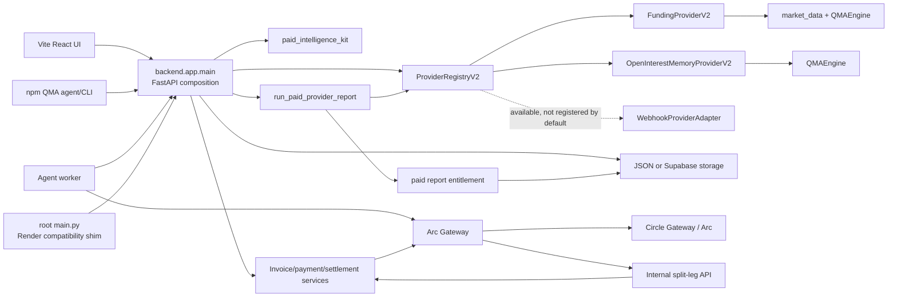
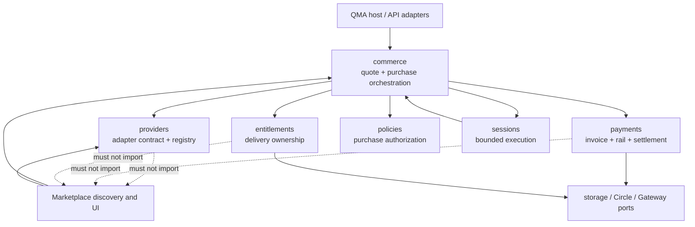
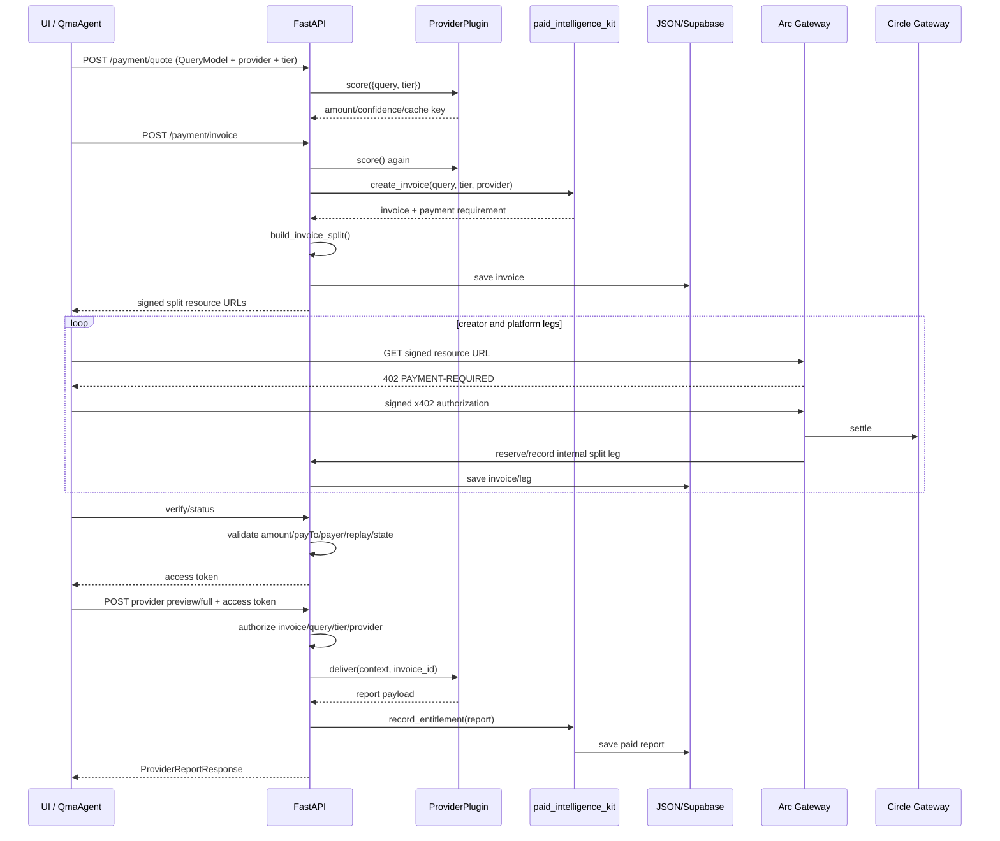

# QMA Commerce Runtime Extraction Audit

**Status:** Architecture proposal only  
**Branch assessed:** `main`  
**Runtime entrypoint:** root `main.py` → `backend.app.main:app`  
**Companion services:** `arc_gateway/server.ts`, `agents/src/worker.ts`  
**Source changes made by this audit:** none  
**Related assessment:** [architecture-assessment.md](architecture-assessment.md)

## Executive conclusion

QMA already contains a reusable commerce execution kernel, but that kernel is
not yet an independent module. It is distributed across the FastAPI
composition root, `paid_intelligence_kit`, the storage compatibility layer, the
Arc Gateway relay, and the npm agent runtime.

The existing reusable transaction is:

```text
Configured provider
  → provider quote/score
  → invoice
  → two-leg USDC payment
  → settlement verification
  → signed access grant
  → provider delivery
  → persisted entitlement
```

The existing marketplace transaction adds these steps before and after it:

```text
Funding/OI discovery
  → recommendation/ranking
  → report-specific purchase identity
  → [commerce transaction]
  → report rendering/chat/catalog/creator analytics
```

The minimum safe extraction is therefore not a rewrite. It is a strangler
refactor around three seams:

1. Introduce generic, read-through identities alongside the legacy
   `symbol`, `tier`, `query`, `query_hash`, and `report` fields.
2. Extract delivery and entitlement materialization from
   `run_paid_provider_report()`.
3. Make marketplace routes and providers call the extracted commerce runtime
   through compatibility adapters.

No payment signature serialization, database table, public route, or legacy
response key needs to be renamed during the extraction.

The target product after extraction is:

> A policy-bound commerce runtime that lets a human or agent buy a configured
> provider service in USDC, verify settlement, receive a deliverable, and retain
> an entitlement.

---

# 1. Architecture Audit

## 1.1 Deployed topology



There are three independently deployed processes in `render.yaml`:

- `qma-api`: starts with `uvicorn main:app`; root `main.py` is therefore a
  required deployment compatibility boundary.
- `qma-arc-gateway`: the Node x402 and Circle relay.
- `qma-agent-worker`: polls backend sessions and runs the npm `QmaAgent`.

The Vite frontend is a client, not part of the server runtime boundary.

## 1.2 Current runtime layer

These behaviors are already generic or close to generic:

| Capability | Current implementation | Generic status |
|---|---|---|
| Provider registration | `ProviderRegistryV2` | Generic identity and lookup; marketplace manifest contract remains |
| Quote orchestration | `ProviderPlugin.score()` plus legacy `quote_price()` | Reusable after separating price quote from intelligence score |
| Invoice creation | `backend.app.main.create_invoice()` and `paid_kit.create_invoice()` | Commerce behavior is generic; request and identity are report-bound |
| Price and settlement profiles | `paid_intelligence_kit/core.py` | Generic except global preview/full tiers |
| Two-recipient allocation | `invoice_builder.build_invoice_split()` | Generic provider/platform revenue split |
| Payment execution | `agents/src/executor/paymentExecutor.ts` | Fully resource-URL driven |
| x402 relay | `arc_gateway/server.ts` | Payment behavior is generic; route and signed query vocabulary are QMA-bound |
| Settlement validation | `settlement_validation.py` | Generic amount/asset/chain/recipient validation |
| Invoice state machine | `payment_state_machine.py` | Generic pending/partial/paid/expired/disputed access semantics |
| Replay protection | settlement-ID guard and `(invoice_id, leg_id)` processing | Generic |
| Access grant | HMAC access token issued by `invoice_builder.py` | Generic mechanism; report identity claims remain |
| Entitlement ownership | `paid_kit.record_entitlement()` and wallet repositories | Generic ownership concept; persisted payload is a report |
| Wallet authentication | wallet profile signed message and short-lived token | Generic |
| Wallet funding/withdrawal | Circle and Arc Gateway integrations | Generic USDC operations |
| Session persistence | `/api/v1/sessions`, Supabase session/event tables | Generic task/budget state |
| Autonomous loop | injected `observe()` and `purchase()` in `session/loop.ts` | Generic control loop |
| Budget and stop policy | npm `SessionPolicy` and backend session budget check | Mechanism is generic; field names and resource identity are report-bound |
| Payment ledger | payment events, split-leg events, platform/wallet summaries | Generic events with report-specific projections |

## 1.3 Current marketplace layer

These behaviors exist to make QMA a Funding/OI report marketplace:

| Capability | Current implementation | Why marketplace-specific |
|---|---|---|
| Market ingestion | `market_data.py` | MEXC/futures signal collection |
| Historical intelligence | `qma_engine.py` | Funding/OI analog analysis |
| Live discovery | `market.py`, provider `scan_live_anomalies()` | Finds market anomalies rather than accepting a configured service input |
| Recommendation engine | `agent_recommendations.py` | Ranks Funding/OI report opportunities |
| Report decisioning | `agent_decision.py`, planner prompts | Selects provider/symbol/tier reports |
| Built-in products | Funding and OI provider plugins | Domain-specific query, price score, and report payload |
| Report catalog | provider manifest and provider endpoints | Marketplace browsing and listing metadata |
| Creator onboarding | provider applications, review, toggles | Marketplace supply-side workflow |
| Report delivery routes | `/preview`, `/full-report`, legacy `/analyze` | Report product API |
| Report chat | `chat.py` | Answers against persisted report content |
| Report analytics | top symbols, tier counts, current/legacy paid reports | Marketplace merchandising metrics |
| Marketplace UI | report workspace, catalog review, signal sidebar, renderers | Funding/OI report presentation |

## 1.4 Key architectural findings

### Finding A — payment is not the main coupling

The payment state machine, amount validation, recipient validation, Circle
lookups, split-leg processing, replay guard, and payment executor do not inspect
Funding or OI payloads. They can survive unchanged.

### Finding B — product identity is the main coupling

The same logical product identity is repeated as:

```text
provider_id + symbol + tier + query_hash
```

It appears in invoices, HMAC URLs, access-token claims, entitlement IDs,
duplicate-purchase policy, analytics, wallet filters, and frontend state.

The generic identity must be introduced as aliases:

```text
provider_id  → provider_id                     (already generic)
symbol       → subject_id                      (optional generic alias)
tier         → offer_id                        (opaque generic alias)
query        → input                           (generic alias)
query_hash   → input_hash                      (generic alias)
resource_type→ service_id/resource_type        (generic identity)
```

Legacy values remain canonical for signing and storage during the migration.

### Finding C — report means two different things

The current word `report` conflates:

1. the purchasable service/product, and
2. the output returned after purchase.

One rename is insufficient. The correct split is:

```text
Report product → Service + Offer
Report output  → Deliverable
```

### Finding D — access grant and entitlement are different

- The access token is a short-lived capability proving that a paid invoice may
  invoke delivery.
- The entitlement is the durable ownership record created after delivery.

They must remain separate abstractions.

### Finding E — settlement does not currently create the entitlement

The entitlement is created only after the buyer calls a report delivery route:

```text
invoice becomes paid
  → access token issued
  → report endpoint invoked
  → provider.deliver()
  → record_entitlement(report=...)
```

This means a paid invoice may exist without a persisted entitlement.

### Finding F — backend duplicate purchase prevention is incomplete

There are three different controls:

- Agent policy avoids an already-owned provider/symbol/tier.
- Entitlement persistence uses a deterministic key and overwrites the same
  logical entitlement record.
- Settlement IDs cannot be claimed by another invoice/leg.

The backend invoice endpoint itself does not reject a second purchase for an
already-owned resource. Therefore “duplicate purchase prevention” is currently
an agent policy and storage-idempotency behavior, not a universal commerce
invariant.

### Finding G — provider delivery idempotency is process-local

`ProviderPlugin.deliver()` caches by `invoice_id` for seven days in an in-memory
dictionary. It prevents duplicate work within one provider process, but it is
not a durable cross-worker idempotency guarantee. Entitlement persistence is
the durable record after delivery.

### Finding H — npm agent does not complete delivery

`QmaAgent` executes and reconciles payment, then records
`access_token_received: true` and `report_unlocked: false`. It does not call
`/preview` or `/full-report`.

An Echo Provider test must explicitly include delivery and entitlement lookup;
the existing npm payment smoke test alone cannot prove runtime independence.

## 1.5 File-by-file dependency map

### Reading convention

- **YES**: the file can move substantially unchanged into the commerce runtime.
- **YES, after aliasing**: responsibility is reusable, but current fields are
  report-specific.
- **NO**: the file is composition, marketplace behavior, UI, or an adapter that
  should remain outside the runtime.
- Empty `__init__.py` files, generated files, assets, environment files, lock
  files, logs, data files, and the read-only `main_ref.py` snapshot are excluded
  because they contain no runtime responsibility.

### Root, deployment, and shared packages

| File | Current responsibility | Depends on | Can move to runtime? | Reason |
|---|---|---|---|---|
| `main.py` | Render entrypoint and legacy test re-exports | `backend.app.main`, state, invoice helpers | NO | Required host compatibility shim |
| `backend/app/main.py` | Composition root plus invoice, verification, access, delivery orchestration | Nearly every backend subsystem | NO | Must first shed runtime functions into services; composition remains host |
| `render.yaml` | Deploys API, gateway, worker | Render process layout | NO | Deployment topology, not runtime code |
| `paid_intelligence_kit/core.py` | Invoice primitives, pricing, access tokens, entitlement records | stdlib, environment | YES, after aliasing | Closest existing runtime kernel; tiers/report payload are coupled |
| `paid_intelligence_kit/__init__.py` | Re-exports paid kit API | `core.py` | YES, after aliasing | Becomes compatibility export surface |
| `storage.py` | JSON and Supabase backend implementations | filesystem/Supabase HTTP | YES, after aliasing | Generic invoices/events plus report-named entitlement storage |
| `qma_engine.py` | Historical Funding/OI analog engine | datasets and numerical analysis | NO | Marketplace provider implementation |
| `market_data.py` | Live market data adapters and anomaly scanning | exchange APIs | NO | Marketplace discovery |

### Backend API boundaries

| File | Current responsibility | Depends on | Can move to runtime? | Reason |
|---|---|---|---|---|
| `api/v1/router.py` | Stale aggregate router target; live app wires router factories directly | endpoint modules | NO | Host composition; docstring no longer matches live wiring |
| `endpoints/health.py` | API, engine DB, Gateway health/config | engine, Circle client, config | NO | Host health mixes runtime and marketplace checks |
| `endpoints/internal.py` | Gateway split-leg lookup/reserve/release/record | invoice store, state machine, HMAC receipt verification | YES | Runtime-only internal settlement coordination |
| `endpoints/payments.py` | Quote, invoice, settlement, verify, withdrawal HTTP API | schemas and injected commerce functions | YES, after aliasing | Generic flow with report descriptions and request fields |
| `endpoints/sessions.py` | Session CRUD, queue claiming, events, agent wallet operations | Supabase backend, wallet auth, Circle wallet service | YES | Generic bounded-agent session infrastructure |
| `endpoints/wallets.py` | Wallet summaries, payments, wallet token, report entitlements | payment ledger, entitlement repository, wallet profiles | YES, after aliasing | Mixed generic wallet APIs and report detail/filter naming |
| `endpoints/platform.py` | Platform metrics, payer/payment pages, traction | payment events and provider summaries | YES, after aliasing | Commerce observability mixed with report metrics |
| `endpoints/reports.py` | Paid preview/full report routes and legacy aliases | `run_paid_provider_report`, access token | NO | Marketplace compatibility adapter after extraction |
| `endpoints/providers.py` | Provider list/stats plus creator application/review/toggle/claim | registry, controls, claims, admin security | NO | Mixes reusable provider revenue data with marketplace governance |
| `endpoints/market.py` | Live anomalies and agent recommendations | discovery and recommendation services | NO | Marketplace discovery |
| `endpoints/agent.py` | Prompt-to-report decision endpoint | recommendations, provider pricing, entitlements | NO | Marketplace decisioning |
| `endpoints/chat.py` | Chat against purchased report | paid report store, access token | NO | Report product feature |

### Backend core and schemas

| File | Current responsibility | Depends on | Can move to runtime? | Reason |
|---|---|---|---|---|
| `core/config.py` | All app, marketplace, payment, Gateway, security settings | environment, paid kit | YES, partially | Extract payment/runtime settings; keep market/admin settings in host |
| `core/state.py` | In-memory invoices, events, paid reports, locks and caches | threading/process locks | YES, after aliasing | Runtime state mixed with marketplace caches |
| `core/provider_registry.py` | Provider protocol, idempotent delivery wrapper, registry | stdlib | YES, after interface split | Registry is reusable; manifest/score/outcome contract is marketplace-shaped |
| `core/rate_limit.py` | Request throttling | FastAPI request | NO | Generic host infrastructure, not commerce domain |
| `core/security_schemes.py` | OpenAPI header definitions | FastAPI | YES, partially | Access/invoice/wallet headers are runtime; admin marketplace header is not |
| `core/openapi_responses.py` | Shared error documentation helpers | schemas | NO | API host support |
| `schemas/response_base.py` | Extensible Pydantic response base | Pydantic | NO | Generic API host utility |
| `schemas/errors.py` | Error response models | Pydantic | NO | Generic API host utility |
| `schemas/internal.py` | Internal split settlement proof | Pydantic | YES | Payment runtime contract |
| `schemas/payments.py` | Invoice/quote/payment proof/withdraw requests | `QueryModel` | YES, after aliasing | Payment proof is generic; invoice and quote inherit crypto query |
| `schemas/payment_responses.py` | Quote, invoice, payment state, settlement, withdraw responses | response base | YES, after aliasing | Generic envelope with provider/tier/report messages |
| `schemas/sessions.py` | Session, event, agent-wallet request/response models | Pydantic | YES | Generic sessions and wallet runtime |
| `schemas/wallets.py` | Wallet profile signature request | Pydantic | YES | Generic wallet authentication |
| `schemas/wallet_responses.py` | Wallet payment and entitlement projections | response base | YES, after aliasing | Entitlement/report/symbol/tier fields require dual vocabulary |
| `schemas/query.py` | Required crypto symbol and market measurements | Pydantic | NO | Marketplace provider input model |
| `schemas/phase3_responses.py` | Report, discovery, provider catalog, creator, analytics, chat responses | multiple schema groups | NO | Mixed marketplace schema file; extract only generic payment projections |
| `schemas/providers.py` | Creator application/review/toggle/claim payloads | Pydantic | NO | Marketplace supply-side model |
| `schemas/platform.py` | Traction summaries | Pydantic | YES, after aliasing | Commerce metrics use report terminology |
| `schemas/agent.py` | Report decision prompt and policy inputs | Pydantic | NO | Marketplace agent decision contract |
| `schemas/chat.py` | Paid report chat request | Pydantic | NO | Marketplace report feature |
| `schemas/health_responses.py` | API/Gateway/engine health envelopes | response base | NO | Host-facing operational schema |
| `schemas/__init__.py` | Public schema re-exports | all schema modules | NO | Compatibility export surface; retain as host adapter |

### Backend services and repository

| File | Current responsibility | Depends on | Can move to runtime? | Reason |
|---|---|---|---|---|
| `services/wallet_utils.py` | EVM address/bytes32 normalization | stdlib | YES | Runtime payment primitive |
| `services/payment_signing.py` | USDC conversion, split URL/receipt HMAC, access-token wrapper | config, paid kit, wallet utils | YES | Generic and security-sensitive; serialization must remain byte-compatible |
| `services/payment_state_machine.py` | Split invoice status and access status | invoice dictionaries | YES | Fully reusable commerce state |
| `services/settlement_validation.py` | Validates asset, network, amount, recipient, payer | payment signing, config | YES | Fully reusable payment invariant |
| `services/x402_gateway.py` | Low-level Gateway settlement and Arc batch lookup | HTTP | YES | Generic external rail client |
| `services/circle_client.py` | Cached Circle/Gateway lookup and reconciliation | state, x402 client, config | YES | Generic rail integration; a few invoice field projections need aliases |
| `services/invoice_builder.py` | Split allocation, replay guard, access token, payment responses | config, paid kit, signing, state machine | YES, after aliasing | Core commerce aggregate builder; report messages and tier normalization remain |
| `services/payment_ledger.py` | Compact events, pagination, attach report summaries | event dictionaries | YES, after aliasing | Ledger is generic; report enrichment must become deliverable enrichment |
| `services/payment_events_service.py` | Platform/wallet/provider payment analytics | ledger, state, creator claims | YES, after aliasing | Generic accounting mixed with tiers/symbols/report counts |
| `services/creator_claims.py` | Provider-owner earnings claim and withdrawal authorization | payment events, signing, config | YES, after renaming | Generic provider payout; “creator” is marketplace vocabulary |
| `services/wallet_profiles.py` | Wallet session token and public/private projections | signing and wallet utils | YES, after aliasing | Generic authorization; entitlement projection says report |
| `services/security.py` | Admin auth, model conversion, query normalization/fingerprint, report key | paid kit, Pydantic | YES, partially | Split generic input fingerprinting from marketplace admin/report helpers |
| `services/providers_meta.py` | Provider metadata, enable controls, split events, revenue stats | registry, events, storage, claims | YES, partially | Provider payout/event functions are runtime; listing/control/stats are marketplace |
| `services/reports.py` | Empty migration placeholder | none | NO | No implemented behavior to extract |
| `services/agent_recommendations.py` | Builds live Funding/OI purchase candidates | providers, pricing, live anomalies | NO | Marketplace discovery |
| `services/agent_decision.py` | Validates and selects report candidates | recommendations, entitlements, provider quote | NO | Marketplace planning |
| `services/plugins/funding_provider.py` | Funding report quote/delivery/discovery/outcome adapter | market data, QMA engine, paid kit | NO | Marketplace provider implementation; later consumes runtime |
| `services/plugins/oi_provider.py` | OI report quote/delivery/outcome adapter | QMA engine, paid kit | NO | Marketplace provider implementation; later consumes runtime |
| `services/plugins/webhook_provider.py` | Secured remote provider adapter | HTTPX, HMAC, SSRF checks, `ProviderPlugin` | YES, after aliasing | Closest generic adapter; manifest/score/outcome and JSON-only response are coupled |
| `repositories/storage.py` | Repository facade for invoices, events, paid reports, provider controls/claims | root storage backend | YES, after aliasing | Core persistence boundary with report-named entitlement methods |

### npm agent runtime and entrypoints

| File | Current responsibility | Depends on | Can move to runtime? | Reason |
|---|---|---|---|---|
| `src/executor/paymentExecutor.ts` | Validates invoices and executes one or multiple x402 legs | signer interface, `fetch` | YES | Resource-driven; no report behavior |
| `src/wallets/signer.ts` | Payment signer contracts | none | YES | Generic x402 buyer primitive |
| `src/wallets/circleSigner.ts` | Circle agent-wallet payment signer | Circle CLI/API | YES | Generic wallet adapter |
| `src/session/loop.ts` | Bounded observe/choose/purchase loop | injected session deps | YES, after aliasing | Mechanism is generic; candidate identity uses symbol/tier |
| `src/session/state.ts` | Session accounting, cooldowns, purchase outcomes | session policy | YES, after aliasing | Report fields and symbol-based cooldown are coupled |
| `src/session/policy.ts` | Budget, provider/tier allowlists, stop/upgrade policy | agent tier | YES, after aliasing | Policy mechanism survives; report/preview/full vocabulary does not |
| `src/executor/dryRunExecutor.ts` | Dry-run purchase projection | decisions/contracts | YES, after aliasing | Generic behavior with QMA candidate model |
| `src/contracts/index.ts` | QMA candidate, entitlement, plan, validation types | none | YES, after aliasing | Core contracts are reusable after resource identity aliases |
| `src/planner/schema.ts` | Parses constrained LLM purchase plans | contracts | YES, after aliasing | Generic plan validation; requested tier is coupled |
| `src/planner/llmPlanner.ts` | Prompt and deterministic fast parser for report purchases | contracts | NO | Prompt grammar assumes report, symbol, tier |
| `src/policy/validateDecision.ts` | Validates candidate, budget, ownership, tier | contracts | YES, after aliasing | Generic policy algorithm with report identity |
| `src/providers/openai.ts` | OpenAI decision generator adapter | OpenAI HTTP API | YES | Generic constrained planner transport |
| `src/qma/client.ts` | Loads QMA recommendations/entitlements and calls invoice APIs | public QMA API | NO | Marketplace client; payment methods can be extracted |
| `src/sdk/QmaAgent.ts` | Composes QMA discovery, decision, payment, reconciliation | client, loop, planner, executor | YES, partially | Session/payment core survives; observation and delivery are QMA-specific/incomplete |
| `src/worker.ts` | Polls QMA sessions, manages agent wallets, runs `QmaAgent` | backend/Gateway routes, wallet signing | YES, partially | Generic worker mechanics with QMA API and report policy defaults |
| `src/index.ts` | npm public exports | all package modules | NO | Keep as backward-compatible package facade |
| `bin/qma.js` | CLI entrypoint | built SDK | NO | Product-facing command |
| `bin/agent_buyer.js` | Legacy/direct buyer CLI | QMA endpoints | NO | Marketplace buyer command |
| `examples/*.ts` | Package usage examples | public npm API | NO | Consumer examples; update after aliases stabilize |

### Arc Gateway

| File | Current responsibility | Depends on | Can move to runtime? | Reason |
|---|---|---|---|---|
| `arc_gateway/server.ts` | x402 challenge/settlement relay, internal split coordination, agent wallet operations | Circle SDK/APIs, backend internal API | YES, partially | Core relay is generic; `/qma-access`, product response, provider/tier HMAC fields are compatibility surface |
| `arc_gateway/decode-batch.ts` | Operational batch decoding helper | chain data | NO | Operations utility |
| `arc_gateway/create_wallet.ts` | Circle wallet bootstrap helper | Circle SDK | NO | Operations utility |
| `arc_gateway/register_entity_secret.ts` | Circle entity-secret setup | Circle SDK | NO | Operations utility |
| `arc_gateway/measure-latency.mjs` | Gateway latency diagnostics | deployed services | NO | Operations utility |

The Gateway is deployed independently and stable. It should not physically move
during the initial extraction. The backend runtime should depend on it through
the existing HTTP contract.

### React frontend

The frontend remains a consumer. “YES, client” means the logic is reusable in a
future commerce client SDK, not that it belongs in the Python server package.

| File/group | Current responsibility | Depends on | Can move to runtime? | Reason |
|---|---|---|---|---|
| `app/App.tsx`, `app/routes.tsx`, `main.tsx` | Product shell and routes | feature pages | NO | UI composition |
| `components/reports/AppPage.tsx` | Full marketplace workflow | all report/payment hooks and stores | NO | Marketplace page |
| `components/reports/SignalSidebar.tsx` | Discovery/recommendation selection | anomalies, entitlements | NO | Marketplace discovery UI |
| `components/reports/ReportWorkspace.tsx` | Report/paywall workspace | report state and renderers | NO | Marketplace presentation |
| `components/reports/FundingReportRenderer.tsx` | Funding report rendering | `PaidReport` | NO | Domain-specific UI |
| `components/reports/OIReportRenderer.tsx` | OI report rendering | `PaidReport` | NO | Domain-specific UI |
| `components/reports/AppHeader.tsx` | Marketplace header and wallet actions | app state | NO | UI only |
| `components/marketplace/MarketplaceReview.tsx` | Provider applications/review/toggle | provider admin services | NO | Marketplace governance UI |
| `components/paywall/PaywallPanel.tsx` | Preview/full report paywall | tier/report copy | NO | Marketplace UI |
| `components/modals/AgentBuyerModal*.tsx` | Interactive report buyer flow | agent/invoice/report services | NO | Marketplace UI |
| `components/modals/AutonomousAgentModal.tsx` | Session monitoring and report purchase events | session APIs | NO | UI; session concepts are reusable elsewhere |
| `components/modals/ProviderEarningsModal.tsx` | Provider earnings/claims UI | provider services | NO | Marketplace UI |
| `components/profile/ProfileOrdersPage.tsx` | Wallet purchases and reports | wallet/payment services | NO | UI; commerce order view is reusable conceptually |
| `components/traction/*.tsx` | Platform report/payment analytics | traction services | NO | UI with report metrics |
| `components/landing/LandingPage.tsx` | QMA marketplace marketing | platform metrics | NO | Product marketing |
| `components/api-docs/ApiDocsPage.tsx` | Embedded API documentation | backend docs | NO | UI only |
| `components/modals/{Deposit,UnifiedDeposit,UnifiedWithdraw,Profile,ModalShell}.tsx` | Wallet/profile UI | wallet services | NO | UI only |
| `components/wallet/{FundArcWalletModal,FundArcWalletModalContent,WalletDropdown}.tsx` | Wallet funding/actions | wallet/Gateway services | NO | UI only |
| `components/ui/*.tsx` | Shared presentation primitives | React | NO | Generic UI, not commerce runtime |
| `components/agent/AgentBuyerDemo.tsx` | Agent buyer placeholder/demo | React | NO | UI/demo |
| `hooks/usePayment.ts` | Invoice payment plus report unlock coordination | invoices, x402, reports | YES, client after split | Payment half is generic; unlock call is report-specific |
| `hooks/useQuote.ts` | Provider/tier/query quote | invoice service | YES, client after aliasing | Generic quote hook with report input |
| `hooks/usePendingInvoiceCache.ts` | Resumable invoice cache | browser storage, report identity | YES, client after aliasing | Generic mechanism; cache key is provider/symbol/tier |
| `hooks/useAgentBuyer.ts` | Report recommendation and purchase state | agent services | NO | Marketplace workflow |
| `hooks/useProviders.ts` | Provider catalog and live anomalies | provider services | NO | Marketplace discovery |
| `hooks/useProviderEarnings.ts` | Provider ownership/earnings | provider services | YES, client after split | Provider revenue is reusable; catalog controls are not |
| `hooks/usePlatformMetrics.ts` | Platform analytics loading | traction service | YES, client after aliasing | Commerce observability with report projections |
| `hooks/useFundArcWallet.ts`, `useWalletConnection.ts`, `useQuickProfile.ts` | Wallet connection/funding/profile | wallet services | YES, client | Generic wallet client behavior |
| `services/invoices.ts` | Quote/invoice/verify/status/settlement/withdraw calls | API client | YES, client after aliasing | Commerce client boundary |
| `services/x402.ts` | x402 header preparation | browser crypto | YES, client | Generic payment client |
| `services/gatewayCrypto.ts` | Gateway deposit/withdraw data encoding | chain constants | YES, client | Generic Circle/Arc client |
| `services/wallet.ts`, `walletProfileSession.ts`, `agentWallet.ts` | Wallet/session/funding operations | API and wallet provider | YES, client after aliasing | Report detail method must be split from wallet profile |
| `services/reports.ts` | Preview/full report delivery | API client | NO | Marketplace adapter |
| `services/providers.ts` | Catalog, anomalies, applications, toggles, claims | API client | NO | Marketplace service; extract earnings separately |
| `services/agent.ts` | QMA agent recommendation/decision/session calls | API client | NO | Marketplace client |
| `services/traction.ts` | Commerce and report metrics | API client | YES, client after aliasing | Generic transaction metrics with report names |
| `services/api.ts` | Base URL, fetch/error utilities | browser environment | NO | Generic UI infrastructure |
| `state/invoiceStore.ts` | Query/tier/invoice/verification state | QMA types | YES, client after aliasing | Commerce state with report identity |
| `state/reportStore.ts` | Active paid report state | QMA report type | NO | Marketplace state |
| `state/walletStore.tsx`, `agentWalletStore.tsx` | Wallet and agent-wallet state | wallet services | YES, client | Reusable wallet state |
| `types/qma.ts` | All frontend marketplace/payment types | none | YES, partially | Extract payment/wallet types; retain report types for adapters |
| `utils/format.ts` | Formatting including tiers/symbols/report states | QMA types | NO | UI utility with product vocabulary |
| `styles/*.css` | Product visual presentation | CSS | NO | UI only |

### Tests and smoke checks

| File/group | Current coverage | Extraction role |
|---|---|---|
| `tests/unit/test_payment_state_machine.py` | Invoice/split/access states | Runtime invariant test; retain unchanged |
| `tests/unit/test_storage_double_claim.py` | Settlement claim replay guard | Runtime invariant test; retain unchanged |
| `tests/unit/test_response_models_runtime.py` | Extensible payment/entitlement models | Extend with generic aliases |
| `tests/unit/test_phase3_responses.py` | Report payload legacy synchronization | Marketplace compatibility test |
| `tests/api_v1/test_api_internal.py` | Internal split-leg coordination | Runtime API compatibility |
| `tests/api_v1/test_api_sessions.py` | Session ownership, queue, events, wallet | Runtime API compatibility |
| `tests/api_v1/test_api_reports_and_wallets.py` | Paid delivery, persisted report, wallet ownership | Main strangler compatibility suite |
| `tests/api_v1/test_api_health_market_providers.py` | Provider/payment/status behavior | Mixed runtime/marketplace suite |
| `tests/api_v1/test_api_platform_and_creators.py` | Metrics, creator claims, withdrawals | Split commerce metrics from marketplace expectations |
| `tests/api_v1/test_api_agent.py` | Report decisioning and ownership checks | Marketplace compatibility suite |
| `tests/api_v1/test_api_chat.py` | Paid report chat access | Marketplace compatibility suite |
| `tests/api_v1/test_api_openapi_docs.py` | Public route/schema/security inventory | Mandatory for every public alias or route change |
| `agents/scripts/payment_executor_smoke.mjs` | Generic split payment executor | Runtime smoke test |
| `agents/scripts/session_smoke.mjs` | Injected observe/purchase loop | Runtime smoke after vocabulary aliases |
| `agents/scripts/qma_agent_payment_smoke.mjs` | QMA invoice payment/reconciliation | Marketplace adapter compatibility |
| Other agent smoke scripts | CLI/planner/parser behavior | Marketplace/package compatibility |

---

# 2. Dependency Map

## 2.1 Runtime dependency direction

The extracted runtime must use one-way dependencies:



The marketplace may depend on the runtime. The runtime may not depend on:

- `market_data.py`;
- `qma_engine.py`;
- Funding/OI schemas;
- report routes or renderers;
- creator application/review workflow;
- anomaly/recommendation services.

## 2.2 Current purchase and delivery dependency graph



## 2.3 Cryptographic dependency

The split URL signature serializes the following fields in this exact order:

```text
invoice_id /
provider_id /
tier /
leg_id /
amount_raw /
normalized pay_to /
integer expires_at
```

Both Python and TypeScript implement that serialization. Renaming the query
parameters or changing the field order would invalidate in-flight URLs.

The extraction must therefore map:

```text
service.provider_id → legacy provider_id position
offer.offer_id      → legacy tier position
```

without changing the signed string.

The access token separately binds:

- `invoice_id`;
- `settlement_id`;
- payer;
- `symbol`;
- `query_hash`;
- `provider_id`;
- `tier`;
- `resource_type`;
- amount, settlement, and accounting metadata.

Generic claims can be added only as unsigned aliases inside the already signed
token body, while legacy claims remain accepted until all old invoices and
tokens have expired.

---

# 3. Domain Model Audit

## 3.1 Vocabulary mapping

| Current concept | Generic concept | Coupling type | Minimum compatibility rule |
|---|---|---|---|
| Report product | Service | Behavioral | Keep `resource_type="qma_signal_report"` as a valid service ID |
| Report output | Deliverable | Behavioral | Read/write `report` and `deliverable` through one adapter |
| Report Provider | Provider / ProviderAdapter | Mostly naming | Keep `provider_id` unchanged |
| Tier | Offer | Behavioral | Keep `preview`/`full` values and legacy `tier` field |
| Symbol | Subject | Behavioral | Make `subject_id` optional; preserve required `symbol` on report routes |
| Query | Input | Mostly naming | Preserve canonical query serialization |
| Query hash | Input hash | Naming with security impact | Alias only; hash bytes must not change |
| Report Purchase | Purchase / Invoice | Naming | Invoice remains the purchase aggregate |
| Report Ownership | Entitlement | Naming plus payload coupling | Keep entitlement IDs and physical storage |
| Report Access | Access Grant | Naming plus claim coupling | Keep access-token legacy claims and validation |
| Funding Recommendation | Marketplace feature | Fully behavioral | Do not move into runtime |
| OI Recommendation | Marketplace feature | Fully behavioral | Do not move into runtime |

## 3.2 Semantic occurrence inventory

This inventory is at the file/type boundary. It intentionally ignores comments,
documentation prose, generated output, CSS selectors, and test fixture strings.

### Report → Service + Deliverable

| Current files | Current type/behavior | Suggested abstraction |
|---|---|---|
| `paid_intelligence_kit/core.py` | `record_entitlement(report=...)`, nested `report` | `Deliverable`, entitlement adapter |
| `backend/app/main.py` | `build_preview_report`, `invoice_report_meta`, `run_paid_provider_report` | `DeliveryService.deliver_purchase()` |
| `schemas/phase3_responses.py` | `ProviderReportResponse`, legacy payload synchronization | Marketplace response adapter over `Deliverable` |
| `schemas/wallet_responses.py` | `report`, `has_report`, report detail response | `deliverable`, `has_deliverable` aliases |
| `endpoints/reports.py` | preview/full report delivery routes | Marketplace adapter |
| `endpoints/wallets.py` | report snapshot route and entitlement list | Generic entitlement route plus legacy adapter |
| `repositories/storage.py`, root `storage.py` | paid-report repository/table/file methods | `EntitlementRepository` logical facade |
| `payment_ledger.py` | attaches report summaries to payments | attach deliverable summaries |
| `payment_events_service.py` | report counts and symbol/tier analytics | purchase/deliverable metrics |
| provider plugins | generate report-shaped dictionaries | provider-specific `Deliverable.payload` |
| `agents/src/qma/client.ts` | reads `raw.report` | read `deliverable ?? report` |
| `agents/src/session/state.ts` | `report_unlocked`, `report_summary` | `deliverable_received`, `deliverable_summary` aliases |
| `frontend/src/types/qma.ts` | `PaidReport` | marketplace view over `Deliverable` |
| report services/store/renderers | fetch/store/render reports | marketplace consumer only |
| `arc_gateway/server.ts` | `product: "qma-report"` on legacy non-split route | compatibility response |

### Report Provider → Provider

| Current files | Current type/behavior | Suggested abstraction |
|---|---|---|
| `core/provider_registry.py` | `ProviderPlugin`, `ProviderRegistryV2` | `ProviderAdapter`, `ProviderRegistry` |
| Funding/OI plugins | built-in intelligence providers | marketplace adapter implementations |
| Webhook plugin | remote intelligence provider | generic remote `ProviderAdapter` after contract relaxation |
| `providers_meta.py` | registry metadata, controls, revenue and stats | split runtime provider account from marketplace listing |
| `endpoints/providers.py` | catalog, stats, onboarding, review, claims | keep marketplace endpoints; extract payout endpoint if needed |
| `main.py` | default provider registration | host composition |
| agent contracts/client/policy | provider allowlists and provider-bound identity | retain `provider_id`; already generic |
| frontend provider types/services/UI | listing, live anomalies, creator review | marketplace client |

### Tier → Offer

| Current files | Current type/behavior | Suggested abstraction |
|---|---|---|
| `paid_intelligence_kit/core.py` | global `SUPPORTED_TIERS`, rank-based access | `OfferRef`; legacy offer-policy adapter |
| `schemas/payments.py` | regex-limited preview/full | accept `offer_id` internally; legacy route retains regex |
| payment response schemas and invoice builder | tier label and token claim | `offer_id` aliases; preserve signed `tier` |
| provider manifests/plugins | `price_tiers`, preview/full payload shaping | provider offer definitions |
| agent contracts/planner/policy/state | union type and allowed tiers/upgrades | generic `offerId`; retain legacy aliases |
| wallet/analytics schemas/services | tier filters, counts, revenue | offer projections |
| frontend types/hooks/state/paywall | preview/full UX | marketplace offer presentation |
| Arc Gateway | price fallback and HMAC query field | immutable legacy serialization |

### Symbol → Subject

| Current files | Current type/behavior | Suggested abstraction |
|---|---|---|
| `schemas/query.py` | required crypto `symbol` | marketplace input schema |
| `paid_intelligence_kit/core.py` | invoice `symbol`, payment resource URL | optional `subject_id` alias |
| `main.py` | symbol equality check before delivery | generic input-hash check; retain symbol check in report adapter |
| storage/repositories/wallet endpoints | symbol filters and summaries | optional subject filter |
| provider plugins/QMA engine/market data | actual crypto instrument | marketplace provider input |
| agent candidate/state/policy | candidate identity and cooldown | generic resource/subject identity |
| analytics/frontend | top/purchased symbols and display | marketplace projection |
| Arc legacy route | returns `symbol` | compatibility response |

### Report Purchase → Purchase/Invoice

| Current files | Current type/behavior | Suggested abstraction |
|---|---|---|
| `schemas/payments.py` | `InvoiceRequest(QueryModel)` | generic `PurchaseRequest` plus legacy request adapter |
| `main.py` | quote, budget check, invoice creation | `CommerceService.create_purchase()` |
| `invoice_builder.py` | invoice aggregate and access response | `Purchase` remains represented by Invoice |
| agent contracts/planner/session | `purchase` action and `PurchaseResult` | retain purchase vocabulary; generalize resource identity |
| frontend invoice/payment flow | purchase orchestration | generic commerce client after aliases |

### Report Ownership → Entitlement

| Current files | Current type/behavior | Suggested abstraction |
|---|---|---|
| `paid_intelligence_kit/core.py` | deterministic entitlement key and record | generic `Entitlement` |
| root/repository storage | `paid_reports` stores and lookups | logical `EntitlementRepository`, legacy physical names |
| wallet response/endpoints | ownership listing/detail | generic entitlement projection |
| payment ledger/events | entitlement link and `has_report` | `has_deliverable` alias |
| agent decision/client/policy | avoids provider/symbol/tier ownership | generic service/input/offer identity |
| frontend profile/sidebar | owned report UI | marketplace view |

### Report Access → Access Grant

| Current files | Current type/behavior | Suggested abstraction |
|---|---|---|
| `payment_signing.py`, paid kit | signed/verified HMAC token | `AccessGrantToken` implementation |
| `invoice_builder.py` | issues token after eligible paid state | `AccessGrantService` |
| `main.py` | authorizes provider/query/tier before delivery | generic access authorization plus legacy report checks |
| report/chat endpoints | consume token | marketplace consumers |
| wallet profile service | uses same signing primitive for wallet session | separate `WalletSessionToken` domain despite common signer |
| frontend/agent | retain token and call protected route | commerce client |

## 3.3 True generic domain model

### `ServiceRef`

Purpose: identifies what can be purchased.

```text
service_id
provider_id
resource_type
```

Dependencies: provider registry and purchase request. It does not require a
catalog or database entity.

### `OfferRef`

Purpose: identifies a price/access variant exposed by a service.

```text
offer_id
```

Dependencies: provider quote and access policy. The runtime treats it as
opaque. The marketplace adapter continues to implement ranked
`preview < full` access.

### `PurchaseRequest`

Purpose: describes a caller-authorized request to buy a configured service.

```text
service_id
provider_id
offer_id
input
buyer_type
buyer_wallet_address
run_source
```

Dependencies: policy, provider quote, invoice creation.

### `Purchase`

Purpose: aggregate for price, payer, recipients, state, expiry and settlement.

The existing invoice is already this aggregate. Creating another persisted
Purchase entity would duplicate state and is not required.

### `Quote`

Purpose: binds provider pricing to an exact input and offer.

```text
provider_id
service_id
offer_id
input_hash
amount_usdc
quote metadata
```

Current `score()` also returns confidence and precomputes a report. Those remain
provider metadata, not commerce requirements.

### `Deliverable`

Purpose: output produced after an authorized purchase.

Dependencies: provider delivery, purchase/access grant, entitlement.

### `Entitlement`

Purpose: durable statement that a payer/logical buyer owns a delivered resource.

Dependencies: purchase, settlement reference, deliverable, storage.

### `AccessGrant`

Purpose: short-lived signed authorization to invoke delivery for one purchase.

Dependencies: paid invoice state, provider/service/input/offer bindings,
settlement.

### `ProviderAccount`

Purpose: stable provider ID, payout wallet, revenue share and enablement.

Dependencies: registry, split allocation, payment events. Marketplace
description, category, UI schema and application status do not belong here.

---

# 4. Runtime Boundary Proposal

## 4.1 Proposed package shape

This is a module extraction map, not a new architecture or repository:

```text
backend/app/runtime/
├── __init__.py
├── providers/
│   ├── contracts.py
│   ├── registry.py
│   └── legacy_report_adapter.py
├── commerce/
│   ├── contracts.py
│   ├── quote_service.py
│   ├── purchase_service.py
│   └── delivery_service.py
├── entitlements/
│   ├── models.py
│   ├── service.py
│   └── repository.py
├── payments/
│   ├── invoice.py
│   ├── state_machine.py
│   ├── signing.py
│   ├── settlement.py
│   ├── ledger.py
│   └── gateway_client.py
├── sessions/
│   ├── contracts.py
│   └── service.py
└── policies/
    ├── purchase_policy.py
    └── budget_policy.py
```

The npm package keeps its own runtime implementation:

```text
agents/src/runtime/
├── commerceClient.ts
├── contracts.ts
├── paymentExecutor.ts
├── sessionLoop.ts
└── policy.ts
```

It should not import Python modules. It shares wire contracts only.

## 4.2 Responsibilities

### `providers`

- Define provider identity, quote and delivery ports.
- Preserve delivery idempotency contract.
- Hold registry and legacy provider adapter.
- Exclude discovery, recommendation, creator applications and marketplace UI
  manifests.

### `commerce`

- Coordinate quote → invoice → access → delivery → entitlement.
- Own the mapping between generic identities and legacy invoice fields during
  migration.
- Never validate Funding/OI fields.
- Never execute blockchain calls directly; use payments.

### `entitlements`

- Create and retrieve durable ownership records.
- Project public/private entitlement views.
- Preserve the legacy `qma_paid_reports`/`paid_reports.json` physical stores
  behind a generic repository.
- Do not decide invoice payment state.

### `payments`

- Own invoice state, split allocation, HMAC serialization, settlement
  validation, replay guards, payment ledger and Gateway clients.
- Never import providers’ domain logic or deliverable payload schemas.

### `sessions`

- Persist session/task/budget/runtime state and events.
- Provide queue/worker ownership operations.
- Call commerce through a port.
- Keep UI and marketplace observation outside.

### `policies`

- Enforce budget, maximum price/purchases, allowlists, ownership and stop
  conditions.
- Use service/input/offer identity.
- Retain old report policy fields as aliases in the npm public API.

## 4.3 Compatibility/anti-corruption layer

The marketplace adapter performs these mappings:

```text
Legacy InvoiceRequest.symbol          ↔ PurchaseRequest.subject_id
Legacy InvoiceRequest.tier            ↔ PurchaseRequest.offer_id
Legacy QueryModel payload             ↔ PurchaseRequest.input
Legacy query_hash                     ↔ input_hash
Legacy qma_signal_report              ↔ service_id
Legacy ProviderReportResponse         ↔ Deliverable
Legacy entitlement.report             ↔ Entitlement.deliverable
Legacy has_report                     ↔ has_deliverable
```

During Phases A–C:

- legacy fields remain authoritative on writes that participate in signatures;
- generic readers use `new_field ?? legacy_field`;
- legacy readers use `legacy_field ?? new_field`;
- old API routes remain unchanged;
- old import paths re-export moved functions;
- old physical tables/files remain unchanged.

---

# 5. Provider Abstraction

## 5.1 Current provider contract audit

| Current member | Actual behavior | Generic disposition |
|---|---|---|
| `provider_id` | Stable registry and payment identity | Keep |
| `owner_wallet` | Revenue recipient | Keep as provider account/payout data |
| `manifest()` | Marketplace name/category/description/price tiers/input/UI schemas | Split: descriptor/capabilities are generic; UI/category are marketplace |
| `score(context)` | Precomputes intelligence, selects price, emits confidence and cache key | Rename adapter behavior to `quote`; confidence remains optional metadata |
| `deliver(context, invoice_id)` | Process-local idempotent wrapper | Keep behavior; return `Deliverable` |
| `_deliver_impl()` | Provider-specific report generation | Provider implementation |
| `verify_outcome()` | Later prediction/outcome measurement | Marketplace intelligence extension, not commerce |
| `quote_price()` / `full_report()` | V1 duck-typed fallback | Legacy report adapter only |

No current provider contract implements `health()` or `capabilities()` as
separate methods.

## 5.2 Candidate `ProviderAdapter`

Conceptual interface:

```text
ProviderAdapter
  provider_id
  account()       -> ProviderAccount
  descriptor()    -> ProviderDescriptor
  capabilities()  -> set[Capability]
  quote(input, offer_id) -> Quote
  deliver(input, purchase_context) -> Deliverable
  health()        -> optional ProviderHealth
```

`health()` must remain optional in the minimum refactor. Adding active health
polling would be new product behavior.

`capabilities()` can initially be derived from the existing manifest and
adapter type; no new registry or discovery system is needed.

### Why `purchase()` is not a provider method

The prompt’s example includes `purchase()`, but the current code gives payment
authority to the platform:

- the platform creates the invoice;
- the platform fixes amount and recipients;
- the Gateway settles payment;
- the platform validates settlement and issues access.

Putting `purchase()` on a provider would let the provider cross the trust
boundary it is currently prevented from controlling. The correct API is:

```text
CommerceRuntime.purchase(request)
  → ProviderAdapter.quote(...)
  → Invoice/payment/settlement
  → ProviderAdapter.deliver(...)
```

This preserves existing security rather than redesigning it.

## 5.3 Existing provider adaptation

| Provider | Current implementation | Required adapter | Difficulty |
|---|---|---|---|
| Funding Memory | `FundingProviderV2`; normalizes crypto query, runs QMA engine, builds preview/full report | Map manifest to descriptor, score to quote, report dict to deliverable payload | Medium |
| OI Memory | `OpenInterestMemoryProviderV2`; OI-specific query and report | Same adapter; keep OI input/payload outside runtime | Medium |
| Webhook | Remote `/manifest`, `/score`, `/deliver`, `/verify` with HMAC, SSRF and size controls | Relax required marketplace manifest keys; map remote JSON to deliverable; make outcome optional | Medium |
| Legacy V1 providers | Duck typing via `quote_price` and `full_report` | `LegacyReportProviderAdapter` | Medium–High |

The Webhook adapter is the closest current plugin boundary. Its transport and
security controls are reusable. Its fixed marketplace contract is not:

- manifest requires category, `price_tiers`, `input_schema`, `ui_schema`;
- score requires tier and declared confidence;
- delivery assumes a JSON report;
- verify assumes a prediction outcome.

---

# 6. Deliverable Abstraction

## 6.1 Current report envelope

`ProviderReportResponse` already contains the beginning of a generic envelope:

```text
query / query_hash
tier
invoice
provider identity
paid_at
payload
```

Its remaining top-level Funding/OI fields are synchronized to/from `payload`
for legacy UI compatibility.

## 6.2 Candidate `Deliverable`

```text
Deliverable
  deliverable_id
  purchase_id
  service_id
  provider_id
  offer_id
  input_hash
  kind
  media_type
  payload
  metadata
  delivered_at
```

Only `payload` is provider-owned. Invoice, provider, input, offer and delivery
timestamps are platform-owned and cannot be overwritten by a remote provider.

## 6.3 Supported representations without runtime branching

The runtime stores a JSON-serializable envelope. Providers choose the payload:

| Deliverable kind | Example payload representation |
|---|---|
| Report | `{sections, metrics, evidence}` or the current Funding/OI payload |
| JSON | Any JSON object/array/value |
| Dataset | Inline rows/schema or `{uri, format, checksum}` |
| File | `{uri, name, media_type, size, checksum}` |
| Text | `{text}` |
| API response | `{status, headers, body}` with secrets/redacted headers excluded |
| MCP result | The existing MCP content/result JSON structure |

This abstraction does not add blob storage, URL signing, streaming, MCP
execution, or dataset processing. It only prevents commerce code from branching
on output shape. Large/binary output remains a provider responsibility and is
represented by a descriptor.

## 6.4 Current-to-generic mapping

```text
ProviderReportResponse.query          → Deliverable metadata.input
ProviderReportResponse.query_hash     → input_hash
ProviderReportResponse.tier           → offer_id
ProviderReportResponse.invoice.id     → purchase_id
ProviderReportResponse.provider_id    → provider_id
ProviderReportResponse.payload        → payload
legacy top-level report fields        → marketplace projection of payload
paid_at                               → delivered_at/payment metadata
```

The legacy report response can be produced from a deliverable without changing
the frontend.

---

# 7. Entitlement Audit

## 7.1 Ownership logic

`paid_kit.record_entitlement()` creates:

```text
entitlement_id =
  provider_id : normalized payer : query_hash : normalized tier
```

The record stores provider/buyer/payer identity, query, symbol, tier,
resource type, settlement/payment metadata and the nested report.

Wallet ownership matches either:

- `payer_address`, or
- `buyer_wallet_address`.

This distinction is reusable: an agent/relayer may pay while a logical buyer
wallet owns the result.

## 7.2 Duplicate purchase and idempotency

| Control | Current behavior | Guarantee |
|---|---|---|
| Agent ownership policy | Avoids matching provider/symbol/tier | Prevents duplicates only for compliant agent flows |
| Deterministic entitlement ID | Same logical entitlement overwrites/upserts | Prevents duplicate entitlement rows for same key |
| Provider delivery cache | Caches by invoice ID in one process | Avoids repeated provider work locally |
| Settlement replay guard | Rejects a settlement ID claimed elsewhere | Prevents payment proof reuse |
| Split reservation | Serializes invoice/leg processing | Prevents concurrent duplicate leg recording |
| Backend invoice endpoint | No owned-entitlement check | Does not prevent repeat purchases |

No new duplicate-purchase behavior should be introduced as part of extraction.
The generic runtime must preserve these exact semantics.

## 7.3 Access checks

Delivery authorization validates:

1. invoice exists and has not expired;
2. provider ID matches the requested provider;
3. no terminal settlement failure is known;
4. invoice state permits access;
5. report adapter symbol matches;
6. canonical input hash matches;
7. access-token signature and expiry;
8. token invoice/provider/input/settlement bindings;
9. tier rank unlocks the requested report tier.

The generic service keeps checks 1–4 and 6–8. The marketplace adapter keeps
symbol equality and preview/full rank behavior.

## 7.4 Entitlement dependency graph

```mermaid
flowchart TD
    SETTLED[Paid invoice state] --> TOKEN[issue_invoice_access_token]
    TOKEN --> AUTH[authorize_paid_invoice]
    AUTH --> DELIVER[ProviderPlugin.deliver]
    DELIVER --> RESPONSE[ProviderReportResponse]
    RESPONSE --> RECORD[paid_kit.record_entitlement]
    RECORD --> MEMORY[state.paid_reports]
    MEMORY --> REPO[repository.save_paid_reports]
    REPO --> JSON[paid_reports.json]
    REPO --> SUPA[qma_paid_reports]

    JSON --> LOAD[load_paid_reports_for_wallet]
    SUPA --> LOAD
    LOAD --> LIST[list_wallet_entitlements]
    LIST --> WALLET[/entitlements/wallet]
    LOAD --> DETAIL[/wallets/address/reports/id]
    LIST --> AGENT[agent ownership policy]
    LIST --> UI[profile/sidebar]

    EVENTS[payment ledger] --> ATTACH[attach_report_summaries]
    REPO --> ATTACH
```

## 7.5 Minimum entitlement extraction

Introduce a logical repository:

```text
EntitlementRepository
  load_all()
  load_for_owner(owner, subject_id?, provider_id?)
  load_by_id(owner, entitlement_id)
  save(entitlement)
```

Compatibility implementation delegates to:

```text
load_paid_reports
load_paid_reports_for_wallet
load_paid_report_by_id
save_paid_reports
```

Do not rename `qma_paid_reports`, `paid_reports.json`, or existing entitlement
IDs in the extraction PRs.

---

# 8. Invoice / Settlement Audit

## 8.1 Complete flow and service boundaries

| Step | Source of truth | Important dependencies | Marketplace assumption |
|---|---|---|---|
| Purchase request validation | `schemas/payments.py` | `QueryModel` | Required crypto symbol and preview/full |
| Provider lookup | `provider_registry.py`, `providers_meta.py` | enable controls | Provider listing model |
| Quote | provider `score()` or `quote_price()` | provider engine/cache | Confidence and report tier |
| Session budget gate | `backend/app/main.py` | Supabase session row and existing invoices | Field name only; generic budget behavior |
| Invoice construction | `paid_intelligence_kit/core.py` | canonical query and tier | Symbol, tier, report resource |
| Split construction | `invoice_builder.py` | provider payout, HMAC signer | Provider/tier are signed but otherwise generic |
| Persistence | repository + root storage | JSON/Supabase | Invoice schema includes report identity |
| x402 execution | frontend/agent executor + Arc Gateway | signed URLs and Circle | QMA route/query names |
| Split recording | internal endpoints | locks, receipts, settlement validation | No report payload assumption |
| State transition | payment state machine | both legs | No report payload assumption |
| Ledger/event sync | providers_meta/payment ledger | split metadata | Symbol/tier projections |
| Access grant | invoice builder/signing | paid/access status | Symbol/query/provider/tier claims |
| Delivery authorization | `authorize_paid_invoice` | token, invoice, input hash | Symbol and tier rank |
| Delivery | `run_paid_provider_report` | provider registry | Report response envelope |
| Entitlement creation | paid kit/storage | delivered report | Report-named persistence |

## 8.2 Payment invariants that must not change

- Valid invoice states remain `pending → partial_paid → paid`, or
  `pending → expired`; terminal settlement failure may produce `disputed`.
- Both creator and platform legs must be recorded before invoice `paid`.
- Each leg remains bound to exact raw amount and `pay_to`.
- Sidecar receipts remain HMAC-bound to invoice, leg, recipient, amount and
  settlement; newer receipts also bind payer/status and optionally buyer wallet.
- Settlement data is verified through the authoritative Gateway path or the
  documented legacy compatibility path.
- Settlement IDs cannot be reused across invoices/legs.
- Invoice mutation continues through the current service/repository hooks.
- Access cannot be issued for partial, expired or disputed invoices.
- Existing behavior may issue access after both Gateway settlements are
  accepted while the final Arc batch transaction is still pending; a later
  terminal failure revokes further access and marks dispute.

## 8.3 Generic versus marketplace-specific assumptions

| Assumption | Generic? | Extraction action |
|---|---|---|
| USDC with six decimals | Payment-rail specific, not marketplace-specific | Keep |
| Arc Testnet/Gateway x402 | Payment-rail specific | Keep |
| Provider/platform two-leg split | Commerce policy | Keep |
| Provider payout wallet/share | Commerce | Keep |
| Human or agent buyer | Commerce | Keep |
| Buyer wallet may differ from payer | Commerce | Keep |
| Input must be canonically hashed | Commerce/security | Keep |
| Input must contain `symbol` | Marketplace | Legacy adapter only |
| Offer must be preview/full | Marketplace | Legacy adapter only |
| Full offer unlocks preview | Marketplace policy | Legacy offer policy only |
| Output is JSON report | Marketplace | Replace with deliverable envelope |
| Entitlement exists only after delivery | Current commerce lifecycle | Preserve |
| Provider verifies market outcome | Marketplace intelligence | Optional extension outside runtime |

---

# 9. Runtime Independence Score

| Subsystem | Score | Reason |
|---|---:|---|
| Settlement validation | 10/10 | No Funding/OI/report payload dependency |
| Payment state machine | 10/10 | Operates only on invoice and split-leg states |
| Agent payment executor | 10/10 | Executes arbitrary x402 resource URLs |
| Wallet address utilities | 10/10 | Pure payment primitive |
| Circle/Gateway client | 9/10 | Generic rail integration; invoice projections remain |
| Split allocation and replay guard | 9/10 | Generic except signed provider/tier names |
| Wallet profile authentication | 9/10 | Generic; shares token signer but not report semantics |
| Creator/provider payout | 8/10 | Reusable revenue behavior with creator naming |
| Payment ledger | 8/10 | Core events reusable; report-summary enrichment is coupled |
| Invoice aggregate | 7/10 | Payment behavior generic; identity/schema require symbol and tier |
| Access grant | 7/10 | Generic mechanism with report-bound claims and rank access |
| Session persistence | 9/10 | Generic task/budget/state/event store |
| Autonomous session loop | 8/10 | Injected seams are generic; identity/cooldowns are symbol/tier-bound |
| Policy engine | 7/10 | Generic caps/allowlists/stops; report/upgrades are coupled |
| Entitlement | 6/10 | Ownership is generic; identity, payload and physical names are report-specific |
| Provider registry | 6/10 | Registry/delivery wrapper reusable; interface requires marketplace methods |
| Webhook adapter | 6/10 | Strong generic transport/security; fixed intelligence/report schema |
| Platform analytics | 6/10 | Payments/revenue generic; symbols/tier/report counts are not |
| React payment client | 7/10 | x402/invoice flow reusable; hook also unlocks report |
| Arc Gateway service | 8/10 | Settlement relay generic; QMA URLs and HMAC vocabulary are coupled |
| Funding provider | 2/10 | Adapter mechanics reusable; behavior is Funding intelligence |
| OI provider | 2/10 | Adapter mechanics reusable; behavior is OI intelligence |
| Agent decision endpoint | 2/10 | Generic budget checks inside report-specific recommendation flow |
| Recommendation/discovery | 0/10 | Entire purpose is Funding/OI marketplace discovery |
| Report chat/rendering | 0/10 | Consumes report domain content |
| Creator application/review | 1/10 | Could exist in another marketplace, but not needed by commerce runtime |
| Marketplace UI | 0/10 | Product-specific presentation |

**Weighted architectural estimate:** approximately 65–70% of backend/payment/
agent infrastructure is reusable, but only approximately 35–45% is currently
located behind a clean generic boundary.

---

# 10. Refactor Plan

## Phase A — Characterize and introduce abstractions

**Goal:** define generic vocabulary as read-only views without changing
behavior.

1. Add generic domain contracts for service, offer, purchase, deliverable,
   entitlement and access grant.
2. Add lossless compatibility mappers from current invoice/report/entitlement
   dictionaries.
3. Add characterization tests proving:
   - legacy invoice dictionaries round-trip unchanged;
   - legacy report response can be viewed as a deliverable;
   - legacy entitlement IDs do not change;
   - signature inputs are unchanged;
   - existing routes and response keys remain unchanged.
4. Do not move files.
5. Do not add public routes or response fields.

**Files:** 5–8.  
**Effort:** 3–5 engineer days.  
**Risk:** Low.

## Phase B — Introduce aliases in internal services

**Goal:** runtime orchestration uses generic identity while compatibility
boundaries preserve legacy fields.

1. Introduce read-through accessors:

   ```text
   offer_id   = record.offer_id   ?? record.tier
   subject_id = record.subject_id ?? record.symbol
   input      = record.input      ?? record.query
   input_hash = record.input_hash ?? record.query_hash
   deliverable= record.deliverable?? record.report
   ```

2. Split `InvoiceRequest(QueryModel)` internally:
   - legacy public route still accepts `QueryModel`;
   - it maps to a generic purchase request;
   - `symbol` remains required on legacy routes.
3. Extract `deliver_paid_service()` from `run_paid_provider_report()`.
4. Make report route project `Deliverable` back to
   `ProviderReportResponse`.
5. Change entitlement service to accept a deliverable while writing both
   logical views through the legacy physical repository.
6. Add npm type aliases without removing QMA exports.
7. Do not change HMAC arguments, URL fields, access-token legacy claims or
   stored entitlement IDs.

**Files:** 15–25.  
**Effort:** 1.5–3 engineer weeks.  
**Risk:** Medium–High because API, SDK and persistence projections intersect.

## Phase C — Move runtime modules with re-export shims

**Goal:** enforce the dependency direction physically.

1. Move leaf payment modules first.
2. Leave compatibility modules at old import paths that re-export the moved
   symbols.
3. Move invoice/commerce orchestration only after aliases are used everywhere
   internally.
4. Move entitlement repository/service while keeping physical store names.
5. Move provider registry contract and wrap current providers.
6. Keep marketplace endpoints, schemas, providers and UI in place.
7. Keep root `main.py` and Render start command unchanged.
8. Run full API, payment, npm and frontend compatibility checks after each
   move.

**Files:** 20–30, mostly import changes and shims.  
**Effort:** 2–4 engineer weeks.  
**Risk:** Medium for leaf modules; High for composition/import-cycle changes.

## Phase D — Prove runtime independence with Echo Provider

**Goal:** architectural smoke test, not a new production feature.

Echo behavior:

```json
Input:  {"message": "hello"}
Output: {"message": "hello"}
```

Acceptance sequence:

```text
configured Echo adapter
  → quote
  → purchase/invoice
  → both x402 split legs
  → payment verification/access grant
  → deliver
  → entitlement save
  → owner entitlement reload
```

The test must prove:

- no import of `market_data.py` or `qma_engine.py`;
- no `symbol` in the generic request;
- offer is treated as opaque;
- returned deliverable is not `ProviderReportResponse` internally;
- old marketplace routes still pass;
- entitlement survives reload;
- retrying delivery for the same purchase does not create a second logical
  entitlement.

The npm agent path needs an explicit delivery call or a test-owned commerce
client because current `QmaAgent` stops after receiving the access token.

**Files:** 6–10.  
**Effort:** 1–2 engineer weeks.  
**Risk:** Medium; it exposes hidden assumptions but should not change existing
marketplace behavior.

## 10.1 Migration graph

```mermaid
flowchart LR
    A0[Freeze current contracts] --> A1[Generic read-only views]
    A1 --> B1[Input/subject/offer aliases]
    B1 --> B2[Generic delivery service]
    B2 --> B3[Generic entitlement service]
    B3 --> B4[npm aliases]
    B4 --> C1[Move payment leaves]
    C1 --> C2[Move invoice/commerce]
    C2 --> C3[Move entitlements]
    C3 --> C4[Move provider contract]
    C4 --> C5[Marketplace compatibility adapters]
    C5 --> D[Echo end-to-end proof]
```



Every node retains:

- root deployment shim;
- existing API routes;
- existing database/table/file names;
- existing frontend response fields;
- existing HMAC byte serialization.

## 10.2 Backward-compatibility matrix

| Surface | Compatibility technique | Removal timing |
|---|---|---|
| Root `main.py` | Keep wrapper and exports | Not part of extraction |
| Public report routes | Thin adapters over generic delivery | No removal required |
| Request `symbol/tier/query` | Legacy request model maps to generic request | No removal until separately versioned |
| Response `report/tier/symbol` | Dual projection from generic model | No removal until consumers migrate |
| npm `Qma*` exports | Type/class aliases to generic implementations | Next major package only, if ever |
| `paid_reports.json` | Legacy repository adapter | No migration required |
| `qma_paid_reports` table | Legacy physical store | No migration required |
| Entitlement IDs | Preserve current key algorithm | Never change during extraction |
| Split HMAC URL | Preserve field names/order/values | Until a separately versioned signature exists |
| Access-token claims | Dual-read; continue writing legacy claims | At least max invoice/token lifetime after migration |
| Arc `/qma-access` routes | Keep as compatibility rail endpoints | Not part of initial extraction |

---

# 11. Risk Assessment

## 11.1 Risk register

| Risk | Severity | Failure mode | Mitigation |
|---|---:|---|---|
| Split HMAC incompatibility | Critical | In-flight signed URLs return 403 | Never change legacy serialization; golden-vector tests in Python and TS |
| Access-token claim mismatch | Critical | Paid buyer cannot deliver, or wrong resource unlocks | Dual-read claims; retain provider/input/offer/settlement binding |
| Input canonicalization drift | Critical | Existing invoice input hash no longer matches | Generic `input_hash` aliases existing `query_hash`; do not re-hash old records |
| Entitlement ID drift | High | Owned resources disappear or duplicate | Preserve key algorithm and legacy fields |
| Storage authority ambiguity | High | JSON and Supabase paths diverge | Keep repository behavior; verify active backend before any persistence edit |
| Delivery idempotency across workers | High, existing | Provider may execute twice after restart/race | Do not claim stronger guarantee; characterize current behavior before changes |
| Premature entitlement creation | High | Ownership exists before delivery succeeds | Preserve creation after successful delivery |
| Invoice/deliverable lifecycle gap | Medium, existing | Paid invoice has no entitlement until delivery | Preserve behavior; Echo test must exercise delivery |
| Provider interface trust expansion | High | Provider gains control over purchase/settlement | Keep purchase orchestration out of provider |
| Public API drift | High | Frontend/SDK break | Old routes/models remain adapters; API documentation gate |
| Import cycles during moves | Medium–High | App fails to import/start | Move leaves first, use old-path re-exports, one module family per PR |
| Stale router aggregation | Medium | Incorrect assumption about live route wiring | Treat `backend.app.main` router factories as source of truth |
| npm source compatibility | Medium–High | Consumers cannot compile | Preserve `QmaAgent`, `QmaCandidate`, `QmaEntitlement`, `AgentTier` aliases |
| Frontend mixed hook behavior | Medium | Payment succeeds but report does not unlock | Split payment and delivery only after backend adapters exist |
| Analytics semantic drift | Medium | Report metrics change meaning | Keep existing projections; add generic metrics separately only if required |
| Echo mistaken for production feature | Low | Scope expands into catalog/discovery | Keep test-only/configured adapter with no listing work |

## 11.2 Verification gates

At every behavior-affecting phase:

```text
python -m pytest tests/unit/test_payment_state_machine.py -q
python -m pytest tests/unit/test_storage_double_claim.py -q
python -m pytest tests/api_v1/test_api_internal.py -q
python -m pytest tests/api_v1/test_api_reports_and_wallets.py -q
python -m pytest tests/api_v1/test_api_sessions.py -q
python -m pytest tests/api_v1/test_api_openapi_docs.py -q
```

For the npm runtime:

```text
npm --prefix agents run typecheck
npm --prefix agents test
```

For any frontend contract adaptation:

```text
npm --prefix frontend run build
```

For payment-sensitive structural checks:

```text
npm run sg:invoice
npm run sg:ledger
npm run sg:payment-gates
npm run sg:state
```

The API documentation gate in `AGENTS.md` applies whenever a public route,
field, status, authentication rule or deprecation marker changes.

## 11.3 Estimated total impact

| Work | Unique files |
|---|---:|
| Runtime contracts and compatibility views | 5–8 |
| Backend alias/delivery/entitlement integration | 15–25 |
| Physical module extraction and shims | 20–30 |
| npm runtime aliases/adapters | 8–12 |
| Tests, OpenAPI inventory and docs | 12–18 |
| Echo independence proof | 6–10 |
| Total eventual unique files, accounting for overlap | Approximately 55–70 |

Estimated engineering effort is approximately 5–8 engineer weeks if shipped as
small, independently deployable PRs. The payment kernel itself should require
little behavioral change; most work is compatibility mapping, dependency
inversion, import movement and characterization.

---

# 12. Recommended First PR

## Title

**`runtime: add lossless commerce domain views and freeze legacy contracts`**

## Scope

1. Add generic domain contracts:
   - `ServiceRef`;
   - `OfferRef`;
   - `PurchaseView`;
   - `Deliverable`;
   - `EntitlementView`;
   - `AccessGrantView`.
2. Add pure compatibility mapping functions that read current dictionaries.
3. Add golden fixtures from:
   - a current split invoice;
   - a current `ProviderReportResponse`;
   - a current paid-report entitlement.
4. Assert mapping to generic views and back produces the original legacy
   records byte-for-byte for signed/hashed fields.
5. Add cross-language golden HMAC test vectors without modifying signing code.
6. Document the dependency rule: runtime contracts cannot import marketplace
   modules.

## Explicit non-goals

- No public API fields.
- No database changes.
- No new routes.
- No provider registration changes.
- No file moves.
- No HMAC/access-token changes.
- No frontend changes.
- No Echo Provider yet.

## Expected files

```text
backend/app/runtime/__init__.py
backend/app/runtime/commerce/contracts.py
backend/app/runtime/compat/legacy_qma.py
tests/unit/test_runtime_legacy_mapping.py
tests/unit/test_payment_signing_golden_vectors.py
agents/scripts/payment_signing_golden_smoke.mjs
docs/runtime-extraction-refactor.md
```

The exact package split can be reduced to one contract module and one
compatibility module if that better matches review size.

## Acceptance criteria

- No change to OpenAPI JSON.
- No change to current report response JSON.
- No change to persisted invoice or entitlement dictionaries.
- Python and TypeScript produce/verify the existing split signature vectors.
- Existing unit/API/npm tests remain green.
- New runtime modules do not import `qma_engine`, `market_data`, Funding/OI
  providers, report schemas or marketplace endpoints.

## Why this is the safest first PR

It establishes vocabulary and executable compatibility evidence before any
production path is redirected. It also exposes whether a proposed generic model
can represent current records losslessly. If the mapping is not lossless, the
refactor stops before payment, persistence or API behavior changes.

---

# 13. Recommended File Move Order

No file should move before Phase B aliases are in use. Every move keeps a
re-export module at the old path until all callers are migrated.

## Move 0 — no physical move

Add contracts, compatibility views and dependency tests only.

## Move 1 — pure payment primitives

```text
services/wallet_utils.py
services/payment_signing.py
```

Target:

```text
runtime/payments/wallets.py
runtime/payments/signing.py
```

Reason: leaf dependencies with stable behavior. Move together because signing
depends on wallet normalization.

## Move 2 — payment state and validation

```text
services/payment_state_machine.py
services/settlement_validation.py
```

Target:

```text
runtime/payments/state_machine.py
runtime/payments/settlement.py
```

Reason: invoice-only logic; no provider payload dependency.

## Move 3 — external payment clients

```text
services/x402_gateway.py
services/circle_client.py
```

Target:

```text
runtime/payments/gateway_client.py
runtime/payments/circle_client.py
```

Reason: depends on payment primitives/state but not marketplace delivery.

The separately deployed `arc_gateway/` directory remains in place.

## Move 4 — invoice builder and payment response assembly

```text
services/invoice_builder.py
generic portions of paid_intelligence_kit/core.py
schemas/payment_responses.py
```

Target:

```text
runtime/payments/invoice.py
runtime/commerce/purchase_service.py
runtime/commerce/contracts.py
```

Reason: only safe after generic identities alias legacy symbol/tier/query
without changing signatures.

## Move 5 — ledger and accounting

```text
services/payment_ledger.py
generic portions of services/payment_events_service.py
generic portions of services/creator_claims.py
```

Target:

```text
runtime/payments/ledger.py
runtime/payments/analytics.py
runtime/payments/provider_payouts.py
```

Reason: depends on stable invoice/event contracts. Keep report analytics in the
marketplace host.

## Move 6 — entitlement repository and service

```text
generic record/list functions from paid_intelligence_kit/core.py
repositories/storage.py entitlement functions
root storage.py paid-report implementations
schemas/wallet_responses.py entitlement models
```

Target:

```text
runtime/entitlements/models.py
runtime/entitlements/service.py
runtime/entitlements/repository.py
```

Reason: high persistence risk; move after payment identities and aliases are
stable. Physical store names remain.

## Move 7 — provider contract and registry

```text
core/provider_registry.py
generic provider-account functions from providers_meta.py
services/plugins/webhook_provider.py
```

Target:

```text
runtime/providers/contracts.py
runtime/providers/registry.py
runtime/providers/webhook.py
```

Reason: commerce and entitlements must already expose generic contracts before
provider delivery can return them.

Funding/OI provider files do not move; they import the runtime contract through
marketplace adapters.

## Move 8 — delivery orchestration

Extract from `backend/app/main.py`:

```text
authorize_paid_invoice
invoice_report_meta generic portion
run_paid_provider_report generic portion
```

Target:

```text
runtime/commerce/access_service.py
runtime/commerce/delivery_service.py
```

Keep in the host:

```text
build_preview_report
ProviderReportResponse projection
report route wiring
legacy symbol/tier validation
```

Reason: this is the central dependency inversion. Move it only when provider,
payment and entitlement contracts are stable.

## Move 9 — sessions and policies

Backend session endpoints can depend on a runtime session service. In the npm
package, extract generic aliases around:

```text
session/loop.ts
session/state.ts
session/policy.ts
executor/paymentExecutor.ts
```

Keep QMA observation, prompts, recommendations and `QmaClient` as marketplace
adapters.

## Move 10 — host adapters only

Update, but do not relocate:

- `backend/app/main.py`;
- payment/internal/wallet/session router factories;
- report/provider/market/agent/chat endpoints;
- root `main.py`;
- `render.yaml`;
- Funding/OI providers;
- React marketplace.

At this point the marketplace is a consumer of the runtime and the Echo smoke
test can prove an independent commerce flow.

---

# Final assessment

The extraction is feasible without a rewrite because the most security-critical
code is already mostly marketplace-blind. The dangerous work is not settlement
logic; it is changing the repeated product identity and delivery/entitlement
shape without breaking signatures, stored ownership, public APIs or npm
consumers.

The safe strategy is:

```text
characterize
  → alias
  → extract delivery/entitlement seams
  → move leaf modules with re-export shims
  → adapt marketplace
  → prove independence with Echo
```

If followed in that order, QMA Marketplace continues to run throughout the
refactor, while the reusable product that emerges is a generic Agent Commerce
Runtime rather than a second marketplace implementation.
