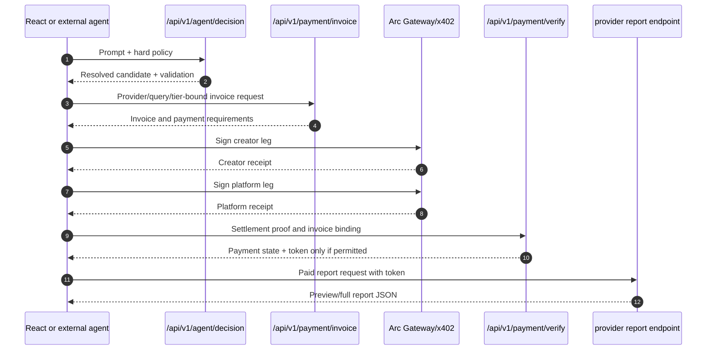

# QMA Agent API

QMA exposes the same paid-intelligence decision boundary to the React UI and
external agents. The browser is optional; the backend API is the contract.

## Agent decision contract

```http
POST /api/v1/agent/decision
Content-Type: application/json
```

Example no-spend request:

```json
{
  "prompt": "Find the best preview report under 0.01 USDC",
  "budget_usdc": 0.01,
  "max_price_usdc": 0.005,
  "allowed_providers": ["funding_memory", "oi_memory"],
  "allowed_tiers": ["preview", "full"],
  "limit": 25,
  "use_llm": false
}
```

The endpoint:

1. loads recommendations and wallet entitlements;
2. optionally asks the configured backend LLM for a minimal plan;
3. resolves the candidate from authoritative QMA data;
4. validates provider, tier, price, budget, score, ownership, and query;
5. returns a decision for the caller to accept or reject.

The response includes:

```text
plan
validation
resolved_candidate
canonical_query
policy_check
rejected_candidates
evaluated_candidates
selection_basis
candidate_count
decision_source
```

The LLM cannot supply an invoice secret, payment recipient, split leg, access
token, settlement id, or report content.

The hosted endpoint uses only the model/provider configured by the server. It
does not accept raw `llm_model`, `llm_provider`, or API-key overrides from a
request. SDK consumers that need BYOK planning can pass a local
`decisionGenerator` to `QmaAgent`; the resulting plan is still validated
against authoritative QMA candidates and policy.

## Autonomous Agent Sessions

Wallet-owned sessions use `X-QMA-Wallet-Token`:

```text
POST   /api/v1/sessions
GET    /api/v1/sessions?owner_wallet=0x...
GET    /api/v1/sessions/{session_id}
PATCH  /api/v1/sessions/{session_id}
POST   /api/v1/sessions/{session_id}/start
POST   /api/v1/sessions/{session_id}/stop
POST   /api/v1/sessions/{session_id}/resume
DELETE /api/v1/sessions/{session_id}
GET    /api/v1/sessions/owner/{owner_wallet}/wallet
POST   /api/v1/sessions/withdraw
```

The trusted worker uses `x-qma-internal-secret` for queue claiming, events,
runtime-state updates, and status checks. Browser/client code must never
receive this secret. Owner updates cannot directly forge worker status or
runtime state.

Agent Wallet bindings are persisted in the `agent_wallets` registry (one
Circle Agent Wallet per owner wallet, migration
`scripts/migrations/20260824_agent_wallets.sql`) so the binding — and any
USDC the wallet holds — survives session deletion. Lookup order is registry
first, then the legacy `agent_sessions.runtime_state` binding; DELETE is only
blocked with 409 when a funded binding exists in neither place.

## Buyer sequence



## Consumers

The React UI calls this same endpoint through
`frontend/src/services/agent.ts` and `frontend/src/hooks/useAgentBuyer.ts`.
The external CLI calls it through `examples/agent_session.mjs` or
`examples/agent_buyer.mjs`. Both consumers must treat the backend response as
the canonical decision boundary and must not reconstruct provider prices or
entitlements independently.

CLI commands, Circle wallet setup, dry-run/live behavior, and troubleshooting
belong to [examples/README.md](../examples/README.md). The bounded polling
policy and session accounting belong to
[AUTONOMOUS_AGENT.md](../architecture/AUTONOMOUS_AGENT.md). Payment invariants
belong to [`PAYMENT_FLOW.md`](../../PAYMENT_FLOW.md). The complete endpoint and
auth inventory is in [`docs/api/README.md`](../api/README.md).
