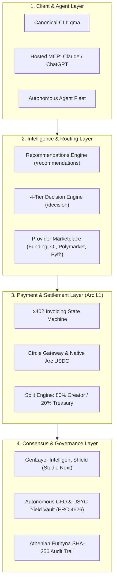

# QMA: Quantitative Market Anomaly Network
## *An Autonomous Machine-to-Machine Intelligence & Verifiable Settlement Protocol on Arc*

**Whitepaper Version:** 2.0  
**Date:** September 2026  
**Core Technical Target:** Arc Layer 1 (`eip155:5042` / `eip155:5042002`)  
**Consensus & Verification Rail:** GenLayer Intelligent Contracts (`studio-next`, Chain ID: `61997`)  
**Canonical Repository:** `https://github.com/hoanlv214/genqma`  
**License:** MIT  

---

## Abstract

As autonomous artificial intelligence agents transition from advisory copilots to economically sovereign actors, they require frictionless, trustless, and deterministic rails for purchasing real-time financial intelligence. Traditional financial application programming interfaces (APIs) rely on human-centric identity, credit card billing, recurring subscriptions, and manual authentication—mechanisms entirely incompatible with machine speed and autonomy. Concurrently, legacy smart contract architectures suffer from volatile gas tokens, slow and probabilistic finality, and an inability to natively evaluate the veracity of off-chain quantitative market data without centralized oracles.

This paper presents **QMA (Quantitative Market Anomaly Network)**, an end-to-end, machine-native quantitative intelligence and micropayment protocol built natively on **Arc**—Circle’s Layer 1 blockchain where **USDC serves as the native gas token**. QMA introduces five interlocking primitives:
1. **The x402 Micropayment Protocol**: A deterministic, machine-negotiated settlement mechanism operating over HTTP 402, executing pay-per-call nanopayments ($0.002 to $0.005 USDC) with single-hop and split settlement (`x402_direct_split`).
2. **Dynamic Signal Discovery & 4-Tier Decision Engine**: A cascading inference pipeline (Fast Regex, Laya System-1 local neural classifier, LLM semantic planner, and deterministic greedy utility optimization) that allows AI agents to scan market anomalies and execute purchases within strict budget policies in under 35 milliseconds.
3. **GenLayer Intelligent Contract Shield (`GenQMAShield`)**: A decentralized validation gate that executes non-deterministic web rendering and multi-validator AI consensus on-chain to cryptographically verify market claims against authoritative external exchanges (MEXC, Binance, Polymarket, Pyth) prior to unlocking payouts, completely eliminating fraudulent and hallucinated alpha.
4. **Autonomous Corporate Treasury & AI CFO**: An automated corporate governance and yield engine that sweeps platform revenues into ERC-4626 USYC vaults (~6.5% APY), maintains programmatic liquidity reserves, and enforces automated circuit breakers.
5. **The Athenian Euthyna Cryptographic Audit Trail**: An immutable, SHA-256 hash-chained accounting ledger inspired by ancient Athenian magistrates, proving uninterrupted balance continuity and operational integrity across all agent actions.

---

## 1. Introduction & The Machine Commerce Paradox

### 1.1 The Rise of Autonomous Economic Agents
The convergence of Large Language Models (LLMs), reinforcement learning, and decentralized finance has catalyzed the emergence of autonomous economic agents—software systems capable of perceiving market environments, formulating strategic hypotheses, and executing transactions without human intervention. In high-frequency, quantitative crypto markets, access to actionable intelligence (e.g., perpetual futures funding rate anomalies, open interest crowding, cross-exchange basis divergence, and liquidation stress bands) is the primary determinant of alpha.

### 1.2 The Machine Commerce Paradox
Despite rapid advancements in agent cognition, the infrastructure for machine commerce remains broken:
* **The Web2 Bottleneck**: Contemporary financial data providers (Bloomberg, Kaiko, CoinMetrics, Glassnode) enforce corporate SaaS pricing ($500–$5,000/month), KYC verification, human credit cards, and static API keys. An autonomous agent with a $10 USDC daily operating budget cannot purchase a single observation.
* **The Blockchain Fee Paradox**: On Ethereum and standard EVM chains, executing a $0.002 payment requires paying $0.50 to $15.00 in volatile gas tokens (ETH, SOL, AVAX). The agent must maintain multiple token balances, absorb severe market volatility, and submit to probabilistic transaction ordering and MEV sandwiching.
* **The Oracle Veracity Vacuum**: When an agent purchases "alpha" or quantitative reports from an untrusted third party, decentralized oracles cannot inspect the contents of the report. If the seller fabricates data, the buyer has no recourse.

```
+-------------------------------------------------------------------------------+
|                             THE MACHINE COMMERCE GAP                          |
|                                                                               |
|  [ Human SaaS Web2 ] ---> Requires Credit Cards, KYC, Fixed Subscriptions    |
|  [ Legacy EVM L1s  ] ---> Volatile Gas Tokens, Probabilistic Reorgs, MEV     |
|                                                                               |
|                                     vs.                                       |
|                                                                               |
|  [ QMA on Arc      ] ---> USDC Native Gas, Sub-Second Finality, Nanopayments  |
|  [ GenLayer Shield ] ---> Intelligent Contract Consensus, Zero Hallucinations |
+-------------------------------------------------------------------------------+
```

QMA resolves this paradox by unifying Arc’s sub-second deterministic finality and native USDC gas with GenLayer’s intelligent consensus engine, establishing the foundational protocol for autonomous quantitative commerce.

---

## 2. The Arc Foundation: Infrastructure for Machine Finance

QMA is architected exclusively for **Arc**, Circle’s Layer 1 blockchain optimized for institutional capital and autonomous agents.

### 2.1 Native USDC Gas Architecture
Unlike traditional blockchains that require a secondary utility token for transaction execution, Arc utilizes native USDC (`0x3600000000000000000000000000000000000000`) as both the transaction asset and the gas token:
$$\text{Cost}_{\text{Tx}} = \text{GasUsed} \times \text{GasPrice}_{\text{USDC}}$$

For standard value transfers ($\text{Gas} = 21,000$), transaction fees remain deterministic, sub-cent, and immune to speculative token bubbles. Agents manage only a single unit of account (USDC), eliminating swap slippage, liquidity friction, and multi-asset balance tracking.

### 2.2 Sub-Second Deterministic Finality
Arc delivers block times under 500 milliseconds with deterministic finality. In automated financial commerce, probabilistic finality (e.g., PoW or optimistic rollups with 7-day challenge windows) introduces catastrophic latency and settlement risk. On Arc, an agent requests an invoice, broadcasts a transaction, and receives finalized on-chain proof within a single round-trip.

### 2.3 Circle Gateway & Unified Liquidity
Through deep integration with Circle Gateway (Domain 26 on Arc Testnet, Contract `0x0077777d7EBA4688BDeF3E311b846F25870A19B9`), QMA facilitates instant, chain-abstracted USDC deposits and cross-chain withdrawals via cryptographic BurnIntents.

---

## 3. Protocol Architecture & System Topology

The QMA protocol operates across four distinct horizontal layers:



### 3.1 The Quantitative Signal Providers
QMA acts as a decentralized marketplace for specialized quantitative signal engines:
1. **`funding_memory`**: Detects perpetual futures funding rate anomalies across Bybit, Binance, and MEXC, identifying extreme negative/positive divergence suitable for cash-and-carry basis arbitrage.
2. **`oi_memory`**: Monitors open interest crowding and derivative leverage clustering relative to circulating market cap, predicting impending liquidation cascades.
3. **`polymarket_divergence`**: Evaluates probability spreads between decentralized prediction markets (Polymarket CLOB) and centralized spot/derivative pricing.
4. **`pyth_stress_band`**: Analyzes sub-second Pyth Network oracle confidence intervals ($\sigma$) and price volatility bounds to evaluate liquidation risk and protocol solvency.

---

## 4. The 4-Tier Autonomous Decision Engine

Autonomous agents operate under stringent latency and computational constraints. To minimize operational costs while preserving reasoning capabilities, QMA deploys a cascading 4-tier decision architecture:

```
[ Incoming Prompt / Objective ]
              |
              v
    +-------------------+      Match?
    | Tier 0: Fast Regex| --------------> [ Instant Purchase / Skip (<1ms) ]
    +-------------------+
              | No
              v
    +-------------------+      Confidence >= 0.85?
    | Tier 1: Laya S1   | ----------------------> [ Purchase Action (<35ms) ]
    +-------------------+
              | Low
              v
    +-------------------+      Complex Prompt?
    | Tier 2: LLM Engine| ----------------------> [ Semantic Reasoning (500-1200ms) ]
    +-------------------+
              | Fallback
              v
    +-------------------+
    | Tier 3: Greedy    | ----------------------> [ Maximize Utility V = Score / Price ]
    +-------------------+
```

### 4.1 Tier 0: Sub-Millisecond Regex Fast Parser
Deterministic lexical parser handling structured commands (`buy BTC report budget 0.01`). Resolves candidates in $<1\text{ms}$ with zero inference cost.

### 4.2 Tier 1: Laya System-1 Neural Classifier
A lightweight, local intent classifier optimized for sub-35ms inference. Evaluates natural language commands across multiple languages (English, Spanish, Chinese) without making external network calls.

### 4.3 Tier 2: Large Language Model (System-2)
Invoked only when semantic ambiguity requires deep reasoning. Interfaces with state-of-the-art models (DeepSeek-V3, GPT-4o-mini, Gemini 2.5 Flash) via unified provider routing.

### 4.4 Tier 3: Deterministic Greedy Policy
When no explicit target is requested, the agent maximizes expected utility density across all active candidates:
$$V(c) = \frac{\text{Score}(c)}{\text{Price}_{\text{USDC}}(c)} \cdot \prod_{i} \mathbb{I}(\text{Constraint}_i)$$
subject to:
$$\text{Price}_{\text{USDC}}(c) \le \min(\text{Budget}_{\text{Agent}}, \text{Policy}_{\text{DailyRemaining}})$$

---

## 5. Machine Micropayments (x402 Protocol) & Settlement Mechanics

### 5.1 The x402 Protocol Workflow
QMA implements the open `x402` specification over standard HTTP semantics:

```
Buyer Agent                  QMA API (Arc Gateway)                  Arc L1 & GenLayer
     |                                 |                                     |
     |--- 1. GET /providers/report --->|                                     |
     |<-- 2. HTTP 402 Paywall Challenge|                                     |
     |                                 |                                     |
     |--- 3. POST /payment/invoice --->|                                     |
     |<-- 4. Invoice + HMAC Secret ----|                                     |
     |                                 |                                     |
     |--- 5. Broadcast USDC Transfer --------------------------------------->| (Block Mined)
     |                                 |                                     |
     |--- 6. POST /payment/verify ---->|                                     |
     |    (settlement_id = tx_hex)     |--- 7. Submit to GenQMAShield ------>| (Consensus VALID)
     |                                 |<-- 8. Validated Verdict ------------|
     |<-- 9. HTTP 200 + Access Token --|                                     |
     |                                 |                                     |
     |--- 10. GET /report + Token ---->|                                     |
     |<-- 11. Unlocked Alpha Report ---|                                     |
```

### 5.2 Deterministic Query Snapshot Hashing
To prevent front-running, query substitution, or parameter tampering between invoice issuance and report delivery, the invoice cryptographically binds to the exact canonical query:
$$H_Q = \text{SHA-256}(\text{Canonicalize}(\text{QueryParameters}))$$

If a buyer attempts to redeem an invoice against a modified query or symbol, the API enforces strict invariant rejection (`HTTP 403 Forbidden: Paid invoice is bound to a different query snapshot`).

### 5.3 Automated Split Settlement (`x402_direct_split`)
QMA enforces a deterministic revenue split on every paid report:
* **80% ($\text{bps} = 8,000$)**: Allocated directly to the Signal Provider Creator.
* **20% ($\text{bps} = 2,000$)**: Allocated to the QMA Platform Treasury.

Under the `x402_direct_split` mode, the payment router dispatches split legs independently, allowing decentralized creators to withdraw earnings permissionlessly via Circle Gateway.

---

## 6. Decentralized AI Verification Shield: GenLayer Intelligent Contracts

The core vulnerability of machine data marketplaces is the **Oracle Fabrication Risk**: an adversarial provider can return randomized numbers, collect USDC, and degrade buyer performance.

QMA eliminates this via **`GenQMAShield.py`**, an Intelligent Contract deployed on **GenLayer** (Studio Next, Chain ID `61997`, Contract `0x1e5B4d7Be22A3f7F4Ecb616bA65123cB03B7cc13`).

### 6.1 Non-Deterministic Web Execution
GenLayer validators execute non-deterministic web rendering through sandboxed primitives:
```python
market_data = gl.nondet.web.render(evidence_url, mode="text")
```
Strict URL prefix whitelisting ensures evidence is extracted solely from authoritative exchange endpoints:
$$\text{URL}_{\text{Evidence}} \in \{\text{contract.mexc.com}, \text{clob.polymarket.com}, \text{hermes.pyth.network}, \text{api.binance.com}\}$$

### 6.2 Multi-Validator Consensus Algorithm
GenLayer splits execution into a **Leader** and multiple **Validators**:
1. **Leader Execution**: The leader node renders the live web page, constructs the verification prompt, and queries its embedded LLM for evaluation:
   $$\text{Result}_{\text{Leader}} = \text{LLM}(\text{Prompt}(\text{Invoice}, \text{Evidence}, \text{Manifest}))$$
   $$\text{Result} = \{\text{verdict} \in \{\text{VALID}, \text{INVALID}\}, \text{confidence} \in [0, 100], \text{reasoning}\}$$
2. **Validator Verification**: Each validator independently re-fetches the live evidence, re-runs the prompt, and validates the leader's claim:
   $$\text{ValidatorPass} \iff (\text{Verdict}_V == \text{Verdict}_L) \land (|\text{Confidence}_V - \text{Confidence}_L| \le 20)$$
3. **Consensus Finalization**: The GenLayer VM runs `gl.vm.run_nondet(leader_fn, validator_fn)`. If consensus fails or confidence $< 70\%$, the verdict defaults to `INVALID`.

### 6.3 Slashing & Refund Guarantees
* **If $\text{Verdict} == \text{VALID}$**: The invoice transitions to `status: paid`, an access token is issued, and provider earnings unlock.
* **If $\text{Verdict} == \text{INVALID}$**: The invoice is rejected, the provider's on-chain slash counter increments ($\text{Slashes}_P \leftarrow \text{Slashes}_P + 1$), and the buyer's payment is fully protected.

---

## 7. Autonomous Corporate Treasury & Algorithmic CFO

Platform revenue generated from the 20% protocol fee does not sit idle. QMA implements an autonomous corporate treasury service (`usyc_treasury.py`) that acts as an **Algorithmic CFO**.

```
[ Protocol Revenue: 20% USDC Fee ]
                 |
                 v
+-------------------------------------------------+
|          Autonomous Corporate Treasury          |
|                                                 |
|  Current Liquid Reserve < Target Reserve?       |
|    [Yes] ---> Retain in Liquid USDC Vault       |
|    [No]  ---> Sweep Excess into USYC ERC-4626   |
+-------------------------------------------------+
                 |
                 +---> Earns ~6.5% Benchmark APY
                 |
                 v
+-------------------------------------------------+
|      Athenian Euthyna SHA-256 Audit Trail       |
|                                                 |
|  H_i = SHA256( H_{i-1} || Action || Tx || ... ) |
+-------------------------------------------------+
```

### 7.1 USYC Yield-Bearing Vault Integration (ERC-4626)
Excess operational cash is automatically swept into the USYC Yield Vault deployed on Arc (`0x934e7309d7fca371db946b0643f2136cc0a0fcb2`):
$$\text{Shares}_{\text{Minted}} = \frac{\text{USDC}_{\text{Deposited}}}{\text{SharePrice}_{\text{Vault}}}$$

USYC yields ~6.5% annualized return backed by short-term US Treasury bills, allowing the protocol's operating treasury to grow autonomously. When liquidity demands surge (e.g., high outbound creator claims), the Algorithmic CFO executes **Just-In-Time (JIT) Redemptions**.

### 7.2 Multi-Factor Solvency Evaluation
The CFO agent continuously assesses solvency via a three-variable optimization function:
$$\text{SolvencyRatio} = \frac{\text{LiquidUSDC} + \text{USYCAvailable}}{\text{UpcomingObligations}_{30\text{d}}}$$
* If $\text{SolvencyRatio} < 1.25$: Circuit breaker halts discretionary withdrawals and redeems USYC shares.
* If $\text{SolvencyRatio} \ge 2.50$: Automated idle sweep allocates excess USDC into yield generation.

### 7.3 The Athenian Euthyna Cryptographic Audit Trail
Every treasury sweep, redemption, payment event, and slash is recorded in an immutable, chained cryptographic log:
$$H_i = \text{SHA-256}(H_{i-1} \parallel \text{RecordID} \parallel \text{Timestamp} \parallel \text{Action} \parallel \text{Actor} \parallel \text{Amount} \parallel \text{LiquidBefore} \parallel \text{LiquidAfter} \parallel \text{Shares} \parallel \text{TxHash})$$

This structure guarantees that no administrator, automated agent, or attacker can alter past financial entries without breaking the unbroken hash chain, ensuring regulatory and enterprise audit readiness.

---

## 8. Interfaces & Developer Experience

QMA provides three first-class access modalities designed for both machines and humans:

### 8.1 The Canonical CLI (`qma`)
The primary agent command-line tool (`agents/bin/qma.js`), packaged and published on npm:
```bash
# Autonomous loop: scans, decides, pays, and validates
$ qma agent run --budget 0.05 --live

# Inspect treasury & USYC yield position
$ qma treasury status

# Verify cryptographic audit trail
$ qma audit verify
```

### 8.2 Production REST API v1
Built on FastAPI with 120 endpoints, complete OpenAPI 3.1 specifications, automated Swagger/ReDoc interfaces, and rate limiting (Cloudflare edge + token bucket).

### 8.3 Hosted Model Context Protocol (MCP) Server
Allows Frontier LLMs (Claude Desktop, ChatGPT Agent) to interact directly with QMA using structured tools:
* `qma_get_recommendations`: Discover market anomalies.
* `qma_create_invoice`: Generate deterministic payment orders.
* `qma_verify_settlement`: Trigger on-chain verification.
* `qma_fetch_report`: Retrieve unencrypted intelligence.

---

## 9. Security, Threat Modeling & Technical Invariants

QMA enforces strict architectural invariants verified across **357 continuous automated test suites** (`pytest tests/unit/`, `pytest tests/api_v1/`, and end-to-end commerce validations):

| Invariant | Threat Mitigated | Enforcement Mechanism |
| :--- | :--- | :--- |
| **Idempotency & Replay Defense** | Replay attacks, double-spending | Unique `settlement_id` locking via `cross_process_lock` + PostgreSQL unique constraint |
| **Query Parameter Immutability** | Parameter tampering, front-running | `query_hash = SHA256(canonical_query)` verified at invoice creation and report redemption |
| **HMAC Secret Gating** | Unauthorized verification attempts | Constant-time HMAC comparison (`hmac.compare_digest`) on `invoice_secret` |
| **Zero-Hallucination Shield** | Data fabrication by providers | GenLayer multi-validator consensus with 70% confidence threshold and automated slashing |
| **Non-Finite Money Rejection** | Integer overflow, NaN injection | Strict Pydantic float constraints rejecting `NaN`, `Inf`, and negative values at HTTP boundary |
| **Balance Continuity Invariant** | Treasury embezzlement, ghost assets | Continuous balance verification in Athenian Euthyna engine |

---

## 10. Economics & Protocol Sustainability

Unlike speculative Web3 protocols that rely on inflationary governance token emissions to subsidize usage, **QMA operates on a cash-flow positive, tokenless economic model**:
1. **Real Utility Value**: Every satoshi of USDC paid through the protocol represents actual demand for market intelligence from trading agents.
2. **Sustainable Creator Economics**: Providers receive 80% of net volume directly into their wallets, creating strong incentives for proprietary quantitative firms to list high-conviction models.
3. **Compounding Platform Treasury**: The 20% protocol fee continuously accrues to the platform, generating institutional yield via USYC T-bill backing. Protocol expansion is funded directly from organic yield.

---

## 11. Conclusion & Roadmap

QMA demonstrates that autonomous AI agents no longer need to rely on human financial intermediaries. By pairing **Arc’s native USDC gas and sub-second finality** with **GenLayer’s Intelligent Contract consensus**, QMA creates the first verifiable, trustless, and high-frequency quantitative intelligence marketplace in production.

### Roadmap Horizons
* **Horizon 1 (Current)**: Arc Testnet & GenLayer Studio Next deployment, 4 quantitative providers, USYC Treasury integration, full PostgreSQL persistence.
* **Horizon 2 (Q4 2026)**: Arc Mainnet launch, expansion to bilateral agent-to-agent storefronts, multi-currency StableFX settlement (EURC, cirBTC).
* **Horizon 3 (2027)**: Cross-chain agent federation via Circle Gateway, institutional confidential computing enclaves (TEE) for proprietary alpha algorithms.

---

## References

1. Circle Internet Financial. *The Unfinished Business of Finance, Machine Commerce, and Global Money: A Request For Builders*. Arc.io Research, September 2026.
2. GenLayer Foundation. *Intelligent Contracts: Non-Deterministic Execution and Multi-Validator Consensus for AI on Blockchain*. GenLayer Technical Documentation, 2026.
3. Circle Internet Financial. *Circle Agent Stack: Programmable USDC Wallets and x402 Micropayments for Autonomous Agents*. Developer Documentation, 2026.
4. EIP-4626: *Tokenized Vault Standard*. Ethereum Improvement Proposals, 2022.
5. Athenian Constitution (*Athenaion Politeia*). *On the Auditing of Financial Magistrates by the Euthynoi*. Classical Antiquity Historical References, 4th Century BCE.
